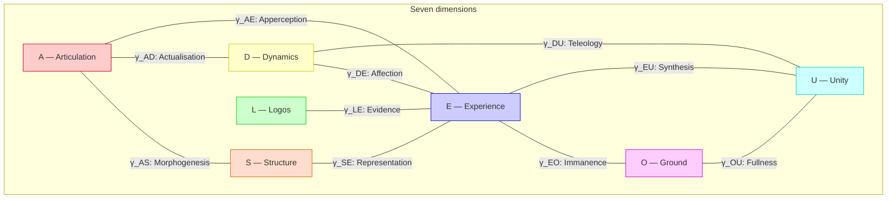
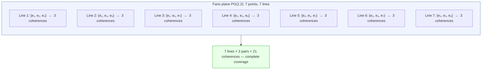

# Qualia Structure: A 21-Pair Taxonomy

:::info Bridge from the previous chapter
In the section [L0–L4 Hierarchy](/docs/consciousness/hierarchy/interiority-hierarchy) we established **when** conscious experience arises: a system at level L2 and above possesses reflection ($R \geq 1/3$) and integration ($\Phi \geq 1$). Now we ask: **what** is this experience made of? What exact types of experience are possible in 7-dimensional space? The answer is given by the coherence matrix $\Gamma$ and its 21 off-diagonal elements.
:::

:::note On notation
- $\Gamma$ — [coherence matrix](/docs/core/dynamics/coherence-matrix), $\gamma_{ij}$ — its elements
- $P = \mathrm{Tr}(\Gamma^2)$ — [purity (viability)](/docs/core/dynamics/viability#определение-чистоты)
- $\rho_E = \mathrm{Tr}_{-E}(\Gamma)$ — [reduced experience matrix](/docs/consciousness/foundations/interiority-theory)
- $\Phi$ — [integration measure](/docs/core/structure/dimension-u#мера-интеграции-φ)
- $R$ — [reflection measure](/docs/consciousness/foundations/self-observation#мера-рефлексии-r)
- Full notation table — in [Notation](/docs/reference/notation)
:::

### Chapter roadmap

1. **Philosophical history of the problem** — from Lewis to Jackson and Dennett
2. **Motivation** — why exactly 21 types and where this number comes from
3. **Full table** — all 21 coherences with phenomenological names
4. **Parametric structure** — three dimensions of each quale (intensity, perspective, opacity)
5. **Closure theorem** — proof that 21 types exhaust everything
6. **Fano structure** — how 21 pairs are organised into 7 sectors, and how twenty-one channels share seven colours
7. **Diagonal elements** — 7 population modes as the "background" of experience
8. **The mechanism of quality** — where the irreducible part of experience lives (holonomy), and how qualia fade
9. **Access conditions** — at which $R$ and $\Phi$ qualia become conscious
10. **The passport** — the five-layer procedure that reads a state's experiential content off $\Gamma$
11. **The ecology of colour** — who writes quality, how the world hands it down, and why the subject arrives last

---

## Philosophical History: What Are Qualia? {#история}

The word **qualia** (Lat. *qualia*, pl. of *quale* — "of what kind", "of what sort") denotes the **subjective qualities of experiences**: what it is like to see red, to hear C major, to smell coffee. Behind this simple question lies one of the deepest problems in philosophy.

### Lewis (1929): the first definition

The American philosopher **Clarence Irving Lewis** in "Mind and the World Order" (1929) first introduced the term "qualia" into systematic use. He noted: when we see a red rose, there is something that *cannot be conveyed to someone blind from birth* — the subjective quality of "redness". That quality is the quale. Lewis distinguished:

- **Quale** — the ineffable subjective quality (what it is like to see red)
- **Property** — an objective characteristic (wavelength 700 nm)

### Jackson (1982): Mary's room

**Frank Jackson** in the famous thought experiment "Mary's Room" (1982) pushed the problem to its limit:

> Mary is a brilliant neuroscientist who has spent her whole life in a black-and-white room. She knows *everything* about the physics of colour: wavelengths, the workings of retinal cones, neural correlates. One day Mary leaves the room and sees a red rose for the first time. **Does she learn something new?**

Jackson argued: **yes**. Mary learns what it is *like* to see red. Hence physical facts do not exhaust reality — there is something beyond them (qualia).

### Dennett (1988): qualia as illusion

**Daniel Dennett** took the opposite position. In the article "Quining Qualia" (1988) he argued that qualia are a **philosophical illusion**: we think we experience something "ineffable" and "private", but in fact all information about experiences is encoded in functional states of the brain. No "remainder" is left after a complete physical description.

### UHM position: qualia as coherence structure

The Unitary Holonomic Monism offers a **third path**, coinciding with neither Jackson's dualism nor Dennett's eliminativism:

- Qualia are **not an illusion** — they have a precise mathematical structure (coherences $\gamma_{ij}$)
- Qualia are **not a separate substance** — they are the off-diagonal elements of the same matrix $\Gamma$ that describes the "physics" of the system
- The distinction between "subjective" and "objective" is the distinction between the **inner** and **outer** perspectives of the same mathematical structure (dual-aspect monism, see [Two-Aspect Monism](/docs/consciousness/foundations/two-aspect-monism))

Mary in the room knew all the *diagonal* properties ($\gamma_{ii}$) of red. But she did not know the *coherences* — how visual discrimination ($A$) binds with interiority ($E$), forming the quale of apperception ($\gamma_{AE}$). On leaving the room, she did not acquire a new *fact* — she acquired a new *coherence*.

---

## Motivation: Why 21 Types? {#мотивация}

The coherence matrix $\Gamma$ is a $7 \times 7$ Hermitian matrix on the space of [seven dimensions](/docs/core/structure/dimensions) $\{A, S, D, L, E, O, U\}$. Let us recall what each dimension means:

| Symbol | Name | Meaning |
|--------|------|---------|
| $A$ | Articulation | Discrimination, differentiation |
| $S$ | Structure | Stable forms, patterns |
| $D$ | Dynamics | Processes, changes |
| $L$ | Logos | Logical coherence, rules |
| $E$ | Experience | Interiority, experience |
| $O$ | Ground | Source, deep foundation |
| $U$ | Unity | Integration, wholeness |

The matrix $\Gamma$ contains two kinds of elements:

- **7 diagonal elements** $\gamma_{ii}$ — dimension populations (how much "resource" is in each dimension)
- **21 off-diagonal pairs** $(\gamma_{ij}, \gamma_{ji})$ for $i < j$ — coherences (how the dimensions are connected to each other)

Number of pairs:

$$
\binom{7}{2} = \frac{7 \cdot 6}{2} = 21
$$

Each coherence $\gamma_{ij}$ carries phenomenological content determined by the semantics of the dimension pair $(i, j)$.

**An everyday analogy.** Imagine an orchestra of 7 musicians. Each plays their own part (7 diagonal elements — the "volume" of each instrument). But music is born not from individual sounds, but from their **interaction** — from how the violin "converses" with the cello, how the flute echoes the bassoon. There are exactly $\binom{7}{2} = 21$ such pairwise interactions. Each produces a unique "timbre" of combined sound — that is the type of quale.

```mermaid
graph TB
    subgraph dims["Seven dimensions"]
        A["A — Articulation"]
        S["S — Structure"]
        D["D — Dynamics"]
        L["L — Logos"]
        E["E — Experience"]
        O["O — Ground"]
        U["U — Unity"]
    end

    A ---|"γ_AS: Morphogenesis"| S
    A ---|"γ_AD: Actualisation"| D
    A ---|"γ_AE: Apperception"| E
    S ---|"γ_SE: Representation"| E
    D ---|"γ_DE: Affection"| E
    D ---|"γ_DU: Teleology"| U
    E ---|"γ_EO: Immanence"| O
    E ---|"γ_EU: Synthesis"| U
    O ---|"γ_OU: Fullness"| U
    L ---|"γ_LE: Evidence"| E

    style A fill:#ffcccc,stroke:#cc0000
    style S fill:#ffddcc,stroke:#cc6600
    style D fill:#ffffcc,stroke:#cccc00
    style L fill:#ccffcc,stroke:#00cc00
    style E fill:#ccccff,stroke:#0000cc
    style O fill:#ffccff,stroke:#cc00cc
    style U fill:#ccffff,stroke:#00cccc
```

The diagram shows only 10 of the 21 coherences — the rest connect each pair of dimensions in an analogous way. The complete table of all 21 types is given below.

## Interpretation: 21-Pair Qualia Taxonomy (I.1) {#таксономия}

:::info Interpretation I.1 (Qualia taxonomy) [I]
Each coherence $\gamma_{ij}$ ($i \neq j$) of the matrix $\Gamma$ defines a **type of quale** — a qualitatively determinate mode of experiential content. The 21 pairs exhaust all possible types, since $\binom{7}{2} = 21$ is the complete set of connections in a 7-dimensional system.

This is an **interpretation** (a mapping from the formal to the phenomenal), not a mathematical theorem. The mathematical content is trivial combinatorics; the phenomenological assignment is a semantic postulate.
:::

### Complete table of 21 qualia types {#полная-таблица-21-типа-квалиа}

:::warning Epistemic separation
**Mathematical layer [T]:** 21 coherences $\gamma_{ij}$ form 4 sectors according to Fano structure (T-146 [T]). Each coherence is uniquely determined by its combinatorial profile (T-177 [T]).

**Semantic layer [I]:** Phenomenological names ("morphogenesis", "archetype", "teleology", etc.) are interpretive correlates [I], proposed on the basis of the functional roles of dimension pairs. Mathematics determines $\gamma_{ij}$ unambiguously; the interpretation of "what it is like to experience $\gamma_{AS}$" is philosophical, not mathematical.
:::

| # | Pair | Coherence | Name | Phenomenological content |
|---|------|-----------|------|--------------------------|
| 1 | $(A,S)$ | $\gamma_{AS}$ | **Morphogenesis** | Crystallisation of distinctions into stable forms — the experience of "taking shape" |
| 2 | $(A,D)$ | $\gamma_{AD}$ | **Actualisation** | Actualisation of discrimination in process — the experience of "perception" |
| 3 | $(A,L)$ | $\gamma_{AL}$ | **Predication** | Discrimination that has become a predicate — the experience of "judgement" |
| 4 | $(A,E)$ | $\gamma_{AE}$ | **Apperception** | Discrimination that has entered interiority — the experience of "awareness" |
| 5 | $(A,O)$ | $\gamma_{AO}$ | **Spontaneity** | Emergence of distinctions without external cause — the experience of "insight" |
| 6 | $(A,U)$ | $\gamma_{AU}$ | **Differentiation** | Discrimination within the whole — the experience of "analysis" |
| 7 | $(S,D)$ | $\gamma_{SD}$ | **Persistence** | Form that persists through process — the experience of "stability" |
| 8 | $(S,L)$ | $\gamma_{SL}$ | **Nomos** | Structure with logical necessity — the experience of "order" |
| 9 | $(S,E)$ | $\gamma_{SE}$ | **Representation** | Structure presented in interiority — the experience of "whole form" |
| 10 | $(S,O)$ | $\gamma_{SO}$ | **Archetype** | Forms from the ground — the experience of "deep pattern" |
| 11 | $(S,U)$ | $\gamma_{SU}$ | **Symmetry** | Structural unity — the experience of "harmony" |
| 12 | $(D,L)$ | $\gamma_{DL}$ | **Regulation** | Logically governed process — the experience of "control" |
| 13 | $(D,E)$ | $\gamma_{DE}$ | **Affection** | Process acting on interiority — the experience of "emotion" |
| 14 | $(D,O)$ | $\gamma_{DO}$ | **Genesis** | Generation from the ground — the experience of "creativity" |
| 15 | $(D,U)$ | $\gamma_{DU}$ | **Teleology** | Integrated directed change — the experience of "volitional effort" |
| 16 | $(L,E)$ | $\gamma_{LE}$ | **Evidence** | Logical coherence in interiority — the experience of "self-evidence" |
| 17 | $(L,O)$ | $\gamma_{LO}$ | **Grounding** | Logic rooted in the ground — the experience of "axiomatic self-evidence" |
| 18 | $(L,U)$ | $\gamma_{LU}$ | **Consistency** | Logical non-contradiction of the whole — the experience of "coherence" |
| 19 | $(E,O)$ | $\gamma_{EO}$ | **Immanence** | The ground present within interiority — the experience of "presence" |
| 20 | $(E,U)$ | $\gamma_{EU}$ | **Synthesis** | Integration of interior content into a whole — the experience of "unity" |
| 21 | $(O,U)$ | $\gamma_{OU}$ | **Fullness** | Identity of source and whole — the experience of "completeness" |

### How to read the table: an extended example

Consider a person absorbed in solving a mathematical problem. Their $\Gamma$-profile at that moment:

| Coherence | Value | Experience |
|-----------|-------|------------|
| $\lvert\gamma_{AL}\rvert \approx 0.35$ | High | Predication — attention on logical connections, "I am formulating" |
| $\lvert\gamma_{LE}\rvert \approx 0.30$ | High | Evidence — the experience of "clarity", "I understand" |
| $\lvert\gamma_{DU}\rvert \approx 0.20$ | Medium | Teleology — the sense of a goal, "I am heading toward a solution" |
| $\lvert\gamma_{DE}\rvert \approx 0.05$ | Low | Affection — emotions muted, "I feel nothing" |
| $\lvert\gamma_{EO}\rvert \approx 0.03$ | Low | Immanence — no deep presence, "I am thinking, not meditating" |

Now a friend approaches and shares good news. The $\Gamma$-profile instantly reorganises:

| Coherence | Before | After | What happened |
|-----------|--------|-------|---------------|
| $\lvert\gamma_{DE}\rvert$ | $0.05$ | $0.25$ | Affection soared — "I feel joy" |
| $\lvert\gamma_{SE}\rvert$ | $0.08$ | $0.20$ | Representation — "I see the whole picture" of the news |
| $\lvert\gamma_{AL}\rvert$ | $0.35$ | $0.12$ | Predication fell — the problem receded to the background |

All 21 types of qualia exist simultaneously, but with different intensities, creating the unique "flavour" of each moment.

### Parametric structure of qualia {#параметрическая-структура}

Each qualitative type $\gamma_{ij}$ is a **complex number**. Like any complex number, it is written in polar form:

$$
\gamma_{ij} = |\gamma_{ij}| \cdot e^{i\theta_{ij}}
$$

Here $|\gamma_{ij}|$ is the modulus (distance from zero to the point on the complex plane), and $\theta_{ij}$ is the argument (angle with the positive real axis). From these two parameters three phenomenological characteristics are extracted:

| Parameter | Formula | Range | Phenomenological meaning |
|-----------|---------|-------|--------------------------|
| **Intensity** | $\lvert\gamma_{ij}\rvert$ | $[0, \sqrt{\gamma_{ii}\gamma_{jj}}]$ | How strongly this type of quale is experienced |
| **Perspective** | $\theta_{ij} = \arg(\gamma_{ij})$ | $[0, 2\pi)$ | "Angle of view" on the connection between dimensions |
| **Opacity** | $\mathrm{Gap}(i,j) = \lvert\sin\theta_{ij}\rvert$ | $[0, 1]$ | Measure of discrepancy between external description and internal experience |

#### Upper bound on intensity

The intensity is bounded by the **Cauchy–Schwarz inequality** — a fundamental inequality of linear algebra stating that the correlation between two components cannot exceed the geometric mean of their "energies":

$$
|\gamma_{ij}|^2 \leq \gamma_{ii} \cdot \gamma_{jj}
$$

**Numerical example.** Let $\gamma_{AA} = 0.15$ (15% of resources in Articulation) and $\gamma_{EE} = 0.18$ (18% in Interiority). Then the maximum possible intensity of apperception:

$$
|\gamma_{AE}|_{\max} = \sqrt{0.15 \times 0.18} = \sqrt{0.027} \approx 0.164
$$

If we were to observe $|\gamma_{AE}| = 0.20$, this would be mathematically impossible — the Cauchy–Schwarz inequality is violated, meaning an error has been made in the measurements.

#### Three parameters: analogy

**Analogy.** The three parameters of qualia are like three properties of sound:

| Sound parameter | Qualia parameter | Analogy |
|-----------------|-----------------|---------|
| **Loudness** | Intensity $\lvert\gamma_{ij}\rvert$ | How "loud" the experience is |
| **Timbre** | Perspective $\theta_{ij}$ | The "colouring" of the experience — the same quale seen from a different angle |
| **Muffling** | Opacity $\mathrm{Gap}(i,j)$ | As if the sound came from behind a wall |

Gap = 0 — the sound is crystal clear, inner and outer descriptions coincide. Gap = 1 — the sound is fully absorbed by the wall: experience is present, but it is maximally opaque to an external observer. For details on Gap see [dual-aspect semantics of the coherence matrix](/docs/core/dynamics/coherence-matrix#дуально-аспектная-семантика).

**Numerical example: three parameters of a single quale.** Consider the coherence $\gamma_{DE}$ (Affection — the experience of emotion) in a person who has just received good news:

$$
\gamma_{DE} = 0.22 \cdot e^{i \cdot 0.3} \approx 0.22 \cdot (0.955 + 0.296i)
$$

- **Intensity:** $|\gamma_{DE}| = 0.22$ — a fairly strong emotional experience
- **Perspective:** $\theta_{DE} = 0.3$ rad $\approx 17°$ — a "real" perspective (the externally observable aspect predominates)
- **Opacity:** $\mathrm{Gap}(D,E) = |\sin(0.3)| \approx 0.296$ — the experience is 70% transparent, but 30% "hidden" from external description

Compare with $\gamma_{EO}$ (Immanence — the experience of "presence") in a meditator:

$$
\gamma_{EO} = 0.15 \cdot e^{i \cdot 1.2}
$$

- **Intensity:** $|\gamma_{EO}| = 0.15$ — moderate
- **Perspective:** $\theta_{EO} = 1.2$ rad $\approx 69°$ — a strong shift toward the "imaginary" perspective
- **Opacity:** $\mathrm{Gap}(E,O) = |\sin(1.2)| \approx 0.932$ — the experience is almost completely opaque to an external observer

This explains why meditative states are so hard to put into words: a high Gap makes them "ineffable" not for lack of vocabulary, but by mathematical structure.

## Closure Theorem for the Taxonomy (T.1) {#замкнутость}

:::tip Theorem T.1 (Closure of the qualia taxonomy) [T]
The taxonomy of 21 qualia types is **exhaustive**: no additional type of quale is possible in a system with $\dim(\mathcal{H}) = 7$.

**Proof.** The number of distinct (unordered) pairs from $N$ elements equals $\binom{N}{2}$. At $N = 7$ we get $\binom{7}{2} = 21$. Each pair $(i,j)$ defines exactly one coherence $\gamma_{ij}$ (given $\gamma_{ji} = \gamma_{ij}^*$). A new type of quale would require either a new dimension ($N > 7$, contradicting [minimality](/docs/proofs/minimality/theorem-minimality-7)), or a new connection between existing dimensions (impossible — all $\binom{7}{2}$ pairs are accounted for). $\square$
:::

**Corollary.** At $N < 7$ the taxonomy is **impoverished**: $\binom{6}{2} = 15$ (no qualia related to the removed dimension). This is the formal expression of the "poverty" of phenomenology when minimality is violated.

**Numerical example: a world with fewer dimensions.** If the world were 5-dimensional (say $\{A, S, D, L, E\}$ — without $O$ and $U$), the number of qualia types would be $\binom{5}{2} = 10$. From the table one can see that the following would be lost:

| Lost type | Pair | Experience |
|-----------|------|------------|
| Immanence | $(E,O)$ | "Presence", the deep ground of experience |
| Synthesis | $(E,U)$ | "Unity" of experience |
| Fullness | $(O,U)$ | "Completeness", the wholeness of being |
| Teleology | $(D,U)$ | "Volitional effort", purposiveness |
| Archetype | $(S,O)$ | "Deep pattern", the rootedness of form |
| Spontaneity | $(A,O)$ | "Insight", emergence from nowhere |
| + 5 others | ... | ... |

Such a system could "feel" and "think", but could not experience "meaning", "wholeness", or "deep presence". It is precisely the dimensions $O$ and $U$ that give human experience its "vertical" dimension — its connection to depth and to the whole.

:::info $G_2$-orbital stability of the taxonomy [T]
The set of 21 qualia types is **$G_2$-invariant**: the group $G_2 = \mathrm{Aut}(\mathbb{O})$ permutes the 7 dimensions (preserving the Fano structure), inducing a permutation of the 21 coherences $\gamma_{ij}$. The **set** $\{\gamma_{ij}\}_{i<j}$ is preserved, even though individual elements may be permuted. This means: the qualia taxonomy is **universal** — it does not depend on the choice of basis ($G_2$-gauge) and is therefore objective.

Formally: $G_2$ acts on $\binom{[7]}{2}$ via the induced action on pairs, preserving the number $\binom{7}{2} = 21$. The [$G_2$-rigidity theorem](/docs/proofs/categorical/uniqueness-theorem#лемма-g4) [T] guarantees that $G_2$ is the **maximal** group with this property.

**Why does this matter?** If the taxonomy depended on the choice of basis (how to describe the 7 dimensions), it would be arbitrary — an "artefact of description". $G_2$-invariance guarantees that the taxonomy reflects the **structure of the space itself**, not our way of describing it. This is analogous to how the length of a vector does not depend on the choice of coordinate system.
:::

## Fano Structure of Qualia {#фано}

### What is the Fano projective plane?

The [Fano plane](/docs/proofs/minimality/theorem-octonionic-derivation#плоскость-фано) $\mathrm{PG}(2,2)$ is the **projective plane over the two-element field** $\mathbb{F}_2 = \{0, 1\}$. If you have never encountered this object, here is its essence:

An ordinary Euclidean plane contains infinitely many points and lines. The Fano plane is the "minimal" plane satisfying the axioms of projective geometry, and contains only:

- **7 points**
- **7 lines**

Each line passes through exactly **3 points**. Each point lies on exactly **3 lines**. Any two points determine exactly one line. Any two lines intersect in exactly one point.

**Why is the Fano plane in qualia theory?** In UHM, the 7 Fano points are identified with the 7 dimensions $\{A, S, D, L, E, O, U\}$. Then the 7 lines define **7 coherence sectors** — groups of three dimensions within which coherences obey strengthened algebraic constraints. This is not a coincidence: the Fano plane is precisely the **multiplication table of the imaginary units of the octonions** $\mathbb{O}$, and the [octonionic structure](/docs/proofs/minimality/theorem-octonionic-derivation) lies at the foundation of UHM.

```mermaid
graph TD
    subgraph Fano["Fano plane PG(2,2): 7 points, 7 lines"]
        direction TB
        T1["Line 1: {e₁, e₂, e₃}  →  3 coherences"]
        T2["Line 2: {e₁, e₄, e₅}  →  3 coherences"]
        T3["Line 3: {e₁, e₆, e₇}  →  3 coherences"]
        T4["Line 4: {e₂, e₄, e₆}  →  3 coherences"]
        T5["Line 5: {e₂, e₅, e₇}  →  3 coherences"]
        T6["Line 6: {e₃, e₄, e₇}  →  3 coherences"]
        T7["Line 7: {e₃, e₅, e₆}  →  3 coherences"]
    end

    Total["7 lines × 3 pairs = 21 coherences — complete coverage"]
    Fano --> Total

    style Fano fill:#f0f4ff,stroke:#4a6fa5
    style Total fill:#e8ffe8,stroke:#00aa00
```

### Sectoral structure of coherences

Each Fano triplet $(e_a, e_b, e_c)$ defines an associative subalgebra $\mathrm{Im}(\mathbb{H}) \subset \mathrm{Im}(\mathbb{O})$, isomorphic to the imaginary quaternions. The three coherences within the triplet:

$$
\{\gamma_{ab}, \gamma_{bc}, \gamma_{ac}\} \quad \text{--- Fano triple}
$$

satisfy strengthened correlation constraints that are absent for arbitrary pairs.

**Analogy.** Fano triples are like **musical chords**: three notes taken together sound "consonant" — their coherences obey additional harmonic constraints. Three arbitrary notes from seven do not form such harmony. Imagine: C–E–G is a chord (a Fano triple), but C–D–F# is not. It is precisely this sectoral organisation that makes phenomenology *structured* rather than chaotic.

Why do special constraints operate within the triple? Because the triple forms an associative subalgebra (quaternions $\mathbb{H}$), where the associativity of multiplication holds: $(e_a \cdot e_b) \cdot e_c = e_a \cdot (e_b \cdot e_c)$. For pairs from *different* triples associativity breaks down (this is the property of the octonions $\mathbb{O}$), and the constraints are weaker.

:::tip Theorem [T]
Sectoral strengthening is a **theorem** [T]: the bridge from the axioms to the octonionic structure is fully closed (T15), condition (МП) is proved (T11–T13). From the structure of $\mathbb{O}$ the algebraic closure of coherences within Fano triplets follows. Empirical verification of sectoral correlation is an [open question](/docs/reference/falsifiability).
:::

### Coverage of 21 pairs by Fano triplets

Each of the 21 pairs belongs to exactly $\lambda = 1$ Fano line (a property of the projective plane):

$$
\text{21 pairs} = 7 \text{ lines} \times 3 \text{ pairs per line}
$$

This means the qualia taxonomy **contains no "orphaned" pairs** — every type of quale is included in the sectoral organisation. For the [Coherence Cybernetics theorems](/docs/applied/coherence-cybernetics/theorems) this property is essential: sectoral completeness ensures the closure of the [30D emotional space](/docs/proofs/consciousness/operational-closure#t-147) (T-147 [T]).

**Numerical example: checking coverage.** Take the coherence $\gamma_{DE}$ (Affection). It belongs to exactly one Fano line, say the line $\{D, E, X\}$ for some third dimension $X$. This means $\gamma_{DE}$ is algebraically linked to $\gamma_{DX}$ and $\gamma_{EX}$ — emotion ($\gamma_{DE}$) is not "free"; it structurally depends on the two other qualia in its sector. A change in one quale of the triple inevitably affects the other two.

### What a line actually checks {#что-проверяет-прямая}

The previous section says a triple is linked; this one says *how*, and the answer turns out to be the same object the [mechanism of quality](#механизм-качества) is built from.

Take a line $\{i, j, k\}$. Its three pairs are $\{i,j\}$, $\{j,k\}$, $\{i,k\}$ — three **different** qualia, not three copies of one. Suppose each dimension carries a single orientation $s_i = \pm 1$, and two dimensions agree exactly when their orientations match, so that the sign of a coherence is $s_i s_j$. Then multiply the three signs of the line together:

$$
s_i s_j \cdot s_j s_k \cdot s_i s_k = (s_i s_j s_k)^2 = +1
$$

Every orientation appears twice and squares away. **The product of a line's three signs is always $+1$** — not usually, not on average, but identically, and this can be checked by running through all $2^7/2 = 64$ possible orientations one by one.

So a line is a **parity check**. It does not repeat a fact three times; it constrains three different facts to be mutually consistent. And two points determine a line, so each pair belongs to exactly one of the seven — the seven checks are **disjoint**, covering the twenty-one qualia once each. A single corrupted coherence makes its line's product $-1$, which says *that this triple is inconsistent* without saying which of the three is at fault.

**Why this is the same thing as the carrier of quality.** The product above is the sign version of the [Fano holonomy](/docs/applied/research/holarch) — what a phase accumulates going around the triangle $i \to j \to k \to i$. Where the coherences are real, the phase can only be $0$ or $\pi$, and the holonomy collapses to exactly the $\pm 1$ product just computed. So the invariant that carries quality and the check that content is consistent are **one object seen twice**: quality lives in the phase a triple accumulates, and inconsistency is that phase turning over.

This also settles what integration can and cannot tell you. The measure $\Phi$ sums *squared moduli*, so at a fixed magnitude it is completely blind to signs: content in which every triple is consistent and content in which several are broken can produce the identical $\Phi$, and in a laboratory sweep they do — $\Phi$ reads the same at every share of inconsistent verdicts, including none at all. **Integration measures how much coherence there is, not whether it hangs together.** The parity of a line measures the latter, and nothing else in the structure does.

**One practical consequence, and it is a sharp one.** Suppose you use a line the other way — as a repetition code, writing one verdict into all three of its cells so that a corrupted cell is outvoted. Three equal signs multiply to $s^3 = s$. So a repeated **positive** verdict satisfies the parity, and a repeated **negative** one violates it, by construction and every time. A line can serve as a repetition code only while what it repeats is positive; the moment it repeats a negative, the triple it holds is inconsistent and therefore cannot be part of integrable content. The two uses of a line are alternatives, and choosing one costs the other.

### Twenty-one channels, seven colours {#двадцать-один-и-семь}

Two counts run through this chapter and they answer different questions, so it is worth putting them side by side once, plainly.

The **twenty-one pairs** are the *channels* of experience — they say **what** is being experienced: emotion ($\gamma_{DE}$), judgement ($\gamma_{AL}$), presence ($\gamma_{EO}$). Each channel has a volume — its modulus. The **seven lines** are where the *colour* lives — the part of experience that no relabelling can produce or remove: the holonomy $H_p$, one irreducible angle per line. Three channels share each line, the way three strings share a soundboard: each string plays its own note, but the resonance they build together belongs to the instrument, not to any single string.

A printing workshop is the cleanest picture. Twenty-one presses print twenty-one sheets — that is the content, and each press has its own ink level (intensity). But the workshop mixes its colours on **seven palettes**, three presses to a palette. You can reorganise the labels on the presses however you like — swap "cyan" and "teal", renumber the trays — and the sheets will read the same. What you cannot relabel away is what colour each palette actually holds. That is the holonomy: paint, not paperwork.

The full accounting of a state's content is then a short ledger:

| Count | Object | The question it answers |
|-------|--------|------------------------|
| $7$ | populations $\gamma_{ii}$ | *what is the case* — where the resources sit |
| $21$ | moduli $\lvert\gamma_{ij}\rvert$ | *how loudly* each channel plays |
| $7$ | Fano holonomies $H_p$ | *what colour* the experience irreducibly carries |
| $14$ | frame directions ($\mathfrak{g}_2$) | *how it is written down* — the cost-free choice of octonionic frame |

The counts are not decorative: $27 \oplus 14 \oplus 7$ is the exact $G_2$-decomposition of the state's $48$ parameters ([the decoder, T-301](#теорема-декодер)), with the symmetric block carrying populations and moduli and the antisymmetric block splitting into frame and colour. Twenty-one channels, seven colours, and a choice of handwriting — nothing left over, nothing missing.

## Diagonal Elements: 7 Population Modes {#населённости}

In addition to the 21 coherences, the 7 diagonal elements $\gamma_{ii}$ determine the **intensity of presence** of each dimension. Diagonal elements are real numbers (not complex), and they obey the normalisation condition:

$$
\sum_{i=1}^{7} \gamma_{ii} = \mathrm{Tr}(\Gamma) = 1
$$

This means the total "resource" of the system is fixed and equal to 1. Increasing the population of one dimension inevitably decreases the others — like a fixed budget distributed across 7 line items.

| Element | Phenomenological content | Typical range |
|---------|--------------------------|---------------|
| $\gamma_{AA}$ | Degree of discrimination activity | $0.10$–$0.20$ |
| $\gamma_{SS}$ | Degree of form stability | $0.10$–$0.18$ |
| $\gamma_{DD}$ | Degree of process activity | $0.10$–$0.20$ |
| $\gamma_{LL}$ | Degree of logical coherence | $0.08$–$0.18$ |
| $\gamma_{EE}$ | Intensity of interior states | $0.12$–$0.22$ |
| $\gamma_{OO}$ | Degree of connection to the source | $0.08$–$0.15$ |
| $\gamma_{UU}$ | Degree of integration | $0.10$–$0.18$ |

Diagonal elements do not form qualia in the narrow sense (there is no "connection" between different aspects), but they set the **background** against which coherences unfold. An elevated $\gamma_{DD}$ — a background of "activity"; an elevated $\gamma_{EE}$ — a background of "inner life".

### Population profiles: examples

**Meditator in deep practice:**

| $\gamma_{AA}$ | $\gamma_{SS}$ | $\gamma_{DD}$ | $\gamma_{LL}$ | $\gamma_{EE}$ | $\gamma_{OO}$ | $\gamma_{UU}$ | $\Sigma$ |
|:-:|:-:|:-:|:-:|:-:|:-:|:-:|:-:|
| 0.10 | 0.10 | 0.08 | 0.10 | 0.22 | 0.22 | 0.18 | 1.00 |

Interiority ($\gamma_{EE}$) and connection to the ground ($\gamma_{OO}$) dominate. Dynamics ($\gamma_{DD}$) is muted — "thoughts have quieted".

**Athlete in the midst of a match:**

| $\gamma_{AA}$ | $\gamma_{SS}$ | $\gamma_{DD}$ | $\gamma_{LL}$ | $\gamma_{EE}$ | $\gamma_{OO}$ | $\gamma_{UU}$ | $\Sigma$ |
|:-:|:-:|:-:|:-:|:-:|:-:|:-:|:-:|
| 0.20 | 0.12 | 0.22 | 0.10 | 0.15 | 0.08 | 0.13 | 1.00 |

Dynamics ($\gamma_{DD}$) and discrimination ($\gamma_{AA}$) are in the foreground. Reflection ($\gamma_{EE}$, $\gamma_{OO}$) is minimal — no time to "think", the body acts.

**Mathematician working on a proof:**

| $\gamma_{AA}$ | $\gamma_{SS}$ | $\gamma_{DD}$ | $\gamma_{LL}$ | $\gamma_{EE}$ | $\gamma_{OO}$ | $\gamma_{UU}$ | $\Sigma$ |
|:-:|:-:|:-:|:-:|:-:|:-:|:-:|:-:|
| 0.15 | 0.18 | 0.10 | 0.22 | 0.15 | 0.08 | 0.12 | 1.00 |

Logos ($\gamma_{LL}$) and structure ($\gamma_{SS}$) dominate — "order" and "form" are in the foreground.

## Total: 28 = 7 + 21 Parameters of Content {#итого-28}

:::info Complete structure
| Component | Number | Type |
|-----------|--------|------|
| Population values $\gamma_{ii}$ | 7 | Real-valued, $\sum_i \gamma_{ii} = 1$ |
| Coherences $\gamma_{ij}$ | 21 | Complex, $\gamma_{ji} = \gamma_{ij}^*$ |
| **Total real parameters** | $6 + 2 \times 21 = 48$ | Taking normalisation into account |

Detailed analysis of the 49-cell structure (with separation into $\mathrm{Map}_{\mathrm{ext}}$ and $\mathrm{Map}_{\mathrm{int}}$) — in [Gap semantics](/docs/physics/dual-aspect/gap-semantics#полная-49-клеточная-карта).
:::

Each moment of conscious experience is a specific point in 48-dimensional space: 6 independent population values + 42 real parameters of coherences ($21 \times 2$, modulus and phase of each). This conveys a sense of the **richness** of subjective experience: the space of possible experiences is 48-dimensional.

## The Mechanism: the Phase-Carried Quality Channel {#механизм-качества}

:::info What this section adds
The taxonomy above answers *which* qualia are possible. This section answers the harder question — *what makes a quality a quality*, why it cannot be read off from outside, and in which direction the explanation runs. Three theorems, all numbers printed by [`qualia_dimensions.py`](/instruments/qualia_dimensions.py).
:::

### Theorem (flat directions, and why quality is not intensity) [T] (T-300) {#теорема-пространство-качества}

The spectrum of $\Gamma$ is six numbers; $\Gamma$ itself is forty-eight. The remaining $42$ — the eigenvector data — are precisely what intensity does **not** determine, and they are what quality is made of. How those $42$ are organised is fixed by the structure's own three-form (T-301).

:::warning $G_2$ is not a gauge group acting on states
The opposite is tempting and false. The canonical dissipator's Lindblad set is **basis-specific** — the classifier atoms $|k\rangle\langle k|$ and the seven line projectors — so the einselected basis is physically singled out and $G_2$ is broken to a finite subgroup. Machine: the generic $G_2$-orbit through a state is exactly $14$-dimensional (200 random states, $\min=\max=14$), and at $I/7$ it is $0$-dimensional. Those fourteen directions are the **flat (quasi-Goldstone) directions** already described in [Goldstone Modes](/docs/applied/coherence-cybernetics/goldstone-modes) — directions along which the state moves at no structural cost, **not** directions along which states become indistinguishable. All $48$ parameters remain measurable relative to a holon's own basis; the $14$ measures the redundancy of the *formulation* (which octonionic frame one writes in), not of the state.
:::

:::note Erratum (2026-08-07, same day)
An earlier version of this section claimed the quality space is $\mathcal D(\mathbb C^7)/G_2$ of dimension $28$, and drew the corollary that the ceiling of an ideal self-description is $34$ rather than $48$. **Both were wrong**: they treat $G_2$ as a gauge group acting on states, which the einselected classifier basis forbids. The dimension counts stand exactly as computed; their reading as gauge does not. The ceiling remains $48$. Caught the same hour by the connectivity sweep over every site quoting $48$.
:::

### Theorem (the decoder) [T] (T-301) {#теорема-декодер}

Write $\Gamma=S+iA$ with $S$ real symmetric, $A$ real antisymmetric. Under $G_2$ this decomposes as

$$
48 \;=\; \underbrace{\mathbf{27}}_{S_0}\;\oplus\;\underbrace{\mathbf{14}}_{A,\ \text{adjoint}}\;\oplus\;\underbrace{\mathbf{7}}_{A,\ \varphi\text{-vector}},
$$

where the $\mathbf 7$ is cut out by contraction with the associative three-form,

$$
v_i \;=\; \varphi_{ijk}\,A_{jk}\;=\;\varphi_{ijk}\operatorname{Im}\gamma_{jk} .
$$

Machine: $\dim\mathfrak g_2=14$ (this is simultaneously the check that $\varphi$ is the right form) and $\operatorname{rank}(A\mapsto v)=7$, so $21=14\oplus 7$ exactly.

Two consequences fix the mechanism.

**(a) The phase channel is real, but its invariant form is holonomy, not $v$ itself.** Vertex phases are conventional: $\Gamma\to U\Gamma U^\dagger$ with $U=\operatorname{diag}(e^{i\theta})$ shifts every edge phase by $\theta_i-\theta_j$, so $\operatorname{Im}\gamma$ — and with it $v$ — is **not** gauge-invariant ([gauge layer](/docs/reference/notation)). The gauge-invariant content of the phases is the plaquette holonomy $H_{ijk}=\arg(\gamma_{ij}\gamma_{jk}\gamma_{ki})$, and the structurally distinguished seven of the thirty-five triangles are exactly the Fano lines. Hence the honest seven-component quality channel is the **Fano holonomy vector**

$$
H_p \;=\; \arg\bigl(\gamma_{ij}\gamma_{jk}\gamma_{ki}\bigr),\qquad p=\{i,j,k\}\in\mathrm{PG}(2,2),
$$

which is gauge-invariant, vanishes identically whenever the phase field is a coboundary (a state rephasable to a real one — machine: $|v|=0,\ |A|=0$ there, while $|S_0|=0.3446$ survives), and dies with the phases at the decoherence rate $5\gamma/21$ (T-59) — with one precision worth stating: the canonical dephasing multiplies each coherence by a *real* factor $e^{-5\gamma t/21}$, and a real factor does not move an argument, so the holonomy's *value* $\arg(\gamma_{ij}\gamma_{jk}\gamma_{ki})$ is exactly fixed along the decay while its *carrier* — the product of the three edge moduli, falling as $e^{-5\gamma t/7}$ — is what dies. Quality is lost the way a signature fades: the ink thins, the letters never deform. This is the exact object behind "seven-dimensional coherences being decoded": seven gauge-invariant numbers, one per line of the multiplication table.

*Erratum (2026-08-07, same day):* an earlier form of this theorem named $v_i=\varphi_{ijk}\operatorname{Im}\gamma_{jk}$ as the quality channel. The representation-theoretic decomposition $21=14\oplus 7$ stands exactly as computed, but $v$ is basis-phase dependent and therefore cannot label a physical quality on its own; the invariant carrier is the holonomy vector above. Caught against the corpus's own gauge canon within the hour.

**(b) "Why this quality" is a question about an orbit, not about emergence.** A specific quale is a point of $\mathcal D(\mathbb C^7)/G_2$; its labels are generated by contractions with $\varphi$ — the same incidence that carries everything else in the theory. The question "why red?" therefore has the grammar of a *decoding* question ("which invariant?"), not of an emergence question ("how does experience arise from matter?"). The decoder is named, and it is the octonion multiplication.

### Theorem (the explanatory gap is a vanishing covariance) [T] (T-302) {#теорема-разрыв}

By T-295 all fourteen canonical Lindblad operators are diagonal, so on the decohered manifold $\kappa^{\text{coh}}=0$ **exactly**: the environment's stochastic channel has *zero* covariance with the coherence sector. Since the $\varphi$-vector quality lives entirely in that sector (T-301a), an external observer probing the dissipative channel obtains the spectrum — the intensity — and **exactly zero information** about the phase-carried quality.

This is the classical "explanatory gap" stated as a theorem rather than a lament. Its content is precise and, importantly, *limited*: the gap is not a gap in the mechanism — the mechanism is fully specified above — but a gap in one particular channel of access. What is impossible is reading quality off the noise an external measurement sees; what is possible is computing it from the state, which is what this theory does.

### The direction of explanation {#направление}

The traditional framing asks how the internal arises from the external and gets stuck, because it assumes the external is primary. The structure says the opposite. The environment writes into the **populations** — the diagonal, "what is the case"; decoherence attacks the phases; and the drift/noise split (T-295, §7.1 of the bridge) shows the two sectors do not mix. Interiority is therefore not a product of the external: it is the sector the external cannot stochastically address, and the "external world" is what the decoding of these seven-dimensional coherences presents. Inside and outside are the same structure read in two orders — which is what monism means here, and it is now a statement with dimensions attached: $6$ shared, $28$ private.

### How much quality fits inside consciousness {#сколько-качества-помещается}

The channel above says *where* quality lives: in the phase a triple accumulates going around a Fano line. This section asks how much of it a state can hold, and the answer is a definite bound, arrived at by noticing that quality and integration want opposite things.

**First, what does not count as quality.** Give each dimension an angle $\theta_i$ and let each coherence carry the difference $\theta_i - \theta_j$. This looks like the richest possible phase content — every one of the twenty-one qualia has its own angle rather than a mere sign. But go around a line and the angles cancel:

$$
(\theta_i - \theta_j) + (\theta_j - \theta_k) + (\theta_k - \theta_i) = 0
$$

The holonomy is zero on every line. And that is not an accident of the arithmetic: such content is $U \Gamma U^{\dagger}$ with $U = \operatorname{diag}(e^{i\theta_k})$, which is a **change of phase convention** and nothing more. It leaves the spectrum untouched, so it is the *same state* wearing different labels. A holon holding it has nothing invariant to feel; strip the labels and real content is all that remains. Phase of this kind — a *coboundary* — is bookkeeping, not experience.

**What this costs and what it buys.** A machine writing with phase does gain something concrete: told seven of the twenty-one relative angles, it recovers the other fourteen *exactly*, while a machine restricted to real evidence cannot represent the content at all — it flattens each angle to its sign and is left guessing. So the phase channel earns its place as a *representation*. It simply does not, by itself, produce quality.

**The opposition.** Quality is what survives the relabelling — the holonomy that no choice of $\theta$ can rotate away. Integration, by [the polarity law](/docs/core/structure/dimension-u#какое-содержание-берёт-порог), asks for content that *can* be rotated away, because balanced content is exactly coboundary content. The two pull against each other: every bit of irreducible phase a state carries is a step away from the balance that lets it integrate.

**But opposition is not exclusion**, because positivity sets a ceiling rather than a prohibition. Twist content gradually away from a coboundary and watch two numbers move together. The spectral criterion turns out to be the same one that governed signs:

$$
\Phi \ge 1 \iff |\lambda_{\min}| \le \sqrt{6} \approx 2.449
$$

and it holds for phase-carrying content with no exceptions at all. At the crossing — where $\lambda_{\min} = -2.4495$ and $\Phi$ sits exactly at $1.0000$ — the typical line holonomy is $0.6387$ radians, about thirty-seven degrees.

**So a conscious state does carry quality, and carries roughly a third of a radian of it before the gate shuts.** The spectral criterion is the general law; the figure in radians is what that law permits for content twisted evenly away from balance, and a differently-shaped twist would trade the same budget differently. What does not change is the shape of the answer: experience is bounded not by how *much* coherence a mind holds but by how much of its phase refuses to be explained away.

**A last word on whether any of this acts.** Everything above is a statement about a matrix, and a statement about a matrix is cheap. So the same structure was put into a world: seven hidden angles, situations that ask for the difference between two of them, and a hit counted when the answer lands within thirty degrees. A learner whose writes carry phase gets the answer right $71\%$ of the time after twenty-one encounters, where a table with perfect memory manages $48\%$ — twenty-four points ahead, because seven angles determine twenty-one differences and the table must be shown each one. The gap closes as the table fills, to a single point by the four-hundredth encounter, which is what a *sample-efficiency* advantage looks like and what a tuned one does not. A learner restricted to real writes never rises above $30\%$ against a chance of $17\%$: it can point only along $0$ or $\pi$, and scores when the truth happens to lie near one of them. And where the world's answers have no angles behind them, the phase-carrying learner falls *behind* the table by forty points, having spent the whole time completing a structure that was not there. The channel is a commitment, not a gift.

### How qualia die: the fading, precisely {#выцветание}

Decoherence kills qualia — the chapter has said so, and the rate is known: each coherence decays at $5\gamma/21$ (T-59). But *how* they die is worth a section of its own, because the mechanism divides into two parts that behave in opposite ways, and the division is visible in one line of algebra.

The canonical decay multiplies every coherence by a **real** factor $e^{-5\gamma t/21}$. A real factor scales a complex number's length and does not turn it. So along the whole decay:

- the **modulus** of each channel falls — the presses run out of ink;
- the **angle** of each holonomy stands exactly still — the colour on the palette never shifts by a degree.

The product of a line's three moduli — the *carrier* of its colour — dies three edges at a time, as $e^{-5\gamma t/7}$. The value it carried is untouched for as long as there is anything left to carry it. An old photograph fades exactly like this: the dyes thin, and the face in the picture never changes expression — it just becomes harder and harder to see, until one day the paper is blank. At no point did the photograph show a *different* face.

Three consequences, each sharp:

1. **There is no half-changed quale.** A dying experience does not drift through neighbouring experiences on its way out. Sadness under decoherence does not become a slightly different sadness; it becomes fainter sadness, and then it becomes nothing. The taxonomy has no deathbed morphing in it — the algebra forbids it.
2. **The populations survive.** Decoherence attacks only the off-diagonal; the diagonal — *what is the case* — is preserved exactly. Thermal death is therefore not an empty world but a **colourless** one: everything still present, nothing any longer *like anything*. The lights stay on; the paint is gone.
3. **The outside never noticed anyway.** By [T-302](#теорема-разрыв) the external stochastic channel carries zero covariance with the phase sector — the environment was never receiving the colour in the first place. Fading is invisible from outside not because it is hidden but because the channel that dies was exactly the one the outside could not read. The only witness to a quale's death is the holon losing it.
4. **Healing is colour-blind too.** The categorical regeneration target is a mix of the state with $I/7$ — phase-aligned with the state itself — so the healing step also multiplies each coherence by a real factor and moves no holonomy (machine: $3.3\cdot 10^{-16}$ over three hundred ticks on a state carrying $|H_0| = 1$). Both restorative arms — decay and repair — leave the colours untouched; in the whole canonical dynamics, only the *unitary* arm writes quality, and from a colourless start it does: the Fano-hopping Hamiltonian births nonzero holonomy within a few dozen ticks.

## Access Conditions for Qualia {#условия-доступа}

The presence of a coherence $\gamma_{ij} \neq 0$ is a **necessary**, but not sufficient, condition for qualia. Reflexive access to qualia requires level L2:

$$
\text{Qualia (L2):} \quad R(\Gamma) \geq R_{\text{th}} = \frac{1}{3}, \quad \Phi(\Gamma) \geq \Phi_{\text{th}} = 1
$$

### Step-by-step logic of access conditions

Let us unpack what stands behind each condition.

**Condition 1: Reflection $R \geq 1/3$.** The [reflection measure](/docs/consciousness/foundations/self-observation#мера-рефлексии-r) $R = 1/(7P)$ **[T]** shows the normalised proximity to the dissipative attractor $I/7$. The threshold $R_{\text{th}} = 1/3$ (from the [triadic decomposition](/docs/core/operators/lindblad-operators#триадная-декомпозиция), T-45 [T]) is equivalent to $P \leq 3/7$ — the upper boundary of the Goldilocks zone. If $R < 1/3$, the system is too "pure" ($P > 3/7$) — coherences are present, but not experienced as *qualia*.

**Condition 2: Integration $\Phi \geq 1$.** The [integration measure](/docs/core/structure/dimension-u#мера-интеграции-φ) $\Phi$ shows how much "more than the sum of its parts" the system is. The threshold $\Phi_{\text{th}} = 1$ (T-129 [T]) means: the system must be irreducible to its subsystems. If $\Phi < 1$, coherences $\gamma_{ij}$ exist, but the system "falls apart" — there is no unified subject experiencing qualia.

**Both conditions are necessary:** one can have high reflection without integration (two separate mirrors do not form a single observer), or high integration without reflection (a unified stone does not observe itself).

**One measured boundary of access.** Access is a *window*, not a summit: on a licensed purity excursion ($P > 9/14$, the SAD = 3 episode) the canonical $R = 1/(7P)$ falls below $1/3$ and L2 access **closes** while integration runs far above its floor — the deepest self-reflection is qualia-blind, and the return home slightly repaints the state (the unitary hand writes all along the road). Measured end-to-end in [§7.3 of the depth tower](/docs/consciousness/hierarchy/depth-tower#лицензированная-экскурсия).

### Access levels

At levels L0–L1 coherences are present, but they are experienced as **pre-qualitative experiential content** (a term from [interiority theory](/docs/consciousness/foundations/interiority-theory)).

**Analogy with the listener's ladder:**

| Level | Analogy | Formal condition | Experience of qualia |
|-------|---------|-----------------|----------------------|
| **L0** | Music playing in an empty room | $R < 1/3$, $\Phi < 1$ | Coherences are present, but no one is listening |
| **L1** | A cat hears music | $R < 1/3$, $\Phi \geq 1$ (or vice versa) | Reaction to sound, but without distinguishing melody from accompaniment |
| **L2** | A person listening to music | $R \geq 1/3$, $\Phi \geq 1$ | "I hear the violin carrying the theme while the cello accompanies" |
| **L3** | A musician analysing the performance | $R \geq 1/3$, $\Phi \geq 1$, SAD $\geq 2$ | "I notice that I notice sadness in this melody" |
| **L4** | Pure listening — subject and music coincide | $R \to 1$ | Experience without gap |

**Numerical example.** Consider the coherence $\gamma_{DE} = 0.20$ (Affection) in three systems:

| System | $R$ | $\Phi$ | Level | Experience of $\gamma_{DE} = 0.20$ |
|--------|-----|--------|-------|-------------------------------------|
| Thermostat | 0.02 | 0.3 | L0 | $\gamma_{DE}$ as a physical parameter — no subject |
| Dog | 0.15 | 1.5 | L1 | Experienced as "something", but not as "emotion" |
| Human | 0.45 | 2.1 | L2 | "I feel joy" — a full-fledged quale |

## How to Read a State's Qualia Passport {#паспорт-квалиа}

Everything in this chapter compresses into a procedure. Given a state $\Gamma$ — from a laboratory reconstruction, a simulation, a model of a person at a moment — its experiential content is read in five layers, cheapest first. This is the chapter working as an instrument rather than a doctrine.

| Step | Read | Formula | The question it answers |
|------|------|---------|------------------------|
| 1 | Populations | $\gamma_{ii}$, seven numbers | What is the case — where the resources sit |
| 2 | Intensities | $\lvert\gamma_{ij}\rvert$, twenty-one numbers | Which channels play, and how loudly |
| 3 | Opacities | $\mathrm{Gap}(i,j) = \lvert\sin\theta_{ij}\rvert$ | How much of each channel is hidden from outside description |
| 4 | Colours | $H_p = \arg(\gamma_{ij}\gamma_{jk}\gamma_{ki})$, seven angles | What the experience irreducibly carries — the part no relabelling explains away |
| 5 | Access | $R \geq 1/3$ and $\Phi \geq 1$ | Whether anyone is home to experience it |

Three remarks keep the procedure honest.

**Step 4 is the only step that needs care.** Populations, moduli, and Gap are read off entry by entry; the holonomies are the one place where a *product* matters, and they are also the one place where a naive shortcut fails: the imaginary parts $\operatorname{Im}\gamma_{ij}$ *look* like a phase readout, but they move under a pure change of phase convention and therefore measure handwriting, not content ([the decoder's erratum](#теорема-декодер)). The seven angles per line are the honest readout, and they cost seven multiplications.

**A zero at step 4 is a verdict, not a failure.** A state whose twenty-one channels all play and whose seven colours all read zero is a state holding *bookkeeping phases only* — rich-looking content that a relabelling flattens to plain real numbers. The procedure refuses to flatter it. Conversely, a state with modest volumes and a nonzero colour is carrying something no relabelling can take from it. Loud is not the same as vivid, and the passport keeps the two apart.

**Real states do carry colour.** Read off states the theory's own machinery produces — rather than states constructed to be pretty — the median line holonomy comes out at $1.0053$ radians, with about two thirds of lines above the even-twist figure of the consciousness bound ([measured in the polarity chapter](/docs/core/structure/dimension-u#какое-содержание-берёт-порог), T-311). The passport's fourth layer is not a formality; on live content it is the busiest column.

The five layers together are the chapter's answer to "what is it like to be this state": *this much happening* (1), *in these channels at these volumes* (2), *this much of it private* (3), *carrying this irreducible colour* (4), *and there is — or is not — a subject present to it* (5).

## The Ecology of Colour {#экология-краски}

The passport says what colour *is*; this closing section says how it *lives* — where it comes from, how it travels between world, body and subject, and who arrives last. Every claim below is machine-verified on the canonical dynamics; the numbers are quoted as measured.

### Only the dynamics writes

Neither arm of restoration can produce or destroy a colour's *value*. Decay multiplies coherences by a real factor — the angle stands still while the carrier fades (the fading of the previous section). And healing is colour-blind too: the regeneration target is phase-aligned with the state itself, so the healing step is another real multiplier — on a state carrying a full colour ($|H_0| = 1$), three hundred ticks of decay-plus-healing moved no holonomy ($3.3\cdot 10^{-16}$). What *does* write colour is the unitary arm: a pure state is a coboundary ($H_p \equiv 0$ identically — colourless by algebra), and from such a start the Fano-hopping Hamiltonian births $|H| > 0.1$ within a few dozen ticks. The division of labour is total: decay kills carriers, healing restores weight, and what the experience *means* is decided by the dynamics alone.

### The world paints first

An open, fed holon inherits the colours of its environment. Feeding is a convex pull toward the world's state, and the stationary holonomy profile aligns to the environment's monotonically with drive — the circular match $\langle\cos\Delta H\rangle$ climbs $0.62 \to 0.99 \to 1.00$. Even a "bleached" world whose coherences are real is not colourless: sign frustration is colour ($|H| = \pi$), and it is inherited the same way. A fed mind wears the palette of its world.

Three thresholds of feeding stand in a row. Viability ignites first (the holon survives). Colour is present from ignition — carried, world-matched, waiting. And *access* — a subject reflexively present to the experience — arrives last, exactly where integration crosses its floor $\Phi = 1$: below that drive, access$\wedge$colour is $0.00$; above it, $1.00$, in one jump. **The world paints the holon before the holon wakes up; what the extra feeding buys is the owner.** And the owner cannot be bought at all in a world that is itself sub-threshold: fed on a non-conscious environment, the holon's $\Phi^*$ saturates below $1$ — a subject cannot be raised on a polar world.

### Inside the organism: one colour per name

When a holon spawns a child on Fano line $p$, the child's state is the cut of the parent's onto that line's three points. Two facts of the projective plane then speak: no *other* line fits wholly inside three points, and the cut's normaliser is real. So **a child is born with exactly one colour — the colour of its name — undistorted** (machine: $0.000$ deviation over all seven lines, zero foreign carriers). The fan of seven children carries the parent's seven colours one per name: the passport of quality is stored distributedly, and embryology is its decomposition.

The organism then governs colour with three quiet rules. *Injection is upbringing*: a child whose colour has drifted from the parent's is pulled back geometrically by the routine downward injection — half-life $\ln 2/\alpha$ ticks. *Feedback is colour-blind by construction*: what children send up is a scalar folded into the parent's healing rate, and healing does not paint. *The upward channel opens only at near-agreement*: a child's colour can re-enter the parent only through merging, and merging is granted only within Bures closeness — the organism takes back only what already agrees.

### The standing picture

Colour is the currency that moves between world, body and subject — but each road carries it differently. The world gives it wholesale, through feeding. The body distributes it by name, one line per child, and accepts returns only on agreement. The subject neither makes it nor moves it — the subject is who it is *for*: the last to arrive, and the only witness.

## The Language of Quality {#язык-качества}

If qualia are real structure, the theory must be able to *name its own states* — and the names must be learnable from ostension alone: shown a state, say its word. Three theorems fix what any such language must look like.

### Words need the right eye

The vocabulary of state-names — dominant channels, line-supports, purity strata, the zombie, the seven **hues** of either sign, the exactly-colourless — is learnable from ostension, but only through the theory's own observables. Populations and intensities alone never separate the two signs of one line's colour, nor coloured from colourless: **words about quality require qualia observables in the interface**. And the holonomy axes themselves testify only under the gate of the fading theorem — **no carrier, no quale**: an angle on a dead edge is phase noise, not a word.

### Verbs: the end remembers the path

Processes get names too — ignition, dying, fading, healing, breathing — each *being* one canonical operator, the scene being an episode. Naming might seem to require the whole film; it does not. Canonical processes are **attractor dynamics**: each operator pulls its episodes into its own basin, so *the end remembers the path*, and even a single final frame names the verb. Two mechanical facts sharpen the grammar: ignition by regeneration is impossible (below the purity wall the viability gate closes it — only external food ignites), and "colouring" is not a verb at all — the full tick's own unitary component colours harder than any single-line writer, so colouring is a *component of breathing*, while colour as a state belongs to the hue nouns.

### Roads into one home: the three-frame grammar

Force the attractors to coincide — different roads of dissolution into the same thermal home — and the hierarchy of scenes becomes visible. A final frame still names much, because mixing is *conformal*: the residue's proportions freeze on entry, and logarithmic axes read them at any depth — the end remembers the path even inside the home. A start does not help: with a shared home, the difference start→end no longer depends on the road. What distinguishes roads is a **third, early frame** — the grammar of shared-attractor processes is minimally *three-framed*, and what the middle frame reads is the *link* between frames — curvature — not any frame by itself.

Two constants of this grammar are physical. The window in which colour can testify is the **absolute lifetime of its carrier**, not a fraction of the path — the early frame must sit inside it. And in a colourless start-ensemble all roads into the home are *one road*: **colour is the language in which paths differ**. The road-signatures themselves are the fading and colour-blindness theorems verbatim — dissolution holds the angle on a live carrier, stirring drowns the line's carrier by amplitude rotation, withering kills the carrier under a standing diagonal.

### What this buys

The language of quality grows in rings — nouns, verbs, roads — and each ring demands its own organ of reading: observables for nouns, differences for verbs, the three-frame link for roads. None of it is a convention: every organ is forced by a theorem (no carrier no quale; attractor dynamics; conformal freezing).

## From Names to Judgement {#от-слов-к-суждению}

A vocabulary names frames; a sentence names a scene; a *document* judges one. The epistemology that survives the theory's own tests is small and strict.

**Provenance is a grammar.** Every claim about a scene carries the physical channel of its origin — read from exposures, measured on a structurally found frame, measured directly, or issued as a blind prior — and reliability follows the *channel*, never the claimant's confidence. Composite statements inherit the weakest link among their sources and cannot outrank it; only accumulated observation lifts a status — words alone never do.

**Deduction has a physical boundary.** The corpus teaches its own exclusion laws between scene-kinds, and a document that violates one flags itself as suspect — but a law never overrides a measurement, and inference is admissible only where the physics of the world has created the link. Where a quantity keeps no memory of its segment, no law routes around that: deduction without a physical link is confident-sounding noise.

**Echo is not observation.** Knowledge passes at second hand without loss when the teacher is good — but a teacher's *blind* claims are copies of his own prior, and down a chain of transmission an unrevised blind constant is a fixed point: it fossilizes — harmless if true, hereditary if a lie. The cure is provenance again: separate echo from observation by the channel, and give every blind constant a revision clock against observations — remembering that revision is measurement of the second order and inherits the boundary of the first: without an external witness of truth, a revision clock measures only the bias of the eye that feeds it.

**A story is its breath curve.** The most robust name of a whole scene is carried not by a sequence of frame-letters but by the dynamics of one scalar: the successive differences of purity along the reading — ignition drives it up, a fading middle pulls it down, a healing middle lifts it further, the home at the end just breathes. The story lives in the *derivative*, not the levels — a level remembers the starting conditions, while the kind of middle is pure dynamics — and the derivative demands the base that matches the breath. Differently-blind readers do not compete but *weigh*: local confidence, not a fixed hierarchy, decides whose turn it is to speak.

---

### What we learned {#итоги}

1. The **problem of qualia** is one of the central problems in the philosophy of mind (Lewis, Jackson, Dennett). UHM offers a third path: qualia = coherences $\gamma_{ij}$ — neither illusion nor a separate substance
2. **21 types of qualia** completely exhaust the phenomenology of 7-dimensional space — no more, no less (Theorem T.1 [T])
3. Each type of quale is characterised by three parameters: **intensity**, **perspective**, and **opacity** (Gap)
4. The 21 pairs are organised into **7 Fano sectors** — the sectoral structure defines the "grammar" of experience via the projective plane over $\mathbb{F}_2$; the sector is also where the irreducible **colour** of experience lives — the Fano holonomy, seven gauge-invariant angles (T-301)
5. The taxonomy is **$G_2$-invariant** — independent of the choice of basis and therefore universal
6. Reflexive access to qualia requires **L2** ($R \geq 1/3$, $\Phi \geq 1$)
7. Under decoherence the **value** of each colour is exactly fixed while its **carrier** — the moduli — dies at $5\gamma/21$ per edge: qualia fade like a photograph, never morphing, and the populations survive into a colourless world
8. A state's full experiential content reads as a five-layer **passport**: populations → intensities → opacities → colours → access
9. Colour has an **ecology**: only the unitary dynamics writes it; a fed holon inherits its world's palette; access arrives last, at $\Phi = 1$; and inside the organism each child is born with exactly the colour of its name
10. Quality has a **language**: the theory's words are learnable from ostension through its own observables — nouns need the holonomy axes under a carrier gate, verbs are named even by their ends (attractor dynamics), and roads into a shared home need a minimally three-frame scene reading curvature
11. Language ascends to **judgement**: every claim about a scene carries the physical channel of its origin as grammar; composite statements inherit the weakest link and never outrank it; deduction is admissible only where the physics of the world has created the link; echo is separated from observation by provenance, and an unrevised blind constant is a fixed point of any transmission chain
12. A story is its **breath curve**: the name of a whole scene lives in the derivative of purity along the reading, not in its levels — and differently-blind readers are weighed by local confidence, not ranked once and forever

:::tip Bridge to the next chapter
Of the 21 types of qualia, the coherence $\gamma_{DE}$ (Affection) — the connection between dynamics and interiority — plays a special role. It is the foundation of **emotions**. In the next chapter — [Emotion taxonomy from dP/dt](/docs/consciousness/phenomenology/emotional-taxonomy) — we will show how all emotions are derived from the rate of change of viability $dP/d\tau$ and the sectoral Γ-signature.
:::

## A Popular Afterword: the Questions That Remain {#populyarnoe-posleslovie}

Everything above is taxonomy, theorems, passports. But an honest reader of a page about qualia is left with human questions. Here they are — with the theory's direct answers.

### "Why are qualia coherences, of all things?"

Because there is nothing else left. A system's state is the matrix Γ, and it contains exactly two kinds of numbers: the diagonal — *how much* life each of the seven channels carries — and the 21 off-diagonal links — *how the channels agree with one another*. The diagonal is a set of volumes; but experience is not built out of volumes, just as a chord is not built out of separately sounding notes. Everything a state contains beyond its volumes is its links, and there are exactly 21 of them (Theorem T.1: not "we chose 21" but "seven-dimensional space simply has no more"). Either qualia are the structure of the links, or there are no qualia at all. Mathematics offers no third place — and that is the strength of the claim: it can be refuted by exhibiting a difference in experience that corresponds to no link. Nobody has exhibited one.

### "Aren't these just correlates of consciousness — where is the experience itself?"

The question presumes two things exist: the structure — and, separately, "the experience itself" that accompanies it. UHM answers: there is one thing with two aspects. Γ is not a gauge bolted onto experience from the side; it *is* the experience, written in the mathematical aspect — the way one melody exists both as sound and as a line of notation. To demand "the experience itself, over and above the structure" is to demand "the melody itself, over and above the sounds": the question has not gone unanswered — it was assembled wrongly. And this is no dodge: theorem T-302 shows the famous "explanatory gap" has an exact mathematical portrait — a vanishing covariance between the outer and the inner description — so the theory does not wave the gap away; it computes where it lies and why it is a property of viewpoint, not a hole in ontology.

### "What does Mary learn when she first sees red?"

Mary knew everything about red — every wavelength, every neural response — from her black-and-white room. Stepping out, does she learn something new? Yes — and the theory says exactly what. Mary's knowledge was a description of *other people's* Γ; seeing red, she for the first time carries the corresponding coherence in *her own* Γ — with reflexive access to it from inside (that takes her own R ≥ 1/3 and Φ ≥ 1, not information about anyone else's). She learns no new *facts about the world* — she acquires a new *state of herself*. Jackson's paradox dissolves without remainder: physicalism is untouched (everything is still structure), yet the intuition "she learned something" is vindicated — because having a structure and reading its description are two different relations to one and the same thing, and the second never substitutes for the first.

### "Is a zombie possible — an exact copy with nobody home?"

In this theory "zombie" is not a metaphor but the name of a concrete state: all seven volumes in place, all 21 links equal to zero. That state exists — and it is *physically different*: its Γ differs from a experiencing system's Γ in 21 dimensions. The philosophical zombie — "atom-for-atom you, but dark inside" — is impossible by construction: if all the links coincide, the experience coincides, because the experience *is* those links. To postulate a copy of the structure without the experience is to postulate a copy of a triangle without its angles. Notice how the theory splits the old dispute: the zombie as a physically different state is a legitimate object (an instrument even sees it: colour gone, volumes intact), while the zombie as a metaphysical twin is a grammatical error.

### "Could my red be your blue?"

The classical "inverted spectrum". The theory's answer is unexpectedly concrete: the colour of an experience is a holonomy — a gauge-invariant angle that no relabelling of channels can change. If your dynamics and structure of links match mine, all seven angles match too, and no room is left for a "silent inversion" invisible from inside and outside alike: an inversion either changes the physical state (and then it shows — to an instrument, and to behaviour under a sufficiently fine test) or changes nothing, experience included. Privacy remains — another's angle can only be read by entering the corresponding state yourself (T-301: the decoder needs a live carrier) — but privacy of access does not mean arbitrariness of content.

### "Still: why does it feel like *anything* at all?"

The last question is the most honest one, and it has two answers at different depths. The near one: "it feels like something" means the system is in a state with non-zero links, has reflexive access to them, and cannot re-tell them shorter than living them (the opacity Gap measures exactly this incompressibility; that is why a quale cannot be "explained" to the colour-blind: explanation is compression, and a quale is what compression cannot reach). The far one: the question "why is structure given from within at all" is the question "why is there an inner point of view", and here the theory makes its central move: inner givenness does not *emerge* from structure at some floor of complexity — it is the second aspect of everything that exists, and complexity (P, R, Φ, D) only decides *to whom* it is given: whether there is a subject there for whom it is like something. The world does not divide into dead matter and mysteriously glowing brains; it divides into states whose inner side is gathered into a subject — and all the rest. And this page has named the threshold of that gathering exactly: access arrives last, at Φ = 1.

If questions remain after this, they are good questions: carry them to [interiority theory](/docs/consciousness/foundations/interiority-theory) and [Gap semantics](/docs/physics/dual-aspect/gap-semantics), where each of them either becomes a theorem or is honestly declared open.

## Related Documents

- [Coherence matrix](/docs/core/dynamics/coherence-matrix) — canonical definition of $\Gamma$ and $\gamma_{ij}$
- [7D minimality theorem](/docs/proofs/minimality/theorem-minimality-7) — justification of $N = 7$ and closure
- [Interiority hierarchy](/docs/consciousness/hierarchy/interiority-hierarchy) — levels L0–L4
- [Gap semantics](/docs/physics/dual-aspect/gap-semantics) — 49-cell map
- [Interiority theory](/docs/consciousness/foundations/interiority-theory) — experiential content
- [Theorems of Coherence Cybernetics](/docs/applied/coherence-cybernetics/theorems) — applied consequences of sectoral structure
- [T-146 [T]: Structural classification of qualia](/docs/proofs/consciousness/operational-closure#t-146) — correspondence "mathematical structure → phenomenal content" from the functional role of sectors
