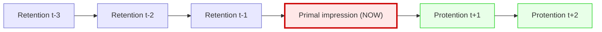
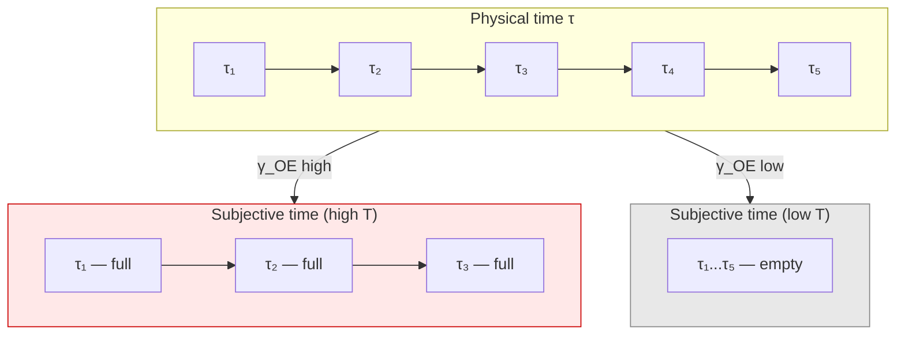

# Subjective Time

:::info Bridge from the previous chapter
In the [Emotion taxonomy](/docs/consciousness/phenomenology/emotional-taxonomy) we showed that emotions are the "interior projection" of the dynamics of viability $dP/d\tau$. But this very dynamics unfolds **in time**. How exactly does the subject experience time? Why do some minutes "fly by" while others "drag"? The answer lies in the coherence $\gamma_{OE}$ between the Ground dimension (O, the internal clock) and Interiority (E, experience). If $\gamma_{OE}$ is high — each "tick" of the clock is filled with experience and time "slows down". If it is low — ticks pass by consciousness and time "flies".
:::

:::note On notation
- $\gamma_{OE}$ — coherence between [Ground (O)](/docs/core/structure/dimension-o) and [Interiority (E)](/docs/core/structure/dimension-e)
- $\gamma_{OO}$, $\gamma_{EE}$ — populations of dimensions O and E
- $\tau$ — [emergent time](/docs/core/operators/emergent-time), derived from the structure of the category $\mathcal{C}$
- $P = \mathrm{Tr}(\Gamma^2)$ — [purity](/docs/core/dynamics/viability#определение-чистоты)
- $\Gamma$ — [coherence matrix](/docs/core/dynamics/coherence-matrix)
- Full notation table — in [Notation](/docs/reference/notation)
:::

### Chapter roadmap

1. **Philosophical history** — from Augustine to Husserl
2. **Subjective tempo** $\mathcal{T}$ — definition and derivation from first principles
3. **Temporal dilation** — formula for stretching/compression of time
4. **Flow state** (flow) — why time "slows down and speeds up" simultaneously
5. **Boredom** — the antipode of flow
6. **Meditation** — systematic management of temporal coherences
7. **Danger and time slowing** — why time "stops" during a fall
8. **Temporal memory window** — the "depth of the present"
9. **Connection to physical time** — four equivalent constructions

---

## Philosophical History: What Is Time? {#история}

### Augustine (354–430): the paradox of time

**Saint Augustine** in the "Confessions" (Book XI) formulated one of the most famous paradoxes:

> "What then is time? If no one asks me, I know; if I wish to explain it to one that asks, I know not."

Augustine noted a fundamental difficulty: **the past no longer exists**, **the future does not yet exist**, and the **present** is merely a fleeting point without extension. Where, then, does time exist? His answer: time exists **in the soul** — as memory (the past), perception (the present), and expectation (the future). Time is not an objective river in which we swim, but a **structure of our consciousness**.

### Bergson (1889): duration vs spatial time

**Henri Bergson** in "Time and Free Will" (1889) drew a radical distinction:

- **Spatial time** (temps) — the time of physics, measured by clocks. It is homogeneous: every second is equal to every other. It can be decomposed into points, like space.
- **Duration** (durée) — the time of consciousness, the time of experience. It is non-homogeneous: a minute of waiting is not equal to a minute of joy. It cannot be decomposed into points — it is a continuous flow where the past penetrates the present.

Bergson insisted: genuine reality is durée, not temps. Physical time is a **spatial metaphor** imposed on duration. When we say "five minutes have passed", we are already spatialising time, slicing it into pieces.

### Husserl (1905): retention, protention, primal impression

**Edmund Husserl** in the lectures "On the Phenomenology of the Internal Time-Consciousness" (1905) gave the most subtle analysis. Every moment of consciousness contains three layers:

- **Primal impression** (Urimpression) — the experience of "now", the fleeting point of the present
- **Retention** — the "just-passed", still held in consciousness (not a recollection, but the "tail" of the present)
- **Protention** — the "about-to-come", anticipation of the immediate future

Retention is not recollection. When you hear a melody, the previous note is not "remembered" — it still **sounds** in consciousness, gradually fading. It is precisely thanks to retention that you hear a *melody*, not separate sounds.

### UHM position: time from O-E coherence

UHM formalises the intuitions of all three thinkers:

- **Augustine:** time exists "in the soul" — in UHM subjective time is defined by the coherence $\gamma_{OE}$, connecting the "clock" ($O$) and "experience" ($E$)
- **Bergson:** duration is non-homogeneous — in UHM the subjective tempo $\mathcal{T}$ changes depending on the state $\Gamma$
- **Husserl:** retention and protention — in UHM the "temporal window" $T_{\text{mem}}$ defines the depth of retention; the autocorrelation $\rho_E(\tau) \cdot \rho_E(\tau - \Delta\tau)$ formalises the "tail" of the present

---

## Motivation: Two Times {#мотивация}

In UHM, physical time $\tau$ is not postulated but **derived** from the structure of [dimension O (Ground)](/docs/core/structure/dimension-o) via the [Page–Wootters mechanism](/docs/core/operators/emergent-time#page-wootters). However, the subjective experience of time — "how fast/slow time flows" — depends not on $\tau$ as such, but on the **coherence between O and E**: on how closely the "internal clock" is linked to "experiential content".

**An everyday analogy.** Imagine a station clock with a second hand. Physical time is the uniform ticking of this clock. Subjective time is how you *perceive* these ticks. If you are absorbed in an interesting book ($\gamma_{OE}$ is high), each tick is filled with content — an hour passes in "five minutes". If you are waiting for a delayed train ($\gamma_{OE}$ is low, but $\gamma_{LE}$ is high — you are **aware** of the waiting), each tick is empty — five minutes drag like an hour.

## Definition of Subjective Tempo (D.1) {#субъективный-темп}

### Derivation of the formula from first principles

Let us begin with the question: **what should subjective tempo measure?** It should answer: "how much experiential content corresponds to one tick of the internal clock?"

**Step 1.** In UHM, the "internal clock" is dimension $O$ (Ground). The population $\gamma_{OO}$ characterises the "resource" invested in timekeeping. The higher $\gamma_{OO}$, the more "ticks" the system produces per unit of physical time.

**Step 2.** "Experiential content per tick" is the coherence $\gamma_{OE}$ between the clock ($O$) and experience ($E$). If $\gamma_{OE} = 0$, the clock ticks but experience is in no way linked to it — the subject "does not notice" the passage of time. If $|\gamma_{OE}|$ is high, each tick is filled with content.

**Step 3.** The natural measure is the **ratio** of content to number of ticks:

$$
\mathcal{T} = \frac{|\gamma_{OE}|}{\gamma_{OO}}
$$

This ratio is dimensionless and shows what fraction of the "clock resource" is linked to experience.

:::tip Definition D.1 (Subjective tempo) [D]
**Subjective tempo** is a dimensionless quantity characterising the relative speed of subjective time:

$$
\mathcal{T}(\tau) := \frac{|\gamma_{OE}(\tau)|}{\gamma_{OO}(\tau)}
$$

where:
- $|\gamma_{OE}|$ — modulus of the coherence between Ground and Interiority
- $\gamma_{OO}$ — population of the Ground dimension

Range: $\mathcal{T} \in [0, 1]$ (from the Cauchy–Schwarz inequality: $|\gamma_{OE}|^2 \leq \gamma_{OO} \gamma_{EE}$, given $\gamma_{EE} \leq 1$).
:::

### Breakdown of each symbol

For complete clarity let us unpack the formula $\mathcal{T} = |\gamma_{OE}|/\gamma_{OO}$ symbol by symbol:

- $\mathcal{T}$ — subjective tempo (calligraphic T from "tempo")
- $\gamma_{OE}$ — element of the coherence matrix $\Gamma$ at the intersection of row $O$ (Ground) and column $E$ (Interiority). It is a complex number: $\gamma_{OE} = |\gamma_{OE}|e^{i\theta_{OE}}$
- $|\gamma_{OE}|$ — the modulus of this complex number: the "strength" of the connection between clock and experience, without regard to the "angle" (perspective)
- $\gamma_{OO}$ — diagonal element of $\Gamma$: the population of dimension $O$. A real number showing how much "resource" is invested in timekeeping

### Interpretation

| $\mathcal{T}$ | Subjective effect | Description | Example |
|---------------|------------------|-------------|---------|
| $\mathcal{T} \to 1$ | Time "slows down" | Rich O-E coherence: each "clock tick" is filled with experience | The moment of an accident, the first parachute jump |
| $\mathcal{T} \to 0$ | Time "flies" | Weak O-E coherence: "ticks" pass by consciousness | Deep sleep, anaesthesia |
| $\mathcal{T} \approx \text{const}$ | Normal pace | Stationary O-E connection | Calm wakefulness |

**Numerical example.** Three states of one person over the course of a day:

| State | $\gamma_{OO}$ | $\lvert\gamma_{OE}\rvert$ | $\mathcal{T}$ | Experience |
|-------|:-:|:-:|:-:|------------|
| Morning coffee | $0.12$ | $0.06$ | $0.50$ | Normal tempo — a familiar morning |
| Car accident | $0.14$ | $0.12$ | $0.86$ | "Time slowed down" — every moment is detailed |
| Falling asleep | $0.10$ | $0.01$ | $0.10$ | "Time disappears" — an instantaneous void |

Note: during the accident $\gamma_{OO}$ increases slightly (adrenaline intensifies timekeeping), while $|\gamma_{OE}|$ rises sharply (each tick is linked to intense experience). As a result $\mathcal{T}$ almost doubles — the subject experiences a "slowing" of time.

## Temporal Dilation (C.1) {#дилатация}

:::tip Statement C.1 (Subjective time dilation) [Т] — upgraded from [C]
The ratio of subjective to physical time increments is proportional to the subjective tempo:

$$
\frac{\delta\tau_{\text{subj}}}{\delta\tau_{\text{phys}}} \propto \mathcal{T}(\tau) = \frac{|\gamma_{OE}|}{\gamma_{OO}}
$$

**Derivation [Т].** The connection of $\gamma_{OE}$ to the experience of time is **not** a semantic postulate but a **theorem** following from three [Т]-results:
1. **T-87 [Т]:** O is the clock dimension — time $\tau$ emerges from correlations between O and the rest via the Page–Wootters mechanism.
2. **T-186(a) [Т]:** E is the experience dimension — the phenomenal functor $F \cong \&|_{\mathcal{D}}$ extracts the E-sector as the carrier of subjective content.
3. **T-88 [Т]:** The coupling $\gamma_{OE}$ appears in the regeneration rate $\kappa_0 = \omega_0 \cdot |\gamma_{OE}| \cdot |\gamma_{OU}| / \gamma_{OO}$, which governs the speed at which the system updates its experiential state.

The ratio $|\gamma_{OE}|/\gamma_{OO}$ is therefore the **rate of experiential content production per clock tick** — a derived quantity, not a convention. $\square$

At high $\mathcal{T}$ subjective time "stretches" (more experience per unit of physical time). At low $\mathcal{T}$ subjective time "compresses".
:::

### Mechanism

Dimension O, via the [Page–Wootters mechanism](/docs/core/operators/emergent-time#page-wootters), acts as the internal clock:

$$
\mathcal{H}_{\text{total}} = \mathcal{H}_O \otimes \mathcal{H}_{6D}
$$

Conditional state at a fixed "tick" $|\tau_n\rangle_O$:

$$
\Gamma(\tau_n) = \frac{\mathrm{Tr}_O\!\left[(|\tau_n\rangle\langle\tau_n|_O \otimes \mathbb{1}_{6D}) \cdot \Gamma_{\text{total}}\right]}{p(\tau_n)}
$$

The coherence $\gamma_{OE}$ determines how non-trivial the **E-component of the correlation** with the O clock is. If $\gamma_{OE} = 0$, the Interiority dimension is "disconnected" from the clock — subjective time is not registered.

**Analogy.** Imagine a metronome (O) and a dancer (E). If the dancer is listening to the metronome ($\gamma_{OE}$ is high), each beat is filled with movement — "time is marked out". If the dancer is wearing headphones ($\gamma_{OE} = 0$), the metronome ticks, but the dance is not linked to it — for the dancer "there is no time", even though the metronome keeps running.

## Danger and Time Slowing {#опасность}

One of the most vivid and widely known phenomena of subjective time is its "slowing" in moments of danger. People who have survived car accidents, falls, and attacks often report: "time stopped", "I saw everything in slow motion".

### Mechanism in UHM terms

At the moment of sudden danger, a sharp reorganisation of the $\Gamma$-profile occurs:

| Parameter | Before danger | During danger | What happens |
|-----------|:-:|:-:|--------------|
| $\gamma_{OO}$ | $0.12$ | $0.15$ | Adrenaline intensifies timekeeping |
| $\lvert\gamma_{OE}\rvert$ | $0.06$ | $0.13$ | Each "tick" is linked to experience |
| $\gamma_{DD}$ | $0.14$ | $0.24$ | Dynamics mobilised |
| $\gamma_{AE}$ | $0.10$ | $0.28$ | Apperception is maximal — "I see every detail" |
| $\gamma_{LL}$ | $0.15$ | $0.06$ | Logic suppressed — "no time for thinking" |
| $\mathcal{T}$ | $0.50$ | $0.87$ | Subjective time **almost doubled** |

This explains why:
- A second of falling is experienced as "a whole minute" ($\mathcal{T}$ sharply increased)
- Details are remembered with photographic accuracy ($\gamma_{AE}$ is maximal)
- Considered decisions are impossible ($\gamma_{LL}$ is suppressed — reflex acts, not reason)

**Numerical example.** A climber falls. The physical fall lasts 3 seconds. Subjectively he experiences:

$$
\delta\tau_{\text{subj}} = \delta\tau_{\text{phys}} \times \frac{\mathcal{T}_{\text{danger}}}{\mathcal{T}_{\text{normal}}} = 3 \times \frac{0.87}{0.50} \approx 5.2 \text{ subj. seconds}
$$

He "manages" to see the ledge, grab it, become aware of what is happening — in "3 physical seconds" he lived through 5 subjective ones. This is not mysticism — it is the mathematics of $\gamma_{OE}$.

## Flow States (Flow) {#flow}

The flow state (flow by Csikszentmihalyi, 1990) is one of the most studied altered states of consciousness. Mihaly Csikszentmihalyi described it as a state of complete immersion in an activity, when time "flows differently".

### $\Gamma$-profile of flow

$$
\text{Flow:} \quad \gamma_{DE} \gg \overline{\gamma}, \quad \mathcal{T} \text{ elevated}, \quad \mathrm{Gap}(D,E) \approx 0
$$

| Parameter | Value in Flow | Typical estimate | Interpretation |
|-----------|---------------|-----------------|----------------|
| $\gamma_{DE}$ | High | $\sim 0.30$ | Strong connection of dynamics and experience — "immersion" |
| $\mathcal{T} = \lvert\gamma_{OE}\rvert/\gamma_{OO}$ | Elevated | $\sim 0.7$ | Subjective time expanded — "much experience" |
| $\mathrm{Gap}(D,E)$ | $\approx 0$ | $< 0.05$ | Minimal gap — "transparency" between action and experience |
| $\gamma_{AE}$ | High | $\sim 0.25$ | Concentration of attention |
| $\gamma_{DU}$ | High | $\sim 0.20$ | Teleology — the sense of a goal |
| $\gamma_{LL}$ | Low | $\sim 0.06$ | Logical tracking weakened |

### Resolving the flow paradox

The flow state contains a famous paradox: time simultaneously "slows down" and "speeds up". During flow each moment seems infinitely rich (time slowed), but after the activity ends it seems that "an instant flew by" (time accelerated).

**Resolution in UHM:** separation into two mechanisms:

1. **During flow:** $\mathcal{T}$ is elevated (each tick is filled with experience) — subjectively each moment "lasts a long time"
2. **Retrospectively:** low $\gamma_{LL}$ (logical control weakened) means that "time markers" were not being placed. When recalling, the brain estimates duration by the number of markers — there are few, so "it passed quickly"

**Analogy.** In the flow state you are a jazz musician improvising. Each note (each moment) is filled with meaning ($\mathcal{T}$ is high). But you are not counting bars ($\gamma_{LL}$ is low). Therefore, after a two-hour concert it seems that 20 minutes have passed, even though *during* the playing each second was infinitely rich. This is not a contradiction — it is two different aspects of the same $\Gamma$-profile.

**Numerical example.** A programmer in the flow state (3 hours of physical time):

| Moment | $\mathcal{T}$ | $\gamma_{LL}$ | Experience |
|--------|:-:|:-:|------------|
| During flow (each minute) | $0.70$ | $0.06$ | Each minute is saturated, $\delta\tau_{\text{subj}} \approx 1.4 \times \delta\tau_{\text{phys}}$ |
| Retrospectively (after exiting) | — | — | "What? Already 3 hours? It felt like half an hour!" |

## Boredom {#скука}

Boredom is the state that is the antipode of flow:

$$
\text{Boredom:} \quad \gamma_{DE} \approx 0, \quad \gamma_{DL} \text{ low}, \quad \mathcal{T} \text{ reduced}
$$

| Parameter | Value during boredom | Typical estimate | Interpretation |
|-----------|---------------------|-----------------|----------------|
| $\gamma_{DE}$ | $\approx 0$ | $< 0.03$ | Dynamics disconnected from experience — "nothing is happening" |
| $\gamma_{AE}$ | Low | $< 0.05$ | Attention defocused |
| $\mathcal{T}$ | Reduced | $\sim 0.2$ | Little experience per "tick" — time "drags" |

:::warning Paradox of boredom [I]
Subjectively during boredom time "drags", even though $\mathcal{T}$ is low (the prediction: time should "fly"). Resolution: during boredom $\gamma_{LE}$ is elevated — reflexive monitoring of the passage of time. The awareness "I am bored" amplifies the subjective assessment of duration through a metacognitive loop. This is consistent with the L2 condition $R \geq 1/3$ — boredom is impossible below L2.

**Numerical example.** During boredom: $\mathcal{T} \approx 0.2$ (little content), but $\gamma_{LE} \approx 0.25$ (reflection "I am bored"). The system is in a paradoxical regime: low $\mathcal{T}$ means little experience per tick, but high $\gamma_{LE}$ means that the *absence of experience* is itself experienced as content. This is precisely why boredom is the privilege of conscious beings (L2+): an amoeba does not get bored, because it has no metacognitive loop.
:::

**Comparison of flow and boredom:**

| Parameter | Flow | Boredom |
|-----------|:----:|:-------:|
| $\gamma_{DE}$ | $0.30$ | $0.02$ |
| $\gamma_{AE}$ | $0.25$ | $0.04$ |
| $\gamma_{LL}$ | $0.06$ | $0.05$ |
| $\gamma_{LE}$ | $0.08$ | $0.25$ |
| $\mathcal{T}$ | $0.70$ | $0.20$ |
| Time (during) | "The moment lasts forever" | "Minutes drag" |
| Time (after) | "An instant flew by" | "It dragged on endlessly" |

## Meditation and Temporal Perception {#медитация}

Meditative practices systematically alter temporal coherences. For more on altered states see [ASC](/docs/consciousness/states/altered-states#медитация).

### Concentration (shamatha)

**Shamatha** (Skt. "calm abiding") — the practice of one-pointed attention: focus on an object (the breath, a mantra, a point) while letting thoughts go.

$$
\text{Shamatha:} \quad \gamma_{AE} \uparrow, \quad \gamma_{DE} \downarrow, \quad \gamma_{EO} \uparrow
$$

Focusing attention ($\gamma_{AE} \uparrow$) with a decrease in dynamic content ($\gamma_{DE} \downarrow$) and a deepening of the connection with the ground ($\gamma_{EO} \uparrow$). Subjectively: time "disappears" — a transition to a stationary $\Gamma$.

**Numerical example.** Before meditation: $\gamma_{AE} = 0.10$, $\gamma_{DE} = 0.15$, $\gamma_{EO} = 0.05$, $\mathcal{T} = 0.50$. After 30 minutes of shamatha: $\gamma_{AE} = 0.25$, $\gamma_{DE} = 0.05$, $\gamma_{EO} = 0.15$, $\mathcal{T} = 0.35$. Attention strengthened 2.5-fold, dynamic content decreased 3-fold — "thoughts quieted, but awareness sharpened". $\mathcal{T}$ decreased (less content per tick), but subjectively time does not "drag" (unlike boredom), because $\gamma_{LE}$ is not elevated — there is no reflexive monitoring of "I am bored".

### Insight (vipassanā)

**Vipassanā** (Skt. "clear seeing") — the practice of observing the stream of consciousness without attachment to an object.

$$
\text{Vipassanā:} \quad \gamma_{LE} \uparrow, \quad R \uparrow, \quad \gamma_{EO} \uparrow
$$

An increase in understanding ($\gamma_{LE}$) and reflection ($R$) with a deepening of the connection with the ground. Subjectively: time is simultaneously "saturated" and "transparent".

**Numerical example.** An experienced vipassanā practitioner: $\gamma_{LE} = 0.28$, $R = 0.65$, $\gamma_{EO} = 0.20$, $\mathcal{T} = 0.60$. Subjective tempo is moderately elevated, but the key difference from flow is a high $\gamma_{LE}$ (awareness is present) and a high $R$ (reflection is deep). The meditator is simultaneously "in flow" and "observing themselves" — a state impossible without $R \geq 1/3$.

## Temporal Memory Window {#окно-памяти}

:::tip Definition D.2 (Temporal window) [D]
**Temporal window** $T_{\text{mem}}$ is the duration of the interval over which the autocorrelation of experiential content is significant:

$$
T_{\text{mem}} := \inf\left\{\Delta\tau > 0 : \mathrm{Tr}\!\left(\rho_E(\tau) \cdot \rho_E(\tau - \Delta\tau)\right) < \epsilon\right\}
$$

where $\epsilon$ is the correlation threshold, $\rho_E(\tau) = \mathrm{Tr}_{-E}(\Gamma(\tau))$ is the [reduced experience matrix](/docs/consciousness/foundations/interiority-theory).
:::

The temporal window defines the **"depth of the present"** — how many "ticks" of the past are simultaneously present in experience. This is the mathematical formalisation of Husserlian **retention**: what "tail" of the past still "sounds" in the present.

This corresponds to the **History** component in the quadruple of experiential content $\mathrm{Exp}(\Gamma, \tau) = (\mathrm{Intensity}, \mathrm{Quality}, \mathrm{Context}, \mathrm{History})$ from [interiority theory](/docs/consciousness/foundations/interiority-theory). The connection to types of memory is discussed in [Attention and memory](/docs/consciousness/states/attention-memory#память).

### Factors influencing $T_{\text{mem}}$

| Factor | Influence on $T_{\text{mem}}$ | Mechanism | Example |
|--------|-------------------------------|-----------|---------|
| High $\gamma_{SL}$ | Increase | Stable logical structure preserves correlations | A logical chain of reasoning is remembered longer |
| Strong decoherence $\mathcal{D}_\Omega$ | Decrease | Rapid destruction of correlations | Under stress, the previous moment is quickly "erased" |
| High $\gamma_{EO}$ | Increase | Deep connection stabilises memory | Meditative states — "expanded present" |
| $P \to P_{\text{crit}}$ | Decrease | Low coherence — short memory | In dementia, the "present" shrinks to seconds |

:::info Specious present and O-dynamics [H]
The phenomenological "present" (~300 ms according to Varela, Pöppel) may be derived from the O-sector. The subjective time formula $dt_{\text{subj}}/dt_{\text{phys}} = |\gamma_{OE}|/\gamma_{OO}$ [C] defines the integration time window. At typical values $\gamma_{OO} \sim 1$ and $|\gamma_{OE}| \sim 0.3$ (awareness threshold), the characteristic time: $T_{\text{present}} \sim 1/(\omega_0 \cdot \gamma_{OO}) \sim 300$ ms at $\omega_0 \sim 3$ Hz (theta rhythm). Status: [H]. Calibration of $\omega_0$ is required.
:::

## Connection to Physical Time {#связь-с-физическим}

Emergent time $\tau$ in UHM is defined via four equivalent constructions (see [Emergent time](/docs/core/operators/emergent-time)):

1. **Page–Wootters:** correlation with the O-dimension
2. **Information-geometric:** Bures metric on $\mathcal{D}(\mathcal{H})$
3. **Categorical:** chains of morphisms in $\mathrm{Exp}_\infty$
4. **Stratificational:** collapse of strata to the terminal object $T$

Subjective time is **not an alternative** to physical time, but its **interior projection**: the same dynamics $\Gamma(\tau)$, perceived "from within" through the E-sector. This is the direct realisation of Augustine's idea: time exists both "in the world" ($\tau$) and "in the soul" ($\mathcal{T} \cdot \tau$) — but it is the same time seen from different sides.

The emotional experience of time (anxious waiting, joyful anticipation) is determined by the combination of $\mathcal{T}$ and $dP/d\tau$ — for details see [Emotion taxonomy](/docs/consciousness/phenomenology/emotional-taxonomy#страх). Applied consequences for cognitive architecture are in the [CC theorems](/docs/applied/coherence-cybernetics/theorems).

---

### What we learned {#итоги}

1. The **problem of time** — from Augustine through Bergson to Husserl — receives in UHM a formal solution through the coherence $\gamma_{OE}$
2. **Subjective tempo** $\mathcal{T} = |\gamma_{OE}|/\gamma_{OO}$ — a dimensionless measure of the "speed" of subjective time, derived from first principles
3. High $\mathcal{T}$ — time "slows down" (each tick is filled with experience); low $\mathcal{T}$ — time "flies"
4. **Danger** sharply raises $\mathcal{T}$ through an increase in $|\gamma_{OE}|$ — the formal explanation for "time slowing during a fall"
5. **Flow state**: $\gamma_{DE} \gg \overline{\gamma}$, $\mathrm{Gap}(D,E) \approx 0$, $\mathcal{T}$ elevated — the "stretching-compression" paradox is resolved through the separation of $\gamma_{LL}$ and $\mathcal{T}$
6. **Boredom**: $\gamma_{DE} \approx 0$, $\mathcal{T}$ low, but $\gamma_{LE}$ high — metacognitive monitoring of "emptiness" creates the sensation of stretched time
7. **Temporal window** $T_{\text{mem}}$ defines the "depth of the present" — depends on $\gamma_{SL}$, $\gamma_{EO}$, and the rate of decoherence

:::tip Bridge to the next chapter
We have considered *what* is experienced (qualia), *how* it is experienced (emotions), *when* it is experienced (subjective time). It remains to answer the question: **about what** is the experience? The directedness of consciousness toward an object — intentionality — is examined in the next chapter: [Intentionality](/docs/consciousness/phenomenology/intentionality). There we will show that intentionality is a morphism in the category $\mathbf{Hol}$ satisfying a condition on the E-sector.
:::

## Related Documents

- [Ground (O)](/docs/core/structure/dimension-o) — the clock dimension, source of $\gamma_{OO}$
- [Emergent time](/docs/core/operators/emergent-time) — four constructions and the Page–Wootters mechanism
- [Coherence matrix](/docs/core/dynamics/coherence-matrix) — definition of $\gamma_{OE}$ and coherences
- [Interiority theory](/docs/consciousness/foundations/interiority-theory) — the History component in $\mathrm{Exp}(\Gamma, \tau)$
- [Emotion taxonomy](/docs/consciousness/phenomenology/emotional-taxonomy) — dynamics $dP/d\tau$ and sectoral signature
- [Gap semantics](/docs/physics/dual-aspect/gap-semantics) — $\mathrm{Gap}(D,E)$ in the flow state
- [Attention and memory](/docs/consciousness/states/attention-memory) — temporal window and types of memory
- [Theorems of Coherence Cybernetics](/docs/applied/coherence-cybernetics/theorems) — applied consequences of temporal dynamics
