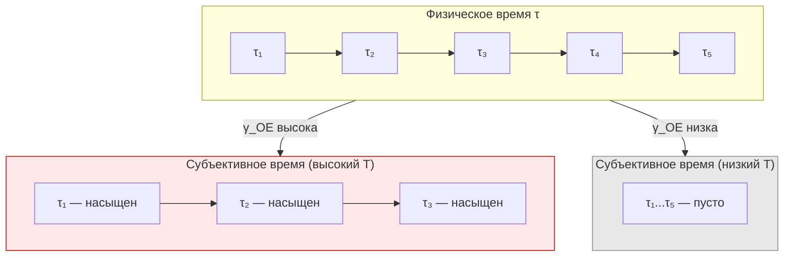

# Субъективное Время

:::info Мост из предыдущей главы
В [Таксономии эмоций](/docs/consciousness/phenomenology/emotional-taxonomy) мы показали, что эмоции — это «интериорная проекция» динамики жизнеспособности $dP/d\tau$. Но сама эта динамика разворачивается **во времени**. Как именно субъект переживает время? Почему одни минуты «летят», а другие «тянутся»? Ответ — в когерентности $\gamma_{OE}$ между измерением Основания (O, внутренние часы) и Интериорности (E, переживание). Если $\gamma_{OE}$ высока — каждый «тик» часов наполнен опытом и время «замедляется». Если низка — тики проходят мимо сознания и время «летит».
:::

:::note О нотации
- $\gamma_{OE}$ — когерентность между [Основанием (O)](/docs/core/structure/dimension-o) и [Интериорностью (E)](/docs/core/structure/dimension-e)
- $\gamma_{OO}$, $\gamma_{EE}$ — населённости измерений O и E
- $\tau$ — [эмерджентное время](/docs/core/operators/emergent-time), выведенное из структуры категории $\mathcal{C}$
- $P = \mathrm{Tr}(\Gamma^2)$ — [чистота](/docs/core/dynamics/viability#определение-чистоты)
- $\Gamma$ — [матрица когерентности](/docs/core/dynamics/coherence-matrix)
- Полная таблица нотации — в [Нотации](/docs/reference/notation)
:::

### Дорожная карта главы

1. **Философская история** — от Августина до Гуссерля
2. **Субъективный темп** $\mathcal{T}$ — определение и вывод из первых принципов
3. **Темпоральная дилатация** — формула растяжения/сжатия времени
4. **Состояние потока** (flow) — почему время «замедляется и ускоряется» одновременно
5. **Скука** — антипод потока
6. **Медитация** — систематическое управление темпоральными когерентностями
7. **Опасность и замедление времени** — почему при падении «время останавливается»
8. **Темпоральное окно памяти** — «глубина настоящего»
9. **Связь с физическим временем** — четыре эквивалентные конструкции

---

## Философская история: что такое время? {#история}

### Августин (354–430): парадокс времени

**Блаженный Августин** в «Исповеди» (книга XI) сформулировал один из самых знаменитых парадоксов:

> «Что же такое время? Если никто меня не спрашивает, я знаю; если я хочу объяснить спрашивающему — не знаю.»

Августин заметил фундаментальную трудность: **прошлого уже нет**, **будущего ещё нет**, а **настоящее** — лишь мимолётная точка без протяжённости. Где же тогда существует время? Его ответ: время существует **в душе** — как память (прошлое), восприятие (настоящее) и ожидание (будущее). Время — не объективная река, в которой мы плывём, а **структура нашего сознания**.

### Бергсон (1889): длительность vs пространственное время

**Анри Бергсон** в «Опыте о непосредственных данных сознания» (1889) провёл радикальное различение:

- **Пространственное время** (temps) — время физики, измеряемое часами. Оно однородно: каждая секунда равна каждой другой. Его можно разложить на точки, как пространство.
- **Длительность** (duree) — время сознания, время переживания. Оно неоднородно: минута ожидания не равна минуте радости. Его невозможно разложить на точки — это непрерывный поток, где прошлое проникает в настоящее.

Бергсон настаивал: подлинная реальность — duree, а не temps. Физическое время — это **пространственная метафора**, наложенная на длительность. Когда мы говорим «прошло 5 минут», мы уже пространствуем время, нарезаем его на куски.

### Гуссерль (1905): ретенция, протенция, первичное впечатление

**Эдмунд Гуссерль** в лекциях «О феноменологии внутреннего сознания времени» (1905) дал наиболее тонкий анализ. Каждый момент сознания содержит три слоя:

- **Первичное впечатление** (Urimpression) — переживание «сейчас», мимолётная точка настоящего
- **Ретенция** — «только что прошедшее», ещё удерживаемое в сознании (не воспоминание, а «хвост» настоящего)
- **Протенция** — «вот-вот наступающее», ожидание ближайшего будущего

Ретенция — не воспоминание. Когда вы слышите мелодию, предыдущая нота не «вспоминается» — она ещё **звучит** в сознании, постепенно затухая. Именно благодаря ретенции вы слышите *мелодию*, а не отдельные звуки.

### Позиция УГМ: время из O-E когерентности

УГМ формализует интуиции всех трёх мыслителей:

- **Августин:** время существует «в душе» — в УГМ субъективное время определяется когерентностью $\gamma_{OE}$, связывающей «часы» ($O$) и «переживание» ($E$)
- **Бергсон:** длительность неоднородна — в УГМ субъективный темп $\mathcal{T}$ меняется в зависимости от состояния $\Gamma$
- **Гуссерль:** ретенция и протенция — в УГМ «темпоральное окно» $T_{\text{mem}}$ определяет глубину ретенции; автокорреляция $\rho_E(\tau) \cdot \rho_E(\tau - \Delta\tau)$ формализует «хвост» настоящего

---

## Мотивация: два времени {#мотивация}

В УГМ физическое время $\tau$ не постулируется, а **выводится** из структуры [измерения O (Основание)](/docs/core/structure/dimension-o) через [механизм Пейдж–Вуттерс](/docs/core/operators/emergent-time#page-wootters). Однако субъективное переживание времени — «как быстро/медленно течёт время» — зависит не от $\tau$ как такового, а от **когерентности между O и E**: от того, насколько «внутренние часы» связаны с «экспериенциальным содержанием».

**Аналогия из повседневной жизни.** Представьте вокзальные часы с секундной стрелкой. Физическое время — это равномерное тикание этих часов. Субъективное время — это то, как вы *воспринимаете* эти тики. Если вы увлечены интересной книгой ($\gamma_{OE}$ высока), каждый тик наполнен содержанием — час пролетает за «пять минут». Если вы ждёте опаздывающий поезд ($\gamma_{OE}$ низка, но $\gamma_{LE}$ высока — вы **осознаёте** ожидание), каждый тик пуст — пять минут тянутся как час.

## Определение субъективного темпа (О.1) {#субъективный-темп}

### Вывод формулы из первых принципов

Начнём с вопроса: **что должен измерять субъективный темп?** Он должен отвечать на вопрос: «сколько экспериенциального содержания приходится на один тик внутренних часов?»

**Шаг 1.** В УГМ «внутренние часы» — это измерение $O$ (Основание). Населённость $\gamma_{OO}$ характеризует «ресурс», вложенный в хронометраж. Чем выше $\gamma_{OO}$, тем больше «тиков» система производит за единицу физического времени.

**Шаг 2.** «Экспериенциальное содержание на один тик» — это когерентность $\gamma_{OE}$ между часами ($O$) и переживанием ($E$). Если $\gamma_{OE} = 0$, часы тикают, но переживание никак с ними не связано — субъект «не замечает» хода времени. Если $|\gamma_{OE}|$ высока, каждый тик наполнен содержанием.

**Шаг 3.** Естественная мера — **отношение** содержания к числу тиков:

$$
\mathcal{T} = \frac{|\gamma_{OE}|}{\gamma_{OO}}
$$

Это отношение безразмерно и показывает, какая доля «ресурса часов» связана с переживанием.

:::tip Определение О.1 (Субъективный темп) [О]
**Субъективный темп** — безразмерная величина, характеризующая относительную скорость субъективного времени:

$$
\mathcal{T}(\tau) := \frac{|\gamma_{OE}(\tau)|}{\gamma_{OO}(\tau)}
$$

где:
- $|\gamma_{OE}|$ — модуль когерентности между Основанием и Интериорностью
- $\gamma_{OO}$ — населённость измерения Основания

Диапазон: $\mathcal{T} \in [0, 1]$ (из неравенства Коши-Шварца: $|\gamma_{OE}|^2 \leq \gamma_{OO} \gamma_{EE}$, при $\gamma_{EE} \leq 1$).
:::

### Разбор каждого символа

Для полной ясности разберём формулу $\mathcal{T} = |\gamma_{OE}|/\gamma_{OO}$ символ за символом:

- $\mathcal{T}$ — субъективный темп (каллиграфическое T от «tempo»)
- $\gamma_{OE}$ — элемент матрицы когерентности $\Gamma$ на пересечении строки $O$ (Основание) и столбца $E$ (Интериорность). Это комплексное число: $\gamma_{OE} = |\gamma_{OE}|e^{i\theta_{OE}}$
- $|\gamma_{OE}|$ — модуль этого комплексного числа: «сила» связи между часами и переживанием, без учёта «угла» (перспективы)
- $\gamma_{OO}$ — диагональный элемент $\Gamma$: населённость измерения $O$. Вещественное число, показывающее, сколько «ресурса» вложено в хронометраж

### Интерпретация

| $\mathcal{T}$ | Субъективный эффект | Описание | Пример |
|----------------|---------------------|----------|--------|
| $\mathcal{T} \to 1$ | Время «замедляется» | Богатая O-E когерентность: каждый «такт часов» наполнен опытом | Момент аварии, первый прыжок с парашютом |
| $\mathcal{T} \to 0$ | Время «летит» | Слабая O-E когерентность: «такты» проходят мимо сознания | Глубокий сон, наркоз |
| $\mathcal{T} \approx \text{const}$ | Нормальный ход | Стационарная O-E связь | Спокойное бодрствование |

**Числовой пример.** Три состояния одного человека в течение дня:

| Состояние | $\gamma_{OO}$ | $\lvert\gamma_{OE}\rvert$ | $\mathcal{T}$ | Переживание |
|-----------|:-:|:-:|:-:|-------------|
| Утренний кофе | $0.12$ | $0.06$ | $0.50$ | Нормальный темп — привычное утро |
| Автомобильная авария | $0.14$ | $0.12$ | $0.86$ | «Время замедлилось» — каждый миг детален |
| Засыпание | $0.10$ | $0.01$ | $0.10$ | «Время исчезает» — мгновенный провал |

Заметьте: при аварии $\gamma_{OO}$ слегка возрастает (адреналин усиливает хронометраж), а $|\gamma_{OE}|$ резко увеличивается (каждый тик связан с интенсивным переживанием). В результате $\mathcal{T}$ почти удваивается — субъект переживает «замедление» времени.

## Темпоральная дилатация (С.1) {#дилатация}

:::tip Утверждение С.1 (Субъективная дилатация времени) [С]
**Условие:** Интерпретация $\mathcal{T}$ как «субъективного темпа» — семантический постулат; связь $\gamma_{OE}$ с переживанием времени формально открыта.

Отношение субъективного и физического приращений времени:

$$
\frac{\delta\tau_{\text{субъ}}}{\delta\tau_{\text{физ}}} \propto \mathcal{T}(\tau) = \frac{|\gamma_{OE}|}{\gamma_{OO}}
$$

При высоком $\mathcal{T}$ субъективное время «растягивается» (больше опыта на единицу физического времени). При низком $\mathcal{T}$ субъективное время «сжимается».
:::

### Механизм

Измерение O через [механизм Пейдж–Вуттерс](/docs/core/operators/emergent-time#page-wootters) выступает как внутренние часы:

$$
\mathcal{H}_{\text{total}} = \mathcal{H}_O \otimes \mathcal{H}_{6D}
$$

Условное состояние при фиксированном «такте» $|\tau_n\rangle_O$:

$$
\Gamma(\tau_n) = \frac{\mathrm{Tr}_O\!\left[(|\tau_n\rangle\langle\tau_n|_O \otimes \mathbb{1}_{6D}) \cdot \Gamma_{\text{total}}\right]}{p(\tau_n)}
$$

Когерентность $\gamma_{OE}$ определяет, насколько **E-компонента корреляции** с часами O нетривиальна. Если $\gamma_{OE} = 0$, то измерение Интериорности «отключено» от часов — субъективное время не регистрируется.

**Аналогия.** Представьте метроном (O) и танцора (E). Если танцор слушает метроном ($\gamma_{OE}$ высока), каждый удар наполнен движением — «время размечено». Если танцор в наушниках ($\gamma_{OE} = 0$), метроном тикает, но танец с ним не связан — для танцора «времени нет», хотя метроном продолжает работать.

## Опасность и замедление времени {#опасность}

Один из наиболее ярких и общеизвестных феноменов субъективного времени — его «замедление» в моменты опасности. Люди, пережившие автомобильные аварии, падения, нападения, часто сообщают: «время остановилось», «я видел всё в замедленной съёмке».

### Механизм в терминах УГМ

При внезапной опасности происходит резкая перестройка $\Gamma$-профиля:

| Параметр | До опасности | Во время опасности | Что происходит |
|----------|:-:|:-:|----------------|
| $\gamma_{OO}$ | $0.12$ | $0.15$ | Адреналин усиливает хронометраж |
| $\lvert\gamma_{OE}\rvert$ | $0.06$ | $0.13$ | Каждый «тик» связан с переживанием |
| $\gamma_{DD}$ | $0.14$ | $0.24$ | Динамика мобилизована |
| $\gamma_{AE}$ | $0.10$ | $0.28$ | Апперцепция максимальна — «вижу каждую деталь» |
| $\gamma_{LL}$ | $0.15$ | $0.06$ | Логика подавлена — «не до размышлений» |
| $\mathcal{T}$ | $0.50$ | $0.87$ | Субъективное время **почти удвоилось** |

Это объясняет, почему:
- Секунда падения переживается как «целая минута» ($\mathcal{T}$ резко возрос)
- Детали запоминаются с фотографической точностью ($\gamma_{AE}$ максимальна)
- Обдуманные решения невозможны ($\gamma_{LL}$ подавлена — действует рефлекс, не разум)

**Числовой пример.** Альпинист срывается. Физическое падение длится 3 секунды. Субъективно он переживает:

$$
\delta\tau_{\text{субъ}} = \delta\tau_{\text{физ}} \times \frac{\mathcal{T}_{\text{опасность}}}{\mathcal{T}_{\text{норма}}} = 3 \times \frac{0.87}{0.50} \approx 5.2 \text{ субъ. секунд}
$$

Он «успевает» увидеть выступ, схватиться, осознать происходящее — за «3 физических секунды» он прожил 5 субъективных. Это не мистика — это математика $\gamma_{OE}$.

## Состояния потока (Flow) {#flow}

Состояние потока (flow по Чиксентмихайи, 1990) — одно из наиболее исследованных изменённых состояний сознания. Михай Чиксентмихайи описал его как состояние полного погружения в деятельность, когда время «течёт по-другому».

### $\Gamma$-профиль потока

$$
\text{Flow:} \quad \gamma_{DE} \gg \overline{\gamma}, \quad \mathcal{T} \text{ повышен}, \quad \mathrm{Gap}(D,E) \approx 0
$$

| Параметр | Значение в Flow | Типичная оценка | Интерпретация |
|----------|-----------------|-----------------|---------------|
| $\gamma_{DE}$ | Высокая | $\sim 0.30$ | Сильная связь динамики и опыта — «погружённость» |
| $\mathcal{T} = \lvert\gamma_{OE}\rvert/\gamma_{OO}$ | Повышен | $\sim 0.7$ | Субъективное время расширено — «много опыта» |
| $\mathrm{Gap}(D,E)$ | $\approx 0$ | $< 0.05$ | Минимальный зазор — «прозрачность» между действием и переживанием |
| $\gamma_{AE}$ | Высокая | $\sim 0.25$ | Концентрация внимания |
| $\gamma_{DU}$ | Высокая | $\sim 0.20$ | Телеология — ощущение цели |
| $\gamma_{LL}$ | Низкая | $\sim 0.06$ | Логическое отслеживание ослаблено |

### Разрешение парадокса потока

Состояние потока содержит знаменитый парадокс: время одновременно «замедляется» и «ускоряется». Во время потока каждый момент кажется бесконечно богатым (время замедлено), но после завершения деятельности кажется, что «пролетело мгновенье» (время ускорено).

**Разрешение в УГМ:** разделение на два механизма:

1. **Во время потока:** $\mathcal{T}$ повышен (каждый тик наполнен опытом) — субъективно каждый момент «длится долго»
2. **Ретроспективно:** низкая $\gamma_{LL}$ (логический контроль ослаблен) означает, что «маркеры времени» не расставлялись. При воспоминании мозг оценивает длительность по числу маркеров — их мало, значит «прошло быстро»

**Аналогия.** В состоянии потока вы — джазовый музыкант на импровизации. Каждая нота (каждый момент) наполнена смыслом ($\mathcal{T}$ высок). Но вы не считаете такты ($\gamma_{LL}$ низка). Поэтому после двухчасового концерта вам кажется, что прошло 20 минут, хотя *во время* игры каждая секунда была бесконечно богата. Это не противоречие — это два разных аспекта одного $\Gamma$-профиля.

**Числовой пример.** Программист в состоянии потока (3 часа физического времени):

| Момент | $\mathcal{T}$ | $\gamma_{LL}$ | Переживание |
|--------|:-:|:-:|-------------|
| Во время потока (каждая минута) | $0.70$ | $0.06$ | Каждая минута насыщена, $\delta\tau_{\text{субъ}} \approx 1.4 \times \delta\tau_{\text{физ}}$ |
| Ретроспективно (после выхода) | — | — | «Как? Уже 3 часа? Казалось, прошло полчаса!» |

## Скука {#скука}

Скука — состояние, антиподное потоку:

$$
\text{Скука:} \quad \gamma_{DE} \approx 0, \quad \gamma_{DL} \text{ низкая}, \quad \mathcal{T} \text{ понижен}
$$

| Параметр | Значение при скуке | Типичная оценка | Интерпретация |
|----------|-------------------|-----------------|---------------|
| $\gamma_{DE}$ | $\approx 0$ | $< 0.03$ | Динамика отключена от опыта — «ничего не происходит» |
| $\gamma_{AE}$ | Низкая | $< 0.05$ | Внимание расфокусировано |
| $\mathcal{T}$ | Понижен | $\sim 0.2$ | Мало опыта на «такт» — время «тянется» |

:::warning Парадокс скуки [И]
Субъективно при скуке время «тянется», хотя $\mathcal{T}$ понижен (предсказание: время должно «лететь»). Разрешение: при скуке повышена $\gamma_{LE}$ — рефлексивный мониторинг хода времени. Осознание «мне скучно» усиливает субъективную оценку длительности через метакогнитивный контур. Это согласуется с L2-условием $R \geq 1/3$ — скука невозможна ниже L2.

**Числовой пример.** При скуке: $\mathcal{T} \approx 0.2$ (мало содержания), но $\gamma_{LE} \approx 0.25$ (рефлексия «мне скучно»). Система находится в парадоксальном режиме: низкий $\mathcal{T}$ означает мало опыта на такт, но высокая $\gamma_{LE}$ означает, что *отсутствие опыта* само переживается как содержание. Именно поэтому скука — привилегия сознательных существ (L2+): амёба не скучает, потому что у неё нет метакогнитивного контура.
:::

**Сравнение потока и скуки:**

| Параметр | Поток | Скука |
|----------|:-----:|:-----:|
| $\gamma_{DE}$ | $0.30$ | $0.02$ |
| $\gamma_{AE}$ | $0.25$ | $0.04$ |
| $\gamma_{LL}$ | $0.06$ | $0.05$ |
| $\gamma_{LE}$ | $0.08$ | $0.25$ |
| $\mathcal{T}$ | $0.70$ | $0.20$ |
| Время (во время) | «Момент длится вечно» | «Минуты тянутся» |
| Время (после) | «Пролетело мгновенье» | «Тянулось бесконечно» |

## Медитация и темпоральное восприятие {#медитация}

Медитативные практики систематически изменяют темпоральные когерентности. Подробнее об изменённых состояниях — в [ИСС](/docs/consciousness/states/altered-states#медитация).

### Сосредоточение (шаматха)

**Шаматха** (санскр. «спокойное пребывание») — практика однонаправленного внимания: фокус на объекте (дыхание, мантра, точка) при отпускании мыслей.

$$
\text{Шаматха:} \quad \gamma_{AE} \uparrow, \quad \gamma_{DE} \downarrow, \quad \gamma_{EO} \uparrow
$$

Фокусировка внимания ($\gamma_{AE} \uparrow$) при снижении динамического содержания ($\gamma_{DE} \downarrow$) и углублении связи с основанием ($\gamma_{EO} \uparrow$). Субъективно: время «исчезает» — переход к стационарному $\Gamma$.

**Числовой пример.** До медитации: $\gamma_{AE} = 0.10$, $\gamma_{DE} = 0.15$, $\gamma_{EO} = 0.05$, $\mathcal{T} = 0.50$. После 30 минут шаматхи: $\gamma_{AE} = 0.25$, $\gamma_{DE} = 0.05$, $\gamma_{EO} = 0.15$, $\mathcal{T} = 0.35$. Внимание усилилось в 2.5 раза, динамическое содержание уменьшилось в 3 раза — «мысли утихли, но осознание обострилось». $\mathcal{T}$ понизился (меньше содержания на тик), но субъективно время не «тянется» (в отличие от скуки), потому что $\gamma_{LE}$ не повышена — нет рефлексивного мониторинга «мне скучно».

### Наблюдение (випашьяна)

**Випашьяна** (санскр. «ясное видение») — практика наблюдения за потоком сознания без привязки к объекту.

$$
\text{Випашьяна:} \quad \gamma_{LE} \uparrow, \quad R \uparrow, \quad \gamma_{EO} \uparrow
$$

Повышение понимания ($\gamma_{LE}$) и рефлексии ($R$) при углублении связи с основанием. Субъективно: время одновременно «насыщено» и «прозрачно».

**Числовой пример.** Опытный практикующий випашьяну: $\gamma_{LE} = 0.28$, $R = 0.65$, $\gamma_{EO} = 0.20$, $\mathcal{T} = 0.60$. Субъективный темп умеренно повышен, но ключевое отличие от потока — высокая $\gamma_{LE}$ (осознание присутствует) и высокая $R$ (рефлексия глубока). Медитатор одновременно «в потоке» и «наблюдает себя» — состояние, невозможное без $R \geq 1/3$.

## Темпоральное окно памяти {#окно-памяти}

:::tip Определение О.2 (Темпоральное окно) [О]
**Темпоральное окно** $T_{\text{mem}}$ — длительность интервала, на котором автокорреляция экспериенциального содержания существенна:

$$
T_{\text{mem}} := \inf\left\{\Delta\tau > 0 : \mathrm{Tr}\!\left(\rho_E(\tau) \cdot \rho_E(\tau - \Delta\tau)\right) < \epsilon\right\}
$$

где $\epsilon$ — порог корреляции, $\rho_E(\tau) = \mathrm{Tr}_{-E}(\Gamma(\tau))$ — [редуцированная матрица опыта](/docs/consciousness/foundations/interiority-theory).
:::

Темпоральное окно определяет **«глубину настоящего»** — сколько «тактов» прошлого одновременно присутствует в опыте. Это математическая формализация гуссерлевской **ретенции**: какой «хвост» прошлого ещё «звучит» в настоящем.

Это соответствует компоненту **History** в четвёрке экспериенциального содержания $\mathrm{Exp}(\Gamma, \tau) = (\mathrm{Intensity}, \mathrm{Quality}, \mathrm{Context}, \mathrm{History})$ из [теории интериорности](/docs/consciousness/foundations/interiority-theory). Связь с типами памяти рассмотрена в [Внимание и память](/docs/consciousness/states/attention-memory#память).

### Факторы, влияющие на $T_{\text{mem}}$

| Фактор | Влияние на $T_{\text{mem}}$ | Механизм | Пример |
|--------|---------------------------|----------|--------|
| Высокая $\gamma_{SL}$ | Увеличение | Устойчивая логическая структура сохраняет корреляции | Логическая цепочка рассуждений помнится дольше |
| Сильная декогеренция $\mathcal{D}_\Omega$ | Уменьшение | Быстрое разрушение корреляций | При стрессе предыдущий момент быстро «стирается» |
| Высокая $\gamma_{EO}$ | Увеличение | Глубинная связь стабилизирует память | Медитативные состояния — «расширенное настоящее» |
| $P \to P_{\text{crit}}$ | Уменьшение | Низкая когерентность — короткая память | При деменции «настоящее» сжимается до секунд |

:::info Specious present и O-динамика [Г]
Феноменологическое «настоящее» (~300 мс по данным Varela, Poppel) может быть выведено из O-сектора. Формула субъективного времени $dt_{\text{subj}}/dt_{\text{phys}} = |\gamma_{OE}|/\gamma_{OO}$ [С] определяет временное окно интеграции. При типичных значениях $\gamma_{OO} \sim 1$ и $|\gamma_{OE}| \sim 0.3$ (порог осознания), характерное время: $T_{\text{present}} \sim 1/(\omega_0 \cdot \gamma_{OO}) \sim 300$ мс при $\omega_0 \sim 3$ Гц (тета-ритм). Статус: [Г]. Требуется калибровка $\omega_0$.
:::

## Связь с физическим временем {#связь-с-физическим}

Эмерджентное время $\tau$ в УГМ определено через четыре эквивалентные конструкции (см. [Эмерджентное время](/docs/core/operators/emergent-time)):

1. **Пейдж–Вуттерс:** корреляция с O-измерением
2. **Информационно-геометрическое:** метрика Бурес на $\mathcal{D}(\mathcal{H})$
3. **Категорное:** цепи морфизмов в $\mathrm{Exp}_\infty$
4. **Стратификационное:** коллапс страт к терминальному объекту $T$

Субъективное время — **не альтернатива** физическому, а его **интериорная проекция**: одна и та же динамика $\Gamma(\tau)$, воспринятая «изнутри» через E-сектор. Это прямая реализация идеи Августина: время существует и «в мире» ($\tau$), и «в душе» ($\mathcal{T} \cdot \tau$) — но это одно и то же время, увиденное с разных сторон.

Эмоциональное переживание времени (тревожное ожидание, радостное предвкушение) определяется комбинацией $\mathcal{T}$ и $dP/d\tau$ — подробнее в [Таксономии эмоций](/docs/consciousness/phenomenology/emotional-taxonomy#страх). Прикладные следствия для когнитивной архитектуры — в [теоремах КК](/docs/applied/coherence-cybernetics/theorems).

---

### Что мы узнали {#итоги}

1. **Проблема времени** — от Августина через Бергсона к Гуссерлю — получает в УГМ формальное решение через когерентность $\gamma_{OE}$
2. **Субъективный темп** $\mathcal{T} = |\gamma_{OE}|/\gamma_{OO}$ — безразмерная мера «скорости» субъективного времени, выведенная из первых принципов
3. Высокий $\mathcal{T}$ — время «замедляется» (каждый такт наполнен опытом); низкий $\mathcal{T}$ — время «летит»
4. **Опасность** резко повышает $\mathcal{T}$ через рост $|\gamma_{OE}|$ — формальное объяснение «замедления времени при падении»
5. **Состояние потока**: $\gamma_{DE} \gg \overline{\gamma}$, $\mathrm{Gap}(D,E) \approx 0$, $\mathcal{T}$ повышен — парадокс «растяжения-сжатия» разрешается через разделение $\gamma_{LL}$ и $\mathcal{T}$
6. **Скука**: $\gamma_{DE} \approx 0$, $\mathcal{T}$ понижен, но $\gamma_{LE}$ высока — метакогнитивный мониторинг «пустоты» создаёт ощущение растянутого времени
7. **Темпоральное окно** $T_{\text{mem}}$ определяет «глубину настоящего» — зависит от $\gamma_{SL}$, $\gamma_{EO}$ и скорости декогеренции

:::tip Мост к следующей главе
Мы рассмотрели *что* переживается (квалиа), *как* переживается (эмоции), *когда* переживается (субъективное время). Осталось ответить на вопрос: **о чём** переживание? Направленность сознания на объект — интенциональность — рассматривается в следующей главе: [Интенциональность](/docs/consciousness/phenomenology/intentionality). Там мы покажем, что интенциональность — это морфизм в категории $\mathbf{Hol}$, удовлетворяющий условию на E-сектор.
:::

## Связи

- [Основание (O)](/docs/core/structure/dimension-o) — измерение-часы, источник $\gamma_{OO}$
- [Эмерджентное время](/docs/core/operators/emergent-time) — четыре конструкции и механизм Пейдж–Вуттерс
- [Матрица когерентности](/docs/core/dynamics/coherence-matrix) — определение $\gamma_{OE}$ и когерентностей
- [Теория интериорности](/docs/consciousness/foundations/interiority-theory) — компонент History в $\mathrm{Exp}(\Gamma, \tau)$
- [Таксономия эмоций](/docs/consciousness/phenomenology/emotional-taxonomy) — динамика $dP/d\tau$ и секторная сигнатура
- [Gap-семантика](/docs/physics/dual-aspect/gap-semantics) — $\mathrm{Gap}(D,E)$ в состоянии потока
- [Внимание и память](/docs/consciousness/states/attention-memory) — темпоральное окно и типы памяти
- [Теоремы Когерентной Кибернетики](/docs/applied/coherence-cybernetics/theorems) — прикладные следствия темпоральной динамики
