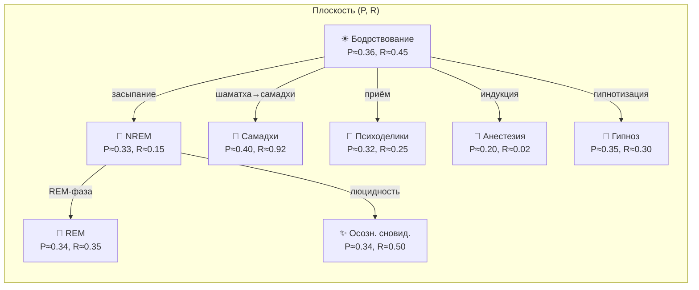
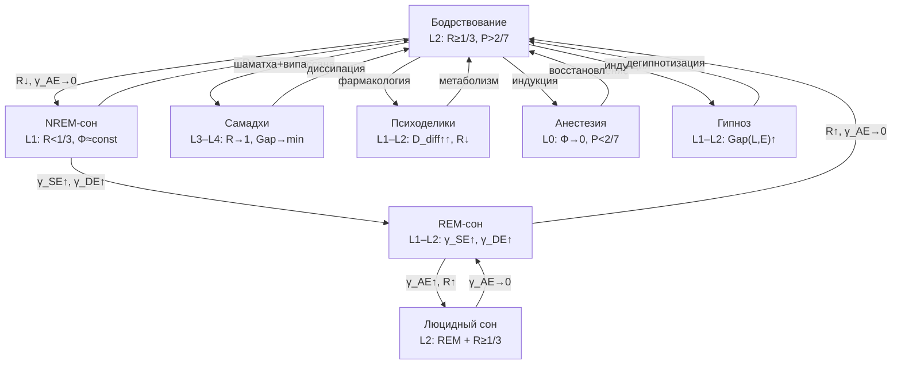

# Изменённые Состояния Сознания

:::info Мост из предыдущей главы
В разделе «Структура опыта» мы описали, *из чего* состоит сознательный опыт: [21 тип квалиа](/docs/consciousness/phenomenology/qualia-structure), [эмоции](/docs/consciousness/phenomenology/emotional-taxonomy), [субъективное время](/docs/consciousness/phenomenology/temporal-consciousness), [интенциональность](/docs/consciousness/phenomenology/intentionality). Все эти феномены определяются текущим состоянием матрицы $\Gamma$. Но $\Gamma$ не стоит на месте — она эволюционирует. Теперь мы спрашиваем: **что происходит, когда $\Gamma$ отклоняется от типичного бодрствования?** Сон, медитация, психоделики, анестезия — каждое из этих состояний есть особая *траектория* в пространстве $\mathcal{D}(\mathcal{H})$.
:::

:::note О нотации
В этом документе:
- $\Gamma$ — [матрица когерентности](/docs/core/dynamics/coherence-matrix), $\gamma_{ij}$ — её элементы
- $P = \mathrm{Tr}(\Gamma^2)$ — [чистота (жизнеспособность)](/docs/core/dynamics/viability#определение-чистоты)
- $R$ — [мера рефлексии](/docs/consciousness/foundations/self-observation#мера-рефлексии-r)
- $\Phi$ — [мера интеграции](/docs/core/structure/dimension-u#мера-интеграции-φ)
- $\mathrm{Gap}(i,j) = |\sin(\arg(\gamma_{ij}))|$ — [мера зазора](/docs/core/dynamics/gap-operator#определение)
- $D_{\text{diff}} = S_{vN}(\rho_E)$ — дифференциация опыта ([энтропия фон Неймана](/docs/core/dynamics/coherence-matrix#энтропия-фон-неймана))
- L0–L4 — [уровни интериорности](/docs/consciousness/hierarchy/interiority-hierarchy)
- Полная таблица нотации — в [Нотации](/docs/reference/notation)
:::

:::warning Статус документа
Описание изменённых состояний как траекторий в $\Gamma$-пространстве имеет статус **[С]** — условное при интерпретации $\Gamma$-траектории как феноменологического содержания. Математический аппарат (динамика $\Gamma$, Gap-профили) — **[Т]**; отождествление конкретных состояний с конкретными Gap-конфигурациями — **[И]**.
:::

:::warning Расширенный формализм для $D_{\text{diff}}$
Мера дифференциации $D_{\text{diff}} = \exp(S_{vN}(\rho_E))$ требует определения $\rho_E = \mathrm{Tr}_{-E}(\Gamma)$ — частичного следа по всем измерениям кроме $E$. Эта операция определена в расширенном 42D формализме ($\mathcal{H} = \mathbb{C}^{42}$) и требует PW-реконструкции полного состояния из 7D-матрицы когерентности. В минимальном 7D формализме $D_{\text{diff}}$ вычисляется приближённо через спектр $\Gamma$.
:::

### Дорожная карта главы

1. **Историческая перспектива** — от картографии ИСС Тарта к траекториям в $\Gamma$-пространстве
2. **ИСС как траектории** — формальное определение через отклонение пятёрки $(R, \Phi, D_{\text{diff}}, P, \overline{\mathrm{Gap}})$
3. **Сон** — NREM (возврат к L1) и REM (сновидения)
4. **Медитация** — шаматха, випассана, самадхи как систематическое управление $\Gamma$
5. **Психоделики** — расширение $D_{\text{diff}}$ при дестабилизации $R$
6. **Анестезия** — глобальная декогеренция, переход к L0
7. **Гипноз и осознанные сновидения** — два особых режима управления $\Gamma$
8. **Сводная таблица** — все классы ИСС в одной таблице
9. **Геометрия переходов** — бифуркации между состояниями

---

## 1. Историческая перспектива {#история}

### 1.1 Чарльз Тарт и картография состояний

В 1969 году американский психолог Чарльз Тарт опубликовал работу *«Altered States of Consciousness»*, предложив первую систематическую классификацию изменённых состояний сознания (ИСС). Тарт рассматривал сознание как **систему**, обладающую стабильными конфигурациями — «дискретными состояниями сознания» (ДСС). Каждое ДСС характеризуется набором «подсистем»: ввод данных (восприятие), обработка (мышление), вывод (поведение), энергия (внимание), и т.д. Переход между ДСС — дестабилизация одной конфигурации и переход к другой.

**Ключевая идея Тарта:** Нормальное бодрствование — лишь *одна* из возможных конфигураций, не привилегированная с точки зрения «истинности». Сон, медитация, психоделическое состояние — равноправные конфигурации с собственными закономерностями.

### 1.2 От Тарта к УГМ

Формализм УГМ (Универсальной Голономической Модели) подхватывает и уточняет интуицию Тарта:

| Понятие Тарта | Формализм УГМ |
|---------------|---------------|
| Дискретное состояние сознания (ДСС) | Аттрактор $\Gamma^*$ в $\mathcal{D}(\mathcal{H})$ |
| Подсистемы | 7 измерений $\{A, S, D, L, E, O, U\}$ |
| Переход между ДСС | Траектория $\Gamma(\tau)$, проходящая через [бифуркацию](/docs/core/dynamics/gap-dynamics#бифуркации) |
| Стабильность ДСС | Бассейн притяжения аттрактора |
| Энергия для перехода | Изменение $\kappa$ (интенсивность регенерации) или $\Gamma_2$ (скорость декогеренции) |

Преимущество формализма: у Тарта «подсистемы» описаны качественно, а в УГМ каждый параметр — числовая величина, допускающая измерение и сравнение.

### 1.3 Предшественники и контекст

До Тарта изменёнными состояниями занимались разрозненно: Уильям Джеймс (1902, *«Многообразие религиозного опыта»*) описывал мистические состояния; Людвиг (1966) ввёл сам термин «изменённые состояния сознания»; Мастерс и Хьюстон (1966) систематизировали психоделический опыт. Но только Тарт предложил *единую рамку* для всех видов ИСС.

В 2000-е годы нейронаука ИСС получила мощный импульс: фМРТ-исследования медитации (Лутц и др., 2004), нейровизуализация психоделических состояний (Кархарт-Харрис и др., 2012), формализация «энтропийного мозга» (Кархарт-Харрис, 2014). Гипотеза энтропийного мозга — прямой предшественник параметра $D_{\text{diff}}$ в УГМ.

---

## 2. Изменённые состояния как траектории в Γ-пространстве {#траектории}

Каждое состояние сознания описывается точкой в пространстве $\mathcal{D}(\mathcal{H})$ — пространстве [матриц когерентности](/docs/core/dynamics/coherence-matrix). Изменённое состояние — это **траектория** $\Gamma(\tau)$, отклоняющаяся от типичного бассейна притяжения бодрствования.

:::info Определение (Изменённое состояние) [О]
**Изменённое состояние сознания (ИСС)** — траектория $\Gamma(\tau)$ в $\mathcal{D}(\mathcal{H})$, характеризующаяся существенным отклонением хотя бы одного параметра пятёрки $\{R, \Phi, D_{\text{diff}}, P, \overline{\mathrm{Gap}}\}$ от значений типичного бодрствования:

$$
\exists\, X \in \{R, \Phi, D_{\text{diff}}, P, \overline{\mathrm{Gap}}\}: \quad |X(\Gamma_{\text{ИСС}}) - X(\Gamma_{\text{бодр}})| > \delta_X
$$

где $\delta_X$ — порог значимости для параметра $X$, $\overline{\mathrm{Gap}} = \frac{1}{21}\sum_{i<j} \mathrm{Gap}(i,j)$ — средний Gap.
:::

**Мотивация.** Зачем нужна формальная пятёрка $(R, \Phi, D_{\text{diff}}, P, \overline{\mathrm{Gap}})$? Потому что $\Gamma$ — это матрица $7 \times 7$ с 21 независимой когерентностью. Работать с 21-мерным пространством неудобно. Пятёрка — *агрегированное описание*, позволяющее различать все основные классы ИСС. Каждый параметр отвечает за свой аспект:

- $R$ — «кто наблюдает?» (самомоделирование)
- $\Phi$ — «сколько связано воедино?» (интеграция)
- $D_{\text{diff}}$ — «насколько богат опыт?» (дифференциация)
- $P$ — «жива ли система?» (жизнеспособность)
- $\overline{\mathrm{Gap}}$ — «насколько прозрачно?» (средняя непрозрачность)

**Аналогия из повседневной жизни.** Представьте состояние сознания как положение ручки настройки на старом радиоприёмнике с пятью регуляторами: $R$ (чёткость приёма), $\Phi$ (объём звука), $D_{\text{diff}}$ (число каналов, которые одновременно слышны), $P$ (мощность сигнала), $\overline{\mathrm{Gap}}$ (уровень помех). Бодрствование — стандартная настройка. ИСС — любое существенное отклонение хотя бы одного регулятора.

### 2.1 Пространство состояний: визуализация

Полное пространство $\mathcal{D}(\mathcal{H})$ слишком многомерно для визуализации. Но можно спроецировать его на плоскость двух наиболее информативных параметров — $P$ (жизнеспособность) и $R$ (рефлексия):

На этой диаграмме каждое ИСС — точка (аттрактор) в плоскости $(P, R)$. Стрелки показывают типичные траектории перехода. Вертикальная ось — $R$: всё, что выше горизонтали $R = 1/3 \approx 0.33$, соответствует L2 и выше (рефлексивное сознание). Горизонтальная ось — $P$: всё, что левее вертикали $P = 2/7 \approx 0.286$, нежизнеспособно.

---

## 3. Сон {#сон}

Сон — наиболее универсальное и регулярное ИСС: каждый человек проводит треть жизни во сне. С точки зрения УГМ, сон — не «выключение» сознания, а **систематическое перераспределение когерентностей** при сохранении жизнеспособности ($P > P_{\text{crit}}$).

### 3.1 NREM-сон (глубокий сон без сновидений) {#nrem}

В NREM-фазе самомодель деактивируется, но интеграция системы сохраняется:

$$
\text{NREM:} \quad R \downarrow\downarrow, \quad \Phi \approx \Phi_{\text{бодр}}, \quad D_{\text{diff}} \downarrow
$$

Разберём каждый параметр:

- **$R < R_{\text{th}} = 1/3$** — система **ниже порога рефлексии**. Рефлексия (мера рефлексии $R$, см. [определение](/docs/consciousness/foundations/self-observation#мера-рефлексии-r)) измеряет, насколько точно самомодель $\varphi(\Gamma)$ воспроизводит истинное состояние $\Gamma$. Во сне самомодель «расфокусирована»: $\varphi(\Gamma)$ сильно отклоняется от $\Gamma$. Уровень [интериорности](/docs/consciousness/hierarchy/interiority-hierarchy) понижается с L2 до L1.

- **$\Phi \approx \Phi_{\text{бодр}}$** — мера интеграции ([определение](/docs/core/structure/dimension-u#мера-интеграции-φ)) остаётся стабильной. Таламо-кортикальные связи сохраняют глобальную когерентность. Это критически важно: глубокий сон — не кома и не анестезия.

- **$\gamma_{AE} \to 0$** — канал внимания–опыта деактивирован. Нет сознательного внимания к переживаниям.

- **$\mathrm{Gap}(A,E) \to 1$** — максимальная непрозрачность в канале внимания: даже если какой-то опыт происходит, внимание не «дотягивается» до него.

**Числовой пример.** Сравним пять параметров бодрствования и NREM:

| Параметр | Бодрствование | NREM-сон | Изменение |
|----------|:------------:|:--------:|:---------:|
| $R$ | $0.45$ | $0.15$ | $-67\%$ |
| $\Phi$ | $1.8$ | $1.5$ | $-17\%$ |
| $P$ | $0.36$ | $0.33$ | $-8\%$ |
| $\overline{\mathrm{Gap}}$ | $0.30$ | $0.50$ | $+67\%$ |
| $D_{\text{diff}}$ | $2.0$ | $0.8$ | $-60\%$ |

Рефлексия упала ниже порога ($R = 0.15 < 1/3$), дифференциация опыта резко снизилась, но жизнеспособность и интеграция сохранены — система «жива, но не осознаёт себя».

:::info Интерпретация [И]
NREM — не «выключение» сознания, а **возврат к L1**: интериорность сохранена ($\Gamma \neq 0$), феноменальная геометрия ($\mathrm{rank}(\rho_E) > 1$) может быть активна, но рефлексивный контур $\varphi$ не функционирует ($R < R_{\text{th}}$). Это объясняет, почему при пробуждении из глубокого сна человек иногда говорит «я ничего не помню» — не потому что опыта не было, а потому что не было рефлексивного доступа для его фиксации.

Нейрофизиологическое соответствие: медленноволновая активность (0.5–4 Гц) в NREM отражает глобальную синхронизацию при сниженной дифференциации — именно паттерн $\Phi \approx \text{const}$, $D_{\text{diff}} \downarrow$.
:::

### 3.2 REM-сон (сновидения) {#rem}

В фазе REM когерентность реорганизуется без внешних ограничений:

$$
\text{REM:} \quad R[\Gamma, E] \gg D_\Omega, \quad \gamma_{SE} \uparrow, \quad \gamma_{DE} \uparrow
$$

Что означает каждое из этих условий?

- **$R[\Gamma, E] \gg D_\Omega$** — рефлексия по E-сектору (подробнее о секторной рефлексии — в [самонаблюдение](/docs/consciousness/foundations/self-observation)) **доминирует** над диссипативным членом $D_\Omega$, описывающим потерю когерентности. Проще говоря: система активно генерирует «внутренний опыт», быстрее чем теряет его.

- **$\gamma_{AE} \approx 0$** — сознательное внимание отсутствует. Мы не «решаем», на что смотреть во сне.

- **$\gamma_{SE}, \gamma_{DE}$ повышены** — когерентности структура–опыт и динамика–опыт усилены. Это означает яркие образы ($S \to E$: структурное содержание «проецируется» в опыт) и интенсивные эмоции ($D \to E$: динамические процессы окрашивают опыт).

- **$\mathrm{Gap}(S,E) \downarrow$** — прозрачность структура–опыт возрастает, отсюда — феноменальная яркость сновидений.

**Числовой пример.** Профиль REM по сравнению с NREM и бодрствованием:

| Параметр | Бодрствование | NREM | REM |
|----------|:------------:|:----:|:---:|
| $R$ | $0.45$ | $0.15$ | $0.35$ |
| $\Phi$ | $1.8$ | $1.5$ | $1.6$ |
| $\gamma_{AE}$ | $0.12$ | $0.02$ | $0.03$ |
| $\gamma_{SE}$ | $0.08$ | $0.04$ | $0.15$ |
| $\gamma_{DE}$ | $0.10$ | $0.05$ | $0.18$ |
| $\mathrm{Gap}(S,E)$ | $0.25$ | $0.60$ | $0.12$ |

Рефлексия восстанавливается почти до порога ($R = 0.35 \approx R_{\text{th}}$), но канал внимания остаётся выключенным ($\gamma_{AE} \approx 0.03$). Именно эта комбинация создаёт феномен «осознанного, но некритичного» переживания: во сне мы *видим* (высокое $\gamma_{SE}$), *чувствуем* (высокое $\gamma_{DE}$), даже частично *осознаём* ($R$ близко к порогу), но не *контролируем* и не *оцениваем* ($\gamma_{AE} \approx 0$, $\gamma_{LE} \approx 0$).

**Аналогия.** Сновидение — как кинотеатр без билетёра. Экран ($\gamma_{SE}$) светит ярко, эмоции ($\gamma_{DE}$) зашкаливают, но критик ($\gamma_{AE}$, $\gamma_{LE}$) отсутствует. Поэтому во сне мы принимаем абсурд за реальность — нет канала «логика–опыт» для проверки когерентности.

:::tip Теорема (Условие сновидений) [С]
Условие: интерпретация $\Gamma$-траектории. Сновидение возникает при:

$$
\gamma_{AE} \approx 0, \quad |\gamma_{SE}|^2 + |\gamma_{DE}|^2 > \varepsilon_{\text{dream}}, \quad \mathrm{Gap}(S,E) < 1
$$

т.е. при отключении внимания ($\gamma_{AE} \to 0$) но сохранении нетривиальных когерентностей в каналах $(S,E)$ и $(D,E)$. Содержание сна определяется **фазовым профилем** $\{\theta_{SE}, \theta_{DE}\}$.

**Вывод.** Первое условие ($\gamma_{AE} \approx 0$) следует из подавления норадренергической активности во сне — нейромедиатор, поддерживающий канал внимания, отключается. Второе условие ($|\gamma_{SE}|^2 + |\gamma_{DE}|^2 > \varepsilon_{\text{dream}}$) — из реактивации коры понтогеникуло-затылочными (PGO) волнами, которые повышают когерентности $\gamma_{SE}$ и $\gamma_{DE}$. Третье условие ($\mathrm{Gap}(S,E) < 1$) — из снижения тормозного контроля, позволяющего «образам» свободно проецироваться в опыт.
:::

---

## 4. Медитация {#медитация}

Медитация — уникальное ИСС, отличающееся тем, что переход в него **произволен** (осуществляется сознательным решением) и **систематичен** (практикуется регулярно с кумулятивным эффектом). С точки зрения УГМ, медитация — это **произвольная манипуляция** параметрами $\Gamma$-матрицы.

Три основные медитативные традиции соответствуют трём различным стратегиям управления $\Gamma$:

### 4.1 Шаматха (фокусировка внимания) {#шаматха}

Шаматха (санскр. «пребывание в покое») — практика, направленная на усиление концентрации. В УГМ-формализме:

$$
\text{Шаматха:} \quad \gamma_{AE} \uparrow, \quad R \uparrow, \quad \sigma^2_{\{|\gamma_{AX}|\}} \uparrow
$$

Расшифруем:

- **$|\gamma_{AE}| \uparrow$** — практикующий сознательно направляет внимание на объект медитации. Когерентность канала внимание–опыт растёт.

- **Из нормировки $\mathrm{Tr}(\Gamma) = 1$:** увеличение $|\gamma_{AE}|$ *неизбежно* сопровождается уменьшением остальных $|\gamma_{AX}|$ для $X \neq E$. Это **эффект «прожектора»** — подробно описан в [Внимание и память](/docs/consciousness/states/attention-memory#внимание). Формально: при фиксированном $\gamma_{AA}$ (доля внимания в общей энергии), неравенство Коши-Шварца $\sum_X |\gamma_{AX}|^2 \leq \gamma_{AA}$ задаёт верхнюю границу. Увеличение одного слагаемого требует уменьшения остальных.

- **$R \uparrow$** — результат тренировки: самомодель $\varphi(\Gamma)$ становится более точной. Формально: $R = 1 - \|\Gamma - \varphi(\Gamma)\|^2/\|\Gamma\|^2$, и систематическое наблюдение за $\Gamma$ повышает точность $\varphi$.

- **$\sigma^2_{\{|\gamma_{AX}|\}} \uparrow$** — дисперсия модулей A-секторных когерентностей растёт: один канал усиливается, остальные ослабляются. Это математическое выражение «заострения» внимания.

**Числовой пример: прогрессия практики шаматхи.**

| Стадия | $|\gamma_{AE}|$ | $R$ | $\overline{\mathrm{Gap}}$ | Субъективный опыт |
|--------|:------:|:---:|:---:|:---|
| Начинающий | $0.10$ | $0.40$ | $0.30$ | Мысли постоянно отвлекают |
| 20 мин практики | $0.22$ | $0.55$ | $0.25$ | Периоды устойчивой концентрации |
| 1 год регулярно | $0.15$ (базовый) | $0.50$ (базовый) | $0.25$ (базовый) | Повышенная осознанность в обычной жизни |
| Мастер (10+ лет) | $0.25$ (в практике) | $0.70$ | $0.18$ | Устойчивая однонаправленность |

Обратите внимание: после года практики **базовые** значения (вне медитации) смещаются. Это кумулятивный эффект: систематическая тренировка когерентности $\gamma_{AE}$ перестраивает [эффективный гамильтониан](/docs/core/dynamics/evolution) $H_{\text{eff}}$, делая повышенный уровень рефлексии «нормой по умолчанию». Механизм — [процедурная память](/docs/consciousness/states/attention-memory#память): навык концентрации «записывается» в структуру $H_{\text{eff}}$.

### 4.2 Випассана (прозрение) {#випассана}

Випассана (санскр. «ясное видение») — практика наблюдения за собственным опытом без вмешательства. Если шаматха направлена на $R \uparrow$ (усиление самомодели), то випассана — на $\overline{\mathrm{Gap}} \downarrow$ (увеличение прозрачности):

$$
\text{Випассана:} \quad \mathrm{Gap}(i,E) \to 0 \quad \text{для всё большего числа пар}
$$

- **Цель:** $\mathrm{Gap}(i,E) \to 0$ для максимального числа E-секторных каналов. Практик систематически обнаруживает «разрывы» (Gap-ы) между различными измерениями и опытом, и само обнаружение запускает их уменьшение.

- **Механизм:** наблюдение за собственными Gap-профилями запускает [бифуркацию](/docs/core/dynamics/gap-dynamics#бифуркации) — скачкообразное уменьшение Gap. Формально: когда $R$ превышает определённый порог в канале $(i,E)$, парциальная рефлексия $R_{ij}$ становится достаточной для «захвата» когерентности $\gamma_{iE}$ оператором $\varphi$ — и Gap резко уменьшается.

- **Феноменология:** практикующий описывает этот момент как «инсайт» — внезапное осознание ранее незамеченного аспекта опыта. Буддийская традиция выделяет последовательность таких инсайтов (*ньяны*), каждый из которых соответствует Gap-редукции в конкретном канале.

**Числовой пример: випассана-ретрит (10 дней).**

| День | Gap(S,E) | Gap(D,E) | Gap(L,E) | $\overline{\mathrm{Gap}}$ | Субъективный опыт |
|------|:--------:|:--------:|:--------:|:---:|:---|
| 1 | $0.35$ | $0.40$ | $0.30$ | $0.32$ | Отвлечение, скука |
| 3 | $0.20$ | $0.35$ | $0.28$ | $0.28$ | Телесные ощущения обостряются |
| 5 | $0.12$ | $0.25$ | $0.25$ | $0.23$ | «Вижу» эмоции напрямую |
| 7 | $0.10$ | $0.15$ | $0.20$ | $0.18$ | Мысли наблюдаются «как объекты» |
| 10 | $0.08$ | $0.12$ | $0.18$ | $0.15$ | Переживание ясности и «открытости» |

Обратите внимание на порядок: сначала снижается Gap(S,E) (тело–опыт), затем Gap(D,E) (динамика–опыт), последним — Gap(L,E) (логика–опыт). Этот порядок не случаен: телесный канал наиболее «низкоуровневый» и легче всего осознаётся, логический — наиболее «высокоуровневый» и осознаётся последним.

**Аналогия.** Випассана подобна протиранию окон: каждый Gap — мутное стекло. Практик систематически находит грязные стёкла и протирает их. Но по [теореме о неполной прозрачности](/docs/consciousness/states/unconscious#теорема-неполная-прозрачность), минимум 3 окна из 21 **обязаны** оставаться мутными — это не неудача практики, а структурная необходимость помехоустойчивости.

### 4.3 Самадхи (глубокое поглощение) {#самадхи}

Самадхи (санскр. «сосредоточение») — состояние глубокой медитативной поглощённости, которое буддийская традиция описывает как «прекращение ментальных колебаний». В формализме УГМ:

$$
\text{Самадхи:} \quad \Phi \to \max, \quad R \to 1, \quad \overline{\mathrm{Gap}} \to \min
$$

Это транзиторное приближение к [L4](/docs/consciousness/hierarchy/interiority-hierarchy) — наивысшему уровню интериорности:

- **$\Phi \to \Phi_{\max}$** — максимальная интеграция всех измерений. Все семь измерений когерентны друг с другом, система функционирует как единое целое.

- **$R \to 1$** — самомодель тождественна системе ($\varphi(\Gamma) \approx \Gamma$). Буквально: система «знает себя полностью» (в пределах границы Хэмминга).

- **$\overline{\mathrm{Gap}} \to \min$** — почти все каналы прозрачны. Границы между измерениями — «растворяются» (но не менее 3 каналов с $\mathrm{Gap} > 0$ сохраняются по [границе Хэмминга](/docs/consciousness/hierarchy/gap-characterization#граница-хэмминга)).

**Числовой пример: бодрствование vs. самадхи.**

| Параметр | Бодрствование | Самадхи | Интерпретация |
|----------|:------------:|:-------:|:---|
| $R$ | $0.45$ | $0.92$ | Самомодель почти точна |
| $\Phi$ | $1.8$ | $3.5$ | Максимальная интеграция |
| $\overline{\mathrm{Gap}}$ | $0.30$ | $0.08$ | Почти все каналы прозрачны |
| $P$ | $0.36$ | $0.40$ | Жизнеспособность повышена |
| $D_{\text{diff}}$ | $2.0$ | $1.5$ | Дифференциация умеренная |

Субъективно: «всё ясно, всё едино, я и мир — одно». Но это состояние **транзиторно** — после выхода из самадхи параметры возвращаются к базовым значениям. Почему? Потому что самадхи = приближение к неподвижной точке $\varphi(\Gamma^*) = \Gamma^*$, но в отсутствие практики диссипативные процессы ($\Gamma_2$) возвращают систему к обычному аттрактору.

:::warning Ограничение [С]
По [границе Хэмминга](/docs/consciousness/hierarchy/gap-characterization#граница-хэмминга), даже в самадхи $\geq 3$ каналов из 21 сохраняют $\mathrm{Gap} > 0$. Полная прозрачность несовместима с помехоустойчивостью. Это математическое обоснование буддийского утверждения о невозможности «полного просветления»: структурная необходимость бессознательного = невозможность $\overline{\mathrm{Gap}} = 0$.
:::

### 4.4 Сравнение трёх практик

| | Шаматха | Випассана | Самадхи |
|--|:-------:|:---------:|:-------:|
| **Целевой параметр** | $R \uparrow$ | $\overline{\mathrm{Gap}} \downarrow$ | $\Phi \to \max$, $R \to 1$ |
| **Механизм** | Усиление $\gamma_{AE}$ | Наблюдение Gap-профилей | Приближение к $\Gamma^*$ |
| **Время эффекта** | Минуты | Дни–недели | Минуты (транзиторно) |
| **Кумулятивность** | Высокая ($H_{\text{eff}}$) | Высокая (Gap-редукция) | Низкая (возврат к аттрактору) |
| **Аналогия** | Настройка фокуса камеры | Протирание окон | Вид с вершины горы |

---

## 5. Психоделики {#психоделики}

### 5.1 Общий профиль

Психоделическое воздействие (псилоцибин, ЛСД, ДМТ, мескалин) характеризуется одновременным изменением нескольких параметров:

$$
\text{Психоделики:} \quad D_{\text{diff}} \uparrow\uparrow, \quad R \downarrow, \quad \overline{\mathrm{Gap}} \downarrow, \quad P \to P_{\text{crit}}
$$

Разберём каждый параметр:

- **$D_{\text{diff}} \uparrow\uparrow$** — энтропия $\rho_E$ резко возрастает. В терминах опыта: пространство переживаний «расширяется» — появляются синестезии, геометрические визуализации, новые ассоциации. Нейрофизиологический коррелят: увеличение энтропии спонтанной мозговой активности (Кархарт-Харрис, 2014).

- **$R \downarrow$** — самомодель дестабилизирована. Субъективно это переживается как «эго-растворение» (ego dissolution). Формально: $\varphi(\Gamma)$ перестаёт быть хорошим приближением $\Gamma$, потому что $\Gamma$ быстро эволюционирует, а $\varphi$ не успевает «перестроиться».

- **$\overline{\mathrm{Gap}} \downarrow$** — глобальное уменьшение Gap. Каналы, ранее непрозрачные ([бессознательное](/docs/consciousness/states/unconscious#определение)), становятся доступными. Отсюда — терапевтический потенциал: вытесненные содержания «выходят на поверхность».

- **$P \to P_{\text{crit}} = 2/7$** — при высоких дозах [жизнеспособность](/docs/core/dynamics/viability) приближается к критическому порогу. Система «расшатывается» — вплоть до риска дезинтеграции.

### 5.2 Терапевтическое окно

**Аналогия.** Психоделик — как одновременное открытие всех окон в доме во время шторма. Свежий воздух ($\overline{\mathrm{Gap}} \downarrow$) и новые виды ($D_{\text{diff}} \uparrow\uparrow$) хлынут внутрь, но вместе с ними — ветер и дождь. Стены (самомодель, $R$) расшатываются, и если шторм слишком силён ($P \to P_{\text{crit}}$), дом может разрушиться.

**Числовой пример.** Траектория при умеренной дозе псилоцибина (пошаговый профиль):

| Время | $R$ | $D_{\text{diff}}$ | $\overline{\mathrm{Gap}}$ | $P$ | Фаза |
|-------|:---:|:---------:|:---:|:---:|:-----|
| $\tau = 0$ (приём) | $0.45$ | $2.0$ | $0.30$ | $0.36$ | Бодрствование |
| $\tau = 30$ мин | $0.38$ | $2.5$ | $0.25$ | $0.35$ | Onset: лёгкие визуальные эффекты |
| $\tau = 90$ мин (пик) | $0.25$ | $3.5$ | $0.15$ | $0.32$ | Пик: эго-растворение, визуализации |
| $\tau = 3$ часа | $0.30$ | $3.0$ | $0.20$ | $0.33$ | Плато: интеграция инсайтов |
| $\tau = 6$ часов | $0.42$ | $2.2$ | $0.28$ | $0.35$ | Возвращение к базовому профилю |

На пике ($\tau = 90$ мин): рефлексия ниже порога ($R = 0.25 < 1/3$), но дифференциация опыта почти удвоилась ($D_{\text{diff}} = 3.5$), Gap снизился вдвое ($\overline{\mathrm{Gap}} = 0.15$) — ранее бессознательные содержания становятся доступными, но без привычной структуры «я».

:::tip Теорема (Психоделическое окно) [С]
Условие: интерпретация $\Gamma$-траектории при $D_{\text{diff}} \uparrow$. Терапевтическая эффективность психоделического переживания максимальна в окне:

$$
R_{\text{th}}/2 < R < R_{\text{th}}, \quad P > P_{\text{crit}} + \delta_P
$$

В этом окне самомодель **ослаблена, но не разрушена** ($R$ ниже порога L2, но существенно выше нуля), а жизнеспособность сохранена ($P$ выше критического порога с запасом $\delta_P$). Gap-редукция позволяет реорганизовать ранее недоступные когерентности.

**Обоснование.** Нижняя граница $R > R_{\text{th}}/2 = 1/6 \approx 0.167$: если $R$ падает ниже, самомодель настолько расфокусирована, что никакая реорганизация когерентностей не может быть «зафиксирована» — инсайты не сохраняются. Верхняя граница $R < R_{\text{th}} = 1/3$: если $R$ остаётся выше порога, самомодель слишком стабильна для перестройки — привычные Gap-паттерны воспроизводятся. Условие $P > P_{\text{crit}} + \delta_P$: жизнеспособность должна быть сохранена с запасом, чтобы система не распалась.

**Числовое значение:** при $R_{\text{th}} = 1/3$, окно: $0.167 < R < 0.333$, $P > 0.286 + \delta_P$.
:::

### 5.3 Связь с энтропийной моделью мозга

Гипотеза «энтропийного мозга» (Кархарт-Харрис, 2014) утверждает, что психоделики повышают энтропию нейронной динамики, а нормальное бодрствование — это состояние пониженной энтропии (в сравнении с критической точкой). В формализме УГМ:

- Энтропия мозга $\leftrightarrow$ $D_{\text{diff}} = S_{vN}(\rho_E)$
- «Критическая точка» $\leftrightarrow$ фазовый переход II–I в [фазовой диаграмме Gap](/docs/core/dynamics/gap-phase-diagram#три-фазы)
- Психоделический пик $\leftrightarrow$ приближение к фазовому переходу снизу

---

## 6. Анестезия {#анестезия}

Анестезия — **глобальная** декогеренция, в отличие от **селективной** при сне. Это важнейшее различие: сон подавляет рефлексию при сохранении интеграции, анестезия — разрушает и то, и другое.

### 6.1 Последовательность потери когерентностей

Анестетики разрушают когерентности в определённом порядке, от «высших» к «низшим»:

$$
\gamma_{EU} \to 0 \quad \Rightarrow \quad \gamma_{LE} \to 0 \quad \Rightarrow \quad \gamma_{AE} \to 0 \quad \Rightarrow \quad \gamma_{SE} \to 0
$$

Каждый шаг означает потерю конкретного аспекта сознательного опыта:

1. **Единство–опыт** ($\gamma_{EU} \to 0$): потеря ощущения целостности. Субъективно: «всё расплывается», «не могу собрать мысли воедино».
2. **Логика–опыт** ($\gamma_{LE} \to 0$): потеря связного мышления. Субъективно: «мысли не складываются», «считать от 100 не получается».
3. **Внимание–опыт** ($\gamma_{AE} \to 0$): потеря осознанного восприятия. Субъективно: «не могу на чём-то сосредоточиться», последнее осознанное переживание перед «выключением».
4. **Структура–опыт** ($\gamma_{SE} \to 0$): потеря сенсорного опыта. Полная утрата феноменологии.

**Числовой пример: индукция анестезии (пропофол).**

| Стадия | $\gamma_{EU}$ | $\gamma_{LE}$ | $\gamma_{AE}$ | $\gamma_{SE}$ | $\Phi$ | $R$ |
|--------|:---:|:---:|:---:|:---:|:---:|:---:|
| Бодрствование | $0.08$ | $0.10$ | $0.12$ | $0.08$ | $1.8$ | $0.45$ |
| Седация | $0.02$ | $0.06$ | $0.09$ | $0.07$ | $1.0$ | $0.25$ |
| Потеря сознания | $0.01$ | $0.02$ | $0.03$ | $0.05$ | $0.5$ | $0.10$ |
| Хирургическая анестезия | $\approx 0$ | $\approx 0$ | $\approx 0$ | $\approx 0$ | $0.2$ | $0.02$ |

**Аналогия.** Засыпание от наркоза подобно последовательному выключению этажей в здании. Сначала гаснет верхний этаж (единство, смысл), затем средние (логика, внимание), и наконец первый (базовые ощущения). При пробуждении этажи включаются в обратном порядке — сначала чувства, затем мысли, затем понимание «кто я и где я».

### 6.2 Отличие от сна

:::info Определение (Анестетическая декогеренция) [О]
Анестезия характеризуется **глобальной** потерей интеграции:

$$
\Phi \to 0, \quad \text{все } |\gamma_{iE}| \to 0 \quad (i \neq E)
$$

в отличие от сна, где лишь $\gamma_{AE} \to 0$, но $\Phi$ сохраняется. Анестезия — переход от L2 к L0 (а не к L1, как во сне).
:::

**Числовой пример: NREM-сон vs. анестезия.**

| Параметр | NREM-сон | Анестезия | Разница |
|----------|:--------:|:---------:|:-------:|
| $R$ | $0.15$ | $0.02$ | В 7 раз ниже |
| $\Phi$ | $1.5$ | $0.2$ | В 7.5 раз ниже |
| $P$ | $0.33$ | $0.20$ | Ниже $P_{\text{crit}}$ |
| Уровень | L1 | L0 | На 1 уровень ниже |
| Самоподдержание | Да | Нет | Требуется ИВЛ |

Ключевое различие: в NREM интеграция сохранена ($\Phi = 1.5$, уровень L1), система жизнеспособна ($P = 0.33 > P_{\text{crit}} = 0.286$). В анестезии: $P = 0.20 < P_{\text{crit}}$ — система утрачивает жизнеспособность как целого, хотя физически жива за счёт внешней поддержки (ИВЛ, мониторинг). Именно поэтому общий наркоз требует аппаратуры жизнеобеспечения — система не способна к самоподдержанию ($\mathcal{R}[\Gamma, E]$ слишком слаб).

### 6.3 Осознание во время анестезии (intraoperative awareness)

Редкое, но клинически значимое осложнение — осознание во время хирургической анестезии (1–2 случая на 1000). В УГМ-формализме это означает **неполную декогеренцию**:

$$
\gamma_{AE} > \varepsilon_{\text{aware}}, \quad \mathrm{Gap}(A,E) < 1
$$

При этом $\gamma_{LE} \approx 0$: пациент *чувствует* (канал $A \to E$ частично работает), но не может *осмыслить* или *сообщить* о переживании (каналы $L \to E$ и $L \to D$ заблокированы). Это Gap-профиль, подобный [юнговской тени](/docs/consciousness/states/unconscious#тень), но индуцированный фармакологически.

---

## 7. Гипноз и осознанные сновидения {#гипноз-осознанные-сновидения}

### 7.1 Гипноз {#гипноз}

Гипноз — состояние повышенной внушаемости, достигаемое через направленное расслабление и фокусировку внимания. В УГМ-формализме гипноз — это **диссоциация канала внимания от канала логики**:

$$
\text{Гипноз:} \quad |\gamma_{AE}| \uparrow, \quad \mathrm{Gap}(L,E) \uparrow, \quad R \downarrow \text{(умеренно)}
$$

Что здесь происходит?

- $|\gamma_{AE}| \uparrow$ — внимание усиленно направлено на голос гипнотизёра (или внутренний объект). Этим гипноз похож на шаматху.
- $\mathrm{Gap}(L,E) \uparrow$ — но, в отличие от шаматхи, логический контроль **отключается**. Субъект «слышит» и «выполняет», но не «оценивает критически».
- $R \downarrow$ — рефлексия умеренно снижена, но остаётся выше $R_{\text{th}}/2$. Гипноз — не потеря сознания, а его реорганизация.

**Числовой пример.**

| Параметр | Бодрствование | Гипноз | Шаматха |
|----------|:---:|:------:|:-------:|
| $|\gamma_{AE}|$ | $0.12$ | $0.20$ | $0.22$ |
| $\mathrm{Gap}(L,E)$ | $0.25$ | $0.70$ | $0.20$ |
| $R$ | $0.45$ | $0.30$ | $0.55$ |
| $\overline{\mathrm{Gap}}$ | $0.30$ | $0.35$ | $0.25$ |

Критическое различие с шаматхой: при медитации Gap(L,E) снижается (логика становится прозрачнее), при гипнозе — повышается (логический контроль ослабляется). Это объясняет повышенную внушаемость: команды проходят напрямую через канал $A \to E$, минуя критическую проверку $L \to E$.

**Аналогия.** Гипноз — как аудиосистема с отключённым эквалайзером: звук (команда) поступает напрямую к динамикам (опыту) без обработки (логической фильтрации).

### 7.2 Осознанные сновидения (lucid dreaming) {#люцидность}

Осознанное сновидение — REM-сон, в котором спящий *осознаёт*, что видит сон, и может частично контролировать содержание. В УГМ-формализме:

$$
\text{Люцидность:} \quad \text{REM-профиль} + \gamma_{AE} > 0 + R \geq R_{\text{th}}
$$

Иными словами, к типичному REM-профилю (высокие $\gamma_{SE}$, $\gamma_{DE}$, низкий $\gamma_{LE}$) **добавляется** восстановление канала внимания ($\gamma_{AE} > 0$) и рефлексии ($R \geq R_{\text{th}}$). Спящий поднимается с L1 (обычный REM) до L2 (осознанность).

**Числовой пример: обычный REM vs. осознанное сновидение.**

| Параметр | Обычный REM | Осознанное сновидение |
|----------|:----------:|:---------------------:|
| $\gamma_{AE}$ | $0.03$ | $0.10$ |
| $R$ | $0.35$ | $0.48$ |
| $\gamma_{SE}$ | $0.15$ | $0.14$ |
| $\gamma_{DE}$ | $0.18$ | $0.16$ |
| $\gamma_{LE}$ | $0.02$ | $0.06$ |
| Уровень | L1–L2 | L2 |

Осознанное сновидение — промежуточное состояние между сном и бодрствованием: яркость образов ($\gamma_{SE}$) сохраняется от REM, но добавляется рефлексивный контроль ($R > R_{\text{th}}$, $\gamma_{AE} > 0$). Тренировка осознанных сновидений — это, по сути, тренировка способности восстанавливать $\gamma_{AE}$ и $R$ из REM-состояния.

---

## 8. Сводная таблица: все классы ИСС {#сводная-таблица}

| Параметр | Бодр. | NREM | REM | Самадхи | Психод. | Анест. | Гипноз | Люц. сон |
|----------|:-----:|:----:|:---:|:-------:|:-------:|:------:|:------:|:--------:|
| $R$ | $\geq 1/3$ | $< 1/3$ | $\sim 1/3$ | $\to 1$ | $\downarrow$ | $\to 0$ | $\downarrow$ | $\geq 1/3$ |
| $\Phi$ | $\geq 1$ | $\approx \Phi_0$ | $\approx \Phi_0$ | $\to \max$ | $\sim \Phi_0$ | $\to 0$ | $\sim \Phi_0$ | $\approx \Phi_0$ |
| $D_{\text{diff}}$ | Умеренная | $\downarrow$ | $\uparrow$ | Умеренная | $\uparrow\uparrow$ | $\to 0$ | Умеренная | $\uparrow$ |
| $\overline{\mathrm{Gap}}$ | $0.2$–$0.4$ | $0.4$–$0.6$ | $0.3$–$0.5$ | $\to \min$ | $\downarrow$ | Не опр. | $0.3$–$0.4$ | $0.2$–$0.4$ |
| $P$ | $> 2/7$ | $> 2/7$ | $> 2/7$ | $> 2/7$ | $\to 2/7$ | $< 2/7$ | $> 2/7$ | $> 2/7$ |
| Уровень | L2 | L1 | L1–L2 | L3–L4 | L1–L2 | L0 | L1–L2 | L2 |
| $\gamma_{AE}$ | $+$ | $\approx 0$ | $\approx 0$ | $+$ | $\downarrow$ | $\approx 0$ | $\uparrow$ | $+$ |
| Gap(L,E) | Низк. | Высок. | Высок. | $\to 0$ | Низк. | Макс. | $\uparrow$ | Умерен. |

---

## 9. Геометрия переходов {#геометрия}

Переходы между состояниями — траектории в $\mathcal{D}(\mathcal{H})$, проходящие через [бифуркации](/docs/core/dynamics/gap-dynamics#бифуркации). Каждый переход имеет характерный «профиль» — паттерн изменения параметров во времени.

### 9.1 Типы переходов

- **Засыпание** (бодрствование $\to$ NREM): пересечение порога $R = R_{\text{th}}$ сверху вниз — [седло-узловая бифуркация](/docs/core/dynamics/gap-dynamics#бифуркации). Переход плавный (5–15 минут), характеризуется постепенным снижением $\gamma_{AE}$.

- **Начало сновидения** (NREM $\to$ REM): реактивация E-секторных когерентностей без восстановления $\gamma_{AE}$. Переход быстрый (секунды), запускается PGO-волнами.

- **Вход в самадхи**: приближение к [неподвижной точке](/docs/core/dynamics/gap-dynamics#единая-теорема) $\varphi(\Gamma^*) = \Gamma^*$. Переход постепенный (минуты–часы), требует предварительной подготовки (шаматха + випассана).

- **Психоделический пик**: прохождение вблизи [фазового перехода](/docs/core/dynamics/gap-phase-diagram#три-фазы) II $\to$ I. Переход быстрый (минуты), субъективно воспринимается как «скачок».

- **Гипнотическая индукция** (бодрствование $\to$ гипноз): плавное увеличение $\gamma_{AE}$ при одновременном росте $\mathrm{Gap}(L,E)$. Переход занимает 5–20 минут.

- **Люцидность во сне** (REM $\to$ люцидный REM): скачкообразное восстановление $\gamma_{AE}$ и $R$ при сохранении REM-профиля. Переход мгновенный (момент «осознания, что я сплю»).

### 9.2 Диаграмма переходов

**Аналогия.** Переходы между ИСС подобны фазовым переходам воды: засыпание — это «замерзание» рефлексии (плавный переход $R$ через порог), психоделический пик — «кипение» опыта ($D_{\text{diff}}$ резко возрастает), анестезия — «абсолютный ноль» ($\Phi \to 0$). Каждый переход имеет свою «температуру» и «давление» — роль играют параметры $\Gamma_2$ (скорость декогеренции) и $\kappa$ (интенсивность регенерации).

Подробнее о [коррекционных стратегиях](/docs/consciousness/states/pathological#коррекция) для патологических переходов. Связь с [теоремами КК](/docs/applied/coherence-cybernetics/theorems) — в части динамических аттракторов.

---

### Что мы узнали {#итоги}

1. **Историческая линия**: Тарт (1969) ввёл систематическую картографию ИСС; УГМ превращает её в количественную теорию с числовыми параметрами и предсказаниями
2. **ИСС** — траектория в $\mathcal{D}(\mathcal{H})$ с отклонением хотя бы одного параметра из пятёрки $(R, \Phi, D_{\text{diff}}, P, \overline{\mathrm{Gap}})$
3. **NREM** — возврат к L1 ($R < 1/3$), интеграция сохранена; **REM** — L1–L2 без внимания ($\gamma_{AE} \approx 0$), яркие образы ($\gamma_{SE} \uparrow$)
4. **Медитация** — систематическое управление: шаматха ($R \uparrow$), випассана ($\mathrm{Gap} \downarrow$), самадхи (приближение к L4)
5. **Психоделики** — $D_{\text{diff}} \uparrow\uparrow$, $R \downarrow$, $\overline{\mathrm{Gap}} \downarrow$; терапевтическое окно: $R_{\text{th}}/2 < R < R_{\text{th}}$
6. **Анестезия** — глобальная декогеренция, $\Phi \to 0$, переход к L0 (в отличие от L1 при сне)
7. **Гипноз** — диссоциация внимания от логики: $\gamma_{AE} \uparrow$, $\mathrm{Gap}(L,E) \uparrow$
8. **Осознанные сновидения** — REM + восстановление рефлексии: $R \geq R_{\text{th}}$, $\gamma_{AE} > 0$
9. **Переходы** — бифуркации Gap-ландшафта; каждый тип ИСС имеет характерную геометрию перехода

:::tip Мост к следующей главе
ИСС показывают, как $\Gamma$ отклоняется от нормы. Но часть когерентностей всегда остаётся **недоступной для осознания** — это бессознательное. В следующей главе — [Бессознательное](/docs/consciousness/states/unconscious) — мы покажем, что бессознательное = множество каналов с $\mathrm{Gap} \to 1$, и что полная прозрачность **невозможна** по теореме Хэмминга.
:::

## Связи

- **Динамика Γ:** [Эволюция Γ](/docs/core/dynamics/evolution) — уравнения движения
- **Жизнеспособность:** [Мера жизнеспособности](/docs/core/dynamics/viability) — порог $P_{\text{crit}} = 2/7$
- **Иерархия уровней:** [Иерархия интериорности](/docs/consciousness/hierarchy/interiority-hierarchy) — определения L0–L4
- **Gap-характеристика:** [Gap-характеристика уровней](/docs/consciousness/hierarchy/gap-characterization) — сигнатуры
- **Бифуркации:** [Gap-динамика](/docs/core/dynamics/gap-dynamics#бифуркации) — теория переходов
- **Бессознательное:** [Бессознательное](/docs/consciousness/states/unconscious) — Gap-структура недоступных секторов
- **Патология:** [Патология сознания](/docs/consciousness/states/pathological) — отклонения от нормы
- **Теоремы КК:** [Когерентная Кибернетика](/docs/applied/coherence-cybernetics/theorems) — прикладные следствия для динамических аттракторов
- **Энтропийный мозг:** [Фазовая диаграмма](/docs/core/dynamics/gap-phase-diagram) — связь с гипотезой Кархарт-Харриса
