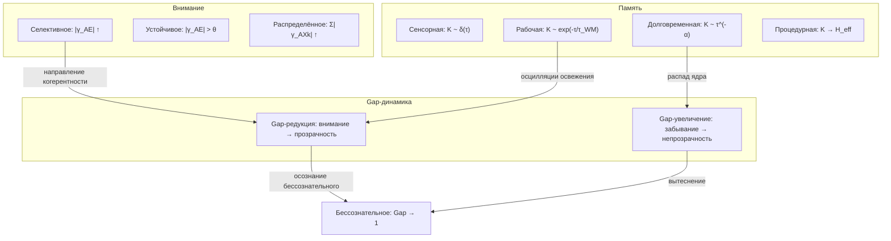

# Внимание и Память

:::note О нотации
В этом документе:
- $\Gamma$ — [матрица когерентности](/docs/core/dynamics/coherence-matrix), $\gamma_{ij}$ — её элементы
- $\mathrm{Tr}(\Gamma) = 1$ — нормировка (условие следа)
- $P = \mathrm{Tr}(\Gamma^2)$ — [чистота (жизнеспособность)](/docs/core/dynamics/viability#определение-чистоты)
- $\gamma_{AX}$ — когерентности между измерением $A$ (артикуляция/внимание) и другими измерениями $X$
- $K(\tau)$ — ядро памяти ([немарковская динамика](/docs/applied/coherence-cybernetics/non-markovian#ядро-памяти))
- $H_{\text{eff}}$ — эффективный гамильтониан ([эволюция Γ](/docs/core/dynamics/evolution))
- $R$ — [мера рефлексии](/docs/consciousness/foundations/self-observation#мера-рефлексии-r)
- Полная таблица нотации — в [Нотации](/docs/reference/notation)
:::

:::warning Статус документа
Определения внимания и памяти через структуру $\Gamma$ — **[О]** (определения по соглашению). Типология памяти через формы ядра $K(\tau)$ — **[С]** (условная при немарковской динамике когерентностей). Феноменологические интерпретации — **[И]**.
:::

## 1. Внимание как перераспределение когерентности {#внимание}

### 1.1 Определение

:::info Определение (Внимание) [О]
**Внимание** к паре измерений $(i,j)$ — временное увеличение модуля когерентности $|\gamma_{AX}|$ при одновременном уменьшении других $|\gamma_{AY}|$ ($Y \neq X$), обусловленное нормировкой $\mathrm{Tr}(\Gamma) = 1$:

$$
\text{Внимание к } X: \quad |\gamma_{AX}|(\tau) \uparrow \quad \Rightarrow \quad \sum_{Y \neq X} |\gamma_{AY}|(\tau) \downarrow
$$

Более формально: внимание — это унитарное (или близкое к унитарному) преобразование $\Gamma$, перераспределяющее когерентность из A-секторных каналов в целевой канал $(A,X)$.
:::

Это **механизм «прожектора»** — прямое следствие нормировки следа. Внимание не создаёт новую когерентность, а перенаправляет существующую.

### 1.2 Связь с [21-парной таксономией квалиа](/docs/consciousness/phenomenology/qualia-structure#таксономия)

Из [таблицы квалиа](/docs/consciousness/phenomenology/qualia-structure#полная-таблица-21-типа-квалиа):
- $\gamma_{AE}$ — **Апперцепция** (квалиа #4): различение, вошедшее в интериорность
- $\gamma_{AS}$ — **Морфогенез** (квалиа #1): кристаллизация форм
- $\gamma_{AD}$ — **Актуализация** (квалиа #2): актуализация различения в процессе
- $\gamma_{AL}$ — **Предикация** (квалиа #3): различение как логический предикат

Направление внимания = выбор, какой из этих квалиативных типов доминирует.

### 1.3 Типы внимания

:::tip Теорема (Типы внимания из нормировки) [О]
Из нормировки $\mathrm{Tr}(\Gamma) = 1$ и неравенства Коши-Шварца $|\gamma_{AX}|^2 \leq \gamma_{AA} \cdot \gamma_{XX}$ следуют три режима внимания:

**(a) Селективное (фокусированное) внимание:**

$$
|\gamma_{AE_{\text{target}}}| \uparrow, \quad |\gamma_{AE_{\text{distractor}}}| \downarrow
$$

Один целевой канал усиливается за счёт остальных. Отношение «сигнал/шум»:

$$
\mathrm{SNR} = \frac{|\gamma_{AE_{\text{target}}}|^2}{\sum_{X \neq E_{\text{target}}} |\gamma_{AX}|^2}
$$

**(b) Устойчивое (sustained) внимание:**

Поддержание повышенного $|\gamma_{AE}|$ на протяжении интервала $[\tau_0, \tau_0 + \Delta\tau]$:

$$
|\gamma_{AE}(\tau)| \geq |\gamma_{AE}|_{\text{th}} \quad \forall\, \tau \in [\tau_0, \tau_0 + \Delta\tau]
$$

Энергетическая стоимость — поддержание $\gamma_{AA}$ против [диссипации](/docs/core/dynamics/evolution#полное-уравнение-движения).

**(c) Распределённое (divided) внимание:**

Несколько $|\gamma_{AX_k}|$ одновременно повышены, но каждый ниже, чем при фокусировке:

$$
\sum_k |\gamma_{AX_k}|^2 \leq \gamma_{AA} \cdot \sum_k \gamma_{X_k X_k} \quad \Rightarrow \quad |\gamma_{AX_k}| < |\gamma_{AX_k}|_{\text{фокус}}
$$

Следствие: распределённое внимание **неизбежно слабее** фокусированного для каждого отдельного канала — прямое следствие нормировки.
:::

### 1.4 Внимание и Gap

Направление внимания на канал $(i,j)$ может снижать $\mathrm{Gap}(i,j)$ — это механизм, лежащий в основе [медитативных практик](/docs/consciousness/states/altered-states#медитация):

$$
\frac{\partial\,\mathrm{Gap}(i,E)}{\partial |\gamma_{AE}|} < 0
$$

Усиление канала внимания–опыт коррелирует со снижением непрозрачности в E-секторных каналах. Это формализует интуицию: «то, на что обращено внимание, становится более прозрачным».

---

## 2. Типы памяти из немарковского ядра {#память}

### 2.1 Ядро памяти и когнитивная память

[Немарковская динамика](/docs/applied/coherence-cybernetics/non-markovian) описывает когерентности с **памятью**: текущая эволюция $\gamma_{ij}(\tau)$ зависит от всей предшествующей истории через ядро $K(\tau - s)$:

$$
\frac{d\gamma_{ij}}{d\tau} = -i\Delta\omega_{ij}\,\gamma_{ij}(\tau) + \int_0^\tau K_{ij}(\tau - s)\, \gamma_{ij}(s)\, ds + \mathcal{R}_{ij}
$$

(см. [Gap-динамика, раздел 4](/docs/core/dynamics/gap-dynamics#немарковские-эффекты))

Форма ядра $K(\tau)$ определяет **тип когнитивной памяти**.

### 2.2 Типология памяти

:::info Определение (Типы памяти) [С]
Условие: [немарковская динамика когерентностей](/docs/core/dynamics/gap-dynamics#немарковские-эффекты). Четыре типа памяти определяются формой ядра $K(\tau)$:

| Тип памяти | Ядро $K(\tau)$ | Характеристика | Временной масштаб |
|------------|----------------|----------------|-------------------|
| **Сенсорная** | $K(\tau) \sim \delta(\tau - \tau')$ | Мгновенная, без персистенции | $\tau_{\text{mem}} \to 0$ |
| **Рабочая** | $K(\tau) \sim e^{-\tau/\tau_{WM}}$ | Экспоненциальный распад | $\tau_{WM} \sim$ секунды |
| **Долговременная** | $K(\tau) \sim (\tau)^{-\alpha}$, $\alpha \in (0,1)$ | Степенной распад, медленное угасание | $\tau_{\text{mem}} \to \infty$ |
| **Процедурная** | Встроена в $H_{\text{eff}}$ | Структура эволюции | Не ограничена |

:::

### 2.3 Сенсорная память

$$
K_{\text{sens}}(\tau) = -\Gamma_2 \cdot \delta(\tau)
$$

**Марковский предел** — память отсутствует. Текущее состояние когерентности определяется только текущими условиями. Физический аналог: мгновенный сенсорный отпечаток, исчезающий при прекращении стимула.

### 2.4 Рабочая память

$$
K_{WM}(\tau) = -\Gamma_2 \omega_c \cdot e^{-\omega_c \tau}, \quad \tau_{WM} = 1/\omega_c
$$

Экспоненциальное ядро — стандартная модель из [немарковской динамики](/docs/applied/coherence-cybernetics/non-markovian#экспоненциальное-ядро). По [Теореме 5.1 Gap-динамики](/docs/core/dynamics/gap-dynamics#немарковские-эффекты), при конечном $\omega_c$ возникают затухающие осцилляции:

$$
\gamma_{ij}(\tau) \propto e^{-\gamma\tau} \cos(\omega_r \tau), \quad \omega_r = \sqrt{\omega_c \Gamma_2 - \gamma^2}
$$

:::info Интерпретация [И]
Осцилляции рабочей памяти соответствуют «перебору» содержания: когерентность не просто затухает, а осциллирует — субъект «возвращается» к содержанию перед его окончательным угасанием. Частота $\omega_r$ определяет скорость «освежения» рабочей памяти.
:::

### 2.5 Долговременная память

$$
K_{LTM}(\tau) \sim -\Gamma_2 \cdot \tau^{-\alpha}, \quad 0 < \alpha < 1
$$

Степенной распад — ядро убывает медленнее экспоненты. Это «тяжёлый хвост»: информация сохраняется неопределённо долго, хотя интенсивность постепенно падает.

:::tip Теорема (Степенной закон забывания) [С]
Условие: степенное ядро $K(\tau) \sim \tau^{-\alpha}$. Амплитуда когерентности при степенном ядре затухает как:

$$
|\gamma_{ij}(\tau)| \sim |\gamma_{ij}(0)| \cdot \tau^{-\beta}, \quad \beta = \frac{\alpha}{2}
$$

Это воспроизводит **кривую забывания Эббингауза** при $\alpha \approx 0.5$–$0.7$ (эмпирический результат $\beta \approx 0.25$–$0.35$).

**Аргумент.** Лапласов образ $\hat{K}(s) \sim s^{\alpha - 1}$ при $\alpha < 1$ (дробный оператор). Асимптотика решения свёрточного уравнения с таким ядром даёт степенной распад с показателем $\beta = \alpha/2$.
:::

### 2.6 Процедурная память

$$
\text{Процедурная память:} \quad K \hookrightarrow H_{\text{eff}}
$$

Процедурная память — не ядро в уравнении когерентности, а **структура самого гамильтониана** $H_{\text{eff}}$. Навык «записан» в параметрах эволюции: частоты $\omega_i$, константы связи, операторы Линдблада.

:::info Интерпретация [И]
Процедурная память фундаментально отличается от остальных типов: она не затухает, поскольку не зависит от ядра $K(\tau)$, а встроена в сам механизм эволюции. «Забыть» процедурную память = изменить $H_{\text{eff}}$, что требует структурной перестройки системы, а не просто декогеренции отдельных когерентностей.
:::

---

## 3. Забывание как декогеренция ядра {#забывание}

:::info Определение (Забывание) [О]
**Забывание** — уменьшение амплитуды ядра памяти $|K(\tau)|$ со временем, ведущее к ослаблению влияния прошлых состояний на текущую динамику:

$$
\text{Забывание:} \quad |K(\tau)| \to 0 \quad \text{при} \quad \tau \to \infty
$$

В марковском пределе ($K \to \delta$) забывание мгновенно. При конечном ядре — постепенно.
:::

### 3.1 Два механизма забывания

| Механизм | Описание | Формула | Обратимость |
|----------|----------|---------|-------------|
| **Декогеренция ядра** | $K(\tau)$ убывает | $\lvert K(\tau)\rvert \to 0$ | Необратимо |
| **Увеличение Gap** | Когерентность непрозрачна | $\mathrm{Gap}(i,j) \to 1$ | Обратимо (Gap-редукция) |

Различие принципиально: если содержание «забыто» через декогеренцию ядра, восстановление невозможно. Если — через увеличение Gap, содержание сохранено в $\gamma_{ij}$, но недоступно (= в [бессознательном](/docs/consciousness/states/unconscious#определение)). Терапия и медитация работают со вторым случаем.

### 3.2 Скорость забывания и чистота

:::tip Теорема (Забывание и жизнеспособность) [С]
Условие: немарковская динамика. Скорость забывания (темп убывания $|K|$) ограничена снизу условием [жизнеспособности](/docs/core/dynamics/viability):

$$
\frac{d|K|}{d\tau} \geq -\frac{\kappa}{P - P_{\text{crit}}} \cdot |K|
$$

При $P \to P_{\text{crit}} = 2/7$ забывание **ускоряется** неограниченно — система на грани жизнеспособности теряет память быстрее. Это согласуется с клиническим наблюдением: тяжелобольные и умирающие пациенты теряют долговременную память.
:::

---

## 4. Интеграция: внимание, память и Gap {#интеграция}

---

## Связи

- **Матрица когерентности:** [Определение Γ](/docs/core/dynamics/coherence-matrix) — A-секторные когерентности
- **Эволюция:** [Уравнения движения](/docs/core/dynamics/evolution) — полное уравнение для $\gamma_{ij}(\tau)$
- **Немарковская динамика:** [Ядро памяти](/docs/applied/coherence-cybernetics/non-markovian) — формы $K(\tau)$
- **Gap-динамика:** [Немарковские осцилляции](/docs/core/dynamics/gap-dynamics#немарковские-эффекты) — осцилляции Gap
- **Квалиа:** [21-парная таксономия](/docs/consciousness/phenomenology/qualia-structure) — типы квалиа, связанные с A-измерением
- **Бессознательное:** [Gap-структура бессознательного](/docs/consciousness/states/unconscious) — связь забывания и бессознательного
- **ИСС:** [Медитация и внимание](/docs/consciousness/states/altered-states#медитация) — шаматха как тренировка $|\gamma_{AE}|$
