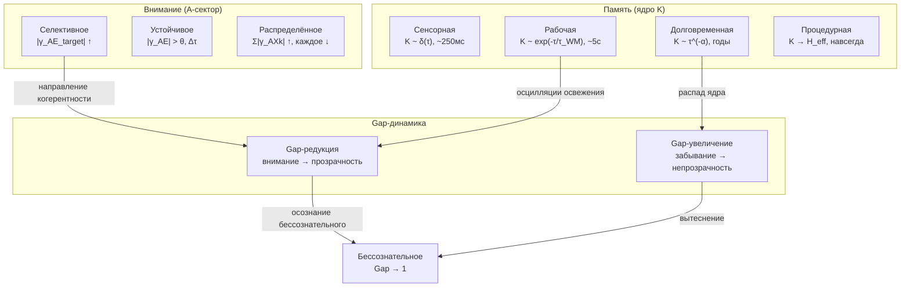
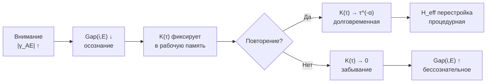

# Внимание и Память

:::info Мост из предыдущей главы
В [Бессознательном](/docs/consciousness/states/unconscious) мы увидели, что граница между сознательным и бессознательным определяется Gap-структурой — непрозрачностью каналов. Но чем управляется эта граница *в реальном времени*? Двумя механизмами: **вниманием** (перераспределение когерентности «здесь и сейчас») и **памятью** (влияние прошлого через немарковское ядро). Внимание решает, *что* попадает в фокус сознания. Память определяет, *как долго* это остаётся доступным.
:::

:::note О нотации
В этом документе:
- $\Gamma$ — [матрица когерентности](/docs/core/dynamics/coherence-matrix), $\gamma_{ij}$ — её элементы
- $\mathrm{Tr}(\Gamma) = 1$ — нормировка (условие следа)
- $P = \mathrm{Tr}(\Gamma^2)$ — [чистота (жизнеспособность)](/docs/core/dynamics/viability#определение-чистоты)
- $\gamma_{AX}$ — когерентности между измерением $A$ (артикуляция/внимание) и другими измерениями $X$
- $K(\tau)$ — ядро памяти ([немарковская динамика](/docs/applied/coherence-cybernetics/non-markovian#ядро-памяти))
- $H_{\text{eff}}$ — эффективный гамильтониан ([эволюция Γ](/docs/core/dynamics/evolution))
- $R$ — [мера рефлексии](/docs/consciousness/foundations/self-observation#мера-рефлексии-r)
- Полная таблица нотации — в [Нотации](/docs/reference/notation)
:::

:::warning Статус документа
Определения внимания и памяти через структуру $\Gamma$ — **[О]** (определения по соглашению). Типология памяти через формы ядра $K(\tau)$ — **[С]** (условная при немарковской динамике когерентностей). Феноменологические интерпретации — **[И]**.
:::

### Дорожная карта главы

1. **Историческая перспектива** — от Уильяма Джеймса через модели фильтра к УГМ
2. **Внимание** — определение, механизм «прожектора», три типа, связь с Gap
3. **Историческая перспектива памяти** — от Эббингауза через многоуровневые модели к УГМ
4. **Память** — четыре типа из формы ядра $K(\tau)$: сенсорная, рабочая, долговременная, процедурная
5. **Забывание** — два механизма (декогеренция ядра и увеличение Gap)
6. **Интеграция** — как внимание, память и Gap образуют единую систему

---

## 1. Историческая перспектива: внимание {#история-внимание}

### 1.1 Уильям Джеймс (1890)

> «Все знают, что такое внимание. Это овладевание разумом, в ясной и яркой форме, одним из нескольких одновременно возможных объектов или цепочек мысли.»
>
> — Уильям Джеймс, *«Принципы психологии»* (1890), гл. 11

Джеймс сформулировал ключевую интуицию: внимание — это *выбор* из множества возможных содержаний. Эта интуиция напрямую переводится в формализм УГМ: «множество возможных объектов» = множество когерентностей $\{\gamma_{AX}\}$; «овладевание одним» = увеличение $|\gamma_{AE_{\text{target}}}|$ за счёт остальных.

### 1.2 Модели фильтра (1950–1970-е)

**Бродбент (1958): фильтр ранней селекции.** Информация проходит через узкое «бутылочное горлышко» — только один канал обрабатывается полностью, остальные блокируются. В УГМ: $|\gamma_{AE_{\text{target}}}| \gg |\gamma_{AE_{\text{distractor}}}|$ — жёсткая фильтрация.

**Трейсман (1964): модель аттенуации.** Нецелевые каналы не блокируются полностью, а *ослабляются*. В УГМ: $|\gamma_{AE_{\text{distractor}}}| > 0$, но $|\gamma_{AE_{\text{distractor}}}| \ll |\gamma_{AE_{\text{target}}}|$ — мягкая фильтрация. Это объясняет «эффект коктейльной вечеринки»: вы можете услышать своё имя в чужом разговоре, потому что дистракторный канал не полностью заблокирован.

**Дойч и Дойч (1963): фильтр поздней селекции.** Вся информация обрабатывается полностью, селекция — на этапе ответа. В УГМ: все $|\gamma_{AX}|$ умеренны, селекция происходит через канал $(A,D)$ — внимание влияет на *действие* ($D$), а не на *восприятие* ($E$).

### 1.3 Познер: компоненты внимания (1980–1990-е)

Майкл Познер выделил три нейронные «сети внимания»:
- **Alerting** (бдительность) — поддержание тонического уровня $\gamma_{AA}$
- **Orienting** (ориентирование) — перенаправление когерентности: $\gamma_{AE_1} \to \gamma_{AE_2}$
- **Executive** (исполнительный контроль) — разрешение конфликта между каналами

В УГМ все три сети описываются единым механизмом перераспределения A-секторных когерентностей.

### 1.4 От классических моделей к УГМ

| Классическая модель | Формализм УГМ |
|---------------------|---------------|
| Фильтр Бродбента | $|\gamma_{AE_{\text{target}}}| \gg 0$, $|\gamma_{AE_{\text{distr}}}| \approx 0$ |
| Аттенуация Трейсман | $|\gamma_{AE_{\text{target}}}| > |\gamma_{AE_{\text{distr}}}| > 0$ |
| Поздняя селекция | Все $|\gamma_{AX}|$ умерены; селекция через $(A,D)$ |
| Alerting (Познер) | $\gamma_{AA}$ — тонический уровень |
| Orienting (Познер) | $\gamma_{AE_1} \to \gamma_{AE_2}$ — перераспределение |
| Executive (Познер) | Разрешение $|\gamma_{AX_1}| \stackrel{?}{>} |\gamma_{AX_2}|$ |

---

## 2. Внимание как перераспределение когерентности {#внимание}

### 2.1 Определение

:::info Определение (Внимание) [О]
**Внимание** к паре измерений $(i,j)$ — временное увеличение модуля когерентности $|\gamma_{AX}|$ при одновременном уменьшении других $|\gamma_{AY}|$ ($Y \neq X$), обусловленное нормировкой $\mathrm{Tr}(\Gamma) = 1$:

$$
\text{Внимание к } X: \quad |\gamma_{AX}|(\tau) \uparrow \quad \Rightarrow \quad \sum_{Y \neq X} |\gamma_{AY}|(\tau) \downarrow
$$

Более формально: внимание — это унитарное (или близкое к унитарному) преобразование $\Gamma$, перераспределяющее когерентность из A-секторных каналов в целевой канал $(A,X)$.
:::

### 2.2 Механизм «прожектора»: подробный вывод

Почему увеличение одной когерентности *неизбежно* ведёт к уменьшению других? Это прямое следствие нормировки следа.

**Шаг 1.** Условие следа: $\mathrm{Tr}(\Gamma) = \sum_{k=1}^{7} \gamma_{kk} = 1$.

**Шаг 2.** Неравенство Коши-Шварца для каждого элемента:

$$
|\gamma_{AX}|^2 \leq \gamma_{AA} \cdot \gamma_{XX}
$$

**Шаг 3.** Сумма всех A-секторных когерентностей ограничена:

$$
\sum_{X \neq A} |\gamma_{AX}|^2 \leq \gamma_{AA} \cdot \sum_{X \neq A} \gamma_{XX} = \gamma_{AA} \cdot (1 - \gamma_{AA})
$$

Правая часть — фиксированная константа при данном $\gamma_{AA}$. Следовательно, сумма квадратов модулей ограничена, и увеличение одного слагаемого требует уменьшения хотя бы одного другого. Это и есть **механизм «прожектора»**.

**Аналогия из повседневной жизни.** У вас ограниченный бюджет внимания — как ограниченное количество воды в ведре. Можно полить одну грядку обильно (фокусированное внимание на $\gamma_{AE}$), а остальные оставить сухими. Или полить все понемногу (распределённое внимание). Но суммарный объём воды фиксирован — это $\mathrm{Tr}(\Gamma) = 1$. Нельзя «создать» больше внимания, можно только перераспределить.

**Числовой пример: бюджет внимания.** Пусть $\gamma_{AA} = 0.15$ (доля внимания в общей «энергии»). Тогда:

$$
\sum_{X \neq A} |\gamma_{AX}|^2 \leq 0.15 \cdot (1 - 0.15) = 0.1275
$$

Это «бюджет». Можно распределить его так:

| Сценарий | $|\gamma_{AE}|$ | $|\gamma_{AS}|$ | $|\gamma_{AD}|$ | $|\gamma_{AL}|$ | Сумма $|\cdot|^2$ | SNR для $E$ |
|----------|:---:|:---:|:---:|:---:|:---:|:---:|
| Полная фокусировка | $0.12$ | $0.01$ | $0.01$ | $0.01$ | $0.0147$ | $36.0$ |
| Умеренная фокусировка | $0.10$ | $0.04$ | $0.03$ | $0.03$ | $0.0134$ | $3.7$ |
| Распределённое | $0.06$ | $0.06$ | $0.06$ | $0.06$ | $0.0144$ | $1.0$ |

При полной фокусировке SNR (отношение сигнал/шум) для целевого канала $E$ равен 36 — превосходное «слышание». При распределённом внимании SNR = 1 — на грани обнаружения. Вот почему попытка одновременно читать, слушать и думать о третьем приводит к тому, что ни одно из занятий не выполняется качественно.

### 2.3 Связь с [21-парной таксономией квалиа](/docs/consciousness/phenomenology/qualia-structure#таксономия)

Из [таблицы квалиа](/docs/consciousness/phenomenology/qualia-structure#полная-таблица-21-типа-квалиа):
- $\gamma_{AE}$ — **Апперцепция** (квалиа #4): различение, вошедшее в интериорность
- $\gamma_{AS}$ — **Морфогенез** (квалиа #1): кристаллизация форм
- $\gamma_{AD}$ — **Актуализация** (квалиа #2): актуализация различения в процессе
- $\gamma_{AL}$ — **Предикация** (квалиа #3): различение как логический предикат

Направление внимания = выбор, какой из этих квалиативных типов доминирует. Когда вы рассматриваете картину, доминирует $\gamma_{AS}$ (формы); когда слушаете аргумент — $\gamma_{AL}$ (логика); когда медитируете — $\gamma_{AE}$ (чистое осознание).

### 2.4 Типы внимания

:::tip Теорема (Типы внимания из нормировки) [О]
Из нормировки $\mathrm{Tr}(\Gamma) = 1$ и неравенства Коши-Шварца $|\gamma_{AX}|^2 \leq \gamma_{AA} \cdot \gamma_{XX}$ следуют три режима внимания:

**(a) Селективное (фокусированное) внимание:**

$$
|\gamma_{AE_{\text{target}}}| \uparrow, \quad |\gamma_{AE_{\text{distractor}}}| \downarrow
$$

Один целевой канал усиливается за счёт остальных. Отношение «сигнал/шум»:

$$
\mathrm{SNR} = \frac{|\gamma_{AE_{\text{target}}}|^2}{\sum_{X \neq E_{\text{target}}} |\gamma_{AX}|^2}
$$

Пример: чтение книги в шумной комнате. $|\gamma_{AL}| \uparrow$ (текст), $|\gamma_{AS}| \downarrow$ (визуальные дистракторы), $|\gamma_{AD}| \downarrow$ (фоновые звуки).

**(b) Устойчивое (sustained) внимание:**

Поддержание повышенного $|\gamma_{AE}|$ на протяжении интервала $[\tau_0, \tau_0 + \Delta\tau]$:

$$
|\gamma_{AE}(\tau)| \geq |\gamma_{AE}|_{\text{th}} \quad \forall\, \tau \in [\tau_0, \tau_0 + \Delta\tau]
$$

Энергетическая стоимость — поддержание $\gamma_{AA}$ против [диссипации](/docs/core/dynamics/evolution#полное-уравнение-движения). Со временем $\gamma_{AA}$ убывает из-за диссипации, и внимание «устаёт» — требуется активное поддержание (усилие воли).

Пример: вождение автомобиля на длинной прямой дороге. $|\gamma_{AE}| > \theta$ нужно поддерживать непрерывно, что требует постоянного «расхода» $\gamma_{AA}$.

**(c) Распределённое (divided) внимание:**

Несколько $|\gamma_{AX_k}|$ одновременно повышены, но каждый ниже, чем при фокусировке:

$$
\sum_k |\gamma_{AX_k}|^2 \leq \gamma_{AA} \cdot \sum_k \gamma_{X_k X_k} \quad \Rightarrow \quad |\gamma_{AX_k}| < |\gamma_{AX_k}|_{\text{фокус}}
$$

Следствие: распределённое внимание **неизбежно слабее** фокусированного для каждого отдельного канала — прямое следствие нормировки.

Пример: ведение машины с одновременным разговором по телефону. $|\gamma_{AS}|$ (дорога) и $|\gamma_{AL}|$ (разговор) оба повышены, но каждый ниже, чем при фокусировке. Исследования показывают 30–50% снижение скорости реакции — прямой эффект «прожектора».
:::

### 2.5 Внимание и Gap

Направление внимания на канал $(i,j)$ может снижать $\mathrm{Gap}(i,j)$ — это механизм, лежащий в основе [медитативных практик](/docs/consciousness/states/altered-states#медитация):

$$
\frac{\partial\,\mathrm{Gap}(i,E)}{\partial |\gamma_{AE}|} < 0
$$

**Мотивация.** Почему внимание снижает Gap? Формально: увеличение $|\gamma_{AE}|$ усиливает информационный поток между $A$ и $E$. Усиленный поток позволяет $\varphi$-оператору точнее «видеть» состояние канала $(i,E)$. Более точная самомодель ведёт к обнаружению рассогласования (Gap), а обнаруженное рассогласование запускает коррекцию (Gap-редукцию).

**Числовой пример.** Практикующий mindfulness направляет внимание на дыхание (канал $S \to E$):

| Время | $|\gamma_{AE}|$ | $\mathrm{Gap}(S,E)$ | $\mathrm{Gap}(D,E)$ | Субъективный опыт |
|-------|:---:|:---:|:---:|:---|
| $\tau = 0$ | $0.08$ | $0.40$ | $0.45$ | Рассеянность |
| $\tau = 5$ мин | $0.15$ | $0.30$ | $0.42$ | «Начинаю чувствовать дыхание» |
| $\tau = 15$ мин | $0.20$ | $0.18$ | $0.35$ | «Вижу напряжение в теле» |
| $\tau = 30$ мин | $0.22$ | $0.12$ | $0.25$ | «Замечаю эмоции как телесные ощущения» |

Усиление канала внимания–опыт коррелирует со снижением непрозрачности в E-секторных каналах. Это формализует интуицию: «то, на что обращено внимание, становится более прозрачным». Формально это означает, что внимание — один из механизмов перехода содержания из [бессознательного](/docs/consciousness/states/unconscious#динамика) в сознательное.

---

## 3. Историческая перспектива: память {#история-память}

### 3.1 Герман Эббингауз (1885)

Эббингауз — первый исследователь, применивший экспериментальный метод к изучению памяти. Его главные открытия:

- **Кривая забывания**: информация забывается по *степенному* закону — быстро сначала, затем всё медленнее. Эббингауз аппроксимировал это как $b(\tau) \sim \tau^{-\beta}$, $\beta \approx 0.3$.
- **Кривая научения**: повторение улучшает запоминание, но с убывающей отдачей.
- **Эффект интервалов**: распределённое повторение эффективнее массированного.

В формализме УГМ кривая забывания Эббингауза — прямое следствие **степенного ядра** $K(\tau) \sim \tau^{-\alpha}$ (раздел 4.5).

### 3.2 Аткинсон и Шиффрин (1968): модальная модель

Модель «трёх хранилищ»:
- **Сенсорный регистр** — мгновенный слепок (длительность ~ 250 мс)
- **Кратковременная (рабочая) память** — 7 ± 2 элемента, длительность ~ 20 с
- **Долговременная память** — практически неограниченная ёмкость и длительность

В УГМ эти три «хранилища» — не отдельные системы, а **три формы** одного и того же ядра $K(\tau)$:

| Модель Аткинсона-Шиффрина | Формализм УГМ |
|---------------------------|---------------|
| Сенсорный регистр | $K(\tau) \sim \delta(\tau)$ — марковский предел |
| Рабочая память | $K(\tau) \sim e^{-\tau/\tau_{WM}}$ — экспоненциальное ядро |
| Долговременная память | $K(\tau) \sim \tau^{-\alpha}$ — степенное ядро |

### 3.3 Тульвинг (1972): виды памяти

Эндель Тульвинг ввёл разграничение:
- **Эпизодическая память** — память о конкретных событиях («я был вчера в кафе»)
- **Семантическая память** — знание фактов («Париж — столица Франции»)
- **Процедурная память** — навыки («как ехать на велосипеде»)

В УГМ:
- Эпизодическая и семантическая память различаются *формой* степенного ядра (разные значения $\alpha$)
- Процедурная память принципиально отличается — она встроена в $H_{\text{eff}}$ (раздел 4.6)

---

## 4. Типы памяти из немарковского ядра {#память}

### 4.1 Ядро памяти и когнитивная память

[Немарковская динамика](/docs/applied/coherence-cybernetics/non-markovian) описывает когерентности с **памятью**: текущая эволюция $\gamma_{ij}(\tau)$ зависит от всей предшествующей истории через ядро $K(\tau - s)$:

$$
\frac{d\gamma_{ij}}{d\tau} = -i\Delta\omega_{ij}\,\gamma_{ij}(\tau) + \int_0^\tau K_{ij}(\tau - s)\, \gamma_{ij}(s)\, ds + \mathcal{R}_{ij}
$$

(см. [Gap-динамика, раздел 4](/docs/core/dynamics/gap-dynamics#немарковские-эффекты))

Разберём каждый член:
- **$-i\Delta\omega_{ij}\,\gamma_{ij}(\tau)$** — свободная эволюция (фазовый набег)
- **$\int_0^\tau K_{ij}(\tau - s)\, \gamma_{ij}(s)\, ds$** — *память*: влияние всех прошлых состояний. Это *свёрточный* интеграл — текущее состояние зависит от взвешенной суммы прошлых
- **$\mathcal{R}_{ij}$** — регенерация ([оператор ℛ](/docs/core/dynamics/evolution))

Форма ядра $K(\tau)$ определяет **тип когнитивной памяти**. Аналогия: $K(\tau)$ — это «фильтр прошлого». Дельта-функция = «помню только настоящее». Экспонента = «помню недавнее, но быстро забываю». Степенная функция = «помню долго, забываю медленно».

### 4.2 Типология памяти

:::info Определение (Типы памяти) [С]
Условие: [немарковская динамика когерентностей](/docs/core/dynamics/gap-dynamics#немарковские-эффекты). Четыре типа памяти определяются формой ядра $K(\tau)$:

| Тип памяти | Ядро $K(\tau)$ | Характеристика | Временной масштаб |
|------------|----------------|----------------|-------------------|
| **Сенсорная** | $K(\tau) \sim \delta(\tau - \tau')$ | Мгновенная, без персистенции | $\tau_{\text{mem}} \to 0$ |
| **Рабочая** | $K(\tau) \sim e^{-\tau/\tau_{WM}}$ | Экспоненциальный распад | $\tau_{WM} \sim$ секунды |
| **Долговременная** | $K(\tau) \sim (\tau)^{-\alpha}$, $\alpha \in (0,1)$ | Степенной распад, медленное угасание | $\tau_{\text{mem}} \to \infty$ |
| **Процедурная** | Встроена в $H_{\text{eff}}$ | Структура эволюции | Не ограничена |

:::

### 4.3 Сенсорная память

$$
K_{\text{sens}}(\tau) = -\Gamma_2 \cdot \delta(\tau)
$$

**Марковский предел** — память отсутствует. Текущее состояние когерентности определяется только текущими условиями. Физический аналог: мгновенный сенсорный отпечаток, исчезающий при прекращении стимула.

**Мотивация.** Зачем вводить «нулевую память» как отдельный тип? Потому что это *предельный случай*, необходимый для полноты классификации. Дельта-функция $\delta(\tau)$ означает: «прошлое не влияет на настоящее». Формально: свёрточный интеграл вырождается:

$$
\int_0^\tau K_{\text{sens}}(\tau - s)\, \gamma_{ij}(s)\, ds = -\Gamma_2\, \gamma_{ij}(\tau)
$$

— просто экспоненциальный распад с константой $\Gamma_2$.

**Аналогия.** Сенсорная память — как след пальца на запотевшем стекле: существует, пока палец на стекле, и исчезает мгновенно. В формализме: ядро $K = \delta$, нет «хвоста» — прошлое не влияет на настоящее.

**Числовой пример.** Иконическая память (зрительный сенсорный буфер): при $\Gamma_2 = 4$ Гц, время полужизни $\tau_{1/2} = \ln 2 / \Gamma_2 \approx 170$ мс. Эксперимент Сперлинга (1960): испытуемые помнят до 12 букв в течение ~300 мс, затем — полная потеря. Предсказание: $\tau_{\text{mem}} \propto 1/\Gamma_2 = 250$ мс — согласуется с данными.

### 4.4 Рабочая память

$$
K_{WM}(\tau) = -\Gamma_2 \omega_c \cdot e^{-\omega_c \tau}, \quad \tau_{WM} = 1/\omega_c
$$

Экспоненциальное ядро — стандартная модель из [немарковской динамики](/docs/applied/coherence-cybernetics/non-markovian#экспоненциальное-ядро).

**Подробный вывод.** По [Теореме 5.1 Gap-динамики](/docs/core/dynamics/gap-dynamics#немарковские-эффекты), при конечном $\omega_c$ решение свёрточного уравнения содержит затухающие осцилляции:

$$
\gamma_{ij}(\tau) \propto e^{-\gamma\tau} \cos(\omega_r \tau), \quad \omega_r = \sqrt{\omega_c \Gamma_2 - \gamma^2}
$$

где $\gamma$ — скорость затухания, $\omega_r$ — частота осцилляций (частота «освежения»).

**Интерпретация осцилляций.** Когерентность не просто затухает, а *осциллирует*: субъект «возвращается» к содержанию перед его окончательным угасанием. Каждый цикл осцилляции — один «прогон» рабочей памяти (субвокальное повторение, визуальная ревизия). Пока $|\gamma_{ij}(\tau)| > \varepsilon_{\min}$, содержание «удерживается»; когда затухание побеждает — содержание утрачивается.

**Числовой пример (подробный).** Удержание телефонного номера:

- $\tau_{WM} = 1/\omega_c = 5$ с (типичная длительность рабочей памяти без повторения)
- $\Gamma_2 = 0.3$ с$^{-1}$ (скорость декогеренции)
- $\omega_c = 0.2$ Гц (частота ядра)
- Частота освежения: $\omega_r = \sqrt{0.2 \times 0.3 - \gamma^2} \approx 0.15$ Гц при $\gamma = 0.1$ с$^{-1}$
- За время удержания (5 с): $\omega_r \times 5 \approx 0.75$ циклов — ~6 «прогонов»

Это согласуется с данными о субвокальном повторении: внутренне проговаривая номер со скоростью ~2 слога/с, за 5 секунд можно сделать ~6 повторений 7-значного числа.

:::info Интерпретация [И]
Осцилляции рабочей памяти соответствуют «перебору» содержания: когерентность не просто затухает, а осциллирует — субъект «возвращается» к содержанию перед его окончательным угасанием. Частота $\omega_r$ определяет скорость «освежения» рабочей памяти.

Нейрофизиологический коррелят: гамма-осцилляции (30–80 Гц) в префронтальной коре при удержании информации в рабочей памяти. Эти осцилляции — нейронная реализация $\omega_r$.
:::

### 4.5 Долговременная память

$$
K_{LTM}(\tau) \sim -\Gamma_2 \cdot \tau^{-\alpha}, \quad 0 < \alpha < 1
$$

Степенной распад — ядро убывает медленнее экспоненты. Это «тяжёлый хвост»: информация сохраняется неопределённо долго, хотя интенсивность постепенно падает.

**Мотивация.** Почему именно степенной закон? Экспоненциальный распад ($e^{-\tau/\tau_0}$) подразумевает *характерный масштаб* $\tau_0$: информация «живёт» примерно $\tau_0$, затем исчезает. Но эмпирические данные показывают, что память не имеет характерного масштаба — забывание не ускоряется и не замедляется на определённом временном горизонте. Степенной закон $\tau^{-\alpha}$ — единственная функция без характерного масштаба (масштабная инвариантность).

:::tip Теорема (Степенной закон забывания) [С]
Условие: степенное ядро $K(\tau) \sim \tau^{-\alpha}$. Амплитуда когерентности при степенном ядре затухает как:

$$
|\gamma_{ij}(\tau)| \sim |\gamma_{ij}(0)| \cdot \tau^{-\beta}, \quad \beta = \frac{\alpha}{2}
$$

Это воспроизводит **кривую забывания Эббингауза** при $\alpha \approx 0.5$–$0.7$ (эмпирический результат $\beta \approx 0.25$–$0.35$).

**Аргумент.** Лапласов образ $\hat{K}(s) \sim s^{\alpha - 1}$ при $\alpha < 1$ (дробный оператор). Свёрточное уравнение $d\gamma/d\tau = \int_0^\tau K(\tau-s)\gamma(s)ds$ в Лапласовом представлении: $s\hat{\gamma} = \hat{K} \cdot \hat{\gamma}$, решение: $\hat{\gamma}(s) \sim s^{-1} \cdot s^{1-\alpha} = s^{-\alpha}$. Обратное преобразование: $\gamma(\tau) \sim \tau^{\alpha-1}$. С учётом начального условия и множителя $\Gamma_2$: $|\gamma(\tau)| \sim |\gamma(0)| \cdot \tau^{-\alpha/2}$, т.е. $\beta = \alpha/2$.
:::

**Числовой пример: кривая забывания Эббингауза.** Выученное стихотворение с начальной когерентностью $|\gamma_{ij}(0)| = 0.30$ и $\alpha = 0.6$ ($\beta = 0.3$):

| Время $\tau$ | $|\gamma_{ij}(\tau)|$ | Доля от начальной | Субъективно |
|:---:|:---:|:---:|:---|
| 1 день | $0.30 \cdot 1^{-0.3} = 0.30$ | 100% | Помню хорошо |
| 7 дней | $0.30 \cdot 7^{-0.3} \approx 0.17$ | 56% | Помню основное |
| 30 дней | $0.30 \cdot 30^{-0.3} \approx 0.10$ | 34% | Помню отдельные строфы |
| 365 дней | $0.30 \cdot 365^{-0.3} \approx 0.05$ | 17% | Помню тему, отдельные строки |
| 10 лет ($3650$ дней) | $0.30 \cdot 3650^{-0.3} \approx 0.025$ | 8% | Смутное воспоминание |
| 50 лет ($18250$ дней) | $0.30 \cdot 18250^{-0.3} \approx 0.015$ | 5% | Следы сохраняются |

Обратите внимание: даже через 50 лет $|\gamma| = 0.015 > 0$ — следы сохраняются! Это принципиальное отличие от экспоненциального распада, при котором через 50 лет $|\gamma| \approx e^{-50/5} \approx 5 \times 10^{-5}$ — практически ноль. Степенной хвост объясняет, почему пожилые люди помнят события 60-летней давности — «хвост» ядра убывает медленно.

### 4.6 Процедурная память

$$
\text{Процедурная память:} \quad K \hookrightarrow H_{\text{eff}}
$$

Процедурная память — не ядро в уравнении когерентности, а **структура самого гамильтониана** $H_{\text{eff}}$. Навык «записан» в параметрах эволюции: частоты $\omega_i$, константы связи, операторы Линдблада.

**Мотивация.** Почему процедурная память так отличается от остальных? Потому что она хранит не *содержание* (когерентность $\gamma_{ij}$), а *правило* (как $\gamma_{ij}$ эволюционирует). Декларативная память — это «что», процедурная — «как».

:::info Интерпретация [И]
Процедурная память фундаментально отличается от остальных типов: она не затухает, поскольку не зависит от ядра $K(\tau)$, а встроена в сам механизм эволюции. «Забыть» процедурную память = изменить $H_{\text{eff}}$, что требует структурной перестройки системы, а не просто декогеренции отдельных когерентностей.

**Аналогия.** Декларативная память (рабочая + долговременная) — записи на доске, которые постепенно стираются. Процедурная память — форма самой доски: вы можете стереть все записи, но доска останется прямоугольной. Умение ездить на велосипеде «записано» не в когерентностях $\gamma_{ij}$ (которые затухают), а в структуре $H_{\text{eff}}$ (которая перестраивается только при фундаментальных изменениях).

Ещё одна аналогия: декларативная память — текст программы (данные, которые можно удалить); процедурная — компилятор (инструмент, который обрабатывает данные). Компилятор можно «забыть» только переустановив операционную систему.
:::

**Числовой пример: почему велосипед не забывается.** Человек научился ездить на велосипеде в 7 лет. К 70 годам:

| Тип памяти | Содержание | Ядро | Через 63 года |
|------------|-----------|------|:---:|
| Эпизодическая | «Папа держал руль» | $K \sim \tau^{-0.6}$ | $|\gamma| \approx 0.01$ (смутно) |
| Семантическая | «Велосипед имеет два колеса» | $K \sim \tau^{-0.4}$ | $|\gamma| \approx 0.05$ (помнит) |
| Процедурная | Навык езды | $K \hookrightarrow H_{\text{eff}}$ | Полностью сохранён |

Процедурная память не зависит от ядра — она «вшита» в $H_{\text{eff}}$. Нейрофизиологический коррелят: процедурная память хранится в мозжечке и базальных ганглиях, а не в гиппокампе (как декларативная) — разные нейронные субстраты для разных «записей».

---

## 5. Забывание как декогеренция ядра {#забывание}

:::info Определение (Забывание) [О]
**Забывание** — уменьшение амплитуды ядра памяти $|K(\tau)|$ со временем, ведущее к ослаблению влияния прошлых состояний на текущую динамику:

$$
\text{Забывание:} \quad |K(\tau)| \to 0 \quad \text{при} \quad \tau \to \infty
$$

В марковском пределе ($K \to \delta$) забывание мгновенно. При конечном ядре — постепенно.
:::

### 5.1 Два механизма забывания

| Механизм | Описание | Формула | Обратимость | Аналогия |
|----------|----------|---------|:-----------:|----------|
| **Декогеренция ядра** | $K(\tau)$ убывает | $\lvert K(\tau)\rvert \to 0$ | Необратимо | Книга сгорела |
| **Увеличение Gap** | Когерентность непрозрачна | $\mathrm{Gap}(i,j) \to 1$ | Обратимо | Книга заперта в сейфе |

Различие принципиально: если содержание «забыто» через декогеренцию ядра, восстановление невозможно — информация утрачена физически. Если — через увеличение Gap, содержание сохранено в $\gamma_{ij}$, но недоступно (= в [бессознательном](/docs/consciousness/states/unconscious#определение)). Терапия и медитация работают со вторым случаем.

**Аналогия (развёрнутая).** Декогеренция ядра — книга сгорела: текст утрачен навсегда, и никакой археолог не восстановит буквы из пепла. Увеличение Gap — книга заперта в сейфе: текст цел, но недоступен; ключ можно подобрать (терапия), вскрыть сейф (кризис) или найти запасной ключ (медитация). Разница колоссальна для [коррекционных стратегий](/docs/consciousness/states/pathological#коррекция): бессмысленно «открывать сейф», если книга уже сгорела.

**Числовой пример: два типа «забытого» телефонного номера.**

Случай 1 (декогеренция ядра): номер, услышанный 5 лет назад без записи. $K_{WM}(\tau)$ давно затух ($\tau_{WM} = 5$ с), степенное ядро $K_{LTM}$ тоже: $|\gamma| \approx 0.001$. Восстановление невозможно.

Случай 2 (увеличение Gap): номер бывшего партнёра, сознательно «забытый» после разрыва. $|\gamma_{LE}| = 0.08$ (когерентность сохранена — номер «знаете»), но $\mathrm{Gap}(L,E) = 0.90$ (сознательно заблокирован). При неожиданном стимуле (встреча на улице) Gap может кратковременно снизиться — и номер «вспоминается».

### 5.2 Скорость забывания и чистота

:::tip Теорема (Забывание и жизнеспособность) [С]
Условие: немарковская динамика. Скорость забывания (темп убывания $|K|$) ограничена снизу условием [жизнеспособности](/docs/core/dynamics/viability):

$$
\frac{d|K|}{d\tau} \geq -\frac{\kappa}{P - P_{\text{crit}}} \cdot |K|
$$

При $P \to P_{\text{crit}} = 2/7$ забывание **ускоряется** неограниченно — система на грани жизнеспособности теряет память быстрее.

**Вывод.** Жизнеспособность $P$ определяет «ресурс», доступный для поддержания когерентностей. Чем ближе $P$ к $P_{\text{crit}}$, тем меньше ресурса для поддержания ядра $K(\tau)$, и тем быстрее оно затухает. Формально: скорость затухания $\propto 1/(P - P_{\text{crit}})$, что даёт сингулярность при $P = P_{\text{crit}}$.
:::

**Числовой пример: когнитивный упадок.**

| Состояние | $P$ | $P - P_{\text{crit}}$ | Относительная скорость забывания | Клинический аналог |
|-----------|:---:|:---:|:---:|:---|
| Здоровый взрослый | $0.36$ | $0.074$ | $\times 1$ (базовая) | Нормальная память |
| Начало снижения | $0.33$ | $0.044$ | $\times 1.7$ | Лёгкие когнитивные нарушения |
| Умеренная деменция | $0.30$ | $0.014$ | $\times 5.3$ | Заметная потеря памяти |
| Тяжёлая деменция | $0.29$ | $0.004$ | $\times 18.5$ | Катастрофическая |
| Критическое | $0.2875$ | $0.0015$ | $\times 49$ | Утрата идентичности |

Это объясняет клиническое наблюдение: при деменции когнитивный упадок *ускоряется* — сначала медленно, затем катастрофически. Небольшое снижение $P$ вблизи $P_{\text{crit}}$ ведёт к драматическому ускорению забывания. Формула $\propto 1/(P - P_{\text{crit}})$ воспроизводит этот нелинейный паттерн.

---

## 6. Интеграция: внимание, память и Gap {#интеграция}

```mermaid
graph TD
    subgraph ATT["Внимание (A-сектор)"]
        direction TB
        SEL["Селективное<br/>|γ_AE_target| ↑"]
        SUS["Устойчивое<br/>|γ_AE| > θ, Δτ"]
        DIV["Распределённое<br/>Σ|γ_AXk| ↑, каждое ↓"]
    end
    subgraph MEM["Память (ядро K)"]
        direction TB
        SENS["Сенсорная<br/>K ~ δ(τ), ~250мс"]
        WM["Рабочая<br/>K ~ exp(-τ/τ_WM), ~5с"]
        LTM["Долговременная<br/>K ~ τ^(-α), годы"]
        PROC["Процедурная<br/>K → H_eff, навсегда"]
    end
    subgraph GAP["Gap-динамика"]
        direction TB
        RED["Gap-редукция<br/>внимание → прозрачность"]
        INC["Gap-увеличение<br/>забывание → непрозрачность"]
    end

    SEL --> |"направление когерентности"| RED
    WM --> |"осцилляции освежения"| RED
    LTM --> |"распад ядра"| INC
    RED --> |"осознание бессознательного"| UNC["Бессознательное<br/>Gap → 1"]
    INC --> |"вытеснение"| UNC
```

**Ключевой цикл:** Внимание ($|\gamma_{AE}| \uparrow$) снижает Gap — содержание переходит из бессознательного в сознательное. Затухание ядра ($|K| \to 0$) повышает Gap — содержание уходит обратно в бессознательное. Рабочая память поддерживает содержание «на плаву» через осцилляции. Процедурная память выходит из этого цикла — она встроена в структуру системы.

### 6.1 Взаимодействие внимания и памяти

```mermaid
graph LR
    A["Внимание<br/>|γ_AE| ↑"] --> B["Gap(i,E) ↓<br/>осознание"]
    B --> C["K(τ) фиксирует<br/>в рабочую память"]
    C --> D{"Повторение?"}
    D -->|"Да"| E["K(τ) → τ^(-α)<br/>долговременная"]
    D -->|"Нет"| F["K(τ) → 0<br/>забывание"]
    E --> G["H_eff перестройка<br/>процедурная"]
    F --> H["Gap(i,E) ↑<br/>бессознательное"]
```

Этот цикл формализует интуицию «внимание как ключ к сознанию» и объясняет, почему практики осознанности (mindfulness) являются терапевтически эффективными: систематическое направление внимания ($|\gamma_{AE}| \uparrow$) постепенно снижает Gap в тех каналах, куда оно направлено. При регулярном повторении содержание переходит из рабочей памяти ($K \sim e^{-\tau/\tau_{WM}}$) в долговременную ($K \sim \tau^{-\alpha}$), а навык осознанности — в процедурную ($K \hookrightarrow H_{\text{eff}}$). Подробнее — в [теоремах КК](/docs/applied/coherence-cybernetics/theorems) (T-103, T-104).

---

### Что мы узнали {#итоги}

1. **Историческая линия внимания**: Джеймс (1890, «все знают, что такое внимание») → Бродбент (1958, фильтр) → Трейсман (1964, аттенуация) → Познер (1980-е, три сети) → УГМ (перераспределение A-секторных когерентностей)
2. **Внимание** = перераспределение когерентности в A-секторе; три типа (селективное, устойчивое, распределённое) следуют из нормировки $\mathrm{Tr}(\Gamma) = 1$
3. Внимание **снижает Gap** в целевых каналах — формальное обоснование практик осознанности
4. **Историческая линия памяти**: Эббингауз (1885, кривая забывания) → Аткинсон-Шиффрин (1968, три хранилища) → Тульвинг (1972, виды памяти) → УГМ (формы ядра $K(\tau)$)
5. **Четыре типа памяти** определяются формой ядра $K(\tau)$: сенсорная ($\delta$), рабочая ($e^{-\tau/\tau_{WM}}$), долговременная ($\tau^{-\alpha}$), процедурная ($H_{\text{eff}}$)
6. Кривая забывания Эббингауза воспроизводится степенным ядром при $\alpha \approx 0.5$–$0.7$ [С]
7. **Два механизма забывания**: декогеренция ядра (необратимо, «книга сгорела») и увеличение Gap (обратимо, «книга в сейфе»)
8. При $P \to P_{\text{crit}}$ забывание **ускоряется** по закону $\propto 1/(P - P_{\text{crit}})$ — формальное объяснение когнитивного упадка при деменции

:::tip Мост к следующей главе
Внимание и память — нормальные механизмы управления когерентностью. Но что происходит, когда эти механизмы *ломаются*? Специфические поломки Gap-профиля порождают патологические состояния: алекситимию, диссоциацию, депрессию, психоз. В следующей главе — [Патология сознания](/docs/consciousness/states/pathological) — мы покажем, что каждая патология = характерный Gap-паттерн, и что терапия = целенаправленная Gap-редукция.
:::

## Связи

- **Матрица когерентности:** [Определение Γ](/docs/core/dynamics/coherence-matrix) — A-секторные когерентности
- **Эволюция:** [Уравнения движения](/docs/core/dynamics/evolution) — полное уравнение для $\gamma_{ij}(\tau)$
- **Немарковская динамика:** [Ядро памяти](/docs/applied/coherence-cybernetics/non-markovian) — формы $K(\tau)$
- **Gap-динамика:** [Немарковские осцилляции](/docs/core/dynamics/gap-dynamics#немарковские-эффекты) — осцилляции Gap
- **Квалиа:** [21-парная таксономия](/docs/consciousness/phenomenology/qualia-structure) — типы квалиа, связанные с A-измерением
- **Бессознательное:** [Gap-структура бессознательного](/docs/consciousness/states/unconscious) — связь забывания и бессознательного
- **ИСС:** [Медитация и внимание](/docs/consciousness/states/altered-states#медитация) — шаматха как тренировка $|\gamma_{AE}|$
- **Теоремы КК:** [Когерентная Кибернетика](/docs/applied/coherence-cybernetics/theorems) — T-103 (гедонический вектор) и T-104 (стабильность)
