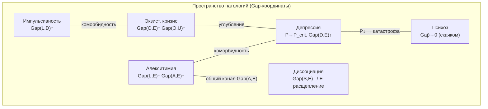
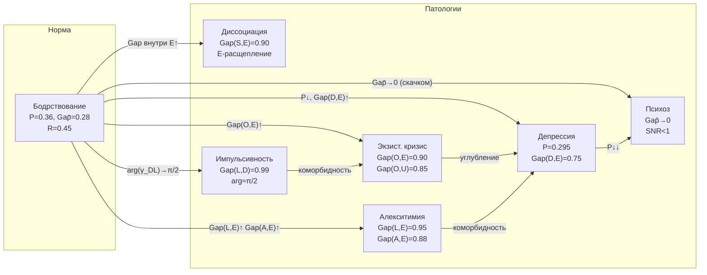

# Патология Сознания

:::info Мост из предыдущей главы
В [Внимании и памяти](/docs/consciousness/states/attention-memory) мы рассмотрели *нормальные* механизмы управления когерентностью: внимание как «прожектор», память как ядро $K(\tau)$, забывание как декогеренция. Теперь мы спрашиваем: **что происходит, когда эти механизмы работают неправильно?** Когда определённые каналы «застревают» в непрозрачном состоянии ($\mathrm{Gap} \to 1$), или, наоборот, все каналы скачком становятся прозрачными? Каждая патология — не «поломка», а **специфический Gap-профиль**: конфигурация $\Gamma$, поддающаяся формальному описанию и — потенциально — целенаправленной коррекции.
:::

:::note О нотации
В этом документе:
- $\Gamma$ — [матрица когерентности](/docs/core/dynamics/coherence-matrix), $\gamma_{ij}$ — её элементы
- $\mathrm{Gap}(i,j) = |\sin(\arg(\gamma_{ij}))|$ — [мера зазора](/docs/core/dynamics/gap-operator#определение)
- $P = \mathrm{Tr}(\Gamma^2)$ — [чистота (жизнеспособность)](/docs/core/dynamics/viability#определение-чистоты)
- $P_{\text{crit}} = 2/7$ — [порог жизнеспособности](/docs/core/dynamics/viability) **[Т]**
- $R$ — [мера рефлексии](/docs/consciousness/foundations/self-observation#мера-рефлексии-r)
- $\overline{\mathrm{Gap}} = \frac{1}{21}\sum_{i<j} \mathrm{Gap}(i,j)$ — средний Gap
- L0–L4 — [уровни интериорности](/docs/consciousness/hierarchy/interiority-hierarchy)
- Полная таблица нотации — в [Нотации](/docs/reference/notation)
:::

:::warning Статус документа
Весь материал данного документа имеет статус **[И]** — интерпретация/приложение. Патология сознания — операционализация формализма [Gap-диагностики](/docs/applied/research/gap-diagnostics); эмпирическая валидация требует отдельной [исследовательской программы](/docs/applied/research/measurement-protocol). Математические определения Gap-профилей — **[О]**; отождествление с клиническими категориями — **[И]**.
:::

### Дорожная карта главы

1. **Историческая перспектива** — от Крепелина через DSM к RDoC и УГМ
2. **Патологические Gap-паттерны** — шесть клинических категорий
3. **Сводная таблица** — все патологии в одной таблице
4. **Соответствие Gap-паттернов и DSM-5** — трансляция формализма
5. **Диагностический протокол** — как различить патологии по Gap-профилю
6. **Коморбидность** — наложение Gap-паттернов
7. **Коррекционные стратегии** — терапия как целенаправленная Gap-редукция
8. **Динамика переходов** — бифуркации входа/выхода из патологии
9. **Пространство патологий** — mermaid-визуализация
10. **Фазовая диаграмма** — где расположены патологии

---

## 1. Историческая перспектива {#история}

### 1.1 Эмиль Крепелин (1883): классификация по течению

Крепелин — отец нозологической психиатрии. Его ключевая идея: психические заболевания следует классифицировать по *течению* (исход), а не по *симптомам* (текущая картина). Он разделил две главные формы:
- **Dementia praecox** (шизофрения) — прогрессирующее ухудшение
- **Маниакально-депрессивный психоз** (биполярное расстройство) — циклическое течение

В формализме УГМ: шизофрения — *монотонное* снижение числа функциональных каналов ($|\{(i,j): \mathrm{Gap} > \varepsilon_{\text{noise}}\}| \downarrow$); биполярное расстройство — *осцилляции* $P(\tau)$ (бифуркация Хопфа).

### 1.2 DSM: категориальный подход (1952–2013)

Diagnostic and Statistical Manual (DSM) — категориальная классификация: каждое расстройство определяется списком симптомов и критериями включения/исключения. DSM прошёл 5 редакций (I–5), постепенно отходя от психодинамических концепций к описательному подходу.

**Проблема DSM:** категориальность. Пациент «имеет» или «не имеет» расстройство; границы между категориями условны; коморбидность (наложение диагнозов) — правило, а не исключение. Более 50% пациентов с депрессией имеют коморбидное тревожное расстройство.

### 1.3 RDoC: размерный подход (2010–н.в.)

Research Domain Criteria (RDoC) — инициатива NIMH (Национального института психического здоровья США), предлагающая *размерный* подход: психические расстройства описываются не категориями, а *размерностями* (домены):
- Негативная валентность (страх, тревога)
- Позитивная валентность (вознаграждение, мотивация)
- Когнитивные системы (внимание, память)
- Социальные процессы
- Системы возбуждения/регуляции

### 1.4 От RDoC к УГМ

| Классический подход | Формализм УГМ |
|---------------------|---------------|
| DSM-категория (да/нет) | Gap-профиль (непрерывный вектор) |
| RDoC-домен | Конкретный канал $\mathrm{Gap}(i,j)$ |
| Коморбидность | Наложение Gap-паттернов |
| Тяжесть | Амплитуда Gap-отклонения от нормы |
| Течение (Крепелин) | Траектория $\Gamma(\tau)$ |
| Терапия | Целенаправленная Gap-редукция |

УГМ объединяет достоинства всех трёх подходов: нозологическая специфичность Крепелина (конкретные Gap-паттерны), операциональность DSM (числовые пороги), размерность RDoC (непрерывные параметры).

---

Патологические состояния сознания — не «поломки» механизма, а **специфические Gap-профили**: конфигурации матрицы когерентности $\Gamma$, при которых определённые каналы аномально непрозрачны ($\mathrm{Gap} \to 1$) или аномально прозрачны ($\mathrm{Gap} \to 0$). Данный документ расширяет [Gap-диагностику](/docs/applied/research/gap-diagnostics) системным анализом патологических паттернов.

**Аналогия из повседневной жизни.** Здоровое сознание — как дом с окнами разной прозрачности: некоторые распахнуты, некоторые закрыты, но все функциональны. Патология — когда определённые окна «заклинило»: наглухо замазанное окно эмоций (алекситимия), распахнутые настежь все окна одновременно (психоз), или когда весь дом медленно проседает к фундаменту (депрессия при $P \to P_{\text{crit}}$).

---

## 2. Патологические Gap-паттерны {#паттерны}

### 2.1 Алекситимия {#алекситимия}

:::info Определение (Алекситимия) [И]
**Алекситимия** (от греч. *a-lexis-thymos* — «без слов для чувств») — невозможность идентификации и вербализации эмоций. Gap-профиль:

$$
\mathrm{Gap}(L,E) \to 1, \quad \mathrm{Gap}(A,E) \to 1
$$

Оба канала — логика–опыт и внимание–опыт — непрозрачны. Субъект не может ни **заметить** ($A$), ни **понять** ($L$) свои переживания ($E$).
:::

**Мотивация определения.** Почему именно два канала, а не один? Алекситимия — *двойной* дефицит: (1) человек не замечает эмоцию (Gap(A,E) высок — «тень» по Юнгу) и (2) не может вербализовать её (Gap(L,E) высок — «вытеснение» по Фрейду). Если бы был высок только Gap(L,E), субъект замечал бы эмоцию, но не мог её назвать — это «алекситимия лёгкой степени». Полная алекситимия = двойная непрозрачность.

Дополнительный признак: $|\gamma_{SE}|$ может быть высоким ($\mathrm{Gap}(S,E) < 1$) — тело «чувствует», но опыт не регистрируется вниманием и не обрабатывается логикой. Это объясняет *соматизацию* при алекситимии: переживание «обходит» сознание и проявляется в теле (боль, усталость, напряжение без осознаваемой эмоции).

**Числовой пример.** Полный Gap-профиль пациента с алекситимией (E-секторные каналы):

| Канал | $|\gamma_{ij}|$ | $\mathrm{Gap}(i,j)$ | Интерпретация |
|-------|:---:|:---:|:---|
| $(L,E)$ | $0.15$ | $0.95$ | Не может назвать чувство |
| $(A,E)$ | $0.10$ | $0.88$ | Не замечает чувство |
| $(S,E)$ | $0.12$ | $0.20$ | Тело реагирует (сердцебиение, потливость) |
| $(D,E)$ | $0.18$ | $0.30$ | Эмоция активна, частично проявляется |
| $(O,E)$ | $0.05$ | $0.45$ | Связь с основанием ослаблена |
| $(U,E)$ | $0.07$ | $0.40$ | Интеграция умеренная |

На вопрос «что вы чувствуете?» пациент отвечает: «у меня учащается пульс» (телесный канал $S \to E$ прозрачен), а не «я боюсь» (логический канал $L \to E$ непрозрачен).

**DSM-5 соответствие.** Алекситимия не является отдельным диагнозом DSM-5, но присутствует как черта при: расстройствах соматических симптомов (F45), расстройствах аутистического спектра (F84), посттравматическом стрессовом расстройстве (F43.1).

Сравнение с [моделью алекситимии в Gap-динамике](/docs/core/dynamics/gap-dynamics#модельные-системы): там рассмотрена упрощённая модель с одним каналом $(S,E)$; здесь — расширенная, с двумя непрозрачными каналами.

### 2.2 Расщеплённый невроз (диссоциация) {#невроз}

:::info Определение (Диссоциация) [И]
**Расщеплённый невроз** — диссоциация **внутри** E-измерения. Gap-профиль:

$$
\mathrm{Gap}(E_1, E_2) \to 1 \quad \text{внутри E-сектора}
$$

Формально: если декомпозировать E-измерение на подпространства $E = E_1 \oplus E_2$, то когерентности между ними непрозрачны. Субъект обладает двумя «островами» опыта, не связанными друг с другом.
:::

В 7-мерной модели без подпространственной декомпозиции диссоциация проявляется как:

$$
\mathrm{Gap}(S,E) \to 1, \quad \mathrm{Gap}(D,E) \approx 0 \quad \text{(или наоборот)}
$$

— различные аспекты опыта (телесный vs. динамический) изолированы друг от друга через различную прозрачность по отношению к E.

**Числовой пример.** Пациент с диссоциативным расстройством (деперсонализация):

| Канал | Норма $\mathrm{Gap}$ | Диссоциация $\mathrm{Gap}$ | Разница |
|-------|:---:|:---:|:---|
| $(S,E)$ | $0.20$ | $0.90$ | Тело «не ощущается» |
| $(D,E)$ | $0.25$ | $0.15$ | Эмоции «работают» |
| $(A,E)$ | $0.20$ | $0.30$ | Внимание умеренно снижено |
| $(L,E)$ | $0.25$ | $0.25$ | Логика сохранена |

Субъективно: «я вижу свои руки, но они не мои», «я понимаю, что радуюсь, но не чувствую это телом». Телесный канал $(S,E)$ заблокирован, эмоциональный $(D,E)$ сохранён — «острова» опыта не связаны.

**DSM-5 соответствие.** Диссоциативные расстройства (F44): деперсонализация/дереализация (F48.1), диссоциативное расстройство идентичности (F44.81), диссоциативная амнезия (F44.0).

**Аналогия.** Диссоциация — как дом, разделённый стеной: левая половина знает о себе, правая — о себе, но они не знают друг о друге. Один «остров» переживаний может быть эмоционально богатым ($\mathrm{Gap}(D,E) \approx 0$), а другой — телесно осознанным ($\mathrm{Gap}(S,E) \approx 0$), но между ними — стена ($\mathrm{Gap}$ между этими аспектами $\to 1$).

### 2.3 Импульсивность {#импульсивность}

:::info Определение (Импульсивность) [И]
**Импульсивность** — действие без логической обработки. Gap-профиль:

$$
\mathrm{Gap}(L,D) \to 1
$$

Канал логика–динамика непрозрачен: динамические процессы ($D$) протекают без логического управления ($L$). При этом $\mathrm{Gap}(D,E)$ может быть низким — субъект **чувствует** импульс, но не может его **оценить**.
:::

Дополнительная характеристика:

$$
|\gamma_{DL}| > 0, \quad \arg(\gamma_{DL}) \approx \pi/2
$$

Связь между динамикой и логикой **существует** (сильная когерентность $|\gamma_{DL}| > 0$), но чисто мнимая — фаза $\approx \pi/2$ означает максимальный зазор между «внешним» (наблюдаемое поведение) и «внутренним» (логическая оценка). Это ключевой инсайт: **когерентность не означает прозрачность**. Когерентность — это *связь*; Gap — это *непрозрачность* этой связи.

**Числовой пример.** Импульсивный человек:

| Параметр | Значение | Интерпретация |
|----------|:---:|:---|
| $|\gamma_{DL}|$ | $0.22$ | Связь сильная — «знание» есть |
| $\arg(\gamma_{DL})$ | $1.45$ рад ($\approx \pi/2$) | Фаза — максимальный Gap |
| $\mathrm{Gap}(L,D) = |\sin(1.45)|$ | $0.99$ | Канал почти полностью непрозрачен |
| $\mathrm{Gap}(D,E)$ | $0.15$ | Чувствует импульс |
| $R$ | $0.35$ | Осознаёт себя (выше порога) |

Это формализует клиническое наблюдение: импульсивные люди часто *знают*, что их поведение нелогично (связь $|\gamma_{DL}|$ высока), но не могут *применить* это знание в момент действия (канал непрозрачен из-за фазы $\approx \pi/2$). «Я знал, что не надо, но не мог остановиться» — точное описание Gap(L,D) $\to 1$ при $|\gamma_{LD}| > 0$.

**DSM-5 соответствие.** Импульсивность — трансдиагностическая черта, присутствующая при: СДВГ (F90), пограничном расстройстве личности (F60.3), расстройствах импульсного контроля (F63), зависимостях (F10–F19).

### 2.4 Экзистенциальный кризис {#кризис}

:::info Определение (Экзистенциальный кризис) [И]
**Экзистенциальный кризис** — переживание потери связи с основанием бытия. Gap-профиль:

$$
\mathrm{Gap}(O,E) \to 1
$$

Канал основание–опыт непрозрачен: опыт ($E$) отключён от онтологического основания ($O$). Субъект переживает «бессмысленность» — опыт существует, но лишён глубинной связи с источником.
:::

Расширенный профиль при глубоком экзистенциальном кризисе:

$$
\mathrm{Gap}(O,E) \to 1, \quad \mathrm{Gap}(O,U) \to 1
$$

Потеря связи основания как с опытом, так и с единством — «мир без смысла и без целостности».

**Числовой пример.** Сравнение здорового человека и человека в экзистенциальном кризисе (O-секторные каналы):

| Канал | Норма | Кризис | Субъективно |
|-------|:---:|:---:|:---|
| $(O,E)$ | $0.25$ | $0.90$ | «Жизнь бессмысленна» |
| $(O,U)$ | $0.30$ | $0.85$ | «Мир фрагментирован» |
| $(O,S)$ | $0.35$ | $0.50$ | «Тело — чужое» |
| $(O,L)$ | $0.25$ | $0.55$ | «Логика не помогает» |
| $(O,D)$ | $0.30$ | $0.40$ | «Действия бесцельны» |
| $(O,A)$ | $0.20$ | $0.35$ | «Внимание рассеяно» |

Когерентности $|\gamma_{OE}|$ и $|\gamma_{OU}|$ по-прежнему ненулевые (объективно связь с основанием *есть*), но субъективно она «не ощущается». Именно потому экзистенциальная терапия направлена на снижение $\mathrm{Gap}(O,E)$ — восстановление *переживания* связи, а не её создание.

**DSM-5 соответствие.** Экзистенциальный кризис не является диагнозом DSM-5, но перекрывается с: большим депрессивным расстройством (F32/F33), генерализованным тревожным расстройством (F41.1), расстройством адаптации (F43.2).

### 2.5 Депрессия {#депрессия}

:::tip Интерпретация (Депрессия как стагнация) [И]
**Депрессия** — стагнация жизнеспособности вблизи критического порога:

$$
P \to P_{\text{crit}} + \varepsilon, \quad \frac{dP}{d\tau} \approx 0, \quad \varepsilon \ll 1
$$

Система «зависает» чуть выше порога жизнеспособности $P_{\text{crit}} = 2/7 \approx 0.286$: достаточно когерентности для существования, но недостаточно для развития. Скорость изменения $P$ близка к нулю — нет ни улучшения, ни ухудшения.
:::

**Мотивация.** Почему депрессия определяется через $P$, а не только через Gap? Потому что депрессия — *системное* состояние: не один конкретный канал заблокирован, а вся система «просела» к порогу. Gap-профиль при депрессии:

- $\overline{\mathrm{Gap}}$ повышен (общая непрозрачность)
- $\mathrm{Gap}(D,E) \uparrow$ — динамика отключена от опыта (*ангедония*: невозможность получать удовольствие)
- $\mathrm{Gap}(D,U) \uparrow$ — динамика отключена от целостности (утрата целенаправленности)
- $R$ может быть нормальным или даже повышенным — *депрессивная руминация* есть форма рефлексии, но направленная на неизменный Gap-профиль

**Числовой пример (развёрнутый).**

| Параметр | Здоровый | Лёгкая депрессия | Тяжёлая депрессия |
|----------|:---:|:---:|:---:|
| $P$ | $0.36$ | $0.31$ | $0.295$ |
| $P - P_{\text{crit}}$ | $0.074$ | $0.024$ | $0.009$ |
| $dP/d\tau$ | $+0.005$ | $\approx 0$ | $\approx 0$ |
| $\mathrm{Gap}(D,E)$ | $0.20$ | $0.50$ | $0.75$ |
| $\overline{\mathrm{Gap}}$ | $0.28$ | $0.40$ | $0.52$ |
| $R$ | $0.45$ | $0.45$ | $0.50$ (руминация) |
| Субъективно | «Жизнь нормальная» | «Всё серое» | «Серая пустота» |

Система буквально «балансирует на грани» — слишком близко к $P_{\text{crit}}$, чтобы развиваться, но достаточно далеко, чтобы не умереть. Отсутствие позитивного $dP/d\tau$ переживается как [ангедония](/docs/consciousness/phenomenology/emotional-taxonomy#базовые-координаты): валентность $\approx$ 0, активация $\approx$ 0 — «серая пустота».

**Важно:** $R$ при депрессии может быть *повышен*. Руминация (бесконечное «пережёвывание» мыслей) повышает рефлексию, но направлена на неизменный Gap-профиль. Это объясняет парадокс *depressive realism*: депрессивные пациенты часто обладают более точными оценками вероятностей и собственных возможностей — их $\varphi(\Gamma)$ точнее отражает $\Gamma$, но сам $\Gamma$ патологичен.

**DSM-5 соответствие.** Большое депрессивное расстройство (F32/F33): сниженное настроение, ангедония, нарушения сна/аппетита, суицидальные мысли. В УГМ: $P \to P_{\text{crit}}$, $\mathrm{Gap}(D,E) \uparrow$, $dP/d\tau \approx 0$.

### 2.6 Психоз {#психоз}

:::info Определение (Психоз) [И]
**Психоз** — внезапное глобальное уменьшение Gap при сохранении $R$:

$$
\overline{\mathrm{Gap}} \to 0 \quad \text{(скачком)}, \quad R \geq R_{\text{th}}
$$

Все границы между измерениями **растворяются одновременно** — система становится «полностью прозрачной», но без подготовки и без помехоустойчивости.
:::

**Ключевое различие: психоз vs. самадхи.** Оба состояния характеризуются низким $\overline{\mathrm{Gap}}$ — «все окна открыты». Но:

| | Самадхи | Психоз |
|--|:-------:|:------:|
| Механизм Gap-редукции | Контролируемый ($\varphi$-оптимизация) | Неконтролируемый ([катастрофа](/docs/core/dynamics/gap-dynamics#бифуркации)) |
| Скорость | Постепенная (часы–дни) | Внезапная (минуты–часы) |
| Граница Хэмминга | Функционально соблюдена ($\geq 3$ каналов с $\mathrm{Gap} > \varepsilon_{\text{noise}}$) | Функционально нарушена ($< 3$ каналов с $\mathrm{Gap} > \varepsilon_{\text{noise}}$) |
| Коррекция ошибок | Работает | Не работает |
| Обратимость | Естественный возврат | Требуется фармакотерапия |

В отличие от [самадхи](/docs/consciousness/states/altered-states#самадхи), при психозе:
- Gap-редукция **неконтролируема** (не через $\varphi$-оптимизацию, а через [катастрофу](/docs/core/dynamics/gap-dynamics#бифуркации))
- [Граница Хэмминга](/docs/consciousness/hierarchy/gap-characterization#граница-хэмминга) **структурно соблюдена** ($\geq 3$ каналов с $\mathrm{Gap} > 0$), но **функционально нарушена** — менее 3 каналов сохраняют $\mathrm{Gap} > \varepsilon_{\text{noise}}$ (см. [раздел 8.3](#психоз-хэмминг) [Т])
- Коррекция ошибок $\varphi$ невозможна — оставшиеся каналы имеют отношение сигнал/шум $< 1$

**Числовой пример.** Норма vs. психоз:

| Параметр | Норма | Психоз | Самадхи |
|----------|:---:|:---:|:---:|
| $\overline{\mathrm{Gap}}$ | $0.28$ | $0.05$ | $0.08$ |
| Gap-ы $> \varepsilon_{\text{noise}}$ | $\sim 18$ | $\sim 1$ | $\sim 5$ |
| $R$ | $0.45$ | $0.40$ | $0.92$ |
| Помехоустойчивость | Норма | Утрачена | Сохранена |
| Субъективно | Обычный опыт | «Всё связано, всё значимо» | «Всё ясно, всё едино» |

При психозе: «всё связано, всё значимо» — потому что Gap $\to 0$ для всех каналов. Но в отличие от самадхи, нет «проверочных» каналов для отделения реальных связей от шума. Отсюда — бред (ложные связи, принимаемые за реальные) и галлюцинации (внутренние когерентности, воспринимаемые как внешние).

**Аналогия.** Психоз vs. самадхи: оба — «все окна открыты». Но самадхи — это контролируемое открытие, при котором оставшиеся закрытые окна (минимум 3) надёжно запирают помехи. Психоз — это ураган, сорвавший все ставни: окна открыты, но дом незащищён, и любой порыв ветра (шум, внешний стимул) свободно проникает внутрь.

**DSM-5 соответствие.** Шизофрения (F20), шизоаффективное расстройство (F25), кратковременное психотическое расстройство (F23). Позитивные симптомы (бред, галлюцинации) = $\overline{\mathrm{Gap}} \to 0$; негативные симптомы (аволиция, алогия) = $\mathrm{Gap}(D,E) \uparrow$, $\mathrm{Gap}(L,E) \uparrow$.

---

## 3. Сводная таблица патологий {#сводная-таблица}

| Патология | Ключевые каналы | $\overline{\mathrm{Gap}}$ | $P$ | $R$ | Уровень |
|-----------|----------------|:-------------------------:|:---:|:---:|:-------:|
| **Алекситимия** | Gap(L,E)↑, Gap(A,E)↑ | Умеренный | Норма | Норма | L2 |
| **Диссоциация** | Gap внутри E-сектора | Высокий | Норма | Норма | L2 |
| **Импульсивность** | Gap(L,D)↑ | Умеренный | Норма | Снижен | L2 |
| **Экзист. кризис** | Gap(O,E)↑, Gap(O,U)↑ | Повышен | Снижен | Норма/↑ | L2 |
| **Депрессия** | Gap(D,E)↑, Gap(D,U)↑ | Повышен | $\to P_{\text{crit}}$ | Норма/↑ | L2 (стаг.) |
| **Психоз** | Все Gap↓ (скачком) | $\to 0$ | Варьирует | Норма | L2 (нестаб.) |

---

## 4. Соответствие Gap-паттернов и DSM-5 диагнозов {#dsm-таблица}

| Gap-паттерн | DSM-5 категория | Код | Ключевой параметр |
|-------------|----------------|:---:|:---|
| Gap(L,E)↑ + Gap(A,E)↑ | Расстройства соматических симптомов | F45 | Алекситимия |
| Gap(L,E)↑ + Gap(A,E)↑ | РАС | F84 | Эмоциональная непрозрачность |
| Gap внутри E-сектора | Диссоциативные расстройства | F44 | Деперсонализация |
| Gap(L,D)↑ | СДВГ | F90 | Импульсивность |
| Gap(L,D)↑ | Пограничное расстройство личности | F60.3 | Импульсивность + аффект |
| Gap(O,E)↑ | Расстройство адаптации | F43.2 | Потеря смысла |
| Gap(D,E)↑, $P \to P_{\text{crit}}$ | Большое депрессивное расстройство | F32/F33 | Ангедония + стагнация |
| $\overline{\mathrm{Gap}} \to 0$ (скачком) | Шизофрения | F20 | Потеря помехоустойчивости |
| Осцилляции $P(\tau)$ | Биполярное расстройство | F31 | Бифуркация Хопфа |
| Gap(D,E)↑ + Gap(A,E)↑ | ПТСР | F43.1 | Избегание + ангедония |
| Gap(A,E)↑ (устойчивое) | Генерализованное тревожное | F41.1 | Гипервнимание + непрозрачность |

**Важно:** соответствие не взаимно однозначное. Один Gap-паттерн может встречаться при нескольких DSM-диагнозах, и один диагноз может включать несколько Gap-паттернов. Это отражает реальную клиническую картину: коморбидность — правило, а не исключение.

---

## 5. Диагностический протокол {#протокол}

Полный протокол «Дуального интервью» описан в [Gap-диагностике](/docs/applied/research/gap-diagnostics#протокол). Для патологических состояний он дополняется:

### 5.1 Шаги патологической диагностики

1. **Построение Gap-профиля** — стандартный протокол из [Gap-диагностики](/docs/applied/research/gap-diagnostics#карта-прозрачности)
2. **Идентификация ключевых каналов** — каналы с $\mathrm{Gap}(i,j) > 0.8$
3. **Сопоставление с паттернами** — таблица из [раздела 3](#сводная-таблица)
4. **Оценка жизнеспособности** — $P$ и $dP/d\tau$
5. **Определение динамического режима** — стагнация, осцилляции или бифуркация (см. [теорию бифуркаций](/docs/core/dynamics/gap-dynamics#бифуркации))

### 5.2 Дифференциальная диагностика

:::tip Интерпретация (Различение патологий по Gap-профилю) [И]
Две патологии различимы тогда и только тогда, когда существует канал $(i,j)$, для которого их Gap-значения существенно различаются:

$$
\text{Различимость:} \quad \exists\, (i,j): |\mathrm{Gap}_1(i,j) - \mathrm{Gap}_2(i,j)| > \delta_{\text{диагн}}
$$

где $\delta_{\text{диагн}}$ — диагностический порог различимости.
:::

**Пример дифференциальной диагностики: алекситимия vs. диссоциация.**

| Канал | Алекситимия | Диссоциация | Различие |
|-------|:---:|:---:|:---:|
| Gap(L,E) | $\to 1$ | $< 1$ | $> 0.5$ |
| Gap(A,E) | $\to 1$ | $< 1$ | $> 0.5$ |
| Gap(S,E) | $< 1$ | $\to 1$ | $> 0.5$ |
| Gap(D,E) | $< 1$ | Варьирует | Варьирует |

Ключевое различие: при алекситимии непрозрачны каналы «высшего порядка» (внимание, логика), при диссоциации — «низшего» (структура, тело). Диагностический порог $\delta_{\text{диагн}} \geq 0.3$ обеспечивает надёжное различение.

**Пример: депрессия vs. экзистенциальный кризис.**

| Канал | Депрессия | Экзист. кризис | Различие |
|-------|:---:|:---:|:---:|
| Gap(D,E) | $\to 1$ (ангедония) | Умеренный | $> 0.3$ |
| Gap(O,E) | Умеренный | $\to 1$ (бессмысленность) | $> 0.3$ |
| $P$ | $\to P_{\text{crit}}$ | Снижен, но не критично | $> 0.02$ |
| $R$ | Норма/↑ (руминация) | Норма/↑ | $\approx 0$ |

При депрессии ключевой — канал динамики ($D$); при кризисе — канал основания ($O$). Оба могут сосуществовать (коморбидность, раздел 6).

---

## 6. Коморбидность как наложение Gap-паттернов {#коморбидность}

### 6.1 Принцип наложения

Коморбидность — одновременное присутствие нескольких патологий — в УГМ описывается как **наложение Gap-паттернов**: если патология A характеризуется $\mathrm{Gap}_A(i,j) \to 1$ для набора каналов $C_A$, а патология B — для набора $C_B$, то коморбидность A+B = $C_A \cup C_B$.

$$
\mathbf{G}_{\text{комор}} = \max(\mathbf{G}_A, \mathbf{G}_B)
$$

(поканально: для каждого $(i,j)$ берём максимальный Gap из двух паттернов).

### 6.2 Примеры коморбидности

**Депрессия + алекситимия** (часто встречается клинически):

| Канал | Депрессия | Алекситимия | Коморбидность |
|-------|:---:|:---:|:---:|
| Gap(D,E) | $0.75$ | $0.30$ | $0.75$ |
| Gap(L,E) | $0.30$ | $0.95$ | $0.95$ |
| Gap(A,E) | $0.25$ | $0.88$ | $0.88$ |
| Gap(D,U) | $0.70$ | $0.35$ | $0.70$ |
| $\overline{\mathrm{Gap}}$ | $0.40$ | $0.38$ | $0.52$ |
| $P$ | $0.295$ | $0.34$ | $0.29$ |

Результат: при коморбидности $\overline{\mathrm{Gap}}$ и $P$ ухудшаются **мультипликативно** — не просто «сумма двух проблем», а *взаимное усиление*. Пациент не может ни осознать эмоции (алекситимия), ни действовать на основе неосознанных (депрессия) — тупик.

**Импульсивность + экзистенциальный кризис** (пограничное расстройство):

| Канал | Импульсивность | Экзист. кризис | Коморбидность |
|-------|:---:|:---:|:---:|
| Gap(L,D) | $0.99$ | $0.40$ | $0.99$ |
| Gap(O,E) | $0.30$ | $0.90$ | $0.90$ |
| Gap(O,U) | $0.35$ | $0.85$ | $0.85$ |

Субъективно: «жизнь бессмысленна, и я не могу контролировать свои действия» — типичная феноменология пограничного расстройства личности (F60.3).

### 6.3 Визуализация пространства патологий



---

## 7. Коррекционные стратегии {#коррекция}

### 7.1 Принципы коррекции

Каждая патология — специфический Gap-профиль. Коррекция = целенаправленное изменение Gap в определённых каналах:

:::info Определение (Терапевтическая цель) [И]
**Терапевтическая цель** для патологии с Gap-профилем $\mathbf{G}_{\text{пат}}$ — приведение к целевому профилю $\mathbf{G}_{\text{цель}}$:

$$
\text{Цель:} \quad \mathbf{G}(\Gamma(\tau)) \to \mathbf{G}_{\text{цель}} \quad \text{при} \quad \tau \to \infty
$$

при сохранении $P > P_{\text{crit}}$ и $R \geq R_{\text{th}}$ на всём протяжении траектории.

**Ключевое ограничение:** $\mathbf{G}_{\text{цель}} \neq \mathbf{0}$ — полная прозрачность невозможна и опасна (см. [психоз](#психоз)). Цель — не «вылечить всё», а привести Gap-профиль к *функциональному* состоянию, где все патологические каналы ниже порога, а «проверочные» каналы (граница Хэмминга) сохранены.
:::

### 7.2 Три модальности коррекции

| Модальность | Механизм | Целевые параметры | Скорость | Примеры |
|-------------|----------|-------------------|:--------:|---------|
| **Терапия** | Целенаправленная Gap-редукция | Конкретные $\mathrm{Gap}(i,j) \downarrow$ | Месяцы | КПТ: Gap(L,E)↓; телесная: Gap(S,E)↓ |
| **Медикаменты** | Глобальный сдвиг параметров | $\Gamma_2, \kappa, \omega_c$ | Недели | Антидепрессанты: $\kappa \uparrow$; нейролептики: $\overline{\mathrm{Gap}} \uparrow$ |
| **Практики** | Произвольная $\varphi$-оптимизация | $R \uparrow$, E-секторный Gap$\downarrow$ | Месяцы–годы | [Медитация](/docs/consciousness/states/altered-states#медитация) |

**Числовой пример: три модальности для депрессии.**

| Модальность | До | После | Время | Механизм |
|-------------|:---:|:---:|:---:|:---|
| КПТ | Gap(D,E)=0.75 | Gap(D,E)=0.35 | 3–6 мес. | Вербализация эмоций |
| СИОЗС | $P=0.295$ | $P=0.33$ | 2–4 нед. | Увеличение $\kappa$ (серотонин) |
| Mindfulness | $\overline{\mathrm{Gap}}=0.52$ | $\overline{\mathrm{Gap}}=0.35$ | 6–12 мес. | $R \uparrow$, глобальная Gap-редукция |

Оптимальная стратегия: *комбинация* модальностей. СИОЗС поднимают $P$ от критической зоны (быстрый эффект); КПТ снижает конкретный Gap(D,E) (средний эффект); mindfulness перестраивает общий Gap-профиль (долгосрочный эффект).

### 7.3 Соответствие терапевтических подходов и каналов

| Канал | Терапевтический подход | Цель | Числовой ориентир |
|-------|----------------------|------|:-----------------:|
| Gap(L,E)↓ | КПТ, психоанализ | Вербализация — понимание переживаний | С 0.90 до 0.25 |
| Gap(A,E)↓ | Mindfulness, гештальт | Осознание — замечание переживаний | С 0.85 до 0.20 |
| Gap(S,E)↓ | Телесно-ориентированная терапия | Соматическое осознание | С 0.80 до 0.25 |
| Gap(D,E)↓ | Экспрессивная терапия | Восстановление аффективного контакта | С 0.75 до 0.20 |
| Gap(O,E)↓ | Экзистенциальная терапия | Восстановление связи с основанием | С 0.90 до 0.30 |
| Gap(L,D)↓ | Поведенческая терапия | Логический контроль импульсов | С 0.95 до 0.30 |

### 7.4 Ограничения коррекции

По [Теореме о неполной прозрачности](/docs/consciousness/states/unconscious#теорема-неполная-прозрачность), даже идеальная терапия не может привести к $\overline{\mathrm{Gap}} = 0$: минимум 3 канала из 21 сохраняют ненулевой Gap. Цель коррекции — не устранение всех Gap, а **перераспределение** непрозрачности из патологических каналов в «проверочные» (структурно необходимые).

**Аналогия.** Цель терапии — не снести все стены в доме (полная прозрачность невозможна и опасна — см. психоз), а переместить стены туда, где они выполняют несущую функцию, убрав их оттуда, где они мешают жить. Три «несущие стены» (граница Хэмминга) останутся всегда.

---

## 8. Динамика патологических переходов {#динамика}

### 8.1 Вход в патологию

Переход от нормы к патологии — [бифуркация](/docs/core/dynamics/gap-dynamics#бифуркации) Gap-ландшафта:

| Тип бифуркации | Переход | Клинический аналог | Скорость |
|----------------|---------|---------------------|:--------:|
| Седло-узловая | Внезапная потеря устойчивого Gap-профиля | Острый кризис, психотический эпизод | Часы–дни |
| Вилочная | Расщепление на два Gap-профиля | Диссоциация, экзистенциальный выбор | Недели |
| Хопфа | Стационарный $\to$ осциллирующий Gap | Биполярное расстройство | Месяцы |

(Подробнее — [Gap-динамика, раздел 3](/docs/core/dynamics/gap-dynamics#бифуркации))

**Числовой пример: биполярное расстройство как бифуркация Хопфа.**

В норме: $P = 0.36$, $dP/d\tau \approx 0$ (стационарная точка). При бифуркации Хопфа стационарная точка теряет устойчивость, и $P(\tau)$ начинает осциллировать:

$$
P(\tau) = P_0 + A \cdot \sin(\omega \tau) = 0.36 + 0.05 \cdot \sin(\omega \tau)
$$

| Фаза | $P$ | $dP/d\tau$ | $\mathrm{Gap}(D,E)$ | Субъективно |
|------|:---:|:---:|:---:|:---|
| Мания (максимум) | $0.41$ | $> 0$ | $0.10$ | Эйфория, грандиозность |
| Переход | $0.36$ | $0$ | $0.20$ | Нестабильность |
| Депрессия (минимум) | $0.31$ | $< 0$ | $0.50$ | Ангедония, бессилие |
| Переход | $0.36$ | $0$ | $0.20$ | Нестабильность |

Период осцилляции $\sim$ недели-месяцы, что согласуется с клиникой биполярного расстройства I типа.

### 8.2 Выход из патологии

Терапевтический выход — **обратная бифуркация** или постепенное смещение параметров. По [немарковской динамике](/docs/applied/coherence-cybernetics/non-markovian), скорость выхода определяется глубиной памяти:

$$
\tau_{\text{выход}} \propto \tau_{\text{mem}} \cdot \max_{(i,j) \in \text{пат}} \mathrm{Gap}(i,j)
$$

Чем длительнее память ($\tau_{\text{mem}}$) и чем глубже непрозрачность, тем дольше терапия. Подробнее о немарковских эффектах — в [Внимание и память](/docs/consciousness/states/attention-memory#память).

**Числовой пример: время выхода из разных патологий.**

| Патология | $\tau_{\text{mem}}$ | $\max \mathrm{Gap}$ | $\tau_{\text{выход}}$ | Реально |
|-----------|:---:|:---:|:---:|:---|
| Лёгкая импульсивность | 1 год | $0.80$ | $\propto 0.8$ | 3–6 мес. терапии |
| Депрессия средней тяжести | 3 года | $0.75$ | $\propto 2.25$ | 6–12 мес. |
| Алекситимия (с детства) | 20 лет | $0.95$ | $\propto 19$ | 2–5 лет |
| Диссоциация (травматическая) | 15 лет | $0.90$ | $\propto 13.5$ | 2–4 года |

#### Определение ε_noise из первых принципов [Т] {#определение-epsilon-noise}

:::info Определение (Порог функциональной слышимости)
**Функциональный шумовой порог** канала (i,j):

$$\varepsilon_{\text{noise}} := \frac{\mathrm{Gap}_{\min}}{\mathrm{SNR}_{\text{th}}}$$

где:
- $\mathrm{Gap}_{\min} = \bar{\varepsilon} \approx 0.023$ — минимальный ненулевой Gap из секторной границы [T-80 [Т]](/docs/physics/gauge-symmetry/fano-selection-rules): для не-O когерентностей $\mathrm{Gap}(i,j) \leq \bar{\varepsilon}$ при $O$-секторном доминировании
- $\mathrm{SNR}_{\text{th}} = 1$ — стандартный порог обнаружения сигнала (отношение сигнал/шум = 1, детекция при 50% вероятности ошибки)

$$\varepsilon_{\text{noise}} \approx 0.023$$

Это значение **выведено** из октонионной структуры (O-секторное доминирование [Т]) и стандартной теории обнаружения сигналов — не постулировано.
:::

**Интерпретация:** Канал $(i,j)$ с $\mathrm{Gap}(i,j) < \varepsilon_{\text{noise}}$ имеет SNR < 1 для коррекции ошибок самомодели $\varphi$. Структурно Gap > 0 (граница Хэмминга [Т-41g]), но функционально канал «глух» — ошибки φ в этом канале не корректируются.

### 8.3 Психоз и граница Хэмминга {#психоз-хэмминг}

:::warning Теорема (Структурная vs. функциональная потеря) [Т] (T-90, Sol.79)
Граница Хэмминга — **структурное** свойство кода H(7,4), выполненное для любой L2-системы: $|\{(i,j): \text{Gap}(i,j) > 0\}| \geq 3$ **[Т]** (41g). Психоз — **функциональная** потеря, не структурное нарушение: $|\{(i,j): \text{Gap}(i,j) > \varepsilon_{\text{noise}}\}| < 3$, при этом формально Gap > 0 для $\geq 3$ пар. Граница Хэмминга гарантирует Gap > 0, но не гарантирует Gap > $\varepsilon_{\text{noise}}$ (Sol.79) **[Т]**.
:::

Таким образом, при психозе:
- Граница Хэмминга **не нарушена** — минимум 3 канала с $\mathrm{Gap}(i,j) > 0$ всегда существуют (структурная теорема)
- Однако оставшиеся каналы имеют отношение сигнал/шум $< 1$: $\mathrm{Gap}(i,j) < \varepsilon_{\text{noise}} \approx 0.023$
- Система **формально** жизнеспособна (L2), но **функционально** теряет помехоустойчивость самомоделирования
- Нейролептики восстанавливают Gap в «проверочных» каналах **выше** $\varepsilon_{\text{noise}}$, возвращая функциональную коррекцию ошибок

Эмпирическая проверка: корреляция между шкалами психотической симптоматики и числом каналов с $\mathrm{Gap} > \varepsilon_{\text{noise}}$ в [протоколе измерения](/docs/applied/research/measurement-protocol). Связь с [теоремами КК](/docs/applied/coherence-cybernetics/theorems) — через T-90 и границу Хэмминга.

---

## 9. Пространство патологий: визуализация {#пространство-патологий}



---

## 10. Карта патологий на фазовой диаграмме {#фазовая-диаграмма}

Патологические состояния проецируются на [фазовую диаграмму](/docs/core/dynamics/gap-phase-diagram):

```
    t (T_eff/T_c)
    │
  2 ┤    Фаза II (L0): Gap равномерный
    │    Психоз: скачок сюда из Фазы I
    │
  1 ┤─ ─ ─ ─ ─ ─ ─ ─ ─ ─ ─ ─ ─ ─ ─ ─ ─
    │  Алекситимия,   Депрессия: P → P_crit
    │  Невроз,        (стагнация)
    │  Импульсивность
    │  (Фаза I: анизотропный Gap)
    │
  0 ┤═══════════════════════════════════════
    │    Фаза III: мёртвая зона (r < r_c)
    └──────────────────────────────────── r
         r_c                           →
```

**Интерпретация:**
- **Фаза I** (анизотропный Gap) — нормальное сознание и большинство патологий. Gap-профиль неоднородный: одни каналы прозрачны, другие непрозрачны. Алекситимия, диссоциация, импульсивность, экзистенциальный кризис — все живут здесь, различаясь *конфигурацией* Gap-профиля.
- **Депрессия** — специальное положение в Фазе I: вблизи нижней границы ($P \to P_{\text{crit}}$, $r \to r_c$). Система «сползает» к фазовому переходу I→III (мёртвая зона).
- **Психоз** — скачок из Фазы I в Фазу II (равномерный низкий Gap). Фазовый переход I→II, запущенный [катастрофой](/docs/core/dynamics/gap-dynamics#бифуркации).
- **Фаза III** — ниже $r_c$: система утрачивает жизнеспособность. Клинический аналог: кома, вегетативное состояние.

---

### Что мы узнали {#итоги}

1. **Историческая линия**: Крепелин (нозология) → DSM (категории) → RDoC (размерности) → УГМ (Gap-профили как непрерывные размерные паттерны)
2. **Шесть патологий** формализованы как специфические Gap-профили: алекситимия, диссоциация, импульсивность, экзистенциальный кризис, депрессия, психоз
3. **DSM-5 соответствие**: каждый Gap-паттерн транслируется в одну или несколько DSM-категорий; коморбидность = наложение паттернов
4. **Депрессия** = стагнация при $P \to P_{\text{crit}} + \varepsilon$; **психоз** = неконтролируемая Gap-редукция с функциональной потерей помехоустойчивости
5. **Дифференциальная диагностика** сводится к сравнению Gap-профилей в ключевых каналах
6. **Коморбидность** = поканальное наложение Gap-паттернов ($\max$), ведущее к мультипликативному ухудшению
7. **Терапия** = целенаправленная Gap-редукция в патологических каналах; три модальности (разговорная, медикаментозная, практическая)
8. **$\varepsilon_{\text{noise}} \approx 0.023$** — порог функциональной «слышимости» канала, выведенный из первых принципов [Т]
9. **Бифуркации** определяют динамику входа/выхода: седло-узловая (кризис), вилочная (диссоциация), Хопфа (биполярное расстройство)

:::tip Мост к следующей главе
Мы завершили раздел «Состояния сознания»: ИСС, бессознательное, внимание/память, патология. Далее переходим к разделу «Субъекты сознания» — какие *типы систем* обладают сознанием? Первая глава — [Доязыковые субъекты](/docs/consciousness/subjects/pre-linguistic) — рассматривает сознание до появления языка: младенцы, высшие животные, и формальные условия L1-L2 перехода без вербального канала.
:::

## Связи

- **Gap-диагностика:** [Прикладная Gap-диагностика](/docs/applied/research/gap-diagnostics) — протокол и диагностические паттерны
- **Gap-динамика:** [Бифуркации Gap-ландшафта](/docs/core/dynamics/gap-dynamics#бифуркации) — теория переходов
- **Бессознательное:** [Gap-структура бессознательного](/docs/consciousness/states/unconscious) — определение непрозрачных секторов
- **Gap-характеристика уровней:** [Gap-сигнатуры](/docs/consciousness/hierarchy/gap-characterization) — нормальные профили для L0–L4
- **Изменённые состояния:** [ИСС](/docs/consciousness/states/altered-states) — психоделики и медитация как терапевтические траектории
- **Жизнеспособность:** [Мера жизнеспособности](/docs/core/dynamics/viability) — порог $P_{\text{crit}} = 2/7$
- **Протокол измерения:** [Измерение Γ](/docs/applied/research/measurement-protocol) — эмпирическая валидация
- **Теоремы КК:** [Когерентная Кибернетика](/docs/applied/coherence-cybernetics/theorems) — T-90, граница Хэмминга, коррекционные стратегии
