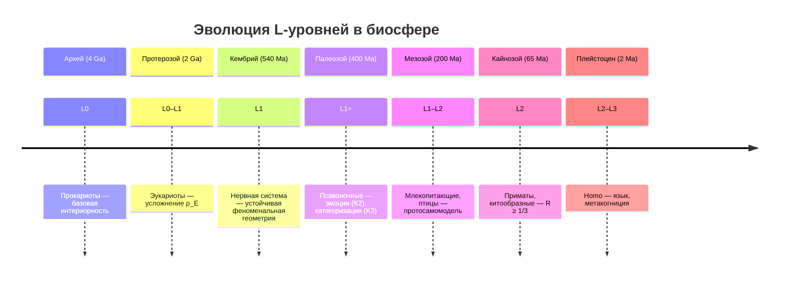

# Сознание Животных

:::note О нотации
В этом документе:
- $\Gamma$ — [матрица когерентности](/docs/core/dynamics/coherence-matrix), $\gamma_{ij}$ — её элементы
- $P = \mathrm{Tr}(\Gamma^2)$ — [чистота (жизнеспособность)](/docs/core/dynamics/viability#определение-чистоты)
- $P_{\text{crit}} = 2/7$ — [критическая чистота](/docs/core/dynamics/viability#критическая-чистота), статус **[Т]**
- $R$ — [мера рефлексии](/docs/consciousness/foundations/self-observation#мера-рефлексии-r), порог $R_{\text{th}} = 1/3$ **[Т]**
- $\Phi$ — [мера интеграции](/docs/core/structure/dimension-u#мера-интеграции-φ), порог $\Phi_{\text{th}} = 1$ **[О]**
- $\rho_E$ — [редуцированная матрица опыта](/docs/consciousness/foundations/interiority-theory)
- L0–L4 — [уровни интериорности](/docs/consciousness/hierarchy/interiority-hierarchy)
- K1–K5 — [когнитивные уровни](/docs/consciousness/comparative/cognitive-hierarchy)
- Полная таблица нотации — в [Нотации](/docs/reference/notation)
:::

## Мотивация

Вопрос «есть ли у животных сознание?» в рамках УГМ **трансформируется**: всякая система с $\Gamma \neq 0$ обладает интериорностью (L0) по [Аксиоме Ω⁷](/docs/core/foundations/axiom-omega). Содержательный вопрос — **какой уровень** интериорности L0–L4 соответствует данному биологическому таксону.

Данный документ представляет **интерпретативную** таксономию, связывающую формальные условия уровней L с эмпирически наблюдаемыми когнитивными способностями животных.

## Интерпретация И.1 (Таксономическое присвоение L-уровней) {#таксономическое-присвоение}

:::info Интерпретация И.1 (Таксономическое присвоение L-уровней) [И]
Каждому биологическому таксону сопоставляется диапазон L-уровней на основе **оценки** параметров $\Gamma$ через наблюдаемое поведение и нейрофизиологические данные. Сопоставление — **интерпретация**, а не теорема: формальные условия L-уровней определены строго, но их отображение на биологические системы требует G-отображения (см. ниже).
:::

#### Определение О.2 (G-отображение BioState → Γ) [О+С] {#g-отображение}

G-отображение определяется как функтор $G: \mathbf{Bio} \to \mathbf{Hol}_7$ с тремя свойствами: функториальность ($G(f \circ g) = G(f) \circ G(g)$), жизнеспособность ($G(\text{живой}) \in \mathcal{V}$), L-совместимость ($\text{Level}(G(b)) \geq \text{Level}_{\text{behav}}(b)$). При фиксации 7 наблюдаемых отображение G единственно с точностью до $G_2$-преобразования ([T-42 [Т]](/docs/proofs/categorical/uniqueness-theorem)). Построение конкретного G для биологических систем — **эмпирическая программа** [О+С], не пробел теории (Sol.80; доказательство единственности: [T-42](/docs/proofs/categorical/uniqueness-theorem)).

## Полная таксономия L-уровней {#полная-таксономия}

### L0: Базовая интериорность

**Условие:** $\Gamma \in \mathcal{D}(\mathcal{H})$, $\dim \mathcal{H} \geq 1$.

Любая физическая система обладает L0 — это следствие [универсальности интериорности](/docs/consciousness/hierarchy/interiority-hierarchy#l0-интериорность-универсальная).

| Таксон | $\Gamma$-характеристика | Примечание |
|--------|------------------------|------------|
| Бактерии | $\Gamma \neq 0$, минимальная когерентность | Хемотаксис как $dP/d\tau$-реакция |
| Растения | $\gamma_{SD} > 0$ (фототропизм) | Медленная динамика, нет нервной системы |
| Грибы | $\gamma_{SD} > 0$ (сетевая структура) | Мицелий как распределённая $\Gamma$ |
| Вирусы | $\Gamma \approx 0$ вне клетки-хозяина | Пограничный случай: жизнеспособность ($P > P_{\text{crit}}$) только в симбиозе |

### L0–L1: Переходная зона

**Условие перехода:** $\mathrm{rank}(\rho_E) > 1$ — нетривиальная [феноменальная геометрия](/docs/consciousness/hierarchy/interiority-hierarchy).

| Таксон | Признаки L1 | Оценка $\mathrm{rank}(\rho_E)$ | K-уровень |
|--------|-------------|-------------------------------|-----------|
| Насекомые | Ноцицепция, базовое обучение | $\geq 2$ (у некоторых) | К1–К2 |
| Моллюски (простые) | Условные рефлексы | $\sim 2$ | К1–К2 |
| Черви (C. elegans) | 302 нейрона, хемотаксис | $\sim 1$–$2$ | К1 |

### L1: Феноменальная геометрия

**Условие:** $\mathrm{rank}(\rho_E) > 1$ — стабильно.

На уровне L1 присутствует **структурированный опыт**: метрика [Фубини-Штуди](/docs/consciousness/foundations/interiority-theory#метрика-фубини-штуди) на пространстве качеств нетривиальна. Система «различает» интериорные состояния, но не рефлексирует их ($R < R_{\text{th}}$).

| Таксон | Ключевые когерентности | Эмоции (K2) | Категории (K3) |
|--------|----------------------|-------------|----------------|
| Рыбы | $\gamma_{DE}$ (боль/удовольствие), $\gamma_{AE}$ | Страх, облегчение | Хищник/пища |
| Амфибии | $\gamma_{SE}$, $\gamma_{DE}$ | Базовые | Ограниченные |
| Рептилии | $\gamma_{DE}$, $\gamma_{SD}$ (территориальность) | Страх, агрессия | Территория/чужой |

:::warning Статус L1 для рыб [С]
Присвоение рыбам стабильного L1 условно на интерпретации ноцицепции как $\mathrm{rank}(\rho_E) > 1$. Альтернативная интерпретация: ноцицепция — чисто рефлекторная ($\gamma_{DE}$ без вклада в $\rho_E$). Разрешение требует операционального [протокола измерения Γ](/docs/applied/research/measurement-protocol) для биологических систем.
:::

### L1–L2: Кандидаты на когнитивные квалиа

**Условие L2:** $R \geq 1/3$ и $\Phi \geq 1$.

Ключевые критерии для оценки $R$ у животных:

| Критерий | Связь с $R$ | Метод оценки |
|----------|-------------|--------------|
| **Самоузнавание** (зеркальный тест) | Высокий $R$ — система моделирует себя | Марк-тест Гэллапа |
| **Использование орудий** | Высокий $\gamma_{DL}$ — [протологика](/docs/consciousness/subjects/pre-linguistic#протологика) | Наблюдение в дикой среде |
| **Социальное моделирование** | Высокий $R$ через модель другого (Theory of Mind) | Конкурентные задачи |
| **Метакогниция** | Прямое свидетельство $R > R_{\text{th}}$ | «Уверенность» в ответе |

| Таксон | Зеркало | Орудия | ToM | Метакогниция | Оценка L |
|--------|---------|--------|-----|-------------|----------|
| Вороны (Corvidae) | Да (сорока) | Да (новокаледонская) | Частично | Возможно | L1–L2 |
| Попугаи | Да (некоторые) | Ограниченно | Частично | Неясно | L1–L2 |
| Осьминоги | Неясно | Да (кокосовая скорлупа) | Неясно | Неясно | L1–L2 |

### L2: Когнитивные квалиа

**Условие:** $R(\Gamma) \geq R_{\text{th}} = 1/3$ **[Т]**, $\Phi(\Gamma) \geq \Phi_{\text{th}} = 1$ **[О]**.

На уровне L2 присутствует подлинная **рефлексия** — система осознаёт собственные интериорные состояния. Это [когнитивные квалиа](/docs/consciousness/hierarchy/interiority-hierarchy#l2-когнитивные-квалиа) в строгом смысле.

| Таксон | $R$ (оценка) | $\Phi$ (оценка) | Свидетельства L2 |
|--------|-------------|-----------------|-----------------|
| Человекообразные обезьяны | $0.35$–$0.5$ | $> 1$ | Зеркальный тест, орудия, ToM, символы |
| Китообразные (дельфины) | $0.3$–$0.45$ | $> 1$ | Зеркало, социальная когниция, имена |
| Слоны | $0.3$–$0.4$ | $> 1$ | Зеркало, эмпатия, ритуалы смерти |

### L2–L3: Верхняя граница

**Условие L3:** $R^{(2)} \geq R^{(2)}_{\text{th}} = 1/4$ (метастабильно).

| Таксон | $R^{(2)}$ (оценка) | Условия | Примечание |
|--------|-------------------|---------|------------|
| Человек | $\geq 1/4$ (медитация, глубокая рефлексия) | Метастабильно | Устойчивое L3 — [редкое состояние](/docs/consciousness/hierarchy/interiority-hierarchy#l3-сетевое-сознание) |
| Бонобо (гипотеза) | $\sim 0.15$–$0.2$? | Социальная игра? | Недостаточно данных |

## Кембриджская декларация о сознании (2012) {#кембриджская-декларация}

### Интерпретация И.2 (Совместимость с УГМ) [И] {#совместимость-с-декларацией}

:::info Интерпретация И.2 [И]
Кембриджская декларация о сознании (2012) утверждает наличие «сознательных состояний» у млекопитающих, птиц и других существ с аналогичными нейроанатомическими, нейрохимическими и нейрофизиологическими субстратами.

Это согласуется с УГМ:
- «Сознательные состояния» $\leftrightarrow$ минимум L1 (феноменальная геометрия)
- Нейроанатомические субстраты $\leftrightarrow$ физическая реализация когерентностей $\gamma_{ij}$
- Декларация покрывает **все** организмы с L1+, что в УГМ включает всех позвоночных и ряд беспозвоночных (головоногие)
:::

Однако УГМ идёт **дальше** Кембриджской декларации:

| Аспект | Кембриджская декларация | УГМ |
|--------|------------------------|-----|
| Охват | Млекопитающие, птицы, головоногие | Все системы с $\Gamma \neq 0$ (L0+) |
| Градации | Бинарно: есть/нет | 5 уровней L0→L4 |
| Критерий | Нейроанатомический | Формальный: $R$, $\Phi$, $\rho_E$ |
| Растения | Не упомянуты | L0 (интериорность) |

## Ключевые критерии L-присвоения {#критерии}

### Определение О.1 (Операциональные критерии L-присвоения для биологических систем) [О] {#операциональные-критерии}

:::tip Определение О.1 [О]
Для биологической системы $\mathfrak{B}$ L-уровень определяется через наблюдаемые индикаторы:

| Индикатор | Оценивает | Метод |
|-----------|-----------|-------|
| Ноцицепция / гедоника | $\mathrm{rank}(\rho_E) > 1$ (L1) | Фармакологические тесты |
| Самоузнавание | $R \geq R_{\text{th}}$ (L2) | Марк-тест, зеркальный тест |
| Использование орудий | $\gamma_{DL}$ — [протологика](/docs/consciousness/subjects/pre-linguistic#протологика) | Этологическое наблюдение |
| Социальная когниция (ToM) | $R$ через модели сородичей в $\Gamma_{\text{composite}}$ | Конкурентные парадигмы |
| Эмоциональная сложность | [Секторная сигнатура](/docs/consciousness/phenomenology/emotional-taxonomy#карта-эмоций) $\sigma(\Gamma)$ | Аффективная нейронаука |
| Метакогниция | $R^{(2)} > 0$ (L3-потенциал) | Задачи «уверенности в ответе» |

Это **соглашение** (конвенция): формальные критерии L-уровней определены в [иерархии интериорности](/docs/consciousness/hierarchy/interiority-hierarchy), а их операционализация через поведенческие индикаторы — отдельная задача.
:::

## Композитная Γ в социальных системах {#социальные-системы}

Животные не существуют изолированно. Для стай, семей и колоний необходимо учитывать [составную матрицу когерентности](/docs/core/dynamics/composite-systems#составная-матрица):

$$
\Gamma_{\text{стая}} \in \mathcal{D}(\mathbb{C}^{7N})
$$

Коллективные когнитивные способности (координация стаи, коллективное решение задач у муравьёв) могут соответствовать уровню L, **превышающему** индивидуальный. Подробнее — [коллективное сознание](./collective-consciousness).

## Эволюционная динамика L-уровней {#эволюция}

Эволюция L-уровней следует логике [жизнеспособности](/docs/core/dynamics/viability): системы с более высоким L более эффективно поддерживают $P > P_{\text{crit}}$ в сложных средах (мониторинг $P$ через самомоделирование).

---

**Связанные документы:**
- [Иерархия интериорности](/docs/consciousness/hierarchy/interiority-hierarchy) — каноническое определение L0→L4
- [Когнитивная иерархия](/docs/consciousness/comparative/cognitive-hierarchy) — уровни K1–K5 и связь с L
- [До-лингвистическое сознание](./pre-linguistic) — языковая независимость условий L2
- [Коллективное сознание](./collective-consciousness) — составная $\Gamma$ для социальных систем
- [Таксономия эмоций](/docs/consciousness/phenomenology/emotional-taxonomy) — эмоции у животных через $dP/d\tau$
- [Составные системы](/docs/core/dynamics/composite-systems) — формализм $\Gamma_{AB}$
- [Протокол измерения Γ](/docs/applied/research/measurement-protocol) — операционализация для ИИ (адаптация для биологии — [открытый вопрос](/docs/applied/coherence-cybernetics/research-programs))
