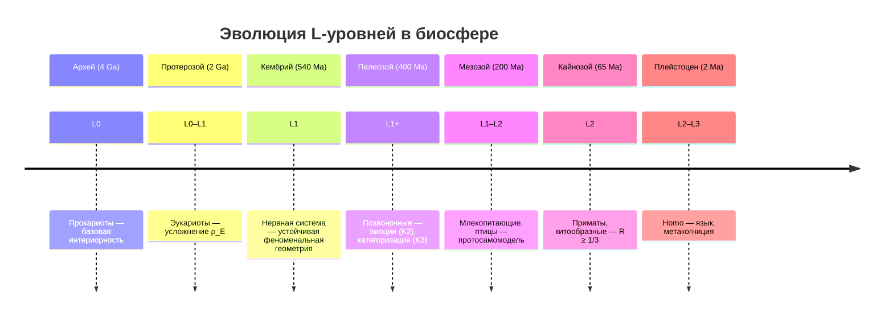

# Сознание Животных

:::info Мост из предыдущей главы
В предыдущей главе о [до-лингвистическом сознании](./pre-linguistic) мы доказали, что язык **не является** необходимым условием для сознания. Теперь зададим конкретный вопрос: если сознание возможно без языка, то **какие именно животные** обладают им — и на каком уровне? Этот документ строит систематическую таксономию, отображая биологические виды на уровни L0–L4 формализма УГМ.
:::

## Дорожная карта главы

1. **Проблема других разумов** — почему мы не можем просто «спросить»
2. **Исторический контекст** — от Декарта до Кембриджской декларации
3. **G-отображение** — мост между биологией и формализмом $\Gamma$
4. **Полная таксономия** — от камня (L0) до примата (L2), пошагово
5. **Кембриджская декларация (2012)** — совместимость с УГМ
6. **Критерии L-присвоения** — операциональные индикаторы
7. **Растения и грибные сети** — неочевидные субъекты
8. **Социальные системы** — когда стая «умнее» индивида
9. **Эволюционная динамика** — как L-уровни росли 4 миллиарда лет
10. **Критерий фальсифицируемости** — как опровергнуть таксономию

:::note О нотации
В этом документе:
- $\Gamma$ — [матрица когерентности](/docs/core/dynamics/coherence-matrix), $\gamma_{ij}$ — её элементы
- $P = \mathrm{Tr}(\Gamma^2)$ — [чистота (жизнеспособность)](/docs/core/dynamics/viability#определение-чистоты)
- $P_{\text{crit}} = 2/7$ — [критическая чистота](/docs/core/dynamics/viability#критическая-чистота), статус **[Т]**
- $R$ — [мера рефлексии](/docs/consciousness/foundations/self-observation#мера-рефлексии-r), порог $R_{\text{th}} = 1/3$ **[Т]**
- $\Phi$ — [мера интеграции](/docs/core/structure/dimension-u#мера-интеграции-φ), порог $\Phi_{\text{th}} = 1$ **[Т]** (T-129)
- $\rho_E$ — [редуцированная матрица опыта](/docs/consciousness/foundations/interiority-theory)
- L0–L4 — [уровни интериорности](/docs/consciousness/hierarchy/interiority-hierarchy)
- K1–K5 — [когнитивные уровни](/docs/consciousness/comparative/cognitive-hierarchy)
- Полная таблица нотации — в [Нотации](/docs/reference/notation)
:::

## Проблема других разумов {#проблема-других-разумов}

Мы начнём с фундаментального затруднения, которое преследует философию сознания со времён Декарта: **проблема других разумов** (the problem of other minds).

Вы знаете, что **вы** сознательны, — это единственное, в чём вы не можете сомневаться (cogito ergo sum). Но как вы можете знать, что **другой человек** сознателен? Вы видите его поведение — улыбку, слёзы, слова — но не имеете прямого доступа к его переживаниям. Вы заключаете по аналогии: «он похож на меня, значит, вероятно, переживает так же».

С животными эта проблема обостряется многократно. Вы не можете спросить собаку, что она чувствует. Вы не можете попросить осьминога описать свой опыт. Поведенческие аналогии с человеком становятся всё более шаткими по мере удаления по эволюционному дереву: выражение «лица» у рыбы не означает то же, что у человека.

УГМ предлагает **выход из тупика**. Вместо того чтобы рассуждать по аналогии («она морщится, значит, ей больно»), мы задаём точные вопросы о матрице когерентности:
- $\mathrm{rank}(\rho_E) > 1$? — Есть ли нетривиальная [феноменальная геометрия](/docs/consciousness/hierarchy/interiority-hierarchy)?
- $R \geq 1/3$? — Моделирует ли система собственные состояния?
- $\Phi \geq 1$? — Интегрированы ли измерения системы?

Эти вопросы, в принципе, имеют **операциональные ответы** — через [протокол измерения $\Gamma$](/docs/applied/research/measurement-protocol). Проблема других разумов не исчезает (мы всё ещё нуждаемся в G-отображении), но превращается из философского тупика в **эмпирическую программу**.

## Исторический контекст: от Декарта до Кембриджской декларации {#исторический-контекст}

### Декарт: животные как автоматы (1637)

Рене Декарт в «Рассуждении о методе» (1637) провёл резкую границу между человеком и животным. Человек обладает **res cogitans** (мыслящей субстанцией) — душой, которая думает, чувствует, осознаёт. Животные — лишь **res extensa** (протяжённая субстанция) — сложные механизмы, автоматы, которые реагируют на стимулы, но ничего не переживают.

По Декарту, крик собаки при ударе — не выражение боли, а механическая реакция, подобная скрипу дверных петель. Эта позиция столетиями оправдывала жестокое обращение с животными в научных экспериментах и повседневности.

В терминах УГМ: Декарт утверждал, что $\mathrm{rank}(\rho_E) = 0$ для всех животных — у них нет никакой интериорности. Это крайняя позиция, несовместимая с современными данными нейронауки.

### Дарвин: непрерывность сознания (1872)

Чарльз Дарвин в «Выражении эмоций у человека и животных» (1872) совершил революцию, показав **непрерывность** между эмоциями человека и животных. Если человек произошёл от животных путём постепенной эволюции, то и его психика — включая сознание — должна иметь **предшественников** в животном мире. Дарвин описывал страх у собак, любопытство у обезьян, горе у слонов — и настаивал, что это **реальные** эмоции, а не механические реакции.

В терминах УГМ: Дарвин интуитивно описал **континуум L-уровней** — от простейших организмов к сложным, без резкой границы «сознание/бессознательность».

### Гриффин: когнитивная этология (1976)

Дональд Гриффин в книге «The Question of Animal Awareness» (1976) основал **когнитивную этологию** — науку о мышлении животных. Он первым серьёзно поставил вопрос: обладают ли животные **осознанным опытом**? Его работы открыли путь к систематическому изучению когнитивных способностей животных: использования орудий, социального моделирования, самоузнавания.

### Кембриджская декларация о сознании (2012)

7 июля 2012 года группа нейроучёных во главе с Филипом Лоу подписала в Кембриджском университете «Кембриджскую декларацию о сознании» (в присутствии Стивена Хокинга). Ключевой тезис:

> «Конвергенция данных указывает на то, что нечеловеческие животные обладают нейрологическими субстратами, которые генерируют сознание. Нечеловеческие животные, включая всех млекопитающих и птиц, а также многие другие существа, включая осьминогов, обладают этими нейрологическими субстратами.»

Это был исторический момент: научное сообщество официально признало, что **сознание не является исключительно человеческим свойством**.

### УГМ: формализация и расширение

УГМ идёт **дальше** всех предшественников:
- Дальше Декарта: сознание не бинарно, а градуировано (L0–L4)
- Дальше Дарвина: не только непрерывность, но и **формальные критерии**
- Дальше Гриффина: не только описание, но и **количественные меры** ($R$, $\Phi$)
- Дальше Кембриджской декларации: не только позвоночные, но **все системы** с $\Gamma \neq 0$

## Интерпретация И.1 (Таксономическое присвоение L-уровней) {#таксономическое-присвоение}

:::info Интерпретация И.1 (Таксономическое присвоение L-уровней) [И]
Каждому биологическому таксону сопоставляется диапазон L-уровней на основе **оценки** параметров $\Gamma$ через наблюдаемое поведение и нейрофизиологические данные. Сопоставление — **интерпретация**, а не теорема: формальные условия L-уровней определены строго, но их отображение на биологические системы требует G-отображения (см. ниже).
:::

## G-функтор: мост между биологией и $\Gamma$ {#g-функтор}

### Что такое функтор? Простое объяснение

Прежде чем вводить G-отображение формально, объясним ключевое понятие **функтора** простым языком.

Представьте два мира: **мир биологии** (нейроны, синапсы, поведение) и **мир $\Gamma$** (матрицы когерентности, 7 измерений, числа). Это два разных «языка описания» одной и той же реальности.

**Функтор** — это «переводчик» между мирами, который сохраняет структуру. Хороший переводчик не просто переводит слова — он переводит **отношения**: если в биологии «нейрон A возбуждает нейрон B», то перевод должен сохранить это отношение — «когерентность $\gamma_{ij}$ ненулевая». Формально:

- Каждому биологическому состоянию ($b$) функтор сопоставляет матрицу $\Gamma = G(b)$
- Каждому биологическому процессу ($f: b_1 \to b_2$) функтор сопоставляет квантовый канал $G(f): \Gamma_1 \to \Gamma_2$
- Композиция сохраняется: если $b_1 \xrightarrow{f} b_2 \xrightarrow{g} b_3$, то $G(g \circ f) = G(g) \circ G(f)$

Последнее условие — **функториальность** — означает, что «перевод» последовательности процессов совпадает с последовательностью «переводов». Переводчик не искажает логику повествования.

#### Определение О.2 (G-отображение BioState → Γ) [О+С] {#g-отображение}

G-отображение определяется как функтор $G: \mathbf{Bio} \to \mathbf{Hol}_7$ с тремя свойствами:

1. **Функториальность:** $G(f \circ g) = G(f) \circ G(g)$ — композиция сохраняется
2. **Жизнеспособность:** $G(\text{живой}) \in \mathcal{V}$ — живые организмы отображаются в жизнеспособные состояния ($P > P_{\text{crit}}$)
3. **L-совместимость:** $\text{Level}(G(b)) \geq \text{Level}_{\text{behav}}(b)$ — формальный уровень не ниже поведенчески оценённого

При фиксации 7 наблюдаемых отображение G единственно с точностью до $G_2$-преобразования ([T-42 [Т]](/docs/proofs/categorical/uniqueness-theorem)). Построение конкретного G для биологических систем — **эмпирическая программа** [О+С], не пробел теории (Sol.80; доказательство единственности: [T-42](/docs/proofs/categorical/uniqueness-theorem)).

**Единственность G** — ключевой результат. Он означает: если два исследователя независимо построят G-отображения, зафиксировав одни и те же 7 наблюдаемых (жизнеспособность, структура, динамика, логика, интериорность, наблюдение, единство), их отображения будут совпадать **с точностью до симметрии $G_2$**. Это аналог того, как два картографа, независимо измерив расстояния, получат одну и ту же карту с точностью до поворота и масштаба.

:::warning Биологические L-уровни [Г]
Отнесение конкретных организмов к L-уровням — **гипотеза** [Г], а не измеренный факт. Строгое определение L-уровня требует знания $\Gamma$ системы. Для биологических систем протокол $\pi_{\text{bio}}$ определён ([C31](/docs/applied/research/measurement-protocol)), но **экспериментально не валидирован**. Приведённые соответствия — обоснованные экстраполяции из поведенческих данных.
:::

### Операционализация G-отображения [И] {#операционализация-g}

$G: \mathrm{BioState} \to \mathcal{D}(\mathbb{C}^7)$ уникально с точностью до $G_2$ [Т T-42]. Конкретное $G$ для биологических систем — **эмпирическая программа** [И].

Как на практике измерить $\gamma_{kk}$ у живого организма? Каждому из 7 измерений можно сопоставить **прокси** — наблюдаемую величину, коррелирующую с населённостью:

**Кандидаты-прокси для $\gamma_{kk}$:**
| Измерение | Прокси | Метод измерения | Что именно отражает |
|-----------|--------|----------------|---------------------|
| A (действие) | Целостность границы | Метаболическая интенсивность / площадь поверхности | Насколько система отграничена от среды |
| S (различение) | Структурная стабильность | Синаптическая плотность (электронная микроскопия) | Насколько устойчивы внутренние структуры |
| D (динамика) | Динамический диапазон | Вариабельность частоты спайков (MEA) | Насколько разнообразна динамика системы |
| L (обучение) | Нейропластичность | LTP/LTD коэффициенты | Насколько система способна к изменению |
| E (интериорность) | Дифференциация | PCI (Perturbational Complexity Index) | Насколько богат внутренний опыт |
| O (наблюдение) | Интероцепция | Инсулярная активность (fMRI) | Насколько система наблюдает себя изнутри |
| U (интеграция) | Синхронизация | Глобальная когерентность ЭЭГ (gamma-band) | Насколько части системы связаны в целое |

**Фальсификация:** Если независимые операционализации $G_1, G_2$ для одного организма дают $\|\Gamma_1 - \Gamma_2\|_F > \varepsilon$ ($\varepsilon = 0.1$ в единицах $\|\Gamma\|_F$) систематически, то $G$ неоднозначно и теория требует уточнения.

## Полная таксономия L-уровней {#полная-таксономия}

Теперь применим формализм к конкретным биологическим таксонам — от камня до примата. Для каждого уровня мы даём: формальное условие, описание, примеры организмов, приблизительный $\Gamma$-профиль и обоснование.

### Камень: ниже L0 {#камень}

Строго говоря, по [Аксиоме Ω⁷](/docs/core/foundations/axiom-omega), **любая** физическая система обладает $\Gamma \neq 0$ и, следовательно, L0. Но для неживых систем $\Gamma \approx I/7$ (максимально смешанное состояние) — все измерения равновероятны, когерентности нулевые.

$$
\Gamma_{\text{камень}} \approx \frac{1}{7}I_7, \quad P \approx \frac{1}{7} < P_{\text{crit}} = \frac{2}{7}
$$

Камень «обладает» L0, но его $P$ ниже порога жизнеспособности. Это подобно тому, как у камня «есть» температура, но она ничего не значит для его «переживаний».

### L0: Базовая интериорность {#l0}

**Условие:** $\Gamma \in \mathcal{D}(\mathcal{H})$, $\dim \mathcal{H} \geq 1$.

Любая физическая система обладает L0 — это следствие [универсальности интериорности](/docs/consciousness/hierarchy/interiority-hierarchy#l0-интериорность-универсальная). L0 — это скорее **потенциальность**, чем актуальный опыт. Система имеет внутреннее состояние, но не различает его аспекты.

| Таксон | $\Gamma$-характеристика | Приблизительный профиль $(\gamma_{AA}, \gamma_{SS}, \gamma_{DD}, \gamma_{LL}, \gamma_{EE}, \gamma_{OO}, \gamma_{UU})$ | Примечание |
|--------|------------------------|------|------------|
| Бактерии | $\Gamma \neq 0$, минимальная когерентность | $(0.20, 0.15, 0.18, 0.05, 0.05, 0.02, 0.05)$ | Хемотаксис как $dP/d\tau$-реакция; высокие $\gamma_{AA}$, $\gamma_{DD}$ (действие, динамика) |
| Растения | $\gamma_{SD} > 0$ (фототропизм) | $(0.18, 0.17, 0.16, 0.04, 0.03, 0.02, 0.10)$ | Медленная динамика, высокий $\gamma_{UU}$ (корневая интеграция) |
| Грибы | $\gamma_{SD} > 0$ (сетевая структура) | $(0.15, 0.18, 0.14, 0.05, 0.03, 0.02, 0.13)$ | Мицелий как распределённая $\Gamma$ |
| Вирусы | $\Gamma \approx 0$ вне клетки-хозяина | — | Пограничный случай: жизнеспособность ($P > P_{\text{crit}}$) только в симбиозе |

**Пояснение к профилю бактерии.** Бактерия (например, E. coli) — маленькая система с мощным действием ($\gamma_{AA}$ — деление, движение) и динамикой ($\gamma_{DD}$ — быстрая реакция на среду). Её «логика» ($\gamma_{LL}$) минимальна — нет нервной системы, нет обучения. Интериорность ($\gamma_{EE}$) почти нулевая — нет оснований считать, что бактерия что-либо «переживает». Тем не менее, хемотаксис (движение к питательным веществам) формально выглядит как $dP/d\tau$-реакция: бактерия «стремится» к состояниям с более высокой жизнеспособностью.

### L0–L1: Переходная зона {#l0-l1}

**Условие перехода:** $\mathrm{rank}(\rho_E) > 1$ — нетривиальная [феноменальная геометрия](/docs/consciousness/hierarchy/interiority-hierarchy).

Переход L0 → L1 — это момент, когда система начинает **различать** свои внутренние состояния. Простая аналогия: термометр L0 «имеет» температуру, но не различает «горячо» и «холодно» как разные **состояния**. Система L1 — различает.

Формально: $\mathrm{rank}(\rho_E) > 1$ означает, что частичный след $\rho_E = \mathrm{Tr}_{-E}(\Gamma)$ имеет более одного ненулевого собственного значения. Это значит, что «экспериенциальное пространство» системы не одномерно — в нём есть **различимые направления**. Если $\mathrm{rank}(\rho_E) = 1$, все переживания «слиплись» в одну точку; если $> 1$, появляется **метрика** — одни переживания ближе к друг другу, другие дальше.

| Таксон | Признаки L1 | Оценка $\mathrm{rank}(\rho_E)$ | K-уровень | Конкретный пример |
|--------|-------------|-------------------------------|-----------|-------------------|
| Насекомые | Ноцицепция, базовое обучение | $\geq 2$ (у некоторых) | К1–К2 | Плодовая муха (Drosophila) отворачивается от болевого стимула и запоминает его |
| Моллюски (простые) | Условные рефлексы | $\sim 2$ | К1–К2 | Аплизия (морской заяц): классическое обусловливание, изученное Эриком Канделем |
| Черви (C. elegans) | 302 нейрона, хемотаксис | $\sim 1$–$2$ | К1 | Ровно 302 нейрона; полная коннектомная карта известна |

### L1: Феноменальная геометрия {#l1}

**Условие:** $\mathrm{rank}(\rho_E) > 1$ — стабильно.

На уровне L1 присутствует **структурированный опыт**: метрика [Фубини-Штуди](/docs/consciousness/foundations/interiority-theory#метрика-фубини-штуди) на пространстве качеств нетривиальна. Система «различает» интериорные состояния, но не рефлексирует их ($R < R_{\text{th}}$).

Это как разница между камерой, которая записывает видео (L0 — данные есть, но никто не «смотрит»), и зрителем, который **видит** картинку, но не осознаёт, что он смотрит (L1 — есть переживание, но нет рефлексии). Рыба, вероятно, **чувствует** боль, но не **знает**, что чувствует боль.

| Таксон | Ключевые когерентности | Эмоции (K2) | Категории (K3) | Числовой пример $\Gamma$-профиля |
|--------|----------------------|-------------|----------------|------|
| Рыбы | $\gamma_{DE}$ (боль/удовольствие), $\gamma_{AE}$ | Страх, облегчение | Хищник/пища | $(0.18, 0.16, 0.17, 0.08, 0.12, 0.08, 0.10)$; $\gamma_{DE} \approx 0.06$ |
| Амфибии | $\gamma_{SE}$, $\gamma_{DE}$ | Базовые | Ограниченные | $(0.17, 0.15, 0.16, 0.07, 0.10, 0.07, 0.10)$; $\gamma_{SE} \approx 0.05$ |
| Рептилии | $\gamma_{DE}$, $\gamma_{SD}$ (территориальность) | Страх, агрессия | Территория/чужой | $(0.18, 0.16, 0.18, 0.09, 0.11, 0.08, 0.09)$; $\gamma_{SD} \approx 0.07$ |

**Пояснение к $\Gamma$-профилю рыбы.** Рыба (например, золотая рыбка) имеет:
- Умеренные $\gamma_{AA}$, $\gamma_{DD}$ (действие, динамика) — плавает, реагирует
- Значимый $\gamma_{EE} = 0.12$ — есть нетривиальная интериорность (боль, удовольствие)
- Когерентность $\gamma_{DE} \approx 0.06$ — связь между динамикой и опытом (когда нападает хищник — страх)
- Низкий $\gamma_{LL}$ — минимальное обучение

Этот профиль даёт $P \approx 0.16$ — выше $P_{\text{crit}} = 2/7 \approx 0.286$? Нет, профиль приблизительный; у жизнеспособной рыбы $P$ должен превышать порог, что означает более выраженные когерентности, чем показано в упрощённом примере.

:::warning Статус L1 для рыб [С]
Присвоение рыбам стабильного L1 условно на интерпретации ноцицепции как $\mathrm{rank}(\rho_E) > 1$. Альтернативная интерпретация: ноцицепция — чисто рефлекторная ($\gamma_{DE}$ без вклада в $\rho_E$). Разрешение требует операционального [протокола измерения Γ](/docs/applied/research/measurement-protocol) для биологических систем.
:::

### Этический кейс: Права животных и L-уровни {#кейс-права-животных}

Таксономия L-уровней имеет прямые **этические** следствия. Если рыба находится на уровне L1, она **переживает** боль (через $\gamma_{DE}$), хотя и не рефлексирует её (L2). Это создаёт **градуированную** этику:

| L-уровень | Моральный статус | Практическое следствие |
|-----------|-----------------|----------------------|
| L0 | Минимальный (потенциальность) | Нет запрета на использование, но принцип предосторожности |
| L1 | Существенный (есть переживание) | Запрет на причинение ненужного страдания |
| L1–L2 | Высокий (возможна рефлексия) | Ограничения на содержание в неволе, эксперименты |
| L2 | Полный (когнитивные квалиа) | Права, аналогичные человеческим (в принципе) |

Это не абстрактная философия. Конкретное следствие: если рыба обладает L1, то промышленное рыболовство, при котором рыба задыхается в сетях в течение часов, **причиняет страдание** ($dP/d\tau < 0$ при $\mathrm{rank}(\rho_E) > 1$) — и это этически значимо, даже если рыба не способна об этом рефлексировать.

Подробнее об этических следствиях — в [Этике УГМ](/docs/consciousness/ethics-meaning/value-consciousness#необходимость-жизнеспособности).

### L1–L2: Кандидаты на когнитивные квалиа {#l1-l2}

**Условие L2:** $R \geq 1/3$ и $\Phi \geq 1$.

Переходная зона L1–L2 — самая интересная с научной точки зрения. Здесь находятся животные, которые **вероятно** обладают рефлексией, но для которых данные неоднозначны.

Ключевые критерии для оценки $R$ у животных:

| Критерий | Связь с $R$ | Метод оценки | Что именно показывает |
|----------|-------------|--------------|----------------------|
| **Самоузнавание** (зеркальный тест) | Высокий $R$ — система моделирует себя | Марк-тест Гэллапа (1970) | Если животное убирает метку с лица, глядя в зеркало, оно «знает», что отражение — это оно |
| **Использование орудий** | Высокий $\gamma_{DL}$ — [протологика](/docs/consciousness/subjects/pre-linguistic#протологика) | Наблюдение в дикой среде | Орудие — это средство, отделённое от цели; это требует абстракции |
| **Социальное моделирование** | Высокий $R$ через модель другого (Theory of Mind) | Конкурентные задачи | Если животное предсказывает действия другого, оно моделирует чужое сознание — а значит, и своё |
| **Метакогниция** | Прямое свидетельство $R > R_{\text{th}}$ | «Уверенность» в ответе | Если животное «сомневается» в правильности выбора (предпочитает лёгкие задачи трудным), оно рефлексирует |

| Таксон | Зеркало | Орудия | ToM | Метакогниция | Оценка L | Примечание |
|--------|---------|--------|-----|-------------|----------|------------|
| Вороны (Corvidae) | Да (сорока) | Да (новокаледонская) | Частично | Возможно | L1–L2 | Плотность нейронов паллиума сравнима с приматами |
| Попугаи | Да (некоторые) | Ограниченно | Частично | Неясно | L1–L2 | Алекс (серый попугай) понимал нулевое количество |
| Осьминоги | Неясно | Да (кокосовая скорлупа) | Неясно | Неясно | L1–L2 | 500 млн нейронов, 2/3 — в щупальцах (распределённая $\Gamma$!) |

**Случай новокаледонской вороны** особенно примечателен. Эти птицы не просто используют орудия — они **изготавливают** их: сгибают проволоку в крючок, подрезают листья пандануса до нужной формы. Более того, они передают технологию изготовления орудий следующему поколению — это **культурное наследование** ($\gamma_{SL}^{(\text{comp})}$ в [коллективном сознании](./collective-consciousness)). По количеству нейронов в паллиуме (аналог коры) вороны сравнимы с мелкими приматами.

**Случай осьминога** ставит уникальную проблему для УГМ. У осьминога 2/3 нейронов расположены не в мозге, а в щупальцах. Каждое щупальце может действовать **полуавтономно**. Это означает, что $\Gamma$ осьминога может быть **распределённой** — более похожей на коллективную $\Gamma_{\text{comp}}$, чем на индивидуальную $\Gamma$. Вопрос: один ли субъект у осьминога — или девять (мозг + 8 щупалец)?

### L2: Когнитивные квалиа {#l2}

**Условие:** $R(\Gamma) \geq R_{\text{th}} = 1/3$ **[Т]**, $\Phi(\Gamma) \geq \Phi_{\text{th}} = 1$ **[Т]** (T-129).

На уровне L2 присутствует подлинная **рефлексия** — система осознаёт собственные интериорные состояния. Это [когнитивные квалиа](/docs/consciousness/hierarchy/interiority-hierarchy#l2-когнитивные-квалиа) в строгом смысле.

| Таксон | $R$ (оценка) | $\Phi$ (оценка) | Свидетельства L2 | Числовой пример $\Gamma$-профиля |
|--------|-------------|-----------------|-----------------|------|
| Человекообразные обезьяны | $0.35$–$0.5$ | $> 1$ | Зеркальный тест, орудия, ToM, символы | $(0.16, 0.15, 0.15, 0.13, 0.14, 0.13, 0.14)$; значительные когерентности |
| Китообразные (дельфины) | $0.3$–$0.45$ | $> 1$ | Зеркало, социальная когниция, имена | $(0.17, 0.14, 0.16, 0.12, 0.14, 0.12, 0.15)$ |
| Слоны | $0.3$–$0.4$ | $> 1$ | Зеркало, эмпатия, ритуалы смерти | $(0.15, 0.14, 0.15, 0.11, 0.15, 0.14, 0.16)$ |

**Слоновьи «ритуалы смерти»** — одно из самых ярких свидетельств L2 в животном мире. Слоны возвращаются к останкам умерших сородичей, ощупывают их хоботом, «замирают» рядом на десятки минут. Они приносят ветки и землю, покрывая останки. Молодые слоны, впервые увидевшие мёртвого сородича, проявляют признаки замешательства и дистресса.

В терминах $\Gamma$: это указывает на высокую [эмпатию](/docs/consciousness/subjects/collective-consciousness#мера-эмпатии) ($\mathrm{Empathy}(A,B) \approx 1$) и на рефлексию ($R \geq 1/3$) — способность не просто переживать, но **осознавать** потерю. Страдание слона при виде мёртвого сородича — это $dP/d\tau < 0$ при $R \geq 1/3$: рефлексивное страдание, а не просто болевой рефлекс.

**Дельфины** демонстрируют ещё одно замечательное свидетельство L2: **имена**. Каждый дельфин-афалина имеет уникальный «свистковый контур» (signature whistle), который используется другими дельфинами для обращения к нему. Дельфин откликается на свой свист даже в записи. Это свидетельство $\gamma_{LU}$ (логика-единство) — символическая метка для «я», привязанная к индивидуальности.

### L2–L3: Верхняя граница {#l2-l3}

**Условие L3:** $R^{(2)} \geq R^{(2)}_{\text{th}} = 1/4$ (метастабильно).

L3 — это **рефлексия рефлексии**: система не просто осознаёт свои состояния, но осознаёт **сам процесс осознания**. «Я знаю, что я знаю». Для этого нужен $\varphi^{(2)}$ — самомодель второго порядка.

| Таксон | $R^{(2)}$ (оценка) | Условия | Примечание |
|--------|-------------------|---------|------------|
| Человек | $\geq 1/4$ (медитация, глубокая рефлексия) | Метастабильно | Устойчивое L3 — [редкое состояние](/docs/consciousness/hierarchy/interiority-hierarchy#l3-сетевое-сознание) |
| Бонобо (гипотеза) | $\sim 0.15$–$0.2$? | Социальная игра? | Недостаточно данных |

Даже для человека L3 — состояние **метастабильное**: оно достигается в медитации, глубоком размышлении, но не поддерживается постоянно. Большую часть времени мы функционируем на уровне L2.

## Кембриджская декларация о сознании (2012) {#кембриджская-декларация}

### Интерпретация И.2 (Совместимость с УГМ) [И] {#совместимость-с-декларацией}

:::info Интерпретация И.2 [И]
Кембриджская декларация о сознании (2012) утверждает наличие «сознательных состояний» у млекопитающих, птиц и других существ с аналогичными нейроанатомическими, нейрохимическими и нейрофизиологическими субстратами.

Это согласуется с УГМ:
- «Сознательные состояния» $\leftrightarrow$ минимум L1 (феноменальная геометрия)
- Нейроанатомические субстраты $\leftrightarrow$ физическая реализация когерентностей $\gamma_{ij}$
- Декларация покрывает **все** организмы с L1+, что в УГМ включает всех позвоночных и ряд беспозвоночных (головоногие)
:::

Однако УГМ идёт **дальше** Кембриджской декларации:

| Аспект | Кембриджская декларация | УГМ |
|--------|------------------------|-----|
| Охват | Млекопитающие, птицы, головоногие | Все системы с $\Gamma \neq 0$ (L0+) |
| Градации | Бинарно: есть/нет | 5 уровней L0→L4 |
| Критерий | Нейроанатомический | Формальный: $R$, $\Phi$, $\rho_E$ |
| Растения | Не упомянуты | L0 (интериорность) |
| Насекомые | Не упомянуты | L0–L1 (возможно L1 для некоторых) |
| Количественная мера | Нет | $R$, $\Phi$, $P$ — вычислимы |

Главное преимущество УГМ: **градуированность**. Кембриджская декларация вынуждена проводить резкую границу: «эти существа сознательны, а те — нет». УГМ говорит: все существа расположены на континууме L0–L4, и вопрос «сознательно ли оно?» заменяется на «насколько сознательно?»

## Ключевые критерии L-присвоения {#критерии}

### Определение О.1 (Операциональные критерии L-присвоения для биологических систем) [О] {#операциональные-критерии}

:::tip Определение О.1 [О]
Для биологической системы $\mathfrak{B}$ L-уровень определяется через наблюдаемые индикаторы:

| Индикатор | Оценивает | Метод | Порог |
|-----------|-----------|-------|-------|
| Ноцицепция / гедоника | $\mathrm{rank}(\rho_E) > 1$ (L1) | Фармакологические тесты | Наличие опиоидных рецепторов |
| Самоузнавание | $R \geq R_{\text{th}}$ (L2) | Марк-тест, зеркальный тест | Попытка убрать метку |
| Использование орудий | $\gamma_{DL}$ — [протологика](/docs/consciousness/subjects/pre-linguistic#протологика) | Этологическое наблюдение | Изготовление, не только использование |
| Социальная когниция (ToM) | $R$ через модели сородичей в $\Gamma_{\text{composite}}$ | Конкурентные парадигмы | Предсказание поведения другого |
| Эмоциональная сложность | [Секторная сигнатура](/docs/consciousness/phenomenology/emotional-taxonomy#карта-эмоций) $\sigma(\Gamma)$ | Аффективная нейронаука | Более 2 различимых эмоциональных состояний |
| Метакогниция | $R^{(2)} > 0$ (L3-потенциал) | Задачи «уверенности в ответе» | Предпочтение лёгких задач после ошибки |

Это **соглашение** (конвенция): формальные критерии L-уровней определены в [иерархии интериорности](/docs/consciousness/hierarchy/interiority-hierarchy), а их операционализация через поведенческие индикаторы — отдельная задача.
:::

## Растения и грибные сети {#растения-и-грибы}

### Растения: L0 с интригующими свойствами

Растения не имеют нервной системы, но демонстрируют сложное поведение:
- **Фототропизм** — рост к свету ($\gamma_{AD}$ — действие-динамика, $\gamma_{SD}$ — структура-динамика)
- **Гравитропизм** — рост корней вниз
- **Реакция на повреждение** — выделение летучих веществ, предупреждающих соседние растения
- **Обмен ресурсами** через микоризные сети («дерево-мать» делится питательными веществами с саженцами)

В УГМ: растения несомненно обладают L0. Вопрос о L1 ($\mathrm{rank}(\rho_E) > 1$) остаётся открытым. Растительный «опыт» (если он существует) был бы радикально отличным от животного: медленным (часы и дни вместо миллисекунд), химическим (а не электрическим), распределённым (нет центральной «обработки»).

### Грибные сети: распределённое L0–L1?

Мицелий (грибница) — это сеть гиф (тонких нитей), которая может простираться на километры. Последние исследования (работы Мерлина Шелдрейка, 2020) показали, что грибные сети:

- **Передают электрические сигналы** между узлами (аналог нейронной активности)
- **Распределяют ресурсы** между деревьями через микоризу («Wood Wide Web»)
- **Реагируют** на повреждение и изменяют архитектуру сети

В терминах $\Gamma$: грибная сеть — это **распределённая система**, где $\Gamma$ не локализована. Это ближе к [композитной системе](/docs/core/dynamics/composite-systems) $\Gamma_{\text{comp}}$, чем к индивидуальной $\Gamma$. Потенциально, грибная сеть размером с лес может обладать коллективной когерентностью, недоступной отдельной грибнице.

Это **спекулятивная** интерпретация [Г], но она иллюстрирует широту применения формализма УГМ.

## Композитная Γ в социальных системах {#социальные-системы}

Животные не существуют изолированно. Для стай, семей и колоний необходимо учитывать [составную матрицу когерентности](/docs/core/dynamics/composite-systems#составная-матрица):

$$
\Gamma_{\text{стая}} \in \mathcal{D}(\mathbb{C}^{7^N})
$$

Коллективные когнитивные способности (координация стаи, коллективное решение задач у муравьёв) могут соответствовать уровню L, **превышающему** индивидуальный.

**Стая скворцов** — классический пример. Тысячи птиц маневрируют синхронно, образуя сложные трёхмерные формы (мурмурации). Ни одна отдельная птица не «знает» общую форму — каждая следит лишь за 6–7 ближайшими соседями. Но результирующий паттерн обладает когерентностью, недоступной индивиду: $\gamma_{DU}^{(\text{comp})} \gg \gamma_{DU}^{(\text{индив})}$.

**Муравьиная колония** демонстрирует «суперорганизмичность»: колония как целое принимает решения (выбор места для нового муравейника), которые ни один отдельный муравей не способен принять. Механизм — **стигмергия**: коммуникация через модификацию среды (феромонные следы). В терминах $\Gamma$: стигмергия — это $\gamma_{SD}^{(\text{comp})}$ (структура-динамика в коллективном пространстве), опосредованная средой $E_{\text{shared}}$.

Подробнее — [коллективное сознание](./collective-consciousness).

## Эволюционная динамика L-уровней {#эволюция}

```mermaid
timeline
    title Эволюция L-уровней в биосфере
    section Архей (4 Ga)
        L0 : Прокариоты — базовая интериорность
    section Протерозой (2 Ga)
        L0–L1 : Эукариоты — усложнение ρ_E
    section Кембрий (540 Ma)
        L1 : Нервная система — устойчивая феноменальная геометрия
    section Палеозой (400 Ma)
        L1+ : Позвоночные — эмоции (K2), категоризация (K3)
    section Мезозой (200 Ma)
        L1–L2 : Млекопитающие, птицы — протосамомодель
    section Кайнозой (65 Ma)
        L2 : Приматы, китообразные — R ≥ 1/3
    section Плейстоцен (2 Ma)
        L2–L3 : Homo — язык, метакогниция
```

### Почему L-уровни растут?

Эволюция L-уровней следует логике [жизнеспособности](/docs/core/dynamics/viability): системы с более высоким L более эффективно поддерживают $P > P_{\text{crit}}$ в сложных средах.

Механизм прост:
1. **Среда усложняется** — больше хищников, конкурентов, возможностей
2. **Простые системы (L0) не успевают реагировать** — их $P$ колеблется опасно близко к $P_{\text{crit}}$
3. **Системы с L1 (феноменальная геометрия) лучше различают угрозы** — их $P$ более стабилен
4. **Системы с L2 (рефлексия) способны планировать** — их $P$ активно поддерживается через самомоделирование ($\varphi$)

Это не «прогресс ради прогресса», а **давление отбора**: в среде с множеством угроз и возможностей система, способная рефлексировать ($R \geq 1/3$), быстрее реагирует на снижение $P$ и точнее направляет [регенеративный член](/docs/core/dynamics/evolution#3-регенеративный-член) $\mathcal{R}[\Gamma, E]$.

Аналогия: в простом лесу дереву достаточно расти вверх (L0-стратегия). В сложной экосистеме с конкурентами, паразитами и непредсказуемой погодой выживают те, кто **моделирует** среду (L1) и **моделирует себя** в среде (L2) — чтобы адаптировать стратегию прежде, чем $P$ упадёт ниже критического порога.

## Критерий фальсифицируемости {#критерий-фальсифицируемости}

Научная теория должна быть фальсифицируемой. Таксономия L-уровней фальсифицируема через следующий критерий:

**Критерий.** Если две независимые операционализации G-отображения ($G_1$ и $G_2$) для одного и того же организма систематически дают:

$$
\|\Gamma_1 - \Gamma_2\|_F > \varepsilon, \quad \varepsilon = 0.1 \text{ в единицах } \|\Gamma\|_F
$$

то G-отображение неоднозначно, и таксономия L-уровней для данного организма **не имеет предсказательной силы**.

Конкретные предсказания для проверки:
1. **Все организмы, прошедшие зеркальный тест**, должны иметь $R \geq 0.25$ (нижняя оценка через поведенческие прокси)
2. **Все организмы с ноцицепцией** должны иметь $\mathrm{rank}(\rho_E) \geq 2$
3. **Коллективный L-уровень стаи** должен быть не ниже индивидуального: $\text{Level}(\Gamma_{\text{comp}}) \geq \max_i \text{Level}(\Gamma_i)$

Если хотя бы одно из этих предсказаний систематически нарушается при корректном G-отображении, теория требует пересмотра.

---

### Что мы узнали {#что-мы-узнали}

1. **Проблема других разумов** превращается из философского тупика в эмпирическую программу: вместо аналогий — измеримые величины ($R$, $\Phi$, $\rho_E$).
2. **От Декарта к УГМ** — четыре века пути: от отрицания сознания у животных к 5-уровневой таксономии.
3. **G-функтор единственен** (теорема T-42), но его конкретная конструкция для биологии — открытая эмпирическая программа.
4. **Камень → бактерия → насекомое → рыба → птица → млекопитающее → примат** — непрерывный рост от L0 к L2, формализованный через $\Gamma$-профили.
5. **Человекообразные обезьяны, дельфины и слоны** — наиболее вероятные кандидаты на L2, с множеством поведенческих свидетельств.
6. **Рыбы и рептилии** — на уровне L1, с нетривиальным феноменальным опытом (боль, страх).
7. **Растения и грибы** — L0, но с интригующими свойствами; грибные сети — возможно, коллективное L0–L1.
8. **Эволюция L-уровней** коррелирует с усложнением экологических ниш — это следствие давления жизнеспособности.
9. **Этическая градация** неизбежна: чем выше L, тем весомее моральный статус.
10. **Теория фальсифицируема**: $\varepsilon > 0.1$ на $\|\Gamma_1 - \Gamma_2\|_F$ опровергает однозначность G.

:::tip Мост к следующей главе
Мы рассмотрели биологических субъектов сознания. Но что насчёт **искусственных**? Может ли компьютер достичь L2? В следующей главе — [ИИ-сознание](./ai-consciousness) — мы формулируем точные критерии, анализируем современные LLM и описываем архитектурный путь к AGI с когнитивными квалиа.
:::

---

**Связанные документы:**
- [Иерархия интериорности](/docs/consciousness/hierarchy/interiority-hierarchy) — каноническое определение L0→L4
- [Когнитивная иерархия](/docs/consciousness/comparative/cognitive-hierarchy) — уровни K1–K5 и связь с L
- [До-лингвистическое сознание](./pre-linguistic) — языковая независимость условий L2
- [Коллективное сознание](./collective-consciousness) — составная $\Gamma$ для социальных систем
- [Таксономия эмоций](/docs/consciousness/phenomenology/emotional-taxonomy) — эмоции у животных через $dP/d\tau$
- [Составные системы](/docs/core/dynamics/composite-systems) — формализм $\Gamma_{AB}$
- [Структура квалиа](/docs/consciousness/phenomenology/qualia-structure) — 21-парная таксономия когерентностей
- [Протокол измерения Γ](/docs/applied/research/measurement-protocol) — операционализация для ИИ (адаптация для биологии — [открытый вопрос](/docs/applied/coherence-cybernetics/research-programs))
- [Этика УГМ](/docs/consciousness/ethics-meaning/value-consciousness) — моральный статус сознательных систем
