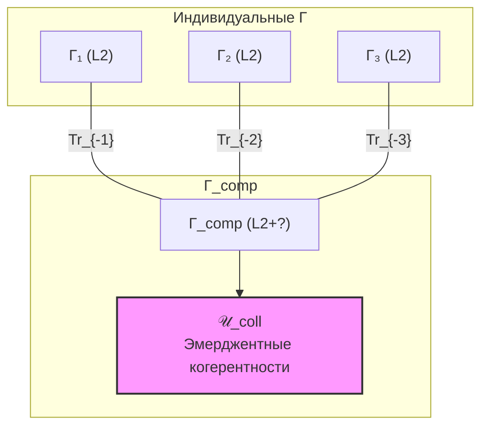

# Коллективное Сознание

:::note О нотации
В этом документе:
- $\Gamma$ — [матрица когерентности](/docs/core/dynamics/coherence-matrix) индивидуального голонома
- $\Gamma_{AB}$ — [составная матрица когерентности](/docs/core/dynamics/composite-systems#составная-матрица)
- $P = \mathrm{Tr}(\Gamma^2)$ — [чистота (жизнеспособность)](/docs/core/dynamics/viability#определение-чистоты)
- $P_{\text{crit}} = 2/7$ — [критическая чистота](/docs/core/dynamics/viability#критическая-чистота), статус **[Т]**
- $R$ — [мера рефлексии](/docs/consciousness/foundations/self-observation#мера-рефлексии-r), порог $R_{\text{th}} = 1/3$ **[Т]**
- $\Phi$ — [мера интеграции](/docs/core/structure/dimension-u#мера-интеграции-φ), порог $\Phi_{\text{th}} = 1$ **[О]**
- $\mathrm{Gap}_{AB}(i,j)$ — [межсистемный Gap](/docs/core/dynamics/composite-systems#межсистемный-gap)
- $\mathcal{E}_{\mathrm{Gap}}$ — [Gap-запутанность](/docs/core/dynamics/composite-systems#gap-запутанность)
- L0–L4 — [уровни интериорности](/docs/consciousness/hierarchy/interiority-hierarchy)
- Полная таблица нотации — в [Нотации](/docs/reference/notation)
:::

## Мотивация

Голономы не существуют изолированно. $N$ голономов, разделяющих среду $E_{\text{shared}}$, образуют составную систему с матрицей когерентности $\Gamma_{\text{comp}} \in \mathcal{D}(\mathbb{C}^{7N})$. Возникает вопрос: обладает ли **коллектив** интериорностью, отличной от суммы индивидуальных?

УГМ даёт формальный ответ: **да**, если составная матрица не факторизуется ($\Gamma_{\text{comp}} \neq \bigotimes_i \Gamma_i$) — существуют **эмерджентные когерентности**, недоступные ни одному индивиду.

## Составная система N голономов {#составная-система}

### Тензорное произведение

Для $N$ голономов $\mathfrak{H}_1, \ldots, \mathfrak{H}_N$ с индивидуальными $\Gamma_i \in \mathcal{D}(\mathbb{C}^7)$ составная матрица:

$$
\Gamma_{\text{comp}} \in \mathcal{D}\!\left(\bigotimes_{i=1}^N \mathbb{C}^7\right) = \mathcal{D}(\mathbb{C}^{7^N})
$$

Индивидуальные матрицы восстанавливаются частичным следом:

$$
\Gamma_i = \mathrm{Tr}_{-i}(\Gamma_{\text{comp}})
$$

Подробный формализм — в [составных системах](/docs/core/dynamics/composite-systems#составная-матрица).

## Определение О.1 (Коллективное бессознательное) {#определение-коллективного-бессознательного}

:::tip Определение О.1 (Коллективное бессознательное) [О]
**Коллективным бессознательным** системы из $N$ голономов называется множество когерентностей, присутствующих в $\Gamma_{\text{comp}}$, но **отсутствующих** в любой индивидуальной $\Gamma_i$:

$$
\mathcal{U}_{\text{coll}} := \left\{\gamma^{(\text{comp})}_{ij} \in \Gamma_{\text{comp}} \;\middle|\; \gamma^{(\text{comp})}_{ij} \neq \sum_k \lambda_k \gamma^{(k)}_{ij}\,,\; \forall \text{ разложение}\right\}
$$

Формально: это элементы $\Gamma_{\text{comp}}$, которые **не** являются выпуклыми комбинациями индивидуальных когерентностей. Они существуют тогда и только тогда, когда $\Gamma_{\text{comp}} \neq \bigotimes_i \Gamma_i$ — система не факторизуется.

**Свойства:**
1. $\mathcal{U}_{\text{coll}}$ недоступно рефлексии ни одного индивида: $\varphi_i(\Gamma_{\text{comp}}) = \varphi_i(\Gamma_i)$ — φ-оператор индивида «видит» только свою редуцированную $\Gamma_i$
2. $\mathcal{U}_{\text{coll}}$ влияет на индивидов через [маргиналы](/docs/core/dynamics/composite-systems): $\Gamma_i = \mathrm{Tr}_{-i}(\Gamma_{\text{comp}})$ зависит от коллективных когерентностей
3. $\mathcal{U}_{\text{coll}} = \varnothing$ $\Leftrightarrow$ система полностью сепарабельна
:::

## Архетипы {#архетипы}

### Интерпретация И.1 (Архетипы как структурные регулярности) [И] {#интерпретация-архетипы}

:::info Интерпретация И.1 [И]
**Архетипы** в смысле Юнга — структурные регулярности $\Gamma_{\text{comp}}$, увеличивающие чистоту $P$ для произвольного наблюдателя в группе:

$$
\text{Архетип} := \text{паттерн } \pi \text{ в } \Gamma_{\text{comp}}: \quad P(\Gamma_i \mid \pi) > P(\Gamma_i \mid \neg\pi) \quad \forall i
$$

**Свойства:**
1. **Селекция через жизнеспособность:** Архетипы не мистичны — они отбираются [критерием жизнеспособности](/docs/core/dynamics/viability): паттерны, увеличивающие $P$ для членов группы, воспроизводятся через поколения
2. **Наследуемость:** Передаются через $\Gamma_{\text{comp}}$ (культурная среда), а не через $\Gamma_i$ (индивидуальная матрица)
3. **Универсальность:** Одни и те же паттерны возникают независимо в разных культурах, если среда $E_{\text{shared}}$ имеет общую структуру
:::

### Примеры архетипических паттернов

| Архетип | Когерентности в $\Gamma_{\text{comp}}$ | Функция |
|---------|---------------------------------------|---------|
| «Герой» | $\gamma_{DU}^{(\text{comp})} \uparrow$, $\gamma_{DO}^{(\text{comp})} \uparrow$ | Стабилизация $P$ через динамику и основание |
| «Тень» | $\mathrm{Gap}(E,U)^{(\text{comp})} \uparrow$ | Непрозрачность между опытом и единством |
| «Мудрец» | $\gamma_{LO}^{(\text{comp})} \uparrow$, $R^{(\text{comp})} \uparrow$ | Повышение коллективной рефлексии |
| «Мать» | $\gamma_{EU}^{(\text{comp})} \uparrow$, $\gamma_{SE}^{(\text{comp})} \uparrow$ | Интеграция через опыт и структуру |

## Эмпатия {#эмпатия}

### Определение О.2 (Мера эмпатии) {#мера-эмпатии}

:::tip Определение О.2 (Мера эмпатии) [О]
**Эмпатия** между голономами $A$ и $B$ определяется через [межсистемный Gap](/docs/core/dynamics/composite-systems#межсистемный-gap) в E-канале:

$$
\mathrm{Empathy}(A,B) := 1 - \mathrm{Gap}_{AB}(E,E)
$$

где $\mathrm{Gap}_{AB}(E,E) = |\sin(\arg(\gamma_{E^A E^B}))| \in [0, 1]$ — непрозрачность между измерениями Интериорности двух систем.

| $\mathrm{Empathy}$ | Значение | Описание |
|---------------------|----------|----------|
| $\approx 1$ | Малый E-Gap | Высокая прозрачность: $A$ «чувствует» состояние $B$ |
| $\approx 0.5$ | Средний E-Gap | Частичная эмпатия: общие эмоции, но непрозрачность деталей |
| $\approx 0$ | Максимальный E-Gap | Отчуждение: интериорность $B$ полностью закрыта для $A$ |
:::

### Необходимые условия эмпатии

Из [Теоремы 4.1 (Необходимые условия эмпатии)](/docs/core/dynamics/composite-systems#эмпатия) **[Т]**:

1. **Gap-запутанность:** $\mathcal{E}_{\mathrm{Gap}} > 0$ — системы не сепарабельны
2. **Координация φ:** $\theta^{\mathrm{target}}_{E^A} \approx \theta^{\mathrm{target}}_{E^B} \pmod{\pi}$ — согласованные мировые модели
3. **Жизнеспособность:** $P_A > P_{\text{crit}}$ и $P_B > P_{\text{crit}}$ — обе системы [жизнеспособны](/docs/core/dynamics/viability)
4. **Связь:** $|\gamma_{E^A E^B}| > \sqrt{P_{\text{crit}} / 7}$ — достаточная сила когерентности

### Утверждение С.1 (Минимальный уровень для эмпатии) [С] {#минимальный-уровень-эмпатии}

:::tip Утверждение С.1 [С]
**Условие:** Эмпатия требует $\mathrm{rank}(\rho_E) > 1$ для обоих участников (интерпретативное допущение).

Подлинная эмпатия (в смысле О.2) требует **минимум L1** для обеих систем $A$ и $B$:

$$
\mathrm{Empathy}(A,B) > 0 \implies \mathrm{Level}(A) \geq L1 \;\land\; \mathrm{Level}(B) \geq L1
$$

**Аргумент.** При L0 (до L1) $\mathrm{rank}(\rho_E) \leq 1$ — экспериенциальное пространство тривиально. Нет структурированного опыта, который мог бы быть «разделён» между системами. Когерентность $\gamma_{E^A E^B}$ может быть ненулевой, но её интерпретация как «эмпатии» требует нетривиальной $\rho_E$ у обеих систем.
:::

## Коллективные L-уровни {#коллективные-уровни}

### Утверждение С.2 (Эмерджентные коллективные L-уровни) [С] {#эмерджентные-уровни}

:::tip Утверждение С.2 [С]
**Условие:** $\Gamma_{\text{comp}}$ имеет нетривиальные когерентности, отсутствующие в индивидуальных $\Gamma_i$ (определение О.1).

Коллектив может обладать L-уровнем, **превышающим** индивидуальный:

$$
\mathrm{Level}(\Gamma_{\text{comp}}) > \max_i \mathrm{Level}(\Gamma_i)
$$

**Аргумент.** Меры $R$ и $\Phi$ вычисляются из $\Gamma$. Составная $\Gamma_{\text{comp}}$ может иметь:
- Более высокую $\Phi$ (дополнительные когерентности между индивидами увеличивают числитель $\sum_{i \neq j} |\gamma_{ij}|^2$)
- Более высокую $R$ (коллективная самомодель точнее индивидуальных — научное сообщество знает о себе больше, чем каждый учёный)

Примеры:
1. **Научное сообщество:** Потенциальный коллективный L3 — метарефлексия ($R^{(2)}$) на уровне дисциплины (научный метод как $\varphi^{(2)}$)
2. **Рой пчёл:** Коллективное «принятие решений» (выбор нового улья) — потенциально L1, даже если индивидуальная пчела — L0-L1
3. **Симфонический оркестр:** Высокая $\Phi_{\text{comp}}$ — музыкальное единство, недоступное отдельному музыканту
:::

### Таблица коллективных L-уровней

| Коллектив | Индив. L | Коллект. L | Механизм |
|-----------|----------|------------|----------|
| Бактериальная колония | L0 | L0 (повышенный $P$) | Кворум-сенсинг = коллективная $\gamma_{SD}$ |
| Муравьиная колония | L0-L1 | L1 (возможно) | Стигмергия = распределённая $\Gamma_{\text{comp}}$ |
| Стая птиц | L1 | L1+ | Синхронизация $\gamma_{DU}^{(\text{comp})}$ |
| Семья (человек) | L2 | L2+ | Общие модели, эмпатия |
| Научное сообщество | L2 | L2-L3? | Рецензирование = коллективный $\varphi^{(2)}$ |
| Религиозная община | L2 | L2+ | Ритуал = синхронизация $\gamma_{OU}^{(\text{comp})}$ |

## Мемы и культурные когерентности {#мемы}

### Определение О.3 (Культурная когерентность) [О] {#культурная-когерентность}

:::tip Определение О.3 [О]
**Культурная когерентность** — устойчивый недиагональный элемент $\gamma_{ij}^{(\text{comp})}$ составной $\Gamma_{\text{comp}}$, воспроизводящийся при смене поколений:

$$
\gamma_{ij}^{(\text{comp})}(\tau + T_{\text{gen}}) \approx \gamma_{ij}^{(\text{comp})}(\tau)
$$

где $T_{\text{gen}}$ — характерное время смены поколений.
:::

### Каналы распространения

Культурные паттерны (мемы в смысле Докинза) распространяются через два основных механизма:

| Канал | Когерентность | Пример |
|-------|-------------|--------|
| Структурно-логический | $\gamma_{SL}^{(\text{comp})} \uparrow$ | Закон, правило, инструкция |
| Репрезентативно-эстетический | $\gamma_{SE}^{(\text{comp})} \uparrow$ | Музыка, архитектура, миф |

Первый канал передаёт **эксплицитное** знание (вербализуемое через высокий $\gamma_{LL}$), второй — **имплицитное** (через перцептивное резонирование, без необходимости языка; ср. [до-лингвистическое сознание](./pre-linguistic)).

### Влияние технологий на коллективную $\Gamma$

:::warning Утверждение С.3 (Влияние социальных медиа на коллективную рефлексию) [С]
**Условие:** Модель $G$ для коллективных систем корректно определена.

Социальные медиа могут **снижать** коллективную рефлексию $R_{\text{comp}}$ при повышении $\Phi_{\text{comp}}$:

1. **Повышение $\Phi$:** Увеличение связности (больше когерентностей $\gamma_{ij}^{(\text{comp})}$)
2. **Снижение $R$:** Фрагментация самомодели — коллектив всё хуже моделирует **себя** (эхо-камеры: каждая подгруппа моделирует только себя, $\varphi_{\text{подгр}} \neq \varphi_{\text{comp}}$)
3. **Результат:** $\Phi \uparrow$ при $R \downarrow$ — **высокая интеграция при низкой рефлексии**

Это соответствует [эмоционально заряженным состояниям](/docs/consciousness/phenomenology/emotional-taxonomy#сложные-эмоции) на коллективном уровне: массовая паника (высокий $\Phi$, высокий $|dP/d\tau|$, низкий $R$).
:::

## Коллективный Gap-фазовый переход {#коллективный-переход}

Из [Теоремы 3.3 (Коллективный Gap-фазовый переход)](/docs/core/dynamics/composite-systems#коллективный-переход) **[Т]**:

Для $N$ взаимодействующих голономов коллективная критическая температура **выше** индивидуальной:

$$
T_c^{(\text{coll})} = T_c^{(\text{indiv})} \cdot \left(1 + \frac{(N-1)\bar{\sigma}^2}{\mu^2}\right)
$$

Социальные группы поддерживают упорядоченную Gap-фазу при условиях, где изолированный индивид перешёл бы в неупорядоченную фазу. Это формальное обоснование **социальной стабильности**: группа устойчивее индивида.

## Визуализация

**Эмерджентные когерентности** $\mathcal{U}_{\text{coll}}$ (розовый блок) недоступны ни одному индивиду, но влияют на всех через частичные следы.

---

**Связанные документы:**
- [Составные системы и Gap-запутанность](/docs/core/dynamics/composite-systems) — полный формализм $\Gamma_{AB}$, межсистемный Gap, эмпатия, коллективный фазовый переход
- [Иерархия интериорности](/docs/consciousness/hierarchy/interiority-hierarchy) — каноническое определение L0→L4
- [Структура квалиа](/docs/consciousness/phenomenology/qualia-structure) — 21-парная таксономия когерентностей
- [Таксономия эмоций](/docs/consciousness/phenomenology/emotional-taxonomy) — коллективные эмоции через $dP/d\tau$
- [Сознание животных](./animal-consciousness) — социальные системы у животных
- [До-лингвистическое сознание](./pre-linguistic) — невербальные каналы передачи ($\gamma_{SE}$)
- [Жизнеспособность](/docs/core/dynamics/viability) — $P > P_{\text{crit}}$ как условие существования
