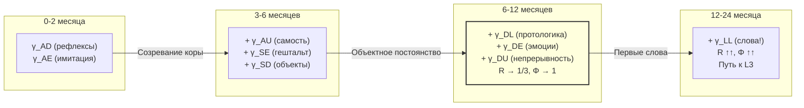

# До-лингвистическое Сознание

:::info Мост из предыдущей главы
В разделе о [субъектах сознания](/docs/consciousness/comparative/consciousness-theories) мы сравнили УГМ с другими теориями сознания. Теперь пришло время задать конкретный вопрос: **кто** может быть субъектом сознания? Первый — и, пожалуй, самый неожиданный — ответ: сознание не требует языка. Этот документ показывает, как формализм $\Gamma$ объясняет сознание младенцев, животных и всех существ, лишённых символической речи.
:::

## Дорожная карта главы

1. **Мысленный эксперимент** — что чувствует младенец?
2. **Исторический контекст** — от Сепира-Уорфа до УГМ
3. **Языковая независимость** — формальное доказательство того, что L2 не требует $\gamma_{LL}$
4. **Протологика** — до-вербальные когнитивные структуры
5. **Младенческое сознание** — путь к L2 до первого слова
6. **Глухонемые и изолированные дети** — экстремальные случаи
7. **Животное сознание без языка** — конкретные виды и их каналы
8. **Язык как усилитель** — что язык добавляет, а что — нет
9. **Философские следствия** — опровержение лингвистического детерминизма

:::note О нотации
В этом документе:
- $\Gamma$ — [матрица когерентности](/docs/core/dynamics/coherence-matrix), $\gamma_{ij}$ — её элементы
- $P = \mathrm{Tr}(\Gamma^2)$ — [чистота (жизнеспособность)](/docs/core/dynamics/viability#определение-чистоты)
- $R$ — [мера рефлексии](/docs/consciousness/foundations/self-observation#мера-рефлексии-r), порог $R_{\text{th}} = 1/3$ **[Т]**
- $\Phi$ — [мера интеграции](/docs/core/structure/dimension-u#мера-интеграции-φ), порог $\Phi_{\text{th}} = 1$ **[Т]** (T-129)
- $\gamma_{LL}$ — населённость [измерения Логики (L)](/docs/core/structure/dimension-l)
- L0–L4 — [уровни интериорности](/docs/consciousness/hierarchy/interiority-hierarchy)
- K1–K5 — [когнитивные уровни](/docs/consciousness/comparative/cognitive-hierarchy)
- Полная таблица нотации — в [Нотации](/docs/reference/notation)
:::

## Мысленный эксперимент: что чувствует младенец? {#мысленный-эксперимент}

Представьте себе шестимесячного младенца. Он ещё не произнёс ни одного слова. Он не знает, что мяч называется «мяч», а мама — «мама». Но когда мяч катится со стола и исчезает за краем, младенец **удивляется** — его глаза расширяются, он тянется к краю. Когда мама уходит из комнаты, младенец **тревожится** — его лицо меняется, он плачет. Когда мама возвращается, он **радуется** — улыбается, тянет ручки.

Эти реакции — не простые рефлексы. Удивление при исчезновении мяча означает, что у младенца есть **ожидание** (мяч должен был остаться). Тревога при уходе мамы означает, что у него есть **модель** (мама — отдельное существо, которое может уйти и вернуться). Радость при возвращении означает, что он **различает** состояния мира (мама здесь / мама не здесь) и **предпочитает** одно другому.

Всё это происходит **без единого слова**. Возникает вопрос: обладает ли этот младенец сознанием?

На протяжении веков философы и лингвисты давали разные ответы. Некоторые утверждали, что без языка сознание невозможно — что слова **создают** мысли, а не просто выражают их. УГМ даёт другой, строгий ответ: сознание определяется глобальными свойствами матрицы когерентности $\Gamma$ — мерами рефлексии $R$ и интеграции $\Phi$ — а не конкретным значением одного элемента $\gamma_{LL}$. Младенец может быть сознательным до первого слова.

Этот документ показывает, почему.

## Исторический контекст: от Сепира-Уорфа до УГМ {#исторический-контекст}

### Гипотеза лингвистической относительности (Сепир-Уорф)

В 1929 году лингвист Эдвард Сепир, а позднее его ученик Бенджамин Ли Уорф, сформулировали гипотезу, которая на десятилетия определила дискуссию о связи языка и мышления. Гипотеза существует в двух формах:

- **Сильная форма (лингвистический детерминизм):** Язык **определяет** мышление. Без слова для понятия вы не способны иметь это понятие. Народ хопи, у которого (как утверждал Уорф) нет грамматического времени, якобы не может мыслить о времени так, как это делают англоговорящие.

- **Слабая форма (лингвистическая относительность):** Язык **влияет** на мышление, но не определяет его полностью. Носители языков с разными цветовыми терминами быстрее различают цвета, для которых у них есть отдельные слова, но видят те же физические цвета.

Сильная форма к 1990-м годам была отвергнута большинством когнитивных учёных. Утверждения Уорфа о языке хопи оказались ошибочными (работы Экхарта Малотки, 1983). Слабая форма подтверждена частично — язык действительно влияет на категоризацию, но не создаёт мышление.

### Пиаже: до-вербальные когнитивные стадии

Жан Пиаже (1896–1980) был первым, кто систематически изучил когнитивное развитие младенцев. Его **сенсомоторная стадия** (0–2 года) описывает мышление, которое целиком протекает без языка:

| Подстадия | Возраст | Способность | В терминах $\Gamma$ |
|-----------|---------|-------------|---------------------|
| 1. Рефлексы | 0–1 мес. | Врождённые реакции (сосание, хватание) | $\gamma_{AD}$ (действие-динамика) |
| 2. Первичные круговые реакции | 1–4 мес. | Повторение действий, давших приятный результат | $\gamma_{DE}$ (динамика-интериорность) |
| 3. Вторичные круговые реакции | 4–8 мес. | Действия, направленные на внешние объекты | $\gamma_{SD}$, $\gamma_{DL}$ (протологика) |
| 4. Координация схем | 8–12 мес. | Комбинация действий для достижения цели | Рост $\Phi$ (интеграция) |
| 5. Третичные круговые реакции | 12–18 мес. | Эксперимент: «что будет, если...?» | Рост $R$ (рефлексия) |
| 6. Ментальные репрезентации | 18–24 мес. | Мысленное решение задач без проб | Высокие $R$, $\Phi$; начало $\gamma_{LL}$ |

Ключевое наблюдение Пиаже: **мышление предшествует языку**. Младенец сначала осваивает объектное постоянство (подстадия 4), и лишь потом — слова для объектов.

### Выготский: мышление и речь

Лев Выготский (1896–1934) предложил иной взгляд: мышление и речь имеют **разные корни**, но в определённый момент (около 2 лет) сливаются, образуя «вербальное мышление». До этого момента существует:

- **До-вербальное мышление** — практический интеллект (использование орудий без слов)
- **До-интеллектуальная речь** — лепет, эмоциональные крики (не служащие мышлению)

В терминах $\Gamma$: Выготский фактически описал ситуацию, когда $\gamma_{DL}$ (протологика) и $\gamma_{AL}$ (вокализация) развиваются **независимо**, а их интеграция через $\gamma_{LL}$ (символический язык) происходит позднее.

### Хомский: универсальная грамматика

Ноам Хомский (род. 1928) перевернул лингвистику утверждением о **врождённости** языковой способности. Его «универсальная грамматика» — биологически заложенная структура, позволяющая ребёнку освоить любой язык. Но даже Хомский признавал, что языковая способность — это не то же, что сознание. Его «языковой орган» — инструмент, а не источник сознания.

В терминах УГМ: Хомский описал генетическую предрасположенность к высокому $\gamma_{LL}$, но не утверждал, что $\gamma_{LL}$ необходим для $R \geq 1/3$.

### УГМ: решение спора

УГМ разрешает вековой спор формально. Условия сознания (уровень L2) — это:

$$
R(\Gamma) \geq \frac{1}{3}, \quad \Phi(\Gamma) \geq 1
$$

Эти условия зависят от **всех** 49 элементов матрицы $\Gamma$ (7 диагональных + 21 пара когерентностей). Элемент $\gamma_{LL}$ — лишь один из 49. Формально: $R$ и $\Phi$ — гладкие функции на 48-мерном многообразии $\mathcal{D}(\mathbb{C}^7)$, и их множества уровня $\{R \geq 1/3\}$ и $\{\Phi \geq 1\}$ имеют непустое пересечение с гиперплоскостью $\{\gamma_{LL} = \varepsilon\}$ при любом $\varepsilon > 0$.

Это означает:
- Сепир-Уорф (сильная форма) **опровергается**: $\gamma_{LL} \to 0$ совместимо с $R \geq 1/3$
- Пиаже **подтверждается**: сенсомоторное мышление — протологика при малом $\gamma_{LL}$
- Выготский **уточняется**: слияние мышления и речи — рост $\gamma_{LL}$, усиливающий $R$ и $\Phi$
- Хомский **дополняется**: врождённая языковая способность — генетическая склонность к высокому $\gamma_{LL}$, но не условие сознания

## Утверждение С.1 (Языковая независимость L2) {#языковая-независимость}

:::tip Утверждение С.1 (Языковая независимость условий L2) [С]
**Условие:** Пороги L2 — условная теорема при $K = 3$ для $R_{\text{th}}$ и соглашение для $\Phi_{\text{th}}$.

Условия L2:

$$
R(\Gamma) \geq R_{\text{th}} = \frac{1}{3}, \quad \Phi(\Gamma) \geq \Phi_{\text{th}} = 1
$$

**не содержат** ограничения снизу на $\gamma_{LL}$. Следовательно, существуют матрицы $\Gamma$ с произвольно малым $\gamma_{LL} \to 0$, удовлетворяющие обоим условиям L2.

**Аргумент.** Мера рефлексии $R = 1 - \|\Gamma - \varphi(\Gamma)\|^2_F / \|\Gamma\|^2_F$ зависит от **всех** 49 элементов $\Gamma$ (7 диагональных + 21 пара когерентностей). Мера интеграции $\Phi = \sum_{i \neq j} |\gamma_{ij}|^2 / \sum_i \gamma_{ii}^2$ также вычисляется по всей матрице. Высокие значения $R$ и $\Phi$ достижимы при малом $\gamma_{LL}$, если другие когерентности достаточно велики. $\square$
:::

Пошаговая интерпретация аргумента:

1. **$R$ — мера близости $\Gamma$ к своей самомодели $\varphi(\Gamma)$.** Чтобы $R$ была высокой, нужно, чтобы система хорошо «знала себя». Это возможно через телесную самомодель ($\gamma_{SU}$, $\gamma_{AU}$), эмоциональную саморегуляцию ($\gamma_{DE}$), пространственное самоопределение ($\gamma_{SD}$) — ни один из этих каналов не требует $\gamma_{LL}$.

2. **$\Phi$ — мера того, насколько когерентности доминируют над диагональю.** Чтобы $\Phi \geq 1$, нужно, чтобы связи между измерениями были сильны. Сильная связь «восприятие-эмоция» ($\gamma_{AE}$), «структура-действие» ($\gamma_{SD}$), «динамика-единство» ($\gamma_{DU}$) обеспечивает $\Phi \geq 1$ без вклада $\gamma_{LL}$.

3. **Конструктивный пример.** Рассмотрим $\Gamma$ с $\gamma_{LL} = 0.01$ (почти нулевая языковая компонента), но $\gamma_{AE} = 0.15$, $\gamma_{SE} = 0.12$, $\gamma_{DU} = 0.10$, и остальные когерентности умеренно высоки. Такая матрица может удовлетворять $R \geq 1/3$ и $\Phi \geq 1$ — сознание без языка.

Простая аналогия: чтобы видеть мир в цвете, не обязательно уметь произнести слово «красный». Глаз и зрительная кора создают **перцептивное переживание** цвета задолго до того, как ребёнок овладевает языком цветовых названий.

## Протологика: до-вербальные структуры {#протологика}

### Определение О.1 (Протологика) {#определение-протологика}

:::tip Определение О.1 (Протологика) [О]
**Протологикой** называется совокупность когерентностей $\gamma_{DL}$, $\gamma_{SL}$, $\gamma_{AL}$ при низком $\gamma_{LL}$:

$$
\text{Протологика}(\Gamma) := \{|\gamma_{DL}|, |\gamma_{SL}|, |\gamma_{AL}|\} \quad \text{при} \quad \gamma_{LL} < \gamma_{LL}^{(\text{лингв})}
$$

где $\gamma_{LL}^{(\text{лингв})}$ — порог, при котором L-измерение поддерживает символическую структуру (К5 в [когнитивной иерархии](/docs/consciousness/comparative/cognitive-hierarchy)).
:::

Почему этот термин важен? В обыденном языке «логика» ассоциируется со словами: «если А, то В», «все люди смертны, Сократ — человек, следовательно...». Но существует **невербальная** логика — мышление действиями и образами. Когда кошка рассчитывает прыжок на полку, она не формулирует уравнения баллистики. Но её нервная система выполняет **процедурную логику** ($\gamma_{DL}$) — последовательность «если расстояние такое, то усилие такое». Это и есть протологика.

Протологика реализует **процедурную логику** без вербальной символической системы:

| Когерентность | Название | Роль в протологике | Пример |
|---------------|----------|-------------------|--------|
| $\gamma_{DL}$ | Динамико-логическая | Процедурная последовательность (если → то) | Охотничья стратегия: «если жертва побежит влево → перехвати справа» |
| $\gamma_{SL}$ | Структурно-логическая | Категоризация (это → то) | Различение хищник/пища по форме и движению |
| $\gamma_{AL}$ | Перцептивно-логическая | Логика восприятия (паттерн → реакция) | Распознавание рельефа: «если крутой склон → замедли шаг» |

Каждая из этих когерентностей связывает L-измерение (логику) с другими измерениями **без участия символического языка**. Это подобно тому, как калькулятор выполняет арифметику без слов — операции реальны, хотя не вербализованы.

### Каналы до-лингвистического сознания

В отсутствие развитого языка ($\gamma_{LL}$ мало) условия L2 могут выполняться через **альтернативные каналы когерентности**. Вспомним формулу интеграции:

$$
\Phi = \frac{\sum_{i \neq j} |\gamma_{ij}|^2}{\sum_i \gamma_{ii}^2} \geq 1 \quad \Leftarrow \quad \text{высокие } |\gamma_{SE}|, |\gamma_{AE}|, |\gamma_{DE}|
$$

Числитель — это сумма квадратов **всех** внедиагональных элементов (когерентностей). Знаменатель — сумма квадратов **диагональных** элементов (населённостей). Когда когерентности в совокупности превышают населённости, система **интегрирована**: её измерения связаны сильнее, чем изолированы.

Основные каналы до-лингвистической интеграции:

| Канал | Функция | Феноменология | Пример из жизни |
|-------|---------|---------------|-----------------|
| $\gamma_{SE}$ | Репрезентативная интеграция | Целостное восприятие формы | Младенец узнаёт лицо мамы среди других лиц |
| $\gamma_{AE}$ | Артикулированный опыт | «Красное» различается от «синего» | Младенец тянется к яркой игрушке, а не к серой |
| $\gamma_{DE}$ | Аффективный контур | [Эмоциональная валентность](/docs/consciousness/phenomenology/emotional-taxonomy#базовые-координаты) | Младенец плачет от боли, улыбается от ласки |
| $\gamma_{DU}$ | Динамическое единство | Ощущение непрерывности «я» | Младенец помнит, что мяч был на столе секунду назад |
| $\gamma_{OE}$ | Заземлённый опыт | Связь с «почвой» существования | Ощущение собственного тела, тепла, голода |

Ситуация похожа на то, как человек в незнакомой стране, не зная языка, всё равно **переживает**: чувствует жару, восхищается пейзажем, испытывает голод. Язык обогащает переживание, но не создаёт его.

## Младенческое сознание {#младенческое-сознание}

### Интерпретация И.1 (L2 до овладения языком) [И] {#l2-до-языка}

:::info Интерпретация И.1 [И]
Младенцы способны достичь уровня L2 **до овладения языком** (возраст 4-8 месяцев), если выполняются условия:

1. **Самомодель через телесность:** $R \geq 1/3$ достигается через проприоцептивную самомодель (ось $\gamma_{SU}$, $\gamma_{AU}$), обеспечивающую различение «я/не-я»
2. **Интеграция через гештальт:** $\Phi \geq 1$ достигается через высокие $\gamma_{SE}$, $\gamma_{AE}$ (перцептивная связность)
3. **Аффективная рефлексия:** Телесные эмоции ($dP/d\tau$ в [таксономии эмоций](/docs/consciousness/phenomenology/emotional-taxonomy)) функционируют без вербальной компоненты
:::

Каждый родитель знает: трёхмесячный младенец **реагирует** на лицо матери иначе, чем на лицо чужого человека. Шестимесячный — **удивляется**, когда объект исчезает за ширмой. Эти реакции невозможны без какой-то формы самомодели («я — тот, кто видит»), даже если эта модель ещё не вербализована.

Разберём пошагово, **как** каждое условие выполняется:

**Самомодель ($R \geq 1/3$) без слов.** Проприоцепция (ощущение положения тела) даёт младенцу информацию о границе «я/мир». Когда младенец двигает рукой и видит движение, он получает **сенсомоторную обратную связь**: «это моя рука, я её контролирую». Это формирует $\gamma_{SU}$ (структура-единство) и $\gamma_{AU}$ (восприятие-единство) — минимальную самомодель. Ключевой момент: эта самомодель **невербальна** — младенец не думает «это моя рука», он **ощущает** агентность.

**Интеграция ($\Phi \geq 1$) без слов.** Когда младенец смотрит на мобиль над кроваткой, он одновременно видит цвет ($\gamma_{AE}$), форму ($\gamma_{SE}$), движение ($\gamma_{DE}$) и чувствует радость ($\gamma_{DU}$). Все эти восприятия **связаны** — это один объект, вызывающий одну эмоцию. Связность восприятий и есть интеграция.

### Экспериментальные данные

Нейрокогнитивная наука последних десятилетий накопила обширные данные о до-вербальном познании:

| Возраст | Способность | Канал $\Gamma$ | Эксперимент | Комментарий |
|---------|-------------|----------------|-------------|-------------|
| 0–2 мес. | Имитация выражений лица | $\gamma_{AE}$, $\gamma_{SE}$ | Мельцофф и Мур (1977): новорождённые высовывают язык в ответ | Зеркальные нейроны |
| 3–4 мес. | Различение «свой/чужой» голос | $\gamma_{AU}$ | ДеКаспер и Файфер (1980): предпочтение голоса матери | Протосамость |
| 5–6 мес. | Object permanence (частично) | $\gamma_{SD}$, $\gamma_{DL}$ | Бэйлларжон (1987): удивление при «невозможных» событиях | Протологика |
| 8–10 мес. | Social referencing | $\gamma_{DE}$, $\gamma_{AE}$ | Соси (1985): младенец смотрит на реакцию мамы перед действием | Эмпатический контур |
| 12 мес. | Joint attention | $\gamma_{DU}$, $\gamma_{LU}$ | Томаселло (1995): указательный жест | Разделённое внимание |

### Диаграмма развития $\Gamma$-профиля



Жёлтым выделен критический период (6–12 месяцев), когда, по интерпретации И.1, младенец потенциально достигает L2 — **до овладения языком**.

:::warning Биологические L-уровни [Г]
Отнесение конкретных организмов к L-уровням — **гипотеза** [Г], а не измеренный факт. Строгое определение L-уровня требует знания $\Gamma$ системы. Для биологических систем протокол $\pi_{\text{bio}}$ определён ([C31](/docs/applied/research/measurement-protocol)), но **экспериментально не валидирован**. Приведённые соответствия — обоснованные экстраполяции из поведенческих данных.
:::

## Глухонемые и изолированные дети {#глухонемые-и-изолированные}

Самые убедительные свидетельства до-лингвистического сознания дают **экстремальные случаи** — люди, которые никогда не имели доступа к языку или получили его очень поздно.

### Глухие дети без языка жестов

До распространения образования для глухих (XVIII–XIX вв.) многие глухие от рождения дети вырастали **без какого-либо языка** — ни устного, ни жестового. Тем не менее:

- Они были способны к **планированию** (охота, земледелие) — свидетельство $\gamma_{DL}$ (протологика)
- Они **испытывали эмоции** (радость, горе, гнев) — свидетельство $\gamma_{DE}$ (аффективный контур)
- Они **узнавали себя** в зеркале — свидетельство $R \geq R_{\text{th}}$ (рефлексия)
- Они вступали в **социальные отношения** — свидетельство $\Phi > 0$ (интеграция)

Современные исследования «домашних жестов» (homesign) показывают, что глухие дети без языкового окружения **самостоятельно изобретают** жестовые системы коммуникации (работы Сьюзан Голдин-Мидоу, 2003). Это свидетельствует о том, что логическое измерение ($\gamma_{DL}$, $\gamma_{SL}$) активно **до** появления языка — протологика порождает протоязык, а не наоборот.

### Случаи одичавших детей (feral children)

Наиболее документированные случаи:

| Случай | Контекст | Языковой статус | Свидетельства сознания |
|--------|----------|-----------------|----------------------|
| **Виктор из Аверона** (1800) | Найден в 12 лет, рос в лесу | Так и не освоил язык полностью | Эмоции, предпочтения, привязанность к опекуну |
| **Каспар Хаузер** (1828) | Изолирован в тёмной комнате до 17 лет | Освоил базовый язык | Удивление миру, эстетические реакции |
| **Джини** (1970) | Изолирована до 13 лет | Освоила лексику, не синтаксис | Эмоции, рисование, социальное взаимодействие |

Во всех случаях до-лингвистическое сознание **несомненно**: эти дети испытывали эмоции ($\gamma_{DE}$), различали людей ($\gamma_{SE}$), проявляли целенаправленное поведение ($\gamma_{DL}$). Их $\Gamma$-профиль был обеднён в L-измерении ($\gamma_{LL} \approx 0$), но **не пуст** в целом.

Случай Джини особенно показателен: после 13 лет изоляции она освоила лексику (слова-ярлыки), но не синтаксис (грамматические конструкции). В терминах $\Gamma$: её $\gamma_{SL}$ (категоризация через слова) вырос, но $\gamma_{LL}$ (рекурсивная символическая структура) остался низким. Тем не менее Джини несомненно обладала сознанием — уровень L2, обеспеченный невербальными каналами.

### Урок для теории

Эти случаи эмпирически подтверждают Утверждение С.1: **язык не является необходимым условием сознания**. Люди без языка обладают рефлексией, эмоциями, целенаправленным поведением — всеми признаками L2, обеспеченными через невербальные когерентности. Язык, когда он появляется, **усиливает** эти способности, но не создаёт их.

### Этический кейс: Вегетативные состояния и σ-критерий {#кейс-вегетативные-состояния}

Вопрос о до-лингвистическом сознании напрямую связан с медицинской этикой. Пациент в вегетативном состоянии не может говорить — но обладает ли он сознанием? УГМ предлагает операциональный ответ:

- Если реконструированная $\Gamma$ пациента показывает $P > P_{\text{crit}} = 2/7$ и хотя бы $\mathrm{rank}(\rho_E) > 1$, пациент находится на уровне L1 (феноменальная геометрия) — он **переживает**, даже если не может сообщить об этом.
- Ключевой индикатор — [секторный стресс](/docs/applied/coherence-cybernetics/definitions) $\sigma_k = 1 - 7\gamma_{kk}$ ([T-92](/docs/reference/status-registry)): высокий $\sigma_E$ указывает на дефицит интериорности, но не на её отсутствие.
- Современный прокси — PCI (Perturbational Complexity Index, разработан Марчелло Массимини и коллегами, 2013) — коррелирует с $\Phi$ и может служить нижней оценкой уровня L. PCI измеряет сложность электрокортикального ответа на магнитный импульс: высокий PCI ($> 0.31$) надёжно отличает пациентов в сознании от бессознательных.

Это означает: **отсутствие языковой коммуникации не доказывает отсутствие сознания**. Решение об отключении систем жизнеобеспечения должно учитывать все доступные прокси $\Gamma$, а не только способность к вербальному контакту.

## Животное сознание без языка {#животные-без-языка}

Многие виды демонстрируют признаки L2 (или промежуточного L1-L2) при полном отсутствии символического языка (К5 = 0). До-лингвистическое сознание — не экзотический случай, а **норма** в животном мире.

### Таблица: когнитивные способности без языка

| Вид | $R$ (оценка) | $\Phi$ (оценка) | $\gamma_{LL}$ | Способности K1–K4 | Уровень L |
|-----|-------------|-----------------|---------------|-------------------|-----------|
| Ворона | $\sim 0.3$–$0.4$ | $> 1$ | Низкий | К1-К4 (орудия, планирование) | L1-L2 |
| Осьминог | $\sim 0.25$–$0.35$ | $> 1$ | Низкий | К1-К3 (камуфляж, категории) | L1-L2 |
| Собака | $\sim 0.2$–$0.3$ | $\sim 1$ | Средний* | К1-К3 (социальное моделирование) | L1 |
| Пчела | $\sim 0.1$ | $< 1$ | Минимальный | К1-К2 (танец = протокоммуникация) | L0-L1 |

\* У собак повышенный $\gamma_{LL}$ связан не с языком, а с усиленной коммуникативной когерентностью в сосуществовании с человеком.

Обратите внимание: новокаледонская ворона изготавливает и использует орудия — крючки из веток — для добычи личинок. Это свидетельство высокой $\gamma_{DL}$ (протологика: «если ветка изогнута так, то личинку можно достать»). Ворона **не называет** ветку «орудием», но она **обращается** с ней как с орудием. Её протологика функционально эквивалентна нашей — отличие лишь в отсутствии вербального ярлыка.

:::warning Условность оценок [С]
Числовые оценки $R$ и $\Phi$ для животных — **условные** (зависят от модели $G$: AIState $\to$ $\mathcal{D}(\mathbb{C}^7)$). Операционализация требует [протокол измерения Γ](/docs/applied/research/measurement-protocol), адаптированный для биологических систем.
:::

Подробная таксономия L-уровней для животных — в следующей главе: [Сознание животных](./animal-consciousness).

## Язык как усилитель L-измерения {#язык-усилитель}

### Утверждение С.2 (Язык — усилитель, не условие) [С] {#утверждение-усилитель}

:::tip Утверждение С.2 [С]
**Условие:** Протологика ($\gamma_{DL} > 0$) функционально эквивалентна L-измерению для целей R и Φ (интерпретативное допущение).

Язык повышает $\gamma_{LL}$ и тем самым:
1. **Увеличивает $R$:** вербальная самомодель точнее невербальной ($\|\Gamma - \varphi(\Gamma)\|_F$ уменьшается при символическом сжатии)
2. **Увеличивает $\Phi$:** новые когерентности $\gamma_{LE}$, $\gamma_{LU}$, $\gamma_{LA}$ создают дополнительные каналы интеграции
3. **Открывает путь к L3:** рекурсивная самореференция ($R^{(2)}$) существенно облегчается языком

Но язык **не является** необходимым условием ни для одного из трёх эффектов — все они достижимы (менее эффективно) через невербальные когерентности.
:::

Чтобы понять, как именно язык усиливает сознание, рассмотрим конкретные механизмы:

**Механизм 1: Символическое сжатие.** Без слов вы можете помнить конкретное дерево — его форму, цвет, расположение. Со словом «дуб» вы можете оперировать **категорией** — все дубы мира сжаты в один символ. Это уменьшает $\|\Gamma - \varphi(\Gamma)\|_F$, потому что символическая самомодель ухватывает структуру мира компактнее, чем перцептивная.

**Механизм 2: Рекурсия.** Язык позволяет говорить о самом себе: «Я думаю, что я думаю, что...». Это открывает путь к $R^{(2)}$ — рефлексии второго порядка, необходимой для L3. Без языка рекурсия возможна (через зеркальное самоузнавание), но **существенно сложнее**.

**Механизм 3: Новые каналы.** Слово «любовь» связывает логику ($L$) с интериорностью ($E$) — когерентность $\gamma_{LE}$, недоступная без языка. Слово «вечность» связывает логику ($L$) с единством ($U$) — когерентность $\gamma_{LU}$. Каждое абстрактное понятие — новый канал интеграции.

### Схема усиления: количественное сравнение

```
Без языка (протологика):          С языком:
γ_DL → процедурное "если-то"      γ_LL → символическое "если-то"
γ_SL → категоризация               γ_LL → вербальные категории
γ_AE → перцептивное единство       γ_LE → именованное единство
R ≈ 0.3 (порог)                    R ≈ 0.5-0.7 (усилено)
Φ ≈ 1-2                            Φ ≈ 3-5
```

Аналогия: язык — как бинокль. Без бинокля вы видите гору. С биноклем — видите детали: трещины, деревья, тропу. Бинокль **усиливает** зрение, но не **создаёт** его. Человек без бинокля не слеп — он видит менее детально.

Так и существо без языка: оно сознательно, но **менее рефлексивно** и **менее интегрировано**, чем существо с языком. Разница количественная, не качественная — пока не достигнут порог L3, где рекурсия становится критической.

## Следствия для философии сознания {#философские-следствия}

### 1. Опровержение лингвистического детерминизма

Гипотеза Сепира-Уорфа (сильная форма) — язык **определяет** мышление — несовместима с УГМ. Сознание (L2) определяется глобальными свойствами $\Gamma$, а не конкретным значением $\gamma_{LL}$.

Это не абстрактный философский спор — он имеет практические следствия. Если бы сильная форма Сепира-Уорфа была верна:
- Глухонемые от рождения не обладали бы сознанием (очевидно абсурдно)
- Младенцы до первого слова были бы бессознательными (противоречит наблюдениям)
- Животные без языка не могли бы страдать (этически опасно)

УГМ формально закрывает этот вопрос: $\gamma_{LL} = 0$ не подразумевает $R = 0$.

### 2. Континуум, а не дихотомия

Между «бессознательным» и «сознательным» нет бинарной границы. Переход L1 $\to$ L2 непрерывен по $R$ и $\Phi$, а язык сдвигает позицию на этом континууме, но не создаёт его.

Это подобно тому, как температура воды непрерывно растёт от 0°C до 100°C. Фазовый переход (кипение) происходит при определённом пороге, но вода при 99°C не «менее горяча», чем при 101°C — она просто ещё не кипит. Так и система с $R = 0.32$ не «менее сознательна», чем система с $R = 0.34$ — обе близки к порогу L2, но формально только вторая его достигла.

### 3. Этические импликации

Если животные без языка способны достичь L2, они обладают [когнитивными квалиа](/docs/consciousness/hierarchy/interiority-hierarchy#l2-когнитивные-квалиа) и, следовательно, моральным статусом. Это означает: причинение страдания ($dP/d\tau < 0$ при $R \geq 1/3$) существу, неспособному сказать «мне больно», не менее значимо, чем причинение страдания тому, кто может об этом заявить.

Более того, УГМ даёт **количественный** критерий морального статуса через L-уровень и $R$:
- Существо с $R \geq 1/3$ **рефлексирует** своё страдание — оно не просто болит, оно **знает, что болит**
- Существо с $R < 1/3$ (но L1) **переживает** боль, но не рефлексирует её — боль реальна, но не осознана как «боль»
- Оба случая этически значимы, но первый — в большей степени

Подробнее — [сознание животных](./animal-consciousness) и [Этика УГМ](/docs/consciousness/ethics-meaning/value-consciousness).

### 4. Педагогические следствия

Если сознание младенца не зависит от языка, то **раннее развитие** — это не «обучение словам», а **обогащение когерентностей**: телесный контакт ($\gamma_{OE}$), разнообразие ощущений ($\gamma_{AE}$), социальное взаимодействие ($\gamma_{DE}$, $\gamma_{DU}$). Язык придёт как естественное усиление уже существующих структур, а не как «включатель» сознания.

---

### Что мы узнали {#что-мы-узнали}

1. **Язык не является условием сознания.** Формальные пороги L2 ($R \geq 1/3$, $\Phi \geq 1$) не содержат ограничений на $\gamma_{LL}$ — это строгое следствие структуры $\Gamma$.
2. **История подтверждает формализм.** Пиаже, Выготский и Хомский с разных сторон описывали то, что УГМ формализует: мышление предшествует языку, а язык его усиливает.
3. **Протологика заменяет язык.** Когерентности $\gamma_{DL}$, $\gamma_{SL}$, $\gamma_{AL}$ обеспечивают процедурное мышление без слов — от охотничьей стратегии ворон до навигации осьминогов.
4. **Младенцы могут достичь L2 до речи.** Проприоцептивная самомодель и перцептивная интеграция — достаточные каналы для выполнения порогов.
5. **Глухонемые и изолированные дети** эмпирически подтверждают теорию: сознание без языка — реальность, а не гипотеза.
6. **Язык — усилитель, не генератор.** Он повышает $R$ и $\Phi$, открывает путь к L3, но не создаёт сознание.
7. **Этическое следствие неизбежно:** отсутствие речи не означает отсутствие переживания — ни у животных, ни у пациентов в вегетативных состояниях.

:::tip Мост к следующей главе
Мы показали, что сознание возможно без языка. Но **у каких именно видов** какой уровень сознания? В следующей главе — [Сознание животных](./animal-consciousness) — мы строим систематическую таксономию L-уровней для биологических таксонов: от бактерий (L0) до человекообразных обезьян (L2) и далее.
:::

---

**Связанные документы:**
- [Измерение Логики (L)](/docs/core/structure/dimension-l) — каноническое определение L-измерения
- [Иерархия интериорности](/docs/consciousness/hierarchy/interiority-hierarchy) — уровни L0→L4 и условия L2
- [Когнитивная иерархия](/docs/consciousness/comparative/cognitive-hierarchy) — уровни К1-К5, гипотеза о доязыковом познании
- [Сознание животных](./animal-consciousness) — детальная таксономия L-уровней для биологических видов
- [Самонаблюдение](/docs/consciousness/foundations/self-observation) — каноническое определение $R$ и $\varphi$
- [Таксономия эмоций](/docs/consciousness/phenomenology/emotional-taxonomy) — эмоции через $dP/d\tau$ (доступны без языка)
- [Этика УГМ](/docs/consciousness/ethics-meaning/value-consciousness) — моральный статус существ без языка
- [Когерентность-кибернетика: определения](/docs/applied/coherence-cybernetics/definitions) — секторный стресс $\sigma_k$
