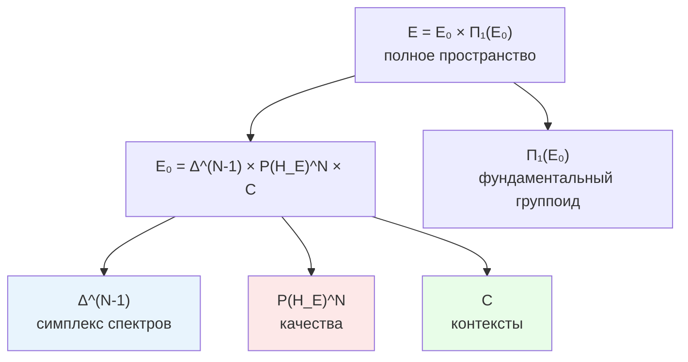

# Категория Exp

В этой главе мы построим математическое пространство, в котором «живёт» всякий возможный опыт — категорию $\mathbf{Exp}$. Читатель узнает, из чего состоит точка опыта, что значит «преобразование опыта», какая метрика измеряет расстояние между переживаниями, и почему это пространство устроено принципиально иначе, чем привычные математические структуры (оно не является топосом, но обладает богатой расслоенной геометрией).

:::info DRY: Мастер-определение
Полная спецификация категории Exp, включая топосную структуру и метрическое обогащение — в [Категорном формализме](/docs/proofs/categorical/categorical-formalism#2-категория-exp).
:::

:::info Совместимость с Ω⁷
В документации УГМ часто встречается требование «совместимости с Ω⁷». Формально это означает следующее. Пусть $\mathbf{Sh}_\infty(\mathcal{C})$ — ∞-топос пучков на единой категории $\mathcal{C}$, а $\Omega$ — его классификатор подобъектов с атомарными подобъектами $S_k$ ($k = 1, \ldots, 7$) и характеристическими морфизмами $\chi_{S_k}: 1 \to \Omega$. CPTP-канал $\Phi$ называется **Ω⁷-совместимым**, если индуцированный им функтор коммутирует с характеристическими морфизмами:

$$
F(\Phi) \circ \chi_{S_k} = \chi_{S_k} \circ F(\Phi) \quad \forall\, k = 1, \ldots, 7
$$

Это гарантирует, что логическая структура голонома (какие подобъекты «истинны» и «ложны») сохраняется при физическом преобразовании. Совместимость с Ω⁷ — необходимое условие для того, чтобы морфизмы $\mathbf{Exp}$ были корректно определены через [функтор $F$](/docs/core/categories/functor-f).
:::

---

## Предтеча: зачем отдельная категория для опыта

### Пространство всех возможных переживаний

Представьте себе карту. Каждая точка на карте — это одно конкретное переживание: определённая боль, определённая радость, определённый оттенок красного в сочетании с запахом кофе. Вся карта целиком — это множество *всех* возможных переживаний.

Но карта — это больше, чем набор точек. На ней есть:
- **Расстояния**: некоторые переживания «ближе» друг к другу (светло-красный и тёмно-красный), другие — «далеко» (красный и звук трубы)
- **Пути**: одно переживание может плавно перейти в другое (рассвет — постепенное изменение оттенка неба)
- **Структура**: некоторые аспекты переживаний меняются независимо от других

Категория $\mathbf{Exp}$ — это математическая формализация такой «карты опыта». Её объекты — точки опыта, морфизмы — допустимые переходы между ними, а дополнительные структуры (метрика, расслоение) описывают геометрию пространства переживаний.

### Зачем отдельная категория

Нельзя ли просто работать с $\mathbf{DensityMat}$ — категорией матриц плотности? Нет, и вот почему:

1. **Разные матрицы — один опыт.** Две матрицы $\rho_1 \neq \rho_2$ могут давать одинаковое переживание, если они различаются только в компонентах, не связанных с [Интериорностью](/docs/core/structure/dimension-e). Функтор $F$ «склеивает» такие матрицы в одну точку опыта.

2. **Другая геометрия.** Расстояние между переживаниями — не то же самое, что расстояние между матрицами плотности. Метрика на $\mathbf{Exp}$ — это факторметрика от [метрики Бюрес](/docs/proofs/categorical/categorical-formalism), учитывающая только «опытно значимые» различия.

3. **Собственная структура.** Пространство опыта имеет расслоенную структуру (интенсивности, качества, контекст — разные «слои»), которая не видна в $\mathbf{DensityMat}$.

---

## Определение

**Определение (Экспериенциальное пространство).** Базовое экспериенциальное пространство (объекты категории $\mathbf{Exp}$):

$$
\mathcal{E}_0 := \Delta^{N-1} \times_{\text{Spec}} \mathbb{P}(\mathcal{H}_E)^N \times \mathcal{C}
$$

Полное экспериенциальное пространство (с эмерджентной историей):

$$
\mathcal{E} := \mathcal{E}_0 \times \Pi_1(\mathcal{E}_0)
$$

Разберём каждый компонент.

### Симплекс $\Delta^{N-1}$: пирог из интенсивностей

$$
\Delta^{N-1} = \{(\lambda_1, \ldots, \lambda_N) : \lambda_i \geq 0, \; \sum_{i=1}^N \lambda_i = 1\}
$$

Это $(N-1)$-мерный **симплекс** — обобщение треугольника на произвольное число измерений. Для УГМ $N = 7$ (размерность [гильбертова пространства](/docs/core/structure/holon) Голонома), поэтому $\Delta^6$ — шестимерный симплекс.

**Аналогия с пирогом.** Представьте пирог, разрезанный на $N$ кусков. Каждый кусок — доля определённого качества в общем опыте. Вместе куски составляют целый пирог ($\sum \lambda_i = 1$), каждый кусок неотрицателен ($\lambda_i \geq 0$). Если один кусок занимает весь пирог ($\lambda_1 = 1$, остальные $= 0$), опыт «чистый» — одно качество. Если куски равны ($\lambda_i = 1/N$ для всех $i$), опыт максимально «смешанный» — все качества одинаково интенсивны.

**Геометрия симплекса.** $\Delta^{N-1}$ — компактное выпуклое множество. Его вершины — чистые состояния $(1, 0, \ldots, 0)$, $(0, 1, \ldots, 0)$, ..., $(0, \ldots, 0, 1)$. Центр — максимально смешанное состояние $(1/N, \ldots, 1/N)$. Естественная метрика на $\Delta^{N-1}$ — **метрика Фишера** (информационная метрика), которая наследуется от метрики Бюрес на диагональных матрицах (см. [каноническую метрику](#каноническая-метрика) ниже).

### Проективное пространство $\mathbb{P}(\mathcal{H}_E)^N$: пространство качеств

$$
\mathbb{P}(\mathcal{H}_E) = \mathbb{CP}^{\dim(\mathcal{H}_E) - 1}
$$

Это комплексное проективное пространство — пространство всех «направлений» в [гильбертовом пространстве Интериорности](/docs/core/structure/dimension-e). Каждая точка $\mathbb{P}(\mathcal{H}_E)$ — одно «чистое качество» опыта.

**Почему проективное?** Вектор $|\psi\rangle$ и $c|\psi\rangle$ (для любого $c \in \mathbb{C}^*$) описывают одно и то же качество — их нельзя различить изнутри опыта. Проективное пространство — это именно множество классов эквивалентности $[|\psi\rangle] = \{c|\psi\rangle : c \neq 0\}$.

**Аналогия с цветовым кругом.** Проективное пространство — это обобщённый «цветовой круг» для опыта. Каждая точка — определённый «оттенок» переживания. Расстояние между точками (метрика Фубини–Штуди) показывает, насколько два качества различаются. Ортогональные векторы ($\langle\psi|\phi\rangle = 0$) дают максимально различные качества — как красный и зелёный.

Запись $\mathbb{P}(\mathcal{H}_E)^N$ означает: каждому из $N$ собственных значений спектра $\lambda_i$ соответствует своё качество $[|\psi_i\rangle]$. Это $N$-кратное произведение проективного пространства.

:::note Расслоённое произведение $\times_{\text{Spec}}$
Запись $\Delta^{N-1} \times_{\text{Spec}} \mathbb{P}(\mathcal{H}_E)^N$ — **расслоённое произведение** над спектром, а не просто декартово. Это означает, что компоненты $\lambda_i$ и $[|\psi_i\rangle]$ связаны: $i$-му собственному значению $\lambda_i$ соответствует $i$-е качество $[|\psi_i\rangle]$. При вырождении спектра ($\lambda_i = \lambda_j$) соответствующие качества определены лишь с точностью до поворота в собственном подпространстве — это обобщается через [грассманиан](/docs/proofs/categorical/categorical-formalism#33-проблема-вырождения-спектра).
:::

### Пространство контекстов $\mathcal{C}$: не-E сектор матрицы плотности {#пространство-контекстов}

Пространство контекстов $\mathcal{C}$ — это **главная подматрица** матрицы плотности $\Gamma$, полученная удалением E-строки и E-столбца:

$$
\mathcal{C} := \{(\gamma_{ij})_{i,j \in \{A,S,D,L,O,U\}}\} \subset \mathcal{D}(\mathbb{C}^6)
$$

Формально: если $\Pi_{\neg E}: \mathbb{C}^7 \to \mathbb{C}^6$ — проектор, удаляющий E-компоненту, то $\mathcal{C} = \Pi_{\neg E}\, \mathcal{D}(\mathbb{C}^7)\, \Pi_{\neg E}^\dagger$ — множество $6 \times 6$ положительных полуопределённых матриц с $\mathrm{tr}\, c \leq 1$ (равенство достигается при $\gamma_{EE} = 0$). Пространство $\mathcal{C}$ включает как диагональные элементы $\gamma_{kk}$ (населённости секторов A, S, D, L, O, U), так и внедиагональные $\gamma_{ij}$ (когерентности между ними).

Контекст — это «декорации сцены», на которой разыгрывается опыт. Состояния [Артикуляции](/docs/core/structure/dimension-a), [Структуры](/docs/core/structure/dimension-s), [Динамики](/docs/core/structure/dimension-d), [Логики](/docs/core/structure/dimension-l), [Основания](/docs/core/structure/dimension-o), [Единства](/docs/core/structure/dimension-u) задают условия, в которых существует переживание, но сами не являются его «содержимым».

**Аналогия.** Один и тот же аккорд до-мажор звучит иначе на фортепиано и на гитаре. Спектр (интенсивности обертонов) и качества (тембровые характеристики) — про звук. Контекст (инструмент, помещение, настроение слушателя) — про всё остальное.

:::warning Исправление: метрика на C — не дискретная
В ранних версиях документа утверждалось, что контекст наделён **дискретной метрикой** ($d = 0$ или $d = \infty$). Это упрощение некорректно: элементы $\gamma_{ij}$ изменяются непрерывно, и $\mathcal{C}$ — подмножество $\mathcal{D}(\mathbb{C}^6)$, а не дискретное множество. В каноническом построении метрика на $\mathcal{C}$ **индуцирована** метрикой Бюрес на $\mathcal{D}(\mathbb{C}^7)$, ограниченной на $\{A,S,D,L,O,U\}$-сектор:

$$
d_{\mathcal{C}}(c_1, c_2) := d_B\!\big(\Pi_{\neg E}\,\rho_1\,\Pi_{\neg E}^\dagger,\; \Pi_{\neg E}\,\rho_2\,\Pi_{\neg E}^\dagger\big)
$$

Эта метрика непрерывна и наследует монотонность метрики Бюрес (теорема Ченцова–Петца).
:::

---

## Полное экспериенциальное пространство: история как эмерджентная структура

$$
\mathcal{E} = \mathcal{E}_0 \times \Pi_1(\mathcal{E}_0)
$$

где $\Pi_1(\mathcal{E}_0)$ — **фундаментальный группоид** пространства $\mathcal{E}_0$.

### Что такое фундаментальный группоид

Фундаментальный группоид $\Pi_1(X)$ пространства $X$ — это категория, объекты которой — точки $X$, а морфизмы — классы гомотопически эквивалентных путей между точками. Проще говоря, это «память обо всех возможных путешествиях» по пространству $X$.

**Аналогия.** Если $\mathcal{E}_0$ — это город (множество мест), то $\Pi_1(\mathcal{E}_0)$ — это сеть всех маршрутов между местами, где два маршрута считаются одинаковыми, если один можно плавно деформировать в другой (не разрывая). Маршрут из дома на работу через парк и через магазин — разные маршруты (если парк и магазин нельзя обойти один вокруг другого).

### Зачем история в определении опыта

:::warning Уточнение: история как эмерджентная структура
В каноническом определении **история не входит в объекты** категории Exp как примитив. Она **выводится** из 2-категорной структуры $\mathbf{Exp}_2$ и ∞-группоида $\mathbf{Exp}_\infty$ (раздел [§10](/docs/proofs/categorical/categorical-formalism#10-infty-группоид-и-infty-топос-для-эмерджентного-времени) категорного формализма). Включение $\Pi_1(\mathcal{E}_0)$ в $\mathcal{E}$ — это способ зафиксировать результат этого вывода в формуле.
:::

Содержательно: опыт включает не только «что сейчас переживается», но и «откуда это переживание пришло». Одна и та же мгновенная боль переживается по-разному в зависимости от того, усиливалась она или ослабевала. Фундаментальный группоид кодирует эту «историю пути» в пространстве опыта.

Это глубоко связано с [эмерджентным временем](/docs/core/operators/emergent-time): время в УГМ не постулируется, а выводится из структуры путей в $\mathbf{Exp}$.

---

## Морфизмы

Морфизмы $\mathbf{Exp}$ — тройки преобразований:

$$
(f, g, h): \mathcal{E}_1 \to \mathcal{E}_2
$$

где $f$ — преобразование спектров, $g$ — качеств, $h$ — контекстов.

### Три варианта определения морфизмов

В [Категорном формализме](/docs/proofs/categorical/categorical-formalism#22-морфизмы-в-категории-exp) рассмотрены три варианта определения морфизмов:

| Вариант | Определение | Характер |
|---------|-------------|----------|
| **A** (пути) | Непрерывные пути в $\mathcal{E}$ | Самый общий, но не все пути физически реализуемы |
| **B** (покомпонентный) | Четвёрка $(f_\lambda, f_q, f_c, f_h)$ | Удобен для вычислений |
| **C** (индуцированный) | $\mathrm{Mor}_\mathcal{E}^{\mathrm{ind}} := \mathrm{Im}(F)$ | Каноническое определение |

Каноническим принят **Вариант C**: морфизмы $\mathbf{Exp}$ — это в точности образы CPTP-каналов под действием [функтора $F$](/docs/core/categories/functor-f). Это означает, что каждое «допустимое преобразование опыта» реализуется физическим процессом.

**Интуиция:** Морфизм в $\mathbf{Exp}$ — это «переход между переживаниями». Но не всякий мыслимый переход допустим: нельзя мгновенно переключиться из глубокого сна в экстатическую радость без промежуточного физического процесса. Вариант C фиксирует: допустимы ровно те переходы, которые порождаются CPTP-каналами.

### Композиция и тождества

Композиция морфизмов определяется через композицию в $\mathbf{DensityMat}$:

$$
F(\Psi) \circ F(\Phi) := F(\Psi \circ \Phi)
$$

Тождественный морфизм:

$$
\mathrm{id}_{\mathcal{Q}} := F(\mathrm{id}_\rho), \quad \text{где } F(\rho) = \mathcal{Q}
$$

Ассоциативность и аксиомы тождеств наследуются от $\mathbf{DensityMat}$ через функториальность $F$.

### Почему Вариант C не является порочным кругом

На первый взгляд, определение $\mathrm{Mor}_\mathcal{E}^{\mathrm{ind}} := \mathrm{Im}(F)$ может показаться цикличным: мы определяем морфизмы $\mathbf{Exp}$ через функтор $F$, который сам отображает в $\mathbf{Exp}$. Однако это **конструктивное определение**, а не характеризация. Мы явно задаём множество морфизмов как образ известного отображения — это стандартная и корректная математическая конструкция (аналогично тому, как подгруппа определяется как образ гомоморфизма).

Нетривиальное содержание Варианта C — не в том, что $F$ сюръективен на морфизмах (это верно по построению), а в том, что **образ $\mathrm{Im}(F)$ обладает богатой геометрической структурой**: расслоением над $\Delta^{N-1}$, канонической метрикой без свободных параметров, ∞-группоидным расширением. Именно эти свойства составляют содержательные теоремы.

Вариант A (пути в $\mathcal{E}$) при этом служит **независимой характеризацией**, которая совпадает с Вариантом C при подходящей топологии. Совпадение двух определений — отдельная нетривиальная теорема, подтверждающая согласованность конструкции.

---

## Ключевые свойства

### Не-топосная природа

- **Exp не является топосом** — не имеет классификатора подобъектов ([§6](/docs/proofs/categorical/categorical-formalism#6-топосная-структура))

Что это значит и почему это важно?

**Топос** — это категория, обладающая очень богатой логической структурой: в ней можно определить «истину», «ложь», «и», «или», импликацию — полноценную внутреннюю логику. Классический пример — категория множеств $\mathbf{Set}$, где классификатор подобъектов — это двухэлементное множество $\{0, 1\}$ (истина/ложь).

Категория $\mathbf{Exp}$ **не является топосом**, потому что в пространстве опыта нет естественного понятия «подобъект» с бинарным классификатором. Опыт не бывает «полностью присутствующим или полностью отсутствующим» — он всегда имеет степень интенсивности ($\lambda_i \in [0, 1]$). Это — математическое выражение того, что сознание не дискретно (вкл/выкл), а градуировано.

:::info Топосная структура ∞-категории
Хотя $\mathbf{Exp}$ — не топос, расширенная категория $\mathbf{Exp}_\infty$ (∞-группоид) вкладывается в ∞-топос $\mathbf{Sh}_\infty(\mathcal{C})$ — категорию ∞-пучков на единой категории $\mathcal{C}$. Именно $\mathcal{C}$ (а не $\mathbf{Exp}$) является [истинным примитивом](/docs/proofs/categorical/categorical-formalism#infty-топос-как-истинный-примитив) УГМ-теории.
:::

### Расслоенная структура

**Exp — расслоение (fibration) над $\Delta^{N-1}$**

Что такое расслоение? Представьте себе стопку листов бумаги, где каждый лист лежит горизонтально, а вся стопка стоит вертикально. «База» — это вертикальная ось (нумерация листов), а «слой» — горизонтальный лист. Расслоение — это пространство, которое «локально» выглядит как произведение базы на слой, но «глобально» может быть закручено (как лента Мёбиуса).

В нашем случае:
- **База**: $\Delta^{N-1}$ — симплекс спектров (интенсивностей)
- **Слой над точкой $\vec{\lambda} \in \Delta^{N-1}$**: $\mathbb{P}(\mathcal{H}_E)^N \times \mathcal{C}$ — пространство качеств и контекстов при фиксированном спектре

Это означает: зафиксировав интенсивности ($\vec{\lambda}$), мы получаем «лист» — пространство всех возможных качественных содержаний при данной палитре интенсивностей. Варьируя $\vec{\lambda}$, мы перемещаемся между «листами».

**Физический смысл:** Расслоенная структура отражает асимметрию между «сколько» (интенсивности) и «что» (качества). Изменение интенсивностей — это изменение «громкости» опыта, которое затрагивает все качества одновременно. Изменение качеств при фиксированном спектре — это изменение «содержания» опыта без изменения его «структуры».

### Метрическое обогащение

$\mathbf{Exp}$ наделена метрикой, индуцированной из $\mathbf{DensityMat}$ через функтор $F$. Подробности — в следующем разделе.

### ∞-расширение

$\mathbf{Exp}_\infty$ — ∞-группоид, содержащий не только точки и пути, но и «пути между путями» (гомотопии), «пути между путями между путями» и т.д. Это расширение связано с [эмерджентным временем](/docs/core/operators/emergent-time) — более высокие гомотопии кодируют более тонкие временные структуры.

---

## Каноническая метрика на Exp [Т] {#каноническая-метрика}

:::tip Теорема (Индуцированная метрика без свободных параметров) [Т]
Функтор $F: \mathbf{DensityMat} \to \mathbf{Exp}$ индуцирует **каноническую** метрику на $\mathcal{E}$ через факторизацию по слоям:

$$d_{\mathcal{E}}(e_1, e_2) := \inf\{d_B(\rho_1, \rho_2) : F(\rho_1) = e_1, F(\rho_2) = e_2\}$$

Эта метрика **не содержит свободных параметров**.
:::

### Интуитивное объяснение

Расстояние между двумя переживаниями $e_1$ и $e_2$ — это **минимальное физическое расстояние** между матрицами плотности, которые порождают эти переживания. Из всех пар $(\rho_1, \rho_2)$ с $F(\rho_1) = e_1$, $F(\rho_2) = e_2$ мы выбираем пару с наименьшим расстоянием Бюрес $d_B$.

**Аналогия.** Два города на карте могут быть связаны многими дорогами. Расстояние между городами — это длина *кратчайшей* дороги. Аналогично, два переживания могут «порождаться» многими парами матриц плотности, и расстояние между переживаниями — это кратчайшее расстояние между порождающими матрицами.

### Доказательство

**(a) Корректность определения.** $F$ сюръективен на объектах (по построению). Слои $F^{-1}(e) \subseteq \mathcal{D}(\mathbb{C}^7)$ — замкнутые подмножества компактного множества, поэтому инфимум достигается.

**(b) Метрические свойства.** Неотрицательность и симметрия — очевидны. Неравенство треугольника: для любых $e_1, e_2, e_3$ и $\varepsilon > 0$ существуют $\rho_i \in F^{-1}(e_i)$ с $d_B(\rho_1, \rho_2) < d_{\mathcal{E}}(e_1, e_2) + \varepsilon$ и $d_B(\rho_2, \rho_3) < d_{\mathcal{E}}(e_2, e_3) + \varepsilon$, откуда $d_{\mathcal{E}}(e_1, e_3) \leq d_B(\rho_1, \rho_3) \leq d_B(\rho_1, \rho_2) + d_B(\rho_2, \rho_3) < d_{\mathcal{E}}(e_1, e_2) + d_{\mathcal{E}}(e_2, e_3) + 2\varepsilon$.

**(c) Невырожденность.** $d_{\mathcal{E}}(e_1, e_2) = 0 \iff \exists\, \rho_1, \rho_2$ с $d_B(\rho_1, \rho_2) = 0 \iff \rho_1 = \rho_2 \iff F(\rho_1) = F(\rho_2) \iff e_1 = e_2$.

**(d) Каноничность.** Метрика Бюрес $d_B$ — **единственная** (с точностью до масштаба) монотонная риманова метрика на $\mathcal{D}(\mathcal{H})$ по теореме Ченцова–Петца [Т]. Функтор $F$ каноничен (G₂-ригидность, T-42a [Т]). Следовательно, $d_{\mathcal{E}}$ — каноническая факторметрика, определённая **без свободных параметров**.

**(e) Покомпонентная декомпозиция.** На $\mathcal{E} = \Delta^{N-1} \times_{\text{Spec}} \mathbb{P}(\mathcal{H}_E)^N \times \mathcal{C}$ индуцированная метрика раскладывается:
- На $\Delta^{N-1}$ (спектры): **метрика Фишера** — индуцирована Бюрес на диагональных матрицах
- На $\mathbb{P}(\mathcal{H}_E)$ (качества): **метрика Фубини–Штуди** — индуцирована Бюрес на собственных подпространствах
- На $\mathcal{C}$ (контекст): **индуцированная метрика Бюрес** — ограничение на $\{A,S,D,L,O,U\}$-сектор (см. [§ выше](#пространство-контекстов))

Все три компоненты — **стандартные канонические метрики**, не свободные параметры. $\blacksquare$

### Что означает покомпонентная декомпозиция

Метрика Фишера на симплексе $\Delta^{N-1}$ хорошо известна в статистике — это **информационная метрика**, измеряющая статистическую различимость двух распределений. Для спектров $\vec{\lambda}$ и $\vec{\lambda}'$:

$$
ds^2_{\text{Fisher}} = \sum_{i=1}^N \frac{d\lambda_i^2}{4\lambda_i}
$$

Метрика Фубини–Штуди на $\mathbb{P}(\mathcal{H}_E)$ — стандартная метрика проективного пространства, определённая через скалярное произведение:

$$
d_{FS}([|\psi\rangle], [|\phi\rangle]) = \arccos |\langle\psi|\phi\rangle|
$$

Обе метрики каноничны (единственны с точностью до масштаба) и не содержат подгоночных параметров.

:::warning Связь с предыдущими обозначениями
Если в документации встречаются параметры $\alpha, \beta, \gamma$ в метрике опыта, они теперь интерпретируются как **весовые коэффициенты**, задающие относительный масштаб компонент Fisher/Fubini-Study/Бюрес-контекст. По теореме выше, при использовании факторметрики от Бюрес эти веса **фиксированы**: $\alpha = \beta = \gamma = 1$. Свободные параметры отсутствуют.
:::

### Формальная структура морфизмов

Разберём каждый компонент тройки $(f, g, h)$ подробнее.

**Компонент $f$: преобразование спектра.** Отображение $f: \Delta^{N-1} \to \Delta^{N-1}$ переводит одно вероятностное распределение в другое. Это **стохастическое отображение** — оно сохраняет нормировку ($\sum \lambda'_i = 1$) и неотрицательность ($\lambda'_i \geq 0$). Интуитивно: $f$ перераспределяет «громкость» между аспектами опыта, не нарушая условия «целого пирога».

**Компонент $g$: преобразование качеств.** Отображение $g: \mathbb{P}(\mathcal{H}_E)^N \to \mathbb{P}(\mathcal{H}_E)^N$ поворачивает собственные векторы в проективном пространстве. Это меняет «цвета» опыта: красный может стать оранжевым, боль — дискомфортом. Расстояние между старыми и новыми качествами измеряется метрикой Фубини–Штуди.

**Компонент $h$: преобразование контекста.** Отображение $h: \mathcal{C} \to \mathcal{C}$ меняет «декорации сцены» — состояния измерений A, S, D, L, O, U. Поскольку $\mathcal{C} \subset \mathcal{D}(\mathbb{C}^6)$ наделено индуцированной метрикой Бюрес, $h$ — непрерывное отображение, согласованное с CPTP-каналом $\Phi$.

:::note Согласованность компонентов
Три компонента $(f, g, h)$ не независимы: они связаны через CPTP-канал $\Phi$, образом которого является морфизм. Нельзя произвольно менять спектр, не затрагивая качества — физический процесс $\Phi$ меняет матрицу плотности целиком, и все три компонента определяются совместно.
:::

---

## Конкретный пример: точка в Exp

Для голонома с $N = 7$ рассмотрим конкретную точку опыта $\mathcal{Q} \in \mathbf{Exp}$:

$$
\mathcal{Q} = \big(\underbrace{(0.5, 0.2, 0.15, 0.08, 0.04, 0.02, 0.01)}_{\vec{\lambda} \in \Delta^6}, \; \underbrace{([|\psi_1\rangle], \ldots, [|\psi_7\rangle])}_{\vec{q} \in \mathbb{P}(\mathcal{H}_E)^7}, \; \underbrace{c}_{\in \mathcal{C}}\big)
$$

- **Спектр $\vec{\lambda}$:** Доминирует первое качество ($\lambda_1 = 0.5$, половина «пирога»). Два следующих заметны ($0.2$ и $0.15$). Остальные — на периферии. Чистота: $P = \sum \lambda_i^2 = 0.33 > 2/7$ — порог пройден.
- **Качества $\vec{q}$:** Семь различных «цветов опыта», каждый — точка в $\mathbb{CP}^{n-1}$. Первое качество $[|\psi_1\rangle]$ — самое яркое.
- **Контекст $c$:** Фиксированные состояния A, S, D, L, O, U — «декорации сцены».

---

## Диаграмма: структура Exp

Базовое пространство $\mathcal{E}_0$ состоит из трёх компонентов: симплекс спектров (голубой) задаёт «громкость», проективное пространство (розовый) задаёт «цвет», пространство контекстов (зелёный) задаёт «сцену». Полное пространство $\mathcal{E}$ добавляет историю через фундаментальный группоид.

---

## Резюме главы

В этой главе мы построили категорию $\mathbf{Exp}$ — математическое пространство всех возможных переживаний. Ключевые результаты:

| Структура | Описание | Математика |
|-----------|----------|------------|
| Объекты | Точки опыта | $(\vec{s}, \vec{q}, c) \in \Delta^{N-1} \times_{\text{Spec}} \mathbb{P}(\mathcal{H}_E)^N \times \mathcal{C}$ |
| Морфизмы | Допустимые переходы | Тройки $(f, g, h)$, индуцированные CPTP-каналами |
| Метрика | Расстояние между переживаниями | Факторметрика от Бюрес, без свободных параметров **[Т]** |
| Расслоение | «Громкость» vs «содержание» | Расслоение над $\Delta^{N-1}$ |
| Не топос | Нет бинарного классификатора | Опыт градуирован, а не дискретен |
| ∞-расширение | Эмерджентное время | $\mathbf{Exp}_\infty$ — ∞-группоид |

Категория $\mathbf{Exp}$ — не произвольная конструкция. Она однозначно определяется [функтором $F$](/docs/core/categories/functor-f) и G₂-ригидностью ([T-42a](/docs/proofs/categorical/uniqueness-theorem) **[Т]**). Её метрика каноническая (теорема Ченцова–Петца), расслоенная структура отражает фундаментальную асимметрию между «сколько» и «что» в опыте, а ∞-расширение связывает опыт с [эмерджентным временем](/docs/core/operators/emergent-time).

---

## Связи

- **Отображается из:** [DensityMat](/docs/core/categories/category-hol) через [функтор F](/docs/core/categories/functor-f)
- **Связана с:** [Иерархия интериорности](/docs/proofs/consciousness/interiority-hierarchy) — уровни L0-L4 определяются в Exp
- **∞-расширение:** [Эмерджентное время](/docs/core/operators/emergent-time) — ∞-группоид $\mathbf{Exp}_\infty$
- **Измерение E:** [Интериорность](/docs/core/structure/dimension-e) — источник проективного пространства качеств
- **Полная спецификация:** [Категорный формализм §2](/docs/proofs/categorical/categorical-formalism#2-категория-exp)
