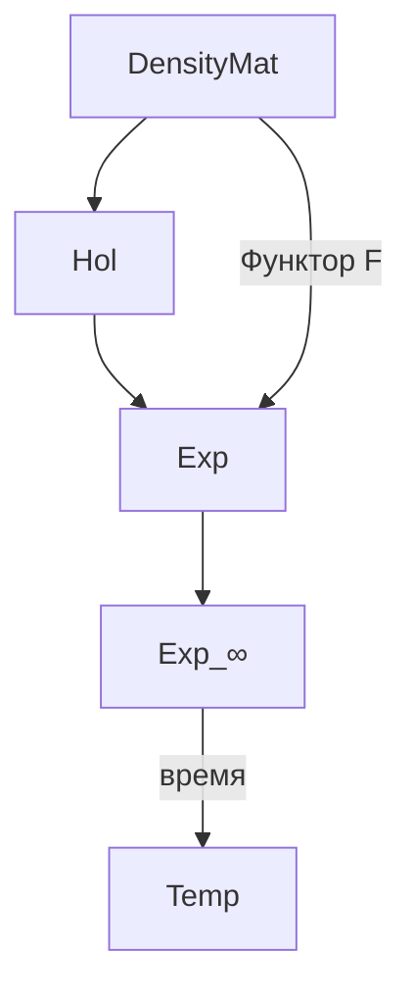

# Категория Голономов Hol

:::info DRY: Мастер-определение
Полная спецификация категории DensityMat и категории Голономов Hol — в [Категорном формализме](/docs/proofs/categorical/categorical-formalism#категория-голономов-hol).
:::

## Категория DensityMat

**Определение (Категория DensityMat).** Категория матриц плотности $\mathbf{DensityMat}$:

**Объекты:**
$$
\mathrm{Ob}(\mathbf{DensityMat}) = \{\rho \in \mathcal{L}(\mathcal{H}) : \rho^\dagger = \rho, \, \rho \geq 0, \, \mathrm{Tr}(\rho) = 1\}
$$

**Морфизмы:** CPTP-каналы $\Phi: \rho_1 \to \rho_2$

$$
\mathrm{Mor}_{\mathbf{DM}}(\rho_1, \rho_2) = \{\Phi : \mathcal{L}(\mathcal{H}) \to \mathcal{L}(\mathcal{H}) \mid \Phi \text{ — CPTP}, \, \Phi(\rho_1) = \rho_2\}
$$

## Категория Голономов

**Определение (Hol).** Категория Голономов $\mathbf{Hol}$ — подкатегория $\mathbf{DensityMat}$:

**Объекты:** [Голономы](/docs/core/structure/holon) — матрицы когерентности $\Gamma \in \mathcal{D}(\mathbb{C}^7)$

**Морфизмы:** CPTP-каналы, сохраняющие 7-мерную структуру:
$$
\mathrm{Mor}_{\mathbf{Hol}}(\Gamma_1, \Gamma_2) = \{\Phi \in \mathrm{Mor}_{\mathbf{DM}} : \Phi \text{ совместим с } \Omega^7\}
$$

## Иерархия категорий

| Категория | Объекты | Морфизмы |
|-----------|---------|----------|
| **DensityMat** | $\rho \in \mathcal{D}(\mathcal{H})$ | CPTP-каналы |
| **Hol** | $\Gamma \in \mathcal{D}(\mathbb{C}^7)$ | Ω⁷-совместимые CPTP |
| **Exp** | $(s, q, c) \in \mathcal{E}$ | Тройки преобразований |
| **Exp_∞** | ∞-группоид | Пути + гомотопии |

## Связи

- **Функтор F:** $\mathbf{DensityMat} \to \mathbf{Exp}$ — [определение](/docs/core/categories/functor-f)
- **CPTP-каналы:** через [представление Крауса](/docs/proofs/categorical/categorical-formalism#12-структура-морфизмов-cptp-каналы)
- **Производные категории:** IC-когомологии ([§13](/docs/proofs/categorical/categorical-formalism#производные-категории))
- **Полная спецификация:** [Категорный формализм](/docs/proofs/categorical/categorical-formalism)
