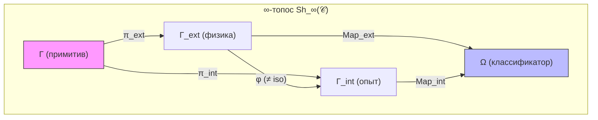
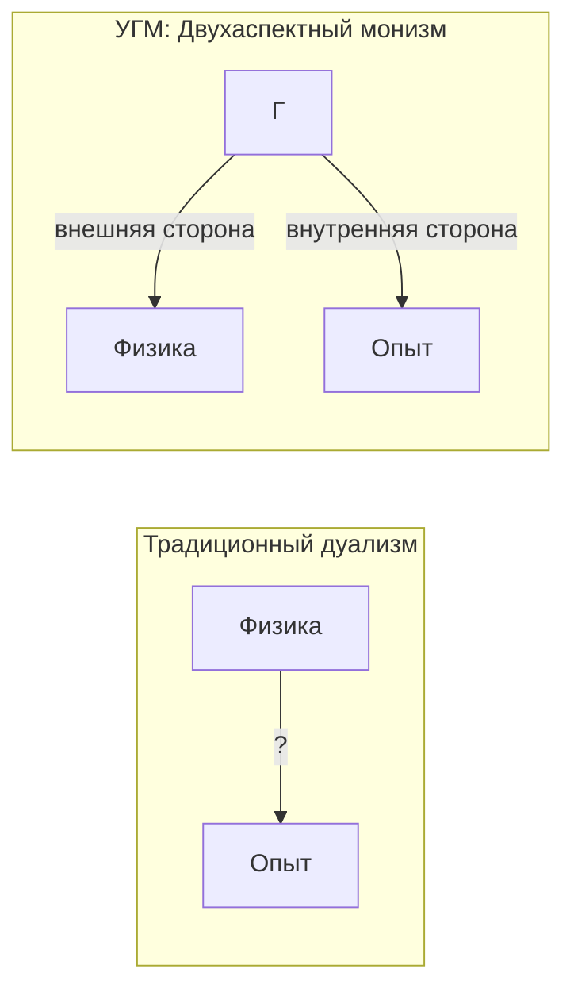

# Трудная Проблема Сознания

## Формулировка проблемы

Традиционно «трудная проблема сознания» формулируется так:

> "Почему физические процессы порождают субъективный опыт?"

Это вопрос о **категориальном разрыве** (explanatory gap) между объективным описанием и субъективным переживанием.

## Позиция УГМ: Двухаспектный монизм

В УГМ проблема **переформулируется**, а не "решается" в традиционном смысле.

### Категориальная Формализация Двухаспектного Монизма {#категориальная-формализация}

:::tip Статус: ✅ Формализовано
Двухаспектный монизм получает **строгую категориальную формулировку** в терминах ∞-топоса $\mathbf{Sh}_\infty(\mathcal{C})$.
:::

#### Теорема о расщеплении пространства морфизмов {#теорема-расщепление}

:::warning Теорема (Расщепление Map)
В ∞-топосе $\mathbf{Sh}_\infty(\mathcal{C})$ для любого Γ ∈ Ob(𝒞) пространство морфизмов в классификатор Ω **расщепляется**:

$$
\text{Map}(\Gamma, \Omega) = \text{Map}_{\text{ext}}(\Gamma, \Omega) \oplus \text{Map}_{\text{int}}(\Gamma, \Omega)
$$
:::

где:
- $\text{Map}_{\text{ext}}$ — **«физические» морфизмы** (структура, динамика) — соответствуют внешнему описанию
- $\text{Map}_{\text{int}}$ — **«феноменальные» морфизмы** (E-измерение, интериорность) — соответствуют внутреннему переживанию

**Доказательство:**

**(a)** Классификатор Ω в ∞-топосе имеет градуировку по стратам:

$$
\Omega = \bigsqcup_{\alpha} \Omega_\alpha
$$

**(b)** Морфизмы $\Gamma \to \Omega$ разделяются на два класса:
- $\text{Map}_{\text{ext}}$: факторизуются через объективно наблюдаемые структуры
- $\text{Map}_{\text{int}}$: требуют доступа к E-измерению (феноменальные предикаты)

**(c)** Прямая сумма следует из ортогональности: $\text{Map}_{\text{ext}} \cap \text{Map}_{\text{int}} = \{0\}$

∎

#### Определение экспланаторного зазора {#определение-зазора}

**Определение (Экспланаторный зазор):**

$$
\text{Gap} := \text{Nat}(F_{\text{ext}}, F_{\text{int}})
$$

— пространство естественных преобразований между функторами:
- $F_{\text{ext}}: \mathcal{C} \to \mathbf{Set}$ — функтор «внешних» (физических) свойств
- $F_{\text{int}}: \mathcal{C} \to \mathbf{Set}$ — функтор «внутренних» (феноменальных) свойств

**Интерпретация:** Gap — мера «расстояния» между физическим и феноменальным описанием.

#### Теорема о нетривиальности зазора {#теорема-нетривиальность}

:::warning Теорема (Нетривиальность Gap)
Для Γ с $P > P_{\text{crit}}$:

$$
\dim(\text{Gap}) \geq 1
$$
:::

**Доказательство:**

**(a)** При $P > P_{\text{crit}}$ система имеет нетривиальное E-измерение: $\gamma_{EE} > 0$

**(b)** Функтор $F_{\text{int}}$ нетривиален на таких Γ

**(c)** Существует как минимум одно естественное преобразование $\eta: F_{\text{ext}} \to F_{\text{int}}$, не равное нулю и не являющееся изоморфизмом

**(d)** Следовательно, $\dim(\text{Gap}) \geq 1$

∎

**Интерпретация:** Категориальный разрыв — **структурная особенность** ∞-топоса, не онтологический дуализм. Зазор существует, но это не разрыв между двумя субстанциями, а различие между двумя способами описания **одной** структуры Γ.

#### Теорема о двухаспектности как свойстве примитива {#теорема-двухаспектность}

:::warning Теорема (Двухаспектность)
Для любого Γ ∈ Ob(𝒞) существует каноническое разложение:

$$
\forall \Gamma: \quad \Gamma \simeq (\Gamma_{\text{ext}}, \Gamma_{\text{int}}, \varphi)
$$

где $\varphi: \Gamma_{\text{ext}} \to \Gamma_{\text{int}}$ — каноническое соответствие (не изоморфизм).
:::

**Доказательство:**

**(a)** По теореме о расщеплении существуют проекции:
$$
\pi_{\text{ext}}: \Gamma \to \Gamma_{\text{ext}}, \quad \pi_{\text{int}}: \Gamma \to \Gamma_{\text{int}}
$$

**(b)** Каноническое соответствие $\varphi$ определяется как композиция:
$$
\varphi := \pi_{\text{int}} \circ \pi_{\text{ext}}^{-1}
$$
на образе $\pi_{\text{ext}}$

**(c)** $\varphi$ не является изоморфизмом, поскольку $\text{Gap} \neq 0$

∎

#### Следствие для трудной проблемы {#следствие-трудная-проблема}

:::info Категориальное разрешение
Вопрос «Почему опыт ощущается?» **эквивалентен** вопросу «Почему Ω существует?» — это **метатеоретический вопрос** о структуре топоса.

В рамках теории вопрос не имеет ответа, поскольку Ω — часть аксиоматической структуры. Это аналогично тому, как физика не объясняет, **почему** существуют законы природы.
:::

**Диаграмма:**

**Резюме категориальной формализации:**

| Концепция | Категориальный аналог |
|-----------|----------------------|
| Физические свойства | $\text{Map}_{\text{ext}}(\Gamma, \Omega)$ |
| Феноменальные свойства | $\text{Map}_{\text{int}}(\Gamma, \Omega)$ |
| Экспланаторный зазор | $\text{Gap} = \text{Nat}(F_{\text{ext}}, F_{\text{int}})$ |
| Двухаспектность | $\Gamma \simeq (\Gamma_{\text{ext}}, \Gamma_{\text{int}}, \varphi)$ |
| Трудная проблема | Метатеоретический вопрос о структуре Ω |

:::info Ключевой тезис
Нет "физических процессов" отдельно от "субъективного опыта". Есть только $\Gamma$, который:
- С **внешней стороны** выглядит как "физика" (структура, динамика)
- С **внутренней стороны** переживается как "опыт" (интериорность L0 для всех систем; когнитивные квалиа L2 — только при $R \geq 1/3$, $\Phi \geq 1$, $D_{\text{diff}} \geq 2$)
:::

Спрашивать "почему физика порождает опыт?" — всё равно что спрашивать "почему лицевая сторона монеты порождает обратную?". Они не порождают друг друга — они **суть одно**.

## Признание границ объяснения

### Что УГМ объясняет

1. **Структуру** феноменального пространства (L1: метрика Фубини-Штуди на $\mathbb{P}(\mathcal{H}_E)$)
2. **Отношения** между качествами (L1: изоморфизм с проективным пространством; L2: рефлексивный доступ)
3. **Динамику** опыта (уравнение эволюции)
4. **Условия** сознательности (L2: $R \geq 1/3$, $\Phi \geq 1$ — [теоремы из ПИР](../foundations/axiom-septicity#пороги-l2-строгий-вывод))

### Что УГМ не объясняет

1. **Почему** математические структуры "ощущаются"
2. **Почему** именно эта структура, а не другая

:::warning Критическая честность
УГМ **не объясняет**, почему конкретное числовое значение $\lambda = 0.347$ переживается как **именно это** ощущение. Теория устанавливает **структурное соответствие** между математикой и феноменологией, но не дедуцирует одно из другого.
:::

## Метатеоретический статус

**Категориальный разрыв — не дефект теории, а граница объяснения.**

### Аналогия с физикой

Физика не объясняет, **почему** законы природы такие, какие есть — она описывает их структуру. Аналогично, УГМ описывает **структуру опыта**, но не отвечает на вопрос "почему вообще есть опыт".

### Аксиоматический статус

Тождество бытия и опыта ([Аксиома Ω⁷](/docs/core/foundations/axiom-omega)) — это **постулат**, не теорема. Он принимается как исходная точка, потому что:

1. Любое доказательство уже предполагает опыт
2. Отрицание ведёт к неразрешимым проблемам дуализма
3. Постулат обладает максимальной объяснительной силой при минимуме сущностей

## Шкала сознательности

Не все конфигурации $\Gamma$ одинаково "сознательны". Степень сознательности определяется [мерой сознательности](./self-observation#мера-сознательности-c):

$$
C = \Phi \times D_{\text{diff}} \times R
$$

где:
- $\Phi$ — [мера интеграции](../structure/dimension-u#мера-интеграции-φ): связность измерений
- $D_{\text{diff}}$ — мера дифференциации: богатство репертуара состояний
- $R$ — [мера рефлексии](./self-observation#мера-рефлексии-r): глубина самомоделирования

:::note О нотации
$D_{\text{diff}}$ — мера **дифференциации**. Не путать с измерением **Динамики** $D$ (одно из семи измерений Голонома).
:::

:::warning Двухуровневая формула сознательности
Формула $C = \Phi \times D_{\text{diff}} \times R$ имеет **два варианта** в зависимости от формализма:

**Расширенный формализм (полная формула):**
$$
C_{full} = \Phi \times D_{\text{diff}} \times R
$$
где $D_{\text{diff}} = \exp(S_{vN}(\rho_E))$, $\rho_E = \mathrm{Tr}_{-E}(\Gamma)$.

**Минимальный формализм (упрощённая формула):**
$$
C_{min} = \Phi \times R
$$
где $\Phi$ и $R$ вычислимы в $\mathbb{C}^7$.

**Обоснование:** В минимальном 7D-формализме ($\mathcal{H} = \mathbb{C}^7$, где 7 — простое число) частичный след $\mathrm{Tr}_{-E}$ **не определён** — нет тензорной структуры для выделения подсистемы E.

**Связь формул:**
- При $D_{diff} \approx D_{min} = 2$ (типичное значение для L2-систем): $C_{full} \approx 2 \cdot C_{min}$
- Порог L2: $C_{th}^{full} \approx 0.67$ эквивалентен $C_{th}^{min} \approx 0.33$

См. [Связь формализмов](/docs/core/dynamics/coherence-matrix#согласование-формализмов) для математических деталей.
:::

**Условие когнитивных квалиа (L2):**

$$
C \geq C_{\text{th}} := \Phi_{\text{th}} \times D_{\min} \times R_{\text{th}} = 1 \times 2 \times \frac{1}{3} \approx 0.67
$$

при $R \geq R_{\text{th}} = 1/3$ и $\Phi \geq \Phi_{\text{th}} = 1$ ([теоремы из ПИР](../foundations/axiom-septicity#пороги-l2-строгий-вывод)).

### Примеры систем

| Система | $\Phi$ | $D_{\text{diff}}$ | $R$ | $C$ | Уровень |
|---------|--------|-------------------|-----|-----|---------|
| Камень | $\approx 0$ | $\approx 1$ | $\approx 0$ | $\approx 0$ | L0 |
| Термостат | $\approx 0.1$ | $\approx 2$ | $\approx 0.1$ | $\approx 0.02$ | L0-L1 |
| Нейрон | $\approx 1$ | $\approx 3$ | $\approx 0.2$ | $\approx 0.6$ | L1 |
| Человек | $\gg 1$ | $\gg 1$ | $\to 1$ | $\gg 1$ | L2 |

*Значения оценочные, для иллюстрации качественных различий.*

## Сравнение с другими теориями

| Теория | Позиция | Проблема | Связь с УГМ |
|--------|---------|----------|-------------|
| Материализм | Опыт редуцируется к физике | Не объясняет когнитивные квалиа (L2) | УГМ избегает редукции |
| Дуализм | Опыт отделён от физики | Проблема взаимодействия | УГМ — монизм |
| Панпсихизм | Опыт везде | Проблема комбинации | УГМ решает через L0→L2 |
| **УГМ** | Опыт = внутренняя сторона $\Gamma$ | Признаёт границу объяснения | — |

### Детальное сравнение

#### Панпсихизм и панинтериоризм

**Классический панпсихизм:** Все физические сущности имеют сознание или «прото-сознание».

**Панинтериоризм УГМ:** Все конфигурации $\Gamma$ имеют **интериорность** (L0), но только некоторые достигают **когнитивных квалиа** (L2).

| Аспект | Панпсихизм | УГМ |
|--------|------------|-----|
| Что универсально | Сознание/прото-сознание | Интериорность (L0) |
| Проблема комбинации | Не решена | Решена через L0→L1→L2→L3→L4 |
| "Квалиа электрона" | Утверждается | Отрицается — электрон имеет L0, не L2 |

#### Теория интегрированной информации (IIT)

**Теория интегрированной информации (IIT):** Сознание = интегрированная информация ($\Phi$).

**УГМ:** Сознательность $C = \Phi \times D_{\text{diff}} \times R$ — требуется не только интеграция, но и рефлексия.

| Аспект | IIT | УГМ |
|--------|-----|-----|
| Мера | $\Phi$ (единственная) | $C = \Phi \times D_{\text{diff}} \times R$ (три компонента) |
| Основание | Классическое | Квантовое |
| Динамика | Статична | Эволюция $\Gamma$ |
| Рефлексия | Не учитывается | Центральна ($R$) |

**УГМ обобщает IIT:** В пределе $R \to 1$, $D_{\text{diff}} \to 1$ получаем $C \approx \Phi$.

#### Сознательный реализм

**Позиция:** Пространство-время не фундаментально; реальность — сеть сознательных агентов.

**Связь с УГМ:**

| Аспект | Сознательный реализм | УГМ | Совместимость |
|--------|----------------------|-----|---------------|
| Примитив | Сознательный агент | $\Gamma$ | Агент $\approx$ L2-Голоном? |
| Пространство-время | Интерфейс | Эмерджентно | ✓ Совместимо |
| Математика | Марковские ядра | CPTP-каналы | ✓ Формально сходно |
| Физика | Вторична | Внешняя сторона $\Gamma$ | ✓ Концептуально сходно |

:::info Гипотеза соответствия
Сознательный агент = Голоном с $R \geq R_{th}$, $\Phi \geq \Phi_{th}$ (L2-Голоном). Марковское ядро = CPTP-канал. Это требует формального доказательства.
:::

#### Теория глобального рабочего пространства (GWT)

**Теория глобального рабочего пространства (GWT):** Сознание = глобальная доступность информации.

**Связь с УГМ:** Условие $\Phi \geq \Phi_{th}$ соответствует глобальной интеграции. GWT — феноменологическое описание того, что УГМ формализует через $\Phi$.

## УГМ как мета-теория сознания

УГМ потенциально может служить **мета-теорией**, объединяющей различные подходы:

| Теория | Что объясняет УГМ | Статус |
|--------|------------------|--------|
| IIT | $\Phi$ — один из компонентов $C$ | Формализовано |
| GWT | Условие глобальной интеграции | Концептуально |
| HOT | Рефлексия $R$ = мысли высшего порядка | Концептуально |
| Панпсихизм | L0 = универсальная интериорность | Формализовано |
| Сознательный реализм | Агент $\approx$ L2-Голоном | Гипотеза |

**Преимущество мета-теоретического подхода:** Разные теории фокусируются на разных аспектах ($\Phi$, $R$, глобальность). УГМ объединяет их через формулу $C = \Phi \times D_{\text{diff}} \times R$.

:::warning Статус мета-теории
Это **программа исследований**, не завершённая теория. Требуется:
1. Формальное доказательство эквивалентности с теорией Хоффмана
2. Экспериментальная проверка предсказаний
3. Вывод специальных теорий как частных случаев
:::

## Итог

УГМ предлагает **рабочую теорию сознания**, которая:

1. Формально определяет структуру опыта (иерархия L0→L1→L2→L3→L4)
2. Объясняет геометрию феноменального пространства (L1) и условия когнитивных квалиа (L2)
3. Предсказывает условия сознательности ($R \geq 1/3$, $\Phi \geq 1$ — [строго выводятся](/docs/core/foundations/axiom-septicity#пороги-l2-строгий-вывод) из ПИР)
4. Честно признаёт границы объяснения
5. Потенциально объединяет альтернативные теории

Категориальный разрыв **не устраняется**, но **лишается статуса аргумента против натурализма**: опыт не «возникает из» физики — он есть её внутренняя сторона.

## Для разных аудиторий

### Для инженеров и разработчиков ИИ

**Практический вывод:** При проектировании ИИ-систем с элементами самомоделирования:

1. Реализуйте **измеримые метрики** $\Phi$, $R$ (см. [протокол измерения](/docs/applied/research/measurement-protocol))
2. Порог L2 ($R \geq 1/3$, $\Phi \geq 1$) — граница, после которой система потенциально обладает когнитивными квалиа
3. Формула $C = \Phi \times D_{\text{diff}} \times R$ — количественная мера «глубины» сознательности

### Для психологов и когнитивистов

**Связь с эмпирическими исследованиями:**

| Феномен | Интерпретация в УГМ |
|---------|---------------------|
| Изменённые состояния | Изменение параметров $\Phi$, $R$, $D_{\text{diff}}$ |
| Диссоциация | $\Phi < \Phi_{th}$ или $\gamma_{EU} \to 0$ |
| Медитативные состояния | Повышение $R$ (улучшение самомоделирования) |
| Потоковые состояния | Высокие $\Phi$ и $R$ при специфическом контексте |

### Для исследователей внутренних ландшафтов

**Ключевой тезис для практики:** Согласно УГМ, субъективный опыт — не иллюзия и не эпифеномен. Он есть **внутренняя сторона** той же реальности, которую наука описывает «снаружи».

Это означает:
- Исследование внутренних ландшафтов — **легитимная форма познания**
- Структура опыта имеет **объективную геометрию** (метрика Фубини-Штуди)
- Различные традиции (медитативные, психоделические, созерцательные) могут исследовать **разные регионы** одного феноменального пространства

Трудная проблема сознания в этой рамке — не загадка для решения, а **граница между картой и территорией**: теория описывает структуру опыта, но не может «объяснить» сам факт переживания — как физика не объясняет, почему вообще существуют законы природы.

---

**Связанные документы:**
- [Самонаблюдение](./self-observation) — мера сознательности $C$ и оператор $\varphi$
- [Теория интериорности](./interiority) — формальная теория экспериенциального содержания
- [Иерархия интериорности](../../proofs/interiority-hierarchy) — формальные определения L0→L1→L2
- [Измерение Единства](../structure/dimension-u) — мера интеграции $\Phi$
- [Жизнеспособность](../dynamics/viability) — мера чистоты $P$ и условия существования
- [Фальсифицируемость](../../reference/falsifiability) — критерии проверки
