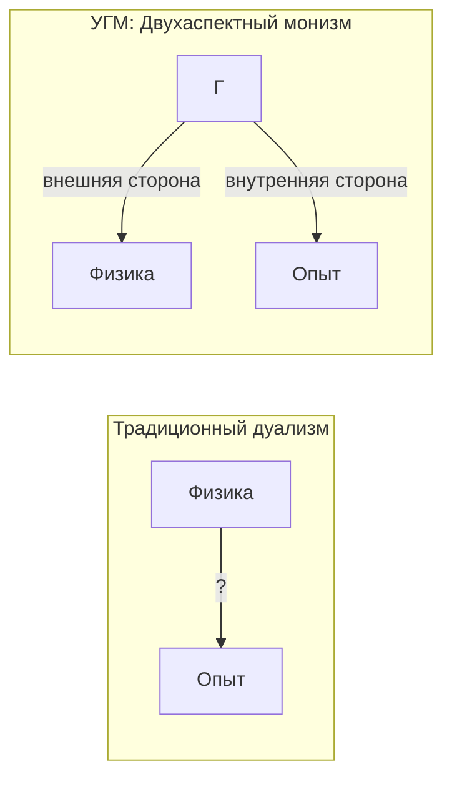

# Трудная Проблема Сознания

## Формулировка проблемы

Традиционно "трудная проблема сознания" (Дэвид Чалмерс, 1995) формулируется так:

> "Почему физические процессы порождают субъективный опыт?"

Это вопрос о **категориальном разрыве** (explanatory gap) между объективным описанием и субъективным переживанием.

## Позиция УГМ: Двухаспектный монизм

В УГМ проблема **переформулируется**, а не "решается" в традиционном смысле.

:::info Ключевой тезис
Нет "физических процессов" отдельно от "субъективного опыта". Есть только $\Gamma$, который:
- С **внешней стороны** выглядит как "физика" (структура, динамика)
- С **внутренней стороны** переживается как "опыт" (интериорность L0 для всех систем; когнитивные квалиа L2 — только при $R \geq R_{th}$, $\Phi \geq \Phi_{th}$)
:::

Спрашивать "почему физика порождает опыт?" — всё равно что спрашивать "почему лицевая сторона монеты порождает обратную?". Они не порождают друг друга — они **суть одно**.

## Признание границ объяснения

### Что УГМ объясняет

1. **Структуру** феноменального пространства (L1: метрика Фубини-Штуди на $\mathbb{P}(\mathcal{H}_E)$)
2. **Отношения** между качествами (L1: изоморфизм с проективным пространством; L2: рефлексивный доступ)
3. **Динамику** опыта (уравнение эволюции)
4. **Условия** сознательности (L2: $R \geq 1/3$, $\Phi \geq 1$ — [теоремы](../foundations/axiom-septicity#пороги-l2-геометрическая-мотивация))

### Что УГМ не объясняет

1. **Почему** математические структуры "ощущаются"
2. **Почему** именно эта структура, а не другая

:::warning Критическая честность
УГМ **не объясняет**, почему конкретное числовое значение $\lambda = 0.347$ переживается как **именно это** ощущение. Теория устанавливает **структурное соответствие** между математикой и феноменологией, но не дедуцирует одно из другого.
:::

## Метатеоретический статус

**Категориальный разрыв — не дефект теории, а граница объяснения.**

### Аналогия с физикой

Физика не объясняет, **почему** законы природы такие, какие есть — она описывает их структуру. Аналогично, УГМ описывает **структуру опыта**, но не отвечает на вопрос "почему вообще есть опыт".

### Аксиоматический статус

Тождество бытия и опыта ([Аксиома Ω](/docs/core/foundations/axiom-omega)) — это **постулат**, не теорема. Он принимается как исходная точка, потому что:

1. Любое доказательство уже предполагает опыт
2. Отрицание ведёт к неразрешимым проблемам дуализма
3. Постулат обладает максимальной объяснительной силой при минимуме сущностей

## Шкала сознательности

Не все конфигурации $\Gamma$ одинаково "сознательны". Степень сознательности определяется [мерой сознательности](./self-observation#мера-сознательности-c):

$$
C = \Phi \times D_{\text{diff}} \times R
$$

где:
- $\Phi$ — [мера интеграции](../structure/dimension-u#мера-интеграции-φ): связность измерений
- $D_{\text{diff}}$ — мера дифференциации: богатство репертуара состояний
- $R$ — [мера рефлексии](./self-observation#мера-рефлексии-r): глубина самомоделирования

:::note О нотации
$D_{\text{diff}}$ — мера **дифференциации**. Не путать с измерением **Динамики** $D$ (одно из семи измерений Голонома).
:::

**Условие когнитивных квалиа (L2):**

$$
C \geq C_{\text{th}} := \Phi_{\text{th}} \times D_{\min} \times R_{\text{th}} = 1 \times 2 \times \frac{1}{3} \approx 0.67
$$

при $R \geq R_{\text{th}} = 1/3$ и $\Phi \geq \Phi_{\text{th}} = 1$ ([геометрическая мотивация](../foundations/axiom-septicity#пороги-l2-геометрическая-мотивация)).

### Примеры систем

| Система | $\Phi$ | $D_{\text{diff}}$ | $R$ | $C$ | Уровень |
|---------|--------|-------------------|-----|-----|---------|
| Камень | $\approx 0$ | $\approx 1$ | $\approx 0$ | $\approx 0$ | L0 |
| Термостат | $\approx 0.1$ | $\approx 2$ | $\approx 0.1$ | $\approx 0.02$ | L0-L1 |
| Нейрон | $\approx 1$ | $\approx 3$ | $\approx 0.2$ | $\approx 0.6$ | L1 |
| Человек | $\gg 1$ | $\gg 1$ | $\to 1$ | $\gg 1$ | L2 |

## Сравнение с другими теориями

| Теория | Позиция | Проблема | Связь с УГМ |
|--------|---------|----------|-------------|
| Материализм | Опыт редуцируется к физике | Не объясняет когнитивные квалиа (L2) | УГМ избегает редукции |
| Дуализм | Опыт отделён от физики | Проблема взаимодействия | УГМ — монизм |
| Панпсихизм | Опыт везде | Проблема комбинации | УГМ решает через L0→L2 |
| **УГМ** | Опыт = внутренняя сторона $\Gamma$ | Признаёт границу объяснения | — |

### Детальное сравнение

#### Панпсихизм и панинтериоризм

**Классический панпсихизм** (Chalmers, Goff): Все физические сущности имеют сознание или "прото-сознание".

**Панинтериоризм УГМ:** Все конфигурации $\Gamma$ имеют **интериорность** (L0), но только некоторые достигают **когнитивных квалиа** (L2).

| Аспект | Панпсихизм | УГМ |
|--------|------------|-----|
| Что универсально | Сознание/прото-сознание | Интериорность (L0) |
| Проблема комбинации | Не решена | Решена через L0→L1→L2 |
| "Квалиа электрона" | Утверждается | Отрицается — электрон имеет L0, не L2 |

#### Теория интегрированной информации (IIT)

**IIT Тонони:** Сознание = интегрированная информация ($\Phi$).

**УГМ:** Сознательность $C = \Phi \times D_{\text{diff}} \times R$ — требуется не только интеграция, но и рефлексия.

| Аспект | IIT | УГМ |
|--------|-----|-----|
| Мера | $\Phi$ (единственная) | $C = \Phi \times D_{\text{diff}} \times R$ (три компонента) |
| Основание | Классическое | Квантовое |
| Динамика | Статична | Эволюция $\Gamma$ |
| Рефлексия | Не учитывается | Центральна ($R$) |

**УГМ обобщает IIT:** В пределе $R \to 1$, $D_{\text{diff}} \to 1$ получаем $C \approx \Phi$.

#### Сознательный реализм (Хоффман)

**Позиция Хоффмана:** Пространство-время не фундаментально; реальность — сеть сознательных агентов.

**Связь с УГМ:**

| Аспект | Хоффман | УГМ | Совместимость |
|--------|---------|-----|---------------|
| Примитив | Сознательный агент | $\Gamma$ | Агент $\approx$ L2-Голоном? |
| Пространство-время | Интерфейс | Эмерджентно | ✓ Совместимо |
| Математика | Марковские ядра | CPTP-каналы | ✓ Формально сходно |
| Физика | Вторична | Внешняя сторона $\Gamma$ | ✓ Концептуально сходно |

:::info Гипотеза соответствия
Сознательный агент Хоффмана = Голоном с $R \geq R_{th}$, $\Phi \geq \Phi_{th}$ (L2-Голоном). Марковское ядро = CPTP-канал. Это требует формального доказательства.
:::

#### Теория глобального рабочего пространства (GWT)

**GWT Баарса:** Сознание = глобальная доступность информации.

**Связь с УГМ:** Условие $\Phi \geq \Phi_{th}$ соответствует глобальной интеграции. GWT — феноменологическое описание того, что УГМ формализует через $\Phi$.

## УГМ как мета-теория сознания

УГМ потенциально может служить **мета-теорией**, объединяющей различные подходы:

| Теория | Что объясняет УГМ | Статус |
|--------|------------------|--------|
| IIT (Тонони) | $\Phi$ — один из компонентов $C$ | Формализовано |
| GWT (Баарс) | Условие глобальной интеграции | Концептуально |
| HOT (Розенталь) | Рефлексия $R$ = мысли высшего порядка | Концептуально |
| Панпсихизм | L0 = универсальная интериорность | Формализовано |
| Хоффман | Агент $\approx$ L2-Голоном | Гипотеза |

**Преимущество мета-теоретического подхода:** Разные теории фокусируются на разных аспектах ($\Phi$, $R$, глобальность). УГМ объединяет их через формулу $C = \Phi \times D_{\text{diff}} \times R$.

:::warning Статус мета-теории
Это **программа исследований**, не завершённая теория. Требуется:
1. Формальное доказательство эквивалентности с теорией Хоффмана
2. Экспериментальная проверка предсказаний
3. Вывод специальных теорий как частных случаев
:::

## Итог

УГМ предлагает **рабочую теорию сознания**, которая:

1. Формально определяет структуру опыта (иерархия L0→L1→L2)
2. Объясняет геометрию феноменального пространства (L1) и условия когнитивных квалиа (L2)
3. Предсказывает условия сознательности ($R \geq 1/3$, $\Phi \geq 1$ — [выведенные пороги](../foundations/axiom-septicity#пороги-l2-геометрическая-мотивация))
4. Честно признаёт границы объяснения
5. Потенциально объединяет альтернативные теории

Категориальный разрыв **не устраняется**, но **лишается статуса аргумента против натурализма**: опыт не "возникает из" физики — он есть её внутренняя сторона.

---

**Связанные документы:**
- [Самонаблюдение](./self-observation) — мера сознательности $C$ и оператор $\varphi$
- [Теория интериорности](./interiority) — формальная теория экспериенциального содержания
- [Иерархия интериорности](../../proofs/interiority-hierarchy) — формальные определения L0→L1→L2
- [Измерение Единства](../structure/dimension-u) — мера интеграции $\Phi$
- [Жизнеспособность](../dynamics/viability) — мера чистоты $P$ и условия существования
- [Фальсифицируемость](../../reference/falsifiability) — критерии проверки
