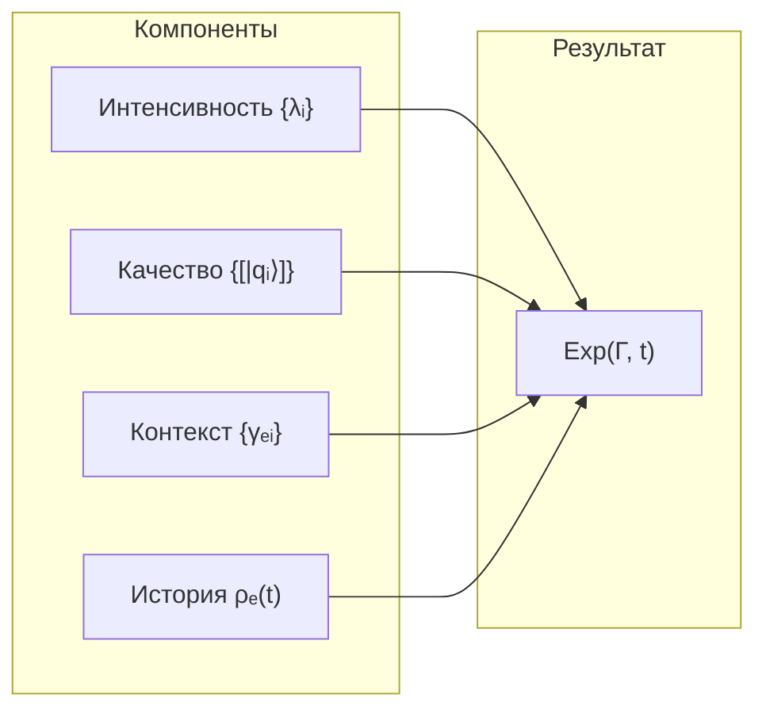

# Теория Интериорности

## Редуцированная матрица опыта

**Матрица плотности измерения Опыта** $\rho_E$ получается частичным следом [матрицы когерентности](../dynamics/coherence-matrix) $\Gamma$ по всем измерениям, кроме $E$:

$$
\rho_E := \mathrm{Tr}_{-E}(\Gamma)
$$

где $\mathrm{Tr}_{-E}$ — частичный след по измерениям $\{A, S, D, L, O, U\}$.

## Базовое уравнение

Экспериенциальное содержание связано со спектральным разложением $\rho_E$:

$$
\rho_E |q_i\rangle = \lambda_i |q_i\rangle
$$

где:
- $\lambda_i \in [0, 1]$ — **интенсивность** $i$-го компонента, $\sum_i \lambda_i = 1$
- $|q_i\rangle \in \mathcal{H}_E$ — **качество** $i$-го компонента
- $\mathcal{H}_E$ — гильбертово пространство [измерения Опыта](../structure/dimension-e)

:::warning Терминология
Термин **«квалиа»** используется ТОЛЬКО для L2 (когнитивные квалиа при $R \geq R_{th}$, $\Phi \geq \Phi_{th}$). Для общего случая (L0-L2) используется термин **«экспериенциальное содержание»**.

См. [Иерархию интериорности](../../proofs/interiority-hierarchy) для формальных определений уровней.
:::

## Экспериенциальное содержание

Экспериенциальное содержание (для всех уровней L0-L2) определяется четырьмя компонентами:

$$
\mathrm{Exp}(\Gamma, t) := (\mathrm{Intensity}, \mathrm{Quality}, \mathrm{Context}, \mathrm{History})
$$

### Компонент 1: Интенсивность

Спектр собственных значений $\rho_E$:

$$
\mathrm{Intensity}(\rho_E) := \{\lambda_i\}_{i=1}^{n}, \quad \text{где } \rho_E|q_i\rangle = \lambda_i|q_i\rangle
$$

Интенсивность определяет **громкость**, **яркость**, **силу** переживания.

### Компонент 2: Качество

Собственные векторы в проективном пространстве:

$$
\mathrm{Quality}(\rho_E) := \{[|q_i\rangle] \in \mathbb{P}(\mathcal{H}_E)\}_{i=1}^{n}
$$

Качество определяет **тембр**, **цвет**, **характер** переживания.

### Компонент 3: Контекст

Когерентности между измерением $E$ и остальными:

$$
\mathrm{Context}(\Gamma) := \{\gamma_{EA}, \gamma_{ES}, \gamma_{ED}, \gamma_{EL}, \gamma_{EO}, \gamma_{EU}\}
$$

Контекст модулирует опыт через [когерентности](../dynamics/coherence-matrix#недиагональные-элементы-когерентности): внимание ($\gamma_{EA}$), настроение, модальность.

### Компонент 4: История

Траектория эволюции $\rho_E$ в окне времени $\tau$:

$$
\mathrm{History}(t, \tau) := \{\rho_E(t') : t' \in [t-\tau, t]\}
$$

где $\tau > 0$ — характерное время памяти системы. История определяет адаптацию, привыкание, ожидания.

## Проективное пространство качеств

Качества живут в **проективном пространстве**:

$$
\mathbb{P}(\mathcal{H}_E) := (\mathcal{H}_E \setminus \{0\}) / \sim
$$

где отношение эквивалентности:

$$
|\psi\rangle \sim |\phi\rangle \quad \Leftrightarrow \quad \exists c \in \mathbb{C}^*: |\psi\rangle = c|\phi\rangle
$$

**Топология** (для $\dim(\mathcal{H}_E) = n$):

| Свойство | Описание |
|----------|----------|
| Компактность | $\mathbb{P}(\mathbb{C}^n)$ компактно |
| Связность | $\mathbb{P}(\mathbb{C}^n)$ связно |
| Изоморфизм | $\mathbb{P}(\mathbb{C}^n) \cong S^{2n-1} / U(1)$ |
| Размерность | $\dim_{\mathbb{R}}(\mathbb{P}(\mathbb{C}^n)) = 2n - 2$ |

## Метрика Фубини-Штуди

**Расстояние между качествами:**

$$
d_{FS}([|\psi\rangle], [|\phi\rangle]) := \arccos(|\langle\psi|\phi\rangle|) \in [0, \pi/2]
$$

где $[|\psi\rangle]$ — класс эквивалентности вектора $|\psi\rangle$ в $\mathbb{P}(\mathcal{H}_E)$.

**Свойства:**

| Условие | Значение | Интерпретация |
|---------|----------|---------------|
| $d_{FS} = 0$ | $\vert\psi\rangle = e^{i\theta}\vert\phi\rangle$ | Одинаковые качества |
| $d_{FS} = \pi/2$ | $\langle\psi\vert\phi\rangle = 0$ | Максимально различные качества |

**Инфинитезимальная форма** (риманова метрика):

$$
ds^2 = \langle d\psi|d\psi\rangle - |\langle\psi|d\psi\rangle|^2
$$

## Полная метрика на экспериенциальном пространстве

Расстояние между двумя экспериенциальными состояниями $E_1$, $E_2$:

$$
d_{\mathcal{E}}(E_1, E_2) := \sqrt{d_{\lambda}^2 + \alpha \cdot d_{FS}^2 + \beta \cdot d_C^2 + \gamma \cdot d_H^2}
$$

где компоненты метрики:

| Компонент | Определение | Описание |
|-----------|-------------|----------|
| $d_{\lambda}$ | $\|\boldsymbol{\lambda}_1 - \boldsymbol{\lambda}_2\|_2$ | Евклидово расстояние между спектрами |
| $d_{FS}$ | $\sum_i d_{FS}([|q_i^{(1)}\rangle], [|q_i^{(2)}\rangle])$ | Сумма расстояний Фубини-Штуди |
| $d_C$ | $\|\mathrm{Context}_1 - \mathrm{Context}_2\|_F$ | Норма Фробениуса для контекстов |
| $d_H$ | $\int_{t-\tau}^{t} \|\rho_E^{(1)}(t') - \rho_E^{(2)}(t')\|_F \, dt'$ | Интеграл различия историй |

Веса $\alpha, \beta, \gamma > 0$ — параметры модели.

:::warning Эмпирический статус
Веса $\alpha$, $\beta$, $\gamma$ имеют **эмпирический статус** — не выводятся из аксиом УГМ и требуют калибровки для конкретных систем.
:::

## Уровни полноты описания

:::info Примечание
Это иерархия **полноты описания** одного состояния. Не путать с [иерархией интериорности](../../proofs/interiority-hierarchy) (L0→L1→L2), которая описывает **типы систем**.
:::

| Полнота | Компоненты | Применимость |
|---------|------------|--------------|
| Спектральное | $\{\lambda_i\}$ | Только интенсивности (недостаточно для различения качеств) |
| Геометрическое | $(\{\lambda_i\}, \{[|q_i\rangle]\})$ | Интенсивность + качество |
| Контекстное | $(\{\lambda_i\}, \{[|q_i\rangle]\}, C)$ | + когерентности с другими измерениями |
| Полное | $(\{\lambda_i\}, \{[|q_i\rangle]\}, C, H)$ | + история эволюции |

## Проблема изоспектральности

**Проблема:** Существуют матрицы $\rho_1 \neq \rho_2$ с $\text{Spectrum}(\rho_1) = \text{Spectrum}(\rho_2)$, но разными собственными векторами.

**Решение:** Качества различаются через собственные векторы:

$$
\text{Spectrum}(\rho_1) = \text{Spectrum}(\rho_2), \text{ но } \text{Quality}(\rho_1) \neq \text{Quality}(\rho_2)
$$

$$
\Rightarrow \text{Exp}(\rho_1) \neq \text{Exp}(\rho_2)
$$

Изоспектральные состояния могут иметь **одинаковую интенсивность**, но **разное качество** опыта.

## Примеры когнитивных квалиа (L2)

При $R \geq R_{th} = 1/3$ и $\Phi \geq \Phi_{th} = 1$ ([теоремы](../foundations/axiom-septicity#пороги-l2-геометрическая-мотивация)) компоненты опыта становятся рефлексивно доступными.

### Красный цвет

| Компонент | Математическое представление | Феноменальная интерпретация |
|-----------|------------------------------|---------------------------|
| Интенсивность | $\lambda_{\text{red}} \in [0, 1]$ | Яркость |
| Качество | $[\vert q_{\text{red}}\rangle] \in \mathbb{P}(\mathcal{H}_E)$ | Оттенок красного |
| Контекст | $\gamma_{EA}$ (внимание), $\gamma_{EL}$ | Освещение, фон |
| История | $\rho_E(t-\tau) \to \rho_E(t)$ | Адаптация сетчатки |

### Боль

| Компонент | Математическое представление | Феноменальная интерпретация |
|-----------|------------------------------|---------------------------|
| Интенсивность | $\lambda_{\text{pain}} \in [0, 1]$ | Сила боли |
| Качество | $[\vert q_{\text{pain}}\rangle] \in \mathbb{P}(\mathcal{H}_E)$ | Острая/тупая/пульсирующая |
| Контекст | $\gamma_{ES}$ (структура), $\gamma_{EO}$ | Локализация, эмоции |
| История | $\{\rho_E(t')\}_{t' \in [t-\tau, t]}$ | Сенситизация/десенситизация |

## Единство опыта

Субъективное единство опыта («Я») обеспечивается [измерением Единства (U)](../structure/dimension-u) через когерентности $\gamma_{EU}$:

$$
\Phi_E := \frac{\sum_{i \neq j} |\gamma_{E_i E_j}|^2}{\sum_i \gamma_{E_i E_i}^2}
$$

где $\Phi_E$ — мера интеграции экспериенциального подпространства.

**Условие единого опыта:**

$$
\gamma_{EU} > 0 \quad \land \quad \Phi_E > \Phi_{th}
$$

При $\gamma_{EU} \to 0$ или $\Phi_E < \Phi_{th}$ возникает **диссоциация** — ощущение разделённости сознания.

:::note Связь с мерой сознательности
Единство опыта входит в [меру сознательности](./self-observation#мера-сознательности-c) $C = \Phi \times D_{\text{diff}} \times R$ через компонент $\Phi$.
:::

## Структура экспериенциального пространства

**Пространство интенсивностей:** $(n-1)$-симплекс $\Delta^{n-1} = \{\boldsymbol{\lambda} : \lambda_i \geq 0, \sum_i \lambda_i = 1\}$

**Пространство качеств:** проективное пространство $\mathbb{P}(\mathcal{H}_E)$

---

**Связанные документы:**
- [Самонаблюдение](./self-observation) — оператор φ и мера рефлексии R
- [Трудная проблема](./hard-problem) — философский анализ
- [Измерение E](../structure/dimension-e) — измерение опыта
- [Измерение U](../structure/dimension-u) — измерение единства и мера Φ
- [Иерархия интериорности](../../proofs/interiority-hierarchy) — формальные определения L0→L1→L2
- [Матрица когерентности](../dynamics/coherence-matrix) — определение Γ и ρ_E
