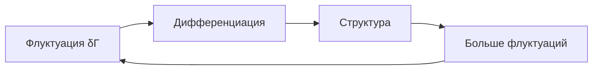
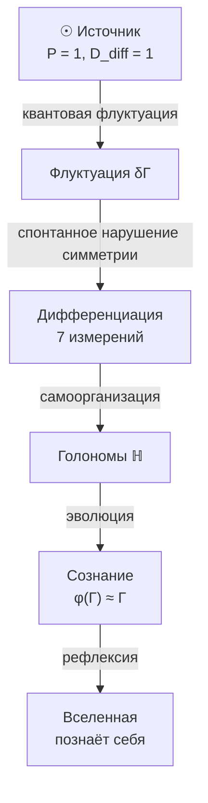

# Происхождение Вселенной

:::warning Статус раздела: Философская интерпретация
Этот раздел содержит **философские интерпретации** в рамках формализма УГМ. Аргументы о происхождении Источника и нестабильности "ничто" носят **метафизический характер** — это не формальные теоремы, а концептуальные позиции, согласованные с аксиомами теории.
:::

## Проблема начала

Традиционно спрашивают: "Что было до Большого Взрыва?"

В УГМ вопрос трансформируется:

> Какова структура $\Gamma$ в пределе минимальной дифференциации?

## Изначальное состояние

### Источник

:::note Статус: Постулат
Источник **постулируется**, не выводится. Это начальное условие теории, не её следствие. Вопрос "почему этот конкретный Источник?" — открытый.
:::

**Чистое недифференцированное состояние** — суперпозиция всех измерений с равными амплитудами:

$$
\Gamma_{\odot} = |\psi_{\odot}\rangle\langle\psi_{\odot}|, \quad |\psi_{\odot}\rangle = \frac{1}{\sqrt{7}} \sum_i |i\rangle
$$

**Свойства:**
- [Чистота](../dynamics/viability#определение-чистоты): $P = \mathrm{Tr}(\Gamma_{\odot}^2) = 1$ (чистое состояние)
- Максимальная [когерентность](../dynamics/coherence-matrix): все $|\gamma_{ij}| = 1/7$
- Минимальная [дифференциация](../consciousness/self-observation#мера-сознательности-c): $D_{\text{diff}} = 1$

:::info Почему не смешанное состояние?
[Максимально смешанное состояние](../dynamics/coherence-matrix#максимально-смешанное-состояние) $\Gamma = I_7/7$ имело бы $P = 1/7$ — это **не** когерентное состояние, а классический ансамбль без квантовых корреляций. УГМ принимает **чистую суперпозицию** как Источник.
:::

**Открытые вопросы:**
- Почему именно равные амплитуды $1/\sqrt{7}$?
- Возможны ли альтернативные начальные состояния?
- Связь с проблемой Больцмановского мозга?

## Спонтанное нарушение симметрии

### Нестабильность Источника

:::warning Эвристический аргумент
Нестабильность Источника — **концептуальный аргумент**, не формальная теорема. Требуется показать, что [динамика](../dynamics/evolution) $\frac{d\Gamma}{dt}$ неизбежно уводит от $\Gamma_{\odot}$.
:::

:::info Статус: ⚠️ Гипотеза
Нижеследующее утверждение о нестабильности — **гипотеза**, требующая строгого вывода из динамики (анализ устойчивости Ляпунова для $\Gamma_{\odot}$).
:::

Источник нестабилен, потому что абсолютная симметрия — это **отсутствие информации**.

:::info Статус: 🔬 Программа
Механизм флуктуаций $\delta\Gamma$ — **направление исследований**, не формализованный результат.
:::

Флуктуации спонтанно нарушают симметрию:

$$
\Gamma_{\odot} \to \Gamma_{\odot} + \delta\Gamma
$$

где $\delta\Gamma$ — малое возмущение, нарушающее симметрию ($\|\delta\Gamma\|_F \ll 1$, см. [норма Фробениуса](../dynamics/coherence-matrix#норма-фробениуса)).

:::warning Открытые вопросы формализации
- Механизм возникновения $\delta\Gamma$ — требуется связь с [диссипатором](../dynamics/evolution#логический-лиувиллиан) $\mathcal{D}[\Gamma]$
- Почему флуктуации усиливаются, а не затухают? — требуется анализ устойчивости $\Gamma_{\odot}$
- Связь с квантовой теорией поля — требуется вывод операторов Линдблада из QFT
:::

### Самоусиление

:::info Статус: 🔬 Программа
Механизм самоусиления требует формального анализа: доказательство положительного коэффициента усиления обратной связи.
:::

Это нарушение **предположительно самоусиливается** через положительную обратную связь:

## Рождение измерений

Из изначальной суперпозиции выделяются [семь измерений](../structure/dimensions):

$$
|\psi_{\odot}\rangle = \frac{1}{\sqrt{7}}(|A\rangle + |S\rangle + |D\rangle + |L\rangle + |E\rangle + |O\rangle + |U\rangle)
$$

$$
\downarrow \text{декогеренция через } \mathcal{D}[\Gamma]
$$

$$
\Gamma \to \sum_i p_i |i\rangle\langle i| + \sum_{i \neq j} \gamma_{ij} |i\rangle\langle j|
$$

где $p_i = \gamma_{ii}$ — населённости измерений, $\gamma_{ij}$ — [когерентности](../dynamics/coherence-matrix#недиагональные-элементы-когерентности) между ними.

## Эволюция от Источника

### Направление эволюции

:::danger Предупреждение: Нефальсифицируемость
Утверждение $dD_{\text{diff}}/dt > 0$ **нефальсифицируемо**: любое наблюдаемое уменьшение дифференциации можно интерпретировать как локальное явление в рамках глобального роста. Это **телеологическое допущение**, не эмпирический закон.

**Честный статус:** Это философская позиция (направленность эволюции), не формальная теорема УГМ.
:::

Вселенная эволюционирует в направлении **увеличения дифференциации при сохранении интеграции**:

$$
\frac{dD_{\text{diff}}}{dt} > 0
$$

$$
\frac{d\Phi}{dt} \geq 0
$$

где:
- $D_{\text{diff}} = \exp(S_{vN})$ — [мера дифференциации](../consciousness/self-observation#мера-сознательности-c) (разнообразие состояний)
- $\Phi$ — [мера интеграции](../structure/dimension-u#мера-интеграции-φ) (связность измерений)

**Статус:** 🔬 Гипотеза. Связь с вторым законом термодинамики концептуальна, не формализована.

:::note О нотации
$D_{\text{diff}}$ — мера **дифференциации**. Не путать с измерением **Динамики** $D$ (одно из семи измерений Голонома).
:::

### Феноменология эволюции

- **Усложнение материи:** от кварков к галактикам
- **Эволюция жизни:** от прокариот к разуму
- **Развитие культуры:** от племён к цивилизациям

## Диаграмма космогенеза

**Обозначения диаграммы:**
- $P = 1$ — [чистота](../dynamics/viability#определение-чистоты) (максимальная когерентность)
- $D_{\text{diff}} = 1$ — минимальная дифференциация (чистое состояние)
- $\varphi(\Gamma) \approx \Gamma$ — [самомоделирование](../consciousness/self-observation#оператор-самомоделирования-φ) близко к неподвижной точке

## Отсутствие «до»

В УГМ нет «до Большого Взрыва»:
- Время возникает **вместе** с дифференциацией
- «До» — это концепция, требующая времени
- Источник $\odot$ — вне времени (атемпоральный)

## Почему вообще что-то есть?

Традиционный вопрос: "Почему есть нечто, а не ничто?"

:::info Статус: Философский аргумент
Это **не формальная теорема**, а философская позиция, согласованная с аксиоматикой УГМ. Формальное доказательство невозможно — вопрос лежит за пределами любой формальной системы.
:::

**Позиция УГМ:**
"Ничто" нестабильно — оно не может быть самосогласованным, потому что для самосогласованности нужно "нечто", что согласуется с собой.

$$
\text{Ничто} \Rightarrow \text{несамосогласованность} \Rightarrow \text{невозможность}
$$

$\Gamma$ существует, потому что **самосогласованность требует существования**.

**Альтернативные позиции:**
- Вопрос бессмысленный (логические позитивисты)
- Ответ лежит за пределами рационального (мистицизм)
- Случайность без причины (некоторые интерпретации КМ)

УГМ выбирает позицию самосогласованности как наиболее экономную и объяснительно мощную.

## Что формализовано vs Программа исследований

| Утверждение | Статус | Комментарий |
|-------------|--------|-------------|
| **Источник $\Gamma_{\odot}$ как начальное условие** | ⚙️ Постулат | Не выводится, принимается как аксиома |
| **Нестабильность Источника** | 🔬 Гипотеза | Требуется анализ устойчивости Ляпунова |
| **Механизм флуктуаций $\delta\Gamma$** | 🔬 Программа | Не формализован |
| **Самоусиление нарушения симметрии** | 🔬 Программа | Требуется доказательство положительной обратной связи |
| **$dD_{\text{diff}}/dt > 0$** | ⚠️ Нефальсифицируемо | Телеологическое допущение |
| **"Ничто" нестабильно** | 💭 Философия | Метафизический аргумент, не теорема |

:::info Резюме
Этот раздел содержит **постулаты** (Источник), **гипотезы** (нестабильность), и **философские позиции** ("почему есть нечто"). Формальных теорем здесь нет.
:::

---

**Связанные документы:**
- [Пространство-время](./spacetime) — эмерджентность пространства-времени
- [Матрица когерентности](../dynamics/coherence-matrix) — определение $\Gamma$
- [Эволюция](../dynamics/evolution) — динамика $\Gamma$
- [Жизнеспособность](../dynamics/viability) — мера чистоты $P$
- [Самонаблюдение](../consciousness/self-observation) — оператор $\varphi$ и мера $D_{\text{diff}}$
- [Измерение Единства](../structure/dimension-u) — мера интеграции $\Phi$
- [Основание (O)](../structure/dimension-o) — связь с источником
- [Аксиома Ω⁷](../foundations/axiom-omega) — ∞-топос Sh_∞(𝒞) как примитив
