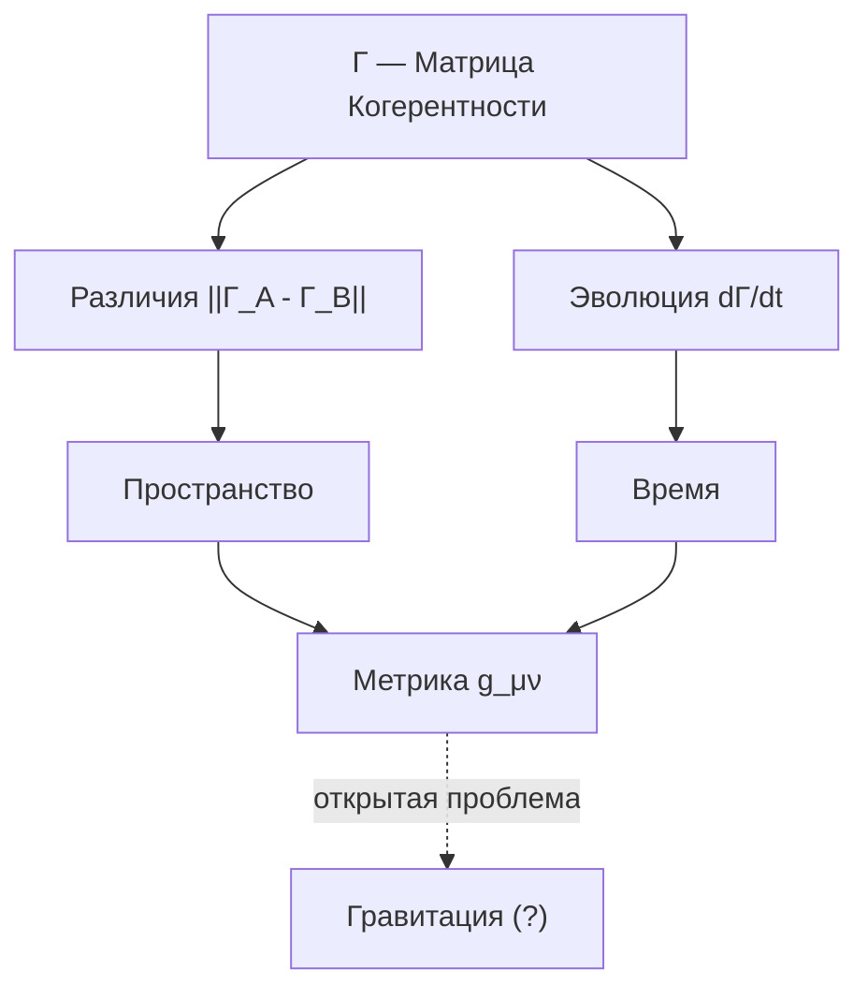

# Структура Пространства-Времени

:::danger Статус раздела: Программа исследований
Этот раздел описывает **программу исследований**, а не завершённую теорию. Формулы связи $\Gamma$ с пространством-временем носят **эвристический характер** — это направления для развития, не строгие выводы. УГМ пока **не выводит** уравнения Эйнштейна или стандартную модель из динамики $\Gamma$.
:::

## Пространство как структура различий

Пространство — **не пустой контейнер**, а структура различий в $\Gamma$.

### Расстояние

Расстояние между точками $A$ и $B$ определяется как мера различия соответствующих конфигураций $\Gamma$:

$$
d(A, B) := \|\Gamma_A - \Gamma_B\|_F
$$

где $\|\cdot\|_F$ — [норма Фробениуса](../dynamics/coherence-matrix#норма-фробениуса).

:::warning Открытый вопрос
Нотация $\Gamma_A$ (матрица когерентности «в точке $A$») требует формализации. Как именно локализовать $\Gamma$ в пространстве? Возможные подходы:
- Поле матриц $\Gamma(x)$
- Редукция к подсистемам
- Проекции на локальные степени свободы
:::

### Топология

**Гипотеза:** Топология пространства — это топология отношений в $\Gamma$:

$$
\text{Top}(\text{Space}) \cong \text{Top}(\{\Gamma_x : x \in \text{Space}\})
$$

где изоморфизм $\cong$ понимается как гомеоморфизм топологических пространств.

**Статус:** Концептуальная гипотеза. Требуется определить метрику на пространстве матриц $\Gamma_x$.

## Время как параметр эволюции

Время — **не внешняя ось**, а параметр [унитарной эволюции](../dynamics/evolution#1-унитарный-член) $\Gamma$:

$$
t \leftrightarrow U(t) = \exp(-iHt)
$$

где $H$ — [Гамильтониан системы](../../formal/specification#гамильтониан).

### Течение времени

«Течение времени» — это **переживание непрерывной эволюции $\Gamma$ изнутри**.

Система не «движется сквозь время» — она **есть** последовательность конфигураций:

$$
\Gamma(t_1) \to \Gamma(t_2) \to \Gamma(t_3) \to \ldots
$$

Эта последовательность определяется [полным уравнением эволюции](../dynamics/evolution#полное-уравнение-движения).

## Стрела времени

### Термодинамическое направление

Стрела времени определяется направлением увеличения [энтропии фон Неймана](../dynamics/coherence-matrix#энтропия-фон-неймана):

$$
\frac{dS_{vN}}{dt} \geq 0
$$

:::note Уточнение
Неравенство $dS_{vN}/dt \geq 0$ справедливо для замкнутых систем или систем с [диссипацией](../dynamics/evolution#2-диссипативный-член). При наличии [регенерации](../dynamics/evolution#3-регенеративный-член) $\mathcal{R}$ возможно локальное уменьшение энтропии за счёт импорта свободной энергии.
:::

### Второй закон термодинамики

Второй закон — **следствие** структуры $\Gamma$, а не внешний закон:

- Чистых состояний ($P = 1$) меньше, чем смешанных ($P < 1$)
- Случайные возмущения ведут к [декогеренции](../dynamics/evolution#диссипативный-режим-декогеренция)
- Обратный процесс требует тонкой настройки (низкая энтропия начальных условий)

## Относительность

### Внутренние часы

Разные Голономы могут иметь разные «внутренние часы» — разные темпы эволюции:

$$
\tau_{\mathbb{H}_1} \neq \tau_{\mathbb{H}_2}
$$

где $\tau_{\mathbb{H}}$ — собственное время [Голонома](../structure/holon) $\mathbb{H}$.

### Релятивистские эффекты

:::warning Открытая проблема
Связь структуры $\Gamma$ с релятивистскими эффектами — **открытая проблема**. Требуется показать, как из динамики $\Gamma$ возникает:
- Замедление времени при высоких скоростях
- Гравитационное замедление времени
- Лоренц-инвариантность

**Гипотеза:** Отношение собственных времён может зависеть от различия конфигураций:

$$
\frac{d\tau_1}{d\tau_2} \sim f(\|\Gamma_1 - \Gamma_2\|_F)
$$

где конкретная форма $f$ — предмет исследований.
:::

## Эмерджентность геометрии

:::warning Эвристический статус
Формулы в этом разделе — **концептуальные направления**, не строгие выводы. Символ $\sim$ означает «структурное соответствие», не математическое равенство. Строгий вывод метрики $g_{\mu\nu}$ из $\Gamma$ — **открытая проблема**.
:::

### Метрика из когерентности (гипотеза)

**Гипотеза:** Метрический тензор может быть определён через когерентности:

$$
g_{\mu\nu}(x) \sim \langle \Gamma(x) | \partial_\mu \partial_\nu | \Gamma(x) \rangle
$$

**Статус:** Эвристика. Не показано:
- Как именно возникает лоренцева сигнатура $(+,-,-,-)$
- Почему пространство 3+1-мерно
- Как определить $\Gamma(x)$ для точки пространства

### Квантовая гравитация (программа)

**Гипотеза:** Гравитация — эмерджентное свойство структуры $\Gamma$:

$$
R_{\mu\nu} - \frac{1}{2}g_{\mu\nu}R \sim \langle T_{\mu\nu}(\Gamma) \rangle
$$

**Статус:** Программа исследований. Требуется:
1. Определить функционал действия $S[\Gamma]$
2. Показать, что вариационный принцип даёт уравнения Эйнштейна
3. Объяснить константы $c$ и $G$ как следствия структуры $\Gamma$

## Диаграмма эмерджентности

**Примечание:** Пунктирная линия к «Гравитация» указывает на открытый статус этой связи.

## Нелокальность

### Квантовые корреляции

[Когерентности](../dynamics/coherence-matrix#недиагональные-элементы-когерентности) $\gamma_{ij}$ между удалёнными частями $\Gamma$ означают **нелокальные связи**:

$$
\gamma_{AB} \neq 0 \Rightarrow A \text{ и } B \text{ квантово коррелированы}
$$

### Запутанность

Запутанность — это несепарабельность состояния подсистем:

$$
\Gamma_{AB} \neq \Gamma_A \otimes \Gamma_B
$$

где $\Gamma_A = \mathrm{Tr}_B(\Gamma_{AB})$ — [частичный след](../consciousness/interiority#редуцированная-матрица-опыта) по подсистеме $B$.

Нарушение неравенств Белла — следствие ненулевых когерентностей в структуре $\Gamma$.

## Связь с физикой

| Физическое понятие | Выражение через $\Gamma$ | Статус |
|--------------------|--------------------------|--------|
| Пространство | Структура различий $\|\Gamma_A - \Gamma_B\|_F$ | Концептуально |
| Время | Параметр эволюции $t$ в $U(t) = e^{-iHt}$ | Формализовано |
| Энергия | Собственные значения $H$ | Формализовано |
| Импульс | Генератор пространственных трансляций | Концептуально |
| Масса | Инертность к изменению $\Gamma$ | Гипотеза |
| Гравитация | Кривизна пространства конфигураций $\Gamma$ | Программа |

## Связь с другими подходами

| Подход | Связь с УГМ | Статус |
|--------|-------------|--------|
| **Петлевая квантовая гравитация** | Спиновые сети могут соответствовать структурам когерентности | Не исследовано |
| **Теория струн** | Возможна связь через голографический принцип | Не исследовано |
| **Hoffman Conscious Agents** | Пространство-время как интерфейс согласуется с эмерджентностью | Концептуально совместимо |
| **Эмерджентная гравитация (Verlinde)** | Сходный подход: гравитация как энтропийная сила | Требует исследования |

## Открытые вопросы

1. **Размерность:** Как вывести размерность пространства (почему 3+1, а не другая)?
2. **Уравнения Эйнштейна:** Как получить $R_{\mu\nu} - \frac{1}{2}g_{\mu\nu}R = 8\pi G T_{\mu\nu}$ из [динамики $\Gamma$](../dynamics/evolution)?
3. **Тёмный сектор:** Какова связь с тёмной материей/энергией?
4. **QFT:** Как объединить с квантовой теорией поля?
5. **Локализация:** Как формально определить $\Gamma(x)$ — матрицу когерентности в точке пространства?

---

**Связанные документы:**
- [Происхождение Вселенной](./origin) — космогенез и $\Gamma_{\odot}$
- [Матрица когерентности](../dynamics/coherence-matrix) — определение $\Gamma$ и норма Фробениуса
- [Эволюция](../dynamics/evolution) — динамика $d\Gamma/dt$ и уравнение Линдблада
- [Измерение Динамики (D)](../structure/dimension-d) — концептуальное описание времени
- [Измерение Структуры (S)](../structure/dimension-s) — концептуальное описание пространства
- [Голоном](../structure/holon) — определение $\mathbb{H}$
- [Границы теории](../../reference/falsifiability#границы-теории) — что УГМ не объясняет
