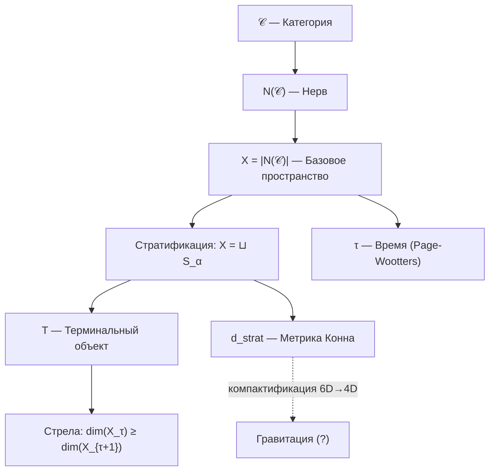

# Структура Пространства-Времени

:::info Статус раздела: ✅ Формализовано
- **Базовое пространство:** ✅ $X = |N(\mathcal{C})|$ — геометрическая реализация нерва категории
- **Время:** ✅ Формализовано через [теорему об эмерджентном времени](../../proofs/emergent-time)
- **Метрика:** ✅ Стратифицированная метрика Конна $d_{strat}$
- **Гравитация:** 🔬 Программа исследований — связь с ОТО открыта
:::

## Базовое пространство X = |N(𝒞)| {#базовое-пространство}

:::warning Аксиома 5 (Стратификация)
Базовое пространство теории определяется как геометрическая реализация нерва категории:

$$X = |N(\mathcal{C})|$$

где $\mathcal{C}$ — [примитивная категория УГМ](../foundations/axiom-omega#примитив).
:::

### Автопоэтичность базового пространства {#автопоэтичность}

Ключевое свойство: **X определяется эндогенно**, не вводится извне.

| Аспект | Традиционные теории | УГМ |
|--------|---------------------|---------|
| Базовое пространство | Постулируется (ℝ⁴, Σ, ...) | Выводится из $\mathcal{C}$ |
| Метрика | Вводится руками | Вычисляется из спектральных данных |
| Топология | Фиксирована | Следует из нервной структуры |

### Нерв категории N(𝒞) {#нерв-категории}

**Определение (Нерв):**

Нерв $N(\mathcal{C})$ — симплициальное множество:
- 0-симплексы: объекты $\mathcal{C}$ (голономы $\mathbb{H}$)
- 1-симплексы: морфизмы $f: A \to B$
- n-симплексы: композируемые цепочки морфизмов

**Геометрическая реализация:**

$$|N(\mathcal{C})| = \left( \bigsqcup_n \Delta^n \times N_n \right) \Big/ \sim$$

где отношение эквивалентности склеивает грани симплексов.

### Стратификация X {#стратификация-x}

**Определение (Стратификация):**

Пространство X разбивается на страты:

$$X = \bigsqcup_{\alpha \in A} S_\alpha$$

где:
- $S_0 = \{T\}$ — 0-мерная страта (терминальный объект)
- $S_1$ — 1-мерная страта (морфизмы в T)
- $S_n$ — n-мерная страта (n-симплексы)

**Ключевое свойство:** Замыкание каждой страты содержит страты меньшей размерности.

### Локально-глобальная дихотомия {#локально-глобальная-дихотомия}

:::warning Теорема (Локально-глобальная дихотомия)
Для базового пространства $X = |N(\mathcal{C})|$:

**Глобально (монизм):**
$$H^n(X, \mathcal{F}) = 0 \quad \forall n > 0$$

**Локально (физика):**
$$H^*_{loc}(X, T) \cong \tilde{H}^{*-1}(\text{Link}(T)) \cong \tilde{H}^{*-1}(S^6) \neq 0$$
:::

**Интерпретация:**

| Аспект | Глобальный (H* = 0) | Локальный (H*_loc ≠ 0) |
|--------|---------------------|------------------------|
| Онтология | Единое существует | Множественность структур |
| Топология | Стягиваемо в T | Богатая геометрия вблизи T |
| Физика | Конвергенция к равновесию | Локальные топологические эффекты |
| Время | Глобальная стрела к T | Локальные флуктуации |

**Следствие:** Монизм и физика **совместимы** — глобальная стягиваемость не исключает локальную нетривиальность.

---

## Стратифицированная метрика Конна {#метрика-конна}

### Спектральная тройка для страт {#спектральная-тройка}

На каждой страте $S_\alpha$ определяется спектральная тройка:

$$(A_\alpha, H_\alpha, D_\alpha)$$

где:
- $A_\alpha = C(S_\alpha)$ — алгебра функций на страте
- $H_\alpha = L^2(S_\alpha, E_\alpha)$ — гильбертово пространство сечений
- $D_\alpha$ — оператор Дирака на страте

### Формула расстояния d_strat {#формула-расстояния}

:::warning Теорема (Стратифицированная метрика)
Расстояние между чистыми состояниями $\omega_1, \omega_2 \in X$:

$$d_{strat}(\omega_1, \omega_2) = \inf_{\gamma} \int_\gamma ds_\alpha$$

где:
- $\gamma$ — путь, пересекающий страты $S_{\alpha_1}, S_{\alpha_2}, \ldots$
- $ds_\alpha$ — метрика Конна на страте $S_\alpha$:

$$d_\alpha(p, q) = \sup\{|f(p) - f(q)| : \|[D_\alpha, f]\| \leq 1\}$$

- Инфимум берётся по всем путям, соединяющим $\omega_1$ и $\omega_2$
:::

### Метрика вблизи терминального объекта {#метрика-вблизи-t}

Вблизи $T$ (вершины конуса) метрика имеет конусную структуру:

$$d_{strat}(x, T) \sim r \cdot d_{S^6}(\pi(x), \text{базовая точка})$$

где:
- $r$ — «радиальная» координата (расстояние до T)
- $\pi$ — проекция на линк $\text{Link}(T) \cong S^6$

**Интерпретация:** Расстояние до аттрактора уменьшается при эволюции — система «приближается» к T.

---

## Пространство как структура различий

Пространство — **не пустой контейнер**, а структура различий в категории $\mathcal{C}$.

### Расстояние {#расстояние}

В обновлённой теории расстояние определяется через [стратифицированную метрику Конна](#метрика-конна):

$$
d(A, B) := d_{strat}(A, B)
$$

**Проблема цикличности решена:** Расстояние выводится из спектральных данных на стратах $S_\alpha$, а не из априорного понятия «точки пространства».

:::note Сравнение с предыдущей версией
В ранних версиях теории использовалась формула $d(A, B) = \|\Gamma_A - \Gamma_B\|_F$, которая содержала **круговую зависимость**. Новая конструкция через $X = |N(\mathcal{C})|$ устраняет эту проблему — пространство **выводится** из категорной структуры.
:::

### Топология {#топология}

:::warning Теорема (Топология X)
Топология базового пространства полностью определяется категорной структурой:

$$\text{Top}(X) = \text{Top}(|N(\mathcal{C})|)$$

**Свойства:**
- Глобально: $X$ стягиваемо в терминальный объект $T$
- Локально: Вблизи $T$ топология нетривиальна ($\text{Link}(T) \cong S^6$)
:::

**Статус:** ✅ Формализовано. Топология **выводится** из нервной структуры категории.

## Эмерджентное время

:::warning Теорема (Эмерджентность времени)
Время **выводится** из структуры категории $\mathcal{C}$ четырьмя эквивалентными способами:

| Уровень | Время как... | Формула | Статус |
|---------|--------------|---------|--------|
| **Page-Wootters** | Корреляция с [O](../structure/dimension-o) | $\Gamma(\tau) = \text{Tr}_O[\cdot]$ | ✅ Формализовано |
| **Информационная геометрия** | Расстояние в метрике Бурес | $d_B(\Gamma_1, \Gamma_2)$ | ✅ Формализовано |
| **Категорный** | 1-морфизм в ∞-группоиде | $\gamma: \Gamma_1 \to \Gamma_2$ | ✅ Формализовано |
| **Стратификация** | Коллапс страт к T | $\dim(X_\tau) \geq \dim(X_{\tau+1})$ | ✅ Формализовано |

[Полное доказательство →](../../proofs/emergent-time)
:::

### Механизм Page-Wootters

Время возникает как параметр **условных состояний** относительно измерения O:

$$
\Gamma(\tau) := \frac{\text{Tr}_O\left[ (|\tau\rangle\langle \tau|_O \otimes \mathbb{1}_{6D}) \cdot \Gamma_{total} \right]}{p(\tau)}
$$

где:
- $\Gamma_{total}$ удовлетворяет ограничению $\hat{C} \cdot \Gamma_{total} = 0$
- $|\tau\rangle_O$ — базис собственных состояний внутренних часов O
- p(τ) — нормировка

### Информационно-геометрическое время

Расстояние между конфигурациями в метрике Бурес:

$$
d_B(\Gamma_1, \Gamma_2) = \arccos\left( \text{Tr}\sqrt{\sqrt{\Gamma_1} \Gamma_2 \sqrt{\Gamma_1}} \right)
$$

**Течение времени** — скорость изменения Γ:

$$
\frac{d\tau_{int}}{d\sigma} = \left\| \frac{d\Gamma}{d\sigma} \right\|_B
$$

Время "течёт быстрее", когда Γ меняется сильнее.

### Связь с эволюцией

Эволюция описывается с внутренним временем τ:

$$
\frac{d\Gamma(\tau)}{d\tau} = -i[H_{eff}, \Gamma(\tau)] + \mathcal{D}[\Gamma(\tau)] + \mathcal{R}[\Gamma(\tau), E]
$$

Это уравнение — **следствие** структуры $\Gamma_{total}$, не постулат.

## Стрела времени {#стрела-времени}

:::warning Теорема (Стрела времени как коллапс страт)
Стрела времени — **геометрическое следствие** терминального объекта $T$:

$$\dim(X_\tau) \geq \dim(X_{\tau+1})$$

с равенством только при стационарности.

**Три эквивалентные формулировки:**

| Формулировка | Формула | Источник |
|--------------|---------|----------|
| Геометрическая | $\dim(X_\tau) \geq \dim(X_{\tau+1})$ | [Свойство 3](../foundations/axiom-omega#свойство-3) |
| Энтропийная | $\sigma(\gamma) \cdot \Delta S_{vN}(\gamma) \geq 0$ | CPTP-структура |
| Конвергенция | $\lim_{\tau \to \infty} X_\tau = \{T\}$ | Терминальность T |

[Полное доказательство →](../../proofs/emergent-time#10-стратификационное-время)
:::

**Интерпретация:** Стрела времени — **прогрессивный коллапс высших страт** к терминальному объекту $T = \Gamma^*$ (глобальному аттрактору).

:::note Разрешение проблемы цикличности
В ранних версиях теории стрела времени связывалась с CPTP-каналами, что содержало скрытую цикличность. Теперь стрела времени **выводится геометрически** из терминального объекта — это структурное свойство категории $\mathcal{C}$, не зависящее от интерпретации CPTP.
:::

### Термодинамическое направление

Стрела времени определяется направлением увеличения [энтропии фон Неймана](../dynamics/coherence-matrix#энтропия-фон-неймана):

$$
\frac{dS_{vN}}{d\tau} \geq 0
$$

:::note Различение понятий
**Стрела времени как коллапс страт** (теорема выше) — это **структурное свойство** категории $\mathcal{C}$, выводимое из существования терминального объекта T.

**Глобальное увеличение дифференциации** ($dD_{\text{diff}}/dt > 0$) — это [отдельная космологическая гипотеза](./origin#направление-эволюции), имеющая статус **нефальсифицируемой философской позиции**.

Эти понятия связаны (оба касаются направления), но имеют разный эпистемологический статус.
:::

Это неравенство — **следствие** свойств CPTP-каналов: они не уменьшают энтропию.

:::note Уточнение
При наличии [регенерации](../dynamics/evolution#3-регенеративный-член) $\mathcal{R}$ возможно локальное уменьшение энтропии за счёт импорта свободной энергии:

$$
\Delta S_{vN}^{local} < 0 \Rightarrow \Delta F_{env \to sys} > 0
$$

Полная энтропия (система + источник) всегда растёт.
:::

### Второй закон термодинамики {#второй-закон}

:::warning Теорема (Второй закон из терминальности)
Второй закон термодинамики — **следствие** существования терминального объекта $T$:

$$\forall \Gamma \in \mathcal{C}: \exists! f: \Gamma \to T$$

Единственность морфизма в $T$ означает **необратимость** — нет обратного пути.
:::

**Геометрическая интерпретация:**

| Аспект | Формулировка | Следствие |
|--------|--------------|-----------|
| Терминальность | $\forall \Gamma, \exists! f: \Gamma \to T$ | Все пути ведут к T |
| Коллапс страт | $\dim(X_\tau) \geq \dim(X_{\tau+1})$ | Размерность не растёт |
| Энтропия | $dS_{vN}/d\tau \geq 0$ | Энтропия не убывает |

**Статус:** ✅ Формализовано. Второй закон **выводится** из категорной структуры.

### Связь с функцией Хевисайда

Функция $\Theta(\Delta F)$ в регенеративном члене — **не постулат**, а следствие:

$$
\mathcal{R}[\Gamma, E] \propto \Theta(\Delta F) \quad \Leftarrow \quad \text{термодинамика CPTP}
$$

## Относительность

### Внутренние часы

Разные Голономы могут иметь разные «внутренние часы» — разные темпы эволюции:

$$
\tau_{\mathbb{H}_1} \neq \tau_{\mathbb{H}_2}
$$

где $\tau_{\mathbb{H}}$ — собственное время [Голонома](../structure/holon) $\mathbb{H}$.

### Релятивистские эффекты

:::warning Открытая проблема
Связь структуры $\Gamma$ с релятивистскими эффектами — **открытая проблема**. Требуется показать, как из динамики $\Gamma$ возникает:
- Замедление времени при высоких скоростях
- Гравитационное замедление времени
- Лоренц-инвариантность

**Гипотеза:** Отношение собственных времён может зависеть от различия конфигураций:

$$
\frac{d\tau_1}{d\tau_2} \sim f(\|\Gamma_1 - \Gamma_2\|_F)
$$

где конкретная форма $f$ — предмет исследований.
:::

## Эмерджентность геометрии {#эмерджентность-геометрии}

:::info Статус раздела
- **Метрика:** ✅ Формализовано через $d_{strat}$ (см. [выше](#метрика-конна))
- **Размерность:** ✅ 6D следует из $N = 7$ (dim = N - 1)
- **Связь с ОТО:** 🔬 Программа исследований — компактификация 6D → 4D
:::

### Выведенная метрика (не гипотеза)

В УГМ метрика **выводится**, а не постулируется:

$$d_{strat}(\omega_1, \omega_2) = \inf_{\gamma} \int_\gamma ds_\alpha$$

**Ключевые свойства:**
- Метрика определена на $X = |N(\mathcal{C})|$
- Учитывает стратификацию (разные ds на разных стратах)
- Конусная вблизи терминального объекта T

### Размерность пространства {#размерность}

**Теорема (Размерность):**

$$\dim(X) = N - 1 = 6$$

где $N = 7$ — число измерений [Голонома](../structure/holon).

**Следствие:** 6D-структура возникает **эндогенно**, не постулируется.

### Связь с ОТО (программа) {#связь-с-ото}

:::warning 🔬 Программа исследований
Переход от 6D к наблюдаемым 4D требует **компактификации**:

$$X_{6D} \to M^4 \times K^2$$

где $K^2$ — компактное 2-мерное многообразие (тор, сфера, ...).

**Статус:** Открытый вопрос. Требуется:
1. Выбор механизма компактификации (Калуца-Клейн, орбифолды)
2. Определение радиуса компактификации $R \sim 1/\omega_0$
3. Вывод эффективных уравнений Эйнштейна на $M^4$
:::

См. [Соответствие с физикой: ОТО](../../proofs/physics-correspondence#5-связь-с-общей-теорией-относительности) для детальной программы.

## Диаграмма эмерджентности

**Примечание:** Пунктирная линия к «Гравитация» указывает на открытый статус компактификации.

## Нелокальность

### Квантовые корреляции

[Когерентности](../dynamics/coherence-matrix#недиагональные-элементы-когерентности) $\gamma_{ij}$ между удалёнными частями $\Gamma$ означают **нелокальные связи**:

$$
\gamma_{AB} \neq 0 \Rightarrow A \text{ и } B \text{ квантово коррелированы}
$$

### Запутанность

Запутанность — это несепарабельность состояния подсистем:

$$
\Gamma_{AB} \neq \Gamma_A \otimes \Gamma_B
$$

где $\Gamma_A = \mathrm{Tr}_B(\Gamma_{AB})$ — [частичный след](../consciousness/interiority#редуцированная-матрица-опыта) по подсистеме $B$.

Нарушение неравенств Белла — следствие ненулевых когерентностей в структуре $\Gamma$.

## Связь с физикой

| Физическое понятие | Выражение через $\mathcal{C}$ | Статус |
|--------------------|-------------------------------|--------|
| **Базовое пространство** | $X = \|N(\mathcal{C})\|$ | ✅ [Формализовано](#базовое-пространство) |
| **Время** | Параметр τ (Page-Wootters) | ✅ [Формализовано](../../proofs/emergent-time) |
| **Стрела времени** | Коллапс страт к T | ✅ [Формализовано](#стрела-времени) |
| **Метрика** | $d_{strat}$ (Конн на стратах) | ✅ [Формализовано](#метрика-конна) |
| **Размерность** | $\dim(X) = 6$ | ✅ Следствие $N = 7$ |
| Энергия | Собственные значения $H_{eff}$ | ✅ Формализовано |
| Гравитация | Компактификация 6D → 4D | 🔬 Программа |
| Топологические заряды | IC-когомологии страт | ✅ [Формализовано](../../proofs/categorical-formalism#производные-категории) |

## Связь с другими подходами

| Подход | Связь с УГМ | Статус |
|--------|-------------|--------|
| **Квантовая механика** | Частный случай УГМ при $R \to 0$ | [Доказано](../../proofs/physics-correspondence#3-редукция-к-квантовой-механике) |
| **Стандартная модель** | Калибровочные симметрии из $\text{Sym}(\Gamma)$ | [Программа](../../proofs/physics-correspondence#6-калибровочные-симметрии-и-стандартная-модель) |
| **Петлевая квантовая гравитация** | Спиновые сети могут соответствовать структурам когерентности | Не исследовано |
| **Теория струн** | Возможна связь через голографический принцип | Не исследовано |
| **Hoffman Conscious Agents** | Пространство-время как интерфейс согласуется с эмерджентностью | Концептуально совместимо |
| **Эмерджентная гравитация (Verlinde)** | Сходный подход: гравитация как энтропийная сила | Требует исследования |

## Что формализовано vs Программа исследований

| Утверждение | Статус | Комментарий |
|-------------|--------|-------------|
| **Базовое пространство $X = \|N(\mathcal{C})\|$** | ✅ Формализовано | [Свойство 5](../foundations/axiom-omega#свойство-5) |
| **Время как параметр Page-Wootters** | ✅ Формализовано | [Теорема доказана](../../proofs/emergent-time) |
| **Стрела времени как коллапс страт** | ✅ Формализовано | Следует из терминальности T |
| **Метрика $d_{strat}$** | ✅ Формализовано | [Стратифицированная метрика Конна](#метрика-конна) |
| **Размерность 6D** | ✅ Формализовано | Следствие $N = 7$ |
| **Локально-глобальная дихотомия** | ✅ Формализовано | [H* = 0 глобально, H*_loc ≠ 0 локально](#локально-глобальная-дихотомия) |
| **Компактификация 6D → 4D** | 🔬 Программа | Открытый вопрос |
| **Уравнения Эйнштейна** | 🔬 Программа | Требует связи с ОТО |

:::info Прогресс
Проблема цикличности $\Gamma_A$ **решена**: пространство теперь выводится из категорной структуры $\mathcal{C}$, а не из априорных «точек».
:::

## Открытые вопросы

1. **Компактификация:** Как реализовать переход 6D → 4D (Калуца-Клейн, орбифолды)?
2. **Уравнения Эйнштейна:** Как получить $R_{\mu\nu} - \frac{1}{2}g_{\mu\nu}R = 8\pi G T_{\mu\nu}$ на компактифицированном $M^4$?
3. **Тёмный сектор:** Какова связь с тёмной материей/энергией?
4. **QFT:** Как объединить с квантовой теорией поля?
5. **Калибровка $\omega_0$:** Какова фундаментальная частота часов?

:::note Решённые вопросы
- ~~Размерность~~ → $\dim(X) = 6$ следует из $N = 7$
- ~~Локализация $\Gamma(x)$~~ → Решено через $X = |N(\mathcal{C})|$
- ~~Проблема цикличности~~ → Решено через категорную конструкцию
:::

---

**Связанные документы:**
- [Теорема об эмерджентном времени](../../proofs/emergent-time) — формальный вывод времени, включая стратификацию
- [Аксиома Ω⁷](../foundations/axiom-omega) — финальная аксиоматика с терминальным объектом
- [Следствия](../foundations/consequences) — когомологический монизм и локально-глобальная дихотомия
- [Соответствие с физикой](../../proofs/physics-correspondence) — формальная связь УГМ с КМ, ОТО и Стандартной моделью
- [Происхождение Вселенной](./origin) — космогенез и $\Gamma_{\odot}$
- [Матрица когерентности](../dynamics/coherence-matrix) — определение $\Gamma$ и тензорное расширение
- [Эволюция](../dynamics/evolution) — динамика с терминальным объектом T
- [Измерение Основания (O)](../structure/dimension-o) — роль внутренних часов
- [Категорный формализм](../../proofs/categorical-formalism) — ∞-топос, производные категории, IC-когомологии
- [Голоном](../structure/holon) — определение $\mathbb{H}$
- [Границы теории](../../reference/falsifiability#границы-теории) — что УГМ не объясняет
