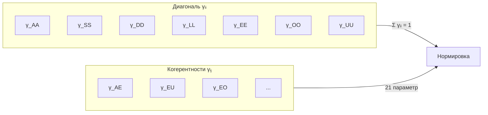

# Матрица Когерентности (Γ)

## Определение

**Матрица Когерентности** $\Gamma$ — линейный оператор на гильбертовом пространстве $\mathcal{H}$, являющийся математическим представлением состояния [Голонома](../structure/holon).

:::info Онтологический статус
Согласно [Аксиоме Ω](../foundations/axiom-omega), $\Gamma$ — не модель реальности, а сама реальность. Матрица когерентности является **единственным примитивом** УГМ, из которого выводятся все физические, информационные и феноменологические аспекты.
:::

### Формальное определение

$$
\Gamma \in \mathcal{L}(\mathcal{H}), \quad \dim(\mathcal{H}) = 7
$$

где $\mathcal{L}(\mathcal{H})$ — пространство линейных операторов на $\mathcal{H}$.

### Разложение в базисе измерений

$$
\Gamma = \sum_{i,j \in \{A,S,D,L,E,O,U\}} \gamma_{ij} |i\rangle\langle j|
$$

где $\{|i\rangle\}$ — **ортонормированный** базис [семи измерений](../structure/dimensions):

$$
\langle i|j\rangle = \delta_{ij} \quad \text{(ортонормированность)}
$$

## Фундаментальные свойства

Матрица когерентности удовлетворяет трём условиям, делающим её корректной **матрицей плотности**:

### 1. Эрмитовость

$$
\Gamma^\dagger = \Gamma \quad \Leftrightarrow \quad \gamma_{ij} = \gamma_{ji}^*
$$

**Следствие:** Все собственные значения $\lambda_k$ вещественны.

### 2. Положительная полуопределённость

$$
\langle\psi|\Gamma|\psi\rangle \geq 0 \quad \forall |\psi\rangle \in \mathcal{H}
$$

**Следствие:** Все собственные значения $\lambda_k \geq 0$.

### 3. Нормировка

$$
\mathrm{Tr}(\Gamma) = \sum_{i \in \{A,S,D,L,E,O,U\}} \gamma_{ii} = 1
$$

**Следствие:** Собственные значения образуют распределение вероятностей: $\sum_k \lambda_k = 1$.

:::note Связь с квантовой механикой
$\Gamma$ формально эквивалентна **матрице плотности** $\rho$ в квантовой механике. Различие онтологическое: в КМ $\rho$ — статистическое описание ансамбля, в УГМ $\Gamma$ — сама субстанция реальности.
:::

## Матричное представление

В базисе $\{|A\rangle, |S\rangle, |D\rangle, |L\rangle, |E\rangle, |O\rangle, |U\rangle\}$ матрица когерентности записывается как $7 \times 7$ эрмитова матрица:

$$
\Gamma = \begin{pmatrix}
\gamma_{AA} & \gamma_{AS} & \gamma_{AD} & \gamma_{AL} & \gamma_{AE} & \gamma_{AO} & \gamma_{AU} \\
\gamma_{AS}^* & \gamma_{SS} & \gamma_{SD} & \gamma_{SL} & \gamma_{SE} & \gamma_{SO} & \gamma_{SU} \\
\gamma_{AD}^* & \gamma_{SD}^* & \gamma_{DD} & \gamma_{DL} & \gamma_{DE} & \gamma_{DO} & \gamma_{DU} \\
\gamma_{AL}^* & \gamma_{SL}^* & \gamma_{DL}^* & \gamma_{LL} & \gamma_{LE} & \gamma_{LO} & \gamma_{LU} \\
\gamma_{AE}^* & \gamma_{SE}^* & \gamma_{DE}^* & \gamma_{LE}^* & \gamma_{EE} & \gamma_{EO} & \gamma_{EU} \\
\gamma_{AO}^* & \gamma_{SO}^* & \gamma_{DO}^* & \gamma_{LO}^* & \gamma_{EO}^* & \gamma_{OO} & \gamma_{OU} \\
\gamma_{AU}^* & \gamma_{SU}^* & \gamma_{DU}^* & \gamma_{LU}^* & \gamma_{EU}^* & \gamma_{OU}^* & \gamma_{UU}
\end{pmatrix}
$$

:::note Число степеней свободы
Эрмитова матрица $7 \times 7$ имеет $7^2 = 49$ вещественных параметров. С учётом нормировки: **48 независимых параметров**.
:::

## Интерпретация элементов

### Диагональные элементы

$\gamma_{ii} \in [0, 1]$ — **вероятность** (или «населённость») $i$-го измерения:

| Элемент | Интерпретация | Описание |
|---------|---------------|----------|
| $\gamma_{AA}$ | Населённость Артикуляции | Степень активности различения |
| $\gamma_{SS}$ | Населённость Структуры | Степень устойчивости формы |
| $\gamma_{DD}$ | Населённость Динамики | Степень активности процессов |
| $\gamma_{LL}$ | Населённость Логики | Степень согласованности |
| $\gamma_{EE}$ | Населённость Опыта | Степень активности переживания |
| $\gamma_{OO}$ | Населённость Основания | Степень связи с источником |
| $\gamma_{UU}$ | Населённость Единства | Степень интегрированности |

**Условие нормировки:**

$$
\sum_{i \in \{A,S,D,L,E,O,U\}} \gamma_{ii} = 1
$$

### Недиагональные элементы (когерентности)

$\gamma_{ij}$ (при $i \neq j$) — **когерентности** (квантовые корреляции) между измерениями.

**Неравенство Коши-Шварца:**

$$
|\gamma_{ij}|^2 \leq \gamma_{ii} \cdot \gamma_{jj}
$$

**Интерпретация когерентностей:**

| Когерентность | Интерпретация |
|---------------|---------------|
| $\gamma_{AE}$ | Внимание (осознанное различение) |
| $\gamma_{SL}$ | Законы (логически устойчивые структуры) |
| $\gamma_{DU}$ | Целенаправленность (интегрированное изменение) |
| $\gamma_{EO}$ | Глубина переживания (связь опыта с источником) |
| $\gamma_{EU}$ | Единство сознания (интегрированный опыт) |

:::info Полный набор когерентностей
Матрица $7 \times 7$ содержит $\binom{7}{2} = 21$ независимых когерентностей. Каждая описывает связь между парой измерений.
:::

## Типы состояний

### Чистое состояние

$$
\Gamma = |\psi\rangle\langle\psi|, \quad \mathrm{rank}(\Gamma) = 1
$$

**Свойства:**
- [Чистота](./viability#определение-чистоты): $P = \mathrm{Tr}(\Gamma^2) = 1$
- [Энтропия фон Неймана](./viability#связь-с-энтропией): $S_{vN} = 0$
- Максимальная когерентность

### Смешанное состояние

$$
\Gamma = \sum_k p_k |\psi_k\rangle\langle\psi_k|, \quad p_k > 0, \quad \sum_k p_k = 1
$$

**Свойства:**
- $\mathrm{rank}(\Gamma) > 1$
- $P < 1$
- $S_{vN} > 0$

### Максимально смешанное состояние

$$
\Gamma = \frac{I_7}{7}, \quad \gamma_{ij} = \frac{\delta_{ij}}{7}
$$

где $I_7$ — единичная матрица $7 \times 7$.

**Свойства:**
- $P = \frac{1}{7} \approx 0.143$ — минимальная чистота
- $S_{vN} = \log 7 \approx 1.95$ — максимальная энтропия
- Все когерентности равны нулю: $\gamma_{ij} = 0$ при $i \neq j$

## Связь с мерами состояния

### Норма Фробениуса

**Норма Фробениуса** — стандартная метрика на пространстве матриц:

$$
\|\Gamma\|_F := \sqrt{\mathrm{Tr}(\Gamma^\dagger \Gamma)} = \sqrt{\sum_{i,j} |\gamma_{ij}|^2}
$$

**Расстояние** между двумя матрицами когерентности:

$$
d_F(\Gamma_1, \Gamma_2) := \|\Gamma_1 - \Gamma_2\|_F
$$

### Чистота (Purity)

$$
P = \mathrm{Tr}(\Gamma^2) = \|\Gamma\|_F^2 = \sum_{i} \gamma_{ii}^2 + \sum_{i \neq j} |\gamma_{ij}|^2 \in \left[\frac{1}{7}, 1\right]
$$

Чистота — мера [жизнеспособности](./viability) Голонома.

### Энтропия фон Неймана

$$
S_{vN} = -\mathrm{Tr}(\Gamma \log \Gamma) = -\sum_k \lambda_k \log \lambda_k
$$

где $\{\lambda_k\}$ — собственные значения $\Gamma$.

**Связь с чистотой:**
- $S_{vN} = 0 \Leftrightarrow P = 1$ (чистое состояние)
- $S_{vN} = \log 7 \Leftrightarrow P = 1/7$ (максимально смешанное)

### Мера интеграции

$$
\Phi(\Gamma) = \frac{\sum_{i \neq j} |\gamma_{ij}|^2}{\sum_i \gamma_{ii}^2}
$$

Мера интеграции связана с [измерением Единства](../structure/dimension-u#мера-интеграции-φ).

## Спектральное разложение

Поскольку $\Gamma$ — эрмитов оператор, существует спектральное разложение:

$$
\Gamma = \sum_{k=1}^{7} \lambda_k |\phi_k\rangle\langle\phi_k|
$$

где:
- $\lambda_k \in [0, 1]$ — собственные значения, $\sum_k \lambda_k = 1$
- $|\phi_k\rangle$ — ортонормированные собственные векторы

**Применение:** Собственные векторы $|\phi_k\rangle$ определяют «главные оси» конфигурации $\Gamma$, а собственные значения $\lambda_k$ — их веса.

## Структура матрицы Γ

**Структура параметров:**
- **7 диагональных** $\gamma_{ii}$ — населённости измерений
- **21 когерентность** $\gamma_{ij}$ ($i \neq j$) — связи между измерениями
- **Всего:** 48 независимых вещественных параметров (с учётом нормировки)

---

**Связанные документы:**
- [Аксиома Ω](../foundations/axiom-omega) — онтологический статус Γ
- [Эволюция](./evolution) — динамика Γ
- [Жизнеспособность](./viability) — мера P и условия существования
- [Семь измерений](../structure/dimensions) — базис пространства состояний
- [Математический аппарат](../../formal/specification) — формальная спецификация
