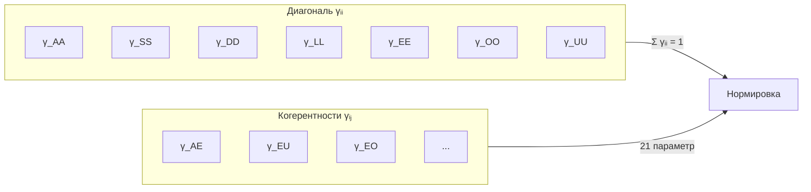

# Матрица Когерентности (Γ)

## Определение

**Матрица Когерентности** $\Gamma$ — линейный оператор на гильбертовом пространстве $\mathcal{H}$, являющийся математическим представлением состояния [Голонома](../structure/holon).

:::info Онтологический статус
Согласно [Аксиоме Ω⁷](../foundations/axiom-omega), единственным примитивом является **∞-топос Sh_∞(𝒞)**. Матрица когерентности $\Gamma$ — **объект** этой категории: $\Gamma \in \text{Ob}(\mathcal{C})$.

$\Gamma$ — не модель реальности, а сама реальность. Из структуры ∞-топоса выводятся базовое пространство $X = |N(\mathcal{C})|$, время, метрика и все физические аспекты.
:::

### Формальное определение

$$
\Gamma \in \mathcal{L}(\mathcal{H}), \quad \dim(\mathcal{H}) = 7
$$

где $\mathcal{L}(\mathcal{H})$ — пространство линейных операторов на $\mathcal{H}$.

### Разложение в базисе измерений

$$
\Gamma = \sum_{i,j \in \{A,S,D,L,E,O,U\}} \gamma_{ij} |i\rangle\langle j|
$$

где $\{|i\rangle\}$ — **ортонормированный** базис [семи измерений](../structure/dimensions):

$$
\langle i|j\rangle = \delta_{ij} \quad \text{(ортонормированность)}
$$

## Фундаментальные свойства

Матрица когерентности удовлетворяет трём условиям, делающим её корректной **матрицей плотности**:

### 1. Эрмитовость

$$
\Gamma^\dagger = \Gamma \quad \Leftrightarrow \quad \gamma_{ij} = \gamma_{ji}^*
$$

**Следствие:** Все собственные значения $\lambda_k$ вещественны.

### 2. Положительная полуопределённость

$$
\langle\psi|\Gamma|\psi\rangle \geq 0 \quad \forall |\psi\rangle \in \mathcal{H}
$$

**Следствие:** Все собственные значения $\lambda_k \geq 0$.

:::note Сохранение при эволюции
Положительность $\Gamma \geq 0$ **сохраняется** при полной эволюции (включая нелинейную регенерацию) благодаря CPTP-структуре. См. [теорему о сохранении положительности](./evolution#сохранение-положительности).
:::

### 3. Нормировка

$$
\mathrm{Tr}(\Gamma) = \sum_{i \in \{A,S,D,L,E,O,U\}} \gamma_{ii} = 1
$$

**Следствие:** Собственные значения образуют распределение вероятностей: $\sum_k \lambda_k = 1$.

:::note Связь с квантовой механикой
$\Gamma$ формально эквивалентна **матрице плотности** $\rho$ в квантовой механике. Различие онтологическое: в КМ $\rho$ — статистическое описание ансамбля, в УГМ $\Gamma$ — сама субстанция реальности.
:::

## Матричное представление

В базисе $\{|A\rangle, |S\rangle, |D\rangle, |L\rangle, |E\rangle, |O\rangle, |U\rangle\}$ матрица когерентности записывается как $7 \times 7$ эрмитова матрица:

$$
\Gamma = \begin{pmatrix}
\gamma_{AA} & \gamma_{AS} & \gamma_{AD} & \gamma_{AL} & \gamma_{AE} & \gamma_{AO} & \gamma_{AU} \\
\gamma_{AS}^* & \gamma_{SS} & \gamma_{SD} & \gamma_{SL} & \gamma_{SE} & \gamma_{SO} & \gamma_{SU} \\
\gamma_{AD}^* & \gamma_{SD}^* & \gamma_{DD} & \gamma_{DL} & \gamma_{DE} & \gamma_{DO} & \gamma_{DU} \\
\gamma_{AL}^* & \gamma_{SL}^* & \gamma_{DL}^* & \gamma_{LL} & \gamma_{LE} & \gamma_{LO} & \gamma_{LU} \\
\gamma_{AE}^* & \gamma_{SE}^* & \gamma_{DE}^* & \gamma_{LE}^* & \gamma_{EE} & \gamma_{EO} & \gamma_{EU} \\
\gamma_{AO}^* & \gamma_{SO}^* & \gamma_{DO}^* & \gamma_{LO}^* & \gamma_{EO}^* & \gamma_{OO} & \gamma_{OU} \\
\gamma_{AU}^* & \gamma_{SU}^* & \gamma_{DU}^* & \gamma_{LU}^* & \gamma_{EU}^* & \gamma_{OU}^* & \gamma_{UU}
\end{pmatrix}
$$

:::note Число степеней свободы
Эрмитова матрица $7 \times 7$ имеет $7^2 = 49$ вещественных параметров. С учётом нормировки: **48 независимых параметров**.

Из них **34** — физически различимые ($G_2$-инвариантные), а $14 = \dim(G_2)$ — калибровочные степени свободы. [Теорема $G_2$-ригидности](/docs/proofs/categorical/uniqueness-theorem#физические-состояния) [Т] доказывает, что $G_2 = \mathrm{Aut}(\mathbb{O})$ — максимальная калибровочная группа: пространство физических состояний $\mathcal{D}_{\mathrm{phys}} = \mathcal{D}(\mathbb{C}^7)/G_2$ имеет $\dim = 34$.
:::

## Интерпретация элементов

### Диагональные элементы

$\gamma_{ii} \in [0, 1]$ — **вероятность** (или «населённость») $i$-го измерения:

| Элемент | Интерпретация | Описание |
|---|---|---|
| $\gamma_{AA}$ | Населённость Артикуляции | Степень активности различения |
| $\gamma_{SS}$ | Населённость Структуры | Степень устойчивости формы |
| $\gamma_{DD}$ | Населённость Динамики | Степень активности процессов |
| $\gamma_{LL}$ | Населённость Логики | Степень согласованности |
| $\gamma_{EE}$ | Населённость Интериорности | Интенсивность интериорных состояний |
| $\gamma_{OO}$ | Населённость Основания | Степень связи с источником |
| $\gamma_{UU}$ | Населённость Единства | Степень интегрированности |

**Условие нормировки:**

$$
\sum_{i \in \{A,S,D,L,E,O,U\}} \gamma_{ii} = 1
$$

### Недиагональные элементы (когерентности)

$\gamma_{ij}$ (при $i \neq j$) — **когерентности** (квантовые корреляции) между измерениями.

**Неравенство Коши-Шварца:**

$$
|\gamma_{ij}|^2 \leq \gamma_{ii} \cdot \gamma_{jj}
$$

**Полная таблица когерентностей ($\binom{7}{2} = 21$ пара):**

Каждая когерентность $\gamma_{ij}$ ($i \neq j$) количественно выражает степень квантовой корреляции между измерениями $i$ и $j$. Модуль $|\gamma_{ij}|$ — сила связи, аргумент $\arg(\gamma_{ij})$ — относительная фаза.

| Когерентность | Имя | Фундаментальное значение |
|---|---|---|
| $\gamma_{AS}$ | **Морфогенез** | Кристаллизация различий в устойчивые формы |
| $\gamma_{AD}$ | **Актуализация** | Потенциальное различение, актуализированное в процессе |
| $\gamma_{AL}$ | **Предикация** | Различение, ставшее логическим предикатом |
| $\gamma_{AE}$ | **Апперцепция** | Различение, вошедшее в интериорность |
| $\gamma_{AO}$ | **Спонтанность** | Возникновение различений из основания без внешней причины |
| $\gamma_{AU}$ | **Дифференциация** | Различение, сохраняющее целостность |
| $\gamma_{SD}$ | **Персистенция** | Форма, сохраняющаяся через процесс |
| $\gamma_{SL}$ | **Номос** | Структура, обладающая логической необходимостью |
| $\gamma_{SE}$ | **Репрезентация** | Структура, представленная в интериорности |
| $\gamma_{SO}$ | **Архетип** | Устойчивые формы, укоренённые в основании |
| $\gamma_{SU}$ | **Симметрия** | Структурное выражение единства |
| $\gamma_{DL}$ | **Регуляция** | Логически управляемый процесс |
| $\gamma_{DE}$ | **Аффекция** | Действие процесса на интериорность |
| $\gamma_{DO}$ | **Генезис** | Порождающий процесс из основания |
| $\gamma_{DU}$ | **Телеология** | Интегрированное направленное изменение |
| $\gamma_{LE}$ | **Эвиденция** | Логическая связность в интериорности |
| $\gamma_{LO}$ | **Фундирование** | Логика, укоренённая в основании |
| $\gamma_{LU}$ | **Консистентность** | Логическая непротиворечивость целого |
| $\gamma_{EO}$ | **Имманентность** | Основание, присутствующее внутри интериорности |
| $\gamma_{EU}$ | **Синтез** | Интеграция интериорного содержания в целое |
| $\gamma_{OU}$ | **Полнота** | Тождество источника и целого |

Междисциплинарные проявления когерентностей

| Когерентность | Имя | Физика | Биология | Когнитивистика |
|---|---|---|---|---|
| $\gamma_{AS}$ | Морфогенез | Спонтанное нарушение симметрии | Органогенез | Формирование понятий |
| $\gamma_{AD}$ | Актуализация | Возбуждение моды | Рецепция стимула | Обнаружение сигнала |
| $\gamma_{AL}$ | Предикация | Классификация состояний | Распознавание паттернов | Суждение |
| $\gamma_{AE}$ | Апперцепция | Квантовое наблюдение | Сенсорная интеграция | Осознанное восприятие |
| $\gamma_{AO}$ | Спонтанность | Вакуумные флуктуации | Мутагенез | Инсайт |
| $\gamma_{AU}$ | Дифференциация | Расщепление спектра | Клеточная дифференциация | Анализ |
| $\gamma_{SD}$ | Персистенция | Стационарное состояние | Гомеостаз | Устойчивость репрезентации |
| $\gamma_{SL}$ | Номос | Закон сохранения | Генетический код | Правило |
| $\gamma_{SE}$ | Репрезентация | Наблюдаемая (оператор) | Перцептивное поле | Ментальная модель |
| $\gamma_{SO}$ | Архетип | Основное состояние | Генотип | Прототип |
| $\gamma_{SU}$ | Симметрия | Группа симметрии | Билатеральность | Гармония |
| $\gamma_{DL}$ | Регуляция | Обратная связь | Гомеостатическая петля | Исполнительный контроль |
| $\gamma_{DE}$ | Аффекция | Диссипация | Стресс-реакция | Эмоциональный отклик |
| $\gamma_{DO}$ | Генезис | Рождение частиц | Абиогенез | Креативность |
| $\gamma_{DU}$ | Телеология | Минимизация действия | Адаптация | Целеполагание |
| $\gamma_{LE}$ | Эвиденция | Измеримость | Обучение | Момент понимания |
| $\gamma_{LO}$ | Фундирование | Первые принципы | Эволюционная необходимость | Аподиктичность |
| $\gamma_{LU}$ | Консистентность | Калибровочная инвариантность | Геномная целостность | Когнитивная согласованность |
| $\gamma_{EO}$ | Имманентность | Вакуумная энергия | Витальность | Ощущение присутствия |
| $\gamma_{EU}$ | Синтез | Суперпозиция | Системная интеграция | Единство опыта |
| $\gamma_{OU}$ | Полнота | Унитарность | Экосистемная замкнутость | Завершённость |

## Дуально-аспектная семантика: 49 элементов {#дуально-аспектная-семантика}

Стандартный подход рассматривает $\gamma_{ij}$ и $\gamma_{ji}$ как «одну и ту же» когерентность, записанную с двух сторон. Однако в УГМ наддиагональные и поддиагональные элементы несут **различную семантику** через отображения $\mathrm{Map}_{\mathrm{ext}}$ и $\mathrm{Map}_{\mathrm{int}}$.

### Декомпозиция когерентности

Любой недиагональный элемент $\gamma_{ij}$ ($i \neq j$) — комплексное число:

$$
\gamma_{ij} = |\gamma_{ij}| \cdot e^{i\theta_{ij}} = \underbrace{\mathrm{Re}(\gamma_{ij})}_{\text{симметричная часть}} + i \underbrace{\mathrm{Im}(\gamma_{ij})}_{\text{направленная часть}}
$$

Эрмитовость $\Gamma^\dagger = \Gamma$ означает $\gamma_{ji} = \gamma_{ij}^*$, что даёт:

| Компонента | Свойство | Семантика |
|---|---|---|
| $\lvert\gamma_{ij}\rvert = \lvert\gamma_{ji}\rvert$ | Модули равны | Сила связи одна и та же для внешнего и внутреннего |
| $\mathrm{Re}(\gamma_{ij}) = \mathrm{Re}(\gamma_{ji})$ | Действительные части равны | **Общее**: то, что совпадает между внешним и внутренним |
| $\mathrm{Im}(\gamma_{ij}) = -\mathrm{Im}(\gamma_{ji})$ | Мнимые части противоположны | **Зазор (Gap)**: то, чем внешнее отличается от внутреннего |
| $\arg(\gamma_{ij}) = -\arg(\gamma_{ji})$ | Фазы противоположны | Направление «стрелы дуальности» обратно для экстериорной и интериорной проекций |

### Принцип сопряжённой пары (Т.4.1) {#принцип-сопряжённой-пары}

:::info Интерпретация [И]
Принцип сопряжённой пары — семантическое утверждение (интерпретация модуля как «общего», фазы как «перспективы»), не математическая теорема. Математическое содержание — тривиальное следствие полярного разложения комплексного числа.
:::

Для каждой когерентности $\gamma_{ij}$:

$$
\underbrace{\gamma_{ij}}_{\text{внешнее}} = \underbrace{|\gamma_{ij}|}_{\text{общее}} \cdot \underbrace{e^{i\theta}}_{\text{перспектива}}, \qquad \underbrace{\gamma_{ji}}_{\text{внутреннее}} = \underbrace{|\gamma_{ij}|}_{\text{общее}} \cdot \underbrace{e^{-i\theta}}_{\text{обратная перспектива}}
$$

1. **Модуль** $|\gamma_{ij}|$ — **инвариант** дуальности: сила связи не зависит от перспективы
2. **Фаза** $\theta$ — **индекс перспективы**: «угол зрения» на одну и ту же связь
3. **$\mathrm{Gap}(i,j) = |\sin\theta|$** — мера несовпадения внешнего и внутреннего

**Следствие:** Полностью «прозрачная» система (все $\gamma_{ij} \in \mathbb{R}$) — теоретический предел, в котором экстериорный и интериорный аспекты совпадают. Это состояние эквивалентно **Уровню L4** (унитарное сознание), при котором $\varphi(\Gamma) = \Gamma$ и все фазы обнуляются.

### Мера зазора (Gap) для каждой пары {#мера-зазора}

**Определение.** Зазор (Gap) между внешним и внутренним аспектом когерентности $\gamma_{ij}$:

$$
\mathrm{Gap}(i,j) := \frac{|\mathrm{Im}(\gamma_{ij})|}{|\gamma_{ij}|} = |\sin(\arg(\gamma_{ij}))| \in [0, 1]
$$

**Интерпретация:**

- **Gap = 0** ($\gamma_{ij} \in \mathbb{R}$): полная прозрачность. Экстериорная и интериорная проекции совпадают.
- **Gap = 1** ($\gamma_{ij} \in i\mathbb{R}$): максимальная непрозрачность. Внешнее и внутреннее полностью ортогональны.
- **Gap $\in (0, 1)$**: частичный зазор — норма для живых систем.

:::note Связь с [динамикой Gap](./gap-dynamics)
Эволюция, диагностика и термодинамика Gap подробно рассмотрены в [Gap-динамике](./gap-dynamics) и [Gap-термодинамике](./gap-thermodynamics). Фазовая диагностика (карта прозрачности) и терапевтические протоколы — в [Gap-семантике](/docs/physics/dual-aspect/gap-semantics).
:::

### 49-клеточная карта: структура {#49-клеточная-карта}

Полная матрица $\Gamma$ содержит не 28 (7 + 21), а **49 содержательных элементов**:

| Область матрицы | Количество | Семантика | Отображение |
|---|---|---|---|
| **Диагональ** $\gamma_{ii}$ | 7 | Населённости измерений (Gap $= 0$ тождественно) | Общее для $\mathrm{Map}_{\mathrm{ext}}$ и $\mathrm{Map}_{\mathrm{int}}$ |
| **Верхний треугольник** $\gamma_{ij}$ ($i < j$) | 21 | Внешние проекции когерентностей | $\mathrm{Map}_{\mathrm{ext}}$: как связь **выглядит** для наблюдателя |
| **Нижний треугольник** $\gamma_{ji}$ ($j > i$) | 21 | Интериорные проекции когерентностей | $\mathrm{Map}_{\mathrm{int}}$: как связь **представлена** со стороны системы (сопряжённая проекция) |

:::tip Эрмитово сопряжение как функтор дуальности [И]
Пусть $\Gamma \in \mathrm{Ob}(\mathcal{C})$ — матрица когерентности в $\infty$-топосе $\mathrm{Sh}_\infty(\mathcal{C})$. Тогда эрмитово сопряжение $*$ реализует функтор дуальности:

$$
*: \mathrm{Map}_{\mathrm{ext}}(i, j) \longrightarrow \mathrm{Map}_{\mathrm{int}}(j, i)
$$

удовлетворяющий: (1) **Инволютивность:** $** = \mathrm{id}$; (2) **Сохранение модуля:** $|*(\gamma_{ij})| = |\gamma_{ij}|$; (3) **Обращение фазы:** $\arg(*(\gamma_{ij})) = -\arg(\gamma_{ij})$.

Отождествление «верхний треугольник = $\mathrm{Map}_{\mathrm{ext}}$, нижний = $\mathrm{Map}_{\mathrm{int}}$» — семантическая интерпретация (постулат УГМ), а не выводимая теорема. Эрмитовость — свойство любой матрицы плотности; двойственная интерпретация — дополнительный постулат.
:::

:::info Полные таблицы 21 внешней и 21 внутренней проекций
Полная 49-клеточная карта с таблицей внешних проекций ($\mathrm{Map}_{\mathrm{ext}}$: Морфогенез, Актуализация, Предикация, ...) и интериорных проекций ($\mathrm{Map}_{\mathrm{int}}$: Фильтр, Поток, Рамка, ...) приведена в [Gap-семантике: 49 элементов](/docs/physics/dual-aspect/gap-semantics#полная-49-клеточная-карта).
:::

### Квантовый ток между измерениями (Т.2.2) {#квантовый-ток}

:::tip Теорема 2.2: Межизмеренческий ток вероятности [Т]
Для пары измерений $(i, j)$ ток вероятности определяется:

$$
J_{i \leftarrow j} = \frac{2}{\hbar} \, \mathrm{Im}(H_{ij} \cdot \gamma_{ji}) = \frac{2}{\hbar} \, \mathrm{Im}(H_{ij} \cdot \gamma_{ij}^*)
$$

**Нетто-ток:**

$$
J_{\mathrm{net}}(i,j) = 2|H_{ij}| \cdot |\gamma_{ij}| \cdot \sin(\alpha_{ij} - \theta_{ij})
$$

где $\alpha_{ij} = \arg(H_{ij})$, $\theta_{ij} = \arg(\gamma_{ij})$.
:::

**Следствия:**

1. **Направление тока** определяется разностью фаз $(\alpha - \theta)$:
   - $\sin(\alpha - \theta) > 0$: ток течёт от $j$ к $i$ (измерение $i$ «получает» от $j$)
   - $\sin(\alpha - \theta) < 0$: ток течёт от $i$ к $j$
   - $\sin(\alpha - \theta) = 0$: равновесие, ток отсутствует

2. **Осцилляция тока** при унитарной эволюции — фаза вращается:

$$
\theta_{ij}(\tau) = \theta_{ij}(0) + (\omega_i - \omega_j) \cdot \tau
$$

где $\omega_i, \omega_j$ — собственные частоты гамильтониана. Ток **осциллирует** с частотой $|\omega_i - \omega_j|$.

3. **Уравнение непрерывности** (сохранение нормировки):

$$
\frac{d}{d\tau} \mathrm{Tr}(\Gamma) = 0 \quad \Rightarrow \quad \sum_{j \neq i} J_{\mathrm{net}}(i,j) = -\frac{d\gamma_{ii}}{d\tau}\bigg|_{\text{unitary}}
$$

Что уходит из населённости $\gamma_{ii}$, распределяется по токам к другим измерениям.

## Типы состояний

### Чистое состояние

$$
\Gamma = |\psi\rangle\langle\psi|, \quad \mathrm{rank}(\Gamma) = 1
$$

**Свойства:**
- [Чистота](./viability#определение-чистоты): $P = \mathrm{Tr}(\Gamma^2) = 1$
- [Энтропия фон Неймана](./viability#связь-с-энтропией): $S_{vN} = 0$
- Максимальная когерентность

### Смешанное состояние

$$
\Gamma = \sum_k p_k |\psi_k\rangle\langle\psi_k|, \quad p_k > 0, \quad \sum_k p_k = 1
$$

**Свойства:**
- $\mathrm{rank}(\Gamma) > 1$
- $P < 1$
- $S_{vN} > 0$

### Максимально смешанное состояние

$$
\Gamma = \frac{I_7}{7}, \quad \gamma_{ij} = \frac{\delta_{ij}}{7}
$$

где $I_7$ — единичная матрица $7 \times 7$.

**Свойства:**
- $P = \frac{1}{7} \approx 0.143$ — минимальная чистота
- $S_{vN} = \log 7 \approx 1.95$ — максимальная энтропия
- Все когерентности равны нулю: $\gamma_{ij} = 0$ при $i \neq j$

## Связь с мерами состояния

### Норма Фробениуса

**Норма Фробениуса** — стандартная метрика на пространстве матриц:

$$
\|\Gamma\|_F := \sqrt{\mathrm{Tr}(\Gamma^\dagger \Gamma)} = \sqrt{\sum_{i,j} |\gamma_{ij}|^2}
$$

**Расстояние** между двумя матрицами когерентности:

$$
d_F(\Gamma_1, \Gamma_2) := \|\Gamma_1 - \Gamma_2\|_F
$$

### Чистота (Purity)

$$
P = \mathrm{Tr}(\Gamma^2) = \|\Gamma\|_F^2 = \sum_{i} \gamma_{ii}^2 + \sum_{i \neq j} |\gamma_{ij}|^2 \in \left[\frac{1}{7}, 1\right] \quad \text{(тождество } \mathrm{Tr}(\Gamma^2) = \|\Gamma\|_F^2 \text{ верно, т.к. } \Gamma \text{ эрмитова)}
$$

Чистота — мера [жизнеспособности](./viability) Голонома.

### Энтропия фон Неймана {#энтропия-фон-неймана}

$$
S_{vN} = -\mathrm{Tr}(\Gamma \log \Gamma) = -\sum_k \lambda_k \log \lambda_k
$$

где $\{\lambda_k\}$ — собственные значения $\Gamma$.

**Связь с чистотой:**
- $S_{vN} = 0 \Leftrightarrow P = 1$ (чистое состояние)
- $S_{vN} = \log 7 \Leftrightarrow P = 1/7$ (максимально смешанное)

### Мера интеграции

$$
\Phi(\Gamma) = \frac{\sum_{i \neq j} |\gamma_{ij}|^2}{\sum_i \gamma_{ii}^2}
$$

Мера интеграции связана с [измерением Единства](../structure/dimension-u#мера-интеграции-φ).

## Спектральное разложение

Поскольку $\Gamma$ — эрмитов оператор, существует спектральное разложение:

$$
\Gamma = \sum_{k=1}^{7} \lambda_k |\phi_k\rangle\langle\phi_k|
$$

где:
- $\lambda_k \in [0, 1]$ — собственные значения, $\sum_k \lambda_k = 1$
- $|\phi_k\rangle$ — ортонормированные собственные векторы

**Применение:** Собственные векторы $|\phi_k\rangle$ определяют «главные оси» конфигурации $\Gamma$, а собственные значения $\lambda_k$ — их веса.

## Структура матрицы Γ

**Структура параметров:**
- **7 диагональных** $\gamma_{ii}$ — населённости измерений
- **21 когерентность** $\gamma_{ij}$ ($i \neq j$) — связи между измерениями
- **Всего:** 48 независимых вещественных параметров (с учётом нормировки)

## Два уровня формализации

:::warning Важное уточнение: минимальный vs. расширенный формализм
УГМ использует **два уровня** математического описания. Непонимание этого различия приводит к ошибкам интерпретации.
:::

### Минимальный 7D-формализм (концептуальный)

Согласно [Теореме S](../../proofs/minimality/theorem-minimality-7), **минимальная** размерность для автопоэтической системы:

$$
\mathcal{H}_{\min} = \mathbb{C}^7 = \mathrm{span}\{|A\rangle, |S\rangle, |D\rangle, |L\rangle, |E\rangle, |O\rangle, |U\rangle\}
$$

Это **простое** 7-мерное пространство, **не** тензорное произведение (поскольку 7 — простое число).

**Применение:** Концептуальный анализ, доказательство минимальности, структурные теоремы.

### Расширенный тензорный формализм (операциональный)

Для описания **реальных систем** и определения частичного следа каждое измерение наделяется собственным гильбертовым пространством:

$$
\mathcal{H}_{\text{ext}} = \bigotimes_{i \in \{A,S,D,L,E,O,U\}} \mathcal{H}_i
$$

где $\dim(\mathcal{H}_i) \geq 1$ зависит от сложности системы.

**Связь формализмов:** Минимальный случай $\dim(\mathcal{H}_i) = 1$ для всех $i$ **не** даёт тензорного произведения ($1^7 = 1 \neq 7$). Расширенный формализм — это **обобщение**, где:

$$
\dim(\mathcal{H}_{\text{ext}}) = \prod_i \dim(\mathcal{H}_i)
$$

**Применение:** Частичный след $\rho_E = \mathrm{Tr}_{-E}(\Gamma)$, иерархия интериорности, операциональные определения.

### Согласование формализмов

| Аспект | Минимальный (7D) | Расширенный (тензорный) |
|---|---|---|
| Пространство | $\mathbb{C}^7$ | $\bigotimes_i \mathcal{H}_i$ |
| Тензорная структура | Нет | Да |
| Частичный след | Не определён | Определён |
| Применение | Теоремы, концепции | Операциональные меры |
| $\rho_E$ | Скаляр $\gamma_{EE}$ | Оператор на $\mathcal{H}_E$ |

:::info Математическая связь формализмов
Два формализма связаны через **каноническую проекцию** и **вложение**. Это не произвольная интерпретация, а строгая математическая конструкция.
:::

#### Теорема (Связь формализмов)

**Вложение (минимальный → расширенный):**

Пусть $\dim(\mathcal{H}_i) = d_i \geq 1$. Определим вложение:

$$
\iota: \mathcal{L}(\mathbb{C}^7) \hookrightarrow \mathcal{L}\left(\bigotimes_i \mathcal{H}_i\right)
$$

$$
\iota(\Gamma) := \sum_{i,j} \gamma_{ij} \cdot |e_i\rangle\langle e_j|
$$

где $|e_i\rangle := |0_1\rangle \otimes ... \otimes |1_i\rangle \otimes ... \otimes |0_7\rangle$ — состояние с «возбуждением» в i-м подпространстве, $|0_k\rangle, |1_k\rangle \in \mathcal{H}_k$ — ортонормированные базисные состояния.

**Проекция (расширенный → минимальный):**

$$
\pi: \mathcal{L}\left(\bigotimes_i \mathcal{H}_i\right) \to \mathcal{L}(\mathbb{C}^7)
$$

$$
\pi(\Gamma_{ext})_{ij} := \langle e_i | \Gamma_{ext} | e_j \rangle
$$

где $|e_i\rangle$ — базисные состояния из определения вложения $\iota$.

**Свойства:**

| Свойство | Формула | Следствие |
|---|---|---|
| Согласованность | $\pi \circ \iota = \mathrm{id}$ | Проекция восстанавливает минимальное представление |
| Сохранение P | $P(\iota(\Gamma)) \geq P(\Gamma)$ | Чистота не уменьшается при вложении |
| Сохранение $\Phi$ | $\Phi(\pi(\Gamma_{ext})) \approx \Phi_{eff}(\Gamma_{ext})$ | Интеграция согласована |

#### Область определения операций

| Операция | Минимальный 7D | Расширенный | Формула перехода |
|---|---|---|---|
| $P = \mathrm{Tr}(\Gamma^2)$ | Да | Да | $P(\Gamma) = P(\iota(\Gamma))$ |
| $\Phi = \sum_{i\neq j}\lVert\gamma_{ij}\rVert^2 / \sum_i \gamma_{ii}^2$ | Да | Да | Согласовано |
| $\rho_E = \mathrm{Tr}_{-E}(\Gamma)$ | Нет | Да | Требуется $\iota$ |
| $D_{diff} = \exp(S_{vN}(\rho_E))$ | Нет | Да | Вычисляется в расширенном |
| $R = 1 - \lVert\Gamma - \varphi(\Gamma)\rVert^2_F / \lVert\Gamma\rVert^2_F$ | Да | Да | Согласовано |

:::warning Правило использования формализмов
1. **Теоремы о минимальности** (Теорема S, $\dim \geq 7$) — доказываются в минимальном формализме
2. **Операции с подсистемами** ($\rho_E$, $D_{diff}$, частичный след) — только в расширенном формализме
3. **Мера сознательности C** — полностью вычислима только в расширенном формализме; в минимальном используется упрощённая формула $C_{min} = \Phi \times R$

**Практическое следствие:** При анализе конкретных систем всегда работаем в расширенном формализме. Минимальный формализм — инструмент для структурных доказательств.
:::

### Тензорное расширение для Page-Wootters {#тензорное-расширение-page-wootters}

Для механизма Page-Wootters ([Свойство 3 Ω⁷](../foundations/axiom-omega#свойство-3)) требуется специальное тензорное разложение:

$$
\mathcal{H}_{total} = \mathcal{H}_O \otimes \mathcal{H}_{6D}
$$

где:
- $\mathcal{H}_O \cong \mathbb{C}^7$ — пространство [измерения O](../structure/dimension-o) (внутренние часы). Размерность 7 определяется числом дискретных «тактов» часов: каждому из 7 измерений {A,S,D,L,E,O,U} соответствует момент времени $|\tau_n\rangle$, $n = 0,\ldots,6$, связанный с циклическим действием $Z_7$ ([оператор сдвига $V_O$](../structure/dimension-o#оператор-сдвига-v_o))
- $\mathcal{H}_{6D} = \mathrm{span}\{|A\rangle, |S\rangle, |D\rangle, |L\rangle, |E\rangle, |U\rangle\} \cong \mathbb{C}^6$ — остальные измерения

**Глобальная матрица когерентности:**

$$
\Gamma_{total} \in \mathcal{L}(\mathcal{H}_O \otimes \mathcal{H}_{6D})
$$

**Размерность:** $\dim(\mathcal{H}_{total}) = 7 \times 6 = 42$

**Связь с 7D-матрицей через условные состояния:**

Условное состояние при фиксированном моменте времени $\tau$:

$$
\Gamma(\tau) = \frac{\mathrm{Tr}_O\left[ (|\tau\rangle\langle \tau|_O \otimes \mathbb{1}_{6D}) \cdot \Gamma_{total} \right]}{p(\tau)}
$$

где:
- $|\tau\rangle_O$ — [базис часов](../structure/dimension-o#оператор-сдвига-v_o)
- $p(\tau) = \mathrm{Tr}\left[ (|\tau\rangle\langle \tau|_O \otimes \mathbb{1}_{6D}) \cdot \Gamma_{total} \right]$ — вероятность момента времени

**Свойства условного состояния:**
- $\Gamma(\tau) \in \mathcal{L}(\mathcal{H}_{6D})$ — матрица $6 \times 6$
- $\Gamma(\tau)^\dagger = \Gamma(\tau)$, $\Gamma(\tau) \geq 0$, $\mathrm{Tr}(\Gamma(\tau)) = 1$
- Динамика: $i\frac{\partial}{\partial\tau}\Gamma(\tau) = [H_{eff}(\tau), \Gamma(\tau)]$

:::warning Связь формализмов
| Формализм | Пространство | $\Gamma$ | Применение |
|---|---|---|---|
| Минимальный 7D | $\mathbb{C}^7$ | $7 \times 7$ матрица | Теоремы, концепции |
| Тензорный Page-Wootters | $\mathbb{C}^7 \otimes \mathbb{C}^6$ | $42 \times 42$ матрица | Эмерджентное время |
| Условные состояния | $\mathbb{C}^6$ | $6 \times 6$ матрица | Динамика при фиксированном τ |

**Согласование:** Минимальный 7D-формализм вложен в тензорный Page-Wootters через выбор **эквидистантного времени** $p(\tau) = 1/7$:
$$
\Gamma_{7D} = \frac{1}{7} \sum_{n=0}^{6} |\tau_n\rangle\langle \tau_n| \otimes \Gamma(\tau_n) + \text{корреляции}
$$

Все три формализма описывают **один и тот же физический объект** на разных уровнях детализации:
- 7D: структурный анализ (какие измерения есть)
- 42D: временно́й анализ (как измерения коррелируют с часами)
- 6D: мгновенный анализ (состояние в момент τ)
:::

### Когда какой формализм использовать

| Задача | Формализм | Обоснование |
|---|---|---|
| Доказательство $\dim \geq 7$ | Минимальный | Достаточно для структурных теорем |
| Определение $\rho_E$, $\mathrm{Tr}_{-E}$ | Расширенный | Требуется тензорная структура |
| Мера интеграции $\Phi$ | Оба | $\Phi = \sum_{i \neq j} \lvert\gamma_{ij}\rvert^2 / \sum_i \gamma_{ii}^2$ не требует тензорной структуры |
| Иерархия L0→L1→L2→L3→L4 | Расширенный | Условия L1–L4 требуют $\rho_E$ с $\mathrm{rank} > 1$ |
| Феноменология конкретной системы | Расширенный | Нужна структура $\mathcal{H}_E$ |

---

### Фановская структура когерентностей {#фановская-структура}

:::info Октонионная структура когерентностей [С]
Матрица $\Gamma$ содержит $\binom{7}{2} = 21$ когерентность $\gamma_{ij}$. В [октонионной интерпретации](../structure/dimensions#октонионная-интерпретация) эти 21 пара соответствуют 21 ребру полного графа $K_7$ на 7 вершинах.

[Плоскость Фано](../../proofs/minimality/theorem-octonionic-derivation#плоскость-фано) PG(2,2) выделяет **7 триплетов** — линий, на которых октонионное умножение замкнуто. Каждый триплет $(e_i, e_j, e_k)$ определяет ассоциативную подалгебру, изоморфную Im($\mathbb{H}$).

**Предсказание [Т]:** Когерентности внутри Фано-триплетов могут проявлять более сильные корреляции, чем между триплетами. Мост [Т] (замкнут, T15).

[Структурный вывод →](../../proofs/minimality/theorem-octonionic-derivation)
:::

**Связанные документы:**
- [Аксиома Ω⁷](../foundations/axiom-omega) — ∞-топос Sh_∞(𝒞) как примитив
- [Эволюция](./evolution) — динамика Γ(τ) с внутренним временем
- [Эмерджентное время](../../proofs/dynamics/emergent-time) — τ из структуры Γ
- [Жизнеспособность](./viability) — мера P и условия существования
- [Семь измерений](../structure/dimensions) — базис пространства состояний
- [Математический аппарат](../../reference/specification) — формальная спецификация
- [Gap-семантика: 49 элементов](/docs/physics/dual-aspect/gap-semantics) — полная 49-клеточная карта, фазовая диагностика и прогностика
- [Динамика Gap](./gap-dynamics) — Gap-оператор, бифуркации, немарковская динамика
- [Gap-термодинамика](./gap-thermodynamics) — термодинамические аспекты зазора
