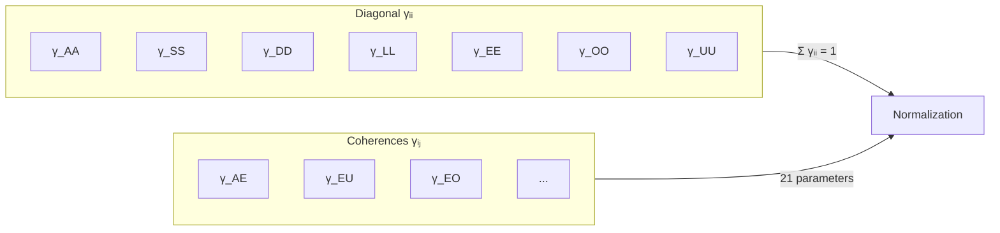

# Coherence Matrix (Γ)

This chapter is dedicated to the central object of the Unitary Holonomic Monism — the **coherence matrix** $\Gamma$. If the entire theory describes how reality is structured, then $\Gamma$ is its **complete description** for any specific system (holonom). After studying this chapter, the reader will understand: what $\Gamma$ is and why it is $7 \times 7$; what the diagonal elements and coherences mean; how to extract information about viability, consciousness, and the internal structure of a system from a single matrix.

:::info Historical Precursors
The idea of describing a system's state with a matrix has deep roots in physics:

- **Werner Heisenberg** (1925) created **matrix mechanics** — the first formulation of quantum theory, where observables were represented as matrices. This was a radical step: instead of particle trajectories — tables of numbers.
- **John von Neumann** (1927) introduced the **density matrix** $\rho$ to describe mixed quantum states — situations where a system is not in a single definite state, but represents a statistical mixture.
- **Felix Bloch** (1946) showed that for the simplest quantum system (a qubit, $2 \times 2$), the density matrix can be visualized as a point inside the **Bloch sphere** — a clear geometric picture.

The coherence matrix $\Gamma$ in UHM generalizes von Neumann's density matrix to the 7-dimensional case with a fundamentally new ontology: $\Gamma$ is not a statistical description of an ensemble, but the **substance of reality itself**.
:::

:::tip Intuitive Explanation
Imagine an **equalizer** — a panel with sliders you can see in an audio editor. An equalizer has 7 bands: each is responsible for its own frequency. Slide a slider up — that frequency sounds louder.

The coherence matrix $\Gamma$ is an **equalizer for the holonom with 7 dimensions**:
- **Diagonal elements** $\gamma_{ii}$ are the "sliders". Each shows how much "attention" or "resource" is concentrated on a given dimension (Articulation, Structure, Dynamics, Logic, Interiority, Ground, Unity).
- **Coherences** $\gamma_{ij}$ (off-diagonal elements) are the "connection knobs" between bands. They show how synchronized two dimensions are. If $|\gamma_{ij}|$ is large — dimensions $i$ and $j$ are closely connected and work in concert. If $|\gamma_{ij}| = 0$ — they are completely independent.

The equalizer analogy captures the essence well, but $\Gamma$ is richer: coherences are **complex** numbers, and their phase carries information about the "opacity" (Gap) between the external and internal aspects of the connection.
:::

## Definition

**The Coherence Matrix** $\Gamma$ is a linear operator on a Hilbert space $\mathcal{H}$, which is the mathematical representation of the state of a [Holonom](../structure/holon).

:::info Ontological Status
According to [Axiom Ω⁷](../foundations/axiom-omega), the only primitive is the **∞-topos $\mathrm{Sh}_\infty(\mathcal{C})$**. The coherence matrix $\Gamma$ is an **object** of this category: $\Gamma \in \text{Ob}(\mathcal{C})$.

$\Gamma$ is not a model of reality, but reality itself. From the structure of the ∞-topos, the base space $X = |N(\mathcal{C})|$, time, metric, and all physical aspects are derived.
:::

### Formal Definition

$$
\Gamma \in \mathcal{L}(\mathcal{H}), \quad \dim(\mathcal{H}) = 7
$$

where $\mathcal{L}(\mathcal{H})$ is the space of linear operators on $\mathcal{H}$.

### Decomposition in the Dimension Basis

$$
\Gamma = \sum_{i,j \in \{A,S,D,L,E,O,U\}} \gamma_{ij} |i\rangle\langle j|
$$

where $\{|i\rangle\}$ is an **orthonormal** basis of the [seven dimensions](../structure/dimensions):

$$
\langle i|j\rangle = \delta_{ij} \quad \text{(orthonormality)}
$$

## Fundamental Properties

The coherence matrix satisfies three conditions that make it a valid **density matrix**:

### 1. Hermiticity

$$
\Gamma^\dagger = \Gamma \quad \Leftrightarrow \quad \gamma_{ij} = \gamma_{ji}^*
$$

**Justification [Т]:** The Hermiticity of $\Gamma$ follows from the domain of Axiom A1: $\mathcal{D}(\mathcal{H})$ is the set of Hermitian positive semi-definite matrices with $\mathrm{Tr}(\Gamma)=1$. Additionally: the real structure $J_{\mathrm{int}}$ of the finite spectral triple ($J^2=+1$, KO-dimension 6) ensures $J\Gamma J^{-1} = \Gamma$, which for standard $J$ = c.c. is equivalent to $\Gamma^\dagger = \Gamma$ [Т].

**Corollary:** All eigenvalues $\lambda_k$ are real.

:::warning Necessity of Complex Elements [Т-132]
Hermiticity allows $\gamma_{ij} \in \mathbb{C}$ (with $\gamma_{ji} = \gamma_{ij}^*$). According to [T-132 [Т]](/docs/proofs/consciousness/operationalization#t-132), for a non-trivial Gap structure ($\exists(i,j): \mathrm{Gap}(i,j) > 0$), the matrix $\Gamma$ **must** be complex. The Hamiltonian part $-i[H_\Omega, \Gamma]$ generates complex coherences after the first evolution step.
:::

### 2. Positive Semi-definiteness

$$
\langle\psi|\Gamma|\psi\rangle \geq 0 \quad \forall |\psi\rangle \in \mathcal{H}
$$

**Corollary:** All eigenvalues $\lambda_k \geq 0$.

:::note Preservation Under Evolution
Positivity $\Gamma \geq 0$ is **preserved** under full evolution (including nonlinear regeneration) due to the CPTP structure. See the [theorem on preservation of positivity](./evolution#сохранение-положительности).
:::

### 3. Normalization

$$
\mathrm{Tr}(\Gamma) = \sum_{i \in \{A,S,D,L,E,O,U\}} \gamma_{ii} = 1
$$

**Corollary:** The eigenvalues form a probability distribution: $\sum_k \lambda_k = 1$.

:::note Connection with Quantum Mechanics
$\Gamma$ is formally equivalent to the **density matrix** $\rho$ in quantum mechanics. The difference is ontological: in QM $\rho$ is a statistical description of an ensemble; in UHM $\Gamma$ is the substance of reality itself.
:::

## Matrix Representation {#матричное-представление}

In the basis $\{|A\rangle, |S\rangle, |D\rangle, |L\rangle, |E\rangle, |O\rangle, |U\rangle\}$, the coherence matrix is written as a $7 \times 7$ Hermitian matrix:

$$
\Gamma = \begin{pmatrix}
\gamma_{AA} & \gamma_{AS} & \gamma_{AD} & \gamma_{AL} & \gamma_{AE} & \gamma_{AO} & \gamma_{AU} \\
\gamma_{AS}^* & \gamma_{SS} & \gamma_{SD} & \gamma_{SL} & \gamma_{SE} & \gamma_{SO} & \gamma_{SU} \\
\gamma_{AD}^* & \gamma_{SD}^* & \gamma_{DD} & \gamma_{DL} & \gamma_{DE} & \gamma_{DO} & \gamma_{DU} \\
\gamma_{AL}^* & \gamma_{SL}^* & \gamma_{DL}^* & \gamma_{LL} & \gamma_{LE} & \gamma_{LO} & \gamma_{LU} \\
\gamma_{AE}^* & \gamma_{SE}^* & \gamma_{DE}^* & \gamma_{LE}^* & \gamma_{EE} & \gamma_{EO} & \gamma_{EU} \\
\gamma_{AO}^* & \gamma_{SO}^* & \gamma_{DO}^* & \gamma_{LO}^* & \gamma_{EO}^* & \gamma_{OO} & \gamma_{OU} \\
\gamma_{AU}^* & \gamma_{SU}^* & \gamma_{DU}^* & \gamma_{LU}^* & \gamma_{EU}^* & \gamma_{OU}^* & \gamma_{UU}
\end{pmatrix}
$$

#### Numerical Example: a Concrete Γ {#числовой-пример}

Consider a simple example — a holonom in a "healthy" state with an emphasis on Structure and Interiority:

$$
\Gamma_{\text{example}} = \begin{pmatrix}
0.12 & 0.04 & 0.02 & 0.01 & 0.03 & 0.01 & 0.02 \\
0.04 & \mathbf{0.22} & 0.05 & 0.03 & 0.06i & 0.02 & 0.03 \\
0.02 & 0.05 & 0.14 & 0.02 & 0.01 & 0.01 & 0.01 \\
0.01 & 0.03 & 0.02 & 0.10 & 0.02 & 0.01 & 0.01 \\
0.03 & -0.06i & 0.01 & 0.02 & \mathbf{0.20} & 0.04 & 0.05 \\
0.01 & 0.02 & 0.01 & 0.01 & 0.04 & 0.10 & 0.03 \\
0.02 & 0.03 & 0.01 & 0.01 & 0.05 & 0.03 & 0.12
\end{pmatrix}
$$

**What we see:**
- $\gamma_{SS} = 0.22$ and $\gamma_{EE} = 0.20$ — most of the resource is concentrated in Structure and Interiority (the system "thinks" and "feels").
- $\gamma_{SE} = 0.06i$ — a purely imaginary coherence! This means $\mathrm{Gap}(S,E) = |\sin(\pi/2)| = 1$ — full opacity between Structure and Interiority. Body and experience do not "see" each other (model of [alexithymia](/docs/core/dynamics/gap-dynamics#модельные-системы)).
- The other coherences are real ($\mathrm{Gap} = 0$) — transparent connections.
- $\mathrm{Tr}(\Gamma) = 0.12 + 0.22 + 0.14 + 0.10 + 0.20 + 0.10 + 0.12 = 1.00$ — normalization satisfied.

:::note Degrees of Freedom
A Hermitian $7 \times 7$ matrix has $7^2 = 49$ real parameters. Taking normalization into account: **48 independent parameters**.

Of these, **34** are physically distinguishable ($G_2$-invariant), and $14 = \dim(G_2)$ are gauge degrees of freedom. The [$G_2$-rigidity theorem](/docs/proofs/categorical/uniqueness-theorem#физические-состояния) [Т] proves that $G_2 = \mathrm{Aut}(\mathbb{O})$ is the maximal gauge group: the physical state space $\mathcal{D}_{\mathrm{phys}} = \mathcal{D}(\mathbb{C}^7)/G_2$ has $\dim = 34$.
:::

## Interpretation of Elements

### Diagonal Elements

$\gamma_{ii} \in [0, 1]$ — **probability** (or "population") of the $i$-th dimension:

| Element | Interpretation | Description |
|---|---|---|
| $\gamma_{AA}$ | Articulation Population | Degree of activity of distinction |
| $\gamma_{SS}$ | Structure Population | Degree of stability of form |
| $\gamma_{DD}$ | Dynamics Population | Degree of activity of processes |
| $\gamma_{LL}$ | Logic Population | Degree of coherence |
| $\gamma_{EE}$ | Interiority Population | Intensity of interior states |
| $\gamma_{OO}$ | Ground Population | Degree of connection with the source |
| $\gamma_{UU}$ | Unity Population | Degree of integration |

**Normalization condition:**

$$
\sum_{i \in \{A,S,D,L,E,O,U\}} \gamma_{ii} = 1
$$

### Off-diagonal Elements (Coherences) {#недиагональные-элементы-когерентности}

$\gamma_{ij}$ (for $i \neq j$) — **coherences** (quantum correlations) between dimensions.

**Cauchy–Schwarz inequality:**

$$
|\gamma_{ij}|^2 \leq \gamma_{ii} \cdot \gamma_{jj}
$$

**Full table of coherences ($\binom{7}{2} = 21$ pairs):**

Each coherence $\gamma_{ij}$ ($i \neq j$) quantifies the degree of quantum correlation between dimensions $i$ and $j$. The modulus $|\gamma_{ij}|$ is the strength of the connection; the argument $\arg(\gamma_{ij})$ is the relative phase.

| Coherence | Name | Fundamental Meaning |
|---|---|---|
| $\gamma_{AS}$ | **Morphogenesis** | Crystallization of distinctions into stable forms |
| $\gamma_{AD}$ | **Actualization** | Potential distinction actualized in process |
| $\gamma_{AL}$ | **Predication** | Distinction that has become a logical predicate |
| $\gamma_{AE}$ | **Apperception** | Distinction that has entered interiority |
| $\gamma_{AO}$ | **Spontaneity** | Arising of distinctions from the ground without external cause |
| $\gamma_{AU}$ | **Differentiation** | Distinction that preserves wholeness |
| $\gamma_{SD}$ | **Persistence** | Form maintained through process |
| $\gamma_{SL}$ | **Nomos** | Structure possessing logical necessity |
| $\gamma_{SE}$ | **Representation** | Structure represented in interiority |
| $\gamma_{SO}$ | **Archetype** | Stable forms rooted in the ground |
| $\gamma_{SU}$ | **Symmetry** | Structural expression of unity |
| $\gamma_{DL}$ | **Regulation** | Logically governed process |
| $\gamma_{DE}$ | **Affection** | Action of process on interiority |
| $\gamma_{DO}$ | **Genesis** | Generative process from the ground |
| $\gamma_{DU}$ | **Teleology** | Integrated directed change |
| $\gamma_{LE}$ | **Evidence** | Logical coherence in interiority |
| $\gamma_{LO}$ | **Grounding** | Logic rooted in the ground |
| $\gamma_{LU}$ | **Consistency** | Logical non-contradiction of the whole |
| $\gamma_{EO}$ | **Immanence** | Ground present within interiority |
| $\gamma_{EU}$ | **Synthesis** | Integration of interior content into the whole |
| $\gamma_{OU}$ | **Completeness** | Identity of source and whole |

### Semantics of Key Coherences {#семантика-когерентностей}

| Coherence | Designation | Physical Meaning |
|---------------|-------------|------------------|
| $\gamma_{AE}$ | Apperception | Connection of distinction with experience |
| $\gamma_{SE}$ | Structural experience | Sensation of form and order |
| $\gamma_{DE}$ | Action affect | Feeling of movement and process |
| $\gamma_{OE}$ | Regeneration source | Contribution to formula $\kappa_0$ |
| $\gamma_{OU}$ | Integrative source | Second factor of $\kappa_0$ |
| $\gamma_{EU}$ | Experiential integration | Contribution to measure $\Phi$ |
| $\gamma_{SD}$ | Spectral dualism | Connection of structure and dynamics (one $H$) |
| $\gamma_{LU}$ | Logical wholeness | Coherence of the whole |
| $\gamma_{AD}$ | Perceptual dynamics | Distinction of processes |
| $\gamma_{AL}$ | Logical articulation | Precision of categorization |

Full semantics of all 21 coherences: [Gap dynamics](/docs/core/dynamics/gap-dynamics).

Interdisciplinary manifestations of coherences

| Coherence | Name | Physics | Biology | Cognitive Science |
|---|---|---|---|---|
| $\gamma_{AS}$ | Morphogenesis | Spontaneous symmetry breaking | Organogenesis | Concept formation |
| $\gamma_{AD}$ | Actualization | Mode excitation | Stimulus reception | Signal detection |
| $\gamma_{AL}$ | Predication | State classification | Pattern recognition | Judgment |
| $\gamma_{AE}$ | Apperception | Quantum observation | Sensory integration | Conscious perception |
| $\gamma_{AO}$ | Spontaneity | Vacuum fluctuations | Mutagenesis | Insight |
| $\gamma_{AU}$ | Differentiation | Spectral splitting | Cell differentiation | Analysis |
| $\gamma_{SD}$ | Persistence | Stationary state | Homeostasis | Representational stability |
| $\gamma_{SL}$ | Nomos | Conservation law | Genetic code | Rule |
| $\gamma_{SE}$ | Representation | Observable (operator) | Perceptual field | Mental model |
| $\gamma_{SO}$ | Archetype | Ground state | Genotype | Prototype |
| $\gamma_{SU}$ | Symmetry | Symmetry group | Bilaterality | Harmony |
| $\gamma_{DL}$ | Regulation | Feedback | Homeostatic loop | Executive control |
| $\gamma_{DE}$ | Affection | Dissipation | Stress response | Emotional response |
| $\gamma_{DO}$ | Genesis | Particle creation | Abiogenesis | Creativity |
| $\gamma_{DU}$ | Teleology | Action minimization | Adaptation | Goal-setting |
| $\gamma_{LE}$ | Evidence | Measurability | Learning | Moment of understanding |
| $\gamma_{LO}$ | Grounding | First principles | Evolutionary necessity | Apodicticity |
| $\gamma_{LU}$ | Consistency | Gauge invariance | Genomic integrity | Cognitive coherence |
| $\gamma_{EO}$ | Immanence | Vacuum energy | Vitality | Sense of presence |
| $\gamma_{EU}$ | Synthesis | Superposition | Systemic integration | Unity of experience |
| $\gamma_{OU}$ | Completeness | Unitarity | Ecosystem closure | Completedness |

## Dual-Aspect Semantics: 49 Elements {#дуально-аспектная-семантика}

The standard approach treats $\gamma_{ij}$ and $\gamma_{ji}$ as "the same" coherence written from two sides. However, in UHM the superdiagonal and subdiagonal elements carry **different semantics** through the mappings $\mathrm{Map}_{\mathrm{ext}}$ and $\mathrm{Map}_{\mathrm{int}}$.

### Coherence Decomposition

Any off-diagonal element $\gamma_{ij}$ ($i \neq j$) is a complex number:

$$
\gamma_{ij} = |\gamma_{ij}| \cdot e^{i\theta_{ij}} = \underbrace{\mathrm{Re}(\gamma_{ij})}_{\text{symmetric part}} + i \underbrace{\mathrm{Im}(\gamma_{ij})}_{\text{directed part}}
$$

Hermiticity $\Gamma^\dagger = \Gamma$ means $\gamma_{ji} = \gamma_{ij}^*$, which gives:

| Component | Property | Semantics |
|---|---|---|
| $\lvert\gamma_{ij}\rvert = \lvert\gamma_{ji}\rvert$ | Moduli are equal | Connection strength is the same for the external and internal |
| $\mathrm{Re}(\gamma_{ij}) = \mathrm{Re}(\gamma_{ji})$ | Real parts are equal | **Common**: what coincides between the external and internal |
| $\mathrm{Im}(\gamma_{ij}) = -\mathrm{Im}(\gamma_{ji})$ | Imaginary parts are opposite | **Gap**: what distinguishes the external from the internal |
| $\arg(\gamma_{ij}) = -\arg(\gamma_{ji})$ | Phases are opposite | The direction of the "arrow of duality" is reversed for exterior and interior projections |

### Principle of the Conjugate Pair (Т.4.1) {#принцип-сопряжённой-пары}

:::info Interpretation [И]
The conjugate pair principle is a semantic statement (interpretation of the modulus as "common", the phase as "perspective"), not a mathematical theorem. The mathematical content is a trivial consequence of the polar decomposition of a complex number.
:::

For each coherence $\gamma_{ij}$:

$$
\underbrace{\gamma_{ij}}_{\text{external}} = \underbrace{|\gamma_{ij}|}_{\text{common}} \cdot \underbrace{e^{i\theta}}_{\text{perspective}}, \qquad \underbrace{\gamma_{ji}}_{\text{internal}} = \underbrace{|\gamma_{ij}|}_{\text{common}} \cdot \underbrace{e^{-i\theta}}_{\text{inverse perspective}}
$$

1. **Modulus** $|\gamma_{ij}|$ — **invariant** of duality: connection strength is independent of perspective
2. **Phase** $\theta$ — **perspective index**: the "angle of view" on the same connection
3. **$\mathrm{Gap}(i,j) = |\sin\theta|$** — measure of discrepancy between external and internal

**Corollary:** A fully "transparent" system (all $\gamma_{ij} \in \mathbb{R}$) is a theoretical limit in which exterior and interior aspects coincide. This state is equivalent to **Level L4** (unitary consciousness), at which $\varphi(\Gamma) = \Gamma$ and all phases vanish.

### Gap Measure for Each Pair {#мера-зазора}

**Definition.** The Gap between the external and internal aspect of coherence $\gamma_{ij}$:

$$
\mathrm{Gap}(i,j) := \frac{|\mathrm{Im}(\gamma_{ij})|}{|\gamma_{ij}|} = |\sin(\arg(\gamma_{ij}))| \in [0, 1]
$$

**Interpretation:**

- **Gap = 0** ($\gamma_{ij} \in \mathbb{R}$): full transparency. The exterior and interior projections coincide.
- **Gap = 1** ($\gamma_{ij} \in i\mathbb{R}$): maximum opacity. The external and internal are completely orthogonal.
- **Gap $\in (0, 1)$**: partial gap — the norm for living systems.

:::note Connection with [Gap dynamics](./gap-dynamics)
The evolution, diagnostics, and thermodynamics of the Gap are discussed in detail in [Gap dynamics](./gap-dynamics) and [Gap thermodynamics](./gap-thermodynamics). Phase diagnostics (transparency map) and therapeutic protocols are in [Gap semantics](/docs/physics/dual-aspect/gap-semantics).
:::

### 49-Cell Map: Structure {#49-клеточная-карта}

The full matrix $\Gamma$ contains not 28 (7 + 21), but **49 meaningful elements**:

| Matrix Region | Count | Semantics | Mapping |
|---|---|---|---|
| **Diagonal** $\gamma_{ii}$ | 7 | Dimension populations (Gap $= 0$ identically) | Common to $\mathrm{Map}_{\mathrm{ext}}$ and $\mathrm{Map}_{\mathrm{int}}$ |
| **Upper triangle** $\gamma_{ij}$ ($i < j$) | 21 | External projections of coherences | $\mathrm{Map}_{\mathrm{ext}}$: how the connection **appears** to an observer |
| **Lower triangle** $\gamma_{ji}$ ($j > i$) | 21 | Interior projections of coherences | $\mathrm{Map}_{\mathrm{int}}$: how the connection is **represented** from the system's side (conjugate projection) |

:::tip Hermitian Conjugation as a Duality Functor [И]
Let $\Gamma \in \mathrm{Ob}(\mathcal{C})$ be the coherence matrix in the $\infty$-topos $\mathrm{Sh}_\infty(\mathcal{C})$. Then Hermitian conjugation $*$ implements the duality functor:

$$
*: \mathrm{Map}_{\mathrm{ext}}(i, j) \longrightarrow \mathrm{Map}_{\mathrm{int}}(j, i)
$$

satisfying: (1) **Involutivity:** $** = \mathrm{id}$; (2) **Modulus preservation:** $|*(\gamma_{ij})| = |\gamma_{ij}|$; (3) **Phase reversal:** $\arg(*(\gamma_{ij})) = -\arg(\gamma_{ij})$.

The identification "upper triangle = $\mathrm{Map}_{\mathrm{ext}}$, lower = $\mathrm{Map}_{\mathrm{int}}$" is a semantic interpretation (a postulate of UHM), not a derivable theorem. Hermiticity is a property of any density matrix; the dual interpretation is an additional postulate.
:::

:::info Full Tables of 21 External and 21 Internal Projections
The full 49-cell map with the table of external projections ($\mathrm{Map}_{\mathrm{ext}}$: Morphogenesis, Actualization, Predication, ...) and interior projections ($\mathrm{Map}_{\mathrm{int}}$: Filter, Flow, Frame, ...) is given in [Gap semantics: 49 elements](/docs/physics/dual-aspect/gap-semantics#полная-49-клеточная-карта).
:::

### Quantum Current Between Dimensions (Т.2.2) {#квантовый-ток}

:::tip Theorem 2.2: Probability Current Between Dimensions [Т]
For a pair of dimensions $(i, j)$, the probability current is defined as:

$$
J_{i \leftarrow j} = \frac{2}{\hbar} \, \mathrm{Im}(H_{ij} \cdot \gamma_{ji}) = \frac{2}{\hbar} \, \mathrm{Im}(H_{ij} \cdot \gamma_{ij}^*)
$$

**Net current:**

$$
J_{\mathrm{net}}(i,j) = 2|H_{ij}| \cdot |\gamma_{ij}| \cdot \sin(\alpha_{ij} - \theta_{ij})
$$

where $\alpha_{ij} = \arg(H_{ij})$, $\theta_{ij} = \arg(\gamma_{ij})$.
:::

**Corollaries:**

1. **Current direction** is determined by the phase difference $(\alpha - \theta)$:
   - $\sin(\alpha - \theta) > 0$: current flows from $j$ to $i$ (dimension $i$ "receives" from $j$)
   - $\sin(\alpha - \theta) < 0$: current flows from $i$ to $j$
   - $\sin(\alpha - \theta) = 0$: equilibrium, no current

2. **Current oscillation** under unitary evolution — the phase rotates:

$$
\theta_{ij}(\tau) = \theta_{ij}(0) + (\omega_i - \omega_j) \cdot \tau
$$

where $\omega_i, \omega_j$ are the eigenfrequencies of the Hamiltonian. The current **oscillates** with frequency $|\omega_i - \omega_j|$.

3. **Continuity equation** (normalization preservation):

$$
\frac{d}{d\tau} \mathrm{Tr}(\Gamma) = 0 \quad \Rightarrow \quad \sum_{j \neq i} J_{\mathrm{net}}(i,j) = -\frac{d\gamma_{ii}}{d\tau}\bigg|_{\text{unitary}}
$$

What leaves the population $\gamma_{ii}$ is distributed among the currents to other dimensions.

## State Types

### Pure State

$$
\Gamma = |\psi\rangle\langle\psi|, \quad \mathrm{rank}(\Gamma) = 1
$$

**Properties:**
- [Purity](./viability#определение-чистоты): $P = \mathrm{Tr}(\Gamma^2) = 1$
- [von Neumann entropy](./viability#связь-с-энтропией): $S_{vN} = 0$
- Maximum coherence

### Mixed State

$$
\Gamma = \sum_k p_k |\psi_k\rangle\langle\psi_k|, \quad p_k > 0, \quad \sum_k p_k = 1
$$

**Properties:**
- $\mathrm{rank}(\Gamma) > 1$
- $P < 1$
- $S_{vN} > 0$

### Maximally Mixed State {#maximally-mixed-state}

$$
\Gamma = \frac{I_7}{7}, \quad \gamma_{ij} = \frac{\delta_{ij}}{7}
$$

where $I_7$ is the $7 \times 7$ identity matrix.

**Properties:**
- $P = \frac{1}{7} \approx 0.143$ — minimum purity
- $S_{vN} = \log 7 \approx 1.95$ — maximum entropy
- All coherences are zero: $\gamma_{ij} = 0$ for $i \neq j$

## Connection with State Measures

### Frobenius Norm {#норма-фробениуса}

The **Frobenius norm** is the standard metric on the space of matrices:

$$
\|\Gamma\|_F := \sqrt{\mathrm{Tr}(\Gamma^\dagger \Gamma)} = \sqrt{\sum_{i,j} |\gamma_{ij}|^2}
$$

**Distance** between two coherence matrices:

$$
d_F(\Gamma_1, \Gamma_2) := \|\Gamma_1 - \Gamma_2\|_F
$$

### Purity

$$
P = \mathrm{Tr}(\Gamma^2) = \|\Gamma\|_F^2 = \sum_{i} \gamma_{ii}^2 + \sum_{i \neq j} |\gamma_{ij}|^2 \in \left[\frac{1}{7}, 1\right] \quad \text{(identity } \mathrm{Tr}(\Gamma^2) = \|\Gamma\|_F^2 \text{ holds since } \Gamma \text{ is Hermitian)}
$$

Purity is a measure of the [viability](./viability) of the Holonom.

### von Neumann Entropy {#энтропия-фон-неймана}

$$
S_{vN} = -\mathrm{Tr}(\Gamma \log \Gamma) = -\sum_k \lambda_k \log \lambda_k
$$

where $\{\lambda_k\}$ are the eigenvalues of $\Gamma$.

**Connection with purity:**
- $S_{vN} = 0 \Leftrightarrow P = 1$ (pure state)
- $S_{vN} = \log 7 \Leftrightarrow P = 1/7$ (maximally mixed)

### Integration Measure

$$
\Phi(\Gamma) = \frac{\sum_{i \neq j} |\gamma_{ij}|^2}{\sum_i \gamma_{ii}^2}
$$

The integration measure is related to the [Unity dimension](../structure/dimension-u#мера-интеграции-φ).

## Spectral Decomposition

Since $\Gamma$ is a Hermitian operator, a spectral decomposition exists:

$$
\Gamma = \sum_{k=1}^{7} \lambda_k |\phi_k\rangle\langle\phi_k|
$$

where:
- $\lambda_k \in [0, 1]$ — eigenvalues, $\sum_k \lambda_k = 1$
- $|\phi_k\rangle$ — orthonormal eigenvectors

**Application:** The eigenvectors $|\phi_k\rangle$ define the "principal axes" of the configuration $\Gamma$, and the eigenvalues $\lambda_k$ their weights.

## Structure of Matrix Γ

```mermaid
graph LR
    subgraph D["Diagonal γᵢᵢ"]
        AA["γ_AA"]
        SS["γ_SS"]
        DD["γ_DD"]
        LL["γ_LL"]
        EE["γ_EE"]
        OO["γ_OO"]
        UU["γ_UU"]
    end
    subgraph C["Coherences γᵢⱼ"]
        AE["γ_AE"]
        EU["γ_EU"]
        EO["γ_EO"]
        dots["..."]
    end
    D --> |"Σ γᵢᵢ = 1"| N["Normalization"]
    C --> |"21 parameters"| N
```

**Parameter structure:**
- **7 diagonal** $\gamma_{ii}$ — dimension populations
- **21 coherences** $\gamma_{ij}$ ($i \neq j$) — connections between dimensions
- **Total:** 48 independent real parameters (taking normalization into account)

:::info Fano Organization of Coherences
The 21 coherences $\gamma_{ij}$ ($i \neq j$) are organized by the [Fano plane](/docs/physics/gauge-symmetry/fano-selection-rules) PG(2,2):
- Each **Fano line** $(i,j,k)$ groups 3 coherences that transform jointly under the Fano dissipator
- **$G_2$-covariance** [Т]: the Fano dissipator $\mathcal{D}_{\text{Fano}}$ preserves the symmetry $G_2 = \mathrm{Aut}(\mathbb{O})$
- All 21 pairs are covered by exactly one Fano line ($\lambda = 1$ in BIBD$(7,3,1)$)

This is not an arbitrary classification, but a consequence of the uniqueness of the projective plane of order 2 [Т].
:::

## Two Levels of Formalization {#two-levels-of-formalization}

:::warning Important Clarification: minimal vs. extended formalism
UHM uses **two levels** of mathematical description. Misunderstanding this distinction leads to interpretation errors.
:::

### Minimal 7D Formalism (conceptual)

According to [Theorem S](../../proofs/minimality/theorem-minimality-7), the **minimal** dimension for an autopoietic system is:

$$
\mathcal{H}_{\min} = \mathbb{C}^7 = \mathrm{span}\{|A\rangle, |S\rangle, |D\rangle, |L\rangle, |E\rangle, |O\rangle, |U\rangle\}
$$

This is a **simple** 7-dimensional space, **not** a tensor product (since 7 is prime).

**Application:** Conceptual analysis, minimality proofs, structural theorems.

### Extended Tensor Formalism (operational)

To describe **real systems** and define partial trace, each dimension is given its own Hilbert space:

$$
\mathcal{H}_{\text{ext}} = \bigotimes_{i \in \{A,S,D,L,E,O,U\}} \mathcal{H}_i
$$

where $\dim(\mathcal{H}_i) \geq 1$ depends on the complexity of the system.

**Connection of formalisms:** The minimal case $\dim(\mathcal{H}_i) = 1$ for all $i$ does **not** yield a tensor product ($1^7 = 1 \neq 7$). The extended formalism is a **generalization**, where:

$$
\dim(\mathcal{H}_{\text{ext}}) = \prod_i \dim(\mathcal{H}_i)
$$

**Application:** Partial trace $\rho_E = \mathrm{Tr}_{-E}(\Gamma)$, interiority hierarchy, operational definitions.

### Reconciling the Formalisms {#согласование-формализмов}

| Aspect | Minimal (7D) | Extended (tensor) |
|---|---|---|
| Space | $\mathbb{C}^7$ | $\bigotimes_i \mathcal{H}_i$ |
| Tensor structure | No | Yes |
| Partial trace | Not defined | Defined |
| Application | Theorems, concepts | Operational measures |
| $\rho_E$ | Scalar $\gamma_{EE}$ | Operator on $\mathcal{H}_E$ |

:::info Mathematical Connection of Formalisms
The two formalisms are connected through a **canonical projection** and **embedding**. This is not an arbitrary interpretation, but a rigorous mathematical construction.
:::

#### Theorem (Connection of Formalisms)

**Embedding (minimal → extended):**

Let $\dim(\mathcal{H}_i) = d_i \geq 1$. Define the embedding:

$$
\iota: \mathcal{L}(\mathbb{C}^7) \hookrightarrow \mathcal{L}\left(\bigotimes_i \mathcal{H}_i\right)
$$

$$
\iota(\Gamma) := \sum_{i,j} \gamma_{ij} \cdot |e_i\rangle\langle e_j|
$$

where $|e_i\rangle := |0_1\rangle \otimes ... \otimes |1_i\rangle \otimes ... \otimes |0_7\rangle$ is the state with an "excitation" in the $i$-th subspace, $|0_k\rangle, |1_k\rangle \in \mathcal{H}_k$ — orthonormal basis states.

**Projection (extended → minimal):**

$$
\pi: \mathcal{L}\left(\bigotimes_i \mathcal{H}_i\right) \to \mathcal{L}(\mathbb{C}^7)
$$

$$
\pi(\Gamma_{ext})_{ij} := \langle e_i | \Gamma_{ext} | e_j \rangle
$$

where $|e_i\rangle$ are the basis states from the definition of the embedding $\iota$.

**Properties:**

| Property | Formula | Corollary |
|---|---|---|
| Consistency | $\pi \circ \iota = \mathrm{id}$ | Projection recovers the minimal representation |
| P preservation | $P(\iota(\Gamma)) \geq P(\Gamma)$ | Purity does not decrease under embedding |
| $\Phi$ preservation | $\Phi(\pi(\Gamma_{ext})) \approx \Phi_{eff}(\Gamma_{ext})$ | Integration is consistent |

#### Domain of Operations

| Operation | Minimal 7D | Extended | Transition Formula |
|---|---|---|---|
| $P = \mathrm{Tr}(\Gamma^2)$ | Yes | Yes | $P(\Gamma) = P(\iota(\Gamma))$ |
| $\Phi = \sum_{i\neq j}\lVert\gamma_{ij}\rVert^2 / \sum_i \gamma_{ii}^2$ | Yes | Yes | Consistent |
| $\rho_E = \mathrm{Tr}_{-E}(\Gamma)$ | No | Yes | Requires $\iota$ |
| $D_{diff} = \exp(S_{vN}(\rho_E))$ | No | Yes | Computed in extended |
| $R = 1/(7P)$, where $P = \mathrm{Tr}(\Gamma^2)$; $\rho^*_{\mathrm{diss}} = I/7$ | Yes | Yes | Consistent |

:::warning Rule for Using Formalisms
1. **Minimality theorems** (Theorem S, $\dim \geq 7$) — proved in the minimal formalism
2. **Operations with subsystems** ($\rho_E$, $D_{diff}$, partial trace) — only in the extended formalism
3. **Consciousness measure C** — fully computable only in the extended formalism; in the minimal formalism the simplified formula $C_{min} = \Phi \times R$ is used

**Practical corollary:** When analyzing specific systems, we always work in the extended formalism. The minimal formalism is a tool for structural proofs.
:::

:::warning Notation: ρ_E vs Γ_E
- $\Gamma$ — the full $7 \times 7$ coherence matrix of the Holonom
- $\rho_E = \mathrm{Tr}_{-E}(\Gamma)$ — reduced matrix on the E-sector
- In the 7D formalism (where $\mathbb{C}^7$ is prime, not factorable), $\rho_E$ is computed via the **Hilbert–Schmidt projection**, not the partial trace
- $\Gamma_E$ is sometimes used as shorthand for $\rho_E$, but strictly: $\Gamma$ = full matrix, $\rho_E$ = reduced
:::

### Tensor Extension for Page–Wootters {#тензорное-расширение-page-wootters}

The Page–Wootters mechanism ([Property 3 of Ω⁷](../foundations/axiom-omega#свойство-3)) requires a special tensor decomposition:

$$
\mathcal{H}_{total} = \mathcal{H}_O \otimes \mathcal{H}_{6D}
$$

where:
- $\mathcal{H}_O \cong \mathbb{C}^7$ — the space of [dimension O](../structure/dimension-o) (internal clock). Dimension 7 is determined by the number of discrete "ticks" of the clock: each of the 7 dimensions {A,S,D,L,E,O,U} corresponds to a moment of time $|\tau_n\rangle$, $n = 0,\ldots,6$, associated with the cyclic action $Z_7$ ([shift operator $V_O$](../structure/dimension-o#оператор-сдвига-v_o))
- $\mathcal{H}_{6D} = \mathrm{span}\{|A\rangle, |S\rangle, |D\rangle, |L\rangle, |E\rangle, |U\rangle\} \cong \mathbb{C}^6$ — the remaining dimensions

**Global coherence matrix:**

$$
\Gamma_{total} \in \mathcal{L}(\mathcal{H}_O \otimes \mathcal{H}_{6D})
$$

**Dimension:** $\dim(\mathcal{H}_{total}) = 7 \times 6 = 42$

**Connection with the 7D matrix through conditional states:**

Conditional state at a fixed moment of time $\tau$:

$$
\Gamma(\tau) = \frac{\mathrm{Tr}_O\left[ (|\tau\rangle\langle \tau|_O \otimes \mathbb{1}_{6D}) \cdot \Gamma_{total} \right]}{p(\tau)}
$$

where:
- $|\tau\rangle_O$ — [clock basis](../structure/dimension-o#оператор-сдвига-v_o)
- $p(\tau) = \mathrm{Tr}\left[ (|\tau\rangle\langle \tau|_O \otimes \mathbb{1}_{6D}) \cdot \Gamma_{total} \right]$ — probability of the moment of time

**Properties of the conditional state:**
- $\Gamma(\tau) \in \mathcal{L}(\mathcal{H}_{6D})$ — $6 \times 6$ matrix
- $\Gamma(\tau)^\dagger = \Gamma(\tau)$, $\Gamma(\tau) \geq 0$, $\mathrm{Tr}(\Gamma(\tau)) = 1$
- Dynamics: $i\frac{\partial}{\partial\tau}\Gamma(\tau) = [H_{eff}(\tau), \Gamma(\tau)]$

:::warning Connection of Formalisms
| Formalism | Space | $\Gamma$ | Application |
|---|---|---|---|
| Minimal 7D | $\mathbb{C}^7$ | $7 \times 7$ matrix | Theorems, concepts |
| Tensor Page–Wootters | $\mathbb{C}^7 \otimes \mathbb{C}^6$ | $42 \times 42$ matrix | Emergent time |
| Conditional states | $\mathbb{C}^6$ | $6 \times 6$ matrix | Dynamics at fixed τ |

**Consistency:** The minimal 7D formalism is embedded in the tensor Page–Wootters formalism via the choice of **equidistant time** $p(\tau) = 1/7$:
$$
\Gamma_{7D} = \frac{1}{7} \sum_{n=0}^{6} |\tau_n\rangle\langle \tau_n| \otimes \Gamma(\tau_n) + \text{correlations}
$$

All three formalisms describe **the same physical object** at different levels of detail:
- 7D: structural analysis (which dimensions exist)
- 42D: temporal analysis (how dimensions correlate with the clock)
- 6D: instantaneous analysis (state at moment τ)
:::

### Morita Equivalence of 7D and 42D Formalisms {#морита-эквивалентность-7d-42d}

:::tip Theorem (Morita Equivalence 7D↔42D) [Т] {#теорема-морита-эквивалентность}

The formalisms $\mathcal{D}(\mathbb{C}^7)$ and $\mathcal{D}(\mathbb{C}^{42})$ are Morita equivalent:
$$\mathbf{Sh}_\infty(\mathcal{C}|_7) \simeq \mathbf{Sh}_\infty(\mathcal{C}|_{42})$$

**Proof (4 steps).**

**Step 1 (Extension functor).** Tensor product $\iota: \mathcal{D}(\mathbb{C}^7) \to \mathcal{D}(\mathbb{C}^{42})$, $\Gamma \mapsto \Gamma \otimes |\tau_0\rangle\langle\tau_0|_O$ — embedding (clock initialized).

**Step 2 (Reduction functor).** Partial trace $\pi: \mathcal{D}(\mathbb{C}^{42}) \to \mathcal{D}(\mathbb{C}^7)$, $\Gamma_{42} \mapsto \mathrm{Tr}_O(\Gamma_{42})$ — CPTP channel.

**Step 3 (Section).** $\pi \circ \iota = \mathrm{id}$: the partial trace over O of the tensor product with a pure O-state gives the original matrix.

**Step 4 (Lurie comparison theorem).** The functor $\iota$ induces an equivalence of ∞-toposes by HTT 6.5.3.13 (Lurie): if the morphism of sites $f: (\mathcal{C}_1, J_1) \to (\mathcal{C}_2, J_2)$ generates an equivalence on subobject lattices, then $f^*: \mathbf{Sh}_\infty(\mathcal{C}_2) \xrightarrow{\sim} \mathbf{Sh}_\infty(\mathcal{C}_1)$.

Application: the Bures metric on $\mathcal{D}(\mathbb{C}^7)$ coincides with the restriction of the Bures metric on $\mathcal{D}(\mathbb{C}^{42})$ to the image of $\iota$ (CPTP channel monotonicity + section). Consequently, the covers are consistent and $\mathbf{Sh}_\infty(\mathcal{C}|_7) \simeq \mathbf{Sh}_\infty(\mathcal{C}|_{42})$. $\blacksquare$
:::

**Corollary.** All dimensionless invariants ($P$, $R$, $\Phi$, $\mathrm{Coh}_E$) are the same in both formalisms. The 7D formulas are **exact**, not approximations.

### When to Use Which Formalism

| Task | Formalism | Justification |
|---|---|---|
| Proof of $\dim \geq 7$ | Minimal | Sufficient for structural theorems |
| Definition of $\rho_E$, $\mathrm{Tr}_{-E}$ | Extended | Tensor structure required |
| Integration measure $\Phi$ | Both | $\Phi = \sum_{i \neq j} \lvert\gamma_{ij}\rvert^2 / \sum_i \gamma_{ii}^2$ does not require tensor structure |
| Hierarchy L0→L1→L2→L3→L4 | Extended | Conditions L1–L4 require $\rho_E$ with $\mathrm{rank} > 1$ |
| Phenomenology of a specific system | Extended | Structure of $\mathcal{H}_E$ needed |

---

### Fano Structure of Coherences {#фановская-структура}

:::info Octonionic Structure of Coherences [С]
The matrix $\Gamma$ contains $\binom{7}{2} = 21$ coherences $\gamma_{ij}$. In the [octonionic interpretation](../structure/dimensions#октонионная-интерпретация), these 21 pairs correspond to the 21 edges of the complete graph $K_7$ on 7 vertices.

The [Fano plane](../../proofs/minimality/theorem-octonionic-derivation#плоскость-фано) PG(2,2) singles out **7 triplets** — lines on which octonionic multiplication is closed. Each triplet $(e_i, e_j, e_k)$ defines an associative subalgebra isomorphic to Im($\mathbb{H}$).

**Prediction [Т]:** Coherences within Fano triplets may exhibit stronger correlations than those between triplets. Bridge [Т] (closed, T15).

[Structural derivation →](../../proofs/minimality/theorem-octonionic-derivation)
:::

**Related documents:**
- [Axiom Ω⁷](../foundations/axiom-omega) — ∞-topos $\mathrm{Sh}_\infty(\mathcal{C})$ as primitive
- [Evolution](./evolution) — dynamics of Γ(τ) with internal time
- [Emergent time](../../proofs/dynamics/emergent-time) — τ from the structure of Γ
- [Viability](./viability) — measure P and conditions of existence
- [Seven dimensions](../structure/dimensions) — basis of the state space
- [Mathematical apparatus](../../reference/specification) — formal specification
- [Gap semantics: 49 elements](/docs/physics/dual-aspect/gap-semantics) — full 49-cell map, phase diagnostics and prognostics
- [Gap dynamics](./gap-dynamics) — Gap operator, bifurcations, non-Markovian dynamics
- [Gap thermodynamics](./gap-thermodynamics) — thermodynamic aspects of the gap
