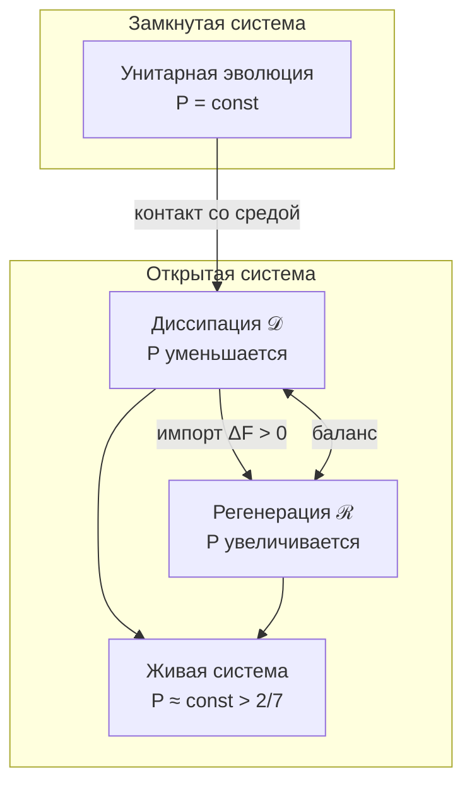

# Эволюция Матрицы Когерентности

## Полное уравнение движения

Эволюция $\Gamma$ описывается **расширенным уравнением Линдблада**:

$$
\frac{d\Gamma}{dt} = -i[H, \Gamma] + \mathcal{D}[\Gamma] + \mathcal{R}[\Gamma, E]
$$

где:
- $-i[H, \Gamma]$ — унитарная эволюция (сохраняет $P$)
- $\mathcal{D}[\Gamma]$ — диссипация Линдблада (уменьшает $P$)
- $\mathcal{R}[\Gamma, E]$ — регенерация (может увеличивать $P$)

:::note О нотации
- $\mathcal{D}$ (каллиграфическое) — **диссипативный** член
- $\mathcal{R}$ (каллиграфическое) — **регенеративный** член
- $R$ (обычное) — мера **рефлексии** (качество самомоделирования), см. [самонаблюдение](../consciousness/self-observation#мера-рефлексии-r)
:::

## Компоненты уравнения

### 1. Унитарный член

$$
-i[H, \Gamma] = -i(H\Gamma - \Gamma H)
$$

где $H$ — [Гамильтониан системы](../../formal/specification#гамильтониан).

**Свойства:**
- Сохраняет $\mathrm{Tr}(\Gamma) = 1$
- Сохраняет $P = \mathrm{Tr}(\Gamma^2)$
- Детерминистическая (обратимая) эволюция

### 2. Диссипативный член

$$
\mathcal{D}[\Gamma] = \sum_k \gamma_k \left( L_k \Gamma L_k^\dagger - \frac{1}{2}\{L_k^\dagger L_k, \Gamma\} \right)
$$

где:
- $L_k$ — операторы Линдблада (описывают каналы декогеренции)
- $\gamma_k \geq 0$ — скорости декогеренции по каналу $k$
- $\{A, B\} = AB + BA$ — антикоммутатор

**Свойства:**
- Сохраняет $\mathrm{Tr}(\Gamma) = 1$
- Уменьшает $P$: $\frac{dP}{dt}\big|_{\mathcal{D}} \leq 0$
- Переводит чистые состояния в смешанные (декогеренция)

**Примеры операторов Линдблада:**

| Оператор | Физический процесс |
|----------|-------------------|
| $L = \vert j\rangle\langle i\vert$ | Переход из состояния $i$ в $j$ |
| $L = \vert i\rangle\langle i\vert - \vert j\rangle\langle j\vert$ | Дефазировка между $i$ и $j$ |
| $L = \sqrt{\gamma} \cdot \sigma_z$ | Спиновая релаксация |

### 3. Регенеративный член

$$
\mathcal{R}[\Gamma, E] = \kappa(\Gamma) \cdot (\Gamma_{\text{target}} - \Gamma) \cdot \Theta(\Delta F)
$$

где:
- $\kappa(\Gamma) = \kappa_0 \cdot \mathrm{Coh}_E(\Gamma)$ — скорость регенерации, зависящая от E-когерентности
- $\Gamma_{\text{target}}$ — целевое состояние (аттрактор)
- $\Theta(x)$ — функция Хевисайда: $\Theta(x) = 1$ при $x > 0$, иначе $0$
- $\Delta F = F_{\text{env}} - F_{\text{sys}}$ — градиент свободной энергии (см. ниже)

#### Свободная энергия и градиент ΔF

**Свободная энергия фон Неймана** для квантовой системы с матрицей плотности $\rho$ при температуре $T$:

$$
F(\rho) = \mathrm{Tr}(\rho H) - k_B T \cdot S_{vN}(\rho)
$$

где:
- $\mathrm{Tr}(\rho H)$ — средняя энергия системы
- $S_{vN}(\rho) = -\mathrm{Tr}(\rho \log \rho)$ — энтропия фон Неймана
- $k_B$ — постоянная Больцмана
- $T$ — температура термостата (окружения)

**Градиент свободной энергии:**

$$
\Delta F = F_{\text{env}} - F_{\text{sys}} = F(\Gamma_{\text{env}}) - F(\Gamma)
$$

где $\Gamma_{\text{env}}$ — эффективное состояние окружения (термостат или источник свободной энергии).

**Физический смысл:**
- $\Delta F > 0$: окружение может передать свободную энергию системе → регенерация возможна
- $\Delta F \leq 0$: система в равновесии или изолирована → регенерация невозможна

:::note Связь с биологией
Для живых систем источником $\Delta F > 0$ служит метаболизм: окисление питательных веществ (глюкоза → CO₂ + H₂O) высвобождает свободную энергию, используемую для поддержания $P > P_{\text{crit}}$.
:::

#### Структурный вывод κ₀

Базовая скорость регенерации **выводится** из структуры Γ (не постулируется):

$$
\kappa_0 = \frac{|\gamma_{OE}| \cdot |\gamma_{OU}|}{\gamma_{OO}}
$$

где:
- $\gamma_{OE}$ — когерентность между Основанием (O) и Опытом (E)
- $\gamma_{OU}$ — когерентность между Основанием (O) и Единством (U)
- $\gamma_{OO}$ — диагональный элемент для O

См. [Структурный анзац kappa0](../foundations/axiom-septicity#структурный-анзац-kappa0).

**Граничные случаи:**
- $\gamma_{OE} \to 0$: $\kappa_0 \to 0$ — нет связи O-E, нет регенерации
- $\gamma_{OU} \to 0$: $\kappa_0 \to 0$ — нет интеграции
- $\gamma_{OO} \to 0$: сингулярность — система теряет Основание

:::warning Следствие: нелинейность динамики
Поскольку $\kappa_0$ зависит от Γ, уравнение эволюции **нелинейно** — согласуется с автопоэтической природой Голонома.
:::

:::info Термодинамическое обоснование
Регенерация возможна только при $\Delta F > 0$ — система должна импортировать свободную энергию из среды. Это согласуется со вторым началом термодинамики: уменьшение энтропии (рост $P$) требует внешнего источника.
:::

**Целевое состояние** $\Gamma_{\text{target}}$ определяется через оператор самомоделирования $\varphi$:

$$
\Gamma_{\text{target}} = \varphi(\Gamma)
$$

где $\varphi$ — [CPTP-канал самомоделирования](../consciousness/self-observation#оператор-самомоделирования-φ).

## Термодинамическое ограничение

Рост чистоты ограничен затратами свободной энергии:

$$
\frac{dP}{dt} \leq \frac{1}{k_B T} \cdot \frac{dF}{dt}
$$

где:
- $k_B$ — постоянная Больцмана
- $T$ — температура окружения
- $F$ — свободная энергия системы

**Следствие:** Живые системы — диссипативные структуры, поддерживающие $P > P_{\text{crit}} = 2/7$ за счёт импорта свободной энергии.

## Режимы эволюции

### Унитарный режим (замкнутая система)

$$
\frac{d\Gamma}{dt} = -i[H, \Gamma]
$$

**Характеристики:**
- Когерентность сохраняется
- Детерминистическая эволюция
- $P = \mathrm{const}$

**Пример:** Изолированная квантовая система.

### Диссипативный режим (декогеренция)

$$
\frac{d\Gamma}{dt} = \mathcal{D}[\Gamma]
$$

**Характеристики:**
- Когерентности затухают: $\gamma_{ij} \to 0$ при $i \neq j$
- $P \to 1/7$ (максимально смешанное состояние)
- Система «классикализуется»

**Пример:** Квантовая система в контакте с термостатом.

### Живой режим (открытая система с регенерацией)

$$
\frac{d\Gamma}{dt} = -i[H, \Gamma] + \mathcal{D}[\Gamma] + \mathcal{R}[\Gamma, E]
$$

**Характеристики:**
- Баланс $\mathcal{D}$ и $\mathcal{R}$
- $P$ поддерживается выше [критического](./viability#критическая-чистота): $P > P_{\text{crit}} = 2/7 \approx 0.286$
- Требует постоянного импорта свободной энергии

**Пример:** Живой организм, поддерживающий гомеостаз.

## Динамика чистоты

Производная чистоты по времени:

$$
\frac{dP}{dt} = 2 \cdot \mathrm{Tr}\left(\Gamma \cdot \frac{d\Gamma}{dt}\right)
$$

Подставляя компоненты уравнения:

$$
\frac{dP}{dt} = \underbrace{0}_{\text{унитарный}} + \underbrace{\left.\frac{dP}{dt}\right|_{\mathcal{D}}}_{\leq 0} + \underbrace{\left.\frac{dP}{dt}\right|_{\mathcal{R}}}_{\geq 0 \text{ при } \Delta F > 0}
$$

**Условие жизнеспособности:**

$$
\left.\frac{dP}{dt}\right|_{\mathcal{R}} + \left.\frac{dP}{dt}\right|_{\mathcal{D}} > 0 \quad \text{при } P < P_{\text{target}}
$$

## Диаграмма режимов

## Теорема о сохранении свойств

:::info Теорема (Сохранение свойств матрицы плотности)
Динамика, определённая уравнением эволюции, сохраняет:
1. **Эрмитовость:** $\Gamma(t)^\dagger = \Gamma(t)$
2. **Положительность:** $\Gamma(t) \geq 0$
3. **Нормировку:** $\mathrm{Tr}(\Gamma(t)) = 1$
:::

**Доказательство:**
1. **Унитарный член:** $[H, \Gamma]^\dagger = [\Gamma^\dagger, H^\dagger] = [\Gamma, H] = -[H, \Gamma]$ при $H = H^\dagger$
2. **Диссипатор:** Форма Линдблада специально построена для сохранения этих свойств (теорема Линдблада-Горини-Косаковски-Сударшана)
3. **Регенератор:** При $\Gamma_{\text{target}}$ — корректной матрице плотности, $\mathcal{R}$ сохраняет свойства

**QED**

---

**Связанные документы:**
- [Аксиома Септичности](../foundations/axiom-septicity) — вывод κ₀ и P_crit
- [Матрица когерентности](./coherence-matrix) — определение Γ
- [Жизнеспособность](./viability) — условия существования и $P_{\text{crit}}$
- [Динамика (измерение D)](../structure/dimension-d) — концептуальное описание
- [Математический аппарат](../../formal/specification) — формальная спецификация
- [Самонаблюдение](../consciousness/self-observation) — оператор φ и мера R
