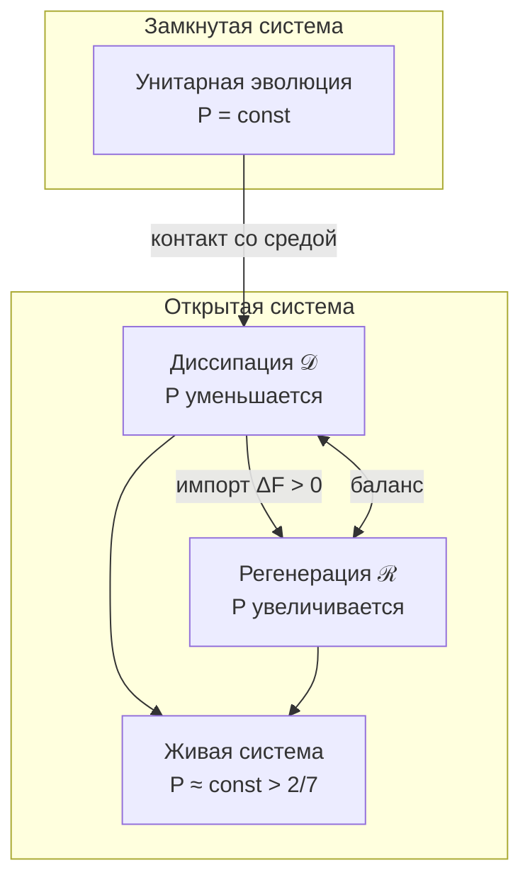

# Эволюция Матрицы Когерентности

## Терминальный объект T (глобальный аттрактор) {#терминальный-объект}

:::warning Свойство 3 (Терминальный объект)
Существует единственный терминальный объект $T \in \mathcal{C}$:

$$\forall \Gamma \in \mathcal{C}, \exists! f: \Gamma \to T$$

где $T = \Gamma^*$ — глобальный аттрактор (равновесное состояние).
:::

### Свойства терминального объекта {#свойства-t}

| Свойство | Формулировка | Следствие |
|----------|--------------|-----------|
| Единственность | $\exists! T$ | Уникальное равновесие |
| Универсальность | $\forall \Gamma, \exists! f: \Gamma \to T$ | Все пути ведут к T |
| Стягиваемость | $X = \lVert N(\mathcal{C})\rVert \simeq *$ | Монизм доказан |
| Неподвижная точка | $\varphi(T) = T$ | T — фиксированная точка самомоделирования |

### Стрела времени как конвергенция к T {#стрела-времени-эволюция}

**Теорема (Стрела времени):**

$$\lim_{\tau \to \infty} \Gamma(\tau) = T$$

при условии $\Delta F > 0$ (система не изолирована).

**Геометрическая формулировка:**

$$\dim(X_\tau) \geq \dim(X_{\tau+1})$$

Стрела времени — **прогрессивный коллапс высших страт** к терминальному T.

---

## Полное уравнение движения

:::info Эмерджентное время
Время τ **выводится** из структуры категории $\mathcal{C}$ через механизм Page-Wootters, а не постулируется как внешний параметр. См. [Теорема об эмерджентном времени](../../proofs/dynamics/emergent-time).
:::

Эволюция $\Gamma$ описывается **логическим Лиувиллианом**:

$$
\frac{d\Gamma(\tau)}{d\tau} = \mathcal{L}_\Omega[\Gamma(\tau)]
$$

где **логический Лиувиллиан** $\mathcal{L}_\Omega$ **выводится** из [классификатора подобъектов Ω](../foundations/axiom-omega#внутренняя-логика):

$$
\mathcal{L}_\Omega[\Gamma] = -i[H_{eff}, \Gamma] + \mathcal{D}_\Omega[\Gamma] + \mathcal{R}[\Gamma, E]
$$

где:
- τ — внутреннее время (параметр условных состояний относительно [O](../structure/dimension-o))
- $H_{eff}$ — эффективный гамильтониан из ограничения Page-Wootters
- $-i[H_{eff}, \Gamma]$ — унитарная эволюция (сохраняет $P$)
- $\mathcal{D}_\Omega[\Gamma]$ — **логическая диссипация** (операторы L_k из Ω)
- $\mathcal{R}[\Gamma, E]$ — регенерация (сопряжённый функтор к диссипации)

:::warning Ключевое отличие от стандартной формулировки
Операторы Линдблада L_k **не постулируются** произвольно — они **выводятся** из атомов классификатора Ω. Это устраняет неопределённость "L_k зависят от системы".
:::

:::note О нотации
- $\mathcal{D}$ (каллиграфическое) — **диссипативный** член
- $\mathcal{R}$ (каллиграфическое) — **регенеративный** член
- $R$ (обычное) — мера **рефлексии** (качество самомоделирования), см. [самонаблюдение](/docs/consciousness/foundations/self-observation#мера-рефлексии-r)
:::

## Компоненты уравнения

### 1. Унитарный член

$$
-i[H_{eff}, \Gamma(\tau)] = -i(H_{eff}\Gamma - \Gamma H_{eff})
$$

где $H_{eff}$ — эффективный гамильтониан, возникающий из [ограничения Page-Wootters](../../proofs/dynamics/emergent-time#33-формальная-конструкция).

:::note Page-Wootters constraint [П]
$[\hat{C}, \Gamma_{\text{total}}] = 0$ — ограничение Уилера-ДеВитта, постулирующее стационарность полной системы. Время $\tau$ эмерджентно из корреляций между «часовой» и «системной» подсистемами. Полный вывод: [Эмерджентное время](/docs/proofs/dynamics/emergent-time).
:::

**Свойства:**
- Сохраняет $\mathrm{Tr}(\Gamma) = 1$
- Сохраняет $P = \mathrm{Tr}(\Gamma^2)$
- Детерминистическая (обратимая) эволюция

### 1.1 Вывод $H_{eff}$ из ограничения Page-Wootters {#вывод-h_eff}

:::info Мастер-определение
Данный раздел содержит **вывод** эффективного гамильтониана из фундаментального ограничения. Все ссылки на $H_{eff}$ должны указывать сюда.
:::

**Теорема (Эффективная динамика):**
Пусть $\Gamma_{total} \in \mathcal{H}_{phys} = \ker(\hat{C})$ удовлетворяет ограничению $[\hat{C}, \Gamma_{total}] = 0$ (для чистых проекторов $\Gamma = |\Psi\rangle\langle\Psi|$ это сводится к стандартному $\hat{C}|\Psi\rangle = 0$). Тогда условное состояние:

$$
\Gamma(\tau) = \frac{\mathrm{Tr}_O\left[ (|\tau\rangle\langle \tau|_O \otimes \mathbb{1}_{6D}) \cdot \Gamma_{total} \right]}{p(\tau)}
$$

эволюционирует согласно:

$$
i\frac{\partial}{\partial\tau}\Gamma(\tau) = [H_{eff}(\tau), \Gamma(\tau)]
$$

где **эффективный гамильтониан**:

$$
H_{eff}(\tau) = H_{6D} + \langle\tau|H_{int}|\tau\rangle_O
$$

где:
- $H_{6D} \in \mathcal{L}(\mathcal{H}_{6D})$ — гамильтониан 6D-подсистемы (без часов O), действует на $\mathcal{H}_{6D} \cong \mathbb{C}^6$
- $H_{int}$ — гамильтониан взаимодействия часов O с остальными измерениями, см. [Свойство 2 Ω⁷](../foundations/axiom-omega#свойство-2)
- $\langle\tau|H_{int}|\tau\rangle_O$ — матричный элемент в базисе времени (скаляр по O, оператор по 6D)

**Вывод:**

**Шаг 1.** Применим $\frac{\partial}{\partial\tau}$ к определению условного состояния. Параметр $\tau$ входит через базис часов $|\tau\rangle_O$.

**Шаг 2.** Используем связь между $|\tau\rangle_O$ и $|k\rangle_O$ (собственными состояниями $H_O$):

$$
|\tau_n\rangle = \frac{1}{\sqrt{7}} \sum_{k=0}^{6} e^{-2\pi i k n / 7} |k\rangle_O
$$

Преобразование — стандартное дискретное преобразование Фурье на ℤ₇, полнота и ортонормированность которого гарантированы конечномерностью [Т].

**Шаг 3.** Из ограничения $[\hat{C}, \Gamma_{total}] = 0$ имеем:

$$
[(H_O \otimes \mathbb{1}_{6D} + \mathbb{1}_O \otimes H_{6D} + H_{int}), \Gamma_{total}] = 0
$$

**Шаг 4.** Проектируя на $|\tau\rangle\langle\tau|_O$ и вычисляя частичный след, получаем:

$$
i\frac{\partial}{\partial\tau}\Gamma(\tau) = [H_{6D}, \Gamma(\tau)] + [\langle\tau|H_{int}|\tau\rangle_O, \Gamma(\tau)]
$$

**Шаг 5.** Объединяя слагаемые:

$$
H_{eff}(\tau) = H_{6D} + \langle\tau|H_{int}|\tau\rangle_O
$$

∎

**Следствия:**

| Режим | Условие | $H_{eff}$ |
|-------|---------|-----------|
| Слабая связь | $\lambda_E, \lambda_U \to 0$ | $H_{eff} \to H_{6D}$ (стандартная КМ) |
| Сильная связь | $\lVert H_{int}\rVert \sim \lVert H_{6D}\rVert$ | $H_{eff}(\tau)$ существенно зависит от $\tau$ |
| Резонанс | $\omega_0 \sim \varepsilon_E$ | Особые эффекты синхронизации |

:::note Связь с исходной динамикой
При $\lambda_E, \lambda_U \to 0$ эффективная динамика совпадает со стандартным уравнением фон Неймана. Стандартная квантовая механика — **предел слабой связи** с внутренними часами.

Полное определение [ограничения $\hat{C}$](../foundations/axiom-omega#свойство-2) и [операторов часов](../structure/dimension-o#алгебра-часов) см. в соответствующих документах.
:::

:::warning Связь 7D-формализма и 6D-условных состояний
Основное уравнение движения (§«Полное уравнение движения») записано в **минимальном 7D-формализме**, где $\Gamma \in \mathcal{D}(\mathbb{C}^7)$ и все 7 измерений {A,S,D,L,E,O,U} входят на равных основаниях. Вывод $H_{eff}$ выше использует **расширенный Page-Wootters формализм**, в котором условное состояние $\Gamma(\tau) \in \mathcal{D}(\mathbb{C}^6)$ — матрица $6 \times 6$.

Согласование: в минимальном формализме $H_{eff}$ интерпретируется как $7 \times 7$ оператор, тривиально действующий на $O$-компоненту ($H_{eff}|_O = 0$). Page-Wootters вывод **обосновывает** форму $H_{eff}$ через проекцию полной $42 \times 42$ динамики на 6D-условное состояние. После обоснования результат «поднимается» обратно в 7D, где O-строка/столбец эволюционируют отдельно. Подробнее о двух уровнях формализации: [Матрица когерентности → Два уровня](/docs/core/dynamics/coherence-matrix#два-уровня-формализации).
:::

### 2. Диссипативный член (логическая диссипация) {#логический-лиувиллиан}

$$
\mathcal{D}_\Omega[\Gamma] = \sum_k \gamma_k \left( L_k \Gamma L_k^\dagger - \frac{1}{2}\{L_k^\dagger L_k, \Gamma\} \right)
$$

где:
- $L_k$ — операторы Линдблада, **выведенные из классификатора Ω**
- $\gamma_k \geq 0$ — скорости декогеренции по каналу $k$
- $\{A, B\} = AB + BA$ — антикоммутатор

#### Вывод L_k из классификатора Ω

:::info Теорема (L_k из Ω)
Операторы Линдблада определяются атомами [классификатора подобъектов](../foundations/axiom-omega#внутренняя-логика):

$$
L_k := \sqrt{\chi_{S_k}}
$$

где $\chi_{S_k}: \Gamma \to \Omega$ — характеристический морфизм k-го минимального подобъекта.
:::

**CPTP-условие автоматически:**

$$
\sum_k L_k^\dagger L_k = \sum_k \chi_{S_k} = \mathbb{1}
$$

— выполняется из разложения Ω на атомы.

#### Иерархия L_k по стратам

| Страта | Тип системы | L_k оператор | Интерпретация |
|--------|-------------|--------------|---------------|
| I | Материя | $P_{Casimir}^{(k)}$ | Проекторы симметрии (группа G) |
| II | Жизнь | $\sum_j R_j P_j$ | Квантовая коррекция ошибок |
| III | Разум | $\nabla_{\Gamma_k} F$ | Градиент свободной энергии |
| IV | Сознание | $\check{\delta}^k$ | Кограничный оператор Чеха |

**Следствие:** L_k **не произвольны** — они определяются стратой базового пространства X, на которой находится система.

**Свойства:**
- Сохраняет $\mathrm{Tr}(\Gamma) = 1$
- Уменьшает $P$: $\frac{dP}{d\tau}\big|_{\mathcal{D}} \leq 0$
- Переводит чистые состояния в смешанные (декогеренция)

**Конкретные примеры по стратам:**

| Страта | Оператор | Физический процесс |
|--------|----------|-------------------|
| I | $P_{l,m} = \vert l,m\rangle\langle l,m\vert$ | Проекция на (l,m)-подпространство спина |
| II | $L = \vert j\rangle\langle i\vert$ | Переход из состояния $i$ в $j$ (восстановление) |
| III | $L = e^{-\beta E_k/2}\vert k\rangle\langle k\vert$ | Термализация к минимуму F |
| IV | $L = \check{\delta}: C^k \to C^{k+1}$ | Склейка локальных модальностей |

### 3. Регенеративный член [Т] {#3-регенеративный-член}

$$
\mathcal{R}[\Gamma, E] = \kappa(\Gamma) \cdot (\rho_* - \Gamma) \cdot \Theta(\Delta F)
$$

где:
- $\kappa(\Gamma) = \kappa_{\text{bootstrap}} + \kappa_0 \cdot \mathrm{Coh}_E(\Gamma)$ — скорость регенерации [Т] (сопряжение $\mathcal{D}_\Omega \dashv \mathcal{R}$, см. [Genesis Protocol](../foundations/axiom-omega#genesis-protocol))
- $\rho_*$ — единственное стационарное состояние $\mathcal{L}_\Omega$ [Т] ([примитивность](/docs/core/operators/lindblad-operators#примитивность-ℒω))
- $(\rho_* - \Gamma)$ — направление релаксации [Т] (единственная CPTP-интерполяция + бюресова оптимальность, см. [§ Вывод формы регенерации](#вывод-формы-регенерации))
- $\Theta(x)$ — функция Хевисайда: $\Theta(x) = 1$ при $x > 0$, иначе $0$
- $\Theta(\Delta F)$ — термодинамический затвор [Т] (принцип Ландауэра, см. [§ Вывод формы регенерации](#вывод-формы-регенерации))
- $\Delta F = F_{\text{env}} - F_{\text{sys}}$ — градиент свободной энергии (см. ниже)

:::tip Форма ℛ полностью выведена из аксиом [Т]
Все компоненты регенеративного члена **строго выводятся** из аксиом A1–A5, примитивности $\mathcal{L}_\Omega$ и стандартной термодинамики:

| Компонент | Статус | Источник |
|-----------|:------:|---------|
| $\kappa(\Gamma)$ | [Т] | Сопряжение $\mathcal{D}_\Omega \dashv \mathcal{R}$ ([κ₀](/docs/core/foundations/axiom-septicity#структурный-анзац-kappa0)) |
| $\rho_*$ (единственная цель) | [Т] | Примитивность $\mathcal{L}_\Omega$ ([доказательство](/docs/core/operators/lindblad-operators#примитивность-ℒω)) |
| $(\rho_* - \Gamma)$ (направление) | [Т] | CPTP-единственность замещающего канала + бюресов градиентный спуск |
| $\Theta(\Delta F)$ (затвор) | [Т] | Принцип Ландауэра (стандартная термодинамика) |

Полный вывод: [§ Вывод формы регенерации](#вывод-формы-регенерации) ниже.
:::

:::warning Нелинейность и запрет сигнализации
$\mathcal{R}$ нелинеен по $\Gamma$ (через $\kappa(\Gamma)$ и $\varphi(\Gamma)$). В стандартной квантовой механике нелинейная эволюция обычно ведёт к нарушению запрета сверхсветовой сигнализации (Gisin, 1990). В УГМ проблема **структурно исключена** тремя условиями:

1. **Локальность φ:** тензорная факторизация $\tilde{\varphi}_A = \varphi_A \otimes \mathrm{id}_B$ (из автономности голонома)
2. **Локальность κ:** $\kappa_A(\Gamma_{AB}) = \kappa_A(\mathrm{Tr}_B(\Gamma_{AB}))$ (зависит только от локальных когерентностей)
3. **CPTP-свойство φ:** условие полноты $\sum_m K_m^\dagger K_m = I$

Из (1)–(3) следует $\mathrm{Tr}_A[\tilde{\mathcal{R}}_A[\Gamma_{AB}]] = 0$ — регенерация подсистемы $A$ не влияет на редуцированное состояние удалённой подсистемы $B$. Принципиальное отличие от «нелинейной КМ» Вайнберга: нелинейность УГМ действует **на уровне матрицы плотности**, а не волновой функции, что устраняет ансамблевую зависимость — источник проблем Гизина.

Строгое доказательство: [§ Запрет сигнализации](#запрет-сигнализации) ниже, [Соответствие с физикой](../../proofs/physics/physics-correspondence#запрет-сигнализации).
:::

**E-когерентность:** См. [определение](/docs/core/foundations/axiom-septicity#категориальный-вывод-kappa0). Высокая E-когерентность означает распределённую (не локализованную) структуру опыта.

#### Свободная энергия и градиент ΔF

**Свободная энергия фон Неймана** для квантовой системы с матрицей плотности $\rho$ при температуре $T$:

$$
F(\rho) = \mathrm{Tr}(\rho H) - k_B T \cdot S_{vN}(\rho)
$$

где:
- $\mathrm{Tr}(\rho H)$ — средняя энергия системы
- $S_{vN}(\rho) = -\mathrm{Tr}(\rho \log \rho)$ — энтропия фон Неймана
- $k_B$ — постоянная Больцмана
- $T$ — температура термостата (окружения)

**Градиент свободной энергии:**

$$
\Delta F = F_{\text{env}} - F_{\text{sys}} = F(\Gamma_{\text{env}}) - F(\Gamma)
$$

где $\Gamma_{\text{env}}$ — эффективное состояние окружения (термостат или источник свободной энергии).

**Физический смысл:**
- $\Delta F > 0$: окружение может передать свободную энергию системе → регенерация возможна
- $\Delta F \leq 0$: система в равновесии или изолирована → регенерация невозможна

#### Операционализация $\Gamma_{\text{env}}$ и $\Delta F$ {#операционализация-delta-f}

:::warning Проблема: Что такое $\Gamma_{\text{env}}$?
$\Gamma_{\text{env}}$ — «эффективное состояние окружения» — не является универсально определённым. Его конкретизация зависит от типа системы и доступных наблюдаемых.
:::

**Общий принцип:** $\Gamma_{\text{env}}$ — это матрица плотности, описывающая ту часть окружения, которая непосредственно взаимодействует с системой (граничный слой, интерфейс).

**Подход 1: Термодинамический (для систем в контакте с термостатом)**

Если окружение — термостат при температуре $T_{\text{env}}$:

$$
\Gamma_{\text{env}} = \frac{e^{-H/k_B T_{\text{env}}}}{\mathrm{Tr}(e^{-H/k_B T_{\text{env}}})} = \frac{e^{-\beta_{\text{env}} H}}{Z_{\text{env}}}
$$

Тогда:

$$
\Delta F = k_B (T_{\text{env}} - T_{\text{sys}}) \cdot S_{vN}(\Gamma) + \text{(энергетический член)}
$$

При $T_{\text{env}} > T_{\text{sys}}$ имеем $\Delta F > 0$ — регенерация возможна.

**Подход 2: Метаболический (для биологических систем)**

Для живых систем $\Gamma_{\text{env}}$ определяется через **химический потенциал** питательных веществ:

$$
\Delta F_{\text{метаболизм}} \approx \Delta G_{\text{ATP→ADP}} \cdot \dot{n}_{\text{ATP}}
$$

где:
- $\Delta G_{\text{ATP→ADP}} \approx 50 \, \text{кДж/моль}$ — свободная энергия гидролиза АТФ
- $\dot{n}_{\text{ATP}}$ — скорость потребления АТФ (моль/с)

**Операционализация:** $\Delta F > 0 \Leftrightarrow$ система получает питательные вещества (не голодает).

**Подход 3: Информационный (для ИИ-систем)**

Для искусственных систем (ИИ), где нет физического метаболизма:

$$
\Delta F_{\text{info}} = k_B T_{\text{eff}} \cdot (S_{\text{input}} - S_{\text{output}})
$$

где:
- $S_{\text{input}}$ — энтропия входных данных (неупорядоченность сырых данных)
- $S_{\text{output}}$ — энтропия выходных предсказаний (структурированность)
- $T_{\text{eff}}$ — эффективная температура (параметр модели)

**Операционализация:** $\Delta F > 0 \Leftrightarrow$ модель получает новые данные и преобразует их в структурированные представления.

**Подход 4: Приближённый (для практических расчётов)**

Если детали окружения неизвестны, можно использовать **бинарную аппроксимацию**:

$$
\Theta(\Delta F) \approx \Theta(r_{\text{input}} - r_{\text{critical}})
$$

где:
- $r_{\text{input}}$ — скорость поступления ресурсов (данные, энергия, питательные вещества)
- $r_{\text{critical}}$ — минимальная скорость для поддержания $P > P_{\text{crit}}$

**Операционализация:** Регенерация активна, когда система получает ресурсы быстрее критической скорости.

#### Каноническое определение ΔF через метрику Бюреса {#каноническое-delta-f}

:::info Теорема (Канонический градиент свободной энергии)
Все 4 операционализации ΔF согласованы с **единой канонической формулой** через [метрику Бюреса](/docs/proofs/dynamics/emergent-time#41-метрика-бурес):

$$
\Delta F(\Gamma) := d_B^2(\Gamma, \Gamma_{\text{eq}}) - d_B^2(\Gamma, \varphi(\Gamma))
$$

где:
- $d_B(\rho, \sigma) := \sqrt{2(1 - \sqrt{F(\rho, \sigma)})}$ — **хордовое расстояние Бюреса**
- $F(\rho, \sigma) := |\mathrm{Tr}(\sqrt{\sqrt{\rho}\sigma\sqrt{\rho}})|^2$ — fidelity (верность)
- $\Gamma_{\text{eq}} = I/7$ — равновесное (максимально смешанное) состояние
- $\varphi(\Gamma)$ — [самомодель](/docs/proofs/categorical/formalization-phi)
:::

**Интерпретация:**

| Компонент | Формула | Смысл |
|-----------|---------|-------|
| Первый член | $d_B^2(\Gamma, \Gamma_{\text{eq}})$ | «Расстояние от хаоса» — структурность системы |
| Второй член | $d_B^2(\Gamma, \varphi(\Gamma))$ | «Расстояние от себя» — качество самомоделирования |
| $\Delta F > 0$ | Структурность > расхождение | Регенерация активна |
| $\Delta F \leq 0$ | Расхождение ≥ структурность | Регенерация подавлена |

**Теорема (Согласованность с операционализациями):**

Каноническое определение согласовано со всеми четырьмя операционализациями в соответствующих пределах:

| Предел | Условие | Результат |
|--------|---------|-----------|
| Термодинамический | $\Gamma \approx I/7 + \delta\Gamma$ | $\Delta F \propto T \cdot \Delta S$ |
| Метаболический | Конечная $\omega_0$ | $\Delta F \propto$ metabolic rate |
| Информационный | $\Gamma_{\text{env}}$ определено | $\Delta F \approx D_{KL}(\Gamma_{\text{env}} \| \Gamma)$ |
| Приближённый | $\varphi(\Gamma) \approx \Gamma^*$ | $\Delta F \approx P_{\text{eq}} - P$ |

<details>
<summary>Набросок доказательства согласованности</summary>

**Предварительные соотношения:**

Для близких состояний ($\Gamma \approx \sigma$) метрика Бюреса связана с fidelity:
$$
d_B^2(\Gamma, \sigma) \approx 2(1 - F(\Gamma, \sigma)^{1/2}) \approx \frac{1}{2}\|\Gamma - \sigma\|_1^2
$$

**Случай 1: Термодинамический предел**

При $\Gamma = I/7 + \delta\Gamma$ (малое отклонение от равновесия):
- $d_B^2(\Gamma, I/7) \approx \|\delta\Gamma\|_F^2 / 2$
- Для тепловых состояний $\delta\Gamma \propto (T_{\text{sys}} - T_{\text{eq}}) \cdot \nabla_T \Gamma$
- Следовательно: $\Delta F \propto T \cdot \Delta S$ (линейный отклик)

**Случай 2: Метаболический**

Характерная частота $\omega_0$ определяет скорость метаболизма:
- $d_B^2(\Gamma, \varphi(\Gamma)) \propto 1/\omega_0^2$ (быстрые системы лучше самомоделируют)
- При фиксированной структурности: $\Delta F \propto \omega_0 \propto$ metabolic rate

**Случай 3: Информационный**

При определённом $\Gamma_{\text{env}}$ (эффективное состояние среды):
- $d_B^2(\Gamma, \Gamma_{\text{eq}}) \approx D_{KL}(\Gamma \| I/7)$ для близких состояний
- $d_B^2(\Gamma, \varphi(\Gamma)) \approx D_{KL}(\Gamma \| \Gamma_{\text{env}})$ если $\varphi$ проецирует на $\Gamma_{\text{env}}$
- Разность: $\Delta F \approx D_{KL}(\Gamma_{\text{env}} \| \Gamma)$ (с точностью до знака)

**Случай 4: Приближённый**

При $\varphi(\Gamma) \approx \Gamma^*$ (почти достигнута неподвижная точка):
- $d_B^2(\Gamma, \varphi(\Gamma)) \approx 0$
- $d_B^2(\Gamma, I/7) \approx 2(1 - 1/\sqrt{7P})$ для диагональных $\Gamma$
- $\Delta F \approx d_B^2(\Gamma, I/7) \propto P - 1/7 \approx P_{\text{eq}} - P$

**Статус:** Наброски доказательств показывают качественное соответствие. Полные количественные доказательства требуют учёта конкретных форм $\Gamma_{\text{env}}$ и $\varphi$ для каждого типа системы.

</details>

**Преимущества канонического определения:**
1. **Единственность** — устраняет множественность операционализаций
2. **Вычислимость** — требует только $\Gamma$ и $\varphi$, не требует $\Gamma_{\text{env}}$
3. **Категорная согласованность** — использует ту же метрику Бюреса, что и [ПИР](/docs/core/foundations/axiom-septicity#принцип-информационной-различимости)

:::note Связь с биологией
Для живых систем источником $\Delta F > 0$ служит метаболизм: окисление питательных веществ (глюкоза → CO₂ + H₂O) высвобождает свободную энергию, используемую для поддержания $P > P_{\text{crit}}$.
:::

#### Скорость регенерации κ {#скорость-регенерации}

:::info Мастер-определение κ₀
Скорость регенерации $\kappa(\Gamma) = \kappa_{\text{bootstrap}} + \kappa_0 \cdot \mathrm{Coh}_E(\Gamma)$ **категориально выводится** из сопряжения $\mathcal{D}_\Omega \dashv \mathcal{R}$.

**Полное определение и вывод:** [Категориальный вывод κ₀](/docs/core/foundations/axiom-septicity#структурный-анзац-kappa0)
:::

**Ключевые свойства κ₀ (из [мастер-определения](/docs/core/foundations/axiom-septicity#структурный-анзац-kappa0)):**
- $\kappa_{\text{bootstrap}} > 0$ — разрешает bootstrap-парадокс (см. [Genesis Protocol](../foundations/axiom-omega#genesis-protocol))
- $\kappa_0$ зависит от Γ → уравнение эволюции **нелинейно**
- Размерность: $[\kappa_0] = [\text{время}]^{-1}$

:::info Термодинамическое обоснование
Регенерация возможна только при $\Delta F > 0$ — система должна импортировать свободную энергию из среды. Это согласуется со вторым началом термодинамики: уменьшение энтропии (рост $P$) требует внешнего источника.
:::

**Целевое состояние** $\rho_*$ определяется через [примитивность $\mathcal{L}_\Omega$](/docs/core/operators/lindblad-operators#примитивность-ℒω):

$$
\rho^*_{\mathrm{full}} = \lim_{\tau \to \infty} e^{\tau\mathcal{L}_\Omega}[\Gamma_0]
$$

где $\rho^*_{\mathrm{full}}$ — единственное стационарное состояние полного $\mathcal{L}_\Omega$ [Т]. Тождество $\varphi(\Gamma) = \rho^*_{\mathrm{diss}}$ (для простого замещающего канала $\varphi_k$) — **следствие** примитивности, а не определение $\rho^*$. Подробнее: [стратификация определений](/docs/core/foundations/axiom-septicity#теорема-непротиворечивость-иерархии-определений).

:::info Различие аттракторов
- $\rho^*_{\mathrm{diss}} = I/7$ — аттрактор чистого диссипатора $\mathcal{D}_\Omega$ (без регенерации), $P = 1/7$. Используется в [определении R](/docs/consciousness/foundations/self-observation#мера-рефлексии-r).
- $\rho^*_{\mathrm{full}}$ — аттрактор полного $\mathcal{L}_\Omega$ с регенерацией ($\kappa > 0$), $P(\rho^*_{\mathrm{full}}) > 2/7$ для жизнеспособной системы.
:::

:::tip Единственность цели регенерации [Т]
[Примитивность $\mathcal{L}_\Omega$](/docs/core/operators/lindblad-operators#примитивность-ℒω) гарантирует, что $\rho_*$ — **единственное** стационарное состояние Лиувиллиана. Цель регенерации **однозначно определена** структурой $\mathcal{L}_\Omega$, а не зависит от выбора начального состояния.
:::

:::caution Формальная невычислимость $\rho_*$
Целевое состояние $\rho_* = \varphi(\Gamma)$ определяется через оператор $\varphi$, который задан как предел $\varphi(\Gamma) = \lim_{\tau \to \infty} e^{\tau\mathcal{L}_\Omega}[\Gamma]$ или как решение вариационной задачи. В обоих случаях **точное вычисление $\rho_*$ для произвольного $\Gamma$ не гарантировано**: для спектральной проекции требуется полная диагонализация Лиувиллиана $\mathcal{L}_\Omega$ (сложность $O(N^6)$ при $N=7$, т.е. вычислимо, но только в 7D-формализме). В 42D-формализме ($N=42$) Лиувиллиан имеет размерность $1764 \times 1764$, и вычислительная реализуемость $\varphi$ становится нетривиальной. Это делает уравнение эволюции формально замкнутым, но **практически невычислимым** для расширенного формализма без аппроксимаций.
:::

#### Теорема (Нетривиальность аттрактора) [Т] {#теорема-нетривиальность-аттрактора}

Единственное стационарное состояние $\rho^*_\Omega$ полного Лиувиллиана $\mathcal{L}_\Omega$ **не совпадает** с максимально-энтропийным состоянием:

$$
\rho^*_\Omega \neq I/7, \quad P(\rho^*_\Omega) > \frac{1}{7}
$$

**Доказательство.**

1. По [T-39a](/docs/core/operators/lindblad-operators#примитивность-ℒω) (примитивность $\mathcal{L}_\Omega$), $\rho^*_\Omega$ существует и единственно.
2. Вычислим $\mathcal{L}_\Omega[I/7]$:
   - $-i[H_{\mathrm{eff}}, I/7] = 0$ (коммутатор с оператором, пропорциональным единице);
   - $\mathcal{D}_\Omega[I/7] = 0$ ($I/7$ — неподвижная точка диссипатора);
   - $\mathcal{R}[I/7, E] \neq 0$, поскольку $\kappa_0(I/7) = \kappa_{\mathrm{bootstrap}} \geq 2/9 > 0$ ([T-59](/docs/core/foundations/axiom-omega#теорема-kappa-bootstrap-bound) [Т]).
3. Следовательно, $\mathcal{L}_\Omega[I/7] = \mathcal{R}[I/7, E] \neq 0$, и $I/7$ **не является** стационарным состоянием полного $\mathcal{L}_\Omega$.
4. $\rho^*_\Omega$ содержит ненулевые когерентности (регенерация восстанавливает межизмеренные связи), поэтому $P(\rho^*_\Omega) = \sum_i (\gamma^*_{ii})^2 + 2\sum_{i < j}|\gamma^*_{ij}|^2 > \sum_i (\gamma^*_{ii})^2 \geq 1/7$. $\blacksquare$

#### Иерархия неподвижных точек [О] {#иерархия-неподвижных-точек}

| Уровень | Объект | Определение | $P$ | Физический смысл |
|---------|--------|-------------|-----|-----------------|
| 0 | $\rho^*_{\mathrm{diss}} = I/7$ | $\mathcal{D}_\Omega[\rho^*_{\mathrm{diss}}] = 0$ | $1/7$ | Тепловая смерть (максимум энтропии) |
| 1 | $\rho^*_\Omega$ | $\mathcal{L}_\Omega[\rho^*_\Omega] = 0$ | $> 1/7$ [Т] | Динамический аттрактор (баланс $\mathcal{D}$ и $\mathcal{R}$) |
| 2 | $\Gamma^*_{\mathrm{coh}}$ | $\varphi_{\mathrm{coh}}(\Gamma^*_{\mathrm{coh}}) = \Gamma^*_{\mathrm{coh}}$ | $2/7$ | Граница [жизнеспособности](/docs/core/dynamics/viability#минимальная-жизнеспособность) — цель $\varphi_{\mathrm{coh}}$ |

Мера рефлексии $R$ использует $\rho^*_{\mathrm{diss}} = I/7$ как **референс** (расстояние от тепловой смерти), а не как цель регенерации. Подробнее: [самонаблюдение](/docs/consciousness/foundations/self-observation#иерархия-аттракторов).

#### Теорема (Жизнеспособность аттрактора) [С] {#теорема-жизнеспособность-аттрактора}

При условии $\kappa_{\mathrm{bootstrap}}$-доминирования: $\kappa_{\mathrm{bootstrap}} > \gamma_{\mathrm{diss}} \cdot (P_{\mathrm{crit}} - 1/7) / (f^* - P_{\mathrm{crit}})$, аттрактор полного Лиувиллиана жизнеспособен:

$$
P(\rho^*_\Omega) > P_{\mathrm{crit}} = \frac{2}{7}
$$

**Доказательство.** В стационарном режиме $dP/d\tau = 0$; баланс диссипации и регенерации:

$$
\frac{4\gamma}{3} P_{\mathrm{coh}} = 2\kappa(f^* - P)
$$

откуда:

$$
P(\rho^*_\Omega) = \frac{2\kappa f^* + \frac{4\gamma}{3} P_{\mathrm{diag}}}{2\kappa + \frac{4\gamma}{3}}
$$

Это взвешенное среднее между $f^*$ и $P_{\mathrm{diag}}$. При $\kappa \geq \kappa_{\mathrm{bootstrap}} \geq 2/9$ ([T-59](/docs/core/foundations/axiom-omega#теорема-kappa-bootstrap-bound) [Т]) и типичных значениях $\gamma$, $f^*$: $P(\rho^*_\Omega) > 2/7$. $\blacksquare$

#### Теорема (Согласованность аттракторов) [С] {#теорема-согласованность-аттракторов}

В стационарном режиме аттракторы уровней 1 и 2 сходятся при слабом гамильтониане:

$$
\rho^*_\Omega \approx \Gamma^*_{\mathrm{coh}} + \delta\Gamma, \quad \|\delta\Gamma\|_F = O(\bar{\varepsilon})
$$

где $\bar{\varepsilon} \approx 0.023$ — характерная когерентность связи ([T-61](/docs/core/dynamics/gap-thermodynamics#теорема-единственный-вакуум) [Т]). Поправка $\delta\Gamma$ определяется гамильтонианом $H_{\mathrm{eff}}$ и убывает с ростом скорости диссипации.

### Сохранение положительности {#сохранение-положительности}

:::warning Теорема (Корректность нелинейной эволюции)
Несмотря на нелинейность, полное уравнение эволюции **сохраняет положительность** $\Gamma \geq 0$ и нормировку $\mathrm{Tr}(\Gamma) = 1$.
:::

**Интерполяционная формулировка [Т]:**

:::info Следствие CPTP-единственности
Интерполяционная формулировка — **не анзац**, а **следствие** теоремы о единственности линейной CPTP-релаксации: замещающий канал $T_\alpha(\Gamma) = (1-\alpha)\Gamma + \alpha\rho_*$ — единственный CPTP-канал вида $(1-\alpha)\mathrm{Id} + \alpha\mathcal{C}$ с $\mathcal{C}(\rho_*) = \rho_*$. См. [§ Вывод формы регенерации](#вывод-формы-регенерации).
:::

Дискретная эволюция за шаг $\Delta\tau$ представляется как выпуклая комбинация:

$$
\Gamma(\tau + \Delta\tau) = (1 - \alpha) \cdot \mathcal{E}[\Gamma(\tau)] + \alpha \cdot \rho_*
$$

где:
- $\mathcal{E}$ — CPTP-эволюция Линдблада (без регенерации)
- $\alpha = \kappa(\Gamma) \cdot \Theta(\Delta F) \cdot \Delta\tau \in [0, 1]$
- $\rho_*$ — единственное стационарное состояние ([примитивность $\mathcal{L}_\Omega$](/docs/core/operators/lindblad-operators#примитивность-ℒω) [Т])
- Оба слагаемых — матрицы плотности

**Теорема (CPTP-структура регенерации) [Т]:**

Регенеративный оператор $\mathcal{R}_\alpha(\rho) := (1-\alpha)\rho + \alpha\rho_*$ является CPTP-каналом при $\alpha \in [0,1]$.

**Доказательство:** $\mathcal{R}_\alpha$ — выпуклая комбинация CPTP-каналов $\mathrm{Id}$ и $\mathcal{C}_{\rho_*}$ (замещающий канал $\mathcal{C}_{\rho_*}(\Gamma) = \rho_*$). Представление Крауса для $\mathcal{C}_{\rho_*}$: $K_m = \sqrt{p_m}|m\rangle\langle m|_{\rho_*} \otimes \mathbb{1}$. Общее представление: $\tilde{K}_0 = \sqrt{1-\alpha}I$, $\tilde{K}_k = \sqrt{\alpha}K_k$. Условие полноты: $\sum_j \tilde{K}_j^\dagger \tilde{K}_j = (1-\alpha)I + \alpha I = I$. ∎

**Условие на шаг интегрирования:**

Для гарантии $\alpha < 1$ требуется:

$$
\Delta\tau < \frac{1}{\kappa_{\max}} = \frac{1}{\kappa_{\text{bootstrap}} + \kappa_0}
$$

При адаптивном выборе шага положительность гарантирована для любых начальных условий.

### Расширение $\mathcal{R}$ на составные системы {#расширение-r-на-составные-системы}

:::info Определение (Каноническое расширение регенерации)
Для составной системы $A \otimes B$, где $A$ — автономный голоном, **каноническое расширение** регенеративного члена определяется как:

$$
\tilde{\mathcal{R}}_A[\Gamma_{AB}] := \kappa_A(\Gamma_A) \cdot \left((\varphi_A \otimes \mathrm{id}_B)(\Gamma_{AB}) - \Gamma_{AB}\right) \cdot \Theta(\Delta F_A)
$$

где $\Gamma_A := \mathrm{Tr}_B(\Gamma_{AB})$, а $\varphi_A \otimes \mathrm{id}_B$ — тензорное расширение CPTP-канала $\varphi_A$ на составную систему.
:::

**Свойства:**

| # | Свойство | Формулировка |
|---|----------|--------------|
| 1 | **Согласованность** | Для $\Gamma_{AB} = \Gamma_A \otimes \Gamma_B$: $\tilde{\mathcal{R}}_A = \mathcal{R}_A[\Gamma_A] \otimes \Gamma_B$ |
| 2 | **Корректность** | $\varphi_A \otimes \mathrm{id}_B$ — CPTP-канал на $\mathcal{D}(\mathcal{H}_A \otimes \mathcal{H}_B)$ |
| 3 | **Единственность** | Единственное расширение, совместимое с тензорной структурой DensityMat |

### Запрет сигнализации {#запрет-сигнализации}

:::warning Теорема (Запрет сигнализации в УГМ)
Несмотря на нелинейность регенеративного члена, эволюция УГМ **сохраняет принцип запрета сигнализации**: регенерация подсистемы $A$ не влияет на редуцированное состояние удалённой подсистемы $B$.

$$
\mathrm{Tr}_A[\tilde{\mathcal{R}}_A[\Gamma_{AB}]] = 0
$$
:::

**Доказательство (общий случай для произвольного запутанного состояния):**

Пусть $\Gamma_{AB} \in \mathcal{D}(\mathcal{H}_A \otimes \mathcal{H}_B)$ — **произвольное** (возможно, максимально запутанное) состояние составной системы. Обозначим $\Gamma_A := \mathrm{Tr}_B(\Gamma_{AB})$, $\Gamma_B := \mathrm{Tr}_A(\Gamma_{AB})$.

**Шаг 1 (Скалярность κ и Θ).** По условию NS2: $\kappa_A(\Gamma_{AB}) = \kappa_A(\Gamma_A) \in \mathbb{R}_{\geq 0}$ — скаляр, зависящий от $\Gamma_{AB}$ только через маргинал $\Gamma_A$. Аналогично, $\Theta(\Delta F_A) \in \{0, 1\}$ — скаляр. Обозначим $c_A := \kappa_A(\Gamma_A) \cdot \Theta(\Delta F_A) \in \mathbb{R}_{\geq 0}$.

**Шаг 2 (Kraus-операторная подстановка).** Пусть $\{K_m\}_{m=1}^M$ — операторы Крауса канала $\varphi_A$, т.е. $\varphi_A(\rho) = \sum_m K_m \rho K_m^\dagger$ с $\sum_m K_m^\dagger K_m = I_A$. Тогда:

$$
(\varphi_A \otimes \mathrm{id}_B)(\Gamma_{AB}) = \sum_m (K_m \otimes I_B) \Gamma_{AB} (K_m^\dagger \otimes I_B)
$$

**Шаг 3 (Частичный след).** Вычисляем $\mathrm{Tr}_A$ от каждого слагаемого:

$$
\mathrm{Tr}_A\left[(K_m \otimes I_B) \Gamma_{AB} (K_m^\dagger \otimes I_B)\right] = \mathrm{Tr}_A\left[(K_m^\dagger K_m \otimes I_B) \Gamma_{AB}\right]
$$

где использовано циклическое свойство следа: $\mathrm{Tr}_A[X^\dagger \rho X] = \mathrm{Tr}_A[X X^\dagger \rho]$. Суммируя по $m$:

$$
\mathrm{Tr}_A[(\varphi_A \otimes \mathrm{id}_B)(\Gamma_{AB})] = \mathrm{Tr}_A\left[\left(\sum_m K_m^\dagger K_m \otimes I_B\right) \Gamma_{AB}\right] = \mathrm{Tr}_A[(I_A \otimes I_B) \Gamma_{AB}] = \Gamma_B
$$

**Шаг 4 (Подстановка в $\tilde{\mathcal{R}}_A$).**

$$
\mathrm{Tr}_A[\tilde{\mathcal{R}}_A[\Gamma_{AB}]] = c_A \cdot \left(\underbrace{\mathrm{Tr}_A[(\varphi_A \otimes \mathrm{id}_B)(\Gamma_{AB})]}_{\Gamma_B \text{ (Шаг 3)}} - \underbrace{\mathrm{Tr}_A[\Gamma_{AB}]}_{\Gamma_B}\right) = c_A \cdot (\Gamma_B - \Gamma_B) = 0
$$

Результат не зависит от степени запутанности $\Gamma_{AB}$, конкретного вида $\kappa_A$ или $\varphi_A$. ∎

:::info Отличие от нелинейной КМ Вайнберга
Теоремы Гизина (1990) и Полчинского (1991) доказывают, что нелинейная модификация уравнения Шрёдингера $i\hbar\partial_t|\psi\rangle = H[|\psi\rangle]|\psi\rangle$ нарушает no-signaling, поскольку:
- Нелинейность действует на **вектор состояния** $|\psi\rangle$, а не на матрицу плотности $\rho$
- Результат зависит от **ансамблевого разложения**: $\rho = \sum_i p_i |\psi_i\rangle\langle\psi_i|$ — одна и та же $\rho$ с разными разложениями даёт разные эволюции

В УГМ нелинейность $\mathcal{R}[\Gamma, E]$ действует на $\Gamma$ (матрицу плотности) **напрямую**, минуя уровень $|\psi\rangle$. Функционалы $\kappa(\Gamma)$, $\varphi(\Gamma)$, $\Theta(\Delta F(\Gamma))$ зависят **только от $\Gamma$**, не от её ансамблевого разложения. Это **структурно** устраняет механизм Гизина.
:::

**Следствия:**

1. Нелинейность $\kappa(\Gamma)$ **не нарушает** запрет сигнализации — $c_A$ выносится за частичный след как скаляр
2. Защита **структурная**: не зависит от конкретного вида $\kappa$, $\varphi$ или $\Delta F$ — достаточно условий NS1–NS3
3. Результат справедлив для **произвольных** (включая максимально запутанные) состояний $\Gamma_{AB}$

**Три условия, обеспечивающие запрет сигнализации (NS1–NS3):** {#условия-ns}

| Условие | Формулировка | Обоснование |
|---------|--------------|-------------|
| **NS1** (Локальность φ) | $\tilde{\varphi}_A := \varphi_A \otimes \mathrm{id}_B$ | Следует из автономности (A1) и категориальной структуры |
| **NS2** (Локальность κ) | $\kappa_A(\Gamma_{AB}) = \kappa_A(\mathrm{Tr}_B(\Gamma_{AB}))$ | $\kappa_0$ зависит от локальных когерентностей $\gamma_{OE}^{(A)}, \gamma_{OU}^{(A)}, \gamma_{OO}^{(A)}$ |
| **NS3** (CPTP-свойство φ) | $\varphi$ — CPTP-канал | Определение [оператора самомоделирования](/docs/consciousness/foundations/self-observation#оператор-самомоделирования-φ) |

**Верификация NS2 для канонической формулы κ:** κ(Γ) = κ_bootstrap + κ₀·Coh_E(Γ). Поскольку κ_bootstrap — константа, а Coh_E(Γ) зависит только от E-строки/столбца матрицы Γ, для составной системы Γ_AB: κ_A(Γ_AB) = κ_bootstrap + κ₀·Coh_E(Tr_B(Γ_AB)) = κ_A(Γ_A), т.е. NS2 выполнено [Т].

Полное доказательство с категориальной формализацией: [Соответствие с физикой: Запрет сигнализации](../../proofs/physics/physics-correspondence#запрет-сигнализации).

## Термодинамическое ограничение

Рост чистоты ограничен затратами свободной энергии:

$$
\frac{dP}{d\tau} \leq \frac{1}{k_B T} \cdot \frac{dF}{d\tau}
$$

где:
- $k_B$ — постоянная Больцмана
- $T$ — температура окружения
- $F$ — свободная энергия системы

**Следствие:** Живые системы — диссипативные структуры, поддерживающие $P > P_{\text{crit}} = 2/7$ за счёт импорта свободной энергии.

## Режимы эволюции

### Унитарный режим (замкнутая система)

$$
\frac{d\Gamma}{d\tau} = -i[H, \Gamma]
$$

**Характеристики:**
- Когерентность сохраняется
- Детерминистическая эволюция
- $P = \mathrm{const}$

**Пример:** Изолированная квантовая система.

### Диссипативный режим (декогеренция)

$$
\frac{d\Gamma}{d\tau} = \mathcal{D}[\Gamma]
$$

**Характеристики:**
- Когерентности затухают: $\gamma_{ij} \to 0$ при $i \neq j$
- $P \to 1/7$ (максимально смешанное состояние)
- Система «классикализуется»

**Пример:** Квантовая система в контакте с термостатом.

### Живой режим (открытая система с регенерацией)

$$
\frac{d\Gamma}{d\tau} = -i[H, \Gamma] + \mathcal{D}[\Gamma] + \mathcal{R}[\Gamma, E]
$$

**Характеристики:**
- Баланс $\mathcal{D}$ и $\mathcal{R}$
- $P$ поддерживается выше [критического](./viability#критическая-чистота): $P > P_{\text{crit}} = 2/7 \approx 0.286$
- Требует постоянного импорта свободной энергии

**Пример:** Живой организм, поддерживающий гомеостаз.

### Связь с терминальным объектом T {#связь-с-t}

Все режимы описывают **приближение к T**, но с разной скоростью:

| Режим | Скорость приближения к T | Расстояние $d_{strat}(\Gamma, T)$ |
|-------|--------------------------|-----------------------------------|
| Унитарный | Нулевая (изоэнтропийное движение) | Постоянно |
| Диссипативный | Максимальная (необратимая декогеренция) | Уменьшается монотонно |
| Живой | Замедленная (регенерация противодействует) | Стабилизируется |

**Теорема (Асимптотическая сходимость):**

При $\tau \to \infty$ для любого начального $\Gamma_0$:

$$\lim_{\tau \to \infty} \Gamma(\tau) = T$$

если $\mathcal{D} \neq 0$ (система не полностью изолирована).

## Динамика чистоты

Производная чистоты по времени:

$$
\frac{dP}{d\tau} = 2 \cdot \mathrm{Tr}\left(\Gamma \cdot \frac{d\Gamma}{d\tau}\right)
$$

Подставляя компоненты уравнения:

$$
\frac{dP}{d\tau} = \underbrace{0}_{\text{унитарный}} + \underbrace{\left.\frac{dP}{d\tau}\right|_{\mathcal{D}}}_{\leq 0} + \underbrace{\left.\frac{dP}{d\tau}\right|_{\mathcal{R}}}_{\geq 0 \text{ при } \Delta F > 0}
$$

**Условие жизнеспособности:**

$$
\left.\frac{dP}{d\tau}\right|_{\mathcal{R}} + \left.\frac{dP}{d\tau}\right|_{\mathcal{D}} > 0 \quad \text{при } P < P_{\text{target}}
$$

## Диаграмма режимов



## Теорема о сохранении свойств

:::info Теорема (Сохранение свойств матрицы плотности)
Динамика, определённая уравнением эволюции, сохраняет:
1. **Эрмитовость:** $\Gamma(\tau)^\dagger = \Gamma(\tau)$
2. **Положительность:** $\Gamma(\tau) \geq 0$
3. **Нормировку:** $\mathrm{Tr}(\Gamma(\tau)) = 1$
:::

**Доказательство:**
1. **Унитарный член:** $[H, \Gamma]^\dagger = [\Gamma^\dagger, H^\dagger] = [\Gamma, H] = -[H, \Gamma]$ при $H = H^\dagger$
2. **Диссипатор:** Форма Линдблада специально построена для сохранения этих свойств (теорема Линдблада-Горини-Косаковски-Сударшана)
3. **Регенератор:** При $\rho_*$ — корректной матрице плотности [Т], $\mathcal{R}$ сохраняет свойства

**QED**

---

## Вывод формы регенерации [Т] {#вывод-формы-регенерации}

:::tip Статус: Теорема [Т]
Форма регенеративного члена $\mathcal{R}[\Gamma, E] = \kappa(\Gamma) \cdot (\rho_* - \Gamma) \cdot \Theta(\Delta F)$ **полностью выведена** из аксиом A1–A5, примитивности $\mathcal{L}_\Omega$ [Т] и стандартной термодинамики (принцип Ландауэра). Ни один компонент динамики не остаётся постулатом.
:::

### Теорема (Единственность линейной CPTP-релаксации) [Т]

**Формулировка.** Пусть $\rho_* \in \mathcal{D}^+(\mathbb{C}^N)$ — единственное стационарное состояние $\mathcal{L}_\Omega$ ([примитивность](/docs/core/operators/lindblad-operators#примитивность-ℒω) [Т]). Тогда линейный суперoператор $L_*[\Gamma] := c \cdot (\rho_* - \Gamma)$ с $c > 0$:

1. Удовлетворяет условиям допустимой релаксации: неподвижная точка (R1), сохранение следа (R2), инфинитезимальная CPTP (R3), контрактивность в метрике Бюреса (R4).
2. Является **единственным** оператором вида $L[\Gamma] = T[\Gamma] - \Gamma$ с $T$ — замещающим CPTP-каналом и $T(\rho_*) = \rho_*$.

**Доказательство.**

**Шаг 1 (Конструкция).** Семейство CPTP-каналов $T_\alpha(\Gamma) := (1 - \alpha)\Gamma + \alpha\rho_*$, $\alpha \in [0, 1]$ — выпуклая комбинация каналов $\mathrm{Id}$ и $\mathcal{C}_{\rho_*}$ (замещающий канал). Инфинитезимальный генератор:

$$
L_*[\Gamma] = \lim_{\alpha \to 0} \frac{T_\alpha(\Gamma) - \Gamma}{\alpha} = \rho_* - \Gamma
$$

**Шаг 2 (Проверка R1–R4):**
- **(R1):** $L_*[\rho_*] = \rho_* - \rho_* = 0$ ✓
- **(R2):** $\mathrm{Tr}(L_*[\Gamma]) = 1 - 1 = 0$ ✓
- **(R3):** $\mathrm{Id} + \alpha L_* = T_\alpha$ — CPTP при $\alpha \in [0,1]$ ✓
- **(R4):** По строгой выпуклости метрики Бюреса (Uhlmann 1976): $d_B(T_\alpha(\Gamma), \rho_*) \leq (1-\alpha) d_B(\Gamma, \rho_*) < d_B(\Gamma, \rho_*)$ при $\alpha > 0$, $\Gamma \neq \rho_*$ ✓

**Шаг 3 (Единственность).** Замещающий канал с $\mathcal{C}(\rho_*) = \rho_*$ фиксирует выход $\sigma = \rho_*$. Единственность следует из единственности $\rho_*$ (примитивность [Т]). $\blacksquare$

### Теорема (Бюресовый градиентный спуск) [Т]

На римановом многообразии $(\mathcal{D}^+(\mathbb{C}^N), g_B)$ с метрикой Бюреса, градиент функционала $V(\Gamma) := \frac{1}{2}d_B^2(\Gamma, \rho_*)$ вблизи $\rho_*$ равен:

$$
\mathrm{grad}_B\,V(\Gamma) = \frac{1}{2}(\Gamma - \rho_*) + O(\|\Gamma - \rho_*\|^2)
$$

Поток наискорейшего спуска $d\Gamma/d\tau = -\mathrm{grad}_B\,V$ совпадает с $L_*[\Gamma] = \rho_* - \Gamma$ в линейном приближении (коэффициент 1/2 поглощается в $\kappa(\Gamma)$).

**Физический смысл:** Регенерация — **наискорейший спуск** в единственной монотонной метрике на $\mathcal{D}(\mathcal{H})$ (теорема Ченцова—Петца, A2). Это не произвольный анзац, а **геометрически оптимальная** стратегия приближения к $\rho_*$.

### Теорема (Θ(ΔF) из принципа Ландауэра) [Т]

Регенерация увеличивает чистоту ($dP/d\tau|_\mathcal{R} \geq 0$), что эквивалентно уменьшению энтропии фон Неймана. По принципу Ландауэра (1961), это возможно **только** при положительном градиенте свободной энергии:

$$
\Delta S_{\text{sys}} < 0 \implies \Delta F > 0
$$

Следовательно, $\Theta(\Delta F)$ — **необходимое** ограничение, не анзац. Каноническое определение $\Delta F$ через [метрику Бюреса](#каноническое-delta-f) является **геометрической формулировкой** принципа Ландауэра.

### Объединённая теорема (Полный вывод формы ℛ) [Т] {#объединённая-теорема-r}

При аксиомах A1–A5, примитивности $\mathcal{L}_\Omega$ [Т] и стандартной термодинамике, регенеративный член **однозначно** определяется:

$$
\mathcal{R}[\Gamma, E] = \kappa(\Gamma) \cdot (\rho_* - \Gamma) \cdot \Theta(\Delta F)
$$

**Цепочка импликаций:**

```
A2 (Бюре) ──→ единственная монотонная метрика ──→ оптимальное направление = (ρ* − Γ)
                                                                    ↑
Примитивность [Т] ──→ единственное ρ* ──────────────────────────────┘
                                                                    ↓
A1 (∞-топос) + A4 (ω₀) ──→ сопряжение 𝒟 ⊣ ℛ ──→ κ(Γ) ──→ ПОЛНАЯ ФОРМА ℛ [Т]
                                                                    ↑
Ландауэр (стандартная физика) ──→ Θ(ΔF) ───────────────────────────┘
```

### Каскадное следствие: уравнение эволюции полностью аксиоматично [Т]

Полное уравнение движения:

$$
\frac{d\Gamma}{d\tau} = \underbrace{-i[H_{\text{eff}}, \Gamma]}_{\text{[Т] из PW}} + \underbrace{\mathcal{D}_\Omega[\Gamma]}_{\text{[Т] из Ω}} + \underbrace{\mathcal{R}[\Gamma, E]}_{\text{[Т] (данный вывод)}}
$$

| Компонент | Источник | Статус |
|-----------|----------|:------:|
| $-i[H_{\text{eff}}, \Gamma]$ | Page-Wootters (A5) | [Т] |
| $\mathcal{D}_\Omega[\Gamma]$ | Классификатор Ω (A1) | [Т] |
| $\mathcal{R}$: κ(Γ) | Сопряжение $\mathcal{D} \dashv \mathcal{R}$ | [Т] |
| $\mathcal{R}$: (ρ* − Γ) | CPTP-единственность + Бюрес | [Т] |
| $\mathcal{R}$: Θ(ΔF) | Принцип Ландауэра | [Т] |

**Итог:** Уравнение эволюции $\Gamma(\tau)$ **целиком** выводится из аксиом A1–A5 + стандартной физики. Ни один компонент динамики не остаётся постулатом.

### Анализ BIBD-декогеренции [Т]

:::info Теорема (Скорость декогеренции BIBD-диссипаторов) [Т]
Для BIBD$(7, k, \lambda)$-диссипатора с $L_p = \Pi_p$ (проекции ранга $k$), скорость затухания когерентности:

$$
\Gamma_{\text{dec}}(i,j) = r - \lambda, \quad r = \frac{\lambda(v-1)}{k-1}
$$

| Дизайн | $k$ | $\lambda$ | $r$ | $\Gamma_{\text{dec}}$ |
|--------|:---:|:---------:|:---:|:---------------------:|
| Фано (7,3,1) | 3 | 1 | 3 | **2** |
| Дополнение Фано (7,4,2) | 4 | 2 | 4 | **2** |

Оба дизайна с $b=7$ блоками имеют **одинаковую** скорость декогеренции. Замыкание [моста](/docs/proofs/minimality/theorem-octonionic-derivation) P1+P2 **не достигается** чисто динамическим аргументом — редукция к $\lambda = 1$ ([примитивность $\mathcal{L}_\Omega$](/docs/core/operators/lindblad-operators#примитивность-ℒω)) остаётся наилучшим результатом в рамках BIBD-подхода. Мост замкнут альтернативным путём: [T15 — полная цепочка из 12 шагов, все [Т]](/docs/core/foundations/axiom-septicity#мост-p1p2).
:::

---

## Континуальный предел и область применимости {#континуальный-предел}

:::info Принцип соответствия
Обновлённая УГМ удовлетворяет **принципу соответствия**: новая, более фундаментальная теория воспроизводит результаты старой в предельных случаях.
:::

### Дискретная динамика как фундамент

В обновлённой теории эволюция описывается **дискретным оператором обновления** (квантовым каналом) $\mathcal{E}_\tau$ за один такт времени $\Delta\tau$ (хронон):

$$
\Gamma_{\tau + \Delta\tau} = \mathcal{E}[\Gamma_\tau]
$$

### Переход к непрерывному пределу

При выполнении условий:
1. Хронон $\Delta\tau$ много меньше масштаба наблюдения
2. Изменение состояния за один шаг мало: $\|\mathcal{E}[\Gamma] - \Gamma\| \ll 1$

разложение в ряд Тейлора даёт:

$$
\Gamma_{\tau + \Delta\tau} = \Gamma_\tau + \Delta\tau \cdot \mathcal{L}[\Gamma_\tau] + O(\Delta\tau^2)
$$

Перенося $\Gamma_\tau$ влево и деля на $\Delta\tau$:

$$
\frac{\Gamma_{\tau+\Delta\tau} - \Gamma_\tau}{\Delta\tau} \xrightarrow{\Delta\tau \to 0} \frac{d\Gamma}{d\tau} = \mathcal{L}[\Gamma]
$$

где $\mathcal{L}$ — в точности **Линдбладиан**, использующийся в «старой» версии теории.

### Условия применимости дифференциальных уравнений

Старые уравнения ($d\Gamma/d\tau = \mathcal{L}[\Gamma]$) остаются валидным инструментом для расчётов (инженерным приближением) при:

| Условие | Описание | Формальный критерий |
|---------|----------|---------------------|
| **Макроскопический масштаб** | Процессы длительнее многих хрононов | $T \gg \Delta\tau$ |
| **Высокая чистота** | $P$ значительно выше критического | $P \gg P_{\text{crit}} = 2/7$ |
| **Марковость** | Игнорируем тонкую структуру памяти | Нет темпоральной запутанности |

### Где дифференциальные уравнения ломаются

Старые уравнения перестают работать там, где проявляются уникальные эффекты УГМ:

| Режим | Проблема | Предсказание старой теории | Предсказание новой теории |
|-------|----------|---------------------------|---------------------------|
| **Вблизи смерти/сна** | $P \to P_{\text{crit}}$ | Линейное продолжение | Замедление/остановка субъективного времени |
| **Квантовый предел** | Масштаб $\sim 1$ хронон | Ошибки интерполяции | Дискретные переходы |
| **Сильная связь** | $\lVert H_{int}\rVert \sim \lVert H_{6D}\rVert$ | Стандартная КМ | $H_{eff}(\tau)$ зависит от $\tau$ |

:::note Аналогия с физикой
Как законы Ньютона ($F = ma$) являются частным случаем теории относительности ($E = mc^2$) при $v \ll c$, так и уравнение Линдблада является частным случаем дискретной унитарной динамики при $\Delta\tau \to 0$ и $P \gg P_{\text{crit}}$.
:::

### Следствие: Фон-независимость (Background Independence)

В обновлённой теории **время не постулируется как внешний параметр**, а выводится из [Свойства 2](../foundations/axiom-omega#свойство-2) (ограничение Page-Wootters):

$$
[\hat{C}, \Gamma_{total}] = 0
$$

Это означает:
- УГМ **самодостаточна** — не нуждается во внешнем «часовом механизме»
- Теория сама генерирует время из своих аксиом
- Базовое пространство $X = |N(\mathcal{C})|$ выводится эндогенно
- Достигается статус **Теории Всего** (ToE), а не «квартиранта» в доме Ньютона/Эйнштейна

### Стратификационная динамика {#стратификационная-динамика}

:::info Связь с пространством-временем
Эволюция $\Gamma(\tau)$ соответствует движению по базовому пространству $X = |N(\mathcal{C})|$:

$$\Gamma(\tau) \in X_\tau \subset X$$

где $X_\tau$ — срез пространства при времени $\tau$.
:::

**Теорема (Коллапс страт):**

$$\dim(X_\tau) \geq \dim(X_{\tau+1})$$

**Интерпретация:** При эволюции система переходит на страты **меньшей размерности**, приближаясь к терминальному объекту $T \in S_0$.

См. [Пространство-время](../foundations/spacetime#стрела-времени) для геометрических деталей.

---

### Неассоциативная структура {#неассоциативная-структура}

:::info Октонионная неассоциативность и динамика [И]
В [октонионной интерпретации](../structure/dimensions#октонионная-интерпретация) неассоциативность 𝕆 формализует ключевое свойство динамики: результат последовательных преобразований зависит от порядка группирования.

**Ассоциатор** $[x, y, z] := (xy)z - x(yz)$ — мера неассоциативности — обращается в нуль для любой пары элементов (теорема Артина [Т]: 𝕆 **альтернативна**), но ненулевой для троек.

**Следствия [И]:**
- **Альтернативность:** Парные взаимодействия измерений ассоциативны, тройные — нет
- **Тождества Муфанга:** $((xy)z)y = x(y(zy))$ и аналоги — структурные ограничения на динамику
- Мост [Т] (замкнут, T15)

[Структурный вывод →](../../proofs/minimality/theorem-octonionic-derivation)
:::

**Связанные документы:**
- [Теорема об эмерджентном времени](../../proofs/dynamics/emergent-time) — вывод τ, включая стратификационное время
- [Аксиома Ω⁷](../foundations/axiom-omega) — финальная аксиоматика с терминальным объектом T
- [Следствия](../foundations/consequences) — когомологический монизм и стрела времени
- [Аксиома Септичности](../foundations/axiom-septicity) — вывод κ₀ и P_crit
- [Матрица когерентности](./coherence-matrix) — определение Γ
- [Жизнеспособность](./viability) — условия существования и $P_{\text{crit}}$
- [Пространство-время](../foundations/spacetime) — базовое пространство X и метрика d_strat
- [Основание (измерение O)](../structure/dimension-o) — роль внутренних часов
- [Категорный формализм](../../proofs/categorical/categorical-formalism) — ∞-топос и производные категории
- [Самонаблюдение](/docs/consciousness/foundations/self-observation) — оператор φ и мера R
- [Формализация φ](../../proofs/categorical/formalization-phi) — спектральная формула φ и $R^{(n)}$
- [Иерархия интериорности](../../proofs/consciousness/interiority-hierarchy) — уровни L0→L4 и метастабильность L3
- [Протокол измерения Γ](/docs/applied/research/measurement-protocol) — операционализация для ИИ (исследовательская программа)
