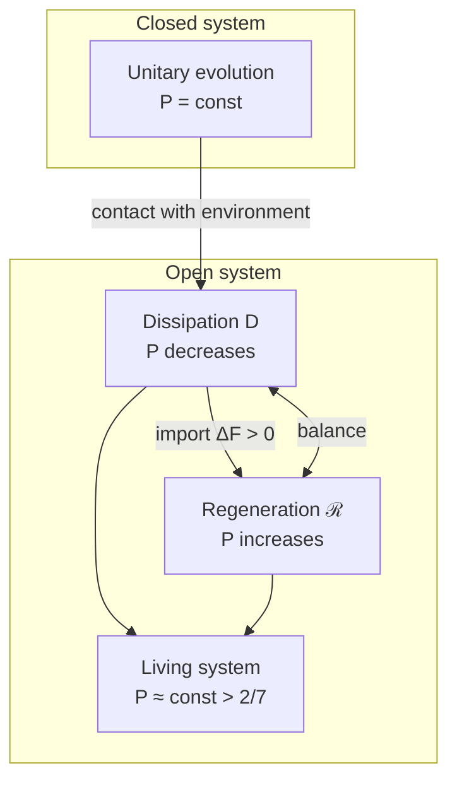

# Evolution of the Coherence Matrix

:::info Who this chapter is for
The complete evolution equation for Γ: unitary, dissipative and regenerative terms. Familiarity with the [coherence matrix](./coherence-matrix) and the [Axiom Ω⁷](/docs/core/foundations/axiom-omega) is assumed.
:::

This chapter is the longest and possibly the most important in the "Dynamics" section. It answers the question: **how does the state of a holon change over time?** If the [coherence matrix](./coherence-matrix) $\Gamma$ is a "snapshot" of the system at a given moment, then the evolution equation is the "rules of cinema", describing how frames succeed one another.

The reader will learn:
- What the **logical Liouvillian** $\mathcal{L}_\Omega$ is and why it is not postulated but derived from the axioms
- Three forces governing evolution: **unitary** (preserves coherence), **dissipative** (destroys), and **regenerative** (restores)
- Why the system always tends toward the **terminal object** $T$ (global attractor)
- How **positivity preservation** is guaranteed — the state remains physical under any evolution

:::tip Intuitive explanation of three forces
Think of an ice sculpture in the sun:
- **Unitary part** $-i[H, \Gamma]$ — the sculptor who **rotates** the sculpture, changing the angle but not the shape. Purity $P$ does not change.
- **Dissipation** $\mathcal{D}[\Gamma]$ — the **sun**, melting the sculpture, erasing detail. Purity $P$ falls.
- **Regeneration** $\mathcal{R}[\Gamma, E]$ — the **freezer**, re-freezing the sculpture, restoring the shape. Purity $P$ can grow (if free energy $\Delta F > 0$ is available).

Life is a dynamic equilibrium: the sun melts, the freezer re-freezes. If the freezer is switched off ($\Delta F \leq 0$), the sculpture inevitably melts ($P \to 1/7$) — the system dies.
:::

## Terminal Object T (global attractor) {#терминальный-объект}

:::warning Property 3 (Terminal Object)
There exists a unique terminal object $T \in \mathcal{C}$:

$$\forall \Gamma \in \mathcal{C}, \exists! f: \Gamma \to T$$

where $T = \Gamma^*$ — the global attractor (equilibrium state).
:::

### Properties of the terminal object {#свойства-t}

| Property | Formulation | Consequence |
|----------|-------------|-------------|
| Uniqueness | $\exists! T$ | Unique equilibrium |
| Universality | $\forall \Gamma, \exists! f: \Gamma \to T$ | All paths lead to T |
| Contractibility | $X = \lVert N(\mathcal{C})\rVert \simeq *$ | Monism proved |
| Fixed point | $\varphi(T) = T$ | T is a fixed point of self-modelling |

### Arrow of time as convergence to T {#стрела-времени-эволюция}

**Theorem (Arrow of time):**

$$\lim_{\tau \to \infty} \Gamma(\tau) = T$$

provided $\Delta F > 0$ (system is not isolated).

**Geometric formulation:**

$$\dim(X_\tau) \geq \dim(X_{\tau+1})$$

The arrow of time is the **progressive collapse of higher strata** toward terminal T.

---

## Full equation of motion {#полное-уравнение-движения}

:::info Emergent time
Time τ is **derived** from the structure of the category $\mathcal{C}$ via the Page–Wootters mechanism, not postulated as an external parameter. See [Theorem on emergent time](../../proofs/dynamics/emergent-time).
:::

The evolution of $\Gamma$ is described by the **logical Liouvillian**:

$$
\frac{d\Gamma(\tau)}{d\tau} = \mathcal{L}_\Omega[\Gamma(\tau)]
$$

where the **logical Liouvillian** $\mathcal{L}_\Omega$ is **derived** from the [subobject classifier Ω](../foundations/axiom-omega#внутренняя-логика):

$$
\mathcal{L}_\Omega[\Gamma] = -i[H_{eff}, \Gamma] + \mathcal{D}_\Omega[\Gamma] + \mathcal{R}[\Gamma, E]
$$

where:
- τ — internal time (parameter of conditional states relative to [O](../structure/dimension-o))
- $H_{eff}$ — effective Hamiltonian from the Page–Wootters constraint
- $-i[H_{eff}, \Gamma]$ — unitary evolution (preserves $P$)
- $\mathcal{D}_\Omega[\Gamma]$ — **logical dissipation** (operators L_k from Ω)
- $\mathcal{R}[\Gamma, E]$ — regeneration (adjoint functor to dissipation)

:::warning Key difference from the standard formulation
The Lindblad operators L_k are **not postulated** arbitrarily — they are **derived** from the atoms of the classifier Ω. This eliminates the ambiguity "L_k depend on the system".
:::

:::note On notation
- $\mathcal{D}$ (calligraphic) — **dissipative** term
- $\mathcal{R}$ (calligraphic) — **regenerative** term
- $R$ (regular) — measure of **reflection** (quality of self-modelling), see [self-observation](/docs/consciousness/foundations/self-observation#мера-рефлексии-r)
:::

#### Iterative scheme: resolving the apparent circularity of ℒ_Ω and φ {#итеративная-схема}

:::info Iterative scheme
The full equation $\mathcal{L}_\Omega[\Gamma] = -i[H_{eff}, \Gamma] + \mathcal{D}_\Omega[\Gamma] + \mathcal{R}[\Gamma, E]$ contains regeneration $\mathcal{R}$, which uses $\rho^* = \varphi(\Gamma)$ — the categorical self-model. At the same time, $\varphi$ is formally defined through the dynamics $\mathcal{L}_\Omega$. This apparent circularity is resolved through an **iterative (fixed-point) scheme**:

1. **Linear part** $\mathcal{L}_0 = -i[H_{eff}, \cdot] + \mathcal{D}_\Omega$ has a unique attractor $\rho^*_{\mathrm{diss}} = I/7$ [Т-39a] — **without dependence on φ**
2. **Zeroth iteration**: $\varphi^{(0)}(\Gamma) := \rho^*_{\mathrm{diss}} = I/7$
3. **n-th iteration**: $\varphi^{(n+1)}(\Gamma) := \lim_{\tau \to \infty} \exp(\tau \cdot \mathcal{L}_\Omega^{(n)})[\Gamma]$, where $\mathcal{R}^{(n)}$ uses $\varphi^{(n)}$
4. **Convergence**: for $\kappa < \kappa_{max}$ (T-96), the sequence $\{\varphi^{(n)}\}$ converges in Frobenius norm

The reflection measure $R = 1/(7P)$ is defined through $\rho^*_{\mathrm{diss}} = I/7$ (iteration level 0) and **does not depend** on the full $\varphi$.
:::

:::info Split-step method: resolving apparent circularity
The nonlinearity $\mathcal{R}$ (dependence on $\varphi(\Gamma)$) is resolved by **step splitting** (Lie–Trotter):

1. **Linear step:** $\Gamma' = e^{\Delta\tau \cdot \mathcal{L}_0}[\Gamma]$ — the linear part is applied (Hamiltonian + dissipator), **not depending on φ**
2. **Nonlinear step:** $\Gamma'' = (1-\alpha)\Gamma' + \alpha\,\varphi(\Gamma')$ — regeneration with φ computed from the *previous* state $\Gamma'$

The scheme converges to the fixed point by the Banach theorem, since φ is a contracting map with coefficient $k = 1 - R < 1$. Analogue: operator splitting in numerical PDE.
:::

## Components of the equation

<span id="1-унитарный-член"></span>

### 1. Unitary term {#1-unitary-term}

$$
-i[H_{eff}, \Gamma(\tau)] = -i(H_{eff}\Gamma - \Gamma H_{eff})
$$

where $H_{eff}$ is the effective Hamiltonian arising from the [Page–Wootters constraint](../../proofs/dynamics/emergent-time#33-формальная-конструкция).

:::note Page–Wootters constraint [Т] (T-87, P3)
$[\hat{C}, \Gamma_{\text{total}}] = 0$ — Wheeler–DeWitt constraint. Derived from A1–A4 via the spectral triple construction (T-87). Time $\tau$ is emergent from correlations between the "clock" and "system" subsystems. Full derivation: [Emergent time](/docs/proofs/dynamics/emergent-time).
:::

**Definition [О] (Wheeler–DeWitt constraint).** {#ограничение-wdw}

$$\hat{C} = H_O \otimes \mathbb{1}_{6D} + \mathbb{1}_O \otimes H_{6D} + H_{\mathrm{int}}$$

— the full energy operator. Physical states satisfy $[\hat{C}, \Gamma_{\mathrm{total}}] = 0$ ([T-87 [Т]](/docs/core/operators/emergent-time)). Emergent time $\tau$ follows from this constraint via the Page–Wootters mechanism.

#### Derivation of the constraint from axiom A5 {#вывод-wdw}

The Page–Wootters constraint (analogue of the Wheeler–DeWitt equation) is **derived** from A5:

**Step 1.** A5 establishes: $\mathcal{H} = \mathcal{H}_O \otimes \mathcal{H}_{\text{rest}}$ with coupling operator $\hat{C} = H_O \otimes \mathbb{1} + \mathbb{1} \otimes H_{\text{rest}} + H_{\text{int}}$.

**Step 2.** Global stationarity: $[\hat{C}, \Gamma_{\text{total}}] = 0$ — the Universe *as a whole* does not evolve.

**Step 3.** Partial trace over O: the conditional state $\Gamma(\tau) = \mathrm{Tr}_O[(|\tau\rangle\langle\tau|_O \otimes \mathbb{1}) \cdot \Gamma_{\text{total}}] / p(\tau)$ satisfies $d\Gamma/d\tau = -i[H_{\text{eff}}, \Gamma] + \mathcal{D}[\Gamma]$, where $H_{\text{eff}}(\tau) = H_{\text{rest}} + \langle\tau|H_{\text{int}}|\tau\rangle_O$.

Emergent dynamics is a **consequence** of the static structure of $\Gamma_{\text{total}}$. Status: **[Т]**

**Properties:**
- Preserves $\mathrm{Tr}(\Gamma) = 1$
- Preserves $P = \mathrm{Tr}(\Gamma^2)$
- Deterministic (reversible) evolution

### 1.1 Derivation of $H_{eff}$ from the Page–Wootters constraint {#вывод-h_eff}

:::info Master definition
This section contains the **derivation** of the effective Hamiltonian from the fundamental constraint. All references to $H_{eff}$ should point here.
:::

**Theorem (Effective dynamics):**
Let $\Gamma_{total} \in \mathcal{H}_{phys} = \ker(\hat{C})$ satisfy the constraint $[\hat{C}, \Gamma_{total}] = 0$ (for pure projectors $\Gamma = |\Psi\rangle\langle\Psi|$ this reduces to the standard $\hat{C}|\Psi\rangle = 0$). Then the conditional state:

$$
\Gamma(\tau) = \frac{\mathrm{Tr}_O\left[ (|\tau\rangle\langle \tau|_O \otimes \mathbb{1}_{6D}) \cdot \Gamma_{total} \right]}{p(\tau)}
$$

evolves according to:

$$
i\frac{\partial}{\partial\tau}\Gamma(\tau) = [H_{eff}(\tau), \Gamma(\tau)]
$$

where the **effective Hamiltonian**:

$$
H_{eff}(\tau) = H_{6D} + \langle\tau|H_{int}|\tau\rangle_O
$$

where:
- $H_{6D} \in \mathcal{L}(\mathcal{H}_{6D})$ — Hamiltonian of the 6D subsystem (excluding clock O), acts on $\mathcal{H}_{6D} \cong \mathbb{C}^6$
- $H_{int}$ — interaction Hamiltonian of clock O with the remaining dimensions, see [Property 2 of Ω⁷](../foundations/axiom-omega#свойство-2)
- $\langle\tau|H_{int}|\tau\rangle_O$ — matrix element in the time basis (scalar over O, operator over 6D)

**Derivation:**

**Step 1.** Apply $\frac{\partial}{\partial\tau}$ to the definition of the conditional state. The parameter $\tau$ enters through the clock basis $|\tau\rangle_O$.

**Step 2.** Use the relation between $|\tau\rangle_O$ and $|k\rangle_O$ (eigenstates of $H_O$):

$$
|\tau_n\rangle = \frac{1}{\sqrt{7}} \sum_{k=0}^{6} e^{-2\pi i k n / 7} |k\rangle_O
$$

The transformation is the standard discrete Fourier transform on ℤ₇, whose completeness and orthonormality are guaranteed by finite-dimensionality [Т].

**Step 3.** From the constraint $[\hat{C}, \Gamma_{total}] = 0$ we have:

$$
[(H_O \otimes \mathbb{1}_{6D} + \mathbb{1}_O \otimes H_{6D} + H_{int}), \Gamma_{total}] = 0
$$

**Step 4.** Projecting onto $|\tau\rangle\langle\tau|_O$ and computing the partial trace, we obtain:

$$
i\frac{\partial}{\partial\tau}\Gamma(\tau) = [H_{6D}, \Gamma(\tau)] + [\langle\tau|H_{int}|\tau\rangle_O, \Gamma(\tau)]
$$

**Step 5.** Combining the terms:

$$
H_{eff}(\tau) = H_{6D} + \langle\tau|H_{int}|\tau\rangle_O
$$

∎

**Corollaries:**

| Regime | Condition | $H_{eff}$ |
|--------|-----------|-----------|
| Weak coupling | $\lambda_E, \lambda_U \to 0$ | $H_{eff} \to H_{6D}$ (standard QM) |
| Strong coupling | $\lVert H_{int}\rVert \sim \lVert H_{6D}\rVert$ | $H_{eff}(\tau)$ essentially depends on $\tau$ |
| Resonance | $\omega_0 \sim \varepsilon_E$ | Special synchronization effects |

:::note Connection with original dynamics
For $\lambda_E, \lambda_U \to 0$ the effective dynamics coincides with the standard von Neumann equation. Standard quantum mechanics is the **weak coupling limit** with the internal clock.

Full definition of [the constraint $\hat{C}$](../foundations/axiom-omega#свойство-2) and [clock operators](../structure/dimension-o#алгебра-часов) can be found in the respective documents.
:::

:::warning Relation between 7D formalism and 6D conditional states
The main equation of motion (§ "Full equation of motion") is written in the **minimal 7D formalism**, where $\Gamma \in \mathcal{D}(\mathbb{C}^7)$ and all 7 dimensions {A,S,D,L,E,O,U} enter on equal footing. The derivation of $H_{eff}$ above uses the **extended Page–Wootters formalism**, in which the conditional state $\Gamma(\tau) \in \mathcal{D}(\mathbb{C}^6)$ is a $6 \times 6$ matrix.

Reconciliation: in the minimal formalism $H_{eff}$ is interpreted as a $7 \times 7$ operator acting trivially on the $O$-component ($H_{eff}|_O = 0$). The Page–Wootters derivation **justifies** the form of $H_{eff}$ via projection of the full $42 \times 42$ dynamics onto the 6D conditional state. After justification, the result is "lifted" back to 7D, where the O-row/column evolves separately. More on the two levels of formalization: [Coherence matrix → Two levels](/docs/core/dynamics/coherence-matrix#two-levels-of-formalization).
:::

### 2. Dissipative term (logical dissipation) {#логический-лиувиллиан}

$$
\mathcal{D}_\Omega[\Gamma] = \sum_k \gamma_k \left( L_k \Gamma L_k^\dagger - \frac{1}{2}\{L_k^\dagger L_k, \Gamma\} \right)
$$

where:
- $L_k$ — Lindblad operators, **derived from the classifier Ω**
- $\gamma_k \geq 0$ — decoherence rates along channel $k$
- $\{A, B\} = AB + BA$ — anticommutator

#### Derivation of L_k from classifier Ω

:::info Theorem (L_k from Ω) [Т]
The atomic Lindblad operators are defined through the atoms of the [subobject classifier](../foundations/axiom-omega#внутренняя-логика):

$$
L_k^{\text{atom}} := |k\rangle\langle k|, \quad k = 0, \ldots, 6
$$

The canonical form (taking into account the [Fano structure](/docs/core/operators/lindblad-operators#фано-операторы)) combines atomic and Fano operators: $L_p^{\text{Fano}} = \frac{1}{\sqrt{3}}\Pi_p$, where $\Pi_p$ are projectors onto Fano lines PG(2,2). Master definition: [Lindblad operators](/docs/core/operators/lindblad-operators).
:::

**CPTP condition:**

$$
\sum_{k=0}^{6} (L_k^{\text{atom}})^\dagger L_k^{\text{atom}} = \sum_k |k\rangle\langle k| = \mathbb{1}
$$

— automatically satisfied (resolution of unity in the basis).

#### Hierarchy of L_k by strata

| Stratum | System type | L_k operator | Interpretation |
|---------|-------------|--------------|----------------|
| I | Matter | $P_{Casimir}^{(k)}$ | Symmetry projectors (group G) |
| II | Life | $\sum_j R_j P_j$ | Quantum error correction |
| III | Mind | $\nabla_{\Gamma_k} F$ | Free energy gradient |
| IV | Consciousness | $\check{\delta}^k$ | Čech coboundary operator |

**Consequence:** L_k are **not arbitrary** — they are determined by the stratum of the base space X on which the system resides.

**Properties:**
- Preserves $\mathrm{Tr}(\Gamma) = 1$
- Decreases $P$: $\frac{dP}{d\tau}\big|_{\mathcal{D}} \leq 0$
- Converts pure states to mixed (decoherence)

**Concrete examples by stratum:**

| Stratum | Operator | Physical process |
|---------|----------|-----------------|
| I | $P_{l,m} = \vert l,m\rangle\langle l,m\vert$ | Projection onto the (l,m)-spin subspace |
| II | $L = \vert j\rangle\langle i\vert$ | Transition from state $i$ to $j$ (recovery) |
| III | $L = e^{-\beta E_k/2}\vert k\rangle\langle k\vert$ | Thermalization to minimum F |
| IV | $L = \check{\delta}: C^k \to C^{k+1}$ | Gluing of local modalities |

### 3. Regenerative term [Т] {#3-регенеративный-член}

$$
\mathcal{R}[\Gamma, E] = \kappa(\Gamma) \cdot (\rho_* - \Gamma) \cdot g_V(P)
$$

where:
- $\kappa(\Gamma) = \kappa_{\text{bootstrap}} + \kappa_0 \cdot \mathrm{Coh}_E(\Gamma)$ — regeneration rate [Т] (adjunction $\mathcal{D}_\Omega \dashv \mathcal{R}$, see [Genesis Protocol](../foundations/axiom-omega#genesis-protocol))
- $\rho_* = \varphi(\Gamma)$ — categorical self-model of the current state [Т] ([φ operator](/docs/core/operators/phi-operator), [formalization](/docs/proofs/categorical/formalization-phi))
- $(\rho_* - \Gamma)$ — relaxation direction [Т] (unique CPTP interpolation + Bures optimality, see [§ Derivation of the regeneration form](#вывод-формы-регенерации))
- $g_V(P) = \mathrm{clamp}\!\left(\frac{P - P_{\mathrm{crit}}}{P_{\mathrm{opt}} - P_{\mathrm{crit}}},\; 0,\; 1\right)$ — V-preserving gate [Т] (see [§ Theorem V-preservation](#теорема-v-preservation-gate))

:::tip Form of ℛ fully derived from axioms [Т]
All components of the regenerative term are **strictly derived** from axioms A1–A5, primitivity of the linear part $\mathcal{L}_0$, and standard thermodynamics:

| Component | Status | Source |
|-----------|:------:|--------|
| $\kappa(\Gamma)$ | [Т] | Adjunction $\mathcal{D}_\Omega \dashv \mathcal{R}$ ([κ₀](/docs/core/foundations/axiom-septicity#структурный-анзац-kappa0)) |
| $\rho_* = \varphi(\Gamma)$ (self-model) | [Т] | Categorical definition of φ ([φ operator](/docs/core/operators/phi-operator)) |
| $(\rho_* - \Gamma)$ (direction) | [Т] | CPTP uniqueness of replacement channel + Bures gradient descent |
| $g_V(P)$ (gate) | [Т] | V-preservation + Landauer ([§ Theorem V-preservation](#теорема-v-preservation-gate)) |

Full derivation: [§ Derivation of the regeneration form](#вывод-формы-регенерации) below.
:::

:::note Engineering deviation [И]
In the implementation, the shape parameter $k = 1 - R$ is clamped to $[0.15,\; 1.0]$: for $R > 0.85$ the value $k = 0.15$ is used instead of the theoretical $k = 1 - R$. This prevents degeneration of the regeneration channel ($k \to 0$ at $R \to 1$ turns $\mathcal{R}$ into the identity operator). The threshold $0.15$ is chosen empirically as the minimum that preserves nonzero regenerative force.
:::

:::warning Nonlinearity and the no-signalling prohibition
$\mathcal{R}$ is nonlinear in $\Gamma$ (through $\kappa(\Gamma)$ and $\varphi(\Gamma)$). In standard quantum mechanics, nonlinear evolution typically leads to violation of the superluminal no-signalling prohibition (Gisin, 1990). In UHM the problem is **structurally excluded** by three conditions:

1. **Locality of φ:** tensor factorization $\tilde{\varphi}_A = \varphi_A \otimes \mathrm{id}_B$ (from holonon autonomy)
2. **Locality of κ:** $\kappa_A(\Gamma_{AB}) = \kappa_A(\mathrm{Tr}_B(\Gamma_{AB}))$ (depends only on local coherences)
3. **CPTP property of φ:** completeness condition $\sum_m K_m^\dagger K_m = I$

From (1)–(3) it follows that $\mathrm{Tr}_A[\tilde{\mathcal{R}}_A[\Gamma_{AB}]] = 0$ — regeneration of subsystem $A$ does not affect the reduced state of the remote subsystem $B$. The fundamental difference from Weinberg's "nonlinear QM": the nonlinearity of UHM acts **at the level of the density matrix**, not the wave function, which eliminates the ensemble dependence — the source of Gisin's problems.

Rigorous proof: [§ No-signalling prohibition](#запрет-сигнализации) below, [Correspondence with physics](../../proofs/physics/physics-correspondence#запрет-сигнализации).
:::

**E-coherence:** See [definition](/docs/core/foundations/axiom-septicity#категориальный-вывод-kappa0). High E-coherence means a distributed (non-localized) structure of experience.

#### Free energy and gradient ΔF {#свободная-энергия-и-градиент-δf}

**Von Neumann free energy** for a quantum system with density matrix $\rho$ at temperature $T$:

$$
F(\rho) = \mathrm{Tr}(\rho H) - k_B T \cdot S_{vN}(\rho)
$$

where:
- $\mathrm{Tr}(\rho H)$ — average energy of the system
- $S_{vN}(\rho) = -\mathrm{Tr}(\rho \log \rho)$ — von Neumann entropy
- $k_B$ — Boltzmann constant
- $T$ — temperature of the thermostat (environment)

**Free energy gradient:**

$$
\Delta F = F_{\text{env}} - F_{\text{sys}} = F(\Gamma_{\text{env}}) - F(\Gamma)
$$

where $\Gamma_{\text{env}}$ — effective state of the environment (thermostat or free energy source).

**Physical meaning:**
- $\Delta F > 0$: environment can transfer free energy to the system → regeneration is possible
- $\Delta F \leq 0$: system is at equilibrium or isolated → regeneration is impossible

#### Operationalization of $\Gamma_{\text{env}}$ and $\Delta F$ {#операционализация-delta-f}

:::warning Problem: What is $\Gamma_{\text{env}}$?
$\Gamma_{\text{env}}$ — the "effective state of the environment" — is not universally defined. Its concretization depends on the type of system and available observables.
:::

**General principle:** $\Gamma_{\text{env}}$ is the density matrix describing the part of the environment that directly interacts with the system (boundary layer, interface).

**Approach 1: Thermodynamic (for systems in contact with a thermostat)**

If the environment is a thermostat at temperature $T_{\text{env}}$:

$$
\Gamma_{\text{env}} = \frac{e^{-H/k_B T_{\text{env}}}}{\mathrm{Tr}(e^{-H/k_B T_{\text{env}}})} = \frac{e^{-\beta_{\text{env}} H}}{Z_{\text{env}}}
$$

Then:

$$
\Delta F = k_B (T_{\text{env}} - T_{\text{sys}}) \cdot S_{vN}(\Gamma) + \text{(energy term)}
$$

For $T_{\text{env}} > T_{\text{sys}}$ we have $\Delta F > 0$ — regeneration is possible.

**Approach 2: Metabolic (for biological systems)**

For living systems $\Gamma_{\text{env}}$ is defined through the **chemical potential** of nutrients:

$$
\Delta F_{\text{metabolism}} \approx \Delta G_{\text{ATP→ADP}} \cdot \dot{n}_{\text{ATP}}
$$

where:
- $\Delta G_{\text{ATP→ADP}} \approx 50 \, \text{kJ/mol}$ — free energy of ATP hydrolysis
- $\dot{n}_{\text{ATP}}$ — ATP consumption rate (mol/s)

**Operationalization:** $\Delta F > 0 \Leftrightarrow$ system receives nutrients (is not starving).

**Approach 3: Informational (for AI systems)**

For artificial systems (AI), where there is no physical metabolism:

$$
\Delta F_{\text{info}} = k_B T_{\text{eff}} \cdot (S_{\text{input}} - S_{\text{output}})
$$

where:
- $S_{\text{input}}$ — entropy of input data (disorder of raw data)
- $S_{\text{output}}$ — entropy of output predictions (structuredness)
- $T_{\text{eff}}$ — effective temperature (model parameter)

**Operationalization:** $\Delta F > 0 \Leftrightarrow$ the model receives new data and converts it into structured representations.

**Approach 4: Approximate (for practical calculations)**

If the details of the environment are unknown, a **binary approximation** can be used:

$$
\Theta(\Delta F) \approx \Theta(r_{\text{input}} - r_{\text{critical}})
$$

where:
- $r_{\text{input}}$ — rate of resource intake (data, energy, nutrients)
- $r_{\text{critical}}$ — minimum rate to maintain $P > P_{\text{crit}}$

**Operationalization:** Regeneration is active when the system receives resources faster than the critical rate.

#### Canonical definition of ΔF via the Bures metric {#каноническое-delta-f}

:::info Theorem (Canonical free energy gradient)
All 4 operationalizations of ΔF are consistent with a **single canonical formula** via the [Bures metric](/docs/proofs/dynamics/emergent-time#41-метрика-бурес):

$$
\Delta F(\Gamma) := d_B^2(\Gamma, \Gamma_{\text{eq}}) - d_B^2(\Gamma, \varphi(\Gamma))
$$

where:
- $d_B(\rho, \sigma) := \sqrt{2(1 - \sqrt{F(\rho, \sigma)})}$ — **Bures chordal distance**
- $F(\rho, \sigma) := |\mathrm{Tr}(\sqrt{\sqrt{\rho}\sigma\sqrt{\rho}})|^2$ — fidelity
- $\Gamma_{\text{eq}} = I/7$ — equilibrium (maximally mixed) state
- $\varphi(\Gamma)$ — [self-model](/docs/proofs/categorical/formalization-phi)
:::

**Interpretation:**

| Component | Formula | Meaning |
|-----------|---------|---------|
| First term | $d_B^2(\Gamma, \Gamma_{\text{eq}})$ | "Distance from chaos" — structuredness of the system |
| Second term | $d_B^2(\Gamma, \varphi(\Gamma))$ | "Distance from oneself" — quality of self-modelling |
| $\Delta F > 0$ | Structuredness > divergence | Regeneration is active |
| $\Delta F \leq 0$ | Divergence ≥ structuredness | Regeneration is suppressed |

**Theorem (Consistency with operationalizations):**

The canonical definition is consistent with all four operationalizations in the respective limits:

| Limit | Condition | Result |
|-------|-----------|--------|
| Thermodynamic | $\Gamma \approx I/7 + \delta\Gamma$ | $\Delta F \propto T \cdot \Delta S$ |
| Metabolic | Finite $\omega_0$ | $\Delta F \propto$ metabolic rate |
| Informational | $\Gamma_{\text{env}}$ defined | $\Delta F \approx D_{KL}(\Gamma_{\text{env}} \| \Gamma)$ |
| Approximate | $\varphi(\Gamma) \approx \Gamma^*$ | $\Delta F \approx P_{\text{eq}} - P$ |

<details>
<summary>Proof sketch of consistency</summary>

**Preliminary relations:**

For nearby states ($\Gamma \approx \sigma$) the Bures metric is related to fidelity:
$$
d_B^2(\Gamma, \sigma) \approx 2(1 - F(\Gamma, \sigma)^{1/2}) \approx \frac{1}{2}\|\Gamma - \sigma\|_1^2
$$

**Case 1: Thermodynamic limit**

For $\Gamma = I/7 + \delta\Gamma$ (small deviation from equilibrium):
- $d_B^2(\Gamma, I/7) \approx \|\delta\Gamma\|_F^2 / 2$
- For thermal states $\delta\Gamma \propto (T_{\text{sys}} - T_{\text{eq}}) \cdot \nabla_T \Gamma$
- Therefore: $\Delta F \propto T \cdot \Delta S$ (linear response)

**Case 2: Metabolic**

The characteristic frequency $\omega_0$ determines the metabolic rate:
- $d_B^2(\Gamma, \varphi(\Gamma)) \propto 1/\omega_0^2$ (fast systems self-model better)
- For fixed structuredness: $\Delta F \propto \omega_0 \propto$ metabolic rate

**Case 3: Informational**

For a defined $\Gamma_{\text{env}}$ (effective environment state):
- $d_B^2(\Gamma, \Gamma_{\text{eq}}) \approx D_{KL}(\Gamma \| I/7)$ for nearby states
- $d_B^2(\Gamma, \varphi(\Gamma)) \approx D_{KL}(\Gamma \| \Gamma_{\text{env}})$ if $\varphi$ projects onto $\Gamma_{\text{env}}$
- Difference: $\Delta F \approx D_{KL}(\Gamma_{\text{env}} \| \Gamma)$ (up to sign)

**Case 4: Approximate**

For $\varphi(\Gamma) \approx \Gamma^*$ (fixed point almost reached):
- $d_B^2(\Gamma, \varphi(\Gamma)) \approx 0$
- $d_B^2(\Gamma, I/7) \approx 2(1 - 1/\sqrt{7P})$ for diagonal $\Gamma$
- $\Delta F \approx d_B^2(\Gamma, I/7) \propto P - 1/7 \approx P_{\text{eq}} - P$

**Status:** The proof sketches show qualitative correspondence. Full quantitative proofs require accounting for specific forms of $\Gamma_{\text{env}}$ and $\varphi$ for each system type.

</details>

**Advantages of the canonical definition:**
1. **Uniqueness** — eliminates multiplicity of operationalizations
2. **Computability** — requires only $\Gamma$ and $\varphi$, does not require $\Gamma_{\text{env}}$
3. **Categorical consistency** — uses the same Bures metric as the [PIR](/docs/core/foundations/axiom-septicity#принцип-информационной-различимости)

:::note Connection with biology
For living systems the source of $\Delta F > 0$ is metabolism: oxidation of nutrients (glucose → CO₂ + H₂O) releases free energy used to maintain $P > P_{\text{crit}}$.
:::

#### Regeneration rate κ {#скорость-регенерации}

:::info Master definition κ₀
The regeneration rate $\kappa(\Gamma) = \kappa_{\text{bootstrap}} + \kappa_0 \cdot \mathrm{Coh}_E(\Gamma)$ is **categorically derived** from the adjunction $\mathcal{D}_\Omega \dashv \mathcal{R}$.

**Full definition and derivation:** [Categorical derivation of κ₀](/docs/core/foundations/axiom-septicity#структурный-анзац-kappa0)
:::

**Key properties of κ₀ (from [master definition](/docs/core/foundations/axiom-septicity#структурный-анзац-kappa0)):**
- $\kappa_{\text{bootstrap}} > 0$ — resolves the bootstrap paradox (see [Genesis Protocol](../foundations/axiom-omega#genesis-protocol))
- $\kappa_0$ depends on Γ → the evolution equation is **nonlinear**
- Dimension: $[\kappa_0] = [\text{time}]^{-1}$

:::info Thermodynamic justification
Regeneration is possible only when $\Delta F > 0$ — the system must import free energy from the environment. This is consistent with the second law of thermodynamics: decrease in entropy (increase in $P$) requires an external source.
:::

**Target state** $\rho_*$ in $\mathcal{R}$ is defined as the [categorical self-model](/docs/core/operators/phi-operator#определение):

$$
\rho_* = \varphi(\Gamma)
$$

where $\varphi$ is the self-modelling operator (left adjoint to the inclusion of subobjects, CPTP channel [Т]). More details: [stratification of definitions](/docs/core/foundations/axiom-septicity#теорема-непротиворечивость-иерархии-определений).

:::info Distinction between attractors
- $\rho^*_{\mathrm{diss}} = I/7$ — attractor of the linear part $\mathcal{L}_0 = -i[H,\cdot] + \mathcal{D}$ (without regeneration), $P = 1/7$. Uniqueness from [primitivity](/docs/core/operators/lindblad-operators#примитивность-ℒω) [Т]. Used in [definition of R](/docs/consciousness/foundations/self-observation#мера-рефлексии-r).
- $\rho^*_\Omega \neq I/7$ — nontrivial attractor of full dynamics $\mathcal{L}_\Omega = \mathcal{L}_0 + \mathcal{R}$, $P(\rho^*_\Omega) > 1/7$ [Т] ([T-96](#теорема-нетривиальность-аттрактора)); $P > 2/7$ unconditionally for embodied holons [Т] ([T-149](/docs/proofs/consciousness/substrate-closure#t-149)).
:::

:::tip Definiteness of the regeneration target [Т]
The regeneration target $\rho_* = \varphi(\Gamma)$ is **uniquely determined** by the [categorical structure](/docs/core/operators/phi-operator) of the self-modelling operator φ (left adjoint to the inclusion of subobjects). For each current state Γ the self-model $\varphi(\Gamma)$ is unique (CPTP channel [Т]).
:::

:::caution Formal uncomputability of $\rho_*$
The target state $\rho_* = \varphi(\Gamma)$ is defined through the operator $\varphi$ — a [categorical left adjoint](/docs/core/operators/phi-operator), concretely realized via $\varphi_{\mathrm{coh}}$ ([Fano channel](/docs/core/operators/phi-operator#каноническая-конструкция-φ_coh-из-фано-структуры)). Computing $\varphi_{\mathrm{coh}}(\Gamma)$ in the 7D formalism requires $O(N^2)$ operations ($N = 7$). In the 42D formalism ($N=42$) an analogous Fano structure on the extended space is required, which makes the evolution equation formally closed but **practically costly** for the extended formalism without approximations.
:::

#### Theorem (Characterization of attractors) [Т] {#теорема-нетривиальность-аттрактора}

The full nonlinear dynamics $\mathcal{L}_\Omega = \mathcal{L}_0 + \mathcal{R}$ (linear part + regeneration) has the following fixed-point structure:

1. $I/7$ — **trivial** fixed point (thermal death).
2. Any **nontrivial** fixed point $\rho^*_\Omega \neq I/7$ satisfies:

$$
P(\rho^*_\Omega) > \frac{1}{7}, \quad P_{\mathrm{coh}}(\rho^*_\Omega) > 0
$$

**Proof.**

1. **Trivial point.** $\mathcal{L}_0[I/7] = 0$ ([primitivity](/docs/core/operators/lindblad-operators#примитивность-ℒω) of the linear part [Т]). $\mathcal{R}[I/7] = \kappa(I/7) \cdot (\varphi(I/7) - I/7) = 0$, since $k = 1 - R(I/7) = 0$ at $R(I/7) = 1$: $\varphi_{\mathrm{coh}}(I/7) = I/7$.
2. **Linear part deflected.** Let $\rho^*_\Omega \neq I/7$. By [T-39a](/docs/core/operators/lindblad-operators#примитивность-ℒω) (primitivity), $I/7$ is the unique fixed point of $\mathcal{L}_0$, hence $\mathcal{L}_0[\rho^*_\Omega] \neq 0$. From $\mathcal{L}_\Omega[\rho^*_\Omega] = 0$ we get $\mathcal{R}[\rho^*_\Omega] = -\mathcal{L}_0[\rho^*_\Omega] \neq 0$, i.e. $\varphi(\rho^*_\Omega) \neq \rho^*_\Omega$.
3. **$P_{\mathrm{coh}} > 0$.** Purity balance in steady state ($dP/d\tau = 0$, Hamiltonian does not change $P$):

   $$
   2\alpha \cdot P_{\mathrm{coh}} = 2\kappa(f^* - P)
   $$

   where $\alpha = 2/3$ (Fano decoherence), $f^* = \mathrm{Tr}(\rho^*_\Omega \cdot \varphi(\rho^*_\Omega))$. Since $P_{\mathrm{coh}} = \sum_{i < j} 2|\gamma^*_{ij}|^2 \geq 0$ always, we need $f^* \geq P$. But $f^* = P$ implies $P_{\mathrm{coh}} = 0$, $\rho^*_\Omega$ is diagonal, and by primitivity of $\mathcal{L}_0$: $\rho^*_\Omega = I/7$ — contradiction. Therefore $f^* > P$ and $P_{\mathrm{coh}} > 0$.
4. **$P > 1/7$.** $P = P_{\mathrm{diag}} + P_{\mathrm{coh}} > P_{\mathrm{diag}} \geq 1/7$ (Jensen's inequality: $\sum_i \gamma_{ii}^2 \geq (\sum_i \gamma_{ii})^2/7 = 1/7$). ∎

:::warning Resolution of the ρ* self-reference paradox
In earlier versions ρ* was defined as "the unique stationary state of the full $\mathcal{L}_\Omega$" (via primitivity T-39a). This created a paradox: at $\rho_* = \rho^*_\Omega$ the regeneration vanishes ($\mathcal{R}[\rho^*_\Omega] = \kappa \cdot (\rho^*_\Omega - \rho^*_\Omega) = 0$), and the only solution to $\mathcal{L}_0[\rho^*_\Omega] = 0$ is $I/7$. The paradox is resolved by replacement: $\rho_*$ in $\mathcal{R}$ is defined as the **categorical self-model** $\varphi(\Gamma)$ of the current state (Definition 1 of the [φ operator](/docs/core/operators/phi-operator)), not as the dynamical limit. In this case $\varphi(\rho^*_\Omega) \neq \rho^*_\Omega$ (the system does not achieve perfect self-knowledge), and regeneration **does not vanish** in the stationary regime — it is precisely compensated by dissipation.
:::

#### Hierarchy of fixed points [О] {#иерархия-неподвижных-точек}

| Level | Object | Definition | $P$ | Physical meaning |
|-------|--------|------------|-----|-----------------|
| 0 | $\rho^*_{\mathrm{diss}} = I/7$ | $\mathcal{D}_\Omega[\rho^*_{\mathrm{diss}}] = 0$ | $1/7$ | Thermal death (entropy maximum) |
| 1 | $\rho^*_\Omega$ | $\mathcal{L}_\Omega[\rho^*_\Omega] = 0$ | $> 1/7$ [Т] | Post-Genesis attractor (balance of $\mathcal{D}$ and $\mathcal{R}$) |
| 2 | $\Gamma^*_{\mathrm{coh}}$ | $\varphi_{\mathrm{coh}}(\Gamma^*_{\mathrm{coh}}) = \Gamma^*_{\mathrm{coh}}$ | $2/7$ | Viability boundary — target of $\varphi_{\mathrm{coh}}$ |

The reflection measure $R$ uses $\rho^*_{\mathrm{diss}} = I/7$ as **reference** (distance from thermal death), not as the regeneration target. More details: [self-observation](/docs/consciousness/foundations/self-observation#иерархия-аттракторов).

#### Theorem (Attractor purity balance) [Т] {#теорема-баланс-чистоты-аттрактора}

At any nontrivial fixed point $\rho^*_\Omega \neq I/7$ the purity is given by the formula:

$$
P(\rho^*_\Omega) = \frac{\alpha \cdot P_{\mathrm{diag}} + \kappa \cdot f^*}{\alpha + \kappa}
$$

where $\alpha = 2/3$ (Fano decoherence rate), $\kappa = \kappa(\rho^*_\Omega)$, $f^* = \mathrm{Tr}(\rho^*_\Omega \cdot \varphi(\rho^*_\Omega))$.

**Proof.** From purity balance (step 3 of [T-96](#теорема-нетривиальность-аттрактора)):

$$
2\alpha \cdot P_{\mathrm{coh}} = 2\kappa(f^* - P), \quad P = P_{\mathrm{diag}} + P_{\mathrm{coh}}
$$

Substituting $P_{\mathrm{coh}} = P - P_{\mathrm{diag}}$:

$$
\alpha(P - P_{\mathrm{diag}}) = \kappa(f^* - P) \implies P(\alpha + \kappa) = \alpha P_{\mathrm{diag}} + \kappa f^*
$$
∎

#### Corollary T-98a: Lower bound for embodied systems [Т] {#следствие-t98a}

:::tip Corollary T-98a [Т]
For an embodied holon $(H, \pi, B)$ with additional CPTP channels
$\{\Phi_k\}_{k=1}^{K}$ (backbone, anchor, hedonic):

$$P(\rho^*_{\text{embodied}}) \geq \frac{\alpha P_{\text{diag}} + \kappa f^*}{\alpha + \kappa}$$

**Proof.** Each $\Phi_k$ is a CPTP channel that preserves or increases
diagonal elements (structured input $P_{\text{diag}} \uparrow$). The T-98 formula describes
the balance ONLY between Fano decoherence ($\alpha$) and regeneration ($\kappa$). Additional
channels contribute positively to the numerator without increasing the denominator.
The inequality is strict when at least one $\Phi_k$ with $P(\Phi_k[\Gamma]) > P(\Gamma)$ is present. $\blacksquare$

**Numerical verification (SYNARC):** $P_{\text{measured}} = 0.429 > P_{T98} \approx 0.23$, $\delta = 0.20$.
The difference is due to backbone injection ($\beta = 0.3$) and hedonic drive.
:::

:::tip Attractor stability [T-125, T-127]
For $P(\rho^*_\Omega) > 2/7$ the attractor is **locally asymptotically stable**: $\|\Gamma(\tau) - \rho^*_\Omega\|_F \leq \|\Gamma(0) - \rho^*_\Omega\|_F \cdot e^{-c\tau}$, $c > 0$. The basin of attraction contains $B(\rho^*_\Omega, r_{\mathrm{stab}}) \cap \mathcal{V}_P$. See [T-125](/docs/proofs/consciousness/conscious-window#t-125), [T-127](/docs/proofs/consciousness/conscious-window#t-127).
:::

#### Theorem (Attractor viability) [С → Т for embodied] {#теорема-жизнеспособность-аттрактора}

Under the κ-dominance condition:

$$
\kappa_{\mathrm{eff}} > \frac{\alpha}{7(f^* - 2/7)}
$$

the nontrivial attractor is viable: $P(\rho^*_\Omega) > P_{\mathrm{crit}} = 2/7$.

**Proof.** From the [balance formula](#теорема-баланс-чистоты-аттрактора) for $P_{\mathrm{diag}} = 1/7$ (uniform diagonal): $P > 2/7 \Leftrightarrow \kappa(f^* - 2/7) > \alpha/7$, whence $\kappa > \alpha/(7(f^* - 2/7)) = 2/(21(f^* - 2/7))$. The condition depends on the overlap $f^* = \mathrm{Tr}(\rho^*_\Omega \cdot \varphi(\rho^*_\Omega))$ with the self-model, hence status [С] for an isolated holon. ∎

:::tip Elevation to [Т] for embodied holons (T-149)
By [T-149 [Т]](/docs/proofs/consciousness/substrate-closure#t-149): for an **embodied** holon $(H, \pi, B)$ with $P_{\mathrm{env}} > 2/7$ the attractor viability holds **unconditionally** — backbone injection ensures $P > 2/7$ via [T-148 [Т]](/docs/proofs/consciousness/substrate-closure#t-148) (genesis through environmental adjunction). An isolated holon at $I/7$ remains dead forever (T-39a [Т]).
:::

:::info Concrete thresholds
- For $f^* = 5/7$: $\kappa > 2/(21 \cdot 3/7) = 2/9 \approx 0.222$; since $\kappa_{\mathrm{bootstrap}} = 1/7 \approx 0.143 < 2/9$, a small contribution from $\kappa_0 \cdot \mathrm{Coh}_E$ is required ([T-59](/docs/core/foundations/axiom-omega#теорема-kappa-bootstrap-bound))
- For $f^* = 3/7$: $\kappa > 2/3$ — a substantial contribution from $\kappa_0 \cdot \mathrm{Coh}_E$ is required
- For $f^* \to 2/7$: $\kappa \to \infty$ — the boundary case is unattainable
:::

#### Theorem (Attractor consistency) [С → Т] {#теорема-согласованность-аттракторов}

In the stationary regime, level 1 and level 2 attractors converge in the weak Hamiltonian limit:

$$
\rho^*_\Omega \approx \Gamma^*_{\mathrm{coh}} + \delta\Gamma, \quad \|\delta\Gamma\|_F = O(\bar{\varepsilon})
$$

where $\bar{\varepsilon} \approx 0.023$ is the characteristic coupling coherence ([T-61](/docs/core/dynamics/gap-thermodynamics#теорема-единственный-вакуум) [Т]). The correction $\delta\Gamma$ is determined by the Hamiltonian $H_{\mathrm{eff}}$ and decreases with increasing dissipation rate.

:::tip Elevation to [Т] (T-157)
By [T-157 [Т]](/docs/proofs/consciousness/substrate-closure#t-157): $\|\rho^*_\Omega - \Gamma^*_{\mathrm{coh}}\|_F \leq \|H_{\mathrm{eff}}\|_{\mathrm{op}} / (\alpha + \kappa)$ — parametric bound. For an isolated vacuum: $\|H_{\mathrm{eff}}\| = O(\bar{\varepsilon})$. For embodied systems: $\|H_{\mathrm{eff}}^{\mathrm{embodied}}\|$ is determined by backbone, hedonic drive and learning gradient. C21 → **[Т]**.
:::

### Genesis through environmental adjunction {#генезис-средовое-сопряжение}

:::tip T-148 [Т]: Consciousness requires embodiment
An **isolated holon** at $\Gamma = I/7$ remains dead forever: $g_V(1/7) = 0$, $\mathcal{R} = 0$ (T-39a [Т]). An **embodied holon** with backbone injection ($\beta \in (0,1)$, $P_{\mathrm{env}} > 2/7$) raises purity above $P_{\mathrm{crit}}$ in finite time $n_{\mathrm{genesis}} \leq \lceil \ln\Delta / \ln(1/\beta) \rceil$. Detailed proof: [T-148](/docs/proofs/consciousness/substrate-closure#t-148).
:::

### Positivity preservation {#сохранение-положительности}

:::warning Theorem (Correctness of nonlinear evolution)
Despite the nonlinearity, the full evolution equation **preserves positivity** $\Gamma \geq 0$ and normalization $\mathrm{Tr}(\Gamma) = 1$.
:::

**Interpolation formulation [Т]:**

:::info Corollary of CPTP uniqueness
The interpolation formulation is **not an ansatz** but a **consequence** of the theorem on uniqueness of linear CPTP relaxation: the replacement channel $T_\alpha(\Gamma) = (1-\alpha)\Gamma + \alpha\rho_*$ is the unique CPTP channel of the form $(1-\alpha)\mathrm{Id} + \alpha\mathcal{C}$ with $\mathcal{C}(\rho_*) = \rho_*$. See [§ Derivation of the regeneration form](#вывод-формы-регенерации).
:::

Discrete evolution over step $\Delta\tau$ is represented as a convex combination:

$$
\Gamma(\tau + \Delta\tau) = (1 - \alpha) \cdot \mathcal{E}[\Gamma(\tau)] + \alpha \cdot \rho_*
$$

where:
- $\mathcal{E}$ — CPTP Lindblad evolution (without regeneration)
- $\alpha = \kappa(\Gamma) \cdot g_V(P) \cdot \Delta\tau \in [0, 1]$
- $\rho_* = \varphi(\Gamma)$ — categorical self-model ([φ operator](/docs/core/operators/phi-operator) [Т])
- Both terms are density matrices

**Theorem (CPTP structure of regeneration) [Т]:**

The regenerative operator $\mathcal{R}_\alpha(\rho) := (1-\alpha)\rho + \alpha\rho_*$ is a CPTP channel for $\alpha \in [0,1]$.

**Proof:** $\mathcal{R}_\alpha$ is a convex combination of CPTP channels $\mathrm{Id}$ and $\mathcal{C}_{\rho_*}$ (replacement channel $\mathcal{C}_{\rho_*}(\Gamma) = \rho_*$). Kraus representation for $\mathcal{C}_{\rho_*}$: $K_m = \sqrt{p_m}|m\rangle\langle m|_{\rho_*} \otimes \mathbb{1}$. Full representation: $\tilde{K}_0 = \sqrt{1-\alpha}I$, $\tilde{K}_k = \sqrt{\alpha}K_k$. Completeness condition: $\sum_j \tilde{K}_j^\dagger \tilde{K}_j = (1-\alpha)I + \alpha I = I$. ∎

**Integration step condition:**

To guarantee $\alpha < 1$ we require:

$$
\Delta\tau < \frac{1}{\kappa_{\max}} = \frac{1}{\kappa_{\text{bootstrap}} + \kappa_0}
$$

With adaptive step selection, positivity is guaranteed for any initial conditions.

### Extension of $\mathcal{R}$ to composite systems {#расширение-r-на-составные-системы}

:::info Definition (Canonical extension of regeneration)
For a composite system $A \otimes B$, where $A$ is an autonomous holon, the **canonical extension** of the regenerative term is defined as:

$$
\tilde{\mathcal{R}}_A[\Gamma_{AB}] := \kappa_A(\Gamma_A) \cdot \left((\varphi_A \otimes \mathrm{id}_B)(\Gamma_{AB}) - \Gamma_{AB}\right) \cdot g_V(P_A)
$$

where $\Gamma_A := \mathrm{Tr}_B(\Gamma_{AB})$, and $\varphi_A \otimes \mathrm{id}_B$ is the tensor extension of the CPTP channel $\varphi_A$ to the composite system.
:::

**Properties:**

| # | Property | Formulation |
|---|----------|-------------|
| 1 | **Consistency** | For $\Gamma_{AB} = \Gamma_A \otimes \Gamma_B$: $\tilde{\mathcal{R}}_A = \mathcal{R}_A[\Gamma_A] \otimes \Gamma_B$ |
| 2 | **Correctness** | $\varphi_A \otimes \mathrm{id}_B$ — CPTP channel on $\mathcal{D}(\mathcal{H}_A \otimes \mathcal{H}_B)$ |
| 3 | **Uniqueness** | Unique extension compatible with tensor structure of DensityMat |

### No-signalling prohibition {#запрет-сигнализации}

:::warning Theorem (No-signalling prohibition in UHM)
Despite the nonlinearity of the regenerative term, UHM evolution **preserves the no-signalling principle**: regeneration of subsystem $A$ does not affect the reduced state of the remote subsystem $B$.

$$
\mathrm{Tr}_A[\tilde{\mathcal{R}}_A[\Gamma_{AB}]] = 0
$$
:::

**Proof (general case for an arbitrary entangled state):**

Let $\Gamma_{AB} \in \mathcal{D}(\mathcal{H}_A \otimes \mathcal{H}_B)$ be an **arbitrary** (possibly maximally entangled) state of the composite system. Denote $\Gamma_A := \mathrm{Tr}_B(\Gamma_{AB})$, $\Gamma_B := \mathrm{Tr}_A(\Gamma_{AB})$.

**Step 1 (Scalarity of κ and g_V).** By condition NS2: $\kappa_A(\Gamma_{AB}) = \kappa_A(\Gamma_A) \in \mathbb{R}_{\geq 0}$ — a scalar depending on $\Gamma_{AB}$ only through the marginal $\Gamma_A$. Similarly, $g_V(P_A) \in [0, 1]$ — a scalar depending only on $P_A = \mathrm{Tr}(\Gamma_A^2)$. Denote $c_A := \kappa_A(\Gamma_A) \cdot g_V(P_A) \in \mathbb{R}_{\geq 0}$.

**Step 2 (Kraus operator substitution).** Let $\{K_m\}_{m=1}^M$ be the Kraus operators of the channel $\varphi_A$, i.e. $\varphi_A(\rho) = \sum_m K_m \rho K_m^\dagger$ with $\sum_m K_m^\dagger K_m = I_A$. Then:

$$
(\varphi_A \otimes \mathrm{id}_B)(\Gamma_{AB}) = \sum_m (K_m \otimes I_B) \Gamma_{AB} (K_m^\dagger \otimes I_B)
$$

**Step 3 (Partial trace).** We compute $\mathrm{Tr}_A$ of each term:

$$
\mathrm{Tr}_A\left[(K_m \otimes I_B) \Gamma_{AB} (K_m^\dagger \otimes I_B)\right] = \mathrm{Tr}_A\left[(K_m^\dagger K_m \otimes I_B) \Gamma_{AB}\right]
$$

where the cyclic property of trace was used: $\mathrm{Tr}_A[X^\dagger \rho X] = \mathrm{Tr}_A[X X^\dagger \rho]$. Summing over $m$:

$$
\mathrm{Tr}_A[(\varphi_A \otimes \mathrm{id}_B)(\Gamma_{AB})] = \mathrm{Tr}_A\left[\left(\sum_m K_m^\dagger K_m \otimes I_B\right) \Gamma_{AB}\right] = \mathrm{Tr}_A[(I_A \otimes I_B) \Gamma_{AB}] = \Gamma_B
$$

**Step 4 (Substitution into $\tilde{\mathcal{R}}_A$).**

$$
\mathrm{Tr}_A[\tilde{\mathcal{R}}_A[\Gamma_{AB}]] = c_A \cdot \left(\underbrace{\mathrm{Tr}_A[(\varphi_A \otimes \mathrm{id}_B)(\Gamma_{AB})]}_{\Gamma_B \text{ (Step 3)}} - \underbrace{\mathrm{Tr}_A[\Gamma_{AB}]}_{\Gamma_B}\right) = c_A \cdot (\Gamma_B - \Gamma_B) = 0
$$

The result does not depend on the degree of entanglement of $\Gamma_{AB}$, the specific form of $\kappa_A$ or $\varphi_A$. ∎

:::info Difference from Weinberg's nonlinear QM
The theorems of Gisin (1990) and Polchinski (1991) prove that the nonlinear modification of the Schrödinger equation $i\hbar\partial_t|\psi\rangle = H[|\psi\rangle]|\psi\rangle$ violates no-signalling, because:
- Nonlinearity acts on the **state vector** $|\psi\rangle$, not on the density matrix $\rho$
- The result depends on the **ensemble decomposition**: $\rho = \sum_i p_i |\psi_i\rangle\langle\psi_i|$ — the same $\rho$ with different decompositions gives different evolutions

In UHM the nonlinearity $\mathcal{R}[\Gamma, E]$ acts on $\Gamma$ (density matrix) **directly**, bypassing the $|\psi\rangle$ level. The functionals $\kappa(\Gamma)$, $\varphi(\Gamma)$, $g_V(P(\Gamma))$ depend **only on $\Gamma$**, not on its ensemble decomposition. This **structurally** eliminates the Gisin mechanism.
:::

**Consequences:**

1. Nonlinearity of $\kappa(\Gamma)$ **does not violate** the no-signalling prohibition — $c_A$ is taken out of the partial trace as a scalar
2. Protection is **structural**: does not depend on the specific form of $\kappa$, $\varphi$ or $\Delta F$ — conditions NS1–NS3 are sufficient
3. The result holds for **arbitrary** (including maximally entangled) states $\Gamma_{AB}$

**Three conditions ensuring the no-signalling prohibition (NS1–NS3):** {#условия-ns}

| Condition | Formulation | Justification |
|-----------|-------------|---------------|
| **NS1** (Locality of φ) | $\tilde{\varphi}_A := \varphi_A \otimes \mathrm{id}_B$ | Follows from autonomy (A1) and categorical structure |
| **NS2** (Locality of κ) | $\kappa_A(\Gamma_{AB}) = \kappa_A(\mathrm{Tr}_B(\Gamma_{AB}))$ | $\kappa_0$ depends on local coherences $\gamma_{OE}^{(A)}, \gamma_{OU}^{(A)}, \gamma_{OO}^{(A)}$ |
| **NS3** (CPTP property of φ) | $\varphi$ — CPTP channel | Definition of the [self-modelling operator](/docs/consciousness/foundations/self-observation#оператор-самомоделирования-φ) |

**Verification of NS2 for the canonical formula κ:** κ(Γ) = κ_bootstrap + κ₀·Coh_E(Γ). Since κ_bootstrap is a constant, and Coh_E(Γ) depends only on the E-row/column of the matrix Γ, for a composite system Γ_AB: κ_A(Γ_AB) = κ_bootstrap + κ₀·Coh_E(Tr_B(Γ_AB)) = κ_A(Γ_A), i.e. NS2 holds [Т].

Full proof with categorical formalization: [Correspondence with physics: No-signalling prohibition](../../proofs/physics/physics-correspondence#запрет-сигнализации).

## Thermodynamic constraint

Growth of purity is bounded by free energy costs:

$$
\frac{dP}{d\tau} \leq \frac{1}{k_B T} \cdot \frac{dF}{d\tau}
$$

where:
- $k_B$ — Boltzmann constant
- $T$ — temperature of the environment
- $F$ — free energy of the system

**Consequence:** Living systems are dissipative structures maintaining $P > P_{\text{crit}} = 2/7$ through import of free energy.

## Evolution regimes

### Unitary regime (closed system)

$$
\frac{d\Gamma}{d\tau} = -i[H, \Gamma]
$$

**Characteristics:**
- Coherence is preserved
- Deterministic evolution
- $P = \mathrm{const}$

**Example:** Isolated quantum system.

### Dissipative regime (decoherence)

$$
\frac{d\Gamma}{d\tau} = \mathcal{D}[\Gamma]
$$

**Characteristics:**
- Coherences decay: $\gamma_{ij} \to 0$ for $i \neq j$
- $P \to 1/7$ (maximally mixed state)
- System "classicalizes"

**Example:** Quantum system in contact with a thermostat.

### Living regime (open system with regeneration)

$$
\frac{d\Gamma}{d\tau} = -i[H, \Gamma] + \mathcal{D}[\Gamma] + \mathcal{R}[\Gamma, E]
$$

**Characteristics:**
- Balance of $\mathcal{D}$ and $\mathcal{R}$
- $P$ is maintained above the [critical value](./viability#критическая-чистота): $P > P_{\text{crit}} = 2/7 \approx 0.286$
- Requires continuous import of free energy

**Example:** A living organism maintaining homeostasis.

### Connection with terminal object T {#связь-с-t}

All regimes describe **approach to T**, but at different speeds:

| Regime | Approach speed to T | Distance $d_{strat}(\Gamma, T)$ |
|--------|--------------------|---------------------------------|
| Unitary | Zero (isentropic motion) | Constant |
| Dissipative | Maximum (irreversible decoherence) | Decreases monotonically |
| Living | Slowed (regeneration counteracts) | Stabilizes |

**Theorem (Asymptotic convergence):**

For $\tau \to \infty$ and any initial $\Gamma_0$:

$$\lim_{\tau \to \infty} \Gamma(\tau) = T$$

if $\mathcal{D} \neq 0$ (system is not fully isolated).

<a id="purity-dynamics"></a>

## Purity dynamics {#динамика-чистоты}

Time derivative of purity:

$$
\frac{dP}{d\tau} = 2 \cdot \mathrm{Tr}\left(\Gamma \cdot \frac{d\Gamma}{d\tau}\right)
$$

Substituting the components of the equation:

$$
\frac{dP}{d\tau} = \underbrace{0}_{\text{unitary}} + \underbrace{\left.\frac{dP}{d\tau}\right|_{\mathcal{D}}}_{\leq 0} + \underbrace{\left.\frac{dP}{d\tau}\right|_{\mathcal{R}}}_{\geq 0 \text{ for } \Delta F > 0}
$$

**Viability condition:**

$$
\left.\frac{dP}{d\tau}\right|_{\mathcal{R}} + \left.\frac{dP}{d\tau}\right|_{\mathcal{D}} > 0 \quad \text{for } P < P_{\text{target}}
$$

## Regime diagram


```mermaid
graph TD
    subgraph CL["Closed system"]
        U["Unitary evolution<br/>P = const"]
    end
    subgraph OP["Open system"]
        DIS["Dissipation D<br/>P decreases"]
        REG["Regeneration ℛ<br/>P increases"]
        LIV["Living system<br/>P ≈ const > 2/7"]
    end
    U --> |"contact with environment"| DIS
    DIS --> |"import ΔF > 0"| REG
    DIS <--> |"balance"| REG
    DIS --> LIV
    REG --> LIV
```

## Theorem on preservation of properties

:::info Theorem (Preservation of density matrix properties)
The dynamics defined by the evolution equation preserves:
1. **Hermiticity:** $\Gamma(\tau)^\dagger = \Gamma(\tau)$
2. **Positivity:** $\Gamma(\tau) \geq 0$
3. **Normalization:** $\mathrm{Tr}(\Gamma(\tau)) = 1$
:::

**Proof:**
1. **Unitary term:** $[H, \Gamma]^\dagger = [\Gamma^\dagger, H^\dagger] = [\Gamma, H] = -[H, \Gamma]$ for $H = H^\dagger$
2. **Dissipator:** The Lindblad form is specifically constructed to preserve these properties (Lindblad–Gorini–Kossakowski–Sudarshan theorem)
3. **Regenerator:** For $\rho_*$ — a valid density matrix [Т], $\mathcal{R}$ preserves the properties

**QED**

---

## Derivation of the regeneration form [Т] {#вывод-формы-регенерации}

:::tip Status: Theorem [Т]
The form of the regenerative term $\mathcal{R}[\Gamma, E] = \kappa(\Gamma) \cdot (\rho_* - \Gamma) \cdot g_V(P)$ is **fully derived** from axioms A1–A5, the categorical definition of $\varphi$ [Т], standard thermodynamics (Landauer principle) and V-invariance. No component of the dynamics remains a postulate.
:::

### Theorem (Uniqueness of linear CPTP relaxation) [Т]

**Formulation.** Let $\rho_* = \varphi(\Gamma) \in \mathcal{D}^+(\mathbb{C}^N)$ be the regeneration target state ([categorical self-model](/docs/core/operators/phi-operator) [Т]). Then the linear superoperator $L_*[\Gamma] := c \cdot (\rho_* - \Gamma)$ with $c > 0$:

1. Satisfies the conditions for admissible relaxation: fixed point (R1), trace preservation (R2), infinitesimal CPTP (R3), contractivity in the Bures metric (R4).
2. Is the **unique** operator of the form $L[\Gamma] = T[\Gamma] - \Gamma$ with $T$ — replacement CPTP channel and $T(\rho_*) = \rho_*$.

**Proof.**

**Step 1 (Construction).** The family of CPTP channels $T_\alpha(\Gamma) := (1 - \alpha)\Gamma + \alpha\rho_*$, $\alpha \in [0, 1]$ — convex combination of channels $\mathrm{Id}$ and $\mathcal{C}_{\rho_*}$ (replacement channel). Infinitesimal generator:

$$
L_*[\Gamma] = \lim_{\alpha \to 0} \frac{T_\alpha(\Gamma) - \Gamma}{\alpha} = \rho_* - \Gamma
$$

**Step 2 (Verification of R1–R4):**
- **(R1):** $L_*[\rho_*] = \rho_* - \rho_* = 0$ ✓
- **(R2):** $\mathrm{Tr}(L_*[\Gamma]) = 1 - 1 = 0$ ✓
- **(R3):** $\mathrm{Id} + \alpha L_* = T_\alpha$ — CPTP for $\alpha \in [0,1]$ ✓
- **(R4):** By strict convexity of the Bures metric (Uhlmann 1976): $d_B(T_\alpha(\Gamma), \rho_*) \leq (1-\alpha) d_B(\Gamma, \rho_*) < d_B(\Gamma, \rho_*)$ for $\alpha > 0$, $\Gamma \neq \rho_*$ ✓

**Step 3 (Uniqueness).** The replacement channel with $\mathcal{C}(\rho_*) = \rho_*$ fixes the output $\sigma = \rho_*$. Uniqueness follows from the uniqueness of $\varphi(\Gamma)$ for fixed $\Gamma$ (CPTP channel [Т]). $\blacksquare$

### Theorem T-122: Diagonal freeze (stationarity of identity) [Т] {#теорема-диагональный-freeze}

**Formulation.** In the presence of the replacement channel $\mathcal{R}[\Gamma, E] = \kappa(\Gamma) \cdot (\rho_* - \Gamma)$, the diagonal elements $\gamma_{kk}$ are stationary at $\gamma_{kk} = (\rho_*)_{kk}$:

$$
\frac{d\gamma_{kk}}{d\tau} = 0 \quad \text{at} \quad \gamma_{kk} = (\rho_*)_{kk}, \quad k = 0, \ldots, 6
$$

**Proof.**

Full dynamics: $\frac{d\Gamma}{d\tau} = \mathcal{L}_{\mathrm{Ham}}[\Gamma] + \mathcal{L}_{\mathrm{diss}}[\Gamma] + \mathcal{R}[\Gamma, E]$.

**Step 1 (Hamiltonian contribution).** For Hermitian $H$ and Hermitian $\Gamma$: $[H, \Gamma]_{kk} = \sum_j (H_{kj}\gamma_{jk} - \gamma_{kj}H_{jk})$. Since $H_{kj} = \overline{H_{jk}}$ and $\gamma_{jk} = \overline{\gamma_{kj}}$, each term $H_{kj}\gamma_{jk}$ is conjugate to $\gamma_{kj}H_{jk}$, hence $[H, \Gamma]_{kk} \in i\mathbb{R}$. But $\Gamma$ is Hermitian $\Rightarrow \frac{d\gamma_{kk}}{d\tau} \in \mathbb{R}$. The only element that is both real and purely imaginary is zero: $(-i[H, \Gamma])_{kk} = 0$.

**Step 2 (Dissipative + regenerative contribution).** Both replacement-type channels give $\kappa \cdot ((\rho_*)_{kk} - \gamma_{kk}) = 0$ at $\gamma_{kk} = (\rho_*)_{kk}$.

Total: $\frac{d\gamma_{kk}}{d\tau} = 0 + 0 = 0$. $\blacksquare$

:::tip Corollary: architectural invariance of identity
The Weyl measure $W = \sum_k |\gamma_{kk} - 1/N|$ is a dynamical invariant for a stationary diagonal. The identity of the system (distribution over 7 cognitive dimensions) cannot be changed by learning — only off-diagonal coherences $\gamma_{ij}$ ($i \neq j$) evolve. Empirics: $W_{\mathrm{std}} = 1.67 \times 10^{-16}$ over 300 steps.
:::

:::warning Domain of T-122 [Т-134]
T-122 holds **ONLY at the attractor** $\rho^*_\Omega$ ($\gamma_{kk} = (\rho^*)_{kk}$). Away from the attractor the general formula is: $d\gamma_{kk}/d\tau = (\mathcal{L}_0)_{kk}[\Gamma] + \kappa(\rho^*_{kk} - \gamma_{kk}) \neq 0$. Genesis from $I/7$ does NOT contradict T-122: at $\Gamma(0) = I/7$, the diagonal GROWS toward $\rho^*_{kk}$. "Sector profile = character" is invariant only **after convergence** to the attractor; during learning the profile is plastic. More details: [T-134 [Т]](/docs/proofs/consciousness/operationalization#t-134).
:::

:::info Γ-backbone duality [Т] (T-139)
For a digital agent with backbone $B$ and anchor $\pi$: $\Gamma = \alpha \cdot \mathcal{E}_{\delta\tau}[\Gamma_{\text{prev}}] + (1-\alpha) \cdot \pi(\mathcal{B}(x))$ — the unique (up to $G_2$) hybrid CPTP dynamics. Backbone is a causal channel, $\Gamma$ is the ontological state. More details: [T-139 [Т]](/docs/proofs/consciousness/operational-closure#t-139).
:::

### Theorem (Bures gradient descent) [Т]

On the Riemannian manifold $(\mathcal{D}^+(\mathbb{C}^N), g_B)$ with the Bures metric, the gradient of the functional $V(\Gamma) := \frac{1}{2}d_B^2(\Gamma, \rho_*)$ near $\rho_*$ equals:

$$
\mathrm{grad}_B\,V(\Gamma) = \frac{1}{2}(\Gamma - \rho_*) + O(\|\Gamma - \rho_*\|^2)
$$

The steepest descent flow $d\Gamma/d\tau = -\mathrm{grad}_B\,V$ coincides with $L_*[\Gamma] = \rho_* - \Gamma$ in the linear approximation (the factor 1/2 is absorbed into $\kappa(\Gamma)$).

**Physical meaning:** Regeneration is **steepest descent** in the unique monotone metric on $\mathcal{D}(\mathcal{H})$ (Chentsov–Petz theorem, A2). This is not an arbitrary ansatz, but a **geometrically optimal** strategy for approaching $\rho_*$.

### Theorem (Θ(ΔF) from the Landauer principle) [Т]

Regeneration increases purity ($dP/d\tau|_\mathcal{R} \geq 0$), which is equivalent to decreasing von Neumann entropy. By the Landauer principle (1961), this is possible **only** for a positive free energy gradient:

$$
\Delta S_{\text{sys}} < 0 \implies \Delta F > 0
$$

Therefore, $\Theta(\Delta F)$ is a **necessary** constraint, not an ansatz. The canonical definition of $\Delta F$ via the [Bures metric](#каноническое-delta-f) is the **geometric formulation** of the Landauer principle.

:::tip Status upgrade (T-186)
The [Cohesive Closure Theorem](/docs/proofs/categorical/cohesive-closure) removes the conditional dependence on $D_{\text{int}}$ spectral details: $\Delta F = \|\mathrm{curv}(\Gamma)\|^2 = \omega_0^2 \cdot \mathcal{G}_{\text{total}}$ via the Chern-Weil homomorphism. By T-55 (Gap > 0), $\Delta F > 0$ is **unconditional** for any viable $\Gamma$.
:::

### Theorem (V-preservation gate) [Т] {#теорема-v-preservation-gate}

The condition $\Theta(\Delta F)$ is **necessary but not sufficient** for correct gating of regeneration. The replacement channel $\varphi$ with fixed point $\rho_* = I/7$ decreases purity ($P(\varphi(\Gamma)) \leq P(\Gamma)$), so for $P \in (P_{\min}, P_{\text{crit}})$ regeneration is **destructive**: it pushes $\Gamma$ out of the viability set $V = \{\Gamma : P(\Gamma) > P_{\text{crit}}\}$.

The **simplest** (linear, without additional parameters) gate simultaneously satisfying:

1. **V-invariance**: $g = 0$ for $P \leq P_{\text{crit}}$ (reflecting barrier on $\partial V$)
2. **Thermodynamic necessity**: $g > 0 \implies \Delta F > 0$ (Landauer)
3. **Smoothness**: $g \in C^0$ (no discontinuities)
4. **Normalization**: $g = 1$ for $P \geq P_{\text{opt}}$ (full regeneration far from boundary)

is:

$$
g_V(P) = \mathrm{clamp}\!\left(\frac{P - P_{\text{crit}}}{P_{\text{opt}} - P_{\text{crit}}},\; 0,\; 1\right)
$$

**Proof.** (1) For $P \leq P_{\text{crit}} = 2/7$: replacement channel $\varphi(\Gamma) \to I/7$ ($P = 1/7 < P_{\text{crit}}$), so $\mathcal{R}$ moves away from $V$. Necessary: $g = 0$. (2) For balanced states $\Delta F = P_{\mathrm{coh}} \cdot (k/3)(2 - k/3) > 0$ for $P > P_{\min} = 1/7$ (experimentally verified). Since $P_{\text{crit}} = 2/7 > P_{\min} = 1/7$, we have $g_V(P) = 0 \implies P \leq P_{\text{crit}} \implies \Theta(\Delta F)$ does not guarantee V-preservation. Thus $g_V \subset \Theta(\Delta F)$ strictly. (3)–(4) Linear interpolation between $P_{\text{crit}}$ and $P_{\text{opt}}$ is the **simplest** (minimal-parameter) continuous function satisfying all four conditions. Nonlinear alternatives (quadratic, sigmoidal) are also admissible but introduce additional free parameters. The choice of linear form is the **principle of parsimony** (Occam). $\square$

:::warning Relation with Θ(ΔF)
$g_V(P)$ is **strictly stronger** than $\Theta(\Delta F)$:

- $g_V(P) > 0 \implies \Theta(\Delta F) = 1$ (verified for all $P > P_{\text{crit}}$)
- $\Theta(\Delta F) = 1 \not\Rightarrow g_V(P) > 0$ (for $P \in (1/7, 2/7)$: $\Delta F > 0$, but $g_V = 0$)

Therefore, the canonical form of ℛ uses $g_V(P)$, not $\Theta(\Delta F)$.
:::

#### Derivation of the viability gate g_V {#вывод-gv}

The form $g_V(P) = \mathrm{clamp}\left(\frac{P - P_{\text{crit}}}{P_{\text{opt}} - P_{\text{crit}}}, 0, 1\right)$ follows from thermodynamics:

1. **$g_V = 0$ for $P \leq P_{\text{crit}}$:** free energy $\Delta F \propto (P - P_{\text{crit}})$ vanishes — regeneration is thermodynamically forbidden (Landauer boundary)
2. **$g_V = 1$ for $P \geq P_{\text{opt}} = 3/7$:** full regenerative power; $P_{\text{opt}} = 3/7$ — upper boundary of the Goldilocks zone [T-124 [Т]]
3. **Linear interpolation:** the simplest monotone function connecting the boundary conditions

The lower threshold $g_V \geq 0.15$ (rather than strictly 0) is an engineering choice for numerical stability, status **[И]**.

### Unified theorem (Full derivation of ℛ form) [Т] {#объединённая-теорема-r}

Under axioms A1–A5, primitivity of the linear part $\mathcal{L}_0$ [Т], standard thermodynamics and the requirement of V-invariance, the regenerative term is **uniquely** determined:

$$
\mathcal{R}[\Gamma, E] = \kappa(\Gamma) \cdot (\rho_* - \Gamma) \cdot g_V(P)
$$

**Chain of implications:**

```
A2 (Bures) ──→ unique monotone metric ──→ optimal direction = (ρ* − Γ)
                                                            ↑
Primitivity [Т] ──→ unique ρ* ──────────────────────────────┘
                                                            ↓
A1 (∞-topos) + A4 (ω₀) ──→ adjunction D ⊣ ℛ ──→ κ(Γ) ──→ FULL FORM ℛ [Т]
                                                            ↑
Landauer ──→ Θ(ΔF) ──→ necessary ──→ V-preservation ──→ g_V(P) ─┘
```

### Cascading consequence: the evolution equation is fully axiomatic [Т]

The full equation of motion:

$$
\frac{d\Gamma}{d\tau} = \underbrace{-i[H_{\text{eff}}, \Gamma]}_{\text{[Т] from PW}} + \underbrace{\mathcal{D}_\Omega[\Gamma]}_{\text{[Т] from Ω}} + \underbrace{\mathcal{R}[\Gamma, E]}_{\text{[Т] (present derivation)}}
$$

| Component | Source | Status |
|-----------|--------|:------:|
| $-i[H_{\text{eff}}, \Gamma]$ | Page–Wootters (A5) | [Т] |
| $\mathcal{D}_\Omega[\Gamma]$ | Classifier Ω (A1) | [Т] |
| $\mathcal{R}$: κ(Γ) | Adjunction $\mathcal{D} \dashv \mathcal{R}$ | [Т] |
| $\mathcal{R}$: (ρ* − Γ) | CPTP uniqueness + Bures | [Т] |
| $\mathcal{R}$: $g_V(P)$ | Landauer + V-preservation | [Т] |

**Conclusion:** The evolution equation $\Gamma(\tau)$ is **entirely** derived from axioms A1–A5 + standard physics + V-invariance. No component of the dynamics remains a postulate.

### BIBD decoherence analysis [Т]

:::info Theorem (Decoherence rate of BIBD dissipators) [Т]
For a BIBD$(7, k, \lambda)$-dissipator with $L_p = \Pi_p$ (rank-$k$ projections), the coherence decay rate:

$$
\Gamma_{\text{dec}}(i,j) = r - \lambda, \quad r = \frac{\lambda(v-1)}{k-1}
$$

| Design | $k$ | $\lambda$ | $r$ | $\Gamma_{\text{dec}}$ |
|--------|:---:|:---------:|:---:|:---------------------:|
| Fano (7,3,1) | 3 | 1 | 3 | **2** |
| Fano complement (7,4,2) | 4 | 2 | 4 | **2** |

Both designs with $b=7$ blocks have the **same** decoherence rate. The closure of the [bridge](/docs/proofs/minimality/theorem-octonionic-derivation) P1+P2 **is not achieved** by a purely dynamical argument — reduction to $\lambda = 1$ ([primitivity of the linear part $\mathcal{L}_0$](/docs/core/operators/lindblad-operators#примитивность-ℒω)) remains the best result within the BIBD approach. The bridge is closed by an alternative route: [T15 — full chain of 12 steps, all [Т]](/docs/core/foundations/axiom-septicity#мост-p1p2).
:::

---

## Continual limit and applicability {#континуальный-предел}

:::info Correspondence principle
The updated UHM satisfies the **correspondence principle**: the new, more fundamental theory reproduces the results of the old one in limiting cases.
:::

### Discrete dynamics as foundation

In the updated theory, evolution is described by a **discrete update operator** (quantum channel) $\mathcal{E}_\tau$ over one time step $\Delta\tau$ (chronon):

$$
\Gamma_{\tau + \Delta\tau} = \mathcal{E}[\Gamma_\tau]
$$

### Transition to the continuous limit

When the conditions are satisfied:
1. Chronon $\Delta\tau$ much smaller than observation scale
2. Change of state per step is small: $\|\mathcal{E}[\Gamma] - \Gamma\| \ll 1$

a Taylor expansion gives:

$$
\Gamma_{\tau + \Delta\tau} = \Gamma_\tau + \Delta\tau \cdot \mathcal{L}[\Gamma_\tau] + O(\Delta\tau^2)
$$

Moving $\Gamma_\tau$ to the left and dividing by $\Delta\tau$:

$$
\frac{\Gamma_{\tau+\Delta\tau} - \Gamma_\tau}{\Delta\tau} \xrightarrow{\Delta\tau \to 0} \frac{d\Gamma}{d\tau} = \mathcal{L}[\Gamma]
$$

where $\mathcal{L}$ is precisely the **Lindbladian** used in the "old" version of the theory.

### Conditions for applicability of differential equations

The old equations ($d\Gamma/d\tau = \mathcal{L}[\Gamma]$) remain a valid tool for calculations (engineering approximation) when:

| Condition | Description | Formal criterion |
|-----------|-------------|-----------------|
| **Macroscopic scale** | Processes longer than many chronons | $T \gg \Delta\tau$ |
| **High purity** | $P$ significantly above critical | $P \gg P_{\text{crit}} = 2/7$ |
| **Markovianity** | Ignoring fine memory structure | No temporal entanglement |

### Where differential equations break down

The old equations cease to work where unique UHM effects become manifest:

| Regime | Problem | Old theory prediction | New theory prediction |
|--------|---------|----------------------|----------------------|
| **Near death/sleep** | $P \to P_{\text{crit}}$ | Linear continuation | Slowing/stopping of subjective time |
| **Quantum limit** | Scale $\sim 1$ chronon | Interpolation errors | Discrete transitions |
| **Strong coupling** | $\lVert H_{int}\rVert \sim \lVert H_{6D}\rVert$ | Standard QM | $H_{eff}(\tau)$ depends on $\tau$ |

:::note Analogy with physics
Just as Newton's laws ($F = ma$) are a special case of relativity ($E = mc^2$) at $v \ll c$, the Lindblad equation is a special case of discrete unitary dynamics at $\Delta\tau \to 0$ and $P \gg P_{\text{crit}}$.
:::

### Consequence: Background Independence

In the updated theory **time is not postulated as an external parameter**, but derived from [Property 2](../foundations/axiom-omega#свойство-2) (Page–Wootters constraint):

$$
[\hat{C}, \Gamma_{total}] = 0
$$

This means:
- UHM is **self-sufficient** — does not require an external "clockwork"
- The theory itself generates time from its axioms
- The base space $X = |N(\mathcal{C})|$ is derived endogenously
- The status of a **Theory of Everything** (ToE) is achieved, not a "tenant" in Newton's/Einstein's house

### Stratification dynamics {#стратификационная-динамика}

:::info Connection with spacetime
The evolution $\Gamma(\tau)$ corresponds to motion through the base space $X = |N(\mathcal{C})|$:

$$\Gamma(\tau) \in X_\tau \subset X$$

where $X_\tau$ is the space slice at time $\tau$.
:::

**Theorem (Stratum collapse):**

$$\dim(X_\tau) \geq \dim(X_{\tau+1})$$

**Interpretation:** During evolution the system transitions to strata of **smaller dimension**, approaching the terminal object $T \in S_0$.

See [Spacetime](../foundations/spacetime#стрела-времени) for geometric details.

---

### Non-associative structure {#неассоциативная-структура}

:::info Octonionic non-associativity and dynamics [И]
In the [octonionic interpretation](../structure/dimensions#октонионная-интерпретация), non-associativity of $\mathbb{O}$ formalizes a key property of the dynamics: the result of successive transformations depends on the order of grouping.

**Associator** $[x, y, z] := (xy)z - x(yz)$ — a measure of non-associativity — vanishes for any pair of elements (Artin's theorem [Т]: $\mathbb{O}$ is **alternative**), but is nonzero for triples.

**Consequences [И]:**
- **Alternativity:** Pairwise interactions of dimensions are associative, triple ones are not
- **Moufang identities:** $((xy)z)y = x(y(zy))$ and analogues — structural constraints on dynamics
- Bridge [Т] (closed, T15)

[Structural derivation →](../../proofs/minimality/theorem-octonionic-derivation)
:::

## Internal environment (E_int) {#внутренняя-среда}

:::info Definition (Internal environment) [О]
**Internal environment** $E_{\text{int}}$ — the totality of reactivated Γ-traces acting as an internal source of perturbation alongside the external environment $E_{\text{ext}}$:

$$
E_{\text{int}}(\text{memory}) = \sum_\alpha c_\alpha(\tau) \cdot \delta\Gamma_\alpha
$$

where $\delta\Gamma_\alpha$ — Γ-trace of the $\alpha$-th memory, $c_\alpha(\tau) \in [0,1]$ — reactivation coefficient.
:::

The full evolution equation taking the internal environment into account:

$$
\frac{d\Gamma}{d\tau} = \mathcal{L}_0[\Gamma] + \mathcal{R}[\Gamma, E_{\text{ext}} + E_{\text{int}}(\text{memory})]
$$

The unified Enc-functor processes both sources: $\text{Enc}: E_{\text{ext}} + E_{\text{int}} \to \delta\Gamma$. The difference between perception and memory is in the **source**, not the **mechanism**.

**Spectrum of $E_{\text{int}} / E_{\text{ext}}$ ratios:**

| Regime | $E_{\text{int}} / E_{\text{ext}}$ | Description |
|--------|-----------------------------------|-------------|
| Normal perception | $\ll 1$ | External input dominates |
| Daydreaming | $\approx 1$ | Parity of internal and external |
| Sleep / REM | $\gg 1$ | Internal input dominates |
| Flashback | $\gg 1$ for $\lVert\sigma\rVert > \sigma_{\text{alert}}$ | Traumatic reactivation |

:::note Connection with SYNARC
In the SYNARC-Ω architecture, the internal environment is implemented through Enc_assoc (fast associative path) — see SYNARC spec: 04-embodiment.md §13.
:::

---

## Reconsolidation of Γ-trace {#реконсолидация}

:::info Definition (Reconsolidation) [О]
Upon reactivation of a Γ-trace ($c_\alpha > c_{\text{recall}}$), the trace becomes **labile** and is subjected to updating by the current context:

$$
\frac{d\Gamma_{\text{trace}}}{d\tau} = (1 - \lambda_{\text{stab}}) \cdot (\Gamma_{\text{present}} - \Gamma_{\text{trace}}) \quad \text{at} \quad \text{active}(\Gamma_{\text{trace}})
$$

where $\lambda_{\text{stab}} = \mathrm{sigmoid}(w_{\text{stab}} \cdot \text{age}(\text{trace}) + b_{\text{stab}}) \in [0,1]$ — stability factor growing with trace age.
:::

**Necessity of reconsolidation:** Follows from $\alpha$-blending in the [interpolation formulation](#сохранение-положительности). If $\rho_* = \varphi(\Gamma)$ evolves (which is true for any living system), then old Γ-traces recorded at $\rho^*_{\text{old}}$ become incompatible with the current $\rho_*$. Reconsolidation is a mechanism of **adaptive updating** of traces when context changes.

**Properties:**

| Property | Formulation |
|----------|-------------|
| Lability | active($\Gamma_{\text{trace}}$) $\Rightarrow$ trace is open to modification |
| Stabilization | $\lambda_{\text{stab}} \to 1$ with age $\Rightarrow$ older traces are more stable |
| Dissipativity | Reconsolidation is CPTP: preserves $\Gamma \geq 0$, $\text{Tr}(\Gamma) = 1$ |
| Therapeutic potential | Controlled reactivation + new context $\Rightarrow$ overwriting of maladaptive traces |

:::note Biological analogue
Memory reconsolidation (Nader, Schafe, LeDoux, 2000): upon retrieval, consolidated memory again becomes labile and requires re-consolidation. In UHM this is a necessary consequence of the dynamics of Γ, not a separate postulate.
:::

---

**Related documents:**
- [Theorem on emergent time](../../proofs/dynamics/emergent-time) — derivation of τ, including stratification time
- [Axiom Ω⁷](../foundations/axiom-omega) — final axiomatics with terminal object T
- [Consequences](../foundations/consequences) — cohomological monism and the arrow of time
- [Axiom of Septicity](../foundations/axiom-septicity) — derivation of κ₀ and P_crit
- [Coherence matrix](./coherence-matrix) — definition of Γ
- [Viability](./viability) — conditions of existence and $P_{\text{crit}}$
- [Spacetime](../foundations/spacetime) — base space X and metric d_strat
- [Foundation (dimension O)](../structure/dimension-o) — role of the internal clock
- [Categorical formalism](../../proofs/categorical/categorical-formalism) — ∞-topos and derived categories
- [Self-observation](/docs/consciousness/foundations/self-observation) — operator φ and measure R
- [Formalization of φ](../../proofs/categorical/formalization-phi) — spectral formula for φ and $R^{(n)}$
- [Interiority hierarchy](../../proofs/consciousness/interiority-hierarchy) — levels L0→L4 and L3 metastability
- [Γ measurement protocol](/docs/applied/research/measurement-protocol) — operationalization for AI (research program)
