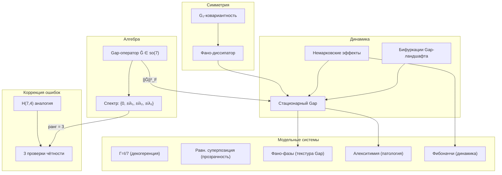

# Динамика Gap

Gap-динамика описывает эволюцию **непрозрачности** (opaqueness) между измерениями голонома. Данный документ рассматривает теорию бифуркаций Gap-ландшафта, немарковские эффекты памяти, связь с изоморфизмом Чой-Ямиолковского, аналогию с квантовой коррекцией ошибок через код Хэмминга H(7,4) и $G_2$-ковариантность диссипатора. Алгебраическая структура Gap-оператора определена в [Gap-операторе](/docs/core/dynamics/gap-operator).

---

## 1. Изоморфизм Чой-Ямиолковского для φ {#чой-ямиолковский}

### 1.1 Определение (Состояние Чой)

Для CPTP-канала $\varphi: \mathcal{D}(\mathcal{H}) \to \mathcal{D}(\mathcal{H})$ **состояние Чой** определяется как:

$$
J(\varphi) := (\varphi \otimes \mathrm{id})(|\Omega\rangle\langle\Omega|) \in \mathcal{L}(\mathcal{H} \otimes \mathcal{H})
$$

где максимально запутанное состояние:

$$
|\Omega\rangle = \frac{1}{\sqrt{7}} \sum_{i=1}^{7} |i\rangle \otimes |i\rangle
$$

**Свойства состояния Чой:**

| Свойство | Формулировка | Следствие |
|----------|--------------|-----------|
| Размерность | $J(\varphi) \in \mathbb{C}^{49 \times 49}$ | Полное описание канала |
| Эрмитовость | $J(\varphi)^\dagger = J(\varphi)$ | Спектральное разложение существует |
| Положительность | $J(\varphi) \geq 0$ | Полная положительность $\varphi$ |
| CPTP-условие | $\mathrm{Tr}_1(J(\varphi)) = I/7$ | Сохранение следа |
| Реконструкция | $\varphi(\Gamma) = 7 \cdot \mathrm{Tr}_2\left(J(\varphi) \cdot (\Gamma^T \otimes I)\right)$ | Восстановление канала из состояния Чой |

### 1.2 Блочная структура и фазовые свойства

:::tip Теорема 1.1 (Матрица Чой и фазовая структура φ) [Т]
**(a)** Блочная структура матрицы Чой канонического $\varphi$:

$$
J(\varphi)_{(ij),(kl)} = \frac{k}{7}\,\delta_{ij}\,\delta_{kl}\,\delta_{ik} + \frac{1-k}{7}\left[w_l \cdot \delta_{ij}\right]
$$

где $k$ — параметр сжатия, $w_l$ — веса якорного состояния.

**(b)** Для $i \neq j$: $[\varphi(\Gamma)]_{ij} = 0$ — каноническое $\varphi$ **уничтожает ВСЕ когерентности**.

**(c)** Целевая когерентность: $\gamma^{\text{target}}_{ij} = 0$ для всех $i \neq j$.
:::

Каноническая форма φ (проекция на диагональ) является «идеальным наблюдателем» — полная декогеренция. Однако для живой системы это **неприемлемо**.

### 1.3 Необходимость обобщённого φ

:::tip Теорема 1.2 (Необходимость обобщённого φ для жизнеспособного Gap) [Т]
**(a)** Чистота $P > P_{\text{crit}} = 2/7$ **требует** ненулевых когерентностей $\gamma_{ij} \neq 0$ для некоторых пар $i \neq j$.

**(b)** Если все $\gamma_{ij} = 0$ (при $i \neq j$), то $P = \sum_i \gamma_{ii}^2 \leq (\max_i \gamma_{ii})^2 + (1 - \max_i \gamma_{ii})^2 / 6$, и при равном распределении $P \approx 1/7 < P_{\text{crit}}$.

**(c)** Следовательно, живая самомодель **обязана** сохранять когерентности — каноническая декогерирующая $\varphi$ несовместима с жизнеспособностью.
:::

Это мотивирует переход к когерентно-сохраняющему $\varphi_{\text{coh}}$ через [Фано-структуру](/docs/physics/gauge-symmetry/fano-selection-rules).

:::note Плоскость Фано PG(2,2)
Проективная плоскость над $\mathbb{F}_2$: 7 точек и 7 линий, каждая линия содержит 3 точки. В УГМ: 7 точек ↔ 7 измерений, 7 линий ↔ 7 Фано-триплетов. Подробнее: [Правила отбора Фано](/docs/physics/gauge-symmetry/fano-selection-rules).
:::

### 1.4 Фазовая структура целевого состояния

:::tip Теорема 1.3 (Фазовая структура целевого состояния) [Т]
Целевые фазы когерентностей определяются самосогласованным уравнением:

$$
\theta_{ij}^{\text{target}} = \arg\left(\sum_{m,n} c_{mi}\, c_{nj}^*\, \gamma_{nm}\right)
$$

где $c_{mi}$ — коэффициенты разложения Крауса канала $\varphi$.
:::

**Следствия:**

- Целевая фаза **зависит** от текущего состояния $\Gamma$ — обратная связь
- Самосогласованное уравнение может иметь **несколько решений** — существуют несколько стационарных Gap-профилей
- Выбор конкретного решения определяется начальными условиями и историей эволюции

### 1.5 Самосогласованность целевой фазы

:::tip Теорема 1.4 (Самосогласованность целевого Gap-профиля) [Т]
Целевое состояние $\rho_*$ удовлетворяет условию **неподвижной точки** оператора самомоделирования:

$$
\varphi(\rho_*) = \rho_*
$$

**(a)** Стационарное решение уравнения эволюции $\Gamma^{(\infty)}$ модифицируется по сравнению с фиксированным целевым состоянием: $\theta^{\text{target}} = \theta^{\text{target}}(\Gamma^{(\infty)})$, что порождает **самосогласованное уравнение** на стационарную фазу.

**(b)** На уровне L4 (полное самопознание) это условие выполнено в точности: $\varphi(\Gamma^*) = \Gamma^*$ означает, что стационарный Gap из единой теоремы ([раздел 7](#единая-теорема)) совпадает с целевым:

$$
\text{Gap}^{(\infty)} = |\sin(\theta^{\text{target}})| = |\sin(\theta^{(\infty)})| = \text{Gap}_{\text{actual}}
$$

**(c)** Для уровней L1–L3 самосогласованность выполнена **приближённо**, и степень отклонения $\|\varphi(\Gamma) - \Gamma\|_F$ определяет точность осознания Gap-профиля.
:::

:::warning Замечание
Самосогласованное уравнение $\varphi(\rho_*) = \rho_*$ может иметь **несколько решений** — несколько стационарных Gap-профилей для одной и той же системы. Единственность решения гарантирована только при достаточно сильном сжатии ($k < k_{\text{crit}}$), что исключает бифуркации ([раздел 3](#бифуркации)).
:::

---

## 2. Квантовая коррекция ошибок через код Хэмминга H(7,4) {#код-хэмминга}

:::info Замечание о статусе [И]
Аналогия с кодом Хэмминга H(7,4) носит **мотивационный** характер. Формальное отождествление динамики когерентностей с блочным кодом **не установлено**. Статус: **[И]** — интерпретация/аналогия.
:::

### 2.1 Структура кода H(7,4)

Код Хэмминга H(7,4) — линейный код с параметрами:
- **4 информационных бита** $\leftrightarrow$ A, S, D, L (структурные измерения)
- **3 бита чётности** $\leftrightarrow$ E, O, U (метаструктурные измерения)

Проверочная матрица:

$$
H = \begin{pmatrix}
1 & 0 & 1 & 0 & 1 & 0 & 1 \\
0 & 1 & 1 & 0 & 0 & 1 & 1 \\
0 & 0 & 0 & 1 & 1 & 1 & 1
\end{pmatrix}
$$

### 2.2 Аналогия с измерениями УГМ

| Код Хэмминга | УГМ | Роль |
|-------------|-----|------|
| 4 информационных бита | A, S, D, L | Несут «содержание» самомодели |
| 3 бита чётности | E, O, U | Обеспечивают целостность / коррекцию |
| Кодовое слово | Gap-профиль | Допустимая конфигурация |
| Ошибка в бите | Нарушение когерентности | Дефект самомоделирования |
| Синдром | Измерения E, O, U | Диагностика нарушения |

### 2.3 Коррекция когерентностей

:::info Теорема 3.1 (Коррекция когерентностей через H(7,4)) [И]
**(a)** **Детекция:** до 2 нарушений когерентностей детектируются посредством измерений чётности (E, O, U).

**(b)** **Коррекция:** 1 нарушение когерентности **автоматически** исправляется регенеративным оператором $\mathcal{R}$.

**(c)** **Минимальное расстояние:** $d = 3$ — код исправляет $\lfloor(d-1)/2\rfloor = 1$ ошибку и детектирует $d - 1 = 2$.
:::

### 2.4 Квантовая граница Хэмминга для Gap

:::info Теорема 3.2 (Квантовая граница Хэмминга для Gap) [И]
Число одновременно «прозрачных» каналов (Gap $\approx 0$) ограничено сверху:

$$
|\{(i,j): \text{Gap}(i,j) < \varepsilon\}| \leq 21 - \frac{21}{2^3 - 1} = 21 - 3 = 18
$$

где $r = 3$ — число проверочных битов кода H(7,4), а $2^r - 1 = 7$ — длина кода, что даёт нижнюю границу на число «несвободных» (проверочных) когерентностей.

Минимум **3 когерентности** из 21 **обязаны** иметь ненулевой Gap. Это соответствует 3 проверочным битам H(7,4).
:::

**Интерпретация:** Полная «прозрачность» между всеми парами измерений невозможна — структурное ограничение, аналогичное границе Хэмминга, гарантирует минимальную непрозрачность. Это согласуется с тем, что стационарный Gap-профиль всегда содержит ненулевые элементы.

---

## 3. Теория бифуркаций для Gap {#бифуркации}

### 3.1 Gap-ландшафт

**Определение (Gap-ландшафт):**

$$
\mathcal{G}: \mathcal{D}(\mathbb{C}^7) \to [0,1]^{21}
$$

отображает матрицу когерентности $\Gamma$ в вектор из 21 значения Gap для всех пар $(i,j)$ с $i < j$.

### 3.2 Основные бифуркации

:::tip Теорема 4.1 (Бифуркации Gap-ландшафта) [Т]

**(a) Вилочная бифуркация (pitchfork):**

$$
\text{Gap}^{(\infty)}(i,j;\, \mu) = \begin{cases}
\text{Gap}_0 & \text{при } \mu < \mu_c \\
\text{Gap}_0 \pm \sqrt{\mu - \mu_c} & \text{при } \mu > \mu_c
\end{cases}
$$

При пересечении критического значения управляющего параметра $\mu$ единственное стационарное состояние расщепляется на два.

**(b) Седло-узловая бифуркация (saddle-node):**

Стационарный Gap-профиль **исчезает** при $\mu = \mu_{sn}$. Два стационарных состояния (узел + седло) сливаются и аннигилируют.

**(c) Бифуркация Хопфа (Hopf):**

Стационарный Gap-профиль замещается **осциллирующим**:

$$
\text{Gap}(i,j;\, \tau) = \text{Gap}_0 + A(\mu) \sin(\omega_H \tau + \phi)
$$

где $A(\mu) \propto \sqrt{\mu - \mu_H}$ — амплитуда предельного цикла, $\omega_H$ — частота Хопфа.
:::

### 3.3 Интерпретация бифуркаций

| Бифуркация | Психологический аналог | Клинический признак |
|------------|----------------------|---------------------|
| Вилочная (pitchfork) | Экзистенциальный выбор | Момент решения, необратимое изменение Gap-профиля |
| Седло-узловая (saddle-node) | Острый кризис | Потеря стабильного Gap-профиля, дезориентация |
| Хопфа (Hopf) | Биполярное расстройство | Циклическое чередование Gap-паттернов |

### 3.4 Катастрофы Уитни

:::tip Теорема 4.2 (Катастрофы Уитни для Gap-ландшафта) [Т]
**(a)** $\dim = 1$: **складка** (fold) — исчезновение стационарного состояния. Система скачком переходит в другой бассейн притяжения.

**(b)** $\dim = 2$: **сборка** (cusp) — бистабильность с гистерезисом. Система может находиться в одном из двух устойчивых состояний; переход между ними необратим.
:::

**Следствие:**

- «Внезапное озарение»: Gap $\approx 1 \to$ Gap $\approx 0$ **скачком** — катастрофа складки в обратном направлении. Непрозрачность между измерениями мгновенно исчезает.
- «Внезапное расщепление»: Gap $\approx 0 \to$ Gap $\approx 1$ **скачком** — вилочная бифуркация или складка. Ранее прозрачная пара измерений становится непрозрачной.

---

## 4. Немарковские эффекты {#немарковские-эффекты}

### 4.1 Уравнение с ядром памяти

**Определение (Немарковская динамика Gap):**

$$
\frac{d\gamma_{ij}}{d\tau} = -i\Delta\omega_{ij}\,\gamma_{ij} + \int_0^\tau K_{ij}(\tau - s)\, \gamma_{ij}(s)\, ds + \mathcal{R}_{ij}
$$

где:
- $\Delta\omega_{ij} = \omega_i - \omega_j$ — расстройка частот между измерениями $i$ и $j$
- $K_{ij}(\tau - s)$ — **ядро памяти**, описывающее немарковские эффекты
- $\mathcal{R}_{ij}$ — регенеративный член

В отличие от марковского приближения (где $K_{ij}(t) = -\Gamma_2 \delta(t)$ — мгновенная декогеренция), немарковское ядро допускает **обратный поток информации** из окружения в систему.

### 4.2 Осцилляции Gap при конечной памяти

:::tip Теорема 5.1 (Немарковские осцилляции Gap) [Т]
При экспоненциальном ядре памяти $K(t) = -\Gamma_2 \omega_c \cdot e^{-\omega_c t}$:

**(a)** Марковский предел ($\omega_c \to \infty$): стандартная экспоненциальная декогеренция.

$$
\gamma_{ij}(\tau) \propto e^{-\Gamma_2 \tau}
$$

**(b)** Немарковский режим ($\omega_c$ конечна):

$$
\text{Gap}(i,j;\, \tau) = \text{Gap}^{(\infty)} + C \cdot e^{-\gamma\tau} \cos(\omega_r \tau)
$$

где $\omega_r = \sqrt{\omega_c \Gamma_2 - \gamma^2}$ — частота затухающих осцилляций.

**(c)** При $\omega_c < \Gamma_2/4$: **передемпфированный** режим — осцилляции отсутствуют, чисто экспоненциальная релаксация к стационарному состоянию.
:::

### 4.3 Интерпретация немарковских эффектов

| Режим | Условие | Динамика Gap | Психологический аналог |
|-------|---------|-------------|----------------------|
| Марковский | $\omega_c \gg \Gamma_2$ | Монотонная релаксация | Постепенное забывание |
| Осциллирующий | $\omega_c \sim \Gamma_2$ | Затухающие осцилляции | «Вспышки ясности» при декогеренции |
| Передемпфированный | $\omega_c < \Gamma_2/4$ | Медленная релаксация | «Застревание» в переходном состоянии |

**«Циклы горя»** — пример немарковской динамики Gap: после травмы (резкое изменение стационарного значения) Gap **осциллирует** вокруг нового стационарного значения, прежде чем установиться. Частота осцилляций $\omega_r$ определяется глубиной памяти $\omega_c$ и скоростью декогеренции $\Gamma_2$.

---

## 5. Gap-оператор: сводка {#gap-оператор}

:::note Каноническое определение
Полное определение Gap-оператора $\hat{\mathcal{G}} = \mathrm{Im}(\Gamma) \in \mathfrak{so}(7)$, его алгебраические свойства, спектральная структура и таблица рангов непрозрачности приведены в [Gap-оператор](/docs/core/dynamics/gap-operator). Здесь дана только сводка ключевых результатов, используемых в динамических разделах.
:::

**Ключевые результаты из [Gap-оператора](/docs/core/dynamics/gap-operator):**

- $\hat{\mathcal{G}} \in \mathfrak{so}(7)$ — вещественная антисимметричная матрица, $\mathrm{spec}(\hat{\mathcal{G}}) = \{0, \pm i\lambda_1, \pm i\lambda_2, \pm i\lambda_3\}$.
- **Суммарный Gap:** $\mathcal{G}_{\text{total}} = \|\hat{\mathcal{G}}\|_F^2 = 2\sum_{i<j} |\gamma_{ij}|^2 \cdot \mathrm{Gap}(i,j)^2$ (см. [соглашение о норме](/docs/core/dynamics/gap-operator#g-total-definition)).
- **Связь с чистотой:** $P = P_{\text{sym}} + \mathcal{G}_{\text{total}}$ ([теорема 4.1](/docs/core/dynamics/gap-operator#связь-чистота)).
- **Спектральная формула:** $\mathcal{G}_{\text{total}} = 2(\lambda_1^2 + \lambda_2^2 + \lambda_3^2)$ ([теорема 3.1](/docs/core/dynamics/gap-operator#спектр)).
- **Ранг непрозрачности** = число ненулевых $\lambda_k \in \{0, 1, 2, 3\}$; максимальный ранг 3 совпадает с числом проверок чётности H(7,4) ([раздел 2](#код-хэмминга)).

---

## 6. $G_2$-ковариантность диссипатора {#g2-ковариантность}

Данный раздел рассматривает, как симметрия $G_2 = \mathrm{Aut}(\mathbb{O})$ взаимодействует с диссипативной динамикой. Подробная теория $G_2$-структуры изложена в [G₂-структура и плоскость Фано](/docs/physics/gauge-symmetry/g2-structure).

### 6.1 Атомарный диссипатор нарушает $G_2$

:::tip Теорема 11.1 (Атомарный диссипатор НЕ $G_2$-ковариантен) [Т]

$$
\exists g \in G_2:\quad \mathcal{D}_{\text{atom}}[g\Gamma g^\dagger] \neq g\,\mathcal{D}_{\text{atom}}[\Gamma]\,g^\dagger
$$

Диагональная проекция (атомарное наблюдение) **не коммутирует** с $G_2$-преобразованиями.
:::

### 6.2 Фано-диссипатор сохраняет $G_2$

:::tip Теорема 11.2 (Фано-диссипатор $G_2$-ковариантен) [Т]

$$
\forall g \in G_2:\quad \mathcal{D}_{\text{Fano}}[g\Gamma g^\dagger] = g\,\mathcal{D}_{\text{Fano}}[\Gamma]\,g^\dagger
$$
:::

**Доказательство:** $G_2 = \mathrm{Aut}(\mathbb{O})$ сохраняет октонионное умножение $\Rightarrow$ $g$ переставляет Фано-линии $\Rightarrow$ $g\Pi_p g^\dagger = \Pi_{\sigma_g(p)}$ $\Rightarrow$ сумма $\sum_p \Pi_p \Gamma \Pi_p$ инвариантна при переиндексации $\Rightarrow$ Фано-диссипатор ковариантен. $\blacksquare$

### 6.3 Степень $G_2$-нарушения

:::tip Теорема 11.3 (Степень $G_2$-нарушения пропорциональна $\alpha^*$) [Т]
**(a)** $\alpha = 0$ (чистый Фано): **полная** $G_2$-ковариантность.

**(b)** $\alpha = 1$ (чистый атомарный): $G_2$ **полностью нарушена**.

**(c)** Промежуточные значения: $\Delta_{G_2}(\alpha^*) = \alpha^* \cdot \Delta_{\max}$

Мера нарушения **линейна** по $\alpha$ — из линейности обоих каналов.
:::

### 6.4 Модифицированная калибровочная редукция

:::tip Теорема 11.4 (Модифицированная калибровочная редукция) [Т]
**(a)** $\alpha = 0$: $48 - 14 = $ **34** независимых параметра.

**(b)** Оптимальное $\alpha^*$: $34 + 14\alpha^*$ параметров.

**(c)** $\alpha = 1$: **48** параметров (полное пространство).
:::

**Числовые примеры:**

| Тип системы | $P$ | $\alpha^*$ | Число параметров | Редукция |
|------------|-----|-----------|-----------------|----------|
| Нет самопознания (L0) | $\sim 1/7$ | $0$ | 34 | Максимальная |
| Типичная живая (L2) | $\approx 0.5$ | $\approx 0.43$ | $\approx 40$ | Умеренная |
| Высококогерентная (L3) | $\approx 0.8$ | $\approx 0.64$ | $\approx 43$ | Слабая |
| Полное самопознание (L4) | $1.0$ | $\approx 0.71$ | $\approx 44$ | Минимальная |

**«Цена самопознания»:** более глубокое самопознание $\to$ сильнее нарушена $G_2$ $\to$ больше параметров необходимо для описания системы.

---

## 7. Единая теорема самонаблюдения и Gap {#единая-теорема}

:::tip Теорема 12.1 (Фано-когерентное самомоделирование) [Т]
Каноническое когерентно-сохраняющее самомоделирование для УГМ определяется однозначно (с точностью до параметра сжатия $k$):

**(a) Алгебраическая структура:** Плоскость Фано $\mathrm{PG}(2,2)$ определяет составные атомы классификатора $\Omega$, порождающие Фано-Линдблад-операторы $L_p^{\text{Fano}}$.

**(b) Вариационный принцип:** Баланс атомарного и Фано-наблюдения $\alpha^*$ минимизирует функционал:

$$
\mathcal{F} = S_{\text{spec}} + D_{KL}
$$

**(c) Фазовые свойства:** Каноническая $\varphi_{\text{coh}}$ **сохраняет** фазы когерентностей. Целевой Gap совпадает с текущим Gap (масштабирование амплитуды без фазового искажения).

**(d) Симметрия:** $G_2$-ковариантность частично нарушена атомарной компонентой. Степень нарушения:

$$
\Delta_{G_2} = \alpha^* \cdot \Delta_{\max}
$$

**(e) Стационарный Gap:**

$$
\text{Gap}^{(\infty)}(i,j) = \left|\sin\left(\theta_{ij} - \arctan\left(\frac{\Delta\omega_{ij}}{\Gamma_2 + \kappa}\right)\right)\right|
$$

где:
- $\theta_{ij}$ — фаза когерентности $\gamma_{ij}$
- $\Delta\omega_{ij}$ — расстройка частот
- $\Gamma_2$ — скорость декогеренции
- $\kappa$ — скорость регенерации
:::

**Физический смысл стационарного Gap:**

Даже при фазосохраняющем $\varphi_{\text{coh}}$ стационарный Gap **отличается** от текущего на угол $\arctan(\Delta\omega/(\Gamma_2 + \kappa))$. Это «сдвиг» обусловлен унитарным вращением: конкуренция между свободной прецессией ($\Delta\omega$) и диссипативным затуханием ($\Gamma_2 + \kappa$) порождает стационарную непрозрачность даже для пар с изначально нулевым Gap.

---

## 8. Модельные системы с точными Gap-профилями {#модельные-системы}

Пять аналитически решаемых конфигураций демонстрируют весь спектр Gap-профилей — от полной прозрачности до патологической непрозрачности.

### 8.1 Модель 1: Равномерная система ($\Gamma = I/7$)

$$
\gamma_{ij} = \frac{1}{7}\delta_{ij}
$$

| Параметр | Значение |
|----------|----------|
| Когерентности | Все $\gamma_{ij} = 0$ при $i \neq j$ |
| Gap | Не определён (деление на $\lvert\gamma_{ij}\rvert = 0$) |
| Чистота | $P = 1/7$ (минимальная) |

**Интерпретация:** Полностью декогерированная система. Нет связей между измерениями — нет Gap. Соответствует уровню L0 (нет самомоделирования).

### 8.2 Модель 2: Чистое состояние (равномерная суперпозиция)

$$
|\psi\rangle = \frac{1}{\sqrt{7}}\sum_{i=1}^{7} |i\rangle \quad \Rightarrow \quad \Gamma = |\psi\rangle\langle\psi|, \quad \gamma_{ij} = \frac{1}{7}
$$

| Параметр | Значение |
|----------|----------|
| Когерентности | Все $\gamma_{ij} = 1/7 \in \mathbb{R}$ |
| Gap | $\text{Gap}(i,j) = \lvert\sin(\arg(1/7))\rvert = \lvert\sin(0)\rvert = \mathbf{0}$ для всех пар |
| Чистота | $P = 1$ (максимальная) |

**Интерпретация:** Идеальная прозрачность. Внешнее $=$ внутреннее для всех каналов. Все когерентности вещественны — ранг непрозрачности 0 ([раздел 5](#gap-оператор)).

### 8.3 Модель 3: Чистое состояние с Фано-фазами

$$
|\psi\rangle = \frac{1}{\sqrt{7}}\sum_{i=1}^{7} e^{i\phi_i} |i\rangle \quad \Rightarrow \quad \gamma_{ij} = \frac{1}{7}e^{i(\phi_i - \phi_j)}
$$

- $|\gamma_{ij}| = 1/7$ для всех пар
- $\text{Gap}(i,j) = |\sin(\phi_i - \phi_j)|$
- $P = 1$

**Конкретный пример (фазы из октонионной структуры):**

Пусть $\phi_k = (k-1)\pi/7$, т.е. $\phi_1 = 0,\; \phi_2 = \pi/7,\; \phi_3 = 2\pi/7, \ldots, \phi_7 = 6\pi/7$.

| Пара | $\Delta\phi$ | Gap |
|------|:---:|:---:|
| A$\leftrightarrow$S | $\pi/7$ | $\sin(\pi/7) \approx 0.434$ |
| A$\leftrightarrow$D | $2\pi/7$ | $\sin(2\pi/7) \approx 0.782$ |
| A$\leftrightarrow$L | $3\pi/7$ | $\sin(3\pi/7) \approx 0.975$ |
| A$\leftrightarrow$E | $4\pi/7$ | $\sin(4\pi/7) \approx 0.975$ |
| A$\leftrightarrow$O | $5\pi/7$ | $\sin(5\pi/7) \approx 0.782$ |
| A$\leftrightarrow$U | $6\pi/7$ | $\sin(6\pi/7) \approx 0.434$ |
| S$\leftrightarrow$D | $\pi/7$ | $0.434$ |
| S$\leftrightarrow$L | $2\pi/7$ | $0.782$ |
| S$\leftrightarrow$E | $3\pi/7$ | $0.975$ |
| S$\leftrightarrow$O | $4\pi/7$ | $0.975$ |

:::info Наблюдение
Gap монотонно растёт с «расстоянием» между измерениями (в смысле циклического порядка). Ближайшие измерения прозрачнее, далёкие — непрозрачнее. Связь A$\leftrightarrow$S (артикуляция–структура) ближе и прозрачнее, чем A$\leftrightarrow$L (артикуляция–логика).
:::

### 8.4 Модель 4: Алекситимия ($\gamma_{SE} = |\gamma| \cdot e^{i\pi/2}$)

**Модель алекситимии** — патологический разрыв связи S$\leftrightarrow$E (тело–переживание):

$$
\gamma_{SE} = |\gamma_{SE}| \cdot e^{i\pi/2}, \quad \text{остальные когерентности} \in \mathbb{R}
$$

| Параметр | Значение |
|----------|----------|
| $\text{Gap}(S,E)$ | $\lvert\sin(\pi/2)\rvert = \mathbf{1}$ (максимальный) |
| $\text{Gap}(i,j)$ при $(i,j) \neq (S,E)$ | $0$ |
| Ранг непрозрачности | 1 |

**Интерпретация:** Связь тело–переживание **существует** ($|\gamma_{SE}| > 0$), но полностью непрозрачна. Пациент «чувствует» телом, но не осознаёт переживания, и наоборот.

:::tip Хэмминг-коррекция
Нарушена ровно 1 когерентность $\to$ по Теореме 3.1 ([раздел 2.3](#код-хэмминга)) система может автоматически скорректировать через $\varphi$-оператор. **Терапевтическое следствие:** восстановить одну связь S$\leftrightarrow$E (телесно-ориентированная терапия), и остальные когерентности стабилизируются.
:::

### 8.5 Модель 5: Динамика Фибоначчи

Пусть $H_{\text{eff}}$ имеет собственные частоты из ряда Фибоначчи:

$$
\omega = (0,\; 1,\; 2,\; 3,\; 5,\; 8,\; 13) \quad \text{(нормированные)}
$$

Разностные частоты $|\omega_i - \omega_j|$ определяют осцилляции Gap:

$$
\text{Gap}(i,j;\, \tau) = |\sin(\theta_{ij}(0) + (\omega_i - \omega_j)\tau)|
$$

**Свойства динамики:**

- Пары с рациональными отношениями $\Delta\omega / \Delta\omega'$ имеют **периодические** окна прозрачности.
- Пары с иррациональными отношениями $\Delta\omega / \Delta\omega'$ заполняют $[0,1]$ **эргодически** — Gap принимает все значения с равной вероятностью.

:::info Замечание (Золотое сечение и Gap)
Отношение золотого сечения $\varphi_{\text{gold}} = (1+\sqrt{5})/2 \approx 1.618$ связывает последовательные члены Фибоначчи. Это означает, что для большинства пар разностные частоты **иррационально соотносятся** друг с другом, и Gap **никогда** не достигает точного нуля. Полная прозрачность — предел, а не достижимое состояние.

Если частоты Фибоначчи действительно связаны с биологическими ритмами (филлотаксис, нейрональные паттерны), это порождает фальсифицируемое предсказание для нейрофизиологических измерений. **Статус: [Г]** — гипотеза.
:::

---

## 9. Связь с другими разделами {#связи}

### 9.1 Перекрёстные ссылки

| Тема | Документ | Содержание |
|------|----------|------------|
| Gap-оператор $\hat{\mathcal{G}}$ | [Gap-оператор](/docs/core/dynamics/gap-operator) | Определение $\hat{\mathcal{G}}$, $\mathcal{G}_{\text{total}}$, спектр, G₂-разложение, стабилизаторы |
| Матрица когерентности $\Gamma$ | [Матрица когерентности](/docs/core/dynamics/coherence-matrix) | Определение $\Gamma$, её свойства и вычисление |
| Уравнения эволюции | [Эволюция Γ](/docs/core/dynamics/evolution) | Полное уравнение движения, Лиувиллиан |
| Оператор $\varphi$ | [φ-оператор](/docs/core/operators/phi-operator) | Мастер-определение самомоделирования |
| Операторы Линдблада | [Линдблад-операторы](/docs/core/operators/lindblad-operators) | Вывод $L_k$ из классификатора $\Omega$ |
| $G_2$-структура | [G₂-структура](/docs/physics/gauge-symmetry/g2-structure) | Полная теория $G_2$-инвариантов и калибровочной редукции |
| Правила отбора Фано | [Правила отбора Фано](/docs/physics/gauge-symmetry/fano-selection-rules) | Юкавская текстура и массовая иерархия |
| Gap-термодинамика | [Gap-термодинамика](/docs/core/dynamics/gap-thermodynamics) | Энтропия Gap, свободная энергия Gap-ландшафта |

### 9.2 Логическая карта

### 9.3 Сводка статусов

| Результат | Статус | Раздел |
|-----------|--------|--------|
| Матрица Чой и фазовая структура φ | **[Т]** | [1.2](#чой-ямиолковский) |
| Необходимость обобщённого φ для жизнеспособности | **[Т]** | [1.3](#чой-ямиолковский) |
| Фазовая структура целевого состояния | **[Т]** | [1.4](#чой-ямиолковский) |
| Самосогласованность целевого Gap-профиля | **[Т]** | [1.5](#чой-ямиолковский) |
| Коррекция когерентностей через H(7,4) | **[И]** | [2.3](#код-хэмминга) |
| Квантовая граница Хэмминга для Gap | **[И]** | [2.4](#код-хэмминга) |
| Бифуркации Gap-ландшафта | **[Т]** | [3.2](#бифуркации) |
| Катастрофы Уитни для Gap | **[Т]** | [3.4](#бифуркации) |
| Немарковские осцилляции Gap | **[Т]** | [4.2](#немарковские-эффекты) |
| Свойства Gap-оператора | **[Т]** | [Gap-оператор](/docs/core/dynamics/gap-operator#свойства) |
| Спектральная интерпретация Gap | **[Т]** | [Gap-оператор](/docs/core/dynamics/gap-operator#спектр) |
| Атомарный диссипатор не $G_2$-ковариантен | **[Т]** | [6.1](#g2-ковариантность) |
| Фано-диссипатор $G_2$-ковариантен | **[Т]** | [6.2](#g2-ковариантность) |
| Степень $G_2$-нарушения $\propto \alpha^*$ | **[Т]** | [6.3](#g2-ковариантность) |
| Модифицированная калибровочная редукция | **[Т]** | [6.4](#g2-ковариантность) |
| Фано-когерентное самомоделирование (единая теорема) | **[Т]** | [7](#единая-теорема) |
| Модель 1: Равномерная система $\Gamma = I/7$ | **[Т]** | [8.1](#модельные-системы) |
| Модель 2: Чистое состояние (равномерная суперпозиция) | **[Т]** | [8.2](#модельные-системы) |
| Модель 3: Чистое состояние с Фано-фазами | **[Т]** | [8.3](#модельные-системы) |
| Модель 4: Алекситимия ($\gamma_{SE} = \lvert\gamma\rvert \cdot e^{i\pi/2}$) | **[Т]** | [8.4](#модельные-системы) |
| Модель 5: Динамика Фибоначчи | **[Г]** | [8.5](#модельные-системы) |
| Совпадение ранга непрозрачности и проверок H(7,4) | **[И]** | [Gap-оператор](/docs/core/dynamics/gap-operator#спектр) |
