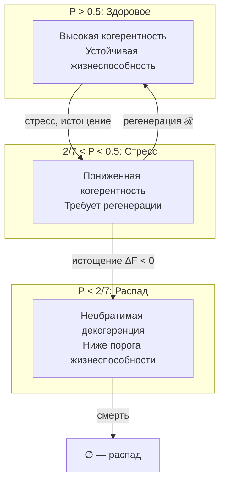

# Мера Жизнеспособности

## Определение чистоты {#определение-чистоты}

**Чистота (Purity)** $P$ — скалярная мера целостности и жизнеспособности Голонома.

$$
P = \mathrm{Tr}(\Gamma^2)
$$

В ортонормированном базисе $\{|A\rangle, |S\rangle, |D\rangle, |L\rangle, |E\rangle, |O\rangle, |U\rangle\}$:

$$
P = \sum_{i} \gamma_{ii}^2 + \sum_{i \neq j} |\gamma_{ij}|^2
$$

где первая сумма — вклад диагональных элементов, вторая — вклад когерентностей.

## Диапазон значений

Для 7-мерной системы:

$$
P \in \left[\frac{1}{7}, 1\right] \approx [0.143, 1]
$$

| $P$ | Состояние | Описание |
|-----|-----------|----------|
| $1.0$ | Чистое | Полная когерентность: $\Gamma = \vert\psi\rangle\langle\psi\vert$, $\mathrm{rank}(\Gamma) = 1$ |
| $0.5 - 1.0$ | Живое | Частичная когерентность, система жива и адаптируется |
| $2/7 - 0.5$ | Стрессовое | Когерентность под угрозой, требуется регенерация |
| $1/7 - 2/7$ | Угасающее | Декогеренция превышает регенерацию |
| $1/7 \approx 0.14$ | Минимум | Полностью смешанное: $\Gamma = I_7/7$, максимальная энтропия |

где $I_7$ — единичная матрица $7 \times 7$.

## Связь с энтропией

[Энтропия фон Неймана](./coherence-matrix#энтропия-фон-неймана):

$$
S_{vN} = -\mathrm{Tr}(\Gamma \log \Gamma) = -\sum_k \lambda_k \log \lambda_k
$$

где $\{\lambda_k\}$ — собственные значения $\Gamma$.

**Связь чистоты и энтропии:**

| Условие | Чистота | Энтропия |
|---------|---------|----------|
| Чистое состояние | $P = 1$ | $S_{vN} = 0$ |
| Максимально смешанное | $P = 1/7$ | $S_{vN} = \log 7 \approx 1.95$ |

:::note Монотонная связь
Чистота $P$ и энтропия $S_{vN}$ связаны монотонно: рост $P$ соответствует уменьшению $S_{vN}$ и наоборот. Однако связь нелинейная.
:::

## Критическая чистота {#критическая-чистота}

$$
P_{\text{crit}} = \frac{2}{N} = \frac{2}{7} \approx 0.286
$$

### Унификация через ПИР

:::info P_crit как следствие Принципа Информационной Различимости
Критическая чистота $P_{\text{crit}} = 2/N$ **выводится** из [Принципа Информационной Различимости](/docs/core/foundations/axiom-omega#пир-как-теорема), который сам следует из топологии Гротендика $J_{Bures}$:

$$
P > P_{\text{crit}} \Leftrightarrow d_B(\Gamma, I/N) > d_B^{\text{noise}}
$$

где $d_B$ — [метрика Бюреса](/docs/core/foundations/axiom-omega#топология-гротендика), $d_B^{\text{noise}}$ — характерный масштаб шума.

**Физический смысл:** Система жизнеспособна ⟺ она **информационно различима** от фонового шума в метрике Бюреса.

См. [унификацию порогов через ПИР](/docs/core/foundations/axiom-septicity#принцип-информационной-различимости).
:::

:::tip Теорема о критической чистоте [Т]
Значение $P_{\text{crit}} = 2/N$ **строго выводится** из пяти независимых аргументов, сходящихся к одному значению. Структурное отклонение от хаоса должно превышать масштаб хаоса. При $P = 2/7$ доминирующий режим захватывает ~49% когерентности.

**Мастер-определение и таблица путей:** [Аксиома Септичности → Критическая чистота](../foundations/axiom-septicity#критическая-чистота-теорема)

**Полное доказательство:** [theorem-purity-critical](../../proofs/dynamics/theorem-purity-critical)
:::

### Временна́я интерпретация P_crit

:::info Теорема (Связь P_crit с временем)
Критическая чистота связана с минимальной скоростью течения [внутреннего времени](../../proofs/dynamics/emergent-time):

$$
P > P_{crit} \Leftrightarrow \frac{d\tau}{d\sigma} > \frac{d\tau}{d\sigma}\bigg|_{min}
$$

**Жизнеспособность** ($P > 2/7$) означает, что Голоном **продолжает существовать во времени**.

При $P \leq 2/7$ система теряет когерентность и "размазывается" по пространству состояний — для неё время перестаёт быть определённым.

[Подробнее →](../../proofs/dynamics/emergent-time#8-связь-с-критической-чистотой)
:::

## Условие жизнеспособности

Голоном $\mathbb{H}$ **жизнеспособен** тогда и только тогда, когда:

$$
\mathrm{Viable}(\mathbb{H}) := P(\Gamma) > P_{\text{crit}} = \frac{2}{7}
$$

**Усиленное условие** (устойчивая жизнеспособность):

$$
\mathrm{Viable}_{\text{stable}}(\mathbb{H}) := P(\Gamma) > \frac{2}{7} \land \left.\frac{dP}{d\tau}\right|_{\mathcal{R}} + \left.\frac{dP}{d\tau}\right|_{\mathcal{D}} \geq 0
$$

Система не только выше порога, но и не теряет чистоту (баланс регенерации и диссипации).

:::tip Полная аксиоматичность условия жизнеспособности [Т]
Оба слагаемых в усиленном условии **полностью определены** аксиомами:
- $dP/d\tau|_\mathcal{D}$ — из $\mathcal{L}_\Omega$ (A1, классификатор Ω)
- $dP/d\tau|_\mathcal{R}$ — из формы ℛ, [выведенной](/docs/core/dynamics/evolution#вывод-формы-регенерации) из аксиом A1–A5 + стандартной термодинамики [Т]

Условие жизнеспособности — **не феноменологический критерий**, а строгое следствие аксиоматики.
:::

## Область жизнеспособности

$$
\mathcal{V} := \left\{\Gamma \in \mathcal{D}(\mathcal{H}) : P(\Gamma) > \frac{2}{7}\right\}
$$

где $\mathcal{D}(\mathcal{H})$ — пространство матриц плотности на $\mathcal{H}$.

**Топологические свойства:**

| Свойство | Описание |
|----------|----------|
| $\mathcal{V} \subset \mathcal{D}(\mathcal{H})$ | Открытое подмножество |
| $\partial\mathcal{V} = \{\Gamma : P(\Gamma) = 2/7\}$ | Граница (критическая поверхность) |
| $\mathrm{int}(\mathcal{V}) = \mathcal{V}$ | Внутренность совпадает с множеством |

### Инвариантность и сохранение положительности

:::info Теорема (Инвариантность области жизнеспособности)
Область жизнеспособности $\mathcal{V}$ является **инвариантной** относительно полной эволюции Голонома при условии достаточной регенерации:

$$
\Gamma(0) \in \mathcal{V} \land \mathcal{R}[\Gamma] \geq \mathcal{D}[\Gamma] \implies \Gamma(\tau) \in \mathcal{V} \quad \forall \tau > 0
$$
:::

**Доказательство опирается на теорему о сохранении положительности:**

Несмотря на нелинейность регенеративного члена $\mathcal{R}[\Gamma, E]$, полное уравнение эволюции сохраняет **положительность** $\Gamma \geq 0$ и **нормировку** $\mathrm{Tr}(\Gamma) = 1$. Это гарантируется [интерполяционной формулировкой](./evolution#сохранение-положительности):

$$
\Gamma(\tau + \Delta\tau) = (1 - \alpha) \cdot \mathcal{E}[\Gamma(\tau)] + \alpha \cdot \varphi(\Gamma(\tau))
$$

где:
- $\mathcal{E}$ — CPTP-канал диссипации
- $\varphi(\Gamma) = |\psi(\Gamma)\rangle\langle\psi(\Gamma)|$ — чистый аттрактор
- $\alpha = \kappa \cdot \Delta\tau < 1$ — условие корректности

**Почему это важно для жизнеспособности:**

| Свойство | Гарантия | Следствие |
|----------|----------|-----------|
| $\Gamma \geq 0$ | Интерполяция CPTP-каналов | Состояние остаётся физическим |
| $\mathrm{Tr}(\Gamma) = 1$ | Линейность следа | Нормировка сохраняется |
| $P(\Gamma) \leq 1$ | $\varphi(\Gamma)$ — чистое | Чистота ограничена сверху |
| $P(\Gamma) \geq 1/7$ | Выпуклость | Чистота ограничена снизу |

При активной регенерации ($\mathcal{R} \geq \mathcal{D}$) аттрактор $\varphi(\Gamma)$ с $P = 1$ "притягивает" систему, поддерживая $P > P_{\text{crit}} = 2/7$.

[Подробнее о сохранении положительности →](../dynamics/evolution#сохранение-положительности)

## Динамика чистоты

Производная чистоты по времени (см. [эволюция](./evolution#динамика-чистоты)):

$$
\frac{dP}{d\tau} = 2 \cdot \mathrm{Tr}\left(\Gamma \cdot \frac{d\Gamma}{d\tau}\right)
$$

**Вклады компонент уравнения эволюции:**

| Компонент | Вклад в $\frac{dP}{d\tau}$ | Описание |
|-----------|-------------------------|----------|
| Унитарный $-i[H, \Gamma]$ | $= 0$ | Сохраняет чистоту |
| Диссипация $\mathcal{D}[\Gamma]$ | $\leq 0$ | Уменьшает чистоту |
| Регенерация $\mathcal{R}[\Gamma, E]$ | $\geq 0$ (при $\Delta F > 0$) | Может увеличивать чистоту |

## Условие смерти

Голоном **умирает** (необратимо теряет жизнеспособность), если:

$$
P(\Gamma) < \frac{2}{7} \land \frac{dP}{d\tau} < 0
$$

При этих условиях Линдбладовский генератор $\mathcal{L}_\Omega$ является **примитивным** [Т] (единственное стационарное состояние $\mathcal{L}_\Omega[\rho_*] = 0$, нет других инвариантных подпространств), и система входит в режим необратимой декогеренции:

$$
\lim_{\tau \to \infty} \Gamma(\tau) = \rho_*
$$

:::tip Примитивность доказана [Т]
Примитивность $\mathcal{L}_\Omega$ для жизнеспособных холонов **доказана** через критерий Эванса—Спона: атомарные операторы $L_k = |k\rangle\langle k|$ вместе с условием связности графа взаимодействия $G_H$ (которая следует из (AP)+(PH)+(QG)+(V) по теореме связности) гарантируют тривиальность коммутанта $\mathcal{F}(\mathcal{L}_\Omega) = \mathbb{C} \cdot I$. Сходимость к единственному стационарному состоянию $\rho_*$ гарантирована при любом начальном состоянии.

[Доказательство →](/docs/core/operators/lindblad-operators#примитивность-ℒω)
:::

## Фазовая диаграмма

## Примеры

### Биологические аналогии

| Состояние | $P$ | Биологический аналог |
|-----------|-----|---------------------|
| Чистое | $\approx 1$ | Эмбриональные стволовые клетки |
| Здоровое | $0.5 - 0.8$ | Здоровый организм |
| Стрессовое | $2/7 - 0.5$ | Болезнь, истощение |
| Угасающее | $< 2/7$ | Терминальное состояние |
| Минимум | $\approx 1/7$ | Смерть (тепловое равновесие) |

### Психологические аналогии

| Состояние | $P$ | Психологический аналог |
|-----------|-----|------------------------|
| Высокая когерентность | $> 0.7$ | Поток (flow state) |
| Нормальное | $0.5 - 0.7$ | Бодрствование |
| Стрессовое | $2/7 - 0.5$ | Усталость, тревога |
| Критическое | $< 2/7$ | Диссоциация, психоз |

---

### Октонионная норма {#октонионная-норма}

:::note Связь чистоты P с нормой 𝕆 [С]
В [октонионной интерпретации](../structure/dimensions#октонионная-интерпретация) чистота $P = \mathrm{Tr}(\Gamma^2)$ связана с нормой на Im(𝕆): нормированность октонионов ($|xy| = |x||y|$) обеспечивает согласованную метрику на пространстве состояний. Условие жизнеспособности $P > 2/7$ соответствует минимальной «различимости от шума» в нормированном пространстве Im(𝕆). Мост [Т] (замкнут, T15). См. [структурный вывод](../../proofs/minimality/theorem-octonionic-derivation).
:::

**Связанные документы:**
- [Теорема о критической чистоте](../../proofs/dynamics/theorem-purity-critical) — полное доказательство $P_{\text{crit}} = 2/N$
- [Теорема об эмерджентном времени](../../proofs/dynamics/emergent-time) — временна́я интерпретация P_crit
- [Аксиома Септичности](../foundations/axiom-septicity) — контекст аксиом
- [Матрица когерентности](./coherence-matrix) — определение Γ и P
- [Эволюция](./evolution) — динамика Γ(τ) с внутренним временем
- [Основание (O)](../structure/dimension-o) — источник регенерации и внутренние часы
- [Пространство-время](../cosmology/spacetime) — эмерджентная геометрия
- [Иерархия интериорности](../../proofs/consciousness/interiority-hierarchy) — пороги L2
- [Математический аппарат](../../reference/specification) — формальная спецификация
- [Протокол измерения Γ](/docs/applied/research/measurement-protocol) — валидация жизнеспособности ИИ (исследовательская программа)
