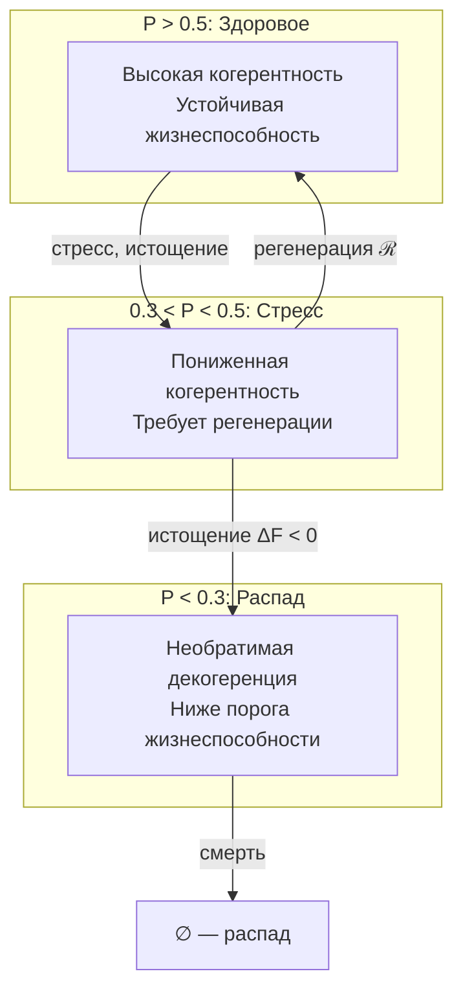

# Мера Жизнеспособности

## Определение чистоты

**Чистота (Purity)** $P$ — скалярная мера целостности и жизнеспособности Голонома.

$$
P = \mathrm{Tr}(\Gamma^2)
$$

В ортонормированном базисе $\{|A\rangle, |S\rangle, |D\rangle, |L\rangle, |E\rangle, |O\rangle, |U\rangle\}$:

$$
P = \sum_{i} \gamma_{ii}^2 + \sum_{i \neq j} |\gamma_{ij}|^2
$$

где первая сумма — вклад диагональных элементов, вторая — вклад когерентностей.

## Диапазон значений

Для 7-мерной системы:

$$
P \in \left[\frac{1}{7}, 1\right] \approx [0.143, 1]
$$

| $P$ | Состояние | Описание |
|-----|-----------|----------|
| $1.0$ | Чистое | Полная когерентность: $\Gamma = \vert\psi\rangle\langle\psi\vert$, $\mathrm{rank}(\Gamma) = 1$ |
| $0.5 - 1.0$ | Живое | Частичная когерентность, система жива и адаптируется |
| $0.3 - 0.5$ | Стрессовое | Когерентность под угрозой, требуется регенерация |
| $0.14 - 0.3$ | Угасающее | Декогеренция превышает регенерацию |
| $1/7 \approx 0.14$ | Минимум | Полностью смешанное: $\Gamma = I_7/7$, максимальная энтропия |

где $I_7$ — единичная матрица $7 \times 7$.

## Связь с энтропией

[Энтропия фон Неймана](./coherence-matrix#энтропия-фон-неймана):

$$
S_{vN} = -\mathrm{Tr}(\Gamma \log \Gamma) = -\sum_k \lambda_k \log \lambda_k
$$

где $\{\lambda_k\}$ — собственные значения $\Gamma$.

**Связь чистоты и энтропии:**

| Условие | Чистота | Энтропия |
|---------|---------|----------|
| Чистое состояние | $P = 1$ | $S_{vN} = 0$ |
| Максимально смешанное | $P = 1/7$ | $S_{vN} = \log 7 \approx 1.95$ |

:::note Монотонная связь
Чистота $P$ и энтропия $S_{vN}$ связаны монотонно: рост $P$ соответствует уменьшению $S_{vN}$ и наоборот. Однако связь нелинейная.
:::

## Критическая чистота

$$
P_{\text{critical}} \approx 0.3
$$

:::warning Эмпирический статус
Значение $P_{\text{critical}} = 0.3$ имеет **эмпирический статус** — не выводится теоретически из аксиом УГМ.

**Обоснование порога:**
- Ниже $P_{\text{critical}}$ диссипация необратимо превышает регенерацию
- Порог соответствует границе между L1 и L2 в [иерархии интериорности](../../proofs/interiority-hierarchy#обоснование-порогов)
- Аналогичные пороги наблюдаются в IIT (Теория интегрированной информации)

**Открытый вопрос:** Можно ли вывести $P_{\text{critical}}$ из структуры $\Gamma$?
:::

## Условие жизнеспособности

Голоном $\mathbb{H}$ **жизнеспособен** тогда и только тогда, когда:

$$
\mathrm{Viable}(\mathbb{H}) := P(\Gamma) > P_{\text{critical}}
$$

**Усиленное условие** (устойчивая жизнеспособность):

$$
\mathrm{Viable}_{\text{stable}}(\mathbb{H}) := P(\Gamma) > P_{\text{critical}} \land \left.\frac{dP}{dt}\right|_{\mathcal{R}} + \left.\frac{dP}{dt}\right|_{\mathcal{D}} \geq 0
$$

Система не только выше порога, но и не теряет чистоту (баланс регенерации и диссипации).

## Область жизнеспособности

$$
\mathcal{V} := \{\Gamma \in \mathcal{D}(\mathcal{H}) : P(\Gamma) > P_{\text{critical}}\}
$$

где $\mathcal{D}(\mathcal{H})$ — пространство матриц плотности на $\mathcal{H}$.

**Топологические свойства:**

| Свойство | Описание |
|----------|----------|
| $\mathcal{V} \subset \mathcal{D}(\mathcal{H})$ | Открытое подмножество |
| $\partial\mathcal{V} = \{\Gamma : P(\Gamma) = P_{\text{critical}}\}$ | Граница (критическая поверхность) |
| $\mathrm{int}(\mathcal{V}) = \mathcal{V}$ | Внутренность совпадает с множеством |

## Динамика чистоты

Производная чистоты по времени (см. [эволюция](./evolution#динамика-чистоты)):

$$
\frac{dP}{dt} = 2 \cdot \mathrm{Tr}\left(\Gamma \cdot \frac{d\Gamma}{dt}\right)
$$

**Вклады компонент уравнения эволюции:**

| Компонент | Вклад в $\frac{dP}{dt}$ | Описание |
|-----------|-------------------------|----------|
| Унитарный $-i[H, \Gamma]$ | $= 0$ | Сохраняет чистоту |
| Диссипация $\mathcal{D}[\Gamma]$ | $\leq 0$ | Уменьшает чистоту |
| Регенерация $\mathcal{R}[\Gamma, E]$ | $\geq 0$ (при $\Delta F > 0$) | Может увеличивать чистоту |

## Условие смерти

Голоном **умирает** (необратимо теряет жизнеспособность), если:

$$
P(\Gamma) < P_{\text{critical}} \land \frac{dP}{dt} < 0
$$

При этих условиях система входит в режим необратимой декогеренции:

$$
\lim_{t \to \infty} \Gamma(t) = \frac{I_7}{7}
$$

## Фазовая диаграмма

## Примеры

### Биологические аналогии

| Состояние | $P$ | Биологический аналог |
|-----------|-----|---------------------|
| Чистое | $\approx 1$ | Эмбриональные стволовые клетки |
| Здоровое | $0.5 - 0.8$ | Здоровый организм |
| Стрессовое | $0.3 - 0.5$ | Болезнь, истощение |
| Угасающее | $< 0.3$ | Терминальное состояние |
| Минимум | $\approx 0.14$ | Смерть (тепловое равновесие) |

### Психологические аналогии

| Состояние | $P$ | Психологический аналог |
|-----------|-----|------------------------|
| Высокая когерентность | $> 0.7$ | Поток (flow state) |
| Нормальное | $0.5 - 0.7$ | Бодрствование |
| Стрессовое | $0.3 - 0.5$ | Усталость, тревога |
| Критическое | $< 0.3$ | Диссоциация, психоз |

---

**Связанные документы:**
- [Матрица когерентности](./coherence-matrix) — определение Γ и P
- [Эволюция](./evolution) — динамика Γ и dP/dt
- [Основание (O)](../structure/dimension-o) — источник регенерации
- [Иерархия интериорности](../../proofs/interiority-hierarchy) — обоснование порогов
- [Математический аппарат](../../formal/specification) — формальная спецификация
