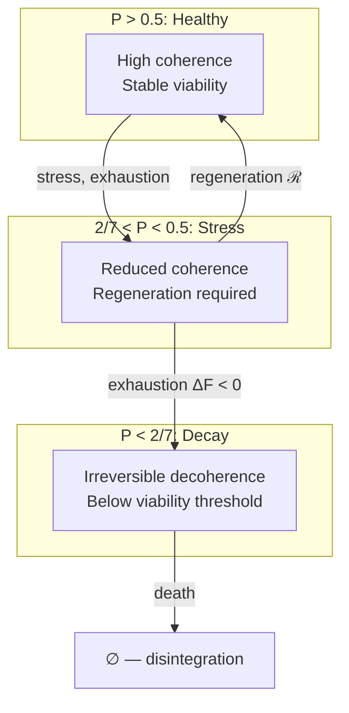

# Viability Measure

This chapter answers one of the most fundamental questions of the theory: **what makes a system alive?** In ordinary language we intuitively distinguish the living from the dead, the whole from the disintegrated. UHM gives this distinction a precise mathematical expression through **purity** $P$ — a number that measures how coherent and organised a system is. The reader will learn: how to compute $P$; what the critical threshold $P_{\text{crit}} = 2/7$ means; under what conditions a system is viable and under what conditions it inevitably disintegrates; and how the four conditions of consciousness relate to viability.

:::info Historical precursors
The question "what is life?" from the perspective of physics was first seriously posed by **Erwin Schrödinger** in the book *"What is Life?"* (1944). He proposed that living systems maintain low entropy by "feeding on negentropy" from the environment.

**Ilya Prigogine** (Nobel Prize, 1977) developed this idea in the theory of **dissipative structures**: systems far from equilibrium can spontaneously form ordered states by consuming free energy.

**Integrated Information Theory** (IIT, Tononi, 2004) introduced a quantitative threshold of consciousness $\Phi > 0$.

UHM synthesises these ideas: viability is determined by purity $P > 2/7$ (threshold of distinguishability from noise), while full consciousness requires three additional conditions ($R \geq 1/3$, $\Phi \geq 1$, $D \geq 2$). Free energy $\Delta F > 0$ plays the role of Schrödinger's "negentropy" — fuel for regeneration.
:::

:::tip Intuitive explanation of purity P
Imagine photographing someone:

- **$P = 1$** (pure state) — **a perfectly sharp photograph**. Every detail is distinguishable. The system is fully determined, nothing random.
- **$P \approx 0.5$** — **a photograph with slight blur**. The main features are visible, but fine details are smeared. The system is alive and functioning, but not ideal.
- **$P = 2/7 \approx 0.286$** — **the critical threshold**. The photograph is so blurred that it is impossible to confidently distinguish a person from background noise. This is the boundary between "distinguishable" and "indistinguishable."
- **$P = 1/7 \approx 0.143$** — **a fully overexposed film**. No information. All measurements are equally probable. Maximum entropy. The system is "dead" (thermal equilibrium).

The threshold $P_{\text{crit}} = 2/7$ is not an arbitrary number. It has been **proved** to be the unique value at which the signal (the system's structure) is separated from noise (thermal background) in the Bures metric.
:::

## Definition of purity {#определение-чистоты}

**Purity** $P$ — a scalar measure of the integrity and viability of the Holon.

$$
P = \mathrm{Tr}(\Gamma^2)
$$

In the orthonormal basis $\{|A\rangle, |S\rangle, |D\rangle, |L\rangle, |E\rangle, |O\rangle, |U\rangle\}$:

$$
P = \sum_{i} \gamma_{ii}^2 + \sum_{i \neq j} |\gamma_{ij}|^2
$$

where the first sum is the contribution of diagonal elements, and the second is the contribution of coherences.

## Range of values

For a 7-dimensional system:

$$
P \in \left[\frac{1}{7}, 1\right] \approx [0.143, 1]
$$

| $P$ | State | Description |
|-----|-----------|----------|
| $1.0$ | Pure | Full coherence: $\Gamma = \vert\psi\rangle\langle\psi\vert$, $\mathrm{rank}(\Gamma) = 1$ |
| $0.5 - 1.0$ | Alive | Partial coherence, system is alive and adapts |
| $2/7 - 0.5$ | Stressed | Coherence under threat, regeneration required |
| $1/7 - 2/7$ | Fading | Decoherence exceeds regeneration |
| $1/7 \approx 0.14$ | Minimum | Fully mixed: $\Gamma = I_7/7$, maximum entropy |

where $I_7$ is the $7 \times 7$ identity matrix.

## Relation to entropy {#связь-с-энтропией}

[Von Neumann entropy](./coherence-matrix#энтропия-фон-неймана):

$$
S_{vN} = -\mathrm{Tr}(\Gamma \log \Gamma) = -\sum_k \lambda_k \log \lambda_k
$$

where $\{\lambda_k\}$ are the eigenvalues of $\Gamma$.

**Relation between purity and entropy:**

| Condition | Purity | Entropy |
|---------|---------|----------|
| Pure state | $P = 1$ | $S_{vN} = 0$ |
| Maximally mixed | $P = 1/7$ | $S_{vN} = \log 7 \approx 1.95$ |

:::note Monotonic relation
Purity $P$ and entropy $S_{vN}$ are monotonically related: an increase in $P$ corresponds to a decrease in $S_{vN}$ and vice versa. However, the relation is nonlinear.
:::

## Critical purity {#критическая-чистота}

$$
P_{\text{crit}} = \frac{2}{N} = \frac{2}{7} \approx 0.286
$$

### Unification via the Bures metric

:::info P_crit — a mathematical theorem [Т]; interpretation via PIR [О]
Critical purity $P_{\text{crit}} = 2/N$ is **proved** from the [Bures metric](/docs/core/foundations/axiom-omega#топология-гротендика) (the unique monotone Riemannian metric by the Chentsov–Petz theorem). [PIR [О]](/docs/core/foundations/axiom-omega#пир-как-теорема) provides the ontological interpretation:

$$
P > P_{\text{crit}} \Leftrightarrow d_B(\Gamma, I/N) > d_B^{\text{noise}}
$$

where $d_B$ is the [Bures metric](/docs/core/foundations/axiom-omega#топология-гротендика), $d_B^{\text{noise}}$ is the characteristic noise scale.

**Physical meaning:** A system is viable ⟺ it is **informationally distinguishable** from background noise in the Bures metric.

See [unification of thresholds via PIR](/docs/core/foundations/axiom-septicity#принцип-информационной-различимости).
:::

:::tip Theorem on critical purity [Т]
The value $P_{\text{crit}} = 2/N$ is **strictly derived** from five independent arguments converging to the same value. The structural deviation from chaos must exceed the scale of chaos. At $P = 2/7$ the dominant regime captures ~49% of coherence.

**Master definition and table of paths:** [Axiom of Septicity → Critical purity](../foundations/axiom-septicity#критическая-чистота-теорема)

**Full proof:** [theorem-purity-critical](../../proofs/dynamics/theorem-purity-critical)
:::

### Derivation of P_crit = 2/N from the Bures metric {#вывод-pcrit}

Critical purity is **not postulated** — it is strictly derived from the requirement of informational distinguishability.

**Step 1. Frobenius distance from the maximally mixed state.**

$$
d_F^2(\Gamma, I/N) = \mathrm{Tr}\left((\Gamma - I/N)^2\right) = \mathrm{Tr}(\Gamma^2) - \frac{2}{N}\mathrm{Tr}(\Gamma) + \frac{1}{N} = P - \frac{1}{N}
$$

**Step 2. Noise scale.** Typical deviation from $I/N$ under thermal fluctuations:

$$
\|\delta\Gamma\|_F^2 \sim \frac{1}{N^2} \quad \Rightarrow \quad d_F^{\text{noise}} \sim \frac{1}{N}
$$

**Step 3. Distinguishability condition.** A system is distinguishable from noise if the structural deviation exceeds the noise:

$$
d_F^2(\Gamma, I/N) > d_F^{\text{noise}} \quad \Rightarrow \quad P - \frac{1}{N} > \frac{1}{N} \quad \Rightarrow \quad \boxed{P > \frac{2}{N} = \frac{2}{7}}
$$

:::tip Five independent paths to one threshold [Т]
The value $P_{\text{crit}} = 2/7$ is derived by **five independent** arguments:

1. **Frobenius distinguishability** (above): $d_F > d_F^{\text{noise}}$
2. **Dominant eigenvalue:** at $P = 2/7$ the largest $\lambda_1 \geq 2/7 \approx 0.286$, capturing $\geq 49\%$ of coherence
3. **Bayesian distinguishability:** posterior likelihood ratio $\Lambda(\Gamma \| I/N) > 1$ at $P > 2/N$
4. **Fano channel:** coherence contraction with factor $1/3$ preserves structure only at $P > 2/7$
5. **Self-observation:** minimum reflection $R \geq R_{\text{th}} = 1/3$ requires $P \geq P_{\text{crit}}$

[Full proof →](../../proofs/dynamics/theorem-purity-critical) | Status: **[Т]**
:::

### Temporal interpretation of P_crit

:::info Theorem (Relation of P_crit to time)
Critical purity is connected to the minimum rate of flow of [internal time](../../proofs/dynamics/emergent-time):

$$
P > P_{crit} \Leftrightarrow \frac{d\tau}{d\sigma} > \frac{d\tau}{d\sigma}\bigg|_{min}
$$

**Viability** ($P > 2/7$) means that the Holon **continues to exist in time**.

At $P \leq 2/7$ the system loses coherence and "smears out" over the state space — time ceases to be well-defined for it.

[More →](../../proofs/dynamics/emergent-time#8-связь-с-критической-чистотой)
:::

## Viability condition

A Holon $\mathbb{H}$ is **viable** if and only if:

$$
\mathrm{Viable}(\mathbb{H}) := P(\Gamma) > P_{\text{crit}} = \frac{2}{7}
$$

**Strengthened condition** (stable viability):

$$
\mathrm{Viable}_{\text{stable}}(\mathbb{H}) := P(\Gamma) > \frac{2}{7} \land \left.\frac{dP}{d\tau}\right|_{\mathcal{R}} + \left.\frac{dP}{d\tau}\right|_{\mathcal{D}} \geq 0
$$

The system is not only above the threshold, but also does not lose purity (balance of regeneration and dissipation).

**Stochastic extension** ([T-145 [Т]](/docs/proofs/consciousness/operational-closure#t-145)): under stochastic perturbations $h_{\text{ext}}$ with $\mathbb{E}[\|h_{\text{ext}}\|^2] \leq \sigma_h^2$, the probability of maintaining full viability $V_{\text{full}}$ is exponentially close to 1: $\mathbb{P}[\Gamma \in V_{\text{full}}] \geq 1 - \exp(-r_{\text{stab}}^2/(2\sigma_h^2))$.

:::tip Full axiomaticity of the viability condition [Т]
Both terms in the strengthened condition are **fully determined** by the axioms:
- $dP/d\tau|_\mathcal{D}$ — from $\mathcal{L}_\Omega$ (A1, classifier Ω)
- $dP/d\tau|_\mathcal{R}$ — from the form of ℛ, [derived](/docs/core/dynamics/evolution#вывод-формы-регенерации) from axioms A1–A5 + standard thermodynamics [Т]

The viability condition is **not a phenomenological criterion**, but a strict consequence of the axiomatics.
:::

## Viability domain {#область-жизнеспособности}

### Minimal viability {#минимальная-жизнеспособность}

$$
\mathcal{V}_P := \left\{\Gamma \in \mathcal{D}(\mathcal{H}) : P(\Gamma) > \frac{2}{7}\right\}
$$

where $\mathcal{D}(\mathcal{H})$ is the space of density matrices on $\mathcal{H}$.

**Topological properties:**

| Property | Description |
|----------|----------|
| $\mathcal{V}_P \subset \mathcal{D}(\mathcal{H})$ | Open subset |
| $\partial\mathcal{V}_P = \{\Gamma : P(\Gamma) = 2/7\}$ | Boundary (critical surface) |
| $\mathrm{int}(\mathcal{V}_P) = \mathcal{V}_P$ | Interior coincides with the set |

### Full viability {#полная-жизнеспособность}

Minimal viability $\mathcal{V}_P$ is a **necessary**, but insufficient condition for a fully functional Holon. Full viability is defined via the [stress tensor](/docs/applied/coherence-cybernetics/definitions#тензор-напряжений):

:::tip Non-emptiness of $\mathcal{V}_{\mathrm{full}}$ [T-124]
The set of full viability is **non-empty**: the existence of $\Gamma$ with $P \in (2/7, 3/7]$, $\Phi \geq 1$, $\forall k: \sigma_k < 1$ is constructively proved. Goldilocks zone: $P \in (2/7, 3/7]$ — the optimal range for consciousness. See [T-124 [Т]](/docs/proofs/consciousness/conscious-window#t-124).
:::

$$
\mathcal{V}_{\mathrm{full}} := \left\{\Gamma \in \mathcal{D}(\mathcal{H}) : \|\sigma_{\mathrm{sys}}(\Gamma)\|_\infty < 1\right\}
$$

where each of the 7 components $\sigma_i$ controls a separate condition (purity, structure, dynamics, logic, differentiation, regeneration, integration). See [Theorem 10.1 / T-92](/docs/applied/coherence-cybernetics/theorems#теорема-101-эквивалентность-условий).

#### Theorem (Embedding of viability domains) [Т] {#теорема-вложение-областей}

$$
\mathcal{V}_{\mathrm{full}} \subsetneq \mathcal{V}_P
$$

*Proof.* ($\subseteq$): $\|\sigma_{\mathrm{sys}}\|_\infty < 1$ implies, in particular, $\sigma_A < 1$, which via $\sigma_A = 1 - \gamma_{AA}/P$ and the conditions on all 7 components guarantees $P > 2/7$ (nonzero coherences increase $P$). ($\subsetneq$): Counterexample — the pure state $|1\rangle\langle 1| \in \mathcal{V}_P$ ($P = 1$), but $\sigma_U = 1 - \Phi/\Phi_{\mathrm{th}} = 1$ (zero integration $\Phi = 0$), therefore $\|\sigma_{\mathrm{sys}}\|_\infty \geq 1$ and $|1\rangle\langle 1| \notin \mathcal{V}_{\mathrm{full}}$. $\blacksquare$

:::warning Viability stratification
The notation $\mathcal{V}$ without an index further in the theory denotes **minimal** viability $\mathcal{V}_P = \{P > 2/7\}$. For results requiring all 7 conditions simultaneously (e.g., [Theorem 10.1](/docs/applied/coherence-cybernetics/theorems#теорема-101-эквивалентность-условий)), $\mathcal{V}_{\mathrm{full}}$ is used.
:::

### Invariance and positivity preservation

:::info Theorem (Invariance of the viability domain)
The viability domain $\mathcal{V}$ is **invariant** under the full evolution of the Holon given sufficient regeneration:

$$
\Gamma(0) \in \mathcal{V} \land \mathcal{R}[\Gamma] \geq \mathcal{D}[\Gamma] \implies \Gamma(\tau) \in \mathcal{V} \quad \forall \tau > 0
$$
:::

**The proof relies on the positivity preservation theorem:**

Despite the nonlinearity of the regenerative term $\mathcal{R}[\Gamma, E]$, the full evolution equation preserves **positivity** $\Gamma \geq 0$ and **normalisation** $\mathrm{Tr}(\Gamma) = 1$. This is guaranteed by the [interpolation formulation](./evolution#сохранение-положительности):

$$
\Gamma(\tau + \Delta\tau) = (1 - \alpha) \cdot \mathcal{E}[\Gamma(\tau)] + \alpha \cdot \varphi(\Gamma(\tau))
$$

where:
- $\mathcal{E}$ — CPTP dissipation channel
- $\varphi(\Gamma)$ — CPTP [self-modeling](/docs/core/operators/phi-operator) channel, canonical form $\varphi_{\text{coh}}$
- $\alpha = \kappa \cdot \Delta\tau < 1$ — correctness condition

**Why this matters for viability:**

| Property | Guarantee | Consequence |
|----------|----------|-----------|
| $\Gamma \geq 0$ | Interpolation of CPTP channels | State remains physical |
| $\mathrm{Tr}(\Gamma) = 1$ | Linearity of trace | Normalisation preserved |
| $P(\Gamma) \leq 1$ | CPTP channel does not increase purity above 1 | Purity bounded above |
| $P(\Gamma) \geq 1/7$ | Convexity | Purity bounded below |

The fixed point of canonical $\varphi_{\text{coh}}$ has $P(\Gamma^*) = P_{\text{crit}} = 2/7$ **[Т]** — this is a **mixed** state, not pure (see [operator φ](/docs/core/operators/phi-operator#свойства)). Under active regeneration ($\mathcal{R} \geq \mathcal{D}$) the attractor maintains $P > P_{\text{crit}} = 2/7$.

[More on positivity preservation →](../dynamics/evolution#сохранение-положительности)

## Purity dynamics {#динамика-чистоты}

The derivative of purity with respect to time (see [evolution](./evolution#purity-dynamics)):

$$
\frac{dP}{d\tau} = 2 \cdot \mathrm{Tr}\left(\Gamma \cdot \frac{d\Gamma}{d\tau}\right)
$$

**Contributions of the evolution equation components:**

| Component | Contribution to $\frac{dP}{d\tau}$ | Description |
|-----------|-------------------------|----------|
| Unitary $-i[H, \Gamma]$ | $= 0$ | Preserves purity |
| Dissipation $\mathcal{D}[\Gamma]$ | $\leq 0$ | Decreases purity |
| Regeneration $\mathcal{R}[\Gamma, E]$ | $\geq 0$ (when $\Delta F > 0$) | Can increase purity |

## Death condition {#условие-смерти}

:::warning Theorem (Irreversibility of decoherence) [Т]
A Holon **irreversibly** loses viability if two conditions are simultaneously satisfied:

$$
P(\Gamma) < P_{\text{crit}} = \frac{2}{7} \quad \land \quad \frac{dP}{d\tau} < 0
$$

Under these conditions $\Gamma(\tau) \to I/7$ exponentially fast:

$$
\|\Gamma(\tau) - I/7\|_F \leq \|\Gamma(0) - I/7\|_F \cdot e^{-\Delta(\mathcal{L}_0)\tau}
$$

where $\Delta(\mathcal{L}_0) > 0$ is the spectral gap of the Liouvillian [T-39a].
:::

**Proof.** At $P < P_{\text{crit}}$: the regeneration gate $g_V(P) = 0$ ([V-preservation gate](/docs/core/dynamics/evolution#теорема-v-preservation-gate)), therefore $\mathcal{R} = 0$. Dynamics is governed only by the linear part $\mathcal{L}_0 = -i[H,\cdot] + \mathcal{D}$. By primitivity of $\mathcal{L}_0$ [T-39a]: the unique stationary state is $I/7$, spectral gap $\Delta > 0$. Exponential convergence follows from the spectral theorem for the superoperator. The condition $dP/d\tau < 0$ guarantees that the system does not leave the region $P < P_{\text{crit}}$: a return would require $dP/d\tau > 0$, but $\mathcal{R} = 0$ and $dP/d\tau|_{\mathcal{D}} \leq 0$. $\blacksquare$

**Physical interpretation.** Below $P_{\text{crit}}$ regeneration is switched off (Landauer's principle: free energy $\Delta F \leq 0$, regeneration is thermodynamically forbidden). The system inevitably decays to thermal equilibrium $I/7$ — "death" in UHM terminology.

**Connection to time dilation.** By [T-53d](/docs/core/operators/emergent-time#time-freezing-derivation) [Т]: internal time $d\tau_{\text{int}}/dt_{\text{ext}} \propto (P - P_{\text{crit}})^{1/2}$. Near $P_{\text{crit}}$ subjective time slows down infinitely — "death" is not experienced from within.

:::tip Primitivity proved [Т]
Primitivity of the linear part $\mathcal{L}_0$ for viable holons has been **proved** via the Evans–Spohn criterion: atomic operators $L_k = |k\rangle\langle k|$ together with the connectivity condition on the interaction graph $G_H$ (which follows from (AP)+(PH)+(QG)+(V) by the connectivity theorem) guarantee triviality of the commutant $\mathcal{F}(\mathcal{L}_0) = \mathbb{C} \cdot I$. Convergence to $I/7$ under dominant dissipation is guaranteed ([T-39a](/docs/core/operators/lindblad-operators#примитивность-ℒω)).

[Proof →](/docs/core/operators/lindblad-operators#примитивность-ℒω)
:::

## Phase diagram

```mermaid
graph TD
    subgraph H["P > 0.5: Healthy"]
        HH["High coherence<br/>Stable viability"]
    end
    subgraph S["2/7 < P < 0.5: Stress"]
        SS["Reduced coherence<br/>Regeneration required"]
    end
    subgraph D["P < 2/7: Decay"]
        DD["Irreversible decoherence<br/>Below viability threshold"]
    end
    HH --> |"stress, exhaustion"| SS
    SS --> |"regeneration ℛ"| HH
    SS --> |"exhaustion ΔF < 0"| DD
    DD --> |"death"| X["∅ — disintegration"]
```

## Examples

### Biological analogies

| State | $P$ | Biological analogue |
|-----------|-----|---------------------|
| Pure | $\approx 1$ | Embryonic stem cells |
| Healthy | $0.5 - 0.8$ | Healthy organism |
| Stressed | $2/7 - 0.5$ | Disease, exhaustion |
| Fading | $< 2/7$ | Terminal state |
| Minimum | $\approx 1/7$ | Death (thermal equilibrium) |

### Psychological analogies

| State | $P$ | Psychological analogue |
|-----------|-----|------------------------|
| High coherence | $> 0.7$ | Flow state |
| Normal | $0.5 - 0.7$ | Wakefulness |
| Stressed | $2/7 - 0.5$ | Fatigue, anxiety |
| Critical | $< 2/7$ | Dissociation, psychosis |

---

### Numerical example: viable and non-viable Γ {#числовой-пример-жизнеспособность}

**Example 1. Viable system** ($P > 2/7$):

Let $\Gamma$ have eigenvalues $\lambda = (0.35, 0.20, 0.15, 0.10, 0.08, 0.07, 0.05)$. Then:

$$
P = \sum_k \lambda_k^2 = 0.35^2 + 0.20^2 + 0.15^2 + 0.10^2 + 0.08^2 + 0.07^2 + 0.05^2 = 0.2118
$$

Wait — $0.2118 < 2/7 \approx 0.286$! This system is **non-viable** — too diffuse. More pronounced "peaks" are required. Take different eigenvalues:

$\lambda = (0.45, 0.20, 0.12, 0.08, 0.06, 0.05, 0.04)$:

$$
P = 0.45^2 + 0.20^2 + 0.12^2 + 0.08^2 + 0.06^2 + 0.05^2 + 0.04^2 = 0.2930 > \frac{2}{7}
$$

The system is **viable**: the dominant eigenvalue $\lambda_1 = 0.45$ captures enough coherence. Life requires **concentration** — at least one direction must be significantly stronger than the rest.

**Example 2. Maximally mixed (dead) system**:

$\lambda = (1/7, 1/7, 1/7, 1/7, 1/7, 1/7, 1/7)$, $P = 7 \cdot (1/7)^2 = 1/7 \approx 0.143$ — minimum. All dimensions are equal, no structure.

### Four conditions of consciousness {#четыре-условия-сознания}

Viability ($P > 2/7$) is a **necessary**, but insufficient condition for consciousness. Full consciousness requires **four conditions to hold simultaneously**:

| Condition | Formula | Meaning | Threshold | Status |
|---------|---------|-------|-------|--------|
| Viability | $P > P_{\text{crit}}$ | System is distinguishable from noise | $P_{\text{crit}} = 2/7$ | **[Т]** |
| Reflection | $R \geq R_{\text{th}}$ | System can model itself | $R_{\text{th}} = 1/3$ | **[Т]** |
| Integration | $\Phi \geq \Phi_{\text{th}}$ | Parts of the system are bound into a whole | $\Phi_{\text{th}} = 1$ | **[Т]** |
| Differentiation | $D \geq D_{\min}$ | System distinguishes its states | $D_{\min} = 2$ | **[Т]** |

:::tip Analogy with an organism
All four conditions can be compared to the hallmarks of a living organism:
- **$P > 2/7$** — the organism **exists** (distinguishable from its environment).
- **$R \geq 1/3$** — the organism **feels itself** (the nervous system forms a self-model).
- **$\Phi \geq 1$** — the organs are **connected** into a unified whole (not a collection of separate cells).
- **$D \geq 2$** — the organism **distinguishes** at least two different states (not locked into one pattern).

Violation of **any** of the four conditions destroys consciousness: zombie (no $R$), dissociation ($\Phi < 1$), catatonia ($D < 2$), death ($P < 2/7$).
:::

More: [Reflection measure R](/docs/consciousness/foundations/self-observation#мера-рефлексии-r) | [Integration measure Φ](/docs/core/structure/dimension-u#мера-интеграции-φ) | [Interiority hierarchy](/docs/consciousness/hierarchy/interiority-hierarchy)

---

### Octonionic norm {#октонионная-норма}

:::note Relation of purity P to the $\mathbb{O}$ norm [С]
In the [octonionic interpretation](../structure/dimensions#октонионная-интерпретация), purity $P = \mathrm{Tr}(\Gamma^2)$ is related to the norm on $\mathrm{Im}(\mathbb{O})$: the normativity of octonions ($|xy| = |x||y|$) provides a consistent metric on the state space. The viability condition $P > 2/7$ corresponds to the minimum "distinguishability from noise" in the normed space $\mathrm{Im}(\mathbb{O})$. Bridge [Т] (closed, T15). See [structural derivation](../../proofs/minimality/theorem-octonionic-derivation).
:::

**Related documents:**
- [Theorem on critical purity](../../proofs/dynamics/theorem-purity-critical) — full proof of $P_{\text{crit}} = 2/N$
- [Theorem on emergent time](../../proofs/dynamics/emergent-time) — temporal interpretation of P_crit
- [Axiom of Septicity](../foundations/axiom-septicity) — axiom context
- [Coherence matrix](./coherence-matrix) — definition of Γ and P
- [Evolution](./evolution) — dynamics of Γ(τ) with internal time
- [Foundation (O)](../structure/dimension-o) — source of regeneration and internal clock
- [Spacetime](../foundations/spacetime) — emergent geometry
- [Interiority hierarchy](../../proofs/consciousness/interiority-hierarchy) — L2 thresholds
- [Mathematical apparatus](../../reference/specification) — formal specification
- [Γ measurement protocol](/docs/applied/research/measurement-protocol) — AI viability validation (research programme)
