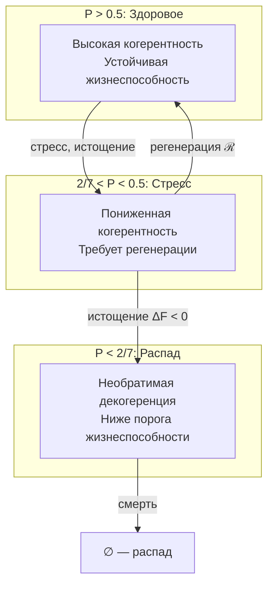

# Мера Жизнеспособности

Эта глава отвечает на один из самых фундаментальных вопросов теории: **что делает систему живой?** В обычном языке мы интуитивно различаем живое от мёртвого, целостное от распавшегося. УГМ даёт этому различию точное математическое выражение через **чистоту** $P$ — число, которое измеряет, насколько система когерентна и организована. Читатель узнает: как вычислить $P$; что означает критический порог $P_{\text{crit}} = 2/7$; при каких условиях система жизнеспособна, а при каких неизбежно распадается; и как четыре условия сознания связаны с жизнеспособностью.

:::info Историческая предтеча
Вопрос «что такое жизнь?» с точки зрения физики впервые серьёзно поставил **Эрвин Шрёдингер** в книге *«Что такое жизнь?»* (1944). Он предположил, что живые системы поддерживают низкую энтропию, «питаясь негэнтропией» из окружающей среды.

**Илья Пригожин** (Нобелевская премия, 1977) развил эту идею в теории **диссипативных структур**: системы далеко от равновесия могут спонтанно образовывать упорядоченные состояния, потребляя свободную энергию.

**Теория интегрированной информации** (IIT, Тонони, 2004) ввела количественный порог сознания $\Phi > 0$.

УГМ синтезирует эти идеи: жизнеспособность определяется чистотой $P > 2/7$ (порог различимости от шума), а полное сознание требует ещё трёх дополнительных условий ($R \geq 1/3$, $\Phi \geq 1$, $D \geq 2$). Свободная энергия $\Delta F > 0$ играет роль «негэнтропии» Шрёдингера — топливо для регенерации.
:::

:::tip Интуитивное объяснение чистоты P
Представьте, что вы фотографируете кого-то:

- **$P = 1$** (чистое состояние) — **идеально резкий снимок**. Каждая деталь различима. Система полностью определена, ничего случайного.
- **$P \approx 0.5$** — **фотография с лёгким размытием**. Основные черты видны, но мелкие детали смазаны. Система жива и функционирует, но не идеальна.
- **$P = 2/7 \approx 0.286$** — **критический порог**. Фотография настолько размыта, что невозможно с уверенностью отличить человека от фонового шума. Это граница между «различимым» и «неразличимым».
- **$P = 1/7 \approx 0.143$** — **полностью засвеченная плёнка**. Никакой информации. Все измерения равновероятны. Максимальная энтропия. Система «мертва» (тепловое равновесие).

Порог $P_{\text{crit}} = 2/7$ — это не произвольное число. Он **доказан** как единственное значение, при котором сигнал (структура системы) отделяется от шума (теплового фона) в метрике Бюреса.
:::

## Определение чистоты {#определение-чистоты}

**Чистота (Purity)** $P$ — скалярная мера целостности и жизнеспособности Голонома.

$$
P = \mathrm{Tr}(\Gamma^2)
$$

В ортонормированном базисе $\{|A\rangle, |S\rangle, |D\rangle, |L\rangle, |E\rangle, |O\rangle, |U\rangle\}$:

$$
P = \sum_{i} \gamma_{ii}^2 + \sum_{i \neq j} |\gamma_{ij}|^2
$$

где первая сумма — вклад диагональных элементов, вторая — вклад когерентностей.

## Диапазон значений

Для 7-мерной системы:

$$
P \in \left[\frac{1}{7}, 1\right] \approx [0.143, 1]
$$

| $P$ | Состояние | Описание |
|-----|-----------|----------|
| $1.0$ | Чистое | Полная когерентность: $\Gamma = \vert\psi\rangle\langle\psi\vert$, $\mathrm{rank}(\Gamma) = 1$ |
| $0.5 - 1.0$ | Живое | Частичная когерентность, система жива и адаптируется |
| $2/7 - 0.5$ | Стрессовое | Когерентность под угрозой, требуется регенерация |
| $1/7 - 2/7$ | Угасающее | Декогеренция превышает регенерацию |
| $1/7 \approx 0.14$ | Минимум | Полностью смешанное: $\Gamma = I_7/7$, максимальная энтропия |

где $I_7$ — единичная матрица $7 \times 7$.

## Связь с энтропией

[Энтропия фон Неймана](./coherence-matrix#энтропия-фон-неймана):

$$
S_{vN} = -\mathrm{Tr}(\Gamma \log \Gamma) = -\sum_k \lambda_k \log \lambda_k
$$

где $\{\lambda_k\}$ — собственные значения $\Gamma$.

**Связь чистоты и энтропии:**

| Условие | Чистота | Энтропия |
|---------|---------|----------|
| Чистое состояние | $P = 1$ | $S_{vN} = 0$ |
| Максимально смешанное | $P = 1/7$ | $S_{vN} = \log 7 \approx 1.95$ |

:::note Монотонная связь
Чистота $P$ и энтропия $S_{vN}$ связаны монотонно: рост $P$ соответствует уменьшению $S_{vN}$ и наоборот. Однако связь нелинейная.
:::

## Критическая чистота {#критическая-чистота}

$$
P_{\text{crit}} = \frac{2}{N} = \frac{2}{7} \approx 0.286
$$

### Унификация через метрику Бюреса

:::info P_crit — математическая теорема [Т]; интерпретация через ПИР [О]
Критическая чистота $P_{\text{crit}} = 2/N$ **доказана** из [метрики Бюреса](/docs/core/foundations/axiom-omega#топология-гротендика) (единственной монотонной римановой метрики по теореме Ченцова—Петца). [ПИР [О]](/docs/core/foundations/axiom-omega#пир-как-теорема) предоставляет онтологическую интерпретацию:

$$
P > P_{\text{crit}} \Leftrightarrow d_B(\Gamma, I/N) > d_B^{\text{noise}}
$$

где $d_B$ — [метрика Бюреса](/docs/core/foundations/axiom-omega#топология-гротендика), $d_B^{\text{noise}}$ — характерный масштаб шума.

**Физический смысл:** Система жизнеспособна ⟺ она **информационно различима** от фонового шума в метрике Бюреса.

См. [унификацию порогов через ПИР](/docs/core/foundations/axiom-septicity#принцип-информационной-различимости).
:::

:::tip Теорема о критической чистоте [Т]
Значение $P_{\text{crit}} = 2/N$ **строго выводится** из пяти независимых аргументов, сходящихся к одному значению. Структурное отклонение от хаоса должно превышать масштаб хаоса. При $P = 2/7$ доминирующий режим захватывает ~49% когерентности.

**Мастер-определение и таблица путей:** [Аксиома Септичности → Критическая чистота](../foundations/axiom-septicity#критическая-чистота-теорема)

**Полное доказательство:** [theorem-purity-critical](../../proofs/dynamics/theorem-purity-critical)
:::

### Вывод P_crit = 2/N из метрики Бюреса {#вывод-pcrit}

Критическая чистота **не постулируется** — она строго выводится из требования информационной различимости.

**Шаг 1. Расстояние Фробениуса от максимально смешанного состояния.**

$$
d_F^2(\Gamma, I/N) = \mathrm{Tr}\left((\Gamma - I/N)^2\right) = \mathrm{Tr}(\Gamma^2) - \frac{2}{N}\mathrm{Tr}(\Gamma) + \frac{1}{N} = P - \frac{1}{N}
$$

**Шаг 2. Масштаб шума.** Типичное отклонение от $I/N$ под действием термических флуктуаций:

$$
\|\delta\Gamma\|_F^2 \sim \frac{1}{N^2} \quad \Rightarrow \quad d_F^{\text{noise}} \sim \frac{1}{N}
$$

**Шаг 3. Условие различимости.** Система различима от шума, если структурное отклонение превышает шум:

$$
d_F^2(\Gamma, I/N) > d_F^{\text{noise}} \quad \Rightarrow \quad P - \frac{1}{N} > \frac{1}{N} \quad \Rightarrow \quad \boxed{P > \frac{2}{N} = \frac{2}{7}}
$$

:::tip Пять независимых путей к одному порогу [Т]
Значение $P_{\text{crit}} = 2/7$ выводится **пятью независимыми** аргументами:

1. **Фробениусова различимость** (выше): $d_F > d_F^{\text{noise}}$
2. **Доминантное собственное значение:** при $P = 2/7$ наибольшее $\lambda_1 \geq 2/7 \approx 0.286$, захватывая $\geq 49\%$ когерентности
3. **Байесовская различимость:** апостериорное отношение правдоподобия $\Lambda(\Gamma \| I/N) > 1$ при $P > 2/N$
4. **Фано-канал:** контракция когерентностей с коэффициентом $1/3$ сохраняет структуру только при $P > 2/7$
5. **Самонаблюдение:** минимальная рефлексия $R \geq R_{\text{th}} = 1/3$ требует $P \geq P_{\text{crit}}$

[Полное доказательство →](../../proofs/dynamics/theorem-purity-critical) | Статус: **[Т]**
:::

### Временна́я интерпретация P_crit

:::info Теорема (Связь P_crit с временем)
Критическая чистота связана с минимальной скоростью течения [внутреннего времени](../../proofs/dynamics/emergent-time):

$$
P > P_{crit} \Leftrightarrow \frac{d\tau}{d\sigma} > \frac{d\tau}{d\sigma}\bigg|_{min}
$$

**Жизнеспособность** ($P > 2/7$) означает, что Голоном **продолжает существовать во времени**.

При $P \leq 2/7$ система теряет когерентность и "размазывается" по пространству состояний — для неё время перестаёт быть определённым.

[Подробнее →](../../proofs/dynamics/emergent-time#8-связь-с-критической-чистотой)
:::

## Условие жизнеспособности

Голоном $\mathbb{H}$ **жизнеспособен** тогда и только тогда, когда:

$$
\mathrm{Viable}(\mathbb{H}) := P(\Gamma) > P_{\text{crit}} = \frac{2}{7}
$$

**Усиленное условие** (устойчивая жизнеспособность):

$$
\mathrm{Viable}_{\text{stable}}(\mathbb{H}) := P(\Gamma) > \frac{2}{7} \land \left.\frac{dP}{d\tau}\right|_{\mathcal{R}} + \left.\frac{dP}{d\tau}\right|_{\mathcal{D}} \geq 0
$$

Система не только выше порога, но и не теряет чистоту (баланс регенерации и диссипации).

**Стохастическое расширение** ([T-145 [Т]](/docs/proofs/consciousness/operational-closure#t-145)): при стохастических возмущениях $h_{\text{ext}}$ с $\mathbb{E}[\|h_{\text{ext}}\|^2] \leq \sigma_h^2$, вероятность сохранения полной жизнеспособности $V_{\text{full}}$ экспоненциально близка к 1: $\mathbb{P}[\Gamma \in V_{\text{full}}] \geq 1 - \exp(-r_{\text{stab}}^2/(2\sigma_h^2))$.

:::tip Полная аксиоматичность условия жизнеспособности [Т]
Оба слагаемых в усиленном условии **полностью определены** аксиомами:
- $dP/d\tau|_\mathcal{D}$ — из $\mathcal{L}_\Omega$ (A1, классификатор Ω)
- $dP/d\tau|_\mathcal{R}$ — из формы ℛ, [выведенной](/docs/core/dynamics/evolution#вывод-формы-регенерации) из аксиом A1–A5 + стандартной термодинамики [Т]

Условие жизнеспособности — **не феноменологический критерий**, а строгое следствие аксиоматики.
:::

## Область жизнеспособности

### Минимальная жизнеспособность {#минимальная-жизнеспособность}

$$
\mathcal{V}_P := \left\{\Gamma \in \mathcal{D}(\mathcal{H}) : P(\Gamma) > \frac{2}{7}\right\}
$$

где $\mathcal{D}(\mathcal{H})$ — пространство матриц плотности на $\mathcal{H}$.

**Топологические свойства:**

| Свойство | Описание |
|----------|----------|
| $\mathcal{V}_P \subset \mathcal{D}(\mathcal{H})$ | Открытое подмножество |
| $\partial\mathcal{V}_P = \{\Gamma : P(\Gamma) = 2/7\}$ | Граница (критическая поверхность) |
| $\mathrm{int}(\mathcal{V}_P) = \mathcal{V}_P$ | Внутренность совпадает с множеством |

### Полная жизнеспособность {#полная-жизнеспособность}

Минимальная жизнеспособность $\mathcal{V}_P$ — **необходимое**, но недостаточное условие для полноценного Голонома. Полная жизнеспособность определяется через [тензор напряжений](/docs/applied/coherence-cybernetics/definitions#тензор-напряжений):

:::tip Непустота $\mathcal{V}_{\mathrm{full}}$ [T-124]
Множество полной жизнеспособности **непусто**: конструктивно доказано существование $\Gamma$ с $P \in (2/7, 3/7]$, $\Phi \geq 1$, $\forall k: \sigma_k < 1$. Зона Голдилокс: $P \in (2/7, 3/7]$ — оптимальный диапазон для сознания. См. [T-124 [Т]](/docs/proofs/consciousness/conscious-window#t-124).
:::

$$
\mathcal{V}_{\mathrm{full}} := \left\{\Gamma \in \mathcal{D}(\mathcal{H}) : \|\sigma_{\mathrm{sys}}(\Gamma)\|_\infty < 1\right\}
$$

где каждая из 7 компонент $\sigma_i$ контролирует отдельное условие (чистоту, структуру, динамику, логику, дифференциацию, регенерацию, интеграцию). См. [Теорема 10.1 / T-92](/docs/applied/coherence-cybernetics/theorems#теорема-101-эквивалентность-условий).

#### Теорема (Вложение областей жизнеспособности) [Т] {#теорема-вложение-областей}

$$
\mathcal{V}_{\mathrm{full}} \subsetneq \mathcal{V}_P
$$

*Доказательство.* ($\subseteq$): $\|\sigma_{\mathrm{sys}}\|_\infty < 1$ влечёт, в частности, $\sigma_A < 1$, что через $\sigma_A = 1 - \gamma_{AA}/P$ и условия на все 7 компонент гарантирует $P > 2/7$ (ненулевые когерентности увеличивают $P$). ($\subsetneq$): Контрпример — чистое состояние $|1\rangle\langle 1| \in \mathcal{V}_P$ ($P = 1$), но $\sigma_U = 1 - \Phi/\Phi_{\mathrm{th}} = 1$ (нулевая интеграция $\Phi = 0$), поэтому $\|\sigma_{\mathrm{sys}}\|_\infty \geq 1$ и $|1\rangle\langle 1| \notin \mathcal{V}_{\mathrm{full}}$. $\blacksquare$

:::warning Стратификация жизнеспособности
Обозначение $\mathcal{V}$ без индекса далее в теории означает **минимальную** жизнеспособность $\mathcal{V}_P = \{P > 2/7\}$. Для результатов, требующих всех 7 условий одновременно (например, [Теорема 10.1](/docs/applied/coherence-cybernetics/theorems#теорема-101-эквивалентность-условий)), используется $\mathcal{V}_{\mathrm{full}}$.
:::

### Инвариантность и сохранение положительности

:::info Теорема (Инвариантность области жизнеспособности)
Область жизнеспособности $\mathcal{V}$ является **инвариантной** относительно полной эволюции Голонома при условии достаточной регенерации:

$$
\Gamma(0) \in \mathcal{V} \land \mathcal{R}[\Gamma] \geq \mathcal{D}[\Gamma] \implies \Gamma(\tau) \in \mathcal{V} \quad \forall \tau > 0
$$
:::

**Доказательство опирается на теорему о сохранении положительности:**

Несмотря на нелинейность регенеративного члена $\mathcal{R}[\Gamma, E]$, полное уравнение эволюции сохраняет **положительность** $\Gamma \geq 0$ и **нормировку** $\mathrm{Tr}(\Gamma) = 1$. Это гарантируется [интерполяционной формулировкой](./evolution#сохранение-положительности):

$$
\Gamma(\tau + \Delta\tau) = (1 - \alpha) \cdot \mathcal{E}[\Gamma(\tau)] + \alpha \cdot \varphi(\Gamma(\tau))
$$

где:
- $\mathcal{E}$ — CPTP-канал диссипации
- $\varphi(\Gamma)$ — CPTP-канал [самомоделирования](/docs/core/operators/phi-operator), каноническая форма $\varphi_{\text{coh}}$
- $\alpha = \kappa \cdot \Delta\tau < 1$ — условие корректности

**Почему это важно для жизнеспособности:**

| Свойство | Гарантия | Следствие |
|----------|----------|-----------|
| $\Gamma \geq 0$ | Интерполяция CPTP-каналов | Состояние остаётся физическим |
| $\mathrm{Tr}(\Gamma) = 1$ | Линейность следа | Нормировка сохраняется |
| $P(\Gamma) \leq 1$ | CPTP-канал не увеличивает чистоту выше 1 | Чистота ограничена сверху |
| $P(\Gamma) \geq 1/7$ | Выпуклость | Чистота ограничена снизу |

Неподвижная точка канонической $\varphi_{\text{coh}}$ имеет $P(\Gamma^*) = P_{\text{crit}} = 2/7$ **[Т]** — это **смешанное** состояние, не чистое (см. [оператор φ](/docs/core/operators/phi-operator#свойства)). При активной регенерации ($\mathcal{R} \geq \mathcal{D}$) аттрактор поддерживает $P > P_{\text{crit}} = 2/7$.

[Подробнее о сохранении положительности →](../dynamics/evolution#сохранение-положительности)

## Динамика чистоты

Производная чистоты по времени (см. [эволюция](./evolution#динамика-чистоты)):

$$
\frac{dP}{d\tau} = 2 \cdot \mathrm{Tr}\left(\Gamma \cdot \frac{d\Gamma}{d\tau}\right)
$$

**Вклады компонент уравнения эволюции:**

| Компонент | Вклад в $\frac{dP}{d\tau}$ | Описание |
|-----------|-------------------------|----------|
| Унитарный $-i[H, \Gamma]$ | $= 0$ | Сохраняет чистоту |
| Диссипация $\mathcal{D}[\Gamma]$ | $\leq 0$ | Уменьшает чистоту |
| Регенерация $\mathcal{R}[\Gamma, E]$ | $\geq 0$ (при $\Delta F > 0$) | Может увеличивать чистоту |

## Условие смерти

Голоном **умирает** (необратимо теряет жизнеспособность), если:

$$
P(\Gamma) < \frac{2}{7} \land \frac{dP}{d\tau} < 0
$$

При этих условиях линейная часть $\mathcal{L}_0 = -i[H,\cdot] + \mathcal{D}$ доминирует (регенерация $\mathcal{R}$ слишком слаба). Примитивность $\mathcal{L}_0$ [Т] (единственное стационарное состояние $I/7$, нет других инвариантных подпространств) обеспечивает необратимую декогеренцию:

$$
\lim_{\tau \to \infty} \Gamma(\tau) = I/7
$$

:::tip Примитивность доказана [Т]
Примитивность линейной части $\mathcal{L}_0$ для жизнеспособных холонов **доказана** через критерий Эванса—Спона: атомарные операторы $L_k = |k\rangle\langle k|$ вместе с условием связности графа взаимодействия $G_H$ (которая следует из (AP)+(PH)+(QG)+(V) по теореме связности) гарантируют тривиальность коммутанта $\mathcal{F}(\mathcal{L}_0) = \mathbb{C} \cdot I$. Сходимость к $I/7$ при доминировании диссипации гарантирована ([T-39a](/docs/core/operators/lindblad-operators#примитивность-ℒω)).

[Доказательство →](/docs/core/operators/lindblad-operators#примитивность-ℒω)
:::

## Фазовая диаграмма

```mermaid
graph TD
    subgraph H["P > 0.5: Здоровое"]
        HH["Высокая когерентность<br/>Устойчивая жизнеспособность"]
    end
    subgraph S["2/7 < P < 0.5: Стресс"]
        SS["Пониженная когерентность<br/>Требует регенерации"]
    end
    subgraph D["P < 2/7: Распад"]
        DD["Необратимая декогеренция<br/>Ниже порога жизнеспособности"]
    end
    HH --> |"стресс, истощение"| SS
    SS --> |"регенерация ℛ"| HH
    SS --> |"истощение ΔF < 0"| DD
    DD --> |"смерть"| X["∅ — распад"]
```

## Примеры

### Биологические аналогии

| Состояние | $P$ | Биологический аналог |
|-----------|-----|---------------------|
| Чистое | $\approx 1$ | Эмбриональные стволовые клетки |
| Здоровое | $0.5 - 0.8$ | Здоровый организм |
| Стрессовое | $2/7 - 0.5$ | Болезнь, истощение |
| Угасающее | $< 2/7$ | Терминальное состояние |
| Минимум | $\approx 1/7$ | Смерть (тепловое равновесие) |

### Психологические аналогии

| Состояние | $P$ | Психологический аналог |
|-----------|-----|------------------------|
| Высокая когерентность | $> 0.7$ | Поток (flow state) |
| Нормальное | $0.5 - 0.7$ | Бодрствование |
| Стрессовое | $2/7 - 0.5$ | Усталость, тревога |
| Критическое | $< 2/7$ | Диссоциация, психоз |

---

### Числовой пример: жизнеспособная и нежизнеспособная Γ {#числовой-пример-жизнеспособность}

**Пример 1. Жизнеспособная система** ($P > 2/7$):

Пусть $\Gamma$ имеет собственные значения $\lambda = (0.35, 0.20, 0.15, 0.10, 0.08, 0.07, 0.05)$. Тогда:

$$
P = \sum_k \lambda_k^2 = 0.35^2 + 0.20^2 + 0.15^2 + 0.10^2 + 0.08^2 + 0.07^2 + 0.05^2 = 0.2118
$$

Подождите — $0.2118 < 2/7 \approx 0.286$! Эта система **нежизнеспособна** — слишком размыта. Необходимы более выраженные «пики». Возьмём другие собственные значения:

$\lambda = (0.45, 0.20, 0.12, 0.08, 0.06, 0.05, 0.04)$:

$$
P = 0.45^2 + 0.20^2 + 0.12^2 + 0.08^2 + 0.06^2 + 0.05^2 + 0.04^2 = 0.2930 > \frac{2}{7}
$$

Система **жизнеспособна**: доминирующее собственное значение $\lambda_1 = 0.45$ захватывает достаточно когерентности. Жизнь требует **концентрации** — хотя бы одно направление должно быть значительно сильнее остальных.

**Пример 2. Максимально смешанная (мёртвая) система**:

$\lambda = (1/7, 1/7, 1/7, 1/7, 1/7, 1/7, 1/7)$, $P = 7 \cdot (1/7)^2 = 1/7 \approx 0.143$ — минимум. Все измерения равноправны, никакой структуры.

### Четыре условия сознания {#четыре-условия-сознания}

Жизнеспособность ($P > 2/7$) — **необходимое**, но недостаточное условие для сознания. Полное сознание требует выполнения **четырёх условий одновременно**:

| Условие | Формула | Смысл | Порог | Статус |
|---------|---------|-------|-------|--------|
| Жизнеспособность | $P > P_{\text{crit}}$ | Система различима от шума | $P_{\text{crit}} = 2/7$ | **[Т]** |
| Рефлексия | $R \geq R_{\text{th}}$ | Система способна моделировать себя | $R_{\text{th}} = 1/3$ | **[Т]** |
| Интеграция | $\Phi \geq \Phi_{\text{th}}$ | Части системы связаны в целое | $\Phi_{\text{th}} = 1$ | **[Т]** |
| Дифференциация | $D \geq D_{\min}$ | Система различает свои состояния | $D_{\min} = 2$ | **[Т]** |

:::tip Аналогия с организмом
Все четыре условия можно сравнить с признаками живого организма:
- **$P > 2/7$** — организм **существует** (отличим от среды).
- **$R \geq 1/3$** — организм **ощущает себя** (нервная система формирует самомодель).
- **$\Phi \geq 1$** — органы **связаны** в единое целое (а не набор отдельных клеток).
- **$D \geq 2$** — организм **различает** минимум два различных состояния (не заперт в одном паттерне).

Нарушение **любого** из четырёх условий разрушает сознание: зомби (нет $R$), диссоциация ($\Phi < 1$), кататония ($D < 2$), смерть ($P < 2/7$).
:::

Подробнее: [Мера рефлексии R](/docs/consciousness/foundations/self-observation#мера-рефлексии-r) | [Мера интеграции Φ](/docs/core/structure/dimension-u#мера-интеграции-φ) | [Иерархия интериорности](/docs/consciousness/hierarchy/interiority-hierarchy)

---

### Октонионная норма {#октонионная-норма}

:::note Связь чистоты P с нормой 𝕆 [С]
В [октонионной интерпретации](../structure/dimensions#октонионная-интерпретация) чистота $P = \mathrm{Tr}(\Gamma^2)$ связана с нормой на Im(𝕆): нормированность октонионов ($|xy| = |x||y|$) обеспечивает согласованную метрику на пространстве состояний. Условие жизнеспособности $P > 2/7$ соответствует минимальной «различимости от шума» в нормированном пространстве Im(𝕆). Мост [Т] (замкнут, T15). См. [структурный вывод](../../proofs/minimality/theorem-octonionic-derivation).
:::

**Связанные документы:**
- [Теорема о критической чистоте](../../proofs/dynamics/theorem-purity-critical) — полное доказательство $P_{\text{crit}} = 2/N$
- [Теорема об эмерджентном времени](../../proofs/dynamics/emergent-time) — временна́я интерпретация P_crit
- [Аксиома Септичности](../foundations/axiom-septicity) — контекст аксиом
- [Матрица когерентности](./coherence-matrix) — определение Γ и P
- [Эволюция](./evolution) — динамика Γ(τ) с внутренним временем
- [Основание (O)](../structure/dimension-o) — источник регенерации и внутренние часы
- [Пространство-время](../foundations/spacetime) — эмерджентная геометрия
- [Иерархия интериорности](../../proofs/consciousness/interiority-hierarchy) — пороги L2
- [Математический аппарат](../../reference/specification) — формальная спецификация
- [Протокол измерения Γ](/docs/applied/research/measurement-protocol) — валидация жизнеспособности ИИ (исследовательская программа)
