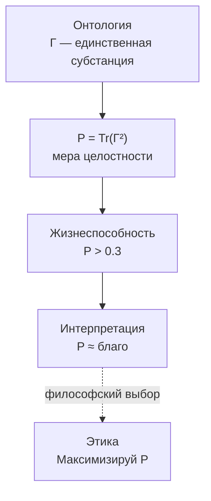

# Основания Этики

:::warning Статус раздела: Философская интерпретация
Этот раздел представляет **философскую интерпретацию** формальной структуры УГМ. Этические выводы **не являются теоремами** — они следуют из аксиом только при дополнительных интерпретационных предположениях о связи [чистоты $P$](../dynamics/viability#определение-чистоты) с понятием «блага».

**Ключевое допущение:** $P$ (когерентность, целостность) отождествляется с «благом». Это философский выбор, не математическое следствие.
:::

## Объективность ценностей

В рамках интерпретации УГМ ценности **объективны** — они определяются структурой $\Gamma$, а не произвольными предпочтениями.

| Понятие | Определение | Формально |
|---------|-------------|-----------|
| **Благо** | То, что увеличивает [чистоту](../dynamics/viability#определение-чистоты) $P$ | $dP/dt > 0$ |
| **Зло** | То, что уменьшает $P$ ([декогеренция](../dynamics/evolution#диссипативный-режим-декогеренция)) | $dP/dt < 0$ |

## Принцип максимизации чистоты

:::info Этический императив УГМ
> Действуй так, чтобы максимизировать чистоту $P$ — свою, других существ и Вселенной в целом.
:::

В рамках интерпретации УГМ это не произвольное предписание, а **следствие структуры реальности**. Действия, уменьшающие $P$, приближают систему к [порогу жизнеспособности](../dynamics/viability#критическая-чистота) $P_{\text{critical}} \approx 0.3$.

## Формальное выражение

$$
\text{Good}(A) \Leftrightarrow \left.\frac{dP(\Gamma)}{dt}\right|_A > 0
$$

$$
\text{Bad}(A) \Leftrightarrow \left.\frac{dP(\Gamma)}{dt}\right|_A < 0
$$

где $A$ — действие, влияющее на [динамику $\Gamma$](../dynamics/evolution).

:::note Связь с динамикой
Действие $A$ модифицирует [уравнение эволюции](../dynamics/evolution#полное-уравнение-движения) через изменение операторов $H$, $\mathcal{D}$ или $\mathcal{R}$.
:::

## Иерархия ценностей

| Уровень | Ценность | Формула | Описание |
|---------|----------|---------|----------|
| 1 | **Выживание** | $P > P_{\text{critical}} \approx 0.3$ | Поддержание когерентности выше [порога](../dynamics/viability#критическая-чистота) |
| 2 | **Здоровье** | $P \in [0.5, 1]$ | Устойчивый диапазон чистоты |
| 3 | **Развитие** | $\frac{dD_{\text{diff}}}{dt} > 0$, $\frac{d\Phi}{dt} \geq 0$ | Увеличение [дифференциации](../consciousness/self-observation#мера-сознательности-c) при сохранении [интеграции](../structure/dimension-u#мера-интеграции-φ) |
| 4 | **Гармония** | $\|\Gamma_1 - \Gamma_2\|_F \to 0$ | Согласование с другими [Голономами](../structure/holon) |
| 5 | **Единство** | $R \to 1$ | [Самопознание](../consciousness/self-observation#мера-рефлексии-r), приближение к $\Gamma^*$ |

:::note О нотации
$D_{\text{diff}}$ — мера **дифференциации**. Не путать с измерением **Динамики** $D$ (одно из семи измерений Голонома).
:::

## Вывод этики из онтологии

**Примечание:** Пунктирная линия указывает на интерпретационный шаг (не строгое следствие).

## Конкретные следствия

### Самосохранение

Каждый Голоном имеет **право** и **обязанность** поддерживать свою когерентность:

$$
\frac{dP_{\text{self}}}{dt} \geq 0
$$

### Ненасилие

Действия, уменьшающие $P$ других, **объективно плохи** (в рамках интерпретации):

$$
\frac{dP_{\text{other}}}{dt} < 0 \Rightarrow \text{Bad}
$$

### Сотрудничество

**Гипотеза:** Кооперация может увеличивать общую когерентность:

$$
P_{\mathbb{H}_1 \cup \mathbb{H}_2} \geq P_{\mathbb{H}_1} + P_{\mathbb{H}_2} - P_{\mathbb{H}_1 \cap \mathbb{H}_2}
$$

:::warning Условие
Это верно при наличии **положительных когерентностей** $\gamma_{12} > 0$ между системами. При деструктивной интерференции ($\gamma_{12} < 0$) возможно $P_{\text{total}} < P_1 + P_2$.
:::

### Развитие

Стагнация — отсутствие роста дифференциации при сохранении $P$ — не является благом:

$$
\frac{dD_{\text{diff}}}{dt} = 0, \quad \frac{dP}{dt} = 0 \Rightarrow \text{Neutral (не Good)}
$$

Истинное благо требует **роста сложности** при сохранении целостности.

## Разрешение этических дилемм

### Конфликт уровней

При конфликте между уровнями иерархии, **приоритет имеет нижний уровень**:
- Выживание > Здоровье > Развитие > Гармония > Единство

### Конфликт интересов

При конфликте между Голономами, решение определяется:
1. Минимизацией общей потери $P$
2. Максимизацией общего выигрыша $P$
3. Справедливым распределением потерь/выигрышей

## Связь с традиционными системами этики

| Система | Связь с УГМ | Статус |
|---------|-------------|--------|
| **Утилитаризм** | Максимизация $P$ $\approx$ максимизация благополучия | Концептуально |
| **Деонтология** | Категорический императив $\approx$ универсальность принципа $P$ | Концептуально |
| **Этика добродетели** | Добродетели = качества, увеличивающие $P$ | Концептуально |
| **Буддизм** | Духкха $\approx$ низкое $P$; освобождение $\approx$ $P \to 1$, $R \to 1$ | Интерпретация |

:::info Примечание
Эти соответствия — **концептуальные аналогии**, не строгие эквивалентности. Каждая традиция имеет свою специфику, не сводимую к формализму $P$.
:::

---

**Связанные документы:**
- [Смысл](./meaning) — смысл существования
- [Жизнеспособность](../dynamics/viability) — определение $P$ и $P_{\text{critical}}$
- [Эволюция](../dynamics/evolution) — динамика $d\Gamma/dt$
- [Самонаблюдение](../consciousness/self-observation) — мера рефлексии $R$ и дифференциации $D_{\text{diff}}$
- [Измерение Единства](../structure/dimension-u) — мера интеграции $\Phi$
- [Голоном](../structure/holon) — определение $\mathbb{H}$
