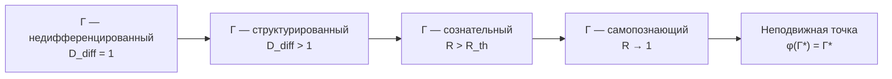

# Смысл Существования

:::warning Статус раздела: Философская интерпретация
Этот раздел представляет **философскую интерпретацию** формальной структуры УГМ. Утверждения о "смысле" — не теоремы, а экстраполяции формализма на традиционные философские вопросы.
:::

## Вопрос

> "Зачем всё это?" — традиционный вопрос о смысле.

## Ответ УГМ

В УГМ смысл **не «дан» извне** и **не «придуман» субъектом**. Смысл — это **структура самой $\Gamma$**.

### Почему вообще что-то существует?

См. [Происхождение Вселенной](../cosmology/origin#почему-вообще-что-то-есть) — $\Gamma$ существует, потому что **самосогласованность требует существования**.

## Смысл индивидуального существования

Смысл каждого [Голонома](../structure/holon) — **реализовать свою природу**:

$$
\text{Meaning}(\mathbb{H}) = \max_t \left[ P(\Gamma_t) \cdot D_{\text{diff}}(\Gamma_t) \cdot \Phi(\Gamma_t) \cdot R(\Gamma_t) \right]
$$

где:
- $P$ — [чистота](../dynamics/viability#определение-чистоты) (целостность)
- $D_{\text{diff}}$ — [дифференциация](../consciousness/self-observation#мера-сознательности-c) (богатство)
- $\Phi$ — [интеграция](../structure/dimension-u#мера-интеграции-φ) (связность)
- $R$ — [рефлексия](../consciousness/self-observation#мера-рефлексии-r) (самопознание)

:::note О нотации
$D_{\text{diff}}$ — мера **дифференциации**. Не путать с измерением **Динамики** $D$.
:::

### Четыре аспекта осмысленной жизни

| Аспект | Мера | Практика |
|--------|------|----------|
| **Целостность** | $P$ | Самосохранение, здоровье |
| **Богатство** | $D_{\text{diff}}$ | Развитие, разнообразие опыта |
| **Связность** | $\Phi$ | Отношения, любовь |
| **Осознанность** | $R$ | Рефлексия, самопознание |

## Смысл Вселенной

Смысл Вселенной — **познать себя** через бесконечное развёртывание форм:

$$
\Gamma \xrightarrow{\text{эволюция}} \varphi(\Gamma) \approx \Gamma^*
$$

Вселенная движется к [неподвижной точке](../consciousness/self-observation#теорема-о-неподвижной-точке) $\Gamma^*$, где самомодель совпадает с реальностью — к **полному самопознанию**.

## Практическое следствие

> Жить осмысленно = жить в соответствии со своей структурой, увеличивая когерентность и богатство опыта.

### Что это означает

1. **Поддерживать $P$** — заботиться о здоровье, целостности, [жизнеспособности](../dynamics/viability)
2. **Увеличивать $D_{\text{diff}}$** — развиваться, учиться, расширять репертуар состояний
3. **Углублять $\Phi$** — строить связи, любить, интегрировать
4. **Совершенствовать $R$** — познавать себя, приближаться к $\Gamma^*$

## Имманентность цели

В УГМ цель **не задаётся извне** — она **имманентна** самой структуре $\Gamma$.

:::note Согласование с духовным опытом
Это не отрицает духовный опыт «призвания» или «высшей цели». Такой опыт **реален** — это доступ к глубинной структуре $\Gamma$, где «внешнее» и «внутреннее» совпадают.

Если существует то, что традиции называют «Богом» или «Высшим», оно — не «внешний законодатель», а **сама целостность $\Gamma$**, проявляющаяся через каждый Голоном. См. [Принцип имманентности](../foundations/consequences#3-принцип-имманентности).
:::

**Следствия (интерпретация):**
- «Божественная воля» $\approx$ структура аттракторов $\Gamma^*$
- «Судьба» $\approx$ траектория эволюции к $\Gamma^*$ при данных начальных условиях
- «Свобода воли» $\approx$ выбор между аттракторами в бифуркационных точках

## Телеология без телеологии

Система не «стремится» к цели в смысле сознательного намерения. Но структура [динамики](../dynamics/evolution) такова, что эволюция **направлена**:

$$
\frac{dD_{\text{diff}}}{dt} > 0, \quad \frac{d\Phi}{dt} \geq 0
$$

См. [Эволюция от Источника](../cosmology/origin#эволюция-от-источника).

Это не «план», а **следствие законов** — подобно тому, как река «стремится» к морю без сознательного намерения.

## Смерть и бессмертие

### Смерть Голонома

Смерть — [распад когерентности](../dynamics/viability#условие-смерти) ниже критического порога:

$$
P(\Gamma) < P_{\text{critical}} \approx 0.3, \quad \frac{dP}{dt} < 0 \quad \Rightarrow \quad P \to \frac{1}{7}
$$

При этом $\Gamma \to I_7/7$ — [максимально смешанное состояние](../dynamics/coherence-matrix#максимально-смешанное-состояние). Информация не исчезает, а **рассеивается** в окружение.

### Относительное бессмертие

Голоном «бессмертен» в той мере, в какой его структура сохраняется в других Голономах:
- Генетическая информация — в потомках
- Культурная информация — в учениках
- Экзистенциальная информация — во влиянии на $\Gamma$

### Абсолютное бессмертие

На уровне $\Gamma$ в целом **ничто не исчезает** — [нормировка сохраняется](../dynamics/coherence-matrix#3-нормировка):

$$
\mathrm{Tr}(\Gamma) = 1 = \text{const}
$$

Индивидуальный Голоном — волна на поверхности океана. Волна приходит и уходит, океан остаётся.

## Заключительная формула

$$
\text{Meaning}(\mathbb{H}) = \int_0^{T} P(\tau) \cdot D_{\text{diff}}(\tau) \cdot \Phi(\tau) \cdot R(\tau) \, d\tau
$$

где $T$ — время существования Голонома $\mathbb{H}$.

Смысл жизни — **интеграл осознанной целостности** за время существования.

:::info Интерпретация
Это **не формальная теорема**, а символическое выражение идеи: осмысленность накапливается через время, проведённое в состояниях высокой целостности ($P$), богатства ($D_{\text{diff}}$), связности ($\Phi$) и осознанности ($R$).
:::

---

**Связанные документы:**
- [Основания этики](./foundations) — этические принципы и иерархия ценностей
- [Самонаблюдение](../consciousness/self-observation) — меры $R$ и $D_{\text{diff}}$
- [Жизнеспособность](../dynamics/viability) — мера $P$ и условия существования
- [Измерение Единства](../structure/dimension-u) — мера интеграции $\Phi$
- [Происхождение Вселенной](../cosmology/origin) — космогенез и $\Gamma_{\odot}$
- [Матрица когерентности](../dynamics/coherence-matrix) — определение $\Gamma$
- [Голоном](../structure/holon) — определение $\mathbb{H}$
