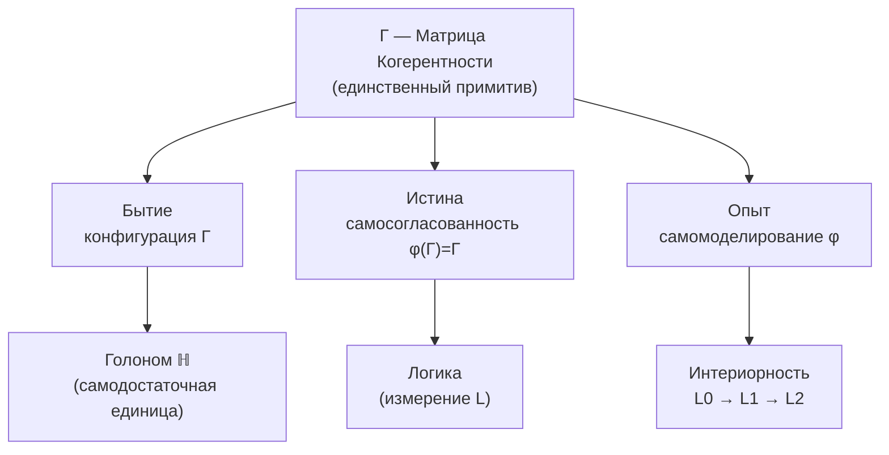

# Аксиома Ω

## Фундаментальная Аксиома

:::info Аксиома Ω (Единство)
Существует единственный примитив — **Матрица Когерентности** $\Gamma$, которая является одновременно субстанцией, структурой и процессом реальности:
- **Бытие** = конфигурация $\Gamma$
- **Становление** = эволюция $\Gamma$ по [уравнению Линдблада с регенерацией](../dynamics/evolution)
- **Опыт** = самомоделирование $\Gamma$ через отображение $\varphi: \Gamma \mapsto \Gamma$
:::

### Статус аксиомы

Аксиома Ω принимается как **исходная точка** теории, а не доказывается. Это обосновано:

1. **Логическая необходимость**: Любое доказательство есть процесс установления когерентности между утверждениями — то есть операция над Γ. Отрицание Γ уже предполагает когерентную структуру отрицания
2. **Онтологическая экономия**: Единственный примитив vs. дуализм материи и сознания
3. **Объяснительная сила**: Из одной сущности выводятся физика, феноменология и их связь

:::info Философский статус
Аксиома Ω — **метафизический выбор**, не эмпирически проверяемое утверждение. Альтернативные позиции (дуализм, материализм) логически возможны, но УГМ считает их менее экономными и менее объяснительно мощными.
:::

**Связь со второй аксиомой**: [Аксиома (AP+PH+QG)](./axiom-septicity) задаёт *свойства* систем, а Аксиома Ω задаёт *природу* субстанции. Вместе они порождают [Теорему S](../../proofs/theorem-minimality-7) о минимальной размерности 7.

## Онтологический статус примитива

### Γ не является:
- **Математической абстракцией** — $\Gamma$ *есть* сама реальность, а не её модель
- **Описанием чего-то иного** — нет "вещи в себе" за $\Gamma$
- **Конструкцией наблюдателя** — наблюдатель сам есть конфигурация $\Gamma$

### Γ является:
- **Единственной субстанцией** — материя, энергия, информация, опыт — аспекты $\Gamma$
- **Собственной структурой** — форма $\Gamma$ определяется самой $\Gamma$
- **Собственным процессом** — эволюция $\Gamma$ есть внутренняя динамика

:::tip Аналогия с квантовой механикой
$\Gamma$ удовлетворяет тем же условиям, что и **матрица плотности** $\rho$ в квантовой механике. Но в УГМ $\Gamma$ — не статистическое описание ансамбля, а сама субстанция реальности.
:::

## Формальное определение

### Определение (Матрица Когерентности)

Матрица Когерентности $\Gamma$ — линейный оператор, удовлетворяющий:

$$
\Gamma \in \mathcal{L}(\mathcal{H}), \quad \Gamma^\dagger = \Gamma, \quad \Gamma \geq 0, \quad \mathrm{Tr}(\Gamma) = 1
$$

где:
- $\mathcal{L}(\mathcal{H})$ — пространство линейных операторов на гильбертовом пространстве $\mathcal{H}$
- $\Gamma^\dagger = \Gamma$ — **эрмитовость** (все собственные значения вещественны)
- $\Gamma \geq 0$ — **положительная полуопределённость** (все собственные значения $\lambda_i \geq 0$)
- $\mathrm{Tr}(\Gamma) = 1$ — **нормировка** (сумма собственных значений равна 1)

### Размерность пространства состояний

Согласно [Теореме S](../../proofs/theorem-minimality-7), минимальная размерность пространства, удовлетворяющая требованиям автопоэзиса (AP), феноменологии (PH) и квантового основания (QG):

$$
\mathcal{H} = \mathbb{C}^7 = \mathrm{span}\{|A\rangle, |S\rangle, |D\rangle, |L\rangle, |E\rangle, |O\rangle, |U\rangle\}
$$

## Интерпретация элементов

В базисе [семи измерений](../structure/dimensions) $\{|A\rangle, |S\rangle, |D\rangle, |L\rangle, |E\rangle, |O\rangle, |U\rangle\}$:

$$
\Gamma = \sum_{i,j \in \{A,S,D,L,E,O,U\}} \gamma_{ij} |i\rangle\langle j|
$$

### Диагональные элементы

$\gamma_{ii} \in [0, 1]$ — **вероятности** (или "веса") нахождения системы в $i$-м измерении:

$$
\sum_{i} \gamma_{ii} = \mathrm{Tr}(\Gamma) = 1
$$

### Недиагональные элементы

$\gamma_{ij}$ (при $i \neq j$) — **когерентности** (квантовые корреляции) между измерениями:

$$
|\gamma_{ij}|^2 \leq \gamma_{ii} \cdot \gamma_{jj} \quad \text{(неравенство Коши-Шварца)}
$$

:::info Физический смысл когерентности
Когерентность $\gamma_{ij} \neq 0$ означает, что измерения $i$ и $j$ не независимы — они находятся в квантовой суперпозиции. Декогеренция (потеря когерентности) $\gamma_{ij} \to 0$ соответствует классикализации системы.
:::

## Связь с традиционными понятиями

| Традиционное понятие | Выражение через $\Gamma$ | Формализация |
|---------------------|-------------------------|--------------|
| Субстанция | $\Gamma$ | Сама матрица |
| Форма | Конфигурация $\Gamma$ | Распределение $\gamma_{ij}$ |
| Процесс | Эволюция $\Gamma$ | $\frac{d\Gamma}{dt} = \mathcal{L}[\Gamma]$ |
| Опыт | Самомоделирование $\Gamma$ | Отображение $\varphi: \Gamma \to \Gamma$ |
| Истина | Самосогласованность | Неподвижная точка $\varphi(\Gamma^*) = \Gamma^*$ |

### Самомоделирование и опыт

**Опыт** в УГМ — не эпифеномен, а структурное свойство: способность $\Gamma$ моделировать себя через отображение $\varphi$. Формально:

$$
\varphi: \mathcal{L}(\mathcal{H}) \to \mathcal{L}(\mathcal{H}), \quad \varphi(\Gamma) \approx \Gamma
$$

Мера качества самомоделирования — **рефлексия R**:

$$
R = 1 - \frac{\|\Gamma - \varphi(\Gamma)\|^2}{\|\Gamma\|^2} \in [0, 1]
$$

При $R \geq 0.3$ и $\Phi \geq 1.0$ система достигает уровня L2 — когнитивных квалиа. См. [Иерархия интериорности](../../proofs/interiority-hierarchy).

## Диаграмма отношений

## Резюме

:::tip Ключевые утверждения Аксиомы Ω
1. **Единственность**: $\Gamma$ — единственный примитив, из которого всё выводится
2. **Тождество аспектов**: Бытие, структура и опыт — не разные вещи, а аспекты $\Gamma$
3. **Самозамкнутость**: Любое познание, включая познание $\Gamma$, есть операция внутри $\Gamma$
4. **Формализуемость**: $\Gamma$ — эрмитов, положительно полуопределённый, нормированный оператор
:::

---

**Связанные документы:**
- [Аксиома (AP+PH+QG)](./axiom-septicity) — требования автопоэзиса, феноменологии и квантового основания
- [Следствия](./consequences) — выводы из аксиомы Ω
- [Матрица Когерентности](../dynamics/coherence-matrix) — детальное описание структуры
- [Уравнение эволюции](../dynamics/evolution) — динамика $\Gamma$
- [Теорема о минимальности 7D](../../proofs/theorem-minimality-7) — почему $\dim(\mathcal{H}) = 7$
