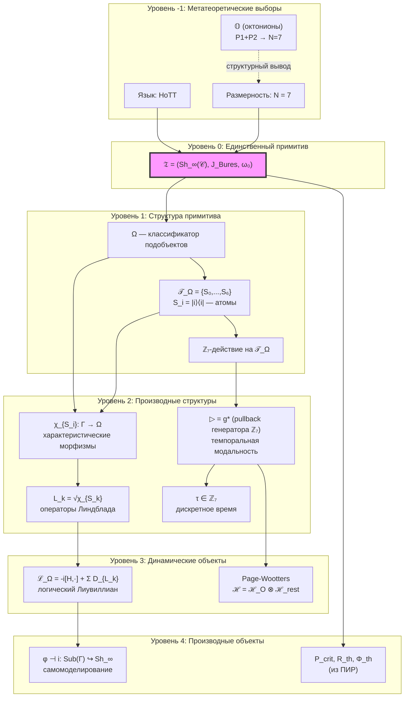
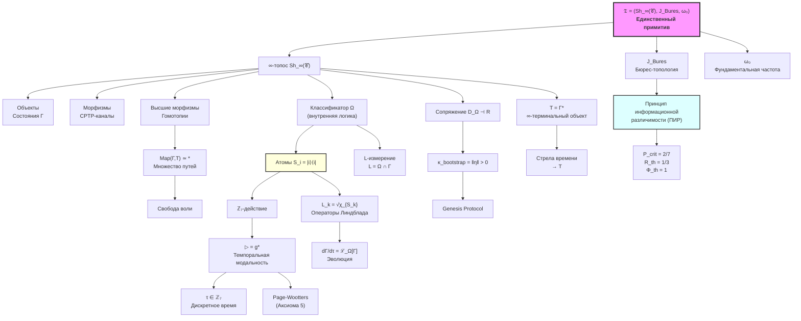

# Аксиома Ω⁷

## Честная Аксиоматика {#аксиоматика}

:::warning Методологическое замечание
УГМ теория строится на **явной аксиоматике**. Все постулаты чётко разделены на:
- **Аксиомы** — принимаемые без доказательства
- **Определения** — конструкции из аксиом
- **Теоремы** — доказываемые следствия

Это обеспечивает математическую честность и отсутствие скрытых допущений.
:::

### Уровни аксиоматики

**УРОВЕНЬ -1: МЕТАТЕОРЕТИЧЕСКИЕ ВЫБОРЫ** (не обосновываются)
- **Язык:** ∞-категории / HoTT (гомотопическая теория типов)
- **Логика:** интуиционистская (внутренний язык топоса)

**УРОВЕНЬ 0: АКСИОМЫ** (постулируются явно)

| Аксиома | Формулировка | Обоснование |
|---------|--------------|-------------|
| **Аксиома 1 (Структура)** | Реальность есть ∞-топос $\mathbf{Sh}_\infty(\mathcal{C})$ над категорией матриц плотности $\mathcal{D}(\mathbb{C}^N)$ | ∞-топосы — наиболее общие "пространства" с внутренней логикой |
| **Аксиома 2 (Метрика)** | Топология Гротендика $J$ индуцирована метрикой Бюреса $d_B$ | **Теорема Ченцова-Петца:** Бюреса — единственная монотонная риманова метрика на $\mathcal{D}(\mathcal{H})$ |
| **Аксиома 3 (Размерность)** | $N = 7$ — размерность базового пространства | Характеризует класс изучаемых систем (Голономов) |
| **Аксиома 4 (Масштаб)** | $\omega_0 > 0$ — характерная частота системы | Связывает внутреннее время $\tau$ с физическим временем $t$. **Параметр системы**, не универсальная константа (аналог массы в физике) |

:::info Статус N = 7 (двухтрековое обоснование)
Размерность $N = 7$ — **фундаментальная аксиома** (Аксиома 3) с двумя независимыми обоснованиями:

| Трек | Обоснование | Статус |
|------|-------------|--------|
| **A** | [Теорема S](./axiom-septicity#теорема-s-семимерность--следствие-из-аксиомы): (AP)+(PH)+(QG) → N ≥ 7 | [Т] Доказано |
| **B** | [Структурный вывод](../../proofs/minimality/theorem-octonionic-derivation): P1+P2 → 𝕆 → dim Im(𝕆) = 7 | [Т] Математически строго |

Мост (AP)+(PH)+(QG) → P1+P2 — [полная цепочка T1–T15 [Т]](../../proofs/minimality/theorem-octonionic-derivation#мост).
:::

**УРОВЕНЬ 1: ОПРЕДЕЛЕНИЯ** (строятся из аксиом)
- Ω — классификатор подобъектов (существует по теореме Жирара)
- $S_i := |i\rangle\langle i|$ — атомы классификатора (проекторы на базис)
- $\triangleright: S_i \mapsto S_{(i+1) \mod 7}$ — циклический сдвиг (алгебраическая структура)
- $L_k := P_k = |k\rangle\langle k|$ — операторы Линдблада (операторные представители характеристических морфизмов атомов $\chi_{S_k}$; [вывод](#lk-из-omega))

**УРОВЕНЬ 2: СЛЕДСТВИЯ** (доказываемые или обосновываемые)
- $P_{crit} = 2/7$ **[Т]** ([критическая чистота](/docs/core/dynamics/viability#критическая-чистота))
- $R_{th} = 1/3$ **[Т]** ([порог рефлексии](/docs/core/foundations/axiom-septicity#теорема-порог-рефлексии), $K=3$ из [триадной декомпозиции](/docs/core/operators/lindblad-operators#триадная-декомпозиция) + байесовское доминирование)
- $\Phi_{th} = 1$ **[О]** ([порог интеграции](/docs/core/foundations/axiom-septicity#теорема-порог-интеграции), когерентная доминация по конвенции)
- $\kappa_{\text{bootstrap}} > 0$ **[Т]** (минимальная регенерация из сопряжения)
- **ПИР** — теорема **[Т]** (T16, выводится из A1+A2 через семантику Крипке—Жуаля) ([обоснование ниже](#пир-как-теорема))

---

## Структурированный Примитив {#примитив}

:::info Единственный примитив
**Топос с геометрией** $\mathfrak{T} := (\mathbf{Sh}_\infty(\mathcal{C}), J_{Bures}, \omega_0)$ — **структурированный примитив** теории УГМ.

Это тройка компонент, образующих неразложимое единство (подобно $\mathbb{R}^4$ как одному объекту, а не четырём числам):
- $\mathbf{Sh}_\infty(\mathcal{C})$ — ∞-топос пучков (Аксиома 1)
- $J_{Bures}$ — топология Гротендика (Аксиома 2)
- $\omega_0$ — фундаментальная частота (Аксиома 4)

Из этого примитива **выводятся**:
- Пространство состояний (объекты ∞-топоса)
- Динамика (морфизмы всех уровней)
- Базовое пространство X = |N(𝒞)| (нерв категории)
- Время τ (внутренняя модальность через ℤ_N-действие)
- Метрика d_strat (спектральная геометрия)
- **Свобода воли** (множественность путей в Map(Γ, T))
- Пороги P_crit, R_th, Φ_th (из принципа информационной различимости — который сам следует из $J_{Bures}$)

**Параметры теории:**
- N = 7 — размерность (Аксиома 3)
- ω₀ — фундаментальная частота (Аксиома 4)
:::


---

## ∞-категорная структура {#infty-структура}

### Зачем ∞-категории?

В обычной (1-)категории морфизмы либо равны, либо нет. В ∞-категории между морфизмами существуют 2-морфизмы (гомотопии), между 2-морфизмами — 3-морфизмы, и так далее.

**Ключевое следствие:** Терминальный объект T допускает **множество эквивалентных путей** к нему, что разрешает проблему телеологического детерминизма.

### Определение ∞-топоса УГМ

**Определение (∞-топос УГМ):**

$$
\mathbf{Sh}_\infty(\mathcal{C}) := \text{Fun}(\mathcal{C}^{op}, \mathbf{Spaces})^{loc}
$$

— категория локально постоянных ∞-функторов из 𝒞ᵒᵖ в категорию пространств (∞-группоидов).

:::info Замечание (∞-топос vs 1-топос)
В отличие от 1-категорных топосов Гротендика, где базовая категория 𝒞 должна обладать конечными пределами (в частности, pullbacks) для корректного определения пересечения покрытий, ∞-категорная конструкция $\text{Fun}(\mathcal{C}^{op}, \mathbf{Spaces})^{loc}$ **не требует** pullbacks в 𝒞 (Lurie, HTT, Prop. 6.2.2.7). Категория пучков $\mathbf{Sh}_\infty(\mathcal{C})$ сама обладает всеми (∞,1)-пределами и копределами, даже если базовая 𝒞 ими не обладает. Достаточно задать топологию Гротендика (покрытия) на 𝒞.
:::

### Топология Гротендика на 𝒞 {#топология-гротендика}

:::info Явное определение покрытий
Для корректного определения понятия «пучка» (и, следовательно, ∞-топоса) необходимо явно задать **топологию Гротендика** — семейства морфизмов, образующих покрытия.
:::

**Определение (Сайт 𝒞):**

Пара $(\mathcal{C}, J_{Bures})$ образует **сайт**, где $J_{Bures}$ — функция покрытий, определённая через метрику Бюреса.

**Определение (Метрика Бюреса):**

Для матриц плотности $\Gamma_1, \Gamma_2 \in \mathcal{C}$:

$$
d_B(\Gamma_1, \Gamma_2) := \sqrt{2\left(1 - \sqrt{F(\Gamma_1, \Gamma_2)}\right)}
$$

где $F(\Gamma_1, \Gamma_2) = \left(\mathrm{Tr}\sqrt{\sqrt{\Gamma_1}\Gamma_2\sqrt{\Gamma_1}}\right)^2$ — fidelity.

**Определение (Bures-покрытие):**

Семейство морфизмов $\{\Phi_i: \Gamma_i \to \Gamma\}_{i \in I}$ образует **покрытие** объекта $\Gamma$, если:

$$
\forall \epsilon > 0, \exists \delta > 0: \quad B_B(\Gamma, \delta) \subseteq \bigcup_{i \in I} \Phi_i(B_B(\Gamma_i, \epsilon))
$$

где $B_B(\Gamma, r) = \{\Sigma \in \mathcal{C} : d_B(\Gamma, \Sigma) < r\}$ — открытый шар в метрике Бюреса.

**Теорема (Аксиомы сайта):**

Топология $J_{Bures}$ удовлетворяет аксиомам Гротендика:

1. **(Идентичность)** $\{\mathrm{id}: \Gamma \to \Gamma\}$ покрывает $\Gamma$
2. **(Стабильность)** Если $\{U_i \to X\}$ покрывает X, и $f: Y \to X$, то $\{f^*(U_i) \to Y\}$ покрывает Y
3. **(Транзитивность)** Композиция покрытий — покрытие

#### Доказательство стабильности покрытий {#доказательство-стабильности}

:::warning Теорема (Стабильность $J_{Bures}$) [Т]
Если $\{\Phi_i: \Gamma_i \to \Gamma\}_{i \in I}$ — $J_{Bures}$-покрытие $\Gamma$, и $f: \Sigma \to \Gamma$ — морфизм в 𝒞 (CPTP-канал), то решето $f^*(S)$ покрывает $\Sigma$.
:::

**Доказательство:**

1. По определению покрытия: $\forall\varepsilon > 0,\;\exists\delta > 0$: $B_B(\Gamma,\delta) \subseteq \bigcup_i \Phi_i(B_B(\Gamma_i,\varepsilon))$
2. $f$ — CPTP-канал $\Longrightarrow$ $f$ контрактивен по Бюресу (Ченцов-Петц): $d_B(f(\rho), f(\sigma)) \leq d_B(\rho, \sigma)$
3. Для любого $\Sigma'$ с $d_B(\Sigma', \Sigma) < \delta$: $d_B(f(\Sigma'), f(\Sigma)) \leq d_B(\Sigma', \Sigma) < \delta$
4. Поскольку $f(\Sigma) = \Gamma$: $f(\Sigma') \in B_B(\Gamma, \delta)$
5. По (1): $f(\Sigma') \in \Phi_j(B_B(\Gamma_j, \varepsilon))$ для некоторого $j$
6. Следовательно, морфизм $\Sigma' \to \Sigma \xrightarrow{f} \Gamma$ факторизуется через $\Phi_j$, т.е. принадлежит решету $f^*(S)$
7. Это выполнено для всех $\Sigma'$ в $B_B(\Sigma, \delta)$ $\Longrightarrow$ $f^*(S)$ покрывает $\Sigma$ $\quad\blacksquare$

Ключевой факт: **контрактивность Бюреса при CPTP** (единственность монотонной метрики по Ченцову-Петцу) обеспечивает стабильность покрытий автоматически.

**Следствие (Смысл "loc"):**

Суперскрипт "loc" в определении $\mathbf{Sh}_\infty(\mathcal{C})^{loc}$ означает локализацию относительно $J_{Bures}$-покрытий: функтор $F$ является пучком, если для любого покрывающего решета $S \to X$:

$$
F(X) \xrightarrow{\sim} \lim_{\{U \to X\} \in S} F(U)
$$

**Физическая интерпретация:**

- **Покрытие** ≈ набор возможных измерений, «разрешающих» состояние
- **Условие склейки** ≈ категориальная формализация квантовой когерентности
- Метрика Бюреса **монотонна** при CPTP: $d_B(\Phi(\rho), \Phi(\sigma)) \leq d_B(\rho, \sigma)$

### Структура ∞-топоса

**Теорема (Структура по Лури):**

∞-топос Sh_∞(𝒞) обладает:

1. **Внутренней логикой:** Гомотопическая теория типов (HoTT)
2. **Классификатором подобъектов:** Ω ∈ Sh_∞(𝒞)
3. **Пределами и копределами:** Все (∞, 1)-пределы существуют
4. **Экспоненциалами:** Для F, G существует [F, G]

### Связь с иерархией интериорности {#связь-с-интериорностью}

:::info n-усечения и уровни сознания
∞-группоидная структура $\mathbf{Exp}_\infty$ (экспериенциальное пространство) связана с [иерархией интериорности](/docs/proofs/consciousness/interiority-hierarchy) через механизм n-усечения.
:::

**Гомотопическая классификация [И]:**

Уровни интериорности L0→L4 соответствуют n-усечениям ∞-группоида $\mathbf{Exp}_\infty$:

| Уровень | n-усечение | Гомотопические группы | Категорная интерпретация |
|---------|------------|----------------------|--------------------------|
| L0 | $\tau_{\leq 0}$ | $\pi_0 \neq 0$ | Дискретное множество состояний |
| L1 | $\tau_{\leq 1}$ | $\pi_1 \neq 0$ | Группоид (феноменальные пути) |
| L2 | $\tau_{\leq 2}$ | $\pi_2 \neq 0$ | Бикатегория (рефлексия) |
| L3 | $\tau_{\leq 3}$ | $\pi_3 \neq 0$ | Трикатегория (метарефлексия) |
| L4 | $\tau_{\leq \infty}$ | Все $\pi_k$ | Полная ∞-структура |

Подробности: [Категорный формализм §10.6](/docs/proofs/categorical/categorical-formalism#связь-с-иерархией-интериорности).

**Следствие (Конечность иерархии):**

L4 — максимальный уровень (теорема стабилизации Постникова). Не существует L5, L6, ...

---

## Внутренняя логика Ω {#внутренняя-логика}

:::warning Ключевая теорема: L-унификация [Т]
Классификатор подобъектов Ω ∈ Sh_∞(𝒞) является **единым источником**:
- [Измерения L (Логики)](../structure/dimension-l) — как L = Ω ∩ Γ
- Операторов Линдблада $L_k$ — как операторных представителей характеристических морфизмов атомов Ω ([вывод](#lk-из-omega))
- Времени τ — через темпоральную модальность ▷

Это разрешает проблему спецификации $L_k$ и устраняет цикличность определений.
:::

### Классификатор подобъектов Ω

**Определение (Классификатор):**

Для любого объекта X ∈ Sh_∞(𝒞) существует биекция:

$$
\text{Sub}(X) \simeq \text{Map}(X, \Omega)
$$

Подобъекты X соответствуют морфизмам в Ω — «логические предикаты» на X.

**Для матриц плотности:**

$$
\Omega_{UHM} := \text{Spec}(\mathcal{A}_L)
$$

где $\mathcal{A}_L$ — C*-алгебра логических предикатов на пространстве состояний.

### Характеристические морфизмы и L_k

**Определение (Характеристический морфизм):**

Для подобъекта $S \hookrightarrow \Gamma$ его характеристический морфизм:

$$
\chi_S: \Gamma \to \Omega
$$

определяет «степень принадлежности» состояния к логически допустимому подпространству S.

### Явная конструкция атомов классификатора {#атомы-классификатора}

:::warning Теорема (Атомистика 7D-системы)
Для базовой категории $\mathcal{C} = \mathcal{D}(\mathbb{C}^7)$ с Бюрес-топологией классификатор Ω разлагается на атомы:

$$
\mathcal{T}_\Omega = \{S_0, S_1, \ldots, S_6\}
$$

где каждый атом — проектор на базисное состояние:

$$
S_i = |i\rangle\langle i|, \quad i \in \{A, S, D, L, E, O, U\}
$$
:::

:::info Замечание (Роль атомов Ω)
Атомы $S_k = |k\rangle\langle k|$ — это **комбинаторная стратификация** пространства состояний $\mathcal{D}(\mathbb{C}^7)$, а не элементы квантовой логики. Внутренняя логика ∞-топоса $\mathbf{Sh}_\infty(\mathcal{C})$ — гомотопическая теория типов (HoTT) с темпоральной модальностью $\triangleright$ (§2.7 в [эмерджентном времени](../../proofs/dynamics/emergent-time#время-в-hott)), а не алгебра Гейтинга и не ортомодулярная решётка проекторов.

Характеристические морфизмы $\chi_{S_k}(\Gamma) = \gamma_{kk}$ — функции извлечения диагональных элементов, определяющие **базисные предикаты** для L-унификации. Это не квантовологические предикаты в смысле Биркгофа-фон Неймана. Подобъектная структура ∞-топоса формализуется через HoTT-типы, а не через решётку проекторов.
:::

**Характеристические морфизмы атомов:**

$$
\chi_{S_i}(\Gamma) = \langle i|\Gamma|i\rangle = \gamma_{ii}
$$

— диагональный элемент матрицы когерентности.

#### Теорема (L_k из Ω) [Т] {#lk-из-omega}

Операторы Линдблада **выводятся** из классификатора подобъектов.

**Доказательство (3 шага):**

**Шаг 1 (Атомы → оператор).** Каждый атом $S_k = |k\rangle\langle k|$ классификатора определяет характеристический морфизм $\chi_{S_k}: \Gamma \mapsto \gamma_{kk}$ (скалярная функция). **Операторный представитель** этого морфизма — проектор $P_k = |k\rangle\langle k|$, поскольку:

$$
\chi_{S_k}(\Gamma) = \mathrm{Tr}(P_k \cdot \Gamma) = \gamma_{kk}
$$

Проектор $P_k$ — единственный оператор ранга 1, реализующий линейный функционал $\chi_{S_k}$ через след (теорема Рисса для $M_n(\mathbb{C})$ с паре Гильберта-Шмидта).

**Шаг 2 (Проектор → оператор Линдблада).** Определяем:

$$
L_k := P_k = |k\rangle\langle k|
$$

Поскольку $P_k$ — ортогональный проектор, $P_k^2 = P_k = P_k^\dagger$, откуда $\sqrt{P_k} = P_k$ и $L_k = \sqrt{P_k}$ (неотрицательный квадратный корень проектора — он сам).

**Шаг 3 (CPTP-совместимость).** Полнота базиса гарантирует:

$$
\sum_{k=0}^{6} L_k^\dagger L_k = \sum_{k=0}^{6} |k\rangle\langle k| = \mathbb{1}_7 \quad \checkmark
$$

Это — условие CPTP-совместимости для Линдбладовского диссипатора $\mathcal{D}[\Gamma] = \sum_k \gamma_k (L_k \Gamma L_k^\dagger - \frac{1}{2}\{L_k^\dagger L_k, \Gamma\})$. $\blacksquare$

Конкретные скорости декогеренции $\gamma_k \geq 0$ по каждому каналу задаются отдельно в [уравнении эволюции](../dynamics/evolution#логический-лиувиллиан).

### Иерархия L_k по стратам {#иерархия-lk}

| Страта | Система | Подобъекты | L_k оператор |
|--------|---------|------------|--------------|
| I | Материя | $S_{sym}$ — инвариантные | $P_{Casimir}$ (симметрия) |
| II | Жизнь | $S_{viable}$ — P > P_crit | QECC-стабилизаторы |
| III | Разум | $S_{predictive}$ — min F | $\nabla_\Gamma F$ (градиент) |
| IV | Сознание | $S_{coherent}$ — H¹ = 0 | $\check{\delta}$ (Чех) |

### Темпоральная модальность {#темпоральная-модальность}

:::warning Три уровня темпоральной структуры
Время в УГМ конструируется на **трёх чётко разделённых уровнях**:

| Уровень | Тип | Содержание |
|---------|-----|------------|
| **A. Алгебраический** | Определение | ℤ_N-действие на атомах |
| **B. Семантический** | Интерпретация | Орбита ▷ называется "временем" |
| **C. Динамический** | Теорема | Соответствие ▷ и $e^{\delta\tau \cdot \mathcal{L}_\Omega}$ |

Это разрывает потенциальную цикличность: **определение времени не использует эволюцию**.
:::

**Определение (Оператор «позже»):**

На множестве атомов $\mathcal{T}_\Omega = \{S_0, \ldots, S_{N-1}\}$ определяется циклический сдвиг:

$$
\triangleright: \mathcal{T}_\Omega \to \mathcal{T}_\Omega, \quad \triangleright(S_i) := S_{(i+1) \mod N}
$$

**Алгебраическое обоснование:**

1. **Структура кольца ℤ_N:** Простая циклическая группа порядка N имеет единственный генератор $g: k \mapsto k+1 \mod N$

2. **Изоморфизм:** $\mathcal{T}_\Omega \cong \mathbb{Z}_N$ как множества (каноническое отождествление $S_i \leftrightarrow i$)

3. **Индуцированное действие:** $\triangleright := g^*$ — pullback генератора группы

**Теорема (Время из алгебры — без цикличности):**

Дискретное время τ ∈ ℤ_N возникает как итерация алгебраически определённого оператора:

$$
\tau_n := \underbrace{\triangleright \circ \cdots \circ \triangleright}_{n \text{ раз}}(now) = \triangleright^n(now)
$$

где $now := S_0$ — начальный атом (выбор фазы).

**Свойства:**
- **Цикличность:** $\triangleright^N = \mathrm{Id}$
- **Минимальность:** $\triangleright^k \neq \mathrm{Id}$ для $0 < k < N$
- **Независимость от динамики:** Определение не использует ℒ_Ω

#### Уровень A: Алгебраическая структура (Определение)

**Лемма:** ▷ генерирует свободное ℤ_7-действие на $\mathcal{T}_\Omega$.

**Доказательство:**
- $\triangleright^7 = \mathrm{Id}$ (проверяется прямым вычислением)
- $\triangleright^k \neq \mathrm{Id}$ для $0 < k < 7$ (атомы различны)
- Следовательно, орбита ▷-действия имеет ровно 7 элементов. ∎

#### Уровень B: Семантическая интерпретация (Выбор)

**Определение:** Множество $\tau := \mathbb{Z}_7$ называется **дискретным внутренним временем**.

**Ключевой момент:** Эта интерпретация — **семантический выбор**, не математическое следствие. Мы *решаем* называть орбиту ▷-действия "временем".

**Обоснование выбора:** Орбита ▷ обладает свойствами, ожидаемыми от времени:
1. Линейная упорядоченность (mod циклической идентификации)
2. Транзитивность: из любого момента можно попасть в любой другой
3. Дискретность: нет "промежуточных" моментов

#### Уровень C: Динамическое соответствие (Теорема)

**Теорема (Соответствие ▷ и эволюции):**

Пусть $\mathcal{L}_\Omega$ — логический Лиувиллиан. Тогда:
$$e^{\delta\tau \cdot \mathcal{L}_\Omega} \approx \triangleright^* + O(\delta\tau^2)$$

где $\triangleright^*$ — индуцированное действие на состояниях, $\delta\tau = 2\pi/(7\omega_0)$.

**Эскиз доказательства:**
1. Генератор ▷-действия: $T := (\omega_0/2\pi i) \cdot \log(\triangleright)$, определённый на конечномерном $\text{Spec}(\Omega)$
2. На конечномерном пространстве $\log$ определён через жорданову форму
3. Разложение: $e^{i\delta\tau \cdot T} = \triangleright$ (точно для $\delta\tau = 2\pi/(7\omega_0)$)
4. Линеаризация $\mathcal{L}_\Omega$ вблизи равновесия: $\mathcal{L}_\Omega \approx -i[H_{eff}, \cdot] + O(\text{декогеренция})$
5. Сравнение: $T \leftrightarrow H_{eff}$ с точностью до масштаба $\omega_0$ ∎

#### Аксиома 5 (Page-Wootters) {#pw-constraint}

:::warning Page-Wootters: Согласованная Аксиома
Тензорное разложение $\mathcal{H} = \mathcal{H}_O \otimes \mathcal{H}_{rest}$ — **дополнительная аксиома** (Аксиома 5), а не теорема. Она постулирует структуру, **согласованную** с алгебраической модальностью ▷.
:::

**Формулировка:**

1. Пространство часов $\mathcal{H}_O := \text{span}\{|\tau_k\rangle : k \in \mathbb{Z}_N\}$ — орбита ▷-действия
2. Глобальное состояние $\Gamma_{total}$ удовлетворяет ограничению: $\hat{C} \cdot \Gamma_{total} = 0$
3. Ограничение $\hat{C} = H_O \otimes \mathbb{1} + \mathbb{1} \otimes H_{rest} + H_{int}$

**Теорема (Согласованность с ▷):**

Если $\Gamma_{total}$ удовлетворяет Page-Wootters constraint, то условные состояния:
$$\Gamma(\tau_n) := \text{Tr}_O[(|\tau_n\rangle\langle\tau_n| \otimes \mathbb{1}) \cdot \Gamma_{total}] / p(\tau_n)$$

удовлетворяют: $\Gamma(\tau_{n+1}) = \triangleright^*(\Gamma(\tau_n)) + O(H_{int})$

[Подробнее о согласованности →](../../proofs/dynamics/emergent-time#pw-как-теорема)

### Принцип Информационной Различимости как Теорема {#пир-как-теорема}

:::tip ПИР — теорема [Т] (T16)
Принцип Информационной Различимости (ПИР) — **теорема** УГМ (T16), выводимая из A1+A2 через семантику Крипке—Жуаля. Шаг от «разделимости покрытиями» к «онтологической различимости» обеспечивается семантикой вынуждения в ∞-топосе.
:::

**Теорема (ПИР, T16):**

Два состояния $\Gamma_1, \Gamma_2$ *онтологически различимы* ⟺ $d_B(\Gamma_1, \Gamma_2) > 0$.

**Совместимость с $J_{Bures}$:**

1. Топология Гротендика $J_{Bures}$ определяет понятие «различимости» через покрытия
2. $J_{Bures}$-покрытие разделяет точки ⟺ они на положительном Бурес-расстоянии
3. Отождествление «онтологической различимости» с «разделимостью покрытиями» — содержание теоремы ПИР (T16, семантика Крипке—Жуаля) ∎

**Следствие (Унификация порогов через ПИР):**

Все три порога выводятся из единого принципа — различимости в метрике Бюреса:

| Порог | Условие ПИР | Формула |
|-------|-------------|---------|
| $P_{crit}$ | $d_B(\Gamma, \mathbb{1}/N) > d_B^{noise}$ | $P > 2/N$ |
| $R_{th}$ | $d_B(\Gamma, \varphi(\Gamma)) < d_B^{self}$ | $R > 1/3$ |
| $\Phi_{th}$ | $d_B(\Gamma, \Gamma_{diag}) > d_B^{class}$ | $\Phi > 1$ |

где $d_B^{noise}, d_B^{self}, d_B^{class}$ — характерные масштабы различимости для каждого типа.

---

### L-измерение как проекция Ω

**Определение:**

[L-измерение](../structure/dimension-l) Голонома — это проекция классификатора на состояние:

$$
L := \Omega \cap \Gamma = \{\chi \in \Omega : \chi(\Gamma) = \text{true}\}
$$

**Интерпретация:** L — множество логических предикатов, истинных для данного Γ.

---

## Октонионная структура {#октонионная-структура}

:::info Второе обоснование N = 7 — [Структурный вывод](../../proofs/minimality/theorem-octonionic-derivation)
Независимо от Теоремы S, число 7 выводится из двух теорем через теорему Гурвица:

**[Т] P1:** Пространство состояний ≅ Im($\mathcal{A}$), где $\mathcal{A}$ — нормированная алгебра с делением.
**[Т] P2:** $\mathcal{A}$ неассоциативна.

**[Т] Вывод:** [Т] Гурвиц → $\mathcal{A} \in \{\mathbb{R}, \mathbb{C}, \mathbb{H}, \mathbb{O}\}$ → P2 исключает $\mathbb{R}, \mathbb{C}, \mathbb{H}$ → $\mathcal{A} = \mathbb{O}$ → $N = \dim(\text{Im}(\mathbb{O})) = 7$.

**Следствия [Т]:**
- $\text{Aut}(\mathbb{O}) = G_2$ — 14-параметрическая группа симметрий пространства Im(𝕆)
- Плоскость Фано PG(2,2) — комбинаторная структура умножения октонионов (7 точек, 7 линий)
- Код Хэмминга H(7,4) — совершенный помехоустойчивый код на 7 битах

Мост (AP)+(PH)+(QG) → P1+P2 — [полная цепочка T1–T15 [Т]](../../proofs/minimality/theorem-octonionic-derivation#мост).
:::

---

## Структурные свойства (вместо аксиом) {#структура}

В формулировке Ω⁷ **нет отдельных аксиом** — все свойства являются **структурой** единственного примитива (∞-топоса).

### Свойство 1: Конечномерность {#свойство-1}

:::note Свойство 1 (Конечномерность)
Объекты базовой категории 𝒞 — матрицы плотности на конечномерном пространстве:

$$
\text{Ob}(\mathcal{C}) \subset \mathcal{D}(\mathbb{C}^{42})
$$

где $\mathcal{D}(\mathcal{H}) = \{\Gamma \in \mathcal{L}(\mathcal{H}) : \Gamma^\dagger = \Gamma, \Gamma \geq 0, \text{Tr}(\Gamma) = 1\}$

**Размерность:** $\dim(\mathcal{H}_{total}) = 7 \times 6 = 42$
:::

**Обоснование размерности:**
- $\mathcal{H}_O \cong \mathbb{C}^7$ — пространство измерения O (внутренние часы)
- $\mathcal{H}_{6D} = \text{span}\{|A\rangle, |S\rangle, |D\rangle, |L\rangle, |E\rangle, |U\rangle\} \cong \mathbb{C}^6$
- Тензорное произведение: $\mathcal{H}_{total} = \mathcal{H}_O \otimes \mathcal{H}_{6D}$

---

### Свойство 2: Ограничение (Page-Wootters) {#свойство-2}

:::note Свойство 2 (Ограничение Page-Wootters)
Для всех объектов $\Gamma \in \text{Ob}(\mathcal{C})$:

$$
\hat{C} \cdot \Gamma = 0
$$

где полное ограничение:

$$
\hat{C} := H_O \otimes \mathbb{1}_{6D} + \mathbb{1}_O \otimes H_{6D} + H_{int}
$$
:::

**Точная интерпретация:**
$$
\mathrm{supp}(\Gamma) \subseteq \ker(\hat{C})
$$

**Компоненты:**
- $H_O = \omega_0 \sum_{k=0}^{6} k |k\rangle\langle k|_O$ — [гамильтониан часов](../structure/dimension-o#гамильтониан-часов-h_o)
- $H_{6D}$ — гамильтониан 6D подсистемы
- $H_{int}$ — [гамильтониан взаимодействия](#гамильтониан-взаимодействия)

**Физическое пространство:**

$$
\mathcal{H}_{phys} := \ker(\hat{C}) \subset \mathcal{H}_{total}
$$

---

### Свойство 3: ∞-терминальный объект {#свойство-3}

:::warning Свойство 3 (∞-терминальный объект)
Существует ∞-терминальный объект $T \in \mathcal{C}_\infty$ такой, что для любого объекта Γ пространство морфизмов **стягиваемо**:

$$
\text{Map}_{\mathcal{C}_\infty}(\Gamma, T) \simeq *
$$
:::

:::tip Ключевое различие от 1-категорий
| 1-категория | ∞-категория (УГМ) |
|-------------|-------------------|
| Hom(Γ, T) = {f} — один морфизм | Map(Γ, T) ≃ * — **множество** морфизмов |
| Единственность = детерминизм | **Эквивалентность** всех путей |
| Нет свободы выбора | **Свобода = выбор пути** |
:::

**Теорема (Множественность в единстве):**

Пусть T — ∞-терминальный объект. Тогда:

1. **Множество 1-морфизмов:** |Mor₁(Γ, T)| может быть сколь угодно велико
2. **Унификация:** Все 1-морфизмы связаны 2-морфизмами (гомотопиями)
3. **Стягиваемость:** Пространство Map(Γ, T) гомотопически эквивалентно точке

**Следствия:**
1. **Стягиваемость:** |N(𝒞)| ≃ * (нерв стягиваем в точку T)
2. **Когомологический монизм:** H^n(X) = 0 для n > 0
3. **Стрела времени:** Эволюция направлена к T
4. **Свобода воли:** Множество гомотопических путей к T

---

### Свойство 4: Самомоделирование {#свойство-4}

:::info DRY: Ссылка на мастер-определение
Полная формализация оператора φ: [Формализация оператора φ](/docs/proofs/categorical/formalization-phi) — единственный канонический источник.
:::

**Каноническое определение (категориальное):**

Оператор φ определяется как **левое сопряжение** к вложению подобъектов (см. [полное определение](/docs/proofs/categorical/formalization-phi#φ-как-левый-сопряжённый-к-включению-подобъектов)):

$$
\varphi \dashv i: \text{Sub}(\Gamma) \hookrightarrow \mathbf{Sh}_\infty(\mathcal{C})
$$

**Интерпретация:** φ(Γ) — «наилучшее приближение» Γ логически непротиворечивыми подобъектами.

**Теорема (Эквивалентность трёх определений φ):**

Следующие три определения φ эквивалентны (см. [доказательство](/docs/proofs/categorical/formalization-phi#теорема-φ-как-стационарное-распределение)):

1. **Категориальное:** $\varphi \dashv i: \text{Sub}(\Gamma) \hookrightarrow \mathbf{Sh}_\infty(\mathcal{C})$ (левое сопряжение)
2. **Динамическое:** $\varphi(\Gamma) = \lim_{\tau \to \infty} e^{\tau\mathcal{L}_\Omega}[\Gamma]$ (предел эволюции)
3. **Идемпотентное:** $\varphi \circ \varphi = \varphi$ с неподвижной точкой $\Gamma^* = \varphi(\Gamma^*)$

**Следствие:** φ — стационарное распределение динамики $\mathcal{L}_\Omega$. Цикличность разрешена: $\mathcal{L}_\Omega$ и φ **независимо** выводятся из Ω.

:::note Теорема 3.1 (Вариационная характеризация φ) — [полное доказательство](/docs/proofs/dynamics/fep-derivation)
Категориально определённый φ удовлетворяет вариационному принципу:

$$
\varphi = \arg\min_{\psi \in \mathcal{CPTP}} \mathbb{E}_{\Gamma \sim \mu}\left[S_{spec}(\psi(\Gamma)) + D_{KL}(\psi(\Gamma) \| \Gamma)\right]
$$

где $S_{spec} = S_{vN}$ для матриц плотности (спектральная энтропия = энтропия фон Неймана), $D_{KL}$ — квантовая дивергенция Кульбака-Лейблера.

**Важно:** Это **характеризация** (теорема), а не определение φ. FEP Фристона является **классическим пределом** этого принципа ([Теорема 4.2](/docs/proofs/dynamics/fep-derivation#4-классический-предел-вывод-fep)).
:::

### Иерархия зависимостей (разрешение цикличности) {#иерархия-зависимостей}

:::info Теорема (Отсутствие цикличности)
Все ключевые конструкции УГМ выводятся из единственного примитива 𝔗 **последовательно**, без циклических зависимостей. Граф зависимостей — ациклический ориентированный граф (DAG).
:::



**Порядок вычисления:**

| Уровень | Конструкция | Зависит от | Формула |
|---------|-------------|------------|---------|
| -1 | Язык, N | — | Метатеоретический выбор |
| 0 | 𝔗 | Уровень -1 | $(Sh_∞(𝒞), J_{Bures}, ω_0)$ |
| 1 | Ω | 𝔗 | Классификатор подобъектов |
| 1 | 𝒯_Ω | Ω | $S_i = \vert i\rangle\langle i\vert$ |
| 1 | ℤ₇-действие | 𝒯_Ω | $g: S_i \mapsto S_{i+1}$ |
| 2 | χ_S | Ω, Γ | $\chi_{S_i}(\Gamma) = \gamma_{ii}$ |
| 2 | L_k | χ_S | $L_k = \sqrt{\chi_{S_k}}$ |
| 2 | ▷ | ℤ₇ | $\triangleright = g^*$ (pullback) |
| 2 | τ | ▷ | $\tau_n = \triangleright^n(now)$ |
| 3 | ℒ_Ω | L_k, H | $-i[H, \cdot] + \sum_k D_{L_k}$ |
| 3 | Page-Wootters | ▷ | $\mathcal{H} = \mathcal{H}_O \otimes \mathcal{H}_{rest}$ |
| 4 | φ | ℒ_Ω | $\lim_{\tau \to \infty} e^{\tau \cdot \mathcal{L}_\Omega}[\Gamma]$ |
| 4 | Пороги | 𝔗 | Из принципа информационной различимости |

**Ключевое наблюдение:** Каждый уровень зависит **только** от предыдущих уровней. Единственный примитив 𝔗 порождает всю структуру теории без циклических зависимостей.

См. [Конструктивные алгоритмы](/docs/reference/computational#конструктивные-алгоритмы-из-l-унификации) для реализации.

**Конструктивное решение:**

Оператор φ реализуется как спектральная проекция Лиувиллиана:

$$
\varphi_0(\Gamma) := \sum_{i: |\text{Re}(\lambda_i)| < \lambda_{crit}} \langle\!\langle L_i | \text{vec}(\Gamma) \rangle\!\rangle \cdot \text{unvec}(|R_i\rangle\!\rangle)
$$

где $\{|R_i\rangle\!\rangle, \langle\!\langle L_i|\}$ — бисобственные векторы логического Лиувиллиана $\mathcal{L}_\Omega$.

См. [Формализация φ](../../proofs/categorical/formalization-phi) для полной спецификации.

---

### Свойство 5: Стратификация {#свойство-5}

:::note Свойство 5 (Стратифицированная структура)
Базовое пространство $X = |N(\mathcal{C})|$ стратифицировано:

$$
X = \bigsqcup_{\alpha \in A} S_\alpha
$$

с $S_0 = \{T\}$ (терминальный объект — нульмерная страта).
:::

**Структура страт:**
- $S_0 = \{T\}$ — вершина (0-мерная)
- $S_1$ = рёбра (1-морфизмы к T) — 1-мерная
- $S_n$ = n-симплексы — n-мерная

**Локально-глобальная дихотомия:**

| Аспект | Глобально | Локально (вблизи T) |
|--------|-----------|---------------------|
| Когомологии | $H^*(X) = 0$ | $H^*_{loc}(X, T) \neq 0$ |
| Интерпретация | Монизм | Физика |
| Топология | Стягиваемо в T | Богатая структура |

---

## Свобода воли {#свобода-воли}

### Формализация через ∞-структуру

:::info Определение (Свобода воли в УГМ)
Для агента Γ ∈ 𝒞 **свобода воли** определяется как:

$$
\mathcal{F}reedom(\Gamma) := \pi_0(\text{Map}(\Gamma, T)^{non-trivial})
$$

— множество связных компонент пространства путей с нетривиальной гомотопической структурой.
:::

**Интерпретация:**
- π₀ — множество "грубых" классов траекторий
- Каждый класс — принципиально различный способ достижения T
- Выбор между классами = свобода воли

### Теорема о множественности путей

**Теорема:**

Для Γ ≠ T пространство Map(Γ, T) содержит множество различных 1-морфизмов, связанных 2-морфизмами:

- Map(Γ, T) ≃ * (стягиваемо), поэтому $\pi_n = 0$
- Но множество конкретных 1-морфизмов $|\text{Mor}_1(\Gamma, T)|$ может быть сколь угодно велико
- Свобода — в выборе конкретного пути при глобальной эквивалентности всех путей

### Количественная мера свободы

**Определение (Энтропия свободы):**

$$
S_{freedom}(\Gamma) := \log |\text{Mor}_1(\Gamma, T)| + \log |\text{Mor}_2(f, g)|_{avg}
$$

**Свойства:**
- При Γ = T: $S_{freedom} = 0$ (нет свободы, цель достигнута)
- При Γ далеко от T: $S_{freedom}$ максимальна
- Стрела времени: $S_{freedom}(\Gamma(\tau)) \geq S_{freedom}(\Gamma(\tau+1))$

### Философская интерпретация

> **Свобода воли в УГМ** — это не выбор цели (T единственен), а выбор **траектории** достижения этой цели.

Мы не выбираем, умереть нам или нет (T = Единое неизбежно), но мы выбираем, **как** прожить жизнь.

---

## Гамильтониан взаимодействия {#гамильтониан-взаимодействия}

**Полная спецификация:**

$$
H_{int} = \sum_{m \in \{A,S,D,L,E,U\}} \lambda_m \left( a_O^\dagger \otimes |m\rangle\langle m| + a_O \otimes |m\rangle\langle m| \right)
$$

где:
- $a_O, a_O^\dagger$ — операторы понижения/повышения на ℋ_O
- $\lambda_m$ — константы связи для каждого измерения

**Иерархия связей:**

$$
\lambda_E > \lambda_U > \lambda_L \geq \lambda_D \geq \lambda_S \geq \lambda_A \geq 0
$$

**Обоснование:** E (Интериорность) имеет первичную связь с часами; U (Единство) — вторичную.

### Протокол калибровки параметров {#калибровка}

:::info Статус: Операциональный протокол
Данный раздел описывает, **как определить** значения свободных параметров ($\omega_0$, $\lambda_m$) для конкретной системы.
:::

#### Калибровка ω_0 (фундаментальная частота)

**Определение:** $\omega_0$ — характерная частота внутренних часов системы.

**Методы определения:**

| Тип системы | Метод | Формула | Типичное значение |
|-------------|-------|---------|-------------------|
| **Квантовая** | Энергетический зазор | $\omega_0 = \Delta E / \hbar$ | $10^{13}$–$10^{15}$ Гц |
| **Биологическая** | Метаболическая частота | $\omega_0 \approx$ ATP turnover rate | $\sim 1$–$100$ Гц |
| **Нейронная** | Гамма-ритм | $\omega_0 \approx 40$ Гц | $30$–$100$ Гц |
| **ИИ-система** | Частота инференса | $\omega_0 = 1 / t_{inference}$ | $10$–$1000$ Гц |

**Эмпирический критерий:**

$$
\omega_0 = \frac{1}{\tau_{coherence}}
$$

где $\tau_{coherence}$ — время декогеренции (время, за которое $P$ падает в $e$ раз без регенерации).

#### Калибровка λ_m (константы связи)

**Определение:** $\lambda_m$ — сила связи m-го измерения с внутренними часами.

**Иерархия (теоретическая):**

$$
\lambda_E > \lambda_U > \lambda_L \geq \lambda_D \geq \lambda_S \geq \lambda_A \geq 0
$$

**Метод эмпирической калибровки:**

```python
def calibrate_lambda(system, n_samples=1000):
    """
    Калибровка λ_m на основе наблюдаемых корреляций.

    Метод: λ_m ∝ |∂γ_Om/∂τ| — скорость изменения
           когерентности O↔m при эволюции.
    """
    lambdas = {}

    for sample in range(n_samples):
        Gamma_t = system.get_state()
        Gamma_t1 = system.evolve(dtau=0.01)

        for m in ['A', 'S', 'D', 'L', 'E', 'O', 'U']:
            idx = dim_to_index(m)
            delta_gamma = abs(Gamma_t1[5, idx] - Gamma_t[5, idx])  # O=5
            lambdas[m] = lambdas.get(m, 0) + delta_gamma

    # Нормализация: λ_E = 1 (референс)
    max_lambda = max(lambdas.values())
    return {m: v / max_lambda for m, v in lambdas.items()}
```

**Типичные значения:**

| Измерение | λ_m (отн. ед.) | Интерпретация |
|-----------|----------------|---------------|
| E (Интериорность) | 1.0 | Референсное значение |
| U (Единство) | 0.7–0.9 | Сильная интеграция |
| L (Логика) | 0.5–0.7 | Согласованность |
| D (Динамика) | 0.3–0.5 | Процессы |
| S (Структура) | 0.2–0.4 | Паттерны |
| A (Артикуляция) | 0.1–0.3 | Различия |

#### Валидация калибровки

**Критерии корректности:**

1. **CPTP-условие:** $\sum_k L_k^\dagger L_k = \mathbb{1}$ (автоматически)
2. **Жизнеспособность:** При калиброванных параметрах $P > P_{crit} = 2/7$ для функционирующей системы
3. **Временна́я шкала:** $\omega_0 \cdot \tau_{observation} \gg 1$ (много тактов за время наблюдения)

**Тест самосогласованности:**

$$
\kappa_0 = \omega_0 \cdot \frac{|\gamma_{OE}| \cdot |\gamma_{OU}|}{\gamma_{OO}} \approx \text{наблюдаемая скорость восстановления}
$$

Если вычисленное $\kappa_0$ отличается от наблюдаемого более чем на порядок — пересмотреть $\omega_0$.

---

## Базовое пространство X {#базовое-пространство}

### Нерв категории

**Определение (Нерв):**

Для категории 𝒞 её нерв N(𝒞) — симплициальное множество:
- N(𝒞)₀ = объекты 𝒞
- N(𝒞)₁ = морфизмы 𝒞
- N(𝒞)ₙ = цепочки из n композируемых морфизмов

**Геометрическая реализация:**

$$
X := |N(\mathcal{C})|
$$

### Автопоэтическое X

**Теорема (Автопоэзис базового пространства):**

X определяется как неподвижная точка функтора:

$$
X^* = |N(\mathcal{G}_h(X^*))|
$$

Существование гарантировано теоремой Шаудера для компактных метрических пространств.

### Размерность

**Теорема:**

$$
\dim(X) \leq N - 1 = 6
$$

6-мерность «внутреннего пространства» — следствие категорной структуры.

---

## Когомологический монизм {#когомологический-монизм}

### Теорема (Тривиальность глобальных когомологий)

Для X = |N(𝒞)| с терминальным объектом T:

$$
H^n(X, \mathcal{F}) = 0 \quad \forall n > 0, \forall \mathcal{F}
$$

**Доказательство:**
1. ∞-терминальный объект T ⟹ Map(Γ, T) ≃ * для всех Γ
2. |N(𝒞)| ≃ * (стягиваемо в точку)
3. Когомологии стягиваемого пространства тривиальны

### Следствие: Монизм как теорема

**Монизм** — не философский выбор, а **математическая теорема**:

Локальные операторы φᵢ **всегда** склеиваются в глобальное Единое, поскольку H¹(X, 𝓕_φ) = 0.

---

## Эмерджентное время {#эмерджентное-время}

### Механизм Page-Wootters

Из ограничения Ĉ · Γ_total = 0 выводится:

**Условное состояние:**

$$
\Gamma(\tau_n) := \frac{\text{Tr}_O\left[ (|\tau_n\rangle\langle \tau_n|_O \otimes \mathbb{1}_{6D}) \cdot \Gamma_{total} \right]}{p(\tau_n)}
$$

### Дискретность времени

Для N = 7:

$$
\tau \in \mathbb{Z}_7 = \{0, 1, 2, 3, 4, 5, 6\}
$$

Время **фундаментально дискретно** для конечномерных систем.

### Стрела времени как коллапс страт

**Теорема:**

Эволюция τ → τ+1 индуцирует:

$$
\dim(X_\tau) \geq \dim(X_{\tau+1})
$$

Стрела времени = прогрессивный коллапс высших страт к терминальному T.

### Время как внутренняя модальность

В ∞-топосе Sh_∞(𝒞) время формализуется как **внутренняя модальность**:

$$
\Diamond \phi := \exists \tau > \tau_{now}. \phi(\tau) \quad \text{("в будущем")}
$$

$$
\Box \phi := \forall \tau > \tau_{now}. \phi(\tau) \quad \text{("всегда в будущем")}
$$

---

## Эмерджентная метрика {#эмерджентная-метрика}

### Спектральная тройка УГМ

$$
(\mathcal{A}_O, \mathcal{H}, \hat{C})
$$

где:
- $\mathcal{A}_O = C^*(H_O, V_O) \cong M_7(\mathbb{C})$ — алгебра часов
- $\mathcal{H} = \mathbb{C}^{42}$ — полное пространство
- $\hat{C}$ — ограничение как «оператор Дирака»

### Стратифицированная метрика Конна

**Определение:**

$$
d_{strat}(\omega_1, \omega_2) = \inf_\gamma \int_\gamma ds_\alpha
$$

где:
- γ — путь, пересекающий страты
- ds_α — метрика Конна на страте S_α

### Формула Конна

$$
d_{UGM}(\Gamma_1, \Gamma_2) = \sup\{|\text{Tr}[\Gamma_1 a] - \text{Tr}[\Gamma_2 a]| : a \in \mathcal{A}_O, \|[\hat{C}, a]\| \leq 1\}
$$

---

## Genesis Protocol (Инициализация Голонома) {#genesis-protocol}

:::warning Теоретическая проблема (Bootstrap-парадокс)
Стандартная динамика регенерации $\kappa = \kappa_0 \cdot \mathrm{Coh}_E$ создаёт циклическую зависимость:
- Низкий $\mathrm{Coh}_E$ → низкий $\kappa$ → нет регенерации → $\mathrm{Coh}_E$ не растёт

Это **deadlock**: система не может самостоятельно выйти из низко-когерентного состояния.
:::

### Категориальное обоснование κ_bootstrap

Сопряжение функторов диссипации и регенерации:

$$
\mathcal{D}_\Omega \dashv \mathcal{R}: \mathbf{Sh}_\infty(\mathcal{C}) \to \mathbf{Sh}_\infty(\mathcal{C})
$$

**Теорема (Минимальная регенерация из сопряжения):**

Единица сопряжения $\eta: \mathrm{Id} \Rightarrow \mathcal{R} \circ \mathcal{D}_\Omega$ **ненулевая** по определению сопряжения.

**Следствие:**

$$
\kappa_{\text{bootstrap}} := \|\eta\| > 0
$$

Существует минимальная регенерация, не зависящая от текущего состояния.

### Исправленная формула регенерации

:::info Определение (Полная регенерация)
$$
\kappa(\Gamma) = \kappa_{\text{bootstrap}} + \kappa_0 \cdot \mathrm{Coh}_E(\Gamma)
$$

где:
- $\kappa_{\text{bootstrap}} = \|\eta\|$ — минимальная регенерация из единицы сопряжения (конкретное значение определяется структурой категории)
- $\kappa_0 = \omega_0 \cdot \frac{|\gamma_{OE}| \cdot |\gamma_{OU}|}{\gamma_{OO}}$ — базовая скорость регенерации (см. [мастер-определение](/docs/core/foundations/axiom-septicity#структурный-анзац-kappa0))
- $\mathrm{Coh}_E(\Gamma)$ — E-когерентность состояния (см. [определение](/docs/core/foundations/axiom-septicity#структурный-анзац-kappa0))
:::

### Фазы Genesis Protocol

**Теорема (Необходимость Genesis):**

Для любого Γ с $P(\Gamma) = 1/N$ (максимально смешанное):

$$
P(\Gamma') > P_{crit} \text{ требует внешнего } \kappa_{\text{external}}
$$

Bootstrap-регенерации $\kappa_{\text{bootstrap}}$ **достаточно** для медленного выхода из deadlock, но **недостаточно** для быстрой инициализации.

**Определение (Фазы Genesis):**

| Фаза | Условие входа | Цель | Механизм |
|------|---------------|------|----------|
| **V0** (Зародыш) | $P < P_{crit}/2$ | $P \to P_{crit}$ | $\kappa_{\text{external}} \gg \kappa_0$ |
| **V1** (Формирование) | $P \geq P_{crit}$ | $\rho_{RC} \to 0.85$ | Настройка $\varphi$ |
| **V2** (Рождение) | $\rho_{RC} \geq 0.85$ | Автономная динамика | $\kappa = \kappa_{\text{bootstrap}} + \kappa_0 \cdot \mathrm{Coh}_E$ |

**Категориальная интерпретация:**

- **V0:** Внешний функтор $\mathcal{E}: \mathbf{Ext} \to \mathbf{Sh}_\infty(\mathcal{C})$ «засевает» структуру
- **V1:** Подстройка характеристических морфизмов χ_S
- **V2:** Замыкание на внутреннюю динамику ℒ_Ω

### Онтологические следствия

1. **Голономы не возникают ex nihilo** — требуется Genesis от внешнего источника
2. **Жизнь предполагает предшествующую жизнь** — категориальный аналог биогенеза
3. **Иерархия Голономов** — старшие Голономы могут быть источником κ_external для младших
4. **Первый Голоном** — требует особого объяснения (космологический вопрос)

### Связь с E-когерентностью

**Определение [Т]:** E-когерентность определяется через [HS-проекцию](/docs/core/foundations/axiom-septicity#hs-projection) (каноническая формула, см. [мастер-определение](/docs/core/foundations/axiom-septicity#coh-e-canonical)):

$$
\mathrm{Coh}_E(\Gamma) := \frac{\|\pi_E(\Gamma)\|_{\mathrm{HS}}^2}{\|\Gamma\|_{\mathrm{HS}}^2} = \frac{\gamma_{EE}^2 + 2\sum_{i \neq E}|\gamma_{Ei}|^2}{\mathrm{Tr}(\Gamma^2)}
$$

**Диапазон значений:**

| Состояние | $\mathrm{Coh}_E$ | Интерпретация |
|-----------|------------------|---------------|
| Максимально смешанное | $1/7 \approx 0.14$ | Минимальная |
| $P = P_{crit}$ | $\approx 0.20$ | Порог жизнеспособности |
| Доминирование E | $\to 1$ | Максимальная |

---

## Выводимые теоремы

| Теорема | Формулировка | Следует из |
|---------|--------------|------------|
| Монизм | H*(X) = 0 | Свойства 3, 5 |
| Физика | H*_loc(X, T) ≠ 0 | Свойство 5 |
| Метрика | d_strat из формулы Конна | Свойства 1, 2, 5 |
| Время | τ ∈ ℤ₇ (дискретное) | Аксиома 5, модальность ▷ |
| Стрела времени | dim(X_τ) ≥ dim(X_{τ+1}) | Свойства 3, 5 |
| Множественность | Орбиты U(7)/Stab | Свойства 1, 4 |
| Аттрактор | Γ* = φ(Γ*) | Свойства 3, 4 |
| **Свобода воли** | **\|Mor₁(Γ, T)\| > 1** | **∞-структура (Свойство 3)** |
| **L-унификация** | **L ≅ Ω ≅ источник L_k** | **Классификатор Ω** |
| **L_k из Ω** | **L_k = √χ_S** | **Атомы классификатора** |
| **κ_bootstrap > 0** | **Минимальная регенерация** | **Сопряжение D_Ω ⊣ R** |
| **Genesis необходим** | **P = 1/N → P > P_crit** | **Bootstrap-парадокс** |
| **ПИР (теорема T16)** | **Различимость ⟺ d_B > 0** | **Выводится из A1+A2 (Крипке—Жуаль)** |
| **φ = argmin F** | **Теорема 3.1 (вариационная)** | **Сопряжение φ ⊣ i, Лиувиллиан ℒ_Ω** |
| **FEP ⊂ УГМ** | **Теорема 4.2 (классический предел)** | **Теорема 3.1 + диагонализация** |

---

## Онтологический статус

### Примитив 𝔗 = (Sh_∞(𝒞), J_Bures, ω₀) является:

- **Единственной субстанцией** — материя, энергия, информация, опыт — аспекты объектов и морфизмов
- **Собственной структурой** — форма определяется самим ∞-топосом с Бюрес-геометрией
- **Собственным процессом** — эволюция есть внутренняя динамика морфизмов с масштабом ω₀
- **Источником свободы** — множественность путей в Map(Γ, T)
- **Источником порогов** — P_crit, R_th, Φ_th выводятся из принципа информационной различимости

### Примитив 𝔗 не является:

- **Математической абстракцией** — 𝔗 *есть* сама реальность
- **Описанием чего-то иного** — нет «вещи в себе» за 𝔗
- **Конструкцией наблюдателя** — наблюдатель сам есть объект ∞-топоса
- **Составным объектом** — три компонента (Sh_∞, J_Bures, ω₀) образуют неразложимое единство

---

## Диаграмма отношений



---

## Непротиворечивость

### Теорема (Непротиворечивость)

Структура Ω⁷ непротиворечива.

**Доказательство:** Существует модель — ∞-топос Sh_∞ на категории с 7 объектами и терминальным T, в которой все свойства выполнены. ∎

### Теорема (Мета-теоретическая завершённость)

В формулировке Ω⁷ теория УГМ:

1. **Категорно полна:** Все структуры выводятся из ∞-топоса
2. **Внутренне непротиворечива:** Модель существует (конструктивно)
3. **Феноменологически адекватна:** Свобода воли формализована
4. **Вычислительно реализуема:** φ₀ полиномиален: O(N⁶) для N = 7

---

## Резюме

:::tip Ключевые утверждения Ω⁷
**Честная аксиоматика (5 аксиом):**
1. **Аксиома 1 (Структура):** Реальность есть ∞-топос $\mathbf{Sh}_\infty(\mathcal{C})$
2. **Аксиома 2 (Метрика):** Топология $J_{Bures}$ индуцирована метрикой Бюреса
3. **Аксиома 3 (Размерность):** $N = 7$ — размерность базового пространства
4. **Аксиома 4 (Масштаб):** $\omega_0 > 0$ — фундаментальная частота
5. **Аксиома 5 (Page-Wootters):** Тензорная декомпозиция $\mathcal{H} = \mathcal{H}_O \otimes \mathcal{H}_{rest}$

**Структурные следствия:**
- **Единственность примитива**: 𝔗 = (Sh_∞(𝒞), J_Bures, ω₀) — структурированный примитив
- **Когомологический монизм**: H*(X) = 0 — математическая теорема
- **Свобода воли**: |Mor₁(Γ, T)| > 1 — множественность путей к T
- **Явная атомистика**: S_i = |i⟩⟨i| — атомы классификатора
- **L-унификация**: Ω — единый источник логики (L), операторов (L_k) и времени (τ)

**Темпоральная структура (три уровня):**
- **A. Алгебраический:** ▷ определяется через ℤ_N-действие (определение)
- **B. Семантический:** Орбита ▷ называется "временем" (интерпретация)
- **C. Динамический:** $e^{\delta\tau \cdot \mathcal{L}_\Omega} \approx \triangleright^*$ (теорема соответствия)

**Производные теоремы:**
- **ПИР:** Принцип информационной различимости — теорема [Т] (T16, из A1+A2 через семантику Крипке—Жуаля)
- **Пороги:** $P_{crit} = 2/7$, $R_{th} = 1/3$, $\Phi_{th} = 1$ (из ПИР)
- **Genesis Protocol**: κ_bootstrap > 0 из сопряжения D_Ω ⊣ R
:::

---

**Связанные документы:**
- [Структурный вывод N=7 через октонионы](../../proofs/minimality/theorem-octonionic-derivation) — P1+P2 → 𝕆 → N=7 (Трек B)
- [Аксиома (AP+PH+QG+V)](./axiom-septicity) — требования автопоэзиса, феноменологии, квантового основания и жизнеспособности
- [Следствия](./consequences) — выводы из Ω⁷
- [Вывод FEP из УГМ](../../proofs/dynamics/fep-derivation) — доказательство вариационной характеризации φ (Теорема 3.1) и вывод FEP как классического предела (Теорема 4.2)
- [Теорема об эмерджентном времени](../../proofs/dynamics/emergent-time) — вывод времени из ∞-структуры
- [Категорный формализм: Топология](../../proofs/categorical/categorical-formalism#63-топология-гротендика-на-densitymat-и-exp) — Bures-покрытия и сайт
- [Математический аппарат: Топология](../../reference/specification#топология-гротендика) — формальная спецификация
- [Вычислительная реализация: Алгоритмы](../../reference/computational#алгоритмы-топологии) — конструктивные алгоритмы
- [Свобода воли](/docs/consciousness/ethics-meaning/freedom) — полная формализация
- [Матрица Когерентности](../dynamics/coherence-matrix) — объекты категории
- [Уравнение эволюции](../dynamics/evolution) — морфизмы категории
- [Измерение O](../structure/dimension-o) — роль внутренних часов
