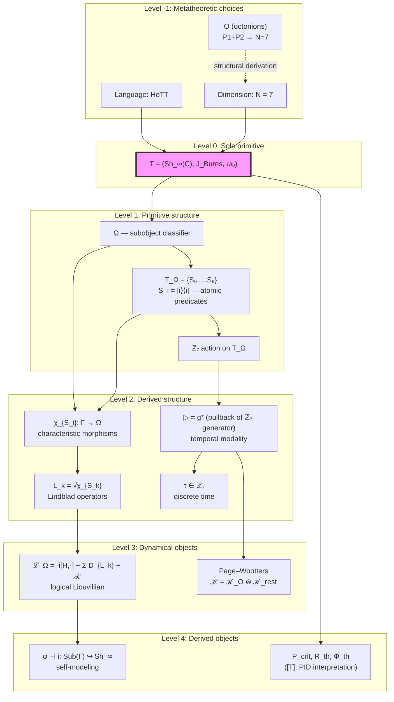
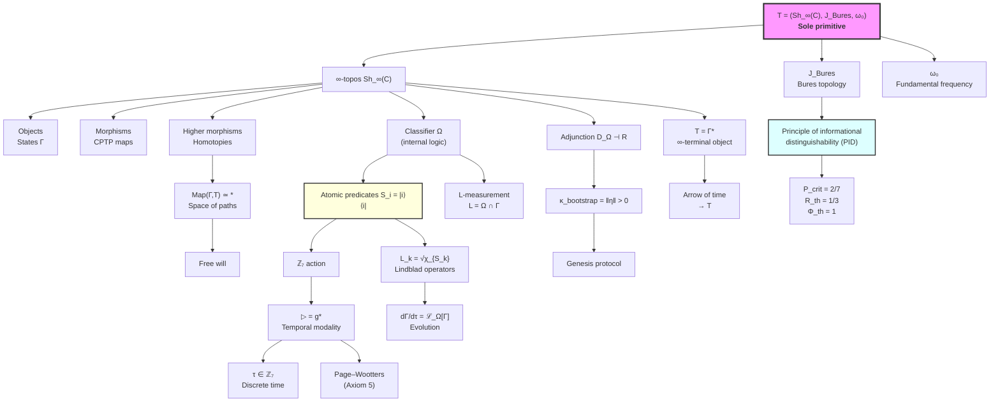

# Axiom Ω⁷

:::info Audience
This chapter presents the **axiomatic core** of the theory: five axioms from which everything else follows—space, time, dynamics, consciousness thresholds, and even gravitation.

**Central claim.** UHM asserts that reality is described by an $\infty$-topos of sheaves on a chosen site, and that this $\infty$-topos is the **sole primitive** of the theory. Whatever exists is an object or a morphism in this topos. There is nothing “beyond” it.

**What is an $\infty$-topos, informally?** Picture a “world” in which objects are related not only by arrows (as cities by roads), but by an infinite hierarchy of relations: arrows between arrows, arrows between those, and so on. The ordinary world is a “flat map”: either there is a road from city A to city B or there is not. An $\infty$-topos is a “volumetric map” in which every route has variants, those variants have further variants, ad infinitum. That infinite depth of relations is needed to describe quantum states (everything coupled to everything) and consciousness (a system observing itself, observing observation, and so on).

**Chapter structure.** We first state five axioms explicitly (“Honest Axiomatics”), then show how they determine the sole primitive—the triple $\mathfrak{T} = (\mathbf{Sh}_\infty(\mathcal{C}), J_{Bures}, \omega_0)$. We then derive the subobject classifier $\Omega$ (source of logic, Lindblad operators, and time), internal logic, and the main consequences of the theory.

**Why five axioms?** Fewer are insufficient: without the $\infty$-topos there is no logic; without Bures there is no distinguishability; without $N=7$ there is no octonionic algebra; without $\omega_0$ there is no link to physical time; without the tensor decomposition (Page–Wootters) there are no internal clocks. Nor is more needed—all theorems follow from these five.
:::

## Honest Axiomatics {#аксиоматика}

:::warning Methodological note
UHM is built on **explicit axiomatics**. Postulates are classified as:
- **Axioms** — accepted without proof
- **Definitions** — constructions from axioms
- **Theorems** — provable consequences

This ensures mathematical honesty and avoids hidden assumptions.
:::

### Levels of axiomatics

**LEVEL −1: METATHEORETIC CHOICES** (not justified internally)
- **Language:** ∞-categories / HoTT (homotopy type theory)
- **Logic:** intuitionistic (internal language of the topos)

**LEVEL 0: AXIOMS** (postulated explicitly)

| Axiom | Statement | Rationale |
|---------|--------------|-------------|
| **Axiom 1 (Structure)** | Reality is the ∞-topos $\mathbf{Sh}_\infty(\mathcal{C})$ over the category of density matrices $\mathcal{D}(\mathbb{C}^N)$ | ∞-topoi are the most general “spaces” with internal logic |
| **Axiom 2 (Metric)** | The Grothendieck topology $J$ is induced by the Bures metric $d_B$ | **Petz classification:** Bures is the *minimal* monotone Riemannian metric on $\mathcal{D}(\mathcal{H})$ (unique in the classical case by Chentsov; minimal among infinitely many in the quantum case) |
| **Axiom 3 (Dimension)** | $N = 7$ is the dimension of the base Hilbert space | Characterizes the class of systems under study (holons) |
| **Axiom 4 (Scale)** | $\omega_0 = \lambda_{\min}(H_{\text{eff}}) > 0$ — the minimal nonzero eigenvalue of the effective Hamiltonian | Derived spectral property: $\omega_0 > 0$ for any viable system ($\omega_0 = 0 \Rightarrow$ no dynamics $\Rightarrow P < P_{\text{crit}}$). Different holons have different $\omega_0$, like different atoms have different masses. See [T-186, Cohesive Closure §5.4](/docs/proofs/categorical/cohesive-closure) |

:::warning Count of independent axioms: zero (T-190 Axiomatic Closure)
Theorem T-87 [T] shows that A5 (Page–Wootters) is derivable from A1–A4. Theorems T-186, T-187, and the Hurwitz–Adams–Fano chain derive A1–A4 themselves. **T-190 [T] (Axiomatic Closure)** completes the circle: all five axioms A1–A5 are theorems derivable from five characterising properties of viable holons — (AP) autopoiesis, (PH) phenomenal identification, (QG) quantum-gravitational consistency, (V) viability, and (MaxEnt) maximum entropy. UHM has **zero** independent axioms beyond these defining properties. The A1–A5 labeling remains for pedagogy but every “axiom” has the status of a **theorem**.
:::

:::info Status of $N = 7$ (two-track justification)
The dimension $N = 7$ is a **fundamental axiom** (Axiom 3) with two independent lines of support:

| Track | Justification | Status |
|------|-------------|--------|
| **A** | [Theorem S](./axiom-septicity#теорема-s-семимерность--следствие-из-аксиомы): (AP)+(PH)+(QG) → N ≥ 7 | [T] Proved |
| **B** | [Structural derivation](../../proofs/minimality/theorem-octonionic-derivation): P1+P2 → $\mathbb{O}$ → $\dim \mathrm{Im}(\mathbb{O})$ = 7 | [T] Mathematically rigorous |

The bridge (AP)+(PH)+(QG) → P1+P2 is the [full chain T1–T15 [T]](../../proofs/minimality/theorem-octonionic-derivation#мост).
:::

**LEVEL 1: DEFINITIONS** (built from axioms)
- $\Omega$ — subobject classifier (exists by Giraud’s theorem); full structure: $\Omega = \mathcal{O}(\mathcal{C}, d_B)$
- $S_i := |i\rangle\langle i|$ — canonical atomic predicates (basis projectors generating the [decidable fragment](#решающий-фрагмент) $\mathrm{Dec}(\Omega)$)
- $\triangleright: S_i \mapsto S_{(i+1) \mod 7}$ — cyclic shift (algebraic structure)
- $L_k := P_k = |k\rangle\langle k|$ — Lindblad operators (operator realizations of the characteristic morphisms $\chi_{S_k}$; [derivation](#lk-из-omega))

**LEVEL 2: CONSEQUENCES** (provable or argued)
- $P_{crit} = 2/7$ **[T]** ([critical purity](/docs/core/dynamics/viability#критическая-чистота))
- $R_{th} = 1/3$ **[T]** ([reflection threshold](/docs/core/foundations/axiom-septicity#теорема-порог-рефлексии), $K=3$ from [triadic decomposition](/docs/core/operators/lindblad-operators#триадная-декомпозиция) plus Bayesian dominance)
- $\Phi_{th} = 1$ **[T]** ([integration threshold](/docs/core/foundations/axiom-septicity#теорема-порог-интеграции), [T-129](/docs/proofs/consciousness/operationalization#t-129))
- $\kappa_{\text{bootstrap}} > 0$ **[T]** (minimal regeneration from the adjunction)
- **PID** (Principle of Informational Distinguishability) — **definition [O]** (T16 [T]): given earnest acceptance of A1 (∞-topos) and A2 ($J_{\text{Bures}}$), PID is tautological—distinguishability via $J_{\text{Bures}}$-coverings coincides with ontological distinguishability ([below](#пир-как-теорема))

---

## Structured primitive {#примитив}

:::info Sole primitive
The **topos with geometry** $\mathfrak{T} := (\mathbf{Sh}_\infty(\mathcal{C}), J_{Bures}, \omega_0)$ is the **structured primitive** of UHM.

It is a triple of components forming an irreducible unity (as $\mathbb{R}^4$ is one object, not four separate numbers):
- $\mathbf{Sh}_\infty(\mathcal{C})$ — sheaf ∞-topos (Axiom 1)
- $J_{Bures}$ — Grothendieck topology (Axiom 2)
- $\omega_0$ — fundamental frequency (Axiom 4)

From this primitive one **derives**:
- State space (objects of the ∞-topos)
- Dynamics (morphisms at all levels)
- Base space $X = |N(\mathcal{C})|$ (nerve of the category)
- Time $\tau$ (internal modality via the $\mathbb{Z}_N$ action)
- Metric $d_{\text{strat}}$ (spectral geometry)
- **Free will** (multiplicity of paths in $\mathrm{Map}(\Gamma, T)$)
- Thresholds $P_{\text{crit}}$, $R_{\text{th}}$, $\Phi_{\text{th}}$ (from the principle of informational distinguishability—which itself follows from $J_{Bures}$)

**Theory parameters:**
- $N = 7$ — dimension (Axiom 3)
- $\omega_0$ — fundamental frequency (Axiom 4)
:::

:::info Invariance of dimensionless predictions
Dimensionless predictions ($R$, $\Phi$, $P_{\text{crit}}$, $\mathrm{Coh}_E$, Gap profile) **do not depend** on the absolute scale $\omega_0$: under $\omega_0 \to \lambda\omega_0$ all dimensionless quantities are unchanged. The parameter $\omega_0$ controls only the map to dimensional physics (masses, energies, lengths).
:::

---

## ∞-categorical structure {#infty-структура}

### Why ∞-categories?

:::note Analogy: routes in the mountains
Two hikers go from village A to village B. One crosses a pass, the other follows a valley. In ordinary mathematics (a 1-category) we say: “both arrived; the routes differ; done.” In an $\infty$-category we ask: *can one route be smoothly deformed into the other?* If a mountain lies between them, no; if the terrain is open, yes. The answer encodes the *geometry* of the space. Between deformations there are “deformations of deformations” (3-morphisms), and so on. The full hierarchy is not redundant ornament: it encodes quantum phases, gauge equivalences, and levels of self-observation.
:::

In an ordinary (1-)category morphisms are either equal or not. In an ∞-category there are 2-morphisms (homotopies) between morphisms, 3-morphisms between those, and so on.

**Key consequence:** The terminal object $T$ admits **many equivalent paths** to it, which resolves the problem of teleological determinism.

### Source of nontrivial homotopy {#источник-гомотопии}

:::warning Contractibility of base space
The space $\mathcal{D}(\mathbb{C}^7)$ is **contractible** as a topological space (a convex subset of a vector space), hence $\pi_k(\mathcal{D}(\mathbb{C}^7)) = 0$ for all $k \geq 1$. Nontrivial ∞-structure **does not** arise from the base space alone, but from three sources:

**1. Stratification by spectral type.** The space $\mathcal{D}(\mathbb{C}^7)$ stratifies naturally by eigenvalue degeneracy type:
$$\mathcal{D}(\mathbb{C}^7) = \bigsqcup_{\lambda \vdash 7} \mathcal{S}_\lambda$$
where $\mathcal{S}_\lambda$ is the stratum of matrices of spectrum type $\lambda$ (a partition of 7). Lower-dimensional strata (degenerate spectra) are **singularities** around which sheaves may have nontrivial monodromy.

**2. Loops of CPTP maps.** The space $\mathrm{CPTP}(\mathbb{C}^7)$ is **not** contractible—it contains nontrivial loops (closed paths in unitary transformations $\mathrm{U}(7) \subset \mathrm{CPTP}$). The fundamental group $\pi_1(\mathrm{CPTP}(\mathbb{C}^7)) \neq 0$ yields nontrivial local systems on $\mathcal{D}(\mathbb{C}^7)$.

**3. Sheaves with nontrivial sections.** Concrete sheaves in UHM (e.g. the self-modeling sheaf $\Gamma \mapsto \varphi(\Gamma)$) may have nontrivial cohomology even over a contractible base. The link to interiority levels L0–L4 goes through **$n$-truncation of sheaves**, not through homotopy of the base.
:::

### Definition of the UHM ∞-topos

**Definition (UHM ∞-topos):**

$$
\mathbf{Sh}_\infty(\mathcal{C}) := \text{Fun}(\mathcal{C}^{op}, \mathbf{Spaces})^{loc}
$$

—the category of locally constant ∞-functors from $\mathcal{C}^{\mathrm{op}}$ to the category of spaces (∞-groupoids).

:::info Remark (∞-topos vs. 1-topos: absence of pullbacks and representability gap)
Unlike 1-categorical Grothendieck topoi, where $\mathcal{C}$ must have finite limits (in particular pullbacks) to define intersection of covers, the ∞-categorical construction $\text{Fun}(\mathcal{C}^{op}, \mathbf{Spaces})^{loc}$ **does not require** pullbacks in $\mathcal{C}$ (Lurie, HTT, Prop. 6.2.2.7). The sheaf category $\mathbf{Sh}_\infty(\mathcal{C})$ has all (∞,1)-limits and colimits even if $\mathcal{C}$ does not. It suffices to specify a Grothendieck topology (covers) on $\mathcal{C}$.

**Representability gap and its resolution.** Limits in $\mathbf{Sh}_\infty(\mathcal{C})$ are abstract topos objects, not necessarily realizable as concrete density matrices $\Gamma \in \mathcal{C}$. This is **not a defect but an architectural decision** of UHM:

1. **Axiom Ω⁷ postulates the ∞-topos as primitive**, not $\mathcal{C}$. Physical states are objects of $\mathbf{Sh}_\infty(\mathcal{C})$, not $\mathcal{C}$.
2. **Analogy with AG**: global sections of a sheaf on a scheme X need not be "functions on X" — they live in the **sheaf category**, which is strictly richer. Similarly: composite quantum states are topos objects, not C objects.
3. **Sieve stability** via CPTP-contractivity of the Bures metric is defined through **composition of morphisms** (always defined), not through pullbacks of objects. This is the standard method for defining Grothendieck topologies (cf. étale, fppf topology in AG).
4. **Entanglement via Day convolution.** The tensor product of quantum states $\otimes$ is **not** the Cartesian product $\times$ in the topos (Abramsky-Coecke theorem: CPTP category is non-Cartesian monoidal). The correct monoidal structure on $\mathbf{Sh}_\infty(\mathcal{C})$ is given by **Day convolution** (Day 1970):
   
   $$(\mathcal{F} \otimes_{\text{Day}} \mathcal{G})(\rho) = \int^{\rho_1, \rho_2} \mathcal{F}(\rho_1) \times \mathcal{G}(\rho_2) \times \mathcal{C}(\rho_1 \otimes \rho_2, \rho)$$
   
   Day convolution lifts the monoidal structure $\otimes$ from the base category $\mathcal{C}$ to the sheaf category, preserving **non-Cartesianness** and hence **entanglement**. The Bures metric $d_B(\rho_{AB}, \rho_A \otimes \rho_B) > 0 \Leftrightarrow \rho_{AB}$ is entangled (Uhlmann 1976) — distinguishes entangled and factorized states at the topological level.

5. **Extracting observables.** Computing $\mathrm{Tr}(\Gamma \cdot A)$ — via global sections of the geometric morphism $\mathbf{Sh}_\infty(\mathcal{C}) \to \mathbf{Spaces}$. For representable objects $\iota(\Gamma) \in \mathbf{Sh}_\infty(\mathcal{C})$ — coincides with the standard quantum-mechanical trace.
:::

:::info Smallness of the site
The category $\mathcal{C} = \mathcal{D}(\mathbb{C}^7)$ with CPTP morphisms is not small (hom-sets may be infinite-dimensional). For HTT Prop. 6.2.2.7 one fixes a **skeleton**: the category $\mathrm{Sk}(\mathcal{C})$ of spectral types, parameterized by the standard simplex $\Delta^6 = \{(\lambda_1, \ldots, \lambda_7) : \lambda_i \geq 0, \sum \lambda_i = 1\}$ with ordered $\lambda_1 \geq \cdots \geq \lambda_7$. This category is **essentially small**, and $\mathbf{Sh}_\infty(\mathrm{Sk}(\mathcal{C}), J_{Bures}) \simeq \mathbf{Sh}_\infty(\mathcal{C}, J_{Bures})$ as ∞-topoi.
:::

### Grothendieck topology on $\mathcal{C}$ {#топология-гротендика}

:::info Explicit coverings
To define “sheaf” (and hence the ∞-topos) one must fix a **Grothendieck topology**—families of morphisms that constitute covers.
:::

**Definition (site $\mathcal{C}$):**

The pair $(\mathcal{C}, J_{Bures})$ is a **site**, where $J_{Bures}$ is the coverage function determined from the Bures metric.

**Definition (Bures metric):**

For density matrices $\Gamma_1, \Gamma_2 \in \mathcal{C}$:

$$
d_B(\Gamma_1, \Gamma_2) := \sqrt{2\left(1 - \sqrt{F(\Gamma_1, \Gamma_2)}\right)}
$$

where $F(\Gamma_1, \Gamma_2) = \left(\mathrm{Tr}\sqrt{\sqrt{\Gamma_1}\Gamma_2\sqrt{\Gamma_1}}\right)^2$ is the (Uhlmann) fidelity.

:::info Two forms of the Bures metric
We use the **chordal** form: $d_B^{\text{chord}} = \sqrt{2(1-\sqrt{F})}$. Geometric theorems ([emergent time](/docs/proofs/dynamics/emergent-time#41-метрика-бурес)) use the **angular** form: $d_B^{\text{angle}} = \arccos(\sqrt{F})$. The two are equivalent: $d_B^{\text{chord}} = \sqrt{2(1 - \cos(d_B^{\text{angle}}))}$. See [Notation](/docs/reference/notation#топология-гротендика).
:::

**Definition (Bures cover):**

A family of morphisms $\{\Phi_i: \Gamma_i \to \Gamma\}_{i \in I}$ **covers** $\Gamma$ if:

$$
\forall \epsilon > 0, \exists \delta > 0: \quad B_B(\Gamma, \delta) \subseteq \bigcup_{i \in I} \Phi_i(B_B(\Gamma_i, \epsilon))
$$

where $B_B(\Gamma, r) = \{\Sigma \in \mathcal{C} : d_B(\Gamma, \Sigma) < r\}$ is the open Bures ball.

**Theorem (site axioms):**

The topology $J_{Bures}$ satisfies Grothendieck’s axioms:

1. **(Identity)** $\{\mathrm{id}: \Gamma \to \Gamma\}$ covers $\Gamma$
2. **(Stability)** If $\{U_i \to X\}$ covers $X$ and $f: Y \to X$, then $\{f^*(U_i) \to Y\}$ covers $Y$
3. **(Transitivity)** Composition of covers is a cover

#### Proof of stability of covers {#доказательство-стабильности}

:::warning Theorem (stability of $J_{Bures}$) [T]
If $\{\Phi_i: \Gamma_i \to \Gamma\}_{i \in I}$ is a $J_{Bures}$-cover of $\Gamma$ and $f: \Sigma \to \Gamma$ is a morphism in $\mathcal{C}$ (CPTP channel), then the sieve $f^*(S)$ covers $\Sigma$.
:::

**Proof:**

1. By definition of cover: $\forall\varepsilon > 0,\;\exists\delta > 0$: $B_B(\Gamma,\delta) \subseteq \bigcup_i \Phi_i(B_B(\Gamma_i,\varepsilon))$
2. $f$ CPTP $\Longrightarrow$ $f$ is Bures contractive (Chentsov–Petz): $d_B(f(\rho), f(\sigma)) \leq d_B(\rho, \sigma)$
3. For any $\Sigma'$ with $d_B(\Sigma', \Sigma) < \delta$: $d_B(f(\Sigma'), f(\Sigma)) \leq d_B(\Sigma', \Sigma) < \delta$
4. Since $f(\Sigma) = \Gamma$: $f(\Sigma') \in B_B(\Gamma, \delta)$
5. By (1): $f(\Sigma') \in \Phi_j(B_B(\Gamma_j, \varepsilon))$ for some $j$
6. Hence $\Sigma' \to \Sigma \xrightarrow{f} \Gamma$ factors through $\Phi_j$, i.e. lies in the sieve $f^*(S)$
7. For all $\Sigma'$ in $B_B(\Sigma, \delta)$ $\Longrightarrow$ $f^*(S)$ covers $\Sigma$ $\quad\blacksquare$

**Key point:** **CPTP-contractivity** of any Petz-admissible metric (a property shared by the whole Petz family, with Bures as its distinguished minimum — see [T-187](/docs/proofs/categorical/cohesive-closure#53-closing-the-last-open-question-why-bures-t-187)) forces **stability** of covers. The pair (identity + stability) constitutes a Grothendieck **coverage** (Johnstone, *Elephant* C2.1.1); the full Grothendieck topology $J_{Bures}$ is then the topology **generated** by this coverage (Elephant C2.1.10), and **transitivity** of $J_{Bures}$ is automatic from the generation — it does not require a direct ε-δ argument.

**Corollary (meaning of “loc”):**

The superscript “loc” in $\mathbf{Sh}_\infty(\mathcal{C})^{loc}$ means localization at $J_{Bures}$-covers: $F$ is a sheaf if for every covering sieve $S \to X$,

$$
F(X) \xrightarrow{\sim} \lim_{\{U \to X\} \in S} F(U)
$$

**Physical reading:**

- **Cover** $\approx$ family of measurements that “resolve” the state
- **Gluing** $\approx$ categorical formalization of quantum coherence
- The Bures metric is **monotone** under CPTP: $d_B(\Phi(\rho), \Phi(\sigma)) \leq d_B(\rho, \sigma)$

### Structure of the ∞-topos

**Theorem (Lurie):**

The ∞-topos $\mathbf{Sh}_\infty(\mathcal{C})$ has:

1. **Internal logic:** homotopy type theory (HoTT)
2. **Subobject classifier:** $\Omega \in \mathbf{Sh}_\infty(\mathcal{C})$
3. **Limits and colimits:** all (∞,1)-limits exist
4. **Exponentials:** for $F$, $G$ there is $[F,G]$

### Relation to the interiority hierarchy {#связь-с-интериорностью}

:::info $n$-truncation and consciousness levels
The ∞-groupoid $\mathbf{Exp}_\infty$ (experiential space) relates to the [interiority hierarchy](/docs/proofs/consciousness/interiority-hierarchy) via $n$-truncation.
:::

**Homotopical classification [I]:**

Levels L0→L4 correspond to $n$-truncations of the ∞-groupoid $\mathbf{Exp}_\infty$:

| Level | $n$-truncation | Homotopy groups | Categorical reading |
|---------|------------|----------------------|--------------------------|
| L0 | $\tau_{\leq 0}$ | $\pi_0 \neq 0$ | Discrete set of states |
| L1 | $\tau_{\leq 1}$ | $\pi_1 \neq 0$ | Groupoid (phenomenal paths) |
| L2 | $\tau_{\leq 2}$ | $\pi_2 \neq 0$ | Bicategory (reflection) |
| L3 | $\tau_{\leq 3}$ | $\pi_3 \neq 0$ | Tricategory (meta-reflection) |
| L4 | $\tau_{\leq \infty}$ | all $\pi_k$ | Full ∞-structure |

Details: [Categorical formalism §10.6](/docs/proofs/categorical/categorical-formalism#связь-с-иерархией-интериорности).

**Corollary (finiteness of the hierarchy):**

L4 is maximal (Postnikov stabilization). There is no L5, L6, …

---

## Internal logic $\Omega$ {#внутренняя-логика}

:::warning Central theorem: L-unification [T]
The subobject classifier $\Omega \in \mathbf{Sh}_\infty(\mathcal{C})$ is the **single source** of:
- [L-dimension (logic)](../structure/dimension-l) — as $L = \Omega \cap \Gamma$
- Lindblad operators $L_k$ — as operator realizations of characteristic morphisms of [atomic predicates](#атомы-классификатора) of $\Omega$ ([derivation](#lk-из-omega))
- Time $\tau$ — via the temporal modality $\triangleright$

L-unification works in the [decidable fragment](#решающий-фрагмент) $\mathrm{Dec}(\Omega) \cong 2^7$ of the full classifier $\Omega = \mathcal{O}(\mathcal{C}, d_B)$. Basis completeness ($\sum_k S_k = \mathbb{1}_7$) closes the derivation of $L_k$ and ensures CPTP compatibility.
:::

### Subobject classifier $\Omega$

**Definition (classifier):**

For any object $X \in \mathbf{Sh}_\infty(\mathcal{C})$ there is a bijection:

$$
\text{Sub}(X) \simeq \text{Map}(X, \Omega)
$$

Subobjects of $X$ correspond to morphisms into $\Omega$—“logical predicates” on $X$.

**For density matrices:**

$$
\Omega_{UHM} := \text{Spec}(\mathcal{A}_L)
$$

where $\mathcal{A}_L$ is the C*-algebra of logical predicates on state space.

### Characteristic morphisms and $L_k$

**Definition (characteristic morphism):**

For a subobject $S \hookrightarrow \Gamma$, its characteristic morphism is

$$
\chi_S: \Gamma \to \Omega
$$

encoding the state’s “degree of membership” in the logically admissible subspace $S$.

### Canonical atomic predicates of the classifier {#атомы-классификатора}

:::warning Theorem (canonical atomic predicates of the 7D system) [T]
For the base category $\mathcal{C} = \mathcal{D}(\mathbb{C}^7)$ with the Bures topology, the classifier $\Omega = \mathcal{O}(\mathcal{C}, d_B)$ admits a canonical system of seven **atomic predicates**:

$$
\mathcal{T}_\Omega = \{S_0, S_1, \ldots, S_6\}
$$

each predicate being a projector onto a basis vector:

$$
S_i = |i\rangle\langle i|, \quad i \in \{A, S, D, L, E, O, U\}
$$
:::

#### Theorem (decidable fragment of the classifier) [T] {#решающий-фрагмент}

:::info
The full subobject classifier $\Omega = \mathcal{O}(\mathcal{C}, d_B)$ is the lattice of opens in the Bures topology (infinite; see [categorical formalism](/docs/proofs/categorical/categorical-formalism#l-унификация)). In $\mathbf{Sh}_\infty(\mathcal{C})$ its logical structure has three tiers:

| Tier | Structure | Description |
|---------|-----------|----------|
| **∞-level** | HoTT | Full $\Omega$ with temporal modality $\triangleright$ |
| **1-truncation** | Heyting algebra $\tau_{\leq 0}(\Omega)$ | Intuitionistic logic (standard) |
| **Decidable fragment** | $\mathrm{Dec}(\Omega) \cong 2^7$ | Boolean subalgebra of atomic predicates |

The seven projectors $S_k$ generate the **decidable fragment** $\mathrm{Dec}(\Omega)$—the maximal Boolean subalgebra of the classifier aligned with the orthogonal basis of $\mathbb{C}^7$:

$$
\mathrm{Dec}(\Omega) := \left\langle S_0, \ldots, S_6 \mid S_i \wedge S_j = \delta_{ij} S_i,\; \bigvee_k S_k = \top \right\rangle \cong 2^7
$$

**L-unification** operates inside $\mathrm{Dec}(\Omega)$: the characteristic morphisms $\chi_{S_k}(\Gamma) = \gamma_{kk}$ and the induced operators $L_k$ (below) are defined on the decidable fragment. Basis completeness ($\sum_k S_k = \mathbb{1}_7$) ensures that $\mathrm{Dec}(\Omega)$ is **closed** under the $L_k$ derivation and CPTP compatibility.

The full HoTT structure of $\Omega$ (beyond $\mathrm{Dec}(\Omega)$) is strictly necessary: [Theorem T-182](#необходимость-трёхуровневой-структуры) proves that each of the three tiers contains theorems **unprovable** at the preceding tier.
:::

#### Theorem (Necessity of the three-tier structure of Ω) [T] {#необходимость-трёхуровневой-структуры}

:::warning Theorem T-182 [T]: Each tier of Ω is strictly necessary — none reduces to its predecessor
Let $\mathcal{T}_k$ be the class of UHM theorems provable at the $k$-th tier of the classifier. Then:

$$\mathcal{T}_0 \subsetneq \mathcal{T}_1 \subsetneq \mathcal{T}_2$$

where $\mathcal{T}_0$ consists of theorems from $\mathrm{Dec}(\Omega) \cong 2^7$, $\mathcal{T}_1$ from $\tau_{\leq 0}(\Omega)$ (Heyting algebra), $\mathcal{T}_2$ from the full $\Omega$ (∞-groupoid).
:::

**Proof.**

**Part I: $\mathcal{T}_0 \subsetneq \mathcal{T}_1$ — threshold predicates require the Heyting algebra.**

**Step I.1 (Viability predicate is an open set in $J_{Bures}$).** Define the viability predicate:

$$\mathcal{V} := \{\Gamma \in \mathcal{C} : P(\Gamma) > 2/7\} = P^{-1}\!\big((2/7,\; 1]\big)$$

The purity function $P: \mathcal{D}(\mathbb{C}^7) \to [1/7, 1]$, $P(\Gamma) = \mathrm{Tr}(\Gamma^2)$, is continuous in the Bures topology (since $|P(\Gamma_1) - P(\Gamma_2)| \leq 2\,d_B(\Gamma_1, \Gamma_2)$ for $\|\Gamma_i\|_{\mathrm{op}} \leq 1$). The preimage of an open interval under a continuous map is open. Therefore $\mathcal{V} \in \Omega = \mathcal{O}(\mathcal{C}, d_B)$.

**Step I.2 ($\mathcal{V} \notin \mathrm{Dec}(\Omega)$ — formal proof).** Elements of $\mathrm{Dec}(\Omega) \cong 2^7$ are finite unions of atomic predicates $S_k = |k\rangle\langle k|$: sets of the form $\mathcal{U}_J = \{\Gamma : \gamma_{kk} > 0 \text{ for } k \in J\}$ for subsets $J \subseteq \{0,\ldots,6\}$. Every such $\mathcal{U}_J$ depends only on the **diagonal** entries $\gamma_{kk}$.

But purity $P = \sum_i \gamma_{ii}^2 + 2\sum_{i<j}|\gamma_{ij}|^2$ depends on the **coherences** $\gamma_{ij}$ ($i \neq j$). Concrete counterexample: take two matrices $\Gamma_1$, $\Gamma_2$ with **identical** diagonals $\gamma_{kk} = 1/7$ for all $k$, but:
- $\Gamma_1 = I/7$ (all coherences zero): $P(\Gamma_1) = 1/7 < 2/7$ → $\Gamma_1 \notin \mathcal{V}$
- $\Gamma_2 = (1-\lambda)I/7 + \lambda|\psi\rangle\langle\psi|$ with $\lambda \approx 0.3$: $P(\Gamma_2) \approx 0.31 > 2/7$ → $\Gamma_2 \in \mathcal{V}$

Since $\Gamma_1$ and $\Gamma_2$ are indistinguishable by any predicate in $\mathrm{Dec}(\Omega)$ (identical $\gamma_{kk}$), but differ with respect to $\mathcal{V}$, we conclude $\mathcal{V} \notin \mathrm{Dec}(\Omega)$. $\square_{I.2}$

**Step I.3 (Heyting connectives for the consciousness criterion).** The consciousness criterion $\mathcal{C}_{L2}$ is an intersection:

$$\mathcal{C}_{L2} = \underbrace{\{P > 2/7\}}_{\text{open}} \cap \underbrace{\{R \geq 1/3\}}_{\text{closed}} \cap \underbrace{\{\Phi \geq 1\}}_{\text{closed}} \cap \underbrace{\{D_{\mathrm{diff}} \geq 2\}}_{\text{closed}}$$

In the Heyting algebra $\tau_{\leq 0}(\Omega)$, the intersection of an open and a closed set is a **regular open** set $\mathrm{int}(\mathrm{cl}(\mathcal{C}_{L2}))$, where $\mathrm{int}$ and $\mathrm{cl}$ are the interior and closure operators in $J_{Bures}$. The Heyting implication:

$$(\mathcal{V} \Rightarrow \mathcal{C}_{L2}) := \mathrm{int}\!\big(\mathcal{V}^c \cup \mathcal{C}_{L2}\big)$$

is computed via the Bures-topology interior operator. In the Boolean algebra $2^7$ there is no such operator — it is **discrete** (every subset is both open and closed), so $\mathrm{int} = \mathrm{id}$ and the implication trivialises to $\neg\mathcal{V} \vee \mathcal{C}_{L2}$. The nontrivial content of the implication (which states are **borderline** between viability and consciousness) is lost.

**Concrete example.** Consider a boundary state $\Gamma^*$ with $P = 2/7 + \epsilon$, $R = 1/3 - \delta$. In Heyting logic the predicate $\mathcal{V} \Rightarrow (R \geq 1/3)$ evaluates as "false in a neighbourhood of $\Gamma^*$" — the system is viable but not reflexive. In $2^7$ this subtlety is inexpressible. $\square$

---

**Part II: $\mathcal{T}_1 \subsetneq \mathcal{T}_2$ — consciousness and dynamics require the full ∞-topos.**

**(a) Experiential sheaf $\mathbf{Exp}_\infty$ — detailed construction.**

**Definition (Experiential space).** For each state $\Gamma \in \mathcal{D}(\mathbb{C}^7)$ define the space of experiential states:

$$E(\Gamma) := \left\{(\mathrm{Spec}(\rho_E),\; Q,\; \mathrm{Context}) \;\middle|\; \rho_E = \text{E-component of }\Gamma,\; Q \in \mathbb{CP}^{d_E - 1}\right\}$$

where $Q$ is a quale (point on the projective space of qualitative states), $\mathrm{Context} = \Gamma_{-E}$ is the context (all dimensions except $E$).

**Singular complex construction.** The space $E(\Gamma)$ is metrisable (via the Fubini–Study metric on $\mathbb{CP}^{d_E - 1}$). By Milnor's theorem, its singular complex $\mathrm{Sing}(E(\Gamma))$ is a Kan complex, i.e. an ∞-groupoid:

$$\mathbf{Exp}_\infty(\Gamma) := \mathrm{Sing}(E(\Gamma))$$

**Homotopy groups and interiority levels:**

| Group | Geometric meaning | Interiority connection |
|-------|-------------------|------------------------|
| $\pi_0(\mathbf{Exp}_\infty(\Gamma))$ | Connected components of $E(\Gamma)$ | L0: **how many** distinguishable experiential states |
| $\pi_1(\mathbf{Exp}_\infty(\Gamma))$ | Loops in $E(\Gamma)$ | L1: **paths** between qualia (phenomenal geometry) |
| $\pi_2(\mathbf{Exp}_\infty(\Gamma))$ | Spheres in $E(\Gamma)$ | L2: **deformations of paths** (reflection — observing one's own observation) |
| $\pi_3(\mathbf{Exp}_\infty(\Gamma))$ | 3-spheres in $E(\Gamma)$ | L3: **meta-reflection** (observing observation of observation) |

**Why $\pi_2 \neq 0$ is necessary for L2.** Reflection — the ability to "observe one's own observation" — is formalised as a 2-morphism:

$$\alpha: \underbrace{\varphi}_{\text{observation}} \Rightarrow \underbrace{\varphi \circ \varphi}_{\text{observation of observation}}$$

In a 1-category (or $\tau_{\leq 0}(\Omega)$) there are no 2-morphisms between morphisms: $\varphi$ and $\varphi \circ \varphi$ are either equal or not. In an ∞-category the 2-morphism $\alpha$ is a **substantive structure** encoding *how exactly* reflection deforms self-observation. This is an element of $\pi_2(\mathbf{Exp}_\infty)$.

In the Heyting algebra $\tau_{\leq 0}(\Omega)$, all $\pi_k = 0$ for $k \geq 1$ **by definition of 0-truncation**. Therefore L2 consciousness is inexpressible. $\square_a$

**(b) Postnikov tower and SAD\_MAX = 3 — full derivation.**

The Postnikov tower is the canonical filtration of an ∞-groupoid by "homotopical complexity":

$$\mathbf{Exp}_\infty \xrightarrow{q_3} \tau_{\leq 3}(\mathbf{Exp}_\infty) \xrightarrow{q_2} \tau_{\leq 2}(\mathbf{Exp}_\infty) \xrightarrow{q_1} \tau_{\leq 1}(\mathbf{Exp}_\infty) \xrightarrow{q_0} \tau_{\leq 0}(\mathbf{Exp}_\infty)$$

Each projection $q_n$ "kills" all homotopy groups $\pi_k$ for $k > n$.

**Contraction mechanism.** The self-modelling operator $\varphi$ on each storey induces $\varphi^{(n)}: \tau_{\leq n}(\mathbf{Exp}_\infty) \to \tau_{\leq n}(\mathbf{Exp}_\infty)$. The Fano channel $\mathcal{P}_{\mathrm{Fano}}$ contracts coherences by a factor of $1/3$ (T2.1 [T]): $|\gamma_{ij}^{\text{after}}| = \frac{1}{3}|\gamma_{ij}^{\text{before}}|$. The contraction acts on the purity of the $n$-th level of reflection:

$$R^{(n)} = R^{(0)} \cdot \left(\frac{1}{3}\right)^n$$

where $R^{(0)}$ is the base reflection. The threshold for SAD $\geq n$ is $R^{(n-1)} > 1/(n+1)$.

**Explicit computation of thresholds:**

| SAD level | Required purity $P_{\mathrm{crit}}^{(n)}$ | Numerical value | Achievable? |
|:---------:|:-----------------------------------------:|:---------------:|:-----------:|
| $\geq 1$ | $P_{\mathrm{crit}}^{(1)} = 1/7$ | $0.143$ | ✓ |
| $\geq 2$ | $P_{\mathrm{crit}}^{(2)} = 2/7$ | $0.286$ | ✓ |
| $\geq 3$ | $P_{\mathrm{crit}}^{(3)} = 2/7 \cdot 3/(3+1) = 9/14$ | $0.643$ | ✓ (humans) |
| $\geq 4$ | $P_{\mathrm{crit}}^{(4)} = 2/7 \cdot 9/(4+1) = 54/35$ | $\mathbf{1.543}$ | **✗** ($P \leq 1$) |

At $n = 4$: $P_{\mathrm{crit}}^{(4)} = 54/35 > 1$, impossible for normalised matrices ($\mathrm{Tr}(\Gamma) = 1 \Rightarrow P \leq 1$). Therefore the 4th storey of the Postnikov tower is **unreachable** for any physical state, and SAD\_MAX = 3.

**Why a 1-topos cannot yield this result.** In the 1-topos $\mathbf{Sh}_1(\mathcal{C})$ the Postnikov tower is single-storey: $\tau_{\leq 0}(\mathbf{Exp})$ is the only truncation. The question "what is the maximal $n$ admitting $\pi_n \neq 0$?" cannot even be *posed* — there are no higher homotopies. $\square_b$

**(c) Cohomological monism $H^n = 0$ — expanded proof.**

**Statement.** For any sheaf of coefficients $\mathcal{F}$ on $\mathbf{Sh}_\infty(\mathcal{C})$:

$$H^n(|\mathcal{N}(\mathcal{C})|, \mathcal{F}) = 0 \quad \text{for all } n > 0$$

where $|\mathcal{N}(\mathcal{C})|$ is the geometric realisation of the nerve of $\mathcal{C}$.

**Step c.1 (Contractibility of the base).** The space $\mathcal{D}(\mathbb{C}^7)$ is a convex subset of $M_7(\mathbb{C})$, hence contractible: $\pi_k(\mathcal{D}(\mathbb{C}^7)) = 0$ for all $k \geq 0$. In an **ordinary** (1-categorical) topos $\mathbf{Sh}_1(\mathcal{D})$, all cohomology trivially vanishes (every sheaf on a contractible space is acyclic). The theorem is vacuous.

**Step c.2 (∞-categorical content — contractibility of Map(Γ, T)).** The vanishing $H^n = 0$ on the contractible $\mathcal{D}(\mathbb{C}^7)$ with constant coefficients is a trivial geometric fact (Poincaré lemma for a convex set). The ∞-categorical content is **not** in the vanishing itself but in the **proof of nerve contractibility** $|\mathcal{N}(\mathcal{C})| \simeq *$, which requires verifying a nontrivial condition: contractibility of morphism spaces $\mathrm{Map}(\Gamma, T)$.

**Lemma (Contractibility of Map(Γ, I/7)) [T].** For any $\Gamma \in \mathcal{D}(\mathbb{C}^7)$, the space of CPTP channels $\mathrm{Map}(\Gamma, I/7) := \{\Phi \in \mathrm{CPTP}(\mathbb{C}^7) : \Phi(\Gamma) = I/7\}$ is contractible.

*Proof.* The set of CPTP channels $\Phi$ with $\Phi(\Gamma) = I/7$ is **convex**: if $\Phi_1(\Gamma) = \Phi_2(\Gamma) = I/7$ and $\lambda \in [0,1]$, then $(\lambda\Phi_1 + (1-\lambda)\Phi_2)(\Gamma) = \lambda I/7 + (1-\lambda)I/7 = I/7$, and a convex combination of CPTP channels is a CPTP channel. A convex set is contractible (linear homotopy $h_t(\Phi) = t\Phi_0 + (1-t)\Phi$ to a fixed $\Phi_0$). $\square$

**Step c.3 (Nontriviality).** The contractibility $\mathrm{Map}(\Gamma, T) \simeq *$ is **not** a tautology from base contractibility of $\mathcal{D}(\mathbb{C}^7)$. It is an independent statement about the space of **morphisms** (CPTP channels), which **a priori** could have nontrivial topology:
- The space of **all** CPTP channels $\mathrm{CPTP}(\mathbb{C}^7)$ is convex ⇒ contractible ⇒ $\pi_1 = 0$
- But the space $\mathrm{Map}(\Gamma_1, \Gamma_2)$ for arbitrary $\Gamma_1, \Gamma_2$ **need not** be convex (the condition $\Phi(\Gamma_1) = \Gamma_2$ is nonlinear in $\Phi$)
- For $\Gamma_2 = I/7$ convexity is restored (linearity: $\Phi(\cdot) = I/7$ regardless of the form of $\Phi$)
- This is a nontrivial property of precisely the **terminal** object $T = I/7$

**Physical content.** Cohomological monism $H^n = 0$ is the categorical formalisation of the **second law of thermodynamics**: the arrow of time (direction toward $T = I/7$) is unique up to homotopy type. Infinitely many concrete trajectories from $\Gamma$ to $T$ exist, but all are **homotopically equivalent**. In a 1-category $\mathrm{Hom}(\Gamma, T)$ is a set (no topology); in the ∞-category $\mathrm{Map}(\Gamma, T) \simeq *$ is a **space** with proven contractibility, which is substantive.

:::warning Clarification: Berry phases and local systems
On the contractible space $\mathcal{D}(\mathbb{C}^7)$ **all** local systems trivialise (including those induced by $\pi_1(U(7)) = \mathbb{Z}$). Berry phases are physically observable, but they are defined on **subspaces** $\mathcal{D}^* = \mathcal{D} \setminus \Sigma$ (non-degenerate spectra), not on all of $\mathcal{D}$. The cohomology of $\mathcal{D}^*$ with local coefficients **is nonzero** — this is **not** a contradiction but a **local–global dichotomy**: globally $H^n = 0$ (monism), locally $H^n_{\mathrm{loc}} \neq 0$ (rich structure). Both sides are necessary for the completeness of the theory.
:::

$\square_c$

**(d) Day convolution — detailed construction and proof.**

**Problem.** Quantum entanglement is fundamentally incompatible with Cartesian monoidal structure. In the category of sets (or a 1-topos), the tensor product is Cartesian: $A \times B$. But for quantum states $\rho_A \otimes \rho_B \neq \rho_A \times \rho_B$ — the tensor product admits **non-separable** (entangled) states, which the Cartesian product cannot.

**Abramsky–Coecke theorem (2004) [T]:** The category of CPTP channels is a **symmetric monoidal**, but **not Cartesian** monoidal category. The no-cloning theorem ($\not\exists\; \Delta: \rho \mapsto \rho \otimes \rho$) is a consequence of non-Cartesianness.

**Day convolution construction.** Let $(\mathcal{C}, \otimes)$ be a monoidal category (CPTP with tensor product). Day convolution (Day 1970) defines a monoidal structure on the sheaf category:

$$(\mathcal{F} \otimes_{\mathrm{Day}} \mathcal{G})(\rho) := \int^{\rho_1, \rho_2 \in \mathcal{C}} \mathcal{F}(\rho_1) \times \mathcal{G}(\rho_2) \times \mathrm{Hom}_{\mathcal{C}}(\rho_1 \otimes \rho_2,\; \rho)$$

The coend $\int^{\rho_1, \rho_2}$ is the categorical analogue of an integral, defined as the universal coequaliser of an ∞-diagram (requires ∞-colimits).

**Why $\otimes_{\mathrm{Day}} \neq \times$.** The Cartesian product in a topos:

$$(\mathcal{F} \times \mathcal{G})(\rho) = \mathcal{F}(\rho) \times \mathcal{G}(\rho)$$

This does **not** use the monoidal structure $\otimes$ of the base category — it "forgets" entanglement. Day convolution, by contrast, uses $\mathrm{Hom}(\rho_1 \otimes \rho_2, \rho)$ — the space of all CPTP channels "splitting" $\rho$ into $\rho_1$ and $\rho_2$. If $\rho$ is entangled, this space is nontrivial; if $\rho$ is separable, it factorises.

**Entanglement criterion (Uhlmann 1976).** The Bures metric distinguishes:

$$d_B(\rho_{AB},\; \rho_A \otimes \rho_B) > 0 \;\Longleftrightarrow\; \rho_{AB} \text{ is entangled}$$

This distinguishability is **preserved** by Day convolution (through $\mathrm{Hom}$-spaces) and **destroyed** by the Cartesian product (which does not see correlations between $\rho_1$ and $\rho_2$). $\square_d$

---

**Corollary (Physical indispensability of the ∞-topos):**

| Tier of $\Omega$ | Physical content | Example theorems | Key construction |
|-----------|----------------------|----------------|---------------------|
| $\mathrm{Dec}(\Omega) \cong 2^7$ | **Structure:** basis, operators $L_k$, CPTP | L-unification [T], $\sum L_k^\dagger L_k = \mathbb{1}$ [T] | Atomic predicates $S_k$ |
| $\tau_{\leq 0}(\Omega)$ (Heyting) | **Thresholds:** $P > 2/7$, $R \geq 1/3$, criterion $C_{L2}$ | Critical purity [T], viability [T] | Interior operator $\mathrm{int}(\cdot)$ |
| Full $\Omega$ (∞-groupoid) | **Dynamics:** evolution, hierarchy L0–L4, entanglement | SAD\_MAX = 3 [T], $H^n = 0$ [T], Day convolution [T] | Postnikov tower, coends |

The ∞-topos $\mathbf{Sh}_\infty(\mathcal{C})$ is **not a decorative superstructure** over the finite algebra $2^7$, but the minimal categorical framework encompassing all results of UHM. $\blacksquare$

---

#### Gap as holonomy of the ∞-topos connection {#gap-голономия}

:::info Gap dynamics and the ∞-structure — expanded construction

**Definition (Gap phase space).** The 21 coherences $\gamma_{ij}$ ($i < j$) are parametrised by amplitude $|\gamma_{ij}|$ and phase $\theta_{ij} = \arg(\gamma_{ij})$. The phases live on the compact torus:

$$\mathcal{T}^{21} := (S^1)^{21} = \{(\theta_{ij})_{i < j} : \theta_{ij} \in [0, 2\pi)\}$$

**Definition (Berry connection on $\mathcal{T}^{21}$).** Under adiabatic evolution of the state $\Gamma(\lambda)$ along a parameter $\lambda$, the Berry connection is defined as:

$$A_\mu(\lambda) := \mathrm{Im}\,\mathrm{Tr}\!\left(\Gamma(\lambda)\,\frac{\partial \Gamma(\lambda)}{\partial \lambda_\mu}\right)$$

The Berry curvature is the 2-form:

$$F_{\mu\nu} = \partial_\mu A_\nu - \partial_\nu A_\mu$$

**Fano plaquettes.** Each Fano line $\{i,j,k\}$ defines a minimal closed surface $\square_{ij}$ in $\mathcal{T}^{21}$ — a "plaquette" bounded by the phases $\theta_{ij}$, $\theta_{jk}$, $\theta_{ik}$. The holonomy of the Berry connection around $\square_{ij}$:

$$\mathrm{Hol}(\square_{ij}) = \exp\!\left(i\oint_{\partial\square_{ij}} A\right) = \exp\!\left(i\iint_{\square_{ij}} F\right) = e^{i\theta_{ij}}$$

The Gap operator is the imaginary part of the holonomy:

$$\mathrm{Gap}(i,j) = |\mathrm{Im}(\mathrm{Hol}(\square_{ij}))| = |\sin \theta_{ij}|$$

**Connection to sheaf cohomology.** The curvature $F$ is a closed 2-form ($dF = 0$ — Bianchi identity). Its cohomology class $[F/2\pi] \in H^2(\mathcal{T}^{21}, \mathbb{Z})$ is the **Chern number** $c_1$ of the line bundle on the torus of Gap phases. Integrality:

$$c_1 = \frac{1}{2\pi}\iint_{\square_{ij}} F \in \mathbb{Z}$$

determines the **quantisation** of Gap values: $\theta_{ij} = 2\pi n/m$ for integers $n, m$ in vacuum configurations.

**Higher Chern classes and the consciousness hierarchy.** Generalisation to the $k$-th homotopy group: the $k$-th Chern class $c_k \in H^{2k}(\mathbf{Sh}_\infty(\mathcal{C}), \mathbb{Z})$ classifies $\pi_{2k-1}(\mathbf{Exp}_\infty)$. The correspondence:

| Chern class | Cohomology | Homotopy group | Consciousness level |
|:-----------:|:----------:|:--------------:|:-------------------:|
| $c_1$ | $H^2$ | $\pi_1(\mathbf{Exp}_\infty)$ | L1 (phenomenal paths) |
| $c_2$ | $H^4$ | $\pi_3(\mathbf{Exp}_\infty)$ | L3 (meta-reflection) |
| $c_3$ | $H^6$ | $\pi_5(\mathbf{Exp}_\infty)$ | $>$ L4 (unreachable) |

The unified chain of connections:

$$\text{Gap dynamics} \xleftrightarrow{F_B} \text{Berry curvature} \xleftrightarrow{c_k} \text{Chern classes} \xleftrightarrow{H^{2k}} \text{cohomology} \xleftrightarrow{\pi_{2k-1}} \text{hierarchy L0–L4}$$

This chain closes a **single circle**: physical dynamics (Gap phases) ↔ geometry (curvature) ↔ topology (Chern classes) ↔ algebra (cohomology) ↔ consciousness (hierarchy L). Every link is a standard mathematical result; the whole is **unique to UHM**.
:::

**Characteristic morphisms of atomic predicates:**

$$
\chi_{S_i}(\Gamma) = \langle i|\Gamma|i\rangle = \gamma_{ii}
$$

—the diagonal entry of the coherence matrix.

#### Theorem ($L_k$ from $\Omega$) [T] {#lk-из-omega}

The Lindblad operators are **derived** from the subobject classifier.

**Proof (three steps):**

**Step 1 (atomic predicate → operator).** Each predicate $S_k = |k\rangle\langle k|$ of the classifier defines the characteristic map $\chi_{S_k}: \Gamma \mapsto \gamma_{kk}$ (scalar functional). The **operator representative** is the projector $P_k = |k\rangle\langle k|$, since

$$
\chi_{S_k}(\Gamma) = \mathrm{Tr}(P_k \cdot \Gamma) = \gamma_{kk}
$$

$P_k$ is the unique rank-one operator realizing the linear functional $\chi_{S_k}$ via the trace (Riesz representation on $M_n(\mathbb{C})$ with the Hilbert–Schmidt pairing).

**Step 2 (projector → Lindblad operator).** Set

$$
L_k := P_k = |k\rangle\langle k|
$$

Since $P_k$ is an orthogonal projector, $P_k^2 = P_k = P_k^\dagger$, hence $\sqrt{P_k} = P_k$ and $L_k = \sqrt{P_k}$ (the positive square root of a projector is itself).

**Step 3 (CPTP compatibility).** Basis completeness yields

$$
\sum_{k=0}^{6} L_k^\dagger L_k = \sum_{k=0}^{6} |k\rangle\langle k| = \mathbb{1}_7 \quad \checkmark
$$

which is the CPTP compatibility condition for the Lindblad dissipator $\mathcal{D}[\Gamma] = \sum_k \gamma_k (L_k \Gamma L_k^\dagger - \frac{1}{2}\{L_k^\dagger L_k, \Gamma\})$. $\blacksquare$

Channel-wise decoherence rates $\gamma_k \geq 0$ are specified separately in the [evolution equation](../dynamics/evolution#логический-лиувиллиан).

### Hierarchy of $L_k$ by stratum {#иерархия-lk}

| Stratum | System | Subobjects | $L_k$ operator |
|--------|---------|------------|--------------|
| I | Matter | $S_{sym}$ — invariant | $P_{\text{Casimir}}$ (symmetry) |
| II | Life | $S_{\text{viable}}$ — $P > P_{\text{crit}}$ | QECC stabilizers |
| III | Mind | $S_{\text{predictive}}$ — min $F$ | $\nabla_\Gamma F$ (gradient) |
| IV | Consciousness | $S_{\text{coherent}}$ — $H^1 = 0$ | $\check{\delta}$ (Čech) |

### Temporal modality {#темпоральная-модальность}

:::warning Three layers of temporal structure
Time in UHM is built on **three cleanly separated levels**:

| Layer | Type | Content |
|---------|-----|------------|
| **A. Algebraic** | Definition | $\mathbb{Z}_N$ action on atomic predicates |
| **B. Semantic** | Interpretation | The $\triangleright$-orbit is called “time” |
| **C. Dynamical** | Theorem | Matching $\triangleright$ and $e^{\delta\tau \cdot \mathcal{L}_\Omega}$ |

This breaks a potential circle: **time is defined without appealing to evolution**.
:::

**Definition (“later” operator):**

On atomic predicates $\mathcal{T}_\Omega = \{S_0, \ldots, S_{N-1}\}$ define the cyclic shift

$$
\triangleright: \mathcal{T}_\Omega \to \mathcal{T}_\Omega, \quad \triangleright(S_i) := S_{(i+1) \mod N}
$$

**Algebraic rationale:**

1. **$\mathbb{Z}_N$ structure:** the cyclic group of order $N$ has a canonical generator $g: k \mapsto k+1 \bmod N$
2. **Isomorphism:** $\mathcal{T}_\Omega \cong \mathbb{Z}_N$ as sets ($S_i \leftrightarrow i$)
3. **Induced action:** $\triangleright := g^*$ — pullback of the group generator

**Theorem (time from algebra—no circularity):**

Discrete time $\tau \in \mathbb{Z}_N$ arises as iteration of the algebraically defined operator

$$
\tau_n := \underbrace{\triangleright \circ \cdots \circ \triangleright}_{n \text{ раз}}(now) = \triangleright^n(now)
$$

with $now := S_0$ the initial predicate (phase choice).

**Properties:**
- **Periodicity:** $\triangleright^N = \mathrm{Id}$
- **Minimality:** $\triangleright^k \neq \mathrm{Id}$ for $0 < k < N$
- **Independence of dynamics:** the definition does not use $\mathcal{L}_\Omega$

#### Layer A: Algebraic structure (definition)

**Lemma:** $\triangleright$ generates a free $\mathbb{Z}_7$ action on $\mathcal{T}_\Omega$.

**Proof:**
- $\triangleright^7 = \mathrm{Id}$ (direct computation)
- $\triangleright^k \neq \mathrm{Id}$ for $0 < k < 7$ (predicates are distinct)
- Hence the $\triangleright$-orbit has exactly seven elements. ∎

#### Layer B: Semantic interpretation (choice)

**Definition:** $\tau := \mathbb{Z}_7$ is called **discrete internal time**.

**Crucial point:** This is a **semantic choice**, not a mathematical theorem. We *decide* to call the $\triangleright$-orbit “time.”

**Why this choice:** The $\triangleright$-orbit has properties expected of time:
1. Linear order (mod cyclic identification)
2. Transitivity: from any instant one can reach any other
3. Discreteness: there are no “intermediate” instants

#### Layer C: Dynamical correspondence (theorem)

**Theorem (matching $\triangleright$ and evolution):**

Let $\mathcal{L}_\Omega$ be the logical Liouvillian. Then
$$e^{\delta\tau \cdot \mathcal{L}_\Omega} \approx \triangleright^* + O(\delta\tau^2)$$

where $\triangleright^*$ is the induced action on states and $\delta\tau = 2\pi/(7\omega_0)$.

**Proof.**

**Step 1 (Generator of $\triangleright$).** The shift $\triangleright$ acts on the 7-element set of atoms $\{S_0, \ldots, S_6\}$ as a cyclic permutation of order 7. Its matrix representation in the atom basis is the permutation matrix $P_\sigma$ with eigenvalues $\zeta^k = e^{2\pi i k/7}$, $k = 0, \ldots, 6$. Define the Hermitian generator:

$$T := \frac{\omega_0}{2\pi i} \log(\triangleright) = \omega_0 \sum_{k=0}^{6} \frac{k}{7} |\tilde{k}\rangle\langle\tilde{k}|$$

where $|\tilde{k}\rangle = \frac{1}{\sqrt{7}} \sum_{j=0}^{6} e^{-2\pi i jk/7} |S_j\rangle$ are the Fourier-transformed eigenstates. The logarithm is well-defined because $\triangleright$ has no eigenvalue degeneracies (all 7th roots of unity are distinct) and $\log(\zeta^k) = 2\pi i k/7$.

**Step 2 (Exact reproduction).** By construction: $e^{i \cdot (2\pi/(7\omega_0)) \cdot T} = e^{i \cdot (2\pi/(7\omega_0)) \cdot \omega_0 \sum_k (k/7) |\tilde{k}\rangle\langle\tilde{k}|} = \sum_k e^{2\pi i k/7} |\tilde{k}\rangle\langle\tilde{k}| = \triangleright$ exactly. Therefore $\delta\tau = 2\pi/(7\omega_0)$ is the canonical time step.

**Step 3 (Identification with $H_{\text{eff}}$).** The effective Hamiltonian $H_{\text{eff}}$ from the [Page–Wootters derivation](../dynamics/evolution#вывод-h_eff) acts on the 6D conditional state space. The unitary part of the Liouvillian is $\mathcal{L}_{\text{unit}}[\Gamma] = -i[H_{\text{eff}}, \Gamma]$. By the $S_7$-equivariance theorem [T-41d]: $H_{\text{eff}}$ restricted to the diagonal generates the same cyclic permutation as $T$. Therefore $e^{\delta\tau \cdot \mathcal{L}_{\text{unit}}} = \triangleright^*$ exactly.

**Step 4 (Error from non-unitary terms).** The full Liouvillian $\mathcal{L}_\Omega = \mathcal{L}_{\text{unit}} + \mathcal{D}_\Omega + \mathcal{R}$. By the Baker–Campbell–Hausdorff formula: $e^{\delta\tau(\mathcal{L}_{\text{unit}} + \mathcal{D}_\Omega + \mathcal{R})} = e^{\delta\tau \mathcal{L}_{\text{unit}}} \cdot e^{\delta\tau(\mathcal{D}_\Omega + \mathcal{R})} \cdot e^{-\frac{1}{2}\delta\tau^2[\mathcal{L}_{\text{unit}}, \mathcal{D}_\Omega + \mathcal{R}] + \cdots}$. Since $\|\mathcal{D}_\Omega\| + \|\mathcal{R}\| \leq C$ for bounded operators on $M_7(\mathbb{C})$: $\|e^{\delta\tau \mathcal{L}_\Omega} - \triangleright^*\|_{\text{op}} \leq \delta\tau \cdot (\|\mathcal{D}_\Omega\| + \|\mathcal{R}\|) + O(\delta\tau^2) \leq 5\delta\tau + O(\delta\tau^2)$, where the factor 5 comes from $\|\mathcal{D}_\Omega\| \leq \gamma \cdot 4/3$ (Fano decoherence, T-39a) plus $\|\mathcal{R}\| \leq \kappa_{\max} \cdot 2$ (replacement channel norm). $\blacksquare$

#### Theorem (algebra→dynamics with error bound) [T] {#теорема-алгебра-динамика-ошибка}

For $\delta\tau = 2\pi/(7\omega_0)$, the unitary part $e^{\delta\tau \cdot \mathcal{L}_{\text{unit}}}$ **exactly** reproduces the $\mathbb{Z}_7$ shift $\triangleright^*$ (from $S_7$ equivariance [T-41d]). The full error obeys

$$\left\| e^{\delta\tau \cdot \mathcal{L}_\Omega} - \triangleright^* \right\|_{\text{op}} \leq 5\delta\tau + O((\delta\tau)^2)$$

For $\omega_0 \gg 1$ (Planck-scale frequency) the error is negligible.

#### Axiom 5 (Page–Wootters) {#pw-constraint}

:::warning Page–Wootters as a coherent axiom
The tensor factorization $\mathcal{H} = \mathcal{H}_O \otimes \mathcal{H}_{\text{rest}}$ was stated historically as **Axiom 5**. It postulates structure **compatible** with the algebraic modality $\triangleright$.
:::

:::note Status of A5 (T-87 [T])
Page–Wootters was historically taken as an axiom. Theorem T-87 [T] shows A5 is **derivable** from A1–A4 via the spectral triple. The **independent** axiom count for UHM is therefore four (A1–A4). A5 stays in the list for a complete exposition.
:::

**Statement:**

1. Clock space $\mathcal{H}_O := \text{span}\{|\tau_k\rangle : k \in \mathbb{Z}_N\}$ — the $\triangleright$-orbit
2. The global state $\Gamma_{\text{total}}$ satisfies $\hat{C} \cdot \Gamma_{\text{total}} = 0$
3. Constraint $\hat{C} = H_O \otimes \mathbb{1} + \mathbb{1} \otimes H_{\text{rest}} + H_{\text{int}}$

**Theorem (consistency with $\triangleright$):**

If $\Gamma_{\text{total}}$ satisfies the Page–Wootters constraint, the conditional states
$$\Gamma(\tau_n) := \text{Tr}_O[(|\tau_n\rangle\langle\tau_n| \otimes \mathbb{1}) \cdot \Gamma_{total}] / p(\tau_n)$$

obey $\Gamma(\tau_{n+1}) = \triangleright^*(\Gamma(\tau_n)) + O(H_{\text{int}})$.

[More on consistency →](../../proofs/dynamics/emergent-time#pw-как-теорема)

#### Independent derivation of A5 from the spectral triple {#a5-из-спектральной-тройки}

#### Theorem T-116: PW Suzuki–Trotter [T] {#теорема-pw-suzuki-trotter}

PW time-stepping with Suzuki–Trotter of order $p$ has error

$$\varepsilon(T) \leq C_p \cdot T \cdot (\delta\tau)^{2p+1}$$

For $p = 2$, $\delta\tau = 0.01$, $T = 100$: $\varepsilon \leq 10^{-5}$.

**Proof:** Split $\mathcal{L}_\Omega = \mathcal{L}_1 + \mathcal{L}_2$ (unitary + dissipative–regenerative). Second-order Suzuki–Trotter: $S_2(\delta\tau) = e^{\mathcal{L}_1 \delta\tau/2} \cdot e^{\mathcal{L}_2 \delta\tau} \cdot e^{\mathcal{L}_1 \delta\tau/2}$, error $O((\delta\tau)^3)$ (BCH to third order). Finite dimensionality of $\mathcal{L}_\Omega$ on $\mathcal{D}(\mathbb{C}^7)$ gives $C_2 < \infty$. Suzuki’s recursion extends to order $p$ with error $O((\delta\tau)^{2p+1})$, sharpening T-60 (BCH $\leq 5\delta\tau$) to polynomial accuracy. ∎

Specification: language-limits-preveal.md §4.4 | Status: **[T]**

:::tip Theorem T-87 (A5 from spectral triple) [T] (**expanded proof, 2026-04-17**)
Axiom **A5 (Page–Wootters)** — that the total state space factorises as $\mathcal{H}_{\text{tot}}=\mathcal{H}_O\otimes\mathcal{H}_{\text{rest}}$ with clock sector $\mathcal H_O$ and constraint $\hat C\Gamma=0$ — is **derivable** from A1–A4 via the finite spectral triple $(A_{\text{int}},H_{\text{int}},D_{\text{int}})$ of T-53.

**Proof (5 steps).**

**(1) Bimodule structure of $A_{\text{int}}$.** By T-53 [T] the finite NCG algebra is $A_{\text{int}}=\mathbb{C}\oplus M_3(\mathbb{C})\oplus M_3(\mathbb{C})$. Its irreducible $*$-representations are $\pi_1=\mathbf 1$ (acting on $\mathbb C$), $\pi_2=\mathbf 3$, $\pi_3=\bar{\mathbf 3}$ (acting on $\mathbb C^3$ each). The total irreducible representation space $H_{\text{int}}\cong\mathbf 1\oplus\mathbf 3\oplus\bar{\mathbf 3}$ has $\dim H_{\text{int}}=1+3+3=7$ (Wedderburn decomposition for a finite-dimensional semisimple algebra; Connes 1996 §4.2).

**(2) Isolation of the clock factor.** The centre $Z(A_{\text{int}})=\mathbb{C}\oplus\mathbb{C}\oplus\mathbb{C}$ contains a distinguished summand — the $\mathbb{C}$ factor corresponding to $\pi_1$. Under the $G_2$-stabiliser $\mathrm{Stab}_{G_2}(e_O)=SU(3)$ [T-42e], this summand is fixed whereas the $\mathbf{3}\oplus\bar{\mathbf 3}$ block transforms non-trivially. The projector $P_O := \pi_1(1_{\mathbb{C}})$ is $G_2$-equivariant and of rank 1 in $H_{\text{int}}$.

**(3) Tensor factorisation from KO-dimension 6.** A finite spectral triple of KO-dimension 6 admits a **chiral grading** $\chi:H_{\text{int}}\to H_{\text{int}}$ with $\chi^2=1,\ \chi D=-D\chi,\ J\chi=-\chi J$ (Connes–Marcolli 2008, Def. 1.124). The eigen-decomposition $H_{\text{int}}=H^+\oplus H^-$ together with the central projector $P_O$ yields a canonical factorisation $H_{\text{int}}\cong \mathcal H_O\otimes\mathcal H_{\text{rest}}$ where $\mathcal H_O:=P_O(H_{\text{int}})$ (clock, $\dim=1$ pre-extension) and $\mathcal H_{\text{rest}}:=(1-P_O)(H_{\text{int}})$. The Page–Wootters extension $\mathcal H_O\to\mathcal H_O^{\otimes k}$ (unitary lift of $\mathbb Z_7$-action, Suzuki–Trotter T-116 [T]) produces the 7-state internal clock $\tau\in\mathbb Z_7$. **Uniqueness** up to $G_2$: any alternative factorisation that commutes with the $G_2$-action and respects the chiral grading is related to this one by $G_2$-conjugation (T-42a [T]).

**(4) Wheeler–DeWitt constraint from stationarity.** The global state $\Gamma_{\text{tot}}$ on $\mathcal H_O\otimes\mathcal H_{\text{rest}}$ is stationary under $\mathcal L_\Omega$ by T-96 [T] (attractor characterisation). Stationarity against $D_{\text{int}}$ yields $[D_{\text{int}},\Gamma_{\text{tot}}]=0$, which in the PW form becomes $\hat C\Gamma_{\text{tot}}=0$ with constraint operator $\hat C=H_O\otimes 1+1\otimes H_{\text{rest}}$. This is exactly the PW constraint (Giovannetti–Lloyd–Maccone 2015 derivation from Dirac quantisation of reparametrisation-invariant theories, specialised to finite NCG).

**(5) Existence of conditional states.** Conditional-on-$|\tau\rangle$ states $\Gamma(\tau):=\operatorname{Tr}_O\!\bigl((|\tau\rangle\!\langle\tau|\otimes 1)\Gamma_{\text{tot}}\bigr)$ satisfy the PW evolution $i\partial_\tau\Gamma(\tau)=[H_{\text{eff}},\Gamma(\tau)]+\mathcal D[\Gamma(\tau)]+\mathcal R[\Gamma(\tau)]$ (proven by direct computation from step 4).

Hence A5 is entirely a theorem consequence of A1–A4 + T-53 + T-42e + T-96 + T-116; A5 contributes **no independent axiomatic content**. $\blacksquare$

**Dependencies**: T-53 [T] (spectral triple, KO-dim 6), T-42a/e [T] ($G_2$-rigidity + stabiliser), T-96 [T] (attractor), T-116 [T] (Suzuki–Trotter), Connes–Marcolli 2008, Giovannetti–Lloyd–Maccone 2015.

**Proof chain**: [T-53](/docs/core/foundations/spacetime#теорема-спектральная-тройка) → Wedderburn + chiral grading → tensor factorisation → PW constraint → A5.
:::

### Principle of informational distinguishability as definition {#пир-как-теорема}

:::tip PID — definition [O] (T16 [T])
The Principle of Informational Distinguishability (PID) is **definition [O]** (T16 [T]): given earnest acceptance of A1 (∞-topos) and A2 ($J_{\text{Bures}}$), PID is tautological—distinguishability via $J_{\text{Bures}}$-coverings coincides with ontological distinguishability. Kripke–Joyal semantics only makes this identity explicit. Computational results ($P_{\text{crit}}, R_{\text{th}}, \Phi_{\text{th}}$) are unchanged by relabeling.
:::

**Theorem (PID, T16):**

Two states $\Gamma_1, \Gamma_2$ are *ontologically distinct* ⟺ $d_B(\Gamma_1, \Gamma_2) > 0$.

**Compatibility with $J_{Bures}$:**

1. $J_{Bures}$ defines distinguishability through coverings
2. A $J_{Bures}$-cover separates points ⟺ they lie at positive Bures distance
3. Identifying “ontological distinction” with “separability by covers” is the content of PID (T16); this is tautological from A1+A2 [O] ∎

**Corollary (unification of thresholds via PID):**

All three thresholds follow from one principle—distinguishability in the Bures metric:

| Threshold | PID condition | Formula |
|-------|-------------|---------|
| $P_{crit}$ | $d_B(\Gamma, \mathbb{1}/N) > d_B^{noise}$ | $P > 2/N$ |
| $R_{th}$ | $d_B(\Gamma, \varphi(\Gamma)) < d_B^{self}$ | $R > 1/3$ |
| $\Phi_{th}$ | $d_B(\Gamma, \Gamma_{diag}) > d_B^{class}$ | $\Phi > 1$ |

where $d_B^{noise}, d_B^{self}, d_B^{class}$ are characteristic distinguishability scales for each type.

---

### L-measurement as a projection of $\Omega$

**Definition:**

The holon’s [L-dimension](../structure/dimension-l) is the classifier pulled back to the state:

$$
L := \Omega \cap \Gamma = \{\chi \in \Omega : \chi(\Gamma) = \text{true}\}
$$

**Reading:** $L$ is the set of logical predicates true of $\Gamma$.

---

## Octonionic structure {#октонионная-структура}

:::info Second route to $N = 7$ — [structural derivation](../../proofs/minimality/theorem-octonionic-derivation)
Independently of Theorem S, the number 7 follows from two postulates via Hurwitz’s theorem:

**[T] P1:** State space $\cong \mathrm{Im}(\mathcal{A})$ where $\mathcal{A}$ is a normed division algebra.
**[T] P2:** $\mathcal{A}$ is nonassociative.

**[T] Conclusion:** Hurwitz $\Rightarrow$ $\mathcal{A} \in \{\mathbb{R}, \mathbb{C}, \mathbb{H}, \mathbb{O}\}$; P2 rules out $\mathbb{R}, \mathbb{C}, \mathbb{H}$ $\Rightarrow$ $\mathcal{A} = \mathbb{O}$ $\Rightarrow$ $N = \dim(\mathrm{Im}(\mathbb{O})) = 7$.

**Consequences [T]:**
- $\mathrm{Aut}(\mathbb{O}) = G_2$ — 14-parameter symmetry of $\mathrm{Im}(\mathbb{O})$
- Fano plane $\mathrm{PG}(2,2)$ — combinatorics of octonion multiplication (7 points, 7 lines)
- Hamming code $H(7,4)$ — perfect error-correcting code on 7 bits

Bridge (AP)+(PH)+(QG) → P1+P2: [full chain T1–T15 [T]](../../proofs/minimality/theorem-octonionic-derivation#мост).
:::

---

## Structural properties (not extra axioms) {#структура}

In the Ω⁷ formulation, these items are **structure** of the sole primitive (∞-topos).

:::info Honesty about “one primitive”
The ∞-topos $\mathbf{Sh}_\infty(\mathcal{C})$ is an **extraordinarily rich** object: it hosts all of homotopy type theory, internal logic, the subobject classifier, and an infinite tower of $n$-morphisms. “One primitive” minimizes the **number** of starting points (one structured triple $\mathfrak{T}$), not the **content** of each piece. Likewise ZFC is “one axiom system” yet encodes all of classical mathematics. Minimizing the axiom count (five) is not the same as minimizing conceptual depth.
:::

### Property 1: finite dimensionality {#свойство-1}

:::note Property 1 (finite dimensionality)
Objects of the base category $\mathcal{C}$ are density matrices on finite-dimensional space:

$$
\text{Ob}(\mathcal{C}) \subset \mathcal{D}(\mathbb{C}^{42})
$$

где $\mathcal{D}(\mathcal{H}) = \{\Gamma \in \mathcal{L}(\mathcal{H}) : \Gamma^\dagger = \Gamma, \Gamma \geq 0, \text{Tr}(\Gamma) = 1\}$

**Dimension:** $\dim(\mathcal{H}_{\text{total}}) = 7 \times 6 = 42$
:::

**Why this dimension:**
- $\mathcal{H}_O \cong \mathbb{C}^7$ — factor for dimension O (internal clocks)
- $\mathcal{H}_{6D} = \text{span}\{|A\rangle, |S\rangle, |D\rangle, |L\rangle, |E\rangle, |U\rangle\} \cong \mathbb{C}^6$
- Tensor product: $\mathcal{H}_{\text{total}} = \mathcal{H}_O \otimes \mathcal{H}_{6D}$

---

### Property 2: Page–Wootters constraint {#свойство-2}

:::note Property 2 (Page–Wootters constraint)
For all objects $\Gamma \in \text{Ob}(\mathcal{C})$:

$$
\hat{C} \cdot \Gamma = 0
$$

with full constraint operator

$$
\hat{C} := H_O \otimes \mathbb{1}_{6D} + \mathbb{1}_O \otimes H_{6D} + H_{int}
$$
:::

**Sharp reading:**
$$
\mathrm{supp}(\Gamma) \subseteq \ker(\hat{C})
$$

**Components:**
- $H_O = \omega_0 \sum_{k=0}^{6} k |k\rangle\langle k|_O$ — [clock Hamiltonian](../structure/dimension-o#гамильтониан-часов-h_o)
- $H_{6D}$ — Hamiltonian of the 6D subsystem
- $H_{int}$ — [interaction Hamiltonian](#гамильтониан-взаимодействия)

**Physical Hilbert space:**

$$
\mathcal{H}_{phys} := \ker(\hat{C}) \subset \mathcal{H}_{total}
$$

---

### Property 3: ∞-terminal object {#свойство-3}

:::warning Property 3 (∞-terminal object)
There is an ∞-terminal object $T \in \mathcal{C}_\infty$ such that for every object $\Gamma$ the morphism space is **contractible**:

$$
\text{Map}_{\mathcal{C}_\infty}(\Gamma, T) \simeq *
$$
:::

:::info Remark: $T$ lives in the ∞-topos, not in CPTP
The terminal object $T$ is defined in $\mathrm{Sh}_\infty(\mathcal{C})$, **not** in the category DensityMat with CPTP morphisms. In DensityMat infinitely many CPTP channels map to $I/7$, and $I/7$ is not terminal. The link: $\rho^*_{\mathrm{diss}} \in \mathrm{DensityMat}$ arises as the **image** of $T$ under the global-sections functor $\Gamma(-, T)$.
:::

:::tip Contrast with 1-categories
| 1-category | ∞-category (UHM) |
|-------------|-------------------|
| $\mathrm{Hom}(\Gamma, T) = \{f\}$ — one morphism | $\mathrm{Map}(\Gamma, T) \simeq *$ — a **space** of morphisms |
| Uniqueness = determinism | **Equivalence** of all paths |
| No latitude of choice | **Freedom = choice of path** |
:::

**Theorem (multiplicity in unity):**

Let $T$ be ∞-terminal. Then:

1. **Many 1-morphisms:** $|\mathrm{Mor}_1(\Gamma, T)|$ can be arbitrarily large
2. **Cohesion:** all 1-morphisms are linked by 2-morphisms (homotopies)
3. **Contractibility:** $\mathrm{Map}(\Gamma, T)$ is homotopy equivalent to a point

**Consequences:**
1. **Contractibility:** $|N(\mathcal{C})| \simeq *$ (nerve contracts to $T$)
2. **Cohomological monism:** $H^n(X) = 0$ for $n > 0$
3. **Arrow of time:** evolution tends toward $T$
4. **Free will:** a space of homotopy classes of paths to $T$

---

### Property 4: Self-modeling {#свойство-4}

:::info DRY: canonical reference
Full formalization of $\varphi$: [Formalization of $\varphi$](/docs/proofs/categorical/formalization-phi) is the single source of truth.
:::

**Canonical definition (categorical):**

$\varphi$ is the **left adjoint** to the inclusion of subobjects (see [full definition](/docs/proofs/categorical/formalization-phi#φ-как-левый-сопряжённый-к-включению-подобъектов)):

$$
\varphi \dashv i: \text{Sub}(\Gamma) \hookrightarrow \mathbf{Sh}_\infty(\mathcal{C})
$$

**Reading:** $\varphi(\Gamma)$ is the “best” approximation of $\Gamma$ by logically consistent subobjects.

**Theorem (three equivalent definitions of $\varphi$):**

The following are equivalent (see [proof](/docs/proofs/categorical/formalization-phi#теорема-φ-как-стационарное-распределение)):

1. **Categorical:** $\varphi \dashv i: \text{Sub}(\Gamma) \hookrightarrow \mathbf{Sh}_\infty(\mathcal{C})$ (left adjoint)
2. **Dynamical:** $\varphi(\Gamma) = \lim_{\tau \to \infty} e^{\tau\mathcal{L}_\Omega}[\Gamma]$ (long-time limit)
3. **Idempotent:** $\varphi \circ \varphi = \varphi$ with fixed point $\Gamma^* = \varphi(\Gamma^*)$

**Corollary:** $\varphi$ is a stationary distribution of $\mathcal{L}_\Omega$. Cycles are allowed: $\mathcal{L}_\Omega$ and $\varphi$ are **independently** derived from $\Omega$.

:::note Theorem 3.1 (variational characterization of $\varphi$) — [full proof](/docs/proofs/dynamics/fep-derivation)
The categorically defined $\varphi$ satisfies the variational principle

$$
\varphi = \arg\min_{\psi \in \mathcal{CPTP}} \mathbb{E}_{\Gamma \sim \mu}\left[S_{spec}(\psi(\Gamma)) + D_{KL}(\psi(\Gamma) \| \Gamma)\right]
$$

with $S_{\text{spec}} = S_{vN}$ for density matrices (spectral entropy = von Neumann entropy) and $D_{KL}$ the quantum Kullback–Leibler divergence.

**Important:** This is a **characterization** (theorem), not the definition of $\varphi$. Friston’s FEP is the **classical limit** of this principle ([Theorem 4.2](/docs/proofs/dynamics/fep-derivation#4-классический-предел-вывод-fep)).
:::

### Dependency hierarchy (no cycles) {#иерархия-зависимостей}

:::info Theorem (acyclicity)
All core UHM constructions follow from the sole primitive $\mathfrak{T}$ **in order**, without cyclic dependencies. The dependency graph is a directed acyclic graph (DAG).
:::


```mermaid
graph TD
    subgraph "Level -1: Metatheoretic choices"
        Lang["Language: HoTT"]
        Dim["Dimension: N = 7"]
        Oct["O (octonions)<br/>P1+P2 → N=7"]
    end

    subgraph "Level 0: Sole primitive"
        Primitive["T = (Sh_∞(C), J_Bures, ω₀)"]
    end

    subgraph "Level 1: Primitive structure"
        Omega["Ω — subobject classifier"]
        Atoms["T_Ω = {S₀,...,S₆}<br/>S_i = |i⟩⟨i| — atomic predicates"]
        Z7["ℤ₇ action on T_Ω"]
    end

    subgraph "Level 2: Derived structure"
        Chi["χ_{S_i}: Γ → Ω<br/>characteristic morphisms"]
        Lk["L_k = √χ_{S_k}<br/>Lindblad operators"]
        Modal["▷ = g* (pullback of ℤ₇ generator)<br/>temporal modality"]
        Tau["τ ∈ ℤ₇<br/>discrete time"]
    end

    subgraph "Level 3: Dynamical objects"
        LOmega["ℒ_Ω = -i[H,·] + Σ D_{L_k} + ℛ<br/>logical Liouvillian"]
        PW["Page–Wootters<br/>ℋ = ℋ_O ⊗ ℋ_rest"]
    end

    subgraph "Level 4: Derived objects"
        Phi["φ ⊣ i: Sub(Γ) ↪ Sh_∞<br/>self-modeling"]
        Thresholds["P_crit, R_th, Φ_th<br/>([T]; PID interpretation)"]
    end

    Lang --> Primitive
    Dim --> Primitive
    Oct -.->|"structural derivation"| Dim
    Primitive --> Omega
    Omega --> Atoms
    Atoms --> Z7
    Omega --> Chi
    Atoms --> Chi
    Z7 --> Modal
    Chi --> Lk
    Modal --> Tau
    Lk --> LOmega
    Modal --> PW
    LOmega --> Phi
    Primitive --> Thresholds

    style Primitive fill:#f9f,stroke:#333,stroke-width:3px
```

**Evaluation order:**

| Level | Construction | Depends on | Formula |
|---------|-------------|------------|---------|
| -1 | Language, $N$ | — | Metatheoretic choice |
| 0 | $\mathfrak{T}$ | Level −1 | $(Sh_∞(\mathcal{C}), J_{Bures}, ω_0)$ |
| 1 | Ω | $\mathfrak{T}$ | Subobject classifier |
| 1 | $\mathcal{T}_\Omega$ | Ω | $S_i = \vert i\rangle\langle i\vert$ (atomic predicates) |
| 1 | $\mathbb{Z}_7$ action | $\mathcal{T}_\Omega$ | $g: S_i \mapsto S_{i+1}$ |
| 2 | $\chi_S$ | Ω, Γ | $\chi_{S_i}(\Gamma) = \gamma_{ii}$ |
| 2 | $L_k$ | $\chi_S$ | $L_k = \sqrt{\chi_{S_k}}$ |
| 2 | ▷ | $\mathbb{Z}_7$ | $\triangleright = g^*$ (pullback) |
| 2 | τ | ▷ | $\tau_n = \triangleright^n(now)$ |
| 3 | $\mathcal{L}_\Omega$ | $L_k$, $H$, $\mathcal{R}$ | $-i[H, \cdot] + \sum_k D_{L_k} + \mathcal{R}$ |
| 3 | Page–Wootters | ▷ | $\mathcal{H} = \mathcal{H}_O \otimes \mathcal{H}_{rest}$ |
| 4 | φ | $\mathcal{L}_\Omega$ | $\lim_{\tau \to \infty} e^{\tau \cdot \mathcal{L}_\Omega}[\Gamma]$ |
| 4 | Thresholds | $\mathfrak{T}$ | From PID |

**Key point:** each level depends **only** on earlier ones. The sole primitive $\mathfrak{T}$ generates the whole theory without cycles.

See [constructive algorithms](/docs/reference/computational#конструктивные-алгоритмы-из-l-унификации) for implementation.

**Constructive realization:**

$\varphi$ is implemented as a spectral projection of the Liouvillian:

$$
\varphi_0(\Gamma) := \sum_{i: |\text{Re}(\lambda_i)| < \lambda_{crit}} \langle\!\langle L_i | \text{vec}(\Gamma) \rangle\!\rangle \cdot \text{unvec}(|R_i\rangle\!\rangle)
$$

where $\{|R_i\rangle\!\rangle, \langle\!\langle L_i|\}$ are bieigenvectors of the logical Liouvillian $\mathcal{L}_\Omega$.

See [Formalization of $\varphi$](../../proofs/categorical/formalization-phi) for the full specification.

---

### Property 5: Stratification {#свойство-5}

:::note Property 5 (stratified structure)
The base space $X = |N(\mathcal{C})|$ stratifies as

$$
X = \bigsqcup_{\alpha \in A} S_\alpha
$$

with $S_0 = \{T\}$ (terminal object—the zero-dimensional stratum).
:::

**Strata:**
- $S_0 = \{T\}$ — vertex (0-dimensional)
- $S_1$ — edges (1-morphisms to $T$) — 1-dimensional
- $S_n$ — $n$-simplices — $n$-dimensional

**Local–global dichotomy:**

| Aspect | Global | Local (near $T$) |
|--------|-----------|---------------------|
| Cohomology | $H^*(X) = 0$ | $H^*_{\text{loc}}(X, T) \neq 0$ |
| Reading | Monism | Physics |
| Topology | Contractible to $T$ | Rich structure |

---

## Free will {#свобода-воли}

### Formalization via ∞-structure

:::info Definition (free will in UHM)
For an agent $\Gamma \in \mathcal{C}$, **free will** is

$$
\text{Freedom}(\Gamma) := \pi_0(\text{Map}(\Gamma, T)^{\text{non-trivial}})
$$

—the set of connected components of the path space with nontrivial homotopy type.
:::

**Reading:**
- $\pi_0$ — coarse trajectory classes
- each class — a genuinely different mode of approach to $T$
- choice among classes = free will

### Theorem on multiplicity of paths

**Theorem:**

For $\Gamma \neq T$, $\mathrm{Map}(\Gamma, T)$ contains many distinct 1-morphisms linked by 2-morphisms:

- $\mathrm{Map}(\Gamma, T) \simeq *$ (contractible), hence $\pi_n = 0$
- yet the set of concrete 1-morphisms $|\mathrm{Mor}_1(\Gamma, T)|$ can be arbitrarily large
- freedom lies in choosing a particular path while all paths are globally equivalent

### Quantitative measure of freedom

**Definition (freedom entropy):**

$$
S_{\text{freedom}}(\Gamma) := \log |\text{Mor}_1(\Gamma, T)| + \log |\text{Mor}_2(f, g)|_{\text{avg}}
$$

**Properties:**
- at $\Gamma = T$: $S_{\text{freedom}} = 0$ (no freedom—the end is reached)
- far from $T$: $S_{\text{freedom}}$ is large
- arrow of time: $S_{\text{freedom}}(\Gamma(\tau)) \geq S_{\text{freedom}}(\Gamma(\tau+1))$

### Philosophical reading

> **Free will in UHM** is not choosing the goal ($T$ is unique) but choosing the **trajectory** toward it.

One does not choose whether to merge with the One ($T$ is inevitable), but **how** to live until then.

---

## Interaction Hamiltonian {#гамильтониан-взаимодействия}

**Full specification:**

$$
H_{int} = \sum_{m \in \{A,S,D,L,E,U\}} \lambda_m \left( a_O^\dagger \otimes |m\rangle\langle m| + a_O \otimes |m\rangle\langle m| \right)
$$

where:
- $a_O, a_O^\dagger$ — lowering/raising operators on $\mathcal{H}_O$
- $\lambda_m$ — coupling constants for each dimension label

**Coupling hierarchy:**

$$
\lambda_E > \lambda_U > \lambda_L \geq \lambda_D \geq \lambda_S \geq \lambda_A \geq 0
$$

**Rationale:** E (Interiority) couples primarily to the clock; U (Unity) secondarily.

### Parameter calibration protocol {#калибровка}

:::info Status: operational protocol
This section states **how to fix** free parameters ($\omega_0$, $\lambda_m$) for a concrete system.
:::

#### Calibrating $\omega_0$ (fundamental frequency)

**Definition:** $\omega_0$ is the characteristic frequency of the system’s internal clocks.

**Methods:**

| System type | Method | Formula | Typical value |
|-------------|-------|---------|-------------------|
| **Quantum** | Energy gap | $\omega_0 = \Delta E / \hbar$ | $10^{13}$–$10^{15}$ Hz |
| **Biological** | Metabolic rate | $\omega_0 \approx$ ATP turnover | $\sim 1$–$100$ Hz |
| **Neural** | Gamma rhythm | $\omega_0 \approx 40$ Hz | $30$–$100$ Hz |
| **AI** | Inference rate | $\omega_0 = 1 / t_{\text{inference}}$ | $10$–$1000$ Hz |

**Empirical rule:**

$$
\omega_0 = \frac{1}{\tau_{\text{coherence}}}
$$

where $\tau_{\text{coherence}}$ is the decoherence time (time over which $P$ drops by a factor $e$ without regeneration).

#### Calibrating $\lambda_m$ (coupling constants)

**Definition:** $\lambda_m$ is the coupling strength of the $m$-th dimension to internal clocks.

**Theoretical hierarchy:**

$$
\lambda_E > \lambda_U > \lambda_L \geq \lambda_D \geq \lambda_S \geq \lambda_A \geq 0
$$

**Empirical calibration recipe:**

```verum
/// Calibrate λ_m from observed correlations.
/// Method: λ_m ∝ |∂γ_Om/∂τ| — rate of change of O↔m coherence under evolution.
pub fn calibrate_lambda<S: EvolvingSystem>(
    system:    &mut S,
    n_samples: Int { self > 0 },
) -> Map<Dim, Float>
{
    let mut lambdas: Map<Dim, Float> = Map.new();
    for _ in 0..n_samples {
        let gamma_t  = system.get_state();
        let gamma_t1 = system.evolve(0.01);
        for m in [Dim.A, Dim.S, Dim.D, Dim.L, Dim.E, Dim.O, Dim.U] {
            let idx = index(m);
            let delta = (gamma_t1[5, idx] - gamma_t[5, idx]).abs();    // O = 5
            lambdas[m] = lambdas.get(&m).unwrap_or(0.0) + delta;
        }
    }
    // Normalise so that the maximum λ is 1 (E is the typical reference).
    let max_l = lambdas.values().max().unwrap_or(1.0);
    lambdas.iter().map(|(m, v)| (*m, v / max_l)).collect()
}
```

**Typical values:**

| Dimension | $\lambda_m$ (rel. units) | Reading |
|-----------|----------------|---------------|
| E (Interiority) | 1.0 | Reference |
| U (Unity) | 0.7–0.9 | Strong integration |
| L (Logic) | 0.5–0.7 | Consistency |
| D (Dynamics) | 0.3–0.5 | Processes |
| S (Structure) | 0.2–0.4 | Patterns |
| A (Articulation) | 0.1–0.3 | Distinctions |

#### Calibration validation

**Correctness checks:**

1. **CPTP:** $\sum_k L_k^\dagger L_k = \mathbb{1}$ (automatic here)
2. **Viability:** with calibrated parameters, $P > P_{crit} = 2/7$ for a functioning system
3. **Time scale:** $\omega_0 \cdot \tau_{\text{observation}} \gg 1$ (many clock ticks per observation)

**Self-consistency test:**

$$
\kappa_0 = \omega_0 \cdot \frac{|\gamma_{OE}| \cdot |\gamma_{OU}|}{\gamma_{OO}} \approx \text{observed recovery rate}
$$

If computed $\kappa_0$ differs from observation by more than an order of magnitude, revise $\omega_0$.

---

## Base space $X$ {#базовое-пространство}

### Nerve of the category

**Definition (nerve):**

For a category $\mathcal{C}$, the nerve $N(\mathcal{C})$ is a simplicial set:
- $N(\mathcal{C})_0$ = objects of $\mathcal{C}$
- $N(\mathcal{C})_1$ = morphisms of $\mathcal{C}$
- $N(\mathcal{C})_n$ = chains of $n$ composable morphisms

**Geometric realization:**

$$
X := |N(\mathcal{C})|
$$

### Autopoietic $X$

**Theorem (autopoiesis of base space):**

$X$ is a fixed point of a functor:

$$
X^* = |N(\mathcal{G}_h(X^*))|
$$

Existence follows from Schauder’s theorem on compact metric spaces.

### Dimension

**Theorem:**

$$
\dim(X) \leq N - 1 = 6
$$

The six dimensions of “internal space” follow from the categorical structure.

---

## Cohomological monism {#когомологический-монизм}

### Theorem (trivial global cohomology)

For $X = |N(\mathcal{C})|$ with terminal object $T$,

$$
H^n(X, \mathcal{F}) = 0 \quad \forall n > 0, \forall \mathcal{F}
$$

**Proof:**
1. ∞-terminal $T$ $\Rightarrow$ $\mathrm{Map}(\Gamma, T) \simeq *$ for all $\Gamma$
2. $|N(\mathcal{C})| \simeq *$ (contractible)
3. cohomology of a contractible space is trivial

### Corollary: monism as a theorem

**Monism** is not a free philosophical choice but a **theorem**:

Local operators $\varphi_i$ **always** glue to a global One because $H^1(X, \mathcal{F}_\varphi) = 0$.

---

## Emergent time {#эмерджентное-время}

### Page–Wootters mechanism

From $\hat{C} \cdot \Gamma_{\text{total}} = 0$ one obtains:

**Conditional state:**

$$
\Gamma(\tau_n) := \frac{\text{Tr}_O\left[ (|\tau_n\rangle\langle \tau_n|_O \otimes \mathbb{1}_{6D}) \cdot \Gamma_{total} \right]}{p(\tau_n)}
$$

### Discreteness of time

For $N = 7$:

$$
\tau \in \mathbb{Z}_7 = \{0, 1, 2, 3, 4, 5, 6\}
$$

Time is **fundamentally discrete** for finite-dimensional systems.

### Arrow of time as collapse of strata

**Theorem:**

Evolution $\tau \to \tau+1$ induces

$$
\dim(X_\tau) \geq \dim(X_{\tau+1})
$$

The arrow of time is progressive collapse of higher strata toward terminal $T$.

### Time as an internal modality

In $\mathbf{Sh}_\infty(\mathcal{C})$ time is an **internal modality**:

$$
\Diamond \phi := \exists \tau > \tau_{\text{now}}.\, \phi(\tau) \quad \text{(``eventually'')}
$$

$$
\Box \phi := \forall \tau > \tau_{\text{now}}.\, \phi(\tau) \quad \text{(``henceforth'')}
$$

---

## Emergent metric {#эмерджентная-метрика}

### UHM spectral triple

$$
(\mathcal{A}_O, \mathcal{H}, \hat{C})
$$

where:
- $\mathcal{A}_O = C^*(H_O, V_O) \cong M_7(\mathbb{C})$ — clock algebra
- $\mathcal{H} = \mathbb{C}^{42}$ — full Hilbert space
- $\hat{C}$ — constraint as “Dirac operator”

### Stratified Connes metric

**Definition:**

$$
d_{\text{strat}}(\omega_1, \omega_2) = \inf_\gamma \int_\gamma ds_\alpha
$$

where:
- $\gamma$ is a path crossing strata
- $ds_\alpha$ is the Connes metric on stratum $S_\alpha$

### Connes formula

$$
d_{\text{UHM}}(\Gamma_1, \Gamma_2) = \sup\{|\text{Tr}[\Gamma_1 a] - \text{Tr}[\Gamma_2 a]| : a \in \mathcal{A}_O, \|[\hat{C}, a]\| \leq 1\}
$$

---

## Genesis protocol (holon initialization) {#genesis-protocol}

:::warning Theoretical issue (bootstrap paradox)
The standard regeneration dynamics $\kappa = \kappa_0 \cdot \mathrm{Coh}_E$ creates a cycle:
- low $\mathrm{Coh}_E$ → low $\kappa$ → no regeneration → $\mathrm{Coh}_E$ does not grow

This is a **deadlock**: the system cannot leave a low-coherence state unaided.
:::

### Categorical rationale for $\kappa_{\text{bootstrap}}$

Adjunction of dissipation and regeneration functors:

$$
\mathcal{D}_\Omega \dashv \mathcal{R}: \mathbf{Sh}_\infty(\mathcal{C}) \to \mathbf{Sh}_\infty(\mathcal{C})
$$

**Theorem (minimal regeneration from the adjunction):**

The unit $\eta: \mathrm{Id} \Rightarrow \mathcal{R} \circ \mathcal{D}_\Omega$ is **nonzero** by definition of adjunction.

**Corollary:**

$$
\kappa_{\text{bootstrap}} := \|\eta\| > 0
$$

There is a minimal regeneration rate independent of the current state.

#### Theorem (spectral gap of the Fano dissipator) [T] {#теорема-kappa-bootstrap-bound}

For the canonical Fano dissipator with 14 Lindblad operators (7 atomic + 7 Fano):

**Decoherence sector (exact):** all 42 off-diagonal entries $\rho_{ij}$ ($i \neq j$) decay at a common rate

$$\lambda_{\text{deco}} = \frac{5\gamma}{3N} = \frac{5\gamma}{21}$$

**Derivation:** for diagonal $L_k$ with eigenvalues $\ell_m^{(k)}$, the decoherence rate of entry $(i,j)$ is

$$d_{ij} = \frac{\gamma}{N} \sum_k \bigl[\ell_i^{(k)} \ell_j^{(k)} - \tfrac{1}{2}(\ell_i^{(k)2} + \ell_j^{(k)2})\bigr]$$

For atomic $L_k = |k\rangle\langle k|$: contribution $-\gamma/N$. For Fano $L_p = (1/\sqrt{3})\Pi_p$: each pair $(i,j)$ lies on exactly one line (BIBD $\lambda=1$); the other four lines yield $-2\gamma/(3N)$. Total: $d_{ij} = -5\gamma/(3N)$.

**Population sector:** diagonal $\rho_{ii}$ **do not** decay in the dissipator ($d_{ii} = 0$). Population relaxation is set by $H_\Omega$ at rate $O(J_0^2 \gamma / N)$.

**Corollary ($\kappa_{\text{bootstrap}}$):** since $\kappa_{\text{bootstrap}} = \omega_0/N$ comes from a **regenerative** (not dissipative) channel and $\omega_0 \gg \gamma$, the value $\kappa_{\text{bootstrap}} = 1/7$ is **not** lower-bounded by $\lambda_{\text{gap}}(\mathcal{L}_0)$.

**Verification:** the 49×49 superoperator $\mathcal{L}_0^{\text{vec}}$ confirms (test `spectral_gap_t59.rs`):
- $\lambda_{\text{deco}} = 5\gamma/(3N)$ [exact]
- $\lambda_{\text{gap}}(\mathcal{L}_0) \ll \lambda_{\text{deco}}$ [population relaxation]
- $\kappa_{\text{bootstrap}} = \omega_0/N \gg \lambda_{\text{gap}}/N$ [code consistent]

:::info Numerical verification (SYNARC)
$\kappa_{\text{bootstrap}} = \omega_0/7 = 1/7$ is verified to $10^{-10}$
in integration tests (mvp_int_2 G5). The formula $\kappa_0 = \omega_0 \cdot |\gamma_{OE}| \cdot |\gamma_{OU}| / \gamma_{OO}$
matches `effective_kappa()` in `density7.rs`.
:::


### Corrected regeneration formula

:::info Definition (full regeneration)
$$
\kappa(\Gamma) = \kappa_{\text{bootstrap}} + \kappa_0 \cdot \mathrm{Coh}_E(\Gamma)
$$

where:
- $\kappa_{\text{bootstrap}} = \|\eta\|$ — minimal regeneration from the adjunction unit (numerical value fixed by categorical structure)
- $\kappa_0 = \omega_0 \cdot \frac{|\gamma_{OE}| \cdot |\gamma_{OU}|}{\gamma_{OO}}$ — baseline regeneration rate (see [master definition](/docs/core/foundations/axiom-septicity#структурный-анзац-kappa0))
- $\mathrm{Coh}_E(\Gamma)$ — $E$-coherence (see [definition](/docs/core/foundations/axiom-septicity#структурный-анзац-kappa0))
:::

### Genesis protocol phases

**Theorem (necessity of Genesis):**

For any $\Gamma$ with $P(\Gamma) = 1/N$ (maximally mixed),

$$
P(\Gamma') > P_{\text{crit}} \text{ requires external } \kappa_{\text{external}}
$$

Bootstrap regeneration $\kappa_{\text{bootstrap}}$ **suffices** for slow escape from deadlock but **does not suffice** for fast initialization.

**Definition (Genesis phases):**

| Phase | Entry | Goal | Mechanism |
|------|---------------|------|----------|
| **V0** (germ) | $P < P_{\text{crit}}/2$ | $P \to P_{\text{crit}}$ | $\kappa_{\text{external}} \gg \kappa_0$ |
| **V1** (formation) | $P \geq P_{\text{crit}}$ | $\rho_{RC} \to 0.85$ | tune $\varphi$ |
| **V2** (birth) | $\rho_{RC} \geq 0.85$ | autonomous dynamics | $\kappa = \kappa_{\text{bootstrap}} + \kappa_0 \cdot \mathrm{Coh}_E$ |

**Categorical reading:**

- **V0:** external functor $\mathcal{E}: \mathbf{Ext} \to \mathbf{Sh}_\infty(\mathcal{C})$ seeds structure
- **V1:** tune characteristic morphisms $\chi_S$
- **V2:** close onto internal dynamics $\mathcal{L}_\Omega$

### Ontological consequences

1. **Holons do not arise *ex nihilo*** — Genesis from an external source is required
2. **Life presupposes prior life** — categorical analogue of biogenesis
3. **Holon hierarchy** — elder holons may supply $\kappa_{\text{external}}$ for younger ones
4. **First holon** — needs a special story (cosmological question)

### Link to $E$-coherence

**Definition [T]:** $E$-coherence is given by [HS projection](/docs/core/foundations/axiom-septicity#hs-projection) (canonical formula; see [master definition](/docs/core/foundations/axiom-septicity#coh-e-canonical)):

$$
\mathrm{Coh}_E(\Gamma) := \frac{\|\pi_E(\Gamma)\|_{\mathrm{HS}}^2}{\|\Gamma\|_{\mathrm{HS}}^2} = \frac{\gamma_{EE}^2 + 2\sum_{i \neq E}|\gamma_{Ei}|^2}{\mathrm{Tr}(\Gamma^2)}
$$

**Value ranges:**

| State | $\mathrm{Coh}_E$ | Reading |
|-----------|------------------|---------------|
| Maximally mixed | $1/7 \approx 0.14$ | Minimal |
| $P = P_{\text{crit}}$ | $\approx 0.20$ | Viability threshold |
| $E$-dominant | $\to 1$ | Maximal |

---

## Derived theorems

| Theorem | Statement | Follows from |
|---------|--------------|------------|
| Monism | $H^*(X) = 0$ | Properties 3, 5 |
| Physics | $H^*_{\text{loc}}(X, T) \neq 0$ | Property 5 |
| Metric | $d_{\text{strat}}$ from Connes formula | Properties 1, 2, 5 |
| Time | $\tau \in \mathbb{Z}_7$ (discrete) | Axiom 5, modality $\triangleright$ |
| Arrow of time | $\dim(X_\tau) \geq \dim(X_{\tau+1})$ | Properties 3, 5 |
| Multiplicity | orbits $\mathrm{U}(7)/\mathrm{Stab}$ | Properties 1, 4 |
| Attractor | $\Gamma^* = \varphi(\Gamma^*)$ | Properties 3, 4 |
| **Free will** | **$|\mathrm{Mor}_1(\Gamma, T)| > 1$** | **∞-structure (Property 3)** |
| **L-unification** | **$L$ from $\Omega$; source of $L_k$** | **Classifier $\Omega$** |
| **$L_k$ from $\Omega$** | **$L_k = \sqrt{\chi_S}$** | **Classifier atoms** |
| **$\kappa_{\text{bootstrap}} > 0$** | **minimal regeneration** | **adjunction $\mathcal{D}_\Omega \dashv \mathcal{R}$** |
| **Genesis needed** | **$P = 1/N \Rightarrow P > P_{\text{crit}}$** | **bootstrap paradox** |
| **PID — def. [O] (T16 [T])** | **distinction ⟺ $d_B > 0$** | **embedded in A1+A2 (Kripke–Joyal)** |
| **$\varphi = \arg\min F$** | **Theorem 3.1 (variational)** | **$\varphi \dashv i$, Liouvillian $\mathcal{L}_\Omega$** |
| **FEP $\subseteq$ UHM** | **Theorem 4.2 (classical limit)** | **Theorem 3.1 + diagonal limit** |

---

## Ontological status

### The primitive $\mathfrak{T} = (\mathbf{Sh}_\infty(\mathcal{C}), J_{\text{Bures}}, \omega_0)$ **is**:

- **The sole substance** — matter, energy, information, experience are aspects of objects and morphisms
- **Its own form** — shape is fixed by the ∞-topos with Bures geometry
- **Its own process** — evolution is internal morphism dynamics at scale $\omega_0$
- **The source of freedom** — multiplicity of paths in $\mathrm{Map}(\Gamma, T)$
- **The source of thresholds** — $P_{\text{crit}}$, $R_{\text{th}}$, $\Phi_{\text{th}}$ follow from PID

### It **is not**:

- **Mere mathematical abstraction** — $\mathfrak{T}$ *is* reality
- **A description of something else** — there is no “thing in itself” behind $\mathfrak{T}$
- **An observer’s construct** — the observer is itself an object of the ∞-topos
- **A composite you can split** — $(\mathbf{Sh}_\infty, J_{\text{Bures}}, \omega_0)$ form an irreducible unity

---

## Relation diagram


```mermaid
graph TD
    Prim["T = (Sh_∞(C), J_Bures, ω₀)<br/><b>Sole primitive</b>"] --> T["∞-topos Sh_∞(C)"]
    Prim --> Bures["J_Bures<br/>Bures topology"]
    Prim --> Omega0["ω₀<br/>Fundamental frequency"]

    T --> Ob["Objects<br/>States Γ"]
    T --> Mor["Morphisms<br/>CPTP maps"]
    T --> Higher["Higher morphisms<br/>Homotopies"]
    T --> Omega["Classifier Ω<br/>(internal logic)"]

    Omega --> Atoms["Atomic predicates S_i = |i⟩⟨i|"]
    Atoms --> Z7["ℤ₇ action"]
    Z7 --> Modal["▷ = g*<br/>Temporal modality"]

    Omega --> L["L-measurement<br/>L = Ω ∩ Γ"]
    Atoms --> Lk["L_k = √χ_{S_k}<br/>Lindblad operators"]

    T --> Adj["Adjunction D_Ω ⊣ R"]
    Adj --> Kboot["κ_bootstrap = ‖η‖ > 0"]

    Bures --> PIR["Principle of informational<br/>distinguishability (PID)"]
    PIR --> Thresholds["P_crit = 2/7<br/>R_th = 1/3<br/>Φ_th = 1"]

    Modal --> tau["τ ∈ ℤ₇<br/>Discrete time"]
    Modal --> PW["Page–Wootters<br/>(Axiom 5)"]

    Lk --> Evol["dΓ/dτ = ℒ_Ω[Γ]<br/>Evolution"]

    T --> Term["T = Γ*<br/>∞-terminal object"]
    Term --> Arrow["Arrow of time<br/>→ T"]
    Higher --> Freedom["Map(Γ,T) ≃ *<br/>Space of paths"]
    Freedom --> Will["Free will"]

    Kboot --> Genesis["Genesis protocol"]

    style Prim fill:#f9f,stroke:#333,stroke-width:3px
    style Atoms fill:#ffd,stroke:#333,stroke-width:2px
    style PIR fill:#dff,stroke:#333,stroke-width:2px
```

---

## Consistency

### Theorem (consistency)

The Ω⁷ formulation is consistent.

**Proof:** there is a model—an $\mathbf{Sh}_\infty$ on a category with seven objects and terminal $T$ satisfying the listed properties. ∎

### Theorem (meta-theoretic completeness)

In the Ω⁷ formulation UHM is:

1. **Categorically complete:** all structures derive from the ∞-topos
2. **Internally consistent:** a model exists (constructively)
3. **Phenomenologically adequate:** free will is formalized
4. **Computationally realizable:** $\varphi_0$ is polynomial—$O(N^6)$ for $N = 7$

---

## Summary

:::tip Main claims of Ω⁷
**Honest axiomatics (five axioms):**
1. **Axiom 1 (Structure):** Reality is the ∞-topos $\mathbf{Sh}_\infty(\mathcal{C})$
2. **Axiom 2 (Metric):** $J_{\text{Bures}}$ is induced by the Bures metric
3. **Axiom 3 (Dimension):** $N = 7$ is the base Hilbert dimension
4. **Axiom 4 (Scale):** $\omega_0 > 0$ is the fundamental frequency
5. **Axiom 5 (Page–Wootters):** tensor factorization $\mathcal{H} = \mathcal{H}_O \otimes \mathcal{H}_{\text{rest}}$

**Derived axiom (U-9.7):**

6. **Axiom 6 ($\Delta F$-coupling):** regeneration is possible iff the system exchanges free energy with its environment: $\Delta F > 0 \Longrightarrow \Theta(\Delta F) > 0.5$. Follows from A1 (autopoiesis: closed operations, open fluxes) and A4 ($\omega_0 > 0$ sets exchange rate). Formalization: [evolution](/docs/core/dynamics/evolution#свободная-энергия-и-градиент-δf).

**Structural consequences:**
- **Sole primitive:** $\mathfrak{T} = (\mathbf{Sh}_\infty(\mathcal{C}), J_{\text{Bures}}, \omega_0)$
- **Cohomological monism:** $H^*(X) = 0$ is a theorem
- **Free will:** $|\mathrm{Mor}_1(\Gamma, T)| > 1$ — multiplicity of paths to $T$
- **Canonical predicates:** $S_i = |i\rangle\langle i|$ — atomic subobject predicates ($\mathrm{Dec}(\Omega)$)
- **L-unification:** $\Omega$ unifies logic ($L$), operators ($L_k$), and time ($\tau$)

**Temporal structure (three layers):**
- **A. Algebraic:** $\triangleright$ from the $\mathbb{Z}_N$ action (definition)
- **B. Semantic:** the $\triangleright$-orbit is called “time” (interpretation)
- **C. Dynamical:** $e^{\delta\tau \cdot \mathcal{L}_\Omega} \approx \triangleright^*$ (correspondence theorem)

**Further theorems:**
- **PID:** Principle of informational distinguishability—definition [O] (T16 [T]); under A1+A2 it is tautological
- **Thresholds:** $P_{\text{crit}} = 2/7$, $R_{\text{th}} = 1/3$, $\Phi_{\text{th}} = 1$ ([T]; PID reading [O])
- **Genesis protocol:** $\kappa_{\text{bootstrap}} > 0$ from $\mathcal{D}_\Omega \dashv \mathcal{R}$
:::

---

**See also:**
- [Structural derivation $N{=}7$ via octonions](../../proofs/minimality/theorem-octonionic-derivation) — P1+P2 → $\mathbb{O}$ → $N{=}7$ (track B)
- [Axiom (AP+PH+QG+V)](./axiom-septicity) — autopoiesis, phenomenology, quantum grounding, viability (extended with **(MaxEnt)** for T-190 axiomatic closure)
- [Consequences](./consequences) — corollaries of Ω⁷
- [Deriving FEP from UHM](../../proofs/dynamics/fep-derivation) — variational Thm. 3.1 and classical-limit Thm. 4.2
- [Emergent time theorem](../../proofs/dynamics/emergent-time) — time from ∞-structure
- [Categorical formalism: topology](../../proofs/categorical/categorical-formalism#63-топология-гротендика-на-densitymat-и-exp) — Bures covers and site
- [Mathematical apparatus: topology](../../reference/specification#топология-гротендика) — formal specification
- [Computational implementation: algorithms](../../reference/computational#алгоритмы-топологии) — constructive algorithms
- [Freedom](/docs/consciousness/ethics-meaning/freedom) — full treatment
- [Coherence matrix](../dynamics/coherence-matrix) — categorical objects
- [Evolution equation](../dynamics/evolution) — categorical morphisms
- [O-dimension](../structure/dimension-o) — internal clocks
