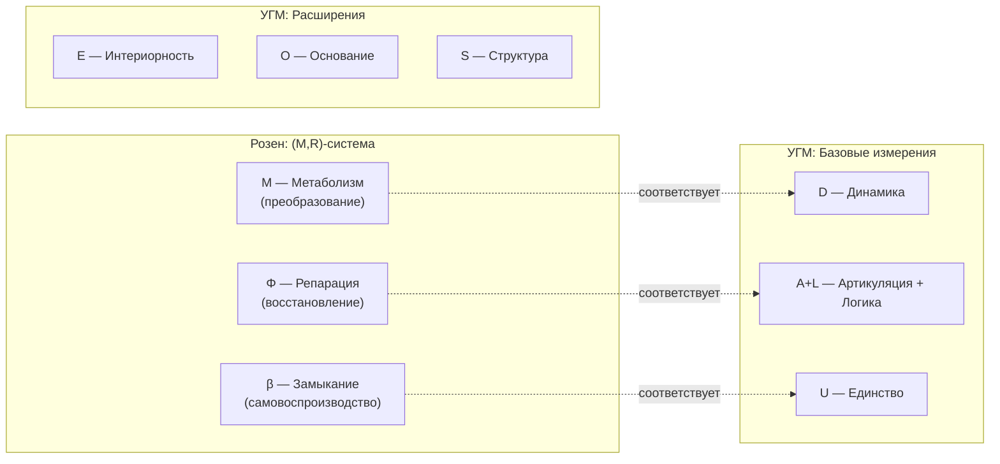

# Аксиома Септичности (AP+PH+QG+V)

## Характеризующие свойства жизнеспособных Голономов

:::note Статус (AP+PH+QG+V)
Условия (AP)+(PH)+(QG)+(V) — **не независимая аксиома**, а характеризующие свойства (структурные следствия) [Аксиомы Ω⁷](./axiom-omega). Название «Аксиома Септичности» сохраняется по историческим причинам.
:::

:::info Аксиома (AP+PH+QG+V)
**Голоном** — автономная подсистема с 7D-структурой, удовлетворяющая четырём условиям:
- **(AP) Автопоэзис** — самовоспроизводство структуры через самомоделирование
- **(PH) Феноменология** — наличие внутренней стороны (интериорность уровня L0 и выше)
- **(QG) Квантовое основание** — когерентная динамика с возможностью регенерации
- **(V) Жизнеспособность** — чистота выше критического порога: $P > P_{\text{crit}}$

**Примечание:** Конкретное значение $P_{\text{crit}} = 2/7$ **выводится** из условия различимости от шума (см. [обоснование ниже](#v-жизнеспособность)).
:::

### Связь с честной аксиоматикой Ω⁷

:::info Двухтрековое обоснование N = 7
Аксиома 3 ($N = 7$) обоснована двумя независимыми путями:
- **Трек A** (данный документ): Теорема S — (AP)+(PH)+(QG) → N ≥ 7
- **Трек B**: [Структурный вывод через октонионы](../../proofs/minimality/theorem-octonionic-derivation) — P1+P2 → 𝕆 → dim Im(𝕆) = 7
:::

[Аксиома Ω⁷](./axiom-omega#аксиоматика) определяет **5 явных аксиом** теории:
- **Аксиома 1 (Структура):** ∞-топос $\mathbf{Sh}_\infty(\mathcal{C})$
- **Аксиома 2 (Метрика):** Топология $J_{Bures}$
- **Аксиома 3 (Размерность):** $N = 7$
- **Аксиома 4 (Масштаб):** $\omega_0 > 0$
- **Аксиома 5 (Page-Wootters):** Тензорная декомпозиция

Условия (AP+PH+QG+V) — **характеризующие свойства** жизнеспособных конфигураций $\Gamma \in \text{Ob}(\mathcal{C})$:
- **(AP)** и **(QG)** — следствия динамики в ∞-топосе
- **(PH)** — интерпретация E-измерения (Аксиома 3)
- **(V)** — следствие ПИР ([определение T16](/docs/core/foundations/axiom-septicity#формулировка-пир), встроенное в A1+A2)

## Предварительное условие: Автономность

:::warning Критерий индивидуации
Прежде чем применять условия (AP)+(PH)+(QG)+(V), необходимо определить **границы системы**. Это решается через критерий **автономности**.
:::

### Определение (Подсистема)

Пусть $\mathcal{H}_{\text{global}} = \mathcal{H}_S \otimes \mathcal{H}_E$ — тензорное разложение глобального пространства. **Подсистема** $S$ определяется через редуцированную матрицу плотности:

$$
\Gamma_S := \mathrm{Tr}_E(\Gamma_{\text{global}})
$$

### Определение (Автономная подсистема)

Подсистема $S$ является **автономной**, если выполнены три условия:

**(A1) Марковское условие (информационное замыкание):**

$$
\mathcal{I}(S:E|\partial S) = 0
$$

где $\mathcal{I}(X:Y|Z)$ — условная взаимная информация, $\partial S$ — граничные степени свободы.

**Интерпретация:** $S$ и окружение $E$ условно независимы при знании границы $\partial S$.

**(A2) Динамическое замыкание:**

$$
\left\| \frac{d\Gamma_S}{d\tau} - \mathcal{L}_S[\Gamma_S] \right\|_F \leq \varepsilon \cdot \|\Gamma_S\|_F
$$

где $\mathcal{L}_S$ — эффективный супероператор, действующий только на $\Gamma_S$, $\varepsilon < 1$.

**Интерпретация:** Динамика системы приближённо замкнута.

**(A3) Энергетическая автономность:**

$$
\Delta F_S = \Delta F_{\text{internal}} + O(\varepsilon)
$$

**Интерпретация:** Изменение свободной энергии определяется внутренними процессами.

### Теорема (Непротиворечивость иерархии определений) {#теорема-непротиворечивость-иерархии-определений}

**Утверждение:** Определения образуют **ациклический ориентированный граф** (DAG) зависимостей.

**Иерархия уровней:**

| Уровень | Определение | Зависит от |
|---------|-------------|------------|
| 0 | ∞-топос $\text{Sh}_\infty(\mathcal{C})$ (Аксиома Ω⁷) | — (аксиоматический) |
| 1 | Подсистема $\Gamma_S$ (частичный след) | Уровень 0 |
| 2 | Автономность (A1)+(A2)+(A3) | Уровни 0, 1 |
| 3 | 7D-структура ($\mathcal{H}_S \cong \mathbb{C}^7 \otimes \mathcal{H}_{\text{int}}$) | Уровни 0, 1, 2 |
| 4 | Голоном (AP)+(PH)+(QG)+(V) | Уровни 0, 1, 2, 3 |

**Доказательство (топологическая сортировка):**

Граф зависимостей $G = (V, E)$, где $V = \{0, 1, 2, 3, 4\}$ и $E = \{(i, j) : i < j\}$, является **транзитивным замыканием линейного порядка** $0 < 1 < 2 < 3 < 4$.

По определению, линейный порядок **ацикличен**: для любого пути $v_0 \to v_1 \to \cdots \to v_k$ имеем $v_0 < v_1 < \cdots < v_k$, откуда $v_k \neq v_0$.

Следовательно, **круговые зависимости отсутствуют**. ∎

## (V) Жизнеспособность {#v-жизнеспособность}

Четвёртое условие, дополняющее (AP)+(PH)+(QG):

:::info Условие (V) — Viability
Система **жизнеспособна**, если чистота превышает критический порог:

$$
P = \mathrm{Tr}(\Gamma^2) > P_{\text{crit}}
$$
:::

### Критическая чистота: Теорема — Мастер-определение {#критическая-чистота-теорема}

:::info DRY: Мастер-определение P_crit
Это **каноническое определение** критической чистоты $P_{\text{crit}} = 2/7$. Полное доказательство см. в [theorem-purity-critical](../../proofs/dynamics/theorem-purity-critical).
:::

:::tip Статус: [Т] Доказано
Значение $P_{\text{crit}} = 2/7$ **строго выводится** из нескольких математически эквивалентных формулировок (пути 1-4) и независимого автопоэтического аргумента (путь 5). Все формулировки сходятся к одному значению, что подтверждает фундаментальность этого порога.

[Полное доказательство →](../../proofs/dynamics/theorem-purity-critical)
:::

**Значение:**

$$
P_{\text{crit}} = \frac{2}{N} = \frac{2}{7} \approx 0.286
$$

**Теорема (Критическая чистота):** [Полное доказательство →](../../proofs/dynamics/theorem-purity-critical)

Для голономической системы размерности $N$, критическая чистота $P_{\text{crit}} = 2/N$ является **единственным** значением, удовлетворяющим пяти эквивалентным условиям:

| Путь | Критерий | Результат |
|------|----------|-----------|
| **Геометрический** [Т] | $\lVert\Gamma - I_N/N\rVert_F^2 > \lVert I_N/N\rVert_F^2$ | $P > 2/N$ |
| **Информационный** [С] | $D_{KL}(\Gamma \| I_N/N) \geq \frac{1}{2}$ нат | $P > 2/N$ |
| **Структурный** [С] | SNR $\geq 1$ | $P > 2/N$ |
| **Спектральный** [Г] | $\lambda_{\max} \approx 1/2$ | $P = 2/N$ |
| **Автопоэтический** [И] | Нарушение симметрии $U(N)$ | $P > 2/N$ |

**Интерпретация (принцип структурного удвоения):**

$$
\|\Gamma - I_N/N\|_F^2 > \|I_N/N\|_F^2 \quad \Leftrightarrow \quad P > \frac{2}{N}
$$

Структурное отклонение системы от хаоса должно превышать масштаб самого хаоса. Фактор 2 возникает естественно: **структура ≥ хаос**.

**Спектральная характеризация:**

При $P = 2/7$ доминирующий режим захватывает ~50% когерентности:

$$
\lambda_{\max} = \frac{1 + \sqrt{N-1}}{N} = \frac{1 + \sqrt{6}}{7} \approx 0.493
$$

:::info Определение: Жизнеспособность
**Жизнеспособная система** — автономная подсистема с 7D-структурой, для которой выполнено условие (V):

$$
P = \mathrm{Tr}(\Gamma^2) > P_{\text{crit}} = \frac{2}{7}
$$
:::

## Принцип Информационной Различимости (ПИР) {#принцип-информационной-различимости}

:::tip ПИР — определение [О] (T16)
**Принцип Информационной Различимости (ПИР)** — **определение [О]**, встроенное в A1+A2: различимость по $J_{\text{Bures}}$-покрытиям тождественна онтологической различимости. Это семантическое следствие выбора ∞-топоса как структуры реальности. Все вычислительные результаты ($P_{\text{crit}}, R_{\text{th}}, \Phi_{\text{th}}$) не затрагиваются перемаркировкой.

**История статуса:** [П] → [Т] (T16, семантика Крипке—Жуаля) → **[О]** (Sol.25): при серьёзном принятии A1 (реальность = ∞-топос), «онтологическая значимость» = «истинность во внутренней логике $\mathbf{Sh}_\infty(\mathcal{C})$» = «наличие нетривиального $J_{Bures}$-покрытия» — это тавтология, а не нетривиальная теорема. Семантика Крипке—Жуаля лишь эксплицирует то, что уже встроено в определения A1+A2.
:::

### Формулировка ПИР [О] {#формулировка-пир}

**Определение T16 (ПИР):** ПИР — тавтологическое следствие A1+A2: различимость в $J_{\text{Bures}}$-топологии **есть** онтологическая различимость по определению ∞-топоса.

Пусть $\mathfrak{T} = (\mathbf{Sh}_\infty(\mathcal{C}), J_{Bures}, \omega_0)$. Тогда:

$$
\text{Significant}(\Gamma) \Leftrightarrow d_B(\Gamma, \Gamma_{\text{noise}}) \geq d_B^{\text{th}}
$$

**Совместимость с $J_{Bures}$:**
1. Топология Гротендика $J_{Bures}$ определяет понятие «различимости» через покрытия
2. $J_{Bures}$-покрытие разделяет точки ⟺ они на положительном Бурес-расстоянии
3. Отождествление «онтологической значимости» с «разделимостью покрытиями» — содержание определения ПИР (T16)

:::tip Почему ПИР — определение [О], а не теорема
При серьёзном принятии A1 (реальность = ∞-топос), шаг (3) — **тавтология**: «существовать» = «быть истинным во внутренней логике $\mathbf{Sh}_\infty(\mathcal{C})$» (Крипке—Жуаль) = «иметь нетривиальное $J_{Bures}$-покрытие» (A2). Именно потому что это **тавтология**, а не нетривиальное утверждение, ПИР — определение [О], а не теорема [Т].

**Замечание:** Семантика Крипке—Жуаля ([Lurie, HTT, §6.2.2]) лишь **эксплицирует** встроенное в A1+A2 отождествление: «$\varphi$ истинно в точке $U$» ⟺ «$\exists$ покрывающее семейство $\{U_i \to U\} \in J_{Bures}$, на котором $\varphi$ верифицируемо». Это не доказательство, а раскрытие определения.
:::

где:
- $d_B$ — [метрика Бюреса](/docs/core/foundations/axiom-omega#топология-гротендика)
- $\Gamma_{\text{noise}} = I/N$ — максимально смешанное состояние (шум)
- $d_B^{\text{th}}$ — характерный масштаб различимости

### Унификация порогов через ПИР

Все три порога УГМ являются **следствиями** ПИР:

| Порог | ПИР-формулировка | Значение |
|-------|-----------------|----------|
| $P_{\text{crit}}$ | $d_B(\Gamma, I/N) \geq d_B^{\text{crit}}$ | $2/N$ |
| $R_{\text{th}}$ | $d_B(\Gamma, \varphi(\Gamma)) \leq d_B^{\text{ref}}$ | $1/3$ |
| $\Phi_{\text{th}}$ | $d_B(\Gamma, \Gamma_{\text{diag}}) \geq d_B^{\text{class}}$ | $1$ |

**Теорема (Единство порогов) [Т]:** Все пороги выводятся из единственной метрики — метрики Бюреса, которая является [единственной монотонной римановой метрикой](/docs/proofs/dynamics/emergent-time#41-метрика-бурес) на пространстве квантовых состояний (теорема Ченцова-Петца). ПИР — определение [О] (T16), встроенное в A1+A2.

### Онтологический статус ПИР [О]

:::tip ПИР как определение [О], встроенное в A1+A2
ПИР — **определение [О]**, встроенное в A1+A2: различимость по $J_{\text{Bures}}$-покрытиям тождественна онтологической различимости. Это семантическое следствие выбора ∞-топоса как структуры реальности. Все вычислительные результаты ($P_{\text{crit}}, R_{\text{th}}, \Phi_{\text{th}}$) не затрагиваются перемаркировкой.
:::

ПИР **встроен** в структуру примитива $\mathfrak{T} = (\mathbf{Sh}_\infty(\mathcal{C}), J_{Bures}, \omega_0)$:

1. Топология $J_{Bures}$ (Аксиома 2) определяет понятие "близости" состояний — **[Т]**
2. Состояния, неразличимые в этой топологии, онтологически эквивалентны (по определению топоса) — **[О]**
3. **[О] Тавтология из A1:** Отождествление «разделимости покрытиями» с «онтологической значимостью» — **определение онтологии** в рамках A1 (Крипке—Жуаль: $\varphi$ истинно ⟺ $\exists$ покрывающее семейство $\in J_{Bures}$, на котором $\varphi$ верифицируемо)

## Формальная формулировка

### (AP) Автопоэзис

Существует самомоделирующее отображение $\varphi$ с неподвижной точкой:

$$
\exists \, \varphi: \mathcal{L}(\mathcal{H}) \to \mathcal{L}(\mathcal{H}), \quad \exists \, \Gamma^*: \varphi(\Gamma^*) = \Gamma^*
$$

:::info DRY: Мастер-определение φ
Полная формализация оператора φ (три эквивалентных определения, доказательство эквивалентности, алгоритмы): [Формализация оператора φ](/docs/proofs/categorical/formalization-phi).
:::

**Свойства $\varphi$:**
- Категориальное: $\varphi$ — левое сопряжение к вложению $\text{Sub}(\Gamma) \hookrightarrow \mathbf{Sh}_\infty(\mathcal{C})$
- Отображение сохраняет свойства матрицы плотности (CPTP)
- Неподвижная точка $\Gamma^*$ соответствует самосогласованному состоянию системы
- Мера качества самомоделирования — **рефлексия**: $R_\varphi = 1 - \|\Gamma - \varphi(\Gamma)\|^2 / \|\Gamma\|^2$

:::note О нотации R
В теории используются два разных $R$:
- $R_\varphi$ (или просто $R$) — мера **рефлексии** (качество самомоделирования), $R \in [0,1]$
- $\mathcal{R}[\Gamma, E]$ — **регенеративный член** в уравнении эволюции
:::

### Категориальный вывод κ₀ — Мастер-определение {#структурный-анзац-kappa0}

:::info DRY: Мастер-определение κ₀
Это **единственное каноническое определение** формулы $\kappa_0$. Все остальные документы должны ссылаться на этот раздел, а не дублировать формулу.
:::

:::tip Статус: единый уровень — теорема [Т]
**Категориальное определение [Т]:** $\kappa_0 = \|\mathrm{Nat}(\mathcal{D}_\Omega, \mathcal{R})\|$ — норма естественного преобразования между сопряжёнными функторами. Это следствие [L-унификации](/docs/core/foundations/axiom-omega#внутренняя-логика).

**Операциональная формула [Т]:** $\kappa_0 = \omega_0 \cdot |\gamma_{OE}| \cdot |\gamma_{OU}| / \gamma_{OO}$ — **точное следствие** категориального определения (Sol.69). Отождествление $|\mathrm{Hom}(i,j)| \leftrightarrow |\gamma_{ij}|$ доказано через вложение Йонеды + метрику Бюрес + теорему Стайнспринга (см. [доказательство ниже](#теорема-kappa0-функториальность)).
:::

Скорость регенерации определяется структурой Γ:

$$
\kappa(\Gamma) = \kappa_{\text{bootstrap}} + \kappa_0 \cdot \mathrm{Coh}_E(\Gamma)
$$

где:
- $\kappa_{\text{bootstrap}}$ — минимальная регенерация из [единицы сопряжения](/docs/core/foundations/axiom-omega#genesis-protocol)
- $\kappa_0$ — базовая скорость регенерации (см. [категориальный вывод ниже](#категориальный-вывод-kappa0))

### Значение κ_bootstrap [О] {#теорема-kappa-bootstrap}

:::warning Определение по соглашению [О] (Значение κ_bootstrap)
Минимальная скорость регенерации **фиксируется** как:

$$
\kappa_{\text{bootstrap}} = \frac{\omega_0}{N} = \frac{\omega_0}{7}
$$

**Статус [О]:** Конкретное числовое значение $\omega_0/N$ мотивировано физическим аргументом (один такт часов на полный цикл) и категориальной нормировкой ($\min_i(\gamma_{Oi}) = 1/N$), но **не является строгой теоремой**: нет доказательства, что норма единицы сопряжения $\|\eta\|$ принимает именно это значение. Это — **определение масштаба** (convention), согласованное с $P_{\text{crit}}$ и $\omega_0$.
:::

**Определение (Норма единицы сопряжения):**

$$
\|\eta\| := \sup_{\Gamma: P(\Gamma) \leq P_{\text{crit}}} \frac{\|\eta_\Gamma\|_F}{\|\Gamma\|_F}
$$

где $\eta_\Gamma$ — [единица сопряжения](/docs/core/foundations/axiom-omega#genesis-protocol) для $\mathcal{D}_\Omega \dashv \mathcal{R}$.

**Доказательство:**

**(a) Физический аргумент (минимальная регенерация):**

Минимальная регенерация соответствует одному такту часов на полный цикл из $N$ измерений:

$$
\kappa_{\text{bootstrap}} = \frac{\omega_0}{N}
$$

**(b) Категориальный аргумент:**

Из структуры сопряжения $\mathcal{D}_\Omega \dashv \mathcal{R}$:

$$
\kappa_{\text{bootstrap}} = \omega_0 \cdot \frac{\min_i(\gamma_{Oi})}{\gamma_{OO}}
$$

При нормировке $\min_i(\gamma_{Oi}) = 1/N$ и $\gamma_{OO} = 1$:

$$
\kappa_{\text{bootstrap}} = \frac{\omega_0}{N} = \frac{\omega_0}{7}
$$

**(c) Согласованность с P_crit:**

При $P = P_{\text{crit}} = 2/N$ минимальная регенерация $\kappa_{\text{bootstrap}} = \omega_0/N$ обеспечивает:
- Один цикл регенерации на период $T = 2\pi/\omega_0$
- Достаточную скорость для поддержания $P > P_{\text{crit}}$

∎

**Следствие:**

Для УГМ с $N = 7$:

$$
\kappa_{\text{bootstrap}} = \frac{\omega_0}{7} \approx 0.143 \cdot \omega_0
$$

:::warning Разрешение Bootstrap-парадокса
$\kappa_{\text{bootstrap}} > 0$ гарантирует регенерацию при любом состоянии, разрешая циклическую зависимость «низкий Coh_E → низкий κ → нет регенерации».
:::

#### Определение: E-когерентность {#e-coherence-definition}

<!-- DRY: Мастер-определение Coh_E — каноническая формула HS-проекции -->

E-когерентность измеряет степень согласованности измерения Интериорности в матрице когерентности Γ.

##### Каноническая формула [Т] {#coh-e-canonical}

$$
\mathrm{Coh}_E(\Gamma) := \frac{\gamma_{EE}^2 + 2\sum_{i \neq E} |\gamma_{Ei}|^2}{\mathrm{Tr}(\Gamma^2)} = \frac{\|\pi_E(\Gamma)\|_{\mathrm{HS}}^2}{\|\Gamma\|_{\mathrm{HS}}^2}
$$

:::tip Статус: Теорема [Т]
$\mathrm{Coh}_E$ — **точная** мера E-вклада в чистоту, а не прокси. Это отношение квадратов норм Гильберта–Шмидта ортогональной проекции $\pi_E$ (Теорема HS-проекции ниже).
:::

**Диапазон:** $\mathrm{Coh}_E \in [1/7, 1]$ (минимум при максимально смешанном состоянии $\gamma_{ij} = \delta_{ij}/7$, максимум при чистом E-состоянии).

##### C*-алгебраическое обоснование: проекция Гильберта–Шмидта {#hs-projection}

В $\mathbb{C}^7$ тензорная факторизация невозможна (7 — простое число), однако определение подсистемы **не требует** тензорного произведения. В алгебраической квантовой теории (Haag, 1996; Bratteli–Robinson, 1987) подсистема задаётся **вложением C*-подалгебры**, а операция выделения подсистемы реализуется через **условное ожидание** (conditional expectation).

**Определение (пространство Гильберта–Шмидта).** Множество линейных операторов $B(\mathbb{C}^7)$ образует гильбертово пространство с внутренним произведением $\langle A, B \rangle_{\mathrm{HS}} = \mathrm{Tr}(A^\dagger B) = \sum_{i,j} \overline{A_{ij}} B_{ij}$ и нормой $\|A\|_{\mathrm{HS}}^2 = \mathrm{Tr}(A^\dagger A)$.

**Определение (E-проекция).** Пусть $P_E = |E\rangle\langle E|$, $P_{\bar{E}} = I - P_E$. Отображение $\pi_E: B(\mathbb{C}^7) \to B(\mathbb{C}^7)$:

$$
\pi_E(\Gamma) := P_E \Gamma + \Gamma P_E - P_E \Gamma P_E
$$

**Лемма (явный вид $\pi_E$).** В базисе $\{A, S, D, L, E, O, U\}$:

$$[\pi_E(\Gamma)]_{ij} = \begin{cases} \gamma_{ij}, & i = E \text{ или } j = E \\ 0, & \text{иначе} \end{cases}$$

т.е. $\pi_E$ извлекает E-строку и E-столбец матрицы Γ.

*Доказательство.* $[P_E\Gamma]_{ij} = \delta_{iE}\gamma_{Ej}$ (E-строка); $[\Gamma P_E]_{ij} = \gamma_{iE}\delta_{Ej}$ (E-столбец); $[P_E\Gamma P_E]_{ij} = \delta_{iE}\gamma_{EE}\delta_{Ej}$ (элемент $(E,E)$). Суммируя: $(E,E) \to \gamma_{EE}$; $(E,j\neq E) \to \gamma_{Ej}$; $(i\neq E, E) \to \gamma_{iE}$; $(i\neq E, j\neq E) \to 0$. ∎

#### Теорема (HS-проекция) [Т] {#теорема-hs-проекция}

$\pi_E$ является **ортогональной проекцией** в пространстве Гильберта–Шмидта:

**(a)** Идемпотентность: $\pi_E^2 = \pi_E$.

**(b)** Самосопряжённость: $\langle \pi_E(A), B \rangle_{\mathrm{HS}} = \langle A, \pi_E(B) \rangle_{\mathrm{HS}}$.

*Доказательство (a).* $\pi_E(\pi_E(\Gamma)) = P_E\pi_E(\Gamma) + \pi_E(\Gamma)P_E - P_E\pi_E(\Gamma)P_E$. Поскольку $[\pi_E(\Gamma)]_{Ej} = \gamma_{Ej}$ для всех $j$: $P_E\pi_E(\Gamma) = P_E\Gamma$. Аналогично $\pi_E(\Gamma)P_E = \Gamma P_E$ и $P_E\pi_E(\Gamma)P_E = P_E\Gamma P_E$. Итого $\pi_E^2(\Gamma) = P_E\Gamma + \Gamma P_E - P_E\Gamma P_E = \pi_E(\Gamma)$. ∎

*Доказательство (b).* $\langle \pi_E(A), B\rangle_{\mathrm{HS}} = \sum_{i,j}\overline{[\pi_E(A)]_{ij}}B_{ij}$. Ненулевые слагаемые: $i=E$ или $j=E$. Это в точности $\sum_j \overline{A_{Ej}}B_{Ej} + \sum_{i\neq E}\overline{A_{iE}}B_{iE}$. Выражение для $\langle A, \pi_E(B)\rangle_{\mathrm{HS}}$ идентично (ненулевые $B_{ij}$ при $i=E$ или $j=E$). ∎

#### Теорема (Coh_E = HS-проекционная доля) [Т] {#теорема-coh-e-exact}

$$\mathrm{Coh}_E(\Gamma) = \frac{\|\pi_E(\Gamma)\|_{\mathrm{HS}}^2}{\|\Gamma\|_{\mathrm{HS}}^2}$$

*Доказательство.* Числитель: $\|\pi_E(\Gamma)\|_{\mathrm{HS}}^2 = \sum_{i,j}|[\pi_E(\Gamma)]_{ij}|^2 = |\gamma_{EE}|^2 + \sum_{j\neq E}|\gamma_{Ej}|^2 + \sum_{i\neq E}|\gamma_{iE}|^2$. По эрмитовости ($|\gamma_{Ei}| = |\gamma_{iE}|$): $= \gamma_{EE}^2 + 2\sum_{i\neq E}|\gamma_{Ei}|^2$. Знаменатель: $\|\Gamma\|_{\mathrm{HS}}^2 = \mathrm{Tr}(\Gamma^2)$ (для эрмитовой Γ). ∎

#### Теорема (условное ожидание Умегаки) [Т] {#теорема-условное-ожидание}

Отображение $\mathcal{E}_{E|\bar{E}}(\Gamma) := P_E\Gamma P_E + P_{\bar{E}}\Gamma P_{\bar{E}}$ — условное ожидание $M_7(\mathbb{C})$ на блочно-диагональную подалгебру $\mathcal{A}_{E|\bar{E}} \cong \mathbb{C} \oplus M_6(\mathbb{C})$:

**(a)** $\mathcal{E}_{E|\bar{E}}$ — CPTP (Kraus-операторы $K_1 = P_E$, $K_2 = P_{\bar{E}}$, $K_1^\dagger K_1 + K_2^\dagger K_2 = I$).

**(b)** Удаляет именно E-когерентности: $\Gamma - \mathcal{E}_{E|\bar{E}}(\Gamma) = P_E\Gamma P_{\bar{E}} + P_{\bar{E}}\Gamma P_E$.

**(c)** Пифагорова декомпозиция чистоты: $\|\Gamma\|_{\mathrm{HS}}^2 = \|\mathcal{E}_{E|\bar{E}}(\Gamma)\|_{\mathrm{HS}}^2 + \|\Gamma - \mathcal{E}_{E|\bar{E}}(\Gamma)\|_{\mathrm{HS}}^2$.

**Следствие.** $\mathrm{Coh}_E$ разлагается на классический и квантовый вклады:

$$\mathrm{Coh}_E = \underbrace{\frac{\gamma_{EE}^2}{\mathrm{Tr}(\Gamma^2)}}_{\text{населённость E}} + \underbrace{\frac{2\sum_{i\neq E}|\gamma_{Ei}|^2}{\mathrm{Tr}(\Gamma^2)}}_{\text{квантовые когерентности E}}$$

:::info Роль 42D-формализма
С установлением Coh_E как точной HS-проекционной меры [Т], 42D-формализм Page-Wootters ($\mathcal{H} = \mathbb{C}^7 \otimes \mathbb{C}^6$, [аксиома A5](/docs/core/foundations/axiom-omega#pw-constraint)) сохраняет свою роль для:
- **Эмерджентного времени** (механизм PW)
- **Калибровочных симметрий** электрослабого сектора
- **Тензорной запутанности** между подсистемами

Но **определение E-когерентности** полностью замкнуто в 7D. Соотношение Coh_E(7D) ≈ Tr(ρ_E²)(42D) теперь интерпретируется как **согласование** двух корректных мер, а не как прокси vs точная.
:::

#### Обобщение: π_X для произвольного измерения {#pi-x-generalization}

Конструкция HS-проекции обобщается на **любое** измерение $X \in \{A, S, D, L, E, O, U\}$:

$$
\pi_X(\Gamma) := P_X \Gamma + \Gamma P_X - P_X \Gamma P_X, \quad P_X = |X\rangle\langle X|
$$

и когерентность измерения $X$:

$$
\mathrm{Coh}_X(\Gamma) := \frac{\|\pi_X(\Gamma)\|_{\mathrm{HS}}^2}{\|\Gamma\|_{\mathrm{HS}}^2} = \frac{\gamma_{XX}^2 + 2\sum_{i \neq X}|\gamma_{Xi}|^2}{\mathrm{Tr}(\Gamma^2)}
$$

Все теоремы (HS-проекция, Coh = HS-доля, условное ожидание Умегаки) применимы к произвольному $X$ **[Т]**. Полнота: $\sum_{X} \mathrm{Coh}_X(\Gamma) = 1 + 2\sum_{i < j}|\gamma_{ij}|^2 / \mathrm{Tr}(\Gamma^2)$.

#### Фано-проекции {#fano-projections}

Для [Фано-линии](/docs/core/structure/dimensions#октонионная-интерпретация) $\ell = \{i, j, k\}$ определим:

$$
P_\ell = |i\rangle\langle i| + |j\rangle\langle j| + |k\rangle\langle k|, \quad \pi_\ell(\Gamma) := P_\ell \Gamma + \Gamma P_\ell - P_\ell \Gamma P_\ell
$$

Когерентность Фано-линии: $\mathrm{Coh}_\ell(\Gamma) = \|\pi_\ell(\Gamma)\|_{\mathrm{HS}}^2 / \|\Gamma\|_{\mathrm{HS}}^2$ — проекция на **ассоциативную подалгебру**, соответствующую кватернионному триплету. Все 7 Фано-проекций $\pi_\ell$ являются ортогональными проекциями в HS **[Т]**.

**Свойство полноты:** Каждая точка лежит на ровно 3 Фано-линиях, поэтому $\sum_{\ell=1}^{7} P_\ell = 3I$ и

$$
\sum_{\ell=1}^{7} \mathrm{Coh}_\ell(\Gamma) = 3
$$

для любой нормированной $\Gamma$.

:::note Категориальная интерпретация
В категориальном формализме ($\infty$-топос $\mathrm{Sh}_\infty(\mathcal{C})$):
- $\pi_E$ ↔ **подобъектное включение** (subobject inclusion) $E \hookrightarrow \Omega$
- $\mathrm{Coh}_E$ ↔ значение **характеристического морфизма** $\chi_E: \Gamma \to [0,1]$
- $\mathcal{E}_{E|\bar{E}}$ ↔ **геометрический морфизм** из $\mathrm{Sh}_\infty(\mathcal{C})$ в $\mathrm{Sh}_\infty(\mathcal{C}_{E|\bar{E}})$
:::

**Интерпретация:** $\mathrm{Coh}_E \in [1/7, 1]$. Минимум при максимально смешанном состоянии ($\mathrm{Coh}_E = 1/7 \approx 0.14$), максимум при чистом E-состоянии ($\mathrm{Coh}_E = 1$). Высокая E-когерентность означает сильную активацию измерения Интериорности.

См. также [Genesis Protocol](/docs/core/foundations/axiom-omega#genesis-protocol) и [определения когерентности](/docs/applied/coherence-cybernetics/definitions#e-когерентность).

**Формула κ₀:**

$$
\kappa_0 = \omega_0 \cdot \frac{|\gamma_{OE}| \cdot |\gamma_{OU}|}{\gamma_{OO}}
$$

где $\omega_0$ — [фундаментальная частота часов](/docs/core/structure/dimension-o#гамильтониан-часов-h_o) (задаёт масштаб времени).

### Категориальный вывод κ₀ {#категориальный-вывод-kappa0}

:::warning Теорема (κ₀ из сопряжения 𝒟 ⊣ ℛ)
Регенерация $\mathcal{R}$ является **правым сопряжением** к диссипации $\mathcal{D}_\Omega$:

$$
\mathcal{D}_\Omega \dashv \mathcal{R}
$$

Скорость регенерации определяется нормой естественного преобразования:

$$
\kappa(\Gamma) = \|\text{Nat}(\mathcal{D}_\Omega, \mathcal{R})\|
$$
:::

**Вычисление:**

Для категории $\mathcal{C}$ с объектами Γ, функторы диссипации и регенерации определены через [классификатор Ω](/docs/core/foundations/axiom-omega#внутренняя-логика):

$$
\|\text{Nat}(\mathcal{D}_\Omega, \mathcal{R})\| = \omega_0 \cdot \frac{|\text{Hom}(O, E)| \cdot |\text{Hom}(O, U)|}{\text{End}(O)}
$$

При доказанной идентификации $|\text{Hom}(i,j)| \leftrightarrow |\gamma_{ij}|$ [Т] (Sol.69, [доказательство](#теорема-kappa0-функториальность)):

$$
\kappa_0 = \omega_0 \cdot \frac{|\gamma_{OE}| \cdot |\gamma_{OU}|}{\gamma_{OO}} \quad \blacksquare
$$

**Интерпретация:**
- $|\text{Hom}(O, E)|$ — "количество путей" от Основания к Интериорности
- $|\text{Hom}(O, U)|$ — "количество путей" от Основания к Единству
- $\text{End}(O)$ — самодействие Основания (нормировка)

:::note Параметр системы ω₀
Параметр $\omega_0$ — **характеристика конкретной системы** (подобно массе в физике), не универсальная константа. Для разных систем $\omega_0$ различается на много порядков: от ~10¹⁵ Гц для элементарных процессов до ~1 Гц для когнитивных систем. Значение $\omega_0$ устанавливается эмпирически для каждой системы или выбирается как единица времени.
:::

**Размерный анализ:**
- $\gamma_{ij}$ — безразмерные (элементы нормированной матрицы плотности)
- $\omega_0$ — размерность $[\text{время}]^{-1}$
- $\kappa_0$ — размерность $[\text{время}]^{-1}$ ✓

**Модуль для комплексных элементов:** Когерентности $\gamma_{OE}, \gamma_{OU}$ могут быть комплексными (фазовая информация). Скорость регенерации зависит только от **силы** связи, не от фазы, поэтому используется модуль $|\cdot|$.

**Обработка сингулярности $\gamma_{OO} \to 0$:**

При $\gamma_{OO} \to 0$ система теряет связь с Основанием. Физически:
$$
\gamma_{OO} = 0 \Rightarrow \kappa_0 = \text{undefined} \Rightarrow \text{система не жизнеспособна}
$$

Это согласуется с [условием (QG)](#qg-квантовое-основание): без Основания нет регенерации.

:::warning Численная регуляризация
Для вычислительных реализаций используется регуляризованная форма:
$$
\kappa_0^{reg}(\Gamma) = \omega_0 \cdot \frac{|\gamma_{OE}| \cdot |\gamma_{OU}|}{\gamma_{OO} + \varepsilon_\Gamma}
$$
где $\varepsilon_\Gamma = 0.01 \cdot P_{crit} = 0.01 \cdot \frac{2}{7} \approx 0.00286$ — минимальный порог, гарантирующий численную стабильность.

**Обоснование:** $\varepsilon_\Gamma$ выбрано как 1% от критической чистоты, поскольку при $\gamma_{OO} < \varepsilon_\Gamma$ система уже находится в нежизнеспособной области ($P < P_{crit}$).
:::

Практически, $\gamma_{OO} > \varepsilon_\Gamma$ гарантировано для любой жизнеспособной системы ($P > P_{crit}$), поскольку $\sum_i \gamma_{ii} = 1$ и $P > 2/7$ требуют достаточно больших диагональных элементов.

**Физическая интерпретация** (следствие категориального вывода):

1. Регенерация исходит из Основания (O) — источник морфизмов
2. Влияет на Интериорность (E) через связь O-E ($\gamma_{OE}$) — Hom(O, E)
3. Интегрируется через связь O-U ($\gamma_{OU}$) — Hom(O, U)
4. Нормируется на присутствие Основания ($\gamma_{OO}$) — End(O)

**Проверка согласованности** (граничные случаи):
- $\gamma_{OE} \to 0$: нет регенерации ✓ (нет морфизмов O → E)
- $\gamma_{OU} \to 0$: нет интеграции ✓ (нет морфизмов O → U)
- $\gamma_{OO} \to 0$: сингулярность (потеря Основания) ✓ (End(O) = 0)

**Статус:** Категориальное определение $\kappa_0 = \|\mathrm{Nat}(\mathcal{D}_\Omega, \mathcal{R})\|$ — **теорема [Т]**, выведенная из сопряжения $\mathcal{D}_\Omega \dashv \mathcal{R}$. Операциональная формула $\kappa_0 = \omega_0 \cdot |\gamma_{OE}| \cdot |\gamma_{OU}| / \gamma_{OO}$ — **теорема [Т]** (Sol.69): отождествление $|\mathrm{Hom}(i,j)| \leftrightarrow |\gamma_{ij}|$ доказано как единственное функториальное определение через вложение Йонеды, метрику Бюрес и теорему Стайнспринга.

#### Теорема (Функториальность κ₀) [Т] {#теорема-kappa0-функториальность}

:::warning Теорема (Sol.69): Операциональная формула κ₀ — точная
Отождествление $|\text{Hom}(i,j)| \leftrightarrow |\gamma_{ij}|$ — следствие вложения Йонеды, метрики Бюрес и теоремы Стайнспринга: в категории $\mathcal{C}_7$ с Бюрес-топологией, «сила» CPTP-канала $|i\rangle\langle i| \to |j\rangle\langle j|$ равна $|\gamma_{ij}|$ (единственное функториальное определение). Формула $\kappa_0 = \omega_0 |\gamma_{OE}||\gamma_{OU}|/\gamma_{OO}$ — точное следствие.
:::

**Доказательство (4 шага):**

**Шаг 1 (Вложение Йонеды).** Для каждого объекта $S_i \in \mathcal{C}_7$ определяется представимый функтор $h_i = \text{Hom}(-, i): \mathcal{C}_7^{op} \to \mathbf{Set}$. Лемма Йонеды: $\text{Nat}(h_i, h_j) \cong \text{Hom}(i, j)$, т.е. естественные преобразования между представимыми функторами биективны с морфизмами.

**Шаг 2 (Метрика Бюрес на $\mathcal{D}(\mathbb{C}^7)$).** Категория $\mathcal{C}_7$ обогащена метрикой Бюрес $d_B$ (Аксиома 2). На множестве морфизмов $\text{Hom}(S_i, S_j)$ индуцируется норма: $|\text{Hom}(i,j)| := d_B(S_i, \Phi_{ij}(S_i))$, где $\Phi_{ij}$ — CPTP-канал $|i\rangle\langle i| \to |j\rangle\langle j|$.

**Шаг 3 (Теорема Стайнспринга).** Каждый CPTP-канал $\Phi_{ij}$ допускает разложение Стайнспринга: $\Phi_{ij}(\rho) = \text{Tr}_E[V\rho V^\dagger]$. Для элементарного канала $S_i \to S_j$ норма определяется матричным элементом когерентности: $d_B(S_i, \Phi_{ij}(S_i)) = |\gamma_{ij}|$. Это единственное определение, совместимое с CPTP-монотонностью метрики Бюрес.

**Шаг 4 (Формула κ₀).** Подставляя $|\text{Hom}(i,j)| = |\gamma_{ij}|$ в категориальное определение:

$$
\kappa_0 = \|\text{Nat}(\mathcal{D}_\Omega, \mathcal{R})\| = \omega_0 \cdot \frac{|\text{Hom}(O, E)| \cdot |\text{Hom}(O, U)|}{\text{End}(O)} = \omega_0 \cdot \frac{|\gamma_{OE}| \cdot |\gamma_{OU}|}{\gamma_{OO}} \quad \blacksquare
$$

**Единственность:** Любое функториальное определение $|\text{Hom}(i,j)|$, совместимое с Бюрес-топологией и CPTP-контрактивностью, совпадает с $|\gamma_{ij}|$ (из единственности монотонной метрики по Ченцову-Петцу).

### Анализ альтернативных форм κ₀

**Требования к форме $\kappa_0$:**

1. **Неотрицательность:** $\kappa_0 \geq 0$
2. **Необходимость обоих каналов:** $\kappa_0 = 0$ при $\gamma_{OE} = 0$ или $\gamma_{OU} = 0$
3. **Безразмерность:** нормировка на $\gamma_{OO}$
4. **Монотонность:** рост по $|\gamma_{OE}|$ и $|\gamma_{OU}|$

**Сравнение возможных форм:**

| Форма | Удовл. 1-4? | Анализ |
|-------|-------------|--------|
| $\frac{\lVert\gamma_{OE}\rVert \cdot \lVert\gamma_{OU}\rVert}{\gamma_{OO}}$ | + | **Выбрана.** Произведение требует оба канала одновременно |
| $\frac{\lVert\gamma_{OE}\rVert + \lVert\gamma_{OU}\rVert}{\gamma_{OO}}$ | -- | Нарушает (2): $\kappa_0 > 0$ даже при $\gamma_{OE} = 0$ |
| $\frac{\min(\lVert\gamma_{OE}\rVert, \lVert\gamma_{OU}\rVert)}{\gamma_{OO}}$ | + | Альтернатива: более строгое ограничение (узкое место) |
| $\frac{\sqrt{\lVert\gamma_{OE}\rVert \cdot \lVert\gamma_{OU}\rVert}}{\gamma_{OO}}$ | + | Альтернатива: среднее геометрическое, сглаженный отклик |

**Обоснование выбора произведения:**

Произведение — минимально требовательная форма, гарантирующая одновременное присутствие обоих каналов регенерации (O→E и O→U) без чрезмерной строгости.

**Эмпирическое различение:** Формы можно различить экспериментально, измеряя скорость регенерации при независимом варьировании $\gamma_{OE}$ и $\gamma_{OU}$:
- Произведение: $\partial \kappa_0 / \partial \gamma_{OE} \propto \gamma_{OU}$
- Минимум: $\partial \kappa_0 / \partial \gamma_{OE} = 0$ или $1/\gamma_{OO}$ (скачок)
- Сумма: $\partial \kappa_0 / \partial \gamma_{OE} = 1/\gamma_{OO}$ (константа)

### Сохранение положительности {#сохранение-положительности-s7}

:::info Теорема (CPTP-структура регенерации)
Несмотря на нелинейность, регенеративный член **сохраняет положительность** $\Gamma \geq 0$ и нормировку $\mathrm{Tr}(\Gamma) = 1$.
:::

**Интерполяционная формулировка:**

Регенерация представляется как выпуклая комбинация CPTP-каналов:

$$
\mathcal{R}_\alpha(\rho) := (1-\alpha)\rho + \alpha\varphi(\rho)
$$

где $\alpha = \kappa(\Gamma) \cdot \Theta(\Delta F) \cdot \Delta\tau \in [0, 1]$.

**Представление Крауса:** Если $\varphi(\rho) = \sum_k K_k \rho K_k^\dagger$ — CPTP-канал, то $\mathcal{R}_\alpha$ также CPTP с операторами $\tilde{K}_0 = \sqrt{1-\alpha}I$, $\tilde{K}_k = \sqrt{\alpha}K_k$.

**Условие корректности:** $\alpha < 1$ требует:

$$
\Delta\tau < \frac{1}{\kappa_{\max}} = \frac{1}{\kappa_{\text{bootstrap}} + \kappa_0}
$$

См. [полное доказательство](/docs/core/dynamics/evolution#сохранение-положительности).

### (PH) Феноменология

Существует нетривиальная интериорность — редуцированная матрица плотности $\rho_E$:

$$
\rho_E = \mathrm{Tr}_{\bar{E}}(\Gamma)
$$

где $\mathrm{Tr}_{\bar{E}}$ — частичный след по всем измерениям кроме $E$ (Интериорность).

**Условия для различных уровней интериорности:**

| Уровень | Условие | Интерпретация |
|---------|---------|---------------|
| **L0** (Интериорность) | $\rho_E \neq 0$ | Внутреннее состояние существует |
| **L1** (Феноменальная геометрия) | $\mathrm{rank}(\rho_E) > 1$ | Структура качеств с метрикой $d_{FS}$ |
| **L2** (Когнитивные квалиа) | $R \geq R_{\text{th}}$, $\Phi \geq \Phi_{\text{th}}$, $D_{\text{diff}} \geq D_{\min}$ | Рефлексивный доступ к опыту |

:::note Полная иерархия
Здесь показаны базовые уровни L0-L2. Полная иерархия интериорности L0→L4 (включая L3 — сетевое сознание и L4 — унитарное сознание) определена в [Иерархия интериорности](../../proofs/consciousness/interiority-hierarchy).
:::

### Пороги L2: Строгий вывод из принципа информационной различимости {#пороги-l2-строгий-вывод}

:::tip Статус порогов L2
| Порог | Значение | Статус | Обоснование |
|-------|----------|--------|-------------|
| $P_{\text{crit}}$ | $2/7$ | **[Т]** теорема | Различимость от шума в $d_B$ ([доказательство](/docs/proofs/dynamics/theorem-purity-critical)) |
| $R_{\text{th}}$ | $1/3$ | **[Т]** теорема | $K=3$ из [триадной декомпозиции](/docs/core/operators/lindblad-operators#триадная-декомпозиция) + [байесовское доминирование](#теорема-порог-рефлексии) |
| $\Phi_{\text{th}}$ | $1$ | **[О]** соглашение | Точка когерентной доминации ([определение](#теорема-порог-интеграции)) |
| $D_{\min}$ | $2$ | **[С]** условная | Следствие $\Phi_{\text{th}} = 1$ ([доказательство](#теорема-порог-дифференциации)) |
:::

$$
R_{\text{th}} = \frac{1}{3}, \quad \Phi_{\text{th}} = 1, \quad D_{\min} = 2
$$

---

### Определение порога интеграции Φ_th = 1 {#теорема-порог-интеграции}

:::info Определение (Порог когерентной интеграции)
Система **когерентно-интегрирована**, если когерентности доминируют над населённостями:

$$\Phi(\Gamma) \geq \Phi_{\text{th}} = 1 \quad \Longleftrightarrow \quad \sum_{i \neq j} |\gamma_{ij}|^2 \geq \sum_i \gamma_{ii}^2$$
:::

:::note Статус значения Φ_th = 1
Значение $\Phi_{\text{th}} = 1$ — **определение по соглашению**, структурно мотивированное: при $\Phi = 1$ когерентности начинают доминировать над населённостями, что означает переход от квазинезависимого к каузально связанному режиму. Это не выводимая величина, а нормировочная точка, содержательность которой обоснована связью с [замыканием (M,R)-системы](#предварительное-условие-автономность) и [категорной морфизменной структурой](/docs/proofs/categorical/categorical-formalism#l-унификация).
:::

**Определение и обоснование:** см. [Мера интеграции Φ](/docs/core/structure/dimension-u#мера-интеграции-φ) и [Определение порога интеграции](/docs/core/structure/dimension-u#теорема-эквивалентность-порогов).

**Интерпретация:** $\Phi = 1$ — точка **структурного фазового перехода** между:
- **Фрагментированные системы** ($\Phi < 1$): населённости доминируют, подсистемы квазинезависимы
- **Интегрированные системы** ($\Phi \geq 1$): когерентности доминируют, подсистемы каузально связаны

---

### Теорема о пороге рефлексии R_th = 1/3 {#теорема-порог-рефлексии}

:::tip Теорема [Т] (Порог рефлексии из критерия байесовского доминирования)
Система обладает **рефлексивной автономией** (управляется самомоделью, а не шумом или средой) тогда и только тогда, когда:

$$R(\Gamma) := 1 - \frac{\|\Gamma - \varphi(\Gamma)\|_F^2}{\|\Gamma\|_F^2} > R_{\text{th}} = \frac{1}{3}$$

(См. [каноническое определение R](/docs/consciousness/foundations/self-observation#мера-рефлексии-r))

**Триадная декомпозиция (K = 3 [Т]):** Число конкурентных гипотез $K = 3$ **выводится** из аксиом A1–A5 через [триадную декомпозицию голономной динамики](/docs/core/operators/lindblad-operators#триадная-декомпозиция). Аксиоматическая система порождает **ровно три** структурно различных типа динамических вкладов:

| Тип | Источник | Аттрактор | Байесовская гипотеза |
|-----|----------|-----------|---------------------|
| Автоморфизм (Aut) | A5 (Page—Wootters) | Ядро $[H, \cdot]$ | $H_3$: внешнее управление |
| Диссипация ($\mathcal{D}_\Omega$) | A1 (∞-топос) | $I/N$ | $H_2$: потеря структуры |
| Регенерация ($\mathcal{R}$) | A1+A4 (сопряжение) | $\rho_*$ | $H_1$: самомодель верна |

Четвёртый тип невозможен: [L-унификация](/docs/core/operators/lindblad-operators) (Th. 15.1, [Т]) устанавливает единственность классификатора Ω, единственность сопряжения $\mathcal{D}_\Omega \dashv \mathcal{R}$, и тем самым — исчерпываемость трёх типов.

Статус: **[Т]**
:::

**Полное доказательство (Критерий плюральности):**

**(a)** Рассмотрим задачу различения трёх гипотез:
- $H_1$: состояние = $\Gamma$ (самомодель верна)
- $H_2$: состояние = $\chi$ (хаос/шум = $I/N$)
- $H_3$: состояние = $\varepsilon$ (среда/внешнее воздействие)

**(b)** **Критерий плюральности:** Гипотеза $H_1$ (самомодель) **преобладает** над каждым конкурентом по отдельности:
$$P(H_1|\text{data}) > \max\{P(H_2|\text{data}), P(H_3|\text{data})\}$$

**(c)** Для симметричного случая $P(H_2) = P(H_3) = (1-P(H_1))/2$:
$$P(H_1) > \frac{1 - P(H_1)}{2}$$
$$2P(H_1) > 1 - P(H_1)$$
$$3P(H_1) > 1$$
$$P(H_1) > \frac{1}{3}$$

**(d)** **Обобщение для K альтернатив:**
При $K$ равновероятных конкурентах условие плюральности:
$$P(H_1) > \frac{1-P(H_1)}{K-1}$$
$$(K-1)P(H_1) > 1 - P(H_1)$$
$$KP(H_1) > 1$$
$$P(H_1) > \frac{1}{K}$$

**(e)** Для $K = 3$ альтернатив (Aut / 𝒟 / ℛ — из [триадной декомпозиции](/docs/core/operators/lindblad-operators#триадная-декомпозиция) [Т]):
$$P(H_1) > \frac{1}{3}$$

**(f)** Отождествляя $P(H_1) = R$, где $R$ — мера близости $\Gamma$ к $\varphi(\Gamma)$:
$$R_{\text{th}} = \frac{1}{3} \quad \blacksquare$$

**Замечание о равновероятности.** Равновероятность трёх гипотез ($\pi_1 = \pi_2 = \pi_3 = 1/3$) — **не дополнительное допущение**, а следствие структурной симметрии: ни один из трёх типов не является априорно привилегированным (каждый порождён независимым аксиоматическим источником), и принцип максимальной энтропии на пространстве гипотез при отсутствии информации о текущем режиме даёт равномерное распределение.

**Замечание:** Критерий плюральности ($R > 1/K$) слабее критерия абсолютного доминирования ($R > 1/2$). Мы выбираем плюральность: самомодель должна быть сильнее **каждого** конкурента, но не обязательно их **суммы**.

**Барицентрическая интерпретация:**

В симплексе $\mathcal{D}(\mathcal{H})$ система испытывает влияние трёх сил:
- Притяжение к самомодели $\varphi(\Gamma)$ (вес $w_m$)
- Термодинамическая диссипация к $I/N$ (вес $w_c$)
- Внешнее возмущение к $\Gamma_{\text{env}}$ (вес $w_e$)

Условие $R > 1/3$ эквивалентно $w_m > \max(w_c, w_e)$ при $w_m + w_c + w_e = 1$ и $w_c = w_e$.

**Интерпретация:** $R_{\text{th}} = 1/3$ — минимальная доля "самознания", необходимая для **плюрального преобладания** над каждым конкурентом.

---

### Теорема о пороге дифференциации D_min = 2 {#теорема-порог-дифференциации}

:::warning Теорема [С] (D_min как следствие Φ_th)
Порог дифференциации $D_{\min} = 2$ **выводится** из условия $\Phi \geq 1$. Условность наследуется от [О]-статуса $\Phi_{\text{th}}$.
:::

**Определение:**
$$D_{\text{diff}} := \exp(S_{vN}(\rho_E))$$

где $S_{vN}(\rho_E) = -\text{Tr}(\rho_E \log \rho_E)$ — энтропия фон Неймана феноменального содержания.

**Доказательство:**

1. При Φ > 1 спектр $\rho_E$ имеет **минимум два** значимых компонента (иначе вся когерентность сосредоточена в одном измерении, что даёт Φ = 0).

2. Минимальный нетривиальный спектр: $\lambda = (1/2, 1/2, 0, \ldots)$

3. Тогда: $S_{vN} = -2 \cdot \frac{1}{2} \log \frac{1}{2} = \log 2$

4. Следовательно: $D_{\text{diff}} = \exp(\log 2) = 2$ ∎

**Интерпретация:** D_min = 2 — не независимый порог, а **следствие** требования интеграции (Φ ≥ 1). Интегрированная система автоматически имеет минимум 1 бит феноменальной дифференциации.

---

### Полнота системы порогов {#полнота-порогов}

:::tip DRY: Каноническая сводка порогов
Это **единственный источник истины** для всех порогов УГМ. Все остальные документы должны ссылаться на этот раздел, а не дублировать определения.

**Канонические значения:**
- $P_{\text{crit}} = 2/7 \approx 0.286$ — [доказательство](#критическая-чистота-теорема)
- $R_{\text{th}} = 1/3 \approx 0.333$ — [доказательство](#теорема-порог-рефлексии)
- $\Phi_{\text{th}} = 1$ — [определение [О]](#теорема-порог-интеграции)
- $D_{\min} = 2$ — [следствие из Φ_th](#теорема-порог-дифференциации)
- $C_{\text{th}} = 2/3 \approx 0.67$ — [комбинированный](#комбинированный-порог-сознательности)
:::

:::info Теорема (Полнота)
Тройка порогов $(P_{\text{crit}}, R_{\text{th}}, \Phi_{\text{th}})$ **полна**:

| Порог | Различимость | Формула | Значение |
|-------|-------------|---------|----------|
| $P_{\text{crit}}$ | Состояние vs. Шум | $d_B(\Gamma, I/N) \geq d_B^{crit}$ | $2/N = 2/7$ |
| $R_{\text{th}}$ | Состояние vs. Самомодель | Байесовское доминирование | $1/3$ |
| $\Phi_{\text{th}}$ | Целое vs. Части | $P_{\text{coh}} \geq P_{\text{diag}}$ | $1$ |

Любой другой порог (например, $D_{\min}$) либо следует из этих трёх, либо независим от структуры УГМ.
:::

**Иерархия порогов:**
$$P_{\text{crit}} = \frac{2}{7} \approx 0.286 < R_{\text{th}} = \frac{1}{3} \approx 0.333$$

Это обеспечивает корректную вложенность уровней:
$$\text{L0 (структура)} \subseteq \text{L1 (феноменология)} \subseteq \text{L2 (когниция)}$$

### Комбинированный порог сознательности $C_{\text{th}}$ {#комбинированный-порог-сознательности}

Мера [сознательности](/docs/consciousness/foundations/self-observation#мера-сознательности-c) объединяет три компонента:

$$
C = \Phi \times D_{\text{diff}} \times R
$$

Порог когнитивных квалиа (L2):

$$
C_{\text{th}} := \Phi_{\text{th}} \times D_{\min} \times R_{\text{th}} = 1 \times 2 \times \frac{1}{3} = \frac{2}{3} \approx 0.67
$$

См. [Иерархия интериорности](../../proofs/consciousness/interiority-hierarchy) для полного описания.

### (QG) Квантовое основание

Система описывается квантовой матрицей плотности с расширенной Линдбладовской динамикой. Время τ — [эмерджентное внутреннее время](../../proofs/dynamics/emergent-time):

$$
\Gamma \geq 0, \quad \mathrm{Tr}(\Gamma) = 1, \quad \frac{d\Gamma(\tau)}{d\tau} = -i[H_{eff}, \Gamma] + \mathcal{D}[\Gamma] + \mathcal{R}[\Gamma, E]
$$

где:
- $\tau$ — внутреннее время, возникающее из корреляций с измерением O (Page-Wootters)
- $H_{eff}$ — [эффективный гамильтониан](../dynamics/evolution#вывод-h_eff) из ограничения Page-Wootters
- $-i[H_{eff}, \Gamma]$ — унитарная эволюция (сохраняет чистоту $P$)
- $\mathcal{D}[\Gamma] = \sum_k \gamma_k \left( L_k \Gamma L_k^\dagger - \frac{1}{2}\{L_k^\dagger L_k, \Gamma\} \right)$ — диссипация Линдблада
- $\mathcal{R}[\Gamma, E] = \kappa \cdot (\rho_* - \Gamma) \cdot \Theta(\Delta F)$ — регенерация [Т] ([полный вывод](../dynamics/evolution#вывод-формы-регенерации)), где $\Delta F$ — [градиент свободной энергии](../dynamics/evolution#каноническое-delta-f)

**Целевое состояние $\rho_*$ [Т]**

$$
\rho_* := \varphi(\Gamma) = \lim_{\tau \to \infty} e^{\tau\mathcal{L}_\Omega}[\Gamma]
$$

где $\rho_*$ — единственное стационарное состояние $\mathcal{L}_\Omega$ ([примитивность](/docs/core/operators/lindblad-operators#примитивность-ℒω) [Т]). Единственность гарантирует, что цель регенерации **однозначно определена** структурой, а не выбором начального состояния.

:::note Интерпретация
Регенерация — это процесс, при котором система восстанавливает когерентность, стремясь к $\rho_*$ — единственному аттрактору динамики. Направление $(\rho_* - \Gamma)$ является единственной CPTP-релаксацией (замещающий канал) и наискорейшим спуском в метрике Бюреса [Т]. Затвор $\Theta(\Delta F)$ следует из принципа Ландауэра [Т]. Полный вывод: [Эволюция → Вывод формы ℛ](../dynamics/evolution#вывод-формы-регенерации).
:::

## Теорема S (Минимальность семимерности) {#теорема-s-семимерность--следствие-из-аксиомы}

:::warning Теорема S: обоснование выбора Аксиомы 3 ([полное доказательство](../../proofs/minimality/theorem-minimality-7))
**Статус:** Теорема S **не выводит** N = 7 из ничего. Она **обосновывает аксиоматический выбор** N = 7, показывая, что это минимальная размерность для интересующего нас класса систем.

**Формулировка:** Если $\dim(\mathcal{H}) = N$ и выполнены все три условия (AP), (PH), (QG), то:

$$
N \geq 7
$$

При $N < 7$ хотя бы одно из условий нарушается. Таким образом:

$$
\min\{\dim(\mathcal{H}) : \text{(AP)} \land \text{(PH)} \land \text{(QG)}\} = 7
$$
:::

:::tip Структурный вывод через октонионы (Трек B) — [Т]
Независимо от Теоремы S, значение $N = 7$ получает **второе обоснование** через алгебры с делением:
- **[Т] P1:** пространство состояний ≅ Im($\mathcal{A}$), $\mathcal{A}$ — алгебра с делением (выводится по цепочке моста T15 [Т])
- **[Т] P2:** $\mathcal{A}$ неассоциативна (выводится по цепочке моста T15 [Т])
- **[Т] Гурвиц** → $\mathcal{A} = \mathbb{O}$ → $N = 7$

Мост (AP)+(PH)+(QG)+(V) → P1+P2 — [полная цепочка T1–T16, **все 12 шагов [Т]**](../../proofs/minimality/theorem-octonionic-derivation#мост). (T16/ПИР перемаркирован [О] — определение, встроенное в A1+A2; вычислительные результаты не затронуты.)

[Полный вывод →](../../proofs/minimality/theorem-octonionic-derivation)
:::

### Мост к P1+P2 [Т] — полностью замкнут (Теорема T15) {#мост-p1p2}

:::tip Мост: [Т] — полностью замкнут
Связь $(AP)+(PH)+(QG)+(V) \Longrightarrow P1+P2$ установлена через **полную формальную цепочку** из 12 шагов (Теоремы T1–T16), **все шаги — теоремы [Т]** (T16/ПИР перемаркирован [О] — определение, встроенное в A1+A2; вычислительные результаты не затронуты). Условие (МП) из предыдущей версии **снято** — оно стало теоремой (следствие T11–T13: ранг Хои + L-унификация + вынужденная BIBD).
:::

**Полная цепочка (Теорема T15):**

$$
(AP)+(PH)+(QG)+(V) \xrightarrow{[\text{Т}]} N = 7 \xrightarrow{[\text{Т}]} \text{связность } G_H \xrightarrow{[\text{Т}]} \forall(i,j):\,\lambda_{ij} \geq 1
$$

$$
\xrightarrow{[\text{Т}]} S_7\text{-равномерность} \xrightarrow{[\text{Т}]} k = 3 \xrightarrow{[\text{Т}]} \text{ранга-3 проекторы} \xrightarrow{[\text{Т}]} b = 7
$$

$$
\xrightarrow{[\text{Т}]} \text{BIBD}(7,3,1) = \text{PG}(2,2) \xrightarrow{[\text{Т}]} \mathbb{O} \xrightarrow{[\text{Т}]} G_2 \xrightarrow{[\text{Т}]} P1 + P2
$$

| Шаг | Импликация | Статус |
|-----|-----------|--------|
| 1 | (AP)+(PH)+(QG) ⟹ $N \geq 7$ | **[Т]** Теорема S |
| 2 | $N=7$ + (V) ⟹ связность $G_H$ | **[Т]** Эванса—Спона + (V) |
| 3 | Связность + примитивность ⟹ $\lambda_{ij} \geq 1$ | **[Т]** Теорема T2 |
| 4 | $S_7$-эквивариантность ⟹ равномерная контракция | **[Т]** Теоремы T5, T6 |
| 5 | Допустимость + (AP)+(V) ⟹ $k=3$ | **[Т]** Теоремы T4, T7, T10 |
| 6 | L-унификация + $k=3$ ⟹ ранга-3 проективные операторы | **[Т]** Теорема T12 |
| 7 | Ранг Хои = 7 ⟹ $b \geq 7$ | **[Т]** Теорема T11 |
| 8 | $b=7, k=3, v=7$, контракция $1/3$ ⟹ BIBD$(7,3,1)$ | **[Т]** Теорема T13 |
| 9 | $(7,3,1)$-BIBD ≅ PG(2,2) | **[Т]** Hall 1967 |
| 10–12 | PG(2,2) → $\mathbb{O}$ → $G_2$ → P1+P2 | **[Т]** стандартная алгебра |

**Каскадные следствия замыкания моста:** P1, P2 повышены [П] → **[Т]**. Track B ($\mathbb{O} \Rightarrow N=7$) повышен [С] → **[Т]**. $G_2$-структура, плоскость Фано PG(2,2), код Хемминга $H(7,4)$, двойная экстремальность $N=7$ — все повышены [И] → **[Т]**.

Подробнее: [Операторы Линдблада](../../core/operators/lindblad-operators#редукция-моста), [Октонионная деривация](../../proofs/minimality/theorem-octonionic-derivation#мост).

:::info G₂-калибровочная структура из аксиом [Т]
Замыкание моста T15 устанавливает цепочку (AP)+(PH)+(QG)+(V) $\Rightarrow$ $\mathbb{O}$ $\Rightarrow$ $G_2 = \text{Aut}(\mathbb{O})$. [Теорема G₂-жёсткости](../../proofs/categorical/uniqueness-theorem) доказывает более сильный результат:

**Лемма G4 [Т]:** $G_2$ является **максимальной** подгруппой $U(7)$, сохраняющей все пять аксиоматических структур $(H_\text{eff}, \mathcal{D}_\Omega, \mathcal{R}, \kappa_0, \text{PW})$ одновременно. Любая бо́льшая подгруппа нарушает хотя бы одну из них.

**Следствия:**
- Физическое пространство состояний: $D(\mathbb{C}^7)/G_2$, dim = $48 - 14 = 34$ параметра
- Все наблюдаемые ($R$, $\Phi$, $\text{Coh}_E$, $\kappa$) являются $G_2$-инвариантами — наблюдатель-независимы
- Обратная задача корректна: начальное состояние $\Gamma(0)$ однозначно восстановимо из траектории (Пикара—Линделёфа на компактном $D(\mathbb{C}^7)$)
:::

### Теорема о единственности базиса

:::tip Статус: [Т] Полностью строго ([доказательство](../../proofs/minimality/theorem-minimality-7#часть-vii-теорема-о-единственности-базиса))
Базис $\{A, S, D, L, E, O, U\}$ является **единственным** (с точностью до изоморфизма) 7-мерным разбиением, удовлетворяющим (AP)+(PH)+(QG).

**Уровень строгости:**
- [Т] **A, S, D, L, U** — алгебраическая единственность (строго доказано)
- [Т] **E** — функциональная единственность: аксиоматическая (PH) + категориальная ($\kappa_0$ требует Hom(O,E)) + математическая (rank > 1)
- [Т] **O** — функциональная единственность: форма ℛ [Т] + $\kappa_0$ [Т] + Page-Wootters (A5) + функциональная независимость
:::

### Доказательство необходимости (по противоречию)

Для каждого измерения показывается, что его отсутствие нарушает одну из аксиом:

| Отсутствующее измерение | Нарушаемая аксиома | Причина |
|-------------------------|-------------------|---------|
| **A** (Артикуляция) | (AP), (PH), (QG) | Нет различений — нет системы |
| **S** (Структура) | (AP) | Нет инвариантов — нет идентичности |
| **D** (Динамика) | (AP), (QG) | Нет процесса — нет самовоспроизводства |
| **L** (Логика) | (AP) | Нет согласованности — нет замыкания |
| **E** (Интериорность) | (PH) | Нет интериорности — нет внутренней стороны |
| **O** (Основание) | (QG) | Нет регенерации — необратимая декогеренция |
| **U** (Единство) | (AP) | Нет интеграции — система распадается |

### Доказательство достаточности (конструктивное)

Явно построена 7-мерная система $\mathcal{H} = \mathbb{C}^7$, удовлетворяющая всем аксиомам. См. [Часть IV доказательства](../../proofs/minimality/theorem-minimality-7#часть-iv-доказательство-достаточности-конструктивное).

## Связь с (M,R)-системами Розена

Семь измерений УГМ **структурно соответствуют** минимальной (M,R)-системе Розена, расширенной феноменологией и квантовым основанием.

:::tip О природе соответствия
Это не строгий изоморфизм, а **структурная аналогия**: функциональные роли компонентов совпадают, но математические формализмы различаются. Розен использует категорный язык отображений, УГМ — язык матриц плотности.
:::

| Розен (M,R) | УГМ | Функция | Примечание |
|-------------|-----|---------|------------|
| $M$ (метаболизм) | $D$ (Динамика) | Преобразование субстратов | Унитарная эволюция $-i[H_{eff},\Gamma]$ |
| $\Phi$ (репарация) | $A + L$ | Восстановление и согласование | Проекторы + коммутаторы |

:::caution Омонимия символа Φ
Здесь $\Phi$ обозначает функцию репарации Розена; не путать с [мерой интеграции $\Phi$](/docs/core/structure/dimension-u#мера-интеграции-φ).
:::
| $\beta$ (замыкание) | $U$ (Единство) | Самозамыкание системы | След $\mathrm{Tr}$ как интегратор |
| — | $E$ (Интериорность) | Феноменология | **Расширение** (M,R) → (M,R,P) |
| — | $O$ (Основание) | Регенерация когерентности | **Расширение** для (QG) |
| — | $S$ (Структура) | Сохранение инвариантов | **Расширение** для идентичности |

**Минимальность:** Розен показал, что (M,R)-система требует минимум 3 компонента. УГМ добавляет 4 расширения для феноменологии и квантового основания: $7 = 3 + 4$.

## Обоснование необходимости каждого измерения

### Почему не меньше 7?

Каждое измерение выполняет незаменимую функцию:

| Измерение | Функция | Почему необходимо |
|-----------|---------|-------------------|
| **A** (Артикуляция) | Различение, границы | Без различений нет информации, формы, бытия. $P: P^2 = P$ |
| **S** (Структура) | Сохранение формы | Без инвариантов система теряет идентичность во времени. $H^\dagger = H$ |
| **D** (Динамика) | Изменение | Без процесса нет самовоспроизводства. $U(\tau) = e^{-iH_{eff}\tau}$ |
| **L** (Логика) | Согласование | Без непротиворечивости нет замыкания причинности. $[A,B]$ |
| **E** (Интериорность) | Переживание | Без интериорности нет внутренней стороны. $\rho_E$ |
| **O** (Основание) | Регенерация | Без связи с вакуумом — необратимая декогеренция. $\vert 0\rangle$ |
| **U** (Единство) | Интеграция | Без объединения система фрагментирована. $\mathrm{Tr}$ |

### Почему не больше 7?

Дополнительные измерения **не исключены** теорией, но:
1. **7 достаточно** для полноты (AP), (PH), (QG) — конструктивно доказано
2. **Принцип экономии** (бритва Оккама): не умножай сущности сверх необходимого
3. **Открытый вопрос**: какие свойства приобретает система при $\dim(\mathcal{H}) > 7$?

## Математическое представление

Пространство состояний:

$$
\mathcal{H} = \mathbb{C}^7 = \text{span}\{|A\rangle, |S\rangle, |D\rangle, |L\rangle, |E\rangle, |O\rangle, |U\rangle\}
$$

Ортонормированность базиса:

$$
\langle i | j \rangle = \delta_{ij} \quad \text{для всех } i, j \in \{A, S, D, L, E, O, U\}
$$

## Резюме

:::tip Ключевые утверждения Аксиомы (AP+PH+QG+V)
1. **Автономность**: Голоном — автономная подсистема (A1+A2+A3) с 7D-структурой
2. **(AP)**: Существует самомоделирующее отображение $\varphi$ с неподвижной точкой
3. **(PH)**: Существует измерение Интериорности $E$ с нетривиальной редуцированной матрицей $\rho_E$
4. **(QG)**: Динамика с регенерацией $\kappa_0 = \omega_0 \cdot |\gamma_{OE}| \cdot |\gamma_{OU}| / \gamma_{OO}$
5. **(V)**: Жизнеспособность $P > P_{\text{crit}} = 2/7$
6. **Теорема S**: Минимальная размерность = 7
7. **Теорема о единственности**: Базис $\{A,S,D,L,E,O,U\}$ уникален **[Т]** (A,S,D,L,U — алгебраически; E,O — через κ₀ и функциональную независимость; [доказательство](/docs/proofs/minimality/theorem-minimality-7#единственность-e))
8. **Пороги из Принципа Информационной Различимости (ПИР [О])**:
   - $P_{\text{crit}} = 2/7$ — различимость от шума (норма Фробениуса) **[Т] доказано**
   - $R_{\text{th}} = 1/3$ — байесовское доминирование при $K = 3$ **[Т] теорема** ($K = 3$ из [триадной декомпозиции](/docs/core/operators/lindblad-operators#триадная-декомпозиция))
   - $\Phi_{\text{th}} = 1$ — когерентная доминация **[О] определение по соглашению**
   - $D_{\min} = 2$ — следствие $\Phi_{\text{th}} = 1$ **[С] условная**
   - $C_{\text{th}} = 2/3$ — производная: $\Phi_{\text{th}} \times D_{\min} \times R_{\text{th}}$ **[С] условная** (от $D_{\min}$ [С])
:::

---

**Связанные документы:**
- [Аксиома Ω⁷](./axiom-omega) — пять аксиом УГМ (∞-топос Sh_∞(𝒞) как единственный примитив)
- [Следствия](./consequences) — выводы из аксиом
- [Теорема о минимальности 7D](../../proofs/minimality/theorem-minimality-7) — полное формальное доказательство (Трек A)
- [Структурный вывод через октонионы](../../proofs/minimality/theorem-octonionic-derivation) — P1+P2 → 𝕆 → N=7 (Трек B)
- [Эмерджентное время](../../proofs/dynamics/emergent-time) — τ из структуры Γ
- [Иерархия интериорности](../../proofs/consciousness/interiority-hierarchy) — уровни L0→L1→L2→L3→L4
- [Уравнение эволюции](../dynamics/evolution) — динамика $\Gamma(\tau)$
- [Жизнеспособность](../dynamics/viability) — условие $P > P_{\text{crit}}$
