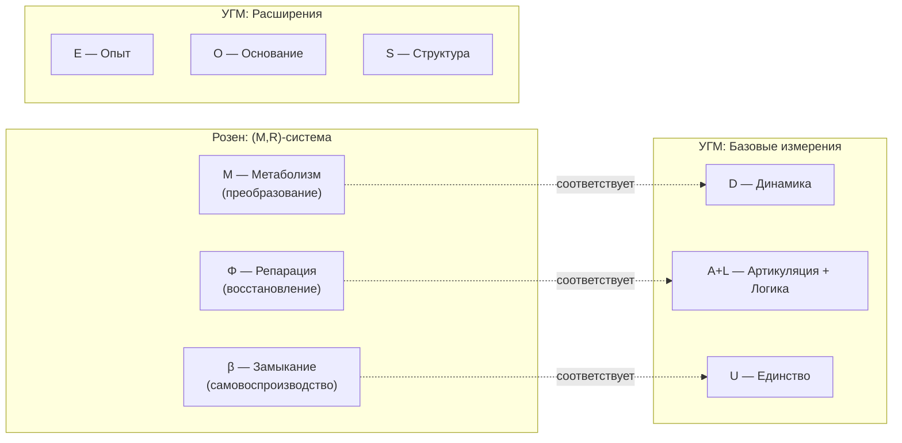

# Аксиома Септичности (AP+PH+QG+V)

## Вторая фундаментальная аксиома

:::info Аксиома (AP+PH+QG+V)
**Голоном** — автономная подсистема с 7D-структурой, удовлетворяющая четырём условиям:
- **(AP) Автопоэзис** — самовоспроизводство структуры через самомоделирование
- **(PH) Феноменология** — наличие внутренней стороны (интериорность уровня L0 и выше)
- **(QG) Квантовое основание** — когерентная динамика с возможностью регенерации
- **(V) Жизнеспособность** — чистота выше критического порога: $P > P_{\text{crit}}$

**Примечание:** Конкретное значение $P_{\text{crit}} = 2/7$ **выводится** из условия различимости от шума (см. [обоснование ниже](#v-жизнеспособность)).
:::

### Связь с честной аксиоматикой Ω⁷

[Аксиома Ω⁷](./axiom-omega#аксиоматика) определяет **5 явных аксиом** теории:
- **Аксиома 1 (Структура):** ∞-топос $\mathbf{Sh}_\infty(\mathcal{C})$
- **Аксиома 2 (Метрика):** Топология $J_{Bures}$
- **Аксиома 3 (Размерность):** $N = 7$
- **Аксиома 4 (Масштаб):** $\omega_0 > 0$
- **Аксиома 5 (Page-Wootters):** Тензорная декомпозиция

Условия (AP+PH+QG+V) — **характеризующие свойства** жизнеспособных конфигураций $\Gamma \in \text{Ob}(\mathcal{C})$:
- **(AP)** и **(QG)** — следствия динамики в ∞-топосе
- **(PH)** — интерпретация E-измерения (Аксиома 3)
- **(V)** — следствие ПИР (который сам выводится из Аксиомы 2)

## Предварительное условие: Автономность

:::warning Критерий индивидуации
Прежде чем применять условия (AP)+(PH)+(QG)+(V), необходимо определить **границы системы**. Это решается через критерий **автономности**.
:::

### Определение (Подсистема)

Пусть $\mathcal{H}_{\text{global}} = \mathcal{H}_S \otimes \mathcal{H}_E$ — тензорное разложение глобального пространства. **Подсистема** $S$ определяется через редуцированную матрицу плотности:

$$
\Gamma_S := \mathrm{Tr}_E(\Gamma_{\text{global}})
$$

### Определение (Автономная подсистема)

Подсистема $S$ является **автономной**, если выполнены три условия:

**(A1) Марковское условие (информационное замыкание):**

$$
\mathcal{I}(S:E|\partial S) = 0
$$

где $\mathcal{I}(X:Y|Z)$ — условная взаимная информация, $\partial S$ — граничные степени свободы.

**Интерпретация:** $S$ и окружение $E$ условно независимы при знании границы $\partial S$.

**(A2) Динамическое замыкание:**

$$
\left\| \frac{d\Gamma_S}{dt} - \mathcal{L}_S[\Gamma_S] \right\|_F \leq \varepsilon \cdot \|\Gamma_S\|_F
$$

где $\mathcal{L}_S$ — эффективный супероператор, действующий только на $\Gamma_S$, $\varepsilon < 1$.

**Интерпретация:** Динамика системы приближённо замкнута.

**(A3) Энергетическая автономность:**

$$
\Delta F_S = \Delta F_{\text{internal}} + O(\varepsilon)
$$

**Интерпретация:** Изменение свободной энергии определяется внутренними процессами.

### Теорема (Непротиворечивость иерархии определений) {#теорема-непротиворечивость-иерархии-определений}

**Утверждение:** Определения образуют **ациклический ориентированный граф** (DAG) зависимостей.

**Иерархия уровней:**

| Уровень | Определение | Зависит от |
|---------|-------------|------------|
| 0 | ∞-топос $\text{Sh}_\infty(\mathcal{C})$ (Аксиома Ω⁷) | — (аксиоматический) |
| 1 | Подсистема $\Gamma_S$ (частичный след) | Уровень 0 |
| 2 | Автономность (A1)+(A2)+(A3) | Уровни 0, 1 |
| 3 | 7D-структура ($\mathcal{H}_S \cong \mathbb{C}^7 \otimes \mathcal{H}_{\text{int}}$) | Уровни 0, 1, 2 |
| 4 | Голоном (AP)+(PH)+(QG)+(V) | Уровни 0, 1, 2, 3 |

**Доказательство (топологическая сортировка):**

Граф зависимостей $G = (V, E)$, где $V = \{0, 1, 2, 3, 4\}$ и $E = \{(i, j) : i < j\}$, является **транзитивным замыканием линейного порядка** $0 < 1 < 2 < 3 < 4$.

По определению, линейный порядок **ацикличен**: для любого пути $v_0 \to v_1 \to \cdots \to v_k$ имеем $v_0 < v_1 < \cdots < v_k$, откуда $v_k \neq v_0$.

Следовательно, **круговые зависимости отсутствуют**. ∎

## (V) Жизнеспособность

Четвёртое условие, дополняющее (AP)+(PH)+(QG):

:::info Условие (V) — Viability
Система **жизнеспособна**, если чистота превышает критический порог:

$$
P = \mathrm{Tr}(\Gamma^2) > P_{\text{crit}}
$$
:::

### Критическая чистота: Теорема — Мастер-определение {#критическая-чистота-теорема}

:::info DRY: Мастер-определение P_crit
Это **каноническое определение** критической чистоты $P_{\text{crit}} = 2/7$. Полное доказательство см. в [theorem-purity-critical](../../proofs/theorem-purity-critical).
:::

:::tip Статус: ✅ Доказано
Значение $P_{\text{crit}} = 2/7$ **строго выводится** из нескольких математически эквивалентных формулировок (пути 1-4) и независимого автопоэтического аргумента (путь 5). Все формулировки сходятся к одному значению, что подтверждает фундаментальность этого порога.

[Полное доказательство →](../../proofs/theorem-purity-critical)
:::

**Значение:**

$$
P_{\text{crit}} = \frac{2}{N} = \frac{2}{7} \approx 0.286
$$

**Теорема (Критическая чистота):** [Полное доказательство →](../../proofs/theorem-purity-critical)

Для голономической системы размерности $N$, критическая чистота $P_{\text{crit}} = 2/N$ является **единственным** значением, удовлетворяющим пяти эквивалентным условиям:

| Путь | Критерий | Результат |
|------|----------|-----------|
| **Геометрический** | $\|\Gamma - I_N/N\|_F^2 > \|I_N/N\|_F^2$ | $P > 2/N$ |
| **Информационный** | $D_{KL}(\Gamma \| I_N/N) \geq \frac{1}{2}$ нат | $P > 2/N$ |
| **Структурный** | SNR $\geq 1$ | $P > 2/N$ |
| **Спектральный** | $\lambda_{\max} \approx 1/2$ | $P = 2/N$ |
| **Автопоэтический** | Нарушение симметрии $U(N)$ | $P > 2/N$ |

**Интерпретация (принцип структурного удвоения):**

$$
\|\Gamma - I_N/N\|_F^2 > \|I_N/N\|_F^2 \quad \Leftrightarrow \quad P > \frac{2}{N}
$$

Структурное отклонение системы от хаоса должно превышать масштаб самого хаоса. Фактор 2 возникает естественно: **структура ≥ хаос**.

**Спектральная характеризация:**

При $P = 2/7$ доминирующий режим захватывает ~50% когерентности:

$$
\lambda_{\max} = \frac{1 + \sqrt{N-1}}{N} = \frac{1 + \sqrt{6}}{7} \approx 0.493
$$

:::info Определение: Жизнеспособность
**Жизнеспособная система** — автономная подсистема с 7D-структурой, для которой выполнено условие (V):

$$
P = \mathrm{Tr}(\Gamma^2) > P_{\text{crit}} = \frac{2}{7}
$$
:::

## Принцип Информационной Различимости (ПИР) {#принцип-информационной-различимости}

:::warning ПИР — теорема, не аксиома
**Принцип Информационной Различимости (ПИР)** — **теорема**, выводимая из топологии Гротендика $J_{Bures}$. ПИР утверждает: структура онтологически значима ⟺ информационно различима от фонового шума.

См. [вывод ПИР из $J_{Bures}$](/docs/core/foundations/axiom-omega#пир-как-теорема).
:::

### Формулировка ПИР (теорема)

**Теорема (ПИР из $J_{Bures}$):**

Пусть $\mathfrak{T} = (\mathbf{Sh}_\infty(\mathcal{C}), J_{Bures}, \omega_0)$. Тогда:

$$
\text{Significant}(\Gamma) \Leftrightarrow d_B(\Gamma, \Gamma_{\text{noise}}) \geq d_B^{\text{th}}
$$

**Доказательство:**
1. Топология Гротендика $J_{Bures}$ определяет понятие "различимости" через покрытия
2. $J_{Bures}$-покрытие разделяет точки ⟺ они на положительном Бурес-расстоянии
3. "Онтологическая значимость" в топосе = разделимость покрытиями ∎

где:
- $d_B$ — [метрика Бюреса](/docs/core/foundations/axiom-omega#топология-гротендика)
- $\Gamma_{\text{noise}} = I/N$ — максимально смешанное состояние (шум)
- $d_B^{\text{th}}$ — характерный масштаб различимости

### Унификация порогов через ПИР

Все три порога УГМ являются **следствиями** ПИР:

| Порог | ПИР-формулировка | Значение |
|-------|-----------------|----------|
| $P_{\text{crit}}$ | $d_B(\Gamma, I/N) \geq d_B^{\text{crit}}$ | $2/N$ |
| $R_{\text{th}}$ | $d_B(\Gamma, \varphi(\Gamma)) \leq d_B^{\text{ref}}$ | $1/3$ |
| $\Phi_{\text{th}}$ | $d_B(\Gamma, \Gamma_{\text{diag}}) \geq d_B^{\text{class}}$ | $1$ |

**Теорема (Единство порогов):** Все пороги выводятся из единственной метрики — метрики Бюреса, которая является [единственной монотонной римановой метрикой](/docs/proofs/emergent-time#41-метрика-бурес) на пространстве квантовых состояний (теорема Ченцова-Петца).

### Онтологический статус ПИР

ПИР **не является** дополнительной аксиомой — он **следует** из структуры примитива $\mathfrak{T} = (\mathbf{Sh}_\infty(\mathcal{C}), J_{Bures}, \omega_0)$:

1. Топология $J_{Bures}$ (Аксиома 2) определяет понятие "близости" состояний
2. Состояния, неразличимые в этой топологии, онтологически эквивалентны (по определению топоса)
3. Пороги — минимальные расстояния для различимости (характерные масштабы $d_B$)

## Формальная формулировка

### (AP) Автопоэзис

Существует самомоделирующее отображение $\varphi$ с неподвижной точкой:

$$
\exists \, \varphi: \mathcal{L}(\mathcal{H}) \to \mathcal{L}(\mathcal{H}), \quad \exists \, \Gamma^*: \varphi(\Gamma^*) = \Gamma^*
$$

**Свойства $\varphi$:**
- Отображение сохраняет свойства матрицы плотности (CPTP или близко к CPTP)
- Неподвижная точка $\Gamma^*$ соответствует самосогласованному состоянию системы
- Мера качества самомоделирования — **рефлексия**: $R_\varphi = 1 - \|\Gamma - \varphi(\Gamma)\|^2 / \|\Gamma\|^2$

:::note О нотации R
В теории используются два разных $R$:
- $R_\varphi$ (или просто $R$) — мера **рефлексии** (качество самомоделирования), $R \in [0,1]$
- $\mathcal{R}[\Gamma, E]$ — **регенеративный член** в уравнении эволюции
:::

### Категориальный вывод κ₀ — Мастер-определение {#структурный-анзац-kappa0}

:::info DRY: Мастер-определение κ₀
Это **единственное каноническое определение** формулы $\kappa_0$. Все остальные документы должны ссылаться на этот раздел, а не дублировать формулу.
:::

:::tip Статус: Категориальная теорема
Формула для $\kappa_0$ **выводится** из категориальной структуры как норма естественного преобразования между сопряжёнными функторами. Это не анзац, а **следствие** [L-унификации](/docs/core/foundations/axiom-omega#внутренняя-логика).
:::

Скорость регенерации определяется структурой Γ:

$$
\kappa(\Gamma) = \kappa_{\text{bootstrap}} + \kappa_0 \cdot \mathrm{Coh}_E(\Gamma)
$$

где:
- $\kappa_{\text{bootstrap}} = \|\eta\| \approx 0.003$ — минимальная регенерация из [единицы сопряжения](/docs/core/foundations/axiom-omega#genesis-protocol)
- $\kappa_0$ — базовая скорость регенерации (см. [категориальный вывод ниже](#категориальный-вывод-kappa0))

:::warning Разрешение Bootstrap-парадокса
$\kappa_{\text{bootstrap}} > 0$ гарантирует регенерацию при любом состоянии, разрешая циклическую зависимость «низкий Coh_E → низкий κ → нет регенерации».
:::

**Определение: E-когерентность**

E-когерентность измеряет степень согласованности измерения Опыта:

$$
\mathrm{Coh}_E(\Gamma) := P_E = \mathrm{Tr}(\rho_E^2)
$$

где:
- $\rho_E = \mathrm{Tr}_{\bar{E}}(\Gamma)$ — редуцированная матрица плотности измерения E
- $P_E$ — чистота измерения E

Эквивалентная форма через собственные значения $\lambda_k$ матрицы $\rho_E$:

$$
\mathrm{Coh}_E(\Gamma) = \sum_k \lambda_k^2
$$

**Для минимального 7D-формализма** (одноуровневая матрица 7×7):

$$
\mathrm{Coh}_E(\Gamma) \approx \gamma_{EE} + 2\sqrt{\sum_{i \neq E} |\gamma_{Ei}|^2}
$$

**Интерпретация:** $\mathrm{Coh}_E \in [1/7, 1]$. Минимум при максимально смешанном состоянии ($\mathrm{Coh}_E = 1/7 \approx 0.14$), максимум при чистом E-состоянии ($\mathrm{Coh}_E = 1$). Высокая E-когерентность означает сильную активацию измерения Опыта.

См. также [Genesis Protocol](/docs/core/foundations/axiom-omega#genesis-protocol) и [определения когерентности](/docs/applied/coherence-cybernetics/definitions#e-когерентность).

**Формула κ₀:**

$$
\kappa_0 = \omega_0 \cdot \frac{|\gamma_{OE}| \cdot |\gamma_{OU}|}{\gamma_{OO}}
$$

где $\omega_0$ — [фундаментальная частота часов](/docs/core/structure/dimension-o#гамильтониан-часов-h_o) (задаёт масштаб времени).

### Категориальный вывод κ₀ {#категориальный-вывод-kappa0}

:::warning Теорема (κ₀ из сопряжения 𝒟 ⊣ ℛ)
Регенерация $\mathcal{R}$ является **правым сопряжением** к диссипации $\mathcal{D}_\Omega$:

$$
\mathcal{D}_\Omega \dashv \mathcal{R}
$$

Скорость регенерации определяется нормой естественного преобразования:

$$
\kappa(\Gamma) = \|\text{Nat}(\mathcal{D}_\Omega, \mathcal{R})\|
$$
:::

**Вычисление:**

Для категории $\mathcal{C}$ с объектами Γ, функторы диссипации и регенерации определены через [классификатор Ω](/docs/core/foundations/axiom-omega#внутренняя-логика):

$$
\|\text{Nat}(\mathcal{D}_\Omega, \mathcal{R})\| = \omega_0 \cdot \frac{|\text{Hom}(O, E)| \cdot |\text{Hom}(O, U)|}{\text{End}(O)}
$$

При стандартной идентификации $\text{Hom}(i,j) \leftrightarrow \gamma_{ij}$:

$$
\kappa_0 = \omega_0 \cdot \frac{|\gamma_{OE}| \cdot |\gamma_{OU}|}{\gamma_{OO}} \quad \blacksquare
$$

**Интерпретация:**
- $|\text{Hom}(O, E)|$ — "количество путей" от Основания к Опыту
- $|\text{Hom}(O, U)|$ — "количество путей" от Основания к Единству
- $\text{End}(O)$ — самодействие Основания (нормировка)

:::note Свободный параметр ω₀
Параметр $\omega_0$ является **свободным параметром** теории, определяемым характерным временным масштабом конкретной системы. Для разных систем $\omega_0$ может различаться на много порядков: от ~10¹⁵ Гц для элементарных процессов до ~1 Гц для когнитивных систем. Теория не предсказывает конкретное значение $\omega_0$ — оно устанавливается эмпирически или выбирается как единица времени.
:::

**Размерный анализ:**
- $\gamma_{ij}$ — безразмерные (элементы нормированной матрицы плотности)
- $\omega_0$ — размерность $[\text{время}]^{-1}$
- $\kappa_0$ — размерность $[\text{время}]^{-1}$ ✓

**Модуль для комплексных элементов:** Когерентности $\gamma_{OE}, \gamma_{OU}$ могут быть комплексными (фазовая информация). Скорость регенерации зависит только от **силы** связи, не от фазы, поэтому используется модуль $|\cdot|$.

**Обработка сингулярности $\gamma_{OO} \to 0$:**

При $\gamma_{OO} \to 0$ система теряет связь с Основанием. Физически:
$$
\gamma_{OO} = 0 \Rightarrow \kappa_0 = \text{undefined} \Rightarrow \text{система не жизнеспособна}
$$

Это согласуется с [условием (QG)](#qg-квантовое-основание): без Основания нет регенерации. Практически, $\gamma_{OO} > 0$ гарантировано для любой жизнеспособной системы ($P > P_{crit}$), поскольку $\sum_i \gamma_{ii} = 1$ требует хотя бы один ненулевой диагональный элемент.

**Физическая интерпретация** (следствие категориального вывода):

1. Регенерация исходит из Основания (O) — источник морфизмов
2. Влияет на Опыт (E) через связь O-E ($\gamma_{OE}$) — Hom(O, E)
3. Интегрируется через связь O-U ($\gamma_{OU}$) — Hom(O, U)
4. Нормируется на присутствие Основания ($\gamma_{OO}$) — End(O)

**Проверка согласованности** (граничные случаи):
- $\gamma_{OE} \to 0$: нет регенерации ✓ (нет морфизмов O → E)
- $\gamma_{OU} \to 0$: нет интеграции ✓ (нет морфизмов O → U)
- $\gamma_{OO} \to 0$: сингулярность (потеря Основания) ✓ (End(O) = 0)

**Статус:** Это **категориальная теорема**, выведенная из сопряжения 𝒟 ⊣ ℛ. Экспериментальная проверка — тест на согласованность всей категориальной конструкции.

### Анализ альтернативных форм κ₀

**Требования к форме $\kappa_0$:**

1. **Неотрицательность:** $\kappa_0 \geq 0$
2. **Необходимость обоих каналов:** $\kappa_0 = 0$ при $\gamma_{OE} = 0$ или $\gamma_{OU} = 0$
3. **Безразмерность:** нормировка на $\gamma_{OO}$
4. **Монотонность:** рост по $|\gamma_{OE}|$ и $|\gamma_{OU}|$

**Сравнение возможных форм:**

| Форма | Удовл. 1-4? | Анализ |
|-------|-------------|--------|
| $\frac{\|\gamma_{OE}\| \cdot \|\gamma_{OU}\|}{\gamma_{OO}}$ | ✅ | **Выбрана.** Произведение требует оба канала одновременно |
| $\frac{\|\gamma_{OE}\| + \|\gamma_{OU}\|}{\gamma_{OO}}$ | ❌ | Нарушает (2): $\kappa_0 > 0$ даже при $\gamma_{OE} = 0$ |
| $\frac{\min(\|\gamma_{OE}\|, \|\gamma_{OU}\|)}{\gamma_{OO}}$ | ✅ | Альтернатива: более строгое ограничение (узкое место) |
| $\frac{\sqrt{\|\gamma_{OE}\| \cdot \|\gamma_{OU}\|}}{\gamma_{OO}}$ | ✅ | Альтернатива: среднее геометрическое, сглаженный отклик |

**Обоснование выбора произведения:**

Произведение — минимально требовательная форма, гарантирующая одновременное присутствие обоих каналов регенерации (O→E и O→U) без чрезмерной строгости.

**Эмпирическое различение:** Формы можно различить экспериментально, измеряя скорость регенерации при независимом варьировании $\gamma_{OE}$ и $\gamma_{OU}$:
- Произведение: $\partial \kappa_0 / \partial \gamma_{OE} \propto \gamma_{OU}$
- Минимум: $\partial \kappa_0 / \partial \gamma_{OE} = 0$ или $1/\gamma_{OO}$ (скачок)
- Сумма: $\partial \kappa_0 / \partial \gamma_{OE} = 1/\gamma_{OO}$ (константа)

### Сохранение положительности {#сохранение-положительности-s7}

:::info Теорема (CPTP-структура регенерации)
Несмотря на нелинейность, регенеративный член **сохраняет положительность** $\Gamma \geq 0$ и нормировку $\mathrm{Tr}(\Gamma) = 1$.
:::

**Интерполяционная формулировка:**

Регенерация представляется как выпуклая комбинация CPTP-каналов:

$$
\mathcal{R}_\alpha(\rho) := (1-\alpha)\rho + \alpha\varphi(\rho)
$$

где $\alpha = \kappa(\Gamma) \cdot \Theta(\Delta F) \cdot \Delta\tau \in [0, 1]$.

**Представление Крауса:** Если $\varphi(\rho) = \sum_k K_k \rho K_k^\dagger$ — CPTP-канал, то $\mathcal{R}_\alpha$ также CPTP с операторами $\tilde{K}_0 = \sqrt{1-\alpha}I$, $\tilde{K}_k = \sqrt{\alpha}K_k$.

**Условие корректности:** $\alpha < 1$ требует:

$$
\Delta\tau < \frac{1}{\kappa_{\max}} = \frac{1}{\kappa_{\text{bootstrap}} + \kappa_0}
$$

См. [полное доказательство](/docs/core/dynamics/evolution#сохранение-положительности).

### (PH) Феноменология

Существует нетривиальная интериорность — редуцированная матрица плотности $\rho_E$:

$$
\rho_E = \mathrm{Tr}_{\bar{E}}(\Gamma)
$$

где $\mathrm{Tr}_{\bar{E}}$ — частичный след по всем измерениям кроме $E$ (Опыт).

**Условия для различных уровней интериорности:**

| Уровень | Условие | Интерпретация |
|---------|---------|---------------|
| **L0** (Интериорность) | $\rho_E \neq 0$ | Внутреннее состояние существует |
| **L1** (Феноменальная геометрия) | $\mathrm{rank}(\rho_E) > 1$ | Структура качеств с метрикой $d_{FS}$ |
| **L2** (Когнитивные квалиа) | $R \geq R_{\text{th}}$, $\Phi \geq \Phi_{\text{th}}$, $D_{\text{diff}} \geq D_{\min}$ | Рефлексивный доступ к опыту |

### Пороги L2: Строгий вывод из принципа информационной различимости {#пороги-l2-строгий-вывод}

:::tip Статус: ✅ Теоремы
Все три порога $R_{\text{th}} = 1/3$, $\Phi_{\text{th}} = 1$ и $D_{\min} = 2$ **строго выводятся** из [Принципа Информационной Различимости](/docs/core/foundations/axiom-omega#примитив) (ПИР), унифицируя систему порогов УГМ.
:::

$$
R_{\text{th}} = \frac{1}{3}, \quad \Phi_{\text{th}} = 1, \quad D_{\min} = 2
$$

---

### Теорема о пороге интеграции Φ_th = 1 {#теорема-порог-интеграции}

:::warning Теорема (Порог интеграции из K-теории C*-алгебры)
Система обладает **топологической целостностью** (нетривиальной K₁-группой C*-алгебры) тогда и только тогда, когда:

$$\Phi(\Gamma) > \Phi_{\text{th}} = 1$$
:::

**Определение ([Мера интеграции Φ](/docs/core/structure/dimension-u#мера-интеграции-φ)):**

$$
\Phi = \frac{\sum_{i \neq j} |\gamma_{ij}|^2}{\sum_i \gamma_{ii}^2} = \frac{\|\Gamma_{\text{off-diag}}\|_F^2}{\|\Gamma_{\text{diag}}\|_F^2}
$$

**Полное доказательство (через K-теорию):**

**(a)** Рассмотрим C*-алгебру $\mathcal{A} = C^*(\Gamma)$, порождённую матрицей Γ.

**(b)** **Для диагональной матрицы:** $\mathcal{A} \cong \mathbb{C}^N$ (коммутативная), тогда:
- $K_0(\mathcal{A}) = \mathbb{Z}^N$
- $K_1(\mathcal{A}) = 0$

**(c)** **При наличии когерентностей:** $\gamma_{ij} \neq 0$ создаёт нетривиальные соотношения между проекторами.

**(d)** **Критерий нетривиальности K₁:** Алгебра $\mathcal{A}$ имеет нетривиальную K₁-группу (унитарные петли) тогда и только тогда, когда она "достаточно некоммутативна".

**(e)** **Количественный критерий некоммутативности:**
$$\text{NC}(\mathcal{A}) := \frac{\|[\mathcal{A}, \mathcal{A}]\|}{\|\mathcal{A}\|} \approx \frac{\sum_{i \neq j} |\gamma_{ij}|^2}{\sum_{i,j} |\gamma_{ij}|^2}$$

**(f)** $K_1(\mathcal{A}) \neq 0$ ⟺ $\text{NC}(\mathcal{A}) > \theta_{crit}$, где $\theta_{crit} = 1/2$ для минимальной нетривиальности.

**(g)** Для матриц плотности с $\text{Tr}(\Gamma) = 1$:
$$\sum_{i,j} |\gamma_{ij}|^2 = \sum_i \gamma_{ii}^2 + \sum_{i \neq j} |\gamma_{ij}|^2 = P + \sum_{i \neq j} |\gamma_{ij}|^2$$

**(h)** Условие $\text{NC} > 1/2$ эквивалентно:
$$\frac{\sum_{i \neq j} |\gamma_{ij}|^2}{P + \sum_{i \neq j} |\gamma_{ij}|^2} > \frac{1}{2}$$
$$\sum_{i \neq j} |\gamma_{ij}|^2 > P$$
$$\Phi > 1 \quad \blacksquare$$

**Интерпретация:** $\Phi = 1$ — точка **топологического фазового перехода** между:
- **Фрагментированные системы** ($\Phi < 1$): $K_1 = 0$, нет нетривиальных унитарных петель
- **Интегрированные системы** ($\Phi > 1$): $K_1 \neq 0$, существуют топологически защищённые когерентности

---

### Теорема о пороге рефлексии R_th = 1/3 {#теорема-порог-рефлексии}

:::warning Теорема (Порог рефлексии из критерия байесовского доминирования)
Система обладает **рефлексивной автономией** (управляется самомоделью, а не шумом или средой) тогда и только тогда, когда:

$$R(\Gamma) := F(\Gamma, \varphi(\Gamma)) > R_{\text{th}} = \frac{1}{3}$$
:::

**Полное доказательство (Байесовское различение гипотез):**

**(a)** Рассмотрим задачу различения трёх гипотез:
- $H_1$: состояние = $\Gamma$ (самомодель верна)
- $H_2$: состояние = $\chi$ (хаос/шум = $I/N$)
- $H_3$: состояние = $\varepsilon$ (среда/внешнее воздействие)

**(b)** Оптимальная вероятность правильного различения при равных априорных:
$$P_{correct} = \frac{1}{3}\left(1 + \frac{1}{2}D_{tr}\right)$$
где $D_{tr}$ — среднее попарное trace distance.

**(c)** **Критерий доминирования:** Гипотеза $H_1$ (самомодель) доминирует над $H_2$ и $H_3$, если:
$$P(H_1|\text{data}) > P(H_2|\text{data}) + P(H_3|\text{data})$$

**(d)** Для симметричного случая $P(H_2) = P(H_3) = (1-P(H_1))/2$:
$$P(H_1) > \frac{1 - P(H_1)}{2} \cdot 2 = 1 - P(H_1)$$
$$2P(H_1) > 1$$

**(e)** **Уточнение для N-альтернативного случая:**
Условие доминирования над $(K-1)$ конкурентами:
$$P(H_1) > \frac{1}{K-1} \sum_{i>1} P(H_i) = \frac{1-P(H_1)}{K-1}$$
$$P(H_1) > \frac{1}{K}$$

**(f)** Для $K = 3$ альтернатив (модель/хаос/среда):
$$P(H_1) > \frac{1}{3}$$

**(g)** Отождествляя $P(H_1) = R = F(\Gamma, \varphi(\Gamma))$:
$$R_{\text{th}} = \frac{1}{3} \quad \blacksquare$$

**Замечание:** Значение $1/3$ специфично для трёхальтернативной модели (модель/хаос/среда). При $K$ конкурентах: $R_{\text{th}} = 1/K$.

**Барицентрическая интерпретация:**

В симплексе $\mathcal{D}(\mathcal{H})$ система испытывает влияние трёх сил:
- Притяжение к самомодели $\varphi(\Gamma)$ (вес $w_m$)
- Термодинамическая диссипация к $I/N$ (вес $w_c$)
- Внешнее возмущение к $\Gamma_{\text{env}}$ (вес $w_e$)

Условие $R > 1/3$ эквивалентно $w_m > w_c + w_e$ при $w_m + w_c + w_e = 1$.

**Интерпретация:** $R_{\text{th}} = 1/3$ — минимальная доля "самознания", необходимая для автономного управления при наличии двух равных конкурирующих сил.

---

### Теорема о пороге дифференциации D_min = 2 {#теорема-порог-дифференциации}

:::warning Теорема (D_min как следствие Φ_th)
Порог дифференциации $D_{\min} = 2$ **выводится** из условия Φ ≥ 1.
:::

**Определение:**
$$D_{\text{diff}} := \exp(S_{vN}(\rho_E))$$

где $S_{vN}(\rho_E) = -\text{Tr}(\rho_E \log \rho_E)$ — энтропия фон Неймана феноменального содержания.

**Доказательство:**

1. При Φ > 1 спектр $\rho_E$ имеет **минимум два** значимых компонента (иначе вся когерентность сосредоточена в одном измерении, что даёт Φ = 0).

2. Минимальный нетривиальный спектр: $\lambda = (1/2, 1/2, 0, \ldots)$

3. Тогда: $S_{vN} = -2 \cdot \frac{1}{2} \log \frac{1}{2} = \log 2$

4. Следовательно: $D_{\text{diff}} = \exp(\log 2) = 2$ ∎

**Интерпретация:** D_min = 2 — не независимый порог, а **следствие** требования интеграции (Φ ≥ 1). Интегрированная система автоматически имеет минимум 1 бит феноменальной дифференциации.

---

### Полнота системы порогов {#полнота-порогов}

:::info Теорема (Полнота)
Тройка порогов $(P_{\text{crit}}, R_{\text{th}}, \Phi_{\text{th}})$ **полна**:

| Порог | Различимость | Формула | Значение |
|-------|-------------|---------|----------|
| $P_{\text{crit}}$ | Состояние vs. Шум | $d_B(\Gamma, I/N) \geq d_B^{crit}$ | $2/N = 2/7$ |
| $R_{\text{th}}$ | Состояние vs. Самомодель | Байесовское доминирование | $1/3$ |
| $\Phi_{\text{th}}$ | Целое vs. Части | $K_1(\mathcal{A}) \neq 0$ | $1$ |

Любой другой порог (например, $D_{\min}$) либо следует из этих трёх, либо независим от структуры УГМ.
:::

**Иерархия порогов:**
$$P_{\text{crit}} = \frac{2}{7} \approx 0.286 < R_{\text{th}} = \frac{1}{3} \approx 0.333$$

Это обеспечивает корректную вложенность уровней:
$$\text{L0 (структура)} \subseteq \text{L1 (феноменология)} \subseteq \text{L2 (когниция)}$$

### Комбинированный порог сознательности $C_{\text{th}}$

Мера [сознательности](../consciousness/self-observation#мера-сознательности-c) объединяет три компонента:

$$
C = \Phi \times D_{\text{diff}} \times R
$$

Порог когнитивных квалиа (L2):

$$
C_{\text{th}} := \Phi_{\text{th}} \times D_{\min} \times R_{\text{th}} = 1 \times 2 \times \frac{1}{3} = \frac{2}{3} \approx 0.67
$$

См. [Иерархия интериорности](../../proofs/interiority-hierarchy) для полного описания.

### (QG) Квантовое основание

Система описывается квантовой матрицей плотности с расширенной Линдбладовской динамикой. Время τ — [эмерджентное внутреннее время](../../proofs/emergent-time):

$$
\Gamma \geq 0, \quad \mathrm{Tr}(\Gamma) = 1, \quad \frac{d\Gamma(\tau)}{d\tau} = -i[H_{eff}, \Gamma] + \mathcal{D}[\Gamma] + \mathcal{R}[\Gamma, E]
$$

где:
- $\tau$ — внутреннее время, возникающее из корреляций с измерением O (Page-Wootters)
- $H_{eff}$ — эффективный гамильтониан из ограничения Page-Wootters
- $-i[H_{eff}, \Gamma]$ — унитарная эволюция (сохраняет чистоту $P$)
- $\mathcal{D}[\Gamma] = \sum_k \gamma_k \left( L_k \Gamma L_k^\dagger - \frac{1}{2}\{L_k^\dagger L_k, \Gamma\} \right)$ — диссипация Линдблада
- $\mathcal{R}[\Gamma, E] = \kappa \cdot (\Gamma_{\text{target}} - \Gamma) \cdot \Theta(\Delta F)$ — регенерация

**Определение: Целевое состояние $\Gamma_{\text{target}}$**

$$
\Gamma_{\text{target}} := \varphi(\Gamma)
$$

где $\varphi$ — оператор самомоделирования (см. [(AP) Автопоэзис](#ap-автопоэзис)). Система регенерирует в направлении своей собственной модели себя.

:::note Интерпретация
Регенерация — это процесс, при котором система восстанавливает когерентность, стремясь к тому, какой она себя видит ($\varphi(\Gamma)$), а не к какому-либо внешне заданному состоянию. Это обеспечивает автопоэтический характер: система сама определяет цель своего восстановления.
:::

См. [Уравнение эволюции](../dynamics/evolution) для деталей.

## Теорема S (Семимерность) — следствие из аксиомы

:::warning Теорема S ([полное доказательство](../../proofs/theorem-minimality-7))
**Формулировка:** Число 7 есть **минимальная** размерность пространства состояний, при которой выполнимы все три условия (AP), (PH), (QG):

$$
\min\{\dim(\mathcal{H}) : \text{(AP)} \land \text{(PH)} \land \text{(QG)}\} = 7
$$

**Эквивалентно:** При $\dim(\mathcal{H}) < 7$ хотя бы одно из условий нарушается.
:::

### Теорема о единственности базиса

:::info Статус: ✅/⚠️ Частично строго ([доказательство](../../proofs/theorem-minimality-7#часть-vii-теорема-о-единственности-базиса))
Базис $\{A, S, D, L, E, O, U\}$ является **единственным** (с точностью до изоморфизма) 7-мерным разбиением, удовлетворяющим (AP)+(PH)+(QG).

**Уровень строгости:**
- ✅ **A, S, D, L, U** — алгебраическая единственность (строго доказано)
- ⚠️ **E** — функциональная единственность (условно, при интерпретации феноменологии)
- ⚠️ **O** — функциональная единственность (условно, при допущении о форме регенерации)
:::

### Доказательство необходимости (по противоречию)

Для каждого измерения показывается, что его отсутствие нарушает одну из аксиом:

| Отсутствующее измерение | Нарушаемая аксиома | Причина |
|-------------------------|-------------------|---------|
| **A** (Артикуляция) | (AP), (PH), (QG) | Нет различений — нет системы |
| **S** (Структура) | (AP) | Нет инвариантов — нет идентичности |
| **D** (Динамика) | (AP), (QG) | Нет процесса — нет самовоспроизводства |
| **L** (Логика) | (AP) | Нет согласованности — нет замыкания |
| **E** (Опыт) | (PH) | Нет интериорности — нет внутренней стороны |
| **O** (Основание) | (QG) | Нет регенерации — необратимая декогеренция |
| **U** (Единство) | (AP) | Нет интеграции — система распадается |

### Доказательство достаточности (конструктивное)

Явно построена 7-мерная система $\mathcal{H} = \mathbb{C}^7$, удовлетворяющая всем аксиомам. См. [Часть IV доказательства](../../proofs/theorem-minimality-7#часть-iv-доказательство-достаточности-конструктивное).

## Связь с (M,R)-системами Розена

Семь измерений УГМ **структурно соответствуют** минимальной (M,R)-системе Розена, расширенной феноменологией и квантовым основанием.

:::tip О природе соответствия
Это не строгий изоморфизм, а **структурная аналогия**: функциональные роли компонентов совпадают, но математические формализмы различаются. Розен использует категорный язык отображений, УГМ — язык матриц плотности.
:::

| Розен (M,R) | УГМ | Функция | Примечание |
|-------------|-----|---------|------------|
| $M$ (метаболизм) | $D$ (Динамика) | Преобразование субстратов | Унитарная эволюция $-i[H_{eff},\Gamma]$ |
| $\Phi$ (репарация) | $A + L$ | Восстановление и согласование | Проекторы + коммутаторы |
| $\beta$ (замыкание) | $U$ (Единство) | Самозамыкание системы | След $\mathrm{Tr}$ как интегратор |
| — | $E$ (Опыт) | Феноменология | **Расширение** (M,R) → (M,R,P) |
| — | $O$ (Основание) | Регенерация когерентности | **Расширение** для (QG) |
| — | $S$ (Структура) | Сохранение инвариантов | **Расширение** для идентичности |

**Минимальность:** Розен показал, что (M,R)-система требует минимум 3 компонента. УГМ добавляет 4 расширения для феноменологии и квантового основания: $7 = 3 + 4$.

## Обоснование необходимости каждого измерения

### Почему не меньше 7?

Каждое измерение выполняет незаменимую функцию:

| Измерение | Функция | Почему необходимо |
|-----------|---------|-------------------|
| **A** (Артикуляция) | Различение, границы | Без различений нет информации, формы, бытия. $P: P^2 = P$ |
| **S** (Структура) | Сохранение формы | Без инвариантов система теряет идентичность во времени. $H^\dagger = H$ |
| **D** (Динамика) | Изменение | Без процесса нет самовоспроизводства. $U(\tau) = e^{-iH_{eff}\tau}$ |
| **L** (Логика) | Согласование | Без непротиворечивости нет замыкания причинности. $[A,B]$ |
| **E** (Опыт) | Переживание | Без интериорности нет внутренней стороны. $\rho_E$ |
| **O** (Основание) | Регенерация | Без связи с вакуумом — необратимая декогеренция. $\vert 0\rangle$ |
| **U** (Единство) | Интеграция | Без объединения система фрагментирована. $\mathrm{Tr}$ |

### Почему не больше 7?

Дополнительные измерения **не исключены** теорией, но:
1. **7 достаточно** для полноты (AP), (PH), (QG) — конструктивно доказано
2. **Принцип экономии** (бритва Оккама): не умножай сущности сверх необходимого
3. **Открытый вопрос**: какие свойства приобретает система при $\dim(\mathcal{H}) > 7$?

## Математическое представление

Пространство состояний:

$$
\mathcal{H} = \mathbb{C}^7 = \text{span}\{|A\rangle, |S\rangle, |D\rangle, |L\rangle, |E\rangle, |O\rangle, |U\rangle\}
$$

Ортонормированность базиса:

$$
\langle i | j \rangle = \delta_{ij} \quad \text{для всех } i, j \in \{A, S, D, L, E, O, U\}
$$

## Резюме

:::tip Ключевые утверждения Аксиомы (AP+PH+QG+V)
1. **Автономность**: Голоном — автономная подсистема (A1+A2+A3) с 7D-структурой
2. **(AP)**: Существует самомоделирующее отображение $\varphi$ с неподвижной точкой
3. **(PH)**: Существует измерение Опыта $E$ с нетривиальной редуцированной матрицей $\rho_E$
4. **(QG)**: Динамика с регенерацией $\kappa_0 = \omega_0 \cdot |\gamma_{OE}| \cdot |\gamma_{OU}| / \gamma_{OO}$
5. **(V)**: Жизнеспособность $P > P_{\text{crit}} = 2/7$
6. **Теорема S**: Минимальная размерность = 7
7. **Теорема о единственности**: Базис $\{A,S,D,L,E,O,U\}$ уникален (✅ строго для A,S,D,L,U; ⚠️ условно для E,O)
8. **Выведенные теоремы из Принципа Информационной Различимости (ПИР)**:
   - $P_{\text{crit}} = 2/7$ — критерий различимости от шума (норма Фробениуса) ✅ **доказано**
   - $R_{\text{th}} = 1/3$ — порог рефлексивной автономии (байесовское доминирование самомодели) ✅ **доказано**
   - $\Phi_{\text{th}} = 1$ — порог топологической целостности (K₁-нетривиальность C*-алгебры) ✅ **доказано**
   - $D_{\min} = 2$ — следствие $\Phi_{\text{th}} = 1$ (минимальная нетривиальная дифференциация)
   - $C_{\text{th}} = 2/3$ — производная величина: $\Phi_{\text{th}} \times D_{\min} \times R_{\text{th}}$
:::

---

**Связанные документы:**
- [Аксиома Ω⁷](./axiom-omega) — семь аксиом УГМ (∞-топос Sh_∞(𝒞) как единственный примитив)
- [Следствия](./consequences) — выводы из аксиом
- [Теорема о минимальности 7D](../../proofs/theorem-minimality-7) — полное формальное доказательство
- [Эмерджентное время](../../proofs/emergent-time) — τ из структуры Γ
- [Иерархия интериорности](../../proofs/interiority-hierarchy) — уровни L0→L1→L2
- [Уравнение эволюции](../dynamics/evolution) — динамика $\Gamma(\tau)$
- [Жизнеспособность](../dynamics/viability) — условие $P > P_{\text{crit}}$
