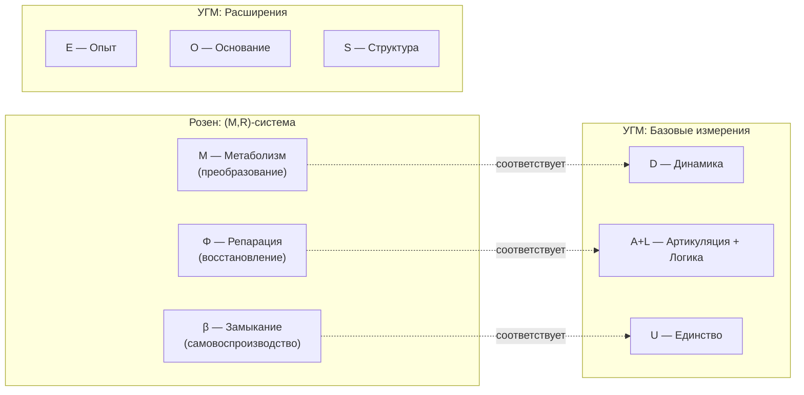

# Аксиома (AP+PH+QG)

## Вторая фундаментальная аксиома

:::info Аксиома (AP+PH+QG)
Любая **жизнеспособная система** (Голоном) обладает тремя свойствами:
- **(AP) Автопоэзис** — самовоспроизводство структуры через самомоделирование
- **(PH) Феноменология** — наличие внутренней стороны (интериорность уровня L0 и выше)
- **(QG) Квантовое основание** — когерентная динамика с возможностью регенерации
:::

### Определение жизнеспособности

**Жизнеспособная система** — это система, чистота которой поддерживается выше критического порога:

$$
P = \mathrm{Tr}(\Gamma^2) > P_{\text{critical}} \approx 0.3
$$

При $P < P_{\text{critical}}$ система входит в необратимый распад (декогеренция до $P \to 1/7$).

### Связь с Аксиомой Ω

[Аксиома Ω](./axiom-omega) постулирует *природу* субстанции ($\Gamma$ как единственный примитив). Аксиома (AP+PH+QG) постулирует *свойства*, которыми должна обладать жизнеспособная конфигурация $\Gamma$.

## Формальная формулировка

### (AP) Автопоэзис

Существует самомоделирующее отображение $\varphi$ с неподвижной точкой:

$$
\exists \, \varphi: \mathcal{L}(\mathcal{H}) \to \mathcal{L}(\mathcal{H}), \quad \exists \, \Gamma^*: \varphi(\Gamma^*) = \Gamma^*
$$

**Свойства $\varphi$:**
- Отображение сохраняет свойства матрицы плотности (CPTP или близко к CPTP)
- Неподвижная точка $\Gamma^*$ соответствует самосогласованному состоянию системы
- Мера качества самомоделирования — **рефлексия**: $R_\varphi = 1 - \|\Gamma - \varphi(\Gamma)\|^2 / \|\Gamma\|^2$

:::note О нотации R
В теории используются два разных $R$:
- $R_\varphi$ (или просто $R$) — мера **рефлексии** (качество самомоделирования), $R \in [0,1]$
- $\mathcal{R}[\Gamma, E]$ — **регенеративный член** в уравнении эволюции

Регенеративный член имеет **два аргумента**, потому что скорость регенерации $\kappa$ зависит от когерентности в измерении Опыта:
$$
\kappa(\Gamma) = \kappa_0 \cdot \mathrm{Coh}_E(\Gamma)
$$
Это ключевое предсказание: "качество опыта" влияет на физическое восстановление системы.
:::

### (PH) Феноменология

Существует нетривиальная интериорность — редуцированная матрица плотности $\rho_E$:

$$
\rho_E = \mathrm{Tr}_{\bar{E}}(\Gamma)
$$

где $\mathrm{Tr}_{\bar{E}}$ — частичный след по всем измерениям кроме $E$ (Опыт).

**Условия для различных уровней интериорности:**

| Уровень | Условие | Интерпретация |
|---------|---------|---------------|
| **L0** (Интериорность) | $\rho_E \neq 0$ | Внутреннее состояние существует |
| **L1** (Феноменальная геометрия) | $\mathrm{rank}(\rho_E) > 1$ | Структура качеств с метрикой $d_{FS}$ |
| **L2** (Когнитивные квалиа) | $R_\varphi \geq R_{th}$, $\Phi \geq \Phi_{th}$ | Рефлексивный доступ к опыту |

Пороговые значения $R_{th} = 0.3$, $\Phi_{th} = 1.0$ имеют [эмпирическое обоснование](../../proofs/interiority-hierarchy#обоснование-порогов).

См. [Иерархия интериорности](../../proofs/interiority-hierarchy) для полного описания.

### (QG) Квантовое основание

Система описывается квантовой матрицей плотности с расширенной Линдбладовской динамикой:

$$
\Gamma \geq 0, \quad \mathrm{Tr}(\Gamma) = 1, \quad \frac{d\Gamma}{dt} = -i[H, \Gamma] + \mathcal{D}[\Gamma] + \mathcal{R}[\Gamma, E]
$$

где:
- $-i[H, \Gamma]$ — унитарная эволюция (сохраняет чистоту $P$)
- $\mathcal{D}[\Gamma] = \sum_k \gamma_k \left( L_k \Gamma L_k^\dagger - \frac{1}{2}\{L_k^\dagger L_k, \Gamma\} \right)$ — диссипация Линдблада
- $\mathcal{R}[\Gamma, E] = \kappa \cdot (\Gamma_{\text{target}} - \Gamma) \cdot \Theta(\Delta F)$ — регенерация

См. [Уравнение эволюции](../dynamics/evolution) для деталей.

## Теорема S (Семимерность) — следствие из аксиомы

:::warning Теорема S ([полное доказательство](../../proofs/theorem-minimality-7))
**Формулировка:** Число 7 есть **минимальная** размерность пространства состояний, при которой выполнимы все три условия (AP), (PH), (QG):

$$
\min\{\dim(\mathcal{H}) : \text{(AP)} \land \text{(PH)} \land \text{(QG)}\} = 7
$$

**Эквивалентно:** При $\dim(\mathcal{H}) < 7$ хотя бы одно из условий нарушается.
:::

### Доказательство необходимости (по противоречию)

Для каждого измерения показывается, что его отсутствие нарушает одну из аксиом:

| Отсутствующее измерение | Нарушаемая аксиома | Причина |
|-------------------------|-------------------|---------|
| **A** (Артикуляция) | (AP), (PH), (QG) | Нет различений — нет системы |
| **S** (Структура) | (AP) | Нет инвариантов — нет идентичности |
| **D** (Динамика) | (AP), (QG) | Нет процесса — нет самовоспроизводства |
| **L** (Логика) | (AP) | Нет согласованности — нет замыкания |
| **E** (Опыт) | (PH) | Нет интериорности — нет внутренней стороны |
| **O** (Основание) | (QG) | Нет регенерации — необратимая декогеренция |
| **U** (Единство) | (AP) | Нет интеграции — система распадается |

### Доказательство достаточности (конструктивное)

Явно построена 7-мерная система $\mathcal{H} = \mathbb{C}^7$, удовлетворяющая всем аксиомам. См. [Часть IV доказательства](../../proofs/theorem-minimality-7#часть-iv-доказательство-достаточности-конструктивное).

## Связь с (M,R)-системами Розена

Семь измерений УГМ **структурно соответствуют** минимальной (M,R)-системе Розена, расширенной феноменологией и квантовым основанием.

:::tip О природе соответствия
Это не строгий изоморфизм, а **структурная аналогия**: функциональные роли компонентов совпадают, но математические формализмы различаются. Розен использует категорный язык отображений, УГМ — язык матриц плотности.
:::

| Розен (M,R) | УГМ | Функция | Примечание |
|-------------|-----|---------|------------|
| $M$ (метаболизм) | $D$ (Динамика) | Преобразование субстратов | Унитарная эволюция $-i[H,\Gamma]$ |
| $\Phi$ (репарация) | $A + L$ | Восстановление и согласование | Проекторы + коммутаторы |
| $\beta$ (замыкание) | $U$ (Единство) | Самозамыкание системы | След $\mathrm{Tr}$ как интегратор |
| — | $E$ (Опыт) | Феноменология | **Расширение** (M,R) → (M,R,P) |
| — | $O$ (Основание) | Регенерация когерентности | **Расширение** для (QG) |
| — | $S$ (Структура) | Сохранение инвариантов | **Расширение** для идентичности |

**Минимальность:** Розен показал, что (M,R)-система требует минимум 3 компонента. УГМ добавляет 4 расширения для феноменологии и квантового основания: $7 = 3 + 4$.

## Обоснование необходимости каждого измерения

### Почему не меньше 7?

Каждое измерение выполняет незаменимую функцию:

| Измерение | Функция | Почему необходимо |
|-----------|---------|-------------------|
| **A** (Артикуляция) | Различение, границы | Без различений нет информации, формы, бытия. $P: P^2 = P$ |
| **S** (Структура) | Сохранение формы | Без инвариантов система теряет идентичность во времени. $H^\dagger = H$ |
| **D** (Динамика) | Изменение | Без процесса нет самовоспроизводства. $U(t) = e^{-iHt}$ |
| **L** (Логика) | Согласование | Без непротиворечивости нет замыкания причинности. $[A,B]$ |
| **E** (Опыт) | Переживание | Без интериорности нет внутренней стороны. $\rho_E$ |
| **O** (Основание) | Регенерация | Без связи с вакуумом — необратимая декогеренция. $\vert 0\rangle$ |
| **U** (Единство) | Интеграция | Без объединения система фрагментирована. $\mathrm{Tr}$ |

### Почему не больше 7?

Дополнительные измерения **не исключены** теорией, но:
1. **7 достаточно** для полноты (AP), (PH), (QG) — конструктивно доказано
2. **Принцип экономии** (бритва Оккама): не умножай сущности сверх необходимого
3. **Открытый вопрос**: какие свойства приобретает система при $\dim(\mathcal{H}) > 7$?

## Математическое представление

Пространство состояний:

$$
\mathcal{H} = \mathbb{C}^7 = \text{span}\{|A\rangle, |S\rangle, |D\rangle, |L\rangle, |E\rangle, |O\rangle, |U\rangle\}
$$

Ортонормированность базиса:

$$
\langle i | j \rangle = \delta_{ij} \quad \text{для всех } i, j \in \{A, S, D, L, E, O, U\}
$$

## Резюме

:::tip Ключевые утверждения Аксиомы (AP+PH+QG)
1. **(AP)**: Жизнеспособная система имеет самомоделирующее отображение $\varphi$ с неподвижной точкой
2. **(PH)**: Существует измерение Опыта $E$ с нетривиальной редуцированной матрицей $\rho_E$
3. **(QG)**: Динамика описывается расширенным уравнением Линдблада с регенерацией $\mathcal{R}[\Gamma, E]$
4. **Теорема S**: Минимальная размерность, удовлетворяющая (AP+PH+QG), равна 7
:::

---

**Связанные документы:**
- [Аксиома Ω](./axiom-omega) — первая фундаментальная аксиома (природа субстанции)
- [Следствия](./consequences) — выводы из аксиом
- [Теорема о минимальности 7D](../../proofs/theorem-minimality-7) — полное формальное доказательство
- [Иерархия интериорности](../../proofs/interiority-hierarchy) — уровни L0→L1→L2
- [Уравнение эволюции](../dynamics/evolution) — динамика $\Gamma$
- [Жизнеспособность](../dynamics/viability) — условие $P > P_{\text{critical}}$
