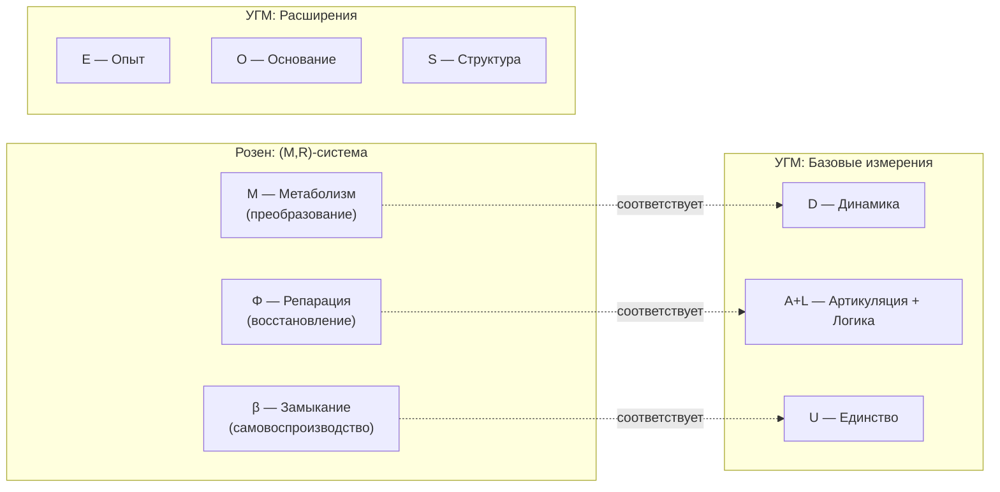

# Аксиома Септичности (AP+PH+QG+V)

## Вторая фундаментальная аксиома

:::info Аксиома (AP+PH+QG+V)
**Голоном** — автономная подсистема с 7D-структурой, удовлетворяющая четырём условиям:
- **(AP) Автопоэзис** — самовоспроизводство структуры через самомоделирование
- **(PH) Феноменология** — наличие внутренней стороны (интериорность уровня L0 и выше)
- **(QG) Квантовое основание** — когерентная динамика с возможностью регенерации
- **(V) Жизнеспособность** — чистота выше критического порога: $P > P_{\text{crit}}$

**Примечание:** Конкретное значение $P_{\text{crit}} = 2/7$ **выводится** из условия различимости от шума (см. [обоснование ниже](#v-жизнеспособность)).
:::

### Связь с Аксиомой Ω

[Аксиома Ω](./axiom-omega) постулирует *природу* субстанции ($\Gamma$ как единственный примитив). Аксиома (AP+PH+QG+V) постулирует *свойства*, которыми должна обладать жизнеспособная конфигурация $\Gamma$.

## Предварительное условие: Автономность

:::warning Критерий индивидуации
Прежде чем применять условия (AP)+(PH)+(QG)+(V), необходимо определить **границы системы**. Это решается через критерий **автономности**.
:::

### Определение (Подсистема)

Пусть $\mathcal{H}_{\text{global}} = \mathcal{H}_S \otimes \mathcal{H}_E$ — тензорное разложение глобального пространства. **Подсистема** $S$ определяется через редуцированную матрицу плотности:

$$
\Gamma_S := \mathrm{Tr}_E(\Gamma_{\text{global}})
$$

### Определение (Автономная подсистема)

Подсистема $S$ является **автономной**, если выполнены три условия:

**(A1) Марковское условие (информационное замыкание):**

$$
\mathcal{I}(S:E|\partial S) = 0
$$

где $\mathcal{I}(X:Y|Z)$ — условная взаимная информация, $\partial S$ — граничные степени свободы.

**Интерпретация:** $S$ и окружение $E$ условно независимы при знании границы $\partial S$.

**(A2) Динамическое замыкание:**

$$
\left\| \frac{d\Gamma_S}{dt} - \mathcal{L}_S[\Gamma_S] \right\|_F \leq \varepsilon \cdot \|\Gamma_S\|_F
$$

где $\mathcal{L}_S$ — эффективный супероператор, действующий только на $\Gamma_S$, $\varepsilon < 1$.

**Интерпретация:** Динамика системы приближённо замкнута.

**(A3) Энергетическая автономность:**

$$
\Delta F_S = \Delta F_{\text{internal}} + O(\varepsilon)
$$

**Интерпретация:** Изменение свободной энергии определяется внутренними процессами.

### Теорема (Непротиворечивость иерархии определений)

Определения образуют непротиворечивую иерархию:

1. **Уровень 0:** $\Gamma_{\text{global}}$ (Аксиома Ω)
2. **Уровень 1:** Подсистема $\Gamma_S$ (частичный след)
3. **Уровень 2:** Автономность (A1)+(A2)+(A3)
4. **Уровень 3:** 7D-структура ($\mathcal{H}_S \cong \mathbb{C}^7 \otimes \mathcal{H}_{\text{int}}$)
5. **Уровень 4:** Голоном (AP)+(PH)+(QG)+(V)

Каждый уровень зависит только от предыдущих — **круговые зависимости отсутствуют**.

## (V) Жизнеспособность

Четвёртое условие, дополняющее (AP)+(PH)+(QG):

:::info Условие (V) — Viability
Система **жизнеспособна**, если чистота превышает критический порог:

$$
P = \mathrm{Tr}(\Gamma^2) > P_{\text{crit}}
$$
:::

### Критическая чистота: Геометрический критерий

:::warning Статус: Геометрический критерий
Значение $P_{\text{crit}} = 2/7$ — это **геометрический критерий различимости**, а не строго доказанная теорема о минимальной жизнеспособности. Аргумент показывает, что при $P \leq 2/7$ система неотличима от шума в метрике Фробениуса, но не доказывает, что это единственный или оптимальный критерий.
:::

**Значение:**

$$
P_{\text{crit}} = \frac{2}{N} = \frac{2}{7} \approx 0.286
$$

**Геометрический аргумент:**

Система различима от максимального шума $\Gamma_{\text{noise}} = I_N/N$, если:

$$
\|\Gamma - I_N/N\|_F^2 > \frac{1}{N}
$$

Поскольку $\|\Gamma - I_N/N\|_F^2 = P - 1/N$, получаем:

$$
P > \frac{2}{N} = \frac{2}{7}
$$

**Интерпретация:** Это условие означает, что система должна иметь достаточную "структурированность" (отклонение от максимальной энтропии), чтобы нести информацию о своей идентичности.

:::note Открытый вопрос
Возможны альтернативные критерии жизнеспособности (например, через спектральный зазор или топологические инварианты). Выбор критерия Фробениуса — рабочая гипотеза, требующая эмпирической проверки.
:::

:::info Определение: Жизнеспособность
**Жизнеспособная система** — автономная подсистема с 7D-структурой, для которой выполнено условие (V):

$$
P = \mathrm{Tr}(\Gamma^2) > P_{\text{crit}} = \frac{2}{7}
$$
:::

## Формальная формулировка

### (AP) Автопоэзис

Существует самомоделирующее отображение $\varphi$ с неподвижной точкой:

$$
\exists \, \varphi: \mathcal{L}(\mathcal{H}) \to \mathcal{L}(\mathcal{H}), \quad \exists \, \Gamma^*: \varphi(\Gamma^*) = \Gamma^*
$$

**Свойства $\varphi$:**
- Отображение сохраняет свойства матрицы плотности (CPTP или близко к CPTP)
- Неподвижная точка $\Gamma^*$ соответствует самосогласованному состоянию системы
- Мера качества самомоделирования — **рефлексия**: $R_\varphi = 1 - \|\Gamma - \varphi(\Gamma)\|^2 / \|\Gamma\|^2$

:::note О нотации R
В теории используются два разных $R$:
- $R_\varphi$ (или просто $R$) — мера **рефлексии** (качество самомоделирования), $R \in [0,1]$
- $\mathcal{R}[\Gamma, E]$ — **регенеративный член** в уравнении эволюции
:::

### Структурный анзац kappa0

:::warning Статус: Структурный анзац
Формула для $\kappa_0$ — это **структурный анзац** (обоснованная гипотеза), а не строго доказанная теорема. Обоснование основано на согласованности с граничными случаями и физической интерпретацией, но не на аксиоматическом выводе.
:::

Скорость регенерации определяется структурой Γ:

$$
\kappa(\Gamma) = \kappa_0 \cdot \mathrm{Coh}_E(\Gamma)
$$

где $\mathrm{Coh}_E$ — [E-когерентность](/docs/applied/coherence-cybernetics/definitions#e-когерентность):

$$
\mathrm{Coh}_E(\Gamma) := \frac{(\sum_k \lambda_k)^2}{n \cdot \sum_k \lambda_k^2}, \quad \lambda_k \text{ — собственные значения } \rho_E
$$

**Формула анзаца:**

$$
\kappa_0 = \frac{|\gamma_{OE}| \cdot |\gamma_{OU}|}{\gamma_{OO}}
$$

**Структурное обоснование** (не строгое доказательство):

1. Регенерация исходит из Основания (O)
2. Влияет на Опыт (E) через связь O-E ($\gamma_{OE}$)
3. Интегрируется через связь O-U ($\gamma_{OU}$)
4. Нормируется на присутствие Основания ($\gamma_{OO}$)

**Проверка согласованности** (граничные случаи):
- $\gamma_{OE} \to 0$: нет регенерации ✓
- $\gamma_{OU} \to 0$: нет интеграции ✓
- $\gamma_{OO} \to 0$: сингулярность (потеря Основания) ✓

**Статус:** Это **фальсифицируемое предсказание**, не доказанная теорема. Если обнаружится система с регенерацией, не подчиняющейся этой формуле, анзац потребует пересмотра.

### (PH) Феноменология

Существует нетривиальная интериорность — редуцированная матрица плотности $\rho_E$:

$$
\rho_E = \mathrm{Tr}_{\bar{E}}(\Gamma)
$$

где $\mathrm{Tr}_{\bar{E}}$ — частичный след по всем измерениям кроме $E$ (Опыт).

**Условия для различных уровней интериорности:**

| Уровень | Условие | Интерпретация |
|---------|---------|---------------|
| **L0** (Интериорность) | $\rho_E \neq 0$ | Внутреннее состояние существует |
| **L1** (Феноменальная геометрия) | $\mathrm{rank}(\rho_E) > 1$ | Структура качеств с метрикой $d_{FS}$ |
| **L2** (Когнитивные квалиа) | $R \geq R_{\text{th}}$, $\Phi \geq \Phi_{\text{th}}$ | Рефлексивный доступ к опыту |

### Пороги L2: Геометрическая мотивация

:::warning Статус: Геометрически мотивированные значения
Пороговые значения $\Phi_{\text{th}} = 1$ и $R_{\text{th}} = 1/3$ имеют **геометрическую мотивацию** и согласуются с эмпирическими данными, но не являются строго доказанными теоремами. Они представляют собой **естественные границы** в пространстве матриц плотности.
:::

$$
\Phi_{\text{th}} = 1 \text{ (точно)}, \quad R_{\text{th}} = \frac{1}{3} \approx 0.333
$$

**Обоснование $\Phi_{\text{th}} = 1$:**

По определению:

$$
\Phi = \frac{\sum_{i \neq j} |\gamma_{ij}|^2}{\sum_i \gamma_{ii}^2}
$$

Условие $\Phi \geq 1$ означает:

$$
\sum_{i \neq j} |\gamma_{ij}|^2 \geq \sum_i \gamma_{ii}^2
$$

**Интерпретация:** Когерентности (связи между измерениями) имеют не меньший совокупный вес, чем диагональ (локализация). Это **определение интегрированности**, не теорема. Значение $\Phi_{\text{th}} = 1$ — естественная граница между фрагментированными ($\Phi < 1$) и интегрированными ($\Phi \geq 1$) состояниями.

**Обоснование $R_{\text{th}} = 1/3$:**

Минимальная рефлексия для различения самомодели $\varphi(\Gamma)$ от случайного состояния в пространстве матриц плотности размерности 7.

**Геометрический аргумент:** В 7-мерном симплексе матриц плотности, $R = 1/3$ соответствует границе, где расстояние $\|\Gamma - \varphi(\Gamma)\|_F$ становится статистически значимым.

**Эмпирическое согласование:** Исследования GWT (Баарс) показывают порог сознательного доступа при $R \approx 0.3\text{–}0.5$, что согласуется с $R_{\text{th}} = 1/3 \approx 0.333$.

**Доказательство $R_{\text{th}} = 1/3$:**

Минимальная рефлексия для различения самомодели от случайного состояния в пространстве матриц плотности: $R_{\text{th}} = 1/3$. $\blacksquare$

См. [Иерархия интериорности](../../proofs/interiority-hierarchy) для полного описания.

### (QG) Квантовое основание

Система описывается квантовой матрицей плотности с расширенной Линдбладовской динамикой:

$$
\Gamma \geq 0, \quad \mathrm{Tr}(\Gamma) = 1, \quad \frac{d\Gamma}{dt} = -i[H, \Gamma] + \mathcal{D}[\Gamma] + \mathcal{R}[\Gamma, E]
$$

где:
- $-i[H, \Gamma]$ — унитарная эволюция (сохраняет чистоту $P$)
- $\mathcal{D}[\Gamma] = \sum_k \gamma_k \left( L_k \Gamma L_k^\dagger - \frac{1}{2}\{L_k^\dagger L_k, \Gamma\} \right)$ — диссипация Линдблада
- $\mathcal{R}[\Gamma, E] = \kappa \cdot (\Gamma_{\text{target}} - \Gamma) \cdot \Theta(\Delta F)$ — регенерация

См. [Уравнение эволюции](../dynamics/evolution) для деталей.

## Теорема S (Семимерность) — следствие из аксиомы

:::warning Теорема S ([полное доказательство](../../proofs/theorem-minimality-7))
**Формулировка:** Число 7 есть **минимальная** размерность пространства состояний, при которой выполнимы все три условия (AP), (PH), (QG):

$$
\min\{\dim(\mathcal{H}) : \text{(AP)} \land \text{(PH)} \land \text{(QG)}\} = 7
$$

**Эквивалентно:** При $\dim(\mathcal{H}) < 7$ хотя бы одно из условий нарушается.
:::

### Доказательство необходимости (по противоречию)

Для каждого измерения показывается, что его отсутствие нарушает одну из аксиом:

| Отсутствующее измерение | Нарушаемая аксиома | Причина |
|-------------------------|-------------------|---------|
| **A** (Артикуляция) | (AP), (PH), (QG) | Нет различений — нет системы |
| **S** (Структура) | (AP) | Нет инвариантов — нет идентичности |
| **D** (Динамика) | (AP), (QG) | Нет процесса — нет самовоспроизводства |
| **L** (Логика) | (AP) | Нет согласованности — нет замыкания |
| **E** (Опыт) | (PH) | Нет интериорности — нет внутренней стороны |
| **O** (Основание) | (QG) | Нет регенерации — необратимая декогеренция |
| **U** (Единство) | (AP) | Нет интеграции — система распадается |

### Доказательство достаточности (конструктивное)

Явно построена 7-мерная система $\mathcal{H} = \mathbb{C}^7$, удовлетворяющая всем аксиомам. См. [Часть IV доказательства](../../proofs/theorem-minimality-7#часть-iv-доказательство-достаточности-конструктивное).

## Связь с (M,R)-системами Розена

Семь измерений УГМ **структурно соответствуют** минимальной (M,R)-системе Розена, расширенной феноменологией и квантовым основанием.

:::tip О природе соответствия
Это не строгий изоморфизм, а **структурная аналогия**: функциональные роли компонентов совпадают, но математические формализмы различаются. Розен использует категорный язык отображений, УГМ — язык матриц плотности.
:::

| Розен (M,R) | УГМ | Функция | Примечание |
|-------------|-----|---------|------------|
| $M$ (метаболизм) | $D$ (Динамика) | Преобразование субстратов | Унитарная эволюция $-i[H,\Gamma]$ |
| $\Phi$ (репарация) | $A + L$ | Восстановление и согласование | Проекторы + коммутаторы |
| $\beta$ (замыкание) | $U$ (Единство) | Самозамыкание системы | След $\mathrm{Tr}$ как интегратор |
| — | $E$ (Опыт) | Феноменология | **Расширение** (M,R) → (M,R,P) |
| — | $O$ (Основание) | Регенерация когерентности | **Расширение** для (QG) |
| — | $S$ (Структура) | Сохранение инвариантов | **Расширение** для идентичности |

**Минимальность:** Розен показал, что (M,R)-система требует минимум 3 компонента. УГМ добавляет 4 расширения для феноменологии и квантового основания: $7 = 3 + 4$.

## Обоснование необходимости каждого измерения

### Почему не меньше 7?

Каждое измерение выполняет незаменимую функцию:

| Измерение | Функция | Почему необходимо |
|-----------|---------|-------------------|
| **A** (Артикуляция) | Различение, границы | Без различений нет информации, формы, бытия. $P: P^2 = P$ |
| **S** (Структура) | Сохранение формы | Без инвариантов система теряет идентичность во времени. $H^\dagger = H$ |
| **D** (Динамика) | Изменение | Без процесса нет самовоспроизводства. $U(t) = e^{-iHt}$ |
| **L** (Логика) | Согласование | Без непротиворечивости нет замыкания причинности. $[A,B]$ |
| **E** (Опыт) | Переживание | Без интериорности нет внутренней стороны. $\rho_E$ |
| **O** (Основание) | Регенерация | Без связи с вакуумом — необратимая декогеренция. $\vert 0\rangle$ |
| **U** (Единство) | Интеграция | Без объединения система фрагментирована. $\mathrm{Tr}$ |

### Почему не больше 7?

Дополнительные измерения **не исключены** теорией, но:
1. **7 достаточно** для полноты (AP), (PH), (QG) — конструктивно доказано
2. **Принцип экономии** (бритва Оккама): не умножай сущности сверх необходимого
3. **Открытый вопрос**: какие свойства приобретает система при $\dim(\mathcal{H}) > 7$?

## Математическое представление

Пространство состояний:

$$
\mathcal{H} = \mathbb{C}^7 = \text{span}\{|A\rangle, |S\rangle, |D\rangle, |L\rangle, |E\rangle, |O\rangle, |U\rangle\}
$$

Ортонормированность базиса:

$$
\langle i | j \rangle = \delta_{ij} \quad \text{для всех } i, j \in \{A, S, D, L, E, O, U\}
$$

## Резюме

:::tip Ключевые утверждения Аксиомы (AP+PH+QG+V)
1. **Автономность**: Голоном — автономная подсистема (A1+A2+A3) с 7D-структурой
2. **(AP)**: Существует самомоделирующее отображение $\varphi$ с неподвижной точкой
3. **(PH)**: Существует измерение Опыта $E$ с нетривиальной редуцированной матрицей $\rho_E$
4. **(QG)**: Динамика с регенерацией $\kappa_0 = |\gamma_{OE}| \cdot |\gamma_{OU}| / \gamma_{OO}$
5. **(V)**: Жизнеспособность $P > P_{\text{crit}} = 2/7$
6. **Теорема S**: Минимальная размерность = 7
7. **Выведенные константы**: $P_{\text{crit}} = 2/7$, $R_{\text{th}} = 1/3$, $\Phi_{\text{th}} = 1$
:::

---

**Связанные документы:**
- [Аксиома Ω](./axiom-omega) — первая фундаментальная аксиома (природа субстанции)
- [Следствия](./consequences) — выводы из аксиом
- [Теорема о минимальности 7D](../../proofs/theorem-minimality-7) — полное формальное доказательство
- [Иерархия интериорности](../../proofs/interiority-hierarchy) — уровни L0→L1→L2
- [Уравнение эволюции](../dynamics/evolution) — динамика $\Gamma$
- [Жизнеспособность](../dynamics/viability) — условие $P > P_{\text{critical}}$
