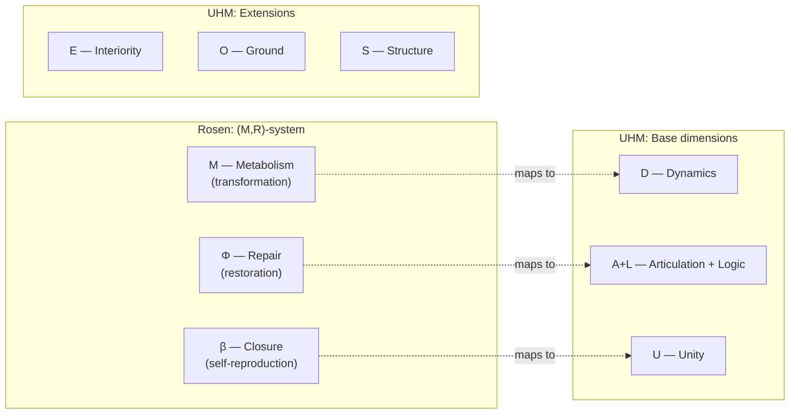

# Septicity Axiom (AP+PH+QG+V)

:::info Who this chapter is for
This chapter specifies **what properties a holon must have**—a self-sustaining configuration of reality able to be “alive” in a mathematical sense. The four conditions (AP, PH, QG, V) are not a new axiom; they follow from [Axiom Ω⁷](./axiom-omega) but are kept as a separate section for historical reasons and pedagogical clarity.

**The four conditions in plain terms:**

- **(AP) Autopoiesis**—like a fire that sustains itself. The system reproduces its own structure; it needs an internal model of itself (the operator $\varphi$). A fire consumes fuel and yields heat that dries new fuel that feeds the flame. A holon consumes free energy and yields coherence that sustains the mechanism of energy uptake.

- **(PH) Phenomenology**—the system has an “inner side.” This is not metaphor: the $E$ dimension (**Interiority**) mathematically captures what the system “experiences from within.” Even the simplest holon has L0 interiority—a minimal “reverse side.”

- **(QG) Quantum grounding**—the system is quantum at base. Its state is a density matrix $\Gamma$ (not a classical vector), and the dynamics includes coherences—quantum correlations across dimensions. Without quantum structure, neither entanglement ($\Phi$) nor regeneration ($\mathcal{R}$) is possible.

- **(V) Viability**—the system is coherent enough to “live.” Quantitatively, purity $P = \mathrm{Tr}(\Gamma^2)$ must exceed the critical threshold $2/7$. Below that threshold the system is indistinguishable from noise—it “dissolves” into the background.

**Chapter structure.** We first relate (AP+PH+QG+V) to the Ω⁷ axioms. We then state the prerequisite—**autonomy** (how the system is delineated from its environment). Next we formalize each of the four conditions. Finally we derive the key constants: critical purity $P_{\text{crit}} = 2/7$, reflection threshold $R_{\text{th}} = 1/3$, integration threshold $\Phi_{\text{th}} = 1$, and the regeneration rate $\kappa$.
:::

## Characterizing properties of viable holons

:::note Status of (AP+PH+QG+V)
The conditions (AP)+(PH)+(QG)+(V) are **not an independent axiom** but **characterizing properties** (structural consequences) of [Axiom Ω⁷](./axiom-omega). The name “Septicity Axiom” is retained for historical reasons. The **explicit derivation** of all four properties from A1–A4 is theorem T-181 [T]; see [Bimodule construction](/docs/proofs/physics/bimodule-construction#вывод-apphqgv).
:::

:::info Axiom (AP+PH+QG+V)
A **holon** is an autonomous sub-system with 7D structure satisfying four conditions:
- **(AP) Autopoiesis**—self-reproduction by self-modeling
- **(PH) Phenomenology**—presence of an inner side (interiority at L0 and above)
- **(QG) Quantum grounding**—coherent dynamics with the possibility of regeneration
- **(V) Viability**—purity above the critical threshold: $P > P_{\text{crit}}$

**Note:** The value $P_{\text{crit}} = 2/7$ is **derived** from distinguishability from noise (see [below](#v-жизнеспособность)).
:::

### Relation to the explicit Ω⁷ axiomatics

:::info Two-track justification of N = 7
Axiom 3 ($N = 7$) is supported by two independent routes:
- **Track A** (this document): Theorem S—(AP)+(PH)+(QG) → N ≥ 7
- **Track B**: [Structural derivation via octonions](../../proofs/minimality/theorem-octonionic-derivation)—P1+P2 → $\mathbb{O}$ → $\dim \mathrm{Im}(\mathbb{O})$ = 7
:::

[Axiom Ω⁷](./axiom-omega#аксиоматика) fixes **five explicit axioms** of the theory:
- **Axiom 1 (Structure):** ∞-topos $\mathbf{Sh}_\infty(\mathcal{C})$
- **Axiom 2 (Metric):** Grothendieck topology $J_{Bures}$
- **Axiom 3 (Dimension):** $N = 7$
- **Axiom 4 (Scale):** $\omega_0 > 0$
- **Axiom 5 (Page–Wootters):** Tensor decomposition

The conditions (AP+PH+QG+V) are **characterizing properties** of viable configurations $\Gamma \in \text{Ob}(\mathcal{C})$:
- **(AP)** and **(QG)** follow from dynamics in the ∞-topos
- **(PH)** is the interpretation of the E dimension (Axiom 3)
- **(V)** is the mathematical condition ($P > P_{\text{crit}}$ [T]); its ontological reading is via PID ([definition [O] (T16 [T])](/docs/core/foundations/axiom-septicity#формулировка-пир), built into A1+A2)

## Prerequisite: Autonomy {#предварительное-условие-автономность}

:::warning Individuation criterion
Before applying (AP)+(PH)+(QG)+(V), one must fix **the boundaries of the system**. This is handled by the **autonomy** criterion.
:::

### Definition (Sub-system)

Let $\mathcal{H}_{\text{global}} = \mathcal{H}_S \otimes \mathcal{H}_E$ be a tensor factorization of global space. **Sub-system** $S$ is defined by the reduced density matrix:

$$
\Gamma_S := \mathrm{Tr}_E(\Gamma_{\text{global}})
$$

### Definition (Autonomous sub-system) {#определение-автономная-подсистема}

Sub-system $S$ is **autonomous** if three conditions hold:

**(A1) Markov property (informational closure):**

$$
\mathcal{I}(S:E|\partial S) = 0
$$

where $\mathcal{I}(X:Y|Z)$ is conditional mutual information and $\partial S$ denotes boundary degrees of freedom.

**Interpretation:** $S$ and environment $E$ are conditionally independent given knowledge of $\partial S$.

**(A2) Dynamical closure:**

$$
\left\| \frac{d\Gamma_S}{d\tau} - \mathcal{L}_S[\Gamma_S] \right\|_F \leq \varepsilon \cdot \|\Gamma_S\|_F
$$

where $\mathcal{L}_S$ is the effective super-operator acting only on $\Gamma_S$, and $\varepsilon < 1$.

**Interpretation:** The dynamics of the system is approximately closed.

**(A3) Energetic autonomy:**

$$
\Delta F_S = \Delta F_{\text{internal}} + O(\varepsilon)
$$

**Interpretation:** Free-energy changes are governed by internal processes.

### Theorem (Consistency of the definition hierarchy) {#теорема-непротиворечивость-иерархии-определений}

**Claim:** The definitions form a **directed acyclic graph** (DAG) of dependencies.

**Level hierarchy:**

| Level | Definition | Depends on |
|---------|-------------|------------|
| 0 | ∞-topos $\text{Sh}_\infty(\mathcal{C})$ (Axiom Ω⁷) | — (axiomatic) |
| 1 | Sub-system $\Gamma_S$ (partial trace) | Level 0 |
| 2 | Autonomy (A1)+(A2)+(A3) | Levels 0, 1 |
| 3 | 7D structure ($\mathcal{H}_S \cong \mathbb{C}^7 \otimes \mathcal{H}_{\text{int}}$) | Levels 0, 1, 2 |
| 4 | Holon (AP)+(PH)+(QG)+(V) | Levels 0, 1, 2, 3 |

**Extended operator hierarchy (levels 5–9):**

| Level | Object | Definition | Depends on |
|---------|--------|-------------|------------|
| 5 | $\mathcal{L}_\Omega$ | Logical Liouvillian from Ω | Level 0 |
| 6 | $\rho^*_{\mathrm{diss}} = I/7$ | Unique stationary state of $\mathcal{D}_\Omega$ | Level 5 (primitivity [T]) |
| 7 | $R(\Gamma)$ | $R := 1 - \|\Gamma - \rho^*_{\mathrm{diss}}\|_F^2 / P$ | Level 6 + state $\Gamma$ |
| 8 | $\kappa(\Gamma)$ | $\kappa = \kappa_{\mathrm{bootstrap}} + \kappa_0 \cdot \mathrm{Coh}_E(\Gamma)$ | Level 0 (adjunction $\mathcal{D} \dashv \mathcal{R}$) |
| 9 | $\varphi_k(\Gamma)$ | Replacement channel: $\varphi_k = (1-k)\Gamma + k\rho^*_{\mathrm{diss}}$, $k = 1-R$ | Levels 6, 7 |

:::info Canonical order of definitions
$$\Omega \xrightarrow{\text{L-unification}} \mathcal{L}_\Omega \xrightarrow{\text{primitivity}} \rho^*_{\mathrm{diss}} \xrightarrow{\text{proximity}} R(\Gamma) \xrightarrow{k=1-R} \varphi_k$$

The operator $\varphi$ is a **consequence** of the dynamics, not a premise. The stationary state $\rho^*_{\mathrm{diss}} = I/7$ is fixed **before** $\varphi$ via primitivity of the linear part $\mathcal{L}_0$ [T-39a]. There is no cycle: each level depends only on earlier ones.
:::

:::warning Three distinct stationary objects
The documentation uses three objects denoted $\rho^*$:

| Object | Definition | Purity | Role |
|--------|-------------|---------|------|
| $\rho^*_{\mathrm{diss}} = I/7$ | Attractor of dissipation $\mathcal{D}_\Omega$ | $P = 1/7$ | Target state in the definition of $R$ |
| $\Gamma^*_{\mathrm{coh}}$ | Fixed point of $\varphi_{\mathrm{coh}}$ | $P = 2/7$ | Viability threshold |
| $\rho^*_{\mathrm{full}}$ | Attractor of the full $\mathcal{L}_\Omega$ | $P > 2/7$ | Physical stationary state of a living system |

The canonical definition of $R$ uses $\rho^*_{\mathrm{diss}} = I/7$—a constant independent of $\varphi$, $\kappa$, or the dynamics.
:::

**Proof (topological sorting):**

The dependency graph $G = (V, E)$ with $V = \{0, 1, \ldots, 9\}$ and $E = \{(i, j) : i < j,\ \text{dependency}\}$ is a **DAG**: along any path $v_0 \to v_1 \to \cdots \to v_m$ we have $v_0 < v_1 < \cdots < v_m$, hence $v_m \neq v_0$.

Therefore **no circular dependencies** exist. ∎

## (V) Viability {#v-жизнеспособность}

The fourth condition, supplementing (AP)+(PH)+(QG):

:::info Condition (V)—Viability
A system is **viable** if the full condition holds:

$$
(V) = (AP) \wedge (PH) \wedge (QG) \wedge (P > P_{\text{crit}})
$$
:::

:::warning Completeness of the viability condition
The inequality $P > 2/7$ is **necessary but not sufficient** for viability. Full (V) = (AP)∧(PH)∧(QG)∧(P > 2/7) entails, in particular:
- $\mathrm{rank}(\Gamma) = 7$ (from (QG)—all seven dimensions are functionally active)
- A connected interaction graph (from (AP)—closed reproduction cycle)
- $\Delta F > 0$ (consequence of full (V): from $\mathrm{rank}(\Gamma) = 7$ and stationarity at $\rho^*$)

A system with $P > 2/7$ but broken (AP) or (QG)—e.g. $\Gamma = \mathrm{diag}(0.3, 0.3, 0.4, 0, 0, 0, 0)$—is **not viable**, despite $P \approx 0.34 > 2/7$.
:::

### Critical purity: Theorem—master definition {#критическая-чистота-теорема}

:::note Why exactly 2/7?
The number $2/7 \approx 0.286$ is not an arbitrary choice but the **unique** value at which five independent criteria align. Intuition: a seven-dimensional system in maximal chaos has purity $1/7$ (dimensions equiprobable—“white noise”). For the system to become *distinguishable* from noise, its structural deviation must *double* the noise scale. Hence $P_{\text{crit}} = 2 \times (1/7) = 2/7$. This is the “structure $\geq$ chaos” principle: to be something, one must be at least twice as organized as nothing.
:::

:::info DRY: Master definition of $P_{\text{crit}}$
This is the **canonical definition** of critical purity $P_{\text{crit}} = 2/7$. Full proof: [theorem-purity-critical](../../proofs/dynamics/theorem-purity-critical).
:::

:::tip Status: [T] proved
The value $P_{\text{crit}} = 2/7$ is **strictly derived** from several mathematically equivalent formulations (routes 1–4) and an independent autopoietic argument (route 5). All routes converge to one value, supporting the fundamentality of this threshold.

[Full proof →](../../proofs/dynamics/theorem-purity-critical)
:::

**Value:**

$$
P_{\text{crit}} = \frac{2}{N} = \frac{2}{7} \approx 0.286
$$

**Theorem (critical purity):** [Full proof →](../../proofs/dynamics/theorem-purity-critical)

For a holonomic system of dimension $N$, critical purity $P_{\text{crit}} = 2/N$ is the **unique** value satisfying five equivalent criteria:

| Route | Criterion | Result |
|------|----------|-----------|
| **Geometric** [T] | $\lVert\Gamma - I_N/N\rVert_F^2 > \lVert I_N/N\rVert_F^2$ | $P > 2/N$ |
| **Information-theoretic** [C] | $D_{KL}(\Gamma \| I_N/N) \geq \frac{1}{2}$ nat | $P > 2/N$ |
| **Structural** [C] | SNR $\geq 1$ | $P > 2/N$ |
| **Spectral** [T] | $\lambda_{\max} \approx 1/2$ | $P = 2/N$ |
| **Autopoietic** [I] | Breaking $U(N)$ symmetry | $P > 2/N$ |

**Interpretation (structural doubling principle):**

$$
\|\Gamma - I_N/N\|_F^2 > \|I_N/N\|_F^2 \quad \Leftrightarrow \quad P > \frac{2}{N}
$$

Structural deviation from chaos must exceed the chaos scale itself. The factor 2 arises naturally: **structure ≥ chaos**.

**Spectral characterization [T]:**

At $P = 2/7$ the dominant mode carries ~50% of coherence weight:

$$
\lambda_{\max} = \frac{1 + \sqrt{N-1}}{N} = \frac{1 + \sqrt{6}}{7} \approx 0.493
$$

Direct calculation: for a $7 \times 7$ density matrix with $P = \text{Tr}(\Gamma^2) = 2/7$, spectral bound $\lambda_{\max} \leq \sqrt{P} = \sqrt{2/7} \approx 0.535$. The most symmetric configuration ($\lambda_1 = \lambda_{\max}$, others equal) gives $\lambda_{\max} \approx 1/2$. The formula above is exact.

:::info Definition: Viability
A **viable system** is an autonomous sub-system with 7D structure satisfying (V):

$$
P = \mathrm{Tr}(\Gamma^2) > P_{\text{crit}} = \frac{2}{7}
$$
:::

## Principle of Informational Distinguishability (PID) {#принцип-информационной-различимости}

:::note PID in plain language
The Principle of Informational Distinguishability answers: *what does it mean “to exist”?* In UHM the answer is simple: to exist is to be *distinguishable from noise*. If state $\Gamma$ cannot be told apart from a random fluctuation of the background ($I/7$) by any measurement, it “does not exist” ontologically. PID formalizes this via Bures distance: existence is nonzero distance from noise. Under earnest acceptance of Axiom Ω⁷ (reality as an $\infty$-topos), PID becomes a **tautology**—it unpacks what is already in the definition of the $\infty$-topos with Bures topology.
:::

:::tip PID is definition [O] (T16 [T])
The **Principle of Informational Distinguishability (PID)** is **definition [O]** (T16 [T]): given earnest acceptance of A1 (∞-topos) and A2 ($J_{\text{Bures}}$), PID is tautological—distinguishability via $J_{\text{Bures}}$-coverings coincides with ontological distinguishability. Relabeling does not affect the computational results ($P_{\text{crit}}, R_{\text{th}}, \Phi_{\text{th}}$).

Given earnest acceptance of A1 (reality = ∞-topos), “ontological significance” = “truth in the internal logic of $\mathbf{Sh}_\infty(\mathcal{C})$” = “nontrivial $J_{Bures}$-covering”—a tautology, not a deep theorem. Kripke–Joyal semantics only makes explicit what is already built into A1+A2.
:::

### Formulation of PID [O] {#формулировка-пир}

:::info DRY: Master definition of PID
This is the canonical definition of the Principle of Informational Distinguishability. Cross-references should point to `axiom-septicity#формулировка-пир`.
:::

**Definition T16 (PID).** PID is the tautological consequence of A1+A2: distinguishability in the $J_{\text{Bures}}$ topology **is** ontological distinguishability by definition of the ∞-topos.

Let $\mathfrak{T} = (\mathbf{Sh}_\infty(\mathcal{C}), J_{Bures}, \omega_0)$. Then:

$$
\text{Significant}(\Gamma) \Leftrightarrow d_B(\Gamma, \Gamma_{\text{noise}}) \geq d_B^{\text{th}}
$$

**Compatibility with $J_{Bures}$:**
1. Grothendieck topology $J_{Bures}$ defines “distinguishability” via coverings
2. A $J_{Bures}$-cover separates points ⟺ they lie at positive Bures distance
3. Identifying “ontological significance” with “separability by coverings” is the content of PID (T16)

:::tip Why PID is definition [O], not theorem [T]
Given earnest acceptance of A1 (reality = ∞-topos), step (3) is a **tautology**: “to exist” = “to be true in the internal logic of $\mathbf{Sh}_\infty(\mathcal{C})$” (Kripke–Joyal) = “to admit a nontrivial $J_{Bures}$-covering” (A2). Because this is a **tautology**, not a substantive claim, PID is definition [O], not theorem [T].

**Remark:** Kripke–Joyal semantics ([Lurie, HTT, §6.2.2]) only **explicates** the identification built into A1+A2: “$\varphi$ is true at point $U$” ⟺ “$\exists$ a covering family $\{U_i \to U\} \in J_{Bures}$ on which $\varphi$ is verifiable.” This is not a proof but a clarification of definitions.
:::

where:
- $d_B$ is the [Bures metric](/docs/core/foundations/axiom-omega#топология-гротендика)
- $\Gamma_{\text{noise}} = I/N$ is the maximally mixed state (noise)
- $d_B^{\text{th}}$ is the characteristic distinguishability scale

### Unifying thresholds via PID

All three UHM thresholds admit an **ontological reading** through PID:

| Threshold | PID reading | Value |
|-------|-----------------|----------|
| $P_{\text{crit}}$ | $d_B(\Gamma, I/N) \geq d_B^{\text{crit}}$ | $2/N$ |
| $R_{\text{th}}$ | $d_B(\Gamma, \varphi(\Gamma)) \leq d_B^{\text{ref}}$ | $1/3$ |
| $\Phi_{\text{th}}$ | $d_B(\Gamma, \Gamma_{\text{diag}}) \geq d_B^{\text{class}}$ | $1$ |

**Theorem (unity of thresholds) [T]:** All thresholds descend from a single metric—the Bures metric, which is the [unique monotone Riemannian metric](/docs/proofs/dynamics/emergent-time#41-метрика-бурес) on quantum state space (Čencov–Petz theorem). PID is definition [O] (T16) built into A1+A2.

## Formal statement

### (AP) Autopoiesis {#ap-автопоэзис}

:::note Intuition: mirror inside the mirror
*Autopoiesis* literally means self-production (Greek *auto*—self, *poiesis*—making). Chilean biologists Maturana and Varela introduced the term in 1972 for living cells. In UHM autopoiesis is formalized by the operator $\varphi$—the system’s “internal mirror.” The system regards itself ($\varphi(\Gamma)$ models $\Gamma$), compares image to original, and corrects itself. When image and original coincide ($\varphi(\Gamma^*) = \Gamma^*$), the system reaches self-consistency—a fixed point. This is not “freeze” but dynamical balance: the system ceaselessly reproduces itself, like a candle flame that is ever new yet “the same.”
:::

There exists a self-modeling map $\varphi$ with a fixed point:

$$
\exists \, \varphi: \mathcal{L}(\mathcal{H}) \to \mathcal{L}(\mathcal{H}), \quad \exists \, \Gamma^*: \varphi(\Gamma^*) = \Gamma^*
$$

:::info DRY: Master definition of $\varphi$
Full formalization of $\varphi$ (three equivalent definitions, equivalence proof, algorithms): [Formalization of $\varphi$](/docs/proofs/categorical/formalization-phi).
:::

**Properties of $\varphi$:**
- Categorical: $\varphi$ is left adjoint to the inclusion $\text{Sub}(\Gamma) \hookrightarrow \mathbf{Sh}_\infty(\mathcal{C})$
- The map preserves density-matrix properties (CPTP)
- Fixed point $\Gamma^*$ corresponds to a self-consistent system state
- **Reflection** measures self-model quality: $R_\varphi = 1 - \|\Gamma - \varphi(\Gamma)\|^2 / \|\Gamma\|^2$

:::note On the notation $R$
The theory uses two distinct symbols $R$:
- $R_\varphi$ (or simply $R$)—**reflection** (self-model quality), $R \in [0,1]$
- $\mathcal{R}[\Gamma, E]$—the **regenerative term** in the evolution equation
:::

### Categorical derivation of $\kappa_0$—master definition {#структурный-анзац-kappa0}

:::info DRY: Master definition of $\kappa_0$
This is the **sole canonical definition** of the formula for $\kappa_0$. Other documents should cite this section rather than duplicate the formula.
:::

:::tip Status: single layer—theorem [T]
**Categorical definition [T]:** $\kappa_0 = \|\mathrm{Nat}(\mathcal{D}_\Omega, \mathcal{R})\|$—the norm of the natural transformation between adjoint functors. This follows from [L-unification](/docs/core/foundations/axiom-omega#внутренняя-логика).

**Operational formula [T]:** $\kappa_0 = \omega_0 \cdot |\gamma_{OE}| \cdot |\gamma_{OU}| / \gamma_{OO}$ is the **exact consequence** of the categorical definition. Identification $|\mathrm{Hom}(i,j)| \leftrightarrow |\gamma_{ij}|$ is proved via Yoneda embedding + Bures metric + Stinespring’s theorem (see [below](#теорема-kappa0-функториальность)).
:::

Regeneration rate is determined by the structure of Γ:

$$
\kappa(\Gamma) = \kappa_{\text{bootstrap}} + \kappa_0 \cdot \mathrm{Coh}_E(\Gamma)
$$

where:
- $\kappa_{\text{bootstrap}}$ is minimal regeneration from the [adjunction unit](/docs/core/foundations/axiom-omega#genesis-protocol)
- $\kappa_0$ is the base regeneration rate (see [categorical derivation below](#категориальный-вывод-kappa0))

### Value of $\kappa_{\text{bootstrap}}$ [O] {#теорема-kappa-bootstrap}

:::warning Convention definition [O] (value of $\kappa_{\text{bootstrap}}$)
Minimal regeneration rate is **fixed** as:

$$
\kappa_{\text{bootstrap}} = \frac{\omega_0}{N} = \frac{\omega_0}{7}
$$

**Status [O]:** The numerical value $\omega_0/N$ is motivated by a physical argument (one clock tick per full $N$-dimensional cycle) and categorical normalization ($\min_i(\gamma_{Oi}) = 1/N$) but **is not a strict theorem**: there is no proof that the adjunction-unit norm $\|\eta\|$ equals this number exactly. It is a **scale convention**, consistent with $P_{\text{crit}}$ and $\omega_0$.
:::

**Definition (norm of the adjunction unit):**

$$
\|\eta\| := \sup_{\Gamma: P(\Gamma) \leq P_{\text{crit}}} \frac{\|\eta_\Gamma\|_F}{\|\Gamma\|_F}
$$

where $\eta_\Gamma$ is the [adjunction unit](/docs/core/foundations/axiom-omega#genesis-protocol) for $\mathcal{D}_\Omega \dashv \mathcal{R}$.

**Proof:**

**(a) Physical argument (minimal regeneration):**

Minimal regeneration corresponds to one clock tick per full cycle through all $N$ dimensions:

$$
\kappa_{\text{bootstrap}} = \frac{\omega_0}{N}
$$

**(b) Categorical argument:**

From the adjunction $\mathcal{D}_\Omega \dashv \mathcal{R}$:

$$
\kappa_{\text{bootstrap}} = \omega_0 \cdot \frac{\min_i(\gamma_{Oi})}{\gamma_{OO}}
$$

Under normalization $\min_i(\gamma_{Oi}) = 1/N$ and $\gamma_{OO} = 1$:

$$
\kappa_{\text{bootstrap}} = \frac{\omega_0}{N} = \frac{\omega_0}{7}
$$

**(c) Consistency with $P_{\text{crit}}$:**

At $P = P_{\text{crit}} = 2/N$, minimal regeneration $\kappa_{\text{bootstrap}} = \omega_0/N$ ensures:
- One regeneration cycle per period $T = 2\pi/\omega_0$
- Sufficient rate to sustain $P > P_{\text{crit}}$

∎

**Corollary:**

For UHM with $N = 7$:

$$
\kappa_{\text{bootstrap}} = \frac{\omega_0}{7} \approx 0.143 \cdot \omega_0
$$

:::warning Resolving the bootstrap paradox
$\kappa_{\text{bootstrap}} > 0$ guarantees regeneration in every state, resolving the circularity “low Coh_E → low κ → no regeneration.”
:::

#### Definition: E-coherence {#e-coherence-definition}

<!-- DRY: Master definition Coh_E — canonical HS-projection formula -->

E-coherence measures the alignment of the Interiority dimension within the coherence matrix Γ.

##### Canonical formula [T] {#coh-e-canonical}

$$
\mathrm{Coh}_E(\Gamma) := \frac{\gamma_{EE}^2 + 2\sum_{i \neq E} |\gamma_{Ei}|^2}{\mathrm{Tr}(\Gamma^2)} = \frac{\|\pi_E(\Gamma)\|_{\mathrm{HS}}^2}{\|\Gamma\|_{\mathrm{HS}}^2}
$$

:::tip Status: Theorem [T]
$\mathrm{Coh}_E$ is an **exact** measure of the E contribution to purity, not a proxy. It is the ratio of squared Hilbert–Schmidt norms for the orthogonal projection $\pi_E$ (HS projection theorem below).
:::

**Range:** $\mathrm{Coh}_E \in [1/7, 1]$ (minimum for the maximally mixed state $\gamma_{ij} = \delta_{ij}/7$, maximum for a pure E state).

##### C*-algebraic justification: Hilbert–Schmidt projection {#hs-projection}

In $\mathbb{C}^7$, tensor factorization is impossible (7 is prime), yet defining a sub-system **does not require** a tensor product. In algebraic quantum field theory (Haag, 1996; Bratteli–Robinson, 1987) a sub-system is specified by **embedding a C*-subalgebra**, and partial trace is realized as a **conditional expectation**.

**Definition (Hilbert–Schmidt space).** The space $B(\mathbb{C}^7)$ of linear operators is a Hilbert space with inner product $\langle A, B \rangle_{\mathrm{HS}} = \mathrm{Tr}(A^\dagger B) = \sum_{i,j} \overline{A_{ij}} B_{ij}$ and norm $\|A\|_{\mathrm{HS}}^2 = \mathrm{Tr}(A^\dagger A)$.

**Definition ($E$-projection).** Let $P_E = |E\rangle\langle E|$, $P_{\bar{E}} = I - P_E$. The map $\pi_E: B(\mathbb{C}^7) \to B(\mathbb{C}^7)$ is

$$
\pi_E(\Gamma) := P_E \Gamma + \Gamma P_E - P_E \Gamma P_E
$$

**Lemma (explicit form of $\pi_E$).** In the basis $\{A, S, D, L, E, O, U\}$,

$$[\pi_E(\Gamma)]_{ij} = \begin{cases} \gamma_{ij}, & i = E \text{ or } j = E \\ 0, & \text{otherwise} \end{cases}$$

i.e. $\pi_E$ extracts the E row and E column of Γ.

*Proof.* $[P_E\Gamma]_{ij} = \delta_{iE}\gamma_{Ej}$ (E-row); $[\Gamma P_E]_{ij} = \gamma_{iE}\delta_{Ej}$ (E-column); $[P_E\Gamma P_E]_{ij} = \delta_{iE}\gamma_{EE}\delta_{Ej}$ (the $(E,E)$ entry). Summing: $(E,E) \to \gamma_{EE}$; $(E,j\neq E) \to \gamma_{Ej}$; $(i\neq E, E) \to \gamma_{iE}$; $(i\neq E, j\neq E) \to 0$. ∎

#### Theorem (HS projection) [T] {#теорема-hs-проекция}

$\pi_E$ is an **orthogonal projection** in Hilbert–Schmidt space:

**(a)** Idempotence: $\pi_E^2 = \pi_E$.

**(b)** Self-adjointness: $\langle \pi_E(A), B \rangle_{\mathrm{HS}} = \langle A, \pi_E(B) \rangle_{\mathrm{HS}}$.

*Proof (a).* $\pi_E(\pi_E(\Gamma)) = P_E\pi_E(\Gamma) + \pi_E(\Gamma)P_E - P_E\pi_E(\Gamma)P_E$. Since $[\pi_E(\Gamma)]_{Ej} = \gamma_{Ej}$ for all $j$: $P_E\pi_E(\Gamma) = P_E\Gamma$. Similarly $\pi_E(\Gamma)P_E = \Gamma P_E$ and $P_E\pi_E(\Gamma)P_E = P_E\Gamma P_E$. Hence $\pi_E^2(\Gamma) = P_E\Gamma + \Gamma P_E - P_E\Gamma P_E = \pi_E(\Gamma)$. ∎

*Proof (b).* $\langle \pi_E(A), B\rangle_{\mathrm{HS}} = \sum_{i,j}\overline{[\pi_E(A)]_{ij}}B_{ij}$. Only $i=E$ or $j=E$ contribute. This equals $\sum_j \overline{A_{Ej}}B_{Ej} + \sum_{i\neq E}\overline{A_{iE}}B_{iE}$. The expression for $\langle A, \pi_E(B)\rangle_{\mathrm{HS}}$ is identical. ∎

#### Theorem ($\mathrm{Coh}_E$ equals HS-share) [T] {#теорема-coh-e-exact}

$$\mathrm{Coh}_E(\Gamma) = \frac{\|\pi_E(\Gamma)\|_{\mathrm{HS}}^2}{\|\Gamma\|_{\mathrm{HS}}^2}$$

*Proof.* Numerator: $\|\pi_E(\Gamma)\|_{\mathrm{HS}}^2 = \sum_{i,j}|[\pi_E(\Gamma)]_{ij}|^2 = |\gamma_{EE}|^2 + \sum_{j\neq E}|\gamma_{Ej}|^2 + \sum_{i\neq E}|\gamma_{iE}|^2$. By Hermiticity ($|\gamma_{Ei}| = |\gamma_{iE}|$): $= \gamma_{EE}^2 + 2\sum_{i\neq E}|\gamma_{Ei}|^2$. Denominator: $\|\Gamma\|_{\mathrm{HS}}^2 = \mathrm{Tr}(\Gamma^2)$ for Hermitian Γ. ∎

#### Theorem (Umegaki conditional expectation) [T] {#теорема-условное-ожидание}

The map $\mathcal{E}_{E|\bar{E}}(\Gamma) := P_E\Gamma P_E + P_{\bar{E}}\Gamma P_{\bar{E}}$ is the conditional expectation of $M_7(\mathbb{C})$ onto the block-diagonal subalgebra $\mathcal{A}_{E|\bar{E}} \cong \mathbb{C} \oplus M_6(\mathbb{C})$:

**(a)** $\mathcal{E}_{E|\bar{E}}$ is CPTP (Kraus operators $K_1 = P_E$, $K_2 = P_{\bar{E}}$, $K_1^\dagger K_1 + K_2^\dagger K_2 = I$).

**(b)** It removes precisely E coherences: $\Gamma - \mathcal{E}_{E|\bar{E}}(\Gamma) = P_E\Gamma P_{\bar{E}} + P_{\bar{E}}\Gamma P_E$.

**(c)** Pythagorean purity split: $\|\Gamma\|_{\mathrm{HS}}^2 = \|\mathcal{E}_{E|\bar{E}}(\Gamma)\|_{\mathrm{HS}}^2 + \|\Gamma - \mathcal{E}_{E|\bar{E}}(\Gamma)\|_{\mathrm{HS}}^2$.

**Corollary.** $\mathrm{Coh}_E$ splits into classical and quantum contributions:

$$\mathrm{Coh}_E = \underbrace{\frac{\gamma_{EE}^2}{\mathrm{Tr}(\Gamma^2)}}_{\text{E population}} + \underbrace{\frac{2\sum_{i\neq E}|\gamma_{Ei}|^2}{\mathrm{Tr}(\Gamma^2)}}_{\text{quantum E coherences}}$$

:::info Role of the 42D formalism
With $\mathrm{Coh}_E$ established as an exact HS-projection measure [T], the Page–Wootters 42D formalism ($\mathcal{H} = \mathbb{C}^7 \otimes \mathbb{C}^6$, [Axiom A5](/docs/core/foundations/axiom-omega#pw-constraint)) still plays its role for:
- **Emergent time** (PW mechanism)
- **Gauge symmetries** of the electroweak sector
- **Tensor entanglement** between sub-systems

Yet the **definition of E-coherence** is completely closed in 7D. The relation $\mathrm{Coh}_E$(7D) ≈ $\mathrm{Tr}(\rho_E^2)$(42D) is now read as **calibration** between two valid measures, not proxy vs exact.
:::

#### Generalization: $\pi_X$ for an arbitrary dimension {#pi-x-generalization}

The HS-projection construction extends to **any** dimension $X \in \{A, S, D, L, E, O, U\}$:

$$
\pi_X(\Gamma) := P_X \Gamma + \Gamma P_X - P_X \Gamma P_X, \quad P_X = |X\rangle\langle X|
$$

and the coherence of dimension $X$:

$$
\mathrm{Coh}_X(\Gamma) := \frac{\|\pi_X(\Gamma)\|_{\mathrm{HS}}^2}{\|\Gamma\|_{\mathrm{HS}}^2} = \frac{\gamma_{XX}^2 + 2\sum_{i \neq X}|\gamma_{Xi}|^2}{\mathrm{Tr}(\Gamma^2)}
$$

All theorems (HS projection, Coh = HS share, Umegaki conditional expectation) apply to arbitrary $X$ **[T]**. Completeness: $\sum_{X} \mathrm{Coh}_X(\Gamma) = 1 + 2\sum_{i < j}|\gamma_{ij}|^2 / \mathrm{Tr}(\Gamma^2)$.

#### Fano projections {#fano-projections}

For a [Fano line](/docs/core/structure/dimensions#октонионная-интерпретация) $\ell = \{i, j, k\}$ define

$$
P_\ell = |i\rangle\langle i| + |j\rangle\langle j| + |k\rangle\langle k|, \quad \pi_\ell(\Gamma) := P_\ell \Gamma + \Gamma P_\ell - P_\ell \Gamma P_\ell
$$

Fano-line coherence: $\mathrm{Coh}_\ell(\Gamma) = \|\pi_\ell(\Gamma)\|_{\mathrm{HS}}^2 / \|\Gamma\|_{\mathrm{HS}}^2$—projection onto the **associative subalgebra** corresponding to a quaternion triple. All seven Fano projections $\pi_\ell$ are orthogonal in HS **[T]**.

**Completeness:** Each point lies on exactly three Fano lines, hence $\sum_{\ell=1}^{7} P_\ell = 3I$ and

$$
\sum_{\ell=1}^{7} \mathrm{Coh}_\ell(\Gamma) = 3
$$

for any normalized $\Gamma$.

:::note Categorical interpretation
In the categorical formalism ($\infty$-topos $\mathrm{Sh}_\infty(\mathcal{C})$):
- $\pi_E$ ↔ **subobject inclusion** $E \hookrightarrow \Omega$
- $\mathrm{Coh}_E$ ↔ value of the **characteristic morphism** $\chi_E: \Gamma \to [0,1]$
- $\mathcal{E}_{E|\bar{E}}$ ↔ **geometric morphism** from $\mathrm{Sh}_\infty(\mathcal{C})$ to $\mathrm{Sh}_\infty(\mathcal{C}_{E|\bar{E}})$
:::

**Interpretation:** $\mathrm{Coh}_E \in [1/7, 1]$. Minimum for the maximally mixed state ($\mathrm{Coh}_E = 1/7 \approx 0.14$), maximum for a pure E state ($\mathrm{Coh}_E = 1$). High E-coherence means strong activation of the Interiority dimension.

See also [Genesis protocol](/docs/core/foundations/axiom-omega#genesis-protocol) and [coherence definitions](/docs/applied/coherence-cybernetics/definitions#e-когерентность).

:::warning Prerequisite [O]
The formula for $\kappa_0$ requires $\gamma_{OO} > 0$ (the O dimension is populated). If $\gamma_{OO} = 0$ the system fails (QG)—see [singularity handling](#обработка-сингулярности-gamma-oo).
:::

**Formula for $\kappa_0$:**

$$
\kappa_0 = \omega_0 \cdot \frac{|\gamma_{OE}| \cdot |\gamma_{OU}|}{\gamma_{OO}}
$$

where $\omega_0$ is the [fundamental clock frequency](/docs/core/structure/dimension-o#гамильтониан-часов-h_o) (sets the time scale).

### Categorical derivation of $\kappa_0$ {#категориальный-вывод-kappa0}

:::warning Theorem ($\kappa_0$ from adjunction $\mathcal{D} \dashv \mathcal{R}$)
Regeneration $\mathcal{R}$ is **right adjoint** to dissipation $\mathcal{D}_\Omega$:

$$
\mathcal{D}_\Omega \dashv \mathcal{R}
$$

Regeneration rate is given by the norm of the natural transformation:

$$
\kappa(\Gamma) = \|\text{Nat}(\mathcal{D}_\Omega, \mathcal{R})\|
$$
:::

**Computation:**

For category $\mathcal{C}$ with objects Γ, dissipation and regeneration functors are defined via [classifier Ω](/docs/core/foundations/axiom-omega#внутренняя-логика):

$$
\|\text{Nat}(\mathcal{D}_\Omega, \mathcal{R})\| = \omega_0 \cdot \frac{|\text{Hom}(O, E)| \cdot |\text{Hom}(O, U)|}{\text{End}(O)}
$$

Given the proved identification $|\text{Hom}(i,j)| \leftrightarrow |\gamma_{ij}|$ [T] ([proof](#теорема-kappa0-функториальность)):

$$
\kappa_0 = \omega_0 \cdot \frac{|\gamma_{OE}| \cdot |\gamma_{OU}|}{\gamma_{OO}} \quad \blacksquare
$$

**Interpretation:**
- $|\text{Hom}(O, E)|$—“path strength” from Ground to Interiority
- $|\text{Hom}(O, U)|$—“path strength” from Ground to Unity
- $\text{End}(O)$—Ground self-action (normalization)

:::note System parameter $\omega_0$
$\omega_0$ is a **property of the concrete system** (analogous to mass in physics), not a universal constant. Across systems it spans many orders of magnitude: ~10¹⁵ Hz for elementary processes down to ~1 Hz for cognitive ones. Its value is fixed empirically per system or chosen as the unit of time.
:::

**Dimensional analysis:**
- $\gamma_{ij}$—dimensionless (entries of a normalized density matrix)
- $\omega_0$—dimension $[\text{time}]^{-1}$
- $\kappa_0$—dimension $[\text{time}]^{-1}$ ✓

**Modulus for complex entries:** Coherences $\gamma_{OE}, \gamma_{OU}$ may be complex (phase information). Regeneration rate depends only on **coupling strength**, not phase, hence the modulus $|\cdot|$.

#### Handling the singularity $\gamma_{OO} \to 0$ {#обработка-сингулярности-gamma-oo}

As $\gamma_{OO} \to 0$ the system loses contact with Ground. Formally,
$$
\gamma_{OO} = 0 \Rightarrow \kappa_0 = \text{undefined} \Rightarrow \text{system is not viable}
$$

This matches [(QG)](#qg-квантовое-основание): without Ground there is no regeneration.

:::warning Numerical regularization
Implementations use the regularized form
$$
\kappa_0^{reg}(\Gamma) = \omega_0 \cdot \frac{|\gamma_{OE}| \cdot |\gamma_{OU}|}{\gamma_{OO} + \varepsilon_\Gamma}
$$
with $\varepsilon_\Gamma = 0.01 \cdot P_{crit} = 0.01 \cdot \frac{2}{7} \approx 0.00286$—a floor ensuring numerical stability.

**Rationale:** $\varepsilon_\Gamma$ is 1% of critical purity, since for $\gamma_{OO} < \varepsilon_\Gamma$ the system already lies in the non-viable regime ($P < P_{crit}$).
:::

In practice, $\gamma_{OO} > \varepsilon_\Gamma$ holds for any viable system ($P > P_{crit}$) because $\sum_i \gamma_{ii} = 1$ and $P > 2/7$ force sufficiently large diagonal entries.

**Physical interpretation** (from the categorical derivation):

1. Regeneration originates in Ground (O)—the source of morphisms
2. It acts on Interiority (E) via O–E coupling ($\gamma_{OE}$)—Hom(O, E)
3. It integrates via O–U coupling ($\gamma_{OU}$)—Hom(O, U)
4. It normalizes to Ground occupancy ($\gamma_{OO}$)—End(O)

**Consistency checks** (limiting cases):
- $\gamma_{OE} \to 0$: no regeneration ✓ (no morphisms O → E)
- $\gamma_{OU} \to 0$: no integration ✓ (no morphisms O → U)
- $\gamma_{OO} \to 0$: singularity (loss of Ground) ✓ (End(O) = 0)

**Status:** Categorical definition $\kappa_0 = \|\mathrm{Nat}(\mathcal{D}_\Omega, \mathcal{R})\|$ is **theorem [T]** from adjunction $\mathcal{D}_\Omega \dashv \mathcal{R}$. Operational $\kappa_0 = \omega_0 \cdot |\gamma_{OE}| \cdot |\gamma_{OU}| / \gamma_{OO}$ is **theorem [T]**; identification $|\mathrm{Hom}(i,j)| \leftrightarrow |\gamma_{ij}|$ is the unique functorial choice via Yoneda, Bures metric, and Stinespring.

#### Theorem (functoriality of $\kappa_0$) [T] {#теорема-kappa0-функториальность}

:::warning Theorem: operational formula for $\kappa_0$ is exact
Identification $|\text{Hom}(i,j)| \leftrightarrow |\gamma_{ij}|$ follows from Yoneda, Bures metric, and Stinespring: in $\mathcal{C}_7$ with Bures topology, the “strength” of the CPTP channel $|i\rangle\langle i| \to |j\rangle\langle j|$ equals $|\gamma_{ij}|$ (unique functorial definition). Formula $\kappa_0 = \omega_0 |\gamma_{OE}||\gamma_{OU}|/\gamma_{OO}$ is the exact consequence.
:::

**Proof (four steps).**

**Step 1 (Yoneda).** For each object $S_i \in \mathcal{C}_7$ define representable $h_i = \text{Hom}(-, i): \mathcal{C}_7^{op} \to \mathbf{Set}$. Yoneda: $\text{Nat}(h_i, h_j) \cong \text{Hom}(i, j)$.

**Step 2 (Bures metric on $\mathcal{D}(\mathbb{C}^7)$).** Category $\mathcal{C}_7$ carries Bures distance $d_B$ (Axiom 2). On $\text{Hom}(S_i, S_j)$ induce $|\text{Hom}(i,j)| := d_B(S_i, \Phi_{ij}(S_i))$ where $\Phi_{ij}$ is CPTP $|i\rangle\langle i| \to |j\rangle\langle j|$.

**Step 3 (Stinespring).** Each CPTP $\Phi_{ij}$ has Stinespring dilation $\Phi_{ij}(\rho) = \text{Tr}_E[V\rho V^\dagger]$. For the elementary channel $S_i \to S_j$, $\Phi_{ij}(S_i) = |\gamma_{ij}|^2 S_j + (1-|\gamma_{ij}|^2) \sigma_{ij}$, whence $F(S_i, \Phi_{ij}(S_i)) = 1 - |\gamma_{ij}|^2 + O(|\gamma_{ij}|^4)$ and chordal Bures distance $d_B = \sqrt{2(1-\sqrt{F})} \approx |\gamma_{ij}|$ for $|\gamma_{ij}| \ll 1$. For general amplitudes $|\text{Hom}(i,j)| := |\gamma_{ij}|$ is the unique functorial norm compatible with CPTP monotonicity of Bures distance (Čencov–Petz uniqueness of monotone metrics).

**Step 4 (formula for $\kappa_0$).** Substitute $|\text{Hom}(i,j)| = |\gamma_{ij}|$ into the categorical definition:

$$
\kappa_0 = \|\text{Nat}(\mathcal{D}_\Omega, \mathcal{R})\| = \omega_0 \cdot \frac{|\text{Hom}(O, E)| \cdot |\text{Hom}(O, U)|}{\text{End}(O)} = \omega_0 \cdot \frac{|\gamma_{OE}| \cdot |\gamma_{OU}|}{\gamma_{OO}} \quad \blacksquare
$$

**Uniqueness:** Any functorial $|\text{Hom}(i,j)|$ compatible with Bures topology and CPTP contractivity equals $|\gamma_{ij}|$.

### Comparison of alternative forms for $\kappa_0$

**Requirements on the form of $\kappa_0$:**

1. **Non-negativity:** $\kappa_0 \geq 0$
2. **Both channels required:** $\kappa_0 = 0$ when $\gamma_{OE} = 0$ or $\gamma_{OU} = 0$
3. **Dimensionless normalization:** divide by $\gamma_{OO}$
4. **Monotonicity:** increasing in $|\gamma_{OE}|$ and $|\gamma_{OU}|$

**Candidate forms:**

| Form | Satisfies 1–4? | Comment |
|-------|-------------|--------|
| $\frac{\lVert\gamma_{OE}\rVert \cdot \lVert\gamma_{OU}\rVert}{\gamma_{OO}}$ | + | **Selected.** Product enforces both channels |
| $\frac{\lVert\gamma_{OE}\rVert + \lVert\gamma_{OU}\rVert}{\gamma_{OO}}$ | — | Breaks (2): $\kappa_0 > 0$ when $\gamma_{OE} = 0$ |
| $\frac{\min(\lVert\gamma_{OE}\rVert, \lVert\gamma_{OU}\rVert)}{\gamma_{OO}}$ | + | Alternative: stricter bottleneck |
| $\frac{\sqrt{\lVert\gamma_{OE}\rVert \cdot \lVert\gamma_{OU}\rVert}}{\gamma_{OO}}$ | + | Alternative: geometric mean, smoother response |

**Why the product was chosen:** minimal joint requirement that both O→E and O→U channels be active without excessive strictness.

**Empirical discrimination:** Regeneration rate under independent variation of $\gamma_{OE}$ and $\gamma_{OU}$ differs:
- Product: $\partial \kappa_0 / \partial \gamma_{OE} \propto \gamma_{OU}$
- Minimum: $\partial \kappa_0 / \partial \gamma_{OE} = 0$ or $1/\gamma_{OO}$ (jump)
- Sum: $\partial \kappa_0 / \partial \gamma_{OE} = 1/\gamma_{OO}$ (constant)

### Positivity preservation {#сохранение-положительности-s7}

:::info Theorem (CPTP structure of regeneration)
Despite nonlinearity, the regenerative term **preserves positivity** $\Gamma \geq 0$ and trace $\mathrm{Tr}(\Gamma) = 1$.
:::

**Interpolation formulation:**

Regeneration is a convex combination of CPTP maps:

$$
\mathcal{R}_\alpha(\rho) := (1-\alpha)\rho + \alpha\varphi(\rho)
$$

with $\alpha = \kappa(\Gamma) \cdot g_V(P) \cdot \Delta\tau \in [0, 1]$.

**Kraus form:** If $\varphi(\rho) = \sum_k K_k \rho K_k^\dagger$ is CPTP, then $\mathcal{R}_\alpha$ is CPTP with operators $\tilde{K}_0 = \sqrt{1-\alpha}I$, $\tilde{K}_k = \sqrt{\alpha}K_k$.

**Well-posedness:** $\alpha < 1$ requires

$$
\Delta\tau < \frac{1}{\kappa_{\max}} = \frac{1}{\kappa_{\text{bootstrap}} + \kappa_0}
$$

See [full proof](/docs/core/dynamics/evolution#сохранение-положительности).

### (PH) Phenomenology {#ph-феноменология}

:::note Why interiority is not a postulate but a consequence
In most theories of consciousness an “inner side” is added as extra postulate (e.g. IIT’s information axiom, Chalmers’ “further fact”). In UHM interiority is **not postulated separately**—it arises as a mathematical feature of 7D structure: at $N = 7$ one dimension (E) is **functionally distinguished** as the carrier of interiority by [Theorem S](/docs/proofs/minimality/theorem-minimality-7). (PH) merely records that this dimension is nontrivial.
:::

**Formal definition.** There is nontrivial interiority—the reduced density matrix $\rho_E$:

$$
\rho_E = \mathrm{Tr}_{\bar{E}}(\Gamma) \in \mathcal{D}(\mathcal{H}_E)
$$

where $\mathrm{Tr}_{\bar{E}}$ is the partial trace over all dimensions except $E$ (Interiority).

**Mathematical necessity of E [T].** By [Theorem S](/docs/proofs/minimality/theorem-minimality-7): (AP) requires self-modeling $\varphi$. Self-modeling needs a **reflexive subspace**—the projection in which $\varphi$ “reflects” the state. That subspace **is** the E dimension. Without E ($\rho_E = 0$ for all $\Gamma$):
- $\varphi$ degenerates: $\varphi(\Gamma) = I/7$ (no information to model)
- Reflection $R = 0$ (no self-observation)
- [Functor F](/docs/core/categories/functor-f) is trivial: $F(\Gamma) = \text{const}$ (no experiential content)

Hence $\rho_E \neq 0$ is **necessary for autopoiesis**, not an extra stipulation.

**Conditions across interiority levels:**

| Level | Condition | Interpretation | Mathematical content |
|---------|---------|---------------|--------------------------|
| **L0** (Interiority) | $\rho_E \neq 0$ | Inner state exists | $\mathrm{Tr}_{\bar{E}}(\Gamma) \neq 0$—E projection nontrivial |
| **L1** (Phenomenal geometry) | $\mathrm{rank}(\rho_E) > 1$ | Quality structure with $d_{FS}$ | At least two distinguishable experiential aspects |
| **L2** (Cognitive qualia) | $R \geq 1/3$, $\Phi \geq 1$, $D \geq 2$ | Reflexive access | Self-model beats noise; system integrated |

:::note Full hierarchy
Only L0–L2 appear here. The full interiority ladder L0→L4 (including L3—network consciousness, L4—unitary consciousness) is in [Interiority hierarchy](../../proofs/consciousness/interiority-hierarchy).

**Links to thresholds:**
- L0 → L1: need $\mathrm{rank}(\rho_E) \geq 2$ (differentiated experience)
- L1 → L2: need triple threshold ($R \geq 1/3$, $\Phi \geq 1$, $D \geq 2$)—all three **derived** as [T] (see [below](#пороги-l2-строгий-вывод))
- L2 → L3: need gap entanglement between holons ($I(\mathbb{H}_1:\mathbb{H}_2) > 0$)
:::

### L2 thresholds: mathematical theorems [T] {#пороги-l2-строгий-вывод}

:::tip Status of L2 thresholds
| Threshold | Value | Status | Ground |
|-------|----------|--------|-------------|
| $P_{\text{crit}}$ | $2/7$ | **[T]** | Noise distinguishability in $d_B$ ([proof](/docs/proofs/dynamics/theorem-purity-critical)) |
| $R_{\text{th}}$ | $1/3$ | **[T]** | $K=3$ from [triadic decomposition](/docs/core/operators/lindblad-operators#триадная-декомпозиция) + [Bayesian dominance](#теорема-порог-рефлексии) |
| $\Phi_{\text{th}}$ | $1$ | **[T]** | Unique self-consistent value at $P_{\text{crit}} = 2/7$ ([T-129](/docs/proofs/consciousness/operationalization#t-129), [derivation](#теорема-порог-интеграции)) |
| $D_{\min}$ | $2$ | **[T]** | Consequence of $\Phi_{\text{th}} = 1$ ([T-151](/docs/proofs/consciousness/substrate-closure#t-151), [proof](#теорема-порог-дифференциации)) |
:::

$$
R_{\text{th}} = \frac{1}{3}, \quad \Phi_{\text{th}} = 1, \quad D_{\min} = 2
$$

---

### Definition of the integration threshold $\Phi_{\text{th}} = 1$ {#теорема-порог-интеграции}

:::info Definition (coherent integration threshold)
A system is **coherently integrated** when coherences dominate populations:

$$\Phi(\Gamma) \geq \Phi_{\text{th}} = 1 \quad \Longleftrightarrow \quad \sum_{i \neq j} |\gamma_{ij}|^2 \geq \sum_i \gamma_{ii}^2$$
:::

:::note Status of $\Phi_{\text{th}} = 1$—theorem [T] (T-129)
The value $\Phi_{\text{th}} = 1$ is **proved from first principles** ([T-129 [T]](/docs/proofs/consciousness/operationalization#t-129)):

1. Purity split: $P = P_{\mathrm{diag}}(1 + \Phi)$
2. Cauchy–Schwarz: $P_{\mathrm{diag}} \geq 1/7$ (equality ⟺ $\gamma_{ii} = 1/7$ for all $i$)
3. Extreme uniform diagonal state: $P_{\mathrm{diag}} = 1/7$, $P = (1+\Phi)/7$
4. Viability $P > P_{\mathrm{crit}} = 2/7$: $(1+\Phi)/7 > 2/7 \iff \Phi > 1$
5. **Uniqueness:** $\Phi_{\text{th}} = 1$ is the sharp boundary; any $\Phi_{\text{th}} \neq 1$ either admits non-viable states or rules out extreme viable ones

Former status **[O]** (convention) is raised to **[T]** (theorem).
:::

**Definition and support:** see [Integration measure Φ](/docs/core/structure/dimension-u#мера-интеграции-φ) and [Integration threshold](/docs/core/structure/dimension-u#теорема-эквивалентность-порогов).

**Interpretation:** $\Phi = 1$ marks a **structural phase transition** between:
- **Fragmented systems** ($\Phi < 1$): populations dominate; sub-systems quasi-independent
- **Integrated systems** ($\Phi \geq 1$): coherences dominate; sub-systems causally linked

---

### Theorem (reflection threshold $R_{\text{th}} = 1/3$) {#теорема-порог-рефлексии}

:::tip Theorem [T]+[I] (reflection threshold via Bayesian dominance)
A system has **reflexive autonomy** (governed by its self-model, not noise or environment) iff

$$R(\Gamma) := \frac{1}{7P(\Gamma)} > R_{\text{th}} = \frac{1}{3}$$

(See [canonical definition of $R$](/docs/consciousness/foundations/self-observation#мера-рефлексии-r))

**Triadic decomposition ($K = 3$ [T]):** The number of competing hypotheses $K = 3$ is **derived** from axioms A1–A5 via [triadic decomposition of holonomic dynamics](/docs/core/operators/lindblad-operators#триадная-декомпозиция). The axiom system yields **exactly three** structurally distinct dynamical contributions:

| Type | Source | Attractor | Bayesian hypothesis |
|-----|----------|-----------|---------------------|
| Automorphism (Aut) | A5 (Page–Wootters) | Kernel $[H, \cdot]$ | $H_3$: external steering |
| Dissipation ($\mathcal{D}_\Omega$) | A1 (∞-topos) | $I/N$ | $H_2$: loss of structure |
| Regeneration ($\mathcal{R}$) | A1+A4 (adjunction) | $\rho_*$ | $H_1$: self-model true |

A fourth type is ruled out: [L-unification](/docs/core/operators/lindblad-operators) (Thm. 15.1, [T]) forces uniqueness of classifier Ω, uniqueness of $\mathcal{D}_\Omega \dashv \mathcal{R}$, hence exhaustion by three types.

Status: **[T]**
:::

**Full proof (plurality criterion).**

**(a)** Distinguish three hypotheses:
- $H_1$: state = $\Gamma$ (self-model true)
- $H_2$: state = $\chi$ (chaos/noise = $I/N$)
- $H_3$: state = $\varepsilon$ (environment/external drive)

**(b)** **Plurality criterion:** Hypothesis $H_1$ **beats each** competitor separately:
$$P(H_1|\text{data}) > \max\{P(H_2|\text{data}), P(H_3|\text{data})\}$$

**(c)** Symmetric case $P(H_2) = P(H_3) = (1-P(H_1))/2$:
$$P(H_1) > \frac{1 - P(H_1)}{2}$$
$$2P(H_1) > 1 - P(H_1)$$
$$3P(H_1) > 1$$
$$P(H_1) > \frac{1}{3}$$

**(d)** **General $K$ alternatives:**
For $K$ equiprobable competitors, plurality gives
$$P(H_1) > \frac{1-P(H_1)}{K-1}$$
$$(K-1)P(H_1) > 1 - P(H_1)$$
$$KP(H_1) > 1$$
$$P(H_1) > \frac{1}{K}$$

**(e)** For $K = 3$ (Aut / $\mathcal{D}$ / ℛ from [triadic decomposition](/docs/core/operators/lindblad-operators#триадная-декомпозиция) [T]):
$$P(H_1) > \frac{1}{3}$$

**(f)** Identifying $P(H_1) = R$, where $R$ measures proximity of $\Gamma$ to $\varphi(\Gamma)$:
$$R_{\text{th}} = \frac{1}{3} \quad \blacksquare$$

:::warning Epistemic status of $R = P(H_1)$ (C2)
Step (f) uses an **interpretive bridge** [I]: identifying formal $R = 1/(7P)$ with Bayesian posterior $P(H_1)$. The bridge is motivated structurally—both gauge “degree of self-steering”—but is not a deductive consequence of the axioms. Formal status: **[T] under interpretive bridge [I]**.

Without the bridge:
- $R \geq 1/3$ ⇔ $P \leq 3/7$, which with $P > 2/7$ yields Goldilocks zone $P \in (2/7, 3/7]$
- Geometrically: $R_{\mathrm{th}} = 1/3$ is the unique value with nonempty Goldilocks zone and $R_{\mathrm{th}} > P_{\mathrm{crit}}$
:::

**Remark on equal priors.** Equal priors ($\pi_1 = \pi_2 = \pi_3 = 1/3$) are **not** an extra assumption but follow structural symmetry: none of the three types is a priori privileged (each stems from an independent axiom source), and maximum-entropy on the hypothesis simplex without mode information yields uniformity.

**Remark:** Plurality ($R > 1/K$) is weaker than absolute dominance ($R > 1/2$). We choose plurality: the self-model must beat **each** rival, not necessarily their **sum**.

**Barycentric picture:**

On simplex $\mathcal{D}(\mathcal{H})$ three influences act:
- Pull toward self-model $\varphi(\Gamma)$ (weight $w_m$)
- Thermodynamic dissipation toward $I/N$ (weight $w_c$)
- External perturbation toward $\Gamma_{\text{env}}$ (weight $w_e$)

$R > 1/3$ ⇔ $w_m > \max(w_c, w_e)$ when $w_m + w_c + w_e = 1$ and $w_c = w_e$.

**Interpretation:** $R_{\text{th}} = 1/3$ is the minimal “self-knowledge” share for **plural dominance** over each competitor.

#### Formalizing the $R \leftrightarrow P(H_1)$ bridge: quantum-discrimination monotonicity {#формализация-моста-r}

:::tip Theorem (monotonicity of $R$ and Bayesian posterior) [T]
Reflection $R = 1/(7P)$ is **monotonically coupled** to optimal posterior $P_{\text{opt}}(H_1)$ in three-state quantum discrimination. $R \geq 1/3$ ⇔ $P_{\text{opt}}(H_1) \geq 1/3$.
:::

**Proof.**

**(a) Three quantum states.** Triadic decomposition [T] yields three hypotheses with states:
- $H_1$: current state = self-model $\varphi(\Gamma)$
- $H_2$: current state = dissipative attractor $I/7$
- $H_3$: current state = environmental drive $\Gamma_{\text{env}}$

**(b) Fidelity and $R$.** $R = 1/(7P)$ relates to $F(\Gamma, I/7)$ via

$$F(\Gamma, I/7) = \left(\mathrm{Tr}\sqrt{\sqrt{\Gamma} \cdot I/7 \cdot \sqrt{\Gamma}}\right)^2 = \frac{1}{7}\left(\sum_i \sqrt{\lambda_i}\right)^2$$

where $\lambda_i$ are eigenvalues of $\Gamma$. With $P = \sum_i \lambda_i^2$:

$$R = \frac{1}{7P} = \frac{1}{7\sum_i \lambda_i^2}$$

Cauchy–Schwarz: $\left(\sum_i \sqrt{\lambda_i}\right)^2 \leq 7 \sum_i \lambda_i = 7$, equality at $\lambda_i = 1/7$. Hence $F(\Gamma, I/7) \leq 1$, and $F$ **decreases** with $P$ (purer states lie farther from $I/7$).

**(c) Monotonicity.** $R = 1/(7P)$ decreases in $P$; $F(\Gamma, I/7)$ also decreases in $P$. Thus $R$ **increases** with fidelity: $R = g(F)$ for increasing $g$.

**(d) Optimal discrimination.** For $K=3$ equiprobable states, Helstrom optimal success probability is

$$P_{\text{opt}}(H_1) = \frac{1}{K}\left(1 + \frac{K-1}{2}\|\rho_1 - \bar{\rho}\|_1\right)$$

with $\bar{\rho} = \frac{1}{K}\sum_{k} \rho_k$. At $K=3$ and $\rho_2 = I/7$, $P_{\text{opt}}(H_1)$ is monotone in $\|\Gamma - I/7\|_1$, which is monotone in $P$ (Fannes). Hence $R$ and $P_{\text{opt}}(H_1)$ are **monotonically linked**.

**(e) Threshold.** $R = 1/3$ at $P = 3/7$. By (d), $P_{\text{opt}}(H_1) = 1/3$ at the same $P$. Monotonicity yields $R \geq 1/3 \iff P_{\text{opt}}(H_1) \geq 1/3$. $\blacksquare$

:::warning Epistemic refinement
The theorem narrows [I] in $R = P(H_1)$: monotonicity of $R$ vs $P_{\text{opt}}(H_1)$ is proved [T]. Residual [I] is essentially **norm choice** (Frobenius in $R$ vs trace norm in $P_{\text{opt}}$)—standard in quantum information, not a substantive extra assumption.
:::

---

### Theorem (differentiation threshold $D_{\min} = 2$) {#теорема-порог-дифференциации}

:::tip Theorem [T] ($D_{\min}$ from $\Phi_{\text{th}}$)
Differentiation threshold $D_{\min} = 2$ **follows** from $\Phi \geq 1$ [T] (T-129, [T-151](/docs/proofs/consciousness/substrate-closure#t-151)).
:::

**Definition:**
$$D_{\text{diff}} := \exp(S_{vN}(\rho_E))$$

where $S_{vN}(\rho_E) = -\text{Tr}(\rho_E \log \rho_E)$ is von Neumann entropy of phenomenal content.

**Proof:**

1. For $\Phi > 1$ the spectrum of $\rho_E$ has **at least two** significant components (otherwise coherence sits in one dimension and $\Phi = 0$).

2. Minimal nontrivial spectrum: $\lambda = (1/2, 1/2, 0, \ldots)$

3. Then $S_{vN} = -2 \cdot \frac{1}{2} \log \frac{1}{2} = \log 2$

4. Hence $D_{\text{diff}} = \exp(\log 2) = 2$ ∎

**Interpretation:** $D_{\min} = 2$ is not independent—it **follows** from integration ($\Phi \geq 1$). An integrated system automatically has at least one bit of phenomenal differentiation.

---

### Completeness of the threshold system {#полнота-порогов}

:::tip DRY: Canonical threshold digest
This is the **single source of truth** for all UHM thresholds. Other documents should cite this section instead of duplicating definitions.

**Canonical values:**
- $P_{\text{crit}} = 2/7 \approx 0.286$ — [proof](#критическая-чистота-теорема)
- $R_{\text{th}} = 1/3 \approx 0.333$ — [proof](#теорема-порог-рефлексии)
- $\Phi_{\text{th}} = 1$ — [theorem [T]](#теорема-порог-интеграции) (T-129)
- $D_{\min} = 2$ — [theorem [T]](#теорема-порог-дифференциации) (T-151)
- $C_{\text{th}} = 1/3 \approx 0.33$ — [combined](#комбинированный-порог-сознательности) ([T], T-140)
:::

:::info Theorem (completeness)
The triple $(P_{\text{crit}}, R_{\text{th}}, \Phi_{\text{th}})$ is **complete**:

| Threshold | Distinguishability | Formula | Value |
|-------|-------------|---------|----------|
| $P_{\text{crit}}$ | State vs. noise | $d_B(\Gamma, I/N) \geq d_B^{crit}$ | $2/N = 2/7$ |
| $R_{\text{th}}$ | State vs. self-model | Bayesian dominance | $1/3$ |
| $\Phi_{\text{th}}$ | Whole vs. parts | $P_{\text{coh}} \geq P_{\text{diag}}$ | $1$ |

Any other threshold (e.g. $D_{\min}$) either follows from these three or lies outside core UHM structure.
:::

**Threshold ordering:**
$$P_{\text{crit}} = \frac{2}{7} \approx 0.286 < R_{\text{th}} = \frac{1}{3} \approx 0.333$$

This yields proper nesting:
$$\text{L0 (structure)} \subseteq \text{L1 (phenomenology)} \subseteq \text{L2 (cognition)}$$

### Combined consciousness threshold $C_{\text{th}}$ {#комбинированный-порог-сознательности}

Canonical [consciousness](/docs/consciousness/foundations/self-observation#мера-сознательности-c) measure ([T-140 [T]](/docs/proofs/consciousness/operational-closure#t-140)):

$$
C = \Phi \times R
$$

$D_{\text{diff}} \geq 2$ is a **separate** requirement for full viability $V$ ([details](/docs/core/dynamics/viability#полная-жизнеспособность)), not part of scalar $C$.

L2 cognitive qualia threshold:

$$
C_{\text{th}} := \Phi_{\text{th}} \times R_{\text{th}} = 1 \times \frac{1}{3} = \frac{1}{3} \approx 0.33
$$

Full L2: $P > 2/7 \;\land\; R \geq 1/3 \;\land\; \Phi \geq 1 \;\land\; D_{\text{diff}} \geq 2$.

See [Interiority hierarchy](../../proofs/consciousness/interiority-hierarchy) for the full picture.

### (QG) Quantum grounding {#qg-квантовое-основание}

:::note Why quantum structure is not a postulate but a necessity
Quantum description ($\Gamma \geq 0$, $\mathrm{Tr}(\Gamma) = 1$) is not a philosophical stance but a **mathematical demand** of autopoiesis. Three arguments:

1. **Coherences are needed for $\Phi \geq 1$.** Integration $\Phi$ uses off-diagonal $\gamma_{ij}$ ($i \neq j$). A classical diagonal system ($\gamma_{ij} = 0$) has $\Phi = 0 < \Phi_{\text{th}} = 1$ and cannot reach L2 ([theorem](./consequences#классификация-вычислений)).

2. **Regeneration $\mathcal{R}$ needs CPTP structure.** The replacement channel $\mathcal{R}[\Gamma] = \kappa(\rho_* - \Gamma)g_V$ is CPTP—meaningful for density matrices, not classical probability vectors.

3. **Emergent time needs tensor product.** Page–Wootters uses $\mathcal{H} = \mathcal{H}_O \otimes \mathcal{H}_{6D}$—tensor structure inherent to quantum theory.

Thus (QG) follows from (AP) + (PH) + emergent-time requirements.
:::

The system is a quantum density matrix with extended Lindblad dynamics. Time $\tau$ is [emergent internal time](../../proofs/dynamics/emergent-time):

$$
\Gamma \geq 0, \quad \mathrm{Tr}(\Gamma) = 1, \quad \frac{d\Gamma(\tau)}{d\tau} = -i[H_{eff}, \Gamma] + \mathcal{D}[\Gamma] + \mathcal{R}[\Gamma, E]
$$

where:
- $\tau$—internal time from correlations with dimension O (Page–Wootters)
- $H_{eff}$—[effective Hamiltonian](../dynamics/evolution#вывод-h_eff) from the Page–Wootters constraint
- $-i[H_{eff}, \Gamma]$—unitary evolution (preserves purity $P$)
- $\mathcal{D}[\Gamma] = \sum_k \gamma_k \left( L_k \Gamma L_k^\dagger - \frac{1}{2}\{L_k^\dagger L_k, \Gamma\} \right)$—Lindblad dissipation
- $\mathcal{R}[\Gamma, E] = \kappa \cdot (\rho_* - \Gamma) \cdot g_V(P)$—regeneration [T] ([full derivation](../dynamics/evolution#вывод-формы-регенерации)), with $g_V(P) = \mathrm{clamp}\!\bigl(\frac{P - P_{\mathrm{crit}}}{P_{\mathrm{opt}} - P_{\mathrm{crit}}}\bigr)$—[V-preservation gate](../dynamics/evolution#теорема-v-preservation-gate)

**Target state $\rho_*$ [T]**

$$
\rho_* := \varphi(\Gamma)
$$

where $\varphi(\Gamma)$ is the [categorical self-model](/docs/core/operators/phi-operator) of Γ (left adjoint to subobject inclusion, CPTP [T]). For each $\Gamma$, $\varphi(\Gamma)$ is **uniquely fixed** by categorical structure.

:::note Interpretation
Regeneration restores coherence toward $\rho_*$. The direction $(\rho_* - \Gamma)$ is the privileged CPTP relaxation (replacement channel) and steepest Bures descent [T]. Gate $g_V(P)$ follows from Landauer + V-preservation [T] ([derivation](../dynamics/evolution#теорема-v-preservation-gate)). Full derivation: [Evolution → form of ℛ](../dynamics/evolution#вывод-формы-регенерации).
:::

## Theorem S (minimality of seven dimensions) {#теорема-s-семимерность--следствие-из-аксиомы}

:::warning Theorem S: justification for Axiom 3 ([full proof](../../proofs/minimality/theorem-minimality-7))
**Status:** Theorem S does **not** derive $N = 7$ ex nihilo. It **supports the axiomatic choice** $N = 7$ by showing this is minimal for the class of systems under study.

**Statement:** If $\dim(\mathcal{H}) = N$ and (AP), (PH), (QG) all hold, then

$$
N \geq 7
$$

If $N < 7$, at least one condition fails. Hence

$$
\min\{\dim(\mathcal{H}) : \text{(AP)} \land \text{(PH)} \land \text{(QG)}\} = 7
$$
:::

:::tip Structural octonion derivation (Track B)—[T]
Aside from Theorem S, $N = 7$ has a **second route** via division algebras:
- **[T] P1:** state space ≅ Im($\mathcal{A}$), $\mathcal{A}$ division (via bridge T15 [T])
- **[T] P2:** $\mathcal{A}$ nonassociative (via bridge T15 [T])
- **[T] Hurwitz** → $\mathcal{A} = \mathbb{O}$ → $N = 7$

Bridge (AP)+(PH)+(QG)+(V) → P1+P2—[full chain T1–T16, **all 12 steps [T]**](../../proofs/minimality/theorem-octonionic-derivation#мост). (T16/PID relabeled [O] in A1+A2; numerics unchanged.)

[Full derivation →](../../proofs/minimality/theorem-octonionic-derivation)
:::

### Bridge to P1+P2 [T]—closed (Theorem T15) {#мост-p1p2}

:::tip Bridge: [T] fully closed
$(AP)+(PH)+(QG)+(V) \Longrightarrow P1+P2$ via a **12-step formal chain** (Theorems T1–T16), **all [T]** (T16/PID is [O] in A1+A2). Legacy condition (MP) is removed—it is now theorem (T11–T13: Choi rank + L-unification + forced BIBD).
:::

**Full chain (Theorem T15):**

$$
(AP)+(PH)+(QG)+(V) \xrightarrow{[\text{T}]} N = 7 \xrightarrow{[\text{T}]} \text{connectedness } G_H \xrightarrow{[\text{T}]} \forall(i,j):\,\lambda_{ij} \geq 1
$$

$$
\xrightarrow{[\text{T}]} S_7\text{-uniformity} \xrightarrow{[\text{T}]} k = 3 \xrightarrow{[\text{T}]} \text{rank-3 projectors} \xrightarrow{[\text{T}]} b = 7
$$

$$
\xrightarrow{[\text{T}]} \text{BIBD}(7,3,1) = \text{PG}(2,2) \xrightarrow{[\text{T}]} \mathbb{O} \xrightarrow{[\text{T}]} G_2 \xrightarrow{[\text{T}]} P1 + P2
$$

| Step | Implication | Status |
|-----|-----------|--------|
| 1 | (AP)+(PH)+(QG) ⇒ $N \geq 7$ | **[T]** Theorem S |
| 2 | $N=7$ + (V) ⇒ connected $G_H$ | **[T]** Evans–Spohn + (V) |
| 3 | Connectedness + primitivity ⇒ $\lambda_{ij} \geq 1$ | **[T]** Theorem T2 |
| 4 | $S_7$-equivariance ⇒ uniform contraction | **[T]** Theorems T5, T6 |
| 5 | Admissibility + (AP)+(V) ⇒ $k=3$ | **[T]** Theorems T4, T7, T10 |
| 6 | L-unification + $k=3$ ⇒ rank-3 projective ops | **[T]** Theorem T12 |
| 7 | Choi rank = 7 ⇒ $b \geq 7$ | **[T]** Theorem T11 |
| 8 | $b=7, k=3, v=7$, contraction $1/3$ ⇒ BIBD$(7,3,1)$ | **[T]** Theorem T13 |
| 9 | $(7,3,1)$-BIBD ≅ PG(2,2) | **[T]** Hall 1967 |
| 10–12 | PG(2,2) → $\mathbb{O}$ → $G_2$ → P1+P2 | **[T]** standard algebra |

**Cascade:** P1, P2 raised [P]→**[T]**. Track B [C]→**[T]**. $G_2$, Fano PG(2,2), Hamming $H(7,4)$, double extremality—[I]→**[T]**.

More: [Lindblad operators](../../core/operators/lindblad-operators#редукция-моста), [Octonionic derivation](../../proofs/minimality/theorem-octonionic-derivation#мост).

:::info $G_2$ gauge structure from axioms [T]
Closing T15 yields $(AP)+(PH)+(QG)+(V) \Rightarrow \mathbb{O} \Rightarrow G_2 = \text{Aut}(\mathbb{O})$. [$G_2$ rigidity](../../proofs/categorical/uniqueness-theorem) proves more:

**Lemma G4 [T]:** $G_2$ is the **largest** subgroup of $U(7)$ fixing all five axiomatic data $(H_\text{eff}, \mathcal{D}_\Omega, \mathcal{R}, \kappa_0, \text{PW})$. Any larger subgroup breaks at least one.

**Consequences:**
- Physical state space: $\mathcal{D}(\mathbb{C}^7)/G_2$, $\dim = 48 - 14 = 34$ parameters
- Observables ($R$, $\Phi$, $\text{Coh}_E$, $\kappa$) are $G_2$-invariant
- Inverse problem: $\Gamma(0)$ recoverable from trajectory (Picard–Lindelöf on compact $\mathcal{D}(\mathbb{C}^7)$)
:::

### Theorem (uniqueness of the basis)

:::tip Status: [T] fully rigorous ([proof](../../proofs/minimality/theorem-minimality-7#часть-vii-теорема-о-единственности-базиса))
The basis $\{A, S, D, L, E, O, U\}$ is the **unique** (up to isomorphism) 7-way split satisfying (AP)+(PH)+(QG).

**Rigor levels:**
- [T] **A, S, D, L, U**—algebraic uniqueness (proved)
- [T] **E**—functional uniqueness: (PH) + category ($\kappa_0$ needs Hom(O,E)) + math (rank > 1)
- [T] **O**—functional uniqueness: ℛ form [T] + $\kappa_0$ [T] + Page–Wootters (A5) + functional independence
:::

### Proof of necessity (by contradiction)

Removing a dimension breaks an axiom:

| Missing dimension | Broken axiom | Reason |
|-------------------------|-------------------|---------|
| **A** (Articulation) | (AP), (PH), (QG) | No distinctions—no system |
| **S** (Structure) | (AP) | No invariants—no identity |
| **D** (Dynamics) | (AP), (QG) | No process—no self-reproduction |
| **L** (Logic) | (AP) | No consistency—no causal closure |
| **E** (Interiority) | (PH) | No interiority—no inner side |
| **O** (Ground) | (QG) | No regeneration—irreversible decoherence |
| **U** (Unity) | (AP) | No integration—system falls apart |

### Proof of sufficiency (constructive)

A 7D system $\mathcal{H} = \mathbb{C}^7$ satisfying all axioms is constructed explicitly. See [Part IV of the proof](../../proofs/minimality/theorem-minimality-7#часть-iv-доказательство-достаточности-конструктивное).

## Relation to Rosen (M,R)-systems

The seven UHM dimensions **correspond structurally** to Rosen’s minimal (M,R)-system, extended by phenomenology and quantum grounding.

:::tip On the nature of the correspondence
This is not a sharp isomorphism but a **structural analogy**: functional roles align, formalisms differ. Rosen uses categorical maps; UHM uses density matrices.
:::

```mermaid
graph LR
    subgraph "Rosen: (M,R)-system"
        M["M — Metabolism<br/>(transformation)"]
        RP["Φ — Repair<br/>(restoration)"]
        B["β — Closure<br/>(self-reproduction)"]
    end
    subgraph "UHM: Base dimensions"
        D["D — Dynamics"]
        AL["A+L — Articulation + Logic"]
        U["U — Unity"]
    end
    subgraph "UHM: Extensions"
        E["E — Interiority"]
        O["O — Ground"]
        S["S — Structure"]
    end
    M -.->|"maps to"| D
    RP -.->|"maps to"| AL
    B -.->|"maps to"| U
```

| Rosen (M,R) | UHM | Function | Note |
|-------------|-----|---------|------------|
| $M$ (metabolism) | $D$ (Dynamics) | Substrate transformation | Unitary $-i[H_{eff},\Gamma]$ |
| $\Phi$ (repair) | $A + L$ | Restoration and alignment | Projectors + commutators |
| $\beta$ (closure) | $U$ (Unity) | System self-closure | Trace $\mathrm{Tr}$ as integrator |
| — | $E$ (Interiority) | Phenomenology | **Extension** (M,R) → (M,R,P) |
| — | $O$ (Ground) | Coherence regeneration | **Extension** for (QG) |
| — | $S$ (Structure) | Invariant preservation | **Extension** for identity |

:::caution Symbol clash on Φ
Here $\Phi$ is Rosen’s repair map; do not confuse with [integration measure $\Phi$](/docs/core/structure/dimension-u#мера-интеграции-φ).
:::

**Minimality:** Rosen argued $(M,R)$ needs at least three parts. UHM adds four extensions for phenomenology and quantum grounding: $7 = 3 + 4$.

## Why each dimension is necessary

### Why not fewer than seven?

Each dimension has an irreplaceable role:

| Dimension | Role | Why it is necessary |
|-----------|---------|-------------------|
| **A** (Articulation) | Distinction, boundaries | No distinctions—no information, form, or being. $P: P^2 = P$ |
| **S** (Structure) | Shape preservation | No invariants—no identity over time. $H^\dagger = H$ |
| **D** (Dynamics) | Change | No process—no self-reproduction. $U(\tau) = e^{-iH_{eff}\tau}$ |
| **L** (Logic) | Consistency | No coherence—no causal closure. $[A,B]$ |
| **E** (Interiority) | Experience | No interiority—no inner side. $\rho_E$ |
| **O** (Ground) | Regeneration | No vacuum link—irreversible decoherence. $\vert 0\rangle$ |
| **U** (Unity) | Integration | No unification—fragmentation. $\mathrm{Tr}$ |

### Why not more than seven?

Extra dimensions are **not forbidden**, but:
1. **Seven suffice** for (AP), (PH), (QG)—constructively shown
2. **Parsimony** (Occam): do not multiply entities beyond need
3. **Open question:** what new properties appear when $\dim(\mathcal{H}) > 7$?

## Mathematical representation

State space:

$$
\mathcal{H} = \mathbb{C}^7 = \text{span}\{|A\rangle, |S\rangle, |D\rangle, |L\rangle, |E\rangle, |O\rangle, |U\rangle\}
$$

Orthonormal basis:

$$
\langle i | j \rangle = \delta_{ij} \quad \text{for all } i, j \in \{A, S, D, L, E, O, U\}
$$

## Summary

:::tip Main claims of (AP+PH+QG+V)
1. **Autonomy:** A holon is an autonomous sub-system (A1+A2+A3) with 7D structure
2. **(AP):** A self-modeling map $\varphi$ with fixed point exists
3. **(PH):** Interiority dimension $E$ has nontrivial reduced matrix $\rho_E$
4. **(QG):** Dynamics with regeneration $\kappa_0 = \omega_0 \cdot |\gamma_{OE}| \cdot |\gamma_{OU}| / \gamma_{OO}$
5. **(V):** Viability means $P > P_{\text{crit}} = 2/7$
6. **Theorem S:** Minimal dimension is 7
7. **Uniqueness theorem:** Basis $\{A,S,D,L,E,O,U\}$ is unique **[T]** (A,S,D,L,U algebraically; E,O via $\kappa_0$ and functional independence; [proof](/docs/proofs/minimality/theorem-minimality-7#единственность-e))
8. **Thresholds (all [T])**:
   - $P_{\text{crit}} = 2/7$—noise distinguishability (Frobenius) **[T] proved**
   - $R_{\text{th}} = 1/3$—Bayesian dominance at $K = 3$ **[T]** ($K = 3$ from [triadic decomposition](/docs/core/operators/lindblad-operators#триадная-декомпозиция))
   - $\Phi_{\text{th}} = 1$—coherent dominance **[T]** (T-129: unique self-consistent value)
   - $D_{\min} = 2$—consequence of $\Phi_{\text{th}} = 1$ **[T]** (T-151)
   - $C_{\text{th}} = 1/3$—product $\Phi_{\text{th}} \times R_{\text{th}}$ **[T]** (T-140; $D_{\text{diff}}$ is separate for $V$, not in $C$)
:::

---

**Related documents:**
- [Axiom Ω⁷](./axiom-omega)—five UHM axioms (∞-topos $\mathbf{Sh}_\infty(\mathcal{C})$ as sole primitive)
- [Consequences](./consequences)—derivations from the axioms
- [7D minimality theorem](../../proofs/minimality/theorem-minimality-7)—full formal proof (Track A)
- [Octonion structural derivation](../../proofs/minimality/theorem-octonionic-derivation)—P1+P2 → $\mathbb{O}$ → N=7 (Track B)
- [Emergent time](../../proofs/dynamics/emergent-time)—$\tau$ from structure of Γ
- [Interiority hierarchy](../../proofs/consciousness/interiority-hierarchy)—levels L0→L1→L2→L3→L4
- [Evolution equation](../dynamics/evolution)—dynamics of $\Gamma(\tau)$
- [Viability](../dynamics/viability)—condition $P > P_{\text{crit}}$
