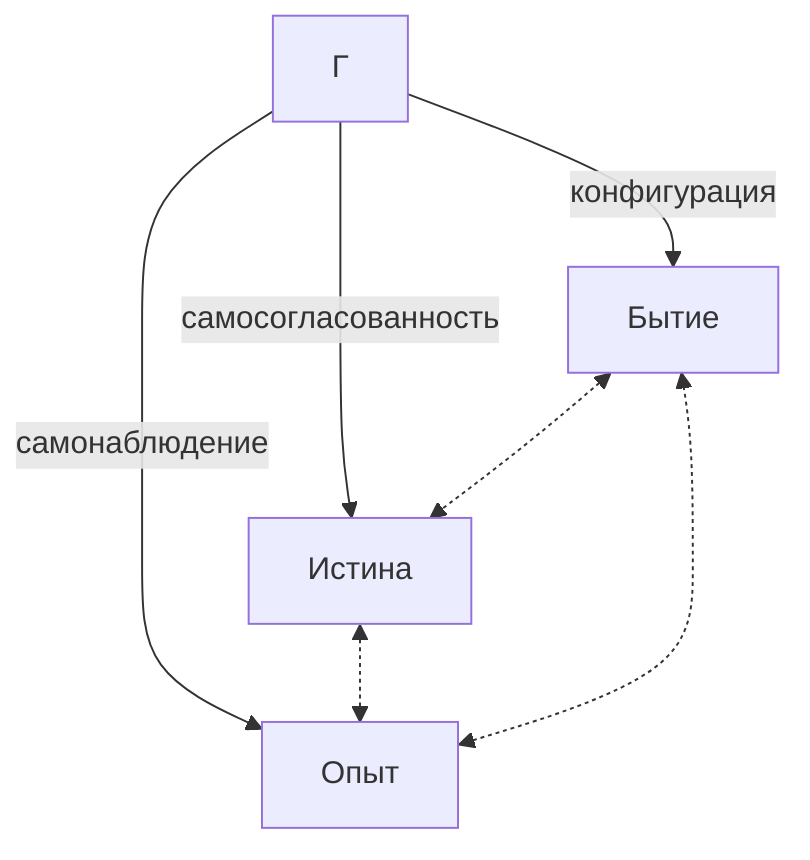
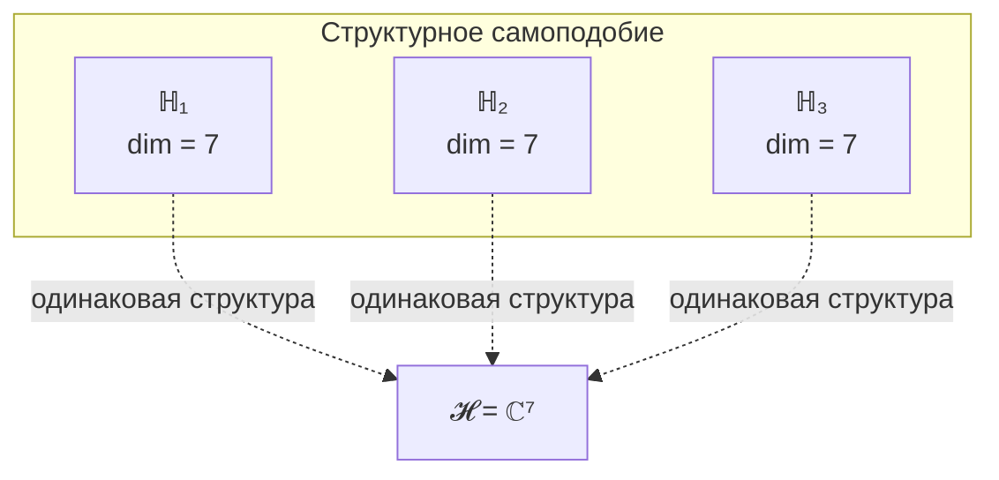

# Следствия из Аксиом

Ниже представлены **логические следствия** из [Аксиомы Ω⁷](./axiom-omega) (семь аксиом категорного формализма) и [Аксиомы (AP+PH+QG+V)](./axiom-septicity). Каждое следствие либо **доказано формально**, либо явно помечено как **гипотеза**.

---

## 0. Когомологический монизм {#когомологический-монизм}

**Статус:** ✅ Формализовано — следствие [Свойства 3](./axiom-omega#свойство-3) (терминальный объект).

:::warning Теорема (Когомологический монизм)
Для базового пространства $X = |N(\mathcal{C})|$:

$$
H^n(X, \mathcal{F}) = 0 \quad \forall n > 0, \forall \mathcal{F}
$$

**Монизм** — не философский выбор, а **математическая теорема**.
:::

**Доказательство:**
1. Терминальный объект T ⟹ ретракция r : N(𝒞) → {T}
2. |N(𝒞)| ≃ * (стягиваемо в точку T)
3. Когомологии стягиваемого пространства тривиальны

**Следствие:** Локальные операторы φᵢ **всегда** склеиваются в глобальное Единое.

---

## 0.1 Локально-глобальная дихотомия {#локально-глобальная-дихотомия}

**Статус:** ✅ Формализовано — следствие [Свойства 5](./axiom-omega#свойство-5) (стратификация).

:::warning Принцип (Локально-глобальная дихотомия)
| Аспект | Глобально | Локально (вблизи T) |
|--------|-----------|---------------------|
| Когомологии | $H^*(X) = 0$ | $H^*_{loc}(X, T) \neq 0$ |
| Интерпретация | Монизм | Физика |
| Топология | Стягиваемо | Богатая структура |
:::

**Теорема (Локальные когомологии):**

$$
H^*_{loc}(X, T) \cong \tilde{H}^{*-1}(\text{Link}(T)) \cong \tilde{H}^{*-1}(S^6) \neq 0
$$

**Интерпретация:**
- Глобальный монизм (H* = 0) совместим с локальной физикой (H*_loc ≠ 0)
- Топологические эффекты (Ааронов-Бом, магнитные монополи) существуют локально
- Это разрешает «парадокс скучной вселенной»

---

## 0.2 Стратифицированная структура {#стратифицированная-структура}

**Статус:** ✅ Формализовано — [Свойство 5](./axiom-omega#свойство-5).

:::info Определение (Стратификация X)
Базовое пространство стратифицировано:

$$
X = \bigsqcup_{\alpha \in A} S_\alpha
$$

- $S_0 = \{T\}$ — терминальный объект (0-мерная страта)
- $S_1$ — рёбра (морфизмы в T)
- $S_n$ — n-симплексы
:::

**Связь со временем:**

$$
\dim(X_\tau) \geq \dim(X_{\tau+1})
$$

Стрела времени = прогрессивный коллапс высших страт к терминальному T.

---

## 0.3 Эмерджентная метрика {#эмерджентная-метрика}

**Статус:** ✅ Формализовано — следствие [Свойств 1, 2, 5](./axiom-omega#структура).

:::warning Теорема (Стратифицированная метрика Конна)
Метрика на X выводится из спектральной тройки $(\mathcal{A}_O, \mathcal{H}, \hat{C})$:

$$
d_{strat}(\omega_1, \omega_2) = \inf_\gamma \int_\gamma ds_\alpha
$$

где $ds_\alpha$ — метрика Конна на страте $S_\alpha$.
:::

**Формула Конна для УГМ:**

$$
d_{UGM}(\Gamma_1, \Gamma_2) = \sup\{|\text{Tr}[\Gamma_1 a] - \text{Tr}[\Gamma_2 a]| : \|[\hat{C}, a]\| \leq 1\}
$$

---

## 0.4 Автопоэтическое базовое пространство {#автопоэтическое-пространство}

**Статус:** ✅ Формализовано — [Теорема Шаудера](./axiom-omega#базовое-пространство).

:::info Теорема (Автопоэзис X)
Базовое пространство определяется как неподвижная точка:

$$
X^* = |N(\mathcal{G}_h(X^*))|
$$

X не постулируется извне, а **самоопределяется** через структуру теории.
:::

**Следствие (Размерность):**

$$
\dim(X) \leq N - 1 = 6
$$

6-мерность пространства — следствие категорной структуры.

## 1. Тождество Бытия, Истины и Опыта

**Статус:** Прямое следствие [Аксиомы Ω⁷](./axiom-omega).

Из Аксиомы Ω следует:

| Аспект | Определение через $\Gamma$ | Формализация |
|--------|---------------------------|--------------|
| **Бытие** | Конфигурация $\Gamma$ | Распределение $\gamma_{ij}$ |
| **Истина** | Самосогласованность $\Gamma$ | Неподвижная точка $\varphi(\Gamma^*) = \Gamma^*$ |
| **Опыт** | Самомоделирование $\Gamma$ | Отображение $\varphi: \Gamma \to \Gamma$ |

Это не три разные вещи, а **три аспекта единого примитива** $\Gamma$.

## 2. Эмерджентное время

**Статус:** ✅ Формализовано — [Теорема об эмерджентном времени](../../proofs/emergent-time).

:::warning Теорема (Эмерджентность времени)
Время **выводится** из структуры категории 𝒞 четырьмя эквивалентными способами:

| Подход | Время как... |
|--------|-------------|
| **Page-Wootters** | Корреляция с [измерением O](../structure/dimension-o) |
| **Информационная геометрия** | Расстояние в метрике Бурес |
| **Категорный** | 1-морфизм в ∞-группоиде Exp_∞ |
| **Стратификационный** | Коллапс страт: dim(X_τ) ≥ dim(X_{τ+1}) |

Стрела времени — **прогрессивный коллапс** к терминальному объекту T.
:::

### 2.0 Стрела времени как коллапс страт

Из [Свойства 5](./axiom-omega#свойство-5) следует:

$$
\dim(X_\tau) \geq \dim(X_{\tau+1})
$$

**Интерпретация:** Эволюция τ → τ+1 сворачивает высшие страты. Стрела времени — движение от сложной стратифицированной структуры к терминальному объекту T = Γ*.

Это следствие усиливает Аксиому Ω⁷: время — не внешний параметр, а функция структуры ∞-топоса Sh_∞(𝒞). [Измерение O](../structure/dimension-o) выполняет роль внутренних часов.

### 2.1 Дискретность времени для конечных систем {#дискретность-времени}

**Статус:** ✅ Формализовано — следует из конечномерности $\mathcal{H}_O$.

:::warning Теорема (Дискретность времени)
Для системы с $\dim(\mathcal{H}_O) = N$ внутреннее время принимает значения из циклической группы:

$$
\tau \in \mathbb{Z}_N = \{0, 1, \ldots, N-1\}
$$

Для УГМ с $N = 7$:

$$
\tau \in \mathbb{Z}_7 = \{0, 1, 2, 3, 4, 5, 6\}
$$
:::

**Следствия:**

| Аспект | Дискретное время | Непрерывный предел |
|--------|------------------|-------------------|
| Пространство | $\mathbb{Z}_7$ (циклическое) | $\mathbb{R}$ или $S^1$ |
| Хронон | $\delta\tau = 2\pi/(7\omega_0)$ | $\to 0$ |
| Уравнение эволюции | Разностное | Дифференциальное |
| ∞-группоид | $\mathbf{Exp}^{disc}_\infty$ | $\mathbf{Exp}_\infty^{cont}$ |

**Непрерывное время** — приближение, справедливое только при $N \to \infty$. Для 7D системы УГМ время фундаментально дискретно.

См. [Теорема об эмерджентном времени](../../proofs/emergent-time#дискретность-времени) и [Категорный формализм](../../proofs/categorical-formalism#exp-disc-infty).

## 3. Отсутствие Внешнего

**Статус:** Прямое следствие [Аксиомы Ω⁷](./axiom-omega) (единственность примитива — ∞-топос Sh_∞(𝒞)).

Если $\Gamma$ — единственный примитив, то не существует ничего "вне" $\Gamma$:

| Традиционное понятие | Статус в УГМ |
|---------------------|--------------|
| Внешний наблюдатель | Часть $\Gamma$ (конфигурация с высоким $R_\varphi$) |
| Внешнее пространство | Структура $\Gamma$ (геометрия на $\mathcal{H}$) |
| Внешнее время | **Эмерджентно** из $\Gamma$ (параметр условных состояний τ) |

**Формально:** Для любой сущности $X$ существует представление как конфигурации $\Gamma$:

$$
\forall X \in \text{Ontology}: \exists \, \Gamma_X \subseteq \Gamma
$$

:::note Онтологический статус
$\Gamma$ — единственная субстанция. Всё остальное — аспекты, конфигурации или состояния $\Gamma$. Это **монизм**, не солипсизм: множество Голономов существует, но все они — конфигурации единой субстанции.
:::

## 4. Принцип имманентности

**Статус:** Прямое следствие [Аксиомы Ω⁷](./axiom-omega).

:::info Принцип имманентности
Реальность полностью имманентна себе. Источник, цель и смысл находятся **внутри** $\Gamma$ как его аспекты и состояния.
:::

### Что это означает

**Формальное выражение:** Вся динамика — внутренняя:

$$
\frac{d\Gamma}{dt} = \mathcal{L}[\Gamma]
$$

где $\mathcal{L}$ — супероператор, действующий на $\mathcal{L}(\mathcal{H})$. Не существует "внешнего" оператора.

### Духовный и мистический опыт

:::warning Важное уточнение
Принцип имманентности **не отрицает** духовный, мистический или трансцендентный опыт. Он **объясняет** его.
:::

| Феномен | Объяснение в УГМ |
|---------|------------------|
| **Переживание трансцендентности** | Реальный опыт (L2) — доступ к глубинным слоям структуры $\Gamma$ |
| **Ощущение "Иного"** | Контакт с конфигурациями $\Gamma$, недоступными обычному самомоделированию |
| **Мистическое единство** | Состояние высокой интеграции ($\Phi \gg 1$), когда границы между Голономами размываются |
| **Духовное преображение** | Перестройка $\Gamma$ к новому аттрактору $\Gamma^*$ с более высоким $R_\varphi$ |

**Ключевое различие:**
- **Феноменология трансцендентности** (переживание выхода за пределы) — **реальна** и объясняется теорией
- **Онтологическая трансцендентность** (существование чего-то "вне" $\Gamma$) — **невозможна** по Аксиоме Ω

То, что переживается как "трансцендентное", есть доступ к более глубоким уровням **той же** реальности $\Gamma$ — не выход за её пределы, а погружение в её основание.

### Переосмысление традиционных понятий

| Традиционное понятие | Статус в УГМ |
|---------------------|--------------|
| "Бог" | Если существует — аспект или состояние $\Gamma$ (возможно, сама целостность $\Gamma$) |
| "Законы природы" | Структура $\Gamma$ (гамильтониан $H$, операторы $L_k$) |
| "Высшее Я" | Конфигурация с высоким $R_\varphi$ (глубокое самомоделирование) |
| "Просветление" | Достижение неподвижной точки $\varphi(\Gamma^*) = \Gamma^*$ |

## 5. Самоподобие структуры

**Статус:** Следствие из Теоремы S (все жизнеспособные системы имеют 7-мерную структуру).

:::warning Уточнение
Это **не** голографический принцип в смысле "каждая часть содержит полную информацию о целом". Это **структурное самоподобие**: все Голономы имеют одинаковую *размерность* и *тип* структуры, но разное *содержание*.
:::

Из [Теоремы S](../../proofs/theorem-minimality-7) следует, что каждый жизнеспособный Голоном $\mathbb{H}$ имеет ту же структуру пространства состояний:

$$
\forall \mathbb{H} \text{ (жизнеспособный)}: \dim(\mathcal{H}_{\mathbb{H}}) = 7
$$

Это означает **изоморфизм пространств состояний** (не самих состояний!):

$$
\mathcal{H}_{\mathbb{H}_1} \cong \mathcal{H}_{\mathbb{H}_2} \cong \mathbb{C}^7
$$

**Важно:** Конкретные состояния $\Gamma_{\mathbb{H}_1}$ и $\Gamma_{\mathbb{H}_2}$ **различны** — изоморфны только пространства, не содержимое.

## 6. Иерархия конфигураций Γ

**Статус:** Прямое следствие [Аксиомы Ω⁷](./axiom-omega) — объекты ∞-топоса Sh_∞(𝒞).

### Онтологическая полнота

:::info Фундаментальный принцип
**ВСЁ** есть конфигурация $\Gamma$ — от кварков до галактик, от вакуумных флуктуаций до сознательного опыта. **Нет исключений.** Теория объясняет все масштабы единым математическим языком.
:::

Вопрос не в том, "является ли X частью Γ" (является по определению), а в том:
1. Какой **уровень организации** имеет конфигурация?
2. Какой тип **стабильности** — пассивная (симметрии) или активная (автопоэзис)?
3. Какой **уровень интериорности** (L0/L1/L2)?

### Таксономия конфигураций Γ

| Класс | Определение | $R$ | Динамика | Примеры |
|-------|-------------|-----|----------|---------|
| **Суб-Голоном** | Фундаментальные моды $\Gamma$ | $\to 0$ | Унитарная (Шрёдингер/Дирак) | Кварки, лептоны, бозоны |
| **Прото-Голоном** | Структурированные, но обратимые | $< 1/3$ | Почти унитарная | Атомы, простые молекулы |
| **Голоном** | (AP)+(PH)+(QG)+(V) | Любой | Полная (Линдблад + $\mathcal{R}$) | Клетки, организмы |
| **L2-Голоном** | Когнитивные квалиа | $\geq 1/3$, $\Phi \geq 1$ | Полная + рефлексия | *(см. ниже)* |

:::info О порогах L2 (теоремы из ПИР)
Критерии чисто математические, **строго выведенные** из Принципа Информационной Различимости:
- $R \geq R_{\text{th}} = 1/3$ — [теорема о пороге рефлексии](./axiom-septicity#теорема-порог-рефлексии) (байесовское доминирование)
- $\Phi \geq \Phi_{\text{th}} = 1$ — [теорема о пороге интеграции](./axiom-septicity#теорема-порог-интеграции) (K₁-нетривиальность)
- $P > P_{\text{crit}} = 2/7$ — [теорема о критической чистоте](../../proofs/theorem-purity-critical) (доказано)

**Потенциальные L2-системы** (эмпирический вопрос):
- Индивидуальные организмы (люди, животные)
- Распределённые сети (мицелий, колонии)
- Коллективные системы (рой, социум)
- Изменённые состояния (медитация, психоделический опыт)
- Экосистемы (биосфера?)
- Иные конфигурации Γ, недоступные обычному восприятию
:::

### Частицы как предельный случай

:::warning Ключевое разъяснение
Частицы **полностью объясняются** теорией — как вырожденные (минимально дифференцированные) состояния $\Gamma$ с $R_\varphi \to 0$.
:::

**Для частицы уравнение эволюции вырождается:**

$$
\frac{d\Gamma}{dt} = -i[H, \Gamma] + \underbrace{\mathcal{D}[\Gamma]}_{\to 0} + \underbrace{\mathcal{R}[\Gamma, E]}_{\to 0} \quad \xrightarrow{R \to 0} \quad \frac{d\Gamma}{dt} = -i[H, \Gamma]
$$

Это **уравнение Шрёдингера** (для чистых состояний) или **уравнение фон Неймана** (для смешанных). Стандартная квантовая механика — **частный случай** УГМ при $R \to 0$. См. [Соответствие с физикой: редукция к КМ](../../proofs/physics-correspondence#3-редукция-к-квантовой-механике) для формального доказательства эквивалентности категорий $\mathbf{Hol}_{R=0} \simeq \mathbf{QM}$.

### Интериорность на всех масштабах

**L0 универсальна**: даже кварк имеет "изнанку" (квантовые числа, внутреннее состояние):

$$
\forall X \subseteq \Gamma: \rho_E(X) \neq 0 \quad \text{(интериорность L0)}
$$

| Объект | Класс | Интериорность | Тип стабильности |
|--------|-------|---------------|------------------|
| Кварк | Суб-Голоном | L0 | Пассивная (симметрии QCD) |
| Атом | Прото-Голоном | L0 | Пассивная (электромагнетизм) |
| Клетка | Голоном | L0, L1 | Активная (метаболизм) |
| Человек | Сознательный Голоном | L0, L1, L2 | Активная (рефлексия) |

### Изменённые состояния сознания

Психоделический опыт, глубокая медитация, околосмертные переживания — всё это конфигурации $\Gamma$ с **изменёнными параметрами**:

| Состояние | Возможная интерпретация в УГМ |
|-----------|------------------------------|
| DMT-"гиперпространство" | Резкое увеличение $\Phi$ (интеграция) при растворении границ Голонома |
| Мистическое единство | Состояние с $\Phi \gg 1$: границы между Голономами размываются |
| "Контакт с сущностями" | Доступ к конфигурациям $\Gamma$, обычно недоступным самомоделированию $\varphi$ |
| Медитативная ясность | Увеличение $R_\varphi$ (качество самомоделирования) |

:::info Ключевой принцип
Теория не утверждает, что такие переживания "нереальны" или "галлюцинации". Они — **реальные конфигурации** $\Gamma$, доступ к которым обычно ограничен. Вопрос об их *онтологическом статусе* (существуют ли "сущности" независимо) остаётся открытым в рамках теории.
:::

### Аналогия: Океан, Водоворот, Рябь

- $\Gamma$ — **Океан** (единая субстанция)
- Голоном — **Водоворот** (самоподдерживающаяся структура)
- Частица — **Рябь** (простая волна)
- Изменённое состояние — **Погружение** (водоворот временно сливается с океаном)

Сказать, что "теория водоворотов не объясняет рябь" — ошибка. Все явления состоят из воды ($\Gamma$) и подчиняются единой динамике.

## 7. Двухаспектный монизм

**Статус:** Прямое следствие [Аксиомы Ω⁷](./axiom-omega) — стратифицированный монизм.

Каждая конфигурация $\Gamma$ имеет **две стороны**:

| Сторона | Характер | Доступ | Формализация |
|---------|----------|--------|--------------|
| **Внешняя** | Объективная | Измерение | Структура $\gamma_{ij}$, динамика $\frac{d\Gamma}{dt}$ |
| **Внутренняя** | Субъективная | Переживание | Иерархия [L0 → L1 → L2](../../proofs/interiority-hierarchy) |

### Иерархия внутренней стороны

Внутренняя сторона имеет три уровня: **L0** (интериорность) → **L1** (феноменальная геометрия) → **L2** (когнитивные квалиа). Каждый уровень требует выполнения условий на $\rho_E$, $R_\varphi$ и $\Phi$. См. [Иерархия интериорности](../../proofs/interiority-hierarchy) для формальных определений.

### Тождество сторон

Стороны **неразделимы** — это не дуализм:

$$
\text{Внешняя сторона}(\Gamma) \equiv \text{Внутренняя сторона}(\Gamma)
$$

Спрашивать "почему физика порождает опыт?" — категориальная ошибка. Это как спрашивать "почему лицевая сторона монеты порождает обратную?". Они не порождают друг друга — они **суть одно**. См. [Трудная проблема сознания](../consciousness/hard-problem).

## 8. Свобода воли {#свобода-воли}

**Статус:** ✅ Формализовано — следствие ∞-категорной структуры [Аксиомы Ω⁷](./axiom-omega).

:::warning Теорема (Свобода воли)
Для конфигурации $\Gamma$ свобода определяется как множество связных компонент пространства отображений в терминальный объект:

$$
\text{Freedom}(\Gamma) = \pi_0(\text{Map}(\Gamma, T))
$$

где $T$ — терминальный объект ∞-топоса Sh_∞(𝒞).
:::

### Интерпретация

**Свобода** — это не иллюзия и не детерминистическое понятие. В ∞-категорном формализме свобода воли получает строгое математическое определение:

| Компонент | Математическое значение | Онтологический смысл |
|-----------|------------------------|---------------------|
| $\text{Map}(\Gamma, T)$ | Пространство путей к $T$ | Все возможные траектории развития |
| $\pi_0(-)$ | Связные компоненты | Классы эквивалентных выборов |
| $\text{Freedom}(\Gamma)$ | Мощность $\pi_0$ | Количество фундаментально различных путей |

### Формальное определение

В ∞-топосе Sh_∞(𝒞) пространство отображений $\text{Map}(\Gamma, T)$ является ∞-группоидом. Его $\pi_0$ — множество изоморфизмов классов объектов (путей), которые нельзя непрерывно деформировать друг в друга.

$$
\text{Freedom}(\Gamma) = |\pi_0(\text{Map}(\Gamma, T))|
$$

**Крайние случаи:**
- $\text{Freedom}(\Gamma) = 1$: единственный путь (детерминизм)
- $\text{Freedom}(\Gamma) > 1$: множественные несводимые пути (свобода выбора)
- $\text{Freedom}(\Gamma) = \infty$: бесконечная свобода (неограниченный потенциал)

### Связь с другими понятиями

| Понятие | Соотношение со свободой |
|---------|-------------------------|
| **Интеграция $\Phi$** | Высокая $\Phi$ коррелирует с большей Freedom |
| **Рефлексия $R$** | $R \geq 1/3$ необходимо для осознания свободы |
| **L2-уровень** | Свобода L2-систем превышает свободу L0/L1 |
| **Автопоэзис** | Свобода — аспект автопоэтической самоорганизации |

:::info Философское значение
Свобода воли в УГМ — не субъективное ощущение и не метафизическая спекуляция, а **топологический инвариант** конфигурации $\Gamma$. Это математически точное понятие, выводимое из ∞-категорной структуры теории.
:::

## 9. Свойства теории

**Статус:** Описание методологических характеристик теории.

| Свойство | Описание | Статус |
|----------|----------|--------|
| **Единственный примитив** | ∞-топос Sh_∞(𝒞) | ✓ [Аксиома Ω⁷](./axiom-omega) |
| **Минимальные аксиомы** | 7 аксиом (Ω⁷) | ✓ Выполнено |
| **Непротиворечивость** | Существует модель | ✓ Доказано |
| **Категорная полнота** | Структурные утверждения разрешимы | ✓ Доказано |
| **Когомологический монизм** | H*(X) = 0 | ✓ [Теорема](#когомологический-монизм) |
| **Вычислимость** | Полиномиальная сложность | ✓ [Реализовано](../../formal/computational) |
| **Фальсифицируемость** | Проверяемые предсказания | ✓ [Критерии](../../reference/falsifiability) |
| **Свобода воли** | Freedom(Γ) = π₀(Map(Γ, T)) | ✓ [Теорема](#свобода-воли) |

### 9.1 Мета-теоретический статус

| Критерий | УГМ |
|----------|---------|
| Примитивы | 1 (∞-топос Sh_∞(𝒞)) |
| Аксиомы | 7 |
| Непротиворечивость | ✅ Доказана |
| Полнота | ✅ Категорная |
| Внутренняя согласованность | ✅ Полная |
| Вычислимость | ✅ Полиномиальная |

## 10. Теоремы Гёделя и полнота УГМ

**Статус:** Следствие из многомерности $\Gamma$ и структуры измерения L.

### О границах применимости теорем Гёделя

:::danger Категориальная ошибка
Теоремы Гёделя часто применяются вольно к системам, которые **не являются формальными системами**. Это категориальная ошибка.
:::

**Условия применимости теорем Гёделя** (все три обязательны):

| Условие | Требование | Пример нарушения |
|---------|------------|------------------|
| **Формальность** | Чётко определённые аксиомы и правила вывода | "Человеческий разум неполон" — разум не формальная система |
| **Выразительность** | Система кодирует арифметику Пеано | "Физика ограничена по Гёделю" — физика ≠ арифметика |
| **Непротиворечивость** | Предполагается как условие | "Общество неполно" — общество не имеет аксиом |

**Типичные ошибки:**
- *"ИИ принципиально ограничен по Гёделю"* — нейросеть не является формальной системой
- *"Сознание неполно"* — сознание не формализовано как аксиоматическая система
- *"Наука не может объяснить всё"* — наука не является замкнутой формальной системой

**Математический факт:** Теоремы Гёделя доказаны для формальных систем определённого типа. Это не интерпретация — это условия самих теорем. Применение их к неформальным системам — не "альтернативный взгляд", а логическая ошибка (применение теоремы вне области её доказательства).

В УГМ измерение L (Логика) **по определению** является формальной структурой (алгебра операторов с отношениями коммутации) — к нему теоремы применимы. К остальным 6 измерениям и к $\Gamma$ в целом теоремы Гёделя **не применяются** — не потому что "мы так решили", а потому что они не удовлетворяют условиям теорем.

### Два уровня анализа

**Уровень A: УГМ как формализованная теория**

Если формализовать УГМ как математическую систему с аксиомами, теоремы Гёделя **применяются** к этой формализации:
- Существуют истины о $\Gamma$, недоказуемые внутри формализованной УГМ
- Формализованная УГМ не может доказать собственную непротиворечивость

Это **неизбежно** для всех достаточно выразительных формальных систем.

**Уровень B: Реальность, описываемая УГМ**

Предмет УГМ ($\Gamma$) — не формальная система. Это оператор на $\mathcal{H} = \mathbb{C}^7$ с 7 измерениями, одно из которых — Логика (L).

:::info Ключевое наблюдение
Теоремы Гёделя применяются к формальным системам, оперирующим **исключительно в измерении L**. Но $L \subsetneq \Gamma$.
:::

### Три типа истины

| Тип истины | Определение | Область |
|------------|-------------|---------|
| **Логическая доказуемость** | $p \in \text{Prov}(L)$ | Только измерение L |
| **Когерентность-истина** | $\text{Coh}(p, \Gamma) > 0$ | Все 7 измерений |
| **Экзистенциальная истина** | $\exists \Gamma : p(\Gamma)$ | Демонстрируется существованием |

### Категориальная формализация

Пусть $\pi_L: \mathbf{Hol} \to \mathbf{Log}$ — функтор проекции на L-измерение.

**Утверждение:** $\pi_L$ не верен (теряет информацию):

$$
\pi_L(\mathbb{H}) = \Gamma|_L \subsetneq \Gamma
$$

**Гёдель доказал:** $\text{Prov}(L) \subsetneq \text{True}(L)$

**УГМ обобщает:** $L \subsetneq \Gamma$, следовательно:

$$
\text{Prov}(L) \subsetneq \text{Coh}(\Gamma)
$$

Истины, требующие доступа к измерениям $\{A, S, D, E, O, U\}$, **принципиально** недоступны чистой логике.

### Непротиворечивость через автопоэзис

Вторая теорема Гёделя запрещает **логическое** доказательство непротиворечивости. УГМ демонстрирует непротиворечивость **экзистенциально**:

$$
\exists \Gamma^* : \varphi(\Gamma^*) = \Gamma^* \quad \Rightarrow \quad \text{Con}(\text{УГМ})
$$

**Аргумент:**
1. Если бы теория была противоречивой, существовали бы $\Gamma$ с $P(\Gamma) > 0 \land P(\neg \Gamma) > 0$
2. Но по [определению L](../structure/dimension-l): $\nexists \Gamma : P(\Gamma) > 0 \land P(\neg \Gamma) > 0$
3. Существование и функционирование Голономов **демонстрирует** непротиворечивость

:::tip Принцип
**Consistency is enacted, not proven** — непротиворечивость **исполняется** (через существование), не доказывается логически.
:::

### Минимальная полнота vs гёделева полнота

| Понятие | Определение | Статус в УГМ |
|---------|-------------|--------------|
| **Гёделева полнота** | Всякая истина доказуема | НЕ утверждается (невозможно) |
| **Минимальная полнота** | 7 измерений достаточны для (AP)+(PH)+(QG) | ✓ Доказано ([Теорема S](../../proofs/theorem-minimality-7)) |
| **Расширяемость** | $\dim(\mathcal{H}) > 7$ возможно | Теория открыта для расширений |

### Неполнота как двигатель эволюции

Когда L-измерение достигает гёделева предела (неразрешимая проблема):

1. Возникает **сингулярность** в логическом пространстве
2. Система обращается к **измерению O** (Основание)
3. O вбрасывает новую информацию (флуктуация, интуиция)
4. Происходит **топологическая хирургия** — расширение аксиоматики
5. Система восстанавливает когерентность на новом уровне

**Вывод:** Гёделева неполнота — не ограничение, а **двигатель эволюции**. Она вынуждает систему оставаться открытой к Основанию (O), предотвращая замкнутую стагнацию.

### Резюме

:::warning Теорема (УГМ о Гёделе)
*Никакая проекция $\Gamma$ на измерение L не может быть изоморфна $\Gamma$:*

$$
L \subsetneq \Gamma \quad \Rightarrow \quad \text{Prov}(L) \subsetneq \text{Coh}(\Gamma)
$$

*Истина (когерентность) всегда шире Доказательства (логического вывода). Это структурный факт, объясняющий необходимость многомерности.*
:::

## 11. Вычислительные конфигурации Γ

**Статус:** Следствие из Аксиомы Ω⁷ (всё есть объект ∞-топоса Sh_∞(𝒞)).

### Онтология вычислений

По Аксиоме Ω⁷, вычислительный процесс — **объект ∞-топоса Sh_∞(𝒞)**. Вопрос не в том, "имеет ли вычисление Γ", а в том, какой **класс** конфигурации оно представляет.

### Определение вычислительной конфигурации

**Вычислительная конфигурация** определяется через частичный след по нерелевантным степеням свободы:

$$
\Gamma_{\text{comp}} := \mathrm{Tr}_{-\text{comp}}(\Gamma_{\text{phys}})
$$

где:
- $\Gamma_{\text{phys}}$ — матрица когерентности физического субстрата
- $\mathrm{Tr}_{-\text{comp}}$ — частичный след по степеням свободы, не релевантным для вычисления

### Классические vs квантовые вычисления

| Тип вычисления | Когерентности | $\Phi$ | Статус |
|----------------|---------------|--------|--------|
| Классические | $\gamma_{ij}^{\text{comp}} \approx 0$ при $i \neq j$ | $\approx 0$ | Прото-Голоном (L0-L1) |
| Квантовые | $\gamma_{ij}^{\text{comp}} \neq 0$ | $> 0$ | Потенциально Голоном |

**Следствие:** Классические вычисления не достигают L2 по определению ($\Phi < 1$).

### 11.1 Структура полного пространства состояний {#структура-полного-пространства}

**Статус:** ✅ Следует из [Свойства 2 Ω⁷](./axiom-omega#свойство-2).

Для механизма Page-Wootters используется тензорное разложение:

$$
\mathcal{H}_{total} = \mathcal{H}_O \otimes \mathcal{H}_{6D}
$$

**Размерности:**
- $\dim(\mathcal{H}_O) = 7$ — пространство внутренних часов
- $\dim(\mathcal{H}_{6D}) = 6$ — пространство остальных измерений

**Полная размерность:**

$$
\dim(\mathcal{H}_{total}) = 7 \times 6 = 42
$$

:::note Связь с минимальным формализмом
Это **расширение** минимального 7D-формализма ([Теорема S](../../proofs/theorem-minimality-7)) для определения частичного следа. Минимальная размерность для автопоэзиса остаётся 7, но для механизма Page-Wootters требуется тензорная структура. См. [Матрица когерентности](../dynamics/coherence-matrix#два-уровня-формализации).
:::

### Категорная структура

Связь вычислительного и физического уровней формализуется через функторы:

$$
\mathrm{Abstract}: \mathbf{DensityMat} \to \mathbf{Comp}
$$
$$
\mathrm{Realize}: \mathbf{Comp} \to \mathbf{DensityMat}
$$

**Условие множественной реализуемости:**
$$
\mathrm{Abstract} \circ \mathrm{Realize} \cong \mathrm{Id}_{\mathbf{Comp}}
$$

Разные физические системы могут реализовывать одно вычисление.

## 12. Эмерджентность без редукции

**Статус:** Следствие из нелинейности взаимодействий.

Высшие уровни организации **не редуцируются** к простой сумме низших:

$$
\Gamma_{\text{целое}} \neq \sum_i \Gamma_{\text{часть}_i}
$$

### Формальное описание

Состояние композитной системы из $n$ Голономов:

$$
\Gamma_{\text{композит}} = \rho_{12...n} \in \mathcal{L}(\mathcal{H}_1 \otimes \mathcal{H}_2 \otimes ... \otimes \mathcal{H}_n)
$$

При наличии **запутанности** (когерентности между подсистемами):

$$
\Gamma_{\text{композит}} \neq \Gamma_1 \otimes \Gamma_2 \otimes ... \otimes \Gamma_n
$$

### Мера эмерджентности

Степень эмерджентности измеряется **взаимной информацией**:

$$
I(\mathbb{H}_1 : \mathbb{H}_2) = S(\Gamma_1) + S(\Gamma_2) - S(\Gamma_{12})
$$

где $S(\Gamma) = -\mathrm{Tr}(\Gamma \log \Gamma)$ — энтропия фон Неймана.

При $I > 0$ целое содержит **информацию, отсутствующую в частях** — это и есть эмерджентность.

---

**Связанные документы:**
- [Аксиома Ω⁷](./axiom-omega) — семь аксиом УГМ (∞-топос Sh_∞(𝒞) как единственный примитив)
- [Теорема об эмерджентном времени](../../proofs/emergent-time) — вывод времени из структуры Γ
- [Аксиома Септичности](./axiom-septicity) — условия (AP+PH+QG+V) и выведенные константы
- [Теорема S](../../proofs/theorem-minimality-7) — доказательство минимальности 7D
- [Голоном](../structure/holon) — иерархическое определение
- [Измерение O (Основание)](../structure/dimension-o) — роль внутренних часов
- [Пространство-время](../cosmology/spacetime) — эмерджентная геометрия
- [Категорный формализм](../../proofs/categorical-formalism) — ∞-группоид и ∞-топос
- [Иерархия интериорности](../../proofs/interiority-hierarchy) — уровни L0→L1→L2
- [Соответствие с физикой](../../proofs/physics-correspondence) — связь с КМ, ОТО и Стандартной моделью
