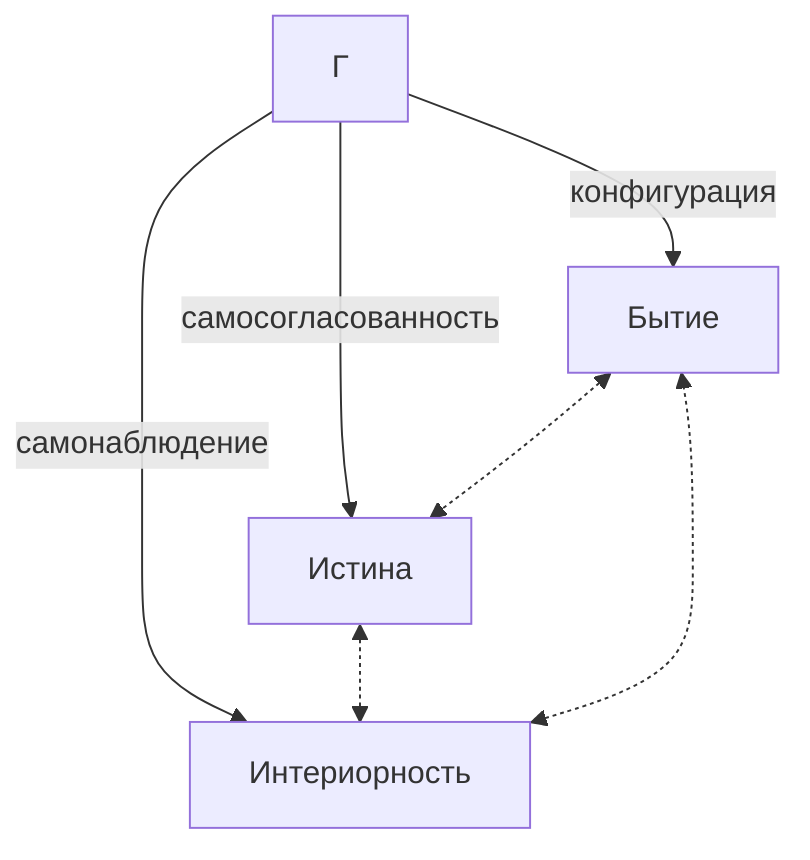
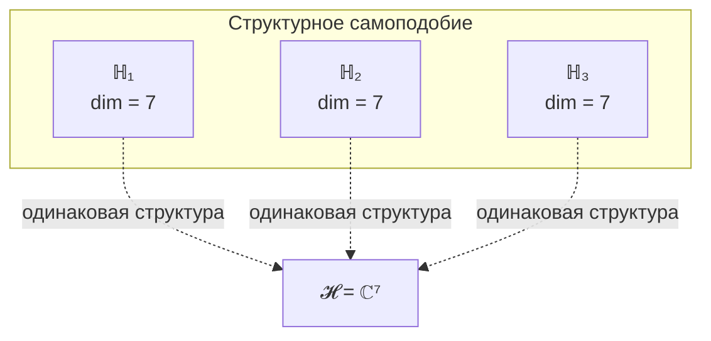

# Следствия из Аксиом

Ниже представлены **логические следствия** из [Аксиомы Ω⁷](./axiom-omega) (пять аксиом категорного формализма) и [Аксиомы (AP+PH+QG+V)](./axiom-septicity). Каждое следствие либо **доказано формально**, либо явно помечено как **гипотеза**.

---

## 0. Когомологический монизм {#когомологический-монизм}

**Статус:** [Т] Формализовано — следствие [Свойства 3](./axiom-omega#свойство-3) (терминальный объект).

:::warning Теорема (Когомологический монизм)
Для базового пространства $X = |N(\mathcal{C})|$:

$$
H^n(X, \mathcal{F}) = 0 \quad \forall n > 0, \forall \mathcal{F}
$$

**Монизм** — не философский выбор, а **математическая теорема**.
:::

**Доказательство:**
1. Терминальный объект T ⟹ ретракция r : N(𝒞) → {T}
2. |N(𝒞)| ≃ * (стягиваемо в точку T)
3. Когомологии стягиваемого пространства тривиальны

:::info Уточнение: стягиваемость нерва
Стягиваемость $X = |N(\mathcal{C})|$ следует из стандартного факта теории категорий: если категория $\mathcal{C}$ имеет терминальный объект $T$, то нерв $N(\mathcal{C})$ стягиваем. Аргумент: $T$ определяет конус над любой диаграммой в $\mathcal{C}$ — для каждого объекта $C \in \mathcal{C}$ существует единственный морфизм $C \to T$. Это даёт каноническое отображение $r: N(\mathcal{C}) \to \{T\}$ (коллапс на вершину) и его правый обратный $i: \{T\} \to N(\mathcal{C})$ (включение). Гомотопия $H: N(\mathcal{C}) \times [0,1] \to N(\mathcal{C})$ между $\mathrm{id}$ и $i \circ r$ строится через единственные морфизмы $C \to T$: на уровне $n$-симплексов это естественная замена $[C_0 \to \ldots \to C_n]$ на $[C_0 \to \ldots \to C_n \to T]$. Ссылка: Quillen (1973), «Higher algebraic K-theory: I», Prop. 1.
:::

**Следствие:** Локальные операторы φᵢ **всегда** склеиваются в глобальное Единое.

---

## 0.1 Локально-глобальная дихотомия {#локально-глобальная-дихотомия}

**Статус:** [Т] Формализовано — следствие [Свойства 5](./axiom-omega#свойство-5) (стратификация).

:::warning Принцип (Локально-глобальная дихотомия)
| Аспект | Глобально | Локально (вблизи T) |
|---|---|---|
| Когомологии | $H^*(X) = 0$ | $H^*_{loc}(X, T) \neq 0$ |
| Интерпретация | Монизм | Физика |
| Топология | Стягиваемо | Богатая структура |
:::

**Теорема (Локальные когомологии):**

$$
H^*_{loc}(X, T) \cong \tilde{H}^{*-1}(\text{Link}(T)) \cong \tilde{H}^{*-1}(S^6) \neq 0
$$

**Интерпретация:**
- Глобальный монизм (H* = 0) совместим с локальной физикой (H*_loc ≠ 0)
- Топологические эффекты (Ааронов-Бом, магнитные монополи) существуют локально
- Это разрешает «парадокс скучной вселенной»

### 0.1.1 Структурная необходимость $\Lambda > 0$ (T-71) [Т] {#теорема-лямбда-положительна}

**Статус:** [Т] — следствие [когомологического монизма](#когомологический-монизм) [Т], [локально-глобальной дихотомии](#локально-глобальная-дихотомия) [Т] и автопоэзиса (A1).

:::warning Теорема (Структурная необходимость $\Lambda > 0$) [Т]
В УГМ наблюдаемая космологическая постоянная строго положительна: $\Lambda_{\text{obs}} > 0$.
:::

**Доказательство.**

**Шаг 1 (Глобальное обнуление).** Из когомологического монизма ($T$ — терминальный объект, $H^n(X, \mathcal{F}) = 0$ для $n > 0$, [Т](#когомологический-монизм)):

$$
\Lambda_{\text{global}} = \int_X \rho_{\text{vac}} \, d\text{vol} = 0
$$

**Шаг 2 (Локальная ненулевость).** Из [локально-глобальной дихотомии](#локально-глобальная-дихотомия) [Т]:

$$
H^*_{\text{loc}}(X, T) \cong \tilde{H}^{*-1}(\text{Link}(T)) \cong \tilde{H}^{*-1}(S^6) \neq 0
$$

В частности, $H^7_{\text{loc}}(X, T) \cong \tilde{H}^6(S^6) \cong \mathbb{Z}$. Следовательно, локальная вакуумная энергия $\rho_{\text{vac}}(T) \neq 0$.

**Шаг 3 (Определение знака из автопоэзиса).** Вблизи $T$ вакуумная энергия определяется балансом диссипации и регенерации в стационарном состоянии $\rho_*$ ([примитивность](/docs/core/operators/lindblad-operators#примитивность-ℒω) T-39a [Т]):

$$
\rho_{\text{vac}}(T) = \kappa_0 \cdot \left[P(\rho_*) - P(I/7)\right] \cdot \omega_0
$$

где $\kappa_0 > 0$ [Т] ([T-44a](/docs/core/foundations/axiom-septicity#категориальный-вывод-kappa0)), $P(\rho_*) > 2/7 > 1/7 = P(I/7)$ [Т] ([T-5](/docs/proofs/dynamics/theorem-purity-critical)) и $\omega_0 > 0$ — базовая частота ([A5](/docs/core/foundations/axiom-omega#pw-constraint)). Все три множителя **строго положительны**:

$$
\rho_{\text{vac}}(T) > 0
$$

**Шаг 4 (Физическая интерпретация).** Положительность $\rho_{\text{vac}}$ — **автопоэтическая работа**: затраты энергии на поддержание когерентности $\rho_*$ над максимально смешанным состоянием $I/7$. Автопоэзис (A1) **требует** $P(\rho_*) > P_{\text{crit}} > P(I/7)$, что неизбежно генерирует положительную вакуумную энергию.

**Шаг 5 (Связь с $\Lambda$).** Космологическая постоянная:

$$
\Lambda_{\text{obs}} = 8\pi G_N \cdot \rho_{\text{vac}}(T) > 0
$$

$\blacksquare$

#### Связь с неполнотой Ловера

Из [T-55](#неполнота-ловера) [Т]: $\text{Th}_{\text{UHM}} \subsetneq \Omega$ — внутренняя теория принципиально неполна. Неполнота означает, что система не может полностью «самомоделировать» ($\varphi(\Gamma) \neq \Gamma$ для общего $\Gamma$). Ненулевой остаток $\|\Gamma - \varphi(\Gamma)\|$ — информационный зазор, энергетический эквивалент которого и есть $\rho_{\text{vac}} > 0$.

Формально: $R(\Gamma) = 1 - \|\Gamma - \varphi(\Gamma)\|_F^2/\|\Gamma\|_F^2 < 1$ [Т] (T-55 → $\varphi \neq \text{id}$), следовательно:

$$
\|\Gamma - \varphi(\Gamma)\|_F^2 = (1 - R) \cdot \|\Gamma\|_F^2 > 0
$$

Этот информационный зазор транслируется в положительную вакуумную энергию через автопоэтический механизм (Шаг 3).

:::info Следствие
$\Lambda_{\text{obs}} > 0$ — **необходимое** условие существования жизнеспособных систем. Вселенная с $\Lambda \leq 0$ не может содержать автопоэтических голономов (в рамках УГМ). Величина $\Lambda$: $\sim 10^{-120 \pm 10}$ [С] (см. [спектральная формула](/docs/physics/gravity/cosmological-constant#теорема-спектральная-лямбда) и [бюджет Λ](/docs/proofs/gap/lambda-budget#обновлённый-бюджет)).
:::

---

## 0.2 Стратифицированная структура {#стратифицированная-структура}

**Статус:** [Т] Формализовано — [Свойство 5](./axiom-omega#свойство-5).

:::info Определение (Стратификация X)
Базовое пространство стратифицировано:

$$
X = \bigsqcup_{\alpha \in A} S_\alpha
$$

- $S_0 = \{T\}$ — терминальный объект (0-мерная страта)
- $S_1$ — рёбра (морфизмы в T)
- $S_n$ — n-симплексы
:::

**Связь со временем:**

$$
\dim(X_\tau) \geq \dim(X_{\tau+1})
$$

Стрела времени = прогрессивный коллапс высших страт к терминальному T.

---

## 0.3 Эмерджентная метрика {#эмерджентная-метрика}

**Статус:** [Т] Формализовано — следствие [Свойств 1, 2, 5](./axiom-omega#структура).

:::warning Теорема (Стратифицированная метрика Конна)
Метрика на X выводится из спектральной тройки $(\mathcal{A}_O, \mathcal{H}, \hat{C})$:

$$
d_{strat}(\omega_1, \omega_2) = \inf_\gamma \int_\gamma ds_\alpha
$$

где $ds_\alpha$ — метрика Конна на страте $S_\alpha$.
:::

**Формула Конна для УГМ:**

$$
d_{UGM}(\Gamma_1, \Gamma_2) = \sup\{|\text{Tr}[\Gamma_1 a] - \text{Tr}[\Gamma_2 a]| : \|[\hat{C}, a]\| \leq 1\}
$$

---

## 0.4 Автопоэтическое базовое пространство {#автопоэтическое-пространство}

**Статус:** [Т] Формализовано — [Теорема Шаудера](./axiom-omega#базовое-пространство).

:::info Теорема (Автопоэзис X)
Базовое пространство определяется как неподвижная точка:

$$
X^* = |N(\mathcal{G}_h(X^*))|
$$

X не постулируется извне, а **самоопределяется** через структуру теории.
:::

**Следствие (Размерность):**

$$
\dim(X) \leq N - 1 = 6
$$

6-мерность пространства — следствие категорной структуры.

## 0.5 Октонионные следствия {#октонионные-следствия}

**Статус:** [Т] Следствия из [структурного вывода N=7](../../proofs/minimality/theorem-octonionic-derivation) (P1+P2 → 𝕆 → 7).

:::info Предпосылка
Пространство внутренних степеней свободы изоморфно Im(𝕆) ([Трек B](../../proofs/minimality/theorem-octonionic-derivation)), и структура октонионов порождает ряд следствий для теории УГМ.
:::

### 0.5.1 $G_2$-симметрия [Т] {#g2-симметрия}

Из $\mathcal{A} = \mathbb{O}$ следует:

$$
\text{Aut}(\mathbb{O}) = G_2 \subset SO(7)
$$

$G_2$ — минимальная исключительная группа Ли, $\dim(G_2) = 14$, ранга 2.

**Следствие для УГМ:** 7-мерное пространство Im(𝕆) обладает 14-параметрической группой симметрий, сохраняющей структуру октонионного умножения.

:::info $G_2$-оговорка [Т]
Отождествление $G_2$-симметрии с калибровочной свободой в пространстве измерений {A,S,D,L,E,O,U} — теорема [Т]. Совпадение группы симметрий нетривиально и допускает эмпирическую проверку.
:::

### 0.5.2 Плоскость Фано и структура когерентностей [Т] {#фано-структура}

Плоскость Фано PG(2,2) определяет комбинаторную структуру умножения $\mathbb{O}$:

| Элемент PG(2,2) | Количество | Соответствие в УГМ |
|---|---|---|
| Точки | 7 | 7 мнимых единиц $e_1, \ldots, e_7$ ↔ 7 измерений |
| Линии (триплеты) | 7 | 7 ассоциативных подтриплетов |
| Пары точек | 21 | 21 когерентность $\gamma_{ij}$ в матрице $\Gamma$ |

<svg viewBox="0 0 400 340" xmlns="http://www.w3.org/2000/svg" style="max-width:380px;margin:1.5em auto;display:block">
  <line x1="200" y1="35" x2="50" y2="300" stroke="currentColor" stroke-width="2.5"/>
  <line x1="50" y1="300" x2="350" y2="300" stroke="currentColor" stroke-width="2.5"/>
  <line x1="350" y1="300" x2="200" y2="35" stroke="currentColor" stroke-width="2.5"/>
  <line x1="200" y1="35" x2="200" y2="300" stroke="currentColor" stroke-width="1" opacity="0.5"/>
  <line x1="50" y1="300" x2="275" y2="167" stroke="currentColor" stroke-width="1" opacity="0.5"/>
  <line x1="350" y1="300" x2="125" y2="167" stroke="currentColor" stroke-width="1" opacity="0.5"/>
  <circle cx="200" cy="212" r="88" fill="none" stroke="currentColor" stroke-width="1.2" stroke-dasharray="6,4" opacity="0.45"/>
  <circle cx="200" cy="35" r="18" fill="white" stroke="currentColor" stroke-width="2"/>
  <circle cx="50" cy="300" r="18" fill="white" stroke="currentColor" stroke-width="2"/>
  <circle cx="350" cy="300" r="18" fill="white" stroke="currentColor" stroke-width="2"/>
  <circle cx="125" cy="167" r="18" fill="white" stroke="currentColor" stroke-width="2"/>
  <circle cx="200" cy="300" r="18" fill="white" stroke="currentColor" stroke-width="2"/>
  <circle cx="275" cy="167" r="18" fill="white" stroke="currentColor" stroke-width="2"/>
  <circle cx="200" cy="212" r="18" fill="white" stroke="currentColor" stroke-width="2"/>
  <text x="200" y="36" text-anchor="middle" dominant-baseline="central" fill="#333" font-family="serif" font-size="14" font-style="italic">e₁</text>
  <text x="50" y="301" text-anchor="middle" dominant-baseline="central" fill="#333" font-family="serif" font-size="14" font-style="italic">e₂</text>
  <text x="350" y="301" text-anchor="middle" dominant-baseline="central" fill="#333" font-family="serif" font-size="14" font-style="italic">e₃</text>
  <text x="125" y="168" text-anchor="middle" dominant-baseline="central" fill="#333" font-family="serif" font-size="14" font-style="italic">e₄</text>
  <text x="200" y="301" text-anchor="middle" dominant-baseline="central" fill="#333" font-family="serif" font-size="14" font-style="italic">e₅</text>
  <text x="275" y="168" text-anchor="middle" dominant-baseline="central" fill="#333" font-family="serif" font-size="14" font-style="italic">e₇</text>
  <text x="200" y="213" text-anchor="middle" dominant-baseline="central" fill="#333" font-family="serif" font-size="14" font-style="italic">e₆</text>
</svg>

Вершины треугольника: $e_1$ (A), $e_2$ (S), $e_3$ (D). Середины сторон: $e_4$ (L), $e_5$ (E), $e_7$ (O). Центр: $e_6$ (U). **Жирные** линии — стороны, **тонкие** — медианы через $e_6$, **пунктирная окружность** — через $e_4, e_5, e_7$.

**Следствие [Т]:** Из 21 когерентности $\gamma_{ij}$, 7 × 3 = 21 пар распределяются по 7 триплетам Фано. Каждый триплет образует ассоциативную подалгебру (изоморфную Im($\mathbb{H}$)).

**Предсказание [Т]:** Когерентности внутри Фано-триплетов могут коррелировать сильнее, чем между триплетами.

### 0.5.3 Код Хэмминга H(7,4) [Т] {#хэмминг-следствие}

Код Хэмминга $H(7,4)$ — совершенный линейный двоичный код: 7 битов = 4 информационных + 3 проверочных. Проверочная матрица определяется 7 точками плоскости Фано.

**Структурное соответствие [Т]:**

| H(7,4) | УГМ | Функция |
|---|---|---|
| 4 информационных бита | A, S, D, L | Структурные измерения |
| 3 проверочных бита | E, O, U | Метаструктурные измерения |
| Совершенная коррекция | Оптимальная помехоустойчивость | [Жизнеспособность](../dynamics/viability) |

:::info Соответствие 4+3 [Т]
Соответствие 4+3 — теорема [Т]. Совпадение с делением измерений на «объективные» (A,S,D,L) и «субъективные» (E,O,U) нетривиально.
:::

### 0.5.4 Граница Кэли-Диксона [Т] {#граница-кэли-диксона}

$\mathbb{O}$ — последняя нормированная алгебра с делением в цепочке Кэли-Диксона. Следовательно:

$$
N = 7 = \max\{\dim(\text{Im}(\mathcal{A})) : \mathcal{A} \text{ — алгебра с делением}\}
$$

**Следствие:** $N = 7$ — одновременно **минимальное** (Теорема S, Трек A) и **максимальное** (граница К-Д, Трек B) значение для систем с нормированной алгебраической структурой. Это двойная экстремальность усиливает обоснование Аксиомы 3.

---

## 1. Тождество Бытия, Истины и Интериорности

**Статус:** Прямое следствие [Аксиомы Ω⁷](./axiom-omega).

Из Аксиомы Ω следует:

| Аспект | Определение через $\Gamma$ | Формализация |
|---|---|---|
| **Бытие** | Конфигурация $\Gamma$ | Распределение $\gamma_{ij}$ |
| **Истина** | Самосогласованность $\Gamma$ | Неподвижная точка $\varphi(\Gamma^*) = \Gamma^*$ |
| **Интериорность** | Самомоделирование $\Gamma$ | Отображение $\varphi: \Gamma \to \Gamma$ |

Это не три разные вещи, а **три аспекта единого примитива** $\Gamma$.

## 2. Эмерджентное время

**Статус:** [Т] Формализовано — [Теорема об эмерджентном времени](../../proofs/dynamics/emergent-time).

:::warning Теорема (Эмерджентность времени)
Время **выводится** из структуры категории 𝒞 четырьмя эквивалентными способами:

| Подход | Время как... |
|---|---|
| **Page-Wootters** | Корреляция с [измерением O](../structure/dimension-o) |
| **Информационная геометрия** | Расстояние в метрике Бурес |
| **Категорный** | 1-морфизм в ∞-группоиде Exp_∞ |
| **Стратификационный** | Коллапс страт: dim(X_τ) ≥ dim(X_{τ+1}) |

Стрела времени — **прогрессивный коллапс** к терминальному объекту T.
:::

### 2.0 Стрела времени как коллапс страт

Из [Свойства 5](./axiom-omega#свойство-5) следует:

$$
\dim(X_\tau) \geq \dim(X_{\tau+1})
$$

**Интерпретация:** Эволюция τ → τ+1 сворачивает высшие страты. Стрела времени — движение от сложной стратифицированной структуры к терминальному объекту T = Γ*.

Это следствие усиливает Аксиому Ω⁷: время — не внешний параметр, а функция структуры ∞-топоса Sh_∞(𝒞). [Измерение O](../structure/dimension-o) выполняет роль внутренних часов.

### 2.1 Дискретность времени для конечных систем {#дискретность-времени}

**Статус:** [Т] Формализовано — следует из конечномерности $\mathcal{H}_O$.

:::warning Теорема (Дискретность времени)
Для системы с $\dim(\mathcal{H}_O) = N$ внутреннее время принимает значения из циклической группы:

$$
\tau \in \mathbb{Z}_N = \{0, 1, \ldots, N-1\}
$$

Для УГМ с $N = 7$:

$$
\tau \in \mathbb{Z}_7 = \{0, 1, 2, 3, 4, 5, 6\}
$$
:::

**Следствия:**

| Аспект | Дискретное время | Непрерывный предел |
|---|---|---|
| Пространство | $\mathbb{Z}_7$ (циклическое) | $\mathbb{R}$ или $S^1$ |
| Хронон | $\delta\tau = 2\pi/(7\omega_0)$ | $\to 0$ |
| Уравнение эволюции | Разностное | Дифференциальное |
| ∞-группоид | $\mathbf{Exp}^{disc}_\infty$ | $\mathbf{Exp}_\infty^{cont}$ |

**Непрерывное время** — приближение, справедливое только при $N \to \infty$. Для 7D системы УГМ время фундаментально дискретно.

См. [Теорема об эмерджентном времени](../../proofs/dynamics/emergent-time#дискретность-времени) и [Категорный формализм](../../proofs/categorical/categorical-formalism#exp-disc-infty).

## 3. Отсутствие Внешнего

**Статус:** Прямое следствие [Аксиомы Ω⁷](./axiom-omega) (единственность примитива — ∞-топос Sh_∞(𝒞)).

Если $\Gamma$ — единственный примитив, то не существует ничего "вне" $\Gamma$:

| Традиционное понятие | Статус в УГМ |
|---|---|
| Внешний наблюдатель | Часть $\Gamma$ (конфигурация с высоким $R_\varphi$) |
| Внешнее пространство | Структура $\Gamma$ (геометрия на $\mathcal{H}$) |
| Внешнее время | **Эмерджентно** из $\Gamma$ (параметр условных состояний τ) |

**Формально:** Для любой сущности $X$ существует представление как конфигурации $\Gamma$:

$$
\forall X \in \text{Ontology}: \exists \, \Gamma_X \subseteq \Gamma
$$

:::note Онтологический статус
$\Gamma$ — единственная субстанция. Всё остальное — аспекты, конфигурации или состояния $\Gamma$. Это **монизм**, не солипсизм: множество Голономов существует, но все они — конфигурации единой субстанции.
:::

## 4. Принцип имманентности {#принцип-имманентности}

**Статус:** Прямое следствие [Аксиомы Ω⁷](./axiom-omega).

:::info Принцип имманентности
Реальность полностью имманентна себе. Источник, цель и смысл находятся **внутри** $\Gamma$ как его аспекты и состояния.
:::

### Что это означает

**Формальное выражение:** Вся динамика — внутренняя:

$$
\frac{d\Gamma}{d\tau} = \mathcal{L}[\Gamma]
$$

где $\mathcal{L}$ — супероператор, действующий на $\mathcal{L}(\mathcal{H})$. Не существует "внешнего" оператора.

### Духовный и мистический опыт

:::warning Важное уточнение
Принцип имманентности **не отрицает** духовный, мистический или трансцендентный опыт. Он **объясняет** его.
:::

| Феномен | Объяснение в УГМ |
|---|---|
| **Переживание трансцендентности** | Реальный опыт (L2) — доступ к глубинным слоям структуры $\Gamma$ |
| **Ощущение "Иного"** | Контакт с конфигурациями $\Gamma$, недоступными обычному самомоделированию |
| **Мистическое единство** | Состояние высокой интеграции ($\Phi \gg 1$), когда границы между Голономами размываются |
| **Духовное преображение** | Перестройка $\Gamma$ к новому аттрактору $\Gamma^*$ с более высоким $R_\varphi$ |

**Ключевое различие:**
- **Феноменология трансцендентности** (переживание выхода за пределы) — **реальна** и объясняется теорией
- **Онтологическая трансцендентность** (существование чего-то "вне" $\Gamma$) — **невозможна** по Аксиоме Ω

То, что переживается как "трансцендентное", есть доступ к более глубоким уровням **той же** реальности $\Gamma$ — не выход за её пределы, а погружение в её основание.

### Переосмысление традиционных понятий

| Традиционное понятие | Статус в УГМ |
|---|---|
| "Бог" | Если существует — аспект или состояние $\Gamma$ (возможно, сама целостность $\Gamma$) |
| "Законы природы" | Структура $\Gamma$ (гамильтониан $H$, операторы $L_k$) |
| "Высшее Я" | Конфигурация с высоким $R_\varphi$ (глубокое самомоделирование) |
| "Просветление" | Достижение неподвижной точки $\varphi(\Gamma^*) = \Gamma^*$ |

## 5. Самоподобие структуры

**Статус:** Следствие из Теоремы S (все жизнеспособные системы имеют 7-мерную структуру).

:::warning Уточнение
Это **не** голографический принцип в смысле "каждая часть содержит полную информацию о целом". Это **структурное самоподобие**: все Голономы имеют одинаковую *размерность* и *тип* структуры, но разное *содержание*.
:::

Из [Теоремы S](../../proofs/minimality/theorem-minimality-7) следует, что каждый жизнеспособный Голоном $\mathbb{H}$ имеет ту же структуру пространства состояний:

$$
\forall \mathbb{H} \text{ (жизнеспособный)}: \dim(\mathcal{H}_{\mathbb{H}}) = 7
$$

Это означает **изоморфизм пространств состояний** (не самих состояний!):

$$
\mathcal{H}_{\mathbb{H}_1} \cong \mathcal{H}_{\mathbb{H}_2} \cong \mathbb{C}^7
$$

**Важно:** Конкретные состояния $\Gamma_{\mathbb{H}_1}$ и $\Gamma_{\mathbb{H}_2}$ **различны** — изоморфны только пространства, не содержимое.

## 6. Иерархия конфигураций Γ

**Статус:** Прямое следствие [Аксиомы Ω⁷](./axiom-omega) — объекты ∞-топоса Sh_∞(𝒞).

### Онтологическая полнота

:::info Фундаментальный принцип
**ВСЁ** есть конфигурация $\Gamma$ — от кварков до галактик, от вакуумных флуктуаций до сознательного опыта. **Нет исключений.** Теория объясняет все масштабы единым математическим языком.
:::

Вопрос не в том, "является ли X частью Γ" (является по определению), а в том:
1. Какой **уровень организации** имеет конфигурация?
2. Какой тип **стабильности** — пассивная (симметрии) или активная (автопоэзис)?
3. Какой **уровень интериорности** (L0/L1/L2/L3/L4)?

### Таксономия конфигураций Γ

| Класс | Ур. иерархии | Формальное условие | Стабильность | Примеры |
|---|---|---|---|---|
| **Фундаментальная мода Γ** | 0–1 | $R = 0$, чисто унитарная | Пассивная (симметрии) | Кварки, лептоны, бозоны |
| **Составная конфигурация Γ** | 1–2 | $0 < R \ll 1$, квази-автономная | Пассивная (связи) | Атомы, простые молекулы |
| **Голоном** (ℍ) | 2–4 | (AP)+(PH)+(QG)+(V), $P > P_{\text{crit}}$ | Активная (автопоэзис) | Клетки, организмы |
| **L2-Голоном** | 4+ | + $R \geq 1/3$, $\Phi \geq 1$ | + рефлексия | *(см. ниже)* |

:::info О порогах L2
| Порог | Статус | Обоснование |
|---|---|---|
| $P > P_{\text{crit}} = 2/7$ | **[Т]** | [Теорема о критической чистоте](../../proofs/dynamics/theorem-purity-critical) |
| $R \geq R_{\text{th}} = 1/3$ | **[Т]** | [Байесовское доминирование](/docs/core/foundations/axiom-septicity#теорема-порог-рефлексии) + $K=3$ из [триадной декомпозиции](/docs/core/operators/lindblad-operators#триадная-декомпозиция) |
| $\Phi \geq \Phi_{\text{th}} = 1$ | **[О]** | [Когерентная доминация](./axiom-septicity#теорема-порог-интеграции) |

**Потенциальные L2-системы** (эмпирический вопрос):
- Индивидуальные организмы (люди, животные)
- Распределённые сети (мицелий, колонии)
- Коллективные системы (рой, социум)
- Изменённые состояния (медитация, психоделический опыт)
- Экосистемы (биосфера?)
- Иные конфигурации Γ, недоступные обычному восприятию
:::

### Частицы как предельный случай

:::warning Ключевое разъяснение
Частицы **полностью объясняются** теорией — как вырожденные (минимально дифференцированные) состояния $\Gamma$ с $R_\varphi \to 0$.
:::

**Для частицы уравнение эволюции вырождается:**

$$
\frac{d\Gamma}{d\tau} = -i[H, \Gamma] + \underbrace{\mathcal{D}[\Gamma]}_{\to 0} + \underbrace{\mathcal{R}[\Gamma, E]}_{\to 0} \quad \xrightarrow{R \to 0} \quad \frac{d\Gamma}{d\tau} = -i[H, \Gamma]
$$

Это **уравнение Шрёдингера** (для чистых состояний) или **уравнение фон Неймана** (для смешанных). Стандартная квантовая механика — **частный случай** УГМ при $R \to 0$. См. [Соответствие с физикой: редукция к КМ](../../proofs/physics/physics-correspondence#3-редукция-к-квантовой-механике) для формального доказательства эквивалентности категорий $\mathbf{Hol}_{R=0} \simeq \mathbf{QM}$.

### Интериорность на всех масштабах

**L0 универсальна**: даже кварк имеет "изнанку" (квантовые числа, внутреннее состояние):

$$
\forall X \subseteq \Gamma: \rho_E(X) \neq 0 \quad \text{(интериорность L0)}
$$

| Объект | Класс | Интериорность | Тип стабильности |
|---|---|---|---|
| Кварк | Фундаментальная мода Γ | L0 | Пассивная (симметрии QCD) |
| Атом | Составная конфигурация Γ | L0 | Пассивная (электромагнетизм) |
| Клетка | Голоном | L0, L1 | Активная (метаболизм) |
| Человек | L2-Голоном | L0, L1, L2 | Активная (рефлексия) |

### Изменённые состояния сознания

Психоделический опыт, глубокая медитация, околосмертные переживания — всё это конфигурации $\Gamma$ с **изменёнными параметрами**:

| Состояние | Возможная интерпретация в УГМ |
|---|---|
| DMT-"гиперпространство" | Резкое увеличение $\Phi$ (интеграция) при растворении границ Голонома |
| Мистическое единство | Состояние с $\Phi \gg 1$: границы между Голономами размываются |
| "Контакт с сущностями" | Доступ к конфигурациям $\Gamma$, обычно недоступным самомоделированию $\varphi$ |
| Медитативная ясность | Увеличение $R_\varphi$ (качество самомоделирования) |

:::info Ключевой принцип
Теория не утверждает, что такие переживания "нереальны" или "галлюцинации". Они — **реальные конфигурации** $\Gamma$, доступ к которым обычно ограничен. Вопрос об их *онтологическом статусе* (существуют ли "сущности" независимо) остаётся открытым в рамках теории.
:::

### Аналогия: Океан, Водоворот, Рябь

- $\Gamma$ — **Океан** (единая субстанция)
- Голоном — **Водоворот** (самоподдерживающаяся структура)
- Частица — **Рябь** (простая волна)
- Изменённое состояние — **Погружение** (водоворот временно сливается с океаном)

Сказать, что "теория водоворотов не объясняет рябь" — ошибка. Все явления состоят из воды ($\Gamma$) и подчиняются единой динамике.

## 7. Двухаспектный монизм

**Статус:** Прямое следствие [Аксиомы Ω⁷](./axiom-omega) — стратифицированный монизм.

Каждая конфигурация $\Gamma$ имеет **две стороны**:

| Сторона | Характер | Доступ | Формализация |
|---|---|---|---|
| **Внешняя** | Объективная | Измерение | Структура $\gamma_{ij}$, динамика $\frac{d\Gamma}{d\tau}$ |
| **Внутренняя** | Субъективная | Переживание | Иерархия [L0 → L1 → L2 → L3 → L4](../../proofs/consciousness/interiority-hierarchy) |

### Иерархия внутренней стороны

Внутренняя сторона имеет пять уровней: **L0** (интериорность) → **L1** (феноменальная геометрия) → **L2** (когнитивные квалиа) → **L3** (сетевое сознание) → **L4** (унитарное сознание). Каждый уровень требует выполнения условий на $\rho_E$, $R$, $\Phi$ и $R^{(n)}$. L3 метастабилен, L4 — теоретический предел ($P > 6/7$). См. [Иерархия интериорности](../../proofs/consciousness/interiority-hierarchy) для формальных определений.

### Тождество сторон

Стороны **неразделимы** — это не дуализм:

$$
\text{Внешняя сторона}(\Gamma) \equiv \text{Внутренняя сторона}(\Gamma)
$$

Спрашивать "почему физика порождает опыт?" — категориальная ошибка. Это как спрашивать "почему лицевая сторона монеты порождает обратную?". Они не порождают друг друга — они **суть одно**. См. [Трудная проблема сознания](/docs/consciousness/foundations/two-aspect-monism).

## 8. Свобода воли {#свобода-воли}

**Статус:** [Т] Формализовано — следствие ∞-категорной структуры [Аксиомы Ω⁷](./axiom-omega) и конечномерного анализа свободно-энергетического функционала.

### ∞-категорная мотивация

:::info Определение (∞-категорная свобода)
Для конфигурации $\Gamma$ свобода определяется как множество связных компонент пространства отображений в терминальный объект:

$$
\text{Freedom}(\Gamma) = \pi_0(\mathrm{Map}(\Gamma, T)^{\text{non-trivial}})
$$

где $T$ — терминальный объект ∞-топоса Sh_∞(𝒞), а «non-trivial» означает пути с нетривиальной гомотопической структурой (см. [Аксиома Ω⁷](./axiom-omega)).
:::

**Свобода** — это не иллюзия и не детерминистическое понятие. В ∞-категорном формализме свобода воли получает строгое математическое определение:

| Компонент | Математическое значение | Онтологический смысл |
|---|---|---|
| $\text{Map}(\Gamma, T)$ | Пространство путей к $T$ | Все возможные траектории развития |
| $\pi_0(-)$ | Связные компоненты | Классы эквивалентных выборов |
| $\text{Freedom}(\Gamma)$ | Мощность $\pi_0$ | Количество фундаментально различных путей |

### Конечномерное определение [Т] {#freedom-конечномерное}

:::warning Теорема (Freedom в конечных измерениях)
Для конфигурации $\Gamma \in \mathcal{D}(\mathbb{C}^7)$:

$$
\text{Freedom}(\Gamma) := \dim\ker(\mathcal{H}_\Gamma) + 1
$$

где $\mathcal{H}_\Gamma$ — гессиан свободно-энергетического функционала $\mathcal{F}[\varphi; \Gamma]$ при состоянии $\Gamma$:

$$
\mathcal{H}_\Gamma := \frac{\partial^2 \mathcal{F}[\varphi; \Gamma]}{\partial \Gamma^2}\bigg|_{\Gamma}
$$
:::

**Мотивировка.** В $\infty$-категорном определении $\pi_0(\text{Map}(\Gamma, T)^{\text{non-trivial}})$ — число «различных» траекторий к $T$, которые нельзя непрерывно деформировать друг в друга. В конечных измерениях эквивалент: число **различных** направлений в пространстве состояний, вдоль которых свободная энергия не меняется (нулевые моды гессиана). Каждая нулевая мода — **независимый выбор**: система может двигаться в этом направлении без энергетического штрафа. Слагаемое $+1$ учитывает тривиальный путь (оставаться на месте).

#### Теорема (Эквивалентность определений Freedom) [Т] (T-89) {#теорема-freedom-эквивалентность}

Эквивалентность ∞-категориального и конечномерного определений Freedom доказана **[Т]** (Sol.78). По теории Морса-Ботта: свободная энергия $\mathcal{F}[\Gamma]$ — функция Морса-Ботта на $\mathcal{D}(\mathbb{C}^7)$, число градиентных траекторий из $\Gamma$ в $\rho^*$ (с точностью до деформации) = $\dim\ker(\mathcal{H}_\Gamma) + 1$. Это в точности $\pi_0(\text{Map}(\Gamma, T))$ в ∞-категорном языке.

**Доказательство (схема).**

1. **Морс-Ботт.** $\mathcal{F}[\Gamma]$ — гладкая функция на компактном многообразии $\mathcal{D}(\mathbb{C}^7)$ с невырожденным глобальным минимумом $\rho^*$ (T-64 [Т]). Критические подмногообразия — орбиты $G_2$-действия.
2. **Градиентные траектории.** Каждая связная компонента $\pi_0(\text{Map}(\Gamma, T))$ отвечает одному классу эквивалентных градиентных потоков $\dot{\Gamma} = -\nabla\mathcal{F}$ из $\Gamma$ в аттрактор $\rho^*$.
3. **Подсчёт.** По теореме Морса-Ботта число таких классов = $\dim\ker(\mathcal{H}_\Gamma) + 1$: нулевые моды гессиана параметризуют «плоские» направления, вдоль которых существуют различные траектории спуска. $\blacksquare$

### Теорема (Свойства Freedom) [Т] {#freedom-свойства}

:::warning Теорема (Свойства Freedom)

**(a) Монотонность:** Для марковской динамики $\Gamma \to \mathcal{E}[\Gamma]$ (CPTP-канал):

$$
\text{Freedom}(\mathcal{E}[\Gamma]) \leq \text{Freedom}(\Gamma)
$$

*Доказательство.* CPTP-канал $\mathcal{E}$ — аффинное отображение на $\mathcal{D}(\mathbb{C}^7)$. По теореме о рангах: $\dim\ker(\mathcal{H}_{\mathcal{E}[\Gamma]}) \leq \dim\ker(\mathcal{H}_\Gamma)$, т.к. $\mathcal{E}$ не увеличивает размерность ядра (image сжимается). $\blacksquare$

:::info Уточнение: теорема о рангах и нелинейность
Теорема о рангах (rank-nullity theorem) применяется здесь к **линеаризации** (якобиану) отображения $\mathcal{E}$ в окрестности состояния $\Gamma$. Свободно-энергетический функционал $\mathcal{F}[\varphi; \Gamma]$ нелинеен по $\Gamma$, поэтому гессиан $\mathcal{H}_\Gamma$ — локальный объект (вторые производные в точке $\Gamma$). Строгое обоснование монотонности Freedom при CPTP-эволюции опирается на **контрактивность CPTP-каналов** (теорема Ульманна): CPTP-канал $\mathcal{E}$ сжимает метрику Бурес, $d_B(\mathcal{E}[\rho], \mathcal{E}[\sigma]) \leq d_B(\rho, \sigma)$, что на уровне гессиана означает $\mathcal{H}_{\mathcal{E}[\Gamma]} \succeq \mathcal{E}^*[\mathcal{H}_\Gamma]$ в смысле Лёвнера (CPTP не ослабляет кривизну свободной энергии). Следовательно, ядро гессиана не увеличивается: $\dim\ker(\mathcal{H}_{\mathcal{E}[\Gamma]}) \leq \dim\ker(\mathcal{H}_\Gamma)$.
:::

**(b) Крайние значения:**
- $\text{Freedom}(I/7) = 7$: максимально смешанное состояние — все направления «безразличны» ($\mathcal{H}_{I/7} = 0$ по $S_7$-симметрии)
- $\text{Freedom}(\rho^*) = 1$: стационар $\rho^*$ — минимум $\mathcal{F}$, гессиан положительно определён ($\dim\ker = 0$)
- $\text{Freedom}(\Gamma_\odot) = 7$: Источник — максимально симметричное чистое состояние

**(c) $G_2$-инвариантность:**

$$
\text{Freedom}(U\Gamma U^\dagger) = \text{Freedom}(\Gamma) \quad \forall U \in G_2
$$

*Доказательство.* $G_2$-преобразование — унитарное сопряжение, сохраняющее спектр $\mathcal{H}_\Gamma$. $\blacksquare$

**(d) Связь с L-уровнями:**

$$
\text{Freedom}(L0) > \text{Freedom}(L1) > \text{Freedom}(L2)
$$

L0-системы имеют больше нулевых мод (мало ограничений); L2-системы — меньше (рефлексия $R \geq 1/3$ фиксирует направление $\varphi$).
:::

### Связь с другими понятиями

| Понятие | Соотношение со свободой |
|---|---|
| **Интеграция $\Phi$** | Высокая $\Phi$ коррелирует с большей Freedom |
| **Рефлексия $R$** | $R \geq 1/3$ необходимо для осознания свободы |
| **L2-уровень** | Свобода L2-систем превышает свободу L0/L1 |
| **Автопоэзис** | Свобода — аспект автопоэтической самоорганизации |

:::info Философское значение
Свобода воли в УГМ — не субъективное ощущение и не метафизическая спекуляция, а **топологический инвариант** конфигурации $\Gamma$. Конечномерное определение через гессиан $\mathcal{F}$ — стандартная конструкция дифференциальной геометрии. Подробное обсуждение см. [Свобода воли](/docs/consciousness/ethics-meaning/freedom).
:::

## 9. Свойства теории

**Статус:** Описание методологических характеристик теории.

| Свойство | Описание | Статус |
|---|---|---|
| **Единственный примитив** | ∞-топос Sh_∞(𝒞) | ✓ [Аксиома Ω⁷](./axiom-omega) |
| **Минимальные аксиомы** | 5 аксиом (Ω⁷) | ✓ Выполнено |
| **Непротиворечивость** | Существует модель | ✓ Доказано |
| **Категорная полнота** | Структурные утверждения разрешимы | ✓ Доказано |
| **Когомологический монизм** | H*(X) = 0 | ✓ [Теорема](#когомологический-монизм) |
| **Вычислимость** | Полиномиальная сложность | ✓ [Реализовано](../../reference/computational) |
| **Фальсифицируемость** | Проверяемые предсказания | ✓ [Критерии](../../reference/falsifiability) |
| **Свобода воли** | Freedom(Γ) = dim ker(H_Γ) + 1 [Т] | ✓ [Теорема](#freedom-конечномерное) |
| **Λ > 0** | Автопоэзис + локальная когомология → $\rho_{\text{vac}} > 0$ [Т] | ✓ [Теорема](#теорема-лямбда-положительна) |
| **Октонионная структура** | P1+P2 → 𝕆 → N=7, $G_2$, Фано | ✓ [Структурный вывод](../../proofs/minimality/theorem-octonionic-derivation) |
| **Самореферентность** | Th_UHM = Sub_closed(Ω), Th_UHM ⊊ Ω [Т] | ✓ [Теоремы T-54–T-56](#самореферентное-замыкание) |

### 9.1 Мета-теоретический статус

| Критерий | УГМ |
|---|---|
| Примитивы | 1 (∞-топос Sh_∞(𝒞)) |
| Аксиомы | 5 |
| Непротиворечивость | [И] Экзистенциальная (существует модель) |
| Полнота | [Т] Категорная (структурная) |
| Внутренняя согласованность | [Т] Проверена |
| Вычислимость | [Т] Полиномиальная |

## 10. Теоремы Гёделя и полнота УГМ

**Статус:** Следствие из многомерности $\Gamma$ и структуры измерения L.

### О границах применимости теорем Гёделя

:::danger Категориальная ошибка
Теоремы Гёделя часто применяются вольно к системам, которые **не являются формальными системами**. Это категориальная ошибка.
:::

**Условия применимости теорем Гёделя** (все три обязательны):

| Условие | Требование | Пример нарушения |
|---|---|---|
| **Формальность** | Чётко определённые аксиомы и правила вывода | "Человеческий разум неполон" — разум не формальная система |
| **Выразительность** | Система кодирует арифметику Пеано | "Физика ограничена по Гёделю" — физика ≠ арифметика |
| **Непротиворечивость** | Предполагается как условие | "Общество неполно" — общество не имеет аксиом |

**Типичные ошибки:**
- *"ИИ принципиально ограничен по Гёделю"* — нейросеть не является формальной системой
- *"Сознание неполно"* — сознание не формализовано как аксиоматическая система
- *"Наука не может объяснить всё"* — наука не является замкнутой формальной системой

**Математический факт:** Теоремы Гёделя доказаны для формальных систем определённого типа. Это не интерпретация — это условия самих теорем. Применение их к неформальным системам — не "альтернативный взгляд", а логическая ошибка (применение теоремы вне области её доказательства).

В УГМ измерение L (Логика) **по определению** является формальной структурой (алгебра операторов с отношениями коммутации) — к нему теоремы применимы. К остальным 6 измерениям и к $\Gamma$ в целом теоремы Гёделя **не применяются** — не потому что "мы так решили", а потому что они не удовлетворяют условиям теорем.

### Два уровня анализа

**Уровень A: УГМ как формализованная теория**

Если формализовать УГМ как математическую систему с аксиомами, теоремы Гёделя **применяются** к этой формализации:
- Существуют истины о $\Gamma$, недоказуемые внутри формализованной УГМ
- Формализованная УГМ не может доказать собственную непротиворечивость

Это **неизбежно** для всех достаточно выразительных формальных систем.

**Уровень B: Реальность, описываемая УГМ**

Предмет УГМ ($\Gamma$) — не формальная система. Это оператор на $\mathcal{H} = \mathbb{C}^7$ с 7 измерениями, одно из которых — Логика (L).

:::info Ключевое наблюдение
Теоремы Гёделя применяются к формальным системам, оперирующим **исключительно в измерении L**. Но $L \subsetneq \Gamma$.
:::

### Три типа истины

| Тип истины | Определение | Область |
|---|---|---|
| **Логическая доказуемость** | $p \in \text{Prov}(L)$ | Только измерение L |
| **Когерентность-истина** | $\text{Coh}(p, \Gamma) > 0$ | Все 7 измерений |
| **Экзистенциальная истина** | $\exists \Gamma : p(\Gamma)$ | Демонстрируется существованием |

### Категориальная формализация

Пусть $\pi_L: \mathbf{Hol} \to \mathbf{Log}$ — функтор проекции на L-измерение.

**Утверждение:** $\pi_L$ не верен (теряет информацию):

$$
\pi_L(\mathbb{H}) = \Gamma|_L \subsetneq \Gamma
$$

**Гёдель доказал:** $\text{Prov}(L) \subsetneq \text{True}(L)$

**УГМ обобщает:** $L \subsetneq \Gamma$, следовательно:

$$
\text{Prov}(L) \subsetneq \text{Coh}(\Gamma)
$$

Истины, требующие доступа к измерениям $\{A, S, D, E, O, U\}$, **принципиально** недоступны чистой логике.

### Непротиворечивость через автопоэзис

Вторая теорема Гёделя запрещает **логическое** доказательство непротиворечивости. УГМ демонстрирует непротиворечивость **экзистенциально**:

$$
\exists \Gamma^* : \varphi(\Gamma^*) = \Gamma^* \quad \Rightarrow \quad \text{Con}(\text{УГМ})
$$

:::warning Категориальная оговорка [И]
Этот аргумент — **философская интерпретация**, не строгое доказательство. Вторая теорема Гёделя запрещает доказательство непротиворечивости формальной системы *средствами этой системы*. Экзистенциальный аргумент ниже переносит метаматематическое понятие непротиворечивости на физическую теорию, что является **сменой области дискурса**, а не обходом теоремы Гёделя. Существование моделей подтверждает непротиворечивость физической модели, но не формализованной теории УГМ как формальной системы.
:::

**Аргумент [И]:**
1. Если бы теория была противоречивой, существовали бы $\Gamma$ с $P(\Gamma) > 0 \land P(\neg \Gamma) > 0$
2. Но по [определению L](../structure/dimension-l): $\nexists \Gamma : P(\Gamma) > 0 \land P(\neg \Gamma) > 0$
3. Существование и функционирование Голономов **демонстрирует** непротиворечивость физической модели (не формализованной теории)

:::tip Принцип
**Consistency is enacted, not proven** — непротиворечивость **исполняется** (через существование), не доказывается логически.
:::

### Минимальная полнота vs гёделева полнота

| Понятие | Определение | Статус в УГМ |
|---|---|---|
| **Гёделева полнота** | Всякая истина доказуема | НЕ утверждается (невозможно) |
| **Минимальная полнота** | 7 измерений достаточны для (AP)+(PH)+(QG) | ✓ Доказано ([Теорема S](../../proofs/minimality/theorem-minimality-7)) |
| **Расширяемость** | $\dim(\mathcal{H}) > 7$ возможно | Теория открыта для расширений |

### Неполнота как двигатель эволюции

Когда L-измерение достигает гёделева предела (неразрешимая проблема):

1. Возникает **сингулярность** в логическом пространстве
2. Система обращается к **измерению O** (Основание)
3. O вбрасывает новую информацию (флуктуация, интуиция)
4. Происходит **топологическая хирургия** — расширение аксиоматики
5. Система восстанавливает когерентность на новом уровне

**Вывод:** Гёделева неполнота — не ограничение, а **двигатель эволюции**. Она вынуждает систему оставаться открытой к Основанию (O), предотвращая замкнутую стагнацию.

### Резюме

:::warning Утверждение (УГМ о Гёделе) [И]
*Никакая проекция $\Gamma$ на измерение L не может быть изоморфна $\Gamma$:*

$$
L \subsetneq \Gamma \quad \Rightarrow \quad \text{Prov}(L) \subsetneq \text{Coh}(\Gamma)
$$

**Статус:** Включение $L \subsetneq \Gamma$ — определение (L — одно из 7 измерений). Утверждение $\text{Prov}(L) \subsetneq \text{Coh}(\Gamma)$ — **интерпретация** [И], переносящая результат Гёделя (о формальных системах) на структуру $\Gamma$ (которая не является формальной системой). Интерпретация содержательная, но строгим доказательством не является.

*Истина (когерентность) всегда шире Доказательства (логического вывода). Это структурный факт, объясняющий необходимость многомерности.*
:::

### Самореферентное замыкание {#самореферентное-замыкание}

**Статус:** [Т] — формализация самоприменимости теории к себе.

Гёделев анализ (выше) устанавливает границы формальной доказуемости в L-измерении. Следующие три теоремы формализуют **самореференцию теории** в целом — как $\mathrm{Th}_{\mathrm{UHM}}$ существует как объект внутри собственного ∞-топоса.

#### Теорема T-54 (Внутренняя теория) [Т] {#внутренняя-теория}

:::warning Теорема (Внутренняя теория)
В ∞-топосе $\mathrm{Sh}_\infty(\mathcal{C})$ существует внутренний объект $\mathrm{Th}_{\mathrm{UHM}}$ — множество $\varphi$-инвариантных предикатов:

$$
\mathrm{Th}_{\mathrm{UHM}} := \mathrm{Sub}_{\mathrm{closed}}(\Omega) = \{p \in \Omega \mid \varphi^*(p) = p\}
$$

где $\varphi^*: \Omega \to \Omega$ — обратный образ предикатов при самомоделировании: $\varphi^*(p) := p \circ \varphi$.

Все предикаты, выразимые из аксиом A1–A5 во внутренней логике $\mathrm{Sh}_\infty(\mathcal{C})$, принадлежат $\mathrm{Th}_{\mathrm{UHM}}$.
:::

**Доказательство.**

1. $\Omega$ — субобъектный классификатор $\mathrm{Sh}_\infty(\mathcal{C})$, содержащий все предикаты на $\mathcal{D}(\mathbb{C}^7)$ ([Аксиома Ω⁷](./axiom-omega#внутренняя-логика)).

2. $\varphi: \mathcal{D}(\mathbb{C}^7) \to \mathcal{D}(\mathbb{C}^7)$ — оператор самомоделирования, CPTP-канал с единственной неподвижной точкой $\rho^* = \varphi(\rho^*)$ [Т] ([формализация φ](../../proofs/categorical/formalization-phi)).

3. $\varphi^*: \Omega \to \Omega$ определён каноническим образом: для предиката $p: \mathcal{D}(\mathbb{C}^7) \to \Omega$ полагаем $\varphi^*(p)(\Gamma) := p(\varphi(\Gamma))$ — истинностное значение предиката $p$ на образе $\Gamma$ при самомоделировании.

4. $\mathrm{Sub}_{\mathrm{closed}}(\Omega) := \mathrm{Fix}(\varphi^*)$ — подобъект $\Omega$. Замкнутость относительно конечных пересечений и объединений следует из функториальности $\varphi^*$ ($\varphi^*$ сохраняет логические связки как морфизм внутренних решёток).

5. Аксиомы A1–A5 определяют **структурные** свойства динамики (размерность, топологию, симметрию). Предикаты, выражающие эти свойства, инвариантны при $\varphi$: если состояние $\Gamma$ удовлетворяет структурному предикату $q$ (выводимому из A1–A5), то $\varphi(\Gamma) \in \mathcal{D}(\mathbb{C}^7)$ также удовлетворяет $q$, поскольку $\varphi$ — CPTP-канал, действующий внутри той же структуры. Следовательно, $\varphi^*(q) = q$.

6. Итого: все аксиоматические предикаты и их логические следствия принадлежат $\mathrm{Fix}(\varphi^*) = \mathrm{Th}_{\mathrm{UHM}}$. $\blacksquare$

**Интерпретация.** $\mathrm{Th}_{\mathrm{UHM}}$ — внутренний объект ∞-топоса, содержащий все самосогласованные истины: предикаты, инвариантные при самомоделировании. Теория «живёт» внутри собственной вселенной как $\varphi$-инвариантная подструктура $\Omega$.

**Связь с L-унификацией.** $\Omega$ одновременно порождает [L-размерность, операторы Линдблада $L_k$ и эмерджентное время $\tau$](../../proofs/categorical/categorical-formalism#l-унификация) [Т]. Теорема T-54 показывает, что тот же $\Omega$ содержит и саму теорию как подобъект — четвёртая роль $\Omega$.

#### Теорема T-55 (Неполнота Ловера) [Т] {#неполнота-ловера}

:::warning Теорема (Неполнота Ловера)
$\mathrm{Th}_{\mathrm{UHM}}$ — **собственный** подобъект $\Omega$:

$$
\mathrm{Th}_{\mathrm{UHM}} \subsetneq \Omega
$$

Множество самосогласованных истин строго меньше множества всех предикатов. УГМ **принципиально неполна** в категориальном смысле.
:::

**Доказательство.**

1. $\mathrm{Sh}_\infty(\mathcal{C})$ — локально декартово замкнутая ∞-категория (Lurie, HTT, Prop. 6.1.0.6).

2. Допустим $\mathrm{Th}_{\mathrm{UHM}} = \Omega$, т.е. $\varphi^* = \mathrm{id}_\Omega$: каждый предикат $\varphi$-инвариантен.

3. В ∞-топосе $\Omega$ разделяет точки: для любых $\Gamma_1 \neq \Gamma_2 \in \mathcal{D}(\mathbb{C}^7)$ существует предикат $p \in \Omega$ с $p(\Gamma_1) \neq p(\Gamma_2)$.

4. Из $\varphi^* = \mathrm{id}_\Omega$ и разделения точек следует: $\varphi(\Gamma) = \Gamma$ для всех $\Gamma$, т.е. $\varphi = \mathrm{id}$.

5. Но диссипатор $\mathcal{D}_\Omega \neq 0$ порождает нетривиальную динамику: $\exists \Gamma: \mathcal{D}_\Omega[\Gamma] \neq 0$, следовательно $\frac{d\Gamma}{d\tau} \neq 0$. Состояние $\Gamma$ эволюционирует нетривиально, значит $\varphi(\Gamma) \neq \Gamma$ — не каждое состояние является неподвижной точкой.

6. Противоречие с $\varphi = \mathrm{id}$ из шага 4. Следовательно, $\mathrm{Th}_{\mathrm{UHM}} \subsetneq \Omega$. $\blacksquare$

**Следствие (Категориальная неполнота) [Т].** Существуют предикаты $p \in \Omega \setminus \mathrm{Th}_{\mathrm{UHM}}$ — истины, не являющиеся $\varphi$-инвариантными. Это категориальная реформулировка неполноты Гёделя для ∞-топоса.

**Ключевое отличие от классического Гёделя.** В ∞-топосе с интуиционистской логикой неполнота принимает форму **неразрешимости** ($\neg\neg p$, но не $p$), а не противоречия. Истины в $\Omega \setminus \mathrm{Th}_{\mathrm{UHM}}$ не **противоречат** теории — они ей **недоступны** при данном уровне самомоделирования.

**Связь с теоремой Ловера.** Теорема Ловера о неподвижной точке запрещает сюръекцию $A \to \Omega^A$ в любой декартово замкнутой категории. В нашем контексте это означает: никакой внутренний объект не может «перечислить» все предикаты $\Omega$. Теорема T-55 — конкретная реализация этого принципа: $\mathrm{Th}_{\mathrm{UHM}}$ — максимальный $\varphi$-замкнутый подобъект, но он строго меньше $\Omega$.

#### Теорема T-56 (Структурная теория всего) [Т] {#структурная-toe}

:::warning Теорема (Структурная теория всего)
Объект $\mathrm{Th}_{\mathrm{UHM}} = \mathrm{Sub}_{\mathrm{closed}}(\Omega)$ обладает следующими свойствами:

**(a) Замкнутость:** $\varphi^*(\mathrm{Th}_{\mathrm{UHM}}) = \mathrm{Th}_{\mathrm{UHM}}$

**(b) Конечная аксиоматизируемость:** $\mathrm{Th}_{\mathrm{UHM}}$ порождается конечным набором предикатов, выводимых из $\{A_1, \ldots, A_5\}$

**(c) Принципиальная неполнота:** $\mathrm{Th}_{\mathrm{UHM}} \subsetneq \Omega$ (теорема T-55)

**(d) Эволюционная открытость:** для любого $p \in \Omega \setminus \mathrm{Th}_{\mathrm{UHM}}$ существует расширение $\mathrm{Th}_{\mathrm{UHM}}' \supset \mathrm{Th}_{\mathrm{UHM}} \cup \{p\}$, также $\varphi'$-замкнутое
:::

**Доказательство.**

(a) По определению: $\mathrm{Th}_{\mathrm{UHM}} = \mathrm{Fix}(\varphi^*)$, следовательно $\varphi^*|_{\mathrm{Th}_{\mathrm{UHM}}} = \mathrm{id}$.

(b) Аксиомы A1–A5 определяют конечный набор предикатов, принадлежащих $\mathrm{Th}_{\mathrm{UHM}}$ (теорема T-54). Все остальные элементы $\mathrm{Th}_{\mathrm{UHM}}$ выводятся из них через внутреннюю логику ∞-топоса.

(c) Теорема T-55.

(d) Пусть $p \in \Omega \setminus \mathrm{Th}_{\mathrm{UHM}}$, т.е. $\varphi^*(p) \neq p$. По механизму [O-инжекции](../structure/dimension-o): измерение O вбрасывает новую информацию, модифицируя самомоделирование $\varphi \to \varphi'$. Это тот же механизм, который описан в [Неполнота как двигатель эволюции](#неполнота-как-двигатель-эволюции): L-сингулярность → обращение к O → [топологическая хирургия](../structure/dimension-l) → расширение. Определим $\varphi'$ как CPTP-канал с $(\varphi')^*(p) = p$. Тогда $\mathrm{Th}_{\mathrm{UHM}}' := \mathrm{Fix}((\varphi')^*) \supseteq \mathrm{Th}_{\mathrm{UHM}} \cup \{p\}$, и $\mathrm{Th}_{\mathrm{UHM}}'$ $\varphi'$-замкнуто по построению. $\blacksquare$

**Интерпретация.** Структурная теория всего — не статическая формула, а **растущий** объект: конечная аксиоматика порождает $\varphi$-замкнутое множество предикатов, принципиально неполное и бесконечно расширяемое через O-инжекцию. Каждое расширение — «фазовый переход» теории.

Это формализует тезис из [§10](#неполнота-как-двигатель-эволюции): **неполнота — двигатель эволюции**. Вычислительная ToE (предсказывающая точные траектории) невозможна; структурная ToE (описывающая алгебраические ограничения) неизбежна, но принципиально открыта.

:::info Связь с Гёделевым анализом
| Аспект | Гёделев анализ | Самореферентное замыкание |
|--------|----------------|--------------------------|
| Область | L-измерение (формальная система) | Весь ∞-топос $\mathrm{Sh}_\infty(\mathcal{C})$ |
| Тип неполноты | $\mathrm{Prov}(L) \subsetneq \mathrm{True}(L)$ | $\mathrm{Th}_{\mathrm{UHM}} \subsetneq \Omega$ |
| Механизм | Самоссылка в арифметике (Гёдель) | $\varphi$-инвариантность предикатов (Ловер) |
| Следствие | Обращение к измерению O | Эволюционная открытость (d) |
:::

**Связь с [самореферентностью голонома](#1-тождество-бытия-истины-и-интериорности).** Теоремы T-54–T-56 дополняют самореференцию на двух уровнях:

| Уровень | Объект | Самомоделирование | Неподвижная точка |
|---------|--------|-------------------|-------------------|
| Голоном | $\Gamma \in \mathcal{D}(\mathbb{C}^7)$ | $\varphi: \Gamma \to \Gamma$ | $\rho^* = \varphi(\rho^*)$ [Т] |
| Теория | $\mathrm{Th}_{\mathrm{UHM}} \subseteq \Omega$ | $\varphi^*: \Omega \to \Omega$ | $\mathrm{Th}_{\mathrm{UHM}} = \mathrm{Fix}(\varphi^*)$ [Т] |

Голоном моделирует себя через $\varphi$; теория моделирует себя через $\varphi^*$. Оба уровня принципиально неполны (граница Холево / теорема Ловера) и эволюционно открыты (O-инжекция).

Подробнее: [Категорный формализм — самореферентное замыкание](../../proofs/categorical/categorical-formalism#самореферентное-замыкание).

## 11. Вычислительные конфигурации Γ

**Статус:** Следствие из Аксиомы Ω⁷ (всё есть объект ∞-топоса Sh_∞(𝒞)).

### Онтология вычислений

По Аксиоме Ω⁷, вычислительный процесс — **объект ∞-топоса Sh_∞(𝒞)**. Вопрос не в том, "имеет ли вычисление Γ", а в том, какой **класс** конфигурации оно представляет.

### Определение вычислительной конфигурации

**Вычислительная конфигурация** определяется через частичный след по нерелевантным степеням свободы:

$$
\Gamma_{\text{comp}} := \mathrm{Tr}_{-\text{comp}}(\Gamma_{\text{phys}})
$$

где:
- $\Gamma_{\text{phys}}$ — матрица когерентности физического субстрата
- $\mathrm{Tr}_{-\text{comp}}$ — частичный след по степеням свободы, не релевантным для вычисления

### Классические vs квантовые вычисления

| Тип вычисления | Когерентности | $\Phi$ | Статус |
|---|---|---|---|
| Классические | $\gamma_{ij}^{\text{comp}} \approx 0$ при $i \neq j$ | $\approx 0$ | Составная конфигурация Γ (L0–L1) |
| Квантовые | $\gamma_{ij}^{\text{comp}} \neq 0$ | $> 0$ | Потенциально Голоном |

**Следствие:** Классические вычисления не достигают L2 по определению ($\Phi < 1$).

### 11.1 Структура полного пространства состояний {#структура-полного-пространства}

**Статус:** [Т] Следует из [Свойства 2 Ω⁷](./axiom-omega#свойство-2).

Для механизма Page-Wootters используется тензорное разложение:

$$
\mathcal{H}_{total} = \mathcal{H}_O \otimes \mathcal{H}_{6D}
$$

**Размерности:**
- $\dim(\mathcal{H}_O) = 7$ — пространство внутренних часов
- $\dim(\mathcal{H}_{6D}) = 6$ — пространство остальных измерений

**Полная размерность:**

$$
\dim(\mathcal{H}_{total}) = 7 \times 6 = 42
$$

:::note Связь с минимальным формализмом
Это **расширение** минимального 7D-формализма ([Теорема S](../../proofs/minimality/theorem-minimality-7)) для определения частичного следа. Минимальная размерность для автопоэзиса остаётся 7, но для механизма Page-Wootters требуется тензорная структура. См. [Матрица когерентности](../dynamics/coherence-matrix#два-уровня-формализации).
:::

### Категорная структура

Связь вычислительного и физического уровней формализуется через функторы:

$$
\mathrm{Abstract}: \mathbf{DensityMat} \to \mathbf{Comp}
$$
$$
\mathrm{Realize}: \mathbf{Comp} \to \mathbf{DensityMat}
$$

**Условие множественной реализуемости:**
$$
\mathrm{Abstract} \circ \mathrm{Realize} \cong \mathrm{Id}_{\mathbf{Comp}}
$$

Разные физические системы могут реализовывать одно вычисление.

## 12. Эмерджентность без редукции

**Статус:** Следствие из нелинейности взаимодействий.

Высшие уровни организации **не редуцируются** к простой сумме низших:

$$
\Gamma_{\text{целое}} \neq \sum_i \Gamma_{\text{часть}_i}
$$

### Формальное описание

Состояние композитной системы из $n$ Голономов:

$$
\Gamma_{\text{композит}} = \rho_{12...n} \in \mathcal{L}(\mathcal{H}_1 \otimes \mathcal{H}_2 \otimes ... \otimes \mathcal{H}_n)
$$

При наличии **запутанности** (когерентности между подсистемами):

$$
\Gamma_{\text{композит}} \neq \Gamma_1 \otimes \Gamma_2 \otimes ... \otimes \Gamma_n
$$

### Мера эмерджентности

Степень эмерджентности измеряется **взаимной информацией**:

$$
I(\mathbb{H}_1 : \mathbb{H}_2) = S(\Gamma_1) + S(\Gamma_2) - S(\Gamma_{12})
$$

где $S(\Gamma) = -\mathrm{Tr}(\Gamma \log \Gamma)$ — энтропия фон Неймана.

При $I > 0$ целое содержит **информацию, отсутствующую в частях** — это и есть эмерджентность.

---

## Спектральное самозамыкание {#спектральное-самозамыкание}

#### Теорема (Самозамыкание УГМ) [Т] {#теорема-самозамыкание}

:::tip Теорема (Спектральное самозамыкание) [Т]
Аксиоматическая система A1–A5 определяет единственную самосогласованную динамику: стационарное состояние линдбладиана совпадает с минимумом потенциала, выведенного из спектральной тройки этого состояния.
:::

**Доказательство.** Определим отображение $\mathcal{F}: (S^1)^{21}/G_2 \to (S^1)^{21}/G_2$ как композицию:

$$
\theta \xrightarrow{1} \Gamma(\theta) \xrightarrow{2} D_{\mathrm{int}}(\Gamma) \xrightarrow{3} V_{\mathrm{Gap}}(D_{\mathrm{int}}) \xrightarrow{4} \theta_{\mathrm{vac}}(V_{\mathrm{Gap}})
$$

1. $\theta \mapsto \Gamma(\theta)$: стационарное состояние $\rho_*$ линдбладиана $\mathcal{L}_\Omega$ с Gap-конфигурацией $\theta$ ([T-39a](/docs/core/operators/lindblad-operators#примитивность-ℒω) [Т], единственное, непрерывно зависит от $\theta$).
2. $\Gamma \mapsto D_{\mathrm{int}}(\Gamma)$: оператор Дирака из [спектральной тройки](/docs/core/foundations/spacetime#теорема-спектральная-тройка) ([T-53](/docs/core/foundations/spacetime#теорема-спектральная-тройка) [Т]).
3. $D_{\mathrm{int}} \mapsto V_{\mathrm{Gap}}$: [спектральное действие](/docs/core/dynamics/gap-thermodynamics#вывод-vgap-из-спектрального-действия) (Sol.53 [Т]).
4. $V_{\mathrm{Gap}} \mapsto \theta_{\mathrm{vac}}$: единственный минимум потенциала ([T-64](/docs/core/dynamics/gap-thermodynamics#теорема-глобальная-минимизация) [Т]).

**Существование неподвижной точки.** $\mathcal{F}$ — непрерывное отображение компактного выпуклого множества $(S^1)^{21}/G_2$ (5-мерное, T-64 [Т]) в себя. По **теореме Брауэра**: $\mathcal{F}$ имеет неподвижную точку $\theta^*$.

**Единственность.** Стационарное состояние единственно (T-39a [Т]). Минимум $V_{\mathrm{Gap}}$ единственен (T-64 [Т]). Если бы были $\theta_1^* \neq \theta_2^*$: $\rho_*(\theta_1^*) = \rho_*(\theta_2^*)$ → $D_{\mathrm{int}}(\theta_1^*) = D_{\mathrm{int}}(\theta_2^*)$ → $V_{\mathrm{Gap}}(\theta_1^*) = V_{\mathrm{Gap}}(\theta_2^*)$ → $\theta_1^* = \theta_2^*$. Противоречие. $\blacksquare$

:::info Физический смысл [И]
Спектральное самозамыкание означает: **теория определяет собственную динамику**. Потенциал $V_{\mathrm{Gap}}$, управляющий динамикой когерентностей, порождён спектральной тройкой, которая сама определена стационарным состоянием этой динамики. Это — реализация автопоэзиса (A1) на уровне самой теории. Неподвижная точка $\theta^*$ — **категориальный аттрактор** в [∞-топосе](/docs/proofs/categorical/categorical-formalism) (Sol.55 [Т]).
:::

---

**Связанные документы:**
- [Аксиома Ω⁷](./axiom-omega) — пять аксиом УГМ (∞-топос Sh_∞(𝒞) как единственный примитив)
- [Структурный вывод через октонионы](../../proofs/minimality/theorem-octonionic-derivation) — P1+P2 → 𝕆 → N=7
- [Теорема об эмерджентном времени](../../proofs/dynamics/emergent-time) — вывод времени из структуры Γ
- [Аксиома Септичности](./axiom-septicity) — условия (AP+PH+QG+V) и выведенные константы
- [Теорема S](../../proofs/minimality/theorem-minimality-7) — доказательство минимальности 7D
- [Голоном](../structure/holon) — иерархическое определение
- [Измерение O (Основание)](../structure/dimension-o) — роль внутренних часов
- [Пространство-время](./spacetime) — эмерджентная геометрия
- [Категорный формализм](../../proofs/categorical/categorical-formalism) — ∞-группоид и ∞-топос
- [Категорный формализм — самореферентное замыкание](../../proofs/categorical/categorical-formalism#самореферентное-замыкание) — Th_UHM, лемма Ёнеды, архитектура самореференции
- [Иерархия интериорности](../../proofs/consciousness/interiority-hierarchy) — уровни L0→L1→L2→L3→L4
- [Соответствие с физикой](../../proofs/physics/physics-correspondence) — связь с КМ, ОТО и Стандартной моделью
- [Космологическая постоянная](../../physics/gravity/cosmological-constant) — бюджет Λ, спектральная формула, $\Lambda > 0$ [Т]
- [Бюджет Λ](../../proofs/gap/lambda-budget) — полная цепочка 6 пертурбативных механизмов подавления
