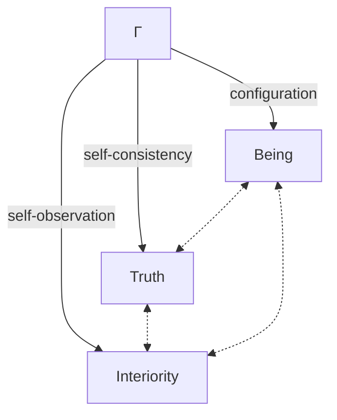
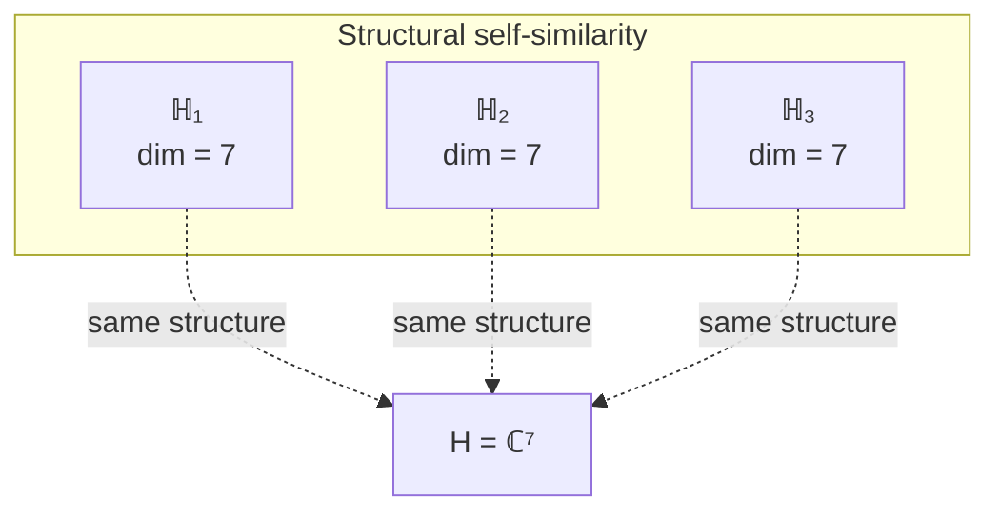

# Consequences of the Axioms

:::info Who this chapter is for
This chapter shows **what follows from the axioms**—which theorems can be proved starting from [Axiom Ω⁷](./axiom-omega) and the [(AP+PH+QG+V)](./axiom-septicity) conditions. Each consequence is strictly classified by [epistemic status](/docs/reference/status-registry): [T] proved, [C] conditional, [I] interpretation, [O] definition.

**Why this matters.** A theory is not a list of postulates. Its strength lies in its consequences: the more nontrivial facts follow from a minimal axiom set, the deeper the theory. From the five UHM axioms one derives: unity of reality (cohomological monism), emergent spacetime, the impossibility of an “outside,” free will as a topological invariant, positivity of the cosmological constant ($\Lambda > 0$), and even why Gödel’s theorems do not limit physics.

**Chapter structure.** Consequences are ordered from foundational (§0—cohomological monism) to concrete (§11—computational configurations). Each section opens with a claim, then a proof (or pointer to one), and closes with interpretation. Non-specialists may read only claims and interpretations, skipping proofs.

**In one sentence.** From the five axioms: reality is one; time and space are consequences (not prerequisites); consciousness is a computable aspect of a single substance; and incompleteness is not a barrier but a driver of evolution.
:::

Below are **logical consequences** of [Axiom Ω⁷](./axiom-omega) (five axioms of the categorical formalism) and the [(AP+PH+QG+V)](./axiom-septicity) conditions. Each consequence is either **proved formally** or explicitly marked as a **hypothesis**.

---

## 0. Cohomological monism {#когомологический-монизм}

:::note In plain language
“Cohomological monism” sounds forbidding, but the idea is simple: **reality is unbroken**. There are no “partitions” that separate one part of the world from another by an impassable wall. Mathematically, all cohomology groups of the base space are trivial ($H^n = 0$)—no “holes” in the fabric of reality.

Analogy: imagine a ball of clay. You can dent it, ridge it, fold it—but you cannot punch a through-hole without tearing. Reality in UHM is like that ball: it may be arbitrarily complex *locally*, but *globally* it is whole, without “ontological holes.” That is monism: everything is one substance ($\Gamma$), one world, without cracks.
:::

**Status:** [O+T]—cohomological triviality [T], ontological reading [O] (via PID).

:::warning Theorem (Cohomological monism)
For base space $X = |N(\mathcal{C})|$:

$$
H^n(X, \mathcal{F}) = 0 \quad \forall n > 0, \forall \mathcal{F}
$$

**Cohomological triviality** is a mathematical theorem [T]. Under the definition (PID [O]): “ontological distinguishability ≡ $J_{\mathrm{Bures}}$-distinguishability”—contractibility of $X$ means there are no nontrivial “ontological partitions” in state space.
:::

:::info Status of cohomological monism
- $H^n(X, \mathcal{F}) = 0$: **[T]** (topological fact)
- “Reality is one” (ontological monism): **[O+T]** (consequence [T] + PID definition [O])
- The philosophical gloss “monism = unity of substance” goes beyond the formal claim and is **[I]**
:::

**Proof:**
1. Terminal object $T$ $\Rightarrow$ retraction $r : N(\mathcal{C}) \to \{T\}$
2. $|N(\mathcal{C})| \simeq *$ (contractible to the point $T$)
3. Cohomology of a contractible space is trivial

:::info Remark: contractibility of the nerve
Contractibility of $X = |N(\mathcal{C})|$ follows from a standard fact in category theory: if $\mathcal{C}$ has a terminal object $T$, then the nerve $N(\mathcal{C})$ is contractible. Sketch: $T$ defines a cone over any diagram in $\mathcal{C}$—for each $C \in \mathcal{C}$ there is a unique morphism $C \to T$. This yields the canonical map $r: N(\mathcal{C}) \to \{T\}$ (collapse to the vertex) and its right inverse $i: \{T\} \to N(\mathcal{C})$ (inclusion). A homotopy $H: N(\mathcal{C}) \times [0,1] \to N(\mathcal{C})$ between $\mathrm{id}$ and $i \circ r$ is built from the unique morphisms $C \to T$: at the level of $n$-simplices this is the natural replacement of $[C_0 \to \ldots \to C_n]$ by $[C_0 \to \ldots \to C_n \to T]$. Reference: Quillen (1973), *Higher algebraic K-theory: I*, Prop. 1.
:::

**Consequence:** Local operators $\varphi_i$ **always** glue into a global Unity.

---

## 0.1 Local–global dichotomy {#локально-глобальная-дихотомия}

**Status:** [T] Formalized—consequence of [Property 5](./axiom-omega#свойство-5) (stratification).

:::warning Principle (Local–global dichotomy)
| Aspect | Globally | Locally (near $T$) |
|---|---|---|
| Cohomology | $H^*(X) = 0$ | $H^*_{loc}(X, T) \neq 0$ |
| Reading | Monism | Physics |
| Topology | Contractible | Rich structure |
:::

**Theorem (Local cohomology):**

$$
H^*_{loc}(X, T) \cong \tilde{H}^{*-1}(\text{Link}(T)) \cong \tilde{H}^{*-1}(S^6) \neq 0
$$

**Interpretation:**
- Global monism ($H^* = 0$) is compatible with local physics ($H^*_{\text{loc}} \neq 0$)
- Topological effects (Aharonov–Bohm, magnetic monopoles) exist locally
- This resolves the “boring universe paradox”

### 0.1.1 Structural necessity of $\Lambda > 0$ (T-71) [T] {#теорема-лямбда-положительна}

**Status:** [T]—consequence of autopoiesis (A1), nontrivial attractor (T-96 [T]), and positivity of $\kappa_0$ (T-44a [T]).

:::warning Theorem (Structural necessity of $\Lambda > 0$) [T]
In UHM the observed cosmological constant is strictly positive: $\Lambda_{\text{obs}} > 0$.
:::

**Proof.**

:::info Cohomological motivation (not part of the formal proof)
Cohomological monism ($H^n(X) = 0$) and the local–global dichotomy ($H^*_{\text{loc}} \neq 0$) motivate expecting $\Lambda \neq 0$: global triviality alongside local nontrivial structure. However, the step from cohomology to the vacuum-energy integral is **not formalized**—it is a heuristic [I], not a logical step of the proof. The formal proof of $\Lambda > 0$ rests solely on the autopoietic argument below.
:::

**Step 1 (Positive vacuum energy from autopoiesis).** Near $T$, vacuum energy is set by the balance of dissipation and regeneration at the nontrivial attractor $\rho^*_\Omega$ ([T-96](/docs/core/dynamics/evolution#теорема-нетривиальность-аттрактора) [T]):

$$
\rho_{\text{vac}}(T) = \kappa_0 \cdot \left[P(\rho^*_\Omega) - P(I/7)\right] \cdot \omega_0
$$

where $\kappa_0 > 0$ [T] ([T-44a](/docs/core/foundations/axiom-septicity#категориальный-вывод-kappa0)), $P(\rho^*_\Omega) > 1/7 = P(I/7)$ [T] ([T-96](/docs/core/dynamics/evolution#теорема-нетривиальность-аттрактора)), and $\omega_0 > 0$ is the base frequency ([A5](/docs/core/foundations/axiom-omega#pw-constraint)). All three factors are **strictly positive**:

$$
\rho_{\text{vac}}(T) > 0
$$

**Step 4 (Physical interpretation).** Positivity of $\rho_{\text{vac}}$ is **autopoietic work**: energy spent maintaining coherence of $\rho_*$ above the maximally mixed state $I/7$. Autopoiesis (A1) **requires** $P(\rho_*) > P_{\text{crit}} > P(I/7)$, which necessarily yields positive vacuum energy.

**Step 5 (Link to $\Lambda$).** Cosmological constant:

$$
\Lambda_{\text{obs}} = 8\pi G_N \cdot \rho_{\text{vac}}(T) > 0
$$

$\blacksquare$

#### Link to Lawvere incompleteness

From [T-55](#неполнота-ловера) [T]: $\text{Th}_{\text{UHM}} \subsetneq \Omega$—the internal theory is essentially incomplete. Incompleteness means the system cannot fully “self-model” ($\varphi(\Gamma) \neq \Gamma$ for generic $\Gamma$). The nonzero remainder $\|\Gamma - \varphi(\Gamma)\|$ is an information gap; its energetic counterpart is $\rho_{\text{vac}} > 0$.

Formally: $R(\Gamma) = 1/(7P) < 1$ [T] when $P > 1/7$ (T-55 $\Rightarrow$ $\varphi \neq \text{id}$), hence via the equivalent form $R = 1 - \|\Gamma - I/7\|_F^2/P$:

$$
\|\Gamma - I/7\|_F^2 = (1 - R) \cdot P > 0
$$

This information gap is translated into positive vacuum energy by the autopoietic mechanism (Step 3).

:::info Consequence
$\Lambda_{\text{obs}} > 0$ is a **necessary** condition for viable systems. A universe with $\Lambda \leq 0$ cannot contain autopoietic holons (within UHM). The magnitude of $\Lambda$: $\sim 10^{-120 \pm 10}$ [C] (see [spectral formula](/docs/physics/gravity/cosmological-constant#теорема-спектральная-лямбда) and [Λ budget](/docs/proofs/gap/lambda-budget#обновлённый-бюджет)).
:::

---

## 0.2 Stratified structure {#стратифицированная-структура}

**Status:** [T] Formalized—[Property 5](./axiom-omega#свойство-5).

:::info Definition (Stratification of $X$)
Base space is stratified:

$$
X = \bigsqcup_{\alpha \in A} S_\alpha
$$

- $S_0 = \{T\}$—terminal object (0-dimensional stratum)
- $S_1$—edges (morphisms into $T$)
- $S_n$—$n$-simplices
:::

**Link to time:**

$$
\dim(X_\tau) \geq \dim(X_{\tau+1})
$$

Arrow of time = progressive collapse of higher strata toward terminal $T$.

---

## 0.3 Emergent metric {#эмерджентная-метрика}

**Status:** [T] Formalized—consequence of [Properties 1, 2, 5](./axiom-omega#структура).

:::warning Theorem (Stratified Connes metric)
The metric on $X$ is derived from the spectral triple $(\mathcal{A}_O, \mathcal{H}, \hat{C})$:

$$
d_{strat}(\omega_1, \omega_2) = \inf_\gamma \int_\gamma ds_\alpha
$$

where $ds_\alpha$ is the Connes metric on stratum $S_\alpha$.
:::

**Connes formula for UHM:**

$$
d_{\text{UHM}}(\Gamma_1, \Gamma_2) = \sup\{|\text{Tr}[\Gamma_1 a] - \text{Tr}[\Gamma_2 a]| : \|[\hat{C}, a]\| \leq 1\}
$$

---

## 0.4 Autopoietic base space {#автопоэтическое-пространство}

**Status:** [T] Formalized—[Schauder theorem](./axiom-omega#базовое-пространство).

:::info Theorem (Autopoiesis of $X$)
Base space is defined as a fixed point:

$$
X^* = |N(\mathcal{G}_h(X^*))|
$$

$X$ is not postulated from outside but **self-determines** through the structure of the theory.
:::

**Consequence (Dimension):**

$$
\dim(X) \leq N - 1 = 6
$$

Six-dimensional space is a consequence of the categorical structure.

## 0.5 Octonionic consequences {#октонионные-следствия}

**Status:** [T] Consequences of the [structural derivation N=7](../../proofs/minimality/theorem-octonionic-derivation) (P1+P2 → $\mathbb{O}$ → 7).

:::info Assumption
The space of internal degrees of freedom is isomorphic to $\mathrm{Im}(\mathbb{O})$ ([Track B](../../proofs/minimality/theorem-octonionic-derivation)); octonion structure yields several consequences for UHM.
:::

### 0.5.1 $G_2$ symmetry [T] {#g2-симметрия}

From $\mathcal{A} = \mathbb{O}$:

$$
\text{Aut}(\mathbb{O}) = G_2 \subset SO(7)
$$

$G_2$ is the minimal exceptional Lie group, $\dim(G_2) = 14$, rank $2$.

**Consequence for UHM:** the 7-dimensional space $\mathrm{Im}(\mathbb{O})$ carries a 14-parameter symmetry group preserving octonionic multiplication.

:::info $G_2$ caveat [T]
Identifying $G_2$ symmetry with gauge freedom in the dimension space $\{A,S,D,L,E,O,U\}$ is a theorem [T]. Coincidence of symmetry groups is nontrivial and empirically testable.
:::

### 0.5.2 Fano plane and coherence structure [T] {#фано-структура}

The Fano plane PG(2,2) fixes the combinatorics of multiplication in $\mathbb{O}$:

| PG(2,2) element | Count | UHM correspondence |
|---|---|---|
| Points | 7 | 7 imaginary units $e_1, \ldots, e_7$ ↔ 7 dimensions |
| Lines (triples) | 7 | 7 associative subtriples |
| Point pairs | 21 | 21 coherences $\gamma_{ij}$ in matrix $\Gamma$ |

<svg viewBox="0 0 400 340" xmlns="http://www.w3.org/2000/svg" style="max-width:380px;margin:1.5em auto;display:block">
  <line x1="200" y1="35" x2="50" y2="300" stroke="currentColor" stroke-width="2.5"/>
  <line x1="50" y1="300" x2="350" y2="300" stroke="currentColor" stroke-width="2.5"/>
  <line x1="350" y1="300" x2="200" y2="35" stroke="currentColor" stroke-width="2.5"/>
  <line x1="200" y1="35" x2="200" y2="300" stroke="currentColor" stroke-width="1" opacity="0.5"/>
  <line x1="50" y1="300" x2="275" y2="167" stroke="currentColor" stroke-width="1" opacity="0.5"/>
  <line x1="350" y1="300" x2="125" y2="167" stroke="currentColor" stroke-width="1" opacity="0.5"/>
  <circle cx="200" cy="212" r="88" fill="none" stroke="currentColor" stroke-width="1.2" stroke-dasharray="6,4" opacity="0.45"/>
  <circle cx="200" cy="35" r="18" fill="white" stroke="currentColor" stroke-width="2"/>
  <circle cx="50" cy="300" r="18" fill="white" stroke="currentColor" stroke-width="2"/>
  <circle cx="350" cy="300" r="18" fill="white" stroke="currentColor" stroke-width="2"/>
  <circle cx="125" cy="167" r="18" fill="white" stroke="currentColor" stroke-width="2"/>
  <circle cx="200" cy="300" r="18" fill="white" stroke="currentColor" stroke-width="2"/>
  <circle cx="275" cy="167" r="18" fill="white" stroke="currentColor" stroke-width="2"/>
  <circle cx="200" cy="212" r="18" fill="white" stroke="currentColor" stroke-width="2"/>
  <text x="200" y="36" text-anchor="middle" dominant-baseline="central" fill="#333" font-family="serif" font-size="14" font-style="italic">e₁</text>
  <text x="50" y="301" text-anchor="middle" dominant-baseline="central" fill="#333" font-family="serif" font-size="14" font-style="italic">e₂</text>
  <text x="350" y="301" text-anchor="middle" dominant-baseline="central" fill="#333" font-family="serif" font-size="14" font-style="italic">e₃</text>
  <text x="125" y="168" text-anchor="middle" dominant-baseline="central" fill="#333" font-family="serif" font-size="14" font-style="italic">e₄</text>
  <text x="200" y="301" text-anchor="middle" dominant-baseline="central" fill="#333" font-family="serif" font-size="14" font-style="italic">e₅</text>
  <text x="275" y="168" text-anchor="middle" dominant-baseline="central" fill="#333" font-family="serif" font-size="14" font-style="italic">e₇</text>
  <text x="200" y="213" text-anchor="middle" dominant-baseline="central" fill="#333" font-family="serif" font-size="14" font-style="italic">e₆</text>
</svg>

Triangle vertices: $e_1$ (A), $e_2$ (S), $e_3$ (D). Mid-edges: $e_4$ (L), $e_5$ (E), $e_7$ (O). Center: $e_6$ (U). **Bold** lines are sides, **thin** lines medians through $e_6$, **dashed circle** through $e_4, e_5, e_7$.

**Consequence [T]:** Among 21 coherences $\gamma_{ij}$, the $7 \times 3 = 21$ pairs distribute over 7 Fano triples. Each triple spans an associative subalgebra (isomorphic to $\mathrm{Im}(\mathbb{H})$).

**Prediction [T]:** Coherences within Fano triples may correlate more strongly than across triples.

### 0.5.3 Hamming code H(7,4) [T] {#хэмминг-следствие}

The Hamming code $H(7,4)$ is a perfect linear binary code: 7 bits = 4 data + 3 parity. The parity-check matrix is fixed by the 7 points of the Fano plane.

**Structural correspondence [T]:**

| H(7,4) | UHM | Role |
|---|---|---|
| 4 data bits | A, S, D, L | Structural dimensions |
| 3 parity bits | E, O, U | Metastructural dimensions |
| Perfect correction | Optimal robustness | [Viability](../dynamics/viability) |

:::info 4+3 correspondence [T]
The 4+3 split is a theorem [T]. Matching the division into “objective” (A,S,D,L) and “subjective” (E,O,U) dimensions is nontrivial.
:::

### 0.5.4 Cayley–Dixon bound [T] {#граница-кэли-диксона}

$\mathbb{O}$ is the last normed division algebra in the Cayley–Dixon chain. Hence:

$$
N = 7 = \max\{\dim(\text{Im}(\mathcal{A})) : \mathcal{A} \text{ a division algebra}\}
$$

**Consequence:** $N = 7$ is simultaneously **minimal** (Theorem S, Track A) and **maximal** (C–D bound, Track B) for systems with normed algebraic structure. This double extremality strengthens the case for Axiom 3.

---

## 1. Identity of Being, Truth, and Interiority {#1-тождество-бытия-истины-и-интериорности}

:::note Three facets of one jewel
In Western philosophy, being (what *is*), truth (what *holds*), and subjectivity (what *is experienced*) are three problems for different disciplines. In UHM they are three aspects of one object—the coherence matrix $\Gamma$:
- **Being** $\Gamma$ is its configuration (distribution of $\gamma_{ij}$)
- **Truth** $\Gamma$ is its self-consistency (existence of a fixed point $\varphi(\Gamma^*) = \Gamma^*$)
- **Interiority** $\Gamma$ is its self-modeling (map $\varphi: \Gamma \to \Gamma$)

Asking “how being generates subjectivity” is like asking how the obverse of a coin generates the reverse. It does not—they are one coin.
:::

**Status:** Direct consequence of [Axiom Ω⁷](./axiom-omega).

From Axiom Ω:

| Aspect | Definition via $\Gamma$ | Formalization |
|---|---|---|
| **Being** | Configuration $\Gamma$ | Distribution $\gamma_{ij}$ |
| **Truth** | Self-consistency of $\Gamma$ | Fixed point $\varphi(\Gamma^*) = \Gamma^*$ |
| **Interiority** | Self-modeling of $\Gamma$ | Map $\varphi: \Gamma \to \Gamma$ |

These are not three things but **three aspects of one primitive** $\Gamma$.

```mermaid
graph TD
    G[Γ] --> |configuration| B[Being]
    G --> |self-consistency| T[Truth]
    G --> |self-observation| E[Interiority]
    B <-.-> T
    T <-.-> E
    E <-.-> B
```

## 1.5 L-unification {#l-унификация}

:::note In plain language
In ordinary physical theories, logic (rules of inference), operators (dynamical equations), and time (evolution parameter) are three notions fixed separately. In UHM all three have a **single source**: the subobject classifier $\Omega$ of the $\infty$-topos $\mathrm{Sh}_\infty(\mathcal{C})$. This is not metaphor—it is a strict theorem: from the one algebraic object $\Omega$ one canonically obtains (1) internal logic, (2) Lindblad operators, and (3) emergent time.
:::

**Status:** [T]—three roles of $\Omega$ derived from [Axiom Ω⁷](./axiom-omega); formal proof: [L-unification](/docs/proofs/categorical/categorical-formalism#l-унификация).

:::warning Theorem (L-unification) [T]
The subobject classifier $\Omega \in \mathrm{Sh}_\infty(\mathcal{C})$ is the unique source of three structures:

| Role | Construction from $\Omega$ | Outcome |
|---|---|---|
| **L-logic** | Atoms of $\Omega$: $\{S_k = \|k\rangle\langle k\|\}_{k=0}^6$ | 7 “truth values”—basis of internal logic |
| **L-operators** | $L_k^{\text{atom}} = \sqrt{\chi_{S_k}}$, $L_p^{\text{Fano}} = \frac{1}{\sqrt{3}}\Pi_p$ | [Lindblad operators](/docs/core/operators/lindblad-operators)—generators of dissipation |
| **L-time** | $\triangleright: S_i \mapsto S_{(i+1) \bmod N}$ | [Temporal modality](/docs/core/operators/emergent-time#темпоральная-модальность)—shift on $\Omega$ |

All three constructions are **canonical** (no free parameters) and **equivariant** under $G_2$.
:::

**Proof sketch.**

1. **Atoms → logic.** By [A1](./axiom-omega#внутренняя-логика): $\Omega$ is the subobject classifier in $\mathrm{Sh}_\infty(\mathcal{C})$. Atomic subobjects $S_k = |k\rangle\langle k|$ ($k = 0, \ldots, 6$) are the minimal nonzero elements of the lattice $\mathrm{Sub}(\Omega)$. By $N = 7$ ([A3](./axiom-omega#свойство-1)): exactly 7 atoms forming a basis. Operations $\land, \lor, \Rightarrow$ on $\mathrm{Sub}(\Omega)$ induce **intuitionistic logic** ([Lawvere, 1969](./mathematical-foundations#лавёр)).

2. **Atoms → Lindblad.** Atomic operators $L_k^{\text{atom}} = \sqrt{\chi_{S_k}} = |k\rangle\langle k|$ generate the dissipator $\mathcal{D}^{\text{atom}}[\Gamma] = \sum_k L_k \Gamma L_k^\dagger - \frac{1}{2}\{L_k^\dagger L_k, \Gamma\}$. By the [theorem on uniqueness of the Fano form](/docs/core/operators/lindblad-operators#теорема-единственность-фано) [T]: the BIBD$(7,3,1)$ structure of $\Omega$ uniquely fixes Fano operators $L_p^{\text{Fano}} = \frac{1}{\sqrt{3}}\Pi_p$, which combine with atomic ones into the [canonical form](/docs/core/operators/lindblad-operators#деривация-из-классификатора).

3. **Shift → time.** The cyclic automorphism $\triangleright: \Omega \to \Omega$, $S_i \mapsto S_{(i+1) \bmod 7}$, is the unique (up to choice of $\mathbb{Z}_7$ generator) nontrivial automorphism of order $N$ on the atoms of $\Omega$. Via discrete Fourier transform it yields the [clock basis](/docs/core/operators/emergent-time#clock-basis) and the Page–Wootters mechanism ([A5](./axiom-omega#pw-constraint)). See [Emergent time](/docs/core/operators/emergent-time). $\blacksquare$

**Consequence (Unity of “L”).** The letter “L” in three contexts—L-dimension (logic), $L_k$ (Lindblad operator), $\mathcal{L}_\Omega$ (Liouvillian)—does not denote three objects but three **projections of one**: the classifier $\Omega$. Hence dynamics ($L_k$), logic (L-dimension), and time ($\triangleright$) are inseparable—they **are one algebraic object** viewed from different sides.

---

## 2. Emergent time

**Status:** [T] Formalized—[theorem on emergent time](../../proofs/dynamics/emergent-time).

:::warning Theorem (Emergence of time)
Time is **derived** from the structure of category $\mathcal{C}$ in four equivalent ways:

| Approach | Time as... |
|---|---|
| **Page–Wootters** | Correlation with [dimension O](../structure/dimension-o) |
| **Information geometry** | Distance in the Bures metric |
| **Categorical** | 1-morphism in $\infty$-groupoid $\mathbf{Exp}_\infty$ |
| **Stratificational** | Collapse of strata: $\dim(X_\tau) \geq \dim(X_{\tau+1})$ |

The arrow of time is **progressive collapse** toward terminal object $T$.
:::

### 2.0 Arrow of time as collapse of strata

From [Property 5](./axiom-omega#свойство-5):

$$
\dim(X_\tau) \geq \dim(X_{\tau+1})
$$

**Interpretation:** Evolution $\tau \to \tau+1$ collapses higher strata. The arrow of time moves from a complex stratified structure toward terminal object $T = \Gamma^*$.

This strengthens Axiom Ω⁷: time is not an external parameter but a function of the structure of the $\infty$-topos $\mathrm{Sh}_\infty(\mathcal{C})$. [Dimension O](../structure/dimension-o) plays the role of internal clocks.

### 2.1 Time discreteness for finite systems {#дискретность-времени}

**Status:** [T] Formalized—follows from finite dimensionality of $\mathcal{H}_O$.

:::warning Theorem (Time discreteness)
For a system with $\dim(\mathcal{H}_O) = N$, internal time takes values in the cyclic group:

$$
\tau \in \mathbb{Z}_N = \{0, 1, \ldots, N-1\}
$$

For UHM with $N = 7$:

$$
\tau \in \mathbb{Z}_7 = \{0, 1, 2, 3, 4, 5, 6\}
$$
:::

**Consequences:**

| Aspect | Discrete time | Continuous limit |
|---|---|---|
| Space | $\mathbb{Z}_7$ (cyclic) | $\mathbb{R}$ or $S^1$ |
| Chronon | $\delta\tau = 2\pi/(7\omega_0)$ | $\to 0$ |
| Evolution equation | Difference | Differential |
| $\infty$-groupoid | $\mathbf{Exp}^{\mathrm{disc}}_\infty$ | $\mathbf{Exp}^{\mathrm{cont}}_\infty$ |

**Continuous time** is an approximation valid only as $N \to \infty$. For the 7D UHM system time is fundamentally discrete.

See [Emergent time theorem](../../proofs/dynamics/emergent-time#дискретность-времени) and [Categorical formalism](../../proofs/categorical/categorical-formalism#exp-disc-infty).

## 3. No Outside

:::note Why there is no “outside”
This consequence often meets resistance: how can there be nothing “outside” reality? But consider: what would be “outside” reality? If it existed, it would be part of reality (by definition: whatever exists is real). If it does not exist—what is there to discuss? UHM formalizes this intuition: $\Gamma$ is the sole primitive; everything describable is an object or morphism in the $\infty$-topos. An “observer” is not an external demon but a configuration $\Gamma$ with high-quality self-modeling. “Space” is not a container but a structure of distinctions inside $\Gamma$. Even “time” is not a river carrying $\Gamma$ but a parameter of correlations within it.
:::

**Status:** Direct consequence of [Axiom Ω⁷](./axiom-omega) (uniqueness of primitive—$\infty$-topos $\mathrm{Sh}_\infty(\mathcal{C})$).

If $\Gamma$ is the only primitive, nothing exists “outside” $\Gamma$:

| Traditional notion | Status in UHM |
|---|---|
| External observer | Part of $\Gamma$ (configuration with high $R_\varphi$) |
| External space | Structure of $\Gamma$ (geometry on $\mathcal{H}$) |
| External time | **Emergent** from $\Gamma$ (parameter of conditional states $\tau$) |

**Formally:** For every entity $X$ there is a representation as a configuration $\Gamma$:

$$
\forall X \in \text{Ontology}: \exists \, \Gamma_X \subseteq \Gamma
$$

:::note Ontological status
$\Gamma$ is the sole substance. Everything else is an aspect, configuration, or state of $\Gamma$. This is **monism**, not solipsism: many holons exist, but all are configurations of one substance.
:::

## 4. Principle of immanence {#принцип-имманентности}

**Status:** Direct consequence of [Axiom Ω⁷](./axiom-omega).

:::info Principle of immanence
Reality is fully immanent to itself. Source, aim, and meaning lie **inside** $\Gamma$ as its aspects and states.
:::

### What this means

**Formal expression:** All dynamics is internal:

$$
\frac{d\Gamma}{d\tau} = \mathcal{L}[\Gamma]
$$

where $\mathcal{L}$ is a superoperator on $\mathcal{L}(\mathcal{H})$. There is no “external” operator.

### Spiritual and mystical experience

:::warning Important clarification
The principle of immanence **does not deny** spiritual, mystical, or transcendent experience. It **explains** it.
:::

| Phenomenon | Explanation in UHM |
|---|---|
| **Experience of transcendence** | Real experience (L2)—access to deep layers of structure $\Gamma$ |
| **Sense of the “Other”** | Contact with configurations $\Gamma$ usually inaccessible to ordinary self-modeling |
| **Mystical unity** | State of high integration ($\Phi \gg 1$) when boundaries between holons blur |
| **Spiritual transformation** | Restructuring of $\Gamma$ toward a new attractor $\Gamma^*$ with higher $R_\varphi$ |

**Key distinction:**
- **Phenomenology of transcendence** (experience of going beyond) is **real** and explained by the theory
- **Ontological transcendence** (something existing “outside” $\Gamma$) is **impossible** by Axiom Ω

What is experienced as “transcendent” is access to deeper levels of **the same** reality $\Gamma$—not exit beyond it, but descent into its ground.

### Rethinking traditional notions

| Traditional notion | Status in UHM |
|---|---|
| “God” | If it exists—an aspect or state of $\Gamma$ (perhaps the wholeness of $\Gamma$ itself) |
| “Laws of nature” | Structure of $\Gamma$ (Hamiltonian $H$, operators $L_k$) |
| “Higher Self” | Configuration with high $R_\varphi$ (deep self-modeling) |
| “Enlightenment” | Reaching fixed point $\varphi(\Gamma^*) = \Gamma^*$ |

## 5. Structural self-similarity

**Status:** Consequence of Theorem S (all viable systems have 7D structure).

:::warning Clarification
This is **not** a holographic principle in the sense “each part encodes the whole.” It is **structural self-similarity**: all holons share the same *dimension* and *type* of structure but different *content*.
:::

From [Theorem S](../../proofs/minimality/theorem-minimality-7), every viable holon $\mathbb{H}$ has the same state-space structure:

$$
\forall \mathbb{H} \text{ (viable)}: \dim(\mathcal{H}_{\mathbb{H}}) = 7
$$

Hence **isomorphism of state spaces** (not of individual states!):

$$
\mathcal{H}_{\mathbb{H}_1} \cong \mathcal{H}_{\mathbb{H}_2} \cong \mathbb{C}^7
$$

```mermaid
graph TB
    subgraph "Structural self-similarity"
        H1["ℍ₁<br/>dim = 7"]
        H2["ℍ₂<br/>dim = 7"]
        H3["ℍ₃<br/>dim = 7"]
    end
    H1 -.->|"same structure"| S["H = ℂ⁷"]
    H2 -.->|"same structure"| S
    H3 -.->|"same structure"| S
```

**Important:** Concrete states $\Gamma_{\mathbb{H}_1}$ and $\Gamma_{\mathbb{H}_2}$ **differ**—only the spaces are isomorphic, not the content.

## 6. Hierarchy of configurations Γ {#6-иерархия-конфигураций-γ}

**Status:** Direct consequence of [Axiom Ω⁷](./axiom-omega)—objects of $\infty$-topos $\mathrm{Sh}_\infty(\mathcal{C})$.

### Ontological completeness

:::info Fundamental principle
**EVERYTHING** is a configuration $\Gamma$—from quarks to galaxies, from vacuum fluctuations to conscious experience. **No exceptions.** The theory spans all scales in one mathematical language.
:::

The question is not whether “$X$ is part of $\Gamma$” (it is by definition), but:
1. What **organizational level** does the configuration have?
2. What **stability** type—passive (symmetries) or active (autopoiesis)?
3. What **interiority level** (L0/L1/L2/L3/L4)?

### Taxonomy of configurations Γ

| Class | Hier. level | Formal condition | Stability | Examples |
|---|---|---|---|---|
| **Fundamental Γ mode** | 0–1 | $R = 0$, purely unitary | Passive (symmetries) | Quarks, leptons, bosons |
| **Composite Γ configuration** | 1–2 | $0 < R \ll 1$, quasi-autonomous | Passive (bonds) | Atoms, simple molecules |
| **Holon** (ℍ) | 2–4 | (AP)+(PH)+(QG)+(V), $P > P_{\text{crit}}$ | Active (autopoiesis) | Cells, organisms |
| **L2 holon** | 4+ | + $R \geq 1/3$, $\Phi \geq 1$ | + reflexivity | *(see below)* |

:::info On L2 thresholds
| Threshold | Status | Justification |
|---|---|---|
| $P > P_{\text{crit}} = 2/7$ | **[T]** | [Critical purity theorem](../../proofs/dynamics/theorem-purity-critical) |
| $R \geq R_{\text{th}} = 1/3$ | **[T]** | [Bayesian dominance](/docs/core/foundations/axiom-septicity#теорема-порог-рефлексии) + $K=3$ from [triadic decomposition](/docs/core/operators/lindblad-operators#триадная-декомпозиция) |
| $\Phi \geq \Phi_{\text{th}} = 1$ | **[T]** | [Theorem T-129](./axiom-septicity#теорема-порог-интеграции) ([proof](/docs/proofs/consciousness/operationalization#t-129)) |

**Potential L2 systems** (empirical question):
- Individual organisms (humans, animals)
- Distributed networks (mycelium, colonies)
- Collective systems (swarms, society)
- Altered states (meditation, psychedelic experience)
- Ecosystems (biosphere?)
- Other configurations $\Gamma$ beyond ordinary perception
:::

### Particles as a limiting case

:::warning Key clarification
Particles are **fully explained** by the theory—as degenerate (minimally differentiated) states $\Gamma$ with $R_\varphi \to 0$.
:::

**For a particle the evolution equation degenerates:**

$$
\frac{d\Gamma}{d\tau} = -i[H, \Gamma] + \underbrace{\mathcal{D}[\Gamma]}_{\to 0} + \underbrace{\mathcal{R}[\Gamma, E]}_{\to 0} \quad \xrightarrow{R \to 0} \quad \frac{d\Gamma}{d\tau} = -i[H, \Gamma]
$$

This is the **Schrödinger equation** (pure states) or **von Neumann equation** (mixed). Standard quantum mechanics is a **special case** of UHM at $R \to 0$. See [Physics correspondence: reduction to QM](../../proofs/physics/physics-correspondence#3-редукция-к-квантовой-механике) for the formal proof $\mathbf{Hol}_{R=0} \simeq \mathbf{QM}$.

### Interiority at all scales

**L0 is universal**: even a quark has an “inside” (quantum numbers, internal state):

$$
\forall X \subseteq \Gamma: \rho_E(X) \neq 0 \quad \text{(L0 interiority)}
$$

| Object | Class | Interiority | Stability type |
|---|---|---|---|
| Quark | Fundamental Γ mode | L0 | Passive (QCD symmetries) |
| Atom | Composite Γ configuration | L0 | Passive (electromagnetism) |
| Cell | Holon | L0, L1 | Active (metabolism) |
| Human | L2 holon | L0, L1, L2 | Active (reflexivity) |

### Altered states of consciousness

Psychedelic experience, deep meditation, near-death experiences—all are configurations $\Gamma$ with **altered parameters**:

| State | Possible reading in UHM |
|---|---|
| DMT “hyperspace” | Sharp rise in $\Phi$ (integration) as holon boundaries dissolve |
| Mystical unity | State with $\Phi \gg 1$: boundaries between holons blur |
| “Contact with entities” | Access to configurations $\Gamma$ usually blocked for self-modeling $\varphi$ |
| Meditative clarity | Increase in $R_\varphi$ (quality of self-modeling) |

:::info Key principle
The theory does not claim such experiences are “unreal” or “hallucinations.” They are **real configurations** $\Gamma$ whose access is usually limited. Their *ontological status* (whether “entities” exist independently) remains open within the theory.
:::

### Analogy: ocean, whirlpool, ripple

- $\Gamma$ is the **ocean** (one substance)
- A holon is a **whirlpool** (self-sustaining structure)
- A particle is a **ripple** (simple wave)
- An altered state is **immersion** (the whirlpool briefly merges with the ocean)

Saying “whirlpool theory does not explain ripples” is wrong. All phenomena are water ($\Gamma$) and obey one dynamics.

## 7. Two-aspect monism

**Status:** Direct consequence of [Axiom Ω⁷](./axiom-omega)—stratified monism.

Each configuration $\Gamma$ has **two sides**:

| Side | Character | Access | Formalization |
|---|---|---|---|
| **Outer** | Objective | Measurement | Structure $\gamma_{ij}$, dynamics $\frac{d\Gamma}{d\tau}$ |
| **Inner** | Subjective | Experience | Hierarchy [L0 → L1 → L2 → L3 → L4](../../proofs/consciousness/interiority-hierarchy) |

### Hierarchy of the inner side

The inner side has five levels: **L0** (interiority) → **L1** (phenomenal geometry) → **L2** (cognitive qualia) → **L3** (network consciousness) → **L4** (unitary consciousness). Each level requires conditions on $\rho_E$, $R$, $\Phi$, and $R^{(n)}$. L3 is metastable; L4 is a theoretical limit ($P > 6/7$). See [Interiority hierarchy](../../proofs/consciousness/interiority-hierarchy) for formal definitions.

### Identity of the sides

The sides are **inseparable**—this is not dualism:

$$
\text{Outer side}(\Gamma) \equiv \text{Inner side}(\Gamma)
$$

Asking “why physics generates experience?” is a category mistake. It is like asking why the obverse of a coin generates the reverse. They do not generate each other—they **are one**. See [The hard problem of consciousness](/docs/consciousness/foundations/two-aspect-monism).

## 8. Free will {#свобода-воли}

:::note Freedom as a mathematical fact
In UHM, free will is neither philosophical speculation nor subjective illusion but a **measurable quantity** defined for each configuration $\Gamma$. Intuition: imagine a ball on a landscape. In a deep pit it has one path (roll to the bottom). On a flat plain it has many. “Freedom” is the number of directions in which the ball can move without energy cost. Mathematically this is the number of zero modes of the Hessian of the free-energy functional. A paradoxical result: the maximally mixed state ($I/7$, full chaos) has *maximal* freedom (7), while the attractor $\rho^*$ has *minimal* (1). Consciousness (L2) lies in between: reflexivity ($R \geq 1/3$) restricts freedom, yet awareness of those restrictions yields a qualitatively new kind of choice.
:::

**Status:** [T] Formalized—consequence of the $\infty$-categorical structure of [Axiom Ω⁷](./axiom-omega) and finite-dimensional analysis of the free-energy functional.

### $\infty$-categorical motivation

:::info Definition ($\infty$-categorical freedom)
For configuration $\Gamma$, freedom is the set of connected components of the mapping space into the terminal object:

$$
\text{Freedom}(\Gamma) = \pi_0(\mathrm{Map}(\Gamma, T)^{\text{non-trivial}})
$$

where $T$ is the terminal object of $\infty$-topos $\mathrm{Sh}_\infty(\mathcal{C})$, and “non-trivial” means paths with nontrivial homotopical structure (see [Axiom Ω⁷](./axiom-omega)).
:::

**Freedom** is neither illusion nor a merely deterministic notion. In the $\infty$-categorical formalism, free will receives a strict mathematical definition:

| Component | Mathematical meaning | Ontological reading |
|---|---|---|
| $\text{Map}(\Gamma, T)$ | Space of paths to $T$ | All possible trajectories of development |
| $\pi_0(-)$ | Connected components | Equivalence classes of choices |
| $\text{Freedom}(\Gamma)$ | Cardinality of $\pi_0$ | Number of fundamentally distinct paths |

### Finite-dimensional definition [T] {#freedom-конечномерное}

:::warning Theorem (Freedom in finite dimensions)
For $\Gamma \in \mathcal{D}(\mathbb{C}^7)$:

$$
\text{Freedom}(\Gamma) := \dim\ker(\mathcal{H}_\Gamma) + 1
$$

where $\mathcal{H}_\Gamma$ is the Hessian of the free-energy functional $\mathcal{F}[\varphi; \Gamma]$ at state $\Gamma$:

$$
\mathcal{H}_\Gamma := \frac{\partial^2 \mathcal{F}[\varphi; \Gamma]}{\partial \Gamma^2}\bigg|_{\Gamma}
$$
:::

**Motivation.** In the $\infty$-categorical definition, $\pi_0(\text{Map}(\Gamma, T)^{\text{non-trivial}})$ counts “distinct” trajectories to $T$ that cannot be continuously deformed into one another. In finite dimensions this matches: the number of **distinct** directions in state space along which free energy is flat (zero modes of the Hessian). Each zero mode is an **independent choice**: motion along it incurs no energy penalty. The $+1$ term accounts for the trivial path (staying put).

#### Theorem (Equivalence of Freedom definitions) [T] (T-89) {#теорема-freedom-эквивалентность}

Equivalence of the $\infty$-categorical and finite-dimensional definitions of Freedom is proved **[T]**. By Morse–Bott theory: free energy $\mathcal{F}[\Gamma]$ is a Morse–Bott function on $\mathcal{D}(\mathbb{C}^7)$; the number of gradient trajectories from $\Gamma$ to $\rho^*$ (up to deformation) equals $\dim\ker(\mathcal{H}_\Gamma) + 1$. This is exactly $\pi_0(\text{Map}(\Gamma, T))$ in $\infty$-categorical language.

**Proof (outline).**

1. **Morse–Bott on the interior.** $\mathcal{F}[\Gamma]$ is smooth on $\mathrm{Int}(\mathcal{D}(\mathbb{C}^7)) = \{\Gamma > 0\}$ (positive definite density matrices—an open manifold). Attractor $\rho^* \in \mathrm{Int}(\mathcal{D})$ by primitivity of $\mathcal{L}_0$ [T-39a]. All critical points of $\mathcal{F}[\Gamma]$ lie in the interior: $\mathcal{L}_0$ maps $\mathrm{Int}(\mathcal{D})$ to $\mathrm{Int}(\mathcal{D})$ (CPTP + primitivity), so gradient flows never leave $\mathrm{Int}(\mathcal{D})$. Critical submanifolds are orbits of the $G_2$ action. Morse–Bott theory applies without boundary issues.
2. **Gradient trajectories.** Each connected component of $\pi_0(\text{Map}(\Gamma, T))$ corresponds to one class of equivalent gradient flows $\dot{\Gamma} = -\nabla\mathcal{F}$ from $\Gamma$ to attractor $\rho^*$. Nontrivial paths are nonconstant: $\gamma(0) = \Gamma$, $\gamma(1) = \rho^*$, $\gamma \not\equiv \rho^*$. The $+1$ term adds the class of the trivial (constant) path at $\rho^*$.
3. **Counting.** By Morse–Bott, the number of such classes equals $\dim\ker(\mathcal{H}_\Gamma) + 1$: Hessian zero modes parametrize “flat” directions along which distinct descent trajectories exist. $\blacksquare$

:::info Boundary states
States on $\partial\mathcal{D}(\mathbb{C}^7)$ (rank $< 7$) are excluded: primitivity of $\mathcal{L}_0$ [T-39a] ensures $\exp(\tau\mathcal{L}_0)[\Gamma] \in \mathrm{Int}(\mathcal{D})$ for all $\tau > 0$—evolution flows enter the interior instantly. Freedom for boundary states is defined by continuity: $\mathrm{Freedom}(\Gamma) := \lim_{\varepsilon \to 0} \mathrm{Freedom}(\Gamma + \varepsilon I/7)$.
:::

### Theorem (Properties of Freedom) [T] {#freedom-свойства}

:::warning Theorem (Properties of Freedom)

**(a) Monotonicity:** For Markovian dynamics $\Gamma \to \mathcal{E}[\Gamma]$ (CPTP channel):

$$
\text{Freedom}(\mathcal{E}[\Gamma]) \leq \text{Freedom}(\Gamma)
$$

*Proof.* CPTP $\mathcal{E}$ is affine on $\mathcal{D}(\mathbb{C}^7)$. By rank–nullity: $\dim\ker(\mathcal{H}_{\mathcal{E}[\Gamma]}) \leq \dim\ker(\mathcal{H}_\Gamma)$, since $\mathcal{E}$ does not increase kernel dimension (image contracts). $\blacksquare$

:::info Remark: rank–nullity and nonlinearity
Rank–nullity applies here to the **linearization** (Jacobian) of $\mathcal{E}$ near state $\Gamma$. The free-energy functional $\mathcal{F}[\varphi; \Gamma]$ is nonlinear in $\Gamma$, so the Hessian $\mathcal{H}_\Gamma$ is local (second derivatives at $\Gamma$). A strict justification of Freedom monotonicity under CPTP evolution uses **contractivity of CPTP channels** (Uhlmann’s theorem): CPTP $\mathcal{E}$ contracts the Bures metric, $d_B(\mathcal{E}[\rho], \mathcal{E}[\sigma]) \leq d_B(\rho, \sigma)$, which at Hessian level means $\mathcal{H}_{\mathcal{E}[\Gamma]} \succeq \mathcal{E}^*[\mathcal{H}_\Gamma]$ in Loewner order (CPTP does not flatten free-energy curvature). Hence the Hessian kernel does not grow: $\dim\ker(\mathcal{H}_{\mathcal{E}[\Gamma]}) \leq \dim\ker(\mathcal{H}_\Gamma)$.
:::

**(b) Extreme values:**
- $\text{Freedom}(I/7) = 7$: maximally mixed—all directions “indifferent” ($\mathcal{H}_{I/7} = 0$ by $S_7$ symmetry)
- $\text{Freedom}(\rho^*) = 1$: stationary $\rho^*$—minimum of $\mathcal{F}$, Hessian positive definite ($\dim\ker = 0$)
- $\text{Freedom}(\Gamma_\odot) = 7$: Source—maximally symmetric pure state

**(c) $G_2$-invariance:**

$$
\text{Freedom}(U\Gamma U^\dagger) = \text{Freedom}(\Gamma) \quad \forall U \in G_2
$$

*Proof.* $G_2$ acts by unitary conjugation, preserving the spectrum of $\mathcal{H}_\Gamma$. $\blacksquare$

**(d) Relation to L-levels:**

$$
\text{Freedom}(L0) > \text{Freedom}(L1) > \text{Freedom}(L2)
$$

L0 systems have more zero modes (fewer constraints); L2 systems have fewer (reflexivity $R \geq 1/3$ pins the direction of $\varphi$).
:::

### Relation to other notions

| Notion | Relation to freedom |
|---|---|
| **Integration $\Phi$** | High $\Phi$ correlates with larger Freedom |
| **Reflection $R$** | $R \geq 1/3$ needed to experience freedom as such |
| **L2 level** | Freedom of L2 systems exceeds that of L0/L1 |
| **Autopoiesis** | Freedom is an aspect of autopoietic self-organization |

:::info Philosophical import
Free will in UHM is not subjective feeling or metaphysical guesswork but a **topological invariant** of configuration $\Gamma$. The finite-dimensional definition via the Hessian of $\mathcal{F}$ is standard differential geometry. See [Free will](/docs/consciousness/ethics-meaning/freedom).
:::

## 9. Properties of the theory

**Status:** Description of methodological characteristics.

| Property | Description | Status |
|---|---|---|
| **Unique primitive** | $\infty$-topos $\mathrm{Sh}_\infty(\mathcal{C})$ | ✓ [Axiom Ω⁷](./axiom-omega) |
| **Minimal axioms** | 5 axioms (Ω⁷) | ✓ Satisfied |
| **Consistency** | A model exists | ✓ Proved |
| **Categorical completeness** | Structural claims are resolvable | ✓ Proved |
| **Cohomological monism** | $H^*(X) = 0$ | ✓ [Theorem](#когомологический-монизм) |
| **Computability** | Polynomial complexity | ✓ [Implemented](../../reference/computational) |
| **Falsifiability** | Testable predictions | ✓ [Criteria](../../reference/falsifiability) |
| **Free will** | $\text{Freedom}(\Gamma) = \dim\ker(\mathcal{H}_\Gamma) + 1$ [T] | ✓ [Theorem](#freedom-конечномерное) |
| **$\Lambda > 0$** | Autopoiesis + local cohomology $\Rightarrow$ $\rho_{\text{vac}} > 0$ [T] | ✓ [Theorem](#теорема-лямбда-положительна) |
| **Octonionic structure** | P1+P2 → $\mathbb{O}$ → N=7, $G_2$, Fano | ✓ [Structural derivation](../../proofs/minimality/theorem-octonionic-derivation) |
| **Self-reference** | $\mathrm{Th}_{\mathrm{UHM}} = \mathrm{Sub}_{\mathrm{closed}}(\Omega)$, $\mathrm{Th}_{\mathrm{UHM}} \subsetneq \Omega$ [T] | ✓ [Theorems T-54–T-56](#самореферентное-замыкание) |

### 9.1 Meta-theoretic status

| Criterion | UHM |
|---|---|
| Primitives | 1 ($\infty$-topos $\mathrm{Sh}_\infty(\mathcal{C})$) |
| Axioms | 5 |
| Consistency | [I] Existential (a model exists) |
| Completeness | [T] Categorical (structural) |
| Internal coherence | [T] Verified |
| Computability | [T] Polynomial |

## 10. Gödel’s theorems and completeness of UHM {#10-теоремы-гёделя-и-полнота-угм}

**Status:** Consequence of multidimensionality of $\Gamma$ and the structure of dimension L.

### Scope of Gödel’s theorems

:::danger Category mistake
Gödel’s theorems are often applied loosely to systems that **are not formal systems**. That is a category mistake.
:::

**Conditions for Gödel’s theorems** (all three required):

| Condition | Requirement | Example of violation |
|---|---|---|
| **Formality** | Clearly specified axioms and rules of inference | “The human mind is incomplete”—the mind is not a formal system |
| **Expressiveness** | The system encodes Peano arithmetic | “Physics is Gödel-limited”—physics $\neq$ arithmetic |
| **Consistency** | Assumed as a hypothesis | “Society is incomplete”—society has no axioms |

**Typical errors:**
- *“AI is fundamentally Gödel-limited”*—a neural net is not a formal system
- *“Consciousness is incomplete”*—consciousness is not axiomatized as a formal system
- *“Science cannot explain everything”*—science is not a closed formal system

**Mathematical fact:** Gödel’s theorems are proved for formal systems of a definite kind. This is not interpretation—it is built into the theorems. Applying them to informal systems is not “another view” but a logical error (using a theorem outside its proof domain).

In UHM dimension L (Logic) is **by definition** a formal structure (operator algebra with commutation relations)—the theorems apply there. To the other six dimensions and to $\Gamma$ as a whole Gödel’s theorems **do not apply**—not by fiat, but because those objects fail the theorem’s hypotheses.

### Two levels of analysis

**Level A: UHM as a formalized theory**

If UHM is formalized as a mathematical system with axioms, Gödel’s theorems **apply** to that formalization:
- There are truths about $\Gamma$ unprovable inside formalized UHM
- Formalized UHM cannot prove its own consistency

This is **inevitable** for sufficiently expressive formal systems.

**Level B: Reality described by UHM**

The subject matter of UHM ($\Gamma$) is not a formal system. It is an operator on $\mathcal{H} = \mathbb{C}^7$ with seven dimensions, one of which is Logic (L).

:::info Key observation
Gödel’s theorems apply to formal systems operating **purely in dimension L**. But $L \subsetneq \Gamma$.
:::

### Three kinds of truth

| Kind of truth | Definition | Domain |
|---|---|---|
| **Logical provability** | $p \in \text{Prov}(L)$ | Dimension L only |
| **Coherence-truth** | $\text{Coh}(p, \Gamma) > 0$ | All 7 dimensions |
| **Existential truth** | $\exists \Gamma : p(\Gamma)$ | Shown by existence |

### Categorical formalization

Let $\pi_L: \mathbf{Hol} \to \mathbf{Log}$ be the projection functor to L.

**Claim:** $\pi_L$ is not full (information is lost):

$$
\pi_L(\mathbb{H}) = \Gamma|_L \subsetneq \Gamma
$$

**Gödel proved:** $\text{Prov}(L) \subsetneq \text{True}(L)$

**UHM generalizes:** $L \subsetneq \Gamma$, hence:

$$
\text{Prov}(L) \subsetneq \text{Coh}(\Gamma)
$$

Truths requiring access to dimensions $\{A, S, D, E, O, U\}$ are **in principle** beyond pure logic.

### Consistency via autopoiesis

Gödel’s second theorem forbids **logical** proof of consistency. UHM exhibits consistency **existentially**:

$$
\exists \Gamma^* : \varphi(\Gamma^*) = \Gamma^* \quad \Rightarrow \quad \text{Con}(\text{UHM})
$$

:::warning Categorical caveat [I]
This line is **philosophical interpretation**, not a strict proof. Gödel’s second theorem blocks consistency proofs of a formal system *using that system*. The existential move below transports metamathematical consistency to physical theory—**a change of discourse**, not a loophole in Gödel. Existence of models supports consistency of the physical model, not of UHM-as-formal-system once fully formalized.
:::

**Argument [I]:**
1. If the theory were inconsistent, there would exist $\Gamma$ with $P(\Gamma) > 0 \land P(\neg \Gamma) > 0$
2. But by [definition of L](../structure/dimension-l): $\nexists \Gamma : P(\Gamma) > 0 \land P(\neg \Gamma) > 0$
3. Existence and functioning of holons **exhibits** consistency of the physical model (not of a fully formalized theory)

:::tip Principle
**Consistency is enacted, not proven**—consistency is **realized** (through existence), not proved logically.
:::

### Minimal completeness vs Gödel completeness

| Notion | Definition | Status in UHM |
|---|---|---|
| **Gödel completeness** | Every truth is provable | Not claimed (impossible) |
| **Minimal completeness** | Seven dimensions suffice for (AP)+(PH)+(QG) | ✓ Proved ([Theorem S](../../proofs/minimality/theorem-minimality-7)) |
| **Extendability** | $\dim(\mathcal{H}) > 7$ possible | Theory open to extensions |

### Incompleteness as a driver of evolution {#неполнота-как-двигатель-эволюции}

When L hits a Gödelian limit (an undecidable problem):

1. A **singularity** arises in logical space
2. The system turns to **dimension O** (Ground)
3. O injects new information (fluctuation, intuition)
4. **Topological surgery** occurs—axiomatic extension
5. Coherence is restored at a new level

**Conclusion:** Gödelian incompleteness is not a dead end but an **engine of evolution**. It keeps the system open to Ground (O), foreclosing closed stagnation.

### Summary

:::warning Claim (UHM on Gödel) [I]
*No projection of $\Gamma$ onto dimension L can be isomorphic to $\Gamma$:*

$$
L \subsetneq \Gamma \quad \Rightarrow \quad \text{Prov}(L) \subsetneq \text{Coh}(\Gamma)
$$

**Status:** Inclusion $L \subsetneq \Gamma$ is definitional (L is one of seven dimensions). The claim $\text{Prov}(L) \subsetneq \text{Coh}(\Gamma)$ is **interpretation** [I], extending Gödel’s result (about formal systems) to the structure of $\Gamma$ (which is not itself a formal system). The reading is substantive but not a formal proof.

*Truth (coherence) is always wider than Proof (logical derivation). This structural fact motivates multidimensionality.*
:::

### Self-referential closure {#самореферентное-замыкание}

**Status:** [T]—formalization of the theory’s self-application.

The Gödelian analysis above bounds formal provability in L. The next three theorems formalize **theory self-reference** as a whole—how $\mathrm{Th}_{\mathrm{UHM}}$ exists as an object inside its own $\infty$-topos.

#### Theorem T-54 (Internal theory) [T] {#внутренняя-теория}

:::warning Theorem (Internal theory)
In $\mathrm{Sh}_\infty(\mathcal{C})$ there is an internal object $\mathrm{Th}_{\mathrm{UHM}}$—the set of $\varphi$-invariant predicates:

$$
\mathrm{Th}_{\mathrm{UHM}} := \mathrm{Sub}_{\mathrm{closed}}(\Omega) = \{p \in \Omega \mid \varphi^*(p) = p\}
$$

where $\varphi^*: \Omega \to \Omega$ is pullback along self-modeling: $\varphi^*(p) := p \circ \varphi$.

All predicates expressible from axioms A1–A5 in the internal logic of $\mathrm{Sh}_\infty(\mathcal{C})$ lie in $\mathrm{Th}_{\mathrm{UHM}}$.
:::

**Proof.**

1. $\Omega$ is the subobject classifier of $\mathrm{Sh}_\infty(\mathcal{C})$, hence contains all predicates on $\mathcal{D}(\mathbb{C}^7)$ ([Axiom Ω⁷](./axiom-omega#внутренняя-логика)).

2. $\varphi: \mathcal{D}(\mathbb{C}^7) \to \mathcal{D}(\mathbb{C}^7)$ is the self-modeling operator, a CPTP channel with unique fixed point $\rho^* = \varphi(\rho^*)$ [T] ([formalization of $\varphi$](../../proofs/categorical/formalization-phi)).

3. $\varphi^*: \Omega \to \Omega$ is defined canonically: for $p: \mathcal{D}(\mathbb{C}^7) \to \Omega$, set $\varphi^*(p)(\Gamma) := p(\varphi(\Gamma))$—the truth value of $p$ on the image of $\Gamma$ under self-modeling.

4. $\mathrm{Sub}_{\mathrm{closed}}(\Omega) := \mathrm{Fix}(\varphi^*)$ is a subobject of $\Omega$. Closure under finite meets and joins follows from functoriality of $\varphi^*$ (it preserves logical connectives as a morphism of internal lattices).

5. Axioms A1–A5 specify **structural** dynamical properties (dimension, topology, symmetry). Predicates expressing them are $\varphi$-invariant: if $\Gamma$ satisfies structural predicate $q$ (derivable from A1–A5), then $\varphi(\Gamma) \in \mathcal{D}(\mathbb{C}^7)$ still satisfies $q$, since $\varphi$ is CPTP within the same structure. Hence $\varphi^*(q) = q$.

6. Therefore all axiomatic predicates and their logical consequences lie in $\mathrm{Fix}(\varphi^*) = \mathrm{Th}_{\mathrm{UHM}}$. $\blacksquare$

**Interpretation.** $\mathrm{Th}_{\mathrm{UHM}}$ is an internal $\infty$-topos object holding all self-consistent truths: predicates invariant under self-modeling. The theory “lives” inside its own universe as a $\varphi$-invariant substructure of $\Omega$.

**Link to L-unification.** $\Omega$ simultaneously generates [L-dimension, Lindblad operators $L_k$, and emergent time $\tau$](../../proofs/categorical/categorical-formalism#l-унификация) [T]. Theorem T-54 shows the same $\Omega$ also contains the theory as a subobject—a fourth role of $\Omega$.

#### Theorem T-55 (Lawvere incompleteness) [T] {#неполнота-ловера}

:::warning Theorem (Lawvere incompleteness)
$\mathrm{Th}_{\mathrm{UHM}}$ is a **proper** subobject of $\Omega$:

$$
\mathrm{Th}_{\mathrm{UHM}} \subsetneq \Omega
$$

The set of self-consistent truths is strictly smaller than the set of all predicates. UHM is **essentially incomplete** in the categorical sense.
:::

**Proof.**

1. $\mathrm{Sh}_\infty(\mathcal{C})$ is locally cartesian closed (Lurie, HTT, Prop. 6.1.0.6).

2. Suppose $\mathrm{Th}_{\mathrm{UHM}} = \Omega$, i.e. $\varphi^* = \mathrm{id}_\Omega$: every predicate is $\varphi$-invariant.

3. In an $\infty$-topos, $\Omega$ separates points: for $\Gamma_1 \neq \Gamma_2 \in \mathcal{D}(\mathbb{C}^7)$ there exists $p \in \Omega$ with $p(\Gamma_1) \neq p(\Gamma_2)$.

4. From $\varphi^* = \mathrm{id}_\Omega$ and separation, $\varphi(\Gamma) = \Gamma$ for all $\Gamma$, i.e. $\varphi = \mathrm{id}$.

5. But dissipator $\mathcal{D}_\Omega \neq 0$ yields nontrivial dynamics: $\exists \Gamma: \mathcal{D}_\Omega[\Gamma] \neq 0$, hence $\frac{d\Gamma}{d\tau} \neq 0$. Such $\Gamma$ evolves nontrivially, so $\varphi(\Gamma) \neq \Gamma$—not every state is a fixed point.

6. Contradiction with $\varphi = \mathrm{id}$ from step 4. Hence $\mathrm{Th}_{\mathrm{UHM}} \subsetneq \Omega$. $\blacksquare$

**Consequence (Categorical incompleteness) [T].** There exist predicates $p \in \Omega \setminus \mathrm{Th}_{\mathrm{UHM}}$—truths not $\varphi$-invariant. This is a categorical reformulation of Gödel incompleteness for an $\infty$-topos.

**Contrast with classical Gödel.** In an $\infty$-topos with intuitionistic logic, incompleteness appears as **indeterminacy** ($\neg\neg p$ but not $p$), not contradiction. Truths in $\Omega \setminus \mathrm{Th}_{\mathrm{UHM}}$ do not **contradict** the theory—they are **inaccessible** at the current level of self-modeling.

**Link to Lawvere’s theorem.** Lawvere’s fixed-point theorem forbids a surjection $A \to \Omega^A$ in any cartesian closed category. Here: no internal object can “list” all predicates of $\Omega$. Theorem T-55 instantiates this: $\mathrm{Th}_{\mathrm{UHM}}$ is the maximal $\varphi$-closed subobject, yet it is strictly smaller than $\Omega$.

#### Theorem T-56 (Structural theory of everything) [T] {#структурная-toe}

:::warning Theorem (Structural theory of everything)
The object $\mathrm{Th}_{\mathrm{UHM}} = \mathrm{Sub}_{\mathrm{closed}}(\Omega)$ has:

**(a) Closure:** $\varphi^*(\mathrm{Th}_{\mathrm{UHM}}) = \mathrm{Th}_{\mathrm{UHM}}$

**(b) Finite axiomatizability:** $\mathrm{Th}_{\mathrm{UHM}}$ is generated by finitely many predicates derivable from $\{A_1, \ldots, A_5\}$

**(c) Essential incompleteness:** $\mathrm{Th}_{\mathrm{UHM}} \subsetneq \Omega$ (Theorem T-55)

**(d) Evolutionary openness:** for any $p \in \Omega \setminus \mathrm{Th}_{\mathrm{UHM}}$ there is an extension $\mathrm{Th}_{\mathrm{UHM}}' \supset \mathrm{Th}_{\mathrm{UHM}} \cup \{p\}$ that is also $\varphi'$-closed
:::

**Proof.**

(a) By definition $\mathrm{Th}_{\mathrm{UHM}} = \mathrm{Fix}(\varphi^*)$, hence $\varphi^*|_{\mathrm{Th}_{\mathrm{UHM}}} = \mathrm{id}$.

(b) Axioms A1–A5 fix a finite family of predicates in $\mathrm{Th}_{\mathrm{UHM}}$ (Theorem T-54). All other elements of $\mathrm{Th}_{\mathrm{UHM}}$ follow via the internal logic of the $\infty$-topos.

(c) Theorem T-55.

(d) Let $p \in \Omega \setminus \mathrm{Th}_{\mathrm{UHM}}$, i.e. $\varphi^*(p) \neq p$. By [O-injection](../structure/dimension-o): dimension O injects new information, modifying self-modeling $\varphi \to \varphi'$. This is the mechanism of [Incompleteness as a driver of evolution](#неполнота-как-двигатель-эволюции): L-singularity → appeal to O → [topological surgery](../structure/dimension-l) → extension. Define $\varphi'$ as a CPTP channel with $(\varphi')^*(p) = p$. Then $\mathrm{Th}_{\mathrm{UHM}}' := \mathrm{Fix}((\varphi')^*) \supseteq \mathrm{Th}_{\mathrm{UHM}} \cup \{p\}$, and $\mathrm{Th}_{\mathrm{UHM}}'$ is $\varphi'$-closed by construction. $\blacksquare$

**Interpretation.** A structural ToE is not a static formula but a **growing** object: finite axioms generate a $\varphi$-closed predicate set, essentially incomplete and indefinitely extendable via O-injection. Each extension is a “phase transition” of the theory.

This formalizes the thesis of [§10](#неполнота-как-двигатель-эволюции): **incompleteness drives evolution**. A computational ToE (predicting exact trajectories) is impossible; a structural ToE (algebraic constraints) is inevitable yet essentially open.

:::info Link to the Gödelian analysis
| Aspect | Gödelian analysis | Self-referential closure |
|--------|-------------------|-------------------------|
| Domain | L-dimension (formal system) | Whole $\infty$-topos $\mathrm{Sh}_\infty(\mathcal{C})$ |
| Incompleteness type | $\mathrm{Prov}(L) \subsetneq \mathrm{True}(L)$ | $\mathrm{Th}_{\mathrm{UHM}} \subsetneq \Omega$ |
| Mechanism | Self-reference in arithmetic (Gödel) | $\varphi$-invariance of predicates (Lawvere) |
| Consequence | Turn to dimension O | Evolutionary openness (d) |
:::

**Link to [holon self-reference](#1-тождество-бытия-истины-и-интериорности).** Theorems T-54–T-56 complement self-reference at two levels:

| Level | Object | Self-modeling | Fixed point |
|---------|--------|-------------------|-------------------|
| Holon | $\Gamma \in \mathcal{D}(\mathbb{C}^7)$ | $\varphi: \Gamma \to \Gamma$ | $\rho^* = \varphi(\rho^*)$ [T] |
| Theory | $\mathrm{Th}_{\mathrm{UHM}} \subseteq \Omega$ | $\varphi^*: \Omega \to \Omega$ | $\mathrm{Th}_{\mathrm{UHM}} = \mathrm{Fix}(\varphi^*)$ [T] |

A holon models itself via $\varphi$; the theory models itself via $\varphi^*$. Both levels are essentially incomplete (Holevo bound / Lawvere) and evolutionarily open (O-injection).

More: [Categorical formalism—self-referential closure](../../proofs/categorical/categorical-formalism#самореферентное-замыкание).

## 11. Computational configurations Γ {#вычислительные-конфигурации}

**Status:** [T+I]—formal definition [T], ontological reading [I].

:::note In plain language
Computation in UHM is not an abstract process in a “Platonic realm” but a concrete configuration of the coherence matrix $\Gamma$. A computer running a program, a brain solving a task, and a cell processing a signal are different classes of computational $\Gamma$, differing in coherence, integration, and self-modeling. A key result: **classical computation** (with $\gamma_{ij} \approx 0$ for $i \neq j$) **cannot** reach L2 in principle—not a technology limit but a theorem.
:::

### 11.0 Ontology of computation

By Axiom Ω⁷, a computational process is an **object of $\infty$-topos $\mathrm{Sh}_\infty(\mathcal{C})$**. The question is not whether “computation has $\Gamma$” but which **class** of configuration it is. The formalism rests on three ideas: partial trace (fixing the computational subspace), multiple realizability (substrate vs abstraction), and a coherence hierarchy (what fixes the computational level).

### 11.1 Definition of computational configuration [T] {#определение-вычислительной-конфигурации}

:::warning Definition (Computational configuration)
Let $\Gamma_{\text{phys}} \in \mathcal{D}(\mathcal{H}_{\text{phys}})$ be the coherence matrix of a physical substrate with factorization $\mathcal{H}_{\text{phys}} = \mathcal{H}_{\text{comp}} \otimes \mathcal{H}_{\text{env}}$. The **computational configuration** is defined by the partial trace over the environment:

$$
\Gamma_{\text{comp}} := \mathrm{Tr}_{\text{env}}(\Gamma_{\text{phys}}) \in \mathcal{D}(\mathcal{H}_{\text{comp}})
$$
:::

**Structure of the definition.** The split $\mathcal{H}_{\text{phys}} = \mathcal{H}_{\text{comp}} \otimes \mathcal{H}_{\text{env}}$ is not unique—it depends on the choice of **computational subspace**, i.e. which degrees of freedom are relevant. Different choices yield different $\Gamma_{\text{comp}}$, formalizing contextual description.

**Properties of the partial trace [T]:**
1. $\Gamma_{\text{comp}} \geq 0$ and $\mathrm{Tr}(\Gamma_{\text{comp}}) = 1$—a valid density matrix
2. $P(\Gamma_{\text{comp}}) \leq P(\Gamma_{\text{phys}})$—purity does not increase under partial trace (subadditivity of entropy)
3. If $\Gamma_{\text{phys}} = \Gamma_{\text{comp}} \otimes \Gamma_{\text{env}}$ (separable), then $\Phi(\Gamma_{\text{comp}}) = 0$—no entanglement means no integration

### 11.2 Classification of computational configurations {#классификация-вычислений}

| Computation type | Coherences $\gamma_{ij}^{\text{comp}}$ | Measure $\Phi$ | Level | Examples |
|---|---|---|---|---|
| **Trivial** | $\gamma_{ij} = 0$ $\forall i \neq j$ | $0$ | L0 | Thermostat, simple logic chain |
| **Classical** | $|\gamma_{ij}| \ll 1/N$ | $\ll 1$ | L0–L1 | Digital computer, neural net |
| **Quantum coherent** | $|\gamma_{ij}| \sim O(1/\sqrt{N})$ | $> 0$ | L0–L1 | Quantum computer |
| **Autopoietic** | Satisfies (AP)+(QG)+(V) | $\geq 1$ | L1–L2 | Living cell, organism |

:::warning Theorem (Classical limit and L2 impossibility) [T]
For $\Gamma_{\text{comp}}$ with $|\gamma_{ij}^{\text{comp}}| \ll 1/N$ for $i \neq j$:

$$
\Phi(\Gamma_{\text{comp}}) \leq \frac{N(N-1)}{2} \cdot \max_{i \neq j}|\gamma_{ij}|^2 \ll 1 = \Phi_{\text{th}}
$$

Hence classical computation **does not** reach L2 ($\Phi \geq 1$ is necessary). This is not a technology limit—it follows from defining $\Phi$ as a functional of coherences ([T-129](/docs/core/foundations/axiom-septicity#теорема-порог-интеграции) [T]).
:::

**Proof.** Integration measure $\Phi$ is informational connectivity ([dimension-u](/docs/core/structure/dimension-u#мера-интеграции-φ)): $\Phi(\Gamma) = \min_{\text{bipartitions}} [S(\Gamma_A) + S(\Gamma_B) - S(\Gamma)]$. For almost-diagonal $\Gamma$ with $|\gamma_{ij}| = \varepsilon \ll 1$: entropy $S(\Gamma) \approx S(\text{diag}(\Gamma)) - O(\varepsilon^2)$, and $S(\Gamma_A) + S(\Gamma_B) - S(\Gamma) = O(\varepsilon^2)$. For $\varepsilon \ll 1/N$ this gives $\Phi \ll 1$. $\blacksquare$

### 11.3 Structure of the full state space {#структура-полного-пространства}

**Status:** [T] Follows from [Property 2 of Ω⁷](./axiom-omega#свойство-2).

For Page–Wootters one uses the tensor factorization:

$$
\mathcal{H}_{total} = \mathcal{H}_O \otimes \mathcal{H}_{6D}
$$

**Dimensions:**
- $\dim(\mathcal{H}_O) = 7$—internal clock space
- $\dim(\mathcal{H}_{6D}) = 6$—remaining dimensions

**Total dimension:**

$$
\dim(\mathcal{H}_{total}) = 7 \times 6 = 42
$$

:::note Link to minimal formalism
This **extends** the minimal 7D formalism ([Theorem S](../../proofs/minimality/theorem-minimality-7)) to define partial traces. Minimal dimension for autopoiesis remains 7, but Page–Wootters needs tensor structure. See [Coherence matrix](../dynamics/coherence-matrix#two-levels-of-formalization).
:::

### Categorical structure

The computational and physical layers are related by functors:

$$
\mathrm{Abstract}: \mathbf{DensityMat} \to \mathbf{Comp}
$$
$$
\mathrm{Realize}: \mathbf{Comp} \to \mathbf{DensityMat}
$$

**Multiple-realizability condition:**
$$
\mathrm{Abstract} \circ \mathrm{Realize} \cong \mathrm{Id}_{\mathbf{Comp}}
$$

Different physical systems may realize the same computation.

## 12. Emergence without reduction

:::note Why the whole exceeds the sum of parts
Classical reductionism says: know everything about the parts and you know everything about the whole. In quantum physics this is false in principle. Two electrons in an *entangled* state carry information in neither electron alone. Measuring one tells you about the other instantly—but that correlation lives not in the electrons but *between* them. In UHM this generalizes: coherences $\gamma_{ij}$ between subsystems encode information absent from the parts. The measure of this “super-part” information is mutual information $I(\mathbb{H}_1 : \mathbb{H}_2)$. If $I > 0$, the whole contains more than the sum of parts—not metaphor but theorem.
:::

**Status:** Consequence of interaction nonlinearity.

Higher organizational levels **do not reduce** to a simple sum of lower ones:

$$
\Gamma_{\text{whole}} \neq \sum_i \Gamma_{\text{part}_i}
$$

### Formal description

The state of a composite of $n$ holons:

$$
\Gamma_{\text{composite}} = \rho_{12...n} \in \mathcal{D}(\mathcal{H}_1 \otimes \mathcal{H}_2 \otimes \cdots \otimes \mathcal{H}_n)
$$

With **entanglement** (coherence between subsystems):

$$
\Gamma_{\text{composite}} \neq \Gamma_1 \otimes \Gamma_2 \otimes \cdots \otimes \Gamma_n
$$

### Measure of emergence [T]

:::warning Definition (Measure of emergence)
The degree of emergence of a composite is measured by **von Neumann mutual information**:

$$
I(\mathbb{H}_1 : \mathbb{H}_2) := S(\Gamma_1) + S(\Gamma_2) - S(\Gamma_{12}) \geq 0
$$

where $S(\Gamma) = -\mathrm{Tr}(\Gamma \log \Gamma)$ is von Neumann entropy and $\Gamma_k = \mathrm{Tr}_{-k}(\Gamma_{12})$ are reduced states.
:::

**Properties [T]:**

1. **Nonnegativity:** $I \geq 0$ (entropy subadditivity, Araki–Lieb, 1970)
2. **Zero ⟺ separability:** $I = 0$ iff $\Gamma_{12} = \Gamma_1 \otimes \Gamma_2$ (no correlations)
3. **Upper bound:** $I \leq 2\min(S(\Gamma_1), S(\Gamma_2)) \leq 2\log 7$ (maximum for entangled states)
4. **Monotonicity:** $I$ does not increase under local CPTP maps: $I(\mathcal{E}_1 \otimes \mathcal{E}_2[\Gamma_{12}]) \leq I(\Gamma_{12})$

When $I > 0$, the whole carries **information missing from the parts**—the formalization of emergence. See [Composite systems](../dynamics/composite-systems).

---

## Spectral self-closure {#спектральное-самозамыкание}

#### Theorem (UHM self-closure) [T] {#теорема-самозамыкание}

:::tip Theorem (Spectral self-closure) [T]
The axiom system A1–A5 fixes a unique self-consistent dynamics: the stationary state of the Lindbladian agrees with the minimum of the potential derived from the spectral triple of that state.
:::

**Proof.** Define $\mathcal{F}: (S^1)^{21}/G_2 \to (S^1)^{21}/G_2$ as the composition:

$$
\theta \xrightarrow{1} \Gamma(\theta) \xrightarrow{2} D_{\mathrm{int}}(\Gamma) \xrightarrow{3} V_{\mathrm{Gap}}(D_{\mathrm{int}}) \xrightarrow{4} \theta_{\mathrm{vac}}(V_{\mathrm{Gap}})
$$

1. $\theta \mapsto \Gamma(\theta)$: stationary state $\rho_*$ of Lindbladian $\mathcal{L}_\Omega$ with Gap configuration $\theta$ (T-39a [T] gives primitivity of the linear part $\mathcal{L}_0$ and uniqueness of $I/7$ for it; uniqueness of the nontrivial attractor $\rho_*$ of full $\mathcal{L}_\Omega$ from T-96 [T]; smooth dependence on $\theta$ from analyticity of $\mathcal{L}_0$).
2. $\Gamma \mapsto D_{\mathrm{int}}(\Gamma)$: Dirac operator from the [spectral triple](/docs/core/foundations/spacetime#теорема-спектральная-тройка) ([T-53](/docs/core/foundations/spacetime#теорема-спектральная-тройка) [T]).
3. $D_{\mathrm{int}} \mapsto V_{\mathrm{Gap}}$: [spectral action](/docs/core/dynamics/gap-thermodynamics#вывод-vgap-из-спектрального-действия) [T].
4. $V_{\mathrm{Gap}} \mapsto \theta_{\mathrm{vac}}$: unique potential minimum ([T-64](/docs/core/dynamics/gap-thermodynamics#теорема-глобальная-минимизация) [T]).

**Fixed point existence.** $\mathcal{F}$ is a continuous map of the compact convex set $(S^1)^{21}/G_2$ (5-dimensional, T-64 [T]) to itself. By **Brouwer’s theorem**, $\mathcal{F}$ has a fixed point $\theta^*$.

**Uniqueness.** The attractor $\rho_*$ of full $\mathcal{L}_\Omega$ is unique (T-96 [T]; T-39a [T] gives uniqueness of $I/7$ for $\mathcal{L}_0$). The minimum of $V_{\mathrm{Gap}}$ is unique (T-64 [T]). If $\theta_1^* \neq \theta_2^*$ but $\rho_*(\theta_1^*) = \rho_*(\theta_2^*)$ then $D_{\mathrm{int}}(\theta_1^*) = D_{\mathrm{int}}(\theta_2^*)$ then $V_{\mathrm{Gap}}(\theta_1^*) = V_{\mathrm{Gap}}(\theta_2^*)$ then $\theta_1^* = \theta_2^*$. Contradiction. $\blacksquare$

:::info Physical meaning [I]
Spectral self-closure means: **the theory fixes its own dynamics**. The potential $V_{\mathrm{Gap}}$ governing coherence dynamics is produced by a spectral triple that is itself fixed by the stationary state of that dynamics. This realizes autopoiesis (A1) at the level of the theory itself. The fixed point $\theta^*$ is a **categorical attractor** in the [$\infty$-topos](/docs/proofs/categorical/categorical-formalism) [T].
:::

---

## 13. Bounds on continual learning {#границы-обучения}

:::note Link to the theory core
This section states **conditional** results (status [C]) from UHM axioms plus extra assumptions about learning. Unconditional learning-bound theorems (T-109—T-113 [T]) are in [Learning Bounds](/docs/applied/coherence-cybernetics/learning-bounds).
:::

### 13.1 Catastrophic forgetting bound (C24) [C] {#forgetting-bound}

**Status:** [C]—conditional on EWC regularization and Bures-adaptive learning rate.

:::warning Claim (Forgetting bound) [C]
Under $\sigma$-guided learning with EWC regularization and Bures-adaptive learning rate:

$$\|P_\text{ISL}(\tau + \Delta\tau) - P_\text{ISL}(\tau)\|_\text{TV} \leq C \cdot \eta_0 \cdot \Delta\tau \cdot \|\sigma\|_\infty$$

where $P_\text{ISL}$ is the ISL (Inner Speech Loop) distribution, $\eta_0$ is the base learning rate, and $\sigma$ is the stress tensor ($\sigma_k = 1 - 7\gamma_{kk}$, [T-92](/docs/core/structure/dimension-a#вывод-формулы-напряжения)).
:::

**Proof (sketch).**

**Step 1 (Bures contractivity).** The CPTP channel $\mathcal{E}_\eta$ (one learning step with parameter $\eta$) satisfies Uhlmann contractivity:
$$d_B(\mathcal{E}_\eta[\Gamma], \Gamma) \leq \eta \cdot \|\nabla_\Gamma \mathcal{L}\|_B$$
where $\|\cdot\|_B$ is the norm induced by the Bures metric. With Bures-adaptive $\eta = \eta_0 / \sqrt{\det(g_B(\Gamma))}$, the step in state space is bounded: $d_B(\Gamma_{\text{new}}, \Gamma_{\text{old}}) \leq \eta_0 \cdot \|\nabla\sigma\|$.

**Step 2 (EWC bound).** Elastic Weight Consolidation adds penalty $\frac{\lambda}{2}\sum_i F_i(\theta_i - \theta_i^*)^2$ with $F_i$ the Fisher diagonal. Critical weights ($F_i > \theta_{\text{EWC}}$) update at $\eta_{\text{eff}} = \eta_0 / (1 + \lambda F_i) \ll \eta_0$, stabilizing $P_\text{ISL}$.

**Step 3 (Pinsker).** $\|P - Q\|_\text{TV} \leq \sqrt{\frac{1}{2}D_{KL}(P \| Q)}$. From steps 1–2: $D_{KL}(\Gamma_{\text{new}} \| \Gamma_{\text{old}}) \leq 2 d_B^2(\Gamma_{\text{new}}, \Gamma_{\text{old}}) \leq 2\eta_0^2 \cdot \|\sigma\|_\infty^2 \cdot \Delta\tau^2$, yielding the bound with $C = \sqrt{2}\eta_0$. $\blacksquare$

**Explicit conditions [C]:**
1. EWC with $\lambda > 0$ (as in [σ-directed loop](/docs/applied/coherence-cybernetics/learning-bounds#компромисс-обучение-стабильность))
2. Bures-adaptive $\eta$ (needs Bures metric smoothness, i.e. $\Gamma > 0$)
3. Markovian updates (each step depends only on current $\Gamma$)

### 13.2 Reconstructing $\sigma$ from hidden states (C25) [C] {#sigma-probe}

**Status:** [C]—conditional on sufficient hidden dimension.

:::warning Claim ($\sigma$-probe) [C]
If $D_\text{hidden} \geq 48$ (Cholesky parameter count for $\Gamma \in \mathcal{D}(\mathbb{C}^7)$) and training data include known $\Gamma$, a linear probe recovers the stress tensor:

$$\hat{\sigma}_k = w_k^\top h + b_k, \quad \text{with } h \text{ the hidden state}$$

with $R^2 > 0.9$ using $O(D_\text{hidden}^2)$ training examples.
:::

**Construction.** Stress tensor $\sigma_k = \mathrm{clamp}(1 - 7\gamma_{kk}, 0, 1)$ ([T-92](/docs/core/structure/dimension-a#вывод-формулы-напряжения)) is fixed by the diagonal of $\Gamma$. If the hidden space linearly encodes $\Gamma$ (learnable $\pi: h \mapsto \Gamma$ via Cholesky $\Gamma = LL^\dagger / \mathrm{Tr}(LL^\dagger)$), then $\sigma_k$ is linear in $\pi(h)$.

**Why $D_\text{hidden} \geq 48$.** Parameter count for $\Gamma \in \mathcal{D}(\mathbb{C}^7)$: 7 real diagonal entries ($\mathrm{Tr}=1$ leaves 6 free) + 21 complex coherences (42 real) = 48 real parameters. Injectivity of $\pi: \mathbb{R}^{D_\text{hidden}} \to \mathbb{R}^{48}$ needs $D_\text{hidden} \geq 48$.

---

**Related documents:**
- [Axiom Ω⁷](./axiom-omega)—five UHM axioms ($\infty$-topos $\mathrm{Sh}_\infty(\mathcal{C})$ as sole primitive)
- [Octonionic structural derivation](../../proofs/minimality/theorem-octonionic-derivation)—P1+P2 → $\mathbb{O}$ → N=7
- [Emergent time theorem](../../proofs/dynamics/emergent-time)—time from structure of Γ
- [Septicity axiom](./axiom-septicity)—(AP+PH+QG+V) and derived constants
- [Theorem S](../../proofs/minimality/theorem-minimality-7)—7D minimality proof
- [Holon](../structure/holon)—hierarchical definition
- [Dimension O (Ground)](../structure/dimension-o)—internal clocks
- [Spacetime](./spacetime)—emergent geometry
- [Categorical formalism](../../proofs/categorical/categorical-formalism)—$\infty$-groupoid and $\infty$-topos
- [Categorical formalism—self-referential closure](../../proofs/categorical/categorical-formalism#самореферентное-замыкание)—$\mathrm{Th}_{\mathrm{UHM}}$, Yoneda lemma, self-reference architecture
- [Interiority hierarchy](../../proofs/consciousness/interiority-hierarchy)—levels L0→L1→L2→L3→L4
- [Physics correspondence](../../proofs/physics/physics-correspondence)—QM, GR, Standard Model
- [Cosmological constant](../../physics/gravity/cosmological-constant)—Λ budget, spectral formula, $\Lambda > 0$ [T]
- [Λ budget](../../proofs/gap/lambda-budget)—full chain of six perturbative suppression mechanisms
