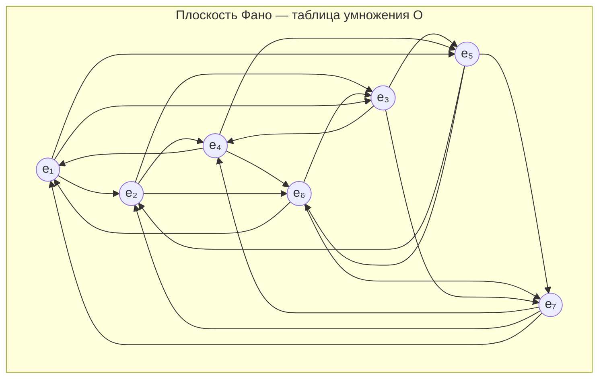
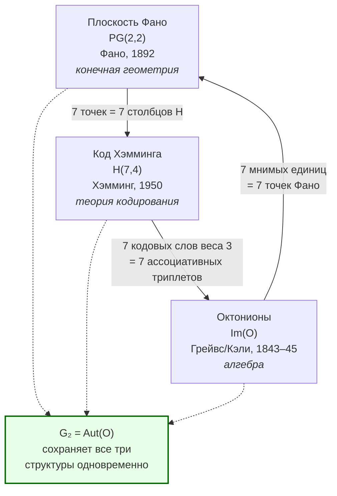

# Математические Основания УГМ

> *«Мы видим дальше, потому что стоим на плечах гигантов»* — Исаак Ньютон

Что общего между ирландцем, вырезающим формулу на камне моста в 1843 году, немецким школьным учителем, классифицирующим бесконечные группы в одиночестве провинциального городка, женщиной-математиком, которой четыре года запрещали читать лекции под собственным именем, и инженером, раздражённым ошибками в перфокартах? Все они — строители фундамента, на котором стоит эта теория.

УГМ — не изобретение с нуля. Это синтез примерно двадцати фундаментальных математических результатов, созданных за 150 лет (1845–2009). Каждый из этих результатов — **доказанная теорема** классической математики, принятая математическим сообществом. Ни один не является гипотезой или спекуляцией. Каждый был создан для совершенно другой цели — и всё же оказался необходимым кирпичом в здании, о котором его создатель не подозревал.

Этот документ — **путешествие** через 150 лет математической мысли. Мы проследим за каждым кирпичом фундамента: кто его создал, когда, зачем, при каких обстоятельствах — и как именно он используется в УГМ. За каждой формулой стоит конкретный человек с конкретной историей, и эти истории — часть теории не меньше, чем сами формулы.

Но главное — увидеть **логику**: почему каждая следующая структура появилась именно тогда, когда появилась, и почему без неё невозможно было двигаться дальше. Математика — не склад инструментов. Это живая история вопросов и ответов, где каждое поколение отвечает на вызов, оставленный предыдущим. И одна из самых удивительных вещей в этой истории — что вопросы, заданные в XIX веке, получили ответы только в XXI, а ответы, данные полвека назад, оказались ключами к замкам, о существовании которых ещё никто не знал.

Для каждой математической структуры мы ответим на три вопроса: (1) Какую **проблему** она решает? (2) Почему **именно эта** структура, а не альтернатива? (3) Что **сломается** в теории, если её убрать? Если на любой из трёх вопросов нет чёткого ответа — структура лишняя. Ни одна из 24 структур ниже не является лишней.

---

## Великая цепь идей: от Кэли до Лурье {#великая-цепь}

Прежде чем погружаться в детали, полезно увидеть общую картину — хронологическую нить, связывающую 150 лет математики в единую историю.

**1843–1845: Числа за пределами воображения.** 16 октября 1843 года Уильям Гамильтон, прогуливаясь вдоль Королевского канала в Дублине, в момент озарения вырезал на камне моста Брум формулу $i^2 = j^2 = k^2 = ijk = -1$ — так родились кватернионы. Его друг Джон Грейвс, узнав об открытии, задался вопросом: можно ли пойти дальше? В декабре того же года он сообщил Гамильтону об октонионах — 8-мерных числах. Артур Кэли, не знавший о работе Грейвса, независимо опубликовал октонионы в 1845 году, навсегда привязав к ним своё имя. Вопрос повисает в воздухе: **сколько раз можно удвоить?**

**1888–1898: Ответ — конечное число раз.** Гурвиц доказывает: алгебры с делением существуют только в размерностях 1, 2, 4 и 8. Точка. Одновременно Киллинг и Картан классифицируют все простые группы Ли и обнаруживают пять «исключительных» — не вписывающихся ни в одну бесконечную серию. Наименьшая из них, $G_2$, оказывается группой автоморфизмов именно октонионов. Вопрос: **что стоит за этими исключениями?**

**1892: Семь точек, семь линий.** Фано строит минимальную конечную проективную плоскость — всего 7 точек и 7 линий, с удивительной симметрией. Через полвека выяснится, что эта структура в точности кодирует таблицу умножения октонионов.

**1918–1935: Симметрия как закон, алгебра как язык.** Эмми Нётер, преодолевая сопротивление академического мира, не желавшего признавать женщину-математика, доказывает в 1918 году фундаментальную теорему: каждая непрерывная симметрия порождает сохраняющуюся величину. Эта теорема — мост между геометрией и физикой, который соединит $G_2$-симметрию с 14 физическими зарядами. Одновременно Нётер создаёт абстрактную алгебру — теорию колец, идеалов, модулей — язык, на котором будут говорить Гротендик и Конн.

**1927: Спасение неассоциативности.** Артин доказывает, что октонионы, хотя и неассоциативны, обладают свойством **альтернативности**: любая подалгебра, порождённая двумя элементами, ассоциативна. Это означает: попарные вычисления безопасны. Без этого результата октонионы были бы непригодны для физики.

**1932: Квантовая формализация.** Фон Нейман — «последний универсал» — пишет *Mathematische Grundlagen der Quantenmechanik*, превращая квантовую механику из набора рецептов в строгую математическую теорию. Матрица плотности, введённая им, станет центральным объектом УГМ.

**1943: Пространство = алгебра.** Гельфанд и Наймарк доказывают: коммутативная $C^*$-алгебра **эквивалентна** топологическому пространству. Это переворот: не «пространство первично, функции на нём вторичны», а наоборот. Через полвека Конн использует эту идею для вывода пространства-времени из алгебры наблюдаемых.

**1945–1972: Категориальная революция.** Эйленберг и Маклейн создают теорию категорий — «язык для описания языков». Гротендик использует этот язык для полной перестройки алгебраической геометрии: вместо точек — пучки, вместо пространств — топосы. Лавёр формализует топосы как универсальный фундамент логики, вводит классификатор подобъектов $\Omega$.

**1948–1950: Информация как физика.** Шеннон создаёт теорию информации. Хэмминг, раздражённый ошибками перфокарт в Bell Labs, изобретает код $H(7,4)$ — и его матрица проверки оказывается изоморфна плоскости Фано. Совпадение? Нет — глубокая связь между кодированием, проективной геометрией и октонионами.

**1960: Топологический запрет.** Адамс, используя новейший аппарат $K$-теории, доказывает: параллелизуемые сферы — только $S^0, S^1, S^3, S^7$. Топологическое подтверждение алгебраического результата Гурвица. Два пути — один ответ.

**1976–1996: Открытые системы и единственность.** Линдблад получает самую общую форму эволюции открытой квантовой системы. Независимо — ГКС доказывают единственность этой формы. Ченцов и Петц доказывают единственность квантовой метрики. Эти результаты **закрывают** проблему произвольности: и динамика, и метрика определены однозначно.

**1983: Время как иллюзия — или как отношение?** Пейдж и Вуттерс предлагают радикальное решение «проблемы времени» в квантовой гравитации: время — не фон, на котором разворачивается физика, а **корреляция** между подсистемами. Вселенная в целом вневременна; время возникает внутри неё, как отношение «часов» к «остальному».

**1984: Память без динамики.** Берри открывает геометрическую фазу: квантовая система, совершая замкнутый цикл в пространстве параметров, «помнит» пройденный путь — даже если вернулась в исходную точку. Эта топологическая память окажется критичной для устойчивости когерентностей в УГМ.

**1982–2009: Геометрия без пространства, топосы без конечности.** Конн создаёт некоммутативную геометрию — способ «видеть» пространство через алгебру и спектр оператора Дирака. Лурье обобщает топосы Гротендика до $\infty$-топосов, вмещающих всю гомотопическую информацию. Два потока — алгебраический и категориальный — сходятся.

Каждый из этих шагов был ответом на конкретный вопрос предыдущего поколения. УГМ — теория, которая **нуждается** во всех этих ответах одновременно, потому что ставит вопрос, объединяющий их все: что такое сознание как математическая структура?

Заметим закономерность: великие математические революции часто начинаются с **отказа** от того, что казалось очевидным:

- Гротендик отказался от **точек** — и получил топосы
- Конн отказался от **коммутативности** — и получил некоммутативную геометрию
- Лурье отказался от **дискретности морфизмов** — и получил $\infty$-топосы
- Фон Нейман отказался от **определённости состояний** — и получил матрицы плотности
- Гурвиц отказался от **ассоциативности** — и обнаружил, что цепочка алгебр конечна
- Линдблад отказался от **замкнутости системы** — и получил единственную форму диссипации

Каждый отказ расширял пространство возможностей. Каждый был необходим для УГМ. Теория, описывающая сознание, требует всех этих отказов одновременно: сознание — не точка, не коммутативно, не дискретно, не определено, не ассоциативно (в смысле октонионной структуры взаимодействий) и не замкнуто.

---

## 1. Дерево зависимостей {#дерево}

Прежде чем разбирать каждый элемент, посмотрим на полную картину: какие математические структуры питают какие аксиомы и теоремы УГМ.

```mermaid
graph TD
    EM["Эйленберг, Маклейн (1945)<br/>Теория категорий"] --> GR
    GR["Гротендик (1957-72)<br/>Топосы, пучки, сайты"] --> LU
    LU["Лурье (2006/2009)<br/>∞-топосы"] --> A1["Аксиома 1<br/>Sh∞(C)"]

    CH["Ченцов (1978)<br/>Монотонные метрики"] --> PE
    PE["Петц (1996)<br/>Единственность Бюреса"] --> A2["Аксиома 2<br/>J_Bures"]

    CA["Кэли (1845)<br/>Октонионы"] --> HU
    DI["Диксон (1919)<br/>Удвоение алгебр"] --> HU
    HU["Гурвиц (1898)<br/>dim ∈ 1,2,4,8"] --> N7["Аксиома 3<br/>N = 7"]
    AD["Адамс (1960)<br/>S⁰,S¹,S³,S⁷"] --> N7
    FA["Фано (1892)<br/>PG(2,2)"] --> G2S["G₂-структура<br/>14 зарядов"]
    KC["Киллинг, Картан (1890-е)<br/>G₂ = Aut(O)"] --> G2S

    PW["Пейдж, Вуттерс (1983)<br/>Внутреннее время"] --> A5["Аксиома 5<br/>Пейдж–Вуттерс"]

    LI["Линдблад (1976)<br/>Открытые системы"] --> EV["Эволюция Γ<br/>ℒ₀ + ℛ"]
    GKS["ГКС (1976)<br/>CPTP-полугруппы"] --> EV
    VN["фон Нейман (1932)<br/>ρ, уравнение"] --> LI

    GN["Гельфанд, Наймарк (1943)<br/>C*-алгебры"] --> CO
    CO["Конн (1990–96)<br/>Спектральные тройки"] --> M4["T-117..T-121<br/>Вывод M⁴"]

    HA["Хэмминг (1950)<br/>H(7,4)"] --> HC["Код 4+3<br/>Самокоррекция"]
    NO["Нётер (1918)<br/>Симметрия → закон"] --> G2S
    PF["Перрон, Фробениус<br/>Примитивность"] --> PR["T-39a<br/>Единственный ρ*"]

    LW["Лавёр (1964–69)<br/>Классификатор Ω"] --> LK["L_k из Ω<br/>Линдблад-операторы"]
    LW --> PHI["φ-оператор<br/>Самомоделирование"]

    style A1 fill:#e6f3ff,stroke:#0066cc
    style A2 fill:#e6f3ff,stroke:#0066cc
    style N7 fill:#e6f3ff,stroke:#0066cc
    style A5 fill:#e6f3ff,stroke:#0066cc
    style EV fill:#ffe6e6,stroke:#cc0000
    style M4 fill:#ffe6e6,stroke:#cc0000
    style G2S fill:#e6ffe6,stroke:#006600
```

**Легенда:** голубые блоки — аксиомы УГМ, красные — ключевые теоремы, зелёные — физические следствия.

---

## 2. Теория категорий: от Эйленберга к бесконечности-топосам {#теория-категорий}

Первый столп фундамента — **язык**, на котором написана теория. Этот язык — не обычная математическая нотация (множества, формулы, уравнения), а теория категорий — абстрактный формализм, описывающий **отношения** между объектами, а не сами объекты. Выбор языка — не стилистическое решение, а содержательное: категориальный язык естественно описывает квантовые состояния, их преобразования и самореферентные структуры, тогда как теоретико-множественный язык для этих целей непригоден.

### 2.1 Эйленберг и Маклейн (1942–1945) {#эйленберг-маклейн}

**Кто.** Сэмюэл Эйленберг (1913–1998) — польско-американский математик, бежавший из Польши в 1939 году, незадолго до немецкого вторжения. Сондерс Маклейн (1909–2005) — американский математик, учившийся в Гёттингене у Бернайса и Вейля.

**Что сделали.** Эйленберг и Маклейн столкнулись с конкретной проблемой: в алгебраической топологии одни и те же конструкции (группы гомологий, когомологий, гомотопий) появлялись снова и снова в разных контекстах, и каждый раз приходилось доказывать одни и те же свойства заново. Им нужен был **единый язык**, в котором все эти конструкции — частные случаи одной общей схемы. Так родилась **теория категорий**: описание математических структур через **объекты** и **стрелки** (морфизмы) между ними.

Поначалу коллеги восприняли новый формализм скептически. Теорию категорий называли «абстрактной чепухой» (abstract nonsense) — и это прозвище прижилось, хотя со временем превратилось из насмешки в знак уважения.

**Аналогия.** Представьте, что все города — это «объекты», а все дороги между ними — «стрелки». Теория категорий изучает не конкретные города и дороги, а общие закономерности: если из A в B есть дорога, и из B в C есть дорога, то из A в C есть маршрут (композиция). Вместо изучения каждого объекта по отдельности, мы изучаем **отношения** между объектами. Но аналогия глубже: теория категорий утверждает, что объект **полностью определяется** своими отношениями с другими объектами. Город — это его дороги. Матрица плотности — это её преобразования. Не существует «внутренней сущности», не выражаемой через морфизмы.

**Формально.** Категория $\mathcal{C}$ состоит из:
- Класса объектов $\mathrm{Ob}(\mathcal{C})$
- Для каждой пары объектов $A, B$ — множества морфизмов $\mathrm{Hom}(A, B)$
- Композиции $\circ: \mathrm{Hom}(A,B) \times \mathrm{Hom}(B,C) \to \mathrm{Hom}(A,C)$ (ассоциативной)
- Тождественных морфизмов $\mathrm{id}_A \in \mathrm{Hom}(A,A)$ для каждого объекта

**Роль в УГМ.** Вся теория формулируется на языке категорий. Конкретная категория, лежащая в основе УГМ:

**Категория $\mathcal{C} = \mathbf{QState}_7$:**
- **Объекты:** матрицы плотности $\Gamma \in \mathcal{D}(\mathbb{C}^7)$ — эрмитовы положительно полуопределённые матрицы $7 \times 7$ с единичным следом: $\Gamma^\dagger = \Gamma$, $\Gamma \geq 0$, $\mathrm{Tr}(\Gamma) = 1$
- **Морфизмы:** CPTP-отображения (Completely Positive, Trace-Preserving) $\Phi: \mathcal{D}(\mathbb{C}^7) \to \mathcal{D}(\mathbb{C}^7)$ — квантовые каналы, сохраняющие физичность состояний
- **Композиция:** $\Phi_2 \circ \Phi_1$ — последовательное применение двух каналов (ассоциативно по определению)
- **Тождество:** $\mathrm{id}_\Gamma$ — тождественный канал, оставляющий состояние неизменным

Почему CPTP, а не произвольные линейные отображения? Потому что CPTP — единственный класс отображений, сохраняющий все физические свойства матрицы плотности: эрмитовость (наблюдаемые вещественны), положительную полуопределённость (вероятности неотрицательны), единичный след (сумма вероятностей = 1). Любое отображение, нарушающее хотя бы одно из этих свойств, порождает физически бессмысленные состояния (отрицательные вероятности, ненормированные распределения).

**Терминальный объект** $T = I/7$ — максимально смешанное состояние (равномерное распределение по всем 7 измерениям). Для любого $\Gamma$ существует единственный морфизм $\Gamma \to T$ — полная диссипация. В категорном смысле $T$ — конечная точка всех траекторий, если отключить регенерацию $\mathcal{R}$.

Помимо объектов и морфизмов, в теории категорий фундаментальную роль играют **функторы** — «отображения между категориями», сохраняющие структуру. Конкретный пример: **функтор забывания** $U: \mathbf{QState}_7 \to \mathbf{Vect}$, который каждой матрице плотности ставит в соответствие линейное пространство, «забывая» условия $\Gamma \geq 0$ и $\mathrm{Tr}(\Gamma) = 1$. Этот функтор позволяет применять линейную алгебру к квантовым состояниям — но цена «забывания» в том, что результаты нужно проверять на физичность.

Ещё более важное понятие — **естественное преобразование**: «морфизм между функторами». Если $F, G: \mathcal{C} \to \mathcal{D}$ — два функтора, то естественное преобразование $\eta: F \Rightarrow G$ — семейство морфизмов $\eta_A: F(A) \to G(A)$ (по одному для каждого объекта $A$), согласованных с морфизмами в $\mathcal{C}$. В контексте УГМ: два разных способа «наблюдать» систему (два функтора) связаны естественным преобразованием, если переход от одного наблюдения к другому не зависит от конкретного состояния $\Gamma$. Это формализует идею **калибровочной инвариантности**: физика не должна зависеть от способа описания.

Без категорного языка УГМ невозможна. Но Эйленберг и Маклейн дали только **язык**. Чтобы построить на этом языке целый мир, потребовался Гротендик.

### 2.2 Гротендик (1957–1972) {#гротендик}

**Кто.** Александр Гротендик (1928–2014) — один из величайших математиков XX века. Сын анархистов: его отец Александр Шапиро, выходец из Российской империи, погиб в Освенциме в 1942 году; мать Ханка Гротендик — немецкая журналистка. Детство Александра прошло в лагерях для интернированных в Виши. После войны — без гражданства, без денег, без связей — он пришёл в математику и за 15 лет перестроил её до основания.

Гротендик работал с нечеловеческой интенсивностью. За 12 лет (1957–1969) он опубликовал тысячи страниц, переписал основы алгебраической геометрии и создал школу, которая на десятилетия определила развитие математики. В 1966 году получил Филдсовскую медаль, но отказался ехать в Москву на церемонию вручения в знак протеста против ввода советских войск в Чехословакию (1968, ещё до официальной церемонии). В 1970-м покинул Институт высших научных исследований (IHES) в знак протеста против военного финансирования. В последующие годы написал «Recoltes et Semailles» (Урожаи и посевы, 1985–1987) — более 1000 страниц математической и человеческой рефлексии, в которых анализировал не только свои открытия, но и природу математического творчества, отношения с учениками, и собственное отчуждение от академического мира. Он также написал «Esquisse d'un Programme» (Набросок программы, 1984) — визионерский текст, в котором предложил «башню Тейхмюллера», десинов d'enfants и другие идеи, опередившие время на десятилетия. Последние два десятилетия жизни провёл затворником в деревне Лассер у подножия Пиренеев, отказываясь от контактов с математическим миром. Умер в 2014 году, оставив десятки тысяч страниц неопубликованных рукописей.

**Что сделал.** Гротендик пытался доказать **гипотезы Вейля** — серию утверждений об алгебраических многообразиях над конечными полями, связывающих топологию и арифметику. Для этого ему нужно было обобщить само понятие **пространства**. Обычная топология (открытые множества) оказалась слишком бедной для работы с алгебраическими объектами в характеристике $p$. Гротендик совершил радикальный шаг: вместо изучения **точек** пространства он стал изучать **категории покрытий** — какие «семейства наблюдателей» могут совместно описать объект. Так родились **сайты** (категории с топологией), **пучки** (согласованные локальные данные) и **топосы** (категории пучков). Монументальный труд SGA (Seminaire de Geometrie Algebrique, 1960–1967) — 12 томов семинаров, которые математическое сообщество осваивало десятилетиями.

Революция Гротендика была принята не сразу. Многие математики считали его подход чрезмерно абстрактным. Но именно эта абстракция оказалась **необходимой**: без неё невозможно корректно определить, что значит «локально наблюдать» квантовое состояние.

**Аналогия.** Вы не знаете, как выглядит комната, но у вас есть фотографии с разных ракурсов. Если фотографии согласованы (пересечения совпадают), вы можете восстановить комнату. Гротендик формализовал это: пучок — «согласованные локальные данные», а **топология** на категории определяет, какие «ракурсы» достаточны для полного описания. Но аналогия имеет важную границу: в отличие от фотографий, пучки в топосе могут быть «наблюдениями», не сводимыми к классическим значениям — они могут нести квантовую информацию. Именно это делает пучки Гротендика пригодными для квантовой теории, тогда как обычная топология — нет.

**Формально.** Топология Гротендика $J$ на категории $\mathcal{C}$ — это для каждого объекта $U$ набор семейств морфизмов $\{U_i \to U\}$ (покрытий), удовлетворяющих трём аксиомам:

1. **Стабильность** (замкнутость относительно базисной замены): если $\{U_i \to U\}$ — покрытие и $V \to U$ — произвольный морфизм, то $\{U_i \times_U V \to V\}$ — тоже покрытие. Говоря проще: если у вас есть хороший набор фотографий комнаты, и вы переходите в соседнюю комнату (базисная замена), вы можете получить хороший набор фотографий и для неё.
2. **Транзитивность** (композиция покрытий): если $\{U_i \to U\}$ — покрытие и для каждого $i$ даны покрытия $\{V_{ij} \to U_i\}$, то $\{V_{ij} \to U\}$ — тоже покрытие. Если вы фотографируете стену, а затем каждый фрагмент фотографируете крупнее — крупные фотографии тоже покрывают всю стену.
3. **Тривиальность**: тождественный морфизм $\{U \xrightarrow{\mathrm{id}} U\}$ — покрытие. «Фотография в полный рост» — тривиально хорошее покрытие.

**Пучок** $\mathcal{F}$ на сайте $(\mathcal{C}, J)$ — это контравариантный функтор $\mathcal{F}: \mathcal{C}^{op} \to \mathbf{Set}$, удовлетворяющий **условию склейки**: если $\{U_i \to U\}$ — покрытие и данные $s_i \in \mathcal{F}(U_i)$ согласованы на пересечениях ($s_i|_{U_i \times_U U_j} = s_j|_{U_i \times_U U_j}$), то существует единственное $s \in \mathcal{F}(U)$ с $s|_{U_i} = s_i$. По-человечески: если локальные наблюдения согласованы, они однозначно определяют глобальное.

**Топос** — категория всех пучков: $\mathbf{Sh}(\mathcal{C}, J)$. Это «мир», в котором живут согласованные наблюдения. В этом мире есть своя логика (классификатор $\Omega$), своя арифметика (объект натуральных чисел) и свои «пространства» — всё выводится из структуры покрытий.

**Конкретный пример для УГМ.** Категория $\mathcal{C} = \mathbf{QState}_7$. Объект $\Gamma \in \mathcal{D}(\mathbb{C}^7)$. Покрытие $\{U_i \to \Gamma\}$ — набор CPTP-каналов, «достаточный для восстановления» $\Gamma$. Топология $J_{Bures}$: семейство $\{U_i\}$ — покрытие, если шары Бюреса вокруг $U_i$ покрывают окрестность $\Gamma$. Пучок $\mathcal{F}$ — присвоение каждому состоянию набора «наблюдаемых свойств», согласованных при переходе от одного состояния к соседнему. Классификатор $\Omega$ этого топоса порождает проекторы $|k\rangle\langle k|$ — операторы Линдблада.

**Роль в УГМ.** **Аксиома 2**: топология Гротендика $J$ на категории матриц плотности индуцирована метрикой Бюреса $d_B$. Покрытия определяют, когда два состояния $\Gamma_1, \Gamma_2$ различимы. Это не произвольный выбор: метрика Бюреса единственна по теореме Ченцова–Петца (см. [раздел 4.5](#ченцов-петц)). Без этой единственности теория зависела бы от произвольного решения — какую метрику взять. Разные метрики порождают разные топологии, разные пучки, разные операторы $L_k$ — и, следовательно, разную физику. Единственность Бюреса гарантирует, что этого не происходит. Подробнее: [Аксиома Omega-7](./axiom-omega).

**Без топосов Гротендика** в УГМ: невозможно определить «локальное наблюдение» квантового состояния. Обычная топология (открытые множества) требует, чтобы наблюдаемые были **непрерывными функциями** — но квантовые наблюдаемые не всегда непрерывны в обычном смысле (проекционные измерения — разрывны). Топология Гротендика решает эту проблему, заменяя «открытые множества» на «покрытия» — семейства морфизмов, которые могут быть прерывными поточечно, но согласованными категориально. Без этого понятия нельзя определить пучок на $\mathcal{D}(\mathbb{C}^7)$ — а значит, нельзя определить ни классификатор $\Omega$, ни операторы $L_k$, ни всю динамику.

Гротендик дал язык и структуру. Но его топосы были «одноуровневыми»: морфизмы между объектами — просто стрелки, без внутренней структуры. Два морфизма либо равны, либо нет — tertium non datur. Для квантовой теории, где отношения между состояниями сами имеют нетривиальную геометрию (калибровочные эквивалентности, гомотопии между путями в пространстве состояний), этого недостаточно. Понадобилось ещё 37 лет, чтобы Лурье обобщил топосы Гротендика до бесконечности.

Интересно, что Гротендик сам предчувствовал необходимость такого обобщения. В «Poursuivant les champs» (Преследуя поля, 1983) он ввёл понятие $\infty$-группоидов и наметил программу «гомотопической алгебры», которую впоследствии реализовал Лурье.

### 2.3 Лавёр и классификатор подобъектов (1964–1969) {#лавёр-классификатор}

Гротендик построил топосы как инструмент для алгебраической геометрии. Но параллельно с ним другие математики увидели в топосах нечто большее — **универсальную логику**.

**Кто.** Уильям Лавёр (1937–2023) — американский математик, создатель теории элементарных топосов. Лавёр принадлежал к тому поколению, которое восприняло идеи Гротендика не как инструмент алгебраической геометрии, а как **фундамент математики** — альтернативу теории множеств Цермело–Френкеля. Майлс Тирни (1937–2017) — его ближайший соавтор, совместно с которым были заложены основы элементарных топосов.

**Что сделали.** Лавёр в основополагающей работе 1964 года (*An Elementary Theory of the Category of Sets*) и в последующей серии работ с Тирни (1969–1972) развил фундаментальное понятие: **классификатор подобъектов** $\Omega$. Они показали, что в каждом топосе существует объект $\Omega$, играющий роль «множества истинностных значений». В обычной теории множеств $\Omega = \{0, 1\}$ (истина/ложь). В топосе $\Omega$ может быть богаче — это интуиционистская логика, где «степеней истинности» больше двух.

:::note[Историческая справка]
В ранних версиях этого документа классификатор $\Omega$ ошибочно приписывался Жану Жиро (Jean Giraud, 1936–2007). Жиро внёс важный вклад в теорию топосов — его теорема характеризует категории Гротендика через точные условия (совместные копроизведения, эффективные отношения эквивалентности). Однако **классификатор подобъектов** $\Omega$ и связанная с ним логика — это заслуга **Лавёра** (1964) и **Лавёра–Тирни** (1969–1972). Именно Лавёр увидел в топосе не только геометрический, но и **логический** объект, и именно понятие $\Omega$ стало мостом от логики к операторам Линдблада в УГМ.
:::

**Аналогия.** В обычной логике любое утверждение либо истинно, либо ложно — два значения. В топосе «степеней истинности» может быть много, и $\Omega$ — объект, содержащий все эти степени. Каждый «подобъект» (часть объекта) задаётся «характеристической функцией» в $\Omega$, подобно тому как подмножество $A \subseteq X$ задаётся функцией $\chi_A: X \to \{0,1\}$. Здесь важно понять границу аналогии: $\Omega$ — это **не** набор чисел от 0 до 1 (это было бы нечёткой логикой). $\Omega$ — полноценный объект внутри топоса, со своей алгебраической структурой. Именно эта структура порождает операторы $L_k$ в УГМ.

**Формально.** Для каждого мономорфизма $m: S \hookrightarrow X$ существует единственный характеристический морфизм $\chi_S: X \to \Omega$ такой, что $S$ — пулбэк $\chi_S$ вдоль морфизма «истина» $\top: 1 \to \Omega$.

**Роль в УГМ.** Из классификатора $\Omega$ в $\mathbf{Sh}_\infty(\mathcal{C})$ выводятся **атомы подобъектов** — канонические предикаты $S_k = |k\rangle\langle k|$. Характеристические морфизмы $\chi_{S_k}$ операторно реализуются как **операторы Линдблада** $L_k$ [Т]. Таким образом, диссипативная динамика — не постулат, а следствие логической структуры топоса. Это один из самых неожиданных результатов УГМ: **физическая диссипация вытекает из логики**. Подробнее: [Аксиома Omega-7: L_k из Omega](./axiom-omega#lk-из-omega), [Операторы Линдблада](../operators/lindblad-operators).

### 2.4 Лавёр: самореферентность (1969) {#лавёр}

Если предыдущий раздел показал, как Лавёр дал топосу **логику**, то здесь — как он дал ему **самореферентность**. И это, пожалуй, самый глубокий вклад Лавёра — потому что самореферентность лежит в сердце некоторых из самых глубоких проблем математики и философии.

**Предыстория: парадокс самореференции.** «Может ли глаз увидеть сам себя?» — вопрос, который тревожил философов от Платона до Витгенштейна. В математике этот вопрос принял форму **теоремы Гёделя о неполноте** (1931): достаточно мощная формальная система не может полностью описать саму себя. Казалось бы, самомоделирование — безнадёжная затея. Но Лавёр показал нечто удивительное: **в категориальном мире** самомоделирование не только возможно, но и **неизбежно**.

Разница с Гёделем — в уровне абстракции. Гёдель работал с синтаксическими системами (формулы, доказательства). Лавёр работает со **структурами** (объекты, морфизмы). Неполнота Гёделя говорит: «система не может доказать все истины о себе». Теорема Лавёра говорит: «система может содержать свою структурную модель — и эта модель имеет неподвижную точку». Это не противоречие: самомоделирование — не то же, что самодоказательство.

**Что сделал.** Лавёр развил категориальную семантику: показал, как алгебраические теории порождают категории моделей. Ключевой результат для УГМ — **теорема Лавёра о неподвижной точке**: в элементарном топосе определённые эндоморфизмы обладают неподвижными точками. Проще говоря: если система способна моделировать саму себя, то существует состояние, в котором модель **совпадает** с оригиналом.

**Формально.** Пусть $\varphi: \mathrm{Ob}(\mathcal{C}) \to \mathrm{Ob}(\mathcal{C})$ — эндофунктор (отображение, сохраняющее структуру). Если $\mathcal{C}$ — элементарный топос и $\varphi$ обладает определёнными свойствами непрерывности (сохраняет копределы), то существует объект $\Gamma^*$ такой, что $\varphi(\Gamma^*) \cong \Gamma^*$ — **неподвижная точка**.

**Аналогия.** Если вы стоите перед зеркалом с зеркалом за спиной, вы видите бесконечную рекурсию отражений: отражение отражения отражения... Теорема Лавёра гарантирует, что такая рекурсия «сходится» — существует устойчивая картинка (неподвижная точка). Но вот что делает эту теорему особенной: она не просто говорит «неподвижная точка существует» (это сказала бы и теорема Банаха о сжимающем отображении). Она говорит: «**в мире категорий** самомоделирование — не экзотика, а стандартная операция, и её результат — структурно определён».

Важно: теорема не говорит, что неподвижная точка **единственна** — она лишь гарантирует **существование** хотя бы одной. Единственность в УГМ обеспечивается дополнительно, через примитивность оператора (теорема Перрона–Фробениуса, [раздел 7.3](#перрон-фробениус)).

**Конкретный пример в УГМ.** $\varphi$-оператор — CPTP-канал самомоделирования. В канонической форме [Т]:

$$
\varphi_k(\Gamma) = (1 - k)\Gamma + k\rho^*
$$

где $k = 1 - R$ — параметр сжатия ($R$ — [мера рефлексии](/docs/consciousness/foundations/self-observation#мера-рефлексии-r)), а $\rho^*$ — целевое состояние. Неподвижная точка: $\varphi_k(\Gamma^*) = \Gamma^*$, что даёт $(1-k)\Gamma^* + k\rho^* = \Gamma^*$, откуда $k(\rho^* - \Gamma^*) = 0$. При $k \neq 0$: $\Gamma^* = \rho^*$ — модель совпадает с оригиналом. При $k = 0$ ($R = 1$, идеальная рефлексия): любое $\Gamma$ — неподвижная точка (идеальное зеркало отражает всё). При $k = 1$ ($R = 0$, нет рефлексии): $\varphi(\Gamma) = \rho^*$ для всех $\Gamma$ — модель не зависит от оригинала (слепое зеркало всегда показывает одно и то же).

**Без теоремы Лавёра** в УГМ: оператор $\varphi$ был бы **произвольной конструкцией** — мы могли бы его определить, но не смогли бы обосновать его *необходимость*. Лавёр доказывает: если ваша теория живёт в топосе, самомоделирование — не опция, а **неизбежность**. Это фундаментально важно: φ-оператор в УГМ — не «добавленная функция», а **вынужденная структура**, существование которой следует из того, что теория формулируется на языке топосов.

**Роль в УГМ.** Категориальная необходимость оператора самомоделирования $\varphi$. Подробнее: [phi-оператор самомоделирования](../operators/phi-operator), [Формализация оператора phi](/docs/proofs/categorical/formalization-phi).

Итак, к началу 2000-х категориальный фундамент был заложен: язык (Эйленберг–Маклейн), пространства (Гротендик), логика и самореферентность (Лавёр–Тирни). Три уровня абстракции, каждый необходимый для УГМ: без языка нельзя формулировать, без пространств нельзя определить «локальное наблюдение», без логики нельзя вывести операторы Линдблада, без самореферентности нельзя обосновать оператор самомоделирования.

Но оставалась серьёзная проблема: топосы Гротендика были «плоскими» — в них отношения между объектами не имели собственной структуры. Два морфизма между одними и теми же объектами либо равны, либо нет — третьего не дано. Для физики, где **калибровочные эквивалентности** и **гомотопии** играют центральную роль, нужен был переход к бесконечномерному случаю. Два состояния сознания могут быть «эквивалентны» в одном смысле и «различны» в другом; эти различия между эквивалентностями сами образуют структуру — и так до бесконечности. Обычный топос не способен уловить эту бесконечную иерархию; $\infty$-топос — способен.

### 2.5 Лурье (2006/2009) {#лурье}

**Кто.** Джейкоб Лурье (р. 1977) — американский математик, один из наиболее влиятельных математиков своего поколения. Вундеркинд: в 2000 году получил степень PhD в Массачусетском технологическом институте в возрасте 23 лет (научный руководитель — Майкл Хопкинс). В 2007 году стал профессором Гарварда, а в 2009-м — одним из самых молодых профессоров в его истории. Монография *Higher Topos Theory* (925 страниц) была в значительной части написана ещё в аспирантуре; первая версия появилась на arXiv в 2006 году (math/0608040), а книга вышла в Princeton University Press в 2009 году. В 2019 году Лурье покинул Гарвард и перешёл в Институт перспективных исследований (IAS) в Принстоне — тот самый институт, где работали Гёдель и Эйнштейн.

**Что сделал.** Лурье завершил программу, начатую Гротендиком, доведя её до логического предела. Топосы Гротендика работают с обычными категориями, где между двумя объектами либо есть морфизм, либо нет. Но в современной математике и физике **отношения между отношениями** играют фундаментальную роль: две стрелки могут быть «эквивалентны», но с точностью до гомотопии, которая сама определена с точностью до гомотопии более высокого порядка, и так далее. Лурье создал теорию **$\infty$-топосов** — обобщение топосов Гротендика, где вместо обычных категорий используются $(\infty,1)$-категории, а вместо множеств морфизмов — **пространства** морфизмов (с нетривиальной гомотопической структурой).

**Аналогия.** Обычная категория — это «город с дорогами». $\infty$-категория — это «город с дорогами, переулками между дорогами, проходами между переулками, и так далее до бесконечности». Каждый уровень хранит информацию о том, как связаны связи предыдущего уровня. Почему это важно? Потому что в квантовой теории два состояния могут быть «физически одинаковы» (калибровочно эквивалентны), но способов их отождествления может быть несколько, и выбор между этими способами — сам по себе физическая информация. Обычный топос теряет эту информацию, $\infty$-топос — сохраняет.

**Формально.** $\infty$-топос — это $(\infty,1)$-категория, эквивалентная левой точной локализации $\mathbf{PSh}_\infty(\mathcal{C})$ — категории предпучков $\infty$-группоидов на малой $(\infty,1)$-категории $\mathcal{C}$. В частности, $\mathbf{Sh}_\infty(\mathcal{C}, J)$ — $\infty$-категория пучков на сайте $(\mathcal{C}, J)$.

**Роль в УГМ.** **Единственный примитив** теории: $\mathfrak{T} := \mathbf{Sh}_\infty(\mathcal{C}, J_{Bures})$. Аксиома 1 постулирует, что реальность описывается $\infty$-топосом пучков. Теорема сравнения Лурье обеспечивает независимость от выбора представления сайта — подобно тому, как в обычной физике законы не зависят от системы координат. Без $\infty$-топосов УГМ зависела бы от конкретного способа представления категории $\mathcal{C}$, что было бы аналогом «привилегированной системы отсчёта» — физически неприемлемая ситуация. Подробнее: [Аксиома Omega-7: структурированный примитив](./axiom-omega#примитив).

**Без $\infty$-топосов Лурье** в УГМ: обычные топосы Гротендика не различают два морфизма, которые «почти одинаковы, но не совсем» — два CPTP-канала, отличающихся на калибровочное преобразование, считались бы либо «одинаковыми», либо «разными», без промежуточных градаций. Это потеря информации: калибровочная структура $G_2$ требует различать **способы отождествления** эквивалентных состояний. В $\infty$-топосе эти «способы отождествления» сами образуют пространство — гомотопический тип, — и именно его нетривиальность порождает когомологию нерва $H^*_{\text{loc}}(X, T) \cong \tilde{H}^{*-1}(S^6)$, которая отвечает за нетривиальную физику (интериорность, Gap-структуру, калибровочные заряды). Без $\infty$-структуры теория была бы «плоской» — математически корректной, но физически пустой.

---

Категориальный фундамент — это **язык** и **логика** теории. Топосы определяют, как наблюдать, пучки — как склеивать локальные наблюдения, $\Omega$ — как выводить операторы. Но язык не определяет **размерность** — сколько измерений имеет пространство состояний сознания. $\infty$-топос работает в **любой** размерности; ему всё равно, 3 у вас измерения или 300.

Для ответа на вопрос о размерности нужна совершенно другая ветвь математики, уходящая корнями в XIX век — алгебра гиперкомплексных чисел.

## 3. Алгебра: октонионы и исключительные структуры {#алгебра}

Второй столп — **размерность** пространства состояний. Почему $N = 7$, а не 3, или 10, или 42? В большинстве теорий сознания размерность берётся «из опыта» или не определена вовсе (IIT работает с произвольным числом элементов; теория глобального рабочего пространства не фиксирует размерность). УГМ утверждает: размерность **выводится** из алгебраических ограничений, и ответ единственен.

Этот ответ приходит из алгебры гиперкомплексных чисел — ветви математики, берущей начало в романтическую эпоху, когда Гамильтон, Грейвс и Кэли пытались обобщить понятие числа за пределы комплексной плоскости. Их открытия — кватернионы и октонионы — казались математическими курьёзами. Потребовалось полтора века, чтобы понять, что эти «курьёзы» — ключ к структуре реальности.

### 3.1 Кэли и Грейвс (1843–1845) {#кэли}

Эта история начинается с одного из самых романтических эпизодов в математике.

16 октября 1843 года Уильям Роуэн Гамильтон гулял с женой вдоль Королевского канала в Дублине, направляясь на заседание Ирландской академии. Он уже 15 лет бился над проблемой: как обобщить комплексные числа на три измерения? Комплексные числа — это пары $(a, b)$ с умножением $(a,b)(c,d) = (ac-bd, ad+bc)$. Можно ли сделать то же для троек? Ответ — нет (как позже докажет Гурвиц). Но Гамильтон этого ещё не знал, и в тот октябрьский день его осенило: нужны не тройки, а **четвёрки**! Он вырезал на камне моста Брум знаменитую формулу: $i^2 = j^2 = k^2 = ijk = -1$. Так родились **кватернионы** — четырёхмерные числа, в которых умножение **некоммутативно**: $ij = k$, но $ji = -k$.

Друг Гамильтона Джон Грейвс, узнав о кватернионах, спросил: а что будет, если пойти ещё дальше? Уже в декабре 1843 года он сообщил Гамильтону об **октонионах** — восьмимерных числах, в которых теряется не только коммутативность, но и **ассоциативность**: $(ab)c \neq a(bc)$. Грейвс не опубликовал свой результат, и двумя годами позже его независимо переоткрыл и опубликовал Артур Кэли.

**Кто.** Артур Кэли (1821–1895) — британский математик, один из основателей теории матриц. Кэли — один из самых плодовитых математиков в истории: он опубликовал более 900 статей. Примечательно, что первые 14 лет после окончания Кембриджа Кэли работал адвокатом — математика была его хобби. Только в 1863 году, в возрасте 42 лет, он получил математическую кафедру. За эти 14 «адвокатских» лет он опубликовал более 300 математических статей — темп, которому могут позавидовать штатные профессора.

**Что сделал.** Впервые описал **октонионы** — 8-мерную алгебру над вещественными числами. Историческая справедливость требует отметить: октонионы были независимо открыты Джоном Грейвсом в 1843 году, за два года до Кэли, но Грейвс сообщил о них лишь в письме Гамильтону и не опубликовал результат. Кэли опубликовал первым в 1845.

**Аналогия.** Все знают вещественные числа (прямая). Комплексные числа — это «числа на плоскости» (два направления). Кватернионы Гамильтона — «числа в 4D» (ценой потери коммутативности: $ij \neq ji$). Октонионы — следующий шаг: «числа в 8D», которые теряют ещё и ассоциативность: $(ab)c \neq a(bc)$ в общем случае. Зато они — **последние** в этой цепочке: дальнейшее удвоение даёт алгебры без деления. Каждый шаг удвоения — как подъём на следующий этаж: вид всё шире, но пол всё менее устойчив. После октонионов пол проваливается — деление становится невозможным.

Почему октонионы оставались экзотикой более ста лет? Потому что физике хватало кватернионов (для описания спина) и комплексных чисел (для квантовой механики). Октонионы считались «математическим курьёзом без физических приложений». Впрочем, не все думали так: Джон Бэз в своей знаменитой обзорной статье «The Octonions» (2002) писал: «Октонионы — самая экзотическая числовая система, и они, по-видимому, связаны с теорией струн, суперсимметрией и исключительными группами». УГМ утверждает, что связь ещё глубже: октонионы — не экзотика, а **фундамент**.

### 3.2 Диксон и удвоение Кэли–Диксона (1919) {#диксон}

**Кто.** Леонард Юджин Диксон (1874–1954) — американский математик, один из лидеров американской алгебраической школы начала XX века. Автор трёхтомной «History of the Theory of Numbers» (1919–1923), систематизировавшей результаты теории чисел от древних греков до начала XX века.

**Что сделал.** Кэли и Грейвс построили октонионы «вручную». Диксон показал, что за этим стоит **общий механизм** — конструкция удвоения Кэли–Диксона. Идея проста и элегантна: из алгебры $\mathcal{A}$ размерности $n$ строится новая алгебра $\mathcal{A}'$ размерности $2n$. Элементы $\mathcal{A}'$ — пары $(a, b)$ с $a, b \in \mathcal{A}$, умножение определяется формулой:

$$
(a, b) \cdot (c, d) = (ac - \bar{d}b,\; da + b\bar{c})
$$

где $\bar{x}$ — сопряжение в $\mathcal{A}$. Эта единственная формула порождает всю цепочку:

$$
\mathbb{R} \xrightarrow{\text{CD}} \mathbb{C} \xrightarrow{\text{CD}} \mathbb{H} \xrightarrow{\text{CD}} \mathbb{O} \xrightarrow{\text{CD}} \mathbb{S}
$$

На **каждом** шаге удвоения теряется конкретное алгебраическое свойство — и эта потеря необратима:

| Шаг | Переход | Что теряется | Почему |
|---|---|---|---|
| 1 | $\mathbb{R} \to \mathbb{C}$ | **Упорядоченность** | $\mathbb{C}$ нельзя линейно упорядочить совместимо с операциями: нельзя сказать, что $3+i > 2-i$ |
| 2 | $\mathbb{C} \to \mathbb{H}$ | **Коммутативность** | $ij = k$, но $ji = -k$; порядок множителей имеет значение |
| 3 | $\mathbb{H} \to \mathbb{O}$ | **Ассоциативность** | $(e_1 e_2)e_4 \neq e_1(e_2 e_4)$ в общем случае; порядок скобок имеет значение |
| 4 | $\mathbb{O} \to \mathbb{S}$ | **Деление** | Появляются **делители нуля**: произведение ненулевых элементов может быть нулём |

Четвёртый шаг — катастрофический. **Седенионы** $\mathbb{S}$ (размерность 16) уже не являются алгеброй с делением. Конкретный пример делителя нуля в $\mathbb{S}$:

$$
(e_3 + e_{10})(e_6 - e_{15}) = 0
$$

где $e_3, e_{10}, e_6, e_{15}$ — базисные элементы седенионов, каждый из которых ненулевой. Это означает: в $\mathbb{S}$ нельзя «делить» — уравнение $ax = b$ может не иметь решения или иметь бесконечно много решений. Для физической теории, где обратимость операций — необходимое условие предсказательности, это неприемлемо. Октонионы — **последняя** алгебра, где деление возможно.

Закономерность потерь не случайна. Каждое удвоение добавляет новое «мнимое направление», но оплачивает это ослаблением структуры. Можно видеть это как фундаментальный баланс: **богатство** (число измерений) растёт, но **порядок** (алгебраические свойства) убывает. Октонионы — точка оптимального баланса: максимальная размерность при сохранении деления.

**Роль в УГМ.** Конструкция Кэли–Диксона объясняет **механизм** обрыва: октонионы — максимальная алгебра с делением, потому что следующее удвоение уничтожает критическое свойство (альтернативность и деление). Это не просто «факт» — это **понимание**, почему 7 и только 7. Подробнее: [Структурный вывод N = 7](/docs/proofs/minimality/theorem-octonionic-derivation#кэли-диксон).

Диксон дал **механизм** удвоения и показал, что после октонионов всё ломается. Но это ещё не было **доказательством невозможности**. Может быть, существует алгебра с делением размерности 16, построенная другим способом, не через удвоение? Ответ дал Гурвиц — и ответ был категоричен: нет.

### 3.3 Гурвиц (1898) {#гурвиц}

**Кто.** Адольф Гурвиц (1859–1919) — немецко-швейцарский математик, профессор Цюрихского политехникума (ETH Zurich). Учитель Гильберта, коллега Минковского. Гурвиц обладал необычной математической интуицией: он не просто доказывал теоремы, а чувствовал **границы возможного** — и умел превращать это чувство в строгое доказательство.

**Что сделал.** Представьте себе момент: конец XIX века, Гамильтон и Грейвс нашли кватернионы и октонионы, Диксон показал, как строить алгебры всё бо́льших размерностей. Математики всего мира ищут алгебру с делением в размерности 16, 32, 64... И тут Гурвиц доказывает: **искать бесполезно**. Нормированные алгебры с делением над $\mathbb{R}$ существуют **только** в размерностях 1, 2, 4 и 8. Не «мы пока не нашли в других размерностях» — а «их **не существует**». Точка. Никакая конструкция — удвоение Кэли–Диксона или любая другая — не способна создать алгебру с делением за пределами этого списка.

$$
\dim(\mathcal{A}) \in \{1, 2, 4, 8\} \quad \Leftrightarrow \quad \mathcal{A} \in \{\mathbb{R}, \mathbb{C}, \mathbb{H}, \mathbb{O}\}
$$

Почему это потрясающе? Потому что четыре числа — 1, 2, 4, 8 — это **всё**. Вся бесконечность натуральных чисел, и только четыре из них допускают алгебру с делением. Это не эмпирический факт (мы проверили и не нашли) — это **математическая необходимость** (мы доказали, что других нет). Такие результаты — редкость. Они говорят не о том, что мы знаем, а о том, что знает сама математика о своих границах.

**Аналогия.** Это как доказать, что правильных многогранников ровно пять (тетраэдр, куб, октаэдр, додекаэдр, икосаэдр) — никакой инженерии, чистая математика запрещает существование шестого. И как платоновы тела появляются в самых неожиданных местах (кристаллография, вирусология, теория графов), так и числа 1, 2, 4, 8 всплывают повсюду: размерности алгебр с делением, параллелизуемые сферы, гопфовы расслоения, суперсимметричные теории в определённых размерностях. Каждое появление — не совпадение, а проявление одной и той же алгебраической необходимости.

**Упражнение для любознательного читателя.** Попробуйте построить алгебру с делением в размерности 3. Определите умножение на трёх базисных элементах $\{1, e_1, e_2\}$ с нормой $|a + be_1 + ce_2|^2 = a^2 + b^2 + c^2$ и потребуйте $|xy| = |x||y|$. Вы обнаружите, что условие мультипликативности нормы приводит к **системе уравнений без решений**. Это — доказательство «на пальцах» того, почему 3 не входит в список Гурвица. Полное доказательство сложнее (использует тождества для квадратичных форм), но идея та же: мультипликативность нормы — очень сильное ограничение.

**Роль в УГМ.** Максимальная алгебра с делением — $\mathbb{O}$, $\dim(\mathbb{O}) = 8$. Мнимая часть $\mathrm{Im}(\mathbb{O}) = \mathbb{R}^7$, что даёт **N = 7** — размерность пространства состояний Голонома [Т]. Это один из двух независимых путей к Аксиоме 3. Подробнее: [Структурный вывод N = 7](/docs/proofs/minimality/theorem-octonionic-derivation#теорема-гурвица).

Теорема Гурвица — алгебраический результат. Но математикам XX века хотелось понять: есть ли **топологическая** причина, по которой список 1, 2, 4, 8 — именно такой? Ответ пришёл из совершенно другого направления — гомотопической теории.

### 3.4 Адамс (1960) {#адамс}

**Кто.** Джон Фрэнк Адамс (1930–1989) — британский математик, один из основателей стабильной гомотопической теории. Адамс погиб в автомобильной катастрофе, не дожив до своего 60-летия. Его доказательство теоремы о гопфовых инвариантах (1960) считается одним из красивейших в топологии XX века.

**Что сделал.** Доказал **теорему Адамса**: сфера $S^{n-1}$ допускает структуру $H$-пространства (непрерывное умножение с единицей) тогда и только тогда, когда $n \in \{1, 2, 4, 8\}$. Доказательство использует $K$-теорию и операции Адамса — мощный аппарат, созданный специально для этой задачи.

**Эквивалентная формулировка:** параллелизуемые сферы — только $S^0, S^1, S^3, S^7$. Это означает: только на этих сферах можно определить непрерывное поле касательных векторов, нигде не обращающееся в нуль.

**Аналогия.** Попробуйте «причесать ёжика» — расставить стрелки на поверхности сферы без «вихрей». Для обычной сферы $S^2$ это невозможно (теорема о причёске). А вот $S^1$ (окружность), $S^3$ и $S^7$ — можно. Причём $S^7$ — **последняя** сфера с этим свойством.

**Роль в УГМ.** Независимое от Гурвица подтверждение уникальности $N = 7$: параллелизуемость $S^6 \subset \mathrm{Im}(\mathbb{O})$ необходима для глобально определённой динамики на пространстве состояний [Т]. Подробнее: [Структурный вывод N = 7](/docs/proofs/minimality/theorem-octonionic-derivation#теорема-адамса).

Два совершенно разных пути — алгебраический (Гурвиц) и топологический (Адамс) — привели к одному списку: 1, 2, 4, 8. Такое совпадение в математике — всегда сигнал глубокой структуры. Октонионы — не случайность, а **необходимость**. Но как именно устроено умножение в $\mathbb{O}$? Ответ кодируется удивительной геометрической структурой, открытой за шесть лет до Гурвица.

### 3.5 Фано (1892) {#фано}

**Кто.** Джино Фано (1871–1952) — итальянский математик, представитель блестящей итальянской школы алгебраической геометрии. В 1938 году, после принятия фашистских расовых законов, был отстранён от преподавания в Туринском университете. Эмигрировал в Швейцарию, где продолжил работу. Его вклад в конечную геометрию — лишь малая часть обширного наследия, но именно эта часть оказалась удивительно релевантной для физики.

**Что сделал.** Описал **плоскость Фано** $\mathrm{PG}(2,2)$ — минимальную конечную проективную плоскость: **7 точек, 7 линий**, каждая линия содержит ровно 3 точки, каждая точка лежит ровно на 3 линиях. Эта структура — предельный случай простоты: убрать хоть одну точку — и проективная плоскость разрушается. Примечательно, что плоскость Фано обладает максимальной симметрией среди всех конечных проективных плоскостей: каждая точка неотличима от любой другой (транзитивность группы автоморфизмов). В контексте УГМ это означает: ни одно из 7 измерений не является «привилегированным» a priori — их различие возникает динамически, через секторный профиль.

**Аналогия.** Представьте 7 человек в комнате. Их нужно разбить на «комитеты» по 3 человека так, чтобы любые два человека оказались ровно в одном комитете вместе. Попробуйте! Вы обнаружите, что это возможно, и ровно одним способом — плоскость Фано. (Подсказка: начните с любой тройки, затем попробуйте добавить остальных, соблюдая правило «любая пара — ровно в одном комитете». Вы будете удивлены, насколько жёстко эти ограничения фиксируют всю структуру.)

**Формально.** Точки: $\{1, 2, 3, 4, 5, 6, 7\}$. Линии: $\{1,2,4\}$, $\{2,3,5\}$, $\{3,4,6\}$, $\{4,5,7\}$, $\{5,6,1\}$, $\{6,7,2\}$, $\{7,1,3\}$.

**Таблица умножения октонионов через Фано.** Плоскость Фано — не абстрактная конструкция, а конкретный **вычислительный инструмент**. Каждая из 7 точек соответствует мнимой единице $e_1, \ldots, e_7$ октонионов. Правило умножения: если $(e_i, e_j, e_k)$ — ориентированная линия Фано (тройка, упорядоченная по стрелке), то

$$
e_i \cdot e_j = e_k, \quad e_j \cdot e_i = -e_k
$$

Таким образом, вся таблица умножения октонионов (49 произведений базисных мнимых единиц) **полностью** кодируется диаграммой из 7 точек и 7 направленных линий.

Каждый замкнутый треугольник на диаграмме — одна линия Фано, задающая ассоциативный триплет. Например, линия $\{1, 2, 4\}$ означает: $e_1 e_2 = e_4$, $e_2 e_4 = e_1$, $e_4 e_1 = e_2$ (и с обратным знаком при обратном порядке). Всего 7 таких триплетов — 7 линий Фано.

#### Полная таблица умножения мнимых единиц октонионов {#таблица-умножения-октонионов}

Семь линий Фано определяют все 21 произведение $e_i \cdot e_j$ ($i < j$). Для каждой линии $(e_a, e_b, e_c)$ с ориентацией по стрелке: $e_a e_b = e_c$, $e_b e_a = -e_c$.

**7 линий Фано (ассоциативные триплеты):**

| Линия | Триплет | Произведения |
|-------|---------|-------------|
| $\ell_1$ | $(e_1, e_2, e_4)$ | $e_1 e_2 = e_4$, $e_2 e_4 = e_1$, $e_4 e_1 = e_2$ |
| $\ell_2$ | $(e_2, e_3, e_5)$ | $e_2 e_3 = e_5$, $e_3 e_5 = e_2$, $e_5 e_2 = e_3$ |
| $\ell_3$ | $(e_3, e_4, e_6)$ | $e_3 e_4 = e_6$, $e_4 e_6 = e_3$, $e_6 e_3 = e_4$ |
| $\ell_4$ | $(e_4, e_5, e_7)$ | $e_4 e_5 = e_7$, $e_5 e_7 = e_4$, $e_7 e_4 = e_5$ |
| $\ell_5$ | $(e_5, e_6, e_1)$ | $e_5 e_6 = e_1$, $e_6 e_1 = e_5$, $e_1 e_5 = e_6$ |
| $\ell_6$ | $(e_6, e_7, e_2)$ | $e_6 e_7 = e_2$, $e_7 e_2 = e_6$, $e_2 e_6 = e_7$ |
| $\ell_7$ | $(e_7, e_1, e_3)$ | $e_7 e_1 = e_3$, $e_1 e_3 = e_7$, $e_3 e_7 = e_1$ |

Для получения произведения в обратном порядке: $e_j e_i = -e_i e_j$ (антикоммутативность мнимых единиц). Также $e_i^2 = -1$ для всех $i$.

**Полная таблица $e_i \cdot e_j$ (антисимметричная часть):**

|  | $e_1$ | $e_2$ | $e_3$ | $e_4$ | $e_5$ | $e_6$ | $e_7$ |
|---|:---:|:---:|:---:|:---:|:---:|:---:|:---:|
| $e_1$ | $-1$ | $e_4$ | $e_7$ | $-e_2$ | $e_6$ | $-e_5$ | $-e_3$ |
| $e_2$ | $-e_4$ | $-1$ | $e_5$ | $e_1$ | $-e_3$ | $e_7$ | $-e_6$ |
| $e_3$ | $-e_7$ | $-e_5$ | $-1$ | $e_6$ | $e_2$ | $-e_4$ | $e_1$ |
| $e_4$ | $e_2$ | $-e_1$ | $-e_6$ | $-1$ | $e_7$ | $e_3$ | $-e_5$ |
| $e_5$ | $-e_6$ | $e_3$ | $-e_2$ | $-e_7$ | $-1$ | $e_1$ | $e_4$ |
| $e_6$ | $e_5$ | $-e_7$ | $e_4$ | $-e_3$ | $-e_1$ | $-1$ | $e_2$ |
| $e_7$ | $e_3$ | $e_6$ | $-e_1$ | $e_5$ | $-e_4$ | $-e_2$ | $-1$ |

**Проверка неассоциативности.** Октонионы — **не** ассоциативны. Конкретный пример:

$$
(e_1 e_2) e_3 = e_4 \cdot e_3 = -e_6
$$

$$
e_1 (e_2 e_3) = e_1 \cdot e_5 = e_6
$$

Результаты **различаются знаком**: $(e_1 e_2) e_3 = -e_1 (e_2 e_3)$. Но для элементов одного триплета (например, $e_1, e_2, e_4$ — линия $\ell_1$) ассоциативность выполняется: $(e_1 e_2) e_4 = e_4 \cdot e_4 = -1 = e_1 (e_2 e_4) = e_1 \cdot e_1 = -1$. Это и есть **альтернативность** (теорема Артина, [раздел 3.7](#артин)).

**Без этой структуры** в УГМ: таблица умножения определяет **правила отбора** — какие тройки измерений могут взаимодействовать когерентно (через Фано-триплеты). Без таблицы умножения когерентности $\gamma_{ij}$ были бы произвольными — любые три измерения могли бы взаимодействовать с любыми другими. Это уничтожило бы секторную структуру и, как следствие, Фано-каналы диссипации, 14 зарядов Нётер, юкавскую иерархию и весь физический контент теории.

**Роль в УГМ.** Плоскость Фано кодирует **таблицу умножения октонионов**. В УГМ: 7 точек = 7 измерений $\{A, S, D, L, E, O, U\}$, 7 линий = 7 Фано-триплетов, определяющих правила отбора для когерентностей и Юкавских связей. Это не аналогия и не «напоминание» — это точное математическое тождество: группа автоморфизмов плоскости Фано ($GL(3, \mathbb{F}_2) \cong PSL(2,7)$, порядок 168) действует на 7 измерениях и определяет, какие тройки измерений могут взаимодействовать. Подробнее: [G2-структура и плоскость Фано](/docs/physics/gauge-symmetry/g2-structure), [Правила отбора Фано](/docs/physics/gauge-symmetry/fano-selection-rules).

Плоскость Фано — статическая структура: она говорит, **какие** тройки измерений связаны. Но чтобы понять **сколько** сохраняющихся величин порождает эта связь, нужна теория непрерывных симметрий — алгебры Ли.

### 3.6 Киллинг и Картан (1888–1894) {#киллинг-картан}

**Кто.** Вильгельм Киллинг (1847–1923) — немецкий математик, всю жизнь проработавший школьным учителем и преподавателем в небольших учебных заведениях, вдали от математических центров. Несмотря на изоляцию, он в одиночку выполнил одну из величайших классификаций в истории математики. Его работа содержала пробелы, которые заполнил Эли Картан (1869–1951) — французский математик, впоследствии признанный одним из крупнейших геометров XX века. Ирония истории: Киллинг совершил открытие, Картан — корректное доказательство, но вместе они создали один из столпов современной математики.

**Что такое алгебра Ли?** Прежде чем говорить о классификации, нужно понять, что классифицируется. **Группа Ли** — это непрерывная группа симметрий: вращения в пространстве ($SO(3)$), унитарные преобразования ($U(n)$), преобразования Лоренца. **Алгебра Ли** — это «инфинитезимальная версия» группы: вместо конечных поворотов — бесконечно малые. Если группа — это «все возможные повороты кубика Рубика», то алгебра — это «все возможные элементарные движения» (один слой на маленький угол).

Формально: алгебра Ли $\mathfrak{g}$ — векторное пространство с операцией **коммутатора** $[X, Y] = XY - YX$, удовлетворяющей тождеству Якоби: $[X, [Y, Z]] + [Y, [Z, X]] + [Z, [X, Y]] = 0$.

**Аналогия.** Группа Ли — как все возможные маршруты на карте. Алгебра Ли — как все возможные **направления** в каждой точке. Зная все направления (алгебру), можно восстановить все маршруты (группу) — через экспоненциальное отображение $\exp: \mathfrak{g} \to G$.

**Что сделали.** Киллинг и Картан задали вопрос: какие простые алгебры Ли существуют? «Простая» означает: неразложимая на более мелкие части (аналог простого числа для групп). Ответ оказался одним из самых красивых результатов в математике: помимо четырёх бесконечных серий ($A_n, B_n, C_n, D_n$), соответствующих «обычным» симметриям (унитарные, ортогональные, симплектические преобразования), существуют ровно **5 исключительных** простых алгебр Ли:

$$
G_2 \quad F_4 \quad E_6 \quad E_7 \quad E_8
$$

с размерностями 14, 52, 78, 133, 248 соответственно. Пять «аномалий» — не артефакт классификации: они отражают глубинные математические необходимости, связанные с октонионами. Классификация получается через **диаграммы Дынкина** — графы, кодирующие структуру корневой системы. Каждой простой алгебре Ли соответствует ровно одна диаграмма, и полный список диаграмм **конечен**. Это как периодическая таблица для симметрий: все возможные «элементы» перечислены, и новых быть не может.

**Ключевой факт.** $G_2 = \mathrm{Aut}(\mathbb{O})$ — группа автоморфизмов октонионов. Это единственная из исключительных групп, которая появляется как группа симметрий алгебры с делением. Связь между исключительными группами и октонионами — одна из самых глубоких и наименее понятых в математике. Все пять исключительных групп ($G_2, F_4, E_6, E_7, E_8$) связаны с октонионами: $G_2$ — автоморфизмы $\mathbb{O}$, $F_4$ — автоморфизмы исключительной алгебры Жордана $\mathcal{H}_3(\mathbb{O})$, а $E_6$, $E_7$, $E_8$ возникают из конструкций Фрейденталя–Титса. Но для УГМ нужна именно $G_2$ — наименьшая и «ближайшая к октонионам».

$$
\dim(G_2) = 14, \quad \mathrm{rank}(G_2) = 2
$$

**Аналогия.** $G_2$ — это «группа вращений», сохраняющих структуру умножения октонионов. Как обычные вращения сохраняют длины и углы, $G_2$ сохраняет «октонионные углы».

**Роль в УГМ.** $G_2$-инвариантность лагранжиана порождает 14 сохраняющихся зарядов Нётер (7 Фано-зарядов + 7 дополнительных). $G_2$-ригидность обеспечивает **единственность** голономного представления (аналог теоремы Стоуна–фон Неймана).

Здесь стоит подчеркнуть, почему именно $G_2$, а не какая-либо другая группа. В физике элементарных частиц калибровочные группы ($SU(3)$, $SU(2)$, $U(1)$) берутся из опыта — их «выбирает» природа, а мы подбираем. В УГМ $G_2$ **выводится**: это единственная группа, являющаяся группой автоморфизмов максимальной алгебры с делением. Нет произвольного выбора — есть теорема. Подробнее: [G2-структура](/docs/physics/gauge-symmetry/g2-structure), [Заряды Нётер](/docs/physics/gauge-symmetry/noether-charges), [Теорема единственности](/docs/proofs/categorical/uniqueness-theorem).

### 3.7 Артин (1927) {#артин}

Октонионы неассоциативны — $(ab)c \neq a(bc)$ в общем случае. Это создаёт серьёзную проблему: как определить физические операции (эволюцию, взаимодействия) в алгебре, где порядок скобок имеет значение? Ответ Артина: не нужно работать со всеми тремя элементами сразу — достаточно работать с парами.

**Кто.** Эмиль Артин (1898–1962) — австрийско-американский математик, один из крупнейших алгебраистов XX века. Родился в Вене, работал в Гамбурге. В 1937 году эмигрировал в США (его жена была частично еврейского происхождения), преподавал в Принстоне и Индиане, вернулся в Гамбург в 1958 году. Его стиль — элегантность и минимализм: каждая теорема содержит ровно столько, сколько нужно, ни слова лишнего.

**Что сделал.** Доказал **теорему Артина**: в **альтернативной** алгебре (где любые два элемента порождают ассоциативную подалгебру) всякая подалгебра, порождённая двумя элементами, ассоциативна. Октонионы альтернативны — и это проверяется:

**Альтернативность** означает два тождества для любых $a, b$:
- Левая: $(aa)b = a(ab)$
- Правая: $(ab)b = a(bb)$

**Конкретная проверка.** Возьмём $a = e_1$, $b = e_2$:
- Левая: $(e_1 e_1)e_2 = (-1)e_2 = -e_2$. И $e_1(e_1 e_2) = e_1 \cdot e_4 = -e_2$. Совпадает! ✓
- Правая: $(e_1 e_2)e_2 = e_4 \cdot e_2 = -e_1$. И $e_1(e_2 e_2) = e_1 \cdot (-1) = -e_1$. Совпадает! ✓

Но **ассоциативность** в целом **не** выполняется (мы уже видели: $(e_1 e_2) e_3 \neq e_1(e_2 e_3)$).

Смысл теоремы Артина: хотя три произвольных октониона не обязаны подчиняться $(ab)c = a(bc)$, любая **пара** октонионов ведёт себя как обычные ассоциативные числа. Все выражения, в которых участвуют только **два** различных октониона (в любых комбинациях), вычисляются однозначно — порядок скобок не имеет значения. Проблемы начинаются только с тремя и более различными элементами.

**Аналогия.** Представьте танцевальную пару: любые два танцора могут танцевать слаженно (ассоциативно). Но стоит добавить третьего — и порядок, в котором они взаимодействуют, начинает иметь значение. Тройка может «запутаться», если расставить скобки неправильно. Артин доказал: пока мы работаем с парами, всё в порядке.

**Роль в УГМ.** Альтернативность октонионов гарантирует, что **попарные** взаимодействия между измерениями (когерентности $\gamma_{ij}$) определены однозначно. Каждый оператор Линдблада $L_k = |k\rangle\langle k|$ действует на пару «измерение $k$ — всё остальное», и альтернативность гарантирует корректность этого действия. Фано-триплеты (тройки измерений) — минимальные ассоциативные подалгебры: внутри каждого триплета ассоциативность выполняется (это подалгебра, изоморфная кватернионам $\mathbb{H}$), между триплетами — нет. Это создаёт богатую, но контролируемую структуру взаимодействий.

**Без теоремы Артина** в УГМ: линдбладовская динамика на октонионном пространстве была бы **плохо определена** — порядок применения операторов $L_k$ имел бы значение, результат зависел бы от расстановки скобок, и единственность эволюции (теорема Пикара–Линделёфа) была бы нарушена. Альтернативность — именно то свойство, которое спасает неассоциативную алгебру от хаоса, делая вычисления однозначными «почти везде» (для пар и триплетов).

---

Категориальный фундамент (раздел 2) дал нам **язык** и **логику**. Алгебраический фундамент (раздел 3) дал **размерность** $N = 7$ и **структуру взаимодействий** (плоскость Фано, $G_2$). Теперь нужен третий столп: **динамика** — как состояния эволюционируют во времени. Для этого мы обращаемся к квантовой теории.

## 4. Квантовая теория: от фон Неймана к Линдбладу {#квантовая-теория}

### 4.1 Фон Нейман (1932) {#фон-нейман}

**Кто.** Джон фон Нейман (1903–1957) — венгерско-американский математик и физик, которого часто называют «последним из великих математиков-универсалов». Его вклад в науку поражает широтой: математические основания квантовой механики (1932), теория игр (1944, совместно с Моргенштерном), архитектура компьютера (архитектура фон Неймана, 1945), теория самовоспроизводящихся автоматов, эргодическая теория, функциональный анализ (алгебры фон Неймана), а также участие в Манхэттенском проекте. Коллеги вспоминали его способность мгновенно переключаться между несвязанными областями и находить неожиданные связи.

**Что сделал.** В 1932 году, в возрасте 28 лет, опубликовал монографию *Mathematische Grundlagen der Quantenmechanik*, которая раз и навсегда поставила квантовую механику на строгий математический фундамент. Ключевое нововведение — **матрица плотности** $\rho$ для описания смешанных состояний (когда система находится в статистической смеси чистых состояний) и уравнение эволюции замкнутой системы:

$$
\frac{d\rho}{dt} = -\frac{i}{\hbar}[H, \rho]
$$

**Аналогия.** Чистое состояние — как точка на карте: вы знаете, где именно находитесь. Смешанное состояние — как «я точно в одном из трёх городов, но не знаю, в каком». Матрица плотности хранит всю эту информацию — не только вероятности, но и **когерентности** (внедиагональные элементы), описывающие квантовые корреляции между альтернативами. Именно когерентности делают квантовое смешанное состояние принципиально отличным от классического незнания: система не просто «находится в одном из состояний, но мы не знаем в каком» — она находится в **суперпозиции**, и это имеет наблюдаемые последствия. В контексте сознания когерентности $\Gamma$ — это то, что связывает различные аспекты опыта в единое целое.

**Роль в УГМ.** Матрица когерентности $\Gamma \in \mathcal{D}(\mathbb{C}^7)$ — это 7-мерная матрица плотности. Уравнение фон Неймана — частный случай эволюции $\Gamma$ при отсутствии диссипации. Подробнее: [Эволюция Gamma](../dynamics/evolution), [Матрица когерентности](../dynamics/coherence-matrix).

Но уравнение фон Неймана описывает **замкнутые** системы — изолированные от окружающего мира. Сознание — принципиально **открытая** система: оно непрерывно взаимодействует со средой, получает информацию, теряет когерентность. Для описания такой динамики потребовалось ещё 44 года.

### 4.2 Линдблад (1976) {#линдблад}

**Кто.** Йоран Линдблад (1940–2008) — шведский математический физик, работавший в Королевском технологическом институте (KTH) в Стокгольме. Его работа 1976 года «On the generators of quantum dynamical semigroups» — одна из наиболее цитируемых в математической физике (более 10 000 цитирований), хотя сам Линдблад оставался сравнительно малоизвестной фигурой за пределами узкого круга специалистов. В отличие от фон Неймана, чьё имя знает каждый физик, Линдблад известен лишь через своё уравнение — но это уравнение используется в квантовой оптике, физике конденсированных сред, квантовых вычислениях и теории открытых систем.

**Что сделал.** Задача стояла конкретно: квантовые лазеры, квантовая оптика, спонтанное излучение — все эти явления требовали описания квантовой системы, взаимодействующей с окружающей средой. Но наивные подходы (просто «добавить трение» к уравнению Шрёдингера) приводили к физически бессмысленным результатам: отрицательным вероятностям. Линдблад решил эту задачу, найдя **самую общую форму** уравнения эволюции, сохраняющую полную положительность и след (CPTP):

$$
\frac{d\rho}{dt} = -i[H, \rho] + \sum_k \left( L_k \rho L_k^\dagger - \frac{1}{2}\{L_k^\dagger L_k, \rho\} \right)
$$

Разберём **каждый член** этого уравнения:

**Член 1: $-i[H, \rho]$ — унитарная (гамильтонова) эволюция.**
Коммутатор $[H, \rho] = H\rho - \rho H$. Этот член описывает обратимую, детерминистическую динамику — «внутренний ритм» системы. Он сохраняет все собственные значения $\rho$ (и, следовательно, чистоту $P = \mathrm{Tr}(\rho^2)$) — только «вращает» собственные векторы. Информация не теряется: зная конечное состояние, можно восстановить начальное. Множитель $-i$ обеспечивает вещественность производной эрмитовой матрицы.

**Член 2: $L_k \rho L_k^\dagger$ — «квантовый скачок».**
Оператор $L_k$ действует на состояние слева, сопряжённый $L_k^\dagger$ — справа. Физически: система взаимодействует с $k$-м каналом окружающей среды и «перескакивает» в новое состояние. В УГМ $L_k = |k\rangle\langle k|$ — проекторы на 7 измерений, то есть каждый «скачок» — это «вопрос»: «принадлежит ли система $k$-му измерению?» Этот вопрос порождён классификатором $\Omega$ (см. [раздел 2.3](#лавёр-классификатор)).

**Член 3: $-\frac{1}{2}\{L_k^\dagger L_k, \rho\}$ — «антикоммутатор-демпфер».**
Антикоммутатор $\{A, B\} = AB + BA$. Этот член компенсирует «прирост» от квантовых скачков, обеспечивая $\mathrm{Tr}(\dot{\rho}) = 0$ — сохранение нормировки. Без него сумма вероятностей росла бы неограниченно. Его роль — «вычитать» ровно столько, сколько добавляет второй член, но **в среднем**, а не в каждом конкретном «скачке». Это создаёт асимметрию: диагональные элементы $\rho$ сохраняют нормировку, но внедиагональные (когерентности) **затухают** — это и есть декогеренция.

**Суммарный эффект диссипативной части** ($\sum_k$):
- Диагональные элементы $\gamma_{kk}$ медленно перемешиваются → $\gamma_{kk} \to 1/7$ для всех $k$
- Внедиагональные элементы $\gamma_{ij}$ экспоненциально затухают → $\gamma_{ij} \to 0$
- Чистота $P = \mathrm{Tr}(\Gamma^2)$ монотонно убывает → $P \to 1/7$ (минимум)
- Предел: $\Gamma \to I/7$ — «тепловая смерть» когерентности

**Числовой пример.** Пусть $\Gamma(0)$ имеет $P = 0.4$ и $|\gamma_{AE}| = 0.15$. Под действием только диссипации (без регенерации) за время $\tau \sim 1/\gamma$: $P(\tau) \approx 0.35$, $|\gamma_{AE}(\tau)| \approx 0.10$. За время $\tau \sim 5/\gamma$: $P \to 0.18 \approx 1/7$, $|\gamma_{AE}| \to 0.01$. Система «забывает» свою структуру.

В УГМ к линдбладовской диссипации $\mathcal{D}[\Gamma]$ добавляется **регенерация** $\mathcal{R}[\Gamma]$ — нелинейный член, противодействующий декогеренции. Полное уравнение: $d\Gamma/d\tau = -i[H_{\text{eff}}, \Gamma] + \mathcal{D}[\Gamma] + \mathcal{R}[\Gamma]$. Именно баланс между $\mathcal{D}$ и $\mathcal{R}$ определяет, «жива» ли система ($P > P_{\text{crit}}$) или «мертва» ($P \to 1/7$).

Соотношение двух членов определяет характер системы: при доминировании первого — «когерентная» эволюция (квантовый компьютер), при доминировании второго — «классическая» (кипящий чайник). Системы с ненулевой регенерацией существуют в промежуточном режиме: достаточно когерентные, чтобы поддерживать $P > P_{crit}$, но достаточно диссипативные, чтобы взаимодействовать с миром.

**Аналогия.** Унитарная эволюция — как идеальный маятник без трения. Уравнение Линдблада добавляет «трение» с окружающей средой, но математически аккуратно: система остаётся физичной (вероятности неотрицательны и в сумме дают 1). Обычное классическое трение можно описать по-разному (сила пропорциональна скорости, или квадрату скорости, или ещё как-нибудь). В квантовом случае ситуация радикально проще: есть **ровно одна** форма «квантового трения», совместимая с квантовой механикой — форма Линдблада. Это не упрощение — это теорема.

**Роль в УГМ.** Диссипативная часть $\mathcal{D}[\Gamma]$ эволюции — центральный механизм теории. Операторы $L_k = |k\rangle\langle k|$ **выводятся** из классификатора подобъектов $\Omega$ (не постулируются). Линдбладовская динамика $\mathcal{L}_0$ составляет линейную часть полного оператора эволюции $\mathcal{L}_\Omega = \mathcal{L}_0 + \mathcal{R}$.

Связь между Линдбладом и Лавёром — один из ключевых мостов в УГМ: **логическая** структура топоса (классификатор $\Omega$) определяет **физическую** динамику (операторы Линдблада $L_k$). Это не аналогия и не «вдохновение» — это вывод: характеристические морфизмы атомарных подобъектов в $\mathbf{Sh}_\infty(\mathcal{C})$ операторно реализуются как проекторы $|k\rangle\langle k|$, которые и есть $L_k$. Логика определяет физику.

Эта связь — пример более общего принципа: в УГМ границы между «математическими формализмами» стираются. Логика (Лавёр) определяет динамику (Линдблад). Алгебра (Гурвиц) определяет размерность. Геометрия (Конн) определяет пространство-время. Теория информации (Ченцов–Петц) определяет метрику. Это не эклектика — это **единство**: все эти формализмы оказываются разными гранями одной структуры.

Подробнее: [Операторы Линдблада](../operators/lindblad-operators), [Эволюция Gamma](../dynamics/evolution).

### 4.3 Горини, Коссаковски, Судершан (1976) {#гкс}

Замечательное совпадение: в том же 1976 году, независимо от Линдблада, итальянско-польско-индийская группа пришла к тому же результату другим путём.

**Кто.** Витторио Горини, Анджей Коссаковски, Джордж Судершан. Работа опубликована одновременно с Линдбладом (1976). Судершан (1931–2018) — выдающийся индийско-американский физик, известный также работами по квантовой оптике и тахионам.

**Что сделали.** Доказали **GKLS-теорему**: для конечномерных систем форма Линдблада — **единственная** форма генератора полностью положительной полугруппы, сохраняющей след. Любая марковская эволюция конечномерной квантовой системы имеет вид уравнения Линдблада.

**Роль в УГМ.** Гарантия **единственности**: раз УГМ работает с $\mathcal{D}(\mathbb{C}^7)$ (конечная размерность), диссипативная эволюция **обязана** иметь форму Линдблада. Это не выбор, а теорема. Линдблад дал **форму**, ГКС доказали, что эта форма — **единственно возможная**. Вместе они закрыли вопрос о произвольности динамики: какую бы модель сознания вы ни строили, если она работает с конечномерными квантовыми состояниями и допускает взаимодействие со средой — динамика будет линдбладовской.

Линдблад и ГКС решили проблему **формы** эволюции. Но остался более глубокий вопрос: откуда берётся **время**, в котором эта эволюция происходит? Для теории сознания этот вопрос критичен: если время — внешний параметр, теория зависит от фона; если время — внутреннее свойство системы, теория самодостаточна.

### 4.4 Пейдж и Вуттерс (1983) {#пейдж-вуттерс}

**Кто.** Дон Пейдж (р. 1948) — канадский физик, известный также как один из немногих учеников Стивена Хокинга, ставших самостоятельными крупными исследователями. Уильям Вуттерс (р. 1951) — американский физик, один из авторов теоремы о невозможности клонирования квантовых состояний (1982).

**Что сделали.** Предложили механизм **внутреннего времени** (1983) — решение одной из самых глубоких проблем квантовой гравитации, известной как «проблема времени».

**Проблема времени.** В классической механике и квантовой теории поля время — внешний параметр, «тикающий» на заднем фоне. Но в общей теории относительности пространство-время — динамическая переменная. Когда мы пытаемся квантовать гравитацию, возникает парадокс: **уравнение Уилера–ДеВитта** для волновой функции Вселенной не содержит времени:

$$
\hat{H}|\Psi\rangle = 0
$$

Вселенная в целом «вечна» — её гамильтониан равен нулю. Но мы наблюдаем изменения! Откуда берётся время?

**Решение Пейджа–Вуттерса.** В замкнутой системе, удовлетворяющей глобальному ограничению $\hat{C} \cdot \Gamma = 0$, время возникает через корреляции между «часовой» подсистемой и остальными степенями свободы. Время — не фон, а **отношение** между частями системы.

**Формально.** Полная система разлагается $\mathcal{H}_{total} = \mathcal{H}_{clock} \otimes \mathcal{H}_{rest}$, глобальное ограничение $\hat{C}|\Psi\rangle = 0$ порождает условное состояние:

$$
|\psi(\tau)\rangle_{rest} = \langle \tau | \Psi \rangle_{total}
$$

Здесь $|\tau\rangle$ — собственное состояние часовой переменной. «Время» $\tau$ — это не внешний параметр, а **значение наблюдаемой** подсистемы-часов. Для внешнего наблюдателя (если бы такой существовал) Вселенная стационарна; изнутри — она эволюционирует, потому что часть системы служит хронометром для остальной части.

**Аналогия.** Представьте комнату без окон и без настенных часов. Вы не знаете, «сколько времени прошло» в абсолютном смысле. Но если в комнате есть свеча, которая горит и укорачивается, вы можете измерять «время» длиной свечи. Свеча — ваши внутренние часы. Механизм Пейджа–Вуттерса формализует эту идею для квантовых систем.

**Конкретный пример в УГМ: O-измерение как часы.** В УГМ [O-измерение](../structure/dimension-o) (Основание) играет роль внутренних часов. Матрица когерентности $\Gamma$ разлагается:

$$
\mathcal{H} = \mathcal{H}_O \otimes \mathcal{H}_{6D}
$$

Диагональный элемент $\gamma_{OO}$ монотонно связан с «возрастом» системы — он медленно изменяется под действием диссипации, служа необратимым хронометром. Корреляции между $O$-подпространством и остальными 6 измерениями определяют, «в каком моменте» находится система. Это не метафора — это буквальная реализация схемы Пейджа–Вуттерса.

Механизм Пейджа–Вуттерса долгое время считался «философским курьёзом» — красивой идеей без экспериментальных следствий. Однако в 2017 году Джованнетти, Ллойд и Маккон опубликовали результат, показывающий, что механизм PW может быть протестирован в лабораторных условиях с помощью запутанных фотонов. Для УГМ это означает: аксиома 5 не только математически обоснована, но и потенциально проверяема.

**Роль в УГМ.** **Аксиома 5**: O-измерение играет роль внутренних часов. Время $\tau$ — не внешний параметр, а **выводится** из тензорной декомпозиции $\mathcal{H} = \mathcal{H}_O \otimes \mathcal{H}_{6D}$. Четыре эквивалентных конструкции времени доказаны как взаимосогласованные [Т]. Подробнее: [Эмерджентное время](../operators/emergent-time).

**Без механизма Пейджа–Вуттерса** в УГМ: время $\tau$ оставалось бы **внешним параметром** — ньютоновским «абсолютным временем», тикающим где-то за пределами системы. Это противоречило бы фундаментальному принципу УГМ: всё выводится из внутренней структуры, ничего не привносится извне. Кроме того, внешнее время несовместимо с квантовой гравитацией (уравнение Уилера–ДеВитта запрещает внешний параметр времени для Вселенной как целого). Механизм PW — единственный известный способ примирить квантовую механику с отсутствием внешнего времени, и именно он позволяет УГМ быть **фоново-независимой** теорией.

**Для любознательного читателя.** Попробуйте представить себе мир, в котором время — внешний параметр. Что это означает? Что есть какие-то «вселенские часы», тикающие «где-то» за пределами реальности. Но если они «за пределами» — кто их создал? И что определяет их скорость? Проблема бесконечного регресса. Механизм PW разрубает этот гордиев узел: время — не отдельная сущность, а **отношение** между частями одной системы. O-измерение не «тикает» — оно медленно меняется под действием диссипации, и эта необратимость создаёт стрелу времени изнутри.

У нас есть динамика (Линдблад, ГКС), время (Пейдж, Вуттерс), размерность (Гурвиц, Адамс). Осталась одна проблема: **метрика**. Как измерять расстояние между двумя состояниями сознания $\Gamma_1$ и $\Gamma_2$? От выбора метрики зависит всё — топология, пучки, покрытия, а значит, и вся структура топоса. Если метрика произвольна, теория произвольна.

### 4.5 Ченцов и Петц {#ченцов-петц}

**Кто.** Николай Ченцов (1930–1992) — советский математик, один из основателей информационной геометрии, работавший в Математическом институте им. Стеклова. Его монография «Статистические решающие правила и оптимальные выводы» (1972) заложила основы геометрического подхода к статистике, хотя за пределами СССР эти идеи стали широко известны лишь после перевода на английский. Дейнеш Петц (1953–2018) — венгерский математик из Будапештского технического университета, специалист по квантовой теории информации.

**Что сделали.** Ченцов (1978) задал и решил фундаментальный вопрос: какова **естественная** метрика на пространстве вероятностных распределений? «Естественная» означает: не увеличивающаяся при «огрублении» наблюдений (марковском отображении). Ответ: в классическом случае **метрика Фишера** — единственная такая риманова метрика. Петц (1996) обобщил этот результат на квантовый случай: **метрика Бюреса** — единственная (с точностью до нормировки) монотонная риманова метрика на пространстве квантовых состояний $\mathcal{D}(\mathcal{H})$.

$$
d_B(\rho, \sigma)^2 = 2\left(1 - \mathrm{Tr}\sqrt{\sqrt{\rho}\,\sigma\,\sqrt{\rho}}\right)
$$

Разберём формулу **пошагово** (она выглядит устрашающе, но каждый символ имеет ясный смысл):

1. **$\sqrt{\rho}$** — матричный квадратный корень из $\rho$ (единственный положительно полуопределённый корень, существует для любой $\rho \geq 0$)
2. **$\sqrt{\rho}\,\sigma\,\sqrt{\rho}$** — «$\sigma$, увиденная глазами $\rho$». Операция «обёртывания» $\sigma$ в $\rho$ гарантирует, что результат — положительно полуопределённая матрица
3. **$\sqrt{\sqrt{\rho}\,\sigma\,\sqrt{\rho}}$** — ещё один матричный корень. Собственные значения этой матрицы — квадратные корни из собственных значений произведения $\sqrt{\rho}\sigma\sqrt{\rho}$
4. **$\mathrm{Tr}(\ldots)$** — след: сумма собственных значений. Результат — число $F(\rho, \sigma) = \mathrm{Tr}\sqrt{\sqrt{\rho}\,\sigma\,\sqrt{\rho}}$, называемое **верностью** (fidelity). $F = 1$ если и только если $\rho = \sigma$; $F = 0$ если состояния ортогональны (полностью различимы)
5. **$2(1 - F)$** — перевод верности в расстояние: чем ближе $F$ к 1, тем меньше расстояние

**Числовой пример.** Для двух диагональных матриц $\rho = \mathrm{diag}(3/7, 1/7, 1/7, 1/7, 1/7, 0, 0)$ и $\sigma = I/7$:

$$
F(\rho, I/7) = \mathrm{Tr}\sqrt{\sqrt{\rho} \cdot \frac{I}{7} \cdot \sqrt{\rho}} = \frac{1}{\sqrt{7}} \sum_k \sqrt{\rho_{kk}} \approx 0.94
$$

$$
d_B \approx \sqrt{2(1 - 0.94)} = \sqrt{0.12} \approx 0.35
$$

Состояние $\rho$ с чистотой $P \approx 3/7$ отстоит от «тепловой смерти» $I/7$ на расстоянии Бюреса ~0.35. Это **измеримая** величина — мера того, насколько система «далека от хаоса».

**Аналогия.** Есть много способов измерить «расстояние» между двумя вероятностными распределениями: расстояние Хеллингера, дивергенция Кульбака–Лейблера, расстояние полной вариации. Но если вы хотите, чтобы «грубое наблюдение» (забывание деталей) не увеличивало расстояние — **монотонность** — то выбор единственен.

**Монотонность** означает: для любого CPTP-отображения $\Phi$ (квантового канала):

$$
d_B(\Phi(\rho), \Phi(\sigma)) \leq d_B(\rho, \sigma)
$$

Огрубление информации не может увеличить различимость. Это интуитивно очевидно: если мы смотрим на мир «через мутное стекло» (грубое наблюдение), мы не можем различить больше, чем видели бы напрямую. Ченцов и Петц доказали, что монотонность **полностью** фиксирует метрику — других монотонных римановых метрик на $\mathcal{D}(\mathcal{H})$ не существует (с точностью до нормировки).

**Роль в УГМ.** **Аксиома 2**: топология Гротендика $J_{Bures}$ индуцирована метрикой Бюреса. Без теоремы Ченцова–Петца у нас был бы произвольный выбор метрики — а разные метрики дают разные топологии, разные пучки, разные операторы $L_k$, и в конечном счёте разную физику. Единственность метрики Бюреса — это не техническая деталь, а **гарантия** того, что теория не зависит от произвольных решений. Это один из тех редких случаев, когда математика говорит: «у вас нет выбора — и это хорошо». Подробнее: [Аксиома Omega-7](./axiom-omega#аксиоматика).

### 4.6 Берри (1984) {#берри}

Все предыдущие результаты этого раздела описывают **локальную** динамику: что происходит в каждый момент времени. Но есть эффекты, которые проявляются только при **циклической** эволюции — когда система возвращается в исходное состояние, но «помнит», что прошла цикл.

**Кто.** Майкл Берри (р. 1941) — британский физик, профессор Бристольского университета, рыцарь-бакалавр (с 1996). Берри известен своей способностью находить глубокую физику в повседневных явлениях: от радуги до кофейных пятен.

**Что сделал.** Открыл **геометрическую фазу** (1984): при адиабатическом циклическом изменении параметров гамильтониана квантовое состояние приобретает дополнительную фазу, определяемую геометрией (кривизной) пространства параметров, а не динамикой. Замечательно, что аналогичные эффекты были замечены раньше (Панчаратнам в оптике, 1956), но именно Берри понял **общность** явления.

$$
\gamma_n = i \oint \langle n(\mathbf{R}) | \nabla_{\mathbf{R}} | n(\mathbf{R}) \rangle \cdot d\mathbf{R}
$$

**Аналогия.** Представьте, что вы несёте стрелку компаса по замкнутому маршруту на поверхности сферы (параллельный перенос). Вернувшись в исходную точку, вы обнаруживаете, что стрелка повёрнута — хотя на каждом малом участке пути вы её не поворачивали. Этот «дефицит угла» — геометрическая фаза, определяемая кривизной сферы и площадью обойдённого маршрута.

**Роль в УГМ.** Фаза Берри обеспечивает **топологическую защиту** Gap-оператора: когерентности, защищённые нетривиальной геометрической фазой, устойчивы к малым возмущениям. Подробнее: [Gap-динамика](../dynamics/gap-dynamics).

**Без фазы Берри** в УГМ: когерентности $\gamma_{ij}$ были бы незащищены от теплового шума. При температуре тела (~310 К) типичная энергия теплового возмущения $k_BT \approx 0.027$ эВ. Если когерентность $\gamma_{AE}$, от которой зависит связь «внимание–интериорность», не защищена топологически, она разрушается за время $\tau_{\text{декогер}} \sim \hbar / k_BT \sim 10^{-14}$ с — на 10 порядков быстрее, чем нужно для когнитивных процессов. Геометрическая фаза создаёт «энергетический барьер» вокруг когерентности: чтобы разрушить её, нужно совершить полный цикл в пространстве параметров, а не просто «толкнуть». Это как разница между тем, чтобы сбросить мяч со стола (нет барьера) и вытащить мяч из лунки (есть барьер). Топологическая защита превращает хрупкие квантовые когерентности в устойчивые структуры, способные существовать при биологических температурах.

**Для любознательного читателя.** Попробуйте сами: возьмите книгу, положите ладонь на обложку, проведите ладонь по маршруту «вверх–вправо–к себе» — замкнутый путь. Ваша рука вернулась в исходную точку, но ладонь **повернулась** на 90°! Это геометрическая фаза в действии — она возникает не из-за «вращения», а из-за **кривизны** пространства, по которому вы двигались. Берри показал, что квантовые системы делают то же самое — и этот «поворот» хранит информацию, устойчивую к шуму.

---

До сих пор мы строили аппарат для описания **внутреннего** пространства состояний: его размерность (7), динамику (Линдблад), метрику (Бюрес), время (Пейдж–Вуттерс). Но теория, претендующая на фундаментальность, должна ответить и на вопрос: откуда берётся **внешнее** пространство-время? Ответ приходит из некоммутативной геометрии — программы, задуманной как «Гротендик для квантового мира».

## 5. Некоммутативная геометрия: Конн {#некоммутативная-геометрия}

### 5.1 Гельфанд и Наймарк (1943) {#гельфанд-наймарк}

**Кто.** Израиль Гельфанд (1913–2009) — один из крупнейших математиков XX века, работавший в Москве. Его знаменитый семинар в МГУ (проводился с 1943 по 1989 год) был одним из главных интеллектуальных центров мировой математики. Марк Наймарк (1909–1978) — советский математик, специалист по функциональному анализу и теории представлений.

**Что сделали.** Доказали результат, который Конн впоследствии назвал «основной дуальностью алгебраической геометрии» — **теорему Гельфанда**: каждая коммутативная $C^*$-алгебра $\mathcal{A}$ изоморфна алгебре непрерывных функций $C_0(X)$ на некотором локально компактном хаусдорфовом пространстве $X$, и наоборот:

$$
\mathcal{A} \cong C_0(X) \quad \Leftrightarrow \quad X = \mathrm{Spec}(\mathcal{A})
$$

**Аналогия.** Пространство полностью определяется функциями на нём. Не нужно «видеть» точки — достаточно знать все «измерения», которые можно на них провести. Это как определить город по списку всех телефонных номеров и связей между ними, ни разу не побывав в нём. Более точная аналогия: представьте, что вы слепы, но у вас есть доступ ко всем возможным **измерительным приборам** для некоторого пространства. Вы не можете «увидеть» пространство, но вы можете узнать о нём всё: размерность, топологию, расстояния. Теорема Гельфанда говорит: этого достаточно — пространство **полностью** восстанавливается по алгебре измерений.

**Роль в УГМ.** Фундамент для вывода пространства-времени: если мы можем показать, что макроскопическая алгебра наблюдаемых коммутативна, теорема Гельфанда автоматически даёт нам **топологическое пространство** — без постулирования. Это радикальный переворот: не «сначала пространство, потом функции на нём», а «сначала алгебра наблюдаемых, потом пространство как её спектр». Подробнее: [Эмерджентное многообразие](/docs/proofs/physics/emergent-manifold).

**Числовой пример.** Рассмотрим алгебру $\mathcal{A} = \mathbb{C}^3$ — три комплексных числа $(z_1, z_2, z_3)$ с покомпонентным умножением. Эта алгебра коммутативна. По теореме Гельфанда: $\mathcal{A} \cong C(\{p_1, p_2, p_3\})$ — функции на пространстве из трёх точек. Спектр $\mathrm{Spec}(\mathcal{A}) = \{p_1, p_2, p_3\}$ — дискретное пространство. Каждый «характер» $\chi_k: \mathcal{A} \to \mathbb{C}$, $\chi_k(z_1, z_2, z_3) = z_k$ — «точка» пространства. Пространство **восстанавливается** из алгебры! Для УГМ: макроскопическая алгебра наблюдаемых при большом числе копий $\Gamma$ становится коммутативной (T-117 [Т]), и её спектр даёт пространство-время $M^4$.

**Для любознательного читателя.** Попробуйте сделать наоборот: возьмите алгебру матриц $M_2(\mathbb{C})$ (все $2 \times 2$ комплексные матрицы). Она **некоммутативна**: $AB \neq BA$ в общем случае. Спроси́те: «какому пространству она соответствует?» Ответ Гельфанда: **никакому** — теорема не работает для некоммутативных алгебр. Это и есть ключевая проблема: квантовый мир некоммутативен, и обычная геометрия к нему не применима. Чтобы «видеть геометрию» в некоммутативных алгебрах, потребовался гений Конна.

**Без теоремы Гельфанда–Наймарка** в УГМ: невозможно вывести пространство-время из алгебры. Пространство $M^4$ пришлось бы **постулировать** — как это делают Стандартная модель и ОТО. А постулат — это степень свободы, произвольный выбор. В УГМ $M^4$ — не постулат, а **теорема**: T-120 [Т].

Теорема Гельфанда–Наймарка работает для **коммутативных** алгебр — когда $AB = BA$ для всех наблюдаемых. Но квантовая механика принципиально некоммутативна: $\hat{x}\hat{p} \neq \hat{p}\hat{x}$. Как быть? Нужна геометрия, которая работает и без коммутативности. Эту геометрию создал Конн.

### 5.2 Конн (1990–1996) {#конн}

**Кто.** Ален Конн (р. 1947) — французский математик, лауреат Филдсовской премии (1982), профессор Коллеж де Франс и Института высших научных исследований (IHES) — того самого, который покинул Гротендик. Конн — один из немногих математиков, чья программа явно нацелена на объединение квантовой механики и гравитации. Его подход радикально отличается от струнной теории и петлевой квантовой гравитации: вместо квантования пространства-времени он предлагает **заменить** пространство-время алгеброй.

**Что сделал.** Конн задался вопросом: можно ли сохранить геометрию, отказавшись от пространства? Его ответ — **некоммутативная геометрия** — разрабатывался на протяжении двух десятилетий. Основные вехи:

- **1990**: совместная работа с Лоттом — первая реконструкция Стандартной модели из некоммутативной геометрии
- **1994**: монументальная монография *Noncommutative Geometry* (Academic Press, 661 стр.) — систематическое изложение всей программы
- **1996**: совместная работа с Шамседдином — **спектральное действие**, из которого следуют и гравитация, и Стандартная модель

Центральное понятие — **спектральная тройка** $(A, H, D)$. Каждый элемент тройки имеет ясный физический и геометрический смысл:

| Элемент | Математический смысл | Геометрический смысл | Физический смысл |
|---|---|---|---|
| $A$ | (некоммутативная) $*$-алгебра | «функции на пространстве» | алгебра наблюдаемых |
| $H$ | гильбертово пространство | «спиноры на пространстве» | пространство состояний |
| $D$ | самосопряжённый оператор | **оператор Дирака** | кодирует метрику + дифференциальную структуру |

Ключевое наблюдение: **оператор Дирака $D$ кодирует метрику**. В обычной римановой геометрии расстояние определяется инфимумом длин путей. В некоммутативной геометрии Конна расстояние определяется **дуально** — через алгебру:

$$
d(p, q) = \sup\{|f(p) - f(q)| : \|[D, f]\| \leq 1\}
$$

Эта формула говорит: расстояние между двумя точками — это максимальная разность значений «функции» $f$, при условии что «производная» $f$ (коммутатор $[D, f]$) ограничена единицей. Для коммутативного случая (обычное многообразие) формула воспроизводит геодезическое расстояние. Для некоммутативного — **обобщает** понятие расстояния на объекты, не имеющие точек в обычном смысле.

Ключевая формула — **спектральное действие** (Конн, Шамседдин, 1996):

$$
S = \mathrm{Tr}\left(f\!\left(\frac{D}{\Lambda}\right)\right) + \langle \psi, D\psi \rangle
$$

Разберём оба слагаемых:

**Первое слагаемое: $\mathrm{Tr}\left(f\!\left(\frac{D}{\Lambda}\right)\right)$ — бозонное действие.** Это след функции $f$ от оператора $D/\Lambda$. Оператор $D$ имеет дискретный спектр $\{\lambda_n\}$ (собственные значения), и след вычисляется как $\sum_n f(\lambda_n / \Lambda)$. Функция $f$ «обрезает» высокие энергии: при $|\lambda_n| \gg \Lambda$ вклад подавлен. При асимптотическом разложении этот след распадается на:

$$
\mathrm{Tr}\left(f\!\left(\frac{D}{\Lambda}\right)\right) \sim f_4 \Lambda^4 a_0 + f_2 \Lambda^2 a_2 + f_0 a_4 + \ldots
$$

где $a_0, a_2, a_4$ — коэффициенты теплового ядра (инварианты Сили–ДеВитта), а $f_k = \int_0^\infty f(u) u^{k-1} du$ — моменты функции обрезки. Каждый коэффициент $a_k$ выражается через геометрические инварианты: $a_0$ — объём, $a_2$ — скалярная кривизна (даёт действие Эйнштейна–Гильберта!), $a_4$ — квадратичные кривизнные инварианты + калибровочные поля + поле Хиггса. Одна формула — и вся физика.

**Второе слагаемое: $\langle \psi, D\psi \rangle$ — фермионное действие.** Это действие Дирака для спиноров $\psi$: описывает материю (кварки, лептоны). Вместе два слагаемых дают **полный** лагранжиан: гравитация + калибровочные поля + материя + Хиггс.

Замечательный факт: при подходящем выборе алгебры $A$ (почти-коммутативная геометрия $M^4 \times F$, где $F$ — конечное внутреннее пространство), из этого **единственного** принципа выводятся лагранжиан Стандартной модели + гравитация Эйнштейна–Гильберта. Все калибровочные поля, механизм Хиггса, массы фермионов — всё следует из спектра $D$ и структуры $A$. Конн и Шамседдин не подбирали лагранжиан — они **вычислили** его из геометрических данных.

**Без спектрального действия Конна** в УГМ: пространство-время $M^4$ и уравнения Эйнштейна пришлось бы **постулировать** — как это делают все остальные теории. Кроме того, связь между внутренней структурой $\Gamma$ (7 измерений) и внешним пространством (4 измерения) осталась бы необъяснённой. Спектральное действие — единственный известный механизм, который выводит и размерность, и динамику пространства-времени из алгебраических данных.

**Аналогия.** Обычная геометрия: вы видите пространство и ставите на нём метрику. Некоммутативная геометрия: вы «слышите» пространство (спектр оператора $D$ — аналог частот барабана), и этого достаточно для восстановления всей геометрии. Знаменитый вопрос Марка Каца (1966) «Можно ли услышать форму барабана?» в общем случае имеет ответ «нет» — существуют разные барабаны с одинаковым спектром. Но для спектральных троек Конна ответ: **да** — при условии, что мы знаем не только спектр $D$, но и его взаимодействие с алгеброй $A$. Спектральная тройка — это «барабан с алгеброй», и такой барабан определяет геометрию однозначно.

Программа Конна решает ту же задачу, что и Гротендик, но в другом направлении. Гротендик обобщал **классическую** геометрию (топологическую, алгебраическую), оставаясь в рамках коммутативности. Конн обобщает **дифференциальную** геометрию, отказываясь от коммутативности. УГМ использует оба обобщения: $\infty$-топосы Лурье (наследники Гротендика) — для структуры и логики теории, спектральные тройки Конна — для вывода пространства-времени.

Эти два подхода — не конкуренты, а **дополнения**. Топосы Лурье живут в «мире категорий», спектральные тройки Конна — в «мире операторов». В УГМ эти два мира встречаются: категория $\mathcal{C}$ (из определения $\infty$-топоса) — это категория матриц плотности, а спектральная тройка строится на макроскопической алгебре, выводимой из этих же матриц.

**Роль в УГМ: пошаговый вывод $M^4$.** Цепочка из 5 теорем (T-117 — T-121) показывает, как из $\Gamma \in \mathcal{D}(\mathbb{C}^7)$ возникает четырёхмерное пространство-время:

1. **T-117 [Т]** — Коммутативность макроскопической алгебры. При большом числе копий ($n \to \infty$) алгебра коллективных наблюдаемых становится коммутативной (квантовая центральная предельная теорема). Это открывает дверь для теоремы Гельфанда.
2. **T-118 [Т]** — Временное многообразие. Алгебра, порождённая O-измерением, изоморфна $C_0(\mathbb{R})$ по теореме Гельфанда. Спектр этой алгебры — $\mathbb{R}$, т.е. временная ось.
3. **T-119 [Т]** — Пространственное многообразие. Алгебра оставшихся измерений изоморфна $C(\Sigma^3)$ (Гельфанд + теорема реконструкции Конна). Из спектральных данных восстанавливается компактное трёхмерное многообразие $\Sigma^3$.
4. **T-120 [Т]** — Произведение. Полная спектральная тройка даёт $M^4 = \mathbb{R} \times \Sigma^3$ — четырёхмерное пространство-время.
5. **T-121 [Т]** — Замыкание лакун Лавлока: динамика на $M^4$ удовлетворяет уравнениям Эйнштейна (с точностью до космологической постоянной).

Итог: 4-мерное пространство-время **выводится**, а не постулируется. Это один из наиболее сильных результатов УГМ: вопрос «почему мы живём в 4 измерениях?», на который ни Стандартная модель, ни общая теория относительности не дают ответа (они принимают $M^4$ как данность), получает конструктивный ответ. Четырёхмерность — следствие коммутативности макроскопической алгебры (квантовая ЦПТ при $N=7$) и теоремы реконструкции Конна. Если бы $N$ было другим, размерность пространства-времени могла бы быть другой. Подробнее: [Эмерджентное многообразие](/docs/proofs/physics/emergent-manifold), [Пространство-время](./spacetime).

---

Мы построили пространство состояний ($N=7$), динамику (Линдблад), метрику (Бюрес), время (Пейдж–Вуттерс), внешнее пространство-время (Конн). Но остаётся вопрос: почему структура «7 = 4 + 3» — не произвольное разбиение, а обладает внутренней логикой? Ответ — из неожиданного источника: теории помехоустойчивого кодирования.

## 6. Теория кодирования {#теория-кодирования}

### 6.1 Шеннон (1948) {#шеннон}

**Кто.** Клод Шеннон (1916–2001) — американский математик и инженер, «отец теории информации». Работал в Bell Telephone Laboratories. Его магистерская диссертация 1937 года, в которой он применил булеву алгебру к проектированию электрических схем, считается одной из самых важных магистерских работ в истории. Шеннон был известен не только глубиной мысли, но и эксцентричностью: он жонглировал, ездил по коридорам Bell Labs на одноколёсном велосипеде и строил бесполезные машины.

**Что сделал.** В 1948 году опубликовал статью «A Mathematical Theory of Communication» — одну из самых влиятельных научных работ XX века. Основал **теорию информации**: ввёл понятие энтропии как меры неопределённости, канала связи как математической абстракции, пропускной способности как фундаментального предела. Доказал две теоремы кодирования: одну для сжатия данных (кодирование источника), другую для передачи по шумному каналу (канальное кодирование). До Шеннона «информация» была размытым понятием; после него — точной измеримой величиной.

**Формально.** Энтропия Шеннона:

$$
H(X) = -\sum_i p_i \log p_i
$$

Пропускная способность канала $C = \max_{p(x)} I(X; Y)$, где $I(X;Y)$ — взаимная информация.

**Роль в УГМ.** T-109 [Т] — информационная граница обучения: число наблюдений $n \geq \frac{\ln(1/(2\delta))}{\xi_{QCB}}$, где $\xi_{QCB}$ — квантовое расстояние Чернова. Шенноновская парадигма «информация = различимость» — основа принципа информационной различимости. Но влияние Шеннона на УГМ глубже: именно его работа показала, что информация — не метафора, а **физическая величина** с точными математическими свойствами. Без этого понимания невозможно было бы определить когерентность $\Gamma$ как **информационное** состояние.

### 6.2 Хэмминг (1950) {#хэмминг}

**Кто.** Ричард Хэмминг (1915–1998) — американский математик, работавший в Bell Labs вместе с Шенноном. История создания его кода — пример того, как раздражение порождает математику. В конце 1940-х Bell Labs использовали релейные вычислительные машины. Когда в перфокарте возникала ошибка, машина останавливалась и ждала оператора. По выходным операторов не было, и расчёты Хэмминга, запущенные в пятницу, к понедельнику оказывались прерваны. «Если машина умеет обнаружить ошибку, — рассуждал Хэмминг, — почему бы ей не исправить её самостоятельно?» Так из чистого практического неудобства родилась теория помехоустойчивого кодирования.

**Что сделал.** Изобрёл **код Хэмминга** $H(7,4)$: линейный код, исправляющий одиночные ошибки. 4 информационных бита кодируются в 7-битное слово с помощью 3 контрольных битов. Это **минимальный совершенный** код: каждый из $2^7 = 128$ возможных 7-битных векторов либо является кодовым словом, либо находится на расстоянии ровно 1 от единственного кодового слова.

**Аналогия.** Вы передаёте сообщение по шумному каналу. Вместо 4 символов вы отправляете 7, добавив 3 «проверочных». Если один символ исказился — вы его найдёте и исправите. Аналогия с сознанием: 4 «информационных» измерения ($A, S, D, L$) несут основное содержание, а 3 «структурных» ($E, O, U$) обеспечивают устойчивость. Но границы аналогии важны: в отличие от кода Хэмминга, «ошибки» в сознании — это не случайные битовые сбои, а диссипативная потеря когерентности, и «исправление» — не детерминированный алгоритм, а регенерация $\mathcal{R}$.

**Формально.** Матрица проверки:

$$
H = \begin{pmatrix} 1 & 0 & 1 & 0 & 1 & 0 & 1 \\ 0 & 1 & 1 & 0 & 0 & 1 & 1 \\ 0 & 0 & 0 & 1 & 1 & 1 & 1 \end{pmatrix}
$$

Столбцы $H$ — 7 ненулевых двоичных векторов длины 3 — это в точности 7 точек плоскости Фано.

**Роль в УГМ.** 7 измерений Голонома = 4 «информационных» $(A, S, D, L)$ + 3 «структурных» $(E, O, U)$ — структура, изоморфная $H(7,4)$. Это обеспечивает **самокоррекцию**: повреждение одного измерения обнаруживается и может быть компенсировано. Связь Хэмминг $\leftrightarrow$ Фано — не аналогия, а математическое тождество: столбцы матрицы проверки $H$ — это 7 точек плоскости Фано, а строки — 3 линии, задающие контрольные биты. То, что Хэмминг изобрёл из раздражения перфокартами, а Фано — из интереса к конечной геометрии, оказалось одной и той же структурой.

**Почему код совершенный — и почему это важно.** Код называется **совершенным**, если каждый вектор в пространстве $\mathbb{F}_2^n$ либо является кодовым словом, либо находится на расстоянии ровно 1 от единственного кодового слова. Иначе говоря: нет «ничейных зон» — каждая ошибка однозначно исправляется. Математически: сферы Хэмминга радиуса 1 вокруг кодовых слов **покрывают всё пространство без пересечений**:

$$
2^k \cdot (1 + n) = 2^n \quad \Rightarrow \quad 2^4 \cdot (1 + 7) = 16 \cdot 8 = 128 = 2^7 \quad \checkmark
$$

При $n = 8$: $2^k \cdot 9 = 2^8 = 256$, но $256/9 \approx 28.4$ — не степень двойки. Совершенный код **невозможен**. При $n = 6$: $2^k \cdot 7 = 2^6 = 64$, $64/7 \approx 9.14$ — тоже нет. Число $n = 7$ — **единственное** нетривиальное $n$, при котором совершенный одноошибочный код существует (граница Хэмминга достигается с равенством).

**Без кода Хэмминга** в УГМ: разбиение 7 = 4 + 3 было бы **произвольным**. Почему 4 информационных и 3 контрольных, а не 5 + 2 или 3 + 4? Потому что только при 4 + 3 код **совершенен** — каждая ошибка исправляется, нет избыточности и нет «дыр». Это означает, что структура измерений ($A, S, D, L$ + $E, O, U$) — не выбор теоретика, а **единственная** конфигурация, обеспечивающая оптимальную помехоустойчивость. Подробнее: [Структурный вывод N = 7](/docs/proofs/minimality/theorem-octonionic-derivation).

---

### 6.3 Великий треугольник: Фано — Хэмминг — Октонионы {#великий-треугольник}

Остановитесь на секунду и оцените то, что сейчас произойдёт.

Итальянский математик в 1892 году рисует абстрактную геометрическую конструкцию из 7 точек — просто потому, что ему интересно, как устроены минимальные проективные плоскости. Американский инженер в 1950 году, раздражённый перфокартами, изобретает код для исправления ошибок. Ирландский математик в 1843 году, гуляя вдоль канала, открывает новую числовую систему. Три человека, три эпохи, три совершенно разных мотивации — и **одна и та же** математическая структура.

**Точное соответствие:**

| Плоскость Фано | Код Хэмминга $H(7,4)$ | Октонионы $\mathbb{O}$ |
|---|---|---|
| 7 **точек** | 7 **столбцов** матрицы проверки $H$ | 7 **мнимых единиц** $e_1, \ldots, e_7$ |
| 7 **линий** (тройки точек) | 7 **кодовых слов** веса 3 | 7 **ассоциативных триплетов** $(e_i, e_j, e_k)$ с $e_i e_j = e_k$ |
| Инцидентность точка-линия | Единица в столбце $H$ | Принадлежность к триплету умножения |
| $PSL(2,7)$, порядок 168 | Группа автоморфизмов кода | Подгруппа $G_2$ |

Почему это не совпадение? Потому что за всеми тремя структурами стоит одна и та же математическая основа: **поле из двух элементов** $\mathbb{F}_2$ и его проективная геометрия. Плоскость Фано — это $\mathrm{PG}(2, \mathbb{F}_2)$, проективная плоскость над $\mathbb{F}_2$. Код Хэмминга — это линейный код над $\mathbb{F}_2$, ядро матрицы $H$ с двоичными элементами. Октонионная таблица умножения — это ориентация на линиях $\mathrm{PG}(2, \mathbb{F}_2)$.

Группа $G_2 = \mathrm{Aut}(\mathbb{O})$ **сохраняет все три структуры одновременно**: она действует на 7 мнимых единицах, сохраняя таблицу умножения (октонионы), инцидентность (Фано) и расстояние Хэмминга (код). Это не три разные симметрии, а одна — увиденная с трёх сторон.

**Роль в УГМ.** Тройное тождество Фано–Хэмминг–Октонионы объясняет, почему 7 измерений Голонома не являются произвольным набором, а обладают богатой внутренней структурой:
- Как **геометрическая** структура (Фано): 7 измерений связаны 7 тройками, задающими правила отбора
- Как **информационная** структура (Хэмминг): разбиение 7 = 4 + 3 оптимально для самокоррекции
- Как **алгебраическая** структура (Октонионы): умножение мнимых единиц определяет нелинейное взаимодействие измерений

Три точки зрения — одна структура. И эта структура — не выбор теоретика, а **математическая необходимость**: единственная конечная проективная плоскость, являющаяся одновременно совершенным кодом и таблицей умножения алгебры с делением.

---

Предыдущие разделы выстроили специализированные инструменты: топосы, октонионы, линдбладовскую динамику, некоммутативную геометрию, коды. Но фундамент любой физической теории опирается также на несколько «вечных» теорем классической математики — настолько фундаментальных, что они используются практически в каждом разделе физики. УГМ не исключение.

## 7. Классические результаты {#классика}

### 7.1 Нётер (1918) {#нётер}

**Кто.** Эмми Нётер (1882–1935) — немецкий математик, одна из основоположниц абстрактной алгебры. Её путь в науку был борьбой с институциональными барьерами. В 1915 году Давид Гильберт пригласил Нётер в Гёттинген, но философский факультет отказал ей в праве читать лекции — потому что она была женщиной. Гильберт, возмущённый, заявил на заседании факультета: «Я не понимаю, чем пол кандидата может помешать её допуску в качестве приват-доцента. Ведь мы же в университете, а не в бане». Четыре года Нётер читала лекции, формально объявленные от имени Гильберта. Хабилитацию она получила лишь в 1919 году. В 1933-м, после прихода нацистов к власти, была уволена как еврейка и эмигрировала в США, где работала в Брин-Мор-колледже. Умерла в 1935 году в возрасте 53 лет от осложнений после операции. Эйнштейн в некрологе для New York Times назвал её «самым значительным творческим математическим гением с тех пор, как женщины получили доступ к высшему образованию».

**Что сделала.** Доказала **теорему Нётер** (1918): каждой непрерывной симметрии физической системы соответствует сохраняющаяся величина (и наоборот). Эта теорема была доказана по просьбе Гильберта и Клейна, которые пытались разобраться с законами сохранения в общей теории относительности Эйнштейна.

**Аналогия.** Если законы физики не меняются со временем — энергия сохраняется. Если не зависят от места — импульс сохраняется. Если не зависят от поворота — угловой момент сохраняется. Нётер доказала это в общем виде для **любой** непрерывной симметрии. Красота теоремы в том, что она превращает **абстрактную** симметрию (математическое свойство уравнений) в **измеримую** величину (физический заряд). Именно так $G_2$-симметрия октонионного пространства, которая могла бы остаться чистой алгеброй, становится набором из 14 физических зарядов.

**Формально.** Если действие $S[\phi]$ инвариантно относительно непрерывного преобразования $\phi \to \phi + \epsilon \delta\phi$, то существует ток $J^\mu$ с $\partial_\mu J^\mu = 0$ (сохранение) и заряд $Q = \int J^0 d^3x$ с $dQ/dt = 0$ (постоянный во времени).

**Роль в УГМ.** $G_2$-инвариантность лагранжиана $L_{\mathrm{Gap}}$ порождает **14 зарядов Нётер** ($\dim G_2 = 14$): 7 Фано-зарядов $Q_p^{(F)}$ и 7 дополнительных $Q_q^{(D)}$.

**Конкретный пример.** Фано-заряд $Q_1^{(F)}$ соответствует линии $\ell_1 = \{e_1, e_2, e_4\}$. Он сохраняет суммарную когерентность внутри триплета $(A, S, L)$ (если $e_1 \leftrightarrow A$, $e_2 \leftrightarrow S$, $e_4 \leftrightarrow L$):

$$
Q_1^{(F)} = |\gamma_{AS}|^2 + |\gamma_{SL}|^2 + |\gamma_{AL}|^2 = \mathrm{const}
$$

Это означает: когерентности внутри Фано-триплета могут перераспределяться друг в друга, но их общая «масса» сохраняется. Если $|\gamma_{AS}|$ уменьшается (морфогенез ослабевает), то $|\gamma_{SL}|$ или $|\gamma_{AL}|$ увеличиваются — номос или предикация усиливаются. Когерентность **перетекает**, но не исчезает. Всего 7 таких секторных законов сохранения — по одному для каждой линии Фано.

**Без теоремы Нётер** в УГМ: $G_2$-симметрия оставалась бы абстрактной алгебраической конструкцией без физических следствий. Нётер превращает **математическую симметрию** в **физический закон**: из 14 генераторов $G_2$ следуют 14 зарядов, каждый из которых — сохраняющаяся величина, измеримая (в принципе) экспериментально. Это делает теорию фальсифицируемой: если заряды не сохраняются — $G_2$-инвариантность нарушена — и теория опровергнута. Подробнее: [G2-заряды Нётер](/docs/physics/gauge-symmetry/noether-charges).

### 7.2 Пикар–Линделёф {#пикар-линделёф}

**Кто.** Эмиль Пикар (1856–1941) — французский математик, постоянный секретарь Французской академии наук. Эрнст Линделёф (1870–1946) — финский математик, известный также работами по комплексному анализу.

**Что доказали.** **Теорема существования и единственности** для обыкновенных дифференциальных уравнений: если правая часть $\dot{x} = f(t, x)$ липшицева по $x$, то решение существует и единственно в некоторой окрестности начального условия. Эта теорема — один из краеугольных камней математического анализа, настолько фундаментальный, что без него невозможно говорить о «предсказательности» любой теории: если решение не единственно, теория ничего не предсказывает.

**Роль в УГМ.** T-6.1 [Т] — существование и единственность динамики $\Gamma(\tau)$: при заданном начальном условии $\Gamma(0)$ эволюция определена однозначно. Генератор $\mathcal{L}_\Omega$ — ограниченный оператор на конечномерном пространстве, что гарантирует не только локальное, но и **глобальное** существование решения на всей временной оси.

**Без теоремы Пикара–Линделёфа** в УГМ: мы не могли бы утверждать, что теория **предсказательна**. Если при одних и тех же начальных условиях возможны разные траектории $\Gamma(\tau)$ — теория ничего не предсказывает, она лишь описывает. Единственность решения — необходимое условие для того, чтобы утверждение «при $P > P_{\text{crit}}$ система жизнеспособна» имело смысл: оно означает, что **каждая** система с такими начальными данными жизнеспособна, а не «некоторые из возможных траекторий».

### 7.3 Перрон–Фробениус {#перрон-фробениус}

**Кто.** Оскар Перрон (1880–1975) — немецкий математик, один из долгожителей математического сообщества (умер в 95 лет). Георг Фробениус (1849–1917) — немецкий математик, работавший в Берлинском университете, один из создателей теории представлений групп.

**Что доказали.** **Теорема Перрона–Фробениуса**: примитивная неотрицательная матрица имеет единственное (с точностью до нормировки) положительное собственное значение максимального модуля, и соответствующий собственный вектор положителен.

**Аналогия.** Если в городе каждый район связан с каждым (напрямую или через другие), и по дорогам нельзя «ходить по кругу» (нет циклов фиксированной длины), то после достаточно долгого блуждания распределение людей по районам стабилизируется — единственным образом. Это знакомо из повседневной жизни: если налить каплю чернил в стакан воды и подождать, чернила равномерно распределятся. Теорема Перрона–Фробениуса — математическое обоснование того, что «равновесие единственно» для систем определённого типа. Границы аналогии: «город» здесь — не метафора, а точная формализация: 7 «районов» — это 7 измерений $\Gamma$, а «дороги» — ненулевые элементы оператора $\mathcal{L}_0$.

**Роль в УГМ.** T-39a [Т] — **примитивность** $\mathcal{L}_0$: линейная часть генератора эволюции примитивна, что гарантирует единственный аттрактор $I/7$ (максимально смешанное состояние). Без теоремы Перрона–Фробениуса мы не могли бы утверждать, что диссипативная динамика имеет **единственный** конечный результат — а значит, не могли бы отделить системы с $P > P_{\text{crit}}$ (удерживаемые от $I/7$ регенерацией $\mathcal{R}$) от систем с $P \to 1/7$ (скатившихся к максимальному хаосу). Нелинейная часть $\mathcal{R}$ (регенерация) противодействует диссипации и создаёт нетривиальное равновесие $\rho^*$.

**Для любознательного читателя.** Попробуйте представить: $\mathcal{L}_0$ — это «гравитация», тянущая всё к центру ($I/7$). $\mathcal{R}$ — это «ракетный двигатель», удерживающий систему на орбите. Теорема Перрона–Фробениуса гарантирует, что «центр» единственен — нет двух разных «дн» к которым можно скатиться. А значит, вся драма существования — это борьба между единственным «дном» и регенерацией, которая не даёт до него добраться. Жизнеспособность $P > 2/7$ — это «орбитальная скорость», минимум которой определён с точностью до третьего знака. Подробнее: [Операторы Линдблада: примитивность](../operators/lindblad-operators#примитивность-ℒω).

---

## 8. Три линии сходятся: почему именно эти структуры {#три-линии}

Оглядываясь назад, мы видим, что математический фундамент УГМ складывается из трёх независимых линий развития, которые на протяжении 150 лет развивались **порознь** — и неожиданно сошлись.

**Линия 1: Структура (Что существует?).** Эйленберг–Маклейн $\to$ Гротендик $\to$ Лавёр $\to$ Лурье. Начинается с вопроса «как описывать математические объекты?» и заканчивается ответом: $\infty$-топос пучков — наиболее общая «вселенная», в которой могут жить квантовые состояния, их наблюдения и самореферентные структуры. Каждый шаг в этой линии — ответ на ограничение предыдущего: Эйленберг–Маклейн дали язык, но без геометрии; Гротендик добавил геометрию, но без логики; Лавёр добавил логику и рекурсию, но без гомотопий; Лурье добавил гомотопии.

**Линия 2: Размерность (Сколько измерений?).** Кэли $\to$ Диксон $\to$ Гурвиц $\to$ Адамс $\to$ Фано $\to$ Киллинг–Картан. Начинается с вопроса «какие числовые системы существуют?» и заканчивается ответом: максимальная алгебра с делением — октонионы, $\dim = 8$, мнимая часть $\dim = 7$, автоморфизмы — группа $G_2$. Замечательно, что **каждый** шаг в этой линии — теорема **невозможности**: Гурвиц доказал, что нельзя больше 8; Адамс — что нельзя параллелизовать выше $S^7$; Киллинг–Картан — что исключительных групп ровно 5.

**Линия 3: Динамика (Как всё меняется?).** Фон Нейман $\to$ Линдблад $\to$ ГКС $\to$ Ченцов–Петц $\to$ Пейдж–Вуттерс $\to$ Конн. Начинается с вопроса «как описать эволюцию квантовых состояний?» и заканчивается ответом: единственная CPTP-динамика (Линдблад), единственная метрика (Бюрес), внутреннее время (Пейдж–Вуттерс), вывод пространства-времени (Конн). Здесь ключевое слово — **единственность**: на каждом шаге математика не оставляет выбора.

Отдельно стоят **мостовые** результаты, связывающие линии: Нётер (связь Линии 2 и Линии 3 через «симметрия $\to$ заряд»), Шеннон и Хэмминг (связь Линии 2 и Линии 3 через «кодирование $\to$ структура 4+3»), Берри (связь Линии 3 с топологией Линии 1 через геометрическую фазу).

То, что три независимые линии сходятся в одной точке — семимерной матрице плотности с линдбладовской динамикой на $\infty$-топосе пучков с метрикой Бюреса — и есть главное утверждение этой главы. Не «мы выбрали удобные инструменты», а «математика не оставила другого выбора».

Можно ли было предвидеть эту конвергенцию? Ретроспективно — да: все три линии имеют общий корень в идее **ограничений**. Линия 1 ограничивает, что значит «наблюдать» (топология Гротендика). Линия 2 ограничивает, сколько измерений возможно (Гурвиц, Адамс). Линия 3 ограничивает, как могут эволюционировать состояния (ГКС, Ченцов–Петц). Когда все ограничения применяются одновременно, пространство возможностей сужается до единственной точки — и эта точка есть УГМ.

---

## 9. Сводная таблица: 24 структуры и 5 аксиом {#сводная-таблица}

| Математическая структура | Автор(ы) | Год | Роль в УГМ | Аксиома / Теорема | Статус |
|---|---|---|---|---|---|
| Теория категорий | Эйленберг, Маклейн | 1945 | Язык теории | Все | [Т] |
| Топосы, пучки, сайты | Гротендик | 1957–72 | Пучки на $\mathcal{D}(\mathbb{C}^7)$ | A1, A2 | [Т] |
| Классификатор подобъектов $\Omega$ | Лавёр, Тирни | 1964–72 | $L_k$ из $\Omega$ | [Определение](./axiom-omega#lk-из-omega) | [Т] |
| Неподвижная точка в топосе | Лавёр | 1969 | $\varphi(\Gamma^*) = \Gamma^*$ | [phi-оператор](../operators/phi-operator) | [Т] |
| $\infty$-топосы | Лурье | 2006/2009 | Единственный примитив $\mathfrak{T}$ | A1 | [Т] |
| Октонионы | Кэли / Грейвс | 1843–45 | $\mathbb{O}$, мнимая часть $\mathbb{R}^7$ | A3 | [Т] |
| Удвоение Кэли–Диксона | Диксон | 1919 | Обрыв цепочки на $\mathbb{O}$ | A3 | [Т] |
| $\dim \in \{1,2,4,8\}$ | Гурвиц | 1898 | $\mathrm{Im}(\mathbb{O}) = \mathbb{R}^7 \Rightarrow N=7$ | A3 (Трек B) | [Т] |
| Параллелизуемые сферы | Адамс | 1960 | $S^7$ последняя $\Rightarrow N=7$ | A3 (Трек B) | [Т] |
| Плоскость Фано $\mathrm{PG}(2,2)$ | Фано | 1892 | 7 точек, 7 линий, правила отбора | [Фано-канал](/docs/physics/gauge-symmetry/fano-selection-rules) | [Т] |
| $G_2 = \mathrm{Aut}(\mathbb{O})$, $\dim = 14$ | Киллинг, Картан | 1888–94 | 14 зарядов, единственность | [G2-структура](/docs/physics/gauge-symmetry/g2-structure) | [Т] |
| Альтернативные алгебры | Артин | 1927 | Попарная ассоциативность | Структура $L_k$ | [Т] |
| Матрица плотности, $d\rho/dt$ | Фон Нейман | 1932 | $\Gamma \in \mathcal{D}(\mathbb{C}^7)$ | [Эволюция](../dynamics/evolution) | [Т] |
| Уравнение открытых систем | Линдблад | 1976 | Диссипация $\mathcal{D}[\Gamma]$ | [Линдблад-операторы](../operators/lindblad-operators) | [Т] |
| CPTP-полугруппы | ГКС | 1976 | Единственность формы | [Эволюция](../dynamics/evolution) | [Т] |
| Внутреннее время | Пейдж, Вуттерс | 1983 | $\tau$ из корреляций с $O$ | A5 | [Т] |
| Единственность метрики Бюреса | Ченцов, Петц | 1978, 1996 | $J_{Bures}$ единственна | A2 | [Т] |
| Геометрическая фаза | Берри | 1984 | Топологическая защита Gap | [Gap-динамика](../dynamics/gap-dynamics) | [Т] |
| $C^*$-алгебра $\cong$ пространство | Гельфанд, Наймарк | 1943 | Вывод $M^4$ | T-118, T-119 | [Т] |
| Спектральные тройки, действие | Конн, Шамседдин | 1990–96 | $M^4$, лагранжиан СМ | T-53, T-65, T-120 | [Т] |
| Код $H(7,4)$ | Хэмминг | 1950 | 4+3 структура, самокоррекция | [Минимальность](/docs/proofs/minimality/theorem-octonionic-derivation) | [Т] |
| Теория информации | Шеннон | 1948 | ПИР, граница обучения | T-109 | [Т] |
| Симметрия $\to$ сохранение | Нётер | 1918 | 14 $G_2$-зарядов | [Заряды Нётер](/docs/physics/gauge-symmetry/noether-charges) | [Т] |
| Существование ОДУ | Пикар, Линделёф | 1890-е | Единственность $\Gamma(\tau)$ | T-6.1 | [Т] |
| Примитивность | Перрон, Фробениус | 1907–12 | Единственный аттрактор $I/7$ | T-39a | [Т] |

**Итого:** 24 структуры, каждая — доказанная теорема классической математики. Ни одна не является гипотезой.

---

## 10. Два трека к N = 7 {#два-трека}

Размерность $N = 7$ — **Аксиома 3** — имеет два независимых обоснования. Их совпадение — нетривиальное подтверждение внутренней согласованности теории. Ситуация аналогична тому, как Эйнштейн пришёл к общей теории относительности двумя путями: через принцип эквивалентности (физический) и через требование общей ковариантности (математический). Когда два независимых пути дают один ответ, это либо совпадение, либо признак глубокой структуры. В математике совпадений такого рода не бывает.

### Трек A: феноменологический {#трек-a}

Этот трек начинает с вопроса: **какие минимальные требования предъявляет сознание к математической структуре?**

Исходные данные: условия (AP) автопоэзис + (PH) феноменология + (QG) квантовое основание.

Цепочка:
1. (AP) требует самомоделирование $\varphi$ — минимум 2 измерения (система + модель)
2. (PH) требует внутреннюю сторону — минимум 1 дополнительное измерение ($E$)
3. (QG) требует когерентную динамику — минимум 1 измерение для основания ($O$)
4. Жизнеспособность (V) требует $P > P_{crit}$ — нужен запас от шума
5. Совместное выполнение через [Теорему S](./axiom-septicity#теорема-s-семимерность--следствие-из-аксиомы): $N \geq 7$ [Т]

Каждое требование добавляет измерения, и при совместном выполнении минимум оказывается ровно 7. Менее 7 — и какое-то из требований нарушается: при $N = 6$ недостаточен запас устойчивости ($P > P_{crit}$ не может быть выполнено одновременно со всеми структурными требованиями). При $N = 5$ нет места для полноценной тензорной декомпозиции часы/система. При $N = 4$ невозможна самореферентная модель с интериорностью. Каждое значение $N < 7$ терпит неудачу по конкретной, проверяемой причине.

### Трек B: алгебраический {#трек-b}

Этот трек начинает с совершенно другого вопроса: **какие алгебраические структуры допускают нелинейную композициональную динамику?**

Исходные данные: постулаты P1 (композициональность) + P2 (нелинейность).

Цепочка:
1. P1 + P2 требуют алгебру с делением (композиция + обратимость)
2. **Теорема Гурвица** [Т]: $\dim \in \{1, 2, 4, 8\}$
3. **Теорема Адамса** [Т]: параллелизуемость $\Rightarrow$ тот же список
4. Максимальная алгебра: $\mathbb{O}$, $\dim = 8$, $\mathrm{Im}(\mathbb{O}) = \mathbb{R}^7$
5. $N = 7$ [Т]

Этот трек не упоминает сознание, феноменологию или интериорность. Он опирается только на требования к алгебраической структуре динамической системы. И всё равно приходит к числу 7. Заметим: $N = 7$ — это $\dim(\mathrm{Im}(\mathbb{O})) = 8 - 1$, где «минус один» соответствует вещественной единице октонионов, не несущей «направления» в мнимом пространстве. Это не подгонка — это математический факт: мнимая часть максимальной алгебры с делением имеет размерность 7.

### Мост между треками

Мост (AP)+(PH)+(QG)+(V) $\Rightarrow$ P1+P2 — **полная цепочка T15 из 15 шагов, все [Т]**. Подробнее: [Мост](/docs/proofs/minimality/theorem-octonionic-derivation#мост).

Совпадение двух треков означает: неважно, начинаем ли мы с «что нужно для сознания» (Трек A) или с «что нужно для алгебры» (Трек B) — ответ один: **7**. Это не единственное такое совпадение в истории физики. Стандартная модель тоже «выбирает» свои калибровочные группы ($SU(3) \times SU(2) \times U(1)$) из нескольких независимых требований: аномальная согласованность, перенормируемость, наблюдаемый спектр частиц. Но в УГМ совпадение глубже: один трек — феноменологический (что нужно для сознания), другой — чисто алгебраический (какие алгебры с делением существуют). Эти два вопроса не имеют никакой очевидной связи — и всё же дают один ответ.

Более того, число 7 появляется и в третьем, комбинаторном контексте:
- Плоскость Фано $\mathrm{PG}(2,2)$ имеет ровно **7 точек** и **7 линий**
- Код Хэмминга $H(7,4)$ работает с **7-битными** словами
- Минимальное совершенное проективное покрытие содержит **7 элементов**
- Группа $PSL(2,7)$ — автоморфизмы плоскости Фано — имеет порядок **168 = 7 x 24**

Все эти «семёрки» — не мистика нумерологии, а проявления одной и той же математической структуры: поля из двух элементов $\mathbb{F}_2$ и его проективной геометрии. Число $7 = 2^3 - 1$ — это число ненулевых элементов $\mathbb{F}_2^3$, и одновременно — число точек минимальной проективной плоскости над $\mathbb{F}_2$.

---

## 11. Чего нет в основаниях: явные границы {#границы}

Математическая честность требует указать не только то, что **входит** в фундамент, но и то, что **не входит**. Отсутствие определённых структур — не слабость, а сознательный выбор: каждый не используемый инструмент — это лишняя гипотеза, которую не нужно защищать.

**УГМ не использует:**
- **Струнную теорию.** Нет дополнительных (свёрнутых) измерений, нет суперсимметрии как входных данных, нет ландшафта вакуумов. 7 измерений УГМ — это 7 «семантических» направлений в $\mathcal{D}(\mathbb{C}^7)$, не пространственных.
- **Петлевую квантовую гравитацию.** Нет спиновых сетей, нет дискретности пространства на планковском масштабе как постулата. Пространство-время $M^4$ — **следствие** (T-120 [Т]), не вход.
- **Конкретную модель квантовой гравитации.** Гравитация выводится из спектрального действия Конна (T-65 [Т]), а не из квантования метрики.
- **Нейробиологический субстрат.** Теория субстрат-независима (T-153): $\Gamma$ может быть реализована в нейронной сети, кремниевом чипе или любой другой физической системе, удовлетворяющей аксиомам.

**УГМ не предполагает:**
- Существование конкретного гамильтониана $H$ — гамильтониан **выводится** из структуры
- Конкретную размерность пространства-времени — $M^4$ выводится (T-120 [Т])
- Конкретную калибровочную группу — $G_2$ следует из $\mathrm{Aut}(\mathbb{O})$
- Конкретный нейробиологический механизм — теория работает на уровне информационной архитектуры, а не нейронов
- Классическую/квантовую природу субстрата — достаточно, чтобы субстрат реализовывал $\Gamma \in \mathcal{D}(\mathbb{C}^7)$

Сравним с другими подходами:

- **IIT** (интегрированная теория информации Тонони) постулирует $\Phi$ как основную меру, но не выводит её из более фундаментальных принципов. В УГМ $\Phi$ **выводится** из структуры топоса и имеет точное значение порога ($\Phi_{th} = 1$, T-129 [Т]).
- **Теория глобального рабочего пространства** (Баарс, Деан) постулирует архитектуру «рабочего пространства», но не объясняет, почему именно такая. В УГМ архитектура — следствие алгебры октонионов и плоскости Фано.
- **Orch-OR** (Пенроуз, Хамерофф) использует гравитацию как механизм коллапса, но не обосновывает выбор конкретной модели гравитации. В УГМ гравитация выводится через спектральное действие Конна.

УГМ не постулирует ни мер, ни архитектуры, ни механизмов — и то, и другое, и третье выводится из пяти аксиом, каждая из которых обоснована классическими теоремами.

**Все входные структуры — классическая математика с доказательствами.** Каждый «кирпич» в таблице раздела 9 — теорема, опубликованная в рецензируемом журнале и многократно проверенная математическим сообществом.

Это различие принципиально. Многие теории сознания (интегрированная теория информации, теория глобального рабочего пространства, теория предиктивного кодирования) опираются на **новые** математические конструкции, введённые авторами специально для целей теории. Что происходит, если такая конструкция окажется ошибочной или плохо определённой? Вся теория рушится вместе с ней.

УГМ не вводит новой математики — она использует **только** результаты, доказанные другими людьми для других целей. Теорема Гурвица доказана в 1898 году и за 128 лет не была опровергнута. Теорема Перрона–Фробениуса — за 114 лет. Уравнение Линдблада — за 50 лет. Новизна УГМ — в **комбинации** и **интерпретации**, а не в математическом аппарате. Это делает фундамент теории настолько прочным, насколько прочна классическая математика — то есть настолько, насколько вообще может быть прочным что-либо в науке.

---

## 12. Что мы узнали {#итоги}

УГМ стоит на плечах примерно двадцати математиков и физиков, работавших в период с 1843 по 2009 год — от Грейвса и Кэли до Лурье. Ядро фундамента образуют четыре столпа:

1. **Гротендик и Лурье** ($\infty$-топосы) — единый язык и единственный примитив $\mathfrak{T}$
2. **Гурвиц и Адамс** (алгебры с делением) — размерность $N = 7$
3. **Конн** (некоммутативная геометрия) — вывод пространства-времени $M^4$
4. **Линдблад** (открытая динамика) — эволюция $\Gamma$

К этим столпам примыкают: **Лавёр** (классификатор $\Omega$ $\to$ операторы $L_k$; неподвижная точка $\to$ самомоделирование $\varphi$), **Ченцов и Петц** (единственность метрики Бюреса $\to$ Аксиома 2), **Пейдж и Вуттерс** (внутреннее время $\to$ Аксиома 5), **Фано** (проективная плоскость $\to$ правила отбора), **Нётер** (симметрия $\to$ 14 зарядов).

Каждый результат — **доказанная теорема**. Ни одного «мы надеемся, что это верно». Ни одного «это кажется правдоподобным».

### Удивительная конвергенция

Обратим внимание на замечательный факт: ни один из этих математиков не думал о сознании. Гротендик решал гипотезы Вейля. Линдблад описывал квантовые лазеры. Хэмминг боролся с перфокартами. Нётер отвечала на вопрос Гильберта о законах сохранения в ОТО. Адамс доказывал теорему о гопфовых инвариантах. Конн строил некоммутативную геометрию для физики элементарных частиц. Лурье обобщал гомотопическую теорию.

Но их результаты, созданные для совершенно разных целей, оказались **именно теми** инструментами, которые нужны для единой теории реальности. Это либо глубокое совпадение, либо указание на то, что математические структуры, лежащие в основе физики и информации, **тождественны** тем, что необходимы для описания интериорности и сознания.

Есть в этом нечто, заставляющее задуматься. Гамильтон вырезал формулу кватернионов на камне моста — и 180 лет спустя этот жест, этот момент вдохновения ирландского математика, оказался первым шагом к теории, объясняющей, **почему у реальности есть внутренняя сторона**. Хэмминг раздражался на перфокарты — и это раздражение привело к структуре, без которой невозможно описать самокоррекцию когерентности. Нётер боролась за право читать лекции — и её теорема оказалась мостом между алгеброй и зарядами, которые определяют устойчивость любой системы.

Математика, видимо, знает о реальности больше, чем мы о ней спрашиваем. Мы задаём вопросы о числах, геометрии, алгебре — а ответы оказываются о структуре мира. Если эта мысль вызывает у вас желание взять ручку и начать считать — значит, вы почувствовали то же, что чувствовали Гамильтон, Гурвиц и Гротендик. И это — лучшая рекомендация к чтению остальной теории.

---

## 13. Мост к аксиомам {#мост}

Теперь, когда мы знаем, из чего построен фундамент, можно перейти к самому зданию. Заметим: из двадцати с лишним математических структур, рассмотренных выше, УГМ извлекает ровно **пять** аксиом — не больше. Каждая аксиома — это «кристаллизация» целой ветви математики в одно утверждение.

Пять аксиом УГМ:

| Аксиома | Формулировка | Фундамент |
|---|---|---|
| **A1 (Структура)** | $\mathbf{Sh}_\infty(\mathcal{C})$ | Эйленберг $\to$ Гротендик $\to$ Лурье |
| **A2 (Метрика)** | $J_{Bures}$ | Ченцов $\to$ Петц |
| **A3 (Размерность)** | $N = 7$ | Кэли $\to$ Гурвиц $\to$ Адамс |
| **A4 (Масштаб)** | $\omega_0 > 0$ | Параметр системы |
| **A5 (Пейдж–Вуттерс)** | Тензорная декомпозиция | Пейдж $\to$ Вуттерс |

Из этих пяти аксиом (и ничего более) выводятся: пороги сознания ($P_{crit} = 2/7$, $R_{th} = 1/3$, $\Phi_{th} = 1$), динамика ($\mathcal{L}_\Omega$), пространство-время ($M^4$), калибровочная структура ($G_2$) и всё остальное содержание теории.

Обратим внимание на роль каждого столпа фундамента в этой таблице:
- **Эйленберг–Гротендик–Лурье** дают A1: единый примитив, в котором живёт теория
- **Ченцов–Петц** дают A2: единственную метрику, избавляющую от произвольности
- **Кэли–Гурвиц–Адамс** дают A3: единственную размерность, совместимую с алгеброй и сознанием
- **Пейдж–Вуттерс** дают A5: время как внутреннее свойство, а не внешний фон

А4 ($\omega_0 > 0$) — единственная аксиома, не имеющая «теоремы обоснования»: это свободный параметр, задающий временной масштаб системы. Но даже здесь выбор минимален: один вещественный параметр на всю теорию. Для сравнения: Стандартная модель содержит около 19 свободных параметров (массы кварков, константы связи, углы смешивания). Общая теория относительности — ни одного (при фиксированной космологической постоянной). УГМ — один ($\omega_0$) плюс секторный профиль (функция, определяющая «характер» системы). Минимальность входных данных — один из критериев качества фундаментальной теории, и УГМ этому критерию удовлетворяет.

---

### Последнее замечание: о природе математической необходимости

Читатель может задать справедливый вопрос: не является ли выбор именно этих 24 структур **ретроспективной рационализацией** — подбором инструментов под заранее известный ответ? Ответ: нет, и вот почему.

Каждый инструмент пришёл с **теоремой единственности** или **невозможности**:
- Размерность: Гурвиц (только 1, 2, 4, 8), Адамс (только $S^0, S^1, S^3, S^7$)
- Метрика: Ченцов–Петц (только Бюрес)
- Динамика: ГКС (только Линдблад)
- Калибровочная группа: $G_2 = \mathrm{Aut}(\mathbb{O})$ (единственная)
- Самореферентность: Лавёр (неподвижная точка существует)
- Логика $\to$ динамика: Лавёр ($\Omega$ существует и единственен)

Проверим это утверждение по каждому пункту:

| Структура | Произвольный выбор? | Теорема единственности |
|---|---|---|
| Размерность $N=7$ | Нет | Гурвиц + Адамс: только 1, 2, 4, 8 |
| Метрика $d_B$ | Нет | Ченцов–Петц: единственная монотонная |
| Форма динамики | Нет | ГКС: единственная CPTP-форма |
| Калибровочная группа $G_2$ | Нет | $G_2 = \mathrm{Aut}(\mathbb{O})$, единственная |
| Операторы $L_k$ | Нет | Лавёр: следуют из $\Omega$ |
| Самомоделирование $\varphi$ | Нет | Лавёр: неподвижная точка существует |
| Пространство-время $M^4$ | Нет | Конн + Гельфанд: вывод из алгебры |

Не «мы выбрали 7» — а «математика не оставила других вариантов». Не «мы выбрали метрику Бюреса» — а «других монотонных метрик нет». Не «мы выбрали форму Линдблада» — а «других CPTP-генераторов нет».

В этом — принципиальное отличие от подходов, где каждый выбор — это степень свободы. В УГМ степеней свободы почти нет: один свободный параметр ($\omega_0$), одна свободная функция (секторный профиль), и всё остальное — следствие теорем.

---

## 14. Навигация: куда дальше {#навигация}

Математические основания — фундамент. Следующие шаги — аксиоматика и конкретные выводы.

### Аксиомы (подробное изложение)

| Аксиома | Документ |
|---|---|
| **A1** (Структура: $\infty$-топос) | [Аксиома Omega-7](./axiom-omega) |
| **A2** (Метрика: Бюрес) | [Аксиома Omega-7: аксиоматика](./axiom-omega#аксиоматика) |
| **A3** (Размерность: $N=7$) | [Аксиома семеричности](./axiom-septicity) |
| **A4** (Масштаб: $\omega_0$) | [Аксиома Omega-7](./axiom-omega) |
| **A5** (Пейдж–Вуттерс) | [Эмерджентное время](../operators/emergent-time) |

### Ключевые доказательства

| Результат | Документ |
|---|---|
| Единственность $N=7$ (Треки A+B) | [Октонионный вывод](/docs/proofs/minimality/theorem-octonionic-derivation) |
| Минимальность 7/7 | [Теорема минимальности](/docs/proofs/minimality/theorem-minimality-7) |
| Категориальный формализм | [Категориальный формализм](/docs/proofs/categorical/categorical-formalism) |
| $G_2$-единственность | [Теорема единственности](/docs/proofs/categorical/uniqueness-theorem) |
| Вывод $M^4$ | [Эмерджентное многообразие](/docs/proofs/physics/emergent-manifold) |
| Оператор $\varphi$ | [Формализация phi](/docs/proofs/categorical/formalization-phi) |

### Физика

| Тема | Документ |
|---|---|
| $G_2$-структура и заряды | [G2-структура](/docs/physics/gauge-symmetry/g2-structure), [Заряды Нётер](/docs/physics/gauge-symmetry/noether-charges) |
| Правила отбора Фано | [Фано-канал](/docs/physics/gauge-symmetry/fano-selection-rules) |
| Пространство-время | [Пространство-время](./spacetime) |

### Сознание

| Тема | Документ |
|---|---|
| Мера рефлексии $R$ | [Самонаблюдение](/docs/consciousness/foundations/self-observation) |
| Иерархия интериорности | [Иерархия](/docs/consciousness/hierarchy/interiority-hierarchy) |
| Сравнение с IIT, GWT, Orch-OR | [Теории сознания](/docs/consciousness/comparative/consciousness-theories) |

### Когерентная кибернетика

| Тема | Документ |
|---|---|
| Введение | [Введение в КК](/docs/applied/coherence-cybernetics/introduction) |
| Фазовая диаграмма | [Фазовая диаграмма](/docs/applied/coherence-cybernetics/phase-diagram-cc) |
| Границы обучения | [Границы обучения](/docs/applied/coherence-cybernetics/learning-bounds) |

Следующий шаг: [Аксиома Omega-7](./axiom-omega) — подробное изложение аксиоматики.
