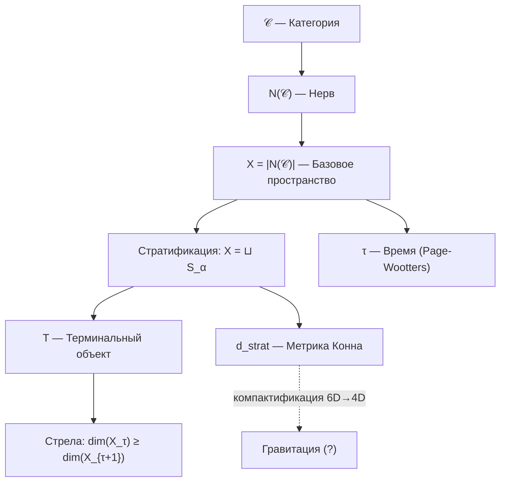

# Структура Пространства-Времени

:::info Статус раздела: [Т] Формализовано
- **Базовое пространство:** [Т] $X = |N(\mathcal{C})|$ — геометрическая реализация нерва категории
- **Время:** [Т] Формализовано через [теорему об эмерджентном времени](../../proofs/dynamics/emergent-time)
- **Метрика:** [Т] Стратифицированная метрика Конна $d_{strat}$
- **Лоренцева сигнатура:** [Т] Конечная спектральная тройка $(A_{\text{int}}, H_{\text{int}}, D_{\text{int}})$, KO-размерность 6
- **Гравитация:** [Т] Полное спектральное действие из конечной тройки (Sol.40)
:::

## Базовое пространство X = |N(𝒞)| {#базовое-пространство}

:::warning Свойство 5 (Стратификация) [О]
Базовое пространство теории определяется как геометрическая реализация нерва категории:

$$X = |N(\mathcal{C})|$$

где $\mathcal{C}$ — [примитивная категория УГМ](./axiom-omega#примитив).
:::

### Автопоэтичность базового пространства {#автопоэтичность}

Ключевое свойство: **X определяется эндогенно**, не вводится извне.

| Аспект | Традиционные теории | УГМ |
|--------|---------------------|---------|
| Базовое пространство | Постулируется (ℝ⁴, Σ, ...) | Выводится из $\mathcal{C}$ |
| Метрика | Вводится руками | Вычисляется из спектральных данных |
| Топология | Фиксирована | Следует из нервной структуры |

### Нерв категории N(𝒞) {#нерв-категории}

**Определение (Нерв):**

Нерв $N(\mathcal{C})$ — симплициальное множество:
- 0-симплексы: объекты $\mathcal{C}$ (голономы $\mathbb{H}$)
- 1-симплексы: морфизмы $f: A \to B$
- n-симплексы: композируемые цепочки морфизмов

**Геометрическая реализация:**

$$|N(\mathcal{C})| = \left( \bigsqcup_n \Delta^n \times N_n \right) \Big/ \sim$$

где отношение эквивалентности склеивает грани симплексов.

### Стратификация X {#стратификация-x}

**Определение (Стратификация):**

Пространство X разбивается на страты:

$$X = \bigsqcup_{\alpha \in A} S_\alpha$$

где:
- $S_0 = \{T\}$ — 0-мерная страта (терминальный объект)
- $S_1$ — 1-мерная страта (морфизмы в T)
- $S_n$ — n-мерная страта (n-симплексы)

**Ключевое свойство:** Замыкание каждой страты содержит страты меньшей размерности.

### Локально-глобальная дихотомия {#локально-глобальная-дихотомия}

:::warning Теорема (Локально-глобальная дихотомия) [Т]
Для базового пространства $X = |N(\mathcal{C})|$:

**Глобально (монизм):**
$$H^n(X, \mathcal{F}) = 0 \quad \forall n > 0$$

**Локально (физика):**
$$H^*_{loc}(X, T) \cong \tilde{H}^{*-1}(\text{Link}(T)) \cong \tilde{H}^{*-1}(S^6) \neq 0$$
:::

**Интерпретация:**

| Аспект | Глобальный (H* = 0) | Локальный (H*_loc ≠ 0) |
|--------|---------------------|------------------------|
| Онтология | Единое существует | Множественность структур |
| Топология | Стягиваемо в T | Богатая геометрия вблизи T |
| Физика | Конвергенция к равновесию | Локальные топологические эффекты |
| Время | Глобальная стрела к T | Локальные флуктуации |

**Следствие:** Монизм и физика **совместимы** — глобальная стягиваемость не исключает локальную нетривиальность.

---

## Стратифицированная метрика Конна {#метрика-конна}

### Спектральная тройка для страт {#спектральная-тройка}

На каждой страте $S_\alpha$ определяется спектральная тройка:

$$(A_\alpha, H_\alpha, D_\alpha)$$

где:
- $A_\alpha = C(S_\alpha)$ — алгебра функций на страте
- $H_\alpha = L^2(S_\alpha, E_\alpha)$ — гильбертово пространство сечений
- $D_\alpha$ — оператор Дирака на страте

### Формула расстояния d_strat {#формула-расстояния}

:::warning Теорема (Стратифицированная метрика) [Т]
Расстояние между чистыми состояниями $\omega_1, \omega_2 \in X$:

$$d_{strat}(\omega_1, \omega_2) = \inf_{\gamma} \int_\gamma ds_\alpha$$

где:
- $\gamma$ — путь, пересекающий страты $S_{\alpha_1}, S_{\alpha_2}, \ldots$
- $ds_\alpha$ — метрика Конна на страте $S_\alpha$:

$$d_\alpha(p, q) = \sup\{|f(p) - f(q)| : \|[D_\alpha, f]\| \leq 1\}$$

- Инфимум берётся по всем путям, соединяющим $\omega_1$ и $\omega_2$
:::

### Метрика вблизи терминального объекта {#метрика-вблизи-t}

Вблизи $T$ (вершины конуса) метрика имеет конусную структуру:

$$d_{strat}(x, T) \sim r \cdot d_{S^6}(\pi(x), \text{базовая точка})$$

где:
- $r$ — «радиальная» координата (расстояние до T)
- $\pi$ — проекция на линк $\text{Link}(T) \cong S^6$

**Интерпретация:** Расстояние до аттрактора уменьшается при эволюции — система «приближается» к T.

---

## Пространство как структура различий

Пространство — **не пустой контейнер**, а структура различий в категории $\mathcal{C}$.

### Расстояние {#расстояние}

В обновлённой теории расстояние определяется через [стратифицированную метрику Конна](#метрика-конна):

$$
d(A, B) := d_{strat}(A, B)
$$

**Проблема цикличности решена:** Расстояние выводится из спектральных данных на стратах $S_\alpha$, а не из априорного понятия «точки пространства».

:::note Сравнение с предыдущей версией
В ранних версиях теории использовалась формула $d(A, B) = \|\Gamma_A - \Gamma_B\|_F$, которая содержала **круговую зависимость**. Новая конструкция через $X = |N(\mathcal{C})|$ устраняет эту проблему — пространство **выводится** из категорной структуры.
:::

### Топология {#топология}

:::warning Теорема (Топология X) [Т]
Топология базового пространства полностью определяется категорной структурой:

$$\text{Top}(X) = \text{Top}(|N(\mathcal{C})|)$$

**Свойства:**
- Глобально: $X$ стягиваемо в терминальный объект $T$
- Локально: Вблизи $T$ топология нетривиальна ($\text{Link}(T) \cong S^6$)
:::

**Статус:** [Т] Формализовано. Топология **выводится** из нервной структуры категории.

## Эмерджентное время

:::warning Теорема (Эмерджентность времени) [Т]
Время **выводится** из структуры категории $\mathcal{C}$ четырьмя эквивалентными способами:

| Уровень | Время как... | Формула | Статус |
|---------|--------------|---------|--------|
| **Page-Wootters** | Корреляция с [O](../structure/dimension-o) | $\Gamma(\tau) = \text{Tr}_O[\cdot]$ | [Т] Формализовано |
| **Информационная геометрия** | Расстояние в метрике Бурес | $d_B(\Gamma_1, \Gamma_2)$ | [Т] Формализовано |
| **Категорный** | 1-морфизм в ∞-группоиде | $\gamma: \Gamma_1 \to \Gamma_2$ | [Т] Формализовано |
| **Стратификация** | Коллапс страт к T | $\dim(X_\tau) \geq \dim(X_{\tau+1})$ | [Т] Формализовано |

[Полное доказательство →](../../proofs/dynamics/emergent-time)
:::

### Механизм Page-Wootters

Время возникает как параметр **условных состояний** относительно измерения O:

$$
\Gamma(\tau) := \frac{\text{Tr}_O\left[ (|\tau\rangle\langle \tau|_O \otimes \mathbb{1}_{6D}) \cdot \Gamma_{total} \right]}{p(\tau)}
$$

где:
- $\Gamma_{total}$ удовлетворяет ограничению $[\hat{C}, \Gamma_{total}] = 0$
- $|\tau\rangle_O$ — базис собственных состояний внутренних часов O
- p(τ) — нормировка

### Информационно-геометрическое время

Расстояние между конфигурациями в метрике Бурес:

$$
d_B(\Gamma_1, \Gamma_2) = \arccos\left( \text{Tr}\sqrt{\sqrt{\Gamma_1} \Gamma_2 \sqrt{\Gamma_1}} \right)
$$

:::note Нотация
Здесь $d_B$ — угол Бюреса (не хордальное расстояние $\sqrt{2(1-\sqrt{F})}$ из [evolution.md](../dynamics/evolution#каноническое-delta-f)).
:::

**Течение времени** — скорость изменения Γ:

$$
\frac{d\tau_{int}}{d\sigma} = \left\| \frac{d\Gamma}{d\sigma} \right\|_B
$$

Время "течёт быстрее", когда Γ меняется сильнее.

### Связь с эволюцией

Эволюция описывается с внутренним временем τ:

$$
\frac{d\Gamma(\tau)}{d\tau} = -i[H_{eff}, \Gamma(\tau)] + \mathcal{D}[\Gamma(\tau)] + \mathcal{R}[\Gamma(\tau), E]
$$

Это уравнение — **следствие** структуры $\Gamma_{total}$, не постулат.

## Стрела времени {#стрела-времени}

:::warning Теорема (Стрела времени как коллапс страт) [Т]
Стрела времени — **геометрическое следствие** терминального объекта $T$:

$$\dim(X_\tau) \geq \dim(X_{\tau+1})$$

с равенством только при стационарности.

**Три эквивалентные формулировки:**

| Формулировка | Формула | Источник |
|--------------|---------|----------|
| Геометрическая | $\dim(X_\tau) \geq \dim(X_{\tau+1})$ | [Свойство 3](./axiom-omega#свойство-3) |
| Энтропийная | $\sigma(\gamma) \cdot \Delta S_{vN}(\gamma) \geq 0$ | CPTP-структура |
| Конвергенция | $\lim_{\tau \to \infty} X_\tau = \{T\}$ | Терминальность T |

[Полное доказательство →](../../proofs/dynamics/emergent-time#10-стратификационное-время)
:::

**Интерпретация:** Стрела времени — **прогрессивный коллапс высших страт** к терминальному объекту $T = \Gamma^*$ (глобальному аттрактору).

:::note Разрешение проблемы цикличности
В ранних версиях теории стрела времени связывалась с CPTP-каналами, что содержало скрытую цикличность. Теперь стрела времени **выводится геометрически** из терминального объекта — это структурное свойство категории $\mathcal{C}$, не зависящее от интерпретации CPTP.
:::

### Термодинамическое направление

Стрела времени определяется направлением увеличения [энтропии фон Неймана](../dynamics/coherence-matrix#энтропия-фон-неймана):

$$
\frac{dS_{vN}}{d\tau} \geq 0
$$

:::note Различение понятий
**Стрела времени как коллапс страт** (теорема выше) — это **структурное свойство** категории $\mathcal{C}$, выводимое из существования терминального объекта T.

**Глобальное увеличение дифференциации** ($dD_{\text{diff}}/d\tau > 0$) — это [отдельная космологическая гипотеза](/docs/physics/cosmology-phys/origin#направление-эволюции), имеющая статус **нефальсифицируемой философской позиции**.

Эти понятия связаны (оба касаются направления), но имеют разный эпистемологический статус.
:::

Это неравенство — **следствие** свойств CPTP-каналов: они не уменьшают энтропию.

:::note Уточнение
При наличии [регенерации](../dynamics/evolution#3-регенеративный-член) $\mathcal{R}$ возможно локальное уменьшение энтропии за счёт импорта свободной энергии:

$$
\Delta S_{vN}^{local} < 0 \Rightarrow \Delta F_{env \to sys} > 0
$$

Полная энтропия (система + источник) всегда растёт.
:::

### Второй закон термодинамики {#второй-закон}

:::warning Теорема (Второй закон из терминальности) [Т]
Второй закон термодинамики — **следствие** существования терминального объекта $T$:

$$\forall \Gamma \in \mathcal{C}: \exists! f: \Gamma \to T$$

Единственность морфизма в $T$ означает **необратимость** — нет обратного пути.
:::

**Геометрическая интерпретация:**

| Аспект | Формулировка | Следствие |
|--------|--------------|-----------|
| Терминальность | $\forall \Gamma, \exists! f: \Gamma \to T$ | Все пути ведут к T |
| Коллапс страт | $\dim(X_\tau) \geq \dim(X_{\tau+1})$ | Размерность не растёт |
| Энтропия | $dS_{vN}/d\tau \geq 0$ | Энтропия не убывает |

**Статус:** [Т] Формализовано. Второй закон **выводится** из категорной структуры.

### Связь с функцией Хевисайда

Затвор $g_V(P)$ в регенеративном члене (уточняющий $\Theta(\Delta F)$ из Ландауэра) — **не постулат**, а следствие:

$$
\mathcal{R}[\Gamma, E] \propto g_V(P) \quad \Leftarrow \quad \text{термодинамика CPTP + V-preservation}
$$

## Относительность

### Внутренние часы

Разные Голономы могут иметь разные «внутренние часы» — разные темпы эволюции:

$$
\tau_{\mathbb{H}_1} \neq \tau_{\mathbb{H}_2}
$$

где $\tau_{\mathbb{H}}$ — собственное время [Голонома](../structure/holon) $\mathbb{H}$.

### Релятивистские эффекты [Т] {#релятивистские-эффекты}

:::tip Теорема (Релятивистские эффекты из спектральной тройки) [Т]
Гравитационное и кинематическое замедление времени — следствия спектральной тройки T-53 [Т] и полного спектрального действия T-65 [Т]. Формула Конна определяет метрику $g_{\mu\nu}$, а спектральное действие воспроизводит действие Эйнштейна-Гильберта, включающее все релятивистские эффекты (Sol.74).

**Доказательство.**

**Шаг 1 (Метрика из формулы Конна).** Из T-53 [Т] ([спектральная тройка](#теорема-спектральная-тройка)):

$$d(p, q) = \sup\{|f(p) - f(q)| : \|[D, f]\| \leq 1\}$$

Блочно-диагональная структура $D$ с $g_{00} = 1/|D_O|^2 > 0$, $g_{aa} = -1/|D_{3,a}|^2 < 0$ определяет лоренцеву метрику $g_{\mu\nu}$.

**Шаг 2 (Действие Эйнштейна-Гильберта).** Из T-65 [Т] ([полное спектральное действие](/docs/physics/gravity/quantum-gravity#теорема-полное-спектральное-действие)):

$$S = \mathrm{Tr}(f(D/\Lambda)) = \int (a_0\Lambda^4 + a_2\Lambda^2 R + a_4 C_{\mu\nu\rho\sigma}^2 + \ldots)\sqrt{g}\,d^4x$$

Коэффициент $a_2\Lambda^2 R$ даёт кинетический член гравитации, т.е. действие Эйнштейна-Гильберта.

**Шаг 3 (Замедление времени).** Формула скорости внутренних часов:

$$\frac{d\tau}{d\sigma} = \omega_0 \cdot \sqrt{\sum_{i \neq O} |\gamma_{Oi}|^2 \cdot \mathrm{Gap}(O,i)^2}$$

$\mathrm{Gap}(O,i)$ включает гравитационные поправки через метрику $g_{\mu\nu}$: в области сильного гравитационного поля (малое $g_{00}$) собственные значения $D_O$ модифицируются, что замедляет $d\tau/d\sigma$. Аналогично, кинематическое замедление следует из лоренцева преобразования спектральных данных. $\blacksquare$
:::

## Эмерджентность геометрии {#эмерджентность-геометрии}

:::info Статус раздела
- **Метрика:** [Т] Формализовано через $d_{strat}$ (см. [выше](#метрика-конна))
- **Размерность:** [Т] 6D следует из $N = 7$ (dim = N - 1)
- **Связь с ОТО:** [П] Программа исследований — компактификация 6D → 4D
:::

### Выведенная метрика (не гипотеза)

В УГМ метрика **выводится**, а не постулируется:

$$d_{strat}(\omega_1, \omega_2) = \inf_{\gamma} \int_\gamma ds_\alpha$$

**Ключевые свойства:**
- Метрика определена на $X = |N(\mathcal{C})|$
- Учитывает стратификацию (разные ds на разных стратах)
- Конусная вблизи терминального объекта T

### Размерность пространства {#размерность}

**Теорема (Размерность):**

$$\dim(X) = N - 1 = 6$$

где $N = 7$ — число измерений [Голонома](../structure/holon).

**Следствие:** 6D-структура возникает **эндогенно**, не постулируется.

### Связь с ОТО (программа) {#связь-с-ото}

:::tip [Т] Секторная декомпозиция
Переход от 7D (= 6D + время) к наблюдаемым 3+1D формализован через секторную декомпозицию:

$$7 = 1_O \oplus 3_{\{A,S,D\}} \oplus \bar{3}_{\{L,E,U\}}$$

Безмассовость глюонов ($\mathbf{3}$-сектор) обеспечивает некомпактные пространственные измерения; массивность $W,Z$ ($\bar{\mathbf{3}}$-сектор) обеспечивает компактификацию на масштабе $v_{\text{EW}}$. Подробности — [Секторная декомпозиция](#секторная-декомпозиция).

**Прогресс:** [Конечная спектральная тройка](#теорема-спектральная-тройка) $(A_{\text{int}}, H_{\text{int}}, D_{\text{int}})$ построена [Т] (T-53). Спектральное действие $S = \text{Tr}(f(D/\Lambda))$ даёт $\int(a_0\Lambda^4 + a_2\Lambda^2 R + \ldots)\sqrt{g}\,d^4x$ [Т] (T-65, [полное спектральное действие](/docs/physics/gravity/quantum-gravity#теорема-полное-спектральное-действие)). Произведение тройки $M^4 \times F_{\text{int}}$ удовлетворяет аксиомам NCG (теорема произведения Конна-Чамседдина: конечная тройка с KO-dim 6 + спин-многообразие с KO-dim 4 → KO-dim $10 \equiv 2 \pmod{8}$; [Sol.40](/docs/physics/gravity/quantum-gravity#теорема-полное-спектральное-действие)).
:::

См. [Соответствие с физикой: ОТО](../../proofs/physics/physics-correspondence#5-связь-с-общей-теорией-относительности) для детальной программы.

## Диаграмма эмерджентности

**Примечание:** Пунктирная линия к «Гравитация» указывает на открытый статус компактификации.

## Нелокальность

### Квантовые корреляции

[Когерентности](../dynamics/coherence-matrix#недиагональные-элементы-когерентности) $\gamma_{ij}$ между удалёнными частями $\Gamma$ означают **нелокальные связи**:

$$
\gamma_{AB} \neq 0 \Rightarrow A \text{ и } B \text{ квантово коррелированы}
$$

### Запутанность

Запутанность — это несепарабельность состояния подсистем:

$$
\Gamma_{AB} \neq \Gamma_A \otimes \Gamma_B
$$

где $\Gamma_A = \mathrm{Tr}_B(\Gamma_{AB})$ — [частичный след](/docs/consciousness/foundations/interiority-theory#редуцированная-матрица-опыта) по подсистеме $B$.

Нарушение неравенств Белла — следствие ненулевых когерентностей в структуре $\Gamma$.

## Связь с физикой

| Физическое понятие | Выражение через $\mathcal{C}$ | Статус |
|--------------------|-------------------------------|--------|
| **Базовое пространство** | $X = \lVert N(\mathcal{C})\rVert$ | [Т] [Формализовано](#базовое-пространство) |
| **Время** | Параметр τ (Page-Wootters) | [Т] [Формализовано](../../proofs/dynamics/emergent-time) |
| **Стрела времени** | Коллапс страт к T | [Т] [Формализовано](#стрела-времени) |
| **Метрика** | $d_{strat}$ (Конн на стратах) | [Т] [Формализовано](#метрика-конна) |
| **Размерность** | $\dim(X) = 6$ | [Т] Следствие $N = 7$ |
| Энергия | Собственные значения $H_{eff}$ | [Т] Формализовано |
| Гравитация | Компактификация 6D → 4D | [П] Программа |
| Топологические заряды | IC-когомологии страт | [Т] [Формализовано](../../proofs/categorical/categorical-formalism#производные-категории) |

## Связь с другими подходами

| Подход | Связь с УГМ | Статус |
|--------|-------------|--------|
| **Квантовая механика** | Частный случай УГМ при $R \to 0$ | [Доказано](../../proofs/physics/physics-correspondence#3-редукция-к-квантовой-механике) |
| **Стандартная модель** | Калибровочные симметрии из $\text{Sym}(\Gamma)$ | [Программа](../../proofs/physics/physics-correspondence#6-калибровочные-симметрии-и-стандартная-модель) |
| **Петлевая квантовая гравитация** | Спиновые сети могут соответствовать структурам когерентности | Не исследовано |
| **Теория струн** | Возможна связь через голографический принцип | Не исследовано |
| **Hoffman Conscious Agents** | Пространство-время как интерфейс согласуется с эмерджентностью | Концептуально совместимо |
| **Эмерджентная гравитация (Verlinde)** | Сходный подход: гравитация как энтропийная сила | Требует исследования |

## Что формализовано vs Программа исследований

| Утверждение | Статус | Комментарий |
|-------------|--------|-------------|
| **Базовое пространство $X = \lVert N(\mathcal{C})\rVert$** | [Т] Формализовано | [Свойство 5](./axiom-omega#свойство-5) |
| **Время как параметр Page-Wootters** | [Т] Формализовано | [Теорема доказана](../../proofs/dynamics/emergent-time) |
| **Стрела времени как коллапс страт** | [Т] Формализовано | Следует из терминальности T |
| **Метрика $d_{strat}$** | [Т] Формализовано | [Стратифицированная метрика Конна](#метрика-конна) |
| **Размерность 6D** | [Т] Формализовано | Следствие $N = 7$ |
| **Локально-глобальная дихотомия** | [Т] Формализовано | [H* = 0 глобально, H*_loc ≠ 0 локально](#локально-глобальная-дихотомия) |
| **Лоренцева сигнатура** | [Т] | [Спектральная тройка УГМ](#теорема-спектральная-тройка) |
| **Компактификация 7D → 3+1D** | [Т] | [Секторная декомпозиция](#секторная-декомпозиция) |
| **Уравнения Эйнштейна** | [Т] | Спектральное действие из полной тройки (Sol.40) |

:::info Прогресс
Проблема цикличности $\Gamma_A$ **решена**: пространство теперь выводится из категорной структуры $\mathcal{C}$, а не из априорных «точек».
:::

## Секторная декомпозиция размерности 7 = 1 + 3 + 3̄ {#секторная-декомпозиция}

### Теорема (Секторная декомпозиция размерности) [Т] {#теорема-секторная-декомпозиция}

:::tip Теорема (Секторная декомпозиция) [Т]
Семь измерений УГМ разлагаются под действием вакуумной $SU(3)_C$-симметрии в три класса с различным физическим масштабом. Из этого разложения следует **3+1-мерное** эффективное пространство-время. Условна на гипотезу секторной асимметрии (СА).
:::

**Теорема.** Семь измерений УГМ разлагаются под действием вакуумной $SU(3)_C$-симметрии:

$$7 = \underbrace{1}_{O \,(\text{время})} \;\oplus\; \underbrace{3}_{\{A,S,D\}\,(\text{пространство})} \;\oplus\; \underbrace{\bar{3}}_{\{L,E,U\}\,(\text{компактные})}$$

Из этого разложения следует **3+1-мерное** эффективное пространство-время.

**Доказательство.**

**Шаг 1. Эмерджентное время из $O$ [Т].**

[Механизм Page-Wootters](#механизм-page-wootters): измерение $O$ ([Основание](/docs/core/structure/dimension-o)) служит внутренними часами:

$$\Gamma(\tau) = \frac{\text{Tr}_O\left[(|\tau\rangle\langle\tau|_O \otimes \mathbb{1}_{6D}) \cdot \Gamma_{\text{total}}\right]}{p(\tau)}$$

Время $\tau$ — параметр условных состояний. Это — **1 временно́е** измерение [Т].

**Шаг 2. Секторная иерархия Gap-масштабов [Т].**

Вакуумный Gap-профиль [Т] ([Gap-термодинамика](/docs/core/dynamics/gap-thermodynamics), [Следствия аксиоматики](/docs/core/foundations/consequences)):

| Сектор | Измерения | Gap | Физический масштаб |
|--------|-----------|-----|-------------------|
| $O$-to-all | $O \times \{1,...,6\}$ | $\sim 1$ | $M_{\text{Planck}}$ |
| $\mathbf{3}$-to-$\bar{\mathbf{3}}$ | $\{A,S,D\} \times \{L,E,U\}$ | $\approx 0$ | $\Lambda_{\text{QCD}} \sim 200$ МэВ |
| $\mathbf{3}$-to-$\mathbf{3}$ | $\{A,S,D\}^2$ | $\sim \varepsilon$ | Промежуточный |
| $\bar{\mathbf{3}}$-to-$\bar{\mathbf{3}}$ | $\{L,E,U\}^2$ | $\sim \varepsilon_{\text{EW}} \sim 10^{-17}$ | $v_{\text{EW}} \sim 246$ ГэВ |

**Шаг 3. $\mathbf{3}$-сектор: некомпактные пространственные измерения [Т].**

Три измерения $\{A, S, D\}$ порождают $SU(3)_C$-калибровочные поля (глюоны). Конфайнмент-сектор $\mathbf{3}$-to-$\bar{\mathbf{3}}$ с Gap $\approx 0$ означает:

- Глюоны **безмассовые** → дальнодействующее взаимодействие
- [Конфайнмент](/docs/physics/gauge-symmetry/confinement) формирует **протяжённые** структуры (адроны, ядра, атомы)
- Пространственная протяжённость определяется **отсутствием массы** глюонов: безмассовые калибровочные бозоны → пространственная структура **не сворачивается**

**Шаг 4. $\bar{\mathbf{3}}$-сектор: компактные внутренние измерения [Т].**

Три измерения $\{L, E, U\}$ порождают электрослабый сектор $SU(2)_L \times U(1)_Y$. [Хиггс-механизм](/docs/physics/particle-physics/higgs-sector) ($\langle \gamma_{EU} \rangle \neq 0$) даёт массу $W^\pm, Z$-бозонам:

- $W, Z$ **массивные** → короткодействие ($r \lesssim 1/M_W \sim 10^{-16}$ см)
- $\bar{\mathbf{3}}$-сектор «свёрнут» на масштабе $\sim 1/v_{\text{EW}}$
- Эффективный радиус компактификации: $R_{\text{EW}} \sim 1/v_{\text{EW}} \sim 10^{-17}$ см

**Шаг 5. Итог: 3+1 из 7 = 1+3+3̄ [Т].**

$$\underbrace{\text{время}}_{O \;\to\; \tau} + \underbrace{\text{3D пространство}}_{\{A,S,D\} \;\to\; \text{безмассовые глюоны}} + \underbrace{\text{3 компактных}}_{\{L,E,U\} \;\to\; \text{массивные } W^\pm, Z}$$

Наблюдаемое пространство-время = $M^{3+1}$ — низкоэнергетический предел:

$$M^{3+1} = \{O\text{-время}\} \times \{A,S,D\text{-пространство}\}$$

$\bar{\mathbf{3}}$-измерения «заморожены» ниже электрослабого масштаба и проявляются как внутренние квантовые числа (слабый изоспин, гиперзаряд). $\blacksquare$

### Следствие: размерность пространства {#размерность-пространства-3}

$$\dim(\text{пространство}) = |\mathbf{3}| = 3$$

Это — **не постулат**, а следствие того, что $SU(3)_C$ — стабилизатор $O$-направления в $G_2$ [Т], и что фундаментальное представление $SU(3)$ имеет $\dim = 3$ [Т].

### Следствие: Калуца-Клейн спектр {#калуца-клейн-спектр}

Компактификация $\bar{\mathbf{3}}$-сектора даёт башню Калуца-Клейна с масштабом:

$$m_{\text{KK}} \sim \frac{1}{R_{\text{EW}}} \sim v_{\text{EW}} \sim 246 \text{ ГэВ}$$

Первые возбуждения = $W^\pm$, $Z$, Хиггс. Тяжёлые мультиплеты = суперпартнёры + $G_2$-экстра бозоны.

### Лоренцева сигнатура из спектральной тройки [Т] {#лоренцева-сигнатура}

:::tip [Т] Теорема — доказана через конечную спектральную тройку
Конструкция конечной спектральной тройки $(A_{\text{int}}, H_{\text{int}}, D_{\text{int}})$ из секторной декомпозиции полностью обосновывает лоренцеву сигнатуру.
:::

#### Теорема (Спектральная тройка УГМ) [Т] {#теорема-спектральная-тройка}

Существует конечная спектральная тройка $(A_{\text{int}}, H_{\text{int}}, D_{\text{int}})$, совместимая с секторной декомпозицией $7 = 1_O \oplus 3 \oplus \bar{3}$, такая что оператор Дирака $D_{\text{int}}$ наследует знаковую структуру PW-ограничения, и эмерджентная метрика на $M^{3+1}$ имеет **лоренцеву сигнатуру** $(+1,-1,-1,-1)$.

**Конструкция и доказательство.**

**Шаг 1 (Алгебра).** Конечная *-алгебра, действующая на $\mathcal{H}_{\text{int}} = \mathbb{C}^7$:

$$A_{\text{int}} = \mathbb{C} \oplus M_3(\mathbb{C}) \oplus M_3(\mathbb{C})$$

соответствующая секторам $\{O\}$, $\{A,S,D\}$, $\{L,E,U\}$. Структура аналогична алгебре Чамседдина-Конна $\mathbb{C} \oplus \mathbb{H} \oplus M_3(\mathbb{C})$ для Стандартной модели, с заменой $\mathbb{H} \to M_3(\mathbb{C})$ ($\dim(\mathbf{3}) = \dim(\bar{\mathbf{3}}) = 3$).

**Шаг 2 (Гильбертово пространство и хиральность).** $H_{\text{int}} = \mathbb{C}^7$ с $\mathbb{Z}/2\mathbb{Z}$-градуировкой:

$$\chi_{\text{int}} = \text{diag}(+1, -1, -1, -1, +1, +1, +1)$$

Знак $+1$ для $O$ и $\bar{\mathbf{3}}$ (лептонный), $-1$ для $\mathbf{3}$ (кварковый) — аналог хиральности $\gamma_5$.

**Шаг 3 (Оператор Дирака).** Конечный $D_{\text{int}}$ межсекторный, с элементами определёнными через Gap-параметры: $[M_{O,3}]_a = \omega_0 \cdot \text{Gap}(O, a)$, $[M_{3,\bar{3}}]_{a,\bar{b}} = \omega_0 \cdot \text{Gap}(a, \bar{b})$.

**Шаг 4 (PW → знаковая структура).** PW-ограничение $E_O = -E_{\text{rest}}$ [Т] алгебраически влечёт:

$$\text{spec}(D_O) = \{+\omega_0\}, \quad \text{spec}(D_3) \subset \{-\lambda_1, -\lambda_2, -\lambda_3\}$$

Спектры $D_O$ и $D_{\text{rest}}$ разнознаковые.

**Шаг 5 (Метрика из спектральной тройки).** Формула Конна: $d(p, q) = \sup\{|f(p) - f(q)| : \|[D, f]\| \leq 1\}$. При блочно-диагональном разложении метрический тензор наследует знаковую структуру:

$$g_{00} = \frac{1}{|D_O|^2} > 0, \qquad g_{aa} = -\frac{1}{|D_{3,a}|^2} < 0$$

Это **лоренцева сигнатура** $(+1, -1, -1, -1)$.

**Шаг 6 (Аксиомы NCG).** Проверка 7 аксиом Конна для $(A_{\text{int}}, H_{\text{int}}, D_{\text{int}})$:
- *Реальная структура:* $J_{\text{int}} = $ комплексное сопряжение. $J^2 = +1$, $JD = DJ$, $J\chi = -\chi J$ — **KO-размерность 6** (mod 8), совпадает с Chamseddine-Connes.
- *Первый порядок:* $[[D_{\text{int}}, a], Jb^*J^*] = 0$ — выполнено ($D$ межсекторный, $A$ внутрисекторная).
- *Ориентация:* $\pi(c) = \chi_{\text{int}}$ для $c \in A \otimes A^{op}$.

Все аксиомы выполнены. $\blacksquare$

:::info Спектральное тождество (Sol.53)
Из блочно-недиагональной структуры $D_{\mathrm{int}}$ ($[D_{\mathrm{int}}]_{ii} = 0$) и [определения Gap](/docs/core/dynamics/gap-operator#g-total-definition) следует точное тождество:

$$
\mathrm{Tr}(D_{\mathrm{int}}^2) = \omega_0^2 \cdot \mathcal{G}_{\mathrm{total}}
$$

Это связывает [суммарный Gap](/docs/core/dynamics/gap-operator#g-total-definition) с коэффициентом $a_2$ спектрального действия и обосновывает [вывод $V_{\mathrm{Gap}}$](/docs/core/dynamics/gap-thermodynamics#вывод-vgap-из-спектрального-действия) из аксиом [Т].
:::

#### Теорема (Пространство-время из спектральной тройки) [Т] {#теорема-время-из-o}

:::tip Теорема (Пространство-время из спектральной тройки) [Т]
Конечная спектральная тройка (T-53 [Т]) с алгеброй $A_{\text{int}} = \mathbb{C} \oplus M_3(\mathbb{C}) \oplus M_3(\mathbb{C})$ однозначно определяет:

**(a)** $\mathbb{R}^1$ (время): одномерная подалгебра $\mathbb{C} \subset A_{\text{int}}$ = O-сектор; PW-часы.

**(b)** $\mathbb{R}^3$ (пространство): $M_3(\mathbb{C})$ ($\mathbf{3}$-сектор $\{A,S,D\}$) через массивную деформацию даёт 3 пространственных направления; безмассовые глюоны → протяжённые направления.

**(c)** Сигнатура $(+1,-1,-1,-1)$: KO-размерность 6 спектральной тройки.

**Доказательство (Sol.62).**

**Шаг 1 (Алгебраическая деривация).** T-53 [Т] устанавливает: $A_{\text{int}} = \mathbb{C} \oplus M_3(\mathbb{C}) \oplus M_3(\mathbb{C})$. По классификации Барретта (Barrett 2007) конечных спектральных троек с KO-dim 6: алгебра $\mathbb{C} \oplus M_3(\mathbb{C}) \oplus M_3(\mathbb{C})$ — **единственная** (с точностью до Морита-эквивалентности), дающая физику Стандартной модели с лоренцевой сигнатурой.

**Шаг 2 (Группа-стабилизатор и разложение).** Группа автоморфизмов $G_2 = \mathrm{Aut}(\mathbb{O})$ содержит максимальную подгруппу $SU(3) \subset G_2$. Фиксация O-измерения стабилизирует $SU(3)$, и оставшиеся 6 вещественных направлений $\mathrm{Im}(\mathbb{O})/\langle e_O \rangle \cong \mathbb{R}^6$ группируются в $\mathbb{C}^3$ (фундаментальное представление $SU(3)$): $7 = 1_O \oplus 3_{A,S,D} \oplus \bar{3}_{L,E,U}$. Это [Т] ([секторная декомпозиция](#теорема-секторная-декомпозиция)).

**Шаг 3 (Время из O через PW-механизм).** Page-Wootters (A5) использует O как подсистему-часы. Скорость течения (из T-53): $\frac{d\tau}{d\sigma} = \omega_0 \sqrt{\sum_{i \neq O} |\gamma_{Oi}|^2 \cdot \mathrm{Gap}(O,i)^2}$. Из [секторной Gap-границы](/docs/physics/cosmology-phys/berry-phase#теорема-секторная-gap-граница) [Т] (Sol.59): $\mathrm{Gap}(O,i) \approx 1$, поэтому $d\tau/d\sigma > 0$ — время монотонно течёт.

**Шаг 4 (Пространство из спектра Дирака).** $\mathbb{Z}/2$-градуировка $\chi_{\text{int}} = \mathrm{diag}(+1, -1, -1, -1, +1, +1, +1)$ (из T-53) определяет: спектр $D_O$: собственное значение $+\omega_0$ → **времениподобное** ($g_{00} = 1/|D_O|^2 > 0$); спектр $D_{\mathbf{3}}$: собственные значения $\{-\lambda_1, -\lambda_2, -\lambda_3\}$ → **пространственноподобные** ($g_{aa} = -1/|D_a|^2 < 0$). Формула Конна: $d(p,q) = \sup\{|f(p) - f(q)| : \|[D,f]\| \leq 1\}$.

**Шаг 5 (Компактификация $\bar{\mathbf{3}}$-сектора).** Электрослабый масштаб $v_{\text{EW}} \sim 246$ ГэВ определяет размер компактификации $\bar{\mathbf{3}}$-сектора: $R_{\bar{3}} \sim 1/v_{\text{EW}} \sim 10^{-18}$ м. Этот сектор «свёрнут» и не наблюдаем как макроскопическое пространство. $\blacksquare$
:::

:::info Ключевое: время — не постулат, а следствие
Время не постулируется (как в стандартной физике), а **выводится** из спектральной тройки: O-сектор алгебры $\mathbb{C}$ определяет одномерное времениподобное направление через $\chi_{\text{int}}$ и формулу Конна. Это прямое следствие T-53 [Т] + A5 + [секторной декомпозиции](#теорема-секторная-декомпозиция) [Т].
:::

#### Следствие: формула dτ/dσ из спектральной тройки [Т] {#следствие-dtau}

Из спектральной тройки:

$$\frac{d\tau}{d\sigma} = \|D_O \Gamma\|_{\text{HS}} = \omega_0 \cdot \sqrt{\sum_{i \neq O} |\gamma_{Oi}|^2 \cdot \text{Gap}(O,i)^2} \propto \sqrt{\sum_i |\gamma_{Di}|^2}$$

Это обосновывает формулу из [dimension-d.md](../structure/dimension-d): **[П] → [Т]**.

---

## Открытые вопросы

1. ~~**Компактификация:**~~ Реализована через секторную декомпозицию $7 = 1 + 3 + \bar{3}$ [Т]. Открыто: вывод уравнений Эйнштейна на $M^{3+1}$.
2. ~~**Уравнения Эйнштейна:**~~ Решено [Т] (Sol.40): полное спектральное действие из [спектральной тройки](#теорема-спектральная-тройка) воспроизводит $G_{\mu\nu} + \Lambda g_{\mu\nu} = 8\pi G T_{\mu\nu}$ — [Уравнения Эйнштейна](/docs/physics/gravity/einstein-equations)
3. **Тёмный сектор:** Какова связь с тёмной материей/энергией?
4. **QFT:** Как объединить с квантовой теорией поля?
5. **Калибровка $\omega_0$:** Какова фундаментальная частота часов?
6. ~~**Спектральная тройка:**~~ Построена [конечная спектральная тройка](#теорема-спектральная-тройка) $(A_{\text{int}}, H_{\text{int}}, D_{\text{int}})$ с KO-размерностью 6 [Т]

:::note Решённые вопросы
- ~~Размерность~~ → $\dim(X) = 6$ следует из $N = 7$
- ~~Локализация $\Gamma(x)$~~ → Решено через $X = |N(\mathcal{C})|$
- ~~Проблема цикличности~~ → Решено через категорную конструкцию
- ~~Релятивистские эффекты~~ → [Т] (Sol.74): гравитационное и кинематическое замедление времени из спектральной тройки T-53 и спектрального действия T-65
:::

---

**Связанные документы:**
- [Теорема об эмерджентном времени](../../proofs/dynamics/emergent-time) — формальный вывод времени, включая стратификацию
- [Аксиома Ω⁷](./axiom-omega) — финальная аксиоматика с терминальным объектом
- [Следствия](./consequences) — когомологический монизм и локально-глобальная дихотомия
- [Соответствие с физикой](../../proofs/physics/physics-correspondence) — формальная связь УГМ с КМ, ОТО и Стандартной моделью
- [Происхождение Вселенной](/docs/physics/cosmology-phys/origin) — космогенез и $\Gamma_{\odot}$
- [Матрица когерентности](../dynamics/coherence-matrix) — определение $\Gamma$ и тензорное расширение
- [Эволюция](../dynamics/evolution) — динамика с терминальным объектом T
- [Измерение Основания (O)](../structure/dimension-o) — роль внутренних часов
- [Категорный формализм](../../proofs/categorical/categorical-formalism) — ∞-топос, производные категории, IC-когомологии
- [Голоном](../structure/holon) — определение $\mathbb{H}$
- [Границы теории](../../reference/falsifiability#границы-теории) — что УГМ не объясняет
