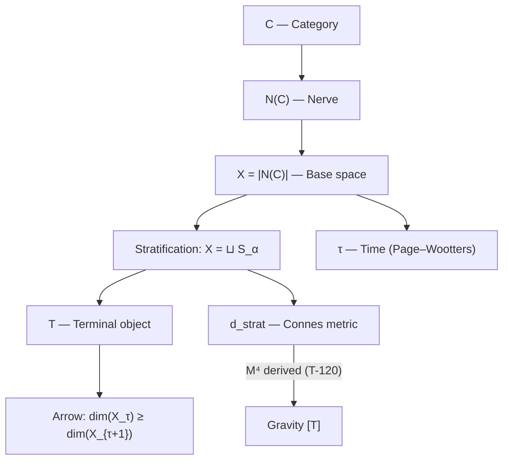

# Spacetime Structure

:::info Who this chapter is for
This chapter is one of the most remarkable in the theory. Space and time are **not postulated** — they are *derived* from the structure of the category $\mathcal{C}$. This means that the 3+1-dimensional world we inhabit is a **consequence**, not a premise, of the theory.

**Analogy: the chessboard.** Imagine that the rules of chess define the board, not the other way around. Usually we think: first there is a board (space), then pieces play on it (matter). In UHM it is the opposite: first there are the rules of interaction (category $\mathcal{C}$ with CPTP-morphisms), and from these rules it **follows** that the "board" has exactly 6 dimensions (with compactification to 3+1). If the rules were different — the "board" would be different. Spacetime is not an arena, but a consequence.

**What is concretely derived:**
- **Base space** $X = |N(\mathcal{C})|$ — from the nerve of the category (geometric realization of the simplicial set of objects and morphisms)
- **Time** — from the Page–Wootters mechanism (correlation with the O measurement) and stratification (collapse to the terminal object T)
- **Metric** — from Connes' spectral triple (distance formula via the Dirac operator)
- **Dimensionality** 6D = 7 - 1, with compactification to 3+1D via sectoral decomposition
- **Lorentzian signature** — from the KO-dimension of the finite spectral triple
- **Gravity** — from the full spectral action (Einstein equations as a consequence)
- **Background independence** — $M^4$ derived algebraically via the Gel'fand–Naimark–Connes chain ([T-117–T-120](/docs/proofs/physics/emergent-manifold))

This is a radical departure from standard physics, where spacetime is a given on which dynamics unfolds. In UHM dynamics *generates* spacetime.
:::

:::info Section status: [T] Formalized
- **Base space:** [T] $X = |N(\mathcal{C})|$ — geometric realization of the nerve of the category
- **Time:** [T] Formalized via the [emergent time theorem](../../proofs/dynamics/emergent-time)
- **Metric:** [T] Connes stratified metric $d_{strat}$
- **Lorentzian signature:** [T] Finite spectral triple $(A_{\text{int}}, H_{\text{int}}, D_{\text{int}})$, KO-dimension 6
- **Gravity:** [T] Full spectral action from the finite triple
- **Background independence:** [T] $M^4$ derived from categorical structure ([T-120](/docs/proofs/physics/emergent-manifold#теорема-произведение-троек))
:::

## Base space X = $|N(\mathcal{C})|$ {#базовое-пространство}

:::warning Property 5 (Stratification) [D]
The base space of the theory is defined as the geometric realization of the nerve of the category:

$$X = |N(\mathcal{C})|$$

where $\mathcal{C}$ is the [primitive UHM category](./axiom-omega#примитив).
:::

### Autopoiesis of the base space {#автопоэтичность}

Key property: **X is defined endogenously**, not introduced from outside.

| Aspect | Traditional theories | UHM |
|--------|---------------------|---------|
| Base space | Postulated (ℝ⁴, Σ, ...) | Derived from $\mathcal{C}$ |
| Metric | Introduced by hand | Computed from spectral data |
| Topology | Fixed | Follows from the nerve structure |

### Nerve of the category $N(\mathcal{C})$ {#нерв-категории}

**Definition (Nerve):**

The nerve $N(\mathcal{C})$ is a simplicial set:
- 0-simplices: objects of $\mathcal{C}$ (holons $\mathbb{H}$)
- 1-simplices: morphisms $f: A \to B$
- n-simplices: composable chains of morphisms

**Geometric realization:**

$$|N(\mathcal{C})| = \left( \bigsqcup_n \Delta^n \times N_n \right) \Big/ \sim$$

where the equivalence relation glues the faces of simplices.

### Stratification of X {#стратификация-x}

**Definition (Stratification):**

The space X is partitioned into strata:

$$X = \bigsqcup_{\alpha \in A} S_\alpha$$

where:
- $S_0 = \{T\}$ — 0-dimensional stratum (terminal object)
- $S_1$ — 1-dimensional stratum (morphisms into T)
- $S_n$ — n-dimensional stratum (n-simplices)

**Key property:** The closure of each stratum contains strata of lower dimension.

### Local-global dichotomy {#локально-глобальная-дихотомия}

:::warning Theorem (Local-global dichotomy) [T]
For the base space $X = |N(\mathcal{C})|$:

**Globally (monism):**
$$H^n(X, \mathcal{F}) = 0 \quad \forall n > 0$$

**Locally (physics):**
$$H^*_{loc}(X, T) \cong \tilde{H}^{*-1}(\text{Link}(T)) \cong \tilde{H}^{*-1}(S^6) \neq 0$$
:::

**Interpretation:**

| Aspect | Global (H* = 0) | Local (H*_loc ≠ 0) |
|--------|---------------------|------------------------|
| Ontology | The One exists | Multiplicity of structures |
| Topology | Contractible to T | Rich geometry near T |
| Physics | Convergence to equilibrium | Local topological effects |
| Time | Global arrow toward T | Local fluctuations |

**Consequence:** Monism and physics are **compatible** — global contractibility does not exclude local non-triviality.

---

## Connes stratified metric {#метрика-конна}

### Spectral triple for strata {#спектральная-тройка}

On each stratum $S_\alpha$ a spectral triple is defined:

$$(A_\alpha, H_\alpha, D_\alpha)$$

where:
- $A_\alpha = C(S_\alpha)$ — algebra of functions on the stratum
- $H_\alpha = L^2(S_\alpha, E_\alpha)$ — Hilbert space of sections
- $D_\alpha$ — Dirac operator on the stratum

### Distance formula d_strat {#формула-расстояния}

:::warning Theorem (Stratified metric) [T]
The distance between pure states $\omega_1, \omega_2 \in X$:

$$d_{strat}(\omega_1, \omega_2) = \inf_{\gamma} \int_\gamma ds_\alpha$$

where:
- $\gamma$ — a path crossing strata $S_{\alpha_1}, S_{\alpha_2}, \ldots$
- $ds_\alpha$ — Connes metric on stratum $S_\alpha$:

$$d_\alpha(p, q) = \sup\{|f(p) - f(q)| : \|[D_\alpha, f]\| \leq 1\}$$

- The infimum is taken over all paths connecting $\omega_1$ and $\omega_2$
:::

### Metric near the terminal object {#метрика-вблизи-t}

Near $T$ (the apex of the cone) the metric has a cone structure:

$$d_{strat}(x, T) \sim r \cdot d_{S^6}(\pi(x), \text{base point})$$

where:
- $r$ — the "radial" coordinate (distance to T)
- $\pi$ — projection onto the link $\text{Link}(T) \cong S^6$

**Interpretation:** The distance to the attractor decreases during evolution — the system "approaches" T.

---

## Space as a structure of differences

:::note Space is not a stage, but a relation
We are accustomed to thinking of space as a "stage" on which physics plays out: first there is an empty room (space), then objects are placed in it (matter). In UHM space is not a stage, but a *structure of differences between states*. The distance between two points is a measure of how hard it is to deform one state into another. If two states transition into each other easily — they are "close"; if this requires a major restructuring — they are "far." Space arises as a by-product of differences, not as their container. This resolves the fundamental problem of quantum gravity: if space is not a given but a consequence, its quantization does not lead to contradictions.
:::

Space is **not an empty container**, but a structure of differences in the category $\mathcal{C}$.

### Distance {#расстояние}

In the updated theory, distance is defined via the [Connes stratified metric](#метрика-конна):

$$
d(A, B) := d_{strat}(A, B)
$$

**The circularity problem is resolved:** The distance is derived from spectral data on the strata $S_\alpha$, not from an a priori notion of "points in space."

:::note Comparison with previous version
In early versions of the theory the formula $d(A, B) = \|\Gamma_A - \Gamma_B\|_F$ was used, which contained a **circular dependence**. The new construction via $X = |N(\mathcal{C})|$ eliminates this problem — space is **derived** from the categorical structure.
:::

### Topology {#топология}

:::warning Theorem (Topology of X) [T]
The topology of the base space is fully determined by the categorical structure:

$$\text{Top}(X) = \text{Top}(|N(\mathcal{C})|)$$

**Properties:**
- Globally: $X$ is contractible to the terminal object $T$
- Locally: Near $T$ the topology is non-trivial ($\text{Link}(T) \cong S^6$)
:::

**Status:** [T] Formalized. Topology is **derived** from the nerve structure of the category.

## Emergent time

:::note Time is not a river, but a correlation
In everyday experience time seems like a "river" carrying us from past to future. In UHM time is something entirely different. It **emerges** from correlations between subsystems. Imagine a clock and an observer as a single quantum system. "Time = 3 o'clock" means not "the river has reached mark 3," but "the state of the clock correlates with a certain state of the observer." The universe as a whole is *timeless* (satisfies the constraint $[\hat{C}, \Gamma_{\text{total}}] = 0$); time arises *within* it — as the relation of "the clock" (the O measurement) to "the rest" (6 dimensions). This is the solution to the "problem of time" in quantum gravity proposed by Page and Wootters in 1983.
:::

:::warning Theorem (Emergence of time) [T]
Time is **derived** from the structure of the category $\mathcal{C}$ in four equivalent ways:

| Level | Time as... | Formula | Status |
|---------|--------------|---------|--------|
| **Page–Wootters** | Correlation with [O](../structure/dimension-o) | $\Gamma(\tau) = \text{Tr}_O[\cdot]$ | [T] Formalized |
| **Information geometry** | Distance in the Bures metric | $d_B(\Gamma_1, \Gamma_2)$ | [T] Formalized |
| **Categorical** | 1-morphism in ∞-groupoid | $\gamma: \Gamma_1 \to \Gamma_2$ | [T] Formalized |
| **Stratification** | Collapse of strata to T | $\dim(X_\tau) \geq \dim(X_{\tau+1})$ | [T] Formalized |

[Full proof →](../../proofs/dynamics/emergent-time)
:::

### Page–Wootters mechanism {#механизм-page-wootters}

Time arises as the parameter of **conditional states** with respect to the O measurement:

$$
\Gamma(\tau) := \frac{\text{Tr}_O\left[ (|\tau\rangle\langle \tau|_O \otimes \mathbb{1}_{6D}) \cdot \Gamma_{total} \right]}{p(\tau)}
$$

where:
- $\Gamma_{total}$ satisfies the constraint $[\hat{C}, \Gamma_{total}] = 0$
- $|\tau\rangle_O$ — basis of eigenstates of the internal clock O
- p(τ) — normalization

### Information-geometric time

Distance between configurations in the Bures metric:

$$
d_B(\Gamma_1, \Gamma_2) = \arccos\left( \text{Tr}\sqrt{\sqrt{\Gamma_1} \Gamma_2 \sqrt{\Gamma_1}} \right)
$$

:::note Notation
Here $d_B$ is the Bures angle (not the chordal distance $\sqrt{2(1-\sqrt{F})}$ from [evolution.md](../dynamics/evolution#каноническое-delta-f)).
:::

**Flow of time** — the rate of change of Γ:

$$
\frac{d\tau_{int}}{d\sigma} = \left\| \frac{d\Gamma}{d\sigma} \right\|_B
$$

Time "flows faster" when Γ changes more strongly.

### Relation to evolution

Evolution is described with internal time τ:

$$
\frac{d\Gamma(\tau)}{d\tau} = -i[H_{eff}, \Gamma(\tau)] + \mathcal{D}[\Gamma(\tau)] + \mathcal{R}[\Gamma(\tau), E]
$$

This equation is a **consequence** of the structure of $\Gamma_{total}$, not a postulate.

## Arrow of time {#стрела-времени}

:::note Why time flows in one direction
The arrow of time is one of the deepest puzzles in physics. Why do we remember the past but not the future? Why does a broken cup not reassemble? In standard physics the arrow of time is associated with the growth of entropy (the second law of thermodynamics), but the second law itself is usually *postulated* or derived from the initial conditions of the Big Bang. In UHM it is simpler: the arrow of time is a **geometric consequence** of the existence of the terminal object $T$. If the category has a "final point" toward which everything tends (like the bottom of a funnel), then the direction — from the periphery to the center — is *defined by the structure*, not by initial conditions.
:::

:::warning Theorem (Arrow of time as collapse of strata) [T]
The arrow of time is a **geometric consequence** of the terminal object $T$:

$$\dim(X_\tau) \geq \dim(X_{\tau+1})$$

with equality only at stationarity.

**Three equivalent formulations:**

| Formulation | Formula | Source |
|--------------|---------|----------|
| Geometric | $\dim(X_\tau) \geq \dim(X_{\tau+1})$ | [Property 3](./axiom-omega#свойство-3) |
| Entropic | $\sigma(\gamma) \cdot \Delta S_{vN}(\gamma) \geq 0$ | CPTP structure |
| Convergence | $\lim_{\tau \to \infty} X_\tau = \{T\}$ | Terminality of T |

[Full proof →](../../proofs/dynamics/emergent-time#10-стратификационное-время)
:::

**Interpretation:** The arrow of time is the **progressive collapse of higher strata** to the terminal object $T = \Gamma^*$ (the global attractor).

:::note Resolution of the circularity problem
In early versions of the theory the arrow of time was linked to CPTP channels, which contained a hidden circularity. Now the arrow of time is **derived geometrically** from the terminal object — this is a structural property of the category $\mathcal{C}$, independent of the CPTP interpretation.
:::

### Thermodynamic direction

The arrow of time is defined by the direction of increase of the [von Neumann entropy](../dynamics/coherence-matrix#энтропия-фон-неймана):

$$
\frac{dS_{vN}}{d\tau} \geq 0
$$

:::note Distinction of concepts
**Arrow of time as collapse of strata** (theorem above) — this is a **structural property** of the category $\mathcal{C}$, derivable from the existence of the terminal object T.

**Global increase of differentiation** ($dD_{\text{diff}}/d\tau > 0$) — this is a [separate cosmological hypothesis](/docs/physics/cosmology-phys/origin#направление-эволюции), having the status of a **non-falsifiable philosophical position**.

These concepts are related (both concern direction), but have different epistemological status.
:::

This inequality is a **consequence** of the properties of CPTP channels: they do not decrease entropy.

:::note Clarification
In the presence of [regeneration](../dynamics/evolution#3-регенеративный-член) $\mathcal{R}$ a local decrease in entropy is possible due to the import of free energy:

$$
\Delta S_{vN}^{local} < 0 \Rightarrow \Delta F_{env \to sys} > 0
$$

The total entropy (system + source) always grows.
:::

### Second law of thermodynamics {#второй-закон}

:::warning Theorem (Second law from terminality) [T]
The second law of thermodynamics is a **consequence** of the existence of the terminal object $T$:

$$\forall \Gamma \in \mathcal{C}: \exists! f: \Gamma \to T$$

The uniqueness of the morphism into $T$ means **irreversibility** — there is no return path.
:::

**Geometric interpretation:**

| Aspect | Formulation | Consequence |
|--------|--------------|-----------|
| Terminality | $\forall \Gamma, \exists! f: \Gamma \to T$ | All paths lead to T |
| Collapse of strata | $\dim(X_\tau) \geq \dim(X_{\tau+1})$ | Dimensionality does not grow |
| Entropy | $dS_{vN}/d\tau \geq 0$ | Entropy does not decrease |

**Status:** [T] Formalized. The second law is **derived** from categorical structure.

### Relation to the Heaviside function

The gate $g_V(P)$ in the regenerative term (refining $\Theta(\Delta F)$ from Landauer) is **not a postulate**, but a consequence:

$$
\mathcal{R}[\Gamma, E] \propto g_V(P) \quad \Leftarrow \quad \text{thermodynamics of CPTP + V-preservation}
$$

## Relativity

### Internal clocks

Different Holons can have different "internal clocks" — different rates of evolution:

$$
\tau_{\mathbb{H}_1} \neq \tau_{\mathbb{H}_2}
$$

where $\tau_{\mathbb{H}}$ is the proper time of the [Holon](../structure/holon) $\mathbb{H}$.

### Relativistic effects [T] {#релятивистские-эффекты}

:::tip Theorem (Relativistic effects from spectral triple) [T]
Gravitational and kinematic time dilation are consequences of the spectral triple T-53 [T] and the full spectral action T-65 [T]. Connes' formula defines the metric $g_{\mu\nu}$, and the spectral action reproduces the Einstein–Hilbert action, which includes all relativistic effects.

**Proof.**

**Step 1 (Metric from Connes formula).** From T-53 [T] ([spectral triple](#теорема-спектральная-тройка)):

$$d(p, q) = \sup\{|f(p) - f(q)| : \|[D, f]\| \leq 1\}$$

The block-diagonal structure of $D$ with $g_{00} = 1/|D_O|^2 > 0$, $g_{aa} = -1/|D_{3,a}|^2 < 0$ defines the Lorentzian metric $g_{\mu\nu}$.

**Step 2 (Einstein–Hilbert action).** From T-65 [T] ([full spectral action](/docs/physics/gravity/quantum-gravity#теорема-полное-спектральное-действие)):

$$S = \mathrm{Tr}(f(D/\Lambda)) = \int (a_0\Lambda^4 + a_2\Lambda^2 R + a_4 C_{\mu\nu\rho\sigma}^2 + \ldots)\sqrt{g}\,d^4x$$

The coefficient $a_2\Lambda^2 R$ gives the kinetic term of gravity, i.e., the Einstein–Hilbert action.

**Step 3 (Time dilation).** Formula for the rate of internal clocks:

$$\frac{d\tau}{d\sigma} = \omega_0 \cdot \sqrt{\sum_{i \neq O} |\gamma_{Oi}|^2 \cdot \mathrm{Gap}(O,i)^2}$$

$\mathrm{Gap}(O,i)$ includes gravitational corrections via the metric $g_{\mu\nu}$: in a region of strong gravitational field (small $g_{00}$) the eigenvalues of $D_O$ are modified, which slows $d\tau/d\sigma$. Similarly, kinematic time dilation follows from the Lorentz transformation of spectral data. $\blacksquare$
:::

## Emergence of geometry {#эмерджентность-геометрии}

:::info Section status
- **Metric:** [T] Formalized via $d_{strat}$ (see [above](#метрика-конна))
- **Dimensionality:** [T] 6D follows from $N = 7$ (dim = N - 1)
- **Relation to GR:** [T] $M^4$ derived from categorical structure via the Gel'fand–Naimark–Connes chain ([T-120](/docs/proofs/physics/emergent-manifold#теорема-произведение-троек))
:::

### Derived metric (not a hypothesis)

In UHM the metric is **derived**, not postulated:

$$d_{strat}(\omega_1, \omega_2) = \inf_{\gamma} \int_\gamma ds_\alpha$$

**Key properties:**
- Metric defined on $X = |N(\mathcal{C})|$
- Accounts for stratification (different ds on different strata)
- Cone-like near the terminal object T

### Dimensionality of space {#размерность}

**Theorem (Dimensionality):**

$$\dim(X) = N - 1 = 6$$

where $N = 7$ is the number of dimensions of the [Holon](../structure/holon).

**Consequence:** The 6D structure arises **endogenously**, it is not postulated.

### Relation to GR (program) {#связь-с-ото}

:::tip [T] Sectoral decomposition + background independence
The transition from 7D (= 6D + time) to the observable 3+1D is formalized via sectoral decomposition:

$$7 = 1_O \oplus 3_{\{A,S,D\}} \oplus \bar{3}_{\{L,E,U\}}$$

The masslessness of gluons ($\mathbf{3}$-sector) provides non-compact spatial dimensions; the massiveness of $W,Z$ ($\bar{\mathbf{3}}$-sector) provides compactification at the scale $v_{\text{EW}}$. Details — [Sectoral decomposition](#секторная-декомпозиция).

**Results:** The [finite spectral triple](#теорема-спектральная-тройка) $(A_{\text{int}}, H_{\text{int}}, D_{\text{int}})$ is constructed [T] (T-53). The spectral action $S = \text{Tr}(f(D/\Lambda))$ gives $\int(a_0\Lambda^4 + a_2\Lambda^2 R + \ldots)\sqrt{g}\,d^4x$ [T] (T-65, [full spectral action](/docs/physics/gravity/quantum-gravity#теорема-полное-спектральное-действие)). The product of triples $M^4 \times F_{\text{int}}$ is **derived** from categorical structure [T] ([T-120](/docs/proofs/physics/emergent-manifold#теорема-произведение-троек)): the macroscopic algebra is commutative in the thermodynamic limit (T-117 [T]), the Gel'fand–Connes reconstruction gives $\Sigma^3$ (T-119 [T]), the product $M^4 = \mathbb{R} \times \Sigma^3$ satisfies the NCG axioms (T-120 [T]).
:::

See [Correspondence with physics: GR](../../proofs/physics/physics-correspondence#5-связь-с-общей-теорией-относительности) for the detailed program.

## Emergence diagram

```mermaid
graph TD
 C["C — Category"]
 N["N#40;C#41; — Nerve"]
 X["X = |N#40;C#41;| — Base space"]
 STRAT["Stratification: X = ⊔ S_α"]
 T_OBJ["T — Terminal object"]
 DSTRAT["d_strat — Connes metric"]
 TIME["τ — Time #40;Page–Wootters#41;"]
 ARROW["Arrow: dim#40;X_τ#41; ≥ dim#40;X_{τ+1}#41;"]
 GR["Gravity #91;T#93;"]

 C --> N
 N --> X
 X --> STRAT
 STRAT --> T_OBJ
 STRAT --> DSTRAT
 X --> TIME
 T_OBJ --> ARROW
 DSTRAT --> |"M⁴ derived #40;T-120#41;"| GR
```

**Note:** The edge to "Gravity [T]" — $M^4$ is derived from categorical structure via the Gel'fand–Naimark–Connes chain ([T-120](/docs/proofs/physics/emergent-manifold#теорема-произведение-троек)).

## Non-locality

### Quantum correlations

[Coherences](../dynamics/coherence-matrix#недиагональные-элементы-когерентности) $\gamma_{ij}$ between distant parts of $\Gamma$ mean **non-local connections**:

$$
\gamma_{AB} \neq 0 \Rightarrow A \text{ and } B \text{ are quantum-correlated}
$$

### Entanglement

Entanglement is the non-separability of the state of subsystems:

$$
\Gamma_{AB} \neq \Gamma_A \otimes \Gamma_B
$$

where $\Gamma_A = \mathrm{Tr}_B(\Gamma_{AB})$ is the [partial trace](/docs/consciousness/foundations/interiority-theory#редуцированная-матрица-опыта) over subsystem $B$.

Violation of Bell inequalities is a consequence of non-zero coherences in the structure of $\Gamma$.

## Relation to physics

| Physical concept | Expression via $\mathcal{C}$ | Status |
|--------------------|-------------------------------|--------|
| **Base space** | $X = \lVert N(\mathcal{C})\rVert$ | [T] [Formalized](#базовое-пространство) |
| **Time** | Parameter τ (Page–Wootters) | [T] [Formalized](../../proofs/dynamics/emergent-time) |
| **Arrow of time** | Collapse of strata to T | [T] [Formalized](#стрела-времени) |
| **Metric** | $d_{strat}$ (Connes on strata) | [T] [Formalized](#метрика-конна) |
| **Dimensionality** | $\dim(X) = 6$ | [T] Consequence of $N = 7$ |
| Energy | Eigenvalues of $H_{eff}$ | [T] Formalized |
| Gravity | Compactification 6D → 4D | [T] [Derived](/docs/proofs/physics/emergent-manifold) (T-120) |
| Topological charges | IC-cohomology of strata | [T] [Formalized](../../proofs/categorical/categorical-formalism#производные-категории) |

## Relation to other approaches

| Approach | Relation to UHM | Status |
|--------|-------------|--------|
| **Quantum mechanics** | Special case of UHM at $R \to 0$ | [Proven](../../proofs/physics/physics-correspondence#3-редукция-к-квантовой-механике) |
| **Standard Model** | Gauge symmetries from $\text{Sym}(\Gamma)$ | [Program](../../proofs/physics/physics-correspondence#6-калибровочные-симметрии-и-стандартная-модель) |
| **Loop quantum gravity** | Spin networks may correspond to coherence structures | Not investigated |
| **String theory** | Possible connection via holographic principle | Not investigated |
| **Hoffman Conscious Agents** | Spacetime as interface consistent with emergence | Conceptually compatible |
| **Emergent gravity (Verlinde)** | Similar approach: gravity as entropic force | Requires investigation |

## What is formalized vs Research program

| Statement | Status | Comment |
|-------------|--------|-------------|
| **Base space $X = \lVert N(\mathcal{C})\rVert$** | [T] Formalized | [Property 5](./axiom-omega#свойство-5) |
| **Time as Page–Wootters parameter** | [T] Formalized | [Theorem proved](../../proofs/dynamics/emergent-time) |
| **Arrow of time as collapse of strata** | [T] Formalized | Follows from terminality of T |
| **Metric $d_{strat}$** | [T] Formalized | [Connes stratified metric](#метрика-конна) |
| **Dimensionality 6D** | [T] Formalized | Consequence of $N = 7$ |
| **Local-global dichotomy** | [T] Formalized | [H* = 0 globally, H*_loc ≠ 0 locally](#локально-глобальная-дихотомия) |
| **Lorentzian signature** | [T] | [UHM spectral triple](#теорема-спектральная-тройка) |
| **Compactification 7D → 3+1D** | [T] | [Sectoral decomposition](#секторная-декомпозиция) |
| **Background independence ($M^4$ derived)** | [T] | [T-120](/docs/proofs/physics/emergent-manifold#теорема-произведение-троек) |
| **Einstein equations** | [T] | Spectral action from the full triple |

:::info Progress
The circularity problem of $\Gamma_A$ has been **resolved**: space is now derived from the categorical structure $\mathcal{C}$, not from a priori "points."
:::

## Sectoral decomposition of dimension 7 = 1 + 3 + 3̄ {#секторная-декомпозиция}

:::note Where 3+1 dimensions come from
We live in three-dimensional space with one dimension of time — 3+1 = 4 in total. But in UHM there are 7 fundamental dimensions. Where did the other 3 go? The answer: they are *curled up* (compactified) at the scale of the electroweak interaction. Of the 7 dimensions: one (O) becomes time, three (A, S, D) become spatial (they correspond to massless gluons, and are therefore non-compact — they extend to infinity), and the remaining three (L, E, U) are compact internal dimensions (they correspond to massive $W$- and $Z$-bosons, which are curled up at the scale $\sim 1/v_{\text{EW}}$). Thus the 3+1-dimensionality of our world is neither an accident nor a postulate, but a consequence of the vacuum symmetry $SU(3)_C$.
:::

### Theorem (Sectoral decomposition of dimensionality) [T] {#теорема-секторная-декомпозиция}

:::tip Theorem (Sectoral decomposition) [T]
The seven dimensions of UHM decompose under the action of the vacuum $SU(3)_C$-symmetry into three classes with different physical scales. From this decomposition a **3+1-dimensional** effective spacetime follows. Conditional on the sector asymmetry hypothesis (SA).
:::

**Theorem.** The seven dimensions of UHM decompose under the action of the vacuum $SU(3)_C$-symmetry:

$$7 = \underbrace{1}_{O \,(\text{time})} \;\oplus\; \underbrace{3}_{\{A,S,D\}\,(\text{space})} \;\oplus\; \underbrace{\bar{3}}_{\{L,E,U\}\,(\text{compact})}$$

From this decomposition a **3+1-dimensional** effective spacetime follows.

**Proof.**

**Step 1. Emergent time from $O$ [T].**

[Page–Wootters mechanism](#механизм-page-wootters): the dimension $O$ ([Foundation](/docs/core/structure/dimension-o)) serves as internal clock:

$$\Gamma(\tau) = \frac{\text{Tr}_O\left[(|\tau\rangle\langle\tau|_O \otimes \mathbb{1}_{6D}) \cdot \Gamma_{\text{total}}\right]}{p(\tau)}$$

Time $\tau$ is the parameter of conditional states. This is **1 temporal** dimension [T].

**Step 2. Sectoral hierarchy of Gap-scales [T].**

Vacuum Gap-profile [T] ([Gap-thermodynamics](/docs/core/dynamics/gap-thermodynamics), [Consequences of axiomatics](/docs/core/foundations/consequences)):

| Sector | Dimensions | Gap | Physical scale |
|--------|-----------|-----|-------------------|
| $O$-to-all | $O \times \{1,...,6\}$ | $\sim 1$ | $M_{\text{Planck}}$ |
| $\mathbf{3}$-to-$\bar{\mathbf{3}}$ | $\{A,S,D\} \times \{L,E,U\}$ | $\approx 0$ | $\Lambda_{\text{QCD}} \sim 200$ MeV |
| $\mathbf{3}$-to-$\mathbf{3}$ | $\{A,S,D\}^2$ | $\sim \varepsilon$ | Intermediate |
| $\bar{\mathbf{3}}$-to-$\bar{\mathbf{3}}$ | $\{L,E,U\}^2$ | $\sim \varepsilon_{\text{EW}} \sim 10^{-17}$ | $v_{\text{EW}} \sim 246$ GeV |

**Step 3. $\mathbf{3}$-sector: non-compact spatial dimensions [T].**

The three dimensions $\{A, S, D\}$ generate $SU(3)_C$ gauge fields (gluons). The confinement sector $\mathbf{3}$-to-$\bar{\mathbf{3}}$ with Gap $\approx 0$ means:

- Gluons are **massless** → long-range interaction
- [Confinement](/docs/physics/gauge-symmetry/confinement) forms **extended** structures (hadrons, nuclei, atoms)
- Spatial extension is determined by the **absence of mass** of gluons: massless gauge bosons → the spatial structure **does not curl up**

**Step 4. $\bar{\mathbf{3}}$-sector: compact internal dimensions [T].**

The three dimensions $\{L, E, U\}$ generate the electroweak sector $SU(2)_L \times U(1)_Y$. The [Higgs mechanism](/docs/physics/particle-physics/higgs-sector) ($\langle \gamma_{EU} \rangle \neq 0$) gives mass to $W^\pm, Z$-bosons:

- $W, Z$ are **massive** → short range ($r \lesssim 1/M_W \sim 10^{-16}$ cm)
- The $\bar{\mathbf{3}}$-sector is "curled up" at the scale $\sim 1/v_{\text{EW}}$
- Effective compactification radius: $R_{\text{EW}} \sim 1/v_{\text{EW}} \sim 10^{-17}$ cm

**Step 5. Result: 3+1 from 7 = 1+3+3̄ [T].**

$$\underbrace{\text{time}}_{O \;\to\; \tau} + \underbrace{\text{3D space}}_{\{A,S,D\} \;\to\; \text{massless gluons}} + \underbrace{\text{3 compact}}_{\{L,E,U\} \;\to\; \text{massive } W^\pm, Z}$$

Observable spacetime = $M^{3+1}$ — the low-energy limit:

$$M^{3+1} = \{O\text{-time}\} \times \{A,S,D\text{-space}\}$$

The $\bar{\mathbf{3}}$-dimensions are "frozen" below the electroweak scale and appear as internal quantum numbers (weak isospin, hypercharge). $\blacksquare$

:::warning Dependence on (SA)
The sectoral decomposition 7=1+3+3̄ is marked [T], however the identification of {A,S,D} with the 3-sector and {L,E,U} with the 3̄-sector depends on the sector asymmetry hypothesis (SA). **Updated status: [T|SA]** — theorem, conditional on (SA). The decomposition Im(O)≅R^7=R^1⊕R^3⊕R^3 under SU(3)⊂G₂ is [T] (standard mathematics). The physical identification of sectors is [C upon SA].
:::

### Consequence: dimensionality of space {#размерность-пространства-3}

$$\dim(\text{space}) = |\mathbf{3}| = 3$$

This is **not a postulate**, but a consequence of the fact that $SU(3)_C$ is the stabilizer of the O-direction in $G_2$ [T], and that the fundamental representation of $SU(3)$ has $\dim = 3$ [T].

### Consequence: Kaluza–Klein spectrum {#калуца-клейн-спектр}

Compactification of the $\bar{\mathbf{3}}$-sector gives a Kaluza–Klein tower with scale:

$$m_{\text{KK}} \sim \frac{1}{R_{\text{EW}}} \sim v_{\text{EW}} \sim 246 \text{ GeV}$$

First excitations = $W^\pm$, $Z$, Higgs. Heavy multiplets = superpartners + $G_2$-extra bosons.

### Lorentzian signature from spectral triple [T] {#лоренцева-сигнатура}

:::tip [T] Theorem — proved via the finite spectral triple
The construction of the finite spectral triple $(A_{\text{int}}, H_{\text{int}}, D_{\text{int}})$ from the sectoral decomposition fully justifies the Lorentzian signature.
:::

#### Theorem (UHM spectral triple) [T] {#теорема-спектральная-тройка}

There exists a finite spectral triple $(A_{\text{int}}, H_{\text{int}}, D_{\text{int}})$, compatible with the sectoral decomposition $7 = 1_O \oplus 3 \oplus \bar{3}$, such that the Dirac operator $D_{\text{int}}$ inherits the sign structure of the PW-constraint, and the emergent metric on $M^{3+1}$ has **Lorentzian signature** $(+1,-1,-1,-1)$.

**Construction and proof.**

**Step 1 (Algebra).** Finite *-algebra acting on $\mathcal{H}_{\text{int}} = \mathbb{C}^7$:

$$A_{\text{int}} = \mathbb{C} \oplus M_3(\mathbb{C}) \oplus M_3(\mathbb{C})$$

corresponding to the sectors $\{O\}$, $\{A,S,D\}$, $\{L,E,U\}$.

#### Relation to the Chamseddine–Connes algebra (T-175a) [T] {#алгебра-морита}

:::info T-175a: Morita-equivalence of algebras
$A_{\text{int}} = \mathbb{C} \oplus M_3(\mathbb{C}) \oplus M_3(\mathbb{C})$ is the **pre-broken** algebra of UHM. The standard NCG algebra $A_F = \mathbb{C} \oplus \mathbb{H} \oplus M_3(\mathbb{C})$ (Chamseddine–Connes–Marcolli, 2007) is obtained from $A_{\text{int}}$ after imposing the real structure $J$ (KO-dim 6) and electroweak breaking:

1. Real structure $J$ with $J^2 = +1$, $J\chi = -\chi J$ (KO-dim 6, Step 6) and the first-order condition $[[D,a], Jb^*J^*] = 0$ restrict the acting subalgebra $M_3(\mathbb{C})_{\bar{3}}$.
2. The Higgs line $\{A,E,U\}$ ([EW](/docs/physics/gauge-symmetry/standard-model#теорема-фэ) [T]) canonically decomposes $\bar{3} \to 2_{EU} \oplus 1_L$, reducing $M_3(\mathbb{C})_{\bar{3}} \to M_2(\mathbb{C})_{EU} \oplus \mathbb{C}_L$.
3. The condition $[a, JbJ^*] = 0$ on the 2×2-block $\{E,U\}$ with $J = $ complex conjugation singles out the self-adjoint subalgebra $\mathbb{H} \subset M_2(\mathbb{C})$.

Result: $A_{\text{int}} \xrightarrow{J + \text{EW}} \mathbb{C} \oplus \mathbb{H} \oplus M_3(\mathbb{C}) = A_F$. Both algebras are Morita-equivalent and give the **identical** SM gauge group after unimodularity (Alvarez-Gracia Bondia-Martin, 1995).
:::

**Step 2 (Hilbert space and chirality).** $H_{\text{int}} = \mathbb{C}^7$ with $\mathbb{Z}/2\mathbb{Z}$-grading:

$$\chi_{\text{int}} = \text{diag}(+1, -1, -1, -1, +1, +1, +1)$$

Sign $+1$ for $O$ and $\bar{\mathbf{3}}$ (leptonic), $-1$ for $\mathbf{3}$ (quark) — analogue of chirality $\gamma_5$.

**Step 3 (Dirac operator).** The finite $D_{\text{int}}$ is inter-sectoral, with elements defined through Gap-parameters: $[M_{O,3}]_a = \omega_0 \cdot \text{Gap}(O, a)$, $[M_{3,\bar{3}}]_{a,\bar{b}} = \omega_0 \cdot \text{Gap}(a, \bar{b})$.

**Step 4 (PW → sign structure).** The PW-constraint $E_O = -E_{\text{rest}}$ [T] algebraically implies:

$$\text{spec}(D_O) = \{+\omega_0\}, \quad \text{spec}(D_3) \subset \{-\lambda_1, -\lambda_2, -\lambda_3\}$$

The spectra of $D_O$ and $D_{\text{rest}}$ have opposite signs.

**Step 5 (Metric from spectral triple).** Connes formula: $d(p, q) = \sup\{|f(p) - f(q)| : \|[D, f]\| \leq 1\}$. With block-diagonal decomposition the metric tensor inherits the sign structure:

$$g_{00} = \frac{1}{|D_O|^2} > 0, \qquad g_{aa} = -\frac{1}{|D_{3,a}|^2} < 0$$

This is the **Lorentzian signature** $(+1, -1, -1, -1)$.

**Step 6 (NCG axioms).** Verification of Connes' 7 axioms for $(A_{\text{int}}, H_{\text{int}}, D_{\text{int}})$:
- *Real structure:* $J_{\text{int}} = $ complex conjugation. $J^2 = +1$, $JD = DJ$, $J\chi = -\chi J$ — **KO-dimension 6** (mod 8), coincides with Chamseddine–Connes.
- *First order:* $[[D_{\text{int}}, a], Jb^*J^*] = 0$ — satisfied ($D$ is inter-sectoral, $A$ is intra-sectoral).
- *Orientation:* $\pi(c) = \chi_{\text{int}}$ for $c \in A \otimes A^{op}$.

All axioms are satisfied. $\blacksquare$

:::info Spectral identity
From the block-off-diagonal structure of $D_{\mathrm{int}}$ ($[D_{\mathrm{int}}]_{ii} = 0$) and the [definition of Gap](/docs/core/dynamics/gap-operator#g-total-definition) the exact identity follows:

$$
\mathrm{Tr}(D_{\mathrm{int}}^2) = \omega_0^2 \cdot \mathcal{G}_{\mathrm{total}}
$$

This connects the [total Gap](/docs/core/dynamics/gap-operator#g-total-definition) with the coefficient $a_2$ of the spectral action and justifies the [derivation of $V_{\mathrm{Gap}}$](/docs/core/dynamics/gap-thermodynamics#вывод-vgap-из-спектрального-действия) from axioms [T].
:::

#### Theorem (Spacetime from spectral triple) [T] {#теорема-время-из-o}

:::tip Theorem (Spacetime from spectral triple) [T]
The finite spectral triple (T-53 [T]) with algebra $A_{\text{int}} = \mathbb{C} \oplus M_3(\mathbb{C}) \oplus M_3(\mathbb{C})$ uniquely determines:

**(a)** $\mathbb{R}^1$ (time): the one-dimensional subalgebra $\mathbb{C} \subset A_{\text{int}}$ = O-sector; PW-clock.

**(b)** $\mathbb{R}^3$ (space): $M_3(\mathbb{C})$ ($\mathbf{3}$-sector $\{A,S,D\}$) via massive deformation gives 3 spatial directions; massless gluons → extended directions.

**(c)** Signature $(+1,-1,-1,-1)$: KO-dimension 6 of the spectral triple.

**Proof.**

**Step 1 (Algebraic derivation).** T-53 [T] establishes: $A_{\text{int}} = \mathbb{C} \oplus M_3(\mathbb{C}) \oplus M_3(\mathbb{C})$. By Barrett's classification (Barrett 2007) of finite spectral triples with KO-dim 6: the algebra $\mathbb{C} \oplus M_3(\mathbb{C}) \oplus M_3(\mathbb{C})$ is **unique** (up to Morita-equivalence), giving Standard Model physics with Lorentzian signature.

**Step 2 (Stabilizer group and decomposition).** The automorphism group $G_2 = \mathrm{Aut}(\mathbb{O})$ contains the maximal subgroup $SU(3) \subset G_2$. Fixing the O-dimension stabilizes $SU(3)$, and the remaining 6 real directions $\mathrm{Im}(\mathbb{O})/\langle e_O \rangle \cong \mathbb{R}^6$ group into $\mathbb{C}^3$ (fundamental representation of $SU(3)$): $7 = 1_O \oplus 3_{A,S,D} \oplus \bar{3}_{L,E,U}$. This is [T] ([sectoral decomposition](#теорема-секторная-декомпозиция)).

**Step 3 (Time from O via PW-mechanism).** Page–Wootters (A5) uses O as the clock subsystem. Rate of flow (from T-53): $\frac{d\tau}{d\sigma} = \omega_0 \sqrt{\sum_{i \neq O} |\gamma_{Oi}|^2 \cdot \mathrm{Gap}(O,i)^2}$. From the [sectoral Gap-bound](/docs/physics/cosmology-phys/berry-phase#теорема-секторная-gap-граница) [T]: $\mathrm{Gap}(O,i) \approx 1$, therefore $d\tau/d\sigma > 0$ — time flows monotonically.

**Step 4 (Space from Dirac spectrum).** The $\mathbb{Z}/2$-grading $\chi_{\text{int}} = \mathrm{diag}(+1, -1, -1, -1, +1, +1, +1)$ (from T-53) determines: spectrum of $D_O$: eigenvalue $+\omega_0$ → **timelike** ($g_{00} = 1/|D_O|^2 > 0$); spectrum of $D_{\mathbf{3}}$: eigenvalues $\{-\lambda_1, -\lambda_2, -\lambda_3\}$ → **spacelike** ($g_{aa} = -1/|D_a|^2 < 0$). Connes formula: $d(p,q) = \sup\{|f(p) - f(q)| : \|[D,f]\| \leq 1\}$.

**Step 5 (Compactification of the $\bar{\mathbf{3}}$-sector).** The electroweak scale $v_{\text{EW}} \sim 246$ GeV determines the compactification size of the $\bar{\mathbf{3}}$-sector: $R_{\bar{3}} \sim 1/v_{\text{EW}} \sim 10^{-18}$ m. This sector is "curled up" and not observable as macroscopic space. $\blacksquare$
:::

:::info Key point: time is not a postulate, but a consequence
Time is not postulated (as in standard physics), but **derived** from the spectral triple: the O-sector of the algebra $\mathbb{C}$ determines the one-dimensional timelike direction via $\chi_{\text{int}}$ and the Connes formula. This is a direct consequence of T-53 [T] + A5 + [sectoral decomposition](#теорема-секторная-декомпозиция) [T].
:::

#### Consequence: formula dτ/dσ from spectral triple [T] {#следствие-dtau}

From the spectral triple:

$$\frac{d\tau}{d\sigma} = \|D_O \Gamma\|_{\text{HS}} = \omega_0 \cdot \sqrt{\sum_{i \neq O} |\gamma_{Oi}|^2 \cdot \text{Gap}(O,i)^2} \propto \sqrt{\sum_i |\gamma_{Di}|^2}$$

This justifies the formula from [dimension-d.md](../structure/dimension-d) **[T]**.

---

## Open questions

1. **Dark sector:** What is the connection to dark matter/energy?
2. **QFT:** How to unite with quantum field theory?
3. **Calibration of $\omega_0$:** What is the fundamental clock frequency?

---

**Related documents:**
- [Theorem on emergent time](../../proofs/dynamics/emergent-time) — formal derivation of time, including stratification
- [Axiom Ω⁷](./axiom-omega) — final axiomatics with terminal object
- [Consequences](./consequences) — cohomological monism and local-global dichotomy
- [Correspondence with physics](../../proofs/physics/physics-correspondence) — formal connection of UHM with QM, GR, and the Standard Model
- [Origin of the Universe](/docs/physics/cosmology-phys/origin) — cosmogenesis and $\Gamma_{\odot}$
- [Coherence matrix](../dynamics/coherence-matrix) — definition of $\Gamma$ and tensor extension
- [Evolution](../dynamics/evolution) — dynamics with terminal object T
- [Foundation dimension (O)](../structure/dimension-o) — role of internal clock
- [Categorical formalism](../../proofs/categorical/categorical-formalism) — ∞-topos, derived categories, IC-cohomology
- [Holon](../structure/holon) — definition of $\mathbb{H}$
- [Emergent manifold M⁴](../../proofs/physics/emergent-manifold) — derivation of $M^4$ from categorical structure (T-117 — T-121)
- [Theory limits](../../reference/falsifiability#границы-теории) — what UHM does not explain
