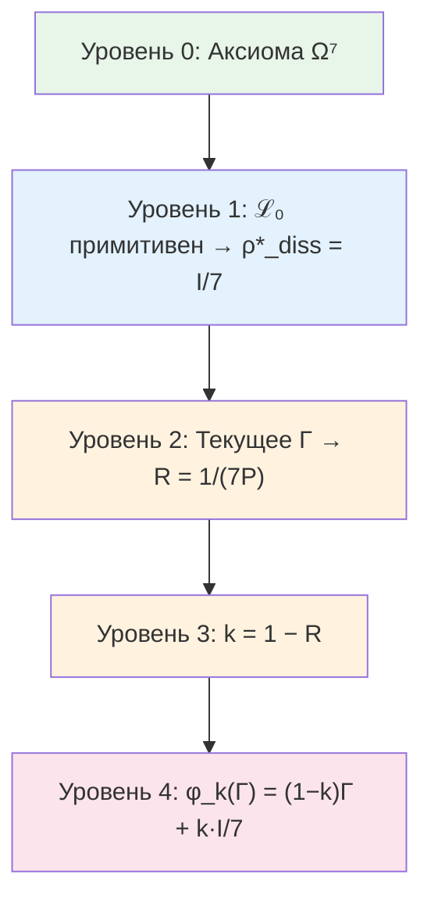

# Оператор Самомоделирования φ

Эта глава описывает, как система строит модель самой себя — один из центральных вопросов и науки о сознании, и философии, и кибернетики. Что значит «знать себя»? Как система, состоящая из частей, может охватить себя целиком — включая тот самый механизм, которым она себя охватывает?

Оператор $\varphi$ — математический ответ на этот вопрос. Он принимает текущее состояние Голонома (матрицу когерентности $\Gamma$) и возвращает *модель* этого состояния — приблизительное отражение, построенное самой системой. Когда отражение совпадает с оригиналом ($\varphi(\Gamma^*) = \Gamma^*$), система достигает **самосогласованности** — её самомодель точна.

:::info DRY: Мастер-определение φ
Это **каноническое определение** оператора самомоделирования $\varphi$ в разделе теории. Полная формализация, доказательства эквивалентности трёх определений и теорема о неподвижной точке — в [Формализации оператора φ](/docs/proofs/categorical/formalization-phi).
:::

---

## Историческая предтеча

Проблема самореференции — одна из самых глубоких в интеллектуальной истории.

**Дуглас Хофштадтер** в книге «Гёдель, Эшер, Бах» (1979) описал *странные петли* — структуры, которые, поднимаясь по уровням иерархии, неожиданно возвращаются к началу. Гёделев номер кодирует утверждения о числах *через* числа. Эшеровские руки рисуют друг друга. Бахов канон восходит по тональностям и возвращается к исходной. Хофштадтер предположил, что именно такие самореферентные петли лежат в основе сознания.

**Роберт Розен** (1991) в книге «Life Itself» формализовал идею *замыкания по эффективной причинности*: живая система — это система, которая является собственной моделью. Его (M,R)-системы предвосхитили автопоэтическую аксиому УГМ.

**Карл Фристон** (2006–) в рамках *Free Energy Principle* показал, что живые системы минимизируют свободную энергию, что эквивалентно построению предсказательной модели среды (и себя). Вариационное определение φ в УГМ — формальный аналог принципа Фристона, но выведенный из аксиом, а не постулированный.

---

## Интуитивное объяснение: зеркало для Голонома {#интуиция-зеркало}

Представьте, что Голоном — существо, живущее в комнате без внешних зеркал. Единственный способ «увидеть» себя — построить внутреннюю модель: представить, как ты выглядишь, основываясь на том, что чувствуешь.

Оператор $\varphi$ — это и есть «зеркало». Голоном смотрит в него ($\varphi(\Gamma)$) и видит приблизительное отражение себя. Но зеркало не идеальное:
- Оно может быть *мутным* — терять детали (базовая декогерирующая форма $\varphi_{\text{base}}$, которая стирает все связи между измерениями)
- Оно может быть *расфокусированным* — видеть не отдельные пиксели, а группы по 3 (Фано-форма $\varphi_{\text{coh}}$, которая сохраняет связи, но ослабляет их)

**Неподвижная точка** $\Gamma^*$ — это состояние, в котором отражение совпадает с оригиналом. Голоном, находясь в $\Gamma^*$, видит себя *точно таким, какой он есть*. Это — состояние полной самосогласованности.

---

## Бутстрап: как разрешается кажущаяся цикличность {#бутстрап}

На первый взгляд, определение φ кажется порочным кругом: φ определяет самомодель $\Gamma^*$, а $\Gamma^*$ входит в определение φ. Но это не порочный круг, а **бутстрап** — самосогласованная конструкция.

Аналогия: рекурсивная картинка. Представьте художника, рисующего картину, на которой изображён художник, рисующий картину, на которой... Кажется, что определение бесконечно рекурсивно. Но если найти *ту* картину, на которой изображённая картина совпадает с самой картиной — рекурсия замыкается. Это и есть неподвижная точка.

Математически цикличность разрешается строго:

:::warning Бутстрап-природа определения φ
Оператор φ определяет «самомодель» системы, т.е. φ(Γ) ≈ Γ — система моделирует саму себя. Это **циклическое** по видимости определение. Цикличность разрешается через **теорему о неподвижной точке**: оператор φ определяется **независимо** (как левый сопряжённый к включению подобъектов), а неподвижная точка Γ* с φ(Γ*) = Γ* **существует и единственна** по теореме Банаха (φ — сжимающее отображение с параметром k < 1). Подробное изложение разрешения цикличности — в [Формализации оператора φ: разрешение цикличности](/docs/proofs/categorical/formalization-phi#категориальное-определение-φ).
:::

---

## Определение

Оператор самомоделирования $\varphi: \mathcal{D}(\mathcal{H}) \to \mathcal{D}(\mathcal{H})$ определяется тремя эквивалентными способами:

| # | Определение | Формула |
|---|-------------|---------|
| 1 | **Категориальное** | $\varphi \dashv i: \text{Sub}(\Gamma) \hookrightarrow \mathbf{Sh}_\infty(\mathcal{C})$ |
| 2 | **Динамическое** | $\varphi(\Gamma) = \lim_{\tau \to \infty} e^{\tau \mathcal{L}_\Omega}[\Gamma]$ |
| 3 | **Идемпотентное** | $\varphi \circ \varphi = \varphi$, $\exists \Gamma^*: \varphi(\Gamma^*) = \Gamma^*$ |

### Три определения простым языком

Каждое из трёх определений отвечает на один и тот же вопрос — «как система строит модель себя?» — но с разных точек зрения.

**Определение 1 (Категориальное): «Лучшее приближение снизу».**
Представьте, что у вас есть сложный объект (Голоном) и коллекция более простых объектов (подобъекты классификатора). Категориальный φ — это способ найти *лучшее приближение* сложного объекта через простые. «Левый сопряжённый к включению» — математический способ сказать «оптимальная проекция на подмножество». Аналогия: вы описываете другу свою внешность по телефону. Из бесконечного множества деталей вы выбираете самые важные (рост, цвет волос, телосложение). Это и есть «лучшее приближение» — $\varphi$ от вашей полной внешности.

**Определение 2 (Динамическое): «К чему система приходит в итоге».**
Запустите эволюцию и подождите бесконечно долго. Состояние, к которому система придёт — это $\varphi(\Gamma)$. Аналогия: бросьте мячик в воронку. Независимо от того, где вы его бросили, он окажется в самой нижней точке. Эта нижняя точка — неподвижная точка $\Gamma^*$.

**Определение 3 (Идемпотентное): «Двойное отражение не добавляет ничего нового».**
Если посмотреть в зеркало дважды — увидишь то же самое, что и в первый раз. $\varphi \circ \varphi = \varphi$ означает, что модель модели совпадает с моделью. Аналогия: сфотографируйте фотографию — вы получите (примерно) ту же фотографию.

:::tip Теорема: Эквивалентность определений φ
Три определения задают один и тот же оператор $\varphi$.
[Доказательство →](/docs/proofs/categorical/formalization-phi#эквивалентность-определений-phi) | Статус: **[Т]**
:::

## Базовая форма φ_base (декогерирующее самонаблюдение) {#phi-base}

Для [Голонома](/docs/core/structure/holon) с $\mathcal{H} = \mathbb{C}^7$ **базовая** (декогерирующая) форма:

$$
\varphi_{\text{base}}(\Gamma) = \sum_{k=1}^{7} \Pi_k \, \Gamma \, \Pi_k = \mathrm{diag}(\Gamma)
$$

где $\Pi_k = |e_k\rangle\langle e_k|$ — проекторы на [базисные измерения](/docs/core/structure/dimensions).

:::warning Φ_base недостаточна как каноническая форма
Эта форма **уничтожает** все когерентности ($\gamma_{ij} \to 0$ при $i \neq j$), что несовместимо с жизнеспособностью при равномерных весах. Каноническая форма для живых систем — обобщённый оператор $\varphi_{\text{coh}}$ с [Фано-структурой](#каноническая-конструкция-φ_coh-из-фано-структуры) (см. ниже). Каноническая форма в [Формализации оператора φ](/docs/proofs/categorical/formalization-phi#26-каноническая-форма-φ-для-угм) использует $\varphi_{\text{UHM}} = k \cdot \mathcal{P}_{\text{pred}} + (1-k) \cdot I/7$, что при $\mathcal{P}_{\text{pred}} = \mathcal{P}_{\text{base}}$ совпадает с $\varphi_{\text{base}}$ (с якорем $I/7$). Обобщение на $\mathcal{P}_{\text{pred}} = \mathcal{P}_\alpha$ (выпуклая комбинация $\mathcal{P}_{\text{base}}$ и $\mathcal{P}_{\text{Fano}}$) даёт $\varphi_{\text{coh}}$.
:::

## Свойства

1. **CPTP-канал:** $\varphi$ — полностью положительное, сохраняющее след отображение
2. **Идемпотентность (идеального φ):** $\varphi \circ \varphi = \varphi$ — для идемпотентного определения (Определение 3). Каноническая форма $\varphi_{\text{coh}}$ с параметром сжатия $k = 1 - R < 1$ (Sol.77, [Т]) является **сжимающим** отображением (не идемпотентным); идемпотентная проекция — предел $\lim_{n\to\infty} \varphi_{\text{coh}}^n$
3. **Монотонность чистоты:** $P(\varphi_{\text{base}}(\Gamma)) \leq P(\Gamma)$ для базовой формы (декогеренция уменьшает чистоту); $P(\varphi_{\text{coh}}(\Gamma))$ зависит от параметра $\alpha$ — при $\alpha < 1$ Фано-компонента частично сохраняет когерентности. Неподвижная точка канонической $\varphi_{\mathrm{coh}}$ имеет $P(\Gamma^*_{\mathrm{coh}}) = P_{\text{crit}} = 2/7$
4. **Неподвижная точка:** $\exists! \, \Gamma^*_{\mathrm{coh}}: \varphi_{\mathrm{coh}}(\Gamma^*_{\mathrm{coh}}) = \Gamma^*_{\mathrm{coh}}$

:::tip Теорема: Неподвижная точка φ_coh
$\exists! \, \Gamma^*_{\mathrm{coh}} \in \mathcal{D}(\mathbb{C}^7)$: $\varphi_{\mathrm{coh}}(\Gamma^*_{\mathrm{coh}}) = \Gamma^*_{\mathrm{coh}}$ с $P(\Gamma^*_{\mathrm{coh}}) = P_{\text{crit}} = 2/7$.
[Доказательство →](/docs/proofs/categorical/formalization-phi#3-теорема-о-существовании-неподвижной-точки) | Статус: **[Т]**
:::

:::warning Различие неподвижных точек
$\Gamma^*_{\mathrm{coh}}$ (неподвижная точка $\varphi_{\mathrm{coh}}$, $P = 2/7$) **отличается** от $\rho^*_{\mathrm{diss}} = I/7$ (аттрактор диссипатора, $P = 1/7$). Каноническое определение [меры рефлексии R](/docs/consciousness/foundations/self-observation#мера-рефлексии-r) использует $\rho^*_{\mathrm{diss}} = I/7$: $R = 1/(7P)$. Подробнее: [стратификация определений](/docs/core/foundations/axiom-septicity#теорема-непротиворечивость-иерархии-определений).
:::

---

## Необходимость обобщённого φ для живых систем

:::warning Каноническая φ_base недостаточна
Каноническая $\varphi_{\text{base}}$ (декогерирующее самонаблюдение, проекция на диагональ) **уничтожает** все когерентности: $[\varphi_{\text{base}}(\Gamma)]_{ij} = 0$ при $i \neq j$. Это несовместимо с жизнеспособностью: при $\gamma_{ii} \approx 1/7$ получаем $P \approx 1/7 < P_{\text{crit}} = 2/7$. Для достижения $P > P_{\text{crit}}$ без когерентностей требуется патологическая локализация одного измерения.
:::

:::tip Теорема: Необходимость когерентно-сохраняющего φ
Живая самомодель **обязана** сохранять когерентности: $\exists\, (i,j): [\varphi(\Gamma)]_{ij} \neq 0$. Требуется обобщённая $\varphi_{\text{coh}}$.
[Доказательство →](/docs/proofs/gap/fano-channel#необходимость-phi-coh) | Статус: **[Т]**
:::

---

## Каноническая конструкция φ_coh из Фано-структуры

### Зачем нужен Фано-канал: расфокусированное зрение {#интуиция-фано}

Прежде чем перейти к формулам, поймём *зачем* нужна Фано-структура.

Представьте, что зеркало Голонома может работать в двух режимах:
- **Пиксельный режим** ($\varphi_{\text{base}}$): зеркало видит каждый «пиксель» (измерение) отдельно, но полностью теряет связи между пикселями. Как если бы вы разрезали фотографию на 7 квадратиков и перемешали их — вы знаете содержимое каждого квадратика, но не знаете, как они связаны.
- **Расфокусированный режим** ($\mathcal{P}_{\text{Fano}}$): зеркало видит не отдельные пиксели, а *группы по 3* (Фано-линии). Это как расфокусированное зрение — вы теряете мелкие детали, но сохраняете *связи* между измерениями. Каждая группа из трёх измерений наблюдается как целое.

Почему именно группы по 3? Потому что [плоскость Фано](/docs/physics/gauge-symmetry/fano-selection-rules) PG(2,2) — единственная структура на 7 точках, где каждая пара точек лежит ровно на одной линии из 3 точек. Это **максимально демократичное** наблюдение: ни одна пара измерений не привилегирована.

Ключевой результат: пиксельное зеркало *убивает* систему (при равномерных весах чистота падает ниже порога $P_{\text{crit}} = 2/7$). Расфокусированное зеркало *сохраняет жизнь*, потому что сохраняет связи (когерентности) между измерениями. Живое самонаблюдение **обязано** быть частично расфокусированным.

#### Математика смешивания каналов {#математика-смешивания}

Почему выпуклая комбинация $\mathcal{P}_\alpha = \alpha\,\mathcal{P}_{\text{base}} + (1-\alpha)\,\mathcal{P}_{\text{Fano}}$ работает:

1. **$\mathcal{P}_{\text{base}}$ в одиночку**: уничтожает все когерентности → при равномерных весах $P \approx 1/7 < P_{\text{crit}}$ → система гибнет
2. **$\mathcal{P}_{\text{Fano}}$ в одиночку**: когерентности масштабируются на $1/3$, фазы сохраняются → $P$ остаётся выше порога
3. **Выпуклая комбинация**: $\mathcal{P}_\alpha$ — CPTP-канал (выпуклая комбинация CPTP-каналов — CPTP)
4. **При $\alpha = 0$**: чистый Фано, максимальное сохранение когерентностей, но менее точная предиктивная модель
5. **При $\alpha = 1$**: чистый атомарный, идеальная предиктивная точность, но система погибает
6. **Вариационный принцип** находит оптимум $\alpha^* \in (0,1)$, балансирующий точность и выживаемость

### Два типа атомов классификатора

:::note DRY: Мастер-определение
Полные определения атомарных и Фано-операторов Линдблада — в [Операторах Линдблада](/docs/core/operators/lindblad-operators#атомы-классификатора). Ниже приведены ключевые формулы, необходимые для конструкции φ_coh.
:::

[Классификатор Ω](/docs/core/foundations/axiom-omega) содержит не только **атомарные** подобъекты $S_k = |k\rangle\langle k|$, но и **составные**. [Плоскость Фано](/docs/physics/gauge-symmetry/fano-selection-rules) $PG(2,2)$ определяет 7 линейных подобъектов — проекции на 3-мерные подпространства:

$$
\Pi_p = \sum_{i \in \mathrm{line}_p} |i\rangle\langle i|, \quad p = 1, \ldots, 7
$$

:::tip Теорема: Полнота атомов Фано
Каждое измерение лежит на ровно 3 Фано-линиях. Следовательно: $\sum_{p=1}^{7} \Pi_p = 3I$.
[Доказательство →](/docs/proofs/gap/fano-channel#фано-канал) | Статус: **[Т]**
:::

### Фано-предиктивный канал $\mathcal{P}_{\text{Fano}}$

Для каждой Фано-линии $p = (i,j,k)$ определяется [оператор Линдблада](/docs/core/operators/lindblad-operators):

$$
L_p^{\text{Fano}} := \frac{1}{\sqrt{3}}\,\Pi_p = \frac{1}{\sqrt{3}}(|i\rangle\langle i| + |j\rangle\langle j| + |k\rangle\langle k|)
$$

Фано-предиктивный канал:

$$
\mathcal{P}_{\text{Fano}}(\Gamma) := \sum_{p=1}^{7} L_p^{\text{Fano}}\,\Gamma\,(L_p^{\text{Fano}})^\dagger = \frac{1}{3}\sum_{p=1}^{7} \Pi_p\,\Gamma\,\Pi_p
$$

:::info CPTP-верификация
$\sum (L_p^{\text{Fano}})^\dagger L_p^{\text{Fano}} = I$ — полное доказательство в [Операторах Линдблада](/docs/core/operators/lindblad-operators#фано-операторы).
:::

### Теорема: Фано-канал сохраняет когерентности

:::tip Теорема: Сохранение когерентностей Фано-каналом
Для произвольной матрицы когерентности $\Gamma$:

**(a)** Диагональные элементы сохраняются точно: $[\mathcal{P}_{\text{Fano}}(\Gamma)]_{ii} = \gamma_{ii}$

**(b)** Когерентности сохраняются с коэффициентом $1/3$: $[\mathcal{P}_{\text{Fano}}(\Gamma)]_{ij} = \frac{1}{3}\gamma_{ij}$ при $i \neq j$

**(c)** Фазы когерентностей сохраняются в точности: $\arg([\mathcal{P}_{\text{Fano}}(\Gamma)]_{ij}) = \arg(\gamma_{ij})$

Ключевое отличие от $\varphi_{\text{base}}$: Фано-канал **масштабирует** амплитуды когерентностей без фазового искажения, тогда как $\varphi_{\text{base}}$ уничтожает их полностью.
[Доказательство →](/docs/proofs/gap/fano-channel#теорема-фано-канал) | Статус: **[Т]**
:::

### Каноническая форма φ_coh

:::tip Теорема: Каноническая форма φ_coh
Каноническое когерентно-сохраняющее самомоделирование:

$$
\varphi_{\text{coh}}(\Gamma) = k \cdot \left[\alpha \cdot \mathcal{P}_{\text{base}}(\Gamma) + (1 - \alpha) \cdot \mathcal{P}_{\text{Fano}}(\Gamma)\right] + (1 - k) \cdot \Gamma_{\text{anchor}}
$$

где:
- $\mathcal{P}_{\text{base}}(\Gamma) = \sum_m P_m\,\Gamma\,P_m = \mathrm{diag}(\Gamma)$ — атомарный канал (из [формализации φ](/docs/proofs/categorical/formalization-phi))
- $\mathcal{P}_{\text{Fano}}(\Gamma) = \frac{1}{3}\sum_p \Pi_p\,\Gamma\,\Pi_p$ — Фано-канал
- $\alpha \in [0, 1]$ — **параметр глубины декогеренции** (баланс атомарного и Фано-наблюдения)
- $k = 1 - R$ — параметр сжатия, определяемый [мерой рефлексии](/docs/consciousness/foundations/self-observation#теорема-k-из-r) $R = 1 - \|\Gamma - \rho^*\|_F^2/\|\Gamma\|_F^2$ **[Т]** (Sol.77). Не является свободным параметром
- $\Gamma_{\text{anchor}} = \rho^*_{\mathrm{diss}} = I/7$ — **якорное состояние**, совпадающее с аттрактором диссипативной части $\mathcal{L}_0$. Этот выбор обусловлен примитивностью $\mathcal{L}_0$ [Т-39a]: единственное стационарное состояние линейной динамики — максимально смешанное $I/7$. При полном сжатии ($k \to 1$, $R \to 0$) самомодель стремится к $I/7$ — состоянию полного отсутствия информации о себе.

$\mathcal{P}_\alpha = \alpha\,\mathcal{P}_{\text{base}} + (1-\alpha)\,\mathcal{P}_{\text{Fano}}$ — выпуклая комбинация CPTP-каналов, следовательно CPTP.
[Доказательство →](/docs/proofs/gap/fano-channel#phi-coh) | Статус: **[Т]**
:::

### Целевые когерентности φ_coh

:::tip Теорема: Целевые когерентности φ_coh
**(a)** Модуль целевой когерентности (при диагональном якоре): $|\gamma_{ij}^{\text{target}}| = \frac{k(1-\alpha)}{3} \cdot |\gamma_{ij}|$

**(b)** Целевая фаза **сохраняется**: $\theta_{ij}^{\text{target}} = \theta_{ij}$

**(c)** Целевой Gap **сохраняется**: $\mathrm{Gap}^{\text{target}}(i,j) = \mathrm{Gap}(i,j)$

Каноническая $\varphi_{\text{coh}}$ **не стремится изменить Gap** — она воспроизводит Gap с ослабленной амплитудой, масштабируя когерентности без фазового искажения.
[Доказательство →](/docs/proofs/gap/fano-channel#phi-coh) | Статус: **[Т]**
:::

---

## Явные коэффициенты $c_{mn}$

Общая форма когерентно-сохраняющего канала из определения $\varphi_{\text{coh}}$:

$$
\mathcal{P}_{\text{coh}}(\Gamma) = \sum_{m,n} c_{mn}\,|m\rangle\langle n|\,\Gamma\,|n\rangle\langle m|
$$

:::tip Теорема: Явные коэффициенты $c_{mn}$
Коэффициенты канонического $\varphi_{\text{coh}}$ полностью определены:

$$
c_{mn} = \begin{cases} \alpha^* k & m = n \text{ (атомарная часть)} \\ (1-\alpha^*) k / 3 & m \neq n,\, (m,n) \text{ на общей Фано-линии} \\ 0 & m \neq n,\, (m,n) \text{ вне общей Фано-линии} \end{cases}
$$

Коэффициенты определены через:
- [Фано-структуру](/docs/physics/gauge-symmetry/fano-selection-rules) $PG(2,2)$ (алгебраическая геометрия)
- Вариационный принцип ($\alpha^*$ через $P$ и $P_{\text{crit}}$)
- Параметр сжатия $k$ (из [формализации φ](/docs/proofs/categorical/formalization-phi))

[Доказательство →](/docs/proofs/gap/fano-channel#phi-coh) | Статус: **[Т]**
:::

:::info Операторы Крауса
Атомарные операторы (7 штук): $K_m^{(\text{atom})} = \sqrt{\alpha^* k / 7} \cdot |m\rangle\langle m|$. Фано-операторы (7 штук): $K_p^{(\text{Fano})} = \sqrt{(1-\alpha^*) k / 3} \cdot \Pi_p$. Якорный оператор: $K_0 = \sqrt{(1-k)/7} \cdot I$. Проверка: $\sum (K^{(\text{atom})})^\dagger K^{(\text{atom})} + \sum (K^{(\text{Fano})})^\dagger K^{(\text{Fano})} + K_0^\dagger K_0 = \alpha^* k \cdot I + (1-\alpha^*) k \cdot I + (1-k) \cdot I = I$.
:::

---

## Вариационное определение α*

:::tip Теорема: Вариационное определение α*
Оптимальный параметр $\alpha^*$ определяется [вариационным принципом](/docs/proofs/dynamics/fep-derivation):

$$
\alpha^* = \arg\min_{\alpha \in [0,1]} \mathcal{F}[\mathcal{P}_\alpha; \Gamma] = \arg\min_{\alpha} \left[S_{\text{spec}}(\mathcal{P}_\alpha(\Gamma)) + D_{KL}(\mathcal{P}_\alpha(\Gamma) \| \Gamma)\right]
$$

Приближённая формула для системы с чистотой $P > P_{\text{crit}}$:

$$
\alpha^* \approx 1 - \frac{P_{\text{crit}}}{P} = 1 - \frac{2}{7P}
$$

| Чистота $P$ | $\alpha^*$ | Интерпретация |
|-------------|-----------|---------------|
| $P = 1$ (чистое состояние) | $\approx 0.71$ | Существенное Фано-участие |
| $P = 0.5$ | $\approx 0.43$ | Баланс атомарного и Фано |
| $P \to P_{\text{crit}}$ | $\to 0$ | Почти полностью Фано (минимальное разрушение когерентностей) |

[Доказательство →](/docs/proofs/gap/fano-channel#alpha-star) | Статус: **[Т]**
:::

:::info Физический смысл баланса
При $\alpha = 1$ (чисто атомарный канал) — максимальная предсказательная точность, но полное уничтожение когерентностей. При $\alpha = 0$ (чисто Фано) — сохранение когерентностей с коэффициентом $1/3$, но менее точная предсказательная модель. Оптимум $\alpha^* \in (0,1)$ — баланс между предсказательной точностью и сохранением структуры.
:::

#### Эскиз вывода формулы α* {#эскиз-вывода-alpha}

Функционал $\mathcal{F}[\alpha] = S_{\text{spec}}(\mathcal{P}_\alpha(\Gamma)) + D_{KL}(\mathcal{P}_\alpha(\Gamma) \| \Gamma)$.

Канал $\mathcal{P}_\alpha$ действует: диагональ сохраняется, когерентности $\gamma_{ij} \mapsto \frac{(1-\alpha)}{3}\gamma_{ij}$. Поэтому чистота самомодели: $P_\alpha \approx P_{\text{diag}} + \left(\frac{1-\alpha}{3}\right)^2 P_{\text{coh}}$.

Спектральная энтропия $S_{\text{spec}}$ растёт при уменьшении $\alpha$ (ослабление когерентностей → смешивание). Дивергенция Кульбака—Лейблера $D_{KL}$ растёт при увеличении $\alpha$ (больше отклонение от $\Gamma$). Условие стационарности $\partial\mathcal{F}/\partial\alpha = 0$ при типичных $\Gamma$ с чистотой $P$ даёт:

$$\alpha^* \approx 1 - \frac{P_{\text{crit}}}{P} = 1 - \frac{2}{7P}$$

Формула **приближённая** — точное решение требует числовой оптимизации для произвольных $\Gamma$.

### Числовой пример {#числовой-пример-phi}

Пусть $\Gamma$ имеет чистоту $P = 0.4$ (жизнеспособная система). Вычислим:

1. **Параметр $\alpha^*$:** $\alpha^* \approx 1 - 2/(7 \times 0.4) = 1 - 0.714 = 0.286$
2. **Мера рефлексии:** $R = 1/(7P) = 1/2.8 \approx 0.357$
3. **Параметр сжатия:** $k = 1 - R = 0.643$
4. **Целевая когерентность:** $|\gamma_{ij}^{\text{target}}| = \frac{k(1-\alpha^*)}{3}|\gamma_{ij}| = \frac{0.643 \times 0.714}{3}|\gamma_{ij}| \approx 0.153\,|\gamma_{ij}|$

Самомодель сохраняет ~15% амплитуды каждой когерентности — «расфокусированное», но не уничтоженное отражение. Чистота самомодели $P(\varphi_{\text{coh}}(\Gamma))$ сходится к $P_{\text{crit}} = 2/7$ при итерациях — порог жизнеспособности выступает **аттрактором** самомоделирования.

---

## Единая теорема самонаблюдения

:::tip Теорема: Фано-когерентное самомоделирование (единая теорема)
Каноническое когерентно-сохраняющее самомоделирование для УГМ определяется **полностью однозначно** (параметр сжатия $k = 1 - R$ определён [мерой рефлексии](/docs/consciousness/foundations/self-observation#теорема-k-из-r), Sol.77 [Т]) через:

**(a)** **Алгебраическая структура:** [Фано-плоскость](/docs/physics/gauge-symmetry/fano-selection-rules) $PG(2,2)$ определяет составные атомы классификатора $\Omega$, порождающие Фано-[Линдблад-операторы](/docs/core/operators/lindblad-operators) $L_p^{\text{Fano}}$.

**(b)** **Вариационный принцип:** Баланс атомарного и Фано-наблюдения $\alpha^*$ минимизирует функционал $\mathcal{F} = S_{\text{spec}} + D_{KL}$.

**(c)** **Фазовые свойства:** Каноническая $\varphi_{\text{coh}}$ **сохраняет** фазы когерентностей. Целевой Gap совпадает с текущим Gap.

**(d)** **Симметрия:** [G₂-ковариантность](/docs/physics/gauge-symmetry/g2-structure) частично нарушена атомарной компонентой. Степень нарушения $\Delta_{G_2} = \alpha^* \cdot \Delta_{\max}$ зависит от чистоты $P$. Фано-диссипатор G₂-ковариантен; атомарный — нет.

**(e)** **Стационарный Gap:** при подстановке $\theta_{ij}^{\text{target}} = \theta_{ij}$:

$$
\mathrm{Gap}^{(\infty)}(i,j) = \left|\sin\left(\theta_{ij} - \arctan\frac{\Delta\omega_{ij}}{\Gamma_2 + \kappa}\right)\right|
$$

Стационарный Gap **сдвинут** относительно текущего на угол $\arctan(\Delta\omega/(\Gamma_2 + \kappa))$ за счёт унитарного вращения.

[Доказательства →](/docs/proofs/gap/fano-channel) | Статус: **[Т]**
:::

---

## Три определения φ и их эквивалентность {#три-определения}

В документации φ встречается в трёх формах. Они не противоречат друг другу — каждая последующая является **следствием** предыдущей. Здесь собраны все три определения с явными ссылками на теоремы, связывающие их в единую цепочку.

### Три формы

| # | Название | Формула | Место определения |
|---|----------|---------|-------------------|
| 1 | **Категориальный φ** | $\varphi \dashv i: \mathrm{Sub}(\Gamma) \hookrightarrow \mathbf{Sh}_\infty(\mathcal{C})$ | [Аксиома Ω⁷](/docs/core/foundations/axiom-omega), [Вывод FEP](/docs/proofs/dynamics/fep-derivation#2-категориальные-основы) |
| 2 | **Вариационный φ** | $\varphi = \arg\min_{\psi \in \mathcal{CPTP}} \mathbb{E}_\Gamma[S_{\mathrm{spec}}(\psi(\Gamma)) + D_{KL}(\psi(\Gamma) \| \Gamma)]$ | [Теорема 3.1, Вывод FEP](/docs/proofs/dynamics/fep-derivation#32-центральная-теорема) |
| 3 | **Замещающий φ_k** | $\varphi_k(\Gamma) = (1-k)\Gamma + k\rho^*_{\mathrm{diss}},\ k = 1 - R$ | [Самонаблюдение](/docs/consciousness/foundations/self-observation#физическая-реализация-phi) |

### Связи (1) ↔ (2): Теорема 3.1

:::tip Теорема 3.1 (Вариационная характеризация) [Т]
Категориально определённый $\varphi$ (как левый сопряжённый к включению $i: \mathrm{Sub}(\Gamma) \hookrightarrow \mathcal{E}$) **совпадает** с минимизатором вариационного функционала:

$$
\varphi = \arg\min_{\psi \in \mathcal{CPTP}} \mathbb{E}_{\Gamma \sim \mu}\left[S_{\mathrm{spec}}(\psi(\Gamma)) + D_{KL}(\psi(\Gamma) \| \Gamma)\right]
$$

Инвариантная мера $\mu$ единственна по примитивности линейной части $\mathcal{L}_0$ [Т-39a].
[Полное доказательство →](/docs/proofs/dynamics/fep-derivation#32-центральная-теорема) | Статус: **[Т]**
:::

Таким образом: вариационный принцип — **не аксиома**, а **теорема** о категориально определённом φ.

### Связь (2) ↔ (3): замещающий канал как минимизатор

:::tip Теорема (Замещающий канал как CPTP-минимизатор) [Т]
Минимизатор функционала $\mathcal{F}[\psi; \Gamma] = S_{\mathrm{spec}}(\psi(\Gamma)) + D_{KL}(\psi(\Gamma) \| \Gamma)$ в классе CPTP-каналов на $\mathcal{D}(\mathbb{C}^7)$ является замещающим каналом

$$
\varphi_k(\Gamma) = (1 - k)\,\Gamma + k\,\rho^*_{\mathrm{diss}}, \qquad k = 1 - R
$$

**Ключевые шаги доказательства.**
1. **Выпуклость:** $\mathcal{F}[\psi; \Gamma]$ строго выпуклый функционал на выпуклом компакте $\mathcal{CPTP}$ — минимизатор существует и единственен.
2. **Форма минимизатора:** Из условий стационарности (вариация по $\psi$ при CPTP-ограничении) минимизатор имеет форму выпуклой комбинации $\mathrm{Id}$ и постоянного канала $\mathcal{C}_{\rho^*}$, то есть $\psi^*(\Gamma) = (1-k)\Gamma + k\rho^*$.
3. **Значение $k$:** Из принципа Банаха (сжимающее отображение с константой $(1-k) < 1$) и условия согласованности с мерой рефлексии: $k = 1 - R = 1 - 1/(7P)$.

[Доказательство физической реализации →](/docs/consciousness/foundations/self-observation#физическая-реализация-phi) | [Параметр k из рефлексии →](/docs/consciousness/foundations/self-observation#теорема-k-из-r) | Статус: **[Т]**
:::

### Единая цепочка: φ_cat → φ_var → φ_k

```
φ_cat (категориальный)
   — левый сопряжённый к i: Sub(Γ) ↪ Sh_∞(C)
   — определён аксиоматически через структуру ∞-топоса
         |
         | Теорема 3.1 [Т]
         ↓
φ_var (вариационный)
   — argmin [S_spec + D_KL] по всем CPTP-каналам
   — вариационный принцип как СЛЕДСТВИЕ, не аксиома
         |
         | выпуклость + принцип Банаха [Т]
         ↓
φ_k (замещающий)
   — φ_k(Γ) = (1−k)Γ + k·ρ*_diss,  k = 1−R
   — явная, вычислимая форма для D(ℂ⁷)
```

### Отсутствие цикличности

:::info Разрешение цикличности
Определение φ **не содержит порочного круга**. Порядок выводимости строго линеен:

1. **$\rho^*_{\mathrm{diss}} = I/7$** определяется из примитивности линейной части $\mathcal{L}_0$ [Т-39a] — это свойство **динамики**, независящее от φ.
2. **$R(\Gamma) = 1/(7P(\Gamma))$** определяется только текущим состоянием $\Gamma$ и константой $\rho^*_{\mathrm{diss}} = I/7$ — не через $\varphi$.
3. **$k = 1 - R$** — функция состояния $\Gamma$, не свободный параметр.
4. **$\varphi_k(\Gamma)$** — полностью определён через $\Gamma$, $\rho^*_{\mathrm{diss}}$ и $k$ без самореференции.



Каждый уровень зависит **только от предыдущих** — замкнутый ориентированный ациклический граф (DAG).

Видимая «цикличность» (φ определяет $\rho^*$, а $\rho^*$ входит в φ) устраняется расщеплением: $\rho^*_{\mathrm{diss}} = I/7$ — **диссипативный** аттрактор линейной части $\mathcal{L}_0$, тогда как φ — **нелинейный** оператор регенерации. Они находятся на разных уровнях иерархии [O] (см. [иерархию аттракторов](/docs/consciousness/foundations/self-observation#иерархия-аттракторов)).
:::

---

## Связи

- **Определяется из:** [Аксиома Ω⁷](/docs/core/foundations/axiom-omega) → $\mathcal{L}_\Omega$ → $\varphi$
- **Фано-канал:** [Фано-правила отбора](/docs/physics/gauge-symmetry/fano-selection-rules) → $\Pi_p$ → $\mathcal{P}_{\text{Fano}}$
- **Используется в:** [Самонаблюдение](/docs/consciousness/foundations/self-observation), [Эволюция](/docs/core/dynamics/evolution), [Динамика Gap](/docs/core/dynamics/gap-dynamics)
- **Полная формализация:** [Формализация оператора φ](/docs/proofs/categorical/formalization-phi)
- **Доказательства Фано-теорем:** [Фано-канал и Gap-теоремы](/docs/proofs/gap/fano-channel)
- **Вариационная характеризация:** [Вывод FEP из УГМ](/docs/proofs/dynamics/fep-derivation)
- **G₂-структура:** [G₂ = Aut(O)](/docs/physics/gauge-symmetry/g2-structure) — ковариантность Фано-диссипатора
