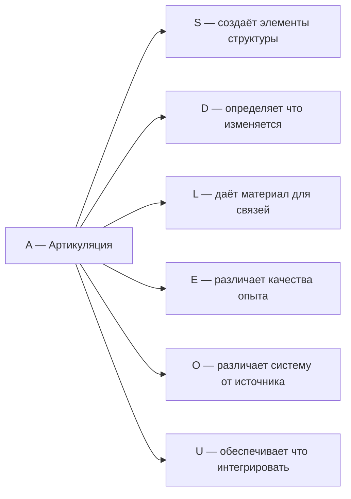

# Измерение I: Артикуляция (A)

## Функция

**Различать, выделять, определять границы.**

## Описание

Артикуляция — это способность Голонома проводить различия. Без различения нет формы, нет информации, нет бытия.

:::info Онтологический статус
Артикуляция — **аспект** конфигурации $\Gamma$, не отдельная сущность. "Голоном артикулирует" означает: в матрице когерентности $\Gamma$ активна проекция на базисный вектор $|A\rangle$.
:::

:::warning Первичность A
При удалении измерения $A$ нарушаются **все три аксиомы** (AP), (PH), (QG) — это единственное измерение с таким свойством. См. [доказательство](../../proofs/theorem-minimality-7#случай-n--0-удаление-артикуляции-a).

Это не означает "иерархию важности" — все 7 измерений необходимы. Но $A$ логически первично: остальные измерения **предполагают** различение.
:::

**Первичный акт реальности — акт различения:** "Draw a distinction" (Спенсер-Браун, *Laws of Form*, 1969). Нечто отделяется от фона — это минимальное условие существования формы.

## Математическое представление

Проекционный оператор $P$, выделяющий подпространство из $\mathcal{H}$:

$$
P^2 = P \quad \text{(идемпотентность)}
$$

$$
P^\dagger = P \quad \text{(эрмитовость)}
$$

Проекционный оператор делит пространство на две части:

$$
\mathcal{H} = \mathrm{Im}(P) \oplus \mathrm{Ker}(P)
$$

где $\mathrm{Im}(P)$ — то, что выделено, $\mathrm{Ker}(P) = \mathrm{Im}(I - P)$ — фон.

## Операции артикуляции

| Операция | Математика | Интерпретация |
|----------|------------|---------------|
| Выделение | $P\vert\psi\rangle$ | Фокус внимания на подпространстве |
| Исключение | $(I-P)\vert\psi\rangle$ | Игнорирование, фильтрация |
| Измерение | $\langle\psi\vert P\vert\psi\rangle$ | Вероятность нахождения в подпространстве |
| Декомпозиция | $\sum_i P_i = I$ | Полная классификация (разбиение) |

## Полная система проекторов

Для полного различения требуется **ортогональное разбиение** пространства:

$$
\sum_{i=1}^{n} P_i = I, \quad P_i P_j = \delta_{ij} P_i
$$

Условие $P_i P_j = \delta_{ij} P_i$ означает: проекторы **ортогональны** — различённые категории не пересекаются.

**Связь со спектральным разложением:**

Любой эрмитов оператор $A$ разлагается через свои проекторы:

$$
A = \sum_i a_i P_i
$$

где $a_i$ — собственные значения, $P_i$ — проекторы на собственные подпространства. Измерение оператора $A$ — это **артикуляция** его спектра.

## Примеры

| Уровень | Пример | Что различается |
|---------|--------|-----------------|
| Физический | Мембрана клетки | Внутреннее / внешнее |
| Физический | Детектор частиц | Типы частиц |
| Когнитивный | Внимание | Фигура / фон |
| Когнитивный | Восприятие | Объекты |
| Логический | Определение | Понятие / не-понятие |
| Логический | Классификация | Категории |

## Связь с другими измерениями

## Когерентность с A

Элементы $\gamma_{Ai}$ матрицы когерентности описывают связь артикуляции с другими измерениями:

| Когерентность | Интерпретация |
|---------------|---------------|
| $\gamma_{AS}$ | Структурированность различий |
| $\gamma_{AD}$ | Темпоральность различий (различения во времени) |
| $\gamma_{AL}$ | Логичность различий (непротиворечивость) |
| $\gamma_{AE}$ | Осознанность различий (внимание) |
| $\gamma_{AO}$ | Укоренённость различий (связь с источником) |
| $\gamma_{AU}$ | Интегрированность различий (вклад в целое) |

---

**Связанные документы:**
- [Семь измерений](./dimensions) — обзор всех измерений
- [Структура (S)](./dimension-s) — следующее измерение
- [Теорема о минимальности](../../proofs/theorem-minimality-7) — доказательство необходимости A
