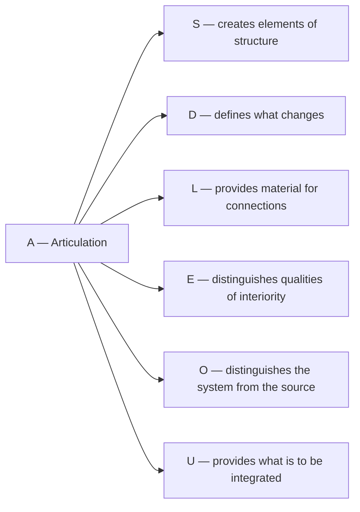
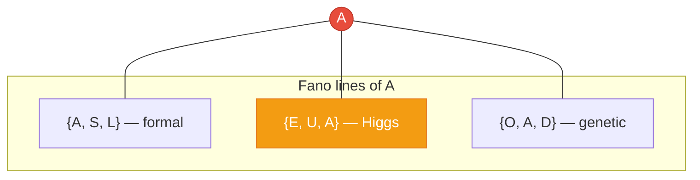

# Dimension I: Articulation (A)

## What this chapter is about

This chapter is devoted to the first dimension of the Holon — **Articulation**. You will learn:

- Why **distinction** is the most fundamental act, without which no existence is possible;
- How the idea of distinction developed from Frege and Spencer-Brown to quantum mechanics;
- What a projection operator is and why it is the precise mathematics of distinction;
- How the population $\gamma_{AA}$ determines the "acuity of vision" of the system;
- What place Articulation occupies on the Fano plane and why it is the only bridge between sectors.

:::info Who this chapter is for
If you are reading about UHM for the first time — start with the [overview of dimensions](./dimensions). If you are already familiar with the seven dimensions and want to understand the first one more deeply — you are in the right place.
:::

## Function

**To distinguish, to single out, to define boundaries.**

## Historical precursor {#историческая-предтеча}

The idea that distinction underlies everything has appeared in the thought of many eras.

**Gottlob Frege** (1879), in *Begriffsschrift*, laid the foundations of formal logic, showing that all logical thinking begins with the act of **distinction** — with defining what falls under a concept and what does not. The boundary of a concept is the first distinction, without which there is neither truth nor falsehood.

**George Spencer-Brown** (1969), in *Laws of Form*, expressed this intuition with utmost concision:

> *Draw a distinction.*

— Make a distinction. This is the single instruction from which Spencer-Brown derives all of logic and arithmetic. Distinction is primary: before one can say "this is", one must separate "this" from "not-this". The space divided by a mark gives rise to two sides — and this is sufficient for form to arise.

**Gregory Bateson** (1972) developed the idea in a cybernetic key:

> *Information is a difference that makes a difference.*

Not every difference is informative. Information arises when a difference made in one place **affects** something in another. If a thermometer distinguishes "hot" from "cold" but this distinction acts on nothing — there is no information. If, however, this distinction switches on a heater — a bit of information arises.

**Niels Bohr** and the Copenhagen interpretation of quantum mechanics (1920s) established that **measurement** — the act of distinguishing a state — is not a neutral procedure, but a fundamental process that changes reality. Before measurement a quantum system has no definite value of an observable; measurement (= distinction) **creates** definiteness.

In UHM all these ideas converge in a single dimension: **Articulation ($A$)** — the system's capacity to make distinctions, and thereby to generate form, information, and being.

## Distinction as an act of creation {#различение-как-творение}

Why is distinction not merely a cognitive operation, but an **ontological act** that generates being?

Consider physics. Before a quantum measurement the electron has no definite position — it is in superposition. The act of measurement (= the distinction "here / not-here") **creates** a definite position. This is not an epistemic limitation of our knowledge, but an ontological fact: definiteness arises **from** distinction.

Consider biology. A single-celled organism, separated from its environment by a membrane, exists **by virtue of** this distinction "inside / outside". Without the membrane there is no organism — only a solution of molecules. The membrane is not a wall (a wall isolates), but a **selective filter**: it distinguishes what to admit and what to reject. This is articulation at the molecular level.

Consider mathematics. A set is defined by a **predicate** — a rule distinguishing members of the set from non-members. Without a predicate (without distinction) there is no set, and without sets there is no mathematics. Cantor's notion of a set is the formalisation of articulation.

Thus, from quantum physics to abstract mathematics, **distinction is primary**: it does not describe what already exists, but **brings into existence** what exists. This is precisely the principle embodied in dimension $A$.

## Description

Articulation is the Holon's capacity to make distinctions. Without distinction there is no form, no information, no being.

:::info Ontological status
Articulation is an **aspect** of the configuration $\Gamma$, not a separate entity. "The Holon articulates" means: in the coherence matrix $\Gamma$ the projection onto the basis vector $|A\rangle$ is active.
:::

:::warning Primacy of A
Removing dimension $A$ violates **all three axioms** (AP), (PH), (QG) — this is the only dimension with this property. See [proof](../../proofs/minimality/theorem-minimality-7#случай-n--0-удаление-артикуляции-a).

This does not imply a "hierarchy of importance" — all 7 dimensions are necessary. But $A$ is logically primary: the remaining dimensions **presuppose** distinction.
:::

**The primary act of reality is the act of distinction:** "Draw a distinction" (Spencer-Brown, *Laws of Form*, 1969). Something separates from the background — this is the minimal condition for the existence of form.

## Intuitive explanation {#интуитивное-объяснение}

### Analogy with vision

Imagine a world of absolute uniformity — neither light nor dark nor colour. In such a world there is nothing to see, because **nothing can be distinguished**. The first thing the eye does is distinguish light from dark. This is not merely biology — it is an **ontological act**: without the distinction "light / dark" there is no form, no object, no space.

When an infant first opens its eyes, the world is a blurred smear. Gradually the visual cortex learns to make ever finer distinctions: figure and ground, face and wall, mother and not-mother. Every new distinction is growth of articulation.

### Analogy with birth

The first cry of a newborn is the first distinction "I / not-I". Until that moment the organism was part of the mother's body; the boundaries were diffuse. The cry is the physical expression of the appearance of a **boundary**: there is an inside (lungs filled with air) and an outside (the cold world). This is the simplest act of articulation at the level of a living being.

### Analogy with drawing

A blank sheet of paper is pure potentiality. A single pencil line divides the sheet into two regions. This is the minimal act of distinction, and it irreversibly changes the sheet: now there is a "left side" and a "right side"; there is form. This is precisely what Spencer-Brown had in mind.

## Mathematical representation

### Projection operator — the mathematics of distinction {#проекционный-оператор}

The projection operator $P$ that singles out a subspace from $\mathcal{H}$:

$$
P^2 = P \quad \text{(idempotency)}
$$

$$
P^\dagger = P \quad \text{(Hermiticity)}
$$

**What does this mean intuitively?** Imagine a polarising filter for light. When unpolarised light passes through the filter, only a certain polarisation passes through — the rest is cut off. If the already-filtered light is passed through the same filter again, nothing changes — the transmitted light is already "correct". This is idempotency: $P^2 = P$, repeated distinction does not change the result.

Hermiticity $P^\dagger = P$ guarantees that distinction is an **objective** operation: the result does not depend on which "side" we are looking from.

The projection operator divides the space into two parts:

$$
\mathcal{H} = \mathrm{Im}(P) \oplus \mathrm{Ker}(P)
$$

where $\mathrm{Im}(P)$ is what is singled out, $\mathrm{Ker}(P) = \mathrm{Im}(I - P)$ is the background.

This is the precise mathematical formulation of Spencer-Brown's "Draw a distinction": the space is divided into two non-intersecting parts, and every element belongs to exactly one of them.

## Articulation operations

| Operation | Mathematics | Interpretation |
|-----------|------------|----------------|
| Singling out | $P\vert\psi\rangle$ | Focus of attention on a subspace |
| Exclusion | $(I-P)\vert\psi\rangle$ | Ignoring, filtering |
| Measurement | $\langle\psi\vert P\vert\psi\rangle$ | Probability of being found in the subspace |
| Decomposition | $\sum_i P_i = I$ | Complete classification (partition) |

## Complete system of projectors

Full distinction requires an **orthogonal partition** of the space:

$$
\sum_{i=1}^{n} P_i = I, \quad P_i P_j = \delta_{ij} P_i
$$

The condition $P_i P_j = \delta_{ij} P_i$ means: the projectors are **orthogonal** — the distinguished categories do not intersect.

**Connection with the spectral decomposition:**

Any Hermitian operator $A$ decomposes through its projectors:

$$
A = \sum_i a_i P_i
$$

where $a_i$ are eigenvalues and $P_i$ are projectors onto eigensubspaces. Measuring operator $A$ is the **articulation** of its spectrum.

## Population $\gamma_{AA}$ — measure of distinguishing capacity {#населённость}

The diagonal element of the [coherence matrix](../../core/dynamics/coherence-matrix) $\gamma_{AA}$ is the **population** of the Articulation dimension. It shows what fraction of the Holon's "resource" is directed towards distinction.

$$
\gamma_{AA} = \langle A | \Gamma | A \rangle \in [0, 1], \quad \sum_{k} \gamma_{kk} = 1
$$

### What the value of $\gamma_{AA}$ means

| Value of $\gamma_{AA}$ | Interpretation | Example |
|------------------------|----------------|---------|
| High ($\gg 1/7$) | System "stuck" on distinction, hyperanalysis | Anxious consciousness constantly scanning for threats |
| Around $1/7$ | Balanced distinguishing capacity | Healthy attention, adequate filtering |
| Low ($\ll 1/7$) | Weakened capacity to make distinctions | Deep sleep, meditative dissolution of boundaries |
| $\to 0$ | Loss of distinguishing capacity | Coma, loss of perception |

:::warning The equilibrium value is not $1/7$
The stationary state $\rho^*$ of the Holon, determined by the [evolution equation](../../core/dynamics/evolution), does not in general give $\gamma_{AA} = 1/7$. The equilibrium depends on the sector profile — the "characteristic passport" of the system. The value $1/7$ is only the average over the fully mixed state $I/7$.
:::

## Articulation and information {#артикуляция-и-информация}

Every act of distinction generates information. If a system distinguishes $n$ alternatives with equal probability, the information content is $\log_2 n$ bits. A single binary distinction (yes/no) is **1 bit**, the minimal unit of information.

Connection of articulation with von Neumann entropy $S(\Gamma) = -\mathrm{Tr}(\Gamma \ln \Gamma)$:

- Maximum entropy $S = \ln 7$ — the fully mixed state $I/7$; no dimension is singled out. The Holon makes no distinctions.
- Minimum entropy $S = 0$ — a pure state, maximum distinction. But a pure state in one dimension ($\gamma_{AA} = 1$) means total loss of all the others — this is not "good" articulation, but pathological one-sidedness.
- **Optimal articulation** is an intermediate state: enough distinctions to single out structure, but not so many as to lose connectedness with the other dimensions.

This accords with the [purity threshold](../../core/foundations/axiom-septicity) $P_{\text{crit}} = 2/7$ **[Т]**: consciousness arises at purity above $2/7$, i.e. when the system is sufficiently articulated to stand out from background noise.

### Articulation and amount of information {#артикуляция-количество}

The connection between articulation and information can be made quantitative. Consider a Holon with coherence matrix $\Gamma$. The information contained in the configuration is determined by the difference between the maximum entropy and the actual entropy:

$$
I(\Gamma) = \ln 7 - S(\Gamma) = \ln 7 + \mathrm{Tr}(\Gamma \ln \Gamma)
$$

- At $\Gamma = I/7$: $I = 0$ — the system carries no information; distinctions are absent.
- At a pure state: $I = \ln 7 \approx 1.95$ nats — the maximum of information, but at the cost of losing six of the seven dimensions.
- At the consciousness threshold $P = 2/7$: $I > 0$ — the system already carries information distinguishing it from noise.

Thus, articulation is not an abstract capacity: it is **measurable** through the information content of the configuration.

## Articulation stress $\sigma_A$ {#стресс-артикуляции}

### Derivation of the stress formula σ from first principles {#вывод-формулы-напряжения}

The stress formula $\sigma_k = \mathrm{clamp}(1 - 7\gamma_{kk},\; 0,\; 1)$ is not an arbitrary choice, but the **unique** linear measure of deficit following from the structure of the state space $\mathcal{D}(\mathbb{C}^7)$. We derive it step by step.

**Step 1. Motivation from equilibrium.** The maximally mixed state $\Gamma = I/7$ is the quantum analogue of thermodynamic equilibrium. In it all diagonal elements are equal: $\gamma_{kk} = 1/7$ for all $k$. No dimension is singled out, none is suppressed. It is natural to define stress as the **deficit** of population relative to this equilibrium value.

**Step 2. The "fair share" principle.** Since $\mathrm{Tr}(\Gamma) = 1$ and the number of dimensions is $N = 7$, the "fair share" of each dimension is $1/N = 1/7$. We impose the requirements:

- $\sigma_k = 0$ when $\gamma_{kk} = 1/7$ — equilibrium, no deficit;
- $\sigma_k = 1$ when $\gamma_{kk} = 0$ — complete absence of the dimension, maximum stress.

These two conditions uniquely fix the scale.

**Step 3. Linear interpolation.** The simplest (linear) function satisfying both boundary conditions:

$$
\sigma_k = 1 - N \cdot \gamma_{kk} = 1 - 7\gamma_{kk}
$$

Linearity is not arbitrary: for small deviations from equilibrium ($\gamma_{kk} \approx 1/7$) any smooth dependence reduces to the linear one up to $O((\gamma_{kk} - 1/7)^2)$. Thus, the linear formula is the leading term of the expansion.

**Step 4. Clamping.** The population $\gamma_{kk}$ can exceed $1/7$ (up to $1$ for a pure state in the given dimension). When $\gamma_{kk} > 1/7$ the unclamped formula gives $\sigma_k < 0$, which would mean "surplus" — but stress is by definition **non-negative** (the absence of deficit is zero, not negative stress). Likewise, $\sigma_k > 1$ is impossible since $\gamma_{kk} \geq 0$. Therefore:

$$
\sigma_k = \mathrm{clamp}(1 - 7\gamma_{kk},\; 0,\; 1)
$$

**Step 5. Universality.** The formula is the same for all seven dimensions, and this is a **consequence**, not an assumption:

(a) $S_7$-equivariance of the atomic dissipator [T-5 **[Т]**](../../core/operators/lindblad-operators) means that the evolution equation for $\Gamma$ does not distinguish one dimension from another. If the dissipator is $S_7$-symmetric, then the natural measure of deficit must also be $S_7$-invariant: $\sigma_k$ depends only on $\gamma_{kk}$, and the functional form does not depend on the index $k$.

(b) The function $f(\gamma) = \mathrm{clamp}(1 - 7\gamma,\; 0,\; 1)$ is the **unique** monotonically decreasing function on $[0,\, 1/7] \to [0,\, 1]$ that simultaneously (i) is linear, (ii) vanishes at $\gamma = 1/7$, and (iii) equals one at $\gamma = 0$. Uniqueness follows from the fact that a linear function with two fixed points is uniquely determined.

**Step 6. Connection with T-92.** The derived formula is **Theorem T-92 [Т]** (canonical stress tensor). The formal proof and the equivalence of the stress and purity viability conditions are given in [CС Theorems](../../applied/coherence-cybernetics/theorems#теорема-101-эквивалентность-условий).

:::tip Theorem: Canonical stress formula [Т] (T-92)
For the coherence matrix $\Gamma \in \mathcal{D}(\mathbb{C}^7)$ with diagonal elements $\gamma_{kk}$, the **canonical stress** of dimension $k$:

$$
\sigma_k = \mathrm{clamp}(1 - 7\gamma_{kk},\; 0,\; 1) \quad (k = A, S, D, L, E, O, U)
$$

— the unique linear $S_7$-invariant measure of population deficit relative to equilibrium $I/7$.
:::

:::info Universality: for all dimensions
This derivation applies to **all seven** dimensions without modification. The formulas $\sigma_S$, $\sigma_D$, $\sigma_L$, $\sigma_E$, $\sigma_O$, $\sigma_U$ in the corresponding files ([dimension-s](./dimension-s), [dimension-d](./dimension-d), [dimension-l](./dimension-l), [dimension-e](./dimension-e), [dimension-o](./dimension-o), [dimension-u](./dimension-u)) are special cases of the same formula derived here.
:::

---

The [stress variable](../../core/operators/lindblad-operators) $\sigma_A$ (T-92 **[Т]**) characterises the **deficit** of articulation:

$$
\sigma_A = \mathrm{clamp}(1 - 7\gamma_{AA},\; 0,\; 1)
$$

The value of $\sigma_A$ shows how strongly the system **needs** to strengthen its distinguishing capacity:

| $\sigma_A$ | State | Interpretation |
|------------|-------|----------------|
| $0$ | $\gamma_{AA} \geq 1/7$ | Articulation is sufficient or in excess |
| $0.5$ | $\gamma_{AA} \approx 1/14$ | Moderate deficit of distinctions |
| $1$ | $\gamma_{AA} \to 0$ | Critical deficit — the system makes no distinctions |

Stress $\sigma_A$ enters the [hedonic signal formula](../../consciousness/foundations/self-observation#мера-рефлексии-r) and influences the direction of learning: high $\sigma_A$ "pushes" the system towards seeking information that strengthens its distinguishing capacity.

:::info Stress and motivation
At the cognitive level, high $\sigma_A$ is experienced as **confusion**, **sensory deprivation**, or **boredom from monotony** — states that motivate the search for new distinctions. Low $\sigma_A$ — as **clarity of perception**, confidence in categories and boundaries.
:::

## Articulation in dynamics {#артикуляция-в-динамике}

The population $\gamma_{AA}$ is not static — it evolves in [internal time](../../proofs/dynamics/emergent-time) $\tau$ according to the [Lindblad equation](../../core/operators/lindblad-operators):

$$
\frac{d\gamma_{AA}}{d\tau} = -i[H_\Omega, \Gamma]_{AA} + \sum_k \left( L_k \Gamma L_k^\dagger - \frac{1}{2}\{L_k^\dagger L_k, \Gamma\} \right)_{AA} + \mathcal{R}_{AA}
$$

where $\mathcal{R}$ is the [replacement operator](../../core/operators/lindblad-operators) modelling the connection with [Ground (O)](./dimension-o).

### What happens when articulation is lost

When $\gamma_{AA}$ decreases, the system loses the capacity to make distinctions. Here is how this manifests at different levels:

| Process | What happens to $\gamma_{AA}$ | Consequence |
|---------|-------------------------------|-------------|
| Falling asleep | Gradual decrease | Blurring of figure/ground boundaries, reduced attention |
| Dementia | Chronic decrease | Loss of ability to distinguish faces, objects, concepts |
| Meditation | Controlled decrease | Intentional "dissolution" of boundaries while preserving $\gamma_{EE}$ |
| Shock, trauma | Sharp upward jump | Hyperarticulation: the world breaks into fragments |

:::info Loss of articulation ≠ loss of consciousness
A decrease in $\gamma_{AA}$ does not automatically mean loss of consciousness. The consciousness threshold is [determined](../../core/foundations/axiom-septicity) by four conditions ($P > 2/7$, $R \geq 1/3$, $\Phi \geq 1$, $D \geq 2$), where $P$ is the purity of the **entire** matrix $\Gamma$, not of a single element. One can have low $\gamma_{AA}$ but high purity due to other dimensions — as in deep meditation, when distinctions are blurred but interiority ($\gamma_{EE}$) is high.
:::

### Growth of articulation {#рост-артикуляции}

Articulation can not only be lost, but also grow. Here are examples of processes in which $\gamma_{AA}$ increases:

| Process | What happens to $\gamma_{AA}$ | Consequence |
|---------|-------------------------------|-------------|
| Learning to recognise | Growth from initial level | A child learns to distinguish letters — new projectors "switch on" |
| Scientific classification | Steady growth | Linnaeus created systematics — the world is distinguished into species, genera, families |
| Language acquisition | Stepwise growth | Each new word is a new distinction; vocabulary = measure of articulation |
| Instrument calibration | Targeted growth | A telescope with better resolution distinguishes more detail |

:::tip Articulation and development
The development of any system — from an organism to a civilisation — can be described as **growth of articulation**: an increase in the number and fineness of distinctions made. A child who has learned to tell a cat from a dog, and then to distinguish breeds, demonstrates growth of $\gamma_{AA}$ in the cognitive domain.
:::

## Examples

| Level | Example | What is distinguished | Mechanism |
|-------|---------|----------------------|-----------|
| Physical | Cell membrane | Inside / outside | Lipid bilayer — a physical boundary |
| Physical | Particle detector | Types of particles | Projective measurement (literally $P$) |
| Biological | Immune system | Self / non-self | MHC receptors distinguish antigens |
| Biological | Retina | Light / dark | Photoreceptors — firing threshold |
| Cognitive | Attention | Figure / ground | Selective activation of neural patterns |
| Cognitive | Perception | Objects | Segmentation of the perceptual field |
| Logical | Definition | Concept / non-concept | Intensional boundary (Frege) |
| Logical | Classification | Categories | Complete projector system $\sum P_i = I$ |
| Social | Language | Phonemes | Minimal distinctive units of sound |
| Social | Law | Lawful / unlawful | Legal qualification — an act of distinction |

## Connection with other dimensions

```mermaid
graph LR
    A["A — Articulation"] --> S["S — creates elements of structure"]
    A --> D["D — defines what changes"]
    A --> L["L — provides material for connections"]
    A --> E["E — distinguishes qualities of interiority"]
    A --> O["O — distinguishes the system from the source"]
    A --> U["U — provides what is to be integrated"]
```

### Detailed connections {#развёрнутые-связи}

**A → S (Articulation → Structure):** Structure arises from distinctions. A crystal lattice is a set of distinguished positions in space. Grammar is a set of distinguished syntactic categories. Without articulation there are no elements from which structure can be built. Coherence $\gamma_{AS}$ shows how **structured** the distinctions are — not chaotic, but forming a stable pattern.

**A → D (Articulation → Dynamics):** For something to change, one must first distinguish one state from another. Dynamics is the transition from state $|\psi_1\rangle$ to $|\psi_2\rangle$, and the very fact that we distinguish these two states is the work of articulation. Coherence $\gamma_{AD}$ is the temporality of distinctions: how quickly the system makes new distinctions.

**A → L (Articulation → Logic):** Logic operates on distinguished entities. The law of identity ($A = A$) presupposes that $A$ is distinguished from non-$A$. The law of non-contradiction ($\neg(A \wedge \neg A)$) — that the distinction is sharp. Coherence $\gamma_{AL}$ is the logicality of distinctions, their consistency.

**A → E (Articulation → Interiority):** Conscious experience is differentiated: we distinguish red from blue, pain from pleasure. Without articulation there are no qualia — only undifferentiated "noise" of experience. Coherence $\gamma_{AE}$ is **apperception**, the awareness of distinctions.

**A → O (Articulation → Ground):** The very distinction of the system from its ground (environment, source) is an act of articulation. Coherence $\gamma_{AO}$ is the rootedness of distinctions, their connection with the "soil".

**A → U (Articulation → Unity):** To integrate, one must first have distinguished parts. Unity is not uniformity, but **unity of multiplicity**. Coherence $\gamma_{AU}$ is the integratedness of distinctions, their contribution to the whole.

## Coherence with A

The elements $\gamma_{Ai}$ of the coherence matrix describe the connection of articulation with the other dimensions:

| Coherence | Interpretation |
|-----------|----------------|
| $\gamma_{AS}$ | Structuredness of distinctions |
| $\gamma_{AD}$ | Temporality of distinctions (distinctions in time) |
| $\gamma_{AL}$ | Logicality of distinctions (consistency) |
| $\gamma_{AE}$ | Awareness of distinctions (apperception) |
| $\gamma_{AO}$ | Rootedness of distinctions (connection with the source) |
| $\gamma_{AU}$ | Integratedness of distinctions (contribution to the whole) |

## Articulation and the Fano plane {#артикуляция-и-фано}

In the [octonionic structure](./dimensions#октонионная-интерпретация) of UHM the dimension $A$ corresponds to the imaginary unit $e_1 \in \mathrm{Im}(\mathbb{O})$. Articulation lies in sector **3** of the triplet decomposition $7 = 1_O \oplus \mathbf{3} \oplus \bar{\mathbf{3}}$ (T-48a [Т]).

On the [Fano plane](../../physics/gauge-symmetry/fano-selection-rules) $\mathrm{PG}(2,2)$, articulation $A$ ($= e_1$) belongs to **three Fano lines**:

| Fano line | Dimensions | Interpretation |
|-----------|-----------|----------------|
| $\{A, S, L\}$ = $\{1, 2, 4\}$ | Articulation + Structure + Logic | **Formal line**: distinction, retention of form, and logical consistency — a closed cycle of rational cognition |
| $\{E, U, A\}$ = $\{5, 6, 1\}$ | Interiority + Unity + Articulation | **Higgs line**: $A$ is the only element of sector **3** on this line, a bridge between the spatial and electroweak sectors |
| $\{O, A, D\}$ = $\{7, 1, 3\}$ | Ground + Articulation + Dynamics | **Genetic line**: from the ground, through distinction, motion is born — "time through distinction" |

:::tip Uniqueness of A on the Fano plane (T-177) [Т]
Articulation is the **only** dimension from sector **3** lying on the Higgs line $\{E, U, A\}$. This makes $A$ a bridge between the spatial sector $\{A, S, D\}$ and the electroweak sector $\{E, O, U\}$.

This property is precisely what explains why the [tree-level Yukawa coupling](../../physics/gauge-symmetry/fano-selection-rules) exists only for the third generation of fermions ($k = 1$, dimension $A$): only $A$ is simultaneously connected to the Higgs dimensions $E$ and $U$.
:::

```mermaid
graph TD
    subgraph "Fano lines of A"
        ASL["{A, S, L} — formal"]
        EUA["{E, U, A} — Higgs"]
        OAD["{O, A, D} — genetic"]
    end
    A((A)) --- ASL
    A --- EUA
    A --- OAD
    style A fill:#e74c3c,color:#fff,stroke:#c0392b
    style EUA fill:#f39c12,color:#fff,stroke:#e67e22
```

### Octonionic context {#октонионный-контекст}

:::note Octonionic correspondence [Т]
The dimension corresponds to $e_1 \in \mathrm{Im}(\mathbb{O})$. This identification is a **theorem** [Т]: the [T15 bridge chain](/docs/core/foundations/axiom-septicity#мост-p1p2) (all steps [Т]) derives the octonionic structure from (AP)+(PH)+(QG)+(V); [T-177 [Т]](/docs/reference/status-registry) and [T-183 [Т]](/docs/reference/status-registry) prove the combinatorial and functional uniqueness of each role. The specific assignment $A = e_1$ is fixed up to $G_2$-gauge equivalence ([T-42a [Т]](/docs/proofs/categorical/uniqueness-theorem)). Details and $G_2$-caveat: [Octonionic interpretation](./dimensions#октонионная-интерпретация), [structural derivation](../../proofs/minimality/theorem-octonionic-derivation).
:::

## Gradations of articulation {#градации-артикуляции}

Articulation is not a binary property ("present / absent"), but a **continuous scale** with qualitatively distinct levels:

#### Level 0: Absence of distinctions ($\gamma_{AA} \approx 0$)

Fully mixed state — "white noise". No boundaries, no form, no information. The physical analogue is thermal equilibrium at infinite temperature, where all configurations are equally probable.

#### Level 1: Binary distinction ($\gamma_{AA} \sim 0.05$)

A single distinction: "something / nothing", "figure / ground", "I / not-I". This is sufficient for the simplest form of existence (cell membrane), but insufficient for structured behaviour.

#### Level 2: Categorical distinction ($\gamma_{AA} \sim 1/7$)

Multiple distinctions organised into a system of categories. A complete projector system $\sum P_i = I$ — every object is assigned to a category. This is the level of healthy human perception: the world is divided into objects, properties, relations.

#### Level 3: Hierarchical distinction ($\gamma_{AA} > 1/7$)

Distinctions have **levels of nesting**: species within genera, genera within families, families within orders. This is the level of scientific classification — Linnaean taxonomy, Mendeleev's periodic table, morphological analysis of language.

#### Level 4: Hyperarticulation ($\gamma_{AA} \gg 1/7$)

A pathological excess of distinctions. Every detail seems significant, every nuance decisive. Anxiety disorder, paranoia, obsessive-compulsive analysis. The system spends all its resource on distinction, leaving nothing for integration ($\gamma_{UU}$) or experience ($\gamma_{EE}$).

## Summary

Articulation is the first and logically primary dimension of the Holon. It makes everything else possible: without distinction there is no form (S), no change (D), no connection (L), no experience (E), no rootedness (O), no whole (U). Mathematically, articulation is described by the projection operator — the simplest and at the same time the deepest object in quantum theory. On the Fano plane, A occupies the unique position of a bridge between sectors, which has direct physical consequences for the mass hierarchy of particles.

---

**Related documents:**
- [Seven dimensions](./dimensions) — overview of all dimensions
- [Structure (S)](./dimension-s) — the next dimension
- [Coherence matrix](../../core/dynamics/coherence-matrix) — complete description of Γ
- [Fano selection rules](../../physics/gauge-symmetry/fano-selection-rules) — physical consequences of the Fano lines of A
- [Minimality theorem](../../proofs/minimality/theorem-minimality-7) — proof of the necessity of A
