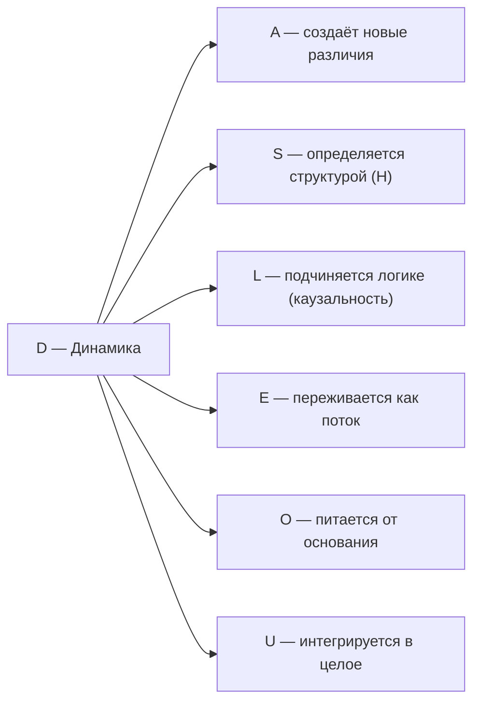

# Измерение III: Динамика (D)

## Функция

**Изменяться, эволюционировать, течь.**

## Описание

Динамика — это непрерывная трансформация Голонома.

:::info Онтологический статус
Динамика — **аспект** конфигурации $\Gamma$, не отдельная сущность. "Голоном динамичен" означает: матрица когерентности $\Gamma$ изменяется во времени, и существует унитарный оператор $U(t)$, описывающий эту эволюцию.
:::

:::warning Связь с аксиомами
При удалении измерения $D$ нарушаются **(AP)** и **(QG)**:
- **(AP):** Нет процесса → нет самовоспроизведения → нет автопоэзиса
- **(QG):** Нет эволюции → уравнение Линдблада не определено

Без динамики Голоном — "замороженный снимок", не живая система. См. [доказательство](../../proofs/theorem-minimality-7#случай-n--2-удаление-динамики-d).
:::

**Время возникает как параметр динамики:** Динамика не "происходит во времени" — время есть мера динамики. Это не метафора, а следствие того, что $t$ входит в теорию только через $U(t)$.

## Математическое представление

Унитарный оператор эволюции (в единицах $\hbar = 1$):

$$
U(t) = e^{-iHt}
$$

Эволюция матрицы когерентности:

$$
\Gamma(t) = U(t) \Gamma(0) U^\dagger(t)
$$

**Связь с гамильтонианом:** Оператор $U(t)$ полностью определяется структурой ($H$). Это **дуальность S ↔ D** — структура и динамика суть два аспекта одного гамильтониана:
- $S$: спектр $\{E_n\}$ (что сохраняется)
- $D$: эволюция $U(t) = e^{-iHt}$ (как изменяется)

## Полное уравнение эволюции

$$
\frac{d\Gamma}{dt} = -i[H, \Gamma] + \mathcal{D}[\Gamma] + \mathcal{R}[\Gamma, E]
$$

### Компоненты:

**1. Унитарная часть** (замкнутая система):

$$
-i[H, \Gamma] = -i(H\Gamma - \Gamma H)
$$

- Сохраняет чистоту $P = \mathrm{Tr}(\Gamma^2)$
- Детерминистическая, обратимая

**2. Диссипативная часть** (открытая система):

$$
\mathcal{D}[\Gamma] = \sum_k \gamma_k \left( L_k \Gamma L_k^\dagger - \frac{1}{2}\{L_k^\dagger L_k, \Gamma\} \right)
$$

- Уменьшает $P$ (декогеренция)
- $L_k$ — операторы Линдблада, $\gamma_k > 0$ — скорости декогеренции

**3. Регенеративная часть** (восстановление):

$$
\mathcal{R}[\Gamma, E] = \kappa(\Gamma) \cdot (\Gamma_{\text{target}} - \Gamma) \cdot \Theta(\Delta F)
$$

- Может увеличивать $P$ (регенерация)
- $\kappa(\Gamma) = \kappa_0 \cdot \mathrm{Coh}_E(\Gamma)$ — скорость регенерации, где $\kappa_0$ — [структурный анзац](../../foundations/axiom-septicity#структурный-анзац-kappa0)
- $\Theta(\Delta F)$ — требует положительного градиента свободной энергии

## Типы динамики

| Тип | Уравнение | Характеристика | $dP/dt$ |
|-----|-----------|----------------|---------|
| Унитарная | $\frac{d\Gamma}{dt} = -i[H, \Gamma]$ | Замкнутая система | $= 0$ |
| Диссипативная | $+ \mathcal{D}[\Gamma]$ | Открытая система | $< 0$ |
| Регенеративная | $+ \mathcal{R}[\Gamma, E]$ | Живая система | $\gtrless 0$ |

## Примеры

| Уровень | Пример | Тип динамики |
|---------|--------|--------------|
| Физический | Колебания маятника | Унитарная (периодическая) |
| Физический | Распад частицы | Диссипативная (необратимая) |
| Биологический | Метаболизм | Регенеративная |
| Биологический | Рост организма | Регенеративная |
| Когнитивный | Поток сознания | Смешанная |
| Когнитивный | Обучение | Регенеративная (изменение структуры) |

## Стрела времени

Направление времени определяется асимметрией динамики:

$$
\frac{dS_{vN}}{dt} \geq 0 \quad \text{(второй закон)}
$$

где $S_{vN} = -\mathrm{Tr}(\Gamma \log \Gamma)$ — энтропия фон Неймана.

Для живых систем возможно локальное уменьшение энтропии за счёт регенерации:

$$
\frac{dS_{vN}^{\text{local}}}{dt} < 0 \quad \text{при} \quad \frac{dS_{vN}^{\text{total}}}{dt} \geq 0
$$

## Связь с другими измерениями

## Когерентность с D

Элементы $\gamma_{Di}$ матрицы когерентности описывают связь динамики с другими измерениями:

| Когерентность | Интерпретация |
|---------------|---------------|
| $\gamma_{DA}$ | Артикулированность изменений (чёткость переходов) |
| $\gamma_{DS}$ | Структурированность эволюции (устойчивость траекторий) |
| $\gamma_{DL}$ | Причинность (логическая связь состояний) |
| $\gamma_{DE}$ | Осознанность процесса (переживание потока) |
| $\gamma_{DO}$ | Связь с источником (питание от основания) |
| $\gamma_{DU}$ | Целенаправленность (интеграция изменений) |

---

**Связанные документы:**
- [Структура (S)](./dimension-s) — предыдущее измерение, дуальность S ↔ D
- [Логика (L)](./dimension-l) — следующее измерение
- [Эволюция](../dynamics/evolution) — детальное описание динамики
- [Теорема о минимальности](../../proofs/theorem-minimality-7) — доказательство необходимости D
